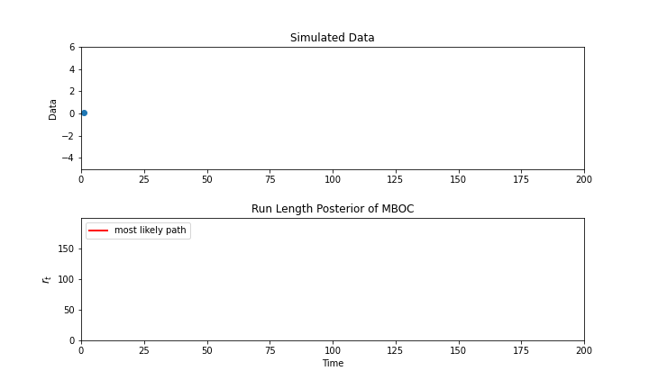

# Score-Driven BOCPD

The repository contains the implementation of the three models; *BOCPD*, *MBO(1)* and *MBOC* that are presented in  used in [Bayesian Autoregressive Online Change-Point Detection with Time-Varying Parameters](https://papers.ssrn.com/sol3/papers.cfm?abstract_id=4902550) by Ioanna-Yvonni Tsaknaki, Fabrizio Lillo, Piero Mazzarisi, 2024. Moreover, these models are also used in [Online Learning of Order Flow and Market Impact with Bayesian Change-Point Detection Methods](https://papers.ssrn.com/sol3/papers.cfm?abstract_id=4500960) by Ioanna-Yvonni Tsaknaki, Fabrizio Lillo, Piero Mazzarisi, 2023.

## Description

#### BOCPD

The BOCPD(Bayesian Online Change-Point Detection) algorithm was first introduced in [Bayesian Online Changepoint Detection](https://arxiv.org/abs/0710.3742) by Ryan Prescott Adams and David J.C. MacKay. It detects change-points in an *online* manner in a univariate time-series. The data within regimes is assumed to be independent and identically distributed.

#### MBO

In the MBO model the data within regimes is assumed to be generated by a Markovian process.

#### MBOC

The MBOC model extends the MBO model by assuming a time-varying correlation. This is accomplished within the Score-Driven framework as in [Optimal Formulations for Nonlinear Autoregressive Processes](https://papers.tinbergen.nl/14103.pdf).

***

The output of the three models is the run length posterior matrix (as well as its plot) and the list of the most likely change-points detected.

##### Example

Let the data stream be generated as:

$$
\begin{array}{ll}
x_t \sim\mathcal{N}(\mu_R,\sigma^2)\\
x_t|x_{t-1} \sim\mathcal{N}(\mu_R+\rho_t(x_{t-1}-\mu_R),\sigma^2(1-\rho_t^2))
\end{array}  
$$

with

$$
\rho_t=\left\{
\begin{array}{ll}
0.5, \quad t<50 \\ 
-0.5, \quad 50\leq t<100 \\
0.5,\quad  100\leq t< 150 \\
-0.5,\quad t\geq 150
\end{array} 
\right.
$$

and within regime $R$, $\mu_R\sim\mathcal{N}(\mu,\tilde{\sigma}^2)$. The arrival of a change-point is modelled as a Bernoulli process.

In the following plot it is demonstrated the run length posterior of the MBOC model as each data point arrives.



To produce the above gif, execute *gif.py* from `demonstration/`. 

## Installation

Use pip:
```bash
pip install ScoreDrivenBOCPD
```
## Usage 

First import the required modules.

```bash
from ScoreDrivenBOCPD.data import Data
from ScoreDrivenBOCPD.prob_model import GaussianModel
from ScoreDrivenBOCPD.sd_bocpd import SDBocpd,Hazard
```
You can use the package either on simulated data or on real data. 
In case of simulated data:

```bash
dt = Data(data_type = "sim")
data,true_cps = dt.update_data()
```

For real data, the data should be in a csv file with only one column and you should indicate its file name.

```bash
dt = Data(data_type = "real",file_name = "some_file_name.csv")
data = dt.update_data()
```

The hazard rate should also be defined, e.g. if we wish to set the hazard rate equal to $1/100$ then

```bash
T = len(data)
hazard = Hazard(T,1/100)
```

Then the probabilistic model (in our case the Gaussian model) should be defined

```bash
#initialize the parameters
mean0 = 0 # the mean of the prior mean 
var0 = 1 # the variance of the prior mean
var = 1 # is the variance of the data, for the BOCPD,MBO models is assumed to be known for the MBOC is simply an initial value that is updated
cor = 0.1 # the correlation of the model, if not specified the default value is 0
lamda = [0, 0.01, 0.9, cor, 1] # the parameters for the Score-Driven model
q = 1 # for q=1 it is implementd the MBOC model, for q=0 the BOCPD and for q=1/2 the MBO

model = GaussianModel(mean0,var0,var,lamda,q,cor)
```

Finally, to initialize the model

```bash
d = 1/2 # or d = 0, is the exponent in the Fisher matrix
sdb = SDBocpd(T,d,q)
```

to get the run length posterior matrix and the most likely change points for real data

```bash
run_length_posterior, most_likely_cps = sdb.bocpd(data, model, hazard)
```

and for simulated data

```bash
run_length_posterior, most_likely_cps = sdb.bocpd(data, model, hazard, true_cps)
```

## Acknowledgment

## License
This project is licensed under the terms of the MIT license.
