# Algorithmic Trading DMA

An introduction to direct access trading strategies

# Algorithmic Trading & DMA

An introduction to direct access trading strategies.

By Barry Johnson

Copyright © 2010, Barry Johnson. All rights reserved.

Published by 4Myeloma Press, London.

No part of this book may be reproduced, stored in'a retrieval system, or transmitted by any means, electronic, mechanical, photocopying, recording, or othcrwise, without writen permission from the copyright holder. Permissions may be sought on-line via the book's homepage (http://www.algo-dma.com) by selecling "Contact'" then "Ohtaining Permissions".

The copyrights for all the material taken from external sources belong to their respective owners. Permissions must be sought from the corresponding owners for the reproduction of any such material.

Any brand names or product names used in this book may be trade namcs, scrvice marks, trademarks or registered trademarks of their respective owners.

This publication is intended to provide helpful and informative material on the subject matter covcred. If professional advice or other expert assistance is requircd, the serviccs of a competent financial professional should be sought.

Although cvery precaution has been taken in the preparation of this book, thc author and publisher assume no responsibility for any errors or omissions. The author and publisher also disclaim any responsibility for any liability, loss, or risk, pcrsonal or otherwise, which is incurred as a consequence, dircctly or indirectly, of the usc and application of any of the contents of this book.

For more information on this book visit the website at www.algo-dma.com

Printed in the United States.

In memory of my mother.

To my father.

Please donate to www.myeloma.org.uk or www.themmrf.org

Myeloma (also known as multiple myeloma) is a type of cancer that affects the bone marrow's plasma cells. These cells are responsible for the production of antibodies for the iminune system.

There is currently no cure for myeloma, but research is on-going to develop new treatments to slow its progress and improve patients' quality of life.

Myelona is the second most common blood cancer, but funding for research and support is still a lot lower than other better-known cancers, so every donation can make a real difference.

# Contents

# Preface

# xli

Part I An overview of trading and markets

1 Overview

1.1 Introduction   
1.2 Fundamentals   
1.3 Core execution methods   
1.4 Institutional trading types   
1.5 Electronic trading   
1.6 Algorithmic trading Types of trading algorithms The evolution of trading algorithms   
1.7 Direct Access Trading Direct Market Access Sponsored access Crossing Direct Liquidity Access Direct Strategy Access

1.8 Comparing execution methods Efficiency Usability Performance /Cost Other reasons

1.9 How much are these execution methods used?

1.10 Fears and myths Safety of algorithmic trading Performance of algorithmic trading Usefulness of algorithmic trading

1.11 Summary

# 2 Market microstructure

2.1 Introduction   
2.2 Fundamentals Market function Participants Liquidity

2.3 Market structure and design Types of markets Order types Trading Protocols

Transparency After-hours and offmarket trading Other important market design features

2.4 Trading mechanism research Price formation Price discovery/ trade execution Reporting, clearing and settlement   
2.5 Transaction cost measurement and analysis Cost measurement Analysing the components of transaction costs   
2.6 Summary

# 3 World markets

3.1 Introduction   
3.2 Asset classes Equity Fixed income Foreign exchange Money markets Derivatives Other asset classes   
3.3 Market structure Inter-dealer markets Dealer-to-client markets Alternative markets   
3.4 Global market trends Electronic trading Transparency Accessibility Centralisation versus fragmentation   
3.5 Global market comparison Overall size Average daily turnover Adoption of electronic and algorithmic trading   
3.6 Summary

# Part II Algorithmic trading and DMA strategies

81

# 4 Orders

4.1 Introduction   
4.2 Market orders   
4.3 Limit orders   
4.4 Optional order instructions Duration instructions Auction/Crossing session instructions Fill instructions Preferencing and directed instructions Routing instructions Linking Instructions Miscellaneous instructions

4.5 Other order types Hybrid order types Conditional order types Hidden order types Discretional order types Routed order types Crossing order types Order-contingent order types

96   
96   
98   
100   
103   
106   
108   
109   
112

4.6 Summary

# 5 Algorithm overview

# 115

5.1 Introduction   
5.2 Categorising algorithms   
5.3 Common features of algorithms Algorithm parameters   
5.4 Impact-driven algorithms Time Weighted Average Price (TWAP) Volume Weighted Average Price (VWAP) Percent of Volume (POV) Minimal impact   
5.5 Cost-driven algorithms Implementation Shortfall (IS) Adaptive Shortfall (AS) Market Close (MC)   
5.6 Opportunistic algorithms Price inline (PI) Liquidity-driven Pair trading   
5.7 Other trading algorithms Multi-leg Volatility-driven Gamma Weighted Average Price (GWAP)   
5.8 Summary

# 6 Transaction costs

# 161

6.1 Introduction 161   
6.2 The investment process 162   
6.3 Pre-trade analysis 165   
Price data 165   
Liquidity data 166   
Risk data 166   
Transaction cost estimates 167   
6.4 Post-trade analysis 167   
Performance analysis 167   
Post-trade transaction costs 172   
6.5 Breaking down transaction costs 173   
Investment-related costs 175   
Trading-related costs 176   
Summary 184   
6.6 Transaction costs across world markets 184

6.7 Summary 186

# 7 Optimal trading strategies 189

7.1 Introduction 189   
7.2 Assessing the difficulty of orders 190   
7.3 Selecting the optimal trading strategy 192   
The efficient trading frontier 192   
Choosing the benchmark 194   
Determining the level of risk aversion 196   
Choosing a trading goal 196   
Determining the optimal trading horizon 198

7.4 Choosing between trading algorithms Mapping algorithms to the efficient trading frontier Factors affecting algorithm choice Other requirements for trading algorithms

7.5 To cross or not to cross? 211   
7.6 Market conditions during the 2007-09 financial crisis 213   
7.7 A decision tree for strategy selection 214   
7.8 Summary 217

# Part I Implementing trading strategies

219

# 8 Order placement 221

8.1 Introduction 221   
8.2 Price formation 222   
Valuation 222   
Models of price formation 223   
8.3 Price discovery/Order matching 226   
Continuous matching 226   
Cal-based matching 231   
8.4 Order placement decisions 234   
Signalling risk 234   
Venue choice 235   
Order choice 237   
Order aggressiveness 237   
Market factors affecting order placement decisions 238   
8.5 Dealing with hidden liquidity 247   
Spotting hidden liquidity 248   
Estimating the probability of hidden liquidity 250   
8.6 Estimating execution probability 252   
8.7 Summary 254   
9 Execution tactics 257   
9.1 Introduction 257   
9.2 Designing execution tactics 258   
Impact-driven tactics 259   
Price/Risk-driven tactics 262   
Opportunistic/Liquidity-driven tactics 265   
9.3 Algorithm selection 270

Factors affecting the choice of execution tactics 9.4 Summary

10 Enhancing trading strategies

10.1 Introduction   
10.2 Forecasting market conditions Predicting asset prices Predicting trading volume Predicting liquidity Predicting volatility   
10.3 Estimating transaction costs Market impact Timing risk   
10.4 Handling special events Predictable events Unpredictable events   
10.5 Summary

# 11 Infrastructure requirements

11.1 Introduction   
11.2 Order management Order entry Order routing   
11.3 Algorithmic trading Infrastructure requirements for algorithmic trading Designing an environment for algorithmic trading Implementing trading rules Testing   
11.4 Other requirements Clearing and settlement Regulations compliance   
11.5 Summary

# Part IV Advanced trading strategies

339

# 12 Portfolios

12.1 Introduction   
12.2 Portfolio risk Portfolio volatility Diversification Decomposing portfolio risk Portfolio risk measures   
12.3 Transaction cost analysis for portfolios Market impact Timing Risk   
12.4 Optimal portfolio trading Additional goals for portfolio trading Hedging Minimising the overall portfolio risk

341   
341   
342   
342   
345   
346   
349   
351   
351   
352   
352   
354   
354   
359

12.5 Portfolio trading with algorithms Portfolio trading with standard trading algorithms Tailoring algorithms for portfolio trading

12.6 Summary Addendum A: Covariance

# 13 Multi-asset trading

13.1 Introduction   
13.2 Multi-asset trading strategies   
13.3 Utility strategies FX cash trades Covering short sales   
13.4 Structured strategies Principal protected notes   
13.5 Hedging strategies Hedging market risk Hedging interest rate risk Hedging derivative risk factors (the "Greeks")   
13.6 Arbitrage strategies Multiple isting/depositary receipt arbitrage Basis trading Index arbitrage ETF Index Arbitrage Option arbitrage Futures and options arbitrage Dividend arbitrage

13.7 Adapting algorithms for multi-asset trading Factors to consider for mult-asset trading algorithms Minimising risk Trading algorithm choice

13.8 Summary

# 14 News

401

14.1 Introduction   
14.2 Types of news Macroeconomic news Corporate news   
14.3 The changing face of news Digitisation of news Digitisation of corporate reports/research Changing sources of news   
14.4 Computerised news handling techniques News filtering News association News analysis News interpretation News mining

14.5 Market reactions to news Reactions to macroeconomic news Reactions to corporate news/announcements

Other factors which affect the impact of news 14.6 Incorporating news into trading strategies Precautions for automated news handing Potential news-based indicators News-based algorithms

14.7 Summary

427   
432   
432   
433   
436   
437

# 15 Data mining and artificial intelligence

15.1 Introduction   
15.2 Data mining Data mining techniques Finding patterns/associations   
15.3 Artificial Intelligence Types of artificial intelligence Predicting data and trends   
15.4 Incorporating in trading strategies Applying short-term forecast models Generating trading strategies/rules/parameters Back-testing   
15.5 The future

15.6 Summary

# Epilogue

# Appendices

A Equity markets B Fixed income markets C Foreign exchange markets D Money markets E Derivatives markets F Other markets

473   
474   
495   
504   
509   
515   
534

# Abbreviations & Acronyms

543

# References

545

# Index

Preface

Trading is still very much an art rather than a science.

The lundamentals of trading have not changed for decades (if not millennia). However, the modcrn trading environment bears very litle resemblance to that of the 1980s, or even the carly 1990s. Elcctronic trading has transformed the markets, making thcm more accessiblc than ever before. Tools like Direct Market Access (DMA) and algorithmic trading give investors a lot more control over how their strategics are executed. For instance, DMA enables investors to send orders to exchanges, using their broker's infrastructure.

Acccssibility is great, but good traders are a special breed; they have a lot of expcrience and detailed market knowledge. Algorithmic trading distils some of this knowledge into prepackaged rule-sets, or algorithms. A computerised system is responsible for executing orders by strictly following thesc rules, offcring an efficient alternative to manual trading.

In order to get the maximum benefit from tcchnologies like algorithmic trading and DMA it is vital to have a thorough understanding of them. Hopefully, by reading this book you should end up with a good fundamental knowledge of both of these topics, as well as trading and markets in gencral.

# Who should read this book?

Algorithmic trading encompasses trading, quantitative analysis and computer programming. Hencc, this book is targcted towards all three areas. It should serve as a good introduction for any investors, traders, salespeople, analysts, quantitative analysts (quants), or softwarc developcrs who are new to this field.

The aim is to take the reader from the ground up, so very little knowledge of the markets or trading is assumed. There are also no requirements for any programming knowledge. We will rcvicw trading algorithms in some detail, but tablcs and diagrams will be used lo illustrate their function rather than snippets of code. Similarly, whilst there is some mathematics in this book, it is not a mathematical text, so formulas are provided only where relevant. Examplcs are uscd to keep the math in context. Rcfcrences are given for those who might want to find the actual proofs.

Another aim of this book is to try to help bridge some of the gaps between the practice of trading and the theory. A phenomenal amount of rescarch has been carried out into trading and markets. Digitisation has mcant that huge amounts of data are now available for study. The fields of econophysics and "phynance'" are also busily applying advanced techniques from physics to analyse the markets. Some of these studies are highly theoretical; however, there is also a large amount of empirical research, based on data from the world's major markets. Throughout this book there are sections providing reviews of relevant research and showing how this might be applied in practice. Referenccs to key academic papers are given, so it is also a good starting point for more advanced research.

A wide range of financial assets may be traded on the world's markets. One of the most intercsting things about algorithmic trading and DMA is their potential to span across asset classes, catering for anything from stocks and bonds to dcrivatives. Hence, this book provides coverage for all the major types of asset, together with a thorough ovcrvicw of the world's markets. Obviously, there is a slight bias towards equities, since thcsc continuc to lead the way in terms of adoption. Even so, there is a lot to be learned from other asset classes. So throughout this book examples will refer to asset XYZ, only discussing cquities, bonds or derivatives when there are distinct differences.

# An outline of the book

The book is divided into four main parts. The first two parts offer a general overview of trading and markets followed by a more detailed review of algorithmic trading and DMA. The last two parts offer an in-depth look at the implementation of these trading strategics together with a summary of some advanced trading techniques. Experienced users may prefcr to skim over the first parts, whilst readers who just want an introduction should focus on parts I and II and perhaps part IV.

# Part I: An overview of trading and markets

These chapters set the scene with a broad overview of the world's major asset classes and a summary of their respective markets. Market microstructure is also introduced to help highlight the main structural differences between the world's markets.

Chapter 1 introduces algorithmic trading and direct market access, highlighting their roles as core execution methods for institutional trading. After a brief review of cach of thcse mechanisms, thcy are compared in terms of their efficicncy, usability and perlormance. Some of the fears and myths, which have gathered around the use of algorithmic trading, are also addressed.

Chapter 2 introduces the theory of market microstructure, which focuses solely on the mechanics of trading, unlike economics or asset pricing. A basic grounding in this underlying theory is useful, allowing us to take advantage of the empirical rcsearch that has been carriced out, and to appreciate the fundamental differences betwcen the world's markets. The key components of market structurc and design are discussed, bcfore analysing the trading process in more detail. The principles behind transaction cost analysis are also introduccd.

Chapter 3 rounds off the introduction by reviewing the world's major asset classcs and their respective markets. Trading has been dividcd by asset class for decades. Still, over the last few years institutions have increasingly started to break down the walls, bringing them closer together. This is not a casc of "one size fits all"; there are still huge differences between many of the world's markets, but there many common trends as well. There are also important lessons that they can learn from cach othcr.

# Part I: Algorithmic trading and DMA strategies

The second part of the book concentratcs on the specifics of algorithmic trading and DMA. This starts with orders since these are the basic building block for all trading strategics. Next, trading algorithms are reviewed in morc detail. Transaction cost analysis is then revisited, leading on to consider how to find the optimal trading strategy.

Chapter 4 focuses on orders. These may simply represent trade instructions, but there are a huge variety of different order types heyond the standard market and limit orders. Optional conditions allow control over factors such as how and when the orders become active and for how long. With markets increasingly comprising of multiple venues, the rules for order routing are also a key consideration. A detailed understanding of the mechanism and variety of order typcs and conditions is vital for both DMA and algorithmic trading.

Chapter 5 covers the various types of trading algorithm in more detail. They are classified using three main types, namely impact-driven (e.g. Volume Weighted Average Price (VWAP)), cost-driven (e.g. implemenlation shortfall) and opportunistic (e.g. liquidity sceking). For each algorithm, we examine their basic mechanism and discuss common variations. To enable comparison, a standard example order is used throughout. This, combined with charts showing the potential trading patterns, highlights the differences (and similarities) hetween the various algorithms.

Chapter 6 concentrates on the importance of transaction cost analysis. Costs have a significant cffect on investment returns; therefore, both pre and post-trade analysis are vital. An cxample trade is used to decompose the transaction costs into their key components, such as market impact and timing risk. To put this in perspective, some comparisons of costs across the world's markcts are provided.

Chapter 7 goes on to consider how the optimal trading strategy mighl be sclected. A framework for trading decisions is examined; this assesscs orders in terms of their difficulty. The impact of investment decisions/rcquirements, such as benchmarks or risk aversion, is also considered. The "trader's dilemma"” of balancing the trade-off between cost and risk is visualised using the efficient trading frontier. This is then applied to the selection of trading algorithms. The effect of both requirements and asset-specific factors, such as liquidity and volatility, are then reviewed. A potential decision tree for algorithm selection is then proposed.

# Part II: Ilmplementing trading strategies

The third part of the book focuses on the specifics of implementing algorithmic trading and DMA strategics. The decisions relatcd to order placcment are discusscd, as well as the common tactics that may be used to achieve the goals of algorithms. Methods for enhancing the performance of thesc stralcgics arc then reviewed. The lechnological aspects of implementing these strategics are also considered.

Chapter 8 considers the intricacies of order placement. A considerablc amount of market microstructure rescarch has analyscd how market conditions affccl order placement decisions and cxccution probability.

Chapler 9 discusses execution tactics. These provide common order placement mechanisms to achieve the goals of trading algorithms. Based on the theory of order placemenl, common tactics/mechanisms are then described together with a summary of how they might be uscd by trading algorithms.

Chapter 10 considers some of the ways in which the performance of trading algorithms may be enhanced. To help make these strategies more proactive, short-term forecasting models for key market conditions, such as price, volume and volatility, are considered. There is also a review of cost estimalion models for more cost-driven algorithms. Another potential area for improvement is the handling of specific events such as witching days or trading halts. Empirical market microstructure studies are reviewed to give an insight into how predictable the reactions to such events might be.

Chapter 11 reviews the main considerations for actually implementing trading strategies, with a focus on the required technology. Clearly, order management is a key component, so the mechanics of order entry and routing are described. The requirements for developing platforms for electronic trading strategies are then reviewed. The implementation and testing of trading rules is also discussed.

# Part IV: Advanced trading strategies

The final part of the book focuses on techniques that are closer to the cutting edge, in terms of algorithmic trading, such as portfolio and multi-asset trading, handling news and artificial intelligence. All of these subjects are being tackled at present in one form or another; it is only a matter of time before they become as common as VWAP or implementation shortfall.

Chapter 12 highlights the potential for portfolio trading. Portfolio risk and diversification are discussed in more detail, together with a review of some common portfolio risk measures, such as beta and tracking error. Next, some additional goals for optimal portlolio trading, e.g. hedging and cash balancing, are examined. Based on this, the use of standard algorithms is considered, followed by a review of how best to tailor trading algorithms for portfolio trading.

Chapter 13 considers the potential for multi-asset trading. This ranges from straightforward approaches, such as incorporating cross currency execution, to more complex hedging and arbitrage. Hedging provides a mechanism for offsetting risk, generally via derivatives. Arbitrage extracts profis from mispricing bet ween assets, and relies on hedging to stay risk-frce. After looking at some examples, the chapter ends with a summary of additional considerations for multi-asset trading algorithms.

Chapter 14 examines the potential for incorporating ncws into trading algorithms. The main issue with this is the difficulty of accurately interpreting ne ws. Complex artificial intelligence and natural language processing techniques are being employed for this. The impact of news and information flow has also been a key topic for microstrueture rescarch. Therefore, a summary of market reactions to news in terms of market conditions, such as price, volume and volatility, is provided. These may he used to enhance existing algorithms' performance when news breaks; more news-centric algorithms are also discussed.

Chapter 15 shifts the focus to data mining and artificial inteligence (Af). These techniques may be used to search for relationships between assets, often by analysing historical time serics data for prices, volume etc. Potentially, they offer a means of shorterm forecasting that may give better results than purely statistical measures, even in volatile markets. They may also be used for testing trading strategies and their associated parameters.

# Appendices: A review of world markets by asset class

The appendices provide an overview of each of the major asset classes and their main markets. The focus is on their adoption of electronic trading and the provision of algorithmic trading and DMA. The regional dilferences between the Americas, Europe and Asia are also examincd.

# About the author

My background is software development, having spent more than twelve years working in major invcstment banks. Most of my experience is in electronic trading and risk analysis, spanning platforms for algorithmic and portfolio trading, as well as some for proprietary trading. The main focus has been equities, although listed derivatives, foreign exchange and fixed income have also played a part. The book evolved out of my desire to understand how market microstructure could be applied to create more efficient trading algorithms.

# Acknowledgements

This book is based on a wide range of sources. It would not have been possible without all the information which other rescarchers and firms have made available through their own endcavours. In particular, thanks must go to all the researchers, firms and publishers who have given permission to use figures from their publications, as well as all the individuals who gave leedback on the various drafts. This project is also indebted to services such as the Social Science Rescarch Network (SSRN) and Google Scholar, which made finding research so much casier.

# Part I

An overview of trading and markets

This first part of the book sets the scene with a general overview of algorithmie and direet aeeess trading. It also provides a brief review of the world's major asset elasses and their respeetive markets.

• Chapter I eovers the corc exeeution methods that are used in institulional trading and details how and why algorithmie and direet access trading developed.   
• Chapter 2 introduees market microstrueture, the theory for the mechanics of trading. This highlights some of the fundamental differences between the world's markets.   
• Chapter 3 offers a brief overview of all the world's major asset elasses and their markets. More detailed reviews are provided for each assel class in the appcndices.

Hopefully, by the end of these three ehapters you should have a broad appreciation of thc world's markets and trading in general. You should also havc a clearer view of algorithmie and direet access trading and their use in the world's markcts.

# Chapter 1

# Overview

Algorithmic trading is simply a computerised rule-based system responsible for executing orders to buy or sell a given asset.

Direct Market Access (DMA) enables clients to send orders to exchanges by using their broker's membership.

# 1.1 Introduction

Algorithmic trading and Direct Market Access (DMA) are important tools for the electronic trading of fi nancial assets.

Nowadays, a bewildering array of assets can be traded electronically. Stocks and bonds, cash, certificates and a variety of derivatives contracts may all be bought and sold just at the push of a button. The technology to achicve this is slill relatively new, but the fundamental market mechanics of buying and selling remain the same. Put simply, sellers need to find buyers (and vice-versa) as quickly and cfliciently as possible. Corporations and governments issuc assets in ordcr to raise the cash (or capital) required to meet their nceds. Likewise, investors and spceulators must be able to easily buy and sell assets in order to see a return from their capital.

Over time, the world's markets have evolved to accommodate the dilfering requirements of both the issuers of financial assets and those who invest in them. The ease with which such trading takes place is commonly referred to as liquidity: Highly liquid markets (or asscts) are more active and so usually much easier and cheaper to trade in. To improve liquidity, dedicated trading venucs, such as exchanges, have often been established. However, there may not always be a natural buyer or seller to trade with, so markets also rely on intermediaries to "grease the whecls": Specialised traders, or dealers, trade for a set price with the aim of making a short-term profit. Brokers act as agents to place their clients' orders with the dealers, or match them with other clients' orders. Since both brokers and dealers facilitate the issuance and selling of assects they are often referred to as the "sellside". In turn, institutional investors are often called the "buy-side".

To illustrate the trading process, Figure 1-I shows some example trade flows from thc point of view of an investor. Traditionally, a buy-side initiated trade is placed as an order with a broker's salcsperson who must then communicate the order to a trader (or dealer). In turn, the trader would then either quote a price to trade against their own inventory or alternatively work the ordcr on an exchange. This is shown as the pathway labelled A in Figure 1-1. Electronic trading simply offers a means of issuing such orders via computers.

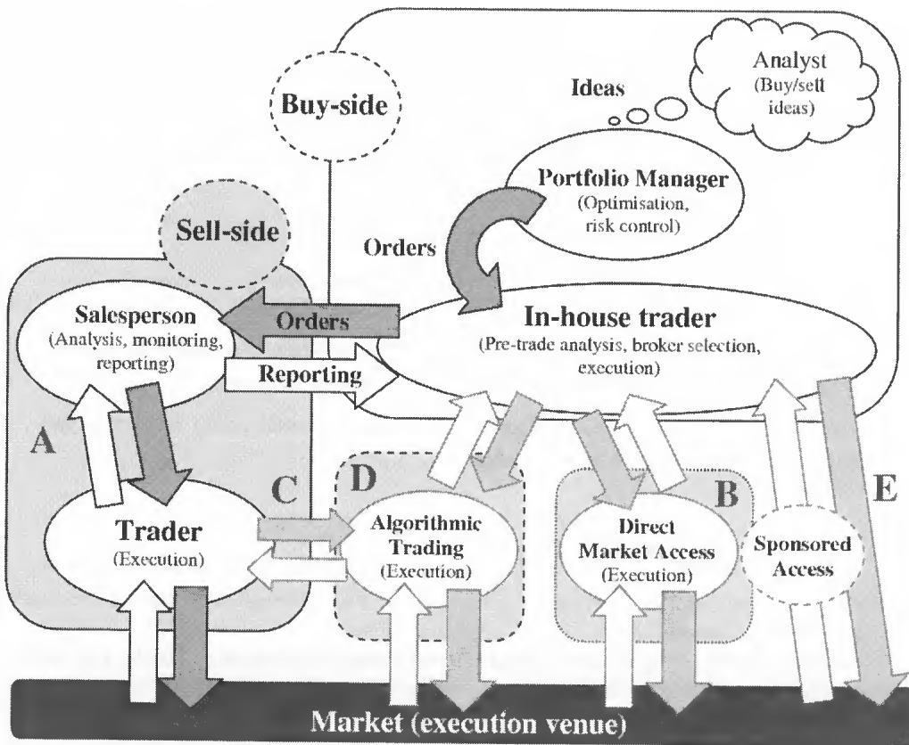  
Figure 1-1 A comparison of the different order execution methods

Direet Market Access (DMA) is wherc brokcrs allow clients access to their ordcr routing infrastructure, as shown by pathway B. This allows the buy-side to issuc their electronic orders almost directly to the exchanges, effectively giving them much the same level of control over an order's execution as a sell-side trader has. Sponsored access takes this to the next level, for clients whose high-frequcney trading stratcgies need ultra-low latency connections. Esscntially, this allws clients to connect directly to the market, as shown in pathway E, using the broker's trading identifier, but their own infrastructure. Alternatively, the buy-side can organise membership of the specific market and so have native access.

Algorithmic trading takes a slightly different approach to DMA: A computerised system is responsible for executing the orders to huy or sell a given asset, rather than bcing worked manually by a trader. So a computer program follows preset rules to determine how each order should be exccuted. Based on these rules, it splits off portions (or child orders) to send to the market, often tracking market conditions and events. Initially, such trading algorithms were used as a labour-saving device for busy scll-side traders, labelled pathway C in Figure 1-1. As these algorithms hecame more established, brokers started to offer their buy-side clients direct access to them, shown by pathway D. Together with DMA, allowing clients access to trade on markets in this way is also known as Direct Access Trading.

It is important to note that all of the labelled pathways in Figure 1-1 are only concerned with executing a given ordcr. The actual investment decision is a completely separate process. In this case, it is shown as an idea from a buy-side analyst; it is this idea that leads to the dccision to trade. This is then analysed and approved by the portfolio manager before heing translated into an actual order to buy (or sell) a set quantity of asset XYZ. The order is then usually passed on to an in-house trader who decides on the most appropriate approach and on which broker/s to use. Alternatively, for more quantitative investment funds the order may well be generated by an automated system. Either way, algorithmic trading, DMA and the sellside trader are all just a means to execute this order; hence, we can also refer to them as core execution methods.

In some ways, the term algorithmic trading is an unfortunate choice, particularly for such use by institutional investors. Trading tends to make people think of dealers buying low and selling high. Whereas the algorithmic trading systems, which are offered by the major hrokers, only cxccute the orders they are given, as Figure 1-1 tries to show. Perhaps a more representative name for this process is "algorithmic execution'".

Clearly, there are cxceptions to cvery rule; there are no major technical reasons why trading algorithms could not also incorporate investment decisions. Indeed, as the buy-side starts to develop their own algorithms this may well become more commonplace. However, the main aim of this book is focus on how algorithms and DMA may be used to enhance order execution.

Over the last few years, algorithmic trading has become a hot topic. New reports keep predicting an increasing global market share, which is expanding from cquities to foreign cxchange, futures and options and even bonds. There has also been bad press; some headlines have foretold the end of trading, as we know it. Whilst the start of the sub-prime crisis in the summer of 2007, saw "algorithmic trading" blamed for both market volatility and some firms realising huge losses. Volatility is certainly higher; in part, this is due to the increase in speed achieved by electronic and algorithmic trading. However, any losses that firms have made are generally due to their investment strategy. If this is not suitable for the market conditions then losses will be realised. Algorithmic trading is the bullet, not the finger on the trigger. In section 1.10, some of the common fears and myths surrounding algorithmic trading will also be examined (and hopefully debunked).

Before we move on to consider each of these corc exccution methods in more detail, let's brielly review some fundamentals, such as risk, return and costs, from the perspective of both an investor and a trader.

# 1.2 Fundamentals

Investment theory tries to maximize profits and minimize risk by carefully choosing different assets. Arguably, the best known approach is modern portfolio theory (MPT) pioneered by Harry Markowitz (1952).

Modern portfolio theory models profits from the returns (or price changes) in a portfolio of financial assets. Volatility is often used as a proxy for the overall risk; this represents the standard deviation of the returns. Assets with higher returns are generally riskier. Portfolios can be made up of an almost infinite set of compositions, using a range of assets with various weightings. Plotting the risk-return characteristics of these allows an eficient frontier to be constructed, as shown in Figure 1-2 (a). This is the upper edge of the shaded region; it represents the portfolios with the highest returns for a given amount of risk. Conscquently, an investor must focus on the overall makeup of their portfolio, as much as the risk and returns for individual assets.

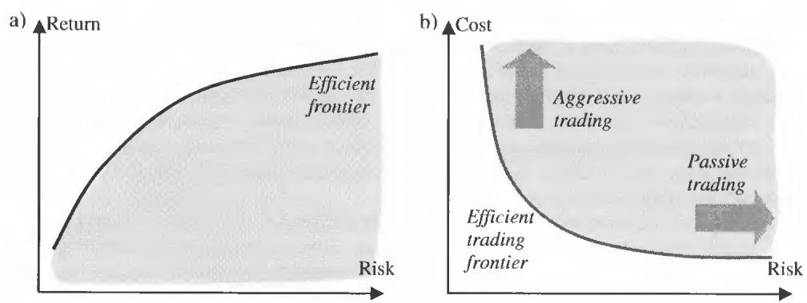  
Figure 1-2 A difference in perspective

In order to build up this optimal portfolio we need to buy or sell the specific assets, and so send order/s to broker/dealers or direct to the markets, as we saw in Figure 1-1. Risk (or volatility) is again important, since it shows how much each asset's price might change by. However, returns are somewhat less important, since we are now focussed on executing the given order/s, often in the next second/s, minute/s or hour/s. Instead, cost becomes more important, as shown in Figure 1-2 (b). Executing each order has an associated cost, from the impact it has on the asset's price to broker and exchange fccs. Trading faster with large or aggressively priced orders will generally have more impact and so cost more, although the speed of execution reduces the risk. Whereas trading more slowly or passively costs less but exposes us to risk from the asset's price volatility. This is what Robert Kissell and Morton Glantz (2003) refer to as the trader's dilemma. Striking the right balance between cost and risk is a question of taking into account the investor's priorities, as we will see in Chapter 7; it can be the key to achieving optimal execution.

# 1.3 Core execution methods

Institutional rading can broadly be classificd as either agency or principal trading. In agency trading, the broker acts as a conduit to the market, as we saw in Figure 1-1. The client may also give trading instructions, such as to execute throughout the day or target a specific benchmark price or a certain percentage of the market volume. With principal trading, the broker/dealer agrees an up-front price for the asset, which they will fulfil either from their own inventory or by executing on the markets. Since principal trading is carried out with a specific dealer, rather than at an exchange, this is also referred to as "over-the-counter" (OTC) trading.

In terms of risk, the client is exposed to the market with agency trading. The price may move favourably (or not), there is also the possibility that the order may fail to be completed. The broker will strive to achieve best execution for the client, but at the end of the day they are aeting as an agent for the client, they do not take on any of the risk. In comparison, with principal trades the risk is transferred immediately to the broker/dealer. Consequently, principal trading is more expensive because the dealer tries to offset this by incorporating it in the negotiated price. The investor must dccide whether the up-front costs are worthwhile compared to the potential market risk.

In general, both types of trading are supported for most equities and for the standardised (or listed) futures and options contracts, which are traded on exchanges. The bond and foreign cxchange markets have tended to be based more on dealers (or market makers), and so principal or OTC trading is more common (although agency trading is sometimes available for the more liquid assets).

Hence, the final destination for orders in Figure 1-1 also depends on the asset being traded. Algorithmic trading and DMA are generally only viable options when there is a wellestablished secondary market, such as an exchange. So direct access trading has historically centred on stocks and futures. Although algorithmic trading and DMA are rapidly spreading to most of the major asset classcs, as we shall see in Chapter 3.

Agency trading may also be classilied based on the execution method used to achieve it. "High-touch'" trading is where orders are worked manually by a trader. Algorithmic trading is sometimes referred to as "Low-touch" trading, since it requires little or no handling by actual traders and so can be offered as a lower cost agency service. The final picce of the puzzle is DMA, which is also referred to as "Zero-touch'. With DMA the broker's own electronic access to markets is extended out to their clients. The sell-side traders have nothing to do with the order; instead, the execution is handled manually by the client.

The increasing focus on transaction costs by the buy-side has meant a decline in the more traditional "High-touch" trading. Still, all thesc methods are in fact complementary, since they are lrying to mect the same objectives, as Figure 1-3 tries to show.

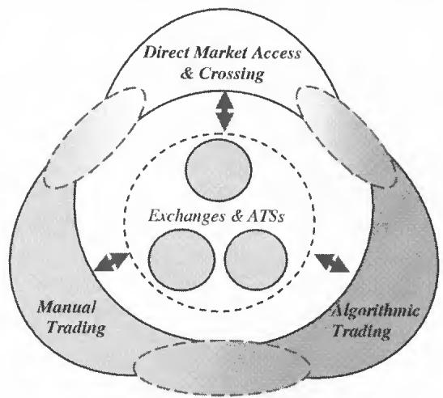  
Figure 1-3 The range of core execution methods

Both buy (and sell-side) traders now have a wider choice of execution method than ever before. They can take complete control of the execution by using DMA (or native access), or they can delegate it to an algorithmic trading system. Vendors are even working on systems that allow traders to "pick and mix". For instance, Ncovest's AlgoGenetics allows "metaalgorithms'" to he created which can combine algorithms from a range of brokers together with DMA orders.

Continual evolution and the adoption of similar tactics mean that the boundaries between these methods are constantly blurring. For example, increasingly complex DMA order types, such as iceberg orders and smart order routing, are making it more dificult to differentiate between pure DMA and algorithmic trading.

Another example of the constant evolution of trading strategics is crossing. Block trading is a specialisation for handling large orders of single assets. The advent of platforms such as ITG's POSIT allowed investors to participate in clectronic crossing, rather than use brokers' block trading desks for such orders. This trend has continued with the success of the socalled "dark pools" of liquidity offered by the hidden crossings of Alternative Trading Systems (ATS). Although the probability of execution is lower than a broker-mediated block trade, these approaches offer the potential of getting a better price. As with DMA, it is the client's responsibility to manage these orders. Therefore, crossing is shown together with DMA in Figure 1-3. Sourcing liquidity via these "dark pools" has also become extremely important for algorithmic trading.

# 1.4 Institutional trading types

In the previous section, we focussed on the methods used to actually exccute orders. The orders themselves are invariably sourced from the buy-side, in other words institutional or hedge fund investors, as part of their overall trading strategy. Figure 1-4 shows the broader range of trading types, which are widely adopted by different kinds of investors.

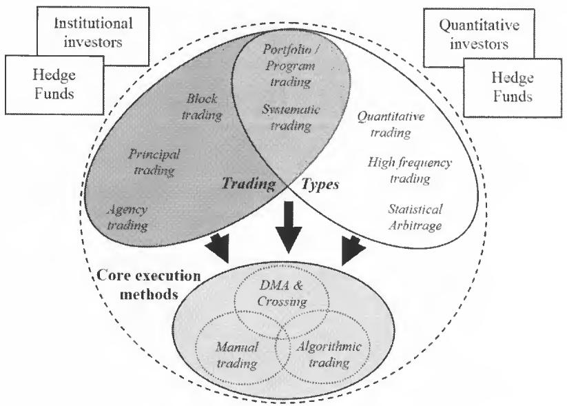  
Figure 1-4 Different trading types

Traditionally, institutional investors, such as investment and pension funds, maintain large portfolios with specific investment criteria. Orders are generated when they need to change the make-up of their portfolios. For single assets, they may choose to trade in either an agency or a principal fashion, whilst block trading may be used for larger orders.

Quantitative investment funds adopt more highly automated srategies, as do some hedge funds. For those targeting short-term arbitrage opportunities or generating revenue by market making, this means much higher trading frequencies. So they are even more focussed on low-cost execution methods, such as algorithmic trading and DMA.

Portfolio trading is somctimes referred to as basket or program trading. It provides investors with a cost-effective means of trading multiple assets, rather than having to trade them individually. Typically, this is used when they need to adjust or rebalance their portfolios. The trading list represents the assets that must be bought or sold to transform the investor's current portfolio to their desired target. Portfolio trading is a broker provided service, which allows for cconomics of scale, and so it gencrally offers a cheaper alternative for handling such transitions. As with single stock institutional trading, the investor may choose to negotiate a principal trade with a broker/dealer, or have a broker trade the list in an agency fashion. We will revisit this topic in more detail in Chapter 12.

Systematic, black-box, quantitative and high frequency trading are terms which all sound like references to algorithmic trading, and are sometimes mistakenly used as such. However, they have as much to do with the style of investment as the actual trading. In fact, they are all forms of systematic trading (or investment), and are sometimcs referred to as Automated trading. Predominantly, these strategies are adopted by either quantitative investors or proprictary trading desks.

Systematic trading, as its name suggests, is all about consistently adopting the same approach for trading. This may be used to dictate points for trade entry and exit, for instance by comparing market prices with boundary conditions, c.g. Bollinger bands. Alternatively, it may require an intricate set of rules, which accommodate a wide range of intraday conditions such as price, volume or volatility.

Quantitative trading (sometimes referred to as "Black-box" trading) is often confused with algorithmic trading. Here the trading rules are enforced by adopting proprictary quantitative models. 1 The differencc is fairly subtle, but quantitative trading systems instigatc trades whereas algorithmic trading systems merely execute them. Thercfore, quantitative trading systems need to focus on a wider range of goals in addition to the actual execution strategics. These may range from tracking indicators to determine trade initiation and closcout, to monitoring the overall portfolio risk.

High frequeney trading aims to take advantage of opportunities intraday. The time scales involved range from hours down to seconds or cven fractions of a second. Effectively, it is a specialised form of black-box/quantitative trading focussed on exploiting short-term gains. Some high frequcncy strategies adopt a style similar to a market maker, trying to kecp a relatively ncutral position except to take advantage of any price discrepancies. For such strategics, monitoring the overall position/inventory risk and incorporating this information into the pricing/trading decisions is vital.

Statistical arbitrage represents a systematic investment/trading approach, which is based on a fusion of real-imc and historical data analysis. The main difference from high frequency trading is that strategies may span over longer timeframes. Other than this, the goals are generally the same, both try to take advantage of mispricing whilst minimising the overall exposure to risk. Strategies try to find trends or indicators from previous data (intraday and/or historical) and then use these to gain an edge. Time series analysis, data mining and even artilicial intelligence are employed to try to isolate useful information from the mass of data that is availahle.

Regardless of which of these trading types are actually chosen, cach ol them may be implemented using one or more of the core execution methods, as shown in Figure 1-4.

# 1.5 Electronic trading

In their time, the invention of the telegraph and telephone revolutionised trading, allowing prices and orders to be communicated remotely. Still, it was the advent of the computer that has most affected trading. Before we go into any more detail on algorithmic trading and DMA techniques, it is worth briefly reviewing the development of elctronic trading. Some of the more notable milestones in this journey are shown in Table 1-1.

Table 1-1 Some of the key milestones in the adoption of electronic trading   

<table><tr><td rowspan=1 colspan=1>Year</td><td rowspan=1 colspan=1>Event</td></tr><tr><td rowspan=1 colspan=1>1969</td><td rowspan=1 colspan=1>1nstinet&#x27;s &quot;lnstitutional Nctworks&quot; started, allowing elcctronic block-trading.</td></tr><tr><td rowspan=1 colspan=1>1971</td><td rowspan=1 colspan=1>NASDAQ electronic bulletin board started, allowing OTC trading of stocks.</td></tr><tr><td rowspan=1 colspan=1>1972</td><td rowspan=1 colspan=1>Cantor establish first electronic marketplace for U.S. Governmcnt securities.</td></tr><tr><td rowspan=1 colspan=1>1976</td><td rowspan=1 colspan=1>NYSE&#x27;s Designated Order Turnaround (DOT) system routes small orders.</td></tr><tr><td rowspan=1 colspan=1>1978</td><td rowspan=1 colspan=1>U.S. Intermarket &#x27;Trading System (ITS) established, providing an electronic linkbetwecn NYSE and the other U.S. stock exchanges.</td></tr><tr><td rowspan=1 colspan=1>1980</td><td rowspan=1 colspan=1>Instinct introduces PSE Scorex, enabling DMA to U.S. cxchanges.</td></tr><tr><td rowspan=1 colspan=1>1981</td><td rowspan=1 colspan=1>Reutcrs pioneered electronic monitor dcaling servicc Ior FX.</td></tr><tr><td rowspan=1 colspan=1>1982</td><td rowspan=1 colspan=1>Tokyo Stock Exchange introduces its Computer-assisted Order Routing &amp;Execution System (CORES).</td></tr><tr><td rowspan=1 colspan=1>1986</td><td rowspan=1 colspan=1>London Stock Exchange&#x27;s &quot;The Big Bang&quot; shifis to screcn trading.Paris Bourse introduced an electronic trading system.</td></tr><tr><td rowspan=1 colspan=1>1987</td><td rowspan=1 colspan=1>ITG POSIT offers scheduled block crossings for stocks.</td></tr><tr><td rowspan=1 colspan=1>1988</td><td rowspan=1 colspan=1>MTS platform created electronic secondary market for Italian government bonds.</td></tr><tr><td rowspan=1 colspan=1>1992</td><td rowspan=1 colspan=1>CME launches first version of GLOBEX electronic futures platform.</td></tr><tr><td rowspan=1 colspan=1>1993</td><td rowspan=1 colspan=1>EBS (Electronic Brokers System) adds competition for spot FX.</td></tr><tr><td rowspan=1 colspan=1>1997</td><td rowspan=1 colspan=1>U.S. SEC order handling rules change results in the creation of Arca, Brut, Islandand Bloomberg Tradebook ECNs.</td></tr><tr><td rowspan=1 colspan=1>1998</td><td rowspan=1 colspan=1>Eurex offers the first fully electronic exchange for futurcs.</td></tr><tr><td rowspan=1 colspan=1>1999</td><td rowspan=1 colspan=1>EuroMTS launched for European govcrnment bond trading.cSpeed available for client bond trading.</td></tr><tr><td rowspan=1 colspan=1>2000</td><td rowspan=1 colspan=1>ICAP&#x27;s BrokerTec bond trading platform launches.</td></tr><tr><td rowspan=1 colspan=1>2001</td><td rowspan=1 colspan=1>Liquidnet ATS created, allowing &quot;dark pool&quot; buy-side crossing for cquities.</td></tr><tr><td rowspan=1 colspan=1>2006</td><td rowspan=1 colspan=1>NYSE starts moving equity trading to its Hybrid platform.</td></tr><tr><td rowspan=1 colspan=1>2007</td><td rowspan=1 colspan=1>U.S. Regulation NMS, Europcan MiF1D regulations come in force.</td></tr></table>

In the 1960s, computer networks were used to route prices to computer terminals, effectively making ticker-tape machines obsolete. Soon afterwards, computers were used to start transmitting orders and trades. Systems supporting fully electronic trading began to appear in the 1960-70s. Suddenly, traders could issue orders remotely; there was no longer a technical need for them to be physically based on an exchange lloor.

Early on, electronic trading was mainly focussed on handling relatively small orders. The bulk of trading was still carried out over the phone or in person on exchanges. However, by the mid 1990s many of the world's major stock exchanges were trading a considerable proportion of their volume electronically. Since then the shift to fully electronic trading has become almost inevitable.

The equities markets have clearly led the way in electronic trading. In the early stages, the New York Stock Exchange (NYSE) and NASDAQ (National Association of Securities Dealers Automated Quotations) were undoubtcdly at the forefront. By the 1990s, though, the focus had shiftcd to Europe where trading floors started closing as exchanges shiftcd to fully electronic order books. Thcn in 1997, the U.S. saw a major shake-up with the Securities and Exchange Commission (SEC) order handling rules, which allowed new competition in the form of Elcctronic Communication Networks (ECNs). These new venues saw a huge cxpansion around the millennium, followcd by a fierce round of takeovers and consolidations. Over the last fcw years, innovation has still continued at a rapid pace, particularly in tcrms of new variants of the block crossing Alternative Trading Systems (ATSs), such as Liquidnet. Two of the major ECNs, namely BATS and Direct Edge have even becomc cxchanges in thcir own right (or are in the process of doing so). Further changcs are likely as the full cffects of the U.S. Regulation-NMS (National Market System) and Europe's Markets in Financial Instrumcnts Directivc (MiFID) take effect. In fact, Multilatcral Trading Facilities (MTFs), Europe's cquivalent to ECNs, are starting to become signilicant competition for the major Europcan exchanges.

The bond markets have bccn slower to adopt electronic trading, in part due to them being centred more on market makers rather than exchanges. Europe has again played an important part in thc cvolution of elcctronic bond trading, most notably with Italy's MTS (Mercato Tclematico dei Titoli di Stato), which has become Europe's leading centre for government bond trading. In the U.S., a mass of clectronic systems appeared around the millennium; however, since thcn the consolidations and closeouts have been brutal. The electronic markct for bonds is now dominated by a handful of major players.

Foreign cxchange has also shifted towards electronic trading. ECNs are well established and cven "dark pool" ATSs have started to appear.

The dcrivatives marketplace is more complex. The majority of trading is still carried out over the counter (OTC). Still, there is also a sizeable market for exchange-listed derivativcs. The Chicago Mercantile Exchange (CME) launched the first version of its GLOBEX platform back in 1992; though, initially this was primarily for after-hours trading. Six years latcr Eurcx becamc the first fully electronic exchange for futures. Electronic trading is now commonplace for most of the world's major future and options exchanges.

Ovcrall, the rapid proliferation of electronic trading has made the world markets accessible to a much wider range of users. Without this innovation, algorithmic trading, DMA and automated crossing simply would not exist. Notc that we will cover the individual markets in morc dctail in Chapter 3, and the appendices.

# 1.6 Algorithmic trading

An algorithm 2 is a set of instructions for accomplishing a given task. So a trading algorithm is just a computerised modcl that incorporates the stcps required to trade an order in a specific way. Admittedly, for the algorithm to react to ever changing markct conditions these rules can become quite complex. Hence, in this book we shall break them down and consider thcse decisions in isolation as well as showing how they may then be grouped togcther to build actual trading algorithms.

For cxample, given an order to buy 20,000 of asset XYZ thc rules might dictate placing the whole quantity as a limit order at the current best market price. Alternatively, they might work the order over the day, splitting it into segments. The rules determine the type, price and quantity for each of these child orders, often based on a mixture of historical and live market data. A computerised system is responsible for handling the algorithm's instructions, so the execution is fully automated. The system ensures lhat each corresponding child order is split and placed on the market. It then monitors these child orders, adjusting or cancelling them, as and when it becomcs necessary.

Lel's consider a very simple trading algorithm that aims to achieve an average market price. It does this by dividing cach order into uniform slices, which are traded sequentially. Given an order to buy 10,000 of asset ABC over the next five hours, our simple algorithm will trade 1,000 ABC cvery half hour, by sending a market order to 1he exchange. Figure 1-5 shows the resultant trading patern for these child orders.

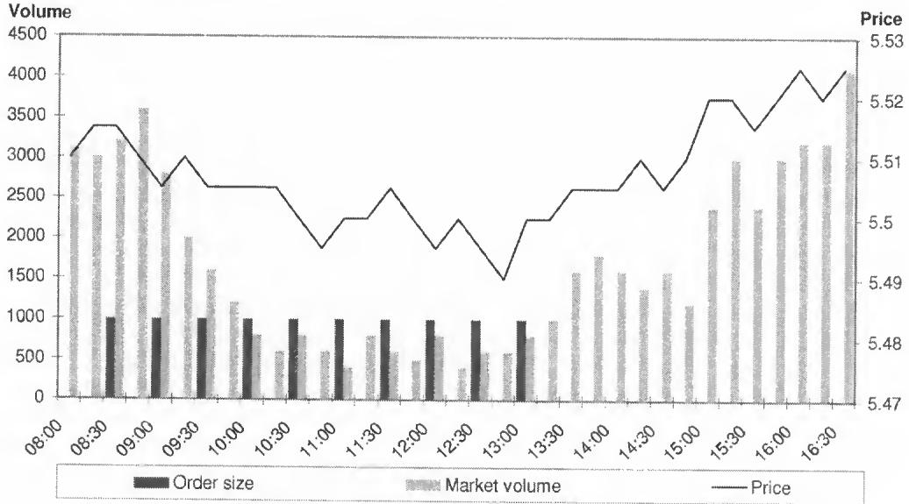  
Figure 1-5 A simple example algorithm

Table 1-2 shows another way of viewing our algorithm, as a trading schedule with the target quantity specified for each time period.

Table 1-2 A simplified trading schedule   

<table><tr><td rowspan=1 colspan=1>Time</td><td rowspan=1 colspan=1>08:30</td><td rowspan=1 colspan=1>09:00</td><td rowspan=1 colspan=1>09:30</td><td rowspan=1 colspan=1>10:00</td><td rowspan=1 colspan=1>10:30</td><td rowspan=1 colspan=1>11:00</td><td rowspan=1 colspan=1>11:30</td><td rowspan=1 colspan=1>12:00</td><td rowspan=1 colspan=1>12:30</td><td rowspan=1 colspan=1>13:00</td></tr><tr><td rowspan=1 colspan=1>Trade</td><td rowspan=1 colspan=1>1000</td><td rowspan=1 colspan=1>1000</td><td rowspan=1 colspan=1>1000</td><td rowspan=1 colspan=1>1000</td><td rowspan=1 colspan=1>1000</td><td rowspan=1 colspan=1>1000</td><td rowspan=1 colspan=1>1000</td><td rowspan=1 colspan=1>1000</td><td rowspan=1 colspan=1>1000</td><td rowspan=1 colspan=1>1000</td></tr><tr><td rowspan=1 colspan=1>Tolal</td><td rowspan=1 colspan=1>1000</td><td rowspan=1 colspan=1>2000</td><td rowspan=1 colspan=1>3000</td><td rowspan=1 colspan=1>4000</td><td rowspan=1 colspan=1>5000</td><td rowspan=1 colspan=1>6000</td><td rowspan=1 colspan=1>7000</td><td rowspan=1 colspan=1>8000</td><td rowspan=1 colspan=1>9000</td><td rowspan=1 colspan=1>10000</td></tr></table>

Clearly, our example algorithm is far from perfect; it is prediclable and it takes no account of cither market prices or volumes. Modern trading algorithms have evolved from this simplistic order slicing strategy to the point where their trading palterns are unrecognisable in comparison. Complex algorithms must be expertly dcfined and implemented. So the actual trading rules upon which these algorithms are based are defined by expericnced traders and quantitalive analysts. They are designed to target the best execution, given the specified objectives.

# Types of trading algorithms

At present, there are literally hundreds of different trading algorithms available. Each broker or vendor provides their own range of trading algorithms, catering for specific goals. Unsurprisingly, the driving forces for many of these algorithms are price, volume or liquidity. Some algorithms rigidly adhere to a given trading sehedule whilst others may be more dynamic, adapting in real-time to ever changing market conditions. Obviously, it is vital for the objectives to be clearly defined for an algorithm to have a chance of achieving ils goals.

If we ignore the various names that are used we can start to distil the existing algorithms into a handful of basic types. Table I-3 shows a summary of the more commonly adopted trading algorithms, which are presently in widespread use.

Table 1-3 A summary of common trading algorithms   

<table><tr><td rowspan=1 colspan=2>Key driver</td><td rowspan=1 colspan=1>Algorithms</td></tr><tr><td rowspan=2 colspan=1>Schedule</td><td rowspan=1 colspan=1>Time</td><td rowspan=1 colspan=1>Time Weighted Average Price (TWAP)</td></tr><tr><td rowspan=1 colspan=1>Volume</td><td rowspan=1 colspan=1>Volume Weighted Average Price (VWAP)</td></tr><tr><td rowspan=3 colspan=1>Predeterminedbenchmark</td><td rowspan=1 colspan=1>Volume</td><td rowspan=1 colspan=1>Percentage Of Volume (POV)</td></tr><tr><td rowspan=1 colspan=1>Price</td><td rowspan=1 colspan=1>Implementation Shortfall (IS)</td></tr><tr><td rowspan=1 colspan=1>Ratio</td><td rowspan=1 colspan=1>Pairs / Spread trading</td></tr><tr><td rowspan=2 colspan=1>DynamicBenchmark</td><td rowspan=2 colspan=1>Price</td><td rowspan=1 colspan=1>Price Inline</td></tr><tr><td rowspan=1 colspan=1>Market On Close (MOC)</td></tr><tr><td rowspan=1 colspan=1>Liquidity</td><td rowspan=1 colspan=1></td><td rowspan=1 colspan=1>Liquidity-based algorithmsSmart order routing</td></tr></table>

Often, trading algorithms are designed to meet (or beat) specific benchmarks, such as the Volume Weighted Average Price (VWAP) or the market closing price. Others try to minimise overall transaction costs whilst some try to trade more opportunistically. There are also algorithms that are driven by liquidity, spanning multiple execution venues or "dark pools" to seek additional liquidity. In Chapter 5, we will cover the whole range of trading algorithms in more detail.

# The evolution of trading algorithms

The origins of algorithmic trading may be traced back to electronic trading systems developed as efficiency aids for sell-side traders. Around the millennium, brokers started to realise that these tools could also be offered to clients. Within a few years, every major brokerage was ofering algorithmic trading services, and client uptake has steadily increased. Vendors are also starting to create frameworks that make it easier for the buy-side to create their own trading algorithms.

The first generation of trading algorithms were natural evolutions of simple order slicing. They focussed on mceting specific benchmarks, starting with a Time Weighted Average Price (TWAP) and progressing on to the ubiquitous Volume Weighted Average Price (VWAP). The simplicity of calculating a VWAP and its more accuratc reflection of daily price moves meant that for scveral years VWAP reigned supreme.

Both the early TWAP and VWAP algorilhms lended to be statically driven. So as soon as an order was received a specilic trading schedule was determincd, which then drove thc trading algorithm. For VWAP, this schedule would be bascd on a historical volume profile, essentially this is a reprcsentation of how trading volume progresses through an average day. Though, using statically created trading schedules incrcasingly proved vulncrable, since othcr market participants could easily spot and take advantage of such rcgular trading patterns. To combat predalory trading, algorithms started to incorporate more randomisation. Consequcntly, there was a natural progression from purcly schedulc driven algorithms to more dynamic stratcgies. For cxample, the Percentagc of Volume (POV) algorithm bases its execution in rcsponse to the live market volume instead of trading based on a historical volume profile.

The second generation of trading algorithms wcre crealed in rcsponse to the application of transaction cost analysis (TCA). This analysis brcaks down all the various costs associated with trading. TCA highlighted that the effcct an order has on the asset's price (its market impact) was not the only significant cost. Indced, other factors, such as timing risk and opportunity cost, could actually oulweigh the market impact. André Perold (1988) coined the term implementation shortfall to represent the actual costs of trading. Esscntially, this reflects the difference betwcen the market price when the investment decision was actually made (the decision price) and the actual executed price. The increasing popularity of TCA meant inveslors started to re-examine their usc of benchmarks. In fact, VWAP began to be replaced by decision price. In general, the first generation trading algorithms were not designed to be price or risk sensitive; they were more focussed on reducing the overall market impact. Hence, brokers needed to develop algorithms that were more price- and cos1- centric, the most notable of which being the Implementalion Shortfall (IS) bascd algorithms. These new algorithms tried to tackle what Rober1 Kissell and Morton Glantz (2003) termed the lrader's dilemma: trading too fast brings high market impact costs whilst trading loo slowly exposes us to considerable risk. Suddenly, algorithms started incorporating complex market models to estimate potential transaction costs, as they altempted to determine the optimum trading strategy for each order.

The third generation of algorithms have resulted from the ongoing search for liquidity, triggered by the rapid proliferalion of Electronic Crossing Networks (ECNs) and Alternativc Trading Systems (ATSs) in the U.S. equity market. Having so many potential cxecution venues meant a raft of simple order routing systems were created. Another important factor has been the increasing order book transparency as markets have transitioncd to clectronic trading. Many of the first generation algorithms focussed solely on the best bid and offer quoles, often because that was all that was availahle. As order book data becomcs increasingly available, more and more algorithms are taking advantagc of this for thcir order placcment decisions. The combinalion of multiple venues and increasing transparency has helped iransform simple order routing systems into complex liquidily-based algorithms. Thesc constantly examine the order books of different yenucs to decide where best to place ordcrs.

Ofl-market trading has also shifted to new electronic venues, in particular the "dark pools" or ATSs that have proven so succcssful for U.S. equities. Algorithms now routinely interact with these "dark pools" to find additional liquidity at set price points, trying to achieve best cxecution. At first, this slarted with dedicated liquidity-seeking algorithms, but incrcasingly this behaviour is also being incorporaled in other algorithms, such as Implemcntalion

Shortfall or cven VWAP. Thus, new hybrid strategics are staring to evolvc.

In paralll with the search for liquidity, another shift in algorithm behaviour is taking place. Customisation and adaptabiliy are becoming key focuses for algorithms, allwing brokers to more casily offer client-centric rading algorithms.

Exactly what the next generation of trading algorithms will offer is hard to predict, but it is certain that they will keep evolving.

# 1.7 Direct Access Trading

Direct access trading represents the shift in access and control of execution to the buy-sidc. Investors and buy-side traders can now get direct access allowing them to place ordcrs on many of the world's financial marketplaces. Originally, direct access trading was synonymous with DMA; however, the introduction of crossing and algorithmic trading has meant institutions now have an evcn broader choice of execution methods.

# Direct Market Access

Direct Market Access (DMA) extends the principle of remote access to a broker's clients. Its roots trace back to the 1980s with vendors such as Instinet. Although used by some institutional clients, many of the early adopters of DMA were retail users. Certainly, vendors targeted the retail markct with their DMA systems. This gave day traders, or SOES bandits (named after NASDAQ's Small Order Execution System), an unprecedented level of access and control over thcir orders.

Institutional users became interested in the prospect of DMA in the 1990s. In particular, this was led by hedge funds and statistical arbitrageurs. Many of the initial DMA offerings were provided by sofiware houses and small agency brokerages. However, after the millennium the larger brokers started investing in DMA in a big way. In 2000, Goldman Sachs acquired REDIPlus whilst in 2004 Bank of America Securities bought Direct Access Financial Corp., Sonic Trading Management went to Bank of New York and Lava Trading became part of Citigroup. Suddenly, the DMA marketplace was dominated by major brokers; DMA had become a key selling point for institutional use.

With DMA, the client can take advantage of the broker's infrastructure to send their orders to the exchange, much like the broker's own orders. Hence the moniker "Zero touch", since the order cxecution is controlled by the client. This requires the client traders to have access to an Order Management System (OMS) or Execution Management System (EMS), which is linked to the broker. Prime brokerage agreements are often established to organisc the clearing and setlement of any executions, and any other custodial or financing requirements.

Clearly, information Icakage is a key concern for institutional users. Therefore DMA services are generally run by brokers as a separate entity to prolcct the client orders from being vicwed by the rest of the broker's traders, and in particular their proprietary desks.

# Sponsored access

Sponsored access catcrs for buy-side clients with high-frequcncy trading strategies. This allows the clicnt to connect to the market using use their broker's unique market identifier (or MPID), but without having to go through their entire infrastructure. Although the markets gencrally require the broker lo monitor the trading, ensuring that no excessive risks are taken. The monitoring may be carried out pre-trade, either with a fast, dedicated system or by using a solution from a third-party vendor, such as FTEN. Whilst this adds some overhead, the client should still get faster access than normal DMA.

Alternatively, some sponsored access may rely on post-trade monitoring. This has been termed "naked access", since this does not allow the broker to prevent crroncous trading. Given the inereased regulatory attention, the future for such "naked access'" is uncertain.

# Crossing

Institutions often need to trade in large sizes, hut large block orders can expose them to substantial price risk. Traditionally, these large orders were handled hy brokers off the trading floor. This is sometimes referred to as the "upstairs market'" since historically such negotiations took place upstairs in broker's ofices, well away from the exchange loor.

Often block trading is undertaken on a principal basis, although agency trading is also catered for. In a principal trade, the broker/dealer assumes all the risk by taking the required position onto thecir inventory. To work such large block orders they may nced to find new counterparties who require the asset, or they may split the order into smaller quantities and work them on the market.

Crossing systems provide an electronic mechanism allowing investors to carry out their own block trading anonymously. These systems aggregate orders and then match them at set points throughout the day. For instance, ITG's POSIT matches orders at over a dozen set times daily. In comparison, Alternative Trading Systems (ATS), such as Liquidnet, generally provide continuous electronic order matching. These anonymous trading venues ensure the order details (size and sometimes price) are hidden; hence, they have often been referred to as "dark pools" of liquidity. Effectively, they offer the buy-side the chance to cut out the broker as an intermediary and trade anonymously with each other. Due to the size of the orders involved, they have become significant sources of liquidity.

Note that it is important to remember that orders placed on crossing systems or ATSs are not guaranteed to execute. Instcad, the focus is on achieving a better price and minimising information leakage. In fact, the probability of execution can be much lower than on the main exchanges, depending on the liquidity of the asset and the size of the block order. Consequently, such orders tend to require some monitoring. In order to guarantee execution other trading methods, such as algorithmic trading or DMA, may be used in tandem. For example, we could place an order to buy a million shares of XYZ on a crossing system in the morning. As the day progresses if it stil has not executed we could reduce the quantity by 10 or $20 \%$ every hour and work this separately. This allows us to hold out for the best price from crossing, whilst stil ensuring that the order is executed. Indced, there are now trading algorithms that ofler this kind of approach.

# Direct Liquidity Access

Managing an order on a crossing network or ATS is essentially the same as DMA. This similarity has meant that vendors now ofer solutions that enable acccss to both mechanisms. To rellect this some brokers/vendors have started using the term Direct Liquidity Access (DLA) for their services.

DLA type services are not necessarily just a combination of DMA and crossing provision. They may also incorporate features such as liquidity aggregation, where smart order routing or custom trading algorithms are used to scek out sufficient liquidity at the desired price.

# Direct Strategy Access

Clienl access for trading algorithms was initially handled over the phone. Nowadays, more and more OMSs and EMSs can handle algorithmic trading. So clients now have direct access to algorithms, much as they have dircct access to orders via DMA. In fact, some brokers, such as UBS, have started using the term Direct Strategy Access (DSA).

# 1.8 Comparing execution methods

Although all the core execulion mcthods are complimentary, there are still somc significant differenccs betwecn them. To illustrate this Table 1-4 shows two simplc example ordcrs. The first order is simply a limit order to buy asset ABC within a fixed price limit, whilst the second ordcr targets the daily VW AP as a benchmark.

Table I-4 Different trading methods for some example orders   

<table><tr><td rowspan=2 colspan=1>Order</td><td rowspan=1 colspan=3>Trading method</td></tr><tr><td rowspan=1 colspan=1>Manual</td><td rowspan=1 colspan=1>DMA/Crossing</td><td rowspan=1 colspan=1>Algorithmic</td></tr><tr><td rowspan=1 colspan=1>1.</td><td rowspan=1 colspan=1>&quot;Buy 10,000 ABCwith a limit of 53&quot;</td><td rowspan=1 colspan=1>Buy limit order10,000 ABC at 53</td><td rowspan=1 colspan=1>No direct equivalenl</td></tr><tr><td rowspan=1 colspan=1>2.</td><td rowspan=1 colspan=1>&quot;Buy 100,000 ABCTrade VWAP overthe dayDon&#x27;t go above 53&quot;</td><td rowspan=1 colspan=1>No direct equivalenl</td><td rowspan=1 colspan=1>Buy 100,000ABCAlgorithm: VWAPStart time: NowEnd time: ClosePrice limit: 53</td></tr></table>

Manual trading can deal with any type of order. The instructions are simple and easy to understand. It is also popular because it allows the client to discuss the order with the broker. This gives them an opportunity to gain new market information and analysis (or "colour") which may even lead them to alter their trading strategy. Such information can be vital to clients, and is one of the main reasons why manual trading is still so widespread.

DMA is perfect Ior simplc order types such the first order in Table I-4. It allows clicnts completc control over how and when orders are placed. However, there is not usually a single equivalcnt order that can handle something like the example daily VW AP trade. DMA caters solely for low-level access. So instead, the client must try to reproduce the strategy that a trader might adopt manually. Therefore, to achieve best execution a client will need considerable market experience, as wcll as having the limc to analyse and dccidc how best to placc each child order. Whilst this may suit some clients, clearly this is a more time consuming approach. That is why, for many clients, either manual or algorithmic trading offer a more practical alternative.

Likcwise, order crossing can easily handle simple limit orders, but not more complicated order types. Again, it is up to the client to monitor the order's status, possibly canceling and re-routing it if executions are not forthcoming on the ATS. Since such crossing networks tend to deal with larger order sizes, a client may actually prefer a dual trading strategy, whercby most of the order is left on the ATS for potential crossing whilst a smaller portion is traded on the exchange to try to ensure execution. Such stralegies are starting to be offcred by new liquidity-based trading algorithms.

Algorithmic trading is intended to cope with more complcx trading strategies, so thc example VWAP order in Table 1-4 poses no problems. Upon receiving the order, a VWAP trading algorithm will then decide how it should be handled. Some algorithms adopt a static approach, splitting orders based purely on information from historical data. Alternatively, ones that are more dynamic incorporate a mixture of historical and live market data in their decisions. As required, the algorithm will then send child orders to the market, selecting the most appropriate order type/price and size; then continually monitor their progress. Essentially, this is no different to what happens for traders working such ordcrs manually or via DMA, except that the trading algorithm provides a fully automated process. Clearly, in order for the execution to meet the client's objectives it is vital that any requirements such as limit prices, benchmarks etc. are fully specified. As we can see from Table I-4, the algorithm parameters (the start and end times and the limit price) are similar to how we might ask a trader to work the order. Admitedly, this is a more constrained approach than just talking to a trader over the phone. However, brokers are constantly introducing new algorithms and refining their parameters to try and make it easier to issue appropriate orders and to cope with any required customisations. They have even started introducing algorithms that look at the order details and decide the most appropriate trading strategy/algorithm for it.

Another way of comparing execution methods is to try to rate them in terms of factors such as:

Efficiency Usability ● Performance/Cost

These are broken down in more detail in Table 1-5.

Table 1-5 Comparing the core methods for trading   

<table><tr><td rowspan=2 colspan=2>Factors</td><td rowspan=2 colspan=1>Manual</td><td rowspan=1 colspan=3>Direct Access</td></tr><tr><td rowspan=1 colspan=1>DMA</td><td rowspan=1 colspan=1>Crossing</td><td rowspan=1 colspan=1>Algorithmic</td></tr><tr><td rowspan=2 colspan=1>Eficiency</td><td rowspan=1 colspan=1>Capacity</td><td rowspan=1 colspan=1>★</td><td rowspan=1 colspan=1>★</td><td rowspan=1 colspan=1>★</td><td rowspan=1 colspan=1>★★★</td></tr><tr><td rowspan=1 colspan=1>Speed</td><td rowspan=1 colspan=1>★</td><td rowspan=1 colspan=1>★</td><td rowspan=1 colspan=1>★</td><td rowspan=1 colspan=1>★★★</td></tr><tr><td rowspan=6 colspan=1>Usability</td><td rowspan=1 colspan=1>Control</td><td rowspan=1 colspan=1>★</td><td rowspan=1 colspan=1>★★★</td><td rowspan=1 colspan=1>★</td><td rowspan=1 colspan=1>★</td></tr><tr><td rowspan=1 colspan=1>Transparency</td><td rowspan=1 colspan=1>★</td><td rowspan=1 colspan=1>★★★</td><td rowspan=1 colspan=1>★</td><td rowspan=1 colspan=1>★</td></tr><tr><td rowspan=1 colspan=1>Anonymity</td><td rowspan=1 colspan=1>★★</td><td rowspan=1 colspan=1>★★</td><td rowspan=1 colspan=1>★★★</td><td rowspan=1 colspan=1>★★</td></tr><tr><td rowspan=1 colspan=1>Market conditions</td><td rowspan=1 colspan=1>★</td><td rowspan=1 colspan=1>★</td><td rowspan=1 colspan=1>★</td><td rowspan=1 colspan=1>★★</td></tr><tr><td rowspan=1 colspan=1>Market knowledge</td><td rowspan=1 colspan=1>★★★</td><td rowspan=1 colspan=1>★</td><td rowspan=1 colspan=1>★★</td><td rowspan=1 colspan=1>★★★</td></tr><tr><td rowspan=1 colspan=1>Asset knowledge</td><td rowspan=1 colspan=1>★★★</td><td rowspan=1 colspan=1>★</td><td rowspan=1 colspan=1>★★</td><td rowspan=1 colspan=1>★★★</td></tr><tr><td rowspan=3 colspan=1>Performance/Cost</td><td rowspan=1 colspan=1>Performance</td><td rowspan=1 colspan=1>★★</td><td rowspan=1 colspan=1>★★</td><td rowspan=1 colspan=1>★★</td><td rowspan=1 colspan=1>★★</td></tr><tr><td rowspan=1 colspan=1>Commission</td><td rowspan=1 colspan=1>★</td><td rowspan=1 colspan=1>★★★</td><td rowspan=1 colspan=1>★</td><td rowspan=1 colspan=1>★★</td></tr><tr><td rowspan=1 colspan=1>Risk/Cost control</td><td rowspan=1 colspan=1>★★</td><td rowspan=1 colspan=1>★</td><td rowspan=1 colspan=1>★</td><td rowspan=1 colspan=1>★★</td></tr><tr><td rowspan=1 colspan=1>Other</td><td rowspan=1 colspan=1>Regulations</td><td rowspan=1 colspan=1>★★</td><td rowspan=1 colspan=1>★</td><td rowspan=1 colspan=1>★</td><td rowspan=1 colspan=1>★★</td></tr></table>

Graded from weakest $( \star )$ to strongest $( \star \star \star )$

# Efficiency

Efficiency has been one of the key drivers for the sell-side; a skilled trader is a valuable commodity, anything that helps make them more productive is clearly beneficial. For some segments of the buy-side, typically hedge funds, speed is becoming ever more important. Low latency trading mechanisms allow them to capitalise on opportunities as soon as they see them.

In terms of capacity, algorithmic trading is clearly the winner; computers can casily handle thousands of orders simultaneously. Additional capacity can often be added by setting up another computer server, provided the underlying infrastructure (nctworks, links to exchanges etc.) is good enough. In comparison, manual trading is quitc an expensive option.

Traders are inherently good at multi-tasking; however, thcre is still a limit to how many orders a person can handle at any one time, beyond this level the quality of execution may suffer. DMA has similar capacity issues since all that has really happcncd is a shift of the manual trading from the brokcr to the buy-side. Capacity is less of an issue when using crossing systlems since this tends to be a more passive trading style. Though, the orders still need to be monitored, and if they have not crossed after some time, alternative trading methods may need to he used.

With respect to speed, algorithmic trading is again thc best option. Computerised systems are perfect for monitoring and analysing thousands of variables in fractions of a second. Exchanges used to have latcncies of around 300 milliseconds, at present they are now competing to offer services with latencies below 10 milliseconds. To put this in perspective a blink takes between 100-150 milliseconds (as noted by David Burr (2005)). Even complex analytics for determining the most appropriate reaction can be calculated in fractions of a second. In other words, a trading algorithm can spot an opportunity and scnd an appropriate order to the cxchange before we cven notice the quotc flickering on our monitor. Speed has hecome such a key issuc thal some exchanges and ATSs now offer co-location serviccs, essentially allowing mcmber's computer servers to be placed in their machine rooms to virtually eradicate any network delays.

# Usability

Usability is obviously a major issue for most users. A convolutcd trading method is unlikely to be popular, evcn if it gets good rcsults.

Direct control over how thcir orders are handled has significantly improved for the buysidc. DMA allows them to place and managc orders as if they were a broker/dealer. In comparison, both manual and algorithmic trading represent a slight loss of control, since the client can only issue general trade instructions or select an appropriate trading algorithm. Clearly, it is often casicr to communicate such instructions to a person, but trading algorithms are continually evolving lo try to be as intuitive as possible. They are also becoming highly customisable, catering for an ever-expanding range of trading requirements.

Transparcncy is closely related to control. f we cannot dictate exaclly how something is done, we would at least like to be able to monitor it closely to ensure that it is doing what we want. Competitive advantage means that brokers cannot divulge the cxact inner workings of their algorithms, bul they should be still be able to explain the behaviour for specific orders. It is also important to get a broad understanding of how each trading algorithm works, so as to be able choose the most appropriate one for our orders.

Anonymily is important as well, since information leakage is one of the key concerns for many investors. Over the last few years, the anonymity offcred by crossing networks has helpcd these systems gain a substantial market share, particularly in the U.S. DMA and algorithmic trading can also provide anonymity, since most brokers segregate the trading for their prime brokerages to ensure client privacy.

Another factor that affects usability is changing market conditions, in part triggered by electronic and algorithmic trading and by the compctition between venues. Across many of thc world's markcts average order sizes have significantly decreased whilst trading volumes havc rocketed. So orders, which might have immediately filled five years ago, must now be split to prevent market impact. Similarly, having multiple execulion venucs fragmcnts the availablc liquidity, making it harder to trade. Algorithmic trading is the best suited to handling such conditions; computer capacity means it can closely monitor cach venue and decide where best to trade, for thousands of orders. Ncither DMA, nor manual trading can match this.

Market and asset specific knowledge are also key to achieving best cxccution. This can be as simple as knowing when markets are open and understanding the supported order types. Altcrnatively, it might mean having in-depth expericncc of how cach asset trades. For manual or algorithmic trading, the orders are being handled by a dedicated expert or system, so orders can be easily delegated to these methods. It docs not matter whether the order is for U.S. bonds or Japanese equities they will handle the complexities of each market and asset lype. Whereas for DMA, and to a lesser extent crossing, therc is less inbuilt guidance, it is up to the client to determine how best to trade. That said, many OMSs and EMSs often have built-in rules to prevent simple errors such as sclecting an unsupporicd order lype.

# Performance / Cost

Execution methods have to deliver in terms of both performance and cost. Performance may be measured by comparing the average execution price to a specific benchmark. Note that it is also important to consider the variability, or volatility, of these averagcs. For any specilic order, manual trading should gencrally be able to beat the performance of an algorithm, since traders can often infer much morc subtle signals from the market. However, the rule based nalure of algorithms means that they should provide more consistent results, since they do not get tired or distracted. Thercfore, in terms of overall performance algorithms and manual trading are relatively evenly matched. Admittedly, traders probably still havc thc edge, but algorithms are improving all the time.

It is also important to get the balance right between performance and efficiency. An experienced trader should generally be able to outperform most trading algorithms; howcver, this may consume a large proportion of their time. Ovcrall, better performancc might be achieved by having the trader manually work the more difficult orders whilst dclegating the others to trading algorithms.

When examining performance, the investment goals should be considered as wcll. For instance, trading passively may save the bid offer spread and so result in a good average price, but this may be at the expensc of fully completing the order. If, the next day, the asset price shifts then completing the order may be more cxpensive than if we had traded morc aggressively the day before. Transaction cost analysis (TCA) has played a key role in making traders and investors examine such costs more thoroughly.

For markets where brokers still chargc commissions, e.g. equities, this is clearly a very visible cost of trading. Until the 2007-09 financial crisis, overall commissions havc been stcadily declining. Figure 1-6 charts their progression over the last few years, in lerms of $\$ 1$ share. It also highlights the diffcrences betwecn DMA, algorithmic and manual (high touch) trading. From a broker's point of view, the low touch services (DMA and algorithmic trading) have relatively low labour costs hence the lower charges. The costs for high touch / manual trading also reflect the fact that traders can offer additional information to clients, such as market colour or sentimcnt.

Ovcral, TCA has highlighted the fact that hidden costs, such as market impact and timing risk, arc more signilicant than visible costs, such as commissions. Most algorithms are adept at reducing overall market impact, by splitting the order into smaller sizes.

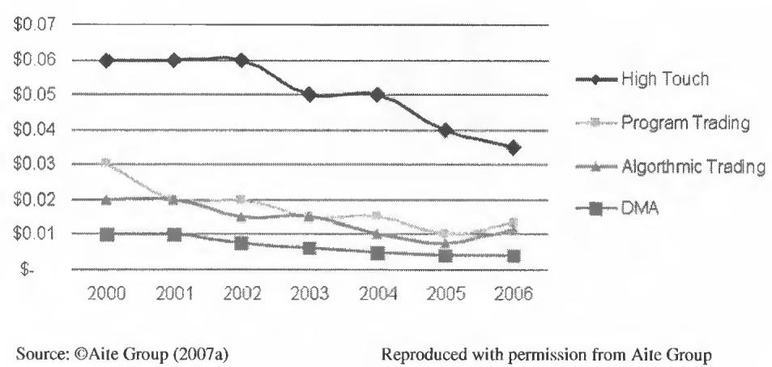  
Figure 1-6 U.S. equity average commissions

Similarly, crossing is an equally eflicient, if not better, means of reducing market impact. Minimising timing risk and opportunity costs is more complex. The second generation of algorithms introduced cost-centric models, typified by Implementation Shortfall, which are better suited to this. We shall cover this in more detail in Chapters 5 and 6.

# Other reasons

Market regulation, such as Regulation NMS in the U.S. and MiFID in Europe, means that brokers and investors must be able to demonstrate that they achieved best execution. Electronic trading has made this somewhat easier, since detailed audit trails are relatively simple to maintain. Therefore, algorithmic trading is arguably one of the best choices to cater for such regulations, since its rule hased nature provides consistent and easily auditable trading decisions, as well as coping well with fragmented marketplaces.

# 1.9 How much are these execution methods used?

The sellside brokerages have had electronic trading for years. Internally, almost all their trading is electronic, except for the few markets where there is still considerable floor-based activity. Similarly, automated trading systems and trading algorithms have long been established. Hence, most studies focus on the uptake of these technologies with the buy-side institutions. For example, Figure 1-7 shows estimates from the Aite Group consultancy for the breakdown of trading methods adopted hy U.S. institutions.

The growth trends for algorithmic trading and DMA are clearly visible, as is the decline in "High touch" (and higher cost) manual trading. A report by the TABB Group (2008) estimates that by 2007 algorithmic trading, DMA, crossing and program trading together accounted for $6 3 \%$ of the U.S. institutional equities trades. Still, in 2008 they also note that the market crisis led to a slight shift in the trends. Algorithmic trading continued to increase, reaching $24 \%$ of buy-side flow, up $2 \%$ from the year before. However, high touch trading via sales traders also increased, recovering to $44 \%$ (back from $3 7 \%$ in 2007), as institutions sought to cope with the heightened levels of volatility.

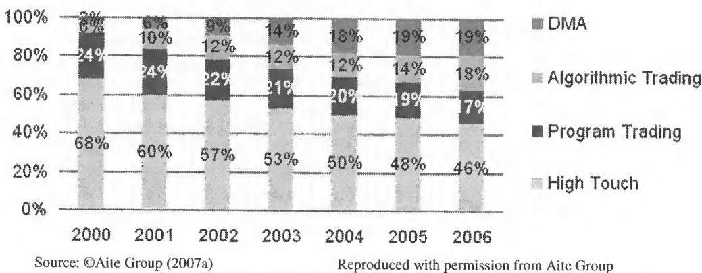  
Figure 1-7 Estimates for the use of different trading methods by U.S. institutions

# 1.10 Fears and myths

Algorithmic trading has attracted a lot of publicity; there has also been a lot of marketing and hype. So in this section let's examine some of the common fears and myths that have attached themselves to this topic. Broadly speaking, thcsc may be categorised into three main issucs, namely safcty, performancc and uscfulness.

# Safety of algorithmic trading

Somc of the commonest concerns about algorithmic trading are that:

• Algorithms are fundamentally changing the market Algorithms will replace tradcrs Algorithms can leak alpha to proprictary traders

There can be no doubt that clectronic trading has transformed thc world markets. Marketplaces are seeing waves of fragmentation and consolidation as competition for market sharc drives the creation of new execution venucs whilst existing oncs are bought, merge or fail. The emcrgence of crossing systems is a perfect example of this cyclc. Order sizcs are shrinking, so off-exchange crossing becomes increasingly popular. In response, the cxchanges introduce new mechanisms to try to regain liquidity from the crossing networks, and the cycle begins again. Al the while, these market shifts offer opportunities for astute investors and traders who are ahead of the market. Coping with this constant change is clearly difficult. Nevertheless, Pandora's Box has already been opcned, for betlcr or worse, so we may as well look inside and find ways to deal with thc new market reality.

Algorithmic trading is a natural evolution from electronic trading. Computers are idcally suited to working in complex multi-venue markets, since they can casily monitor the order books of a range of excution venues. If everyone used VwAP algorithms for their trading then clcarly somc self-reinforcement of trading patterns would occur, much like if everyone used thc same technical analysis. However, pcople's vicws diffcr: Indeed, the very reason that the world's markets function is because investors and traders have a divcrsc range of opinions. Therefore, they target diferent prices and use a range of alternative trading strategies. There is no reason why algorithmic trading should alter this diversity.

Job sccurity is also an issue. Eye-catching news headlincs have proclaimed the end of the trader, but then we're all going to be replaced with robots in 2075 arcn't we? It is imporlant lo remember that electronic and algorithmic trading arc simply tools. Certainly, job roles are cvolving, for cxample, salcspeople are becoming sales traders. Sell-side dcsks are now covering multiple asset classes. Not long ago, it was predicted that principal or risk trading would become more commonly used than agency trading. The 2007-09 financial crisis and the transformation of the financial sector have given a new lease of life to agency trading. In fact, during this crisis principal trading looked far morc endangered. In such markets, tradcrs and investors nced to be flexiblc to take advantagc of any tools that help give them an edge and drive profits.

An arliclc in thc CFA Magazine (2006) titled 'Hype and Algorithms' poscs a good counterpoint to the fear that algorithms will take over the world. In the article, Joe Gawronski, COO of Rosenblatt Securities, highlights the fact that:

"Algorithms can't react in the true sense of how I define a reaction. Everything they do is based on a rule that's been provided, whereas traders can change their mind on the fly. There's no way to incorporate into algorithms the random facts and observation that may give a trader a "feel" for the market."

Artificial Intelligencc (AI) may ofer a solution to this; however, this is still some way off. AI first took of in the 1950s, but it was not until 1997 that IBM's Deep Blue computer could beat the world chess champion. In the same CFA article James Finnegan, editor of the Financial Engineering News, points out:

"People equate black-box algorithms with super computers developed to play chess and mistakenly assume there will one day be an algorithm that is so smart, quick, and innovative that even the best traders in the world won't stand a chance. However, the difference is that although there are billions and billions of permutations with chess, there is a defined board and a very strict set of rules, so a computer with enough memory can learn every move. That's not the case with markets."

Beyond al the hype, algorithmic trading will ccrtainly have a major impact. For inslance, good algorithms may be just as efficiently used by a salesperson as a sales trader. It should also open up new avenues for trading, expanding the potential of multi-region and multiassct trading.

Another conccrn for investors is information leakage. There is still some suspicion that brokers can garner information from client order flow and use this for their own proprietary trading. That said, the buy-sidc has more power and control than it has ever had. Offexchange crossing networks even allow the buy-side to completely bypass brokers. Givcn that commissions are declining, it is vital for brokers to retain order flow. Reputation is paramount. Brokers have to ensure that their proprietary trading desks are truly isolated from the brokerage operations. This holds true for all the major brokers, whose prime brokerage units are often segrcgated, located on separate floors or even buildings.

# Performance of algorithmic trading

Another common fcar is that trading algorithms have now become commoditised and there is little differentiation betwecn them. There is some truth to this, in that there are only so many ways of implementing an algorithm that targets a benchmark likc VWAP. However, being commoditised is not altogether a bad thing; it is important to have a certain level of standardisation. We just have to look at the markets to see how standardised products have better liquidity and so lower trading costs. Similarly, standardised algorithms, at least in terms of their parameters and basic functions, would allow clients to swap betwecn brokers more easily, thus encouraging more competition.

Commoditisation is less of an issue for the more complex cost driven and opportunistic algorithms. Here the performance is dependent on the quality of their quantitative models, so brokers can add signilicant value. Indeed, there can be considcrable variation in the performance of these algorithms between brokers.

Algorithm choice is also an important factor: If an unsuitable type of algorithm is chosen then performance is bound to suffer. This can be addressed by a combination of education and improving the available pre-trade analytics. Another solution is the increasing provision of systems that can automatically suggest the most suitable algorithm for a specific order. Post-trade analysis is vital to check the actual performance. Note that both the mean and standard deviation of performance need to be considered.

There is also the feeling that brokers hold baek the best performing algorithms for themselves. Fundamentally, proprietary desks, particularly those employing high Irequency trading or statistical arbitrage adopt different strategies to investors. They are usually keen to stay market neutral and so strategies tend not to build up large positions, instead acting more like sophisticated day traders. Thus, any algorithms they use tend to be highly specialised, often based on market making. That's not to say brokers don't run different algorithms. Newer versions of algorithms need extensive testing, so thesc will be used internally before being made available to clicnts. In general, algorithms are a valuable marketing resource which brokers are keen to make available as soon as they are ready.

Finally, it is important to remember that algorithmic trading is just a tool, not a panacea. It is not designed to generate profits (or alpha), simply to help control costs and provide best execution.

# Usefulness of algorithmic trading

The success of algorithmic trading means that less people are still questioning its usefulness. Although there are still a few issues rooted from the early days of algorithmic trading, namely that:

• Algorithms are complicated to use They only really work for liquid assets or small orders

Algorithms sometimes have a reputation of being complicated, but as we saw in the example in Table I-4, they require parameters that look very similar to the instructions we might give to a trader. Most algorithms will have sanity checks, so if an order is unusually large, or the price limit is miles away from the actual market price then the order may be rejected, just to be safe. Nevertheless, as with any computer program, it is important to bear in mind the "Garbage In Garbage Out"” maxim, and assume that it wil not be as forgiving with any typos.

Algorithm selection from the hundreds available may seem like an ominous task. That said, any one broker probably offers a maximum of a dozen trading algorithms. Therefore, it is simply a case of using pre-trade analytics to estimate the potential impact and risk of an order. Inereasingly, brokers arc rationalising their suites of algorithms to make selection even easier. They are also staring to provide more client-focussed solutions that cater for specific requirements. Some brokers even provide services that suggest the most appropriate algorithm, based on the order size and the asset's liquidity and volatility.

In terms of algorithms only being able to cope with liquid assets or small orders, this may have becn true for the first gencration of algorithms. Modern algorithms are much more versatilc. In particular, the introduction of cost-centric and liquidity sceking algorithms mcans they can now support a much broader set of requirements.

Illiquid assets pose a specific problem, namely signalling risk. This represents the information leakage to other market participants from our trading strategy. Imagine using the simplistic algorithm we saw in Figure 1-5 for an illiquid asset. The regular large buy orders would scream, "We have a buyer", whcrcas for a more heavily traded asset they would not stand out as much. Consequently, it is often necessary to hide our actual intentions as much as possible, by using spccial order types and by seeking liquidity from alternative sources such as crossing networks. We shall cover this in more detail in Chapters 8 and 9. Intcrcstingly, thesc techniques are increasingly being applied to more liquid asscts.

Onc area where algorithms do necd more work is coping with unexpected events or news. Human traders can often deal with this much more effectively. That said, the next generation of algorithms are already starting to look at how best to incorporate additional information to deal with such situations. We will look at this in more depth in Chapters 10 and 14.

# 1.11 Summary

Direct Market Access (DMA) enables clients to send orders to exchanges by using a proxy for their broker's membership, giving them a similar level of control for an order's execution to a sell-side trader.

Algorithmic trading is a computerised rule-based system responsible for executing orders to buy or scll a given asset. A computer program follows presct rules to dcterminc how each order should be executed. Algorithmic execution is perhaps a more representative name.

Systcmatic, black-box, quantitative and high frequency or automated trading are terms that are sometimes mistakenly used as references to algorithmic trading. In fact, they are more to do with the style of investment than the execution.

So far, there have bcen three main generations in the evolution of trading algorithms:

The first algorithms werc natural evolutions of simple order slicing, focussing on specific benchmarks, such as TWAP or VWAP. Initially, these were schedulc drivcn, often based on historical data. Later, more dynamic versions incorporated market conditions, leading to tracking algorithms, such as percentage of volume.

The second generation of trading algorithms were created in response to the application of transaction cost analysis. Implementation shortfall algorithms strive to minimise cost by balancing both market impact and risk.

The third generation of algorithms arc focussed more on liquidity, resulting from the fragmentation of major markets and the arrival of "dark pools".

Continual evolution and the adoption of similar tactics mean that the boundaries between these methods are constantly blurring. Inereasingly, complex DMA order types are making it difficult to differentiate between them and trading algorithms.

Comparing algorithmic trading and DMA with manual trading:

In tcrms of spced and capacity, algorithmic trading is clearly the winncr; computers can handle thousands of orders simultaneously, responding in fractions of a sccond. In terms of performancc, experienccd traders still have thc edge over algorithms sincc they can infer more subtle signals from the market. Though, as algorithms continue to evolve, the gap is closing. Algorithms also offer thc prospect of more consistent results. Note that selccting the appropriate algorithm is vital.

# Chapter 2

# Market microstructure

Market microstructure focuses on the key mechanisms involved in trading.   
It also helps explain many of the costs that arise.

# 2.1 Introduction

Economics tends to abstract itself from the underlying mechanics of trading. Similarly, assctpricing theory focuses solely on the fundamental values of assets. Whereas the field of market microstructure ' concentrates on the actual trading process, analysing how specific mcchanisms affect both observed prices and iraded volumcs. Market microstructure helps explain many of the costs that prevent asscts from achieving their fundamental values.

Interest in market microstructure has grown rapidly over the last two decades, alongside the rapid changes in the structure and technology of the world markets. Structural shifts havc arisen due to globalization, the demutualization of many exchanges (to become profit-based enterprises) and increasing intra-market competition. Regulation has also played its part. For example, in the U.S., Securities and Exchange Commission (SEC) governance led to the creation of ECNs (Electronic Communications Networks), which have aggressively competed with exchanges for market share. The pace of technological change has also helped, as tools like DMA and algorithmic trading open up markets, lowering the barriers for entry and altering the balance betwecn investors, brokers and dealers.

What topics does market microstructurc actually cover? We can break down the theory into three key areas:

• Market structure and design Trading mechanism research ● Transaction cost measurement and analysis

The purpose of this overview is to provide a basic introduction to these key areas. For further reading, a concise practitioner's guide is given by Ananth Madhavan (2002). Whilst comprehensive reviews of the academic literature are provided by Bruno Biais, Larry Glosten and Chester Spatt (2005), Hans Stoll (2001) and an earlier work by Madhavan (2000). A more detailed conceptual review of trading and markets in general may be found in Larry Harris's (1999) book 'Trading and Exchanges'.

# 2.2 Fundamentals

Bcforc covering the key concepts of market microstructurc in more dctail, let's first addrcs some of thc fundamental features of trading and markets.

Markcts exist to accommodate tradc. A marketplace is intended to bring dificrent parlicipants togcther, allowing them to trade. Sincc supply and demand are not always cvenly balanced, most markets also rcly on intermediaries, such as brokcrs or dealers, to facilitate trading.

Liquidity characterizes the ease of trading on a given market or for a specific assct. Trading in highly liquid markets is much casier, and more cfficient, than trading in illiquid ones. Given the importance of trade, and particularly given its incrcasingly global naturc, it is useful to be able to compare markets in terms of their cfficiency. The cost of an asset is not neccssarily a fair mcasure sincc many othcr economic factors, such as currencics, interest ratcs or inflation, may affect this. Thercfore, measures based on liquidity are often used instead.

# Market function

The fundamental purpose of a market is to bring buyers and sellers together. Broadly speaking, thc capital markets may be calegoriscd into primary and secondary markets, based on the two stages of an asset's lifecycle. 2 The primary market dcals with thc issuancc of ncw assets/securities. Subsequent trading of these asscts takes placc on thc secondary markcts.

New government bonds are generally issued via spccialised auctions. For equities, the primary market is concerncd with initial public offerings (IPOs), follow-on offerings and rights issucs. Similarly, ncw corporate debt is generally placcd using undcrwritcrs (usually a syndicate of banks).

Historically, thc secondary market for bonds has often been "over the counter" (OTC), although there are now also substantial inter-dealcr and dealcr-to-customcr markcts. Thc situation is similar for the trading of foreign exchange and many derivative assets. Whilst for equities the main markctplaces are exchanges, although incrcasingly thesc must now compete with othcr venues such as ECNs and Altcrnativc Trading Systems (ATSs).

The secondary markcts are vital sincc invcstors will be more willing to provide capital if they know the assets may readily be traded. This flexibility allows them to withdraw capital when needed and to switch between assets. Thus, market microstructure rescarch has mainly focussed on the efficicncy of thc secondary markets. fn particular, examining the divcrse range of market sructures and trading mechanisms, as we will sec in scctions 2.3 and 2.4.

# Participants

Convcntionally, market roles have becn dcfined by trading nccds. Thc "buy-side" corresponds to the traditional customers, namcly institulional and individual invcstors. Whilst the "sell-side" represcnts the brokers, dealcrs and olher financial intermcdiarics who service customcr necds. Brokers acl as agcnts to facilitate the actual trading, whilst dealers (or markct makers) trade on their own behalf trying to profit from offering liquidity. Spcculators act indcpendently, trading for themselves.

In comparison, the market microstructure models in academic lilerature tend to classify the participants based on the information they posscss:

"Informed traders" are assumed to have private information, which enables them to accuratcly determine an asset's true value.   
"Liquidity traders" must trade in order to fulfil certain requirements, such as to release capital or to adjust the balance of a portfolio.

The models also often incorporate the style of trading: Active traders are classified as thosc who demand immediate cxecution of their orders (immediacy) and push prices in the direction of their trading, whereas passive traders effectively supply immediacy and so stabilize prices. Unsurprisingly, microstructure models have shown that over the long-run liquidity traders generally lose if they trade with informed traders. Likewisc, passive traders tend to profit from active traders. Still, informed traders do not have it all their own way; they are vulncrable to information-leakage. Consequently, informed traders try to minimise this by seeking to trade anonymously or even altering their trading patterns to look more like a liquidity trader.

Table 2-1 Microstructure model participants   

<table><tr><td rowspan=1 colspan=2>Microstructuremodel trader types</td><td rowspan=1 colspan=1>Actualparticipants</td></tr><tr><td rowspan=1 colspan=2>Informed</td><td rowspan=1 colspan=1>Investors</td></tr><tr><td rowspan=1 colspan=1>Liquidity</td><td rowspan=1 colspan=1>Active</td><td rowspan=1 colspan=1>InveslorsSpeculators</td></tr><tr><td rowspan=1 colspan=1></td><td rowspan=1 colspan=1>Passive</td><td rowspan=1 colspan=1>DealersInvestors</td></tr></table>

Table 2-1 tries to map the model participants to their real world counterparts. The clearest link is for dealers. They act as passive liquidity traders, benefiting from offering liquidity to active traders, but at risk of losing to more informed ones; hence, their pricing trics to balance this information risk: The gains made from active traders should offset any potential losses. Conversely, speculators tend to take a more active, or aggressive, trading style. They often take advantage of short-term price moves, which may be contrary to longer-term expectations. For investors, the mapping is less clearly defined, since for any particular situation some investors will have more relevant, or valuable, information than others will. Hence, somctimes investors may actually be acting as liquidity traders, compared to other better-informed investors. The only way to tell is their ultimate profit (or loss).

# Liquidity

Trading gencrally means converting an asset into cash or vice versa. How much this conversion actually costs may be represented by the liquidity of the asset, or the market it was traded on. This view of liquidity dates back to Harold Demsctz (1968). He expressed liquidity in terms of immediacy, which reflects the ability to trade immediately by executing at the best available price.

An asset's price is closely linked to its liquidity. For example, newly issued U.S. treasury bonds often have higher prices than older issues (termed "off-the-run'") for the same maturity. This liquidity premium reflects the value of being able to readily convert the asset back to cash.

A liquid market or asset should have a lower cost for immediacy, i.e. trading costs. Liquid markets or assets will also usually have higher trading volumes. For instancc, the stock market is generally more liquid than the real estate market.

Overall, we can characterise a market's liquidity 3 in terms of thrce main features:

● Depth ● Tightness • Resiliency

Depth indicates the total quantity of buy and sell orders that are availahle for the asset, around the equilibrium price. Thus, a deep market enables us to trade large volumes without causing sizeable price movements (or impacts). Conversely, a shallow market means it is much harder to trade; often we will have to alter our price to attract buyers or scllers.

Tightness relers to the bid offer spread. That is to say, it is the diference between the prices to buy and sell an asset. A tight spread means that the trading costs are low (for average quantities) and so it is relatively easy to trade in and out of a position.

Resiliency determines how quickly the market recovers from a shock. A resilicnt market will suffer less price discrepancies from trading. So changes in price do not affect the overall level of trading, or availability of orders.

These three factors are closely related: deeper markets generally have narrower bid offer sprcads (so are tighter) since they are easier to trade in, and so less risky. This also makes them more likely to be resilient.

Another potential factor, Diversity, is suggested by Avinash Persaud (2001). His study of market crises, titled 'Liquidity Black Holes', highlighted the importance of a diverse range of market views amongst investors and traders. Without such diversity, cveryone wants to buy or sell at the same time or price, so liquidity is bound to disappear. Fortunately, for most markets, there is generally a great deal of diversity in opinions. Though, as Persaud points out, periodically a convergence of market sentiment helps trigger criscs, such as the 1987 stock market crash or the 2007-09 financial crisis.

# 2.3 Market structure and design

For markets to work well, their design must accommodate the necds of institutional (or individual) investors, dealers and speculators. Therefore, a successful market allows investors to trade when they want, and minimizes the costs of trading orders whilst still making it worthwhile for dealers and speculators.

The key characteristics of market architccture 4 may be defined as:

● Market type ● Order types ● Trading protocols Transparency • Off-market trading

These characteristics can significantly influence factors such as liquidity and the speed of price discovery, which in turn can affect the overall cost of trading. However, no two markets are the same, even if they are based on the same design, since local regulations may differ, as will the universe of iraded assets.

# Types of markets

Historically, the two most important properties for classifying markets are their trading mechanism and the actual frequency of trading:

# Trading mechanism

Markeis are generally thought of as being either quote-driven, order-driven or a mix (or hybrid) of the two. A purely quote-driven market means iraders must transact with a dealer (or market maker) who quotes prices at which they will buy and sell a given quantity. Orderdriven markets allow all traders to participate equally, placing orders on an order book that are then matched using a consistent set of rules. Figure 2-1 tries to highlight these differences.

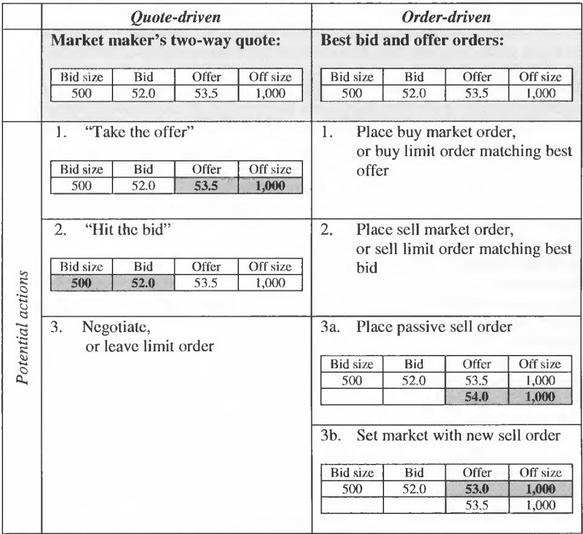  
Figure 2-1 Comparing quote-driven and order-driven trading mechanisms

For a quote-driven market, when faced with a two-way quote we can choose to "take the offer", "hit the bid", renegotiate or just leave it. Choosing to "take the ofler"' results in a buy execution priced at their offer, whilst hiting the bid results in a sell. The market maker's two-way quote provides a guaranteed execution at that price, for a set sizc.

With an order-driven market, the prices are cstablished by actual ordcrs. The best bid price represents the highest priced buy order, whilst the best offer is set by the lowest priccd sell order. A trade may only occur when a buy order matches (or beters) the current best offer price, whilst for a sell order the best bid price is the target. So instead of responding to the market maker's two-way quote we react to the available liquidity on the order book. The outcomc also depends on the type of order used. A market ordcr rics to guarantee execution regardless of price, whilst a limit order sticks to a strict price limit but sacrifices execution certainty. The equivalent to "taking the offer" is to place cither a market order, or a limit order priced to match the best offer. Its size should be equal to or less than the available offer size. Conversely, we can "hit the bid" by placing a sell markct order, or a limit order priced to match the best bid. Note that there are no guarantees, since at any moment many other traders will also be issuing new orders, updating existing ones and canceling stale ones. By the time we react and place an order, it is quite possible that another order has already matched with the current best bid or offer. Hence, a buy (sell) market order may execute but potentially at a higher (lower) price than the currently displayed best olfer. Alternatively, a limit order may fail to execute, in which case it will stay on the order book until it matches with another order or is cancelled. Therefore, for order-driven markets the best bid and offer prices are indicative rather than guaranteed like a dealer's firm two-way quote.

Whilst the immediacy of the two-way quote is uscful, the persistence of orders within order-driven systems is also beneficial since they provide visible liquidity, which enhances price discovery. Order-driven markets also offer more control over order choice. Orders may be placed for any preferred price and size without the nccd for negotiation. For cxample, belicving that the price wil rise, we may choose to issuc a more passive sell order priced just above the current best offer. Effcctively, this will join the qucue behind the best sell order, as shown in panel 3a. Alternatively, we may choose to set a new market level, at a price slightly lower than the best offer, shown in panel 3b.

Negotiation is a key difference beiween order-drivcn and quote-driven markcts. Many quote-driven markets, cven electronic ones, provide a mechanism that allows both counterparties to negotiate the size and/or price. The crcation of ncw crossing systcms and ATSs, such as Liquidnet, which also incorporate negotiation mechanisms mean that this is no longer limited to purely dealer-based markets. However, there is no dircct equivalent to this mechanism for purely order-driven markets. The closest approximation is to place an order for our dcsired size and price, and then closely monitor and updatc it to try to cnsure it is executcd. But this is still far from entering into a bilateral negotiation. In fact, this difference is so fundamental that it can he used as a key factor in the categorisation of trading mechanisms.

Despite these differences, Figure 2-1 also highlights some clear similarities bctwcen a dealer's two-way quotes and using orders. A market where dcalers must provide continuous firm quotes effectively forces them to constantly offer imit orders. In many ways, this may be thought of as a hybrid market. Indeed, markets such as NASDAQ, which used to he purely quote-driven, have since shifted to become truly hybrid markets, incorporating much of the same functionality as order-driven markets. In comparison, a market where the dealers' quotes arc only indicative remains a purely quote-driven market, since we must still request a scparatc lirm quote.

# Trading frequency

The frequency of trading is the other main classifier for the structure of markets, since this determines when requirement matches (whether they are from quotes or orders) are actually turned into executions. Generally, markets provide one or more of the following types:

● Continuous trading • Periodic trading Request-driven trading

Continuous trading provides a convenient and efficient means of execution. Although such immediacy can lead to price volatility, particularly when there is an imbalance betwcen supply and demand. Periodic trading is generally scheduled for specific time/s in the day. The time period beforehand permits more considered price formation, it also allws liquidity to accumulate. Request-driven trading means requesting a quote from a market maker, whilst it may be convenient it is not necessarily as efficient in terms of the price achieved.

# Classifying major market types

Based on these two key properties, a wide range of market types is possible; some examples are highlighted in Table 2-2.

<table><tr><td rowspan=2 colspan=2></td><td rowspan=1 colspan=1></td><td rowspan=1 colspan=2>Mechanism</td><td rowspan=1 colspan=1></td></tr><tr><td rowspan=1 colspan=1>Order-driven</td><td rowspan=1 colspan=2>Hybrid</td><td rowspan=1 colspan=1>Negotiation-based</td></tr><tr><td rowspan=4 colspan=1>Kouana</td><td rowspan=1 colspan=1>snonuuo</td><td rowspan=1 colspan=1>·CDA• Cont. blindcrosses/ATSInstinet CBXLeveL• Internal crossing</td><td rowspan=1 colspan=1>•CDAw/LPCME• Continuousadvertisedcrosses/ATSPipelineITG POSIT Alert</td><td rowspan=1 colspan=1>• Cont. dealer(firm quote)MTS• RFS</td><td rowspan=1 colspan=1>• Cont. dealer(indicative quote)• Cont. negotiatedcrosses/ATSLiquidnet</td></tr><tr><td rowspan=1 colspan=1>snonuoo10</td><td rowspan=1 colspan=1>·CDATokyo SE</td><td rowspan=1 colspan=1>• CDA w/LPEuronext,LSE,Eurex</td><td rowspan=1 colspan=1>• Hybrid dealer/order bookNYSE,NASDAQICAP BrokerTecEBS</td><td rowspan=1 colspan=1></td></tr><tr><td rowspan=1 colspan=1>as100</td><td rowspan=1 colspan=1>• Call auctionEuronext illiquid• Crossing sysITG POSIT,Instinet crosses</td><td rowspan=1 colspan=1></td><td rowspan=1 colspan=1></td><td rowspan=1 colspan=1></td></tr><tr><td rowspan=1 colspan=1>sana</td><td rowspan=1 colspan=1>• Dealer limitorder</td><td rowspan=1 colspan=1></td><td rowspan=1 colspan=1></td><td rowspan=1 colspan=1>• Dealer RFQ• &quot;Upstairs&quot;trading</td></tr></table>

The corners of this table correspond to the extremes, whilst the centre shows the more hybrid "mix 'n match" approach. Notice that the trading mechanism classification actually uses "negotiation-based" which encompasses the quote-driven approach. Before we move on to consider other factors in market design, it is worth briefly reviewing some of the key market types shown in Table 2-2:

CDA stands for Continuous Double Auction; this is simply an order-driven continuous auction market. Its name is derived from the fact that it supports simultaneous buy and sell auctions. The CDA mechanism is synonymous with Central Limit Order books (CLO) which form the basis for most order-driven markets. As each new order arrives, is updated or cancelled the matching process checks the order book for any orders that match.

Continuous dealer markets cnsure that the market makers constantly update two-way quotes to reflect their latcst prices. They may be subdivided into those wherc the dealers provide either firm or indicative quotes. Markets based on firm quotes, including Requestfor-streaming (RFS) mechanisms, elfectively force the dealers to constantly maintain limit orders. This corresponds to a more hybrid mechanism, which may even be able to cater for anonymous trading. As mentioned carlier, venues where indicative quoies are used represent a more negotiation-based (or quote-driven) approach.

At the other end of the spectrum are request-driven mechanisms such as single dcaler Request-for-quote (RFQ) platforms. Likewise, the traditional "upstairs" trading for large block orders is purely request-driven. Whilst requesting a limit order from a dealcr effectively places an order on their private order book.

Scheduled, or periodic, call auctions are generally set for specific timc/s in the day. The period before the auction allows orders (and so liquidity) to accumulate. The auction process then matches buy and sell orders, usually by attempting to find a single clearing price that maximizes the amount exccuted. By forcing trading interest to wait, orders may accumulate ready for the auction call, helping to reduce volatility. The successful pooling of liquidity also means they are often used for less liquid assets.

Hybrid markets offer elements of both order-driven and negoiation-based markets. Notice that in Table 2-2 the hybrid mechanism column is actually sub-divided. This loosely represents the markets that were originally based on either an order-driven or a negotiationbased approach. Hence, CDA markets, such as Euronext, which have become hybrid by allowing dedicated Liquidity Providers (w/LP) to improve their overall liquidity, are shown on the left hand side. In comparison, NASDAQ effectively converted itsclf from a quotedriven market into a hybrid order book by extending its multiple dcaler platform to support displayed limit orders. So, NASDAQ is shown on the right hand side of this column.

Many markeis now incorporate both continuous and call auctions. Combining these two mechanisms types offers the convenience of continuous execution with the stabilising efcct of the call. Thereforc, many continuous auction markets now use call auctions for their most volatile periods, namely the open and close, and alter trading halts for liquidity or price suspensions. Some markets even incorporate additional intraday call auctions.

The scheme shown in Table 2-2 may also be used to categorise the various types of "dark pool" Alternative Trading Systems (ATSs). Essentially, this follows the approach outlined by Jeromee Johnson from the TABB Group (2006), which classifies crossings as scheduled or continuous and either blind, negotiated, advertised or internal. Scheduled crosses, such as ITG's POSIT, are similar to schcduled call auctions, except the liquidity is hidden. Continuous blind crosses, such as Instinet's CBX, are effectively a CDA where the order book rcmains completely opaque. A similar mechanism is adopted for brokers' internal crossing systems. Continuous negotiated crossing platforms constantly search for potential matches notifying each participant when onc is found. This then allows them to enter into an anonymous bilateral ncgotiation for both the size and price. Continuous advertised crossing systems, such as Pipeline, highlight when liquidity is prescnt, without giving away the size.

This allows participants to place firm orders to cxccute with it.

In gencral, the trend for market design scems to be towards the centre of Table 2-2. In other words, continuous trading based on hybrid mechanisms, often with additional cal auctions to help start and/or close the market. This approach is increasingly being adopted by the world's leading market venues. That said, notable innovations are also occurring in other arcas, mainly due to the advent of crossing systcms and ATSs. Exactly what the markets of the future will look likc is still far from certain.

# Order types

Orders also play an important role in market structure. An order is simply an instruction to buy or sell a spccific quantity of a givcn asset. Market microstructure tends to differentiate orders both by thcir liquidity-effect and by their associated risks. The two main types are:

Market orders - these are directions to trade immediately at the best price available. Hence, they demand liquidity and risk execution price uncertainty. Limit orders - these have an inbuilt price limit that must not be breached, a maximum price for buys and a minimum price for sell orders. Thus, limit orders can help provide liquidity but risk failing to execute.

Notc that markets may also difer in terms of the bchaviour of these ordcr types. For instancc, a limit order placed with a dealer may be kept hidden until the market conditions are righl, in which case it does not provide visible liquidity. Whercas in a pure order-driven market such a limit order immediately goes on the central order book and is visible, provided that thc order book is sufficiently transparent.

A wide range of conditions may also be applied to each order. These allow control ovcr when each order becomes active, their duration and whether they may be partially filled. Conditions may even be set which direct the order to specific dealers or venues.

Using these conditions and incorporating additional special behaviours has enabled venues to offer a wide range of order types. For example, hybrid orders such as market-to-limit orders actually have somc of thc properties of both market orders and limit orders. Whilst conditional orders allow orders to becomc active, only once a specific condition is true. For instance, stop orders are activated when the market price cxcecds their internal stop limit. Hidden and iccberg orders are also becoming increasingly important, as traders try to achieve the best price for their orders without disclosing all the associated liquidity.

Each market supports a diverse set of conditions and order types. In Chapter 4, we shall cover these in much more detail.

# Trading Protocols

Markets need to provide a "fair and orderly" trading cnvironment. They achieve this by defining suitable trading rulcs or protocols and then applying them rigorously. The rules cover cverything from:

ordcr precedence   
rcquirements for trade sizes   
pricing increments   
spccifying how the market actually opens and closes   
mandating how it reacts to asset and market-wide evcnts

So they can have a considerablc efect on the efficiency of trading on a given market.

Order precedence: These rules specify how incoming orders cxecute with existing orders or dealer quotes. Generally, markets give most priority to orders with the best price, with secondary priority based on the time of order entry. Alternatively, somc give secondary priority based on order size.

Minimum trade quantities: Also known as lot-sizes, these limits can vary from a single unit to a thousand or more. Retail investors prefer the flexibility of smaller lot sizes, so markets can use lot-size rules to help control the mix of institutional and retail investors.

Minimum price increments: Also known as tick-sizes, these limits affect the spread betwcen the bid and offer prices. Larger increments increase the spread and so make it more profitable to provide liquidity (both for dealers and for users of limit orders). But if the tick size is too small then time-based order priority can become meaningless, as noted by Larry Harris (I199 I). Setting a new market price is cheap for small ticks, so the temptation is to step in front of other orders in order to maintain priority. In the U.S., this is often referred to as "pennying".

Opening/closing procedures: The specifics of how (and when) the market opens and closes, and what constitutes the official opening and closing prices. Microstructure research has shown that price discovery can be made more efficient by batching orders in periodic call auctions. Many types of markets now use call auctions to open and/or close thc markct.

Trading halts and circuit-breakers: A trading halt may be called for regulatory rcasons, for example, just before a company makes an announcement that may significantly affect its stock price. Alternatively, it may also be triggered by a large pricc move. Halting the trading allows the market time to assess the new information, and may reduce the impact when trading restarts. Alternatively, trading may be switched temporarily to a special call auction to reduce the volatility of trading. Circuit-breakers concern market-wide cvents, they are designed to protect against mass selling during large market declincs. For example, the NYSE has breakers set at thresholds for I0, 20 and 30% of the Dow Jones Industrial Average (DJIA). If thesc are reached, the market may halt for I-2 hours or even complciely close.

# Transparency

Transparency represents the amount of market information that is available before and after a trade has occurred. Pre-trade information corresponds to the prices and sizes of quotes or orders. Post-trade information relates to actual trade execution details, namely the time, size and pricc.

Quote-driven markets tend to be less transparent than order-driven ones since they only ever show a broker's best bid and offer. The bilateral nature of quote-driven trading means that both parties usually know who they are dealing with. Multi-broker markets improve visibility slightly by making it easier to compare quotes from a range of market makers. If the market makers provide firm quotes then there is also the possibility of anonymous trading.

Order-driven markets tend to offer much higher visibility. Certainly, the most transparent market is a lully displayed order book, which shows the owncrs of cach order and with no hidden order volume, where trades are reported promptly and publicly. Still, such complete transparency is not appealing to all users. In particular, institutional traders generally need to reduce the potential impact of large orders, which is difficult if each of their orders is clearlv identifiable. A common solution is to make the order book anonymous. Increasingly, markets are also allowing hidden orders, providing traders control over the visibility of their total order volume.

Venucs which specialise in handling large block orders, such as the "dark pool" ATSs, tend to be opaque. This allows traders to place large orders without fear of signalling their intentions to other market participants. Obviously, it is much more dificult to discover the market price for an assct when limited information is available. Therefore, these opaque venues tend to be most successful when there is also a large and highly visible market from which fair market prices may be determincd. Hence, ATSs have so far scen the most success in the U.S. equity marketplace, although they are rapidly spreading globally.

In general, the trend across most markets, and asset classes, appears to he increasing transparency but with anonymity. In fact, several markets, which had fully disclosed broker identities, have now moved back to voluntary identification or completely anonymous trading. Nevertheless, the success of ATSs means that there will also continue to be a large and growing number of completely opaque markeis.

# After-hours and off-market trading

The globalisation of investment and trading means that there is an incrcasing demand for access to trade $2 4 x 7$ . So the provision of afier-hours and of-market trading is another key differentiator for markets.

Aftcr-hours trading can be particularly uscful for cross-border trading, helping to compcnsate for time zone differences. Large block traders also sometimcs takc advantage of the extra trading opportunities. Though, a different trading approach may be required, since out-of-hours liquidity may be substantially lower. Price changes during after-hours trading can also act as an indicator for the next days open.

Off-market trading takes two main forms, the same assets can be traded on a range of venucs in the samc country, alternativcly new assets may be crcated to permit dual listing in foreign markets. For instance, taking the US equities market as an example, stocks may be listed on exchanges, such as NYSE and NASDAQ. Links between thc venues allow trading most NYSE stocks on the other cxchanges as well as across a range of ECNs and ATSs. The same applics for NASDAQ listed stocks. For non-U.S. companies depository receipts allow their stocks to be effectively traded on US venues.

Having such a wide range of possible cxecution venues has led the US cquity market to be described as fragmented. Hans Stoll (2001) provides a valuablc discussion of the issues betwcen market centralisation and fragmentation. Essentially, centralisation benefits from two factors, economies of scale and network externalities. Both of these factors offer the most advantage to the "first-mover"; hencc, well-established primary markets tend to benefit most. For example, high trade volumes allow a venue to reduce its average cost per trade duc lo economies of scalc. Similarly, the irade volume and number of paricipants affect the probability of trading. Again, this makes established markets more atractive to traders since they offer a higher likelihood of successful execution.

On the other hand, market fragmentation benefits from a range of closely related factors:

● Market transparency Technological changes Regulatory policy

As we saw in the previous scction, market transparency enables venues (such as ATSs) to reliably guarantcc to match the main market best prices. Withoul this, traders must participate on the main markct just to discover the price. Likcwise, technological improvemcnts have made it easier to distribute prices and orders betwcen vcnues. Many regulatory bodics are also mandating transparency in order to cncourage competition. In thc U.S. equities markets, regulation has also cncouraged markets to link togcther, allowing other venues to compete directly with the main markets. Thus, traders can participate with a range of venues either directly or indirectly.

To capture order flow from more established markets the competing venucs often have to offcr additional functionality, such as anonymity or better handling for block orders. Somc even offer inducements, either through reduccd costs for liquidity providers (giving rebates for orders which supply liquidity) or via direct paymcnts to brokers to capture order flow (which has been criticised since the payment does not go to the customcr).

As Stoll (2001) points out, so long as markets are linkcd then the consequcnces of market Iragmentation can be relatively minor. One of thc main issues is that fragmcnted markets are only really capable of supporting price priority. Though, this can be broken when a large order "walks thc book" and trades through a rangc of prices at one vcnue. Secondary priorities, such as time, are not fully supportable across multiplc linked markets at present. Note that liquidity-driven trading algorithms and smart order routing can be used to cope with this.

Most markets are in a state of constant flux; new trading venucs keep appcaring whilst fierce compctition has resulted in many either merging or failing. The only certainty is that existing markets will havc to keep adapting to cope with these changes.

# Other important market design features

Although the trading mechanism and frequency arc thc main determinants of market structure, other markct features can still have a marked cffect, namcly:

Means of price discovery: Most markets havc an inbuilt price discovcry mechanism. For instance, a market maker's two-way quotc or thc best buy and scll orders on an order-drivcn markct, which reflect the current best bid and offer prices. However, some markets do not have a dedicated pricing mechanism; instead, they take referencc priccs from another markct (generally from the principal market). This approach tends to bc more suitable for block trading.

Intraday breaks: Somc markets rcmain closcd around lunchtime, such as thc Hong Kong, Singapore and Tokyo stock exchanges.

Automation: A high levcl of automation helps reduce thc distinction bctwcen market makers and other traders. Less automatcd or manually handled markets offcr delays, which give dealers opportunitics to become more informcd (cither from ncw information, ncw orders or new trades).

Segmentation: A "one sizc fits all" approach does not generally work well for all asscts. Thus, many markets now employ a more segmented approach, using a continuous orderdriven mechanism for the most liquid assets and a periodic call auction for the lcast liquid.

Market design is constantly cvolving, driven by competition, regulation and technology. In the future, other market design features may well become morc important. For instancc, complex order books arc able lo deal with linked orders bctwcen asscts; these allow derivative and cven multi-asset trading strategics to be adopted.

# 2.4 Trading mechanism research

The trading process can be broken down into three key stages:

1. Price formation   
2. Price discovery / trade execution   
3. Reporting, clearing & setlement

In other words, we first need to decide on the price we are willing to trade at, referred to as price formation. Secondly, for a trade to occur we need to find a counterparty that is prepared to trade with us at this price, also termed price discovery or trade execution. Finally, the trades are reported and the clearing and settlement processes handle the required cash flows and transfers of ownership.

Most research has focussed on the first two phases, trying to determine the relationships between market structure, trading volume, prices and trading costs.

# Price formation

Investors tend to have different views on the future value of an asset; in part, this is because they have varying levels of information. Consequently, their valualions target diverse prices. Therefore, price formation for an asset is usually based on supply and demand conditions. It is also affected by the fundamental market mechanism, i.e. quote-driven or order-driven. Market microstructure researchers have used a wide range of models to investigate this process; Chapter 8 provides a more detailed review of these.

Quote-driven markets are a perfect starting point for analysis into price formalion since the very nature of market makers is to quote prices. Information-based models assume that some participants have a definite information advantage over others. The bid offer spread represents the cost for which market makers are prepared to trade. Essentially, this spread should generate enough returns to cover their costs and any losses from trading with more informed traders. Inventory-based models derive the dealer's quote based on their inventory (or position). This just needs to be suficient to service any incoming orders. So the market maker's bid offer spread often tends to increase as their position moves further from their ideal inventory.

For order-driven markets, price formation is more complex since there are many more parlicipants, each with their own opinion. Order-driven markets are generally based around a central limit order book, which contains every live order for the asset. The screenshot shown in Figure 2-2 displays a typical order book trading screen. Orders are arranged by their limit price with the best prices at the top. The top buy order has the highest buy limit price, in this case 336.00, whilst the top sell order has the lowest sell limit price, at 336.75.

Note that the best bids and offers shown in Figure 2-2 are actually aggregated totals, designed to quickly show the quantity available at each price point. The outermost column shows the number of orders in each total; it may also show any specific owner identifiers, such as FIRM, CMPY. So the 10,800 available to sell at 337.25 is actually composed of two separate orders. Figure 2-3 shows an alternate view of this order book, expanding it to illustrate each of the underlying orders (in this case S6 and S8) which make up these totals.

Clearly, the transparency of the order book has a marked efect on the price formation. If only the best bid and ofer quotes are displayed, as shaded in Figure 2-3, then effectively the order book is reduced to being like a market maker's two-way quote. This adds a degree of unccrtainty since traders cannot tell what other liquidity might be available. This additional risk could lead to orders being priced more aggressively than is necessary.

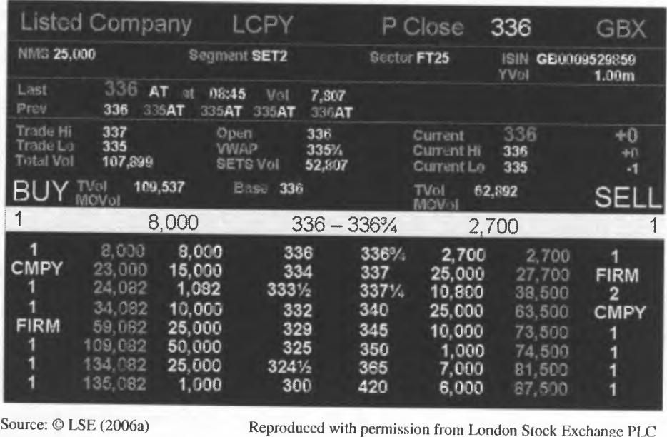  
Figure 2-2 A typical order book trading screen

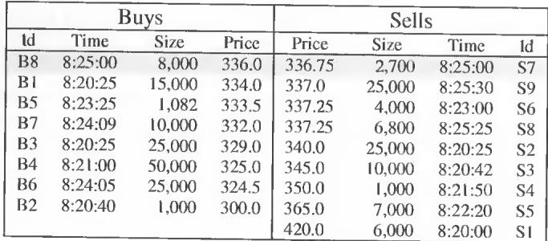  
Fignre 2-3 A simplified representation of an order book

On the other hand, if the entire order book is visible, or even just the best five orders, traders can immediately sce the range of available prices and volumes. By using the visible liquidity, they can then adjust their valuations to determine their own price for the asset.

Note that sometimes the best bid and offer price might temporarily be the same, in which case the market is said to be "locked". If the best offer price is below the best bid, it is termed "crossed". These situations can arise in some markets where the prices are based on multiple dcalers, or take feeds from other venues. Each market will have its own way of dealing with this, getting the order book back to normal as quickly as possible.

# Price discovery / trade execution

Price discovery is synonymous with trade execution, it occurs when supply and demand requirements cross. The actual price at which this happens is determined by the mcchanism. There are three main types of discovery mechanism:

● Bilateral trading ● Continuous auction ● Call auction

Bilateral trading is mainly used for quote-driven and negotiation-hased trading, whereas order-driven and hybrid markets adopt more multilateral auction-based mechanisms. The main difference between the two types of auction is the frequency. Unlike continuous auctions, call based auctions allow orders to accumulate for some time before the actual discovery (or matching) takes place.

Notc that some markets do not have an independent price discovery mechanism: An auction takes place, but the execution price is dcrived cxternally (often from the primary market). As an example, we will see how a mid-point match works for continuous auctions.

# Bilateral trading

As its name suggests, bilateral trading represents one-to-one trading mechanisms. Therefore, it is mainly used for quote-driven and negotiation-based trading, although some hybrid markets also support this method.

A market maker's two-way quote statcs both the prices and quantities that they are willing to trade at. The bid price represents what they will pay to buy an asset whilst the offer is what they will sell it for. As we saw in Figure 2-1, price discovery only occurs if a clicnt is prepared to deal at these prices. In which case, they may then "hit the bid" (sell) or "take the ofler" (buy). Alternatively, they can try to renegotiate a ncw price, often for a diferent quantity, or simply walk away.

The one-to-one nature of bilateral trading mcans that cach party gencrally knows the other's identity. This allows the market maker to tailor their quote based on the client. In particular, they can estimate the risk of adverse selection and incorporate this into their quote. Note that some protection is given to clients by the two-way quote, since they do not have to immediately disclose whether they are buyers or sellers, which could prejudice the market maker's price.

Multi-dealer systems do not change the fundamentals of a bilatcral trading mechanism, but they can help speed it up. As Figure 2-4 shows, by aggregating the market maker quotes a customer can easily see the available prices and sizes without having to contact them individually. For simplicity, each broker is shown on a separate row, together with a shaded row for the best bid and offer quotes. Although many systems allow this view to be sorted by price, so that it looks likc an order book.

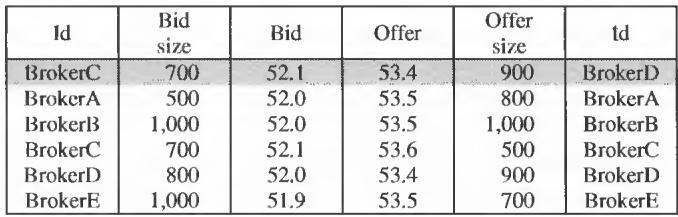  
Figure 2-4 An example multi-dealer quote view

Price formation is still done by the dealers, although in a multi-dealer environment they will often need to provide continuous updates. This gives us a better idea of their prices, without even having to contact dealers, and so give away our interest. For markets where they are obliged to make firm quotes, such as NASDAQ, we can then immediatcly hit or if a quote to trade. Some hybrid markets also support spccial order typcs that allow clicnts to direct ordcrs to specific market makers. For example, NASDAQ used to providc a directed non-liability order that could be routed to a spccific market maker. They were then allowed to choosc whether they acccpted the order. The market maker could also opt to accept part of the order, try to renegotiate a deal or just decline the order, all within a fixed time limit (5s).

For some multi-dealer systcms, the price quotes are mcrely indicative, so we must click on a broker to issue a "request for quote" (RFQ). This will then signal our interest to the markct maker, who will then give a quote, as shown in Figure 2–5.

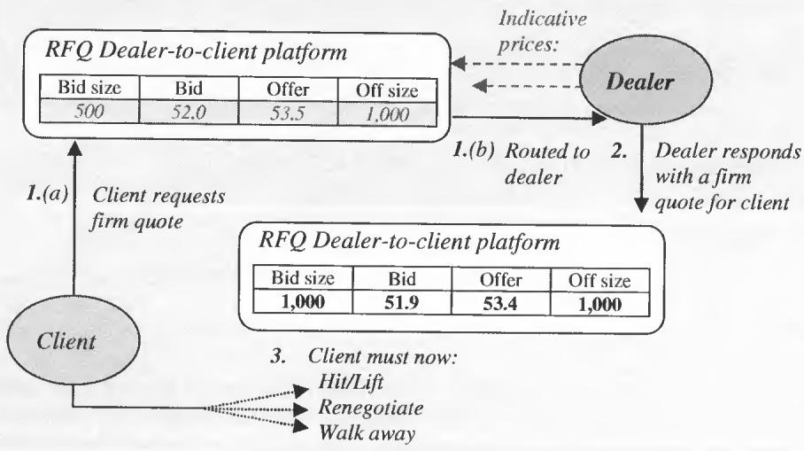  
Figure 2-5 An example Request For Quote (RFQ) mechanism

Notc that Figure 2-5 depicts a two-way quote, but many RFQ systems only support onc. way quoting, so the client must also state whether they wish to buy or sell the asset.

Streaming quotes via "request for strcam" (RFS) is another altcrnative. With RFS, we are actually requcsting a stream of updates rather than a single one-off quotc, as shown in Figure 2-6. Since each new update is a firm quotc, we can dccide whether to trade with the dealer by hitting or lifing. Alternatively, we can opt to wait and see whether the price improves for subsequent updates. Whilst it is still not quitc the same as trading on a continuous order book, this is a much more dynamic approach than RFQ-based trading, since the onus has now shifted to the dealer to provide a continuously updating stream of firm quotes.

Typically, these request-driven approaches are used in the fixed income (mainly RFQ) and forcign cxchange (both RFQ and RFS) markets.

Anonymous bilateral mechanisms have also been introduced, most notably Liquidnct's crossing service. Requirements for buys or sclls are entercd anonymously. If the system finds a potential match, it then creates a negotiation session betwcen the two partics. Each counterparty can sce a scorecard for the other. This summariscs their history of previously successful negotiations, allowing them to gaugc the validity of each other. They can then negotiate the quantity, whilst the price is often set by the primary market, such as the U.S. National Best Bid and Offer (NBBO). Only aftcr succcssful execution may thcir actual identitics become known.

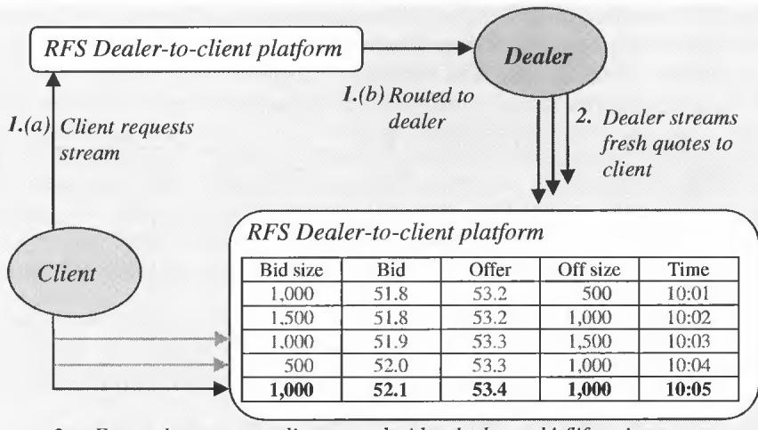  
Figure 2-6 An example Request For Stream (RFS) mechanism

3. For each new quote client must decide whether to hilift or ignore

# Continuous auction

The continuous auction mechanism consistently applies the matching rules each time an order is added, updated or cancelled. This is a multilateral process with many different traders all placing and amending orders. Therefore, a queuing system is needed to ensure that each order is processed in turn, as shown in Figure 2-7.

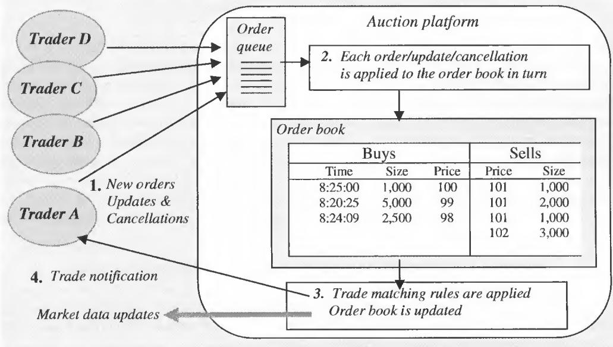  
Figure 2-7 An example continuous auction mechanism

For each order, the following steps are applied:

The order instruction is added to the internal order book • Trade matching rules are then used to see if any matches are now possiblc • The order book is updated lo reflecl any changes • Execution notifications are sent for any resullant matches

Then the cycle simply slarts all over again for the next order instruction in the qucue. In terms of the actual trade matching, strictly defined rules are consistently applied. Typically, markets give the highest priority to orders based on price, but a variety of approaches is uscd for the secondary priority. The two most common are timc and pro-rata, some markets also give priority to the firsl order at a set price point whilst others may cven give priority to specific users.

Price/time based trade matching is common in most equities markets. The highest priced buy orders and the lowest priced sells are rewarded with the highest probabilities of exccution. For orders at the same price, the time they were placed is then used to distinguish between them, thus favouring earlier ordcrs.

Price/pro-rata trade matching is more common in futures markets. Again, the best priced buy and sell orders take priority, but allocation between orders at the same price point is done on a pro-rata basis. So cach order is allocated bascd on its proportion of the total volume of orders al thal price. Thus, rewarding larger orders ralher than those placed earlier.

For example, let's look at how a market order to buy 1,000 EEE might be handled for the order book shown in Figure 2-8. Adopting a price/time bascd priority, we can see 1hat the orders are already arranged in terms of their pricc and lime. The carlier scll order S1 takes priority over the similarly priced S2 and S3 and the higher priced S4.

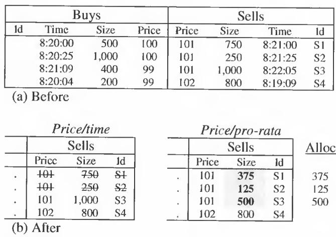  
Figure 2-8 An example buy order matched with different priorities

Based on the size of the incoming markct order, we can see that ordcr S1 will be filled completely, as will Ihe next order S2. Afterwards, order S3 now has both price and time priority for any new incoming buy orders.

In comparison, using a price/pro-rata based approach the allocalion (labellcd Alloc) is based on order size, since orders S1, S2 and S3 all have thc same price priority. The proporlions allocaled are based on each order's size divided by the total amount available at that price. So order S3 will be allocated (1,000 / 2,000) = 50% of the incoming order. Order

S1 willget $( 7 5 0 / 2 0 0 0 ) = 3 7 . 5 \%$ leaving the remaining $1 2 . 5 \%$ for order S2. The net result is that all three orders receive partial execution and remain on the order book ready for the next cxecution. The residual amounts are highlighted in Figure 2-8(b), confirming that this approach rewards size nearly as much as price.

Some continuous markets do not have an independent price discovery mechanism. Instcad, the execution price is derived externally (usually from the primary market). Often this is the midpoint of the cxternal best bid and offer prices. If market orders are supported, they execute at the mid-point whenever there is sufficient volume available on the other side of the order book. Limit orders will only match when the mid-point price is better than their limit. So the limit prices shown in Figure 2-9 actually refer to this mid-point.

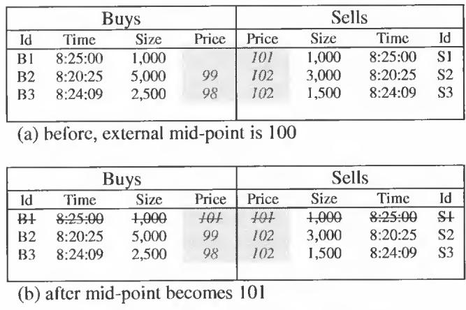  
Figure 2-9 An example mid-point match

On a normal continuous auction, the market order B1 would simply have crossed with order S1. But it is unable to do so because the external best bid and offer is 99-101, which is below the mid-point limit of 101 for order S1. As soon as the external mid-point shifs to 101, BI can cross with order S1 since the mid-point is now sufficient. Note that both orders achicve the mid-point price, so unlike a normal market order B1 has not had to pay half the sprcad; though, it has sacrificed immediacy for this price improvement. This mechanism is generally used to support continuous crossing for block-size orders, hence the order book shown in Figure 2-9 would be completely opaque.

Clearly, a wide variety of continuous trade matching mechanisms are in use. In Chapter 8, we will review some of these in more detail.

# Call auction

A call auction may occur as little as once a day or as frequently as every 10 to 15 minutes throughout the trading day. Essentially, the process is similar to Figure 2-7 in that orders are queued up and applied to the auction order book. Still,trade matching is not instantaneous; it is carried out at a set auction time. The goal is to ensure that the maximum possible volume of orders is crosscd at the auction price. Hence, orders accumulate before the auction takes place, allowing longer for price formation. This can be particularly useful when there is more uncertainty about what the price should actually be. In fact, many markets that use continuous auctions often choose to open and close the market with a separate call auction in an effort to reduce price volatility.

Before the crossing begins, the venue may also publish information about the overall imbalance between the buy and sell orders. They may even offer an indicative auction price to help traders to decide on pricing for their auction orders.

The auction erossing begins by checking that the order book is crossed; in other words, either the book contains market orders (MO) or there are buy orders with limit prices higher than some of the sell orders. It will then try to determine the hest price for the auction. For the example order book shown in Figure 2-10(a), the best crossing price is 104.

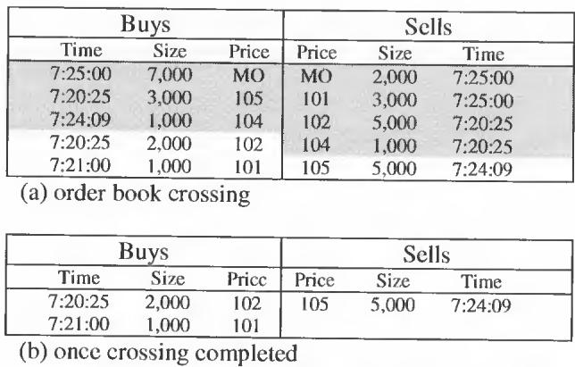  
Figure 2-10 An example call auction crossing

Note that this auction price is generally determined independently, although for some crossing systems it may actually be derived from another market. Alternatively, if a single best price cannot he found then the price will be based on a referencc price; generally, this is the last traded price (so last night's close for an opening auction or the last trade for a closing auction). We shall cover the specifie criteria for determining the auction price in more detail in Chapter 8.

Once an auction price is determined, the order book is then processed to match any orders that will execute within this price limit. These rows are shaded in the example order book shown in Figure 2-10(a). Note that many venues use time as a secondary priority, this rewards the early entry of auction orders.

Having completed the auction, the order book is then updated for the matched orders and trade notifications are sent out. Note that if this was the opening auction for a continuous double auction market, then Figure 2-10(b) shows the order book as it will he when the market officially opens for continuous trading. Alternatively, if this was for the close or an intraday/batch call auction then the orders will either be cancelled or left for the next auction crossing (although this depends on the market).

# Reporting, clearing and settlement

The final stages of the trading mechanism are reporling, clearing and settlement. Once a trade has been executed, detailed confirmations of the deal must be reported to the associated counterparties, the market authorities may also need to be informed.

'The next stage of the process is clearing, which is basically a preparatory step before actual settlement. Clearing involves validating the trade and settlement details, as well as ensuring that the buyer and seller have the required assets/funds to be able to proceed. Often, a spccific clearing agent wil be mandated for trades at regulated venues such as exchanges.

The settlement process represents the actual exchange of assets and funds. The details for the buyer and seller are matched; a payment is made from the buyer's account and the asset's ownership is reassigned. Nowadays, most financial assets are dematerialised, so this literally means updating a book cntry to reflect the change in ownership. However, for some assets, such as commodities, it can still involve a physical delivery. Generally, this process is handled by security deposilorics or dedicated custodians, financial institutions that specialise in the safekeeping of asscts. Custodians also manage any associated interest or dividend paymcnts, and even handle corporate actions for the holdings. Many security depositories and custodians have now become international, catering for a wide range of markets and allowing cross border trading.

The clearing and settlement process has become inereasingly automated to keep up with elcctronic trading. Straight-through-processing (STP) offers the prospect of a fully electronic trading, clearing and settlement pathway. Gradually, more and more markets are migrating to supporl electronic clearing and setlement. Settlement dates used to commonly be five working days after the actual execution, denoted as $_ { \mathrm { T } + 5 }$ This is gradually shifting to $\mathrm { \bf T } + \mathrm { \bf l }$ and ultimatcly towards $\mathrm { T } { + } 0$ .

Increasingly, execution venues are adopting a central counterparty (CCP) approach for their clearing and setlement. This effectively splits each deal into two parts; cach half is then transacted versus the CCP. So the huyer actually pays the CCP in return for the asset, whilst the seller must deliver the asset to the CCP in return for payment. This helps reduce counterparly risk as well, since the central counterparty now bears the risk of default. The CCP mcchanism also allows for fully anonymous trading, since each party will only need to deal with the CCP. The buyer and seller just nced to provide suficient collateral to cover their trades. This also means clearing can be netted across all a participant's trades for an asset, resulting in a single net trade versus the CCP. Clearly, such netting means much less lransfers and settlements and so can lead to substantial cost savings. It can also help reduce the required margin (or collateral) commitments needed to cover credit risk. Many central counterparties support margining across different assets, so the margin for a futures position may be reduced by a corresponding holding in the underlying asset. This can help reduce the costs of funding/position management.

For more information on the clearing and settlement processes, the review by Marcc Pagano and Jorge Padilla (2005) is a good starting point.

# 2.5 Transaction cost measurement and analysis

Transaction costs are the last key area for market microstructure research. Thcy are unavoidable, and are incurred cach time an asset is bought or sold. Costs can have a considerable cffect on investment returns and so affect market eficiency. Increased costs mean that investors must seek higher returns, and so they reduce the number of potential trading opportunities. In turn, this means that investors may hold positions for longer periods, helping to reduce trading volumes and so decreasing overall market liquidity. Electronic trading has helped increase market access to a wider range of participants. In so doing, it has improved market efficiency and led to a reduction in overall transaction costs.

By carefully measuring and analysing transaction costs, we can try to minimise them. Hence understanding how and why they occur has become a key factor in achieving significant investment returns. Clearly, the first stage is accurately measuring the overall costs. Post-trade analysis has also proved important for performance analysis, enabling comparison of both trading styles and individual brokers/traders.

Further research has broken down transaction costs into separate components, such as market impact and timing risk. A combination of theoretical modcls and cmpirical analysis has allowed accurate cost models to be crcated. These can be uscd for pre-trade analysis to estimate the potential cost, and so may be used to choose the most appropriate trading stratcgy.

# Cost measurement

Cost measurement has focussed predominantly on spreads and henchmark priccs. Both measures arc easy to calculate and can give meaningful insights.

# Using spreads

Spreads have long been a popular mcasure for cost measurcment, in part duc to thc simplicity of determining them. They have also been used as a mcasure of overall market efficiency. Many academic studies have compared thc average spreads for various markct types. Table 2-3 shows the key spreads which are commonly used:

Table 2-3 The different ty pes of spreads   

<table><tr><td rowspan=1 colspan=1>Type</td><td rowspan=1 colspan=1>Measures</td><td rowspan=1 colspan=1>From:</td></tr><tr><td rowspan=1 colspan=1>Quotedspread</td><td rowspan=1 colspan=1>Market quality</td><td rowspan=1 colspan=1>Difference between best bid and offer price</td></tr><tr><td rowspan=1 colspan=1>Effectivespread</td><td rowspan=1 colspan=1>Execution cost</td><td rowspan=1 colspan=1>Signed difference betwecn trade price andquotc midpoint when order was rcceived</td></tr><tr><td rowspan=1 colspan=1>Realizedspread</td><td rowspan=1 colspan=1>Trading intcrmediaryprofits</td><td rowspan=1 colspan=1>Signcd difference bctween trade price andquote midpoint 5 minutcs after the trade</td></tr></table>

As we have already scen, the bid offer sprcad can be attributed to a range of factors. Market makers use it to compensatc themselves for the fixcd costs incurred by trading, as well as to protect themselves from the risk of advcrse sclection. Similarly, sprcads arise in purely order-driven markets as a function of the available supply and demand.

Thc effcctive spread represents thc diferencc between the achieved trade price and the mid point between the bid and offer when the order was first received. It mcasures the actual cost our order incurred by executing in the market.

The realized spread compares the difference between the trade pricc and the mid price five minutes later. It is somctimcs used as a measurc of the potential profits that may be made by trading intermcdiaries, i.c. market makers, dcalers, brokers.

Note that to comparc effcctive and realized spreads with the quoted spread the cost differences need to be doublcd, since they are both calculated using the mid price.

# Using benchmarks

Price benchmarks are extensively used to monitor the performance of trades. They have also become a key factor in measuring transaction costs. Performance is often measured in basis points (bps), which are hundredths of a percent.

A widc variety of benchmarks may be uscd, ranging from opening and closing prices to averages such as the Volume Weighted Average Price (VWAP). One way of choosing between them is based on when they may be determincd. Post-trade henchmarks will not be availablc until after the close of trading. Likewise, intraday benchmarks that span the wholc trading day will not have a dcfinitive value until the close. Nevertheless, interim values may be calculated throughout the day. Pre-trade benchmarks are available before the main trading session starts. Tablc 2-4 summarises the different benchmarks based on this categorisation:

Table 2-4 Classifying benchmark types   

<table><tr><td rowspan=1 colspan=1>Type</td><td rowspan=1 colspan=1>Name</td></tr><tr><td rowspan=2 colspan=1>Post-Trade</td><td rowspan=1 colspan=1>Close</td></tr><tr><td rowspan=1 colspan=1>Future Close</td></tr><tr><td rowspan=3 colspan=1>Intraday</td><td rowspan=1 colspan=1>Open-High-Low-Close (OHLC)</td></tr><tr><td rowspan=1 colspan=1>Time Weighted Average Price (TW AP)</td></tr><tr><td rowspan=1 colspan=1>Volume Weighted Average Price (VWAP)</td></tr><tr><td rowspan=4 colspan=1>Pre-Trade</td><td rowspan=1 colspan=1>Previous Close</td></tr><tr><td rowspan=1 colspan=1>Opening Price</td></tr><tr><td rowspan=1 colspan=1>Decision Price</td></tr><tr><td rowspan=1 colspan=1>Arrival Price</td></tr></table>

Post-trade benchmarks are gencrally closing prices. Most commonly, the currcnt day's closing price (or closc) is taken, although other future prices may also be used. Closing prices have long been a popular benchmark, in particular because they are often used as a milestone for marking to market and for profit and loss (P&L) calculations.

Intraday benchmarks use an average price to more accurately reflect market conditions. This is because markets tend to be more active at the close, so the closing price will not ncccssarily reflect the actual conditions throughout the day. One of the first popular intraday benchmarks was the Open High Low Close (OHLC) average. More accurate averages have also been adopted, as tick-by-tick price and volume market data has become more widely available. For instance, the Time Weighted Average Price (TWAP) applics an equal wcighting to al the day's trade prices. Alternatively, the Volume Weighted Average Price (VW AP) weights each trade price by its corresponding size, so the average will most reflect the largest trades. This ability to accurately relect intraday market conditions has made VWAP an extremely popular benchmark.

Pre-trade benchmarks arc also useful since they arc both easily determined and readily available. As the use of transaction cost analysis has become more widespread implemcntation shortfall is increasingly used as a measure of performance. Effectively, this represents the diference betwcen the average pricc achieved in execution, and the market price when the investor's decision was first made (the decision price). Pre-trade benchmarks correspond well to the decision price, hence their popularity.

# Analysing the components of transaction costs

Transaction costs incorporate much more than just broker commissions and thc bid offer spread. The market trend to un-bundle research fees has helped make it much easier to quantify thc actual transaction costs.

The different cost components are commonly termed as cither explicit or implicit. Likewise, they represent fixed overheads or a variable amount that will differ bascd on the asset, the order, markct conditions and the trading strategy.

The explicit costs are clearly identifiable and easily measured. They are commissions, fees and taxes. Often, these will be quoted in advance of trading as percentages of the traded valuc or as basis points. They may be reduced to a certain extent, based on ncgotiation between the investor and the brokers. The rates offered will usually depend on the client's trading volumes and the level of service they require.

The implicit costs are generally associated with the actual trading proccss, and are harder to quantify, since they are less directly observable. They tend to be more variable, but often have a greater impact on the overall performance. Indeed, they are often represented as the hidden part of an iceberg $( 9 / 1 0 ^ { \mathrm { t h s } }$ below the surface). Waync Wagner and Mark Edwards (1993) proposed separating the implicit trading costs into the following components:

Timing cost (due to price trends and timing risk) • Delay cost Impact Opportunity cost

All of these are price related and corespond to decisions that the investor and trader must make, based on knowledge of the order and current market conditions. Figure 2-11 provides a view of thesc costs based on the relative visibility of each component. Note that the size of each cost component will vary based on the asset, order size and trading style so Figure 2-11 is not drawn to any particular scale.

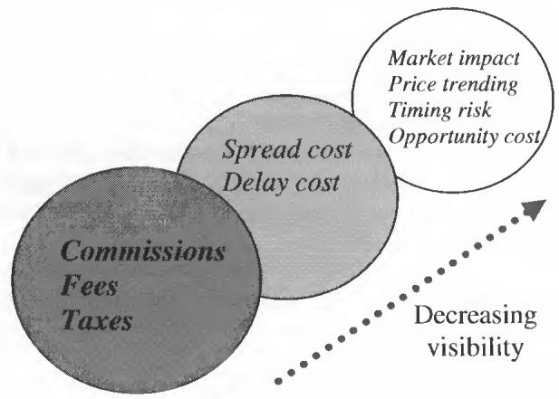  
Figure 2-11 Transaction cost components

Starting from the most visible components, we have:

Commissions: This is most obvious cost component, representing the broker's compensation for providing the trading service. In particular, this should cover both their capital and labour costs.

Fees: Charges may be levied by floor brokers and cxchanges as well as any costs associated with clearing and settlement. Note that fees are often rolled into the overall commission charge.

Taxes: Generally, taxes are an investment cost, applied to any realized profits from capital gains. However, some markets also apply additional duties Ior trading. For cxample, the U.K. stock market applies a $0 . 5 \%$ stamp duty on share purchases.

Spread cost: The bid offer spread compensates traders for providing liquidity. The spread usually reflects the liquidity of an asset. There are noticeable differences in average spreads across the capital markets. For instance, decimalisation in the U.S. equity market has resulted in considcrably lower average spreads than in either Europe or Asia. Spread may be classed as a visible cost, although it is not always as easily measurable as fees or commissions. For single executions, it is obviously straightforward to measure, but for rades that are split up and worked over the day we must track the spread for each child order.

Delay cost: This reflects any price change from when the initial decision to invest is made and when an order is actually sent for execution. This may be because the decision was made before the market open; alternatively, time may be spent identifying the best way to trade the order. Delay cost can be a substantial proportion of overall costs, particularly for assets which are volatile or whose price is trending unfavourably. Therefore, to monitor this cost it is important for investors lo record the market mid-price when the initial decision is made and when an order is dispatched.

Market impact: This represents how much effect the order has on the asset's price. Larger orders result in a larger impact compared to smaller ones; however, the effect decreases significantly with asset liquidity. Market impact consists of both a temporary effect and a permanent one. The temporary market impact reflects the overall cost incurred by demanding immediacy (when combined with the spread cost). Whereas the permanent impact signifies the long-term information cost of the trade, based on how it affects the asset's overall order buy/sell imbalance.

Price trend: Asset prices may sometimes exhibit broadly consistent trends. An upward trend implies that costs will increase when buying an asset, whilst savings will be accrued if selling, whereas the opposite is true lor a downward price trend.

Timing risk: This cost reflects uncertainty, in particular for volatility in both the asset's price and its liquidity. The more volatile an asset then the more likely its price will move away and so increase the transaction costs. Similarly, if liquidity suddenly falls then market impact costs will rise. Timing risk may be considerable, especially for volatile assets and for orders that have a long trading horizon.

Opportunity cost: Orders are not always fully completed, maybe due to passive trading or unfavourable market conditions. This cost represents the missed opportunity, since the next day prices may move cven further away.

Clearly, there is a lot more to transaction costs than just the explicit costs. In Chapter 6, we will cover this topic in much more detail using worked examples to provide in-depth post-trade analysis of sample orders. We wil also cover the increasingly important field of pre-trade transaction cost analysis, which is used to compare potential trading strategies.

# 2.6 Summary

Market microstructure concentrates on the actual trading process, analysing how specific dcsigns or mechanisms affect both observed prices and traded volumes as well as helping to cxplain the associated costs.

Liquidity represents the eost for converting an asset into cash or vice versa.

Markets may be classified in terms of two main mechanisms:

Purely quote-driven markets, where traders must ransact with a dealer (or market maker), who quotes prices at which they will buy and sell a given quantity.   
Purely order-driven markets, where traders participate equally, hy placing orders.   
These are then matched on the order book using a consistent set of rules.   
Increasingly markets are actually hybrids of these two approaches.

Trading may be broken down into three main stages:

Price formation Price discovery / trade exccution Reporting, elcaring & settlement

There are three key methods for trade cexeeution:

Bilateral trading, which is a one-lo-one negotiation olten with a market maker. Continuous auctions, where matching rules are applied each time an order is addcd, updated or eancelled to determine whether there is a resultant cxceution. Call auetions, where orders are allowed to aecumulate for a set time before the matehing rules are applied, and so helping to reduce price volatility.

Transaction eosts are unavoidable, they are ineurred each time an asset is bought or sold. Cost measurement has focussed predominantly on spreads and benehmark prices. Costs may be hroken down into two mnain classes:

Explicit costs, such as commissions, fees and taxes, are clearly identifiable and easily measured. Implicit costs, such as market impact and timing risk, are generally associatcd with the actual trading process and are harder to identify and measure.

# Chapter 3

# World markets

Investors, traders and trading systems are increasingly covering multiple markets and asset classes. Therefore, it is important to have a basic grounding in all the major world markets.

# 3.1 Introduction

The world's financial markets are vast, in terms of both their sheer size and the diversity of products they incorporate. Broadly speaking, we can break them down into several main catcgorics, namely the:

● Capital markets • Foreign exchange markets ● Money markets ● Derivative markets

The capital markets provide medium and long-term financing via stocks and fixed income assets, whilst the foreign exchange market enables the transfer of money across currencies. Short-term financing is provided in the money markets, which are closely linked to both fixed income and foreign exchange. The derivatives markets provide a means of trading financial contracts, which are in turn hased on underlying assets. The underliers may include stocks, honds, currencies, commodities or even other derivatives. In fact, so much commodity trading is handled via derivatives the commodity market has effectively been subsumed into the derivatives market.

Each market has its own strong identity. Even though many of the same players (brokers and investors) are involved in them, they are still often treated separately. In part, this is due to their different market structures. Conventionally, trading for equities and listed derivatives has centred on exchanges, whilst for many of the other asset classes over the counter (OTC) trading has predominated.

In the following sections, we will briefly cover the main asset class types and how they are traded. We shall then consider some of the major trends that are affecting the world's major markets. Finally, to try to put things in context we will compare the main world markets in terms of their overall sizes, trading volumes and the uptake of electronic and algorithmic trading.

Note that Appendices A-F provide more detailed reviews of each of the major markets. For even more in-depth analysis the reports compiled by consultancies such as the Aite Group, Celent, Green wich Associates and the TABB Group are invaluable.

# 3.2 Asset classes

Financial assets generally provide their issuers with a means of financing themselves, and investors with an opportunily to earn income. For example, stocks represent a share in the firm that issued them, whereas fixed income assets correspond to loans. Foreign exchange is a transfer of cash deposits in different currencies. Derivatives offer a way of trading on the future price of assets, providing both a means of insurance and an opportunily for speculation.

# Equity

Stocks allow companies to finance themselves by actually making their ownership public; cach share represenis a portion of the firm's inherent value, or equiy. This value represents what the corporation's remaining assets are worth once all the liabilities have been deducled. A finite number of shares are issued by public corporations, although they may also choose to issue new ones or buy back some of the outstanding shares. Firms may also make periodic dividend payments to shareholders.

Shares are forward looking investments, since they represenl a portion of the firm's total equity. Investors expect the value of their shares to increase or dividends to be paid in order to compensate them for the risk of bankruptcy.

Determining the fair value for equities is non-trivial. Present value theory states thal the value of an asset corresponds to a discounted sum of its future payments. This may be based on the present value of their future dividend payments. In turn, this depends on future earnings, which can be difficul to predict. Firms may also choose to reinvest some of their income rather than increasing dividend payouts. Consequently, there are countless different valuation methods thal may be applied to companies, each trying to tackle the range of possibilities.

A detailed review of equities and the associated markets may be found in Appendix A.

# Fixed income

Fixed income assets, such as bonds, allow both governments and corporations to publicly issue debi for periods of up to 30 years, or even perpetually. The issuer is obliged to repay the holder a specific amount (the principal) at a sei date in the future (the maturity date). Many names are given to these assets, but for the purposes of this chapter, we wil just use the term bond. The issuer of a bond will usually pay interest (the coupon) to the holder at a given frequency for the lifetime of the loan, e.g. every 6 months. Alternatively, zero coupon bonds make no such payments; instead, their price is discounted by an equivalent amount.

These debts can be issued by govermments, other agencies and by companies. They may also be issued based on pools of loans, which is the essence of asset-backed securities. Similarly, mortgage-backed securities are the equivalent for real estate deht. The effective interest rate, which the issuer must pay, depends on the maturity date of the contract as well as their credit raling and the current market rates. Bonds will sometimes have additional collateralization or protection to reduce thcir credit risk. They may also be differentiated in terms of their seniorily when it comes to bankruptey hearings. An indenture for each contract specilies any additional conditions. All of these features mean that bonds are much more bespoke assets than equities. In fact, there are more than three million different bonds in the U.S alone, which is two hundred times more than the number of equilies available globally. This diversity can pose serious liquidity problems, since for many assets it will be difficult to find sufficient depth to support a continuous market.

In general, bonds arc more straightforward to price than equities. Essentially, the fair price of a bond is the prcscnt value of al its future interest and principal payments. Thc present valuc incorporates a discount for thc market rate of return, which in turn depends on the bond's characteristics. The risk of default has a considerable impact on the price of bonds, macroeconomic factors, such as inff ation cxpcctations, can also have a significant effect.

A more detailed revicw of bonds and thc associated markets may be found in Appendix B.

# Foreign exchange

Forcign exchangc (FX) reprcsents the trading of currencies, essentially by transferring the ownership of deposits. Generally, what we first think of as foreign exchange is spot trading. FX spot transactions lock-in the current exchange rate for cash settlement, usually within two days. So a U.S. dollar / Japanese yen trade consists of seling U.S. dollars to another counterparty in cxchange for a specific amount of yen.

There are also FX derivative contracts, namely forwards, options and swaps. FX forwards (or outrights) may be used to arrange transfcrs for months or cven years in the future. They are bascd on binding contracts with a forward rate, which will then be used for an exchange at a specified datc in the futurc. This rate reflects the expected future exchange rate, and so incorporates the volatility of the two currencies. Hence, they offer a means of locking-in an cxchange rate. FX options are similar, although they give the purchaser the right to buy or sell, rather than an obligation. An FX swap is slightly more complex since it consists of two lcgs: a standard spot FX transaction linked with a simultancous FX forward trade. Initially, the two currencies are exchanged, and when the outright matures, they are swapped back again, at the pre-agrecd rate. They arc often used for much longer-term exchanges than FX forwards (years rather than months).

Pricing foreign cxchange rates can be quite difficult, since they are affected by a wide rangc of economic factors, such as changes in economic growth, inflation, intcrest rates or budgct/trade balances. Traditional exchange rate determination models based solely on macrocconomic factors have failed to cxplain and forecast fluctuations in exchange rates. Alternative models have adopted market microstructurc based approaches to analyse order flow with somc success.

A more detailed review of FX and the associated markets may be found in Appcndix C.

# Money markets

The moncy markcts are key to the provision of short-term financing for banks, institutions and corporations. This may range from overnight to around a month, although it can be for as much as a year. Typical money market assets are short-term debt, deposits, repos and stock lending. Thcrcfore, the money markets are also closely linked to both fixed incomc and forcign exchangc.

Short-term dcbt encompasses a rangc of types, from traditional fixed income contracts to tradahle loans/dcposits and commercial paper. Government bonds, such as U.S. Treasury bills, provide a comparativcly risk-free investment, particularly over the short term. Interbank lending is also an important source of short-term liquidity for banks, particularly ovcrnight. In the U.S., this corrcsponds to the "Fed funds" depository accounts held with the Federal Rescrve, whilst in Europe it is Eurodollar deposits. There are also secondary markcts for ncgotiable (or tradable) cash deposits and banker's acccptanccs (or money drafts). Commcrcial paper is traded as well; this represents unsecured promissory notes issued by corporations as an alternativc (and chcaper) means of funding. Although the 2007-09 financial crisis and rcsultant market turmoil has had a considerable impact on the short-term debt markets.

A repo is the common name for a sale and repurchase agreemcnt. Essentially, this is a secured loan. The scller provides securitics in return for cash, but they also commit to repurchase thcm back on a specified date at a set pricc. At the agreed maturily date, the seller repays the cash loan together with an interest payment, whilst the securities are returned to them. The interest paid is based on a pre negotiated repo ratc, which will often be offset from a benchmark, such as the Fed funds rate. There are two main lypes of repo: Specific repos are for a ccrtain security. General collateral repos allow the security to be fungible so any acceptable security that meets the set requirements may be used. This flexibility is reflccted in a lower lending rate.

Sccurities (or stock) lending is like a rcpo without the loan; the securities are simply lent for a fce. As with repos, the type of lending may be classilied into general and specific. General lending offers a security thal is equivalent to a repo with genceral collateral, so it just needs to match a set of criteria. Again, the fees for lcnding depend on the scarcity of the security, so general lending costs significantly less.

A more detailed review of the money markets may be found in Appendix D.

# Derivatives

As their name suggests, derivative contracts are derived from other assets, referred to as the underlying assets. Purely financial derivatives were first created in the 197Os. These allwed the underlying assets to expand beyond commodities to also include stocks and stock indices, bonds, currcncies or cven other derivativcs.

The main types of derivative contract are forwards and futures, options, swaps and credit derivatives. They may be classificd as cithcr "listed"(or exchange-traded) or over the counter (OTC). Listed derivatives are standardised contracts that may be traded much like stocks; typically, these are futures and options contracts. OTC contracts are bespoke, so they may represent more complex or exotic derivatives contracts.

# Futures and options

A forward contract is an agreement to buy (or sell) a lixed quantity of a given assct at a certain price al a specific date in the future, e.g. a contract to buy 5,000 bushels of grain in July for $\$ 3$ . When the maturity datc is reached, the contract expires and the transaction must then bc scttled. A futures contract is just a forward with standardised terms (e.g. amounts, prices, datcs) which is traded on an exchange.

Option contracts are similar to forwards and futures in that they allow a price to he struck to trade a set quantity of a given asset at a specific future date. The settlement pricc is called the strike price of the option. Thc premium rcprescnts the actual price paid for the option contract. An option to buy is called a call, whilst a contract to sell is a put. Options may also be classified as European or American style. This refers to when they may actually be exercised. American style options may hc cxcrciscd at any time prior to the cxpiry date, whercas Europcan stylc options may only be cxcrciscd at maturity.

The main difference bctwccn futurcs (or forwards) and options is that the owner of an option is not obliged to trade. So if the market price is more favourable they may choose not to exercise their option contract (hence its name). Whereas the creator (writer) of the option contract is obliged to trade, should the purchaser wish to do so. Thereforc, whilst there may he plenty of investors who want lo buy calls or puts much fewer may be prcpared to sell them. Hence, spccialised broker/dealers olten play a vital role as liquidity providcrs and market makers.

Pricing these derivatives can be complex. They are obviously based on the price of thcir underlying asscl/s. For instance, a futures contract rcflects the expected future value of its underlier discountcd to give a present value. Other factors may also need to be considered, such as the interest rate and any additional costs related to storage or transfer (typically for commodity-bascd contracts), or any potential incomes (e.g. from dividends).

Options are morc complex to price than futures, although many standard pricing modcls exist, such as the ubiquitous Black Scholes equation created by Fisher Black and Merton Scholes (1973). These can compute the fair value of an option based on factors such as the contract's strike price, the underlying asset's market price and its volatility, the time left to expiry and the risk-frec interest rate.

# Swaps

A swap is essentially an agreement between two counterparties to exchange cash streams. Thesc may be linked to fixed/floating interest rates, currencics, or even dividend payments. Thus, they offer a flexible means of controling cash flows, which goes some of the way to explaining their popularity. The commonest type of swap is a straightforward Interest Rate Swap (IRS). A vanilla interest ratc swap consists of one leg based on a floating rate of interest whilst the other has a fixed rate. Note that the principal (or notional) amount is not actually cxchanged; only the associated intercst payments are swapped. A wide rangc of other swaps may also be traded. For example, basis swaps have both legs based on floating rates. Currency swaps allow firms to borrow in the currency where they can obtain the best interest rate then convert this to the currency they actually need. Total return swaps exchange interest payments for the total return of an asset or basket of assets whilst asset swaps reprcsent the combination of an interest rate swap with a fixed rate bond. There are also many models for pricing swaps, but they are beyond the scope of this book.

# Credit derivatives

Credit derivatives act as financial guarantees, which may be used to provide protection against a variety of credit events, but most typically default or bankruptcy. A credit default swap (CDS) is a contract that transfers the credit risk for a notional amount of debt issued by an entity. The purchascr gains protection from this credit risk, whilst the seller is paid regular premiums for thc lifetime of the contract. If a credit event occurs then the seller must compensatc thc purchaser and the contract cxpires. The typical maturity for a CDS contract is five years. CDS indiccs cxpand the scope by covering muliple entities, often encompassing more than a hundred separate companies. They have proven to be incredibly popular, since they allow investors to make much broader macro trades for credit risk. Leading cxchanges have also startcd to offer futures and options based on underlying CDS indices. Again, there are many models for pricing credit derivatives, but they are beyond the scope of this book.

A more detailed rcvicw of derivatives and their markets may be found in Appendix E.

# Other asset classes

A few types of financial asset do not quite fit in the main categories. Most notably depositary rcccipts and cxchange traded funds. Both asset classes have seen substantial growth over the last fcw years.

Depositary receipts (DRs) represent shares in a forcign company. They provide an alternative to cross-border trading, as well as being an important means of accessing the major financial markets for foreign companies. DRs essentially act as proxics for forcign shares that may be traded locally, either at cxchanges, other cxcution venues or OTC. They are issued by a domestic bank or brokerage against their own inventory of the foreign stock. Any dividends are generally paid in the local currency, and for a fee the depositary bank will convert the reecipts back into the underlying stock. So, in many respects, these behave much like domestic stocks. Although to gain voting rights, the DR must be part of a sponsored program, since the depositary bank must organise the proxy votes. The two most common types are American Depositary Receipts (ADRs) and global depositary receipts (GDRs). ADRs are traded OTC or on thc major U.S. cxchanges, whilst GDRs allow trading in more than one country. Pricing these assets is based on the current market price of this underlier, adjusted by the current market exchange rates and any associated fces.

Exchange traded funds (ETFs) are a tradablc share in an investmcnt fund. Since they represent baskets of assets, they are an extremely clficient means of gaining cxposure to whole sectors or markets, mueh like index futures. ETFs are gencrally classified as either being index or optimised. Index funds passively track, or replicate, a specilic benchmark whilst optimised funds try to beat the benchmark and so adopt similar techniques to active invcstors. Note that ETFs are not just restricted to equities; they may also be crcatcd hased on portfolios of bonds or cven commodities. In terms of valuation, the net asset valuc (NAV) of a fund is essentially the total value of all the assets in the fund divided by the number of shares issued. Because of thcir inherent transparency, the NAV is casily calculated, although for funds holding foreign assets differences in timc zones and FX rates can lead to discrepancies between the market pricc and the NAV.

A morc detailed review of the markets for these assct types may be found in Appendix F.

# 3.3 Market structure

In Chapter 2, we covered the basic trading mechanisms, specifically quote-driven and ordcrdriven execution. Initially, most markets begin with quote-driven trading. For instancc, imagine an exotic new class of asset: To start off the market is so specialised that there may only be a single dealer prepared to "make a market" for this. Any trading is invariably a oneto-one proccss between the dealer and cach client (investor), as shown in Figure 3-1(a).

Gradually the number of investors (or potential clients) will increase and so morc dcalers will get involved. This enables clients to check prices with several dealers before deciding to trade, as shown in Figure 3-1(b). Trading is still bilateral and quote-driven, but at least there is more choice. This type of structure is the basis for much of the "over the counter" (OTC) trading which takes place for a wide range of assets, from stocks to bonds and derivatives.

Eventually the marketplace may bccome so large that there is enough trading (and participants) to warrant dedicated execution venues, as shown in Figure 3-1(c). Historically, inter-dealer networks started out as organiscd exchanges, whilst dealcr-to-clicnt communications were handlcd by brokers. Over time, these have increasingly shifted to phone-based and/or screen-based electronic trading platforms.

Trading for many of the world's assets is now based on market structures similar to Figure 3-1(c). For highly standardised assets, such as equities, trading has continucd to develop around exchanges, whilst for less standardised ones, such as bonds or complex derivatives, much of the trading is carried out OTC or via specialised inter-dealer brokers (IDBs).

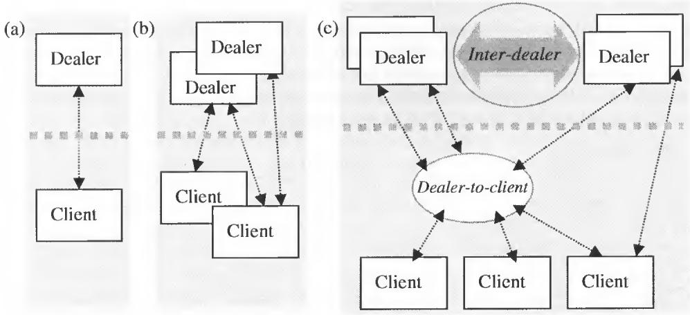  
Figure 3-1 Three phases of marketplace development

Table 3-1 tries to provide a broad summary of these market structures for the major asset classes, although inevitably there are some isolated exceptions.

Table 3-1 Market structure across asset classes   

<table><tr><td rowspan=1 colspan=1>Asset class</td><td rowspan=1 colspan=1>Inter-dealer</td><td rowspan=1 colspan=1>Dealer-to-client</td><td rowspan=1 colspan=1>Alternative</td></tr><tr><td rowspan=1 colspan=1>Equities</td><td rowspan=3 colspan=1>Exchange</td><td rowspan=3 colspan=1>Single/Multi broker, DMA</td><td rowspan=3 colspan=1>ECN/MTF, ATS</td></tr><tr><td rowspan=1 colspan=1>Derivative (Listed)</td></tr><tr><td rowspan=1 colspan=1>Other (ADR, ETF)</td></tr><tr><td rowspan=1 colspan=1>Fixed income</td><td rowspan=3 colspan=1>OTC/IDB</td><td rowspan=3 colspan=1>Single/Multi broker</td><td rowspan=3 colspan=1>ECN, ATS</td></tr><tr><td rowspan=1 colspan=1>Foreign exchange</td></tr><tr><td rowspan=1 colspan=1>Moncy markets</td></tr><tr><td rowspan=1 colspan=1>Derivative (OTC)</td><td rowspan=1 colspan=1>OTC</td><td rowspan=1 colspan=1>OTC</td><td rowspan=1 colspan=1></td></tr></table>

Over the last few years, the strict segmentation between the dealer and client markets, visible in Figure 3-1, has started to blur. Alternative trading venues (accessed by both dealers and clients) have become increasingly important. They are the Electronic Communication Networks (ECNs) or Multilateral Trading Facilities (MTFs) and "dark pool" Alternative Trading Systems (ATSs) which have started to spread across the world's markeis. These further complicate the market structure, to the point where clients may even use certain venucs to hypass dealers altogether. We shall consider the impact of these alternatives in some more detail after a brief review of the inter-dealer and dealer-to-client markets.

# Inter-dealer markets

A strong inter-dealer market is vital for liquidity. Otherwise, dealers may be less willing to trade beyond their current inventory. Having a market where they can easily trade with other dealers enables them to control their positions and so meet their clients' requirements.

Many of the diferences between the world's inter-dealer markcts are historical. Exchange-based trading was originally based on open outcry auctions, and so the mechanism was order-based. In comparison, OTC trading is often bilateral and so quote-driven. However, the advent of electronic trading has resulied in many of the exchanges and interdealer brokers moving to platforms based on electronic order books. In fact, nowadays there are a lot more similarities between inter-dealer markets.

# Exchanges

Exchanges are probably the best-known venue for trading. The world's oldest cxchanges mainly date back to th $1 7 ^ { \mathrm { t h } }$ 0r $1 8 ^ { 1 \mathrm { h } }$ centuries, although organised exchanges may be traced back as far as the $1 3 ^ { \mathfrak { t h } }$ century.

Trading on exchanges is carried out by its members, who are primarily specialised dealing houses or broker/dealer firms. Historically, regulation and the costs of maintaining a presence on trading floors have ensured that exchanges remained the domain of dealers and brokers. Increasingly, though, brokers are offering their clients DMA access to exchangcs. Likewise, memberships are not limited to dealers; so large investors, who can justify the cost, can gain access by buying a membership. That is why the market segmentation is not quite as black and white as suggested by Figure 3-1(c).

As we saw in Table 3-1, exchange-based trading is generally adopted for more standardised assets. The largest markets are for equities and listed futures and options, but exchanges are also used to trade fixed income, money market and other types of asset. Table 3-2 gives some examples for the various asset classes and regions.

Table 3-2 Example exchanges by asset class   

<table><tr><td rowspan=1 colspan=1>Asset class</td><td rowspan=1 colspan=1>Venues</td></tr><tr><td rowspan=1 colspan=1>Equities</td><td rowspan=1 colspan=1>U.S: New York Stock Exchange (NYSE), NASDAQEurope: London Stock Exchange (LSE), EuroncxtAsia: Tokyo Siock Exchange (TSE)</td></tr><tr><td rowspan=1 colspan=1>Futures/options</td><td rowspan=1 colspan=1>U.S.: Chicago Mercantile Exchange (CME), Chicago Board of Trade (CBOT),Chicago Board Options Exchange (CBOE)Europe: Eurex, London International Futures Exchange (Liffe)</td></tr><tr><td rowspan=1 colspan=1>Money markets</td><td rowspan=1 colspan=1>Europe (Debt/repos): Eurex Bonds</td></tr><tr><td rowspan=1 colspan=1>Fixed income</td><td rowspan=1 colspan=1>Europe: LSE, BME Spanish exchangcs, Eurex BondsAsia: Korea exchange</td></tr><tr><td rowspan=1 colspan=1>Other</td><td rowspan=1 colspan=1>DRs, ETFs: NYSE, LSE</td></tr></table>

Traditionally, the world's exchanges have been centred on floor-based open-outcry auctions. Some venues still feature this; however, over thc last few years electronic order books have now become the norm for most of the major trading centres. In terms of the actual trading mechanism, exchanges' electronic trading platforms arc generally based on central limit order books, often allowing anonymous trading. For liquid assets, this means continuous auctions, as we saw in Chapter 2. Call auctions are used for less liquid asscts, and are often adopted for the opening and closing periods to reduce volatility. Conventionally, stock markets have tended to adopt a price/ime based priority for their trade matching, whilst listed derivatives exchanges have ofien used a price/pro-rata based approach. That said, such distinctions are becoming increasingly blurred. For instance, in the U.S. the NYSE and NASDAQ stock markets have both launched their own dedicated cquity options

exchanges hased on a price/ime priority.

Stock exchanges have generally focussed on domestic trading, in part due to the higher level of regulation associated with equities. Still, over the last few years demutualization has scen many of the world's major exchanges become standalone corporations. In order to survive in the increasingly competitive markets, there has been wave after wave of global mcrgers and consolidations. Most notably, the mergers between the New York Stock Exchange (NYSE) and Euronext, and NASDAQ and the OMX, have created two massive entities competing for both U.S. and European volume. Global competition is likely to continue to increase over the coming years. Local competition has also been triggered by rcgulation. In the U.S., the Securities and Exchange Commission (SEC) introduced NASDAQ order handling rules in 1997, which helped spur new cxecution venucs (the ECNs). 2007 saw Regulation NMS, which was introduced to improve competition; oflering order protection at the National Best Bid and Offer (NBBO) for orders on the major U.S. stock exchanges and ECNs. Although competition has increased, the available liquidity has becomc more fragmented. Likewisc, in Europe, the Markets in Financial Instruments Directive (MiFID) regulations introduced in 2007 sought to encourage competition (and to regulate) olf-cxchange trading in the form of Multilateral Trading Facilities (MTFs), which are broadly similar to ECNs. Although some time bchind the U.S., the European markets are also starting to hecome fragmented, as competition takes liquidity away from the major exchanges. A more detailed review is provided in Appcndix A.

In comparison, the exchanges for listed derivatives have faced global competition for some time. U.S. and European exchanges have often launched rival contracts to try to grab liquidity from each other. Computerisation has also helped turn this into virtually a 24-hour marketplace. The U.S. equity option marketplace has become one of the most competitive market places in the world, wherc options may be traded on any one of seven cxchanges. Certainly, the U.S. equity options marketplace has seen some of the highest levels of growth of any of the world's listed derivatives markets. This highlights the benefits of a common clearing mcchanism and assets that are readily transferable.

Exchange-based trading is also important for other assets, particularly ADRs and ETFs. They may not have their own dedicated exchanges, but they contribute considerable flow to the world's stock exchanges. In fact, in the U.S. leading ETFs such as the SPDR are often the most traded assets on the major exchanges. Fixed income bonds are also traded on some stock and listed derivative exchanges.

Exchanges arc facing increased competition; however, the safety offered by centralised clearing and settlement means that other asset classes will no doubt continue to consider exchangc or cxchange-like market structures in the future.

# OTC/Inter-dealer broker networks

For assets that are gencrally traded over the counter (OTC), the inter-dealer networks have often developed in a lcss centraliscd fashion than exchange-based markets. Instead of being bascd around physical locations, they have evolved from phone-based trading between dealers and specialised inter-dealcr brokers (IDBs). Over time, phone (or voice) based trading has becn augmented by dedicated electronic trading platforms, particularly for the more liquid assets. Table 3-3 gives some examples for the various asset classes and regions.

A range of mcchanisms is used for inter-dealer trading. Many platforms start out by aggregating dealers' quotes. Since a firm quote is effectively a limit order, some havc evolved to ofler full order book based-functionality. Several IDBs have even started to

Table 3-3 Example inter-dealer trading platforms by asset class   

<table><tr><td rowspan=1 colspan=1>Asset class</td><td rowspan=1 colspan=1>Platforms</td></tr><tr><td rowspan=1 colspan=1>Fixed income</td><td rowspan=1 colspan=1>U.S. (Treasuries): ICAP BrokerTec, BGC eSpeedEurope: MTS</td></tr><tr><td rowspan=1 colspan=1>Foreign exchange</td><td rowspan=1 colspan=1>EBS, Reuters</td></tr><tr><td rowspan=1 colspan=1>Money markets</td><td rowspan=1 colspan=1>U.S. (Debt/repos): ICAP BrokerTec, BGC eSpeedU.S. (Fed funds): ICAP i-FedsEurope (Debt/repos): MTS, Eurex Bonds, ICAPEurope (Deposits) e-MID</td></tr><tr><td rowspan=1 colspan=1>Swaps</td><td rowspan=1 colspan=1>ICAP i-Swap, CME Swapstream, EuroMTS</td></tr><tr><td rowspan=1 colspan=1>Credit default swaps</td><td rowspan=1 colspan=1>Creditex RcalTime, GFI CreditMatch, ICAP BrokerTec</td></tr></table>

incorporate this with their voice-based OTC liquidity to create hyhrid trading systems.

In fixed income, government bonds generally have the highest liquidity since they tend to be more standardised and often have the highest demand. The best example of this is the U.S. Treasury market. Inter-dealer brokers such as ICAP and BGC offer both phone-based and electronic trading platforms for Treasuries, together with a wide range of other fixed income assets. Indeed, as Larry Tabb (2004) points out, IDBs have effectively taken the plaee of exchanges for many U.S. bonds. In Europe, a considerable proportion of government bonds are traded over the MTS (Mercato Telematico dei Titoli di Stato) and Euro MTS platforms, which aggregate quotes from all the major dealers. Competition from dedicated IDBs has been somewhat less in Europe. In part, this is because primary dealerships have often been awarded based on trading on local platforms. So there has been less incentive for dealers to use alternatives. That said, treasury agencies have started to formally recognise alternatives, such as BGC's European Government plalform, so competition in this space may well increase over the next few years.

Foreign exchange also has a well-established electronic inter-dealer marketplace. Reulers first introduced a monitor-based dealing service back in 1981. Over time, this has evolved into a hybrid order book based trading platform. It was joined by EBS in 1993, which was launched by a consortium of banks, and is now part of ICAP. Between them, these two platforms cater for much of the inter-dealer trading in the FX marketplace.

Unsurprisingly, the major players in fixed income and FX also provide platforms for money market trading. ICAP's BrokerTec and BGC's eSpeed platforms cater for short-term debt and repos in the U.S., whilst MTS and ICAP are important for European debt and repos. For the overnight Fed funds market, ICAP also offers the i-Feds platform. In Europe e-MID offers a platform for trading deposits.

OTC derivatives are catered for as well. For example, ICAP brokerage's i-Swap provides a platform for electronic swap trading, as does the CME's Swapstream. EuroMTS has also launched a dedicated swap market for trading overnight interest rate swaps (EONIAs). Credit default swaps are starting to see dedicated trading platforms as well. For example, Creditex's RealTime, GFI's CreditMatch and ICAP's BrokerTec alI cater for CDSs.

# Dealer-to-client markets

Tradionally, bridging the gap between dealers and clients has been the domain of brokers. Nowadays dealer-to-client (D2C) markets are represented by a mix of phone-based trading, single and multi-broker/dealer electronic trading platforms, provided hy a range of hrokers and third-party vendors. Table 3-4 shows some examples.

Table 3-4 Example dealer-to-client trading platforms by asset class   

<table><tr><td rowspan=1 colspan=1>Asset class</td><td rowspan=1 colspan=1>Platforms</td></tr><tr><td rowspan=1 colspan=1>Equitics,Listed futures/options,DRs/ETFs</td><td rowspan=1 colspan=1>Broker or vendor OMSs</td></tr><tr><td rowspan=1 colspan=1>Fixcd income</td><td rowspan=1 colspan=1>Tradeweb, Bloomberg BondTrader, Reuters RTFI, MarketAxess</td></tr><tr><td rowspan=1 colspan=1>Forcign cxchange</td><td rowspan=1 colspan=1>Bank platforms, FXAll, State Street FX Connect, Currenex</td></tr><tr><td rowspan=1 colspan=1>Money market</td><td rowspan=1 colspan=1>Tradeweb, Bloomberg BondTrader, State Street FX Connect</td></tr><tr><td rowspan=1 colspan=1>Swaps</td><td rowspan=1 colspan=1>Tradeweb, Bloomberg SwapTrader, CME sPro</td></tr><tr><td rowspan=1 colspan=1>Credit default swaps</td><td rowspan=1 colspan=1>Tradeweb, MarketAxess</td></tr></table>

The mechanism for these trading platforms depends on the underlying inter-dealer market. With exchange-based markets, they are generally order-based. Whilst on OTC markets, the D2C platforms are quote-based, and so they tend to adopt the request for quote (RFQ) or request for stream (RFS) mechanisms we saw in Chapter 2.

For equities, listed futures and options, depositary receipts and ETFs, broker and/or vendor Order Management Systems (OMSs) are the mainstay for providing D2C trading. These offer a suite of appropriate tools for pre- and post-trade handling. The broker may provide DMA as well. They may also cater for OTC trading of these assets.

Fixed income platforms, such as Tradeweb, Bloomberg's BondTrader and Reuter's RTFI trading system, offer electronic trading via RFQ. Further competition should have arrived in the form of LiquidityHub, which was to provide clients with a stream-based trading mechanism for government honds, aggregating the liquidity from a consortium of over a dozen banks. Unfortunately, the 2007-09 financial crisis put an end to this venture.

In foreign exchange, the large multi-national banks provide their own client trading platforms. There are also important multi-broker platforms, such as FXAll and State Street's FX Connect and Currenex. Generally, these systems all either provide access via RFQ or RFS. Currenex actually uses a hybrid mechanism that also supports limit orders, although there is no visible order book.

Again, the major fixed income platforms, such as Tradeweh and Bloomberg, also support money markets trading. Similarly, foreign exchange platforms, such as FXAll and Currenex, have expanded to incorporate money market trading.

For OTC derivatives, there is a mix of single and multi-dealer platforms. Swap trading is supported by Tradeweh, Bloomherg's SwapTrader and Reuters Matching for Interest Rates. The Chicago Mercantile Exchange (CME) is also introducing sPro, a dealer-to-client version of Swapstream. Credit default swaps are supported by MarketAxess and Tradeweb.

# Alternative markets

Alternative trading venues have become more and more important over the last few years. Many of these venues serve both the buy and sell-side, so they efectively straddle the strict segmentation we saw back in Figure 3-1. Hence, market structures are becoming increasingly complex, as we can see in Figure 3-2.

Broker/dealers have started to provide DMA access to exchanges and other execution venues (shown as the grey dashed line). Clients can also get direct access to many of the ECNs and ATSs; so they are no longer restricted to dealer-to-client platforms.

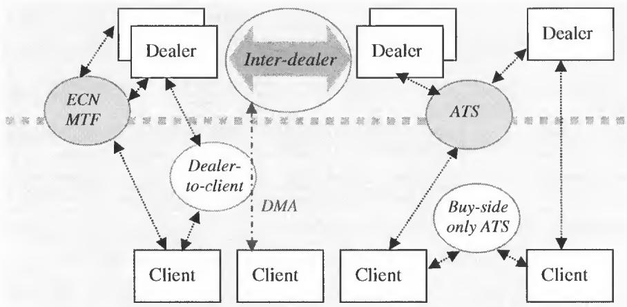  
Figure 3-2 Marketplace interconnections for alternative venucs

In fact, some ATSs are buy-side only, completely bypassing the brokcr/dcalers. Effectively, these are client-to-client trading networks. In section 3.4 wc will revisit this incrcascd accessibility, but first lct's brielly review the different types of allernative execution venue.

# ECNS/MTFS

Electronic Communication Networks (ECNs) are probably the best-known off-exchangc trading venues. They started in the U.S. equity marketplace; however, they have sincc sprcad to many of the world's markets. Table 3-5 gives some examples.

Table 3-5 Example ECNs/MTFs by asset class   

<table><tr><td rowspan=1 colspan=1>Asset class</td><td rowspan=1 colspan=1>Venues</td></tr><tr><td rowspan=1 colspan=1>Equities</td><td rowspan=1 colspan=1>U.S.: Bloomberg TradebookEurope: Chi-X, Turquoise</td></tr><tr><td rowspan=1 colspan=1>Foreign exchange</td><td rowspan=1 colspan=1>Hotspot FXi, LavaFX, Bloomberg Tradebook FX, FXAll Accelor</td></tr><tr><td rowspan=1 colspan=1>Money market</td><td rowspan=1 colspan=1>Securities lending: SecFinex</td></tr></table>

In terms of their mechanism, ECNs are generally based on central limit order books, with continuous auctions that usually allow anonymous trading. So they are vcry similar to exchanges.

ECNs came about through the quote ruling introduced in 1997 by the Securitics and Exchange Commission (SEC). Previously, dealers had been able to usc privatc intcr-dealer systems to trade at better prices than on NASDAQ; the new ruling mcant that thesc prices should also be available to the public. In effect, this opened a window for external cxccution venues, and suddenly a series of new ECNs werc crcatcd. By the millennium, there were over a dozen ECNs, all vying for market share in U.S. cquities. Sincc then, the competition has incrcascd, but there has been a lot of consolidation. Indecd, of the original four ECNs founded, only Bloomberg Tradcbook remains as such. Two of thc main ECNs, BATS and Direct Edge, have cither becomc cxchanges in their own right or are in the process of doing SO.

Europe is starting to sce the same level of intense competition as experienced in the U.S. In the past, pan European execution venues had mixed success; though, somc have flourished, such as Chi-X. The introduction of the Markets in Financial Instruments Directive (MiFlD), in 2007, aimcd to encourage competition between trading venues, improve prc and post-trade transparency and enforce "best execution" requirements. Its immediate elfect was the creation of a range of new venues. These are classified as Systematic Internalisers (Sls), for single-broker platforms, or as multi-broker Multilateral Trading Facilities (MTFs), such as Turquoise. Hence, the major exchanges now have to compete for liquidity, although this has led to the marketplace becoming more fragmented.

ECNs have also become established in the FX marketplace, the first was Hotspot FXi. Based around visible, but anonymous, central limit order books, these systems are targcting hedge funds, a rapidly growing portion of the marketplace. Hotspot was joined by Lava Trading's LavaFX in 2006. FXAll have also released their Accelor ECN, whilst Bloomberg have launched Tradebook FX.

Centralised order-driven markets are also starting to appear for other asset classes, such as securities lending and OTC DR trading.

# "Dark pool" ATSs

As thcir moniker suggests, Alternative Trading Systems (ATSs) provide opaque order-driven trading platforms that help to aggregate pools of liquidity. They have proved popular because they allow buy and/or sell-side traders to place large orders without them being seen by other market participants, and so reducing market impact costs.

ATSs actually cover quite a diverse range of market types. Table 3-6 provides a summary of these. As we saw in Chapter 2, markets may be classified in terms of whether trade matching is schcduled or is continuous. ATSs may also be distinguished in terms of their crossing. They either adopt a standard auction or use negotiated, advertised or internal crossing mechanisms. Constant market evolution means hybrids of these crossing types arc also developing.

Table 3-6 ATS classifications   

<table><tr><td rowspan=1 colspan=1>Frequency</td><td rowspan=1 colspan=1>Crossing Mechanism</td></tr><tr><td rowspan=1 colspan=1>Scheduled</td><td rowspan=1 colspan=1>Auction</td></tr><tr><td rowspan=4 colspan=1>Continuous</td><td rowspan=1 colspan=1>Blind auction</td></tr><tr><td rowspan=1 colspan=1>Negotiated</td></tr><tr><td rowspan=1 colspan=1>Advertised</td></tr><tr><td rowspan=1 colspan=1>Internal</td></tr></table>

The mechanics of price discovery vary for each type of ATS as well. Some do not incorporatc their own mechanism; instead, orders are matched at the mid-point price taken from the main market, c.g. the U.S. NBBO. Others contain full order book functionality and so determine their own prices when matching.

Scheduled crosses are in effect equivalent to scheduled anonymous call auctions. For instance, for U.S. equitics ITG's POSIT offers a dozen separate intraday crosses togcther with two after the close. Each cross is a call auction priced at the midpoint of the NBBO.

Continuous blind crosses, such as Instinet's CBX, offer trading on a completely opaque electronic order book. Effectively, it is like trading on an exchange where all the orders are hidden. Some of these venues also offer "pass through" orders that first try to match with the liquidity available within the ATS before being routed on to thcir intended destination, whether that is a primary/regional exchange, ECN or another ATS. These have provcn to be an important addiional source of liquidity.

Negotiated crossing platforms constantly search for potential matches notifying each participant when one is found. This then allows them to cnter into an anonymous bilateral negotiation for both the size and price. Liquidnet is probably the best-known cxample, it cmploys a scorecard (like eBay's ratings) to rellect each users history of successful crossings.

Advertised crossing systems highlight when liquidity is present, although they do not give away sizes. For example, Pipeline maintains a block-board of stocks, which are highlighted in orange when liquidity is present. Block price ranges are available as a guidclinc and no sizes are displayed. Users may then place firm orders to execute with this liquidity.

Brokers' own crossing nctworks generally adopt a similar mcchanism to the continuous blind crossing platforms. Originally, thesc were just internal crossing nctworks, allowing them to save the fees from executing on exchanges. However, they have rapidly become a considerahle forcc in terms of "dark pool" liquidity.

Although ATSs started in the U.S. equities markets, most of the major operators are now also present in thc European and Asian markets. ATSs are also staring to appear for other asset classes, Tablc 3-7 shows some examples.

<table><tr><td rowspan=1 colspan=1>Asset class</td><td rowspan=1 colspan=1>Venues</td></tr><tr><td rowspan=1 colspan=1>Equities</td><td rowspan=1 colspan=1>ITG POSIT (Scheduled), Instinct CBX (Blind), Liquidnet (Negotiated),Pipeline (Advertised), Credit Suisse CrossFinder (Internal)</td></tr><tr><td rowspan=1 colspan=1>Foreign exchange</td><td rowspan=1 colspan=1>Instinet FX Cross (Scheduled), Flextrade MilanFX (Advcrtised)</td></tr><tr><td rowspan=1 colspan=1>Options</td><td rowspan=1 colspan=1>U.S.: Archangel ATS (Blind), Ballista (Hybrid/negotiation)</td></tr></table>

# Table 3-7 Example ATSs by asset class

For foreign exchange, Instinet's FX Cross, a joint venture with Citigroup, provides threc anonymous crossing sessions a day in 17 currencies. Flextrade also olfer MilanFX, a continuous block-trading venue for FX. Similarly, U.S. listed options are also geting their own ATSs: Pipeline Archangel provides a blind auction for listed options, similarly Ballista offer a hyhrid option ATS combining auctions with clectronic ncgotiations. LiquidityPort has also announced plans to offer an electronic block-trading platform for both futures and options contracts.

# 3.4 Global market trends

There are certainly differences amongst the world's major markets; however, there are also many similarities. A focus on costs, by both the buy- and sell-sides, and the onward march of lechnology mean that the markets for each asset class are exhibiting many of the same trends, albeit at different rates. Notably, many of the markets are seeing incrcases in:

• Electronic trading • Transparency • Accessibility

Electronic trading is already widesprcad; indeed, for many markcts it is now the norm. Transparency is also improving, for both pre- and post-trade information. Acccssibility has also becomc a key issue as buy-side traders seek to gain access to the same venues as their sell-sidc countcrparts.

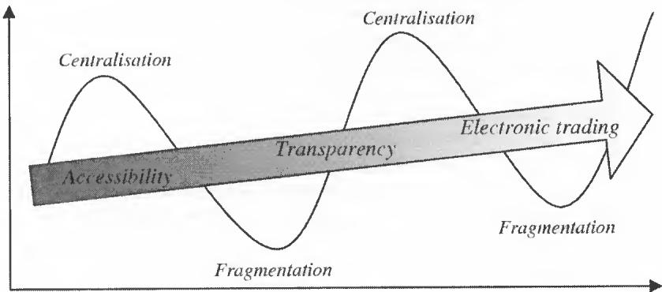  
Figure 3-3 Common global market trends

Running alongside thcsc trends is a secmingly endless cyclc of ccntralisation and fragmcntation, as shown in Figure 3-3. New vcnues keep appearing, attracting order flow and fragmenting thc available liquidity. Thcn within a few years, consolidation means the market starts to centralisc again.

# Electronic trading

Electronic trading is now commonplace for most assct classes, in particular for more standardiscd assets. A large number of elcctronic platforms exist, providing inter-dealer and dcalcr-to-clicnt trading for both cxchange-based and OTC markets.

Technology has substantially lowered the barriers to market entry. New entrants such as thc ECNs and ATSs have had a huge impact, particularly in the U.S. equities market. Capturing liquidity from established market centres can be extremely difficult and expensive. Still, clcctronic trading has proven to be a powerful tool in achieving this. For instance, in carly in 1997 the DTB (now Eurex) had around a quarter of the market with its Euro-Bund futurcs contract. A ncw electronic trading platform helped it win back market leadership from Liffe, by the end of the year its market share had reached $90 \%$ .

Competition has forccd dealers and exchanges to shift to elcctronic platforms in order to achievc cost reductions and to increasc the capacity for trading volume. In the exchangebascd markcts, there has been a considerable migration from floor-based to electronic trading. Even the most successful trading floors, such as the NYSE and the CME, have now fully cmbraccd clectronic trading.

The advent of electronic trading has also led to irrcvocable changes in the global markets. Most notably in terms of:

● Specd/Latency • Order size ● Growth in volumcs

Ordcr placemcnt and cxecution times are now mcasured in fractions of a second. In comparison, thc old U.S. cquity intcr-market system (ITS) allowed dealers up to 30 seconds. We arc currently in thc midst of a race between venues to provide the fastest platforms. A few years ago, a latency, or delay, of 300 millseconds $( 1 0 ^ { - 3 } \mathrm { s } )$ uscd to be perfectly reasonable. Nowadays cuting-edge venues are targeting latencics in microseconds $( \mathrm { \dot { 1 } 0 ^ { - 6 } s } )$ . 1n the light of this, co-location services are becoming increasingly popular. These allow market participants to host their computerised trading systems in the same machine rooms as the execution venue, thus minimising any transmission-related delays.

Averagc order sizes have seen considerable shifts as well. In some markcts, such as FX and U.S. listed options, order sizes are actually increasing, in order to cope with thc huge increases in trading these markets are experiencing. However, the longer-term effect of clectronic trading is prohably best illustrated by the cquity markets. Over the last ten years, there has been a steady decline in average order sizes on electronic trading platforms for equities. For example, in the late 1980s the average order size on NYSE was ncarly 2,500 whereas now it hovers at around 300. A noticeable decline occurred with the introduction of decimalisation in 2001, as shown in Figure 3-4, based on data for the average trade sizes from the U.S. Government Accountability Office (GAO). This trend becomes selfperpetuating as traders progressively adopt order slicing and algorithmic trading strategies in order to minimise market impact. A similar decline is taking place in order sizes for the listed futures markets; in fact single contract orders are becoming commonplace.

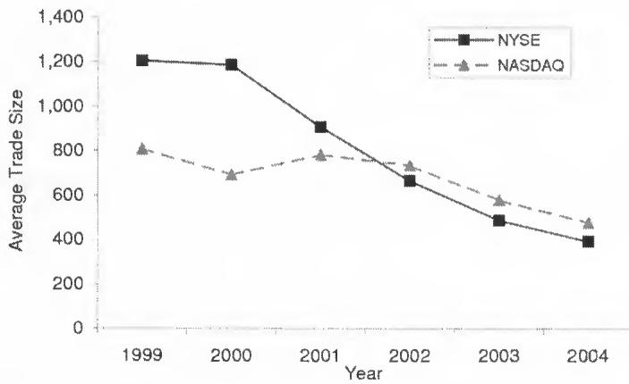  
Source: GAO (2005) based on data from NYSE and NASDAQ   
Figure 3-4 Average trade sizes for U.S. equities

Trading volumes have also rocketed over the last few years, in part due to the easy access and lower costs afforded by electronic trading. Much of this is due to the influx of trading from hedge funds. Although investment lirms across the board are adopting a much wider range of assets, particularly derivativcs.

The ratio of orders to executions has also changed, with electronic platforms having to copc with a much higher level of order placements, modifications and cancellations than cver before.

Pandora's Box has been opened. Markets will continue to evolve in order to adapt to the changes which electronic trading brings. Algorithmic trading is a key tool to help cope with these changes.

# Transparency

Transparency plays an important part in improving execution quality. It is also a key factor in reflecting the accessibility of markets. Pre- and post-trade information is vital for effectivc trading. Venues need to provide timely data on the size and price of orders/quotes/trades, as well as the time of executions. Historically, quote-driven or OTC markets have tended to be much Icss transparent than order-drivcn ones.

Post-trade transparency is well established for cxchange-based markets. But it is also improving for OTC markets. For instance, in the U.S., the Trade Reporting and Compliance Engine (TRACE) initiative has mandatcd reporting of trade prices for corporate debt since 2001. This may well expand to includc primary market, government agency and debt from the Federal National Mortgage Association (Fannie Mae) and Federal Home Loan Mortgage Corporation (Freddie Mac). In Europe, MiFID has mandated reporting for OTC equity trades. This may also spread to encompass other European asset classes, such as bonds and OTC derivatives.

Pre-trade transparency poscs more issues, since for OTC markets only the broker/dealers' best bid and ofer are available. Multi-broker platforms/markets improve this slightly by making it easier to discover and to compare quotes from a range of market makers. In comparison, exchangcs and othcr cxecution venues based on electronic order books are capable of much morc transparency. They may allow the best five bids and offers or even the entire order book to bc viewed.

Converscly, there is also a global trend for more pre-trade anonymity. Whilst transparency is important to see thc currently available prices and liquidity, it can also pose problcms for participants who nced to trade larger quantities. Signalling risk represents the information that may be given away by such large orders. Pre-trade anonymity helps reduce the signalling risk, as can the adoption of order spliting or algorithmic strategies. Anonymity is generally only offered by order-driven venues and a few multi-broker platforms. This is because prime-brokerage type agreements and ccntral counterparties are available, which help to reduce the potential credit and setlement risk. So for most OTC trading the only client proleclion is still the two-way quote.

A justilication for these seemingly opposing trends in transparency and anonymity is providcd by Robert Schwartz and Michael Pagano (2005). They point out that whilst transparcncy is requircd for price discovery, opacity is required for quantity discovery. This explains the popularity of "dark pool" ATSs which allow participants to anonymously trade in size. Ironically, some of the success of the "dark pools" is due to the transparency of the primary exchanges. Since, in general, they match based on size, using prices discovered from the primary exchange. Thus, dark pools have so far been concentrated in markets where priccs are readily available, such as the equities markets. They are also starting to be introduccd for the FX and listed derivatives markets. Negotiation based "dark pools" could be cstablished for other asset classes, albeit with the additional burden of price discovery.

# Accessibility

Traditionally, the marketplaces for most assets have been split into two, between dealers and clients, as we saw in section 3.3. Electronic trading has blurred these boundaries, creating much more open marketplaces. Sereen trading has helped lower the cost of acccss to the inter-dealer network: Once an electronic trading platform is established, accessibility is no longer about being able to support a physical presence on a trading floor. Suddenly, there is a Iot less difference between the buy-side and the sell-side. Remote access has also meant that location and time-zones start to becomc less important.

The advent of hedge funds has secn a concerted push by the buy-side to gain access to trade on the exchanges and dedicated inter-dealer networks. For large investment firms, the costs of electronic membership to exchanges can be worthwhile as a mcans of reducing broker/dealer commissions. Alternatively, many brokers have cxtended their agency-based trading to support DMA, providing clicnts with a low-cost means of sending orders to the exchanges. Even some of thc dedicated inter-dcaler platforms for bonds and FX have started to provide access for hedge funds and other investment firms.

Many new venucs, such as ECNs and ATSs, cater for dealers and clients alike, as shown in Figure 3-2. Broker/dealers have also started to group together to create new venues, which are competing head-to-head with exchanges. So the segmentation bctween dealers and clients is weakening, although admitedly it is happening a lot slower for the traditionally OTC markets.

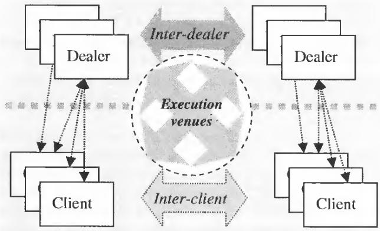  
Figure 3-5 Potential marketplace inter-connections

Figure 3-5 tries to illustrate this more fluid market structurc. Note the term execulion venue is used to represent the whole range of exchangcs, ECNs, ATSs and oiher platlorms that now span the gap between dealers and clients.

Final proof that competition has improved accessibility is the establishment of inter-clicnt networks, such as the buy-side only ATSs, which allow much larger trades than are possible on the open market. This is because the clients arc trading with each other in an opaquc venue, so signalling risk is less of an issue. Prior to this, such orders would have bcen handled by specialised block trading dealers in the "upstairs" market. Conscquently, the advent of buy-side only "dark pools" has improvcd accessibility for this hidden liquidity.

# Centralisation versus fragmentation

Constant compctition means that markets often wax and wane between centralisation and fragmentation, as we saw in Figure 3-3. Although gauging exactly where a markct lies between these two extremcs is still more of a qualitative exercise than a quantitative one.

Fragmentation makes price discovery more difficult, so it is hard to be surc whcther best execution has been achicved. Converscly, the lack of competition in a monopoly can also lead to increased costs. So the middle-ground is likely to provide the lairest solution. Though, as Figurc 3-6 tries to show, it is still unclear exactly what form this should take.

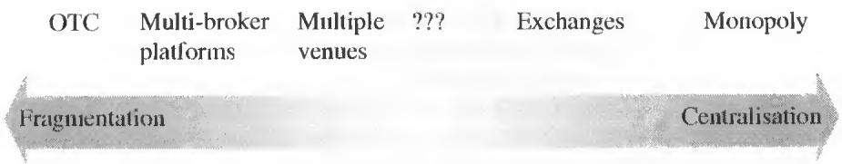  
Figure 3-6 Centralisation versus fragmentation

By its very nature, OTC based trading is much more fragmented than exchange-based trading. The ideal marketplace is probably some sort of hybrid of these two, capturing the best features of both. It should be able to support both principal and agency-based trading, as well as allowing both direct execution and negotialion for clients.

# Centralisation

Trading is easier, and usually cheaper, in liquid markets. This leads to a "network effect" which means venues with sufficient liquidity tend to retain and even attract ncw trade flow. There is a natural tendency for markets to centralise, as market liquidity tends to be "sticky". Hence, the success of the world's major exchanges. Even OTC markets are focussed around a number of major broker/dealers who have demonstrated they can provide sufficient liquidity.

Centralisation may arise from regulation. For example, in 1963, thc SEC recommcndcd restructuring OTC stock trading; this led to thc creation of NASDAQ. In Europc concentration rcgulations were used (by France, Spain and Italy) to prevent significant offexchange trading, until the introduction of MiFID. Indced, for many countrics the main national exchange often handles most of the trading for sharcs in domestic firms. Therefore, the stock exchange is still often viewed as the embodiment of centralisation.

Competition can also lcad to centralisation. Over thc last ten years, the average cost of trading has substantially decreased (except during the 2007-09 financial crisis). Reduced margins for broker/dealers mean thal cost reductions from economics of scale are vital. Thus, consolidation tends to occur; the successful broker/dcalers get larger and the rest either try to competc with innovations and incentives, or shift their focus to other markets. Key interdealer brokers, such as ICAP and BGC, dominate electronic trading in U.S. fixcd income. Whilst in Europe the MTS and Euro MTS platforms handle a considerable proportion of government bond trading. In the FX market, the top ten banks now account for nearly $80 \%$ of the trading. 2

Demutualization and global competition have led to a wave of exchange mergers and alliances. For instance, Euronext merged with NYSE, although previously there had been talk of a link with the Deutsche Börse. Similarly, NASDAQ bought the OMX, although they were previously focussed on thc London Stock Exchange (LSE). The LSE in turn was busy planning a takeover of thc Borsa Italiana. So there are now two massive entities competing for hoth U.S. and European volume, namcly NYSE Euroncxl and NASDAQ OMX. Whilst in the derivatives markets, the CME and CBOT have also merged in order to maintain their global position versus other exchanges, such as Eurex and Liffe. Global competition is likely to continue to increase over thc coming ycars, particularly as more pan-European (and even pan-Asian) cxccution venues arc cstablished.

Note that centralisation does not just apply to execution venucs, clearance and settlement proccdures should be considered as well. Having a single depository, such as thc U.S. Depository Trust & Clearing Corp. (DTCC), makcs sctlement much more straightforward. Centralisation has also proved successful for FX, based on the CLS sctlement system. Howcvcr, this is a morc complex issuc for the OTC markets. The 2007-09 financial crisis showed how vulnerable they could be. Over thc next few years, it is likely that regulation will mandatc more ccntralisation for thesc. Sireamlining the clcaring and settlemcnt processes could realise mcaningful cost savings and help improve liquidity. Adopting central counterparties reduces counterparty risk. Still, this is only viable if the risk is rcadily quantifiable, otherwise the clearinghouses may be over cxposed. Valuation is much less certain for more complex and lcss liquid assets. Therefore, a degrcc of standardisation might also be required. In fact, this process has already begun for CDSs, with several exchanges setting up clearing houses for them. If the OTC markets yield to the prcssure to change then thcir liquidity may well improve. Thcse mcasures could lead to lower transaction costs. Centralised clearing would allow participants more flcxibility in managing collateral, by netting their exposures. Prime brokeragc type arrangements could be established to help control credit risk. All these measures are the precursors to pre-trade anonymity, and so they might even Icad to new electronic trading venues for OTC asscts.

# Fragmentation

Fragmentalion is often referred to with sinister undertones. That said, it is an important part of the cycle of competition. Too little would mean the markets become huge monopolies, with no opposition to help reduce fees. On the other hand, too much fragmcntation and we have a free-for-all that would make even the OTC markcts seem centralised.

Regulation can also encourage fragmentation, by aiming to reduce costs with incrcascd competition. For example, the SEC's 1997 NASDAQ quote ruling helped launch the ECN as a competitor. By the millennium, there were over a dozen ECNs trading U.S. equities. Similarly, 2007 saw the introduction of MiFID in Europe, leading to the crcalion of ECNlike MTFs and Systematic Internaliscrs. Inded, pan European execution vcnues are starting to flourish, directly compcting with the major stock exchanges. Still, Europe is inherently more fragmented than the U.S. since there are not yet rcgulations for a European-wide Best Bid and Olfer (EBBO) or Regulation NMS style order routing requirements. CIcaring and settlement is also more complicated in Europe.

To attract liquidity, new market entrants obviously need to offer something spccial. For ECNs, it was the clcctronic order book and the possibility of trading at a bettcr price than the major markets. ATSs offer the ability of anonymous crossing large orders with minimal impact. Continued survival means rctaining this liquidity and attracting more. Hence, innovation is not always enough, pricc inccntives may also be requircd. For example, BATS captured a significant share of NASDAQ volume by offering a series of pricc rebatcs.

Fragmentation is also affecting other asset classes, such as foreign exchange. ICAP's EBS and Reutcrs still dominate the inter-dealcr markct. However, the last fcw ycars have seen fresh competition Irom ECNs such as Hotspot FXi, LavaFX, Bloomberg Tradebook FX and Accclor. "Dark pool" ATSs, such as MilanFX, havc also staried to appcar.

'Thc listed derivative markets are affected as well. Since most of thesc contracts arc not transferable (or fungihle) between venues, fragmentation mcans multiple vcnucs ofering similar contracts for thc same underlying. Often this competition has bcen global, such as between the CME, Eurex and Liffe. However, local compctition has also arrivcd, paricularly in the U.S. with venues such as NYSE Lifle U.S. and the Electronic Liquidity Exchange (ELX). An imporlant exception is the U.S. equity options market, which has a common clearing mcchanism. This may be traced back to changes in market regulation (in 1994) cnsuring that these could be traded at any of the market centres rather than concentrated at spccilic venues. Trading for U.S. equity options is now spread amongst more than half a dozen venues. Given that this market has seen some of the highest levels of growth of any of the world's listcd derivatives it would seem to have been a success.

Venues are also starting to cater for multiple assct classes, leading to inter-market fragmentation. For instance, both NYSE and NASDAQ have expanded into equity options. NYSE has also rencwed its corporatc bond market. Initially, these may just be additional venues competing in the different assct marketplaces. Though, in the future multi-asset strategics may start to bind the various asset classes more closely.

Again, fragmentation docs not only apply to execution venucs, clearance and settlcment procedures must also be considercd. In Europe, there is a range of depositorics for equities; hence, the price of a stock is not nccessarily the only factor, since each of these depositories levy different charges.

Having praised fragmentation for increasing competition, it is important to note that there are also associated costs. By reducing liquidity at any one venue, it increases the complexity of trading. This is difficult to accurately quantify, hut may be significant. Despite this, computcrised trading systcms have made it easier to cope with fragmented liquidity. Order routing tends to focus on matching the best price. Trading algorithms can offer even more sophisticated approaches: tracking both visible and hidden liquidity across multiple venues and taking advantage of opportunities within a fraction of a second. As trading systems hecome more sophisticated, the effects of market fragmentation may be noticeably reduced.

# Repeating cycles

Waves of fragmcntation arc generally followcd by periods of centralisation (or consolidation), as Figure 3-3 tried to show. Note that the periods involved generally span years, or even decades.

The "network efect" mcans there is a strong centralising force for liquidity to centralise around established market centres. New market entrants must offcr significant innovation, or cost incentives, to atract liquidity away from these centrcs. Such competition often fragmcnts the marketplace. Neverthclcss, the more successful centres will continue to grow, consolidating their position by acquiring or merging with other venues. Thus, centralisation starts to take hold again, until the next cycle.

The U.S. cquities market is probably the best example of these waves of centralisation and fragmentation. Clear marker periods for centralisation are the founding of the major exchanges, NYSE in 1792 with the "Buttonwood agreement" and NASDAQ in 1973. Whilst fragmentation may be linked to the 1997 quote ruling which led over a dozen ECNs, all vying for market share. By the millennium, the market for U.S. equities was clearly fragmented. Following this, a series of mergers and consolidations occurred, swinging back towards ccntralisation. Many of the acquisitions were by the major exchanges, helping to consolidate their market share. Suddenly, only a handful of independent ECNs remained. Also, two of the main remaining ECNs, BATS and Direct Edge, have either become exchanges in their own right or are in the process of doing so.

Another wave of new market entrants arrived in the U.S. stock market since the millennium, namely the "dark pool" ATSs. There are now around 40 venues where sharcs may be traded. Clearly, the ATSs have made the situation more complex, and have incrcased fragmentation. On the other hand, they are playing a key role in making additional liquidity accessihle. Orders which might previously been traded in the "upstairs" market are now available on these ATSs, giving other participants the opportunity to trade in size. The cycle is also showing some signs of starting again, as mergers and consolidations have begun between some of the ATSs and other venues.

It is likely that we shall see these eyeles repeated in the other major asset classes. For instance, the millennium saw a flood of electronie bond trading platforms in thc U.S. fixed income market. In faet, over 80 were ereated, but a wave of consolidation has lcft only a handful. So we might say that this portion of the market is more centralised than it was. Nevertheless, this is still a fragmented marketplace since a considerable amount of bond trading is carried out OTC.

Note that there are no guarantees that the eycle of consolidation and fragmentation will always maintain a steady equilibrium. Over the last few years, demutualization has changed the dynamies between broker/dealers and exchanges. Many broker/dealers have bought shares in regional exchanges, ECNs and ATSs. They have even started dircetly eompeting with the exchanges, as opposed to merely pressing for fee reductions. By launehing their own ATS platforms, they ean handle their own internalised order flow. This also saves them from paying fees to the exchanges/ECNs and allows them to offer priee improvement to their elients whilst still eapturing part of the bid offer spread. The profitability of such operations means they are less likcly to consolidate or disappear. Meanwhile, many exchanges have shifted from mutual organisations to becoming publie companies. Suddenly, cxchanges are now competing with their historical owners, as Larry Harris points out in an article for Securities Industry News (SIN) (2006a). If they do not get the balance right, liquidity will shift to alternate venues. This could become a real issue since the primary exchanges still provide much of the price discovery for these markets.

# 3.5 Global market comparison

So far, we have covered the various asset elasses and scen how they are traded. It is also important to try to view these markets in context. One way of doing this is to compare them in terms of their overall size or value. Averagc daily turnovers also give an idca of their relative signifieance. Finally, we will look at some cstimates for their levels of adoption of electronie and algorithmie trading.

# Overall size

The global outstanding debt is split hetween equity, fixed income debt, commcrcial bank assets (deposits/loans) and derivatives. In 2006, the global outstanding debt was around $\$ 208$ trillion, aecording to the Securities Industry and Financial Markets Association (SIFMA).

Figure 3-7 shows the brcakdown of debt for these four asset elasses over the last few years. The market capitalisation of the world's publie eompanies accounts for $26 \%$ of this total, whilst another $32 \%$ is from bonds issucd by corporations, governmcnts and their agencies. However, the majority, $3 6 \%$ , of the debt is actually provided by commercial banks.

Derivatives are based on separate underlying assets, so their actual contribution is slightly more complex to measure. Multiple derivative contraets may cover the same underlying physical asset. Therefore, notional amounts for derivatives are not comparable to other asset elasses. Based on figures from the 2007 triennial BIS (2007e) OTC derivatives survey, the total notional amount outstanding for all derivatives is actually $\$ 613$ trillion.

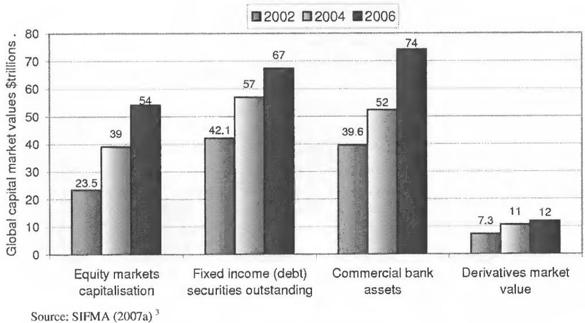  
Figure 3-7 Global market values

In order to quantify the size of debt associated with derivatives an alternative mcasure is often uscd, namely their gross market value. This corresponds to the cost of replacing all open derivative contracts, based on current market prices. The SIFMA (2007a) gross market value estimate for all derivatives (exchange traded and OTC) is $\$ 12$ trillion; hence, they only contribute to $6 \%$ of the debt shown in Figure 3-7.

# Average daily turnover

In general, equities are traded much more frequently than bonds; similarly, listed (exchange traded) derivatives have much higher turnovers than OTC contracts. Although this does not take into account the actual value of each trade. For example, the average value for equity trades is generally much lower than for bonds.

Figure 3-8 shows estimates of the average daily turnovers, in billions of U.S. dollars, for each of the major assct classes. Clearly, cxchange traded (ET) derivatives dominate the world markets, in terms of turnover. Similarly, although levcls of fixed income trading may be lower than for equitics, the actual value traded is an order of magnitude greater. Also note the foreign cxchange market, which as a cash-flow based market does not appear as a scparatc category in Figure 3-7.

Another way of viewing this data is to break it down by region, as shown in Figure 3-9. The cquity, fixed income and cxchange traded derivatives markets all follow a similar trend. Most of the volume occurs in the Americas, primarily the U.S., whilst the level of trading in the EMEA (Europe, Middle East and Africa) region is nearly half as much, and in turn trading in Asia is around half the EMEA levels. The two notable exceptions to this trend are foreign exchange and OTC derivativcs where Europe has by far the highest trading volumes.

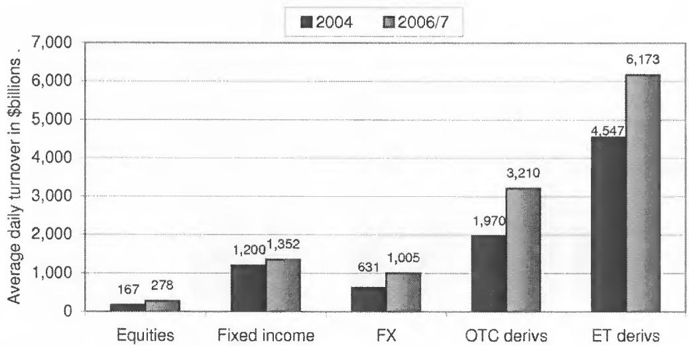  
Source: Equities WFE (2007a), FX/Derivatives 4 BIS (2007b), Fixed income Authors own estimates using SIFMA (2007a, 2008)5

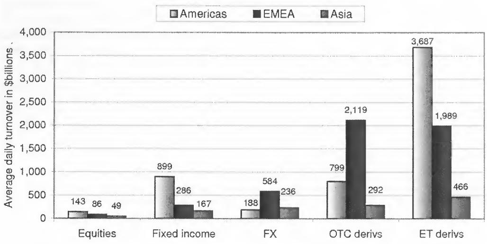  
Figure 3-8 Average daily turnover in the global markets   
Souree: Equities WFE (2007a), Fixed income SIFMA (2007a), FX/derivs BIS (2007b)   
Figure 3-9 Regional daily turnover in the global markets

Also, the level of FX trading in Asia is noticeably higher than in the Americas.

# Adoption of electronic and algorithmic trading

Electronic trading is now commonplace for most asset classes, in particular for more standardised assets. Figure 3-10 shows estimates from the Aite Group (2008) consultancy for the levels of adoption in the major asset classes.

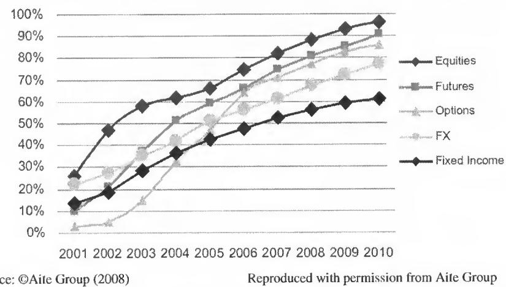  
Figure 3-10 Estimates for the adoption of electronic trading in the major asset classes

Thc equities markets still lead foreign cxchange and fixed income by a substantial margin, with around $80 \%$ adoption. If the current increases continue we might expect foreign exchange to reach this level by around 2009-10. Fixed income might be a few years behind this. Though, it is harder to see a wholesale shift occurring in some of the OTC markets.

The growth of clectronic trading for futures, options and FX has been even more rapid than that seen in the equity markets. This is possibly due to reuse of existing technology and a faster learning curve, benefiing from past experience. Market conditions are also a vital factor. In fact, the proportion of electronic trading dipped slightly in many markets in 2008 due to the massive volatility lrom the financial crisis. Though, in the mid to long term the levels of adoption of electronic trading should stay pretty much on course.

The world's markets will continue to cvolve in order to adapt to the changes which electronic trading brings. Algorithmic trading is increasingly being used by market participants in order to cope with thesc changes. Figure 3-11 plots the Aite Group (2008) estimates for the uptake of algorithmic trading, primarily for the U.S. Again, algorithmic trading has its strongest hold over the equities market, closely followed by listed futures, whilst fixed income lags behind. Still, by 2010, algorithmic trading could well be handling considerable trading volumes in all the major asset classes.

Overall, the equities market is still some way ahead of any of the other markeis, in terms of levels of clectronic and algorithmic trading. Although if we look back to Figure 3-8, the huge turnovers for FX and exchange traded derivatives highlight the importance of the progress being made in these markets. The OTC derivative market also represents a sizeable opportunity, although the bespoke nature of many of the contracts means this is by far the most complex market to tackle. Therefore, it is likely that for the foresceable future progress will continue to be focussed on exchange traded derivatives and FX, whilst consolidating the efforts made in equities and fixed income.

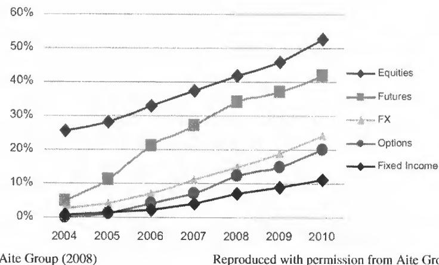  
Source: ©Aite Group (2008)   
  
Figure 3-11 Estimates for the adoption of algorithmic trading in the major asset class

Similarly, looking back at Figure 3-9 we can see that, in terms of capturing turnover for the U.S., by far the biggest opportunity for electronic and algorithmic trading is exchangetraded derivatives, followed by fixed income. Whilst for Europe and Asia the most major markets are FX and exchange traded dcrivatives.

Future investment in electronic and algorithmic trading will probably continue to diffcr across both asset classes and regions. This will depend on a mix of factors, namely market conditions, demand from institutions and investors, and the relative sizes of each markct.

# 3.6 Summary

A basic grounding in the world markets is important as investors, traders and platforms increasingly have to cope with globalisation and a range of different asset classes.

There are still huge differences betwecn many of the world's markets, but an increased focus on costs (by both the buy- and sell-sides) and the pace of technological change mean that many of them are exhibiting similar trends, albeit at differcnt rates:

Electronic trading is widespread, for many markets it is now the norm.   
Transparency is incrcasing, both for pre- and post-trade information.   
Crossing for block orders is shifting to electronic "dark pool" ATSs.   
Accessibility is improving for the buy-side.   
Central counterparties for clearing and settlement are becoming more widespread.

Counter to these trends is a seemingly endless cycle of ceniralisation and fragmentation. Centralisation occurs bccause it is easier for established venues to retain liquidity. Fragmentation due to competition from ncw market cntrants helps prevent monopolies. This adds complexity to trading decisions, although as trading systems become more sophisticated such problems may be significantly reduced.

Electronic trading is lcading to irrevocable changes in thc global markets, in particular:

Increased specd of trading Massive growth in trading volumc Long-tcrm decrease in order sizes

Algorithmic trading is being used morc and more by market participants in order to cope with today's markets. Equities are still at the forefront, but by 2010, it could well be handling considerablc trading volumes in all the major asset classes.

Based on their daily turnovers, the FX and exchange-tradcd derivatives markets stand out as important opportunities for algorithmic trading and DMA. Levels of electronic trading are also gradually increasing for fixed income and the money markets. The OTC dcrivative market also represents a sizcablc opportunity, although this is by far the most complex market to tackle.

# Part II

Algorithmic trading and DMA strategies

This is the main part of the book; it details the specifics of algorithmic trading and DMA, starting with orders, the basic building block for all trading strategies.

• Chaptcr 4 covers the wide range of different order types and conditions, which are available on the world's markets, together with examples.   
• Chapter 5 revicws the different types of trading algorithm, from impact and cost-driven to more opportunistic strategics. Charts are used to show the trading patterns and highlight the differences (and similarities) between the various algorithms.   
• Chapter 6 concentrates on transaction cost analysis. An example trade is used to decompose the transaction costs into their key components.   
• Chapter 7 considcrs how the optimal trading strategy may be found by asscssing orders in terms of their relative dificulty. This is then applied to the selection of trading algorithms.

Hopcfully, by the cnd of thesc four chaptcrs you should have a good understanding of the principles of algorithmic trading and DMA, togcther with how they may be applied to achieve "best execution".

Orders are the fundamental building block for any trading strategy.

# 4.1 Introduction

Orders represent execution instructions. They allow investors and traders to communicate their rcquirements, both from thc type of order chosen as well as with a range of additional conditions and directions. This chapter focuses on the basic mechanics of these various order types and conditions.

The two main order types are market orders and limit orders. In terms of liquidity provision, thcsc are complete opposites. Market orders demand liquidity; they require immediate trading at the best price available. Whereas limit orders provide liquidity, they act as standing orders with inbuilt price limits, which must not be breached (a maximum price for buys and a minimum price for sclls).

The conditions that may be applied to each order allow the trader to control many features of the execution, for example:

• Both how and when it becomes active   
• Its lifetime/duralion   
• Whether it may be partially filled   
• Whether it should be routed to other venues or linkcd to other orders

A widc range of trading styles can be achieved just by combining thesc conditions with limit and market orders. Indeed, many venues have gone on to support an even broader spcctrum of orders, all essentially derived from basic market and limit orders. These include:

• Hybrid orders, such as market-to-limit • Conditional orders, such as stops and trailing stops • Hidden and iceberg orders • Discretional orders, such as peggcd orders • Routed orders, such as pass-through orders

New order types are continuing to evolve. Some venues even offer orders that behave like algorithms, such as targeting the VwAP or participating in a set percentage of the market volumc. Indecd, the line betwcen them and trading algorithms is becoming increasingly blurred. Dynamic order types are very similar to trading algorithms, since they both alter bascd on market conditions. Onc way of differentiating between the two is that dynamic orders generally only focus on one specific variable, often the current market price (e.g. stop orders, pegging orders). Whereas trading algorithms base their decisions on a range of conditions, from volume to volalility. For the purposes ol this text, we shall adopt this classification, so trading strategies such as VWAP and volume participation will be discussed further in Chapter 5. We shall also discuss how orders are actually used to implement algorithms and trading strategies in Chapter 9.

The examples in this chapter are hroadly based on examples from the major exchanges. Some venues, notably the London Stock Exchange (LSE) (2006) and the Chicago Mercanile Exchange (CME) (2006), provide excellent materials with detailed examples for their order types. So it is always worth checking for such documentation. Another useful guide to the various lypes of orders is Larry Harris's (1999) book 'Trading and Exchanges'.

Finally, before we start covering the different order types and conditions in more detail, it is worth noting a few of the key assumptions made in the examples for this chapter. Firslly, they are all based around order books. Fundamentally, all trading involves order books, whether it is a phone-based OTC transaclion or electronic trading via DMA, RFQ or a trading algorithm. The only real dirference is that for quote-driven markets the order book is completely private and belongs to the market maker, whereas for order-driven markets the order book is usually centralised and much more transparent. Secondly, the examples generally cater for continuous trading periods, although some separate ones are highlighted for call auctions. This is simply because for most of these order types continuous trading is the most relevant period. Also for convenience, we usually assume thal an cxecution will occur when we place an order that matches. Ohviously, in real markets hundreds of participants can be issuing orders at the same time so regardless of a match our orders will sometimes be beaten to it. Lastly, the examples generally assume that the marketplace adopts a pricc/time priority, though for some cases the effect of diferent priorities is also highlighted.

So let's start hy reviewing the mechanism of market and limit orders in more detail.

# 4.2 Market orders

The market order is an instruction to trade a given quantity at the best price possible. The focus is on completing the order with no specific price limit, so the main risk is the uncertainty of the ultimate execution price.

Market orders demand liquidity, a buy market order will try to execute at the olfer price, whilst a sell order will try to execute at the bid price. The immediate cost of this is half the bid offer spread. We can see this using the sample order book shown in Figure 4-1.

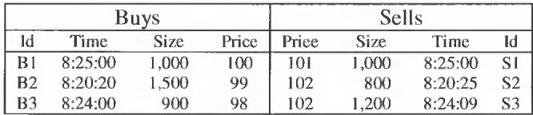  
Figure 4-1 An example order book

A market order to huy 1,000 ABC can cross with sell order (S1) achieving a price of 101. We should then he able to immediately close out this position with an equivalent order to sell, which crosses with the buy order (B1) at 100. Hence the overall cost of both our market orders has been (101 – 100) which equals the spread, or half the spread each way.

For orders that arc larger than the current hest bid or offer size, most venues allow market orders to "walk thc book". If they cannot fill completely from the top level of the order book, they then progress deepcr into the book (increasing the price for buys, or decreasing for sells) until the order is completed. If the order still cannot be completed some venues will cancel it, such as the LSE, whilst others may leave the residual market order on the order hook, e.g. Euronext.

Thus, the exccution price achieved depends on both thc current market liquidity and the size of thc market ordcr. For example, if we issue a market order to buy 2,000 ABC, the order book in Figure 4-2(a) shows that this can potentially cross with the sell orders S1 and S2. Recciving fills of 1,000 at 101 from order S1, and 1,000 at 102 from S2 gives an averagc execution pricc of 101.5. The resultant ordcr book (b) shows that order S1 has been completed and S2 now only has 500 on offer (the buy side is unchanged and so is omitted).

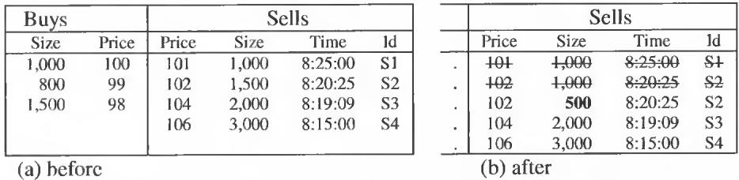  
Figure 4-2 The effect of a market order on the order book

In this cxample, as wcll as paying half the spread there is an additional cost that corresponds to the price jump from 101 to 102, resulting in a higher average execution price. This additional cost reprcscnts the market impact of our order. It is dependent on both the sizc of thc order and thc current market conditions, particularly the liquidity. For instance, if the cxamplc had bcen for an order of 5,000 we can see from Figurc 4-2(a) that it would rcquire crossing with orders S1 to S4, resulting in an average exccution price of 103. Conscqucntly, large orders often have a grcater market impact than smallcr ones.

Market conditions can also change rapidly. Again using the example from Figure 4-2 let's assume the owner of order S2 suddenly cancelled just beforc our market order to buy 2,000 hit the ordcr book. In which case, our market order must now cross with order S3, the fi of 1,000 at 104 raises the average execution price to 102.5.

Somctimes market ordcrs can actually achieve better prices than expected. This price improvemcnt could be because the market order executcd against a hidden order, such as an iceberg ordcr, so a better pricc may be possible than the order book suggcsts. We will cover thesc order typcs later on in this chapter.

With no price limit, the performance of market orders is clearly dependent on curent markct conditions. Similarly, large market orders can have significant market impact, so it may be worth splitting such orders into smaller oncs. If performance is more important than the spccd (and certainty) of execution then a limit order may be a hetter choice.

# 4.3 Limit orders

A limit ordcr is an instruction to buy or sell a given quantity at a specificd price or better. A huy limit ordcr must execute at or below this limit price, whereas a sell order must execute at or ahove it.

Limit orders will try to fill as much of the order as they can, without breaking the price limit. If there are no orders that match at an aeceptable price then the order is left in place on the order book until it expires or is cancelled. If the order is partially executed then any residual quantity will remain on the order book. This helps provide liquidity since other traders can sec we are willing to trade at a given price and quantity.

This persistence makes limit orders quite versatile. They may be used with an aggressive limit price, in which case they act like a market order demanding liquidity. The firm price limit gives added price proteetion eompared to a market order, although there is the risk of failing to execute. Alternatively, limit orders may be issued with more passive limits, such as when trying to capture gains from future price trends or reversions, as shown in Figure 4-3.

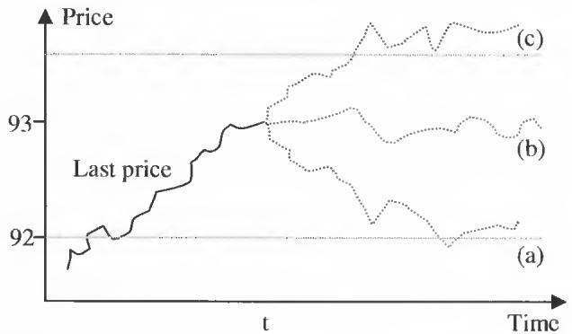  
Figure 4-3 Limit orders intended to gain from future price trends

For example, by placing a limit order to sell at 93.5, at time t, when the last traded price was 93 we are hoping that the price does not suddenly drop, otherwise our order will expire unexecuted. Alternatively, we might place a buy order with a limit of 92, just in case the price reverts as shown in pathway (a). Note that even if the price reaches our limit there is still no guarantee of cxecution, since other orders may have priority ovcr ours.

Let's consider a more detailed example: If we issuc a buy limit order Ior 1,000 ABC at 100, as shown in Figure 4-4, there is no order that can immediately be crosscd with this.

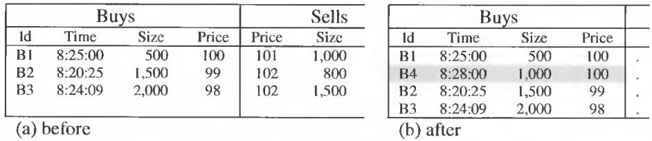  
Figure 4-4 The effect of a limit order on the order book

Thus, our order is left on the order book as B4. Note its position, it is placed after order B1 since it has less time priority, but is placcd ahead of order B2 because it has pricc priority. So any incoming sell orders that would cross at a priee of 100 will first mateh with order B1, then with B4 (unless pro-rata based matehing is used).

To see how limit orders difer Irom market orders lets do a similar trade to the example in Figure 4-2, using instead a limit order to buy 2,000 ABC at the current best offer (i.e. 101).

This is shown in Figure 4-5.

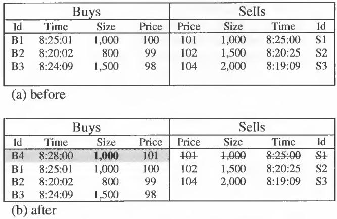  
Figure 4-5 A partially executed limit order

We can see from this that order SI can be immediately crossed with our buy order. However, we cannot cross with scll order S2 because its price of 102 breaks our limit condition. The remaining 1,000 will he left on the order book as a buy at 101, shown as order B4. Due to price priority, our order is placed at the top of the order book, resulting in shifting the sprcad to 101-102, up from 100-101.

If thc owner of order SI suddenly cancelled just before our order hit the order book then since we cannot cross with order S2 the whole 2,000 would have been left on the order book as order B4 to buy at 101.

In comparison with the market order, we have sacrificed complete execution to ensure our price, so instead of filling 2,000 at 101.5 we have achicved 1,000 at exactly 101. Whilst if we had changed our limit pricc to be 102 we could have matched with the sell order S2, giving the same average priee as the market order.

So the main risk with limit orders is this lack of execution ccrtainty. The market pricc may ncver reach our limit or even if it does, it may still not be executed since other orders may have time priority. This emphasises the need to make a careful choice betwcen the requirements for immcdiacy and price.

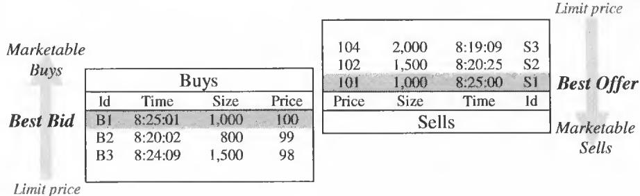  
Figure 4-6 Viewing the order book in terms of price

The limit price is also an important means of classifying limit orders, since it reflects their probability of immediate execution. Figure 4-6 tries to show this by twisting the order book from Figure 4-5(a) to align all the orders by increasing limit price. Limit orders with the highest probability of cxccution are often termed marketable orders, since their limit prices are such that they can potentially cross immediatcly with an order on the other side of the book. Hence, a marketable buy order has a limit cqual to or grcater than the current best offer price, whilst a marketable sell order has a limit price greater than or equal to the best bid.

Orders that are placed "at the market" correspond to buys with a limit of the best bid or sells with a limit at the best offer. The traders who placed these orders are said to be making the market. Whilst the most passively priced limit orders are termed "behind the market". Their prices mean that they are likely to remain on the order book as standing limit orders until the best bid or offer price moves closer to them.

# 4.4 Optional order instructions

Order instructions are conditions that cater for thc various requirements for a wide range of trading styles. As we can see in the summary in Table 4-1, they allow control ovcr how and when orders become active, how they are filled and can even specify where (or to whom) thcy are sent to.

Table 4-1 Order instruction conditions   

<table><tr><td rowspan=1 colspan=1>Type</td><td rowspan=1 colspan=1>Example Instructions</td></tr><tr><td rowspan=1 colspan=1>Duration</td><td rowspan=1 colspan=1>Good for the day, Good &#x27;til date, Good &#x27;til cancel, Good aftertime/date</td></tr><tr><td rowspan=1 colspan=1>Auction/Crossing session</td><td rowspan=1 colspan=1>On-open, On-close, Next-auction</td></tr><tr><td rowspan=1 colspan=1>Fill</td><td rowspan=1 colspan=1>Immediate-or-cancel, Fill-or-kill, All-or-none,Minimum-volume, Must-be-filled</td></tr><tr><td rowspan=1 colspan=1>Preferencing</td><td rowspan=1 colspan=1>Preferenced, Directed</td></tr><tr><td rowspan=1 colspan=1>Routing</td><td rowspan=1 colspan=1>Do-not-route, Directed-routing, Inter-market sweeps, Flashing</td></tr><tr><td rowspan=1 colspan=1>Linking</td><td rowspan=1 colspan=1>One-cancels-other, One-triggers-other</td></tr><tr><td rowspan=1 colspan=1>Miscellaneous</td><td rowspan=1 colspan=1>Identity, Short sales, Odd lots, Settlement</td></tr></table>

In the following sub-sections, we will see how each of these instruction types may be used.

# Duration instructions

Generally, orders are assumed to be valid from their creation until they are completely filled or cancelled, or it reaches the cnd of the current trading day. These are known as day orders or "good for the day" (GFD) orders.

Specilic instructions may be used to alter this duration, such as:

"good 'til date" (GTD): "good til cancel" (GTC) "good after time/date" (GAT)

As the names suggest, a "good 'til date'" order will remain active until the cnd of trading on the given date. Some venues even support variants such as "good this wcek" (GTW) and "good this month" (GTM).

A "good 'til cancel" instruction means the associated order should stay active until the user specifically cancels it, or until the instrument expires. Some exchanges also offer a "good 'til expiration" type for these instruments, e.g. futures.

The "good after time/date" instruction is somewhat less common. Clearly, it allows control over when the order actually becomes active. This instruction is more often used for broker systems where clients may choose to spread orders throughout the day, rather than for actual cxchange orders. Most trading algorithms support similar behaviour by using a start time parameter.

# Auction/Crossing session instructions

Auction/session instructions are used to mark an order for participation in a specific auction, or trading either at the open, close or intraday. They can also be used for the intraday crosses, which some exchanges have started introducing to compete with external crossing networks and ATSs.

Like normal market orders, auction market orders are intended to maximise the probability of execution, since in the auction matching they will always have price priority. Whercas auction limit orders will only be executed if the auction price equals or is better than their limit price, as we saw in Chapter 2.

On-open orders may be submitted during the pre-open period for participation in the opening auction. If the matching volume is sufficient then market-on-open (MOO) orders will execute at the auction price. For any unfiled MOO orders, some venues convert them to a limit order at the auction price, whilst others simply cancel them. Whereas limit-on-open (LOO) orders will only execute if there is sufficient volume and the auction price is equal to or better than their price limit.

On-close orders may be submitted during the pre-close period. Market-on-close (MOC) orders will execute at the closing price, given sufficient matching volume. Any unfilled orders will be cancelled. Again limit-on-close (LOC) orders will only fill given sufficient matching volume and an auction price equal to or better than their specific limit.

Venues with intraday auctions generally support an intraday auction or a "next auction" type. This is able to roll to the next valid auction, whether that is an intraday, open or close. A similar approach is often adopted for daily crossings or "mid point" matehes.

In addition to the session instructions, NASDAQ also provides "imbalance-only" opening and closing orders. These are intended to allow liquidity providers to add orders to offset the extant on-open and on-close orders without adding to the overall imbalance.

# Fill instructions

Traditionally, fill instructions were used to try to minimize the clearance and settlement costs for trades. But they are now more commonly used as part of liquidity sceking strategics. Instructions such as immediate-or-cancel enable orders to demand liquidity without leaving an obvious footprint on the order book.

Table 4-2 summarises the range of fill instructions that are available, most markets support a subset of these.

# Immediate-or-cancel

This instruction means any portion of the order that cannot execute immediately against existing ordcrs will be cancelled. Any limit price will be enforced, so it will execute as much of the required quantity as is available within the specified limit. This can result in only partially filling the order.

<table><tr><td rowspan=1 colspan=1>Instruction</td><td rowspan=1 colspan=1>Partial executionallowed</td><td rowspan=1 colspan=1>Unexecuted partadded to the book?</td><td rowspan=1 colspan=1>Expires</td></tr><tr><td rowspan=1 colspan=1>Immediate-0r-cancel</td><td rowspan=1 colspan=1>Yes</td><td rowspan=1 colspan=1>No</td><td rowspan=1 colspan=1>Immediately aftersubmission</td></tr><tr><td rowspan=1 colspan=1>Fill-or-kill</td><td rowspan=1 colspan=1>No</td><td rowspan=1 colspan=1>No</td><td rowspan=1 colspan=1>Immedialely aftersubmission</td></tr><tr><td rowspan=1 colspan=1>All-or-none</td><td rowspan=1 colspan=1>No</td><td rowspan=1 colspan=1>No</td><td rowspan=1 colspan=1>End of day</td></tr><tr><td rowspan=1 colspan=1>Minimum-volume</td><td rowspan=1 colspan=1>Yes</td><td rowspan=1 colspan=1>Yes</td><td rowspan=1 colspan=1>End of day</td></tr><tr><td rowspan=1 colspan=1>Musl-bc-fillcd</td><td rowspan=1 colspan=1>No</td><td rowspan=1 colspan=1>N/A</td><td rowspan=1 colspan=1>Afl er submission</td></tr></table>

Immediate or cancel (IOC) order instructions are also sometimes referred to as execute and climinate, fill and kill, good on sight, immediate liquidity acccss and accept orders, across a range of execution venues. Such a variety of naming standards is clearly confusing; it is always worth carefully checking the documentation to confirm the exact hehaviour. Note that for some venucs immediate may actually correspond to heing within a set time period (up to a few seconds); so again, it is vital to check the specifications.

As an cxample, if we issue an IOC limit order to buy 1,500 ABC at 101, we can see from the order book in Figure 4-7 that this can immediately cross with the sell orders S1 and S2. Order S3 is priced at 102 so no more of the order may be filled within the price limit. Therefore our buy order is now immediately cancelled, although 500 remains unfilled. We have obtained 1,000 ABC at 101 and left no residual ordcr on the book.

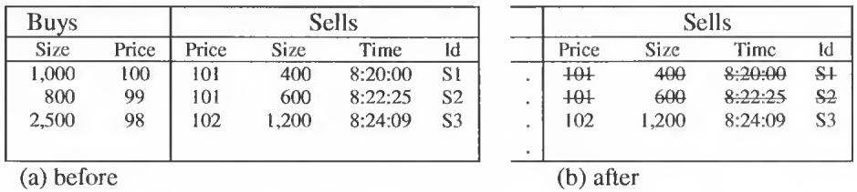  
Table 4-2 Order fill instruction types   
Figure 4-7 The effect of an IOC order on the order book

Orders using this type of instruction have also been termed "Immediate Liquidity Access", which is an appropriate name since that is exactly what it has done. The IOC instruction makes an order grah available liquidity; unlike a market order, it also maintains our pricc limit. Thus, the IOC instruction is often used by algorithms when probing for liquidity.

NYSE's Arca offers a novel twist on the concept of immediate-or-cancel ordcrs. Their "NOW" order instruction means that if an order cannot be immediately executed then it will be routed to a dedicated liquidity provider.

# Fill-or-kill

A fill-or-kill (FOK) instruction ensures that the order either executes immcdiately in full or not at all. Effectively, it is an IOC instruction combined with a $100 \%$ complction requirement. Any limit price takes precedence, so if it cannot fill the order within the given limit then it will cancel it. This instruction is also sometimes relerred to as a complete volume (CV) order. Note that some venues use the term fill-and-kill, but, as always, it is important to check their documentation since this may actually refer to an immediate-orcancel style behaviour.

Figure 4-8 shows an example FOK limit order to buy 1,000 ABC at 101. Again, we can see from the order book in that this can immediately cross this with the sell order S1. Also note that just like IOC orders, the fill-or-kill instruction makes an order non-persistent, so if someone else managed to cross with sell order S1 first then our order would be canceled, sinee we cannot cross with order S2 because of its price.

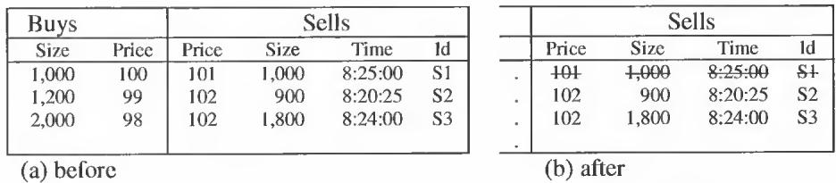  
Figure 4-8 The effect of an FOK order on the order book

# All-or-none

The all-or-none (AON) instruclion enforces a $100 \%$ completion requirement on an order. Unlike the fill-or-kill instruetion there is no requirement for immediacy, so all-or-none orders may persist for some time. This can pose a problem for order book based systems, sinee the asset could well end up trading below the price of an AON buy order, or above the priee of an AON sell, particularly if the AON order is large. Thus, AON orders are given a lower priority for execution, and are often handled by storing them on a separate conditional order book. This additional complexity has meant that many of the markets which once supported all-or-none instructions, such as NYSE, Euronext and the ASX, have switched to using IOC or fill-or-kill orders instead.

# Minimum-volume

This is also sometimes referred to as a minimum fill or minimum acceptable quantity instruction. A minimum-volume ensures that the order will only match if the quantity is sufficient. As we saw with AON orders, this constraint could mean that minimum volume orders are left bchind by the market. Hence, some markets, such as Euronext, eancel the order if it cannot immediately fill for the minimum quantity.

Minimum-volume constraints are also supported for call auctions in some markets, for example, NASDAQ. Figure 4-9 shows a simplified call auetion for asset ABC where several of the sell orders have minimum quantity instruetions.

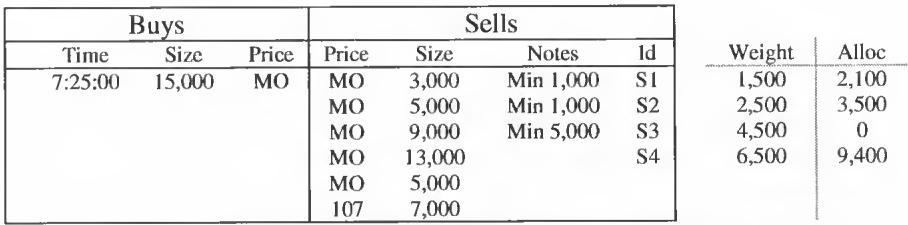  
Figure 4-9 An example call auction with minimu m volume instructions

The "Weight" column shows how the allocations might have bcen assigncd. Note that sell order S3 has a minimum volume constraint of 5,000. This is more than the assigned wcighting of 4,500, so order S3 is cxcluded from the crossing. Conscquently, the allocations we actually see in the "Alloc'" column are quite different, since the 4,500 is redistributed amongst the other sell orders.

Note that in this example lot sizes of 100 are applied so there is a rcsidual of 200. When assigning any residual amounts some auctions will favour orders with the lowest minimum quantity, so in this case the allocation for order S4 is increased to 9,400.

# Must-be-filled

Unlike some of the other fill instructions, failure to fully execute is really not an option for must-be-filled (MBF) orders. Indecd, on Euronext they used to trigger a volatility interruption, a sudden intraday halt followed by a call auction, if they were not filled.

Nowadays must-be-fillcd orders are generally associated with trading to fulfil expiring futures or option contracts. A separate trading session is established on the day before cxpiration, so for options this is often the third Thursday of each month. Traders may place orders to offset thcir expiring positions. For instance, an uncovered option writer for an inthe-money call must buy the underlying in readiness for its excrcise the next day. MBF orders are cffectively treated as market ordcrs, although they are exempted from any short sale regulations. They will then be crossed as part of the following morning's opening auction. Some exchanges publish an MBF imbalance to ensure liquidity providers place sufficient orders for the MBF orders to complete.

# Preferencing and directed instructions

Order preferencing and directed instructions permit bilateral rading, since they direct orders to a specific broker or dealer. One controversy with both directed and preferenced orders is the fact that they bypass any cxccution priority rules. So other orders which may have time priority will lose out to the directed markct maker.

Preferenced orders prioritise a specific market maker; generally, they are handled alongside normal order flow. On somc venues, such as NASDAQ, preferenced orders behave more like a directed fill-or-kill order, since they are cancelled if the chosen market maker is not quoting at the best price.

Directed orders are routed to a specified market maker or dealer who may accept or reject them. On both the International Securitics Exchange (ISE) and the Boston Options Exchange (BOX), market makers can offer price improvement for directed orders. The ISE has a dedicated price improvement mechanism, which is a spccial one-second auction.

Note that NASDAQ used to offer directed orders via SelcctNct, but retired this in 2005. Directed non-liability orders allowed the market maker five seconds to accept, partially accept, decline or issuc a counter offer for the order. Now when NASDAQ refcrs to dirccted orders it is in terms of routing instructions for specific venues.

# Routing instructions

Exccution venucs have often catered for additional routing instructions for orders. Thus providing a gateway service that allows orders to be routed to other venues as well as handling them locally.

In the U.S. equities market, the introduction of Regulation-NMS has made routing instructions even more important. In particular, thc Order Protection Rule means that brokcrs and venues are now responsible for protecting orders to ensure they achieve the best price.

So if an order might "trade-through" the best price available at another venue, the host venue should either reject the order or forward it on to the venue where it can achieve the belter price. However, such automated order routing is not always appropriate, especially for traders or systems that are simultaneously executing across a range of venues. Therefore, instructions such as do-not-route and inte-market sweep allow better control over the order routing. Clearly, when using such instructions it becomes the trader's or system's responsibility to ensure it is still complying with Regulation-NMS.

In section 4.5, we will cover some additional order types that caler for even more complex routing strategies.

# Do-not-route

This instruction ensures that the execution venue will handle the order locally and not route it to another venue. They are also referred lo as do-not-ship instructions on NYSE and postno-prefercnee orders on NYSE Arca.

In terms of Regulation-NMS, this means that if an order is placed at a venue, but a better priee is available elsewhere then it should be rejected. In all other respects, orders with this instruction behave as normal.

# Directed-routing

Directed-routing provides an associated destination for where the order should be routed to. Effectively, the host venuc acts as a gateway to route such orders on to their chosen destination. The advantage of this approach is that orders may be routed to venues for which we do not have a membership, although the host venue will levy routing fees for such orders.

# Inter-market sweeps

Under Regulation-NMS, flagging an order as an inter-market sweep allows the order to swcep, or walk down, the order book at a single venue. It means the broker/trader must ensure that the order protection and best excculion requirements are met. So an inter-market sweep order will generally be part of a group of orders, issued simultaneously, to a range of execution venues (hence the name).

For example, let's consider the consolidated market order book for asset ABC shown in Figure 4-10. For simplicity, the market has only two venues, exchange Exch-1 and ECN-1.

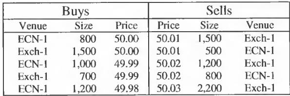  
Figure 4-10 An example market consolidated order book

We could send a buy order for 3,000 at 50.03 to the exchange and leave it to decide whether any of the order needs to be routed to alternate venues. Alternatively, if we also have accss to ECN-1 we could save routing fees by sending a buy for 2,000 at 50.02 to Exch-1 and a buy for 1,000 at 50.02 to ECN-1.

If we use standard orders for this, each venue will apply their own logic to ensure that any matches do not "trade through" better prices at other venues. For example, let's assume the order book for Exch-1 looks like Figure 4-1 1(a). Our order to buy 2,000 can immediately

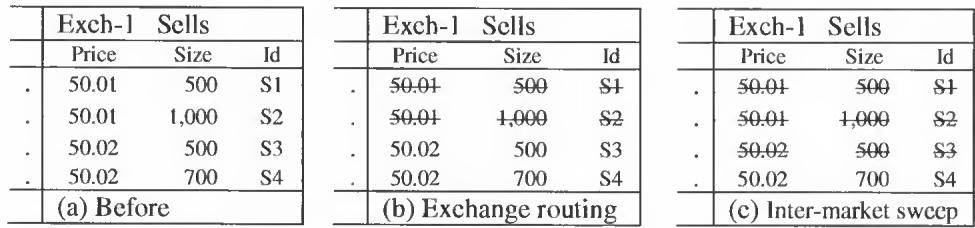  
Figure 4-11 Example execution for an inter-market sweep

cross with orders S1 and S2 since they are priced at 50.01, which is the best price available across all the market yenues. For the remaining amount, there are no more orders on the exchange at this price level.

Before matching at a new price level, the exchange needs to check whether any orders at 50.01 are quoted at other venues. Based on the consolidated order book the exchange would need to route the remaining 500 to ECN-1. So the resultant order hook Ior Exch-1 is shown in Figure 4-11(b).

Given that we know we have already routed a separaie order to ECN-1, we clearly do not want the exchange to iry to route par of our order to ECN-1. Instead, we just want to sweep the book at Exch-1 for all 2,000. So we must flag our order lo Exch-1 as an inter-market swcep. Consequently, it will no longer seek to route the order and just lill versus orders S1 to S3, as shown in Figure 4-11(c).

By using an inte-market swcep, we get better control ovcr exactly how and where our orders are placed, someihing that becomes vital when systems are working diffcrent orders simultaneously across many venues. It also allows us to save any additional routing charges that venues may apply.

# Flashing

As their name suggests, flash orders are displaycd on the source venue for an instant before either being routed on to another destination. The timeseales involved are olten around 25-30 milliseconds, although some variants may last for up to half a second.

In the U.S equities market, the Regulation-NMS order protection rule mcans orders must be routed to the venue displaying the hest bid price, although routing charges may be applied. There may also be fees for taking liquidity from the destination venue. So the intention of flash orders was to offer traders the potential for achieving the best market price, in this case, the national best bid and offer (NBBO), without having to pay any exira charges. Similarly, for execution venues, they provide the chance to fill orders locally instead of routing them to a competitor.

This was achievable because each venue provides their own market daia fced/s in addition to the national quotation system. During the flash period, market participants with the right data feeds could see and potentially trade with these orders, before they were routed on or cancelled. This has made them controversial, with much talk ol creating a "two-ticred" market; despite the fact that venues offering flash orders made their data fceds readily available. In fact, many of the U.S. equity venues have now withdrawn their flash orders.

In part, this controversy simply reflects the pace of change of technology: The old intermarket system (ITS), which was replaced by the order protection rule, allowed a 30-second time window for an order to be acted on. Only time will tell whether lash orders become more widely accepted (lor equities or any other asset elasses).

# Linking Instructions

Linking instruetions provide a means of introdueing dependeneies between orders.

A one-caneels-other (OCO) instruetion may be used to make two orders mutually exclusive, often this is used to close out of a position. For instance, to eapitalise from any gains on a long position we could plaee a sell order at a high price. If the market moves against us, it makes sense to also have a separate stop order at a lower price. Clearly, we do not want both orders to execute since this would not only llatten our position but could aetually reverse it, leading to a short position. By linking the two sells with an OCO instruction, we ean ensure that if either of the sell orders executes then the other will immediately be cancelled. Note that if one of the OCO orders is cancelled the other remains unaffeeted.

A One-triggers-other (OTO) instruction links a supplementary order that will only be created upon the successful exeeution of the main order. For example, a suceessful buy order could automatically spawn a stop order as proteetion from any losses. The secondary order is contingent on the main order, and so is sometimes referred to as an if-done order. Note that if the primary ordcr is eaneelled then the secondary order wil also he eancelled; however, this linkage does not work the other way around.

Some venues even allow orders to be grouped. For example, the SAXESS trading platform supports both linked and combination orders. Linked orders effectively provide an "OR" logie, so for a given amount we can buy assets ABC, DEF or XYZ. As an order fills for one asset, the other orders all reduee their sizes proportionally. Combination orders provide "AND" logic linking both the prices and sizes for two distinet orders, effeetively allo wing spread trading. We shall go through these order-eontingent types in more detail in seetion 4.5.

# Miscellaneous instructions

So far, we have foeussed on the instructions that are commonly adopted across most cxecution venues. There are also more specialised options, whieh tend to be more venue speeifie. As always, it is worth carefully checking each venue's doeumentation to see exaetly what additional instruetions are supported. Some of the more common miscellaneous instructions are:

Identity details: Many venues offer anonymity by default. Although some others still allow anonymous identifiers to be used, for instance, using the SIZE identifier on NASDAQ.

Short-sales: This flag must be set for markets that enforee short sales regulations. This is used to enforee tiek-sensitive trading, i.e. selling only on an uptiek or even tick.

Odd-lots: Some venues ineorporate odd-lot trading together with the normal trading mechanism. This instruetion allows round lot orders to be matehed with odd-lots.

Settlement instructions: Generally, non-standard settlement instruetions require negotiation, and depending on the conditions may ineur higher broker fecs or may not even he possible. However, some rcasonably common non-standard instructions are supported, such as foreign curreney settlement. Cash settlement is the most common alternative for equities. This is often used to achieve same day settlement, rather than T+I or T+3. Typically, eash settlemcnt is needed in order to become the shareholder of record before dividends, rights issues or stock splits, as Larry Harris (1999) points out. Clearly, though, this benefit will attract additional costs, to compensate the provider.

# 4.5 Other order types

In addition to the delault market and limit order types, there are a wide range of other orders available across the various execution venues. Table 4-3 summarises these, classilied by function:

Table 4-3 Order type classifications   

<table><tr><td rowspan=1 colspan=1>Class</td><td rowspan=1 colspan=1>Order types</td></tr><tr><td rowspan=1 colspan=1>Standard</td><td rowspan=1 colspan=1>Market, Limit</td></tr><tr><td rowspan=1 colspan=1>Hybrid</td><td rowspan=1 colspan=1>Market-to-limit, Market-with-prolection</td></tr><tr><td rowspan=1 colspan=1>Conditional</td><td rowspan=1 colspan=1>Stop, Trailing stop, Contingent, Tick sensitive</td></tr><tr><td rowspan=1 colspan=1>Hidden</td><td rowspan=1 colspan=1>Hidden, Ieeberg / reserve</td></tr><tr><td rowspan=1 colspan=1>Discretional</td><td rowspan=1 colspan=1>Not-held, Discretionary, Pegged</td></tr><tr><td rowspan=1 colspan=1>Routed</td><td rowspan=1 colspan=1>Pass-through, Routing-strategy</td></tr><tr><td rowspan=1 colspan=1>Crossing</td><td rowspan=1 colspan=1>Uncommitted, Negotialed, Alerted</td></tr><tr><td rowspan=1 colspan=1>Order-conlingent</td><td rowspan=1 colspan=1>Linked-alternalives, Contingent, Implied</td></tr></table>

The hybrid, conditional, hidden and discretional order types are common across many venues. Regulation and the proliferation of new venues means that routed order types are also becoming more common. The success of "dark pools" has also led many exchanges to offer more specialised crossing orders, in order to compete. Finally, order contingent orders are less common and tend to be reasonably venue specific. In the following sections, we will go through each class in turn, examining the associatcd order types in more detail.

# Hybrid order types

In many ways, market orders and limit orders represent different ends of the spectrum. Market orders offer immediacy but cannot guarantee the execution price, whilst limit orders offer price control but their execution is uncertain. Hybrid orders usc a variety of mechanisms to try to offer the best of both limit and market orders.

# Market-to-limit orders

Market-to-limit orders are inded a hybrid: a market order with a strong implicit price limit. When the order first arrives, it behaves like a market order, seeking liquidity at the hest available price, which then becomes its price limit. Unlike a traditional market order, it will not just sweep the order hook, instead if there is insuflicient liquidity available at the best price it will convert into a standing limit order for the residual amount.

For example, if we issue a market-to-limit order to buy 2,000 ABC, as shown in Figure 4-12, the initial market order will immediately cross with the order S1. This price now becomes the order's price limit; therefore, it is unahle to cross with order S2. Thus, a partial fill of 1,000 at 101 is achieved and the order now converts to a limit order at this last cxecuted price, as shown in Figure 4-12(c) as order B4.

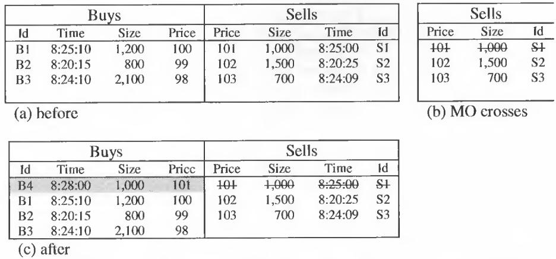  
Figure 4-12 The effect of a market to limit order on the order book

Admittedly, a marketable limit order priced at 101 would have achieved the same thing. But what if the owner of order S1 suddenly cancelled their order just before our market to limit order was processed?

Using a marketable limit order at 101 we would fail to match with order S2, and so remain in full on the order book. Converscly, a market order would have executed with both orders S2 and S3 completing with an average price of 102.25. In comparison, our market-to-limit order would have crossed with order S2 resulting in executing 1,500 at 102 and leaving the residual 500 as a limit order to buy at 102.

Hence, market-to-limit orders offer a middle ground between market orders and marketable fill orders. Their initial market order behaviour means that they offer more certainty of execution than a marketable limit order, but slightly less certainty of the execution price.

# Market-with-protection orders

A market-with-protection order offers the immediacy of a market order together with the protection of an inbuilt pricc limit. Effectively, it is an extension of the market-to-limit order with a limit price further away from the last cxecution price.

For example, let's issue a market-with-protection order to buy 3,500 ABC as shown in Figure 4-13. We will assume the price limit equates to 103, so our market order can cross with orders S1, S2 and S3. Since order S4 is priced at 104 we are unable to cross and so the residual 500 is left on the order book as limit order B1 with a limit price of 103.

Market-with-protection orders help to ensure that execution is not achieved at any cost. Provided that a reasonable protection limit is set, they strike a balance between certainty of execution and certainty of price.

Note for the CME all market orders are actually implemented as market-with-protection orders. The pricc limit is calculated for buy orders by adding predefined protection points to the best offer, whilst for sells they are subtracted from the best bid. The protection points are equal to half of the asset's "no-bust range".

<table><tr><td colspan="4">Buys</td><td colspan="4">Sells</td></tr><tr><td>ld</td><td>Time</td><td>Size</td><td>Price</td><td>Price</td><td>Size</td><td>Time</td><td>Id</td></tr><tr><td rowspan="4"></td><td>8:25:00</td><td>1,000</td><td>100</td><td>101</td><td>1,000</td><td>8:25:00</td><td>S1</td></tr><tr><td>8:20:25</td><td>900</td><td>100</td><td>102</td><td>1,500</td><td>8:09:25</td><td>S2</td></tr><tr><td>8:21:00</td><td>2,000</td><td>99</td><td>103</td><td>500</td><td>8:14:09</td><td>S3</td></tr><tr><td>8:22:00</td><td>1,500</td><td>99</td><td>104</td><td>1,000</td><td>8:16:00</td><td>S4</td></tr><tr><td colspan="2">8:14:00</td><td>800</td><td>98</td><td>105</td><td>1,300</td><td>8:13:00</td><td>S5</td></tr></table>

(a) before

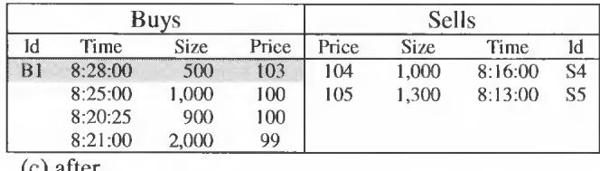  
Figure 4-13 The effect of a market-with-protection order on the order book

<table><tr><td>Sclls</td></tr><tr><td>Price Size</td><td>Id</td></tr><tr><td>101</td><td>1,000 S4</td></tr><tr><td>102 1,500</td><td>S2</td></tr><tr><td>103 500</td><td>83</td></tr><tr><td>104 1,000</td><td>S4</td></tr><tr><td>105 1,300</td><td>S5</td></tr></table>

(b) MO crosses

# Conditional order types

Conditional orders base their validity on a set condition, often the market price. Only when the condition is met will it result in an actual order being placed. Thus, stops and conlingent orders only becomc aetive when a threshold price is breached. Trailing stop orders are similar, although they use a dynamic threshold. Finally, tick-sensilive orders base their validity by comparing the current besl pricc with the last traded price.

# Stop orders

Stop orders are contingent on an activation (or stop) price. Once the market price reaches or passes this point, they are transformed into active market orders. In continuous trading, the price being tracked is generally the last traded priee, 2 whilst in an auetion it is usually the elearing price. Aetivation occurs for buys when the market price hits the stop price or moves above, whilst for sells it is when the market price hits or moves below the stop.

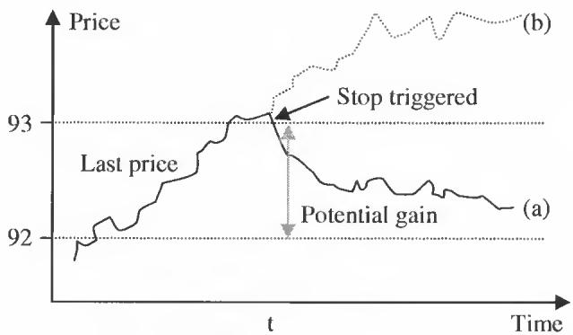  
Figure 4-14 An example sell stop order

Stops are somctimcs also referred to as stop-loss orders. Since as sells (buys) they are generally used as a safety net to protect profits, by closing out long (short) positions should the market move against us, as we can see in Figure 4-14. So, for example, let's assume a long position was initiated at 92; once the price reaches 93 a stop sell order is placed (at 93) as protection. If thc price trend reverts at time t, as shown in pathway (a), then the stop will be triggered. Alternatively, if the price continues to trend favourably (b) the stop will remain inactive.

Note that the market order generated by a stop gives no guarantees on the price achieved. This is important since the very nature of stops means that they are only activated when the market price becomes unfavourable. They offer the lesser of two evils; a poor price may be achicved, but if the market does not revert, the alternative is even worse.

Stop limit orders replace the market order with a limit order. The stop price activates the order, whilst the limit price controls the triggered order. Although this ofers some price protection by controlling the price of the triggered order, it also introduces a risk of failing to cxecute. Unfortunately, fast market conditions often heighten this risk.

The market-with-protection order type acts as a halfway house between market orders and a limit orders. Stop orders with protection use this order type to increase the probability of execution whilst still having a limit for some price control. The limit price is based on the stop price and the specified proteetion limit. Nevertheless, i is still fundamentally a limit order, so if thc price shifts are severe enough to breach the protection limit then the position will remain exposed.

Therefore, if closing out of a position is a must then there is no real choicc other than by using a pure stop order. lt may also be worth considering other means of hedging the position, such as with options or futures.

Whilst stop orders are a useful tool, they can also have considerable market impact, in particular when the market is at its most vulnerable. Upon activation, all stop orders tend to accelerate the price trend that triggered them. For instance, a sell stop order is trying to sell when there has already been a significant fall in the price. Such a drop is most likely due to an imbalance betwcen the order book volume to buy and sell. The stop order is effectively looking for liquidity when it has already decreased. If it manages to execute then the imbalance will be even grealer.

# Trailing stop orders

A stop order uses an absolute stop price, whereas for a trailing stop order the stop price follows (or pegs) favourable moves in the market price. A trailing offset is either specified as an actual amount or sometimes as a percentage change. For a sell order, as the market price rises the trailing stop price will rise hy a similar amount. However, when the market price falls the stop price does not change, as shown in Figure 4-15. Once the market price becomes Icss favourable, the stop price remains fixed until the market price actually reaches the stop and triggers it. The order then behaves exactly like a stop order or a stop limit order. This price latching mechanism allows profits to be locked-in without having to try to predict the best price level to set the stop at.

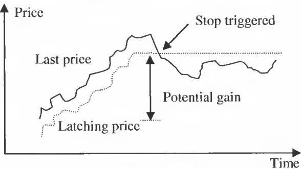  
Figure 4-15 The price latching behaviour of a trailing stop order

# Contingent / if-touched orders

Contingent, or if-touched, orders are effectively the opposite of stops. For foreign exchange, they are sometimes called entry orders since they are generally used to cstablish positions.

As with stops, there are two main types, a market if-touched order and a limit if-touched. Note that a limit if-touched order is similar to a standing limit order, except that is hidden from the order book until activated.

Their operation is extremely similar to stops; both remain hidden until the market price moves sufficiently to activate them, whereupon they create a corresponding order. But the activation logic is the reverse of that for stops. So a buy if-touched order is triggered when the market price hits the target price or moves below, whilst a sell triggers when the market price hits the target or moves above.

Some venues even alow if-touched orders that are contingent on the price of a completely diflerent asset, such as a stock index.

# Tick sensitive orders

Tick-sensitive instructions introduce a validity condition based on the last traded price. If the current price is the same as the last trade it is referred to as a zero tick, above it is an up tick and below is a downtick. (Note zero ticks may be further classified as zero up and downticks by comparing with the last different trade price).

Thus, a buy downtick order may only be crossed on a downtick or zero downtick price. Likewise, a sell up tick order may only be crossed on an up tick or a zero uptick. Larry Harris (1999) points out that tick sensitive orders are essentially limit orders with dynamically adjusting limit prices. Tick sensitive orders employ a similar price latching mechanism to trailing stops; a downtick order wil raise its dynamic limit price only when the price increases, whilst an uptick order will only decrease its limit when the price falls.

Tick sensitive orders have no immediate market impact. The tick dependency means that immediacy is sacrificed in order to obtain a price one tick better. Harris observes that they are therefore most useful when the tick size is large. In fact, the decimalisation of the U.S. stock markets in 2000 actually reduced the appeal of tick dependency, since it meant that for most stocks the tick size decreased from a sixteenth to just I cent.

Tick dependent orders exist mainly because of regulation, in part to try to curh the downward pricc momentum due to hidden stop orders being triggered. Conscquently, some venues enforce a rule that short sales must be on an uptick. In other words, an uncovered sale is only allowed when the current price is above the last traded price.

# Hidden order types

Efficient markets need to satisfy the needs of a range of users. Whilst transparency allows traders to easily see the available supply and demand, it poses problems for large orders. Many markets and venues provide hidden order types that allow traders to work larger orders without attracting undue atention. This ensures that liquidity remains available at the execution venue, rather than shifing to an alternative liquidity pool or erossing network.

A few years ago, completely hidden orders had all but been phased out. Hidden orders were vicwed to incrcasc the uncertainty of execution, and so afect the quality of price formation. They were also thought to act as a disineentive for placing limit orders, possibly leading to increased spreads. Transparency was viewed as being more important, and so venues, such as Euronext and the ASX, switched to providing iceberg orders inslead. These offer a reasonable compromise, since a portion of the order is still visible. Still, the success of ATS venues providing "dark pools" of liquidity has led to resurgence in the popularity of hidden orders. Indeed exchanges, such as NASDAQ, AMEX and NYSE's Area, are now introducing hidden orders in order to retain their liquidity and to compete with the ATSs.

# Hidden orders

Hidden, undisclosed or non-displayed orders allow traders to participate without giving away their position. For example, Figure 4-16(a) shows the order book before a market order to buy 1,000 ABC arrives. Afterwards we can see that the order book has not changed as much as we might have expected. From the subsequent trade reports, we can see that 1,000 filled at 101, but on the order book we can only see order S1 filled and there were no new incoming orders, so where did the other 500 come from?

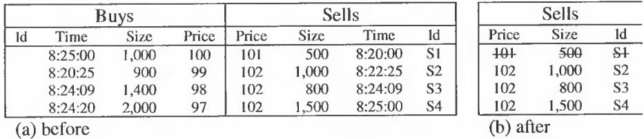  
Figure 4-16 A hidden order?

There may be hidden volume available at 101, or it may have all been consumed. The only way to know is to see the result of the ncxt buy order. Hence the popularity of “liquidity pinging" using IOC orders. By issuing an IOC limit order to buy 1,000 at 101 we can try to cross with any hidden orders. That said, other participants are likely to have the same idea, so it is a question of speed of response.

One important consideration when using hidden orders is that they are usually given lower priority than visible orders. Otherwise, everyone would simply use hidden orders, making it much harder to determine the market price.

As hidden orders become more popular again there will doubtless be new variations. For instance, the London stock exehange is planning on supporting minimum order sizes, which should offer some proteetion from small liquidity-seeking orders.

# Iceberg / reserve orders

As its name suggests, an iceberg order comprises of a small visible peak and a significantly larger hidden volume. The peak (or display) size is configurable, although some venues stipulate a minimum, often a percentage of the normal market sizc (NMS). The visible portion of the order is indistinguishable from any other limit order. Each time this displayed order is fully executed the venue's trading system splits a new order from the hidden volume, until the whole iceberg order is completed. Therefore, cach displayed order has normal time priority within the order book whilst the hidden volume just has price priority.

fceberg orders are also sometimes called reserve orders or drip orders.

For example, if we look at Figure 4-17(a), we can sec sell order S1 for 1,000 at 101. This is actually the display size of the iceberg order HI that has another 9,000 hidden volume. Obviously, the hidden volume is not actually visible on the order book, but just for these examples it shown (in light grey) to emphasize that it still has price priority in the order book. Thus, order S3 will not manage to cross with any other orders until our hidden volume Hl is exhausted.

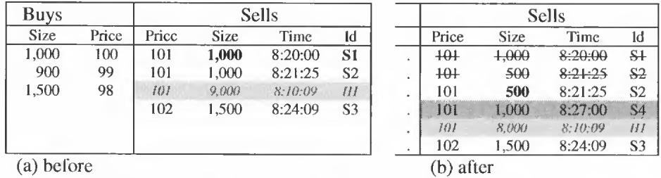  
Figure 4-17 Crossing with the display portion of an iceberg order

When a market order to buy 1,500 ABC hits the order book:

Our iceberg's displayed order S1 immediately crosses with it for 1,000 Next, the remaining 500 is filled by parially crossing with order S2. Since our displayed order is complcled, a new order is split Irom the hidden quantity as sell S4.

Continuing this example with a second market order 1o buy another 2,200 ABC, is showr in Figure 4–18.

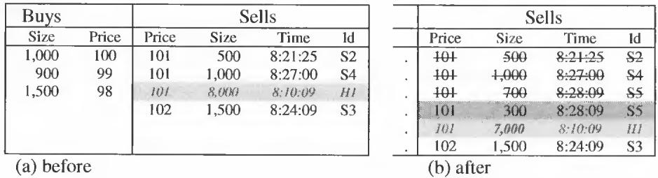  
Figure 4-18 Another crossing with the iceberg order

So we can see that:

● The remaining 500 of order S2 is immediately executed. The 1,000 from our iceberg's order S4 is also filled. A new order S5 for another 1,000 is split from our hidden volume H1. The remaining 700 of the market order is filled from the ncwly created order S5 that has price priority over order S3.

The meehanism is just the same if we have multiple iceberg orders on the order book. For instance, let's consider the order book shown in Figure 4-19 which has two iceberg orders.

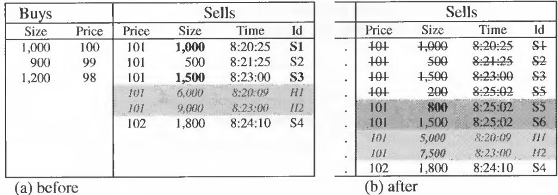  
Figure 4-19 Crossing with multiple iceberg orders

The first iceberg is currently displaying sell order S1 with a hidden volume H1 of 6,000, whilst the second has a greater hidden volume of 9,000, but it also uses a greater display size of 1,500 for its order S3. So when a market order to buy 3,200 arrives:

• The first iceberg's order S1 will be completely filled.   
• As will standing limit order S2.   
• The second iceberg's displayed ordcr S3 is also filled, leaving 200 remaining on the market order. New orders S5 and S6 will then be split for each iceberg. The last 200 of the marke1 order will be crossed with the first iceberg's newly split order S5, since this iceberg has time priority.

This also highlights the importance of the iceberg's display size. Even though the second iceberg H2 has lower time priority, each time it splits a new order it is for 1,500, so it will fill quicker than H1.

These examples have all shown how the hidden volume on the order book participates in the order matching mechanism. This is the key difference between native exchange based iceberg orders and an external order-slicing mechanism, where the hidden volume resides outside the order book. External mechanisms are reliant on receiving execulion confirmations lo show that the previous order has completed, only then will a new order be created. This may occur some time alter the order book crossing has finished, so an external mechanism will nol be able to respond in time. Hence, in order to fill thc markel order the order book will instead cross with other standing limit orders, such as S4 in Figure 4-19. This means that order-slicing approaches may take longer to execute than nalive iceberg orders. However, it also enahles them to have more scope for price improvement; we shall go through this in more delail in Chapter 9.

# Discretional order types

Traditionally, discrctional order types affordcd the trader more freedom in how a particular order should be worked, sincc they are the expert. This is perhaps best typified by the Notheld instruction that basically gives the trader carte blanche. Computerisation has resulted in the evolution of more rules-hased approaches, such as pegged and discretionary orders. These offer more quantifiable steps, compared to the rather vague "do the best you can".

# Not-held orders

A not-held order gives complete discretion to lhe trader about how the order is worked.

Generally, these are used for floor traders since in less transparent markets they will have the best knowledge of market conditions. The quality of execution relies on them choosing the best time to trade.

# Discretionary orders

A discretionary order is a limit order with a slightly more flexible limit price. The limit that is displayed on the order book may be augmented by an additional amount when conditions are appropriate. For a buy order, the real price limit is actually thc limit price plus this discretionary amount, whilst for a sell it is the limit pricc minus the discrctionary. The true limit is taken into account only when a matching order comes within the discretionary range. Thercforc, the order may execute at any pricc beiween the displayed limit and the true limit. Note that any visible orders will stil have priority over the discretionary order.

For example, let's issue a buy limit order for ABC at with a limit of 100 and a discretionary range of 1, as shown by buy B1 in Figure 4-20(a).

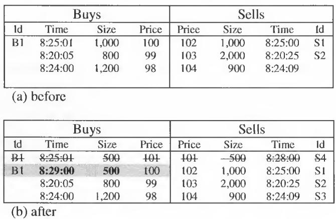  
Figure 4-20 The effect of a discretionary order on the order book

Initially, there is no order that can immediately be crossed, so order B1 simply rests on the order book with a visible limit price of 100. When sell order S4 is added at a price of 101, this is now within our discretionary range. So we can match this. The remaining 500 for order B1 remains on the order book, still with a visible limit of 100.

Some venues, such as NASDAQ and NYSE Arca, support a minimum quantity as well, so that the discretionary order will only stretch its price limit for orders above this size.

# Pegged orders

Pegged orders provide a dynamic limit pricc; therefore, they can help reduce the inherent miss-pricing risk of standing limil orders. A pegged order's limit price may track the best bid, offer or even mid price, applying an additional offset amount. For instance, Figure 4-21 shows the trajectory of a pegged limit order tracking the best bid price. A firm price limit may still be applied which will prevent the order pegging beyond this limit.

For example, let's issue a buy limit order for ABC pegging from the best bid with an offset of 1. Initially, our order B2 will be placcd with a limit of 99, I away from the current best bid, as shown in Figure 4-22(a). When a new order B4 joins the book, the best bid moves up to 101, so in response our order is updated with a new limit of 100 to keep pace

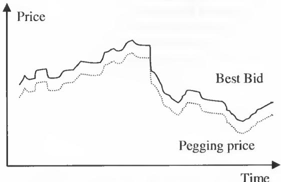  
Figure 4-21 Pegging the best bid price

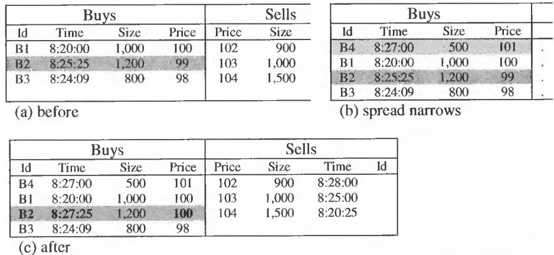  
Figure 4-22 The effect of a pegged order on the order book

with the best bid.

As for discretionary orders, somc venues, such as NYSE, support a minimum quantity, so that pegging is not triggered by small orders. Instinet even offers pegged order types that can have an associated display size, just like an iceberg order.

# Scale orders

These may be used to layer child orders throughout the order book at a range of price levels.

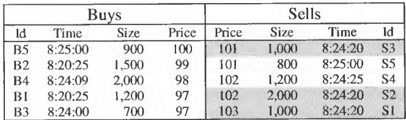  
Figure 4-23 An example set of scale orders

For instance, we might specify a sell order for 4,000 ABC, scaled with $2 5 \%$ at 101, $50 \%$ at 102 and $2 5 \%$ at 103, as shown in Figure 4-23. Alternatively, set amounts may be specified for the various price levels. In a fast moving market, this approach has the advantage that our orders are already in place, and so reccive time priority. But if the price keeps trending favourably, better prices might be achieved by waiting. We will revisit these layering tactics in Chapter 9.

# Routed order types

Routed order types are becoming more and more common; they can be an important means of sceking additional liquidity in today's increasingly fragmented markeis.

As we have already seen, there are order instructions that cater for routing, alwing orders to be sent to specifie venues or to stay at a single venue. The natural progression is increasingly complex order routing strategies, leading to "smart order routing". The simplest of which is represented by pass-through orders. These allow liquidity to be accessed from two venues. There is also a range of strategies allowing routing back and forth between venues, and even participating in special sessions such as the opening auction. As these continuc to evolve, the line between them and trading algorithms is becoming increasingly blurred.

# Pass-through orders

As their name suggests, pass-through orders allow an order to initially pass-through the hosting venue on the way to their ultimate destination, often the primary exchange. Effectively, they act like two sequential orders, an IOC order at the initial host venuc followed by an order for the remainder sent to the destination venue.

This allows an order to consume liquidity from the hosted order book before routing any residual to the chosen destination. In comparison, a standard limit order that sweeps the order book wil just leave any remainder as a standing order. Therefore, they are typically provided by crossing networks or venues seeking to attract additional liquidity.

For example, let's consider an order to sell 1,500 of asset ABC at 100. Figure 4-24 shows the order books for both the ECN (ECN-1) and the primary exchange (Exch-1).

ECN-1

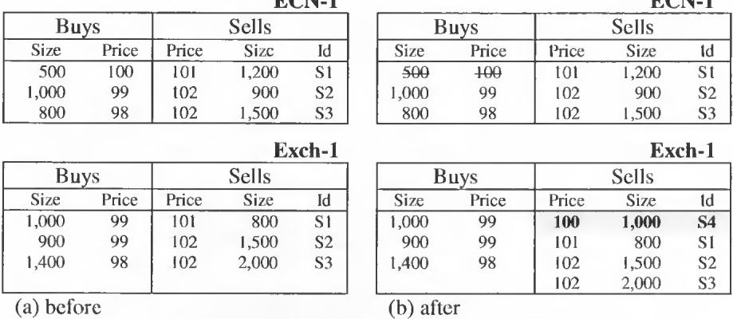  
Figure 4-24 An example pass-through order

We can see from Figure 4-24(a) that there are 500 available at ECN-1. Hence, we can issue a pass-through order, which wil try to cross with the liquidity available at ECN-1 before routing to thc primary cxchange, Exch-1. Having consumed the available liquidity al 100, our order will now become a standing limit order S4 at Exch-1.

Although Figure 4-24 shows an example of routing between two visible order books, it does not take a huge leap of imagination to replace ECN-I with a "dark pool" ATS. When placing our scll ordcr we can no longer see what liquidity is available, bul we know il will try to cross beforc routing to the primary exchange, Exch-1. This is quite a convenicnt way of providing additional liquidity for the ATS. Typically, ATSs have been keen to have brokers routc retail flow through in this way since there is less chance of information leakage.

# Routing-strategy orders

Routing-stratcgy orders extend the straightforward concept of pass-through orders to allow more complex routing instructions. These may enablc orders to participate in auctions, or be routed to additional venucs beforc reaching their final destination. For example, Table 4–4 shows some of the routing strategics ofered by NASDAQ.

<table><tr><td rowspan=1 colspan=1>Name</td><td rowspan=1 colspan=1>Strategy</td></tr><tr><td rowspan=1 colspan=1>MOPP</td><td rowspan=1 colspan=1>Route to all protected quotes for display size onlyPost any residual on NASDAQ</td></tr><tr><td rowspan=1 colspan=1>DOTI</td><td rowspan=1 colspan=1>Sweep NASDAQ for NBBO or betterRoute any residual to NYSE or AMEX</td></tr><tr><td rowspan=1 colspan=1>SKIP</td><td rowspan=1 colspan=1>Sweep NASDAQ for NBBO or betterRoute to Reg NMS protected venuesPost any residual on NASDAQ</td></tr><tr><td rowspan=1 colspan=1>SCAN</td><td rowspan=1 colspan=1>Sweep NASDAQ for NBBO or betterRoute to alternate execution venuesPost any residual on NASDAQ</td></tr><tr><td rowspan=1 colspan=1>STGY</td><td rowspan=1 colspan=1>As SCANResidual will route if NASDAQ subsequently Iocked or crossed</td></tr></table>

Source: NASDAQ (2008a)

# Table 4-4 Example NASDAQ routing strategies

The MOPP strategy lakes advantage of liquidity visible at other venues by routing to acccss ihe Regulation NMS $( \mathrm { R e g \ N M S } ) ,$ protected quotes for their displayed size. Any residual amount is then posied on the NASDAQ order book.

In comparison, the DOTI strategy first sweeps the NASDAQ order book, rying to beat or match the national bcst bid and ofer (NBBO). I then routes the any residual amount on to either NYSE or AMEX. Note thal once the order rcaches its final destination, it will remain there until it is complctely filled or cancelled.

The SKIP strategy extends the DOTI approach by being able to route the residual to any of the venues thal offer Reg NMS protected quotes. After this routing, the SKIP strategy finally posts any remainder on NASDAQ.

The SCAN strategy takes a similar approach to SKIP, first sweeping NASDAQ then routing the residual. The list of possible destinations for the residual is even wider than for SKIP since it also includes a range of alternative venues. The STGY strategy is based on similar rulcs to SCAN; although, it will re-route the residual order if the NASDAQ order book subsequcntly becomes locked or crossed.

More strategics are also based on these. For instance, DOTM behaves similarly to STGY; although it requires orders to be non-attributable and accepts on-opcn and on-close orders.

Other venues have their own spccific order routing strategics, but the above cxamples give an idea of what is commonly offered. No doubt, other innovative strategies will develop over timc.

# Crossing order types

Many venues alrcady provide orders allowing traders to report off order hook crosses. New order types are also being introduced to allow crossing to actually take place on the order book. These have become increasingly important as venues compete for "dark pool" liquidity. A nicc summary of the order types and flows is provided by Gabriel Butler's (2007) review of crossing networks. He classifies the available order types as:

Committed orders, firm orders availablc for immediate cxecution Uncommited orders, requiring confirmation before execution Negotiated orders Pass-through orders, routed on their way to another venue

As we saw in Chapters 2 and 3, crossing networks vary widely in their actual mechanisms. These types are not supported by every venue; however, they encompass most of the various kinds of mcchanism that are available.

Committed orders are essentially just standard market or limit orders. Uncommitted orders are similar to indications of interest (IOIs), whilst negotiated orders provide a bilateral trading mechanism. As we have already seen, pass-through ordcrs act as a mcans of providing additional liquidity for crossing. Note an indication of interest (IOl) is a nonbinding intcrest in buying (or seling) an asset. These may bc sent betwcen the buy-side and scll-side to discover interested counterpartics.

There is one additional order type worth mentioning, that is the alerted order. Venues may also use indications to advertise the availability of liquidity. Some cven provide separate order types, allowing traders and investors to choose whether they wish to usc this mechanism.

# Uncommitted orders

Uncommitted orders are similar to indications of intcrest (IOIs) combined with a mechanism which enables them to convert to firm orders. They are also somctimes referred to as conditional orders, such as on BIDS.

Uncommitted orders can cross with each other or with firm orders. If a potential cross is discovered, the owncr will be sent a notification, at which point they can then dccide whether to convert them to a firm order. This allows investors/traders to leave an uncommited order on the crossing nelwork whilst thcy try to work the same order on other venues, knowing that they will not get any unexpected fills.

Some venues also allow additional sensitivity paramcters, which may be used to specify discretionary pricc/volume limits at which we may be prepared to trade. These are incorporated into the matching logic, so when a notification is received for a potential match a structured negotiation can take place.

When firm orders are being matched with uncommitted ones, it is important to also provide some protection for the owner of the firm order. To ensure fairness, and prevent predatory trading, a reasonably large minimum order size is often required for uncommitted orders. BIDS also uses its scorecard mechanism to ensure that both participants have a sufficient succcss rate from prior crossings. Otherwise, predatory tradcrs could simply "ping" for liquidity using uncommitted orders.

# Negotiated orders

Negotiated orders are used by venues to provide a structured negotiation environment. Essentially, thcy provide a bilateral trading mechanism, as we saw in Chapter 2. Each counterparty has an idea of the price and size they are prepared to trade at, so they must simply alter thesc until they both agree a deal. Alternatively, they can just walk away since there is no obligation to trade.

One of the intcresting things about crossing networks is that the negotiation is anonymous. Both participants may be investors, or one may be a liquidity provider. A common solution is to allow the participants to be able to gauge cach other, by providing them with a scorecard that shows the historical success rate of their previous crossings.

# Alerted orders

These orders use indications, or alerts, to try to improve the probability of execution by broadcasting a mcssage that notifies other market participants of interest in a particular asset. This is particularly important for "dark pool" crossing networks where the order book is complctely invisible.

For example, the Millennium ATS has an opt-in Plus order type which triggers an alert to thcir Liquidity Partncrs (PLPs). These represent a mix of buy-sidc institutions, other "dark pool" ATSs and broker intcrnalization engines. Note that this process is fully automated, so the alerts are not visible to traders. The PLPs must therefore use automated systems to respond to any alerts, detailing their available liquidity to Millennium, which then looks for any matches. If a match is found, the corresponding PLP must then reply with a firm order.

The ISE also provides an advertised order, which it calls a Solicitation of Interest. This activates a block trading mechanism that notifies the exchange mcmbers of the asset's ticker symbol. They may then entcr responses that detail the price and size at which they are willing to trade with a block order. At the end of this period (10 seconds), any orders that are priced better than the block execution price will execute. Priority is given first to orders on the cxchange, then mcmber responses and non-customer orders.

# Order-contingent order types

Orders can easily be linked together, as we saw using linking instructions. Venues often use these to allow orders to either cancel or even trigger another order. Order-contingent orders extend this concept by allowing orders to adjust their price and/or size, based on other orders. In the casc of linked-alternative orders, they adjust their size based on how much the other alternativc orders have filled. Contingent and implicd orders vary thcir price and size based on the best market quotes and a predetermined spread. Contingent orders also enforce an exccution dependency to make certain they are all fully executed.

# Linked-alternative orders

This relatively uncommon order type allows a list of alternative orders to be linked so that if one order reccives fills then the other orders will be reduced by an equivalent amount. Effectively, it cnables simultaneous trading of assets ABC or DEF or HIJ, so this order typc is sometimes referred to as linked or "OR" orders. Obviously, one of the main precautions when handling such orders is to ensure that several of the grouped orders do not simultaneously fill, potentially causing an over-fill.

For cxample, in Figure 4-25(a) a sample sct of linked ordcrs is shown. When we receive a fill of 500 for our KLM buy we have effectively $50 \%$ complcted our order.

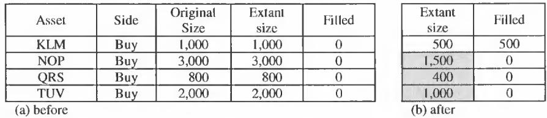  
Figure 4-25 An example set of linked alternative orders

Hence, the extant order sizes for the other linked orders are all reduced to $50 \%$ as we can see in Figure 4-25(b). The SAXESS platform, used by some of the Nordic exchanges, can link up to 8 orders in this way.

# Contingent orders

Somc venues allow even more dynamic linking between orders spanning multiple assets. Such contingent orders ensure that a match is only possible when all the other dependent orders may also he matched. Typically, this functionality is offered by futures exchanges to support spread trading, whereby simultaneous long and short positions are traded to try to profit from any price differences between two assets. It may also be employed to cater for more complex, multi-leg derivatives trading strategies.

For cxamplc, in Figure 4-26(a) we can sce the order books for assets JKL and XYZ. Let's assume wc wish to buy the spread, and so buy 1,000 JKL whilst sclling 1,000 XYZ, but only when the spread rcachcs -0.2. So we could placc a combined order to buy 1,000 JKL and sell $1 { , } 0 0 0 \mathrm { X Y } Z$ with a spread of -0.2.

At present the spread is actually -0.5, since the best ofer buy for JKL is 50.8 and the best hid of XYZ is 50.3. So we must use more passively priccd limit orders and wait for the spread to narrow, as wc can sce in Figure 4-26(b). In tcrms of pricing, our buy ordcr B4 is dependent on thc scll order S4, and vicc-versa. The price of B4 is based on the best bid for XYZ and the spread, i.e. $( 5 0 . 3 - - 0 . 2 ) = 5 0 . 5 $

JKL   
  

<table><tr><td colspan="4">Buys</td><td></td><td>Sells</td></tr><tr><td>Id</td><td>Time</td><td>Size</td><td>Price</td><td>Price</td><td>Size</td></tr><tr><td>B1</td><td>8:24:00</td><td>1,000</td><td>50.6</td><td>50.8</td><td>1,500</td></tr><tr><td>B2</td><td>8:22:25</td><td>800</td><td>50.6</td><td>50.9</td><td>900</td></tr><tr><td>B3</td><td>8:23:09</td><td>1,200</td><td>50.5</td><td>50.9</td><td>2,000</td></tr></table>

<table><tr><td colspan="3">Buys</td><td rowspan="2"></td></tr><tr><td>Id</td><td>Time</td><td>Size Price</td></tr><tr><td>B1</td><td>8:24:00</td><td>1,000 50.6</td><td></td></tr><tr><td>B2</td><td>8:22:25 800</td><td>50.6</td><td>:</td></tr><tr><td>B3</td><td>8:23:09 1,200</td><td>50.5</td><td></td></tr><tr><td>B4</td><td>8:26:00 1,000</td><td>50.5</td><td></td></tr></table>

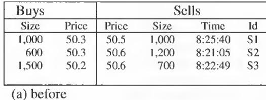  
Figure 4-26 An example pair of combined orders

<table><tr><td rowspan="2"></td><td colspan="3">Sells</td></tr><tr><td>Price</td><td>Size</td><td>Timc Id</td></tr><tr><td></td><td>50.5</td><td>1,000</td><td>8:25:40</td></tr><tr><td></td><td>50.6</td><td>1,200</td><td>S1 8:21:05 S2</td></tr><tr><td></td><td>50.6</td><td>700 8:22:49</td><td>S3</td></tr><tr><td></td><td>50.6</td><td>1,000 8:26:00</td><td>S4</td></tr></table>

Similarly, our sell order S4 is based on the best offer price for JKL, i.c. $( 5 0 . 8 + - 0 . 2 ) =$ 50.6. If onc of our orders is matched then the other order will immediately change its price in order to ensure it is filled. So, if B4 can be filled then order S4 will simultaneously re-price to 50.3 in order to complete.

Clearly, our ordcrs need to update to adjust to new market prices and sizes to ensure the rcquired spread is maintained. If there is insufficient volume available for onc of the assets then the size of the other order must be reduced by a corresponding amount. For example, if the order to buy $1 { , } 0 0 0 \ X \mathbf { Y } Z$ at 50.3 was suddenly cancelled we would need to changc the size for our orders. For more sophisticated handling of such spread orders, we could use pairs trading algorithms, which we shall discuss in more detail in Chapter 5.

# Implied orders

As we saw in the previous section, one way of handling combined orders is to use the current market priccs and the desired spread to imply their current price and size. Therefore, rcal ordcrs are dynamically adjusted to ensure they keep in line with the required spread.

Implied orders represent the next evolution of this approach. Spread trading is so commonplacc for futures that many venues allow them to be traded as standalonc orders. So we can buy a JUN-SEP spread, just as we might buy or sell the June or September futures contracts. This is usually handled by having scparate order books dedicated to spread trading or handling complex strategics. Howevcr, over the last few ycars more and more venues have started to link their standard order books with these complex books. This has allowed the creation of implied orders, which are able to span both types of order book. An implied sprcad may be derived from the combination of outright orders for diferent contracts, whilst implied orders may be derived from the combination of spread orders and outright orders.

The importance of such implied trading in futures markets is highlighted in a nicc piece by John Blank (2007): In relativcly new markets, such as NYMEX energy, up to $4 4 . 6 \%$ of the trades are achieved via implied trading. Even in mature markets, such as the CME Eurodollars, around $16 \%$ of the trading is attributable to implied orders $1 1 . 5 \%$ of the volume). Consequently, implied orders are an important souree of additional liquidity.

Figurc 4-27 shows an example of how an implied IN order is created. For simplicity only the orders which create the implied order are shown, namely the buy for the June futures contract (B1) and the sell order for the equivalent Scptember future (S1). Hence, we can sell a Junc futures contract at 96.5 and buy a September future for 96.0, in other words we can sell the sprcad for $( 9 6 . 5 - 9 6 . 0 ) = 0 . 5 $ This implies there is a bid of 0.5 available to buy the sprcad. The sizc is determined by whichever order is smallest (between orders B1 and S1) and so is 10. As we can scc in Figurc 4-27, these two orders result in the implied order 11.

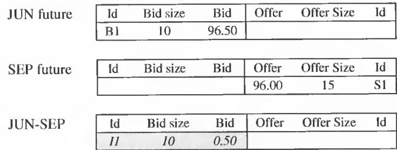  
Figure 4-27 Creating an implied IN order

Conversely, a sell order for the June contract will combine with a buy order for the September future to create a JUN-SEP spread offer price and size.

Likewise, by deconstructing a firm spread order into its constituents we can create an implied OUT order. For example, in Figure 4-28 we can see S2, a firm order to sell the SEPDEC spread at 0.6. By combining this with the firm buy order B1 for the September contract, we ean imply the price of a December luture. In other words, there must be an equivalent buy order for the December future at $( 9 5 . 7 – 0 . 6 ) = 9 5 . 1$ , shown as implied order 12.

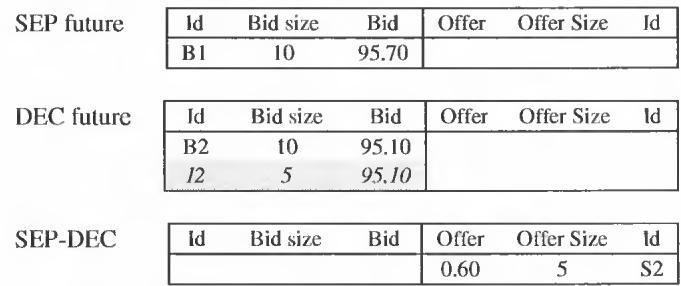  
Figure 4-28 Creating an implied OUT order

Also notice that there is already a bid (B2) at this price. When matching trades, most venues will assign priority to actual orders, any residual is then matched with the implied orders.

Implied orders may also be combined with actual orders to create second-generation implied orders. So the implied orders I1 and I2 may in turn be used to create oiher implied spreads or orders.

Butterfly spreads may also be used to create implied orders. These are effectively pairs of spread trades. For example, selling the JUN-SEP-DEC butterfly means selling a JUN-SEP spread and buying a SEP-DEC one. In effecl, this resulis in buying two September contracts and selling both a June and a December one. Again, there is a separate order book dedicated to handling these butterfly spreads, which may in turn be combined with standard orders to create more implied orders. Although complex, this is clearly an effective way of increasing liquidity on the main order book.

# 4.6 Summary

Orders are the fundamental building block for any rading strategy.

Orders represent execution instructions. There are two main types:

Market orders buy or sel a given quantity at the best pricc possible. They focus on completing the order with no specific price limit, and so demand liquidity. Limit orders buy or sell a given quantity at a specified price or better. The price limit must not be breached, even at the risk of failing to execute. They persist until executed or cancelled and so provide liquidity.

A range of optional conditions allow control over factors such as:

How and when the order becomes active.   
Its lifetime/duration.   
Whether it may be partially filled.   
Participation in auction/crossing sessions.   
Whether it should be directed to specific venues or even market makers.   
Linking with other orders.   
Miscellaneous factors, such as odd lots and setlement handling.

More specialised order types (derived from both market and limit orders) offer:

Hybrid orders, such as market-to-limit, which try to offer the best of both limit and market orders.   
Conditional orders, such as stops, which base their validity on a set condition. Only when the condition is met will it result in an actual order being placed.   
Hidden orders try to reduce signalling risk for large orders.   
Discretional orders offer more dynamic handling of limit prices.   
Routed orders allow more complex routing logic than possible via conditions. Order-contingent orders, which offer more complex linking relationships.

New order types are continuing to evolve. Some venues even offer orders that behave like algorithms, such as targeting the VW AP or participating in a set percentage of the market volume. Indeed, the line between them and trading algorithms is becoming increasingly blurred.

# - Chapter 5. Algorithm overview

Trading algorithms are predefined sets of rules for execution, each targeting a specific goal, whether it is matching the VWAP or seeking liquidity.

# 5.1 Introduction

An algorithm is basically a set of instructions for accomplishing a given task. Therefore, a trading algorithm simply defines the steps required to cxccute an order in a specific way. Brokers/vendors provide a range of trading algorithms, each with distinct goals. Some strive to match or beat a specific benchmark, or try to minimise overall transaction costs whilst others seek to trade more opportunistically. To achieve these goals, some approaches rigidly adhere to a given trading schedule whilst others are more dynamic, adapting to everchanging market conditions.

Although the individual rules may be quite straightforward, the wide array of diferent events and possibilities that must be catered for mean algorithms can rapidly becomc quite complex. A common way of tackling this complexity has been to split the problem in two. For instance, Vladimir Kazakov (2003) decomposes VWAP trading into determining the optimum trading strategy and then realising this with optimal execution. The strategy concentrates on the trading schedule and benchmark, whilst the execution focuses on choosing appropriate orders to achieve this. Similarly, Robert Kissell and Roberto Malamut (2005) propose breaking algorithmic trading down into macro and micro level decisions. Again, the macro levcl makes strategic choices, based on the overall objectives. The micro level considers more tactical details, such as the specifics of order submission.

As an example, let's take a simple order to buy 6,000 of asset ABC over the next hour and time-slice its cxecution so that we trade 1,000 every ten minutes. We can represent this task with some pseudo-code:

for timer $\ l = \ 1$ to 6 quantity $= \phantom { - } 1 0 0 0$ trade(quantity) sleep(10 minutes)

This code will not win any awards, but it does highlight that we are following a specific trading schedule until the order is completed. Obviously, we can make the trading algorithm more sophisticated by incorporating historical data or live market conditions. For instance, the quantity could be based on the best bid or offer size rather than just setting it to 1,000.

Exactly how we trade is a separate decision, for which the t rade () function simply acts as a placeholder. A variety of approaches might be adopted, so the t rade () funclion could:

● always place market orders always place limit orders dynamically choose the optimal order type based on market conditions

By separating the execution logie from the trading pattern in this way, we can create a common set of functions, which we will refer to as execution tactics. Thcsc arc then availablc for all trading algorithms, and may be used interchangeably. This makes it much easicr to customise our trading strategies. For example, we might default to a more passive execution style, but then change to use a more aggressive one when we get behind target or whcn conditions become more favourable.

So trading algorithms deal with the big picture, they primarily focus on how best to brcak up the ordcr for cxecution. At the micro level are the actual mcchanisms for managing ordcr submission. Wc shall cover such execution tactics in more detail in Chapler 9.

# 5.2 Categorising algorithms

Although there are a wide variety of trading algorithms out there, if we strip off the customisations, we can start to see a small sct of core strategies that are commonly provided by most brokers/vendors.

One way of classifying these algorithms is based on the benchmarks that they use. For example, the benchmark for implementation shortfall algorithms is predetcrmined, whilst for VWAP it is dynamic, and Market-on-Closc secks to match a future closing pricc.

Another way of classifying algorithms is based on their fundamental mechanisms. Ian Domowitz and Henry Yegerman (2005a) describe these as a continuum, which ranges from unstructured strategies, such as liquidity seeking algorithms, to highly structured approaches, such as a VWAP algorithm. Jian Yang and Brett Jiu (2006) go on to extend this approach by splitting this continuum into thrce main calegories, namely:

● Schedule-driven ● Evaluative ● Opportunistic

Purely schedule-driven algorithms follow a strictly dcfincd trading trajectory, gencrally created statically from historical data. For instance, historical volume profiles have often heen uscd to implement VWAP algorithms; they represent intra-day historical volume averages. These profiles may then be used as a template for how the order should be spli over time.

At the other end of thc spectrum, opportunistic algorithms are completely dynamic. They react to favourable market conditions, trading more aggrcssively to take advantage of them. Then as conditions become less favourable, they trade more passively, if at all. Hence, liquidity-seeking algorithms are a good fit for this category.

Evaluative algorithms represent the middlc ground between these two extremes. Often they combine aspects of each approach. Indeed, Yang and Jiu (2006) suggcst that at the macro level they may behave in a morc schedule-driven fashion whilst at the micro-level they focus on balancing the trade-off between cost and risk. Algorithms targeling implementation shortfall are good fit for the evaluative category.

This mechanistic style of classification focuses more on how algorithms are implemented, whereas a trader or invcstor makes their decisions based on set objectives or goals. To better reflect these we can adopt a slighily modified scheme using three main types, namely:

● Impact-driven ● Cost-driven ● Opportunistic

Table 5-1 shows some common trading algorithms grouped using these categories. It also shows some of the specific factors which trading algorithms are most affected by, or arc sensitive to.

Table 5-1 Algorithm classification   

<table><tr><td rowspan=2 colspan=1>Type</td><td rowspan=2 colspan=1>Keyfocus</td><td rowspan=2 colspan=1>Algorithms</td><td rowspan=1 colspan=2>Benchmark</td><td rowspan=1 colspan=2>Sensitivity</td></tr><tr><td rowspan=1 colspan=1>Dynamic</td><td rowspan=1 colspan=1>determine</td><td rowspan=1 colspan=1></td><td rowspan=1 colspan=1>Volume</td></tr><tr><td rowspan=4 colspan=1>Impact-driven</td><td rowspan=1 colspan=1>Time</td><td rowspan=1 colspan=1>Time Weighted Average Price</td><td rowspan=1 colspan=1>√</td><td rowspan=1 colspan=1></td><td rowspan=1 colspan=1></td><td rowspan=1 colspan=1></td></tr><tr><td rowspan=2 colspan=1>Volume</td><td rowspan=1 colspan=1>Volume Weighted Average Price</td><td rowspan=1 colspan=1>√</td><td rowspan=1 colspan=1></td><td rowspan=1 colspan=1></td><td rowspan=1 colspan=1></td></tr><tr><td rowspan=1 colspan=1>Percentage Of Volumc</td><td rowspan=1 colspan=1></td><td rowspan=1 colspan=1>√</td><td rowspan=1 colspan=1></td><td rowspan=1 colspan=1>●</td></tr><tr><td rowspan=1 colspan=1>Impact</td><td rowspan=1 colspan=1>Minimal impact</td><td rowspan=1 colspan=1>√</td><td rowspan=1 colspan=1></td><td rowspan=1 colspan=1>0</td><td rowspan=1 colspan=1>0</td></tr><tr><td rowspan=3 colspan=1>Cost-driven</td><td rowspan=3 colspan=1>PricelRisk</td><td rowspan=1 colspan=1>Implementation Shortfall</td><td rowspan=1 colspan=1></td><td rowspan=1 colspan=1>√</td><td rowspan=1 colspan=1>0</td><td rowspan=1 colspan=1>0</td></tr><tr><td rowspan=1 colspan=1>Adaptive Shortfall</td><td rowspan=1 colspan=1></td><td rowspan=1 colspan=1>√</td><td rowspan=1 colspan=1>●</td><td rowspan=1 colspan=1>0</td></tr><tr><td rowspan=1 colspan=1>Market On Close</td><td rowspan=1 colspan=1>√</td><td rowspan=1 colspan=1></td><td rowspan=1 colspan=1>0</td><td rowspan=1 colspan=1>0</td></tr><tr><td rowspan=3 colspan=1>Opportunistic</td><td rowspan=1 colspan=1>P ice</td><td rowspan=1 colspan=1>Price Inline</td><td rowspan=1 colspan=1></td><td rowspan=1 colspan=1>√</td><td rowspan=1 colspan=1>●</td><td rowspan=1 colspan=1>0</td></tr><tr><td rowspan=1 colspan=1>Liquidity</td><td rowspan=1 colspan=1>Liquidity-driven</td><td rowspan=1 colspan=1></td><td rowspan=1 colspan=1>√</td><td rowspan=1 colspan=1>0</td><td rowspan=1 colspan=1>0</td></tr><tr><td rowspan=1 colspan=1>Ratio/Spread</td><td rowspan=1 colspan=1>Pair / Spread trading</td><td rowspan=1 colspan=1></td><td rowspan=1 colspan=1>√</td><td rowspan=1 colspan=1>●</td><td rowspan=1 colspan=1></td></tr></table>

Impact-driven algorithms aim to minimise the overall market impact. In other words, they try to reduce the effect trading has on the asset's price. Therefore, large orders will often be split into much smaller ones, trading them over a longer period. This is best typified by the VWAP algorithm.

Cost-driven algorithms try to reduce the overall trading costs. Thereforc, they need to take account of market impact, timing risk, and even factors such as price trends. Implementation shortfall is therefore an important performance benchmark for these. Consequently, this has become the name oI the most commonly used cost-driven algorithm.

Opportunistic algorithms, as with Yang and Jiu (2006), take advantage whenever the markct conditions are favourable. So these algorithms are generally price or liquidity-driven or involve pair/spread trading.

Clearly, Table 5-1 is not a definitive list of every possible trading algorithm. To see a summary of the algorithms each broker offers both the A-Team Group (2009) and Advanced Trading ' publish directories, which are readily available. Stil, Table 5-1 covers most of the basic diferent types of functionality. Generally speaking, more exotic algorithms may be constructed by using one (or more) of these core strategics as the basis. For cxample, pair trading may act as the core for some multi-asset class trading, which we will cover in more detail in Chapter 13.

Note that this chapter focuses on trading algorithms that might be used by institutions and investors. We shall also cover some of the potential arbitrage strategics in Chapter 13. However, in general, algorithms that are predominantly used for market making or highfrequency trading / statistical arbitrage are beyond the scope of this book.

Before we go through each of these classes of algorithm in more detail, the following section outlincs some features that arc common to all algorithms.

# 5.3 Common features of algorithms

Algorithmic trading is evolving in a similar fashion to electronic trading. Initially, each broker offcred standalone solutions, adopting their own stylc of naming and controls. Gradually, these have started to become more standardised as they have been integrated into Execution Managcment Systems (EMS) and Order Management Systems (OMS). This allows investors and traders to switch betwcen vendors more easily. However, the constant evolution of new algorithms and the increasing need for customisation means that there will be a continual cycle of innovation and consolidation.

Despite their different goals, there is still a significant amount of commonality between trading algorithms. In particular, this may be seen for their parameters, which are thcir equivalents of the optional instructions we saw for orders.

# Algorithm parameters

Trading algorithms may be controlled by a rangc of parameters. Thesc providc the algorithms with limits or guidelines; they can be algorithm specific or gencric.

Specific parameters may be used to specify how much a VWAP algorithm may deviate from the historical volume profile, or the participation required for a percent of volume algorithm.

Generic paramcters represent common details, such as when to start and stop and whether to enforce a limit price etc. The following list summarises most of the parameters that are commonly supported, although various names may be used:

Start/End Times: Algorithms generally accept specific start and end times, instcad of conditions such as "good for the day". Some algorithms, mainly the cost-based ones, may derive their own optimal trading horizons, although the start and end timcs should stil act as hard limits. Certain algorithms might require a minimum amount of time to trade, so orders with too short a horizon may be rejected. Note that when start or end times are undefincd, defaults arc usually applicd: For end time, the default is usually the market close, whilst the start time will be now (or the market open). Also, remember that when using times it is important to check that they are transmitted and interpreted correctly, particularly for foreign time zones. For algorithms that support multi-day trading, the end date becomes cqually important.

Duration: Some vendors may actually forgo end times, instead using a duration parameter.

Must-be-filled: Generally, trading algorithms aim for complete exccution, excluding the more opportunistic ones. Market conditions may mean that this goal cannot always be achieved. Hence, a must-be-filled parameter will ensure that the algorithm trades any rcsidual amounts. Often this will invoke specialised finish up logic, which takes quite an aggressive approach to ensure completion. This may affect the overall cost/performance.

Execution style: Usually, this represents passive, aggressive or neutral trading. Aggressiveness is a function of both size and price, so an aggressive algorithm will often execute more quickly, but at a higher impact cost than a passive one.

Limit price: A hard price limit offers price protection just as it would for a limit order. This is particularly useful for algorithms that do not have an inbuilt sensitivity to price.

Volume limit (maximum): This prevents an algorithm from trading more than a certain percent of the actual market volume. If this is heing used to prevent signaling risk, it may bc better to use a minimal impact or a liquidity-driven algorithm.

Volume limit (minimum): Care needs to be taken when enforcing minimum levels ol trading since it could have a substantial effect on market impact costs.

Volume limit (child): Some algorithms may even support limits on the size of any child orders that are split off, or even the number of orders that can be extant at any one timc. Again, if this is being used to reduce signalling risk it may be better to switch to a minimal impact or a liquidity-driven algorithm.

Auctions: This flag may be used to specify whether the order may participate in opening, closing and any intraday auctions. Therc may even be parameters to state this as a percentage of the order size.

As algorithms develop, there will doubtless be new common parameters, but the above list gives an idea of thcir scope. In the following sections, each of the diffcrent classes of algorithm wil be reviewed in more depth, as well as detailing any specific parameters. For consistency, we will generally use the same sample order, to buy 10,000 of a reasonably liquid asset ABC, for each algorithm. 2 This approach should make it easier to compare the trading algorithms.

# 5.4 Impact-driven algorithms

Impact-driven algorithms evolved from simple order slicing strategies. By splitting larger orders into smaller child orders, they try to reduce the effect trading has on the asset's price, and so minimise the overall market impact costs.

The average price based algorithms, namely TWAP and VWAP, represent the first generation of impact-driven algorithms. Although intended to minimise impact costs, their main focus is their respective benchmarks. These are predominantly schedule-based algorithms, and so they usually track statically created trajectories with little or no sensitivity to conditions such as price or volume. Their aim is to completely execute the order within the given timeframe, irrespective of market conditions.

The natural progression from these static approaches has been the adoption of more dynamic methods. This has also resulted in a gradual shift towards more opportunistic trading. Percentage-of-volume (POV) algorithms are based on the actual market volume rather than relying on statically created schedules. These have further evolved into minimal impact algorithms, which takc a more stealthy approach, aiming for zero market impact.

# Time Weighted Average Price (TWAP)

The Time Weighted Average Price (TWAP) benchmark is an avcrage price, which reflects how thc asset's market price has changed over timc. Thcrefore, trading algorithms that attempt to match this benchmark are usually based on a uniform time-based schedule. They are unaffected by any other factors, such as market price or volume. TWAP algorithms arc the natural extension of the earliest time slicing based approaches.

# Basic Mechanism

The simplest version of a TWAP algorithm is bascd on timc slicing. Figurc 5-1 shows two such orders, each to buy 10,000 of asset ABC. Order 1 issues child orders for 500 cvery fifteen-minutc pcriod for 5 hours, whilst order 2 trades double that over half the time.

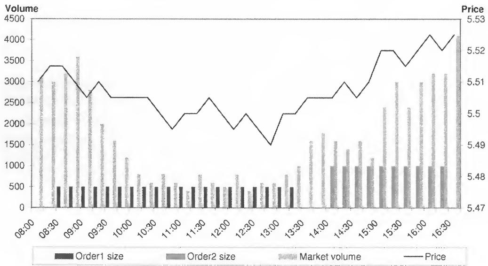  
Figure 5-1 Two example TWAP orders

Clearly, both trading patterns are extremely uniform, and indepcndent of both market volume and price. Unsurprisingly, the idcalised completion rate charts for both orders are straight lines, as shown in Figure 5-2.

Trading in such a predictable way can Icad to considcrable signalling risk. Indeed, the only thing the other market participants do not know is the total size of the ordcr. Evcn if other participants do not "game" this stratcgy it can still suffer poor execution quality due to its rigid adherence to the time schedule, in particular when priccs beccomc unfavourable or the available liquidity suddenly drops.

Alternatively, we can use the linear nature of the target complction profile to adopt a morc flexible trading approach. At any given time, we can determinc thc targct quantity thc order should have achieved just by Iooking up the corresponding valuc on thc completion rate chart. For instance, a 2-hour TWAP should have $2 5 \%$ of the order executed after half an hour. So instcad of following the strict time slieing pattern we could adopt a slightly more random approach. By constantly comparing our progress with the ideal target quantity, we can thcn see how far behind (or ahead of) the schedule we are. Thus, we may now vary both the frequcncy and size of trading whilst stil tracking the same target completion profile. This enables us to trade with a much less obvious trading pattern.

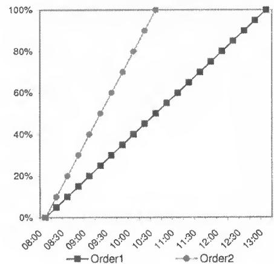  
Figure 5-2 Completion rate for sample TWAP orders

For example, Figure 5-3 shows a randomised TW AP order to buy 10,000 ABC:

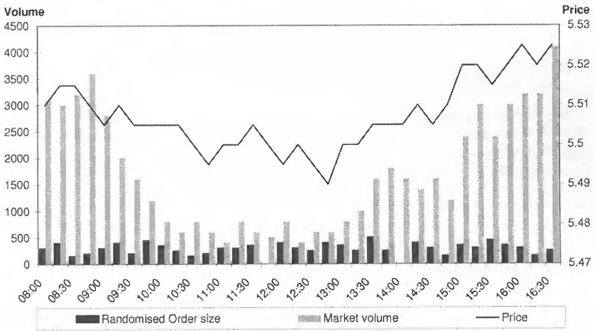  
Figure 5-3 A more randomised TWAP order

The child orders are split randomly throughout the day, with some periods not even issuing an order. Table 5-2 shows how the traded quantities for each 15-minute period

comparc with the idealised targets. Sometimes the trading lags behind the target quantities.   
although it can also get slightly ahead of schedule, for instancc at 8: 15 and 9:45.

This may be seen more clearly in a comparison of the completion rate charts, as shown in Figure 5-4. Evidently, the randomised order still tracks the lincar target completion rate quite closcly, which gives it a good chance of matching the TWAP benchmark.

<table><tr><td rowspan=1 colspan=1>Time</td><td rowspan=1 colspan=1>08:00</td><td rowspan=1 colspan=1>08:15</td><td rowspan=1 colspan=1>08:30</td><td rowspan=1 colspan=1>08:45</td><td rowspan=1 colspan=1>09:00</td><td rowspan=1 colspan=1>09:15</td><td rowspan=1 colspan=1>09:30</td><td rowspan=1 colspan=1>09:45</td><td rowspan=1 colspan=1>&quot;</td></tr><tr><td rowspan=1 colspan=1>Trade</td><td rowspan=1 colspan=1>300</td><td rowspan=1 colspan=1>400</td><td rowspan=1 colspan=1>150</td><td rowspan=1 colspan=1>200</td><td rowspan=1 colspan=1>300</td><td rowspan=1 colspan=1>400</td><td rowspan=1 colspan=1>200</td><td rowspan=1 colspan=1>450</td><td rowspan=1 colspan=1>&quot;</td></tr><tr><td rowspan=1 colspan=1>Tolal</td><td rowspan=1 colspan=1>300</td><td rowspan=1 colspan=1>700</td><td rowspan=1 colspan=1>850</td><td rowspan=1 colspan=1>1050</td><td rowspan=1 colspan=1>1350</td><td rowspan=1 colspan=1>1750</td><td rowspan=1 colspan=1>1950</td><td rowspan=1 colspan=1>2400</td><td rowspan=1 colspan=1>&quot;</td></tr><tr><td rowspan=1 colspan=1>Target lolal</td><td rowspan=1 colspan=1>290</td><td rowspan=1 colspan=1>570</td><td rowspan=1 colspan=1>860</td><td rowspan=1 colspan=1>1140</td><td rowspan=1 colspan=1>1430</td><td rowspan=1 colspan=1>1710</td><td rowspan=1 colspan=1>2000</td><td rowspan=1 colspan=1>2290</td><td rowspan=1 colspan=1>…</td></tr><tr><td rowspan=1 colspan=1>Difference</td><td rowspan=1 colspan=1>10</td><td rowspan=1 colspan=1>130</td><td rowspan=1 colspan=1>-10</td><td rowspan=1 colspan=1>-90</td><td rowspan=1 colspan=1>-80</td><td rowspan=1 colspan=1>40</td><td rowspan=1 colspan=1>-50</td><td rowspan=1 colspan=1>110</td><td rowspan=1 colspan=1>&quot;</td></tr></table>

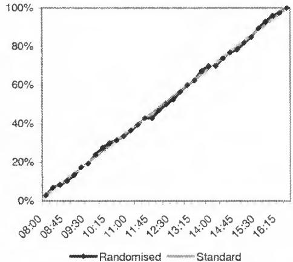  
Table 5-2 The trading pattern for a more randomised TWAP order   
Figure 5-4 Completion rate for a randomised TWAP order

This slightly randomised approach also allows more flexibility in the trading strategy, although it can increasc the risk of missing the TWAP benchmark. It also enables a more dynamic approach, for cxample, we could adjust the order aggressiveness bascd on how far ahead or behind schedule we are. Hence, a more passive order placcment strategy is possible, allowing for some degree of price improvemcnt. In addition, this approach allows us to ignore unfavourable market conditions (small best bid/offer sizes, large price jumps), or cven spurious ones which might correspond to gaming attempts. That said, such enhanccments mcan we are now trying to beat the TW AP benchmark rather than match it.

# Common variations

Some versions may allow an additional factor to be applied to the trading schedule, which tilts it and so making it trade either more aggressively or more passively, as shown in Figure 5-5. A more aggressive stance will issue more ordcrs early on, helping reduce timing risk, whilst a more passive approach should result in lower market impact costs.

A price adaptive TWAP algorithm might cven adjust its schedule dynarnically based on the market price (although arguably this makes it a simple price inline algorithm).

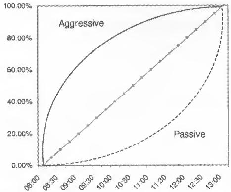  
Figure 5-5 Completion rates for a "tilted" TWAP

# Special Parameters:

Tracking: Some variants may have custom parameters that allow control over how closely they track the target completion profile. This might just be an on/off switch or actual limits for how far it may go ahead (or behind) schedule (cither as a percentage or possibly a cash valuc). This could cven be inferred from an execution style parameter.

Interval frequency: Some versions may allow control over how frequently it tradcs and whether it uses randomisations to vary the intervals.

# Volume Weighted Average Price (VWAP)

The VWAP (volume weighted average price) benchmark for a given time span is the total traded value divided by the total traded quantity. As a benchmark, it rapidly hecame ubiquitous since it gives a fair reflection of market conditions throughout the day and is simple to calculate. This led to algorithms that tracked the VWAP benchmark becoming extremely popular.

# Basic Mechanism

As its name suggests, VWAP is a volume-weighted average, it corresponds to the overall turnover divided by the total volume. Given $n$ trades in a day, cach with a specific price $p _ { n }$ and size $\nu _ { \mathfrak { n } }$ we can express the daily VW AP as:

$$
V W A P = \frac { \displaystyle \sum _ { n } \nu _ { n } p _ { n } } { \displaystyle \sum _ { n } \nu _ { n } }
$$

Thus, large trades will have more impact on the benchmark price than small ones. Whercas approximating the TWAP was simply a matter of trading regularly throughout the day, for VW AP we will also necd to trade in the correct proportions. Though, since these are based on the day's trading volume we do not know beforehand what these proportions should be.

A common solution to this probiem has been to use historical volume profiles. These are averages of historical traded volume for fixed time intervals throughout the day. If the day is broken down into $j$ periods then the daily VW AP may be cxpressed as:

$$
V W A P = \sum _ { j } u _ { j } \overline { { p } } _ { j }
$$

where $u _ { j }$ is the percentage of daily volume traded and $\overline { { p _ { j } } }$ is the average price in each period. Robert Kissell and Morton Glantz (2003) show that the optimal trading schedule to meet the VWAP benchmark may be based on this percentage. In other words, the target quantity $x _ { j }$ for each period $j$ is:

$$
x _ { j } = u _ { j } X
$$

where $X$ is the total size of the order. Hence, we can use this equation to predetermine our ideal trading patern. This approach has formed the basis for most VWAP algorithms. Note that it clearly assumes that the day's trading volume follows a similar patern to the historical prolile. Provided that the historical profile is based on suflicient data this is a reasonable assumption for many liquid asscis. In Chapter 10, we shall discuss historical volume profiles in more detail.

Continuing with our example order to buy 10,000 ABC, Figure 5-6 shows a sample daily VWAP trading pattern. Notice that in this example the trading is dependent on the historical volume profile. It is not aflected by the actual market volume or by price ehanges.

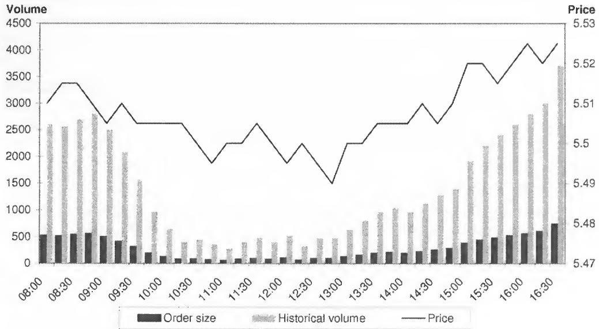  
Figure 5-6 An example VWAP order

To see how the trading pattern was determined, Table 5-3 shows the historical volume profile for each fifteen-minute period, together with the target size based on it. For cxample, Irom 8:00 to 8:15 the historical volume profile shows an average volume of 2,600, out of a total of 49,780. This corresponds to $5 . 2 \%$ , so using equation 5-1 and given that we are trading for the entire day then our target size for this time period is 520.

Table 5-3 Volume profile data for an example VWAP order   

<table><tr><td rowspan=1 colspan=1>Time</td><td rowspan=1 colspan=1>08:00</td><td rowspan=1 colspan=1>08:15</td><td rowspan=1 colspan=1>08:30</td><td rowspan=1 colspan=1>08:45</td><td rowspan=1 colspan=1>09:00</td><td rowspan=1 colspan=1>09:15</td><td rowspan=1 colspan=1>09:30</td><td rowspan=1 colspan=1>09:45</td><td rowspan=1 colspan=1>10:00</td></tr><tr><td rowspan=1 colspan=1>Hist Volm</td><td rowspan=1 colspan=1>2600</td><td rowspan=1 colspan=1>2560</td><td rowspan=1 colspan=1>2700</td><td rowspan=1 colspan=1>2800</td><td rowspan=1 colspan=1>2500</td><td rowspan=1 colspan=1>2080</td><td rowspan=1 colspan=1>1560</td><td rowspan=1 colspan=1>960</td><td rowspan=1 colspan=1>640</td></tr><tr><td rowspan=1 colspan=1>% of day</td><td rowspan=1 colspan=1>5.2</td><td rowspan=1 colspan=1>10.4</td><td rowspan=1 colspan=1>15.8</td><td rowspan=1 colspan=1>21.4</td><td rowspan=1 colspan=1>26.4</td><td rowspan=1 colspan=1>30.6</td><td rowspan=1 colspan=1>33.7</td><td rowspan=1 colspan=1>35.7</td><td rowspan=1 colspan=1>37.0</td></tr><tr><td rowspan=1 colspan=1>Targel</td><td rowspan=1 colspan=1>520</td><td rowspan=1 colspan=1>510</td><td rowspan=1 colspan=1>540</td><td rowspan=1 colspan=1>560</td><td rowspan=1 colspan=1>500</td><td rowspan=1 colspan=1>420</td><td rowspan=1 colspan=1>310</td><td rowspan=1 colspan=1>190</td><td rowspan=1 colspan=1>130</td></tr><tr><td rowspan=1 colspan=1>Time</td><td rowspan=1 colspan=1>10:15</td><td rowspan=1 colspan=1>10:30</td><td rowspan=1 colspan=1>10:45</td><td rowspan=1 colspan=1>11:00</td><td rowspan=1 colspan=1>11:t5</td><td rowspan=1 colspan=1>11:30</td><td rowspan=1 colspan=1>11:45</td><td rowspan=1 colspan=1>12:00</td><td rowspan=1 colspan=1>12:15</td></tr><tr><td rowspan=1 colspan=1>Hist Volm</td><td rowspan=1 colspan=1>400</td><td rowspan=1 colspan=1>440</td><td rowspan=1 colspan=1>360</td><td rowspan=1 colspan=1>280</td><td rowspan=1 colspan=1>400</td><td rowspan=1 colspan=1>480</td><td rowspan=1 colspan=1>400</td><td rowspan=1 colspan=1>520</td><td rowspan=1 colspan=1>320</td></tr><tr><td rowspan=1 colspan=1>% of day</td><td rowspan=1 colspan=1>37.8</td><td rowspan=1 colspan=1>38.7</td><td rowspan=1 colspan=1>39.4</td><td rowspan=1 colspan=1>39.9</td><td rowspan=1 colspan=1>40.7</td><td rowspan=1 colspan=1>41.7</td><td rowspan=1 colspan=1>42.5</td><td rowspan=1 colspan=1>43.6</td><td rowspan=1 colspan=1>44.2</td></tr><tr><td rowspan=1 colspan=1>Targel</td><td rowspan=1 colspan=1>80</td><td rowspan=1 colspan=1>90</td><td rowspan=1 colspan=1>70</td><td rowspan=1 colspan=1>60</td><td rowspan=1 colspan=1>80</td><td rowspan=1 colspan=1>100</td><td rowspan=1 colspan=1>80</td><td rowspan=1 colspan=1>100</td><td rowspan=1 colspan=1>60</td></tr><tr><td rowspan=1 colspan=1>Time</td><td rowspan=1 colspan=1>12:30</td><td rowspan=1 colspan=1>12:45</td><td rowspan=1 colspan=1>13:00</td><td rowspan=1 colspan=1>13:15</td><td rowspan=1 colspan=1>13:30</td><td rowspan=1 colspan=1>13:45</td><td rowspan=1 colspan=1>14:00</td><td rowspan=1 colspan=1>14:15</td><td rowspan=1 colspan=1>14:30</td></tr><tr><td rowspan=1 colspan=1>Hist Volm</td><td rowspan=1 colspan=1>480</td><td rowspan=1 colspan=1>480</td><td rowspan=1 colspan=1>640</td><td rowspan=1 colspan=1>800</td><td rowspan=1 colspan=1>960</td><td rowspan=1 colspan=1>1040</td><td rowspan=1 colspan=1>960</td><td rowspan=1 colspan=1>1120</td><td rowspan=1 colspan=1>1280</td></tr><tr><td rowspan=1 colspan=1>% of day</td><td rowspan=1 colspan=1>45.2</td><td rowspan=1 colspan=1>46.1</td><td rowspan=1 colspan=1>47.4</td><td rowspan=1 colspan=1>49.0</td><td rowspan=1 colspan=1>50.9</td><td rowspan=1 colspan=1>53.0</td><td rowspan=1 colspan=1>55.0</td><td rowspan=1 colspan=1>57.2</td><td rowspan=1 colspan=1>59.8</td></tr><tr><td rowspan=1 colspan=1>Targel</td><td rowspan=1 colspan=1>100</td><td rowspan=1 colspan=1>100</td><td rowspan=1 colspan=1>130</td><td rowspan=1 colspan=1>160</td><td rowspan=1 colspan=1>190</td><td rowspan=1 colspan=1>210</td><td rowspan=1 colspan=1>190</td><td rowspan=1 colspan=1>220</td><td rowspan=1 colspan=1>260</td></tr><tr><td rowspan=1 colspan=1>Time</td><td rowspan=1 colspan=1>14:45</td><td rowspan=1 colspan=1>15:00</td><td rowspan=1 colspan=1>15:15</td><td rowspan=1 colspan=1>15:30</td><td rowspan=1 colspan=1>15:45</td><td rowspan=1 colspan=1>16:00</td><td rowspan=1 colspan=1>16:15</td><td rowspan=1 colspan=1>16:30</td><td rowspan=4 colspan=1></td></tr><tr><td rowspan=1 colspan=1>Hist Volm</td><td rowspan=1 colspan=1>t400</td><td rowspan=1 colspan=1>1920</td><td rowspan=1 colspan=1>2200</td><td rowspan=1 colspan=1>2400</td><td rowspan=1 colspan=1>2600</td><td rowspan=1 colspan=1>2800</td><td rowspan=1 colspan=1>3000</td><td rowspan=1 colspan=1>3700</td></tr><tr><td rowspan=1 colspan=1>% of day</td><td rowspan=1 colspan=1>62.6</td><td rowspan=1 colspan=1>66.5</td><td rowspan=1 colspan=1>70.9</td><td rowspan=1 colspan=1>75.7</td><td rowspan=1 colspan=1>80.9</td><td rowspan=1 colspan=1>86.5</td><td rowspan=1 colspan=1>92.6</td><td rowspan=1 colspan=1>100.0</td></tr><tr><td rowspan=1 colspan=1>Targel</td><td rowspan=1 colspan=1>280</td><td rowspan=1 colspan=1>390</td><td rowspan=1 colspan=1>440</td><td rowspan=1 colspan=1>480</td><td rowspan=1 colspan=1>520</td><td rowspan=1 colspan=1>560</td><td rowspan=1 colspan=1>600</td><td rowspan=1 colspan=1>740</td></tr></table>

Throughout the day, the trading algorithm then jusl needs to place sufficient orders in each interval to kcep up with this target execution profile. Assuming this is achieved, the resultant chart of percentage completion is shown in Figure 5-7.

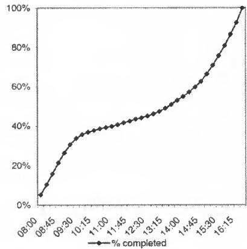  
Figure 5-7 Percentage completion for an example VWAP order

Modern VWAP algorithms oflen incorporate complex logic to delcrmine whether they may get ahead of their schedule, and how best to cateh up if they are behind their target. Overall, their performance is based on how well they track the target, but also on how well they predict market volume. Therefore, the way the hislorical volume profiles are compiled can also have a marked effect. Note for fragmented markets aggregated data may be used.

Broadly speaking, for this example the historical and actual market volumes are reasonably similar, so our trading pattern should be a fair approximation for the day's VWAP (without accounting for market impact and other such slippage costs). Obviously, if the market volume is significantly different to the historical volume profile then performancc may well suffer.

Another way of visualising this is to group the day's market volume by its price. For instance, using the same data from our example trade to buy 10,000 ABC, Table 5-4 shows the total markct (and historical) volumes grouped by the average price for each hour of the trading day. From this, we can calculate an approximate VWAP for the whole trading day,

$$
\mathrm { V W A P } = \mathrm { T o t a l ~ V a l u e } / \mathrm { Q u a n t i t y } = 3 3 2 3 6 0 / 6 0 3 0 0 = 5 . 5 1 1 8
$$

Instead of using the actual market volumes, we can also calculate a lhcorelical VWAP based purely on the volumes from the historical profile. This gives a $\mathrm { V W A P } _ { \mathrm { h i s t } } = 2 7 4 4 0 0 /$ $4 9 7 8 0 = 5 . 5 1 2 3 .$ Hence, in this example our historical volume profile is indeed an acceptable fit, using it to guide our lrading patterns results in an average price within one basis point of the daily VW AP.

Table 5-4 Market and historical volumes from example trade   

<table><tr><td rowspan=1 colspan=1>Price</td><td rowspan=1 colspan=1>5.49</td><td rowspan=1 colspan=1>5.495</td><td rowspan=1 colspan=1>5.5</td><td rowspan=1 colspan=1>5.505</td><td rowspan=1 colspan=1>5.51</td><td rowspan=1 colspan=1>5.515</td><td rowspan=1 colspan=1>5.52</td><td rowspan=1 colspan=1>5.525</td><td rowspan=1 colspan=1>∑</td></tr><tr><td rowspan=1 colspan=1>MktVolm</td><td rowspan=1 colspan=1>600</td><td rowspan=1 colspan=1>2000</td><td rowspan=1 colspan=1>4700</td><td rowspan=1 colspan=1>14200</td><td rowspan=1 colspan=1>11300</td><td rowspan=1 colspan=1>8600</td><td rowspan=1 colspan=1>11600</td><td rowspan=1 colspan=1>7300</td><td rowspan=1 colspan=1>60300</td></tr><tr><td rowspan=1 colspan=1>HistVolm</td><td rowspan=1 colspan=1>480</td><td rowspan=1 colspan=1>1360</td><td rowspan=1 colspan=1>3280</td><td rowspan=1 colspan=1>10780</td><td rowspan=1 colspan=1>10000</td><td rowspan=1 colspan=1>7660</td><td rowspan=1 colspan=1>9720</td><td rowspan=1 colspan=1>6500</td><td rowspan=1 colspan=1>49780</td></tr><tr><td rowspan=1 colspan=1>IdealTrade</td><td rowspan=1 colspan=1>100</td><td rowspan=1 colspan=1>330</td><td rowspan=1 colspan=1>780</td><td rowspan=1 colspan=1>2350</td><td rowspan=1 colspan=1>1870</td><td rowspan=1 colspan=1>1430</td><td rowspan=1 colspan=1>1920</td><td rowspan=1 colspan=1>1210</td><td rowspan=1 colspan=1>10000</td></tr><tr><td rowspan=1 colspan=1>HistTrade</td><td rowspan=1 colspan=1>100</td><td rowspan=1 colspan=1>270</td><td rowspan=1 colspan=1>660</td><td rowspan=1 colspan=1>2170</td><td rowspan=1 colspan=1>2010</td><td rowspan=1 colspan=1>1540</td><td rowspan=1 colspan=1>1950</td><td rowspan=1 colspan=1>1310</td><td rowspan=1 colspan=1>10000</td></tr></table>

# Common variations

The dependence on hislorical data means that VW AP algorithms can be vulncrablc to sudden shifts in lrading volume or liquidily. Thcsc can cause considerable deviations from VW AP. Thercfore, some versions may also monitor current market conditions. Effectively, this makes them a hybrid between a static VWAP algorithm and the more dynamic volume participation approach.

Some variants may offer a more adaptive approach that tracks shorl-term price and volume trends and dynamically adjusts their target exccution profile accordingly. Though, such customisations mean they are not really true VWAP algorithms anymore.

# Special Parameters:

Tracking: Some VWAP algorithms allow control over how closely they track the target completion profile. Usually, this is via custom paramclers or just inferred from an exccution style parameter.

Start time/End time: These can be specified to trade the VWAP for a specific interval; otherwise most algorithms will default to trading over the whole day.

Trending/Tilting: Generally, VWAP is an acceptable benchmark Io Irade towards if we have no specific view on the asset's price. But if we cxpect the price lo trend throughout the day then this could prove to be an expensive option. Some versions may provide parameters lhat let the target cxecution profile be tilted towards cither the start or the cnd of the day. A more detailed example is given in Kissell and Glantz (2003). Note that it may also be worth considering an alternative algorithm in such cases.

# Percent of Volume (POV)

Percent of volume (POV) algorithms "go along" with the market volume; hence, they are also sometimcs called volume inline, participation, target volume or follow algorithms. Ideally, thc net result should be that if a million shares of XYZ trade in a day then a POV algorithm tracking a $20 \%$ participation rate should have executed 200,000 of those.

# Basic Mechanism

Unlike algorithms, such as TWAP and VWAP, whcre a trading sehedule may be predetermined, for POV algorithms the trading schedule is dynamically determined. The algorithm tries to participate in the markct at a given rate, in proportion with the market volume. For example, Figure 5-8 shows our example order to buy 10,000 ABC using a POV algorithm with a $20 \%$ participation rate. Notice that there is no relationship between the trading pattern and the market price. As Table 5-5 shows, the target trade size is driven solely by the observed market volume.

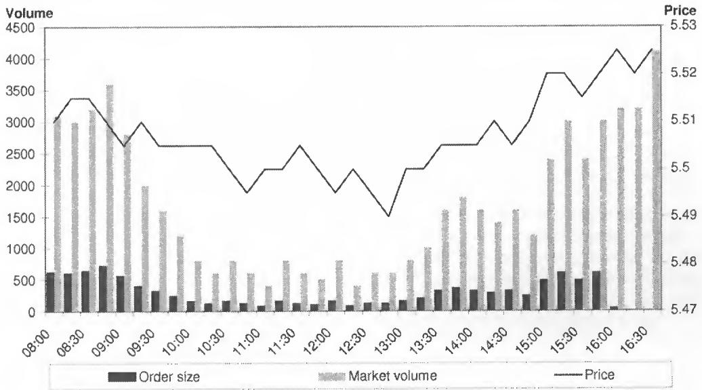  
Figure 5-8 An example POV order

Table 5-5 Market volume data for the example POV order   

<table><tr><td rowspan=1 colspan=1>Time</td><td rowspan=1 colspan=1>08:00</td><td rowspan=1 colspan=1>08:15</td><td rowspan=1 colspan=1>08:30</td><td rowspan=1 colspan=1>08:45</td><td rowspan=1 colspan=1>09:00</td><td rowspan=1 colspan=1>09:15</td><td rowspan=1 colspan=1>09:30</td><td rowspan=1 colspan=1>09:45</td><td rowspan=1 colspan=1>…</td></tr><tr><td rowspan=1 colspan=1>Mkt Volm</td><td rowspan=1 colspan=1>3100</td><td rowspan=1 colspan=1>3000</td><td rowspan=1 colspan=1>3200</td><td rowspan=1 colspan=1>3600</td><td rowspan=1 colspan=1>2800</td><td rowspan=1 colspan=1>2000</td><td rowspan=1 colspan=1>1600</td><td rowspan=1 colspan=1>1200</td><td rowspan=1 colspan=1>…</td></tr><tr><td rowspan=1 colspan=1>Target</td><td rowspan=1 colspan=1>620</td><td rowspan=1 colspan=1>600</td><td rowspan=1 colspan=1>640</td><td rowspan=1 colspan=1>720</td><td rowspan=1 colspan=1>560</td><td rowspan=1 colspan=1>400</td><td rowspan=1 colspan=1>320</td><td rowspan=1 colspan=1>240</td><td rowspan=1 colspan=1>…</td></tr></table>

Also, notice that the order completes by $4 \mathrm { p m }$ . The POV algorithm completes as soon as thc market volume allows, or at its specified end time (whichever is sooner). The percentage completion profile is shown in Figure 5-9. In comparison, a VWAP order will spread itself out to take all the available time. Broadly speaking, though, the POV trading pattern still looks fairly similar to the example VWAP order we saw in Figure 5-6. This is because the order represents around a fifth of the day's historical volume, and the historical and market volume profiles are fairly similar. So the example VW AP order from Figure 5-6 is almost a proxy for $20 \%$ participation.

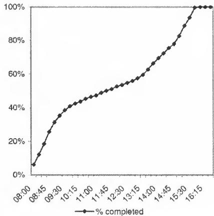  
Figure 5-9 Percentage completion for an example POV order

It is important to note that although POV algorithms are dynamic, they still cannot prediet market volume. They react to reported trades to keep in line with the observed volume. For instance, Table 5-6 shows a more detailed breakdown of the markel trades for our example order, for the 8:15-8:30 time interval, with our executions highlighted.

Table 5-6 A breakdown of the market trades for the example POV order   

<table><tr><td rowspan=1 colspan=1>Time</td><td rowspan=1 colspan=1>Tradepricc</td><td rowspan=1 colspan=1>Tradesize</td><td rowspan=1 colspan=1></td><td rowspan=1 colspan=1>Accum.markelvolume</td><td rowspan=1 colspan=1>Targelposilion</td><td rowspan=1 colspan=1>Quantilybehind</td></tr><tr><td rowspan=1 colspan=1>08:16:02</td><td rowspan=1 colspan=1>5.56</td><td rowspan=1 colspan=1>500</td><td rowspan=1 colspan=1></td><td rowspan=1 colspan=1>500</td><td rowspan=1 colspan=1>100</td><td rowspan=1 colspan=1>100</td></tr><tr><td rowspan=1 colspan=1>08:19:24</td><td rowspan=1 colspan=1>5.56</td><td rowspan=1 colspan=1>1000</td><td rowspan=1 colspan=1></td><td rowspan=1 colspan=1>1500</td><td rowspan=1 colspan=1>300</td><td rowspan=1 colspan=1>300</td></tr><tr><td rowspan=1 colspan=1>08:23:09</td><td rowspan=1 colspan=1>5.57</td><td rowspan=1 colspan=1>200</td><td rowspan=1 colspan=1></td><td rowspan=1 colspan=1>1700</td><td rowspan=1 colspan=1>340</td><td rowspan=1 colspan=1>340</td></tr><tr><td rowspan=1 colspan=1>08:25:15</td><td rowspan=1 colspan=1>5.55</td><td rowspan=1 colspan=1>400</td><td rowspan=1 colspan=1></td><td rowspan=1 colspan=1>2100</td><td rowspan=1 colspan=1>420</td><td rowspan=1 colspan=1>20</td></tr><tr><td rowspan=1 colspan=1>08:27:06</td><td rowspan=1 colspan=1>5.56</td><td rowspan=1 colspan=1>300</td><td rowspan=1 colspan=1></td><td rowspan=1 colspan=1>2400</td><td rowspan=1 colspan=1>480</td><td rowspan=1 colspan=1>80</td></tr><tr><td rowspan=1 colspan=1>08:28:26</td><td rowspan=1 colspan=1>5.56</td><td rowspan=1 colspan=1>400</td><td rowspan=1 colspan=1></td><td rowspan=1 colspan=1>2800</td><td rowspan=1 colspan=1>560</td><td rowspan=1 colspan=1>160</td></tr><tr><td rowspan=1 colspan=1>08:29:21</td><td rowspan=1 colspan=1>5.56</td><td rowspan=1 colspan=1>200</td><td rowspan=1 colspan=1></td><td rowspan=1 colspan=1>3000</td><td rowspan=1 colspan=1>600</td><td rowspan=1 colspan=1>0</td></tr></table>

As we saw in Table 5-5, for this period the market volume is 3,000, of which we would like to be 600. Therefore, by 08:23 when 1,700 of ABC has already traded we would ike to have seen $20 \%$ of this, or 340. Though, rather than respond to each individual trade we can set trigger points, for instance, we catch up at 08:25 by filling an order for 400. Note that since we are reacting to executed volume, when calculating our actual order sizes we need to adjust our participation rate slightly to account for our own trading. This is because when we see 1,000 has executed, if we then trade another 200, we have changed the overall volume, and so this will not actually be $20 \%$ participation any more:

$$
{ \mathrm { P a r t i c i p a t i o n ~ r a t e } } = 2 0 0 / \left( 1 0 0 0 + 2 0 0 \right) = 1 6 . 6 6 7 \%
$$

Therefore, we can approximate the required tradc size by using thc adjustment factor $1 / ( 1 { \tt - p } )$ , where p is our participation rate. In the case of our examplc order, we actually need $1 / ( 1 { - } 0 . 2 ) = 2 5 \%$ of each observed new trade (excluding our own trades). For example, when a trade of 1000 has executed, splitting a child order for another 250 gives:

$$
= 2 5 0 / \left( 1 0 0 0 + 2 5 0 \right) = 2 0 \%
$$

This highlights a common concern about POV algorithms: If several are competing for an illiquid asset, they could start driving each other on, like two bidders in an auction despcrate to buy the last lot. Potentially, this could lead to significant market impact. To try to protect from such situations firm price limits may be applicd to POV orders, since the algorithm itself has no inhuilt price sensitivity. This will at least control the cxecution price, although it might well lead to the order failing to execute fully.

Another consideration is how the POV algorithm actually responds to rcported volume. If it simply splis a new child order each timc there is a trade then the resultant trading pattern is nearly as prcdictable as simple order slicing, as Tom Middleton (2005) highlights. To prevent such signaling risk we can keep track of the target volume and trade more periodically, as we do in the example shown in Table 5-6. Trading in this fashion allows us to vary the order placcment, and adjust the aggressiveness of our execution tactics based on how far behind we are.

Similarly, although it is based on real-time data, POV can still be quite a reactive approach. Sudden volume surges are dificult to predict so even if the algorithm has becn keeping ahead of the target participation rate, a sharp increase in volume will inevitably put it bchind target. If the increase was due to a few large tradcs, it may well be too late to participate. Hence, most POV algorithms use a variety of safeguards to prevent themselves from chasing volumc spikes, such as comparing the target trade size with the currently available volumc on the order book. Some versions may allow control over the market volume calculations, either to exclude block prints or to set a maximum permissihle trade size. Fragmented markets also complicate things, since there are multiple volumes to track.

As with VWAP algorithms, the performance of POV algorithms depends on the techniqucs they employ to track their targets. It must be remembered that one of the key goals is to minimisc overall markct impact. In practice, POV algorithms may wcll take account of other factors, such as liquidity, to help determine how best they should trade.

# Common variations

Some POV algorithms may incorporate forecasting to try and better anticipate the upcoming trading volume. Generally, such approaches are based on a mixture of historical volume profiles, current observed volume and quantitative analytics.

Pricc adaptive versions of POV algorithms are also starting to appear. These adjust the participation rate bascd on how the current market price compares to a benchmark. Some variants can even adapt to the relative price changcs for other assets, such as sector or market indices or even ETFs.

Corporate buyback programs in the U.S. oftcn use the "safe harbour" provision granted by the SEC's Rule 10h-18, which protects issuers against liability for market manipulation. This mandates strict timing, price and volume conditions, designed to minimise the market impact of repurchases. Some brokers/vcndors provide dedicated corporate buyback algorithms that adhere to these requircments. Often these are in fact based on modified POV algorithms. One of the key changes is to add a price condition that ensures the algorithm does not issue orders that end up making the market, so they do not allow their child orders to be priced more than the last trade or the current best bid.

# Special Parameters:

Participation rate: Clearly, this percentage is the key paramcter for POV algorithms.

Tracking: Some POV algorithms allow control over how closely they track the target participation ratc. I1 may even he possible to dictatc how far ahcad and behind it can gct, so we might allow it plenty of leeway for being ahead, but almost none should it fall bchind. Elfectively, this becomcs a tilting mcchanism for the target participation rate. Also for variants that allow a more dynamic adjustment of the participalion rate therc will nccd to he additional parameters, which allow us to specify what thc benchmark is and exactly how the participation rate should change in relation to this.

Volume filters: These help prevent the algorithm needlessly chasing volumc. Some versions allow block trades to be excluded; alternatively maximum trade size limits may he set. In the U.S., some vendors even allow control over whether the volumc heing tracked is from the primary cxchangc or a composite volumc total for all the common cxecution venues.

Start time: Noie that POV algorithms only track market volumc while they are active, they will not try to catch up with volume traded since the open.

End time: Since POV algorithms are driven by market volume not by a schedulc, their actual cnd time is variable. The cnd timc just acts as a firm limit, although therc is no guarantee that the order will be completed by then. Converscly, if the markct volume spikes then the order could complete sooner than expected.

Must-be-filled: As we saw for end time, the variable naturc of POV means that wc nccd to flag if $100 \%$ completion is required. This allows thc algorithm to change its trading style when it is running out of time.

Limit price: POV algorithms have no intrinsic price dependency; therefore, a firm price limit may be used. Note that although POV algorithms normally track all trading volumc when a limit price is applied it should ignore any trades that are out of range of this limit. Otherwise, every time that the price moves back within the limit it will bchavc as if there had been a sudden volume spike.

Execution style: Some POV algorithms may support an execution-style paramcter, which allows fine-tuning of its trading bchaviour. A morc passive approach may be used to try to achieve price improvement, whereas an aggrcssive siyle will track the participation ratc more closcly. Essentially, this is another form of the tracking parameter. This choice may also be dictated by the asset's liquidity, for instance, for illiquid assets more aggressive trading may he ncccssary to prevent getting behind its targets.

# Minimal impact

Minimal impact algorithms represent the next logical progression from VWAP and POV algorithms. Rather than seeking to track a market-driven benchmark they focus solcly on minimising market impact.

Signalling risk is an important consideration for these algorithms. This represents the potential losses due to information that our trading pattern relays to the other market participants. It is dependent on both our order size and the asset's liquidity. Thus, algorithms focus on iaking advantage of the facilities offered by "dark pool" ATSs and broker's internal crossing nctworks as well as using hidden order types to reduce this risk.

# Basic Mechanism

The simplest version of a minimal impact algorithm is to route the entire order to a "dark pool" ATS and just leave it there. Although the actual hit ratios on some ATSs can he quite low, so many algorithms may also work a small portion of the order separately to ensure a reasonable level of execution. For example, we might leave $80 \%$ on the ATS and trade the remainder using a passive VWAP or POV algorithm, or even a liquidity-driven one. Alternatively, some variants may dynamically adjust the total size available on the ATS cach time the algorithm decides to split of another child order. Note that for ATSs, which support conditional orders or IOIs, an indication could be left for the entire order whilst in parallel child orders could be worked in the markets. Therefore, the overall trading pattern is very much dependent on fills from the ATS. Hence, this is much more variable than some of the other algorithms we have already seen, so Figure 5-10 is just one possibility:

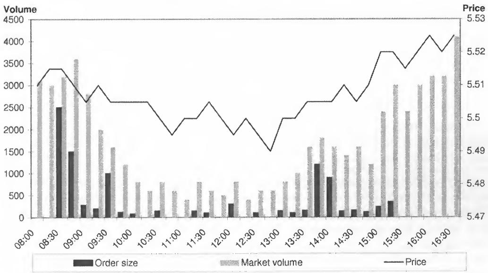  
Figure 5-10 An example minimal impact order

The sizable fills in Figure 5-10 correspond to successful crossings on the ATS, which are generally done at the mid price for the main market. The remaining fills correspond to trading on the main market and other venues.

Overall, the completion rate chart for this example looks fairly similar to the ones for the VWAP and POV algorithms, as Figure 5-11 shows. Note that for this example $80 \%$ of the order was filled from the ATS. If these fills had not occurred, the algorithm would have had to make up as much as it could on the other venues whilst still trying to minimise impact costs. Thus, it is possible that the order would only have partially completed.

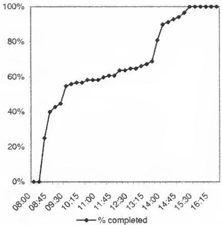  
Figure 5-11 Completion rate for sample minimal impact order

# Common variations

Somc versions may incorporate models to estimate the probability of being filled on the ATS, using this to detcrmine how much of the order should be left therc. Likewisc, impact cost models may be used to forecast the overall potential cost, which may then be used as a targct benchmark. In many ways, there is a lot of crossovcr betwecn these algorithms and those of the more cost-based ones, which we will revicw in the ncxt section. Similarly, the stcalth-based approaches used to reduce impact mean they share a lot of thc same logic as the liquidity-driven algorithms, which we shall see in more detail in section 5.6.

# Special Parameters:

Visibility: How much of the order may actually be displayed at execution venucs. No visibility implies the order is only worked in "dark pool" ATSs whilst low visibility ensures that only hidden order typcs or IOC orders are used at other venues.

Must-be-filled: The minimal impact algorithm is focussed solely on reducing this cost at the risk of failing to fully cxccute, much like a limit order. If there is a requirement to fully fill the order, it may be more appropriatc to use a cost-hased algorithm instead.

# 5.5 Cost-driven algorithms

Cost-driven algorithms seck to reduce the overall transaction costs. As we saw in Chapter 2, these are much more than just commissions and spreads. Implicit costs such as market impact and timing risk are important components of the overall cost.

We have already scen that market impact may be minimised by spliting the trading over a long period of time. However, this cxposes orders to a much greater liming risk, particularly for volatile asseis. Therefore, cost-driven algorithms need to somehow reducc timing risk as well. Figure 5-12 highlights thesc diflering requiremcnts by ploting how the various costs change over time. Clearly, time has an opposite effect on market impact and timing risk.

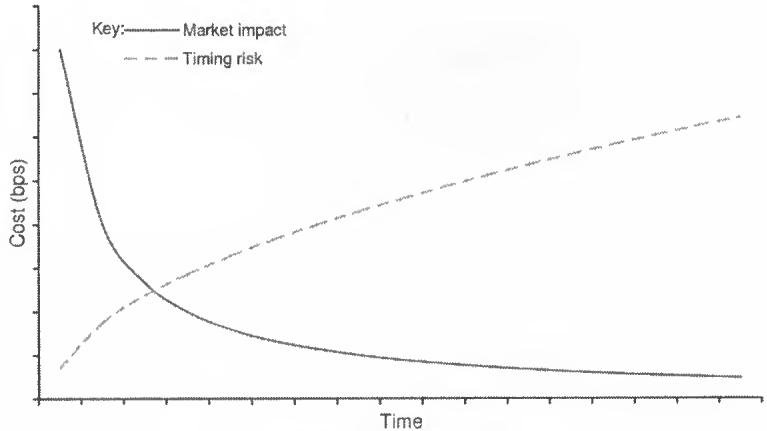  
Figure 5-12 Trading strategy costs

In order to minimise the overall transaction costs we need to somehow strike a balance between market impact and the overall exposure to timing risk. As we saw in Chapter 1, this is what Kissell and Glantz (2003) refer to as the trader's dilemma: Trading too aggressively may result in considerablc market impact, whilst trading too passively incurs timing risk. In order to strike the right balance we must also take into account the investor's level of urgency, or risk aversion.

Early cost-driven algorithms evolved from impact-driven ones by incorporating factors such as timing risk. Increasingly, though, cost-driven algorithms have been built from scratch using complcx market modcls to estimate potential transaction costs and so dctermine the optimum trading strategy for each order.

Implementation shortfall represents a purely cost-driven algorithm. It seeks to minimisc the shortfall between the average trade price and the assigned benchmark, which should reflect the investor's dccision price.

Adaptive shortfall algorithms are just more opportunistic derivatives of implementation shortfall. In general, they are more price sensitive, although liquidity-driven variants are also starting to appear.

Market-on-close algorithms strive to beat an undetermined benchmark, namely the future closing pricc. Unlike TWAP or VWAP where the average evolves through the day, it is harder to predict wherc the closing price will actually be. Again, the key goal for this algorithm is to strike a balancc between impact cost and timing risk. Effectively, it is the revcrsc of implcmcntation shortfall: Instead of determining an optimal end time, we need to calculatc the optimal starting time.

In the following scctions, we will see how each of these handles our example order.

# Implementation Shortfall (IS)

Implemcntation shortfall rcpresents the difference betwccn the price at which the investor decides to trade and the average execution price that is actually achieved. Their decision price acts as the benchmark, although often it is not specified so instead the mid price when the order rcaches the brokcr is used as a default.

# Basic Mechanism

The aim of implementation shortfall algorithms is to achieve an average execution price that minimises the shortfall when compared with the decision price. As we saw in Figure 5-12, the key to accomplishing this is to strike the right balance between market impact and timing risk. Often, this means the algorithms tend to take only as long as is necessary to prevent significant market impact.

Since achieving this goal is more complicated, there is a lot more variety in how brokers/vendors tackle implementation shortfall compared to simpler algorithms. As Middleton (2005) reports, some of these algorithms are essentially enhanced versions of VWAP or POv algorithms. These use cost models to determine an optimal trading horizon, which is incorporated as either a model determined end time or an optimal participation rate. Modern versions have often been built from the ground up, to react more opportunistically to price and liquidity.

For simplicity, we shall focus on examples based on an optimal trading horizon. Thesc may be split into two main approaches; one based on statically created trading schedules whilst the other adopts a more dynamic mechanism reacting to market volume.

The first step is to actually determine the optimal trade horizon, which needs to account for factors such as the order size and the time available for trading. It must also incorporate asset specific information such as its liquidity and volatility. In addition, we must also take account of the investor's urgency, or risk aversion. Quantitative models will then hbe used to take all these factors and derive the optimal trade horizon. Generally, a shorter trade horizon is duc to:

Assets with high volatility, also those with low bid offer sprcads   
High risk aversion   
Smaller order size, so less potential impact

We wil cover the effects of these factors in more detail in Chapter 7. For the purposes o1 this section, we shall assume that our example asset ABC is liquid with a moderate volatility resulting in an optimal end time of 14:30 for an order to buy 10,000.

Having calculated the trade horizon our example static version will then determine the trading schedule, whilst the dynamic one will determine the most appropriate participation rate. Since their benchmark is predetermined, both approaches tend to favour trading more at the beginning of an order, while the price is closest to the benchmark, as Tracy Black and Owain Sell (2005) note. Hence, a tilt factor may be used to try to shift the trading to the beginning, aiming to reduce the timing risk without causing excessive market impact.

Let's start lirst with the static version. Broadly spcaking, this is similar to a tilted VW AP algorithm. Figure 5-13 shows the resultant trading patrn for an example order to buy 10,000 ABC.

The historical volume prolile is used with the optimal end time to determine a basic trading profile. For our example, the historical volume information from 8:00 to 14:30 is used to generate new target percentages for this time window. These are shown for each interval in Table 5-7, abelled as $^ { 6 6 } \%$ of window". With fcwer intervals, thcsc targets are all higher, so whilst for the full day VWAP the interval from 8:45 to 9:00 accounted for $5 . 8 \%$ of the total historical volume, now it accounts for $9 . 4 \%$ .

Next, a tilt factor is applied to further increase trading at the start of order. For simplicity. we will use a Iactor that ranges from 1.3 down to 0.7 and decreases hy 0.1 each hour.

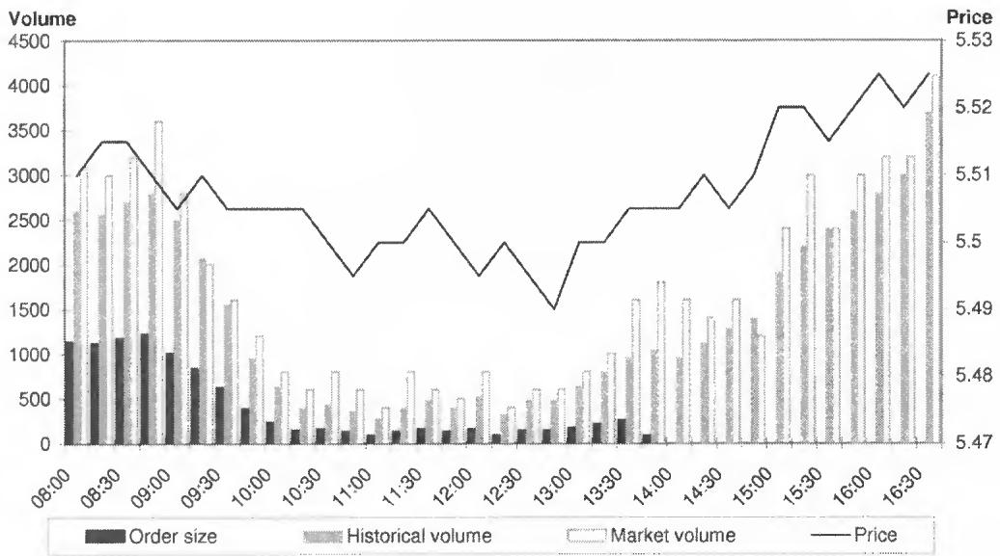  
Figure 5-13 An example statically determined IS order

Table 5-7 Trading schedule extract for a static implementation shortfall   

<table><tr><td rowspan=1 colspan=1>Timc</td><td rowspan=1 colspan=1>08:00</td><td rowspan=1 colspan=1>08:15</td><td rowspan=1 colspan=1>08:30</td><td rowspan=1 colspan=1>08:45</td><td rowspan=1 colspan=1>09:00</td><td rowspan=1 colspan=1>09:15</td><td rowspan=1 colspan=1>09:30</td><td rowspan=1 colspan=1>09:45</td><td rowspan=1 colspan=1>10:00</td></tr><tr><td rowspan=1 colspan=1>Hist Volm</td><td rowspan=1 colspan=1>2600</td><td rowspan=1 colspan=1>2560</td><td rowspan=1 colspan=1>2700</td><td rowspan=1 colspan=1>2800</td><td rowspan=1 colspan=1>2500</td><td rowspan=1 colspan=1>2080</td><td rowspan=1 colspan=1>1560</td><td rowspan=1 colspan=1>960</td><td rowspan=1 colspan=1>640</td></tr><tr><td rowspan=1 colspan=1>% of window</td><td rowspan=1 colspan=1>8.7</td><td rowspan=1 colspan=1>8.6</td><td rowspan=1 colspan=1>9.1</td><td rowspan=1 colspan=1>9.4</td><td rowspan=1 colspan=1>8.4</td><td rowspan=1 colspan=1>7.0</td><td rowspan=1 colspan=1>5.2</td><td rowspan=1 colspan=1>3.2</td><td rowspan=1 colspan=1>2.2</td></tr><tr><td rowspan=1 colspan=1>Tilt</td><td rowspan=1 colspan=1>1.3</td><td rowspan=1 colspan=1>1.3</td><td rowspan=1 colspan=1>1.3</td><td rowspan=1 colspan=1>1.3</td><td rowspan=1 colspan=1>1.2</td><td rowspan=1 colspan=1>1.2</td><td rowspan=1 colspan=1>1.2</td><td rowspan=1 colspan=1>1.2</td><td rowspan=1 colspan=1>1.1</td></tr><tr><td rowspan=1 colspan=1>Target Volm</td><td rowspan=1 colspan=1>1140</td><td rowspan=1 colspan=1>1120</td><td rowspan=1 colspan=1>1180</td><td rowspan=1 colspan=1>1220</td><td rowspan=1 colspan=1>1010</td><td rowspan=1 colspan=1>840</td><td rowspan=1 colspan=1>630</td><td rowspan=1 colspan=1>390</td><td rowspan=1 colspan=1>240</td></tr><tr><td rowspan=1 colspan=1>Time</td><td rowspan=1 colspan=1>10:15</td><td rowspan=1 colspan=1>10:30</td><td rowspan=1 colspan=1>10:45</td><td rowspan=1 colspan=1>11:00</td><td rowspan=1 colspan=1>11:15</td><td rowspan=1 colspan=1>11:30</td><td rowspan=1 colspan=1>11:45</td><td rowspan=1 colspan=1>12:00</td><td rowspan=1 colspan=1>12:15</td></tr><tr><td rowspan=1 colspan=1>His1 Volm</td><td rowspan=1 colspan=1>400</td><td rowspan=1 colspan=1>440</td><td rowspan=1 colspan=1>360</td><td rowspan=1 colspan=1>280</td><td rowspan=1 colspan=1>400</td><td rowspan=1 colspan=1>480</td><td rowspan=1 colspan=1>400</td><td rowspan=1 colspan=1>520</td><td rowspan=1 colspan=1>320</td></tr><tr><td rowspan=1 colspan=1>% of window</td><td rowspan=1 colspan=1>1.3</td><td rowspan=1 colspan=1>1.5</td><td rowspan=1 colspan=1>1.2</td><td rowspan=1 colspan=1>0.9</td><td rowspan=1 colspan=1>1.3</td><td rowspan=1 colspan=1>1.6</td><td rowspan=1 colspan=1>1.3</td><td rowspan=1 colspan=1>1.7</td><td rowspan=1 colspan=1>1.1</td></tr><tr><td rowspan=1 colspan=1>Tilt</td><td rowspan=1 colspan=1>1.1</td><td rowspan=1 colspan=1>1.1</td><td rowspan=1 colspan=1>1.1</td><td rowspan=1 colspan=1>1</td><td rowspan=1 colspan=1>1</td><td rowspan=1 colspan=1>1</td><td rowspan=1 colspan=1>1</td><td rowspan=1 colspan=1>0.9</td><td rowspan=1 colspan=1>0.9</td></tr><tr><td rowspan=1 colspan=1>Target Volm</td><td rowspan=1 colspan=1>150</td><td rowspan=1 colspan=1>160</td><td rowspan=1 colspan=1>130</td><td rowspan=1 colspan=1>90</td><td rowspan=1 colspan=1>130</td><td rowspan=1 colspan=1>160</td><td rowspan=1 colspan=1>130</td><td rowspan=1 colspan=1>160</td><td rowspan=1 colspan=1>100</td></tr></table>

Although simplistic, it still gives a reasonable trading profile, as we can see from Figurc 5-13, finishing jusl ahead of the oplimal end time. Trading is more aggressive, especially for the first hour, and then it gradually tails off as market volumes decrease around midday.

For a morc dynamic approach, the trading pattcrn may be based on inlinc participation with the market volume, as we saw for POV algorithms. In fact, an implementalion shortfall algorithm using a dynamic mechanism may be likened to a tilted POV algorithm. Figure 5-14 shows an examplc IS trading pattern generated by a dynamic mcchanism. Using the end lime of 14:30 the historical volume profile suggests that usually around 30,000 has tradcd by then. Given our order size of 10,000, this implies an optimal participation rate of $3 3 . 3 3 \%$ .

Again, we can apply a simplified tilt faclor to this, starting with $+ 3 \%$ and decreasing by a percent cach hour. Table 5-8 shows some of the resultant targets. The target participation rate is also shown in Figurc 5-15.

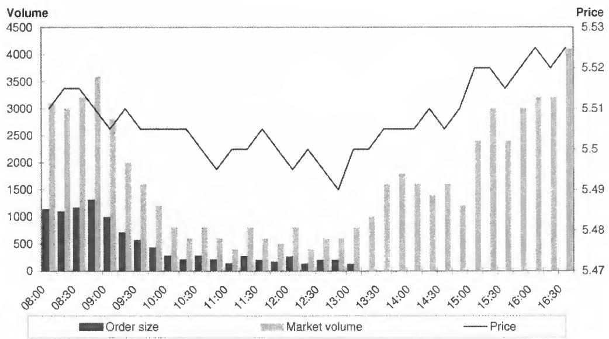  
Figure 5-14 An example dynamically determined IS order

Table 5-8 Trading schedule extraet for a dynamic implementation shortfall   

<table><tr><td rowspan=1 colspan=1>Time</td><td rowspan=1 colspan=1>08:00</td><td rowspan=1 colspan=1>08:15</td><td rowspan=1 colspan=1>08:30</td><td rowspan=1 colspan=1>08:45</td><td rowspan=1 colspan=1>09:00</td><td rowspan=1 colspan=1>09:15</td><td rowspan=1 colspan=1>09:30</td><td rowspan=1 colspan=1>09:45</td><td rowspan=1 colspan=1>10:00</td></tr><tr><td rowspan=1 colspan=1>MkI Volm</td><td rowspan=1 colspan=1>3100</td><td rowspan=1 colspan=1>3000</td><td rowspan=1 colspan=1>3200</td><td rowspan=1 colspan=1>3600</td><td rowspan=1 colspan=1>2800</td><td rowspan=1 colspan=1>2000</td><td rowspan=1 colspan=1>1600</td><td rowspan=1 colspan=1>1200</td><td rowspan=1 colspan=1>800</td></tr><tr><td rowspan=1 colspan=1>% particip</td><td rowspan=1 colspan=1>36</td><td rowspan=1 colspan=1>36</td><td rowspan=1 colspan=1>36</td><td rowspan=1 colspan=1>36</td><td rowspan=1 colspan=1>35</td><td rowspan=1 colspan=1>35</td><td rowspan=1 colspan=1>35</td><td rowspan=1 colspan=1>35</td><td rowspan=1 colspan=1>34</td></tr><tr><td rowspan=1 colspan=1>Target Volm</td><td rowspan=1 colspan=1>1130</td><td rowspan=1 colspan=1>1090</td><td rowspan=1 colspan=1>1160</td><td rowspan=1 colspan=1>1310</td><td rowspan=1 colspan=1>990</td><td rowspan=1 colspan=1>710</td><td rowspan=1 colspan=1>570</td><td rowspan=1 colspan=1>420</td><td rowspan=1 colspan=1>270</td></tr><tr><td rowspan=1 colspan=1>Time</td><td rowspan=1 colspan=1>10:15</td><td rowspan=1 colspan=1>10:30</td><td rowspan=1 colspan=1>10:45</td><td rowspan=1 colspan=1>11:00</td><td rowspan=1 colspan=1>11:15</td><td rowspan=1 colspan=1>11:30</td><td rowspan=1 colspan=1>11:45</td><td rowspan=1 colspan=1>12:00</td><td rowspan=1 colspan=1>12:15</td></tr><tr><td rowspan=1 colspan=1>Mkt Volm</td><td rowspan=1 colspan=1>600</td><td rowspan=1 colspan=1>800</td><td rowspan=1 colspan=1>600</td><td rowspan=1 colspan=1>400</td><td rowspan=1 colspan=1>800</td><td rowspan=1 colspan=1>600</td><td rowspan=1 colspan=1>500</td><td rowspan=1 colspan=1>800</td><td rowspan=1 colspan=1>400</td></tr><tr><td rowspan=1 colspan=1>% particip</td><td rowspan=1 colspan=1>34</td><td rowspan=1 colspan=1>34</td><td rowspan=1 colspan=1>34</td><td rowspan=1 colspan=1>33</td><td rowspan=1 colspan=1>33</td><td rowspan=1 colspan=1>33</td><td rowspan=1 colspan=1>33</td><td rowspan=1 colspan=1>32</td><td rowspan=1 colspan=1>32</td></tr><tr><td rowspan=1 colspan=1>Target Volm</td><td rowspan=1 colspan=1>210</td><td rowspan=1 colspan=1>270</td><td rowspan=1 colspan=1>210</td><td rowspan=1 colspan=1>130</td><td rowspan=1 colspan=1>270</td><td rowspan=1 colspan=1>200</td><td rowspan=1 colspan=1>170</td><td rowspan=1 colspan=1>260</td><td rowspan=1 colspan=1>130</td></tr></table>

Note that the high participation rates are chosen to try to magnily the visual effect for this example. In rcality, lower ratcs might often be uscd; otherwise, there could be considerable signaling risk and market impaet. Spreading the order amongst multiple venues would also help.

Because the historical profile is a relatively good fit for the cxample asset's market volume, both the static and dynamie approaches give similar trading patterns, as ean be seen by the similarity between Figure 5-13 and Figure 5-14. However, the dynamie version is more adaptable to changes in market conditions, and as we can see in Figure 5-15 it finishes earlier. This was because the actual market volume was higher than the cstimate from the historical volume prolile.

Admittedly, these examples use simplistic tilting mcchanisms. Still, they both give reasonable approximations for how implementation shortfall algorithms work. Modern versions may employ much more complex logic; incorporating factors such as the asset's volatility or spread and the investor's risk aversion.

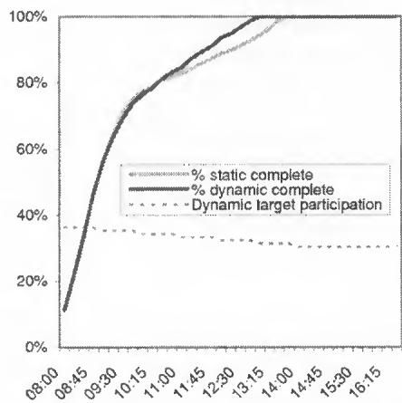  
Figure 5-15 Percentage completion for IS orders

To cope with changing market conditions, the trading horizon may be dynamically reoptimised if specific constraints, such as a limit price, are reached, as Middleton (2005a) suggests. The quality of the cost model is also a key determinant for the performance of any given version. In Chapter 1O, we shall cover cost models in more detail.

Many of the newer generalion of implementalion shortfall (IS) algorithms were designed from the ground up, huilt around intricate market models, which can be used to predict transaction costs. Some may be based on optimal participation rates, although these are constantly adjusted based on market conditions and cost estimates. Other versions achieve the optimal trading strategy by constantly monitoring market conditions, and performing detailed cost analysis beforc each and every order is placed, as Niall McIntyre (2006) suggests. These more advanced versions cope much better with unexpected conditions. 3 However, under gencral conditions their resultant trading patterns will probably still be reasonably similar 1o Figure 5-14.

# Common variations

Adapting to market conditions, such as liquidity or price has become a key focus for many algorithms. Price adaptive implementation shortfall algorithms have becomc sufficiently important that the following sub-section is dedicated to them. IS algorithms which have access to "dark pools" of liquidity are also available.

Volatility is another key factor for IS algorithms. Some versions actually adjust to changes in short-term price volatility; when the volaility falls, they can afford to trade more passively. Other variants may also use alternative eslimates for volatility. For example, Instinet's Wizard algorithm uses the implied volatility from the options markets as a more accuralc gauge of intraday volatility.

# Special Parameters:

Benchmark price: This allows the investor to specify their decision price; otherwise, this generally defaults to the arrival price (midpoint) when the order was received.

Risk aversion: This represents an investor's level of urgency. A high-risk aversion suggests that the position is more subject to price risk, so the algorithm will use a shorter time horizon, adopting more aggressive execution tactics. Somc versions may only support passive, aggressive or neutral, whilst others may allow a finer grained setting (say from 1- 10).

Execution style: Essentially, this is replaced by Risk aversion, although for some variants it may actually provide the risk aversion sctting.

End time: This acts as an absolute deadline. Though, as we have seen, many IS algorithms are driven by determining an optimal trading horizon. Note that it is important to check with pre-trade analyics/models that the specified end time is not actually before the optimal time, otherwise performance may suffer.

Limit prices: These are supported, but it is important to note that implementation shortfall algorithms are optimised to work towards their benchmark, which is the arrival price.

Volume limits: In order to minimise timing risk, IS algorithms often start by trading fairly aggressively. Their internal models are trying to balance potential market impact versus this risk. Placing too stringent a volume limit may actually affect the performance of the algorithm. If the volume limit is being used to reduce signaling risk then a minimal impact or liquidity-driven algorithm may be a better choice.

# Adaptive Shortfall (AS)

Adaptive shortfall represents a new subclass of algorithms derived from implementation shortfall. The adaptive moniker refers to the addition of adaptive behaviour; predominantly this is a reaction to the market price. Effectively, this means price adaptive shortfall algorithms behave more opportunistically.

A useful naming scheme for price adaptive algorithms was suggested by Robert Kissell, Andrew Freyre-Sanders and Carl Carric (2005). This is based on the concept of price 'moneyness', taken from options nomenclature.

Source: Kissell and Malamut (2005b)

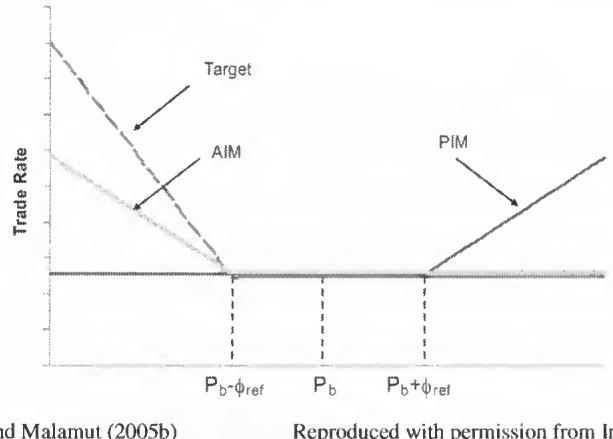  
Reproduced with permission from Inslitutional Inveslor   
Figure 5-16 Comparison of price adaptation trading rates

Figure 5-16 illustrates this by plotting the target trading rate versus the market price for an example buy order. An aggressive in-the-money (AIM) strategy trades more aggressively with favourable priees and less when they become adverse. For a buy order, favourable conditions correspond to when the market priee drops below the benchmark, with the opposite for a sell. So in Figure 5-16 its trading rate only inereases when the market priee falls significantly below the benchmark priee $( \mathrm { P _ { b } } )$ . Whereas a passive in-the-money (PIM) tactic is the opposite, it becomes more passive when prices are favourable. Hence, in Figure 5-16 its trading rate only increases when the price rises significantly above the benchmark.

Note the Target strategy shown in Figure 5-16 is similar to a price-inline algorithm, sinee it does not aceount for timing risk, we will cover this further in section 5.6.

Another way of looking at price adaptive strategies is based on how they handle overall price trends. An AIM strategy assumes that trends are short-lived and will soon revert, whereas a PIM approaeh relies on the trend persisting. Thus, AIM trading will immediately try to take advantage of any lavourable prices, and hope that unfavourable priees will revert. Conversely, PIM trading will react aggressively to stem any potential losses from an unfavourable trend, but it will be passive during favourable trends, hoping to achieve further priee improvement.

# Basic Mechanism

Essentially, this is still an implementation shortfall algorithm, so the basic behaviour will follow an IS approaeh. But in addition, the algorithm dynamically adapts to market conditions. Effeetively, this is like having a tilt function that adjusts in real-time based on the current market eonditions.

Initially, a baseline target for volume participation may be determined, based on the estimated optimal trade horizon. During trading, the adaptive portion is then used to modify this rate. The results for an example trade to buy 10,000 ABC using both AIM and PIM approaches is shown in Figure 5-17.

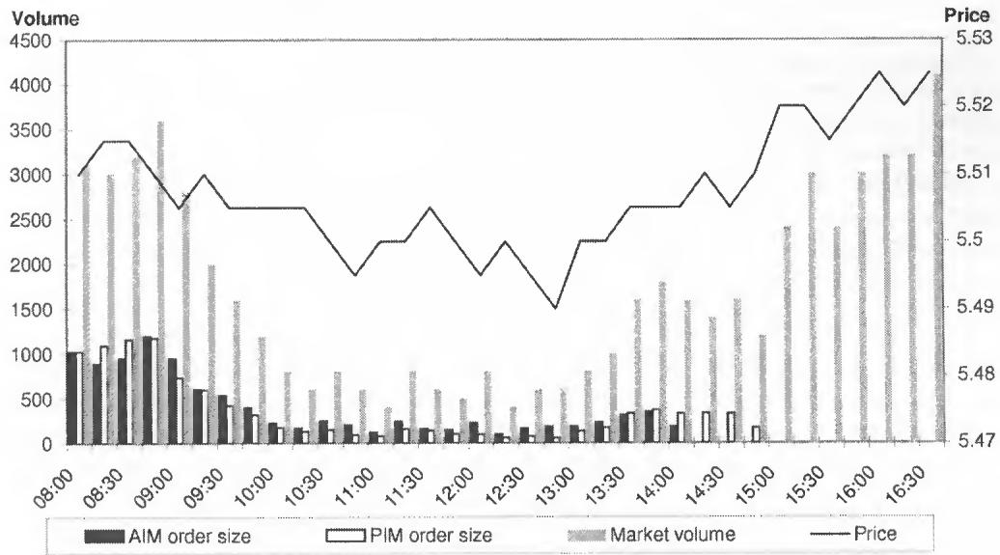  
Figure 5-17 Example price adaptive shortfall orders

With an AIM strategy, a favourable price trend will result in additional participation. Some variants may also apply a tilt to encourage earlier trading. For this example, the baseline participation was set as $30 \%$ , with the first hour raised to $3 5 \%$ A short-term momentum indicator was used to vary this by up to $10 \%$ , dependent on the price and the trading strategy. Again, these participation rates are chosen to magnify the differencc between the two approaches for this example. In reality, these would often be lower and the adjustment would probably depend on the asset's volatility. The effect this has on the target participation rate is shown in Figure 5-18. Clearly, as the price becomes incrcasingly favourable, from around 10:00, the AIM capitalises on this by increasing its participation rate, whilst the PIM strategy does the opposite. Then, from 1I:00 to 12:00 when the price starts to rise again, the reverse happens. Finally, as both orders reach completion the participation rates tail off towards zero.

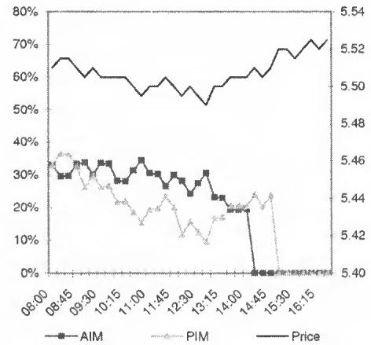  
Figure 5-18 Target participation rate adaptations

The overall completion rates may be seen in Figure 5-19. For this cxample, the market price showed more mean reverting behaviour rather than a consistent trend. Thercfore, the aggressive in-the-money approach benefited from this, completing before the passive in-themoney strategy. Had this been a sell order we would have seen the opposite.

Overall, Kissell, Freyre-Sanders and Carrie (2005) found that the AIM strategy achicves better prices, but at a slightly higher risk. The PIM strategy is quicker to cut losses short so achieves a slightly lower risk, but may achieve poorer prices than AIM.

# Common variations

Just as these algorithms react to the market price, we could also add behaviour that reacts to changes in the order book depth or overall liquidity measures. Incrcasingly, they are also accessing liquidity from "dark pool" ATSs.

# Special Parameters:

In general, adaptive shortfall algorithms will have the same parameters as implementatior shortfall. Obviously, there is one key addition:

Adaptation type: Either aggressive in-the-money (AIM) or passive in-the-money (PIM).

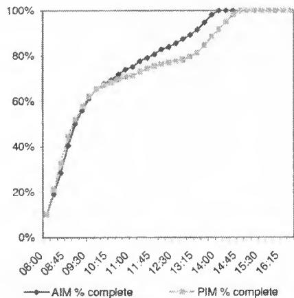  
Figure 5-19 Percent completion for price adaptive shortfall orders

Note that unlike price inline algorithms there generally is not much provision for parameters to control cxactly how much it reacts to actual price moves. This is because fundamentally it is based on an implementation shortfall algorithm. Even though it adapts to market prices, the optimal trading rate is still a function of its balancing market impact with timing risk.

# Market Close (MC)

The close price is often used for marking to market, and calculating net asset values and daily returns/profit and loss. Hence, many institutions are stil interested in the close price as a benchmark. Though, trading at the close can be costly. David Cushing and Ananth Madhavan (2001) found prices are more sensitive to order flows at the close. They also noted price reversals after days with significant auction imbalances. Whilst call auctions have helped reduce the end of day volatility, the liquidity premium can still be considerable around the close.

# Basic Mechanism

Clearly, the main issue for a market close algorithm is the fact that the benchmark is unknown until the end of the trading day. Unlike for VWAP or TWAP it is not an average based on the days trading, so we cannot simply slice the order into portions in an attempt to match the benchmark. If we start trading too early, we could be exposed to a substantial amount of timing risk, due to variability in the closing price. Whereas trading too late may cause significant market impact.

Many market close algorithms determine an optimal trading horizon using quantitative models, which incorporate estimates of an asset's volatility, and trading volume. So just as implementation shortfall algorithms determine an optimal end time market close algorithms can calculate an optimal start time, as Middleton (2005) points out. Figure 5-20 shows the resultant trading pattern for our example market close order.

Assuming a target participation rate of $30 \%$ , we therefore need 33,333 of ABC to trade. By working backwards our modilied historical model shows that to meet this requirement we should start trading at I 1:45, as we can see in Figure 5-20.

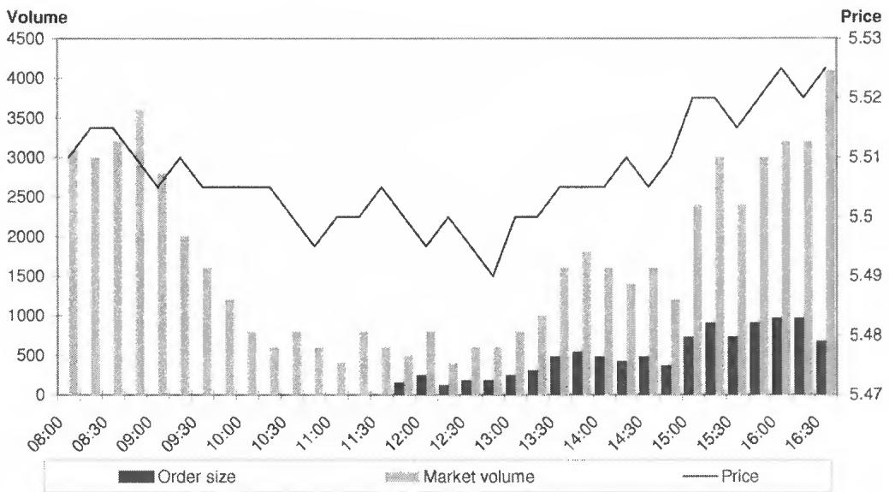  
Figure 5-20 An example market close order

Since market close orders are often submitted during trading hours this also enables us to see how today's market volume actually compares with the historical volume profile. For instance, from our example data the opening market volumes appear to he around $1 5 \%$ more than the historical values. Assuming this trend continues we can adjust our historical volume profile accordingly.

For this simple example, adjusting the historical volume profile by $1 5 \%$ gives a good match for the actual market volumes. By targeting a $3 0 \%$ participation rate our order comfortably completes, as shown in Figure 5-21.

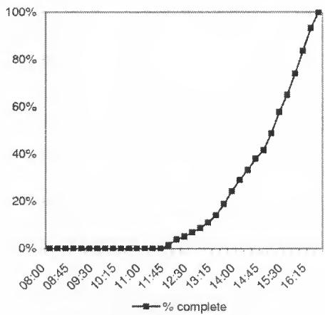  
Figure 5-21 Percent completion for a market close order

In reality, we would need lo constantly monitor the market volume and adjust the participation rate accordingly. In this example, the price irend is in our favour so there is no real necd to tilt the participation rate. Clearly, this will not always be the case so we need to regularly estimate thc impact of current market price trends and adjust our participation accordingly. Effectivcly, this is similar to what a passive in-the-money adaptive shorfall algorithm would do.

# Common variations

Somc algorithms are now being termed departure price algorithms. These provide a more gencric mechanism which will trade to any given end time, rather than just the market close. For cxample, should we want to ensure a position is achieved by midday we could sct the cnd time accordingly and leave the algorithm to find the optimal start time.

# Special Parameters:

In general, markct close algorithms will have similar parameters to implementation shortfall, although therc arc some obvious differences:

Risk aversion: A high risk aversion signifies that the trade is more subject to price risk and so should be traded more quickly. Still, in terms of a market close algorithm, this generally mcans an optimal start timc closer to the market close. Therefore, if there is genuine price risk for an assct it may make more sensc to use a shortfall algorithm rather than a market close onc.

End time: As noted in the common variations, some versions allow control over the end time, giving a much more flexiblc approach.

Auction participation: There may also be parameters to specify the minimum and/or maximum order size allowed to participatc in the close auction.

# 5.6 Opportunistic algorithms

Opportunistic algorithms have evolved from a range of trading strategies. They all take advantage of favourable market conditions, whether this is based on pricc, liquidity or another factor.

Price inlinc algorithms are essentially bascd on an underlying impact-driven strategy such as VWAP or POV. What they add is price sensitivity, which enables them to modify their trading style based on whcther the current market price is favourable or not. So a focus on market impact has given way to a more opportunistic approach.

Similarly, liquidity-driven algorithms are an evolution of simpler rule-based order routing strategies. The trading is driven by the available liquidity, although cost is also a factor. Whilst pair trading is effectively a market neutral strategy, so risk is less of a concern. Instcad, the key driver is when the spread or ratio between the assets is favourable.

Notc that for each of these algorithms price is still an important factor. Target benchmarks provide a baselinc that allows them to gauge whether the market conditions are favourablc or not. Since they are so dynamic, opportunistic algorithms tend to be much more closely aligncd to their underlying execution tactics than other algorithms, as we will see in Chapter 9. In the following scctions, we shall examinc each of the opportunistic algorithms in somc more dcpth.

# Price inline (PI)

A pric inline algorithm adapts its trading to the market price in a similar way to how POV algorithms adjust to market volume. A benchmark price is defined and trading is then altered based on how the market price compares to this. Note that if no benchmark is specilied then the mid price when the order arrives is generally used instead. Clearly, a favourable price for a buy order means the market price is less than the benchmark, with the opposite for sells.

To describe its price-adaptation mechanism, we will reuse the price 'moneyness' naming scheme from Kissell, Freyre-Sanders and Carrie (2005). So, as we saw for Adaptive Shortfall algorithms, aggressive in-the-money (AIM) strategies trade more aggressivcly with favourable prices whilst passive in-the-money (PIM) tactics behave in the opposite manner. Note that usually when people refer to price inline algorithms they mean an AIM approach, but increasingly there are versions offering both types.

# Basic Mechanism

A price inline algorithm consists of a basic trading mechanism combined with the price adaptive functionality. Hence, it could be based on a static VWAP algorithm or a more dynamic percent of volume approach. The actual price adaptation may directly track the difference between the market price and the benchmark, or it might even include other factors such as momentum.

Figure 5-22 shows a simple price inline algorithm, based on an underlying percent of volume strategy. The price adaptation is a straightforward adjustment to the participation rate based on the difference between the market price and the benchmark.

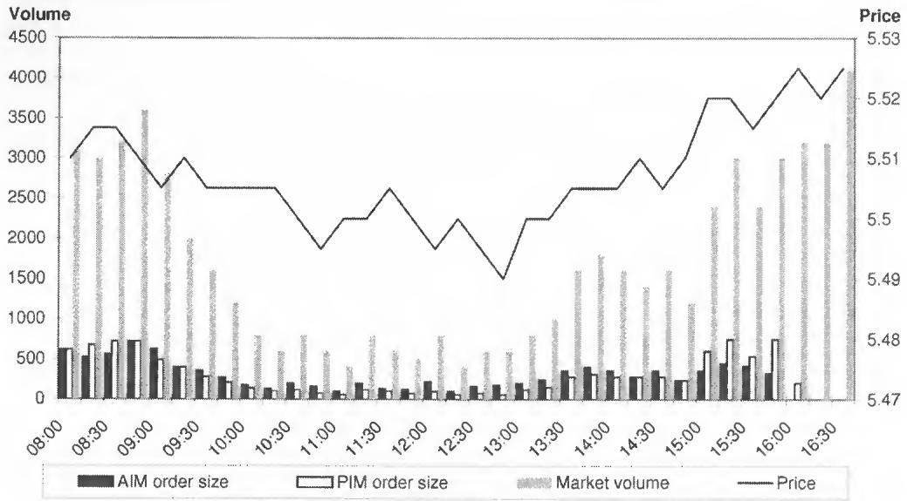  
Figure 5-22 Example price inline orders

The reverting price favours early completion by the AIM approach. We can sce how the price changes affect the participation rate more clearly in Figure 5-23. As the price becomcs increasingly favourable, from around 10:00, the AIM increases its participation rate, whilst the PIM strategy does the opposite.

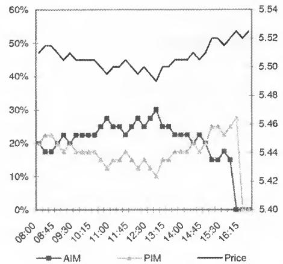  
Figure 5-23 Target participation rate changes with price

These continue to oscillate inline with the price changes. Finally, as the AIM strategy reaches completion, its participation rate tails off to nothing. Figure 5-24 shows how this affects the overall completion rates.

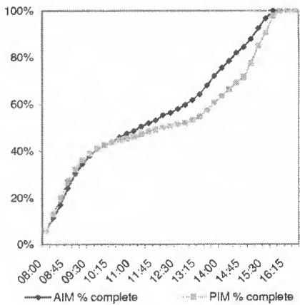  
Figure 5-24 Percent completion for example price inline orders

As with the other algorithms, modern variants will differ in terms of they how they respond to being behind their target, and whether they permit going ahead of the target.

# Common variations

Some versions may even allow the price adaptation to be based on the price of other assets, sectors, market indices or even ETFs.

# Special Parameters:

Adaptation type: Either aggressive in-the-money (AIM) or passive in-the-money (PIM).

Benchmark price: If the benchmark is related to another asset, index or ETF then details will also need to be provided for this to allow the algorithm to make a real-time price

suhscription for this.

Participation rate: For algorithms based on a dynamic POV type mechanism, a baseline participation rate will be needed.

Participation adjustment: This specifies how much to alter the participation rate by for a given price move, for instance, $5 \%$ every $\$ 0.50$ . Note some versions may allow these to be asymmetrical, e.g. $+ 5 \%$ for favourable prices, but only $- 2 \%$ for unfavourable ones.

Price levels: These specify the size of price moves for the participation adjustments, .g. every $\$ 0.50$ or even every 20 basis points (bps). Again, somc variants may allow these to be set separately for favourable and adverse conditions.

# Liquidity-driven

Liquidity represents the ease of trading a specific asset, so it has a considcrable effect on overall transaction costs. Highly liquid assets tend to trade in greater volume, and so often will have lower spreads and more depth available. Whereas for illiquid assets, activity is much lower, the spread higher and order book may have little visible depth. So finding liquidity is an important means of reducing costs, particularly for illiquid asscts.

Originally, liquidity-based trading simply mcant making decisions based on the availahle order book depth, rather than just the best bid and olfer. In today's fragmented markets liquidity-seeking has become more complicated. For example, thc U.S. equity market has dozens of possible execution venues, with the number continuing to increase. In such an environment, visualising the available liquidity becomes non-trivial. If a trading strategy focuses on just one execution venue, there is a danger that it will miss opportunities on the other venues and so achieve a poorer execution price. Hence, for fragmented markets liquidity aggregation has hecome an important tool. Essentially, just as multi-broker systems pooled dealer quotes, we gather as much order book data as possible from every venuc and aggregate these into a virtual order book. Figure 5-25 shows an examplc that pools the orders from the primary exchange (Exch-1) and several electronic crossing networks (ECNs) and "dark pool" alternative trading systems (ATSs).

Liquidity aggregation can be as simple as summing the available orders at each price point across all the different venues. For assets such as futures or options, this might also mcan accounting for liquidity "implied" from more complex spread strategies. However, as we saw in Chapter 4, venues are increasingly adopting implicd order types to make such liquidity more easily available. Still, there are some further complications such as fccs and latencics. Venues have their own fee structures, so the algorithm needs to consider this when comparing prices. Latency is also an issue, since any time lag between our orders being sent and processed could significantly reduce the probability of exccution.

Given that execution is not guaranteed, it is also important to deal with execution probability when choosing between venues. Notice that in Figure 5-25 the timc field has been replaced by a percentage. This represents the overall probability of cxecution for that volumc. For order E1, on ECN-1, we estimate a $70 \%$ chance of crossing with this order if we now dispatched an order to sell at l00. This perccntage is bascd on a rangc of factors, including the probability of cancellation, latency and historical results.

Hidden liquidity is another important consideration. For hidden orders (shaded in Figure 5-25), the probability is primarily based on the likelihood of there being hidden volume at that price. Thus on ATS-1 order H3 corresponds to a $1 5 \%$ probability that this "dark pool"

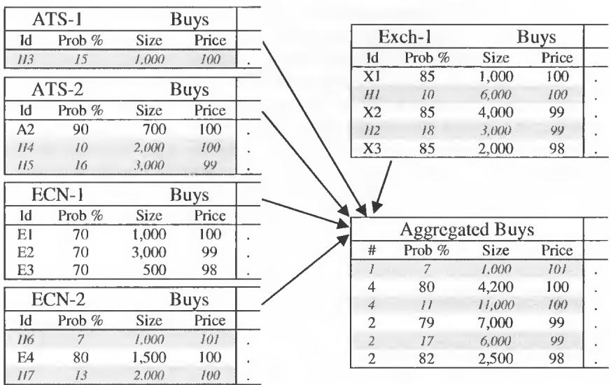  
Figure 5-25 Aggregating order data from multiple venues

ATS has a hidden buy order for at least 1,000 ABC at 100. These are al then aggregated into a virtual order book, where the priority is based on pricc then probability (rather than time). Clearly, when placing orders, preference wil be given to venucs with the best price and the highest probability of exccution.

Finding hidden volume is a case of continually tracking reported trades and matching these to the order book state. When trades are reported with a better price than the order book suggests, this may be due to hidden liquidity. For instance, Figure 5-26 shows the visible order book before and after trades for 2,000 ABC at 100 are reported.

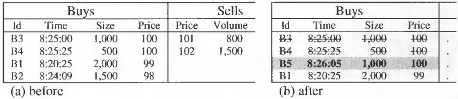  
Figure 5-26 Order book before and after trade reports for ABC

The buy orders B3 and B4 only account for 1,500 of the trade; so unless a new order suddenly arrived, 500 was potentially filled from a hidden order. Also, the new order B5 may be the display size for an iceberg order, or it may just be a new standalone limit order. Only by tracking the order book over a long period of time can we start to estimate which possibility is more likely. With more historical data, we can even start to predict what the hidden size might be, hence giving the sort of estimates we saw in Figure 5-25.

So by using historical data and closely monitoring the order book, we can create models for the estimation of hidden liquidity. We can then tailor our order placement strategy to try to take advantage of this. Usually, this is with immediate-or-cancel or fill-or-kill limit orders, so no standing orders are left on the limit book. Sometimes this is referred to as pinging for liquidity, much like a radar or sonar signal. We will go into the mechanics of hidden order placement and seeking in more detail in Chapters 8 and 9.

The last main consideration for liquidity-based algorithms is signalling risk. For iliquid assets, cven a small order can result in the price shifting away as other traders try to secondguess our requirements. To counter this, we can adopt a similar stratcgy of using immediateor-cancel style (IOC) orders. So when liquidity becomes available an aggressive order is used to cross with it, sometimes referred to as sniping. In order to leave the best price unaffected, some strategies only take a portion of the available size. Alernatively, hidden orders may be used, either iceberg orders or discretionary orders, although these will leave a certain display size on the order book. Again, we will cover this in more detail in Chapter 9.

# Basic Mechanism

Liquidity is closely related to market depth and price. Thercfore, a liquidity-sceking algorithm will rcact strongest when there is plenty of market depth and the pricc is favourable. This is reasonably similar to the aggressive in-the-money style trading we saw for price inline and adaptive shortfall algorithms.

Instead of making the algorithm react to traded volume, we will creatc a market depth mcasure that reflects the volumc availablc at a favourable pricc point. Figure 5-27 shows an cxample order to buy 10,000 ABC with a liquidity-seeking algorithm using this metric.

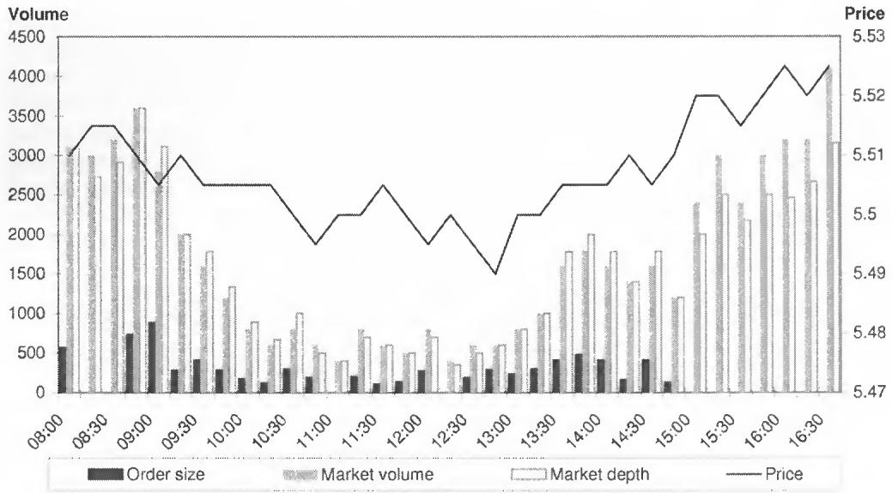  
Figure 5-27 An example liquidity seeking order

Therefore, when the price and market depth are favourable, the algorithm trades aggressively to consume liquidity, as may be seen by the participation spikes shown in Figure 5-28. One of the benefits of fragmented markets is that a higher level of participation may be achieved by spreading the execution across a wide range of venues.

Note that this example shows a purely liquidity-driven approach, so when market conditions are unfavourable it then does not trade at all. Hence, the parlicipalion Talls to zero several times in the middle of the day as the liquidity falls to low levels. It is also zero when the price becomes unfavourable, such as towards the close. Though, this could be avoided by setting a looser price limit or target benchmark. Other versions may simply reduce their participation when the price becomes unfavourable, much like a price inline algorithm.

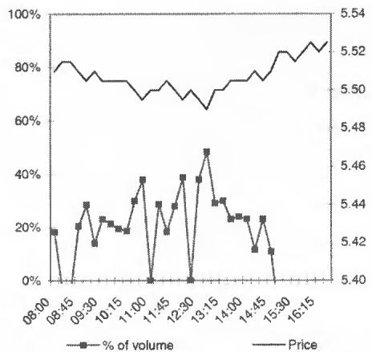  
Figure 5-28 Target participation rate for a liquidity seeking order

A side effect of this purely opportunistic approach is that in this example the order does not fully complete, as shown in Figure 5-29. In this case, it was due to the price becoming unfavourable, since there was sufficient liquidity. In practice, brokers may well offer versions that support a base level of participation or finish-up logic to help ensure the order executes fully.

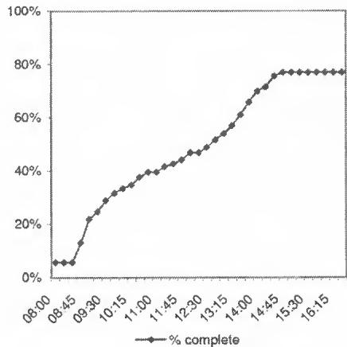  
Figure 5-29 Percent completion for a liquidity seeking order

Although liquidity seeking algorithms may be used for any asset, they were originally intended for more illiquid assets and fragmented markets. The example in Figure 5-27 was for a reasonably liquid asset. In comparison, Figure 5-30 shows an example order to buy $1 0 , 0 0 0 ~ \mathrm { N O P }$ , a much less liquid asset. Again, we can see a similar pattern of comparatively aggressive trading as soon as the price and depth are favourable. With illiquid assets, signalling risk is an even more important concern and more of the liquidity is hidden. Hence, tactics such as seeking and sniping using IOC type orders become important, as we will see in Chapter 9. Also, note that these examples merely give a lavour of how this problem might be tackled. As with implementation shortfall, the complexity of successfully seeking liquidity means there is a lot of varicty in how they achicve their goals.

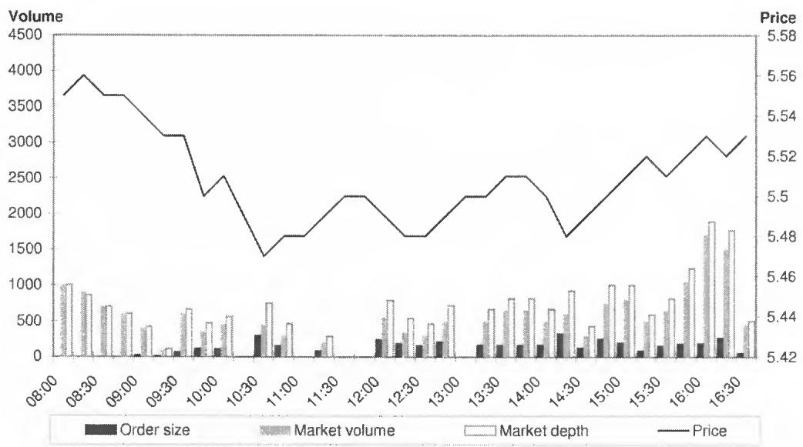  
Figure 5-30 A liquidity seeking order for a more illiquid asset

# Common variations

Liquidity-driven algorithms are often used in fragmented markets. Clients may want their orders to only participate at specific venues, such as only certain "dark pool" ATSs. In addition, they may (or not) want their orders to be included in the broker's internalisation stream. Brokers/vendors often tailor versions for each client's specific requirements.

# Special Parameters:

Visibility: This specifies how much of the order may actually be displayed at cxecution venues. Low visibility implies hidden order types or lOC orders should be used, alternatively it might mcan that the order is only worked in "dark pool" ATSs. Higher visibility may be used to leave orders exposed, trying to encourage trading for illiquid assets.

Benchmark price: This may be used to decide whether the price is favourable cnough tc warrant participation.

# Pair trading

Pair trading involves buying one asset whilst simultancously selling another. Therelore, this is a market neutral strategy; the risks from each asset should hedge or offset cach other. This makes the trading less affected by markel-wide moves, provided that the asset priccs are sufliciently correlated. The ideal situation is that the asset we bought increases in price, whilst the one we sold falls. Although so long as the profit on one side of the trade outweighs any loss on the other side, we should still come out ahead. The profits may then be locked in by trading the reverse pair to flatten our positions. Note that the timescales involved here could be anything from minutes to days, weeks, months or even longer.

Therc are two main types of pair trading, namely statistical arbitrage and risk (or merger) arbitrage. Statistical arbitragc is based on relative asset valuations whilst risk arbitrage is more equity specific, it revolves around the prohability of a merger happening. A common approach for statistical arbitrage is based on the expeetation of mean-reversion. This assumes that the spread or ratio for the prices of two highly correlated assets will generally oscillate around its mcan.

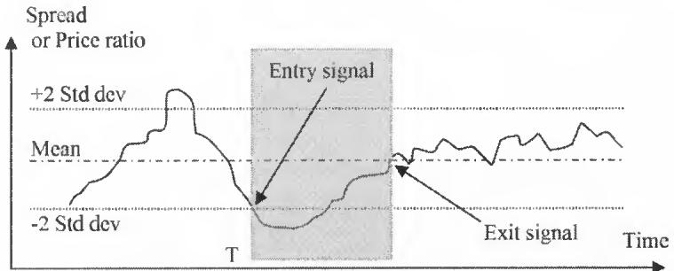  
Figure 5-31 An example statistical arbitrage pair trading strategy

As Figure 5-31 shows, when the spread significantly diverts from the mcan this signifies a trading opportunity. A typical trade cntry signal occurs when we expect the spread to return to the mean; in this case, the band is based on two standard deviations above and below the mean. If the spread continues in this fashion, we can then exit the position at the mean. On the other hand, if it fails to revert and continues to divcrge then we stand to make losses. This may be because the assets are not as correlated as we thought, or the relationship between them may have fundamentally changed.

The quantitative methods for identifying pairs for statistical arbitrage are beyond the seope of this hook, since algorithmic trading kicks in once the pairs have already been found. For those interested in this topic the book 'Pairs Trading: Quantitative Methods and Analysis' by Ganapathy Vidyamurthy (2004) is a good place to start.

# Basic Mechanism

Pair trading algorithms focus on trading for a pre-dctermined benchmark, which is cither the spread betwecn two asscts or the ratio of their prices.

The simplest example of a pair trade is based on the spread betwcen two asset prices. When thc differencc in priccs between the two assets exceeds a specificd threshold, trading is aetivated. This may be based on the mid prices, or the bid price for the asset to be bought and the offer price for the assct to be sold, or cven all possible combinations.

For cxamplc, Iet's assume that historical data has shown assets XYZ and EFG to be highly corrclated, following the trend we saw in Figure 5-31. Sometime after time T, we cxpeet the two standard deviation bands to be breached and the spread and ratio to start to return to their historical mcans, this brcach will be our trigger. Figure 5-32 shows the intraday prices, sprcad and ratio. Note that the spread shown in Figure 5-32 is an ahsolute value, it is just the mid pricc of XYZ minus the mid price of EFG.

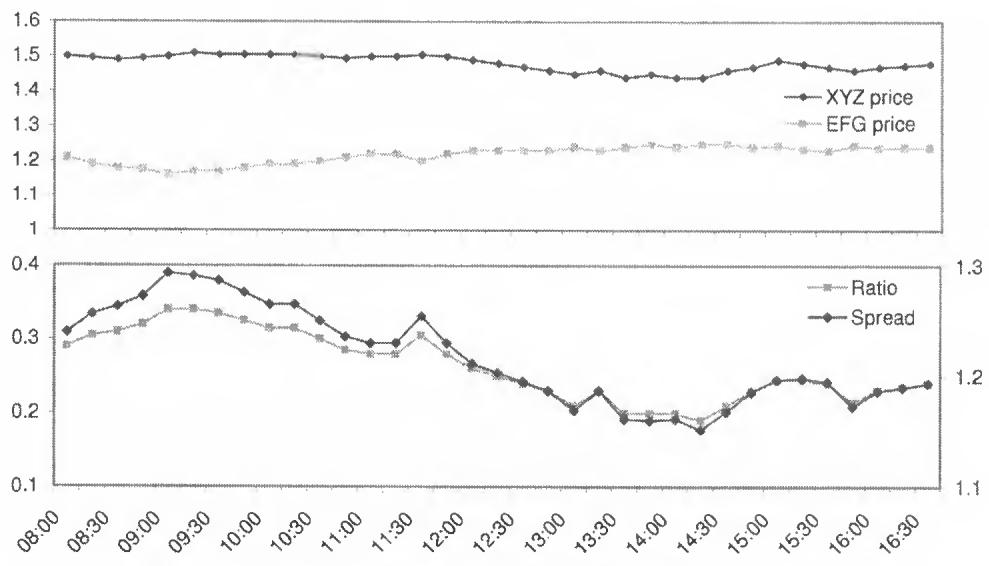  
Figure 5-32 Pair spread and ratio for XYZ and EFG

Based on historical data, the trigger spread is 0.24 (mcan minus two standard deviations). So we will place a pair trade to buy $1 0 { , } 0 0 0 \ X \mathrm { Y } Z$ and sell 12,000 EFG with a spread less than or cqual to 0.24. This is shown in Figure 5-33.

Note that the ratio of quantities for our trade is 1.2; this is sometimes referred to as the execution ratio. For this example, it was set based on the curent price ratio, but any rcasonable value may be used.

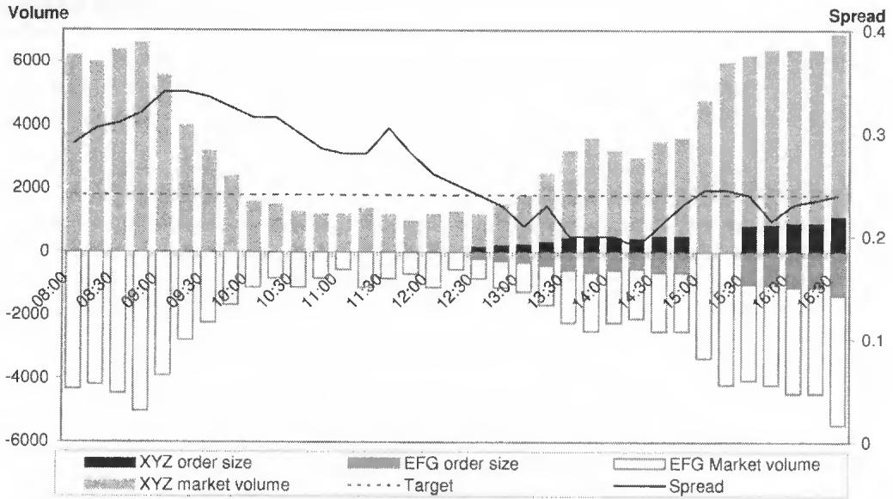  
Figure 5-33 An example spread based pair trade

Initially, the spread continues to widen (a separate pair trade may already be taking advantage of this (selling XYZ and buying EFG)). However, just after midday the spread crosses the two standard deviation band, presumably on its way back towards the historical mean. Hence, the pair trade starts executing. Though, notice the blip around $3 \mathrm { p m }$ when the spread temporarily increases again, causing the pair trade to pause.

An alternative way of specifying the trade is to use a price ratio as the trigger. Again based on historical data we shal set the ratio trigger as 1.2. Figure 5-34 shows an example order to buy 10,000 XYZ and sell EFG when the ratio is less than or equal to 1.2.

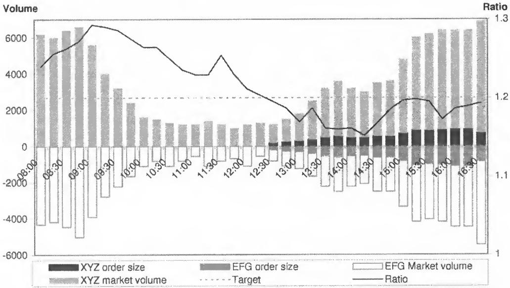  
Figure 5-34 An example ratio based pair trade

This time the ratio dips under 1.2 at 12:30 and just stays at or under this for the rest of the day, so there is no interruption to the algorithm. Another difference is that this ratio order is cash balanced, so no execution ratio is used. Instead, each leg of the pair trade is balanced in terms of their value, Table 5-9 shows this more clearly. Note that generally it is more common to specify cash balanced trades in terms of their value, i.e. buy $\$ 500,000$ XYZ and sell EFG. As its name suggests, the cash balanced order keeps the trade more, market neutral than the non-balanced one.

For both these examples, we have kept the trading of each asset closely linked. In practice, this constraint may be loosened, so that each asset may be traded slightly more autonomously. Clearly, it is important for the algorithm to incorporate the liquidity of each asset, since there could be a substantial difference between the two. In such cases, the algorithm will need to make the trading more dependent on the less liquid asset.

# Common variations

Risk arbitrage pairs can generally use the same approach as the statistical arbitrage ones. The trading strategy is to sell the shares of the bidding company and buy those of the target company. If the merger happens, the position may then be unwound. The profit is from the difference in spreads; generally the spread is wider before the merger then tightens as the

Table 5-9 Comparison of execution values for example pair trades   

<table><tr><td rowspan="3">Time</td><td colspan="4">Spread based trade</td><td colspan="4">Cash balanced ratio trade</td></tr><tr><td colspan="2">XYZ</td><td colspan="2">EFG</td><td colspan="2">XYZ</td><td colspan="2">EFG</td></tr><tr><td>Trade</td><td>Value</td><td>Trade</td><td>Value</td><td>Trade</td><td>Value</td><td>Trade</td><td>Value</td></tr><tr><td>12:30</td><td>180</td><td>260</td><td>-220</td><td>-270</td><td>180</td><td>260</td><td>-220</td><td>-270</td></tr><tr><td>12:45</td><td>230</td><td>340</td><td>-280</td><td>-340</td><td>240</td><td>350</td><td>-280</td><td>-340</td></tr><tr><td>13:00</td><td>260</td><td>380</td><td>-310</td><td>-380</td><td>270</td><td>390</td><td>-320</td><td>-400</td></tr><tr><td>13:15</td><td>350</td><td>510</td><td>-420</td><td>-520</td><td>350</td><td>510</td><td>-420</td><td>-520</td></tr><tr><td>13:30</td><td>470</td><td>680</td><td>-560</td><td>-690</td><td>480</td><td>690</td><td>-560</td><td>-690</td></tr><tr><td>13:45</td><td>530</td><td>770</td><td>-640</td><td>-800</td><td>540</td><td>780</td><td>-630</td><td>-790</td></tr><tr><td>14:00</td><td>470</td><td>680</td><td>-560</td><td>-690</td><td>480</td><td>690</td><td>-560</td><td>-690</td></tr><tr><td>14:15</td><td>440</td><td>630</td><td>-530</td><td>-660</td><td>460</td><td>660</td><td>-530</td><td>-660</td></tr><tr><td>14:30</td><td>530</td><td>770</td><td>-640</td><td>-800</td><td>540</td><td>790</td><td>-630</td><td>-790</td></tr><tr><td>14:45</td><td>530</td><td>780</td><td>-640</td><td>-790</td><td>530</td><td>780</td><td>-630</td><td>-780</td></tr><tr><td>15:00</td><td>0</td><td>0</td><td>0</td><td>0</td><td>700</td><td>1040</td><td>-840</td><td>-1050</td></tr><tr><td>15:15</td><td>0</td><td>0</td><td>0</td><td>0</td><td>880</td><td>1300</td><td>-1050</td><td>-1300</td></tr><tr><td>15:30</td><td>850</td><td>1250</td><td>-1020</td><td>-1250</td><td>850</td><td>1250</td><td>-1020</td><td>-1250</td></tr><tr><td>15:45</td><td>880</td><td>1280</td><td>-1060</td><td>-1320</td><td>900</td><td>1310</td><td>-1060</td><td>-1320</td></tr><tr><td>16:00</td><td>930</td><td>1370</td><td>-1120</td><td>-1390</td><td>940</td><td>1380</td><td>-1120</td><td>-1390</td></tr><tr><td>16:15</td><td>930</td><td>1370</td><td>-1120</td><td>-1390</td><td>940</td><td>1390</td><td>-1120</td><td>-1390</td></tr><tr><td>16:30</td><td>1140</td><td>1690</td><td>-1350</td><td>-1670</td><td>720</td><td>1070</td><td>-860</td><td>-1070</td></tr><tr><td>Totals</td><td>8720</td><td>12760</td><td>-10470</td><td>-12990</td><td>10000</td><td>14660</td><td>-11850</td><td>-14700</td></tr></table>

deal reaches completion.

Some versions may also support a cash adjustment, which may be applicd beforc the ratio, or spread is calculated.

# Special Parameters:

Spread/Ratio: Clearly, this acts as the benchmark for the relationship. Note it is often necessary to specify how it is based, so whether it is an A-B spread or A/B ratio, or B-A or B/A. This can be a useful sanity check to ensure the target is correctly defined.

Order identifier: It may be that each leg of the pair needs to be sent separately, in whict case some sort of common identifier is necessary to link the two leg orders.

Legging: This allows control over how autonomously each leg may be traded. A small value will constrain the trading, but will also protect us from exposure to pricc risk.

Volume limit: In these examples, the participation rate was capped at $2 5 \%$ Somc variants may allow specific volume constraints for each side of the pair trade.

# 5.7 Other trading algorithms

So far, all the algorithms we have considered are relatively generic, wihin reason they could be applied to any asset class. Still, there are also some algorithms based on the uniquc properties of certain asset classes. For example, we have already scen how somc brokers/vendors provide algorithms for handling corporate buyback programs (SEC's Rule 10b-1 8) for U.S. equities, based on modified POV algorithms.

As algorithmic trading continues to cxpand outside of the cquities markets, it must address the common lrading problems found in each new market. There will undoubtedly be more asset-class speeialisations in the future. Ultimately, these may even take advantage of the fungible nature of some of these assets. For instanee, an algorithm mighl seleet the optimal bond to trade based on its yield to maturity, or an option based on specifie risk faetors.

In the near-term some of the areas in whieh further development is most likely are:

● Multi-leg trading Volatility driven trading Targeting new benehmarks

Algorithms often mimic existing trading strategies. For bonds and derivatives, this means multi-leg trading strategies sueh as barbells, butterflies or condors. The fundamental drivers can also vary across different asset classes. Most of the algorithms we have seen so far have focussed on factors such as price, volume or liquidity; bul other factors can also be important. For example, derivatives are affeeted by the price of their underlying assets, as well as interest rates, and volatility estimates. Price shifts may oecur even when here does not appear to be a significant change in the levels of liquidity, supply and demand. Trading algorithms must take this into aceount if they are to maintain best execution. Therefore, algorithms may need to be completely rethought for trading some of these assets. Hence, some options algorithms may be driven by implied volatility levels rather than price. Similarly, new benchmarks, such as the GWAP (gamma weighted average price) may he more appropriate.

# Multi-leg

Trading strategies for bonds, futures and options often involve multiple legs. Each leg represents an order for a speeific asset. These might be as simple as a two-way spread trade, although they may have three or four legs or be even more complex. However complex they might be, these are still usually relative value trades, seeking to take advantage of diferenees in pricing between assets. Overall, they go long the currently under valued assets, hoping that in the future the prices will rebalance netting us a profit. Essentially, they are much the same as pairs (or spread) trading, although they may consist of baskets (or portfolios) of trades.

For instance, Table 5-10 shows some example trading strategies for bonds. Although these examples have 2-3 legs each, we can view them simply in terms of the overall buys and sells.

Table 5-10 Multi-leg bond-based strategies   

<table><tr><td rowspan=1 colspan=1>Type</td><td rowspan=1 colspan=1>Side A (buys)</td><td rowspan=1 colspan=1>Side B (sells)</td></tr><tr><td rowspan=1 colspan=1>Coupon Rolls, On/Off the-run</td><td rowspan=1 colspan=1>New issue</td><td rowspan=1 colspan=1>Current issue</td></tr><tr><td rowspan=1 colspan=1>Barbell</td><td rowspan=1 colspan=1>Long maturityShort maturity</td><td rowspan=1 colspan=1></td></tr><tr><td rowspan=1 colspan=1>Butterfly (Bullet-barbell)</td><td rowspan=1 colspan=1>Long maturityShort maturity</td><td rowspan=1 colspan=1>Intermediate maturity</td></tr></table>

Bond positions may be rolled when new issues occur as investors might decide to swap (or roll) their investments into them. In which ease they may need to buy the new issue and sell their current position. Investors may also adopt a barbell strategy, by buying both shortterm and long-term bonds. Alternatively, they may take a view on interest rates based on the yicld curve. For instance, the butterfly strategy shown in Table 5-10 is structured to take advantage of a future increase in curvature. If rates for intermediate maturily bonds rise, the price of our intermediate bonds will fall giving our short position a profit. Conversely, if the yield curve is expected to flatten the opposite positions may he taken.

For futures, spread trading is so well established that most exchanges support dedicated order books just for spreads. In a sense, the spreads are almost lreated as assets in their own right. Table 5-1 1 shows some of the types of multi-leg strategy which may be used with futures contracts.

Table 5-11 Multi-leg futures-based strategies   

<table><tr><td rowspan=1 colspan=1>Type</td><td rowspan=1 colspan=1>Side A (buys)</td><td rowspan=1 colspan=1>Side B (sells)</td></tr><tr><td rowspan=1 colspan=1>Spread (bull)</td><td rowspan=1 colspan=1>Nearby contract e.g. JAN09</td><td rowspan=1 colspan=1>Deferred contract e.g. MAR09</td></tr><tr><td rowspan=1 colspan=1>Butterfly spread (long)</td><td rowspan=1 colspan=1>Nearby contract e.g. JAN09Deferred contract c.g. MAY09</td><td rowspan=1 colspan=1>Next contract (x2) c.g. MAR09</td></tr><tr><td rowspan=1 colspan=1>Condor spread (long)</td><td rowspan=1 colspan=1>Nearby contract e.g. JAN09Deferred contract e.g. JUL09</td><td rowspan=1 colspan=1>Next two contracts e.g.MAR09,MAY09</td></tr></table>

Sprcad trades may be calendar-based, such as the example in Table 5-1 1. They may also be traded betwcen contracts for different underliers, or even contracts from other venues. A bull spread tries to take advantage of increasing prices for the near contract in a typically bullish market. Butterfly spreads are essentially two calendar spreads combined, trading the spread between spreads. In the given example, a JAN-MAR bull spread is combined with a MAR-MAY bear sprcad. The strategy will benefit if the spread between these widens or becomes more positive. A condor is an extension of this approach with a wider hody. From the example in Table 5-11 we now sell two different dated contracts. Again this strategy benefits if the spread widens; conversely, for a short condor the positions would be reversed and it would gain from the spread narrowing. More examples of futures spread trading may be found in a nice overview by the CME (2006a).

Options add extra degrees of complexily since we can buy or sell both calls and puts. In addition, each contract has a specific strike price and maturity. Some example strategies are shown in Table 5-12.

Option spreads may also be strike-based (vertical) as well as calendar spreads. For example, the hutterfly and condor long call strategies shown in Table 5-12 are based on calls all with the same expiry, but diferent strike prices. The payolf for these examples is dependent on the price of the underlying asset staying around the middle strike price. Onesided strategies are also possible since we can buy a put rather than risk writing a cal. So the long straddle example will bencfit if a marked price shift occurs (in cither direction), essentially profiting from volatility. A strangle benefits in a similar way, although this is for prices outside a set range since the put and the call have different strike prices. Options straicgies could easily fill a book in their own right. Sheldon Natenberg's (1994) book 'Option volatility and pricing' provides a more dciailed review of these trading strategies.

In terms of executing these multi-leg strategies, we could tackle cach leg scparately. Still, this can expose us to considerable legging risk. For example, we might end up with the desired long position, but only half of the target shorts. Therefore, linking the legs and trading them simultaneously is often a safer option. In some cases this might be as simple as using the linked order types we saw in Chapter 4.

Table 5-12 Multi-leg options-based strategies   

<table><tr><td rowspan=1 colspan=1>Type</td><td rowspan=1 colspan=1>Side A (buys)</td><td rowspan=1 colspan=1>Side B (sells)</td></tr><tr><td rowspan=1 colspan=1>Call spread (bull)</td><td rowspan=1 colspan=1>Call (x1) e.g. Aug 50</td><td rowspan=1 colspan=1>Call (x1) at higher strike e.g. Aug 55</td></tr><tr><td rowspan=1 colspan=1>Put sprcad (bcar)</td><td rowspan=1 colspan=1>Put (x1)</td><td rowspan=1 colspan=1>Put (x1) at higher strike</td></tr><tr><td rowspan=1 colspan=1>Call ratio sprcad</td><td rowspan=1 colspan=1>Call (x1)</td><td rowspan=1 colspan=1>Call (x2) at higher strike</td></tr><tr><td rowspan=1 colspan=1>Calendar spread</td><td rowspan=1 colspan=1>Call (x1) e.g. Mar 50</td><td rowspan=1 colspan=1>Call (x1) at later expiration e.g. Jul 50</td></tr><tr><td rowspan=1 colspan=1>Collar</td><td rowspan=1 colspan=1>Put (x1)</td><td rowspan=1 colspan=1>Call (x1) at higher strike</td></tr><tr><td rowspan=1 colspan=1>Butterfly (long)call</td><td rowspan=1 colspan=1>Call (x1) at lower strike e.g. Sep 50Call (x1) at higher strike e.g. Sep 60</td><td rowspan=1 colspan=1>Call (x2) e.g. Sep 55</td></tr><tr><td rowspan=1 colspan=1>Condor (long) call</td><td rowspan=1 colspan=1>Call (x1) at lowest strike e.g. Aug 45Call (x1) at highest strike e.g. Aug 60</td><td rowspan=1 colspan=1>Call (x1) at lower strike e.g. Aug 50Call (x1) at higher strike e.g. Aug 55</td></tr><tr><td rowspan=1 colspan=1>Straddle (long)</td><td rowspan=1 colspan=1>Call (x1)Put (x1) at same strike</td><td rowspan=1 colspan=1></td></tr><tr><td rowspan=1 colspan=1>Strangle (long)</td><td rowspan=1 colspan=1>Call (x1)Put (x1) at lower strike</td><td rowspan=1 colspan=1></td></tr></table>

Alicrnatively, a dedicated algorithm could offer more sophislicaled handling, varying the legging based on both risk and the current markel conditions. These multi-leg trading examples may also be viewed as one or lwo-sided portfolio lrades. In Chapler 12, we shall address some of these considerations in more delail when we consider portfolio trading.

Muli-leg trading can also span across assel classes. In Chapler 13, we will review some of thesc strategies, including both hedging (beta, delta, gamma and duralion) and arbitrage (dividend, ADR, indices, futures and options).

# Volatility-driven

The algorithms we have considered so far have generally been driven by market conditions for the required assel, whether this is the price, volume or liquidily. However, derivatives are contracts based on an underlying assel, so price moves in the underlying are an important factor. Some brokers/vendors have slarled to lake this inlo account offering algorithms that can effeclivcly peg to the underlying price.

The prices of oplions contracts are usually generated by models, which may be based on pricing formulas such as the Black Scholes (1973) model. For inslance, a call oplion's price $( C )$ may be defined as a function of the price of ils underlying asset $( S )$ and the lime left to expiry $( T )$

$$
C ( S , T ) = S N ( d _ { 1 } ) - K e ^ { - r T } N ( d _ { 2 } )
$$

where $K$ is the option's strike price, $r$ is lhe inlerest rale and $N ($ ) is the standard normal cumulative distribulion function. The factors $d _ { I }$ and $d _ { 2 }$ are defined by:

$$
d _ { 1 } = { \frac { \ln ( S / K ) + ( r + \sigma ^ { 2 } / 2 ) T } { \sigma { \sqrt { T } } } } \qquad d _ { 2 } = d _ { 1 } - \sigma { \sqrt { T } }
$$

where $\pmb { \sigma }$ is the assel's price volatility. Thus, the oplion's price is dependent on the underlying assel, its lime to maturily and interesl rates. Note thal this is its theoretical price, or fair value. Jusl as with any other type of assel, the market price will be slightly different from this. These differences reflect the views (and inventories) of the olher markel participants (dealers). Given that the time to maturity and interest ratcs are pretty much fixed, this leaves volatility as the main variable. Hence, an alternative way of viewing these pricc differences is to treat them as differing cslimates for the volatility of the underlying assei. By reversing the pricing logie, we can therefore delermine implied volatilities based on these market prices. For example, Figure 5-35 shows an order book with Seplember 09 call options for asset EFG with a strike price of 50. The current price of EFG is 47.

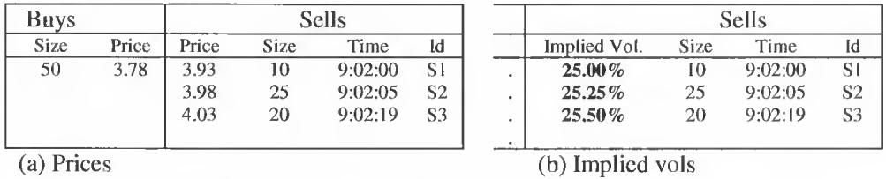  
Figure 5-35 A sample option order book together with a view of the implied volatilities

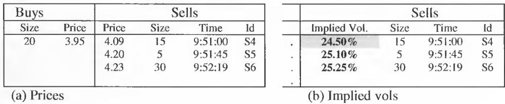  
Figure 5-35(b) shows how the market prices have been converted back to their implicd volatilities. Now lel's consider the situation nearly an hour laler.   
Figure 5-36 A later snapshot of the order book from Figure 5-35

The price of EFG has risen lo 47.5, hence the call option prices have also increased. Though, based on implied volatility we can see thal order S4 now actually has a slightly lower value. In effeet, this order may be viewed as being "cheaper" in lerms of volatility. We can explain this by plugging this volatilily into the option price calculation together with the original underlying price of 47. This gives an option a price of 3.84, which is considerably less than any of the prices available an hour before in Figure 5-35.

When comparing option prices it is important to remember thal they are being driven by a lot of factors. Consequenlly, traders may prefer to base their decisions on implied volatility ralher than just the current price. In turn, brokers and vendors are staring to offer trading algorithms that adopt a similar approach, effeetively driving the algorithm from a modified order book, as shown in Figure 5-35(b).

This approach may also be extended to trading option spreads. Effectively, this is similar to what we discussed for pair trading and multi-leg algorithms, just replacing prices with implied volatilities. Note that it is somewhat more complicated than simple pair trading since olher risk factors such as time decay will also need to be taken into account.

Basing the trading decisions on volatility also makes it possible to consider trading different contracts. Given that there can be hundreds (or even thousands) of contracts for a specilic asset, each of these will have mueh lower liquidity. By viewing them in terms of their implied volatility, we can polentially fulfil our requiremenis with other contracts. For instancc, in the previous example we might have also traded some August contraets, or some with another strike price. That said, this approach ean add further complications, since different contracts can bring exposure to other risks. Therefore if a portfolio of options contracts is being generated it is important to consider the risk faetors (or "Greeks") to make sure that there are no surprises in terms of risk exposure.

As algorithms expand further into the derivatives markets, incorporating these risk factors into trading algorithms is likely to become a much more common requirement. In Chapter 13 we will briefly review how some risk factors (such as delta and gamma) may be hedged.

# Gamma Weighted Average Price (GWAP)

Implementation shortfall has become ubiquitous in the equitics markets, although there is still a large contingent of traders and investors who also track benchmarks such as VW AP. Still, VWAP is not necessarily a universal benchmark, particularly for Iragmented markels or illiquid assets. The Gamma Weighted Average Price (GWAP) is an alternative benchmark outlined by Seott Larison (2008). It is designed to tackle some of the shortcomings of VWAP for the options markets: A single asset may have thousands of related options contracts, so the liquidity of any one contraet will generally be significantly lower than that of the underlying asset. As Larison points out, this lower trading activity makes benehmarks like VWAP less meaningful for options. A further complication is the faet that complex multi-leg strategies represent a considerable volume in the options markets. Thus, prices may also be influenced by those of other contracts. So the GW AP benchmark also takes into account the VW AP of the underlying asset. It may be represented as:

$$
G _ { w a p } ( c a l l ) = P + [ \Delta ^ { * } \mathcal { \lambda } _ { r o c } ] \qquad G _ { w a p } ( p u t ) = P - [ \Delta ^ { * } \mathcal { \lambda } _ { r o c } ]
$$

where $P$ is the option price, $\Delta ^ { \prime }$ is the adjusted delta and $\lambda _ { r o c }$ is the rate of ehange price. In turn, the rate of change price $( \lambda _ { r o c } )$ is based on the VW AP of the underlying asset:

$$
\lambda _ { r o c } = S _ { \nu w a p } - S _ { 0 }
$$

where $S _ { \theta }$ is the referenee price of the underlying asset, for example, the arrival price or the previous close, and $S _ { \nu w a p }$ is the VW AP average for the specified interval.

The delta is one of the "Greeks"; it is a measure that represents the risk in terms of price moves by the underlying asset. 4 A delta of 1.0 means that for every rise (fall) of $\$ 1$ in the underlying asset the option's price will also rise (fall) by $\$ 1$ . Conversely, a negative delta means that the option's price moves in the opposite direction. In the GW AP caleulation, the adjusted delta $( \Delta ^ { \prime } )$ is based on the option's implied delta $\mathbf { \Omega } ^ { ( \Delta ) }$ and gamma (y) from when the order was entered:

$$
{ \Delta ^ { * } } _ { ( c a l l ) } = \Delta + ( \lambda _ { r o c } * \gamma ) \qquad { \Delta ^ { * } } _ { ( p u t ) } = \Delta - ( \lambda _ { r o c } * \gamma )
$$

Gamma is a second derivative risk measure. It quantifies how much the delta will change when the underlying asset's priee moves by one unit, e.g. $\$ 1$ . For example, let's consider a call option priced at $\$ 6$ with a delta 0.5 and a gamma of 0.1. When the underlying asset price inereases by $\$ 1$ , the delta means the call option will increase to $\$ 6.5$ , whilst its delta will inerease to 0.6 because of the gamma. We shall cover both of these in more detail in Chapter 13 in the review of delta and gamma hedging strategies.

Larison (2008) goes on to give an example of how the GWAP may be caleulated. Based on this, let's assume that the underlying asset ABC starts with a benchmark price $( S _ { \theta } )$ of $\$ 45.0$ Throughout the day from 9:30 to $4 { : } 0 0 \mathrm { p m }$ it achieves a VWAP of $\$ 46.00$ The price of a September 09 call option with a strike of 50 starts out at $\$ 2.15$ , with an implied delta of $3 8 \%$ and a gamma of $4 \%$ .

Therefore thc rate of change of price: $\begin{array} { r l } & { \lambda _ { r o c } = 4 6 . 0 - 4 5 . 0 = 1 . 0 . } \\ & { \Delta ^ { \prime } = 3 8 \% + ( 1 . 0 \ast 4 \% ) = 4 2 \ \% . } \\ & { \mathrm { G } _ { \mathrm { w a p } } = \ S 2 . 1 5 + [ 3 8 \ \% * 1 . 0 ] = \ S 2 . 5 3 . } \end{array}$   
The adjusted delta:   
Giving a GWAP for our call option:

Consequently, the target henchmark is based on the price moves in the underlying asset rathcr than those from the option market.

The CBOE have partnered with Pipeline to provide a benchmark crossing bascd on the GWAP. If this proves successful we may well start to scc option algorithms trying to track the GWAP in rcal-time.

As algorithms continue to sprcad to more markets we may well sce other new benchmarks being adopted.

# 5.8 Summary

A trading algorithm is simply a set of instructions used to execute an order.

Trading algorithms may be broadly categorised into thrce main groups hased on the target objectives. Thesc are impact-driven, cost-driven or opportunistic.

Impact-driven algorithms seek to minimise the overal market impaet costs, usually b splitting larger ordcrs into smaller child orders.

TWAP (time weighted average price) is often driven by a time-hased schedule.   
VWAP (volume weighted average price) often uses historical volumes as a guide.   
Percent of volume (POV) algorithms "go along" with the market volume.   
Minimal impact algorithms use ATSs and "dark pools" to reduce signalling risk.

Cost-driven algorithms aim to reduce the overall trading costs.

Implemcntation shortfall (IS) seeks to achieve a balance between cost and risk.   
Adaptive shortfall algorithms extend this, adapting to the market price (or liquidity).   
Market-on-close algorithms target the future closing price.

Opportunistic algorithms strive to takc best advantage of favourable market conditions.

Price inline algorithms are price-sensitive variants of impact-driven algorithms.   
Liquidity-driven algorithms are an evolution of simplcr rule-based order routing.   
Pair trading is a market neutral strategy driven by a favourable sprcad or ratio.

- Most of these algorithms will work across asset classes. Stil, the unique featurcs of some asset classes mean that completely new types may also be needed. For instance:

Multi-leg trading for bonds and derivatives   
Algorithms driven by factors such as interest rates or volatility   
Handling fungible assets, so specification-based trading rather than cxplicit assets   
Targeting new more appropriate benchmarks

# Chapter 6

# Transaction costs

Transaction costs can have a significant effect on investment returns. Therefore, it is important to both measure and analyse them if "best execution'" is to be achieved.

# 6.1 Introduction

Each time an asset is bought or sold transaction costs are incurred. ln economic terms, Robert Kissell (2006) describes them as costs paid by buyers, but not received hy the sellers. They can have a considerable effect on investment returns, for instance, Ed Nicoll (2004) estimatcd total annual transaction costs of approximately $\$ 120$ billion for the $\$ 12$ trillion U.S. equity market. This is based on costs per order ranging from 20 basis points (bps) up to 200(or $2 \%$ ) of thc value. The widc range is partly due to the different characteristics of each asset and order, but is also due to the different ways transaction costs may be assigned.

Onc of the most common ways to examine transaction costs has been to compare the actual performance of a portfolio with its "paper" equivalent. A paper portfolio is simply a virtual portfolio traded at benchmark prices, but without accounting for any costs.

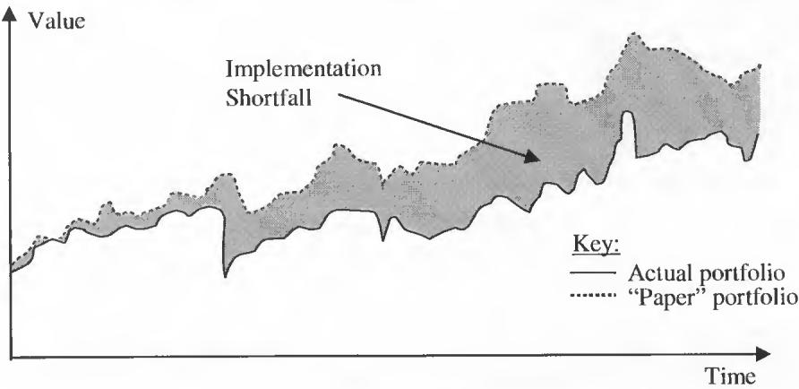  
Figure 6-1 Comparing the performance of a portfolio

The diffcrcnce in performance between a portfolio and its thcoretical "paper" equivalent

was termed the "'implementation shortfall" by André Perold (1988), as shown in Figure 6-1.   
Alternatively, this is sometimcs refcrred to as "slippage".

A specific example of the impact of transaction costs is given by David Leinweber (2002) for the returns of a fund based on the Value Line portfolio. The Value Line Investment Survey is a weekly stock analysis newslcttcr focussed on thc U.S. Between 1979 and 1991 the paper portfolio achieved an annualized return of $2 6 . 2 \%$ , whereas the actual fund actually managed $1 6 . 1 \%$ Much of this difference is directly attributable to transaction costs, since thc fund made the same trades as recommended in the newsletter.

Whilst transaction costs are inevitable, they can be minimised. Therefore, in order to maximise investment returns it is important to accurately measure transaction costs and to analyse them to understand how and why they occur.

# 6.2 The investment process

Transaction costs span the entire investment process. They may be tracked from the initial decision to buy/sell an asset through to the actual orders and executions that achieve it.

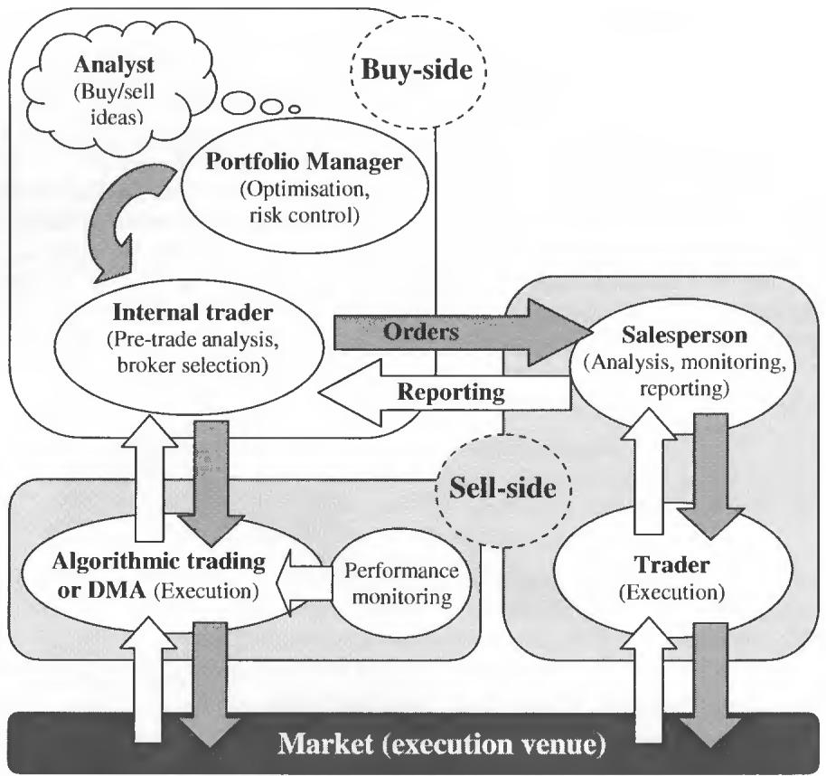  
Figure 6-2 The investment process

Figure 6-2 shows a simplified view of the process, covering both traditional broker trading as well as algorithmic / DMA execution: The initial source of each order lies on the buy-side, with an investment buy or sell idea. The potential impact on the investment portfolio is then modelled by the portfolio manager, who will use optimisation techniques and risk analysis to determine the set of target positions. An internal trader must then identify the best way to trade these orders. 2 This is achieved by estimating the potential transaction costs, as well as considering historical broker performance. Having decided on the most appropriate means of trading, the orders are then routed for execution. Most commonly, this will mean sending them to a sell-sidc institution, from where they will be sent out to the market. This may be achieved via a salesperson/trader or by an algorithmic trading/DMA process. 3 Finally, executions from the market will complete the order and trade reports will be sent back to the buy-side.

An alternativc way of viewing this process is to consider the whole investment cycle, as highlighted by Ananth Madhavan (2002). Rathcr than focussing on the individuals involved, it emphasises the cyclical nature of the investment process, shown in Figure 6-3. Trade execution is drivcn by the investment strategy, but it also gives important feedback, which may affect future invcstment decisions.

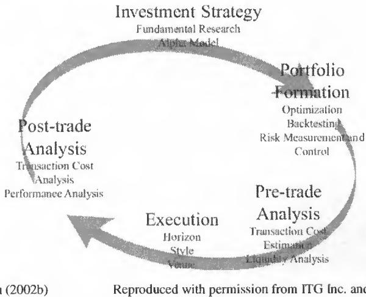  
Figure 6-3 The investment cycle

Clearly, transaction cost analysis is an important part of the investment process:

Pre-trade analysis conccntrates on estimating potential transaction costs. Hence it is a kcy input into the choice of trading strategy and can have a substantial effect on the overall execution (and so investment) performance. Liquidity analysis may also be used to identify the best strategies and venues for trading.

Post-trade analysis focuses on execution performance and measurement of transaction costs. It is essential for understanding the effectiveness of both thc investment ideas and their implementation. In turn, this performance is an important consideration when new invcstment strategics arc formulated. For example, an investment opportunity worth 30 basis points may not bc worth following up if previous transaction costs for similar orders have becn around this level.

Historically, most of the early research on transaction costs focussed on post-trade analysis. Though, over the last few years pre-trade analysis has become ever more important. In particular, algorithmic trading is often rcliant on pre-tradc models in order to achieve more cost efficient exccution.

In order to compare the various components of transaction costs, throughout this chapter we will use the following example trade.

Example 6-1: A decision to buy 50,000 of assct XYZ, its mid-price and our cxccutions are all shown in Figure 6-4.

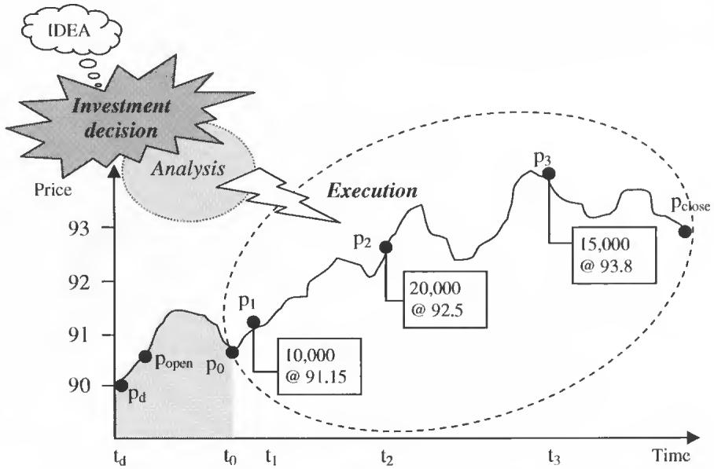  
Figure 6-4 A plot of trading price and executions for the order in Example 6-1

As we can see in Figure 6-4, the investment decision to buy XYZ is made when the price is at $\mathbf { p _ { d } } ,$ which happens to coincide with the previous day's closing price of 90. After analysis, an order to buy 50,000 is dispatched to a broker at time $\mathbf { t } _ { 0 } ,$ which (for simplicity) is filled by three separate child orders. The child orders execute at timcs $\mathfrak { t } _ { \mathrm { l } }$ , $\mathbf { t } _ { 2 }$ and $\mathbf { t } _ { 3 }$ The first two cxccutions are for 10,000 at an average price of 91.15 followed by 20,000 at 92.5, and are reasonably close to the best market price at thosc times. The third order, of 15,000, caused more impact and so achieved a poorer price of 93.8. Note that these example cxecutions are just intended to help highlight the various types of transaction costs; they are not linked to any specific type of trading strategy or algorithm.

Immediately from Figure 6-4 we can see two distinct phases, the pre-trade pcriod and thc actual execution. The pre-trade period lasts from $\mathrm { t _ { d } }$ to $\mathbf { t } _ { 0 }$ when the order is dispatched to a broker, whilst the execution phase lasts from $\mathrm { t } _ { \mathrm { 0 } }$ to the order's completion, or in this casc, the day's close since the ordcr is not fully executed. The strong price trend is also obvious, rising steadily, from opening at 90.5 to finally closing at 93.0.

The following sections provide a more comprehensive description of both pre and posttrade analysis, together with a detailed breakdown of how transaction costs are formed, using this cxample trade. For even more dctailed coverage of transaction cost analysis it is well worth referring to 'Optimal Trading Strategics' by Robert Kissell and Morton Glantz (2003).

# 6.3 Pre-trade analysis

Pre-rade analysis is important to ensure that best execution is achieved. These analytics help investors or traders make informed decisions about how best to execute a given order.

Most brokers/vendors provide a considerablc amount of general reference information. This may be as simple as the associated country and currency, or it may be more asset specific. For instance, for equities they may provide fundamental information such as the market capilalisation and the various investment ratios (e.g. price to carnings (P/E), pricc to book (P/B)), together with any relevant sector and index data. Similarly, for bonds, they may provide the bond's yield and duration, as well as details of its credit rating, issue size and any relevant tcrms and conditions.

Table 6-1 oullines thc data that is key to trading strategy selection. Essentially, this consists of prices, liquidity measures and data for risk analysis and cost estimates.

Table 6-1 A summary of key pre-trade analytics data   

<table><tr><td>Type</td><td>Data</td></tr><tr><td>Prices</td><td>Markct prices, Price ranges, Trends/momentum</td></tr><tr><td>Liquidity</td><td>Percentage of ADV, Volume profile, Trading slability</td></tr><tr><td>Risk</td><td>Volatility, Beta, Risk exposure</td></tr><tr><td>Cost estimates</td><td>Market impact, Timing risk</td></tr></table>

The liquidily and risk cstimales highlight the expected difficulty of trading. The cost estimates give a reasonable indication of what might be achieved. This is particularly important for algorithmic trading, sincc it gives us an idea of how suitable the order is for a given strategy. Prohibitive risk or cost estimates mcan that it is worth discussing the ordcr directly with a broker or trader since manual execution may be the best option. In Chapter 7, we shall see how we can use thesc cost and risk estimates to try to select the optimal trading strategy for a specific order.

# Price data

A wide range of price data is useful for pre-trade analytics. The current market bid and offer prices, or a rccent snapshot, act as a baseline for what we might achieve. The last traded price is also useful, particularly lor illiquid assets, since this may be significantly different from the current quotes. The bid offer spread provides an estimate for the cost of immediacy. Historical average spreads allow us to gauge whether the current spread is unusual.

Price ranges, such as the diference between today's high and low prices, give an indication of the current price volatility. Likewise, benchmarks such as today's opening price or last night's closc are also useful. Trends may be reflected by daily, weekly or even monthly percentage changes.

# Liquidity data

Liquidity is closely related to transaction costs. Trading volume offers a simple way to rate the liquidity of a given asset. The average daily volume (ADV) is often ealeulated for the last 30 or 90 days. The pereentage of ADV represents our order size as a fraction of this volume. Henee, we can gauge how diffieult it may be to work any given order. For instance, anything less than $2 0 { - } 2 5 \%$ should be aehievable within a day; however, anything over this could have a more signifieant effeet on the market.

An estimate of the required trading horizon may be based on the ADV, together with a faetor $( a )$ which represents our desired trading rate:

$$
\mathbf { H o r i z o n } = \mathbf { S i z e } / \left( \mathbf { A D V } * \alpha \right)
$$

For example, given an order size of 50,000 with an ADV of 1,000,000, if we do not wan1 to participate in more than $10 \%$ of the market volume then the required time is:

$$
\mathrm { H o r i z o n } = 5 0 , 0 0 0 / \left( 1 , 0 0 0 , 0 0 0 ^ { \ast } 0 . 1 \right) = 0 . 5 \mathrm { d a y s }
$$

At $10 \%$ participation, it could take us half a day to complcte the order, whilst if we are only prepared to be $5 \%$ it could take the entire day.

Clearly, for such estimates to be reliable il is important thal the actual trading volume elosely matches the historieal volume profile. Kissell and Glantz (2003) quantify this by adopting a coefficient of varialion (CV), which is based on the standard deviation $\sigma$ (ADV):

$$
\mathrm { C V } = \sigma ( \mathrm { A D V } ) / \mathrm { A D V }
$$

The trading stability is inversely related to this coefficicnt, so a high value of CV implies thal sizeable variation from the historical average is possible.

Provided the trading activity is reasonably stable we can estimale what today's trading volume might be just by comparing the volume so far with the historical profile. If the market has only been open an hour and the days volume is $50 \%$ higher than the historical average then this may well continue for the resl of the day, in which case we need to resize the volume profile. Obviously, in such cases it is also important to check whether there is any news that may be driving this additional volume.

As we will sec in Chapter 10, a range of factors can have an impact on the expeeled volumes. For instance, Kissell and Glantz (2003) note the importanee of the day of the week for U.S. equities: Mondays generally see below avcrage volumes whilst Wednesday and Thursdays see slightly above average ones.

The average trade size can also sometimes be useful, particularly if the order is lo be worked manually. This aets as a simple guide to prevent signalling risk; if the order is significantly larger than the average trade size then it is worth spliting it or using hidden orders.

# Risk data

Volatility is a key variable for estimating how mueh risk we may be cxposed to. It is based on the standard devialion of price returns, often for the last 3 or 6 months. As we have alrcady seen, a high volatility implies a considerablc amount of timing risk. Therefore, more aggressive trading strategies will generally be used lo counteract this.

Market risk may be measured using an asset's beta, which is a mcasure of its sensitivity to market returns. A positive value means that the asset price moves in the same direetion as the markct whilst a negativc onc means it behaves in a contrarian fashion. 4 A bela of 1 mcans that the assct price moves in linc with the market, so if the market as a whole drops $10 \%$ then the asset price will do the same. A beta of grcater than I means the price response is magnificd, so a bcta of 2 would drop $20 \%$ , whilst a beta of 0.5 would only drop $5 \%$ Note we shall cover other portlolio risk metrics in more detail in Chapter 12.

# Transaction cost estimates

Transaction cost models gcncrally provide an estimate for the overall cost as well as detailing the major cost components such as markct impact and timing risk. These are detailed in scction 6.5.

The basis for many transaction cost models is a framework suggested hy Robert Almgrcn and Neil Chriss (2000). This uses a random walk model to estimate the current market price in tcrms of permanent market impact, price trending and volatility. Chapter 10 provides a more in-depth revicw of thcse cost-estimation models.

In tcrms of asset sclcction, given lwo assets with similar cxpected relurns it is logical to tradc the one that has the lower expectcd transaction costs. Exacly the same may be said for comparing various types of trading strategy, whether it is using a crossing system, a trading algorithm or DMA. Detailed pre-trade analysis is still required (to cnsure the latesl markct information is incorporated in any decisions); however, historical cost data may ccrtainly also be used to guide thc sclection decision.

Cost estimates are an important guide to the difficulty of an order. For instance, if the timing risk cstimate is significantly larger than the markel impact forecast then it is worth considering a more aggrcssive trading strategy. Conversely, a larger market impact may suggcst adopting a more passive style. In Chapter 7, we will see how these dccisions affect algorithm choice.

# 6.4 Post-trade analysis

Thc historical results of post trade analysis act as a measure of broker/rader performance;   
thcy may also inform both investmcnt and execution decisions.

Clcarly, thcrc is a lot morc to transaction costs than fes and commissions. Past pcrformancc is therelore an imporlant tool for comparing thc quality of execution of both brokers and individual traders. Unbundling research fees has also made it easicr for investors to link costs to the exccution, and so usc post-trade analysis to accurately compare broker performancc.

Breaking thc costs down into their componcnts allows us to sce where and how the costs (or slippagc) actually occurred. Detailed measurement helps to ensure that future efforts for cost rcduction are focusscd on the corrcct stage of the investment proccss. It may also be uscd to guidc the cxccuion method selection. For example, high timing risk and/or opportunity cost suggests that the trading may have been too passive.

# Performance analysis

How can we tell if a broker/trader is skilful or lucky? Similarly, how can we know whether a certain broker's VWAP algorithm performs bettcr than another's? Performance analysis is an important tool for post-trade comparison of broker/rader/algorithm results.

Benchmark comparison is probably thc most widespread tool used for performance analysis. This simply means selecting an appropriatc benchmark and then comparing the average cxecution price with it. In theory a good performcr should, on avcrage, match (or beat) the benchmark.

Still, benchmarks are not perfcct; in particular, difficulties can arisc when using them to compare performance across assets and over time. So aftcr a brief revicw of thc major benchmarks we shall also consider an alternativc metric proposed by Robert Kissell (1998). This is the Relative Performance Measurc (RPM), which assigns each tradc a percentilc ranking compared to the rest of the market. This makes it much casier to compare pcrformance across a range of assets as well as over time. It can also allow for pricc trcnds and other market conditions.

# Benchmarks

A good benchmark should be casy to track and readily verifiable, it should also providc an accurate performance measurement. Table 6-2 shows the various benchmarks groupcd in terms of when they may be detcrmined.

Table 6-2 Types of benehmark   

<table><tr><td colspan="2">Benchmark</td><td colspan="2">Results for Example 6-1</td></tr><tr><td>Type</td><td>Name</td><td>Benchmark Price</td><td>Relative performance (bps)</td></tr><tr><td rowspan="2">Post-Trade</td><td>Close</td><td>93.00</td><td>37</td></tr><tr><td>Future Close (next day)</td><td>94.00</td><td>137</td></tr><tr><td rowspan="3">Intraday</td><td>OHLC</td><td>92.00</td><td>-63</td></tr><tr><td>TWAP</td><td>92.20</td><td>-43</td></tr><tr><td>VWAP</td><td>92.40</td><td>-23</td></tr><tr><td rowspan="4">Pre-Trade</td><td>Previous Close</td><td>90.00</td><td>-263</td></tr><tr><td>Opening Price</td><td>90.50</td><td>-213</td></tr><tr><td>Decision Price</td><td>90.00</td><td>-263</td></tr><tr><td>Arrival Price</td><td>90.65</td><td>-198</td></tr><tr><td colspan="2">Average execution price</td><td>92.63</td><td>n/a</td></tr></table>

Post-trade benchmarks, such as the day's close, will not be known until after the trading has been completed. In comparison, pre-trade benchmarks, such as the previous closc or the opening price, are known before the day's trading cven commences. Intraday benchmarks, such as VWAP, need to be rccalculatcd as the day progresses. For those that span the whole trading day, the definitive value will not in fact be known until trading has eomplcted. Hence, trading with an intraday or post-trade benchmark usually requircs somc cxtra work. An intcrim valuc for the benchmark (intraday) or prediction (post-trade) will necd to be maintained so that intraday performance may be monitored.

To allow comparison, the benchmark prices and performances from Example 6-I are quoted separately in Table 6-2. For cxample, if we compare the avcrage exceution pricc to the closing price for our execution:

Close price

$$
\begin{array} { r l } & { = ( 9 2 . 6 3 - 9 3 ) * 4 5 , 0 0 0 = \ S 1 6 , 5 0 0 } \\ & { = ( 1 6 , 5 0 0 / 4 , 5 0 0 , 0 0 0 ) = 0 . 3 7 \% \ \mathrm { { o r } \ 3 7 \ b p s \ ( b a s i s \ p o i n t s ) } } \end{array}
$$

To convert into basis points we can divide by the value of our overall order. Note that this was for $5 0 , 0 0 0 \mathrm { X Y Z }$ based on a decision price of 90 (rather than the 45,000 we cxecutcd).

These valucs may he viewed in turn to evaluate the performance of the example trade. Positive relative performances are good, therefore the example appears to have done well compared to the post-trade benchmarks. Conversely, it seems to have fared less well in terms of the intraday and pre-trade benchmarks. The following sub-sections outline each of the benchmarks in more detail.

Note that Example 6-1 has heen specifically designed to highlight the different potential costs; hence, it has missed some of the benchmarks by over 200 basis points (bps). In section 6.6 we shall look at actual reported transaction costs from some of the world's markets.

# Post-trade benchmarks

Gencrally, these are bascd on closing prices, whether they are for the current trading day or for some time in the near future. Their popularity as a benchmark is due to the fact that the closing price is often used as a milestone for marking to market and for profit and loss (P&L) calculations. Fulure close prices may be used to retrospectively analyse performance. They provide a benchmark that is casy to determine and widely used. Though, in terms of a performance measure, they merely act as a milestone.

Markets tend to be more active at the close so prices are less reflective of actual markct conditions throughout the day. In particular, if the asset's price is trending then orders completed carlicr in the day will be compared with a benchmark price that is substantially different to that at the time of execution. Thus, an unfavourable price trend may make buy or sell orders look to have performed well; conversely, a favourable trend may make them appear to have performed poorly.

Post-trade benchmarks also tend to encourage trading closer to the end of the trading day. Unlortunately, the closing period is exactly when asset prices may be most sensitive to order flow, as demonstrated by Cushing and Madhavan (2001). This can expose an order to unncccssary timing risk and also to more volatile conditions. Whilst call auctions can reduce end of day volatility there can still be a considerable premium for traders requiring liquidity at the closc.

For a trader or algorithm trying to track a post-trade benchmark, generally the goal will be to achieve (or beat) the closing price. Therefore, unless the trading strategy is simply to participate in the closing auction they will need to use a predicted price as a guideline. This price will need to be regularly updatcd, for instancc, notice how the price trails off towards the close in Figure 6-4.

In terms of our cxample order, the price trend makes it appear to have performed well. The average pricc achieved for Example 6-1 is 92.63, beating the close by 37 basis points. Assuming the trend continues for the next day, to close at 94, means it performs cven better versus this futurc close price. However, even better performance could have been achicved by tilting the execution towards the beginning of the day, when prices were lower. In terms of benchmarks, this only becomes cvident by looking at the previous close price of 90. So although closing prices might be a popular benchmark, in isolation they are not the best mcans of performance analysis.

# Intraday benchmarks

These use average prices to try and more accurately reflect the intraday market conditions.

The OHLC (Open High Low Close) average has often been used as a proxy for the mean market price. Though, its popularity has waned as improved access to time and sales data has allowed more accurate calculations. Clearly, as an average of only four data points it may be easily distorted by extreme values.

The TWAP (Time Weighted Average Price) benchmark is an average of a the observed trade prices over a set period. Equal weighting is given to all trades, so small trades at extreme prices can have a large effect on it. Generally, TWAP is used where trade volume data is not available.

The VW AP (Volume Weighted Average Price) benchmark arguably gives the fairest indication of how the market price has moved over the time span. This average weights each trade price by its corresponding size. The VW AP for a given period is the total traded value divided by the total traded quantity. Conscquently, small trades at extreme prices will have much less effect; instead, the average will be dominaied hy the largest trades.

A trader or algorithm trying to track the TWAP or VWAP wil necd to frequently recalculate the benchmark price to incorporate new market information. Sincc post trade information has become more widely available VW AP has become one of the most popular benchmarks, due to the accuracy of its intraday performance.

The VWAP benchmark is not perfect, though, particularly for large orders. Institutional investors frequently need to trade large quantities, for example, consider trading an order equal to the average daily volume (ADV) of asset XYZ. The order would represent so much of the day's trading that the VWAP has praciically no mcaning in terms of performance. In fact, the same may be argued for anything over $30 \%$ of the ADV. Tracking the VW AP also tends to cncourage trading to be spread out over time, reducing the overall market impact, but exposing the order to considerable price risk. For instance, let's assume hall an order is worked throughout the first day, achieving an average price close to the current VwAP. Based on the benchmark, the performance so far is good, so the temptation is to leave the rest of the order for the next day. However, in terms of overall costs it may have been more advantageous to fully execute the order on the first day, despite any additional market impact. For assets which are volatile or for which there is a strong adverse price trend tracking the VWAP may even lead to poorer overall performance. Likewise, for small orders, it may not be appropriate to spread the execution out over a long time.

In terms of the performance for Example 6-1, the following table shows an aggregated view of the trading volumes throughout the day grouped by execulion price.

Table 6-3 Aggregated price and volume data for Example 6-1   

<table><tr><td rowspan=1 colspan=1>Price</td><td rowspan=1 colspan=1>90.50</td><td rowspan=1 colspan=1>91.00</td><td rowspan=1 colspan=1>91.50</td><td rowspan=1 colspan=1>92.00</td><td rowspan=1 colspan=1>92.50</td><td rowspan=1 colspan=1>93.00</td><td rowspan=1 colspan=1>93.50</td><td rowspan=1 colspan=1>94.00</td><td rowspan=1 colspan=1></td></tr><tr><td rowspan=1 colspan=1>Size</td><td rowspan=1 colspan=1>25,000</td><td rowspan=1 colspan=1>20,000</td><td rowspan=1 colspan=1>15,000</td><td rowspan=1 colspan=1>10,000</td><td rowspan=1 colspan=1>30,000</td><td rowspan=1 colspan=1>50,000</td><td rowspan=1 colspan=1>40,000</td><td rowspan=1 colspan=1>10,000</td><td rowspan=1 colspan=1>200,000</td></tr><tr><td rowspan=1 colspan=1>#Trades</td><td rowspan=1 colspan=1>5</td><td rowspan=1 colspan=1>3</td><td rowspan=1 colspan=1>2</td><td rowspan=1 colspan=1>2</td><td rowspan=1 colspan=1>4</td><td rowspan=1 colspan=1>5</td><td rowspan=1 colspan=1>4</td><td rowspan=1 colspan=1>2</td><td rowspan=1 colspan=1>27</td></tr><tr><td rowspan=1 colspan=1>Value $k</td><td rowspan=1 colspan=1>2,262.5</td><td rowspan=1 colspan=1>1,820.0</td><td rowspan=1 colspan=1>1,372.5</td><td rowspan=1 colspan=1>920.0</td><td rowspan=1 colspan=1>2,775.0</td><td rowspan=1 colspan=1>4,650.0</td><td rowspan=1 colspan=1>3,740.0</td><td rowspan=1 colspan=1>940.0</td><td rowspan=1 colspan=1>18,480.0</td></tr></table>

Using this data the intraday benchmarks may be calculated as:

$$
{ \begin{array} { r l r l } & { = ( 9 0 . 5 + 9 4 + 9 0 . 5 + 9 3 ) / 4 } & & { = 9 2 . 0 0 } \\ & { = ( 5 ^ { * } 9 0 . 5 0 + 3 ^ { * } 9 1 . 0 0 + 2 ^ { * } 9 1 . 5 0 . . . . . ) / 2 7 } & & { = 9 2 . 2 0 } \\ & { = ( 1 8 , 4 8 0 , 0 0 0 / 2 0 0 , 0 0 0 ) } & & { = 9 2 . 4 0 } \end{array} }
$$

In comparison with the others, the VWAP benchmark best represents the average market conditions throughout the day. Its higher price corresponds to the greater impact from the increased trading volumes at 93 and 93.5. It is also lower than the closing price of 93, and so relects the volume that was traded earlier in the day at lower priccs.

In comparison to the post-trade benchmarks, the example order seems to have performed less well vcrsus the intraday ones. The example order has missed the VWAP by 23 basis points. This is not that surprising given that the order was filled in three executions;

especially sincc more was filled later in the day when the price had riscn. Given the trending price, it secms that more of the order should have been executed earlicr in the day. Hencc, the VW AP does indecd act as a reasonable performance benchmark.

# Pre-trade benchmarks

Thesc arc an immediately available milestone, which may be used to directly measure performance. The previous close and the opening pricc may both be used to determine trading costs. Although, just as for the post-trade benchmarks, the trading at these times may be more volatile and so thcy are not necessarily reflective of the actual market conditions throughout the day. A substantial price shift can also make the benchmark less meaningful for any subsequently cntered orders, sincc thcy will be comparing to a price they could ncver have achieved.

The decision price rcprcsents the price al which the choice to invest was actually madc, which lies in with Perold's concept of implementation shortfall. Arrival price is used in a similar fashion to the decision price, it represents the time at which the order could actually be traded. In the case of a brokcr, it is the time when the order arives from the investor. This may then be used to measure what has sometimes been termed the execution shortfal, since unlikc implementation shortfall it only tracks the trading-related costs.

Prc-tradc benchmarks arc appealing since they are both easily determined and immediately available for comparison. Whilst they do not rcflect actual market conditions throughout thc day, this may also be used as an advantage since it means there is no way to influence or "game" the benchmark. Another advantage is that they are just as appropriate for all order sizes.

Note that the decision and arrival prices are not always recorded by invcstors, so previous closc and opening priccs may be used as corresponding proxies for them. This will clcarly affect thc accuracy of the transaction cost measurement. In particular, it will affect the investment-related costs, often mcaning these are underestimated.

The trade from Examplc 6-1 appears to have performed extremely poorly compared to the pre-trade benchmarks. This is caused by the noticeable price trend throughout the day. Lower transaction costs could have been achieved by completing morc of the order earlicr in the day.

# Relative Performance Measure

Kisscl's (1998) Relative Performance Measure (RPM) is an alternative to price-based benchmarks. It is based on a comparison of what the trade achieved in relation to the rest of the market. In terms of volume, the RPM reprcsents the ratio of the volume traded at a less favourable price to the total market volume:

RPM(volumc) $=$ Total volume at price less favourablc than execution Total market volume

Transaction cost is dependent on many factors: the asset's characteristics (liquidity, volatility), market conditions (price trends, momentum), trading strategy etc. Thercfore, when comparing thc performance of two separate orders we necd to take these various factors into account. Simply comparing how many basis points cach order beat thc VWAP by does not givc a fair comparison.

One of the main advantages of the RPM metric is the fact that its results are already normalised, since the percentage rates the trade's performance compared to the rcst of the market. Thus, a trade that achieves a $90 \%$ RPM has performed significantly betler than one achieving $60 \%$ . This makes thc RPM a useful tool for comparing the relative performance across a varicty of hoth orders and assets, as well as ovcr time.

Kissell proposes a range of adjustments for RPM to make it suitable for a wide range of trading strategies. Such as using time filtering to deal better with short trades, or adding weightings to incorporate the aggressiveness of the trading strategy. More details about the RPM may be found in Kissell and Glantz (2003).

Using the aggregated volume data from Table 6-3, the RPM's for Example 6-I may be determined:

$$
\begin{array} { r l } & { \mathrm { R P M } ( \mathrm { v o l u m e } ) = ( 5 0 , 0 0 0 + 4 0 , 0 0 0 + 1 0 , 0 0 0 ) / 2 0 0 , 0 0 0 = 5 0 \% } \\ & { \mathrm { R P M } ( \mathrm { t r a d e s } ) = ( 5 + 4 + 2 ) / 2 7 = 4 1 \% } \\ & { \mathrm { ~ s ~ } } \end{array}
$$

In other words, $50 \%$ of traded volume performed as well or better than the cxample order, whilst the remainder achieved a worse average price. This confirms that the cxample trade's performance is average at best.

# Post-trade transaction costs

The total transaction costs of a trade may be determined using Perold's implcmentation shortfall measure. This is the difference in value between the idealised paper portfolio and the actually traded one:

$$
I S = R e t u r n s _ { P a p e r } \cdot R e t u r n s _ { R e a l }
$$

The theoretical (or paper) returns depend on the price when the decision to invest wa: made $( p _ { d } )$ , the final market price $( p _ { N } )$ and the size of the intended invesimcnt $( X )$ . The rca returns depend on the actual transaction costs. So if $x _ { j }$ represent the sizes of the individua executions and $p _ { j }$ are the achievcd prices:

$$
I S = \underbrace { X ( p _ { N } - p _ { d } ) } _ { \mathrm { R e } t u r n s _ { P a p e r } } - \underbrace { ( X p _ { N } - \sum x _ { j } p _ { j } - f i x e d ) } _ { \mathrm { R e } t u r n s _ { R e a l } } = \sum x _ { j } p _ { j } - X p _ { d } + f i x e d
$$

Note that this assumcs that the order is fully executed. To take account of this Robert Kissell and Morton Glantz (2003) introduccd an opportunity cost factor, sincc not cvery order will be fully executed:

$$
I S = \underbrace { \sum x _ { j } p _ { j } - ( \sum x _ { j } ) p _ { d } } _ { E x e c u t i o n \ : C o s t } + \underbrace { ( X - \sum x _ { j } ) ( p _ { N } - p _ { d } ) } _ { O p p o r t u n i t y \ : C o s t } + f i x e d
$$

where $( X \mathrm { ~ - ~ } \Sigma x _ { j } )$ corresponds to the size of the unexecuted position.

So for Example 6-1:

$$
\begin{array} { r l } & { \quad = ( 1 0 , 0 0 0 ^ { * 9 } 1 . 1 5 + 2 0 , 0 0 0 ^ { * 9 } 2 . 5 + 9 3 . 8 ^ { * } 1 5 , 0 0 0 ) - ( 4 5 , 0 0 0 ^ { * } 9 0 . 0 ) } \\ & { \quad = \$ 1 8 , 5 0 0 } \\ & { \mathrm { t } = ( 5 0 , 0 0 0 - 4 5 , 0 0 0 ) * ( 9 3 . 0 - 9 0 . 0 ) } \\ & { \quad = \ S 1 5 , 0 0 0 } \\ & { \quad = 5 0 , 0 0 0 * 9 0 . 0 = \ S 4 , 5 0 0 , 0 0 0 } \end{array}
$$

$$
\mathbf { \Sigma } = ( 1 3 3 , 5 0 0 / 4 , 5 0 0 , 0 0 0 ) = 2 9 7 ~ \mathrm { b p s + f i x e d ~ c o s t s }
$$

Wayne Wagncr and Steven Glass (2001) also showed thal transaclion cosis incorporale a dclay factor. This corresponds to the effect of a price move from when the initial investment decision is made to when the order is aclually sent for execution. So i may be shown that the overall costs consist of:

$$
\textit { \iota c o s t s = } \underbrace { X ( p _ { 0 } - p _ { d } ) } _ { l n v e s t m e n t r e l a t e d } + \underbrace { \sum x _ { j } p _ { j } - ( \sum x _ { j } ) p _ { 0 } } _ { T r a d i n g \ r e l a t e d } + \underbrace { ( X - \sum x _ { j } ) ( p _ { N } - p _ { 0 } ) } _ { O p p o r t u n i t y \ C o s t } + f i x e d
$$

where the pricc $p _ { 0 }$ is the markel price when the order was dispatched, commonly known as the arrival pricc. Notice that the lrading-related and opporlunity costs now account for the change from this arrival price rather than the decision price.

Kisscll and Glantz (2003) incorporaled this into a measure they called the expanded implcmentalion shortfall. This manages to nol only account for transaction costs, but also helps to identify where the costs actually occurred. The following section shows how these costs may be broken down into factors such as spreads, market impact and timing risk.

# 6.5 Breaking down transaction costs

There has been a considerable amount of research focussed on trading costs. Most notable amongst these is a study by Wayne Wagner and Mark Edwards (1993) which split oul the trading costs into specific components, namely timing, delay, impact and opportunily cosls.

There arc several different ways of classifying the constituents of transaction costs, as shown in Table 6-4.

<table><tr><td rowspan=2 colspan=2>Cost type</td><td rowspan=1 colspan=4>Classification</td><td rowspan=1 colspan=2>Focus for:</td></tr><tr><td rowspan=1 colspan=1>Explicit</td><td rowspan=1 colspan=1>Implicit</td><td rowspan=1 colspan=1>Fixed</td><td rowspan=1 colspan=1>Variable</td><td rowspan=1 colspan=1>Algorithms</td><td rowspan=1 colspan=1>TacticsExecution</td></tr><tr><td rowspan=2 colspan=1>Investment</td><td rowspan=1 colspan=1>Taxes</td><td rowspan=1 colspan=1>√</td><td rowspan=1 colspan=1></td><td rowspan=1 colspan=1></td><td rowspan=1 colspan=1>✓</td><td rowspan=1 colspan=1></td><td rowspan=1 colspan=1></td></tr><tr><td rowspan=1 colspan=1>Delay Cost</td><td rowspan=1 colspan=1>√5</td><td rowspan=1 colspan=1></td><td rowspan=1 colspan=1></td><td rowspan=1 colspan=1>√</td><td rowspan=1 colspan=1></td><td rowspan=1 colspan=1></td></tr><tr><td rowspan=7 colspan=1>Trading</td><td rowspan=1 colspan=1>Commission</td><td rowspan=1 colspan=1>√</td><td rowspan=1 colspan=1></td><td rowspan=1 colspan=1>✓</td><td rowspan=1 colspan=1></td><td rowspan=1 colspan=1></td><td rowspan=1 colspan=1></td></tr><tr><td rowspan=1 colspan=1>Fees</td><td rowspan=1 colspan=1>√</td><td rowspan=1 colspan=1></td><td rowspan=1 colspan=1>✓</td><td rowspan=1 colspan=1></td><td rowspan=1 colspan=1>0</td><td rowspan=1 colspan=1>0</td></tr><tr><td rowspan=1 colspan=1>Spreads</td><td rowspan=1 colspan=1></td><td rowspan=1 colspan=1>√6</td><td rowspan=1 colspan=1></td><td rowspan=1 colspan=1>✓</td><td rowspan=1 colspan=1></td><td rowspan=1 colspan=1>•</td></tr><tr><td rowspan=1 colspan=1>Market Impact</td><td rowspan=1 colspan=1></td><td rowspan=1 colspan=1>✓</td><td rowspan=1 colspan=1></td><td rowspan=1 colspan=1>√</td><td rowspan=1 colspan=1>●</td><td rowspan=1 colspan=1>0</td></tr><tr><td rowspan=1 colspan=1>Price &#x27;Trend</td><td rowspan=1 colspan=1></td><td rowspan=1 colspan=1>✓</td><td rowspan=1 colspan=1></td><td rowspan=1 colspan=1>✓</td><td rowspan=1 colspan=1>●</td><td rowspan=1 colspan=1></td></tr><tr><td rowspan=1 colspan=1>Timing Risk</td><td rowspan=1 colspan=1></td><td rowspan=1 colspan=1>✓</td><td rowspan=1 colspan=1></td><td rowspan=1 colspan=1>√</td><td rowspan=1 colspan=1>·</td><td rowspan=1 colspan=1>0</td></tr><tr><td rowspan=1 colspan=1>Opportunity Cost</td><td rowspan=1 colspan=1></td><td rowspan=1 colspan=1>✓</td><td rowspan=1 colspan=1></td><td rowspan=1 colspan=1>✓</td><td rowspan=1 colspan=1>0</td><td rowspan=1 colspan=1></td></tr></table>

• often $^ { \circ }$ somclimes

# Table 6-4 Transaction cost constituents

Differentiating between investment and trading related costs is useful since it helps identify who best can control them. Looking back at the trading cxample in Figure 6-4, the investment-related costs may be classed as everything which occurs before $t _ { 0 }$ (when the order is placed with the broker/trader) whilst the trading-related costs account for the rest.

Transaction costs are also commonly termed as either explicit or implicit. Explicit costs are clearly identifiable and easily measured, whereas implicit costs are less dircctly observable and so harder to quantify. Fixed costs are set regardless of the trading strategy whilst variable ones depend on the asset, the order, market conditions and the trading stratcgy. Another way of viewing these different cost types is shown in Figure 6-5. Note that although this is not drawn to scale, it does try to emphasise the relative importance of cach type.

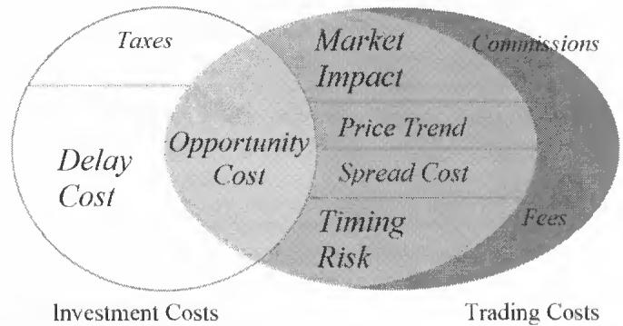  
Figure 6-5 Categorising transaction cost types

Pre-trade analysis tools allow both investors and traders to cstimate these various transaction costs. This also helps make trading-related costs more transparent, and allows investors much more control over them. Investors should sct clear targets for acceptable levels of cost and risk. Then by modelling a range of diverse trading strategies/algorithms, they may sclect the most appropriate approach. This is also a good way of reducing opportunity cost, since the analysis will highlight orders that may be too large. If an order does not appear to be viable, the investor may choosc to consider other asscts that are more liquid. Alternatively, if the order is not price sensitive then spreading it over several days may work. Note that most pre-trade analysis is hased on historical data, so discussing with a trader can confirm current market conditions.

Clearly, the main aim is to achieve a reduction in the total transaction costs. The fixed commissions and fees may be reduced by negotiation. However, in terms of reducing overall cost, the most potential lies with the implicit and variable costs. The most important of which are trading-related, in particular market impact and timing risk. Generally, these are dependent on the asset, market conditions, the order and the trading strategy. By taking advantage of pre-trade analysis and algorithmic trading, investors can sclect trading strategies that are much more suitable for their overall investment goals. By choosing an appropriate trading strategy, the overall cost and risk should be considerably reduced.

A nice ilustration of an in-depth transaction cost breakdown is provided by Instinet (2005). In order to compare the relative effects of the components Figure 6-6 sho ws a more detailed breakdown of the costs associated with Example 6-1. The following sub-sections provide more detailed descriptions for each of the individual cost components.

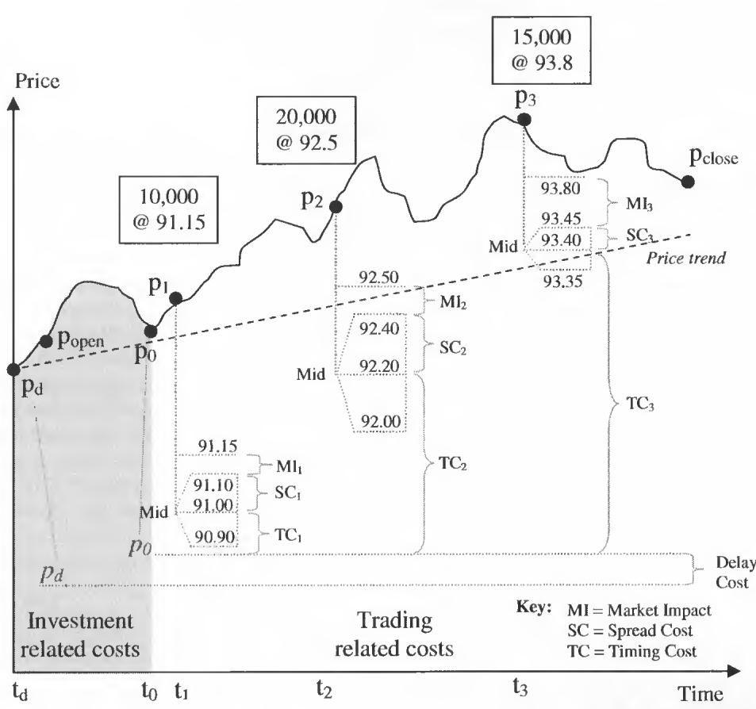  
Figure 6-6 Detailed transaction cost breakdown for Example 6-1

# Investment-related costs

Investment-related costs can be a significant proportion of the overall transaction costs. They primarily consist of a delay cost with taxes making up the rest. The delay reflects the time from the investment decision being made $( t _ { \mathrm { d } } )$ to when an order is actually dispatched $\left( t _ { 0 } \right)$ This is shown as the shaded region in Figure 6-6.

# Taxes

Taxes must be incorporated into the investment strategy. Generally, they are applied based on capital gains; however, some markets such as the U.K. stock market have an additional stamp duty on share purchases.

# Delay Cost

The delay cost is caused by any price change from the initial decision to invest to when an order has actually been received by a broker. This may be specified as:

$$
{ \mathrm { D e l a y } } \mathbf { C o s t } = X ^ { * } \left( p _ { \theta } - p _ { d } \right)
$$

where $X$ is the order size, $p _ { d }$ is the mid price when the investment decision was made (time

$t _ { \mathrm { d } } )$ and $p _ { 0 }$ is the mid price at $t _ { O }$ when the order was received by the broker.

For Example 6-1:

$$
\begin{array} { r l } { \mathrm { D e l a y C o s t } \qquad } & { = 5 0 , 0 0 0 ^ { \ast } ( 9 0 . 6 5 - 9 0 . 0 0 ) } \\ & { = \$ 3 2 , 5 0 0 } \\ & { = 7 2 \mathrm { b p s } } \end{array}
$$

Using the dccision price benchmark, the example trade's performance was -293 bps Therefore, for this example a quarter of the transaction costs are due to delay cost.

Such costs are clearly more important for assets whose price is trending away (i.c. up for buys and down for sells). Similarly, more volatile assets may also suffer.

Delay cost may be caused by a simple lag between the investment decision and issuing the order. Sometimes it may be inevitable, for instancc, when the decision is made out of market hours. Time may also be spent on pre-trade analysis and choosing the most suitablc broker, particularly for more illiquid assets and markets. Alternatively, if the buy-sidc tradcr has a strong view on the market this may cause them to wait for an optimal time. Nevcrtheless, if this judgement proves incorrect it will incur a delay cost.

The increasing availability of tools and systems for pre-tradc analysis could help reduce this cost. Especially as they become more tightly integrated with order and cxccution management systems (OMSs and EMSs). Note there is no rcason why the dclay cost could not be broken down furiher. For example, market prices could be recorded at each stage of the process from the initial strategy and research through to portfolio formation.

# Trading-related costs

The explicit trading-related costs comprisc of commissions and fccs. Often thcse will be quoted in advance of trading as percentages of the traded valuc. Obviously, thesc may be reduced to a certain extent, based on negotiation betwecn the investor and the brokers. The rates offered will usually depend on the client's volume of trading and the level of service they rcquire.

Thc most significant costs arc the implicit trading-related costs, primarily market impact and timing risk, but also spread, price trend and opportunity cost. Figure 6-6 shows the breakdown of these costs for our examplc buy ordcr.

Market impact represents a payment for liquidity (or immediacy) and a cost due to the information content of the order. The price trend cost reprcsents the added burden caused by a trending market. Timing risk is primarily associated with the volatility of an assct's price, as well as its liquidity. Spread cost is also included here since although being visible it is not always as easily mcasurable as fees or commissions. Finally, opportunity cost represents the risk from not fully executing the order, possibly because the trading stratcgy was too passive.

Note that for convenience the time related costs are grouped together as an overall iming cost in Figure 6-6, where:

$$
\mathrm { T i m i n g ~ C o s t = P r i c e ~ T r e n d + T i m i n g ~ R i s k }
$$

Whilst thesc trading costs may not be eliminated, they may be controlled by selecting suitable trading strategies. Market impact costs arc higher for aggrcssive trading whereas timing risk is higher for passive trading. Conscquently, the trader nceds to lind the appropriate balance between impact cost and risk, and adjust the trading strategy accordingly. This sclection also nccds to take into account the specifics of cach order together with thc currcnt market conditions and thc investor's goal's and level of risk avcrsion. In Chapter 7, we will covcr these decisions in more dctail.

In terms of trading algorithms, Table 6-4 showed which cost components are generally focussed on. Clearly, market impact is a prime foeus, but some algorithms will also closely monitor timing risk (c.g. implementation shortfall) and price trends. Execution taetics generally concentrate on spread costs, although some may also monitor price irends. Smart order routing systems and liquidity algorithms will also incorporate fees into their calculations when deciding the best venue to route orders to.

# Commission

Brokers charge commission for agency trading to compensate them for the costs (particularly labour and capital) ineurred in handling orders, executing trades and performing clearing and scttlement. Commission is generally quoted in basis points (bps). Though, in the U.S. equity markets quoting in cenis per share (cps) is common.

Commissions have becn steadily decreasing over time. Certainly, ovcr a longer period commissions have fallen significantly. For instance, Hans Stoll (2001) noted that back in 1970 commissions for 500 shares of a $\$ 40$ stock were $\$ 270$ , or 135 hps (54 cps). Whilst this was for a retail invcstor, even institutional investors paid around 65 bps (26 cps) on a 5000 share trade. Nowadays, in the U.S., commissions are often below ten basis points, particularly for DMA. Similarly, in the European equities marketplacc a full service brokerage will probably charge around 20 bps, with algorithmic trading services costing around 10 bps and basic DMA even less than this.

Clearly, one way of reducing this cost is to compare the commissions for a wide range of brokers. Bear in mind, though, that commission is only one part of the transaction costs. A detailed comparison of all the associated costs is required to properly compare brokers.

# Fees

Fees represcnt the actual charges from trading. These may he from floor brokers, exchange fees, or clearing and scttlemcnt costs. Often brokers incorporate these into their commission charge. Note that some cxchanges and ECNs assign costs only to aggressively priced orders in order to encourage liquidity provision. For instance, Table 6-5 highlights charges from BATS for Septembcr 2008.

<table><tr><td rowspan=1 colspan=1>Fees ($/share)</td><td rowspan=1 colspan=1>Tape A(NYSE)</td><td rowspan=1 colspan=1>Tape B(Regional)</td><td rowspan=1 colspan=1>Tape C(NASDAQ)</td></tr><tr><td rowspan=1 colspan=1>Adding liquidity</td><td rowspan=1 colspan=1>-0.0024</td><td rowspan=1 colspan=1>-0.0030</td><td rowspan=1 colspan=1>0.0024</td></tr><tr><td rowspan=1 colspan=1>Removing liquidity</td><td rowspan=1 colspan=1>0.0025</td><td rowspan=1 colspan=1>0.0025</td><td rowspan=1 colspan=1>0.0025</td></tr><tr><td rowspan=1 colspan=1>Routing out</td><td rowspan=1 colspan=1>0.0029</td><td rowspan=1 colspan=1>0.0029</td><td rowspan=1 colspan=1>0.0029</td></tr></table>

Source: BATS (2008)

# Table 6-5 Sample Fees for using BATS (Sept 2008)

Notice how the charges for taking liquidity (i.e. aggressive orders) may be almost nullified by rebates offered for providing liquidity (i.e. passive orders). Some markets even provide multiple venues with different pricing schemes. For cxample, the Direct-Edge ECN provides EDGA where all orders pay a set fee, whilst EDGX offers the rebate style pricing where liquidity providers are compensated at the expense of liquidity takers.

Algorithms and execution tactics which deal with multiple execution venues are the most likely to track broker and exchange fees. They need this information when deciding between routing destinations to cnsure they make a fair comparison of the real price.

# Spreads

Spread cost represents the difference between the best bid and offer prices at any given time. The spread compensates those who provide liquidity. Clearly, aggressive trading styles will result in a higher spread cost than passive ones.

The overall spread cost may be determined by summing the bid offer spreads for cach execution. (A factor of O.5 is used since we only pay half the sprcad for cach trade):

$$
{ \mathrm { S p r e a d ~ C o s t } } = \sum { \bigl ( } x _ { j } * ( 0 . 5 * s _ { j } ) { \bigr ) }
$$

where $x _ { j }$ is the size of each execution and $s _ { j }$ is the bid offer spread at that time. Note that this is the quoted sprcad at the time of each execution, rather than the elfective spread, which also incorporates the immediate market impact.

$$
{ \begin{array} { r l } { \operatorname { I n \mathrm { E x a m p l e } } 6 \mathrm { - } 1 \colon \mathrm { S p r e a d \mathrm { C o s t } } } & { \quad = ( 1 0 . 0 0 0 ) ^ { * } ( 9 1 . 1 \cdot 9 1 ) ) + ( 2 0 . 0 0 0 ^ { * } ( 9 2 . 4 \cdot 9 2 . 2 ) ) } \\ & { \quad + ( 1 5 . 0 0 0 ^ { * } ( 9 3 . 4 5 \cdot 9 3 . 4 ) ) } \\ & { \quad = { \mathfrak { F } } 5 . 7 5 0 } \\ & { \quad = 1 3 \mathrm { b p s } } \end{array} }
$$

Spread costs vary considerably across both markets and assets. For some assets/markets, the spread can be a major cost factor. In the U.S. equity market, decimalisation sharply reduced spread cost to around $5 ~ \mathrm { { b p s } }$ , although during the 2007-09 financial crisis spreads nearly doubled. In Europe and Japan spreads may be much higher, ranging from 10-50 bps or even more. Unsurprisingly, large-cap and liquid stocks have lower spreads. More volatile stocks tend to have higher sprcads.

The simplest way to lower spread costs is to trade more passively, using limit orders which are priced at the market or just behind it. Algorithms may not always directly consider spread cost, although it may affect their choice of cxecution tactics (passive or aggressive). Most price-based execution tactics will closely monitor the spread in order to usc an appropriate level of aggression when placing and updating orders.

# Market impact

Market impact represents the price change caused by a specific trade or order. Generally, i1 has an adverse affect, for instance, helping drive prices up when we are trying to buy.

The exact market impact cost is the difference hetween the actual price chart and the hypothetical onc that would have occurred if our order had not been created. Though, this makes market impact dificult to mcasure and estimate accurately, as Kissell and Glantz (2003) observe. Figure 6-7 tries to show this cffect for the order from Examplc 6-1; the hypothetical price chart is labelled as the "paper'" one (borrowing from Perold's implementation shortfall nomenclature).

Market impact is usually broken down into temporary and permanent impacts:

The temporary impact reflects the cost of demanding liquidity. For instancc, an order that "walks the book" wil usually achieve a poorer price than if it had just taken the quantity available at the best bid or offer.

Permanent impact corresponds to the long-term effect of our order, representing the information content that it has exposed to the market. Clearly, if the market detects a large buyer or seller this acts as a strong signal and will affect the pric accordingly. A single, large order might have a larger temporary impact than a series of smaller orders. However, netting the permanent impacts of the smaller orders will give a similar result to the signal given by the large order.

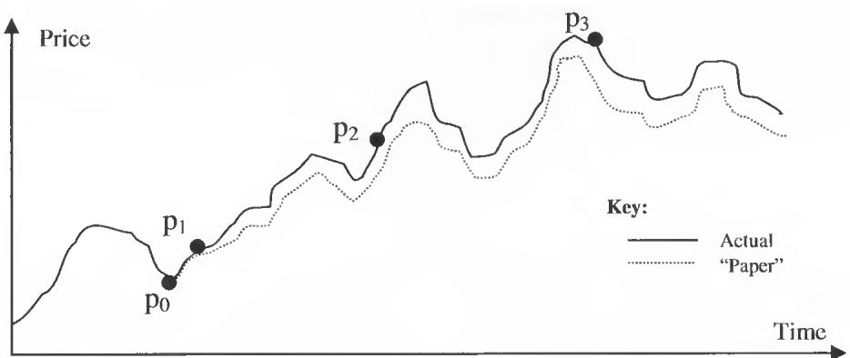  
Figure 6-7 Potential impact cost for Example 6-1   
Figure 6-8 A view of the order book for trade $\mathbf { t } _ { 2 }$ from Example 6-1

An approximate measure for market impact is to sum the total impacts for each order. The impact may he determined as the difference in price between our execution and the best bid or offer at that timc (bid for sells and offer for buys):

$$
{ \mathrm { \bf { M a r k e t } } } { \mathrm { \bf { l m p a c t } } } = \sum { \left( { { x _ { j } } * ( { p _ { j } } - { p _ { b } } ) } \right) }
$$

where $x _ { j }$ is the size of each cxecution and $p _ { j }$ is the price achicved for each execution and $p _ { b }$ is the best bid or ofler at that time.

For example, let's consider one of the individual trades from Example 6-1 in more detail. Figure 6-8 shows a before and after view of the order book for the second execution at $\mathbf { t } _ { 2 }$

<table><tr><td colspan="4">Buys</td><td colspan="4">Sells</td></tr><tr><td>ld</td><td>Time</td><td>Size</td><td>Price</td><td>Price</td><td>Size</td><td>Time</td><td>ld</td></tr><tr><td>B1</td><td>1:05:00</td><td>1,000</td><td>92.0</td><td>92.4</td><td>10,000</td><td>1:05:00</td><td>S1</td></tr><tr><td>B2</td><td>1:00:25</td><td>3,000</td><td>91.9</td><td>92.5</td><td>7,000</td><td>1:00:25</td><td>S2</td></tr><tr><td>B3</td><td>1:04:09</td><td>4,000</td><td>91.8</td><td>92.8</td><td>2,000</td><td>1:04:09</td><td>S3</td></tr><tr><td></td><td></td><td></td><td></td><td>92.9</td><td>3,000</td><td>1:05:00</td><td>S4</td></tr></table>

(a) before (c) 5 minutes later (b) immediately after

<table><tr><td colspan="4">Buys</td><td colspan="4">Sells</td></tr><tr><td>ld</td><td>Time</td><td>Size</td><td>Price</td><td>Price</td><td>Size</td><td>Time</td><td>Id</td></tr><tr><td>B6</td><td>1:07:00</td><td>1,000</td><td>92.1</td><td>92.5</td><td>5,000</td><td>1:08:00</td><td>S5</td></tr><tr><td>B5</td><td>1:08:00</td><td>2,000</td><td>92.1</td><td>92.6</td><td>4,000</td><td>1:09:00</td><td>S6</td></tr><tr><td>B1</td><td>1:05:00</td><td>1,000</td><td>92.0</td><td>92.9</td><td>2,000</td><td>1:09:10</td><td>S7</td></tr><tr><td>B2</td><td>1:00:25</td><td>3,000</td><td>91.9</td><td>92.9</td><td>5,000</td><td>1:08:00</td><td>S8</td></tr></table>

<table><tr><td></td><td colspan="4">Sells</td></tr><tr><td></td><td>Price</td><td>Size</td><td>Time</td><td>1d</td></tr><tr><td>。</td><td>92.4 92.5 92.8</td><td>10,000 7,000 2,000</td><td>1:05:00 1:00:25 1:04:09</td><td>S1 82 S3</td></tr></table>

By issuing a market order to buy 20,000 XYZ, we can sce that this will "walk the book", crossing with sell orders S1, S2, S3 and S4. So we reccive fills of 10,000 at 92.4, 7,000 at

92.5, 2,000 at 92.8 and 2,000 at 92.9, achieving an averagc price of 92.5. The tcmporary effect of the trade has been to shift thc offcr price up to 92.9. Though, within a few minutes ncw orders arrive which stabilise the offer pricc back to 92.5. The pcrmancnt impact, causcd by our tradc, helpcd shift the offer price from 92.4 to 92.5. Our ordcr acted as an indication that the asset was undervalued and so helped raise the price permancntly, as we can sce in Figurc 6-9.

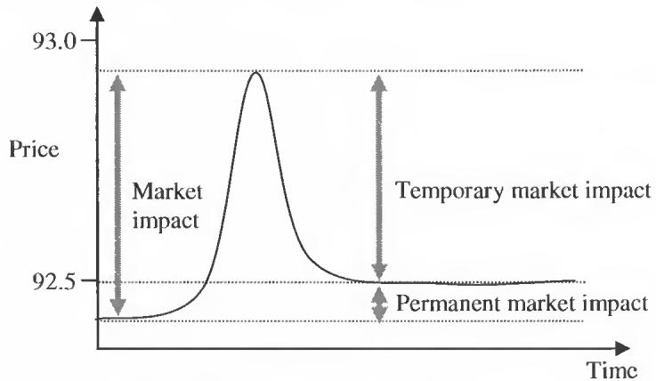  
Figure 6-9 The components of market impact

The overall impact for Example 6-1, using equation 6-4:

$$
\begin{array} { r l } { \mathrm { M a r k e t \ i m p a c t } } & { \ = ( 1 0 , 0 0 0 ^ { \ast } ( 9 1 . 1 5 \mathrm { - } 9 1 . 1 ) ) + ( 2 0 , 0 0 0 ^ { \ast } ( 9 2 . 5 \mathrm { - } 9 2 . 4 ) ) } \\ & { \quad + ( 1 5 , 0 0 0 ^ { \ast } ( 9 3 . 8 \mathrm { - } 9 3 . 4 5 ) ) } \\ & { \ = \ S 7 , 7 5 0 } \\ & { \ = 1 7 \mathrm { \ b p s } } \end{array}
$$

Breaking this down into its temporary and permancnt componcnts is a bit more difficult. Somc cost estimation models actually set the permanent impact as zero, assuming that the trade will not have a significant ovcrall effcct. Still, wc can make an approximation by using the estimation model from Kisscl and Glantz (2003). 7 First, the instantaneous impact cost $I _ { \mathbb { S } }$ is dctermined by rearranging their estimation equation as follows:

$$
M I _ { \ S } = \underbrace { 0 . 9 5 I _ { \ S } \cdot \eta ^ { - 1 } } _ { T e m p o r a r y i m p a c t } + \underbrace { 0 . 0 5 I _ { \ S } } _ { P e r m a n e n t i m p a c t } \Rightarrow I _ { \ S } = \frac { M I _ { \ S } } { ( 0 . 9 5 \eta ^ { - 1 } + 0 . 0 5 ) }
$$

where $\eta = \left( X + 0 . 5 * Q \right) / X ,$ and $X$ is the order size, $\boldsymbol { Q }$ is thc ADV.

Hence

$$
\begin{array} { r l } { \eta \quad } & { = \left( 4 5 , 0 0 0 + ( 0 . 5 * 2 0 0 , 0 0 0 ) \right) / 4 5 , 0 0 0 = 3 . 2 2 } \\ { I _ { 5 } \quad } & { = \ S 7 , 7 5 0 / \left( ( 0 . 9 5 / 3 . 2 2 ) + 0 . 0 5 \right) } \\ & { = \ S 2 2 , 4 7 5 } \\ & { = 5 0 \mathrm { b p s } } \end{array}
$$

This instantaneous impact cost may then be fed back into the first part of equation 6-5 to determinc both thc temporary and permanent impact costs:

$$
\begin{array} { r l } & { = \left( 0 . 9 5 * \ S \ 2 2 , 4 7 5 \right) / \ 3 . 2 2 } \\ & { = \ S \ 6 , 6 2 6 } \\ & { = 1 5 \ \mathrm { h p s } } \\ & { = 0 . 0 5 * \ S \ 2 2 , 4 7 5 } \\ & { = \ S \ 1 , 1 2 4 } \\ & { = 2 \ \mathrm { b p s } } \end{array}
$$

Overall market impact is dependent on the order/trade size, but most importantly on the market liquidity. Gcncrally, larger orders incur a higher market impact compared to smaler ones. Though, this effecl is considerably reduced for more liquid assets.

As we saw in Chapter 5, reducing market impact cost has been one of the primary aims of algorithms since the earlicst order slicing approaches. By taking a large order and splitting it into smaller ones, which are traded over a period of time, we should achieve a much lower overall impact cost. Many of the currently available algorithms directly incorporate this factor into their dccisions of how and when to place orders. The aggressiveness of execution tactics also has an effecl on the market impact costs. Issuing market orders or aggressive limit orders will incur higher costs. Some tactics may actually use limit order models to decide on the appropriate level of aggression.

# Price trending

Asset prices somctimes exhibit broadly consistent trends. This price drift, or momentum, is also known as short-term alpha. An upward trend implies that costs will increase when buying an assct, whilst savings will be made if selling. Conversely, the opposite is true for a downward price trcnd.

The price trend cost may be detcrmined based on the difference betwccn this trend price and the arrival price:

$$
{ \mathrm { P r i c e ~ T r c n d ~ C o s t } } = \sum { \left( { { x } _ { j } } * ( { \boldsymbol { p } } _ { j } ^ { * } - { \boldsymbol { p } } _ { O } ) \right) }
$$

wherc $x _ { j }$ is the size of cach execution, $\boldsymbol { p } _ { j } ^ { * }$ is the expecied price based on thc price trend and $p _ { \theta }$ is again thc mid price at $t _ { \theta }$ when the order was received by the broker.

For simplicity, in Example 6-1 the trend linc has becn set to cross betwcen the previous closc and the days OHLC average. This is shown on as the dashed line on Figure 6-6. Interpolation gives thc following trend prices:

<table><tr><td rowspan=1 colspan=1>Trade</td><td rowspan=1 colspan=1>t1$</td><td rowspan=1 colspan=1>t2</td><td rowspan=1 colspan=1>t3</td></tr><tr><td rowspan=1 colspan=1>Mid price</td><td rowspan=1 colspan=1>91.00</td><td rowspan=1 colspan=1>92.20</td><td rowspan=1 colspan=1>93.40</td></tr><tr><td rowspan=1 colspan=1>Trend price</td><td rowspan=1 colspan=1>90.50</td><td rowspan=1 colspan=1>91.00</td><td rowspan=1 colspan=1>91.60</td></tr></table>

# Table 6-6 Trend prices for Example 6-1

Note this simplistic trend may have given a higher trend cost measurement; however, this will not affcct the overall transaction cost measurement. Since timing cost is the sum of trend cost and timing risk, if the trend cost is overestimated then the timing risk will be underestimated by an equivalent amount.

For our example, the timing cost may be determined from the difference betwcen the mid price $( m _ { j } )$ and the arrival price $( p _ { \theta } )$ .

$$
\mathrm { T i m i n g \ C o s t } = \sum \left( x _ { j } \ast ( m _ { j } - p _ { 0 } ) \right)
$$

Reducing trend cost may really only be achieved by shortening the trading horizon and so incrcasing market impact costs. For large orders, which may span multiple days, investors must use pre-trade analysis to find the optimal trading approach to balance both these costs.

Price trending is a focus for the pricc-sensitive algorithms, such as implemcntation shortfall and market on close. In particular, the adaptive shortfall and pricc inline algorithms actively respond to trends either aggressively or passively. That said, schedulc bascd algorithms may also be modified to cope with price trends. Somc variants of TWAP and VWAP allow parameters to specify how to tilt their schedules based on which way the trader thinks the price may trend. Somc cxecution tactics may also becomc more or less aggressive if they dciect short-term market trends.

# Timing risk

Kissell and Glantz (2003) use timing risk to represent the uncertainty of the transaction cost estimate. The two main sources of uncertainty are volatility of both the asset's price and of the traded volume, although other factors such as spread risk could also be considercd. For the purposes of this book, timing risk will simply be reduced to the sum of these two main risks logether with a generic error factor (e):

$$
\mathrm { T i m i n g ~ R i s k } = \mathrm { V o l a t i l i t y ~ R i s k } + \mathrm { L i q u i d i t y ~ R i s k } + \varepsilon
$$

Price volatility is arguably the most important risk. The more volatile an assct then the more likely its price will move away and so increase the transaction costs. The liquidity risk represents the unccrtainty with respect to the market impact cost. Generally, market impact costs are cstimated based on historical volumes, so if the actual trading volumes differ significantly this may result in a shift in the market impact. For instance, if the market volume is higher then the market impact costs will tend to be less.

Based on the calculation for timing cost shown in the previous sub-section, timing risk is effectively the residual cost once the price trend has been accounted for. Hence, timing risk may be measured using:

$$
{ \mathrm { T i m i n g ~ R i s k } } = \sum \left( { x _ { j } } ^ { * } \left( m _ { j } - { \mathrm { \Delta } p _ { j } ^ { * } } \right) \right)
$$

where $x _ { j }$ is the size of each execution, $m _ { j }$ is the mid price at this time and $\boldsymbol { p } _ { j } ^ { * }$ is thc expected price based on the price trend.

For Example 6-1, using the mid and trend prices from Table 6-6:

$$
\begin{array} { r l } { \mathrm { T i m i n g ~ R i s k ~ } \quad } & { = ( 1 0 , 0 0 0 * ( 9 1 - 9 0 . 5 ) ) + ( 2 0 , 0 0 0 * ( 9 2 . 2 - 9 1 ) ) } \\ & { \quad + ( 1 5 , 0 0 0 * ( 9 3 . 4 - 9 1 . 6 ) ) } \\ & { = \$ 5 6 , 0 0 0 } \\ & { = 1 2 4 \mathrm { b p s } } \end{array}
$$

Clearly, this order has been considerably affected by timing risk. Shortening the trading horizon should reduce the effect. So investors must find an appropriate balance between market impact costs and timing risk.

Timing risk is a focus for the risk based algorithms, namely implementation and adaptive shortfall as well as market on close. Most execution tactics do not directly incorporate timing risk, although some may become more aggressive as time goes on, to try to complete any extant orders. Similarly, when an aggressive execution style is set by an algorithm this will some what reduce timing risk by preventing the algorithm from lagging behind their trading targets. Though, this only ensures completion of the dispatched child orders. An aggressive VWAP algorithm will still schedule its orders based on a historic volume profile, so orders will still he spaced out over time.

# Opportunity cost

Opportunity cost reflects the cost of not fully executing an order. This may be because the asset's price went beyond a client's price limit or could just be due to insufficient liquidity. Either way, it represents a missed opportunity, since the next day prices may move even further away.

The overall cost may be determined as the product of the remaining order size and the price difference betwecn the final price $( p _ { N } )$ and the arrival price:

$$
O C = ( X - \sum x _ { j } ) ( p _ { N } - p _ { 0 } )
$$

Unlike the other cost components, opportunity cost represents a virtual loss rather than a physical one. Thc loss is only realised when a new order makes up the remainder at a lcss favourable price.

$$
{ \begin{array} { r l } { \operatorname { o f o r } \operatorname { E x a m p l c } 6 \mathrm { - } 1 \colon \operatorname { O p p o r t u n i t y } \operatorname { C o s t } } & { = ( 5 0 , 0 0 0 - 4 5 , 0 0 0 ) ^ { * } ( 9 3 . 0 - 9 0 . 6 5 ) } \\ & { = \ S 1 1 , 7 5 0 } \\ & { = 2 6 \operatorname { b p s } } \end{array} }
$$

If the price trend reverts tomorrow then it should be easy to purchase the remaining 5,000 XYZ at less than 93.0. If the trend continues then an opportunity cost of at least 26 bps will be realiscd.

Rcducing opportunity cost may really only be achieved by using pre-trade analysis to confirm orders are sizcd correctly for current market conditions. For large orders, the investor must decide whether to risk market impact, or spread the trade over several days, risking exposure to a price move. Sctting price limits effectively signifies that opportunity cost is acceptable (so long as it is duc to the market moving to an unfavourable price). For such orders sudden price shifts can stop the order from being cxecutable. Good communication bctween the investor and tradcrs is vital to allow modification of the trading strategy if necessary.

Some algorithms may directly consider opportunity cost; typically, this is the cost-based ones such as implementation shortfall. Still, it is important to use pre-trade analytics to ensure the asset's liquidity is sufficient for the proposed order. Opportunity cost is also addressed indirectly by the optional finish-up logic providcd by brokers/vendors for some algorithms. This is primarily intended to complcte orders that may have an odd lot remaindcr.

# Summary

The previous sections have outlined each of these individual transaction cost components in some detail. Figure 6-6 gave a visual breakdown of the constitucnt costs for Example 6-1. These are summarised in the Iollowing table.

<table><tr><td>Type</td><td>Cost $</td><td>Cost bps</td><td>% of costs</td></tr><tr><td>Taxcs 8</td><td>0</td><td>0</td><td>0</td></tr><tr><td>Delay cost</td><td>32,500</td><td>72</td><td>24</td></tr><tr><td>Commission/Fees</td><td>4,500</td><td>10</td><td>3</td></tr><tr><td>Spread cost</td><td>5,750</td><td>13</td><td>4</td></tr><tr><td>Markct impact</td><td>7,750</td><td>17</td><td>6</td></tr><tr><td>Price trend</td><td>19,750</td><td>44</td><td>14</td></tr><tr><td>Timing risk</td><td>56,000</td><td>124</td><td>41</td></tr><tr><td>Opportunity cost</td><td>11,750</td><td>26</td><td>9</td></tr><tr><td>Total</td><td>138,000</td><td>307</td><td>100</td></tr></table>

# Table 6-7 Cost Estimate for Example 6-1

Thus, the overall cost is 10 bps morc than the 297 bps implementation shortfall wc calculated earlier. This is because the initial implementation shortfall calculation did not take into account commissions/fees (or taxes).

Note it is also different from the 263 bps underperformance we saw back in Table 6-2 using the decision price benchmark. This is because the benchmark only shows the performance Ior the executed irades, and not the 5,O00 which did not cxecute. So it docs not includc the opportunity cost. This is why implementation shortfall is an important (and accurate) tool for post-trade analysis, and can be more uscful than benchmarks.

In terms of individual cost components, clearly delay cost and timing risk are important cost factors in this cxample. Market impact cost is also significant. Our estimatc for the instantaneous impact cost was 5Obps. For this order, market impact has been reduced by spliting into several smaller orders. Though, with hindsight, much bctter performance could have been achieved by trading more aggressively at the start of day. Admittedly, thc market impact costs would have been higher, but the timing risk and price trend cost would have been much less.

It is important to remember that Example 6-1 was spccifically dcsigned to highlight the various potential costs. Obviously, the trading strategy was sub-optimal. In Chapter 7, we shall address the selection of optimal trading strategies in more dctail. For more realistic costs, the following section shows figures reported lor somc of the world's major markets.

# 6.6 Transaction costs across world markets

Having gone ihrough a worked cxample to illustrate cach of the main components of transaction costs it is worth seeing how these actually diffcr across thc world's markets. A lew vendors provide transaction cost analysis (TCA) which is truly global in scope. In general, these have been focussed on the equities markets, although they are also starling to cover other assct classes. Table 6-8 shows average transaction costs for global equity trading taken from quarterly cost rcvicws carricd out by ITG Inc. for both 2007 and 2008.

<table><tr><td rowspan=2 colspan=1>Region</td><td rowspan=1 colspan=3>Average Costin Q4 2008 /bps</td><td rowspan=1 colspan=4>Average Costin Q2 2007 Ibps</td></tr><tr><td rowspan=1 colspan=1>Shortfall</td><td rowspan=1 colspan=1>Comm</td><td rowspan=1 colspan=1>Total</td><td rowspan=1 colspan=1>Delay</td><td rowspan=1 colspan=1>Impact</td><td rowspan=1 colspan=1>Comm</td><td rowspan=1 colspan=1>Total</td></tr><tr><td rowspan=1 colspan=1>U.S. (Combined)</td><td rowspan=1 colspan=1>76</td><td rowspan=1 colspan=1>9</td><td rowspan=1 colspan=1>85</td><td rowspan=1 colspan=1>20</td><td rowspan=1 colspan=1>11</td><td rowspan=1 colspan=1>7</td><td rowspan=1 colspan=1>38</td></tr><tr><td rowspan=1 colspan=1>U.S. (Large Cap)</td><td rowspan=1 colspan=1>54</td><td rowspan=1 colspan=1>8</td><td rowspan=1 colspan=1>62</td><td rowspan=1 colspan=1>19</td><td rowspan=1 colspan=1>10</td><td rowspan=1 colspan=1>6</td><td rowspan=1 colspan=1>35</td></tr><tr><td rowspan=1 colspan=1>U.S. (Small Cap)</td><td rowspan=1 colspan=1>124</td><td rowspan=1 colspan=1>12</td><td rowspan=1 colspan=1>136</td><td rowspan=1 colspan=1>27</td><td rowspan=1 colspan=1>13</td><td rowspan=1 colspan=1>10</td><td rowspan=1 colspan=1>51</td></tr><tr><td rowspan=1 colspan=1>U.K.</td><td rowspan=1 colspan=1>73</td><td rowspan=1 colspan=1>12</td><td rowspan=1 colspan=1>84</td><td rowspan=1 colspan=1>31</td><td rowspan=1 colspan=1>4</td><td rowspan=1 colspan=1>11</td><td rowspan=1 colspan=1>46</td></tr><tr><td rowspan=1 colspan=1>Europe ex U.K.(Austria, Belgium, Denmark, Finland,France, Germany, Greece, Ireland,1taly, Luxembourg, Netherlands,Norway, Portugal, Spain, Sweden,Switzerland)</td><td rowspan=1 colspan=1>66</td><td rowspan=1 colspan=1>11</td><td rowspan=1 colspan=1>77</td><td rowspan=1 colspan=1>37</td><td rowspan=1 colspan=1>6</td><td rowspan=1 colspan=1>11</td><td rowspan=1 colspan=1>54</td></tr><tr><td rowspan=1 colspan=1>Japan</td><td rowspan=1 colspan=1>111</td><td rowspan=1 colspan=1>9</td><td rowspan=1 colspan=1>120</td><td rowspan=1 colspan=1>39</td><td rowspan=1 colspan=1>16</td><td rowspan=1 colspan=1>8</td><td rowspan=1 colspan=1>63</td></tr><tr><td rowspan=1 colspan=1>Developed Asia(Australia, Hong Kong, Malaysia, NewZealand, Singapore)</td><td rowspan=1 colspan=1>113</td><td rowspan=1 colspan=1>15</td><td rowspan=1 colspan=1>128</td><td rowspan=1 colspan=1>95</td><td rowspan=1 colspan=1>16</td><td rowspan=1 colspan=1>14</td><td rowspan=1 colspan=1>125</td></tr><tr><td rowspan=1 colspan=1>All Emerging(Argentina, Brazil, Chile, Chile, China,Colombia, Cyprus, Czcch Republic,Egypt, Hungary, India, Indonesia,Israel, Jordan, Mcxico, Morocco,Pakistan, Peru, Phitippines, Poland,Russia, S. Korea, South Africa, SriLanka, Taiwan, Thailand, Turkey)</td><td rowspan=1 colspan=1>128</td><td rowspan=1 colspan=1>21</td><td rowspan=1 colspan=1>148</td><td rowspan=1 colspan=1>80</td><td rowspan=1 colspan=1>12</td><td rowspan=1 colspan=1>20</td><td rowspan=1 colspan=1>112</td></tr></table>

Source: ITG (2009, 2008)

# Table 6-8 Average transaction costs for globaI equities

Unsurprisingly, the costs are closely related to market liquidity, so the lowest eosts are for U.S. large eap firms, followed by Europe and Japan. Comparing the differences between 2007 and 2008, it is elear that during the market turmoil costs rose sharply, partieularly in the more developed markcts. In faet, Tahle 6-8 shows that transaetion eosts doubled from Q2 2007 to Q4 2008 for the ITG U.S. combined figures, mainly due to a massive inerease in costs for small cap equitics. Similarly, the U.K. and Japan saw eost increases of over $50 \%$ whilst Europcan markets saw around a $2 2 \%$ increase.

Tablc 6-8 also shows a hreakdown of these costs. For 2007 the delay eost, market impaet and eommissions (labclled Comm) are shown, whilst for 2008 the shortfall cost represents thc sum of the delay and market impact. Again, market impact eosts are generally lower in the largest and most developed markets. The delay eost seems to be most important for the Asian markets. Commissions tend to be lowest in the US and Japan, followed by Europe then the rest of Asia.

Transaetion eost analysis has seen a slower uptake for other asset classes. A laek of transparency has hecn one of the key difficulties with dealer driven markets like fixed ineome. Clearly, for transaction cost analysis to be useful we need aceess to price data in order to aceurately determine market impact, spread and delay eosts. Still, the situation is gradually improving with the inereasing adoption of eleetronic trading for these asset elasses.

In the fixcd ineome marketplace, several TCA vendors now offer global cost reports. For example, Table 6-9 shows some average eosts from reviews by Elkins/McSherry for 2007/8. Fixed income markets also saw signifieant eost inereases during the 2007-09 financial erisis. Note the sample costs shown in Table 6-9 do not give a breakdown into their individual

<table><tr><td rowspan=1 colspan=1>Country</td><td rowspan=1 colspan=1>Average cost / bpsQ4-Q12007-8</td></tr><tr><td rowspan=1 colspan=1>Greece</td><td rowspan=1 colspan=1>~9.1</td></tr><tr><td rowspan=1 colspan=1>UK</td><td rowspan=1 colspan=1>~5.3</td></tr><tr><td rowspan=1 colspan=1>Netherlands</td><td rowspan=1 colspan=1>~9.5</td></tr><tr><td rowspan=1 colspan=1>Japan</td><td rowspan=1 colspan=1>~5.5</td></tr><tr><td rowspan=1 colspan=1>Hong Kong</td><td rowspan=1 colspan=1>~11.1</td></tr><tr><td rowspan=1 colspan=1>Singapore</td><td rowspan=1 colspan=1>~12.0</td></tr><tr><td rowspan=1 colspan=1>Malaysia</td><td rowspan=1 colspan=1>~14.0</td></tr><tr><td rowspan=1 colspan=1>Mexico</td><td rowspan=1 colspan=1>~7.2</td></tr><tr><td rowspan=1 colspan=1>Turkey</td><td rowspan=1 colspan=1>~16.0</td></tr></table>

Source: Elkins McSherry (2008, a)

<table><tr><td rowspan=1 colspan=1>U.S. bonds</td><td rowspan=1 colspan=1>Average cost / bps2007</td></tr><tr><td rowspan=1 colspan=1>Treasury</td><td rowspan=1 colspan=1>5.87</td></tr><tr><td rowspan=1 colspan=1>Agency</td><td rowspan=1 colspan=1>6.73</td></tr><tr><td rowspan=1 colspan=1>Municipal</td><td rowspan=1 colspan=1>11.32</td></tr><tr><td rowspan=1 colspan=1>Mortgage</td><td rowspan=1 colspan=1>5.23</td></tr><tr><td rowspan=1 colspan=1>Corporate</td><td rowspan=1 colspan=1>6.97</td></tr></table>

# Table 6-9 Average transaction costs for global bond trading

components, although they are noticeably lowcr than the figures reported for equities. However, there can also be a substantial cost associated with volatility, as shown in a proof of concept study of over 25,000 State Strcet bond portfolios reported in Pensions & Investments (2003). A volatility cost of 22 bps was found for trading in Japanese bonds, 47 bps for German ones, $5 3 ~ \mathrm { b p s }$ in the U.S. and up to 62 bps in the U.K. This additional cost brings the figures more in line with equities, and may be secn as delay costs or timing risk.

For foreign exchange, the sums involved mean a few basis points can mean millions, so transaction cost analysis could bring considerable benefits to investors and tradcrs. A review of FX specific transaction cost analysis by Michael DuCharme (2007) notes an average cost of around 9 bps, based on a study of FX trading by the Russell Investment Group. The dataset consisted of more than 36,000 trades for both developed and emcrging currencies, worth around $\$ 15$ billion. One interesting problem they faced was a lack of time stamps for their data. Simple omissions like this can pose real problems for TCA. Outside of the major systems from Reuters and EBS, some vendors are starting to provide multi-broker aggregated price feeds, helping tackle the issuc of sourcing sufficient price data. Although daily price fixings still provide a key benchmark for many users.

There are also signs of TCA spreading into listed derivatives. Hopefully, the adoption of TCA will continue to grow, allowing us to monitor the efficiency of these markets.

# 6.7 Summary

Transaction costs can have a significant effect on investmcnt returns; therefore, it is important to both mcasure and analyse them if "best exccution" is to be achieved.

Implementation shortfall, or "slippage", is the difference in performancc hetwecn an actual portfolio and its theoretical "paper'" equivalent.

Pre-trade analysis concentrates on estimating the: Expected dirficulty of trading, using forecasts from liquidity and risk models.

Potential transaction cost. This helps show how suitable a given trading strategy is.

Post-trade analysis focuses on execution performance and cost mcasurcment.

Benchmark comparison is still one of the most common tools:

Closing price benchmarks are popular since they are used for P&L calculations.   
Intraday benchmarks, such as VW AP, reflect the market conditions.   
The decision price gives the closest estimate for implementation shortfall.

Alternative metrics, such as Kissell's RPM, may be used to compare performance across a range of assets as wcll as over time.

• Transaction costs may be decomposed into a wide range of diferent components:

Commissions, fces and taxes represent charges levied by floor brokers and exchanges as well as any costs associated with clearing and settlement.   
Spread cost represents thc compensation traders require for providing liquidity. Dclay cost reflects any price changes between the initial decision to invest and when an order is actually sent for execution.   
Market impact represents the effect the order has on thc asset's price (both temporary and permanent).   
Timing risk reflects volatility in both the asset's price and its liquidity.   
Opportunity cost represents the missed opportunity if an order is not completed.

Transaction cost analysis is spreading across asset classes. Costs are closely related to market liquidity and volatility, so it is often cheaper to trade in the U.S. followed by Europc and Asia.

# Chapter 7 Optimal trading strategies

Selecting the best trading strategy for any given order is a case of carefully balancing the investment objectives with market conditions.

# 7.1 Introduction

Best execution has becomc an increasingly commonplace term of late. Market regulators are trying to put in lorce rules and guidelines to ensure that client orders are executed with the most favourable terms, based on their objectives and on market conditions. Clearly, the overall transaction cost is a key componcent to best execution. Therefore, it is important to note that the spced of execution (reflecting timing risk) and its completeness (reflecting opportunity cost) can have as much significance as price.

Unforlunately, there are no hard and fast rules for how to achieve best execution. The judgement depends on factors such as the choice of benchmark and the investor's level of risk aversion, as well as their overall goals.

So how do we go about determining the optimal trading strategy for a given order? We will start by examining an example trading decision framework, as described by Wayne Wagner (2006) and shown in Figure 7-1. This framework illustrates the process from the point of view of a buy-side trader:

# Step

1. A portfolio manager initially notifies them of the order.   
2. If there are any specific restrictions then the trader must use the designated broker.   
3. Otherwise, the trader must assess how difficult the order will be to trade.   
3.1 For orders that will provide much needed liquidity to the markets, the trader should strive for the optimal price.   
3.2 Similarly, for orders that are judged easy, the trader has a lot of leeway in how best to deal with them.

3.3 Tough orders may be sub-categorised based on whether:

O They are a large percentage of the average daily volume (AD) $^ { \circ }$ The asset is exhibiting significant trading momentum. $^ { \circ }$ The investor has flagged the order as urgent.

Depending on the perceived difficulty, the trader then must select the most appropriate method of trading. This may mcan using trading algorithms, DMA, trying to cross the order, or negotiating a principal transaction with a dealer.

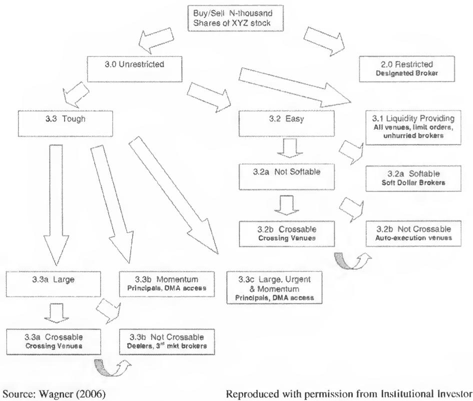  
Figure 7-1 A hierarchy of trading decisions

# 7.2 Assessing the difficulty of orders

Determining how difficul an order will be depends on a range of propertics. Wagner (2006) points out three such factors, namely large orders (relative to the ADV), unfavourable price momentum and urgency. Conversely, the key feature that makes trading easy is liquidity. Other asset specific properties such as volatility can also have a substantial effect.

One way of quantifying the potential order difficulty is based on historical results from transaction cost analysis (TCA). For example, Figure 7-2 shows the results of a proprietary liquidity and impaci cost analysis performed by Jacqueline King and Yan Yaroshevsky (2005) at Abel/Noser. They studied the realized costs for a sample of 1,500 equities across a range of different order sizes (shown as a percentage of the ADV). Let's examinc cach of these key factors in turn:

# Order size:

A large order executed immediately will generally cause significant narket impact. Anything over $2 0 { - } 2 5 \%$ of the ADV is a large trade and so is more difficult, whilst anything less than $1 \%$ is a small rade. Still, as we can sec in Figure 7-2 the effeet of order size is closcly linked to the asset's liquidity. A large order for a highly liquid asset will tend to causc much less market impact than for an illiquid one.

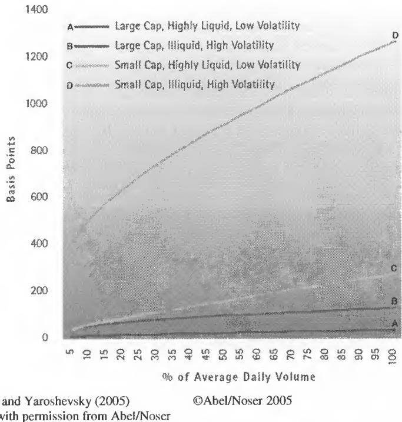  
Figure 7-2 Realized costs for different asset groups

Liquidity:

An asset's liquidity can also have a considerable effect on transaction costs, as Figure 7-2 shows. A lower bid offcr spread is commonly associated with liquid asscts, so the expected sprcad cost should be lowcr for these. For equities, the company's market capitalisation and turnover may be used as a proxy for liquidity. In the Abel/Noscr study, the market capitalisation ranged from $\$ 100$ million to $\$ 100$ billion. A large-cap stock has a valuc of grcater than $\$ 10$ billion, a small-cap is below $\$ 1$ billion and a micro-cap has a value under $\$ 100$ million. Likewisc, a higher relalive turnover means the stock is more liquid, so again we would expcct lower impact costs.

# Volatility:

An asset's volatility afccts both its expccted cost and timing risk. When combined with liquidity it can havc a massive effect on the overall costs. For instance, in Figure 7-2 there is a huge jump in costs for cquities which were illiquid with a high volatility (from around 400- 1200 bps) when compared to those which were highly liquid with a low volatility (from around 10-40 bps).

# Price momentum:

A persistent and favourablc price trend also makes trades easier. Still, the key to reducing costs is trading more passively so as to take advantage of the trcnd. Conversely, a pcrsistcntly adverse trend favours aggressive trading, so any delay will simply result in evcn worse cxccutions.

Trading aggressively over a small time horizon will often cause significant market impact. The key is to determine whether this is outweighed by factors such as pricc momentum or volatility. Either way, aggressive trading will probably be required to meet the trading goals.

Trading horizon:

The trade horizon is closely linked with the urgency. Comparing the order size to the ADV assumes that the trade horizon is for the entire trading day. So a shorter trading horizon can make executing the order more dificult. For instance, an order for $10 \%$ of the ADV received two hours before the close is much more difficult to trade than its order size alone might suggest.

Other factors can also have an effect. For example, Scott Lyden (2007) reporied on the importance of the time of day, noting that market impact for U.S. stocks was higher for trading in the first half hour after the open.

# 7.3 Selecting the optimal trading strategy

Having gauged the difficulty of the order, we now need to determine the best way to exccute it. Since the concept of best execution revolves around achieving the investor's objcctives, it is vital that these are considered. Therefore, we also need to know the:

● intended benchmark • level of risk aversion • desired trading goals

These will have a significant impact on our choice of strategy. Though, before we cover each of these factors in more detail, wc must first explain a concept known as the efficient trading frontier. This provides the basis lor comparing the expected costs and risks associated with different trading strategies, and so is a key part of the decision process.

# The efficient trading frontier

In Chapter 1, we saw the efficient frontier for portlolios proposed by Harry Markowitz (1952). This plots the optimal portfolio in terms of returns for dilferent levels of risk (or volatility). However, trading strategies are generally more focussed on cost, so Robert Almgren and Neil Chriss (20o0) proposed the efficicnt trading fronticr. They reasoned that rational traders would always seek to minimize expected costs for a certain level of risk. Hence, an optimal trading strategy was defined as one for which there were no alternatives with lower expected costs for the same degree of risk. The set of optimal solutions were termed the efficient trading frontier, consising of a single solution for cvery possible level of risk. In order to determine this frontier they sought to solve the following unconstrained optimization for the expected cost $E ( x )$ ..

$$
\operatorname* { m i n } _ { x } ( E ( x ) + \lambda V ( x ) )
$$

where $V ( x )$ corresponds to the expecied risk and $\lambda$ is a Lagrange multiplier introduced to relate to the various levels of risk. By plotting the optimal solutions on a chart of expected cost (or loss) against its corresponding variance (as a proxy lor risk), as shown in Figure 7-3, the convex nature of the efficient trading lrontier may clearly be seen.

The shaded region in Figure 7-3 represents the set of all possible strategies, whilst the solid curve shows the actual efficient trading frontier. Each point on this curve represents an optimal solution for a specific value of $\gimel$ . In terms of cost, strategy B has the lowest expected value, although focussing on minimising this has resulted in the highest risk of any of the optimal strategies. Note that the dashed curve highlights strategies for which there is an optimal alternative with both Iower expected cost and risk, namely strategy B.

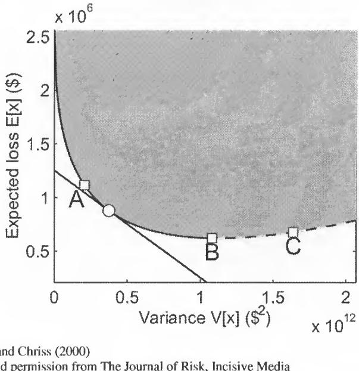  
Figure 7-3 An efficient trading frontier

Source: Almgren and Chriss (2000) Reprinted with kind permission from The Journal of Risk, Incisive Media

Based on equation 7-1 the gradient of the curve in Figure 7-3 corresponds to $- \lambda ,$ so the tangent shows the optimal strategy for $\lambda$ with a value of around $1 0 ^ { - 6 }$ (marked with a circle). In financial terms, the risk multiplier $\lambda$ corresponds to the level of risk aversion. A higher value signifies less willingness to accept possible variance and so infers a higher expected cost. In other words, a higher risk aversion implies more aggressive trading. Conversely, a lower value of $\lambda$ means less risk aversion; more passive trading results in lower expected costs, but with a higher variance. Thus in Figure 7-3 strategy A corresponds to a more aggressive strategy, whilst strategy B is the most passive optimal strategy.

Note that although variance is used in Figure 7-3 other risk measures may also be adopted. For instance, Almgren and Chriss (200o) also created a version for Value at Risk (VaR) whilst Robert Kissell and Roberto Malamut (2005b) normalised the frontier by plotting both cost and risk in terms of basis points.

Although the efficient trading frontier is an extremely useful theoretical concept, creating them can be time consuming since it requires the solution of the optimisation shown in equation 7-1 for every reasonable value of $\gimel$ To make things easier, Robert Kissell and Morton Glantz proposed an approximation by fitting an exponential decay curve to just a few specific strategies. More details may be found in Kissell and Glantz (2003).

# Choosing the benchmark

As we saw in Chapter 6, the benchmark can have a substantial cffect on the accuracy of performance measurcs. A similar result may be observed for the efficient trading frontiers, as highlighted in a study by Kissell and Malamut (2005b), shown in Figure 7-4. The expected costs and risks for each of these benchmarks are given in Table 7-1. We will cover the actual cost estimation models in morc detail in Chapter 10.

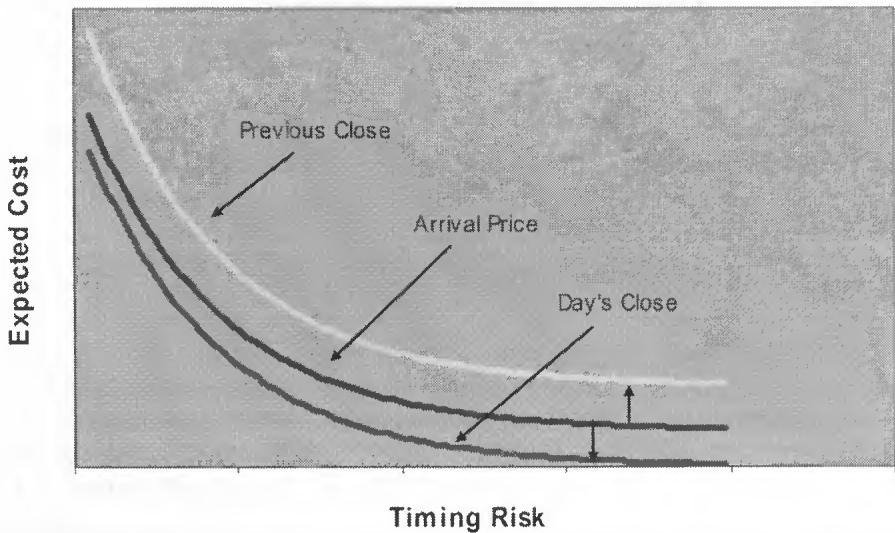  
Source: Kissell and Malamu1 (2005b) Rcproduccd with permission from Institutional Investor   
Figure 7-4 The efficient trading frontier for a range of different benchmarks

Source: Kissell and Malamut (2005 and 2005b)   

<table><tr><td rowspan=1 colspan=1>Bench-mark</td><td rowspan=1 colspan=1>Cost</td><td rowspan=1 colspan=1>Risk</td></tr><tr><td rowspan=1 colspan=1>PreviousClosing/OpeningPrice</td><td rowspan=1 colspan=1>Cost(α) = h(X, α)+g(X)+(p0 − pd)+ ε</td><td rowspan=1 colspan=1>R(α) =√σ2(ε(α))+σ2(p0− pd)</td></tr><tr><td rowspan=1 colspan=1>ArrivalPrice</td><td rowspan=1 colspan=1>Cost(α) =h(X, α)+ g(X)+ ε</td><td rowspan=1 colspan=1>R(α) = σ(ε(α))</td></tr><tr><td rowspan=1 colspan=1>FutureClosingPrice</td><td rowspan=1 colspan=1>Cost(α) = h(X, α) + ε</td><td rowspan=1 colspan=1>R(α) = σ(ε(α))</td></tr></table>

# Table 7-1 Benchmark expected costs and risks

An arrival price benchmark $( p _ { 0 } )$ gives the same expeccted cost and risk as we saw in Chapter 6. The cost consists of both temporary and permanent impact. The permanent impact $g ( )$ is based on the ordcr size $( X )$ whilst the temporary impact cost function $h ( )$ also depends on the trade rate $( \alpha )$ . The timing risk principally consists of the price volatility $\sigma ( )$ ,which in turn is bascd on an error factor (ε), this just represents random noise. 1

Using a pre-tradc benchmark $( p _ { \mathrm { { d } } } )$ earlier than the arrival price means an additional price change $( p _ { 0 } ~ - ~ p _ { \mathrm { d } } )$ must be considered. This corresponds to the delay cost. Therefore, benchmarks based on previous closing or opening prices must incorporate this into their expected costs and risks. In terms of expected cost, the efficient trading frontier will be shifted by this amount. The direction depends on whether the order is a buy or a sell. For instancc, assuming a buy order then a price rise will shift the frontier upwards, with the opposite effcct for a sell order. Similarly, the additional timing risk factor is reflected as $\sigma ^ { 2 } ( p _ { 0 } - p _ { d } )$ . This increased risk helps shift the frontier to the right in Figure 7–4.

In comparison, using a post-trade benchmark based on a future closing price will reduce the cxpccted cost. This is because the permanent market impact is alrcady accounted for in the future benchmark price. Hence, the estimated cost is just the temporary market impact (assuming no rcal price trend). Thus, the efficient trading frontier is shifted downwards by an amount cqual to the permanent market impact. Though, in terms of timing risk, it will be just like thc arrival price benchmark (since the time periods are the same).

Note that intraday benchmarks bchave somewhat differently, since they are based on prices throughout the day so they incorporate both temporary and permanent impact cost. Therefore, for a VWAP benchmark it is possible to minimise both cost and timing risk by participating evenly with the day's volume.

The benchmark choice can clearly affect the efficient trading frontier, and so it can alter the optimal choice of trading strategy. For instance, Figure 7-5(a) shows the two fronticrs depending on whcther the arrival price or the previous close is uscd as the benchmark. Given the samc target cost $\mathrm { C } _ { 1 }$ , the shifted efficicnt trading fronticr for the previous close benchmark results in an optimal strategy $( X _ { 2 } )$ , which has a higher risk $( \mathbf { R } _ { 2 } )$ than the corresponding optimal strategy $( \mathbf { X } _ { 1 } )$ for an arrival price benchmark.

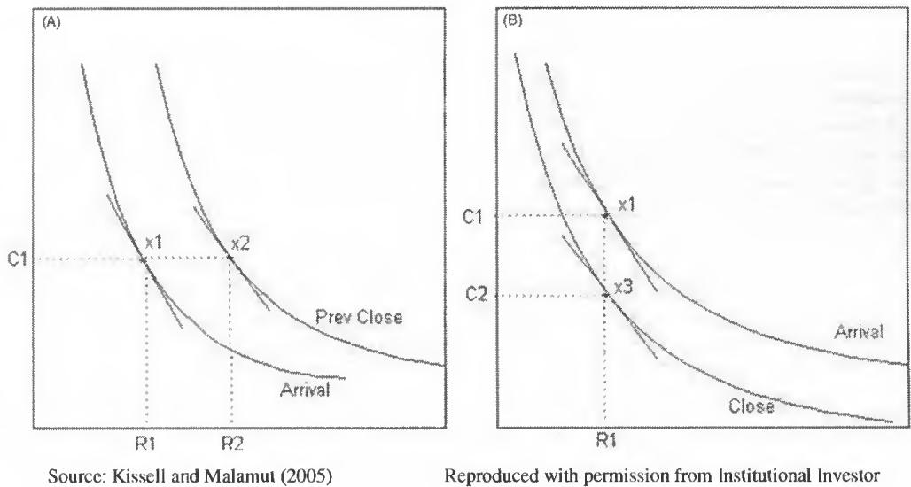  
Figure 7-5 The effect of benchmarks on implementation goals

Conversely, given the same timing risk $( \mathbf { R } _ { 1 } )$ , Figure 7-5(b) shows how using the day's close price as a benchmark will have a lower expected cost $\left( \mathbf { C } _ { 2 } \right)$ when compared to using the arrival price $\mathbf { ( C _ { 1 } ) }$ , due to the closing price incorporating permanent market impact.

# Determining the level of risk aversion

Risk aversion directly affects the aggrcssivcness of a trading strategy. A high level indicatcs that timing risk is not acceptable and so the strategy should be more aggressive to try to complete fastcr. This incrcases the expected cost due to market impact. Alternatively, a low level suggests that minimising market impact is morc important.

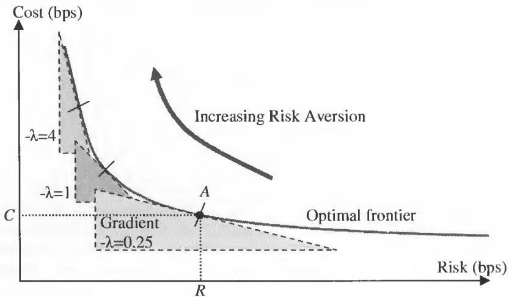  
Figure 7-6 Risk aversion

Kissell and Malamut (2005b) highlighted this relationship between the risk aversion parameter $( \lambda )$ and trading style by plotting a normalised efficient trading frontier. As Figure 7-6 shows, both thc cost and timing risk axes are expressed in terms of basis points. Hence, the values of $\lambda$ are much clearer, ranging from 0 to 3, raiher than ${ { 1 0 } ^ { - 6 } }$ to $1 0 ^ { - 7 }$ . They observed an approximately linear relationship betwcen the risk aversion parameter $( \lambda )$ and an invcstor's level of concern about risk relativc to cost. For example, a value of $\lambda = 1$ in Figure 7-6 represents an investor who is equally conccrned about both risk and expected cost, whereas for $\lambda = 0 . 5$ the investor is only half as concerned about risk. The gradient $\gimel$ also corresponds to the total trading time. A higher value of $\gimel$ suggcsts more urgency and so a shorter horizon, whilst lower values suggest a more patient approach.

# Choosing a trading goal

Having specified both a benchmark and the level of risk avcrsion, we can now start to focus on finding the optimal trading strategy. Robert Kissell, Morton Glantz, and Roberto Malamut (2004) outline three distinct trading objectives, namely to:

Minimizc the cxpected cost for a givcn level of risk Achieve pricc improvement ovcr a given level of cost Balance the trade-off between expected cost and risk

Different types of investors may prefer specific goals; those driven by exposure will oftcn

choose to fix their expected risk, whilst information-driven investors may sclcct price improvcmcnt to maximizc the short-term rcturns.

# Minimize cost

The cfficient trading fronticr rcpresents the sct of optimal trading strategies; they offer the lowcst cxpected cost for each spccific level of risk. Therefore, for a given level of risk we can find thc optimal strategy simply by finding the corrcsponding point on the frontier. The optimal stratcgy A lies on the fronticr with an estimated cost $C$ and risk $R$ , as Figure 7-6 shows. In comparison, suh-optimal strategies lie above the frontier, and so achieve the same lcvcl of risk, but with a much higher expected cost.

# Price improvement

Roberto Malamut proved that the optimal price improvement strategy to beat a specific cost (C) could be found from the tangent of a line drawn from (O, C) to the efficient trading fronticr.

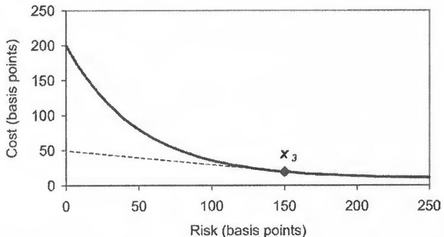  
Figure 7-7 Maximising the likelihood of price improvement

Source: Kissell, Glan1z, and Malamut (2004) Copyright $^ { © }$ Elsevier 2004 Reproduced with permission from Elsevier

This is shown as strategy $X _ { 3 }$ in Figure 7-7, with a timing risk of 150 bps it offers the most chance of beating the expected cost of 50 bps.

# Balancing the trade-off between cost and risk

Minimising the ovcrall cost of trading is made more dificult by the fact that its two main components movc in opposite directions. Impact cost may be reduced by more passive trading, whilst timing risk may be lowered by trading more aggressively. Kissell and Glantz (2003) tcrm this optimisation problem the trader's dilemma. As we saw in Figure 7-6, each lcvel of risk aversion $\gimel$ has a corresponding optimal strategy. At this point, the slope of a line tangcnt to thc efficicnt trading frontier cquals $- \lambda$ . We can use this fact to determine the optimal cost profile for a given $\gimel$ , simply by sliding a line with a slope of $- \lambda$ until it becomes a tangent with the fronticr curve. Thus, in Figure 7-8 the optimal strategy where $\lambda { = } 1$ is $X _ { 2 } .$ which has an expccted cost of 62 bps and a risk of 65 bps.

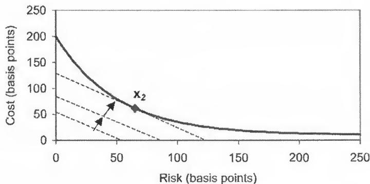  
Figure 7-8 Balancing the trade-off between cost and risk

Source: Kissell, Glanlz, and Malamut (2004) Copyright $^ ©$ Elsevier 2004 Reproduced with permission from Flsevier

# Determining the optimal trading horizon

Understanding the optimal trading horizon can be very useful, even for orders which are intended to be traded Vw AP over the day (if only to confirm they are viahle to tradc over a single day). Figure 7-9 shows the various costs/risks for an example strategy as they vary over time. We can construct the total cost curve by summing the market impact and timing risk for different levels of risk aversion $( \lambda )$ based on equation 7–1.

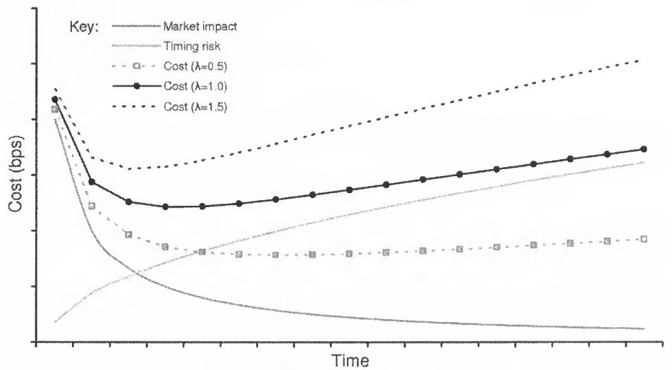  
Figure 7-9 Trading strategy optimisation

From this, we can then determine the trading horizon that achieves the minimum overall cost. This time span could be used to guide an implemcntation shortfall algorithm, or converted into a target volume paricipation rate, based on the historical volume profile or ADV. Kissell and Malamut (2005b) go on to derive a solution for the minimum cost in terms of the optimal trading rate.

# 7.4 Choosing between trading algorithms

So far, we have seen how various factors can affect strategy choice, but how does this actually translate to selecting different trading algorithms?

Firstly, we shall map the trading algorithms onto an example efficient trading frontier. This will allow us to compare the suitability of specific algorithms for set objectives. To choose the optimal algorithm for a given order, we would need to create an efficient trading frontier tailored for its specific details. This will incorporate the factors we saw in section 7.2 when assessing the difficully of orders. Hencc, we will examine how these conditions aflect both the cfficient trading fronticr and our ultimate choice of the optimal strategy. We will also consider some of the essential requirements for trading algorithms, and see how factors such as data availability and market structure limit our choice.

# Mapping algorithms to the efficient trading frontier

As wc have seen, the eficient trading frontier allows traders and investors to see the potential costs and risks ol a wide range of trading strategies, from which they may then select their preferrcd approach.

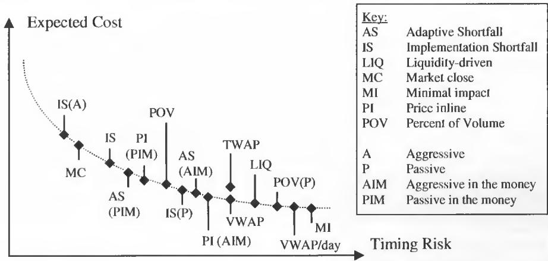  
Figure 7-10 Differentiating algorithms using an efficient trading frontier

In order to map trading algorithms onto this, we would nced to determine estimates for each of their expccted costs and timing risks and then overlay these on an efficient trading frontier for the prospective order. Figure 7-10 tries to illustrate this for an example order. Note that this is merely an ilustration, to highlight the relative differences between algorithm types. Clearly, specific instances may perform differently. Also not all algorithms may even be on the efficient fronticr, since there may be better alternatives.

Notice that for some algorithms Figure 7-10 also includes aggressive (A), passive (P) and ncutral versions. As we have seen, more aggressive trading generally implies higher cxpected costs, although interestingly the price adaptive mechanisms (e.g. aggressive-in-themoney (AIM)) actually have the opposite effect.

Impact-driven algorithms tend to appear towards the right hand side of the elficient trading frontier, exhibiting lower expected cost but higher risk, as we might expect.

VWAP:

The VWAP algorithm concentrates on minimizing market impact, by splitting the order into quantities based on the historical volume profile. Although for smaller orders this may unnecessarily prolong trading, causing additional risk exposure. So, a VWAP order Ieft to trade through the whole day has one of the highest associated risks. This may be used as a reference point on the efficient trading frontier, labelled as VWAP/day in Figure 7-10. Simply by reducing the trading time to one appropriate for the order size, the risk may be considerably reduced (labelled VW AP). Notice that the cost does not significantly increase to achieve this.

TWAP:

In Figure 7-10, TWAP is shown as the only algorithm not to be actually on the eflicient trading frontier. This is because when a TWAP algorithm splits an order it does not take into aceount market conditions. So it may incur additional market impact compared to other algorithms (except for small orders or very liquid assets). Still, in terms of risk it is similar to VWAP, either spread over the whole trading day or for a shorter period. Thus, TWAP is shown directly above VWAP on the efficient trading frontier. (Note that for venues where volume information is not available TW AP is a viable alternative to VW AP.)

Percent of volume (POv):

POV algorithms have a similar goal to VW AP, namely minimization of market impact. The only real difference between the two approaches is that the trading trajectory for a POV algorithm is generated dynamically, based on a fixed proportion of the actual market volume. Since its participation is based on the curent market volume, each order is more likely to complete in a timescale appropriate for its size. Consequently, the timing risk should be reduced compared to VWAP, although the market impact cost may be slightly higher to achieve this. So, on the efficient trading frontier, POV algorithms are positioned to the just left of VWAP, whilst still exhibiting more risk than implementation shortfall algorithms. Note that the aggressiveness of a POV algorithm may be inferred from its participation rate, $- 5 \%$ is relatively passive, so this appears to the right of VW AP on the frontier.

# Minimal impact:

By focusing solely on minimising the overall market impact cost, these algorithms take on a higher level of timing risk. Consequcntly, they appear on the right hand side of the cficient trading frontier.

Cost-driven algorithms attempt to balance both cost and risk. Therefore, they will tend to be more in the centre of the eficient trading frontier. Although aggressive versions will be closer to the left hand side, achieving lower risk, but at a higher expected cost.

Implementation Shortfall (IS):

These algorithms seek to minimize both market impact and risk, often by determining the optimal rate of trading. They tend to trade more quickly than VWAP or POV algorithms, resulting in a lower timing risk. Though, this redueed risk is achieved at a slightly higher expected cost. Thus IS trading algorithms using aggressive (A) or neutral trading styles appear to the left of POV on the efficient trading frontier shown in Figure 7-10. Only the passive (P) style exhibits lower cost, although this still has lower timing risk than VWAP.

Market close (MC):

These algorithms aim to match or better the future closing price. Whereas an implementation shortfall algorithm calculates an optimal trade duration, MC algorithms reverse this proccss to determine an optimal start time. Since their target price is subject to the same timing risk, this offsets some of their risk. However, the closing period is often more volatile and so MC algorithms will often incur higher costs. As a result, they are positioned just to the left of implementation shortfall on the eficient frontier, with lower risk, but higher expected costs.

# Adaptive Shortfall:

An aggressive in-the-money (AIM) adaptive shortfall algorithm hecomes more aggressive with favourable prices. As Kissell and Malamut (2005b) highlighted this results in a skewed distribution of returns between rising and faling markets. In comparison, algorithms with a low sensitivity to price movements (such as POV) have a more symmetrical distribution of returns. We can clearly see this in Figure 7-11 (a) taken from their study, where the AlM adaptive shortfall algorithm is compared with a constant trade rate (POV) algorithm. Since the AIM price adaptation takes advantage of better market conditions, it achieves a lower expected cost (C3). The downside is that this approach will be increasingly exposed to risk in adverse conditions, since it will be more passive as the price becomes unfavourable. This also helps explain thc skewed cost distribution. Therefore, in terms of the efficient trading frontier the AIM adaptive shortfall (AS) algorithm will be to the right of the POV algorithm.

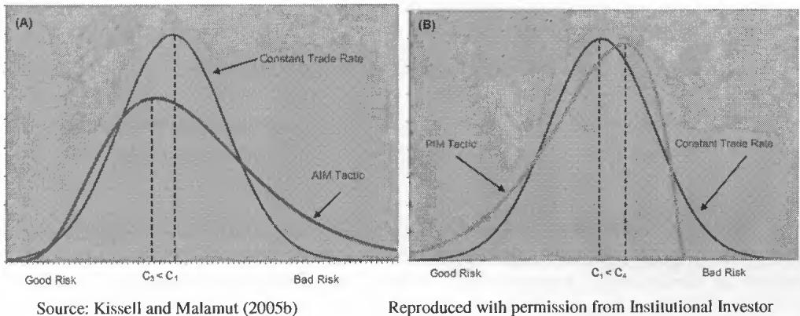  
Figure 7-11 Cost distribution of adaptation tactics

Converscly, the passive in-the-money (PIM) version becomes more passive with favourable prices, again shown in Figure 7-11 (b). Therefore, it has a higher expected cost (C4) but a lower overall risk; so it is sited to the left of POV on the frontier.

Note that since adaptive shortfall algorithms are sensitive to timing risk their rate of trading docs not change pace quite as rapidly as a purely price inline algorithm. The net result is that whilst the effective cost of an AIM adaptive shortfall algorithm is still lower than a POV algorithm it is slightly more than that of an aggressive price inline algorithm. So it sits between these two algorithms on the efficient trading frontier.

The opportunistic algorithms are slightly more difficult to placc on the efficient trading frontier. They can aggressively take advantage of favourable conditions, although this can lead to substantial impact costs. They are also prepared to wait passively until the market conditions become favourable, exposing them to timing risk.

Price Inline:

As we have already seen for the adaptive shortfall algorithm, an AIM price inlinc algorithm has a skewed cost distribution. We can see this most clearly when compared with a POV algorithm as shown in Figure 7-12, again taken from the study by Kissell and Malamut (2005b). Note the price inline algorithm is labelled as "Target". Thus, the AlM pricc adaptation takes advantage of better market conditions, achieving a lower cxpccted cost (C2), but cxposing it to higher overall risk. Therefore, on the efficient trading frontier the aggressive PI(AIM) algorithm will be to the right of the POV algorithm. On the other hand, the reversed behaviour of the passive in-the-money (PIM) version is eflectively a mirror image resulting in a lower overall risk (but higher cost) and so is sited to the left of POV on the efficient frontier.

Source: Kissell and Malamut (2005b)

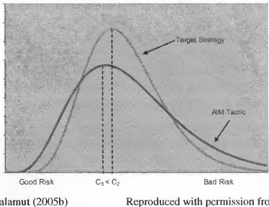  
Reproduced with pcrmission from Institutional Investor   
Figure 7-12 Cost distribution of an AIM price inline algorithm

Liquidity-driven:

A liquidity-driven algorithm will trade fairly aggressively when there is liquidity, but at other times it simply will not trade. Some controls on the permitted level of participation will prevent the market impact being too high. However, the algorithms do not gencrally account for timing risk. So in Figure 7-10 the optimal liquidity-seeking algorithm is positioned just to the right of the price adaptive AIM based strategics. Though, it is arguahle that diflerent versions of the algorithm might be placed anywhere on the frontier between VWAP/day and implementation shortfall.

# Pairs:

A pair trading algorithm has a degree of inbuilt hedging, provided the relationship between the two asset prices behaves as we expect. So gains (or losscs) on asset B should hopefully offset any losses (or gains) on asset A. Still, if the relationship hreaks down the strategy may exposc us to more risk. There is also an issue if there is a sizable diference in liquidity between the two assets; significant legging will mcan a higher exposure to risk. Therefore, it is hard to plaece pair trading algorithms on Figure 7-10. Given a suitable pair, the optimal pair trading algorithm could achieve a similar cxpected cost to VW AP, but with less risk. Whilst a suh-optimal pair may require much more aggressive trading in order to try to minimise the risk.

Again note that these summaries merely give an indication of how the various trading algorithms might be positioned on an efficient trading fronticr, actual versions may perform slightly differcntly.

# Factors affecting algorithm choice

When sceking the optimal trading strategy it is vital to balance the investor's objectives with the factors that dictate the overall difficulty of trading. Consequently, the choicc of algorithm/strategy is dictated by factors such as:

Investor requiremcnts (e.g. benchmark, risk aversion and trading goals) Order specific properties (c.g. size) Asset specific propertics (c.g. liquidity, volatility and pricc trends)

Each of these can havc a considcrable effect on the overall cost. For instance, Figure 7-13 shows how both order sizc and asset volatility incrcasc the overall cost for a pcrcent of volume (POV) algorithm.

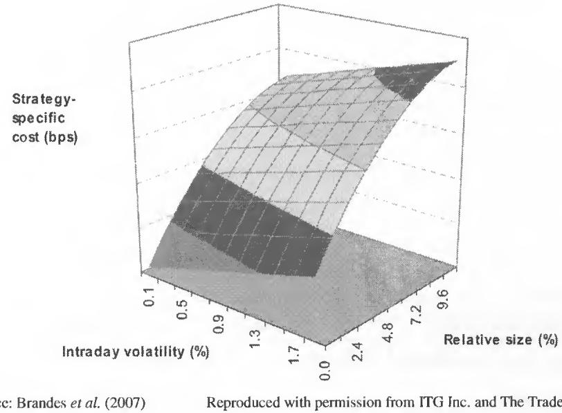  
Figure 7-13 Relating cost to order size and volatility

This cost estimatc is bascd on performancc data from ITG Inc., reportcd in a study by Yossi Brandes et al. (2007). We can therefore use such historical performancc data to guide our choice. If the projcctcd cost is too high then we can repeat the process for other types of algorithm until we find the one that is closest to matching our requirements. In the following sub-sections, we shal cxamine the effect of cach of these factors.

# Investor requirements

The invcstor's rcquirements are clearly also a key determinant in the choice of trading algorithm, in much the same way as we saw for the optimal strategy sclection.

# Benchmark

The choice of benchmark aflects the efficient trading frontier, as we saw in Figure 7-4. If the benchmark is the arrival or decision price then implementation shortfall is probably the most

appropriate algorithm. If it is VWAP then a VWAP algorithm makes most sensc.

# Risk aversion

A high risk aversion suggests an aggressive trading style, whercas a low aversion means morc passivc algorithms may be used. For example, Figurc 7-14 shows the relationship between cost and risk aversion for an opportunistic algorithm (ITG Active) and a more aggressive implementation shortfall based approach (ITG ACE), based on a review by Jian Yang and Brett Jiu (2006). At low lcvels of risk aversion, the more opportunistic algorithm proves cost cffcctive, whilst at higher levels the implementation shortfall algorithm performs best. A similar effect might be secn if we replaced the opportunistic algorithm with an impact driven onc, such as VWAP. In terms of thc cfficient trading fronticr, a high risk aversion suggests a shift towards more aggressive algorithms on the left hand side of the fronticr, whilst a low aversion implies a shift to the right.

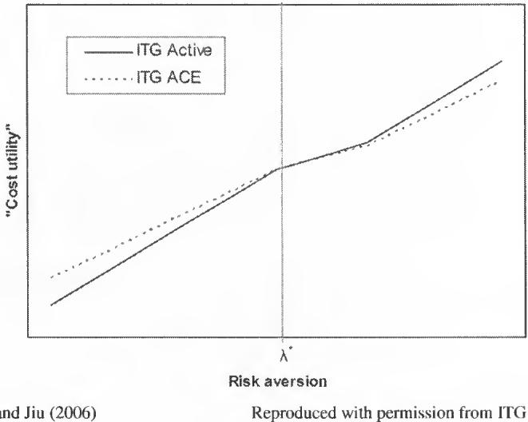  
Figure 7-14 Relating cost to risk aversion

# Trading goals

If the goal is to minimise the expected cost, then we can achieve that by finding the algorithm whosc projected risk is the closest match for the required level. Whereas if the goal is to achieve a balance betwcen cxpected cost and risk then cost-driven algorithms such as implementation shortfall may be the most appropriate choice. Alternatively, if pricc improvement is the main focus then perhaps an opportunistic liquidity-driven algorithm or a passivcly priced impact-driven algorithm is more suitable.

# Order specific factors

From section 7.2, we have already seen the cffect order-specilic propertics, such as sizc and trading horizon, can have on the difficulty of an order. Hence, this can also affect our choicc of algorithm, based on the expccted cost and risk.

# Order size

Larger order sizes generally mean incrcased transaction costs. Trying to execute a large ordcr immediately will cause significant market impact. Converscly, splitting it into smaller child orders and working these over time will expose it to timing risk. Therefore, most algorithms exhibit increased costs as order size inereases. However, the magnitude of these inereases can vary markedly across different algorithms. Figure 7-15 highlights this for a range of algorithms trading low volatility stocks, taken from a study by ITG Inc.

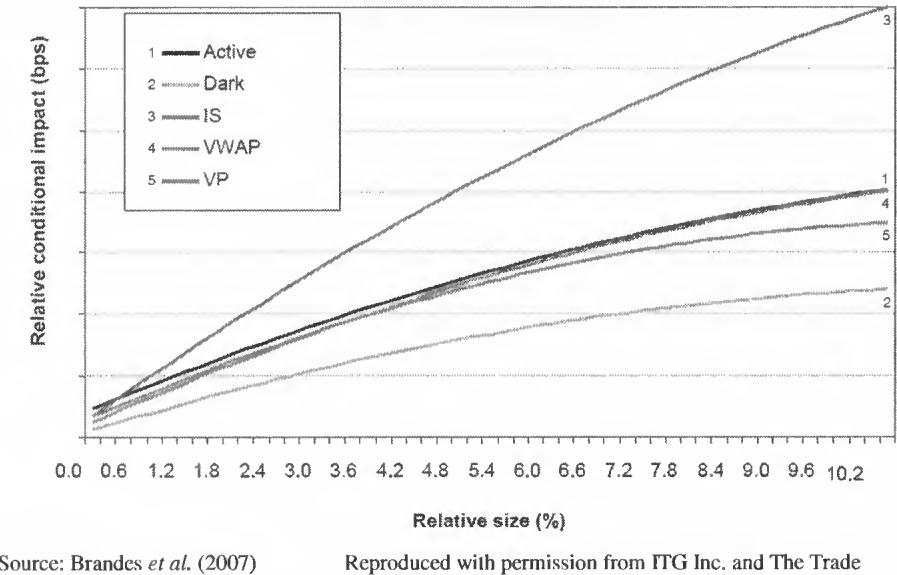  
Figure 7-15 Relating impact cost to order size for a range of algorithms

Clearly, the opportunistic stealth-driven algorithm (labelled "Dark") performs the best. In part, this is due to its successful minimisation of signalling risk by using IOC orders and hidden trading at "dark pool" ATSs. The impact-driven algorithms perform reasonably well, with VWAP outperforming POV at the highest order sizes. Though, the implementation shortfall (IS) algorithm fares the worst for large orders. The size of difference between this and VW AP is interesting, suggesting that they may have been executed more aggressively, resulting in higher market impact.

If the order size is sufficiently large, then it may be worth considering trading over multiple days, depending on price trends and volatility. In comparison, the choice of algorithm has much less effect for small orders. An order for ${ < } 1 \%$ ADV will probably attain similar results with either VW AP or implementation shortfall.

In terms of the efficient trading frontier, the potential cost of large orders tends to shift the selection to the more passive (but riskier) algorithms on the right hand side of Figure 7-10. In other words, a participation or VWAP algorithm may be preferable to implementation shortfall for large orders.

# Trade horizon

The trade horizon is usually specified by the order's start and end-time parameters. This is also related to the order size, since we can determine an estimate for the optimal horizon based on the ADV and the desired trading rate.

Clearly, a trade horizon that is shorter than the optimal one is more aggressive, although meeting this requirement can lead to excessive market impact costs. Whereas, if the horizon is much longer than optimal then there can be substantial timing risk. For instance, a small order worked throughout the entire trading day is exposed to unnecessary risk since it could have easily been completed much earlier. As we saw for order size, there will tend to be less difference in performance for short horizons compared to longer ones.

So in terms of algorithm selection, shorter horizons will therefore favour a more aggressive trading, such as a percent of volume or even an implementation shortlall algorithm. Longer horizons favour more passive, impact-driven algorithms, such as an allday VWAP.

# Asset specific factors

Asset-specific factors, such as liquidity and volatility, also affect algorithm choice sincc they reflect the difficulty of an order, as we saw in the trading cosis back in Figure 7-2.

# Liquidity

Liquidity can have a considerable effect on market impact. In facl, it can counteract some oI the effects of order size, since a large order for a highly liquid asset will tend to cause less impact than for an illiquid one. Signalling risk can also be an issue for less liquid assets, even for quite small orders.

Since a liquid asset will be easier (and so cost less) to trade than an illiquid one this tends to widen the potential choice of optimal algorithms. Conversely, an illiquid asset limits the choice to more specialised algorithms, such as liquidity-driven ones.

# Volatility

An asset's volatility affects both its expected cost and timing risk. So for volatile assets it is generally better to select an algorithm that is risk sensitive. In other words, algorithms that achieve lower timing risk such as implementation or adaptive shortfall algorithms.

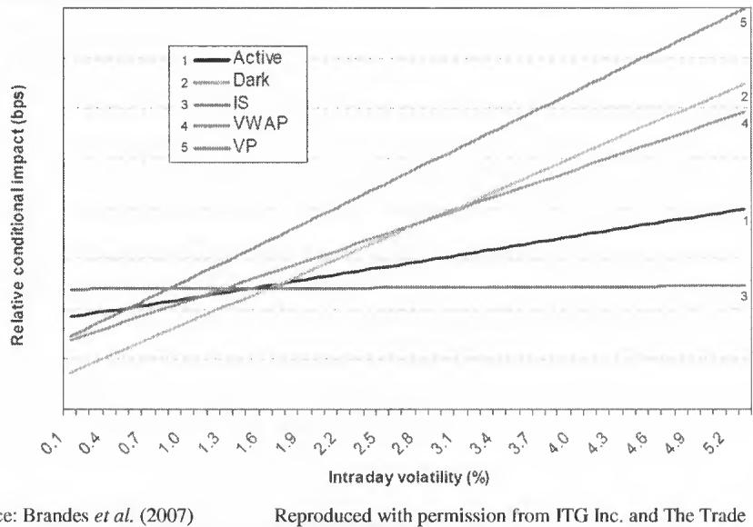  
Figure 7-16 Relating impact cost to volatility for a range of algorithms

We can clearly see this in Figure 7-16, which shows the results of the study by Brandes et al. (2007). As the intraday volatilily increases, the cost barely changes for the implementation shortfall (IS) algorithms. The impact driven VWAP and percent of volume (labelled VP) algorithms fare less well, both suffering increased costs as volatility increases. This is hardly surprising since they have no inbuilt price sensitivity. Certainly, the percent of volume algorithm is the most affected; Brandes et al. reason that this is due to the fluctuation of market volume in reaction to price movements. The opportunistie algorithms are also affected, hut somewhat less than the impact-driven ones. For example, ITG Active, a liquidity seeking algorithm which uses dynamic pegging, seems to cope with short term price moves nearly as well as an implementation shortfall algorithm.

For lower volatility assets, timing risk is less of an issue and so the potential reduced costs of volume participation make impact-driven or even opportunistic algorithms more suitable.

# Price trends

A persistent and favourable price trend allows us to reduce costs by trading more passively. Whilst an unfavourable trend requires more aggressive trading, since any delay wil simply result in even worse executions. Therefore, if we are confident of a price trend persisting then we should consider using algorithms from the appropriate side of the effieient trading frontier in order to benefit most. For instance, a more passively traded VWAP algorithm may perform better for favourable price trends. Alternatively, an implementation shortfall algorithm is more appropriate to prevent losses from an unfavourable price trend. Note that the level of aggressiveness needs to be appropriate for the size of the expected price trend; otherwise, the increased market impact costs will counteract any gains/savings.

Price adaptive algorithms, such as price inline or adaptive shortfall may also be used to take advantage of trends. As we have seen these give a more skewed distribution of expected costs, with aggressive in-the-money (AIM) strategies achieving a lower cost but higher risk, whilst passive in-the-money (PIM) versions do the opposite. If the price trend is short-lived or mean reverts then an aggressive (AIM) approach may be more appropriate. Though, if the trend persists then the passive in-the-money approach may offer the best results.

So in terms of the efficient trading frontier favourable and persistent trends shift the selection to the more passive (but riskier) algorithms on the right hand side of Figure 7-10, whereas unfavourable trends shift it to the left.

# Summary

The efficient trading frontier can also be used to summarise the effect these factors have, as

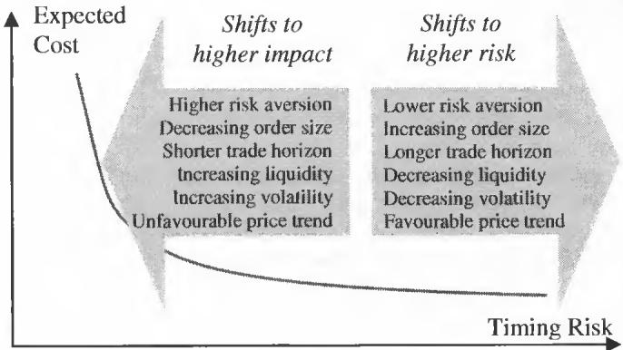  
Figure 7-17 Factors which influence trading choice

Figure 7-17 shows. Unsurprisingly, urgency, risk aversion, and volatility all tend to bias the strategy selection towards more aggressive trading with lower risk, but potentially higher impact costs. Conversely, larger orders and favourable price trends tend to cncourage a more passive approach with lower impact costs, but potentially higher risk.

# Other requirements for trading algorithms

So far, we have focussed on the theory of algorithm selcction. In the real world, basic requirements such as market structure and data availability also limit our choices. Obviously, algorithms need electronic access to make requcsts or place orders. Market data is another key requirement for trading algorithms, without it they are blind. Hence, the availability of pre- and post-trade market data is vital for most strategies.

Market structure also plays its part. In a single dealer environment there is little point in splitting up an order (unless it is huge and even then it is debatable). Instead, it makes more sense to discuss with the dealer how best to work the whole order. Therefore, to cven consider using trading algorithms the market should have multiple dealers/market makers. Conversely, markets that are very fragmented are more difficult to tradc in than centraliscd ones, so this will also affect algorithm choice.

Asset specific factors such as liquidity and trade frequency may also he broadly generalised by asset class. For instancc, cquities tend to be more liquid than most bonds. Thus, characteristics of the asset class can also affect algorithm choice.

# Data requirements

Trading algorithms rely on market data in order to function. Although market transparency is increasing, there are still marked differences between the world's markets, both for pre- and post-trade information.

Pre-trade prices can be delivercd in streams, either from a markct data vendor, direct from the execution venue or via a request for stream (RFS) type mechanism. They may also be gathered via a request for quote (RFQ) mcchanism. Although the considerable latency associated with an RFQ-based approach means that it is only really viable for strategies that will not be generating a lot of small child orders.

Post-trade data needs to provide accurate information on trade prices, sizcs and times (and if possible any countcrparty information). For some markets, such information simply has not becn available. For example, in the carly days of adoption in the FX markets some venucs only provided traded prices but not sizcs.

Many algorithms track the traded volume, so if this is not available the choice will be scverely restricted. Likewise, if the data is available but only after a considerable dclay then it is of little use to algorithms such as percent of volumc. Post-trade data is also needed to create historical volume profiles, as well as for many of the models that algorithms use to estimate cxecution probability or costs.

Order book data is necessary for any strategics that are bascd on the available liquidity. Clcarly, this must be available in real-time for any algorithm which actively tracks liquidity. Historical order book data may also be required for lirnit order and cost modcls.

Even the most basic trading algorithms need access to real-time best bid and ofler priccs, otherwise they risk placing orders significantly away from the market. The alternative is to only cver issuc market orders. More complex trading algorithms ohviously have more stringent requirements, as outlined in Table 7–2.

'Table 7-2 Basic data requirements for common trading algorithms   

<table><tr><td rowspan=2 colspan=1>Algorithm</td><td rowspan=1 colspan=3>Real-time</td><td rowspan=1 colspan=1>Historical</td></tr><tr><td rowspan=1 colspan=1>Prices</td><td rowspan=1 colspan=1>Trades</td><td rowspan=1 colspan=1>Order book</td><td rowspan=1 colspan=1>Trades</td></tr><tr><td rowspan=1 colspan=1>TWAP</td><td rowspan=1 colspan=1>•</td><td rowspan=1 colspan=1></td><td rowspan=1 colspan=1></td><td rowspan=1 colspan=1></td></tr><tr><td rowspan=1 colspan=1>VWAP</td><td rowspan=1 colspan=1>●</td><td rowspan=1 colspan=1>0</td><td rowspan=1 colspan=1></td><td rowspan=1 colspan=1>●</td></tr><tr><td rowspan=1 colspan=1>Percent of Volume</td><td rowspan=1 colspan=1>●</td><td rowspan=1 colspan=1>●</td><td rowspan=1 colspan=1>0</td><td rowspan=1 colspan=1>0</td></tr><tr><td rowspan=1 colspan=1>Implementation shortfall</td><td rowspan=1 colspan=1>●</td><td rowspan=1 colspan=1>0</td><td rowspan=1 colspan=1>0</td><td rowspan=1 colspan=1>0</td></tr><tr><td rowspan=1 colspan=1>Liquidity-bascd</td><td rowspan=1 colspan=1>●</td><td rowspan=1 colspan=1>0</td><td rowspan=1 colspan=1>●</td><td rowspan=1 colspan=1>0</td></tr></table>

Required $\circ$ Of en needed

As we saw in Chapter 5, some of the earlier statically-driven algorithms can survive based on historical data. So for markets with the bare minimum of electronic access and multiple dealers the only really viable trading algorithm is simple order slicing or TWAP. Consequcntly, they are available for most types of market or asset class.

VWAP algorithms require detailed trade information in order to construct their volume profiles. Likewise, percent of volume (POV) algorithms need trade reports in real-time in order to track the market volume. In fragmented markets, some brokers/vendors have also started to crcate their own proprielary measures, hased on aggregated data.

Implementation shortfall (IS) algorithms need to carefully track the current price and the potential risk in order to minimise the overall cost. Therefore, these algorithms need as much help as they can get, otherwise their performance will sulfer. Although we might possibly be able to get a shorfall-based algorithm to work for an RFQ based market, it is debatable whether this approach is worthwhile.

Similarly, liquidity-driven algorithms need readily available order book information. If this is limited then algorithms wil have to rely more on estimates, which may substantially reducc their efficiency. Signaling risk is obviously a key concern, so again the market needs to support anonymous trading. Given the opportunistic nature of such algorithms, latency can also be a key consideration for them.

Other information such as fees for routing and/or clearing/settlement may also nced to taken into account; otherwise, unexpected costs may be incurred.

# Market structure

Each of the world's major markets has their own specific characteristics, as we saw in Chapter 3. Equities and listed derivatives are traded at centralised venues, although admittedly there is considerable fragmentation in some of these markets. In comparison, OTC trading is stil the norm for a lot of fixed income trading. Although clearly there are cxceptions, such as the U.S. Treasury market which is so large that its inter-dealer market is not that different from the major U.S. exchanges.

Given their well-established central markets with a range of highly liquid assets, the cquitics markets were the perfect starting place for algorithmic trading. As we have already seen, the algorithms have progressed from simple order slicing to VW AP, implementation shortfal and liquidity-based algorithms. However, not all algorithms are equal; some are more applicable across a range of asset classes than others, as Table 7-3 tries to show.

Simple order slicing or TWAP algorithms are a basic starting point for every asset class, since they have the least rcquirements.

Volume-driven algorithms, such as VWAP, make most sense for centralised markets. This is because there only needs to be one set of trade reports, so it is easy to track the market

• High o Medium   

<table><tr><td rowspan=1 colspan=1>Algorithm</td><td rowspan=1 colspan=1>Equities</td><td rowspan=1 colspan=1>Bonds</td><td rowspan=1 colspan=1>FX</td><td rowspan=1 colspan=1>Futures</td><td rowspan=1 colspan=1>Options</td><td rowspan=1 colspan=1>ETFs</td></tr><tr><td rowspan=1 colspan=1>TWAP</td><td rowspan=1 colspan=1>0</td><td rowspan=1 colspan=1>0</td><td rowspan=1 colspan=1>0</td><td rowspan=1 colspan=1>。</td><td rowspan=1 colspan=1>O</td><td rowspan=1 colspan=1>0</td></tr><tr><td rowspan=1 colspan=1>VWAP</td><td rowspan=1 colspan=1>●</td><td rowspan=1 colspan=1>0</td><td rowspan=1 colspan=1></td><td rowspan=1 colspan=1>•</td><td rowspan=1 colspan=1></td><td rowspan=1 colspan=1></td></tr><tr><td rowspan=1 colspan=1>Pereent of Volume</td><td rowspan=1 colspan=1>●</td><td rowspan=1 colspan=1>0</td><td rowspan=1 colspan=1>0</td><td rowspan=1 colspan=1>•</td><td rowspan=1 colspan=1></td><td rowspan=1 colspan=1></td></tr><tr><td rowspan=1 colspan=1>Implementation shortfall</td><td rowspan=1 colspan=1>●</td><td rowspan=1 colspan=1>●</td><td rowspan=1 colspan=1>●</td><td rowspan=1 colspan=1>•</td><td rowspan=1 colspan=1>●</td><td rowspan=1 colspan=1>•</td></tr><tr><td rowspan=1 colspan=1>Liquidity-based</td><td rowspan=1 colspan=1>●</td><td rowspan=1 colspan=1>•</td><td rowspan=1 colspan=1>●</td><td rowspan=1 colspan=1>•</td><td rowspan=1 colspan=1>•</td><td rowspan=1 colspan=1></td></tr></table>

# Table 7-3 Applicability of current trading algorithms across different asset classes

volumc. As markets become more fragmented, the volumes for each venue nccd to be tracked. fn order to give meaningful results these algorithms really nced to track the total market volumc. For instance, if the main market only has around $5 0 \%$ of the total trading volume then VWAP or POV algorithms, which only consider the volume traded hcre are missing half the picture. Thus, aggregated market data feeds have become incrcasingly important. If there is a unified source of pre- and post-trade information, this is straightforward; otherwise, we will have to create our own. This also makes transaction cost analysis and performance monitoring more diffieult.

Hence, going forward the two most applieable types of algorithm are the implementatior shortfall and liquidity-based approaches.

# Asset-class specific factors

There are considerable differences between asset classes in terms of the:

Number of assets available Liquidity Frequency of trading / average trade size

The FX market has easily the lowest number of tradable assets; hence, these are highly liquid. Conversely, there are hundreds of thousands of distinct honds and options, so any one generally has much less liquidity than a corresponding equity.

Trading activity is linked to liquidity and the number of available assets. It is also affeeted by investors' objeetives. For instance, bonds are often bought and held, so after an initial flurry on their first issuance the trading activity quickly subsides. It is not uncommon for corporate bonds to trade less than once a day, on average. fn comparison, cquities are often held for shorter periods, hence their much higher levcls of trading. Volume-driven algorithms need a substantial amount of trading activity for them to be uscful; they are just nol as meaningful for illiquid asscts. So, whilst a VWAP algorithm may be viable for some U.S. Treasuries, it will not be for certain corporate bonds or options.

Tradc size and costs also differ amongst the asset classes. For example, bonds gencrally trade in larger sizes than equities. Bonds also realisc lower costs for larger trades, so impact costs will be very different to those for equities.

Other properties associated with asset classes can also affeet algorithm choice. For instance, price is not always a key driver for assets. As we saw in Chapter 5, implied volatility can be more important than the actual price for some options algorithms.

Likewise, trading volume is not as vital for some assets. Open-ended ETFs are not subject to a fixed fund sizc, an in-kind ereation and redemption process allows specialised dealers to reaet to the demands of the secondary market. Therefore, supply and demand have less impact on the price of such ETFs than for equities. Thus, trading volume is a less important indicator for these. So, volumc driven approaches, such as VWAP or POV, may be less appropriate.

As algorithmic trading continues to spread, algorithms will probably evolve to be cven more tailored for specific asset-classes. In the future, we may well see a new breed of algorithms evolvc which treat assets in a more fungiblc way. Algorithms tailored for bond trading might select between a set of assets, if the investor is happy to consider an alternativc with similar characteristics. Similarly, for options, trading based on the risk characteristics (or the "Greeks") may become more important than finding a match for a specific contract.

# 7.5 To cross or not to cross?

The additional liquidity offered by "dark pool" ATSs means that crossing is another important consideration whcn seeking the optimal trading stratcgy. They offer the potential for substantial cost reduction by trading in size without incurring significant market impact. Therefore, it is important to also consider the possibility of using crossing as part of the optimal trading stratcgy.

Although crossing has obvious advantages, execution is not always guaranteed. Also, whenever trading in size signalling risk is always a conccrn, even for venues that are intended to be completely opaque. So the optimal approach may well involve a combination of crossing and trading algorithms.

# The benefits of crossing networks and "dark pools"

Using crossing networks or trading via "dark pools" can realise considerable cost savings. Table 7-4 shows a breakdown of these from a study by the Quantitative Serviccs Group LLC (QSG). They compared the performance of tradcs on thc Millennium ATS (between December 2007 and March 2008) with thosc from a wide range of other execution venucs. Overall, thcy found that "dark pool" execution rcduced the market impact of trades by $62 \%$ giving a saving of 6.6 bps. The market impact savings appear to be fairly consistent, regardlcss of market capitalisation, although the higher costs associated with trading less liquid stocks mean significantly larger savings for the small and micro-cap stocks in terms of basis points/sharc.

<table><tr><td rowspan=1 colspan=1>Category</td><td rowspan=1 colspan=1>Decrease inmarket impact</td><td rowspan=1 colspan=1>Savings(in bps/share)</td></tr><tr><td rowspan=1 colspan=1>Micro-cap</td><td rowspan=1 colspan=1>66%</td><td rowspan=1 colspan=1>21.53</td></tr><tr><td rowspan=1 colspan=1>Small-cap</td><td rowspan=1 colspan=1>63%</td><td rowspan=1 colspan=1>13.43</td></tr><tr><td rowspan=1 colspan=1>Mid-cap</td><td rowspan=1 colspan=1>59%</td><td rowspan=1 colspan=1>8.08</td></tr><tr><td rowspan=1 colspan=1>Largc-cap</td><td rowspan=1 colspan=1>62%</td><td rowspan=1 colspan=1>5.18</td></tr><tr><td rowspan=1 colspan=1>Weighted Average</td><td rowspan=1 colspan=1>62%</td><td rowspan=1 colspan=1>6.61</td></tr></table>

Source: QSG (2008)

# Table 7-4 Comparative cost savings achieved on the Millennium ATS

An interesting comparison of the performance between traditional crossing networks and "dark pool" algorithms was carried oul in a detailed study for ITG Inc. by Ian Domowitz, Ilya Finkelshteyn and Henry Yegerman (2008). They found that using crossing networks achieved significant cost savings regardless of the market condilions, as shown in Table 7–5.

<table><tr><td rowspan=2 colspan=1>Conditions</td><td rowspan=1 colspan=4>Cost saving versus benchmark (bps)</td></tr><tr><td rowspan=1 colspan=1>Periodiccrossing(POSIT)</td><td rowspan=1 colspan=1>Continuouscrossing(POSIT Now)</td><td rowspan=1 colspan=1>&quot;Dark pool&quot;algorithms(ITG Dark)</td><td rowspan=1 colspan=1>Peer universe</td></tr><tr><td rowspan=1 colspan=1>Low volatility</td><td rowspan=1 colspan=1>+3</td><td rowspan=1 colspan=1>+1</td><td rowspan=1 colspan=1>-2</td><td rowspan=1 colspan=1>-11</td></tr><tr><td rowspan=1 colspan=1>High volatility</td><td rowspan=1 colspan=1>+4</td><td rowspan=1 colspan=1>-1</td><td rowspan=1 colspan=1>-8</td><td rowspan=1 colspan=1>-18</td></tr><tr><td rowspan=1 colspan=1>Overall</td><td rowspan=1 colspan=1>+4</td><td rowspan=1 colspan=1>0</td><td rowspan=1 colspan=1>-4</td><td rowspan=1 colspan=1>-12</td></tr></table>

Source: Domowilz, Finkelshieyn and Yegerman (2008)

# Table 7-5 A comparison of the costs of different crossing mechanisms by ITG Inc.

From their data, crossing via POSiT realised savings of $3 { \cdot } 4 ~ \mathrm { \ b p s }$ in both low and high volatility regimes. Continuous crossing via POSIT Now and "dark pool" algorithms (ITG Dark) were also found to achieve lower costs than a universe of peer trades, whose average cost was 12 bps, reaching 18 bps during periods of high volatility.

Their study considered over 20 million orders, of which around 12.6 million werc entered during 2007 using a range of mechanisms, including both periodic and continuous crossing and liquidity aggregation. A further 8 million orders were taken Irom a complcmentary transaction cost database. So as well as covering the ITG crossing networks the study also encompassed "dark pools" from a variety ol vendors/brokers.

Domowitz, Finkelshteyn and Yegerman also analysed the distribution of transaction costs between thesc different mechanisms. For orders completed within thirty minutes of submission, they found that the probability of achieving a cost between -20 and $+ 2 0$ bps was highest for periodie crossing (POSIT) at $8 8 \%$ . Continuous crossing via POSIT Now had a $7 7 \%$ probability of meeting this cost band whilst trading via a liquidity aggregator was lound to only have a $61 \%$ chance. They found that the risk of incurring higher transaction costs was signilicantly lower for thc dedicated crossing mechanisms. For periodic crossing, the probability of incurring a cost of more than 20 bps was only $4 \%$ whilst for continuous crossing it was $10 \%$ ,rcaching $20 \%$ for the "dark pool" algorithms hased on liquidity aggregation.

The effeet of cxccution duration was analysed as well. They found a consistent degradation in performance with increasing time. For example, the periodic crossing for POSIT realised hcalthy savings for up to the first hour of execution, but afier 2.5 hours this became a cost of 6 bps. In comparison, they found this effect to be even greater for other "dark pools", realising losses of up to 25 bps after 2.5 hours.

Overall, Domowitz, Finkelshteyn and Yegerman (2008) concluded that cxecution using "dark pools" is beneficial; though, they found no improvement using "dark pool" algorithms compared to periodic crossing. They reason that this is probably due to inlormation leakage: whilst each venue may be dark, the more orders are routed between them the more chance there is of leakage. Hence, algorithms that route orders bctween dirferent "dark pools" may not nccessarily perform as well as simply routing the order to a single venue.

Clearly, substantial cost savings can be realised by crossing, but i is also worth comparing the various mechanisms. Using a periodie crossing may well prove to be a more cost cficient approach than using some of the dedicated "dark pool" liquidity algorithms.

# 7.6 Market conditions during the 2007-09 financial crisis

Up until this point, the focus has been on general principles. Still, it is impossible to ignore the conditions during the 2007-09 financial crisis, particularly in the stock markets. Major stock indices saw ten year lows, with daily falls (and rises) of $3 . 5 \%$ , or even more.

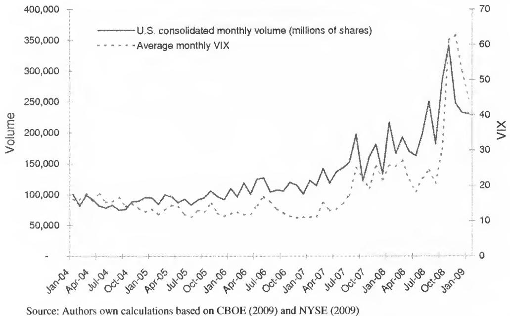  
Figure 7-18 Changing market conditions

Markct volatility and trading volumes surgcd, as shown in Figure 7-18, the volatility spikes are easy to see. Indecd, thc CBOE's VIX volatility index reached an unprecedented high of 89 in October 2008. Market volumes also surged, as investors sought to convert their positions to cash, as wcll as the unwinding of positions in funds that had failcd.

In contrast to this, many of the key indicators of market liquidity actually declined: Sprcads incrcascd whilst the displayed depth on many order books was significantly reduced. In such an unpredictablc trading environment, there is clearly a benefit to geting additional market "colour" and discussing orders with a trader. In fact, a TABB Group (2008) review of U.S. institutional trading found that sales traders' captured $44 \%$ of huy-side flow in 2008, up from $3 7 \%$ thc year before. Interestingly, though, this seems mainly to have bcen at the expense of DMA and crossing networks or "dark pools". They found that algorithmic trading usage actually increased to $24 \%$ ,from $2 2 \%$ in 2007. Despitc the harshest of trading conditions, algorithms appear to have proved themselves.

The partial decline in usagc of DMA and crossing nctworks is understandable given the cxtreme market conditions: When markets move so rapidly it is dilficult to handle a large number of orders directly. Similarly, leaving an order for a long time in a "dark pool" is a much riskicr proposition since the market priccs could rapidly change. In both cases, it is casier to leave orders to be handled by a sales trader or an algorithm.

The market crisis also led banks to reduce the amount of principal and proprietary trading.

Trading large block orders became more difficult, since the "upstairs'" market was a shadow of its former self. Hence the value of crossing networks and "dark pools". In fact, a survey of U.S. "dark pools" carried out by Rosenblatt Securilies (2008a) found that their market share actually increased in November 2008, to $8 . 5 7 \%$ , after falls in September and October. They also note that the volatility seemed to have most impact on the venues focussed on large hlock orders.

Transaction costs also saw considerable increases due to the market volatility. The most visible change was in spread costs. Dealers and market makers need to incorporate the higher level of risk in their quoted prices. Thus, bid offer spreads ncarly doubled, even for some bluc-chip stocks. Less liquid firms saw even higher increases. Spreads saw similar increases across Europe and even larger ones in Asia. Although spread cost is not the only concern, since the reduced liquidity also led to higher market impact costs. In fact, in their study of 2008 ITG client execution data Hitesh Mittal and James Wong (2008) found that there was $3 7 \%$ less displayed liquidity during the high volatility regime. Overall, they cstimated that selecting the optimal trading algorithm led to savings of 60 bps for their clients, compared to 20 bps during lower volatility periods.

As we have already seen, volatility tends to lead to more aggressive trading strategies seeking to minimise the risk at the cost of higher potential impact. Conscquently, the market crisis resulted in a shilt in the type of algorithms being used. Implementation or adaptive shortfall algorithms became much more important. Lower Ievels of visible liquidity and the desire to minimise signalling risk also meant that liquidity-based algorithms became morc widely used. Overall, Mittal and Wong (2008) found the best performance was from dynamic/opportunistic algorithms, which took advantage of market conditions but also tracked implementation shortfall costs. So it is important for trading algorithms to:

Track cost and risk Take advantage of all available liquidity Minimise signalling risk / information leakage

Clearly, a first generation siatic schedule-driven VWAP algorithm is going to struggle compared to more sophisticated algorithms that dynamically adapt to conditions. Note, this is not to say VWAP trading does not still have a place. As we saw in the previous section, in high volatility it can actually realise lower costs than POV algorithms since it is less prone to chasing the market. Again, it is all down to doing the pre-trade analysis and selecting the most appropriate algorithm for a given order based on the investor's requirements and the market conditions.

Volatile markets also pose a significant problem for the models which trading algorithms use to determine potential costs or to determine a trading horizon. In turbulent markets, historical data often does not act as a good indicator for future conditions. Short-term forecasting models may be used, adjusting the historical estimates based on current market conditions. In Chapter 10, we will cover these forecast models for conditions, such as price, volatility and volume, in more detail. Also in Chapter 15, we will see how techniques such as data mining and artificial intelligence may be used to improve their accuracy.

# 7.7 A decision tree for strategy selection

We started this chapter with Wayne Wagner's (2006) example trading decision framework, shown back in Figure 7-1. The first key decision was to determine the dificulty of the order. As we saw in section 7.2, thrce of the main factors for this are liquidity, volatility and order size. These also tie in with the trends shown back in Figure 7-17.

A potcntial dccision tree for algorithm selection for difficult orders is shown in Figure 7-19. The main choice is whether the order is urgent or largc. An ordcr may be urgent because the investor's risk aversion is high or the asset is volatile, whilst a large order might be anything over $20 \%$ of the ADV.

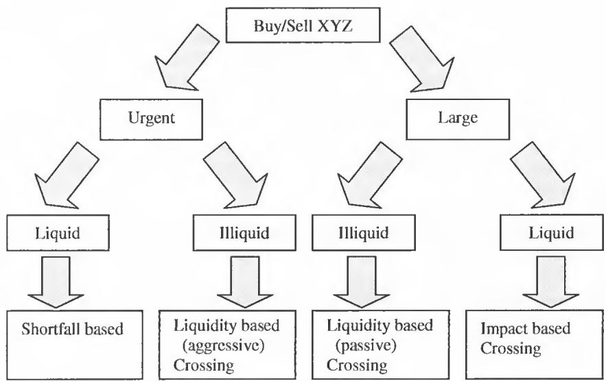  
Figure 7-19 An algorithm selection decision tree for difficult orders

Volatile asscts can have considerable timing risk, so they need to be traded more urgently. Larger orders can cause substantial market impact, so they requirc more carcful handling. Bear in mind that order size is rclative. For instance, a million shares might be very littlc for a blue-chip stock whilst ten thousand might be a massive amount for an illiquid firm. So liquidity can be incorporated, to an extent, in the relative order size. Hence, liquidity is treated as a sccondary factor, which makes our trading easier. Thus, urgent or large orders for liquid assets pose much less of a problem than for illiquid ones.

The choicc of trading algorithm follows the trends we saw in Figure 7-17, which also ties in with the algorithm mapping from the efficient frontier in Figure 7-10. Urgent trades for liquid asscts will tend to use the cost-driven implementation (or adaptive) shortfall based algorithms, whilst largc trades for liquid assets will use the more impact-driven VWAP or POV algorithms. With illiquid assets there is much lcss choice, in order to achieve best exccution we shall have to rcly on liquidity based algorithm. For urgent orders, the timing risk mcans thc trading will nced to be reasonably aggressive, whilst for large orders a more passivc approach is worthwhile.

Crossing is another key consideration. Trading algorithms are increasingly interacting with crossing networks. Though, this may simply mean passing orders through crossing venues. The risk of overfilling means it is often not viable to leave an entire order at a crossing vcnue whilst trading it in parallel via an algorithm or DMA. Thercfore, some liquidity-based algorithms may well leave a sizeable proportion of the order at a crossing venue, whilst splitting off slices to trade on the markets. This approach will generally be adopted for illiquid asscts or larger orders, since the lower probability of cxecution makes it

less appealing for urgent orders.

Figure 7-19 does not show any choices for easy orders. This is because these have no real constraints. Similar results could be achieved with any of the trading algorithms. So, it comcs down to the investor/trader's preferences. Clearly, the decision tree shown in Figure 7-19 is only one example of how we might perform algorithm selection.

Going onc step further, Neovest has actually created an algorithmic managemcnt system called AlgoGcnetics; a screenshot is shown in Figure 7-20. This provides a drag-and-drop interface allowing traders to cstablish the exact conditions for algorithm or DMA order selection. It also caters for algorithms from a wide range of brokers/vendors. Thus, rules may be set to select the "best of breed". Traders can also specify their own customiscd behaviours effectively creating thcir own "meta-algorithms". For instance, an order might initially be configured to participate in the opening auction. The remainder could then be split between a range of different algorithms: baseline participation might be achieved with a POV algorithm whilst in parallel it might seek further price improvement from a more price adaptive or liquidity-seeking algorithm.

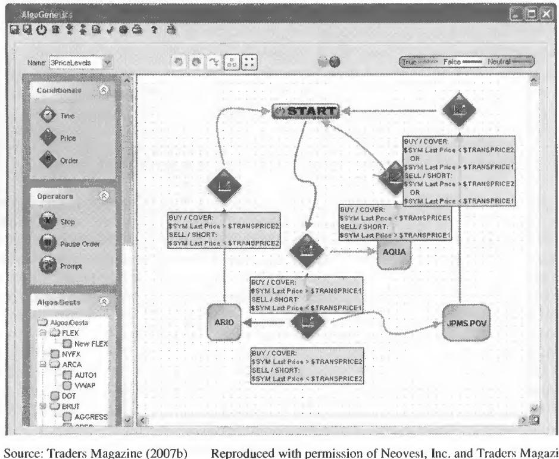  
Figure 7-20 Creating rules for algorithm choice with AlgoGenetics

Such flexibility clearly gives traders a powerful tool for algorithm selection. Note that selecting the optimal trading algorithm from the many hundreds versions which are available will always be a difficult choice. Still, it is important to stay focused on thc ovcrall investment objectives. As usual, the choice will often mean striking the right balance between cost and risk.

Therc are no hard and fast rules for how to achieve best exccution. The judgemcnt depends on the investor's objectives, so key factors are the:

Target benchmark   
Level of risk aversion   
Specific trading goals, such as to: Minimize the expected cost. Achieve price improvement. Balance the trade-off betwecn expected cost and risk.

Trading decision frameworks ofien start by gauging the difficulty of the order, which is determined by the following properties:

Order size (relative to the ADV)   
Price momentum   
Volatility   
Urgency and/or the trading horizon   
Liquidity

Based on this difficulty, the trader then must select the most appropriate methods, whether this means manual, DMA, crossing, using trading algorithms or a mixture of thesc.

The efficient trading frontier represents the set of optimal trading strategies. Each one of these has the lowest expected cost for a given level of risk. Algorithms and other strategies may be mapped to this frontier, allowing comparison betwcen them.

A wide range of factors alfects the choice of trading algorithm.

Urgency, risk aversion and volatility tend to bias towards more aggressive trading. Larger orders and favourable price trends tend to encourage a more passive style. Fundamental issues, such as the availability of market data and market structure also restrict the choice of stratcgy.

# Part III

Implementing trading strategies

This part of the book delves further into the nitty-gritty of implementing trading strategics; it also shows how they may be enhanced and looks at the infrastructure rcquired to make them work.

• Chapter 8 covers order placement, using empirical market microstructure rcscarch to analyse how market conditions affect execution probability.   
• Chapter 9 focuses on execution tactics, which provide common mechanisms to achieve the goals of trading algorithms.   
• Chapter 10 considers ways to enhance the performance of trading algorithms, using models for short-term forecasting and cost estimation, as well as handling special events.   
• Chapter I1 reviews the infrastructure requirements associated with algorithmic trading and DMA, such as order management and the design of trading platforms.

Hopefully, by the end of these four chapters you should have a dceper understanding of the technical issues required to actually implement algorithmic trading strategies.

# Chapter 8 Order placement

Order placement decisions are important to the success of any trading strategy.

# 8.1 Introduction

Order placement decisions are a key part of trading. Executing too aggressively could result in significant market impact; it also broadcasts our intentions to other market participants. Whereas trading too passively may result in us failing to complete the order, which could lead to a sizeable opportunity cost. Therefore we need to find the right balance which best achievcs our objectives.

Based on these requirements, we nced to select each order's size and price, and any special order types or conditions (if appropriate). Increasingly, marketplaces consist of multiple competing execution venues. So, for multi-venue markets we also need to choose the best destination. The possibility of hidden liquidity must also be taken into account. Hencc, order placement decisions are aflected by a wide range of factors, such as:

current market conditions (price, volatility and liquidity) projectcd future trends • historical results

Another way of looking at order placement is in terms of cxecution probability. Factors such as liquidity and price trends help us to estimate the likelihood of an order executing. Thcrefore, we can adjust orders to try to maximise their chance of being filled. This provides a more quantitative basis for actual order selection, and enables us to choose between execution venues.

To make best use of orders it is vital to understand the actual mechanisms that are involved in order matching. As we saw in Chapter 2, trading consists of three main stages:

1. Price formation   
2. Price discovery / trade exccution   
3. Reporting, clearing & settlement

Consequently, order placement decisions are closely linked to both price formation and price discovery (or cxecution). So we shall start this chapter by reviewing these two fundamental mechanisms in some more detail, before moving on to consider the specifics of order placement and execution probability.

# 8.2 Price formation

Price formation is a multi-stage process. The fair value of an asset rcflects its actual value whercas the market price reflects what pcople are prepared to pay. The market price may also reflect their expectations for the future value. If demand is high and supply is limited, asscts will often trade at a premium to their fair value. Converscly, if demand is low then discounting may occur.

This division is also reflected in price analysis. Fundamental analysts tacklc the problem by striving to dctermine the fair (or present) value of thc asset. So the actual market price will be the key determinant of whether it is worth trading or not. Conversely, technical analysts tend to base their pricing solely from trends in the market price and volume.

Given the importance of the market price, market transparency also plays a key part in price discovery. A market maker's two-way quote only gives one view on pricing. Similarly, if only the best bid and offcr quotes arc displayed from an order book then cffcctively this is the same as a two-way quote. This adds a degree of uncertainty since traders cannot tell what other liquidity might be available. This additional risk could lead to orders being priced more aggrcssively than is necessary. On the other hand, if quotes are sought from multiple dcalers or more of the order book is visible then traders can scc the range of available prices and sizes. By using such visible liquidity, they can then adjust their own valuations to determine their own target price for thc asset.

# Valuation

The value of an asset is clearly a fundamental component of its price. Many books have been dedicated to this subject alone. Though, for the purposes of this chaptcr, the discountcd cash flow model will sufficc as our pricing model: Present value theory statcs that the prcsent value of an asset corresponds to a discounted sum of its future payments. The discount rate lakes account of the time value of money as well as other factors such as risk. Thus, asset prices will be higher for largcr cash flows and lower when the discount rate increascs.

Fixcd income assets, such as bonds, offer fi xed levels of interest for a givcn period of time and so havc very clearly defined future payment streams, or cash Hows. Present valuc thcory lends itself well to thc pricing of these assets.

Valuation for assets such as equity shares in a company is more complcx, since the cash flows are less prcdictable. Nevertheless, prescnt value theory has also been applicd to stocks, dating back to work by Robert Wiese (1930) and John Williams (1938). Discounted cash flow modcls make valuations based on the present value of future dividend payments, which in turn depcnd on future earnings. Though, there are further complications when valuing stocks. For example, companies with high returns on capital will often reinvest income rather than increasing dividend payouts. Also, unlike bonds, companies could last forevcr (in theory), perpetually issuing dividend payments. Thus, Myron Gordon (1962) developed his growth model, where valuations are based on the currcnt stock pricc and dividend, together with the expected rate of dividend growth and a discount rate. Other models have gone on to incorporate multiple growth periods, or finite horizons.

Other assets can also be complex to price, as we saw in Chapter 3. Foreign exchangc is affected by both macroeconomic information, such as intercst rates, and order flow. Derivatives reflect the pricc of thcir underlying asscts comhined with estimates for factors such as volatility and intcrest ratcs. Thus, appropriate adjustments must be made for their corresponding pricing models.

Regardless of how these valuations are actually determined, the amount of information and data required mcans that invcstors will invariably achieve different prices for assets (cven if only slightly). The resultant diversity is crucial to keep markets flowing.

# Models of price formation

Market microstructure rcsearchers have used a wide array of models to investigate the price formation mechanism. Invcstors tend to have different views on assets, so supply and demand often affects price formation.

Inventory-based models take the dealer's point of view, focussing on how their position affects thc prices they offer. Essentially, the bid offer spread represents the cost for which market makers are prepared to offer immediacy. Information-based models take the point of vicw that traders have differing levels of information, which in turn affects their pricing. Likewise, visible order books are themselves are a source of information. Thus, a range of studies has focussed on how this affects pricc formation. Various combinations of thesc models have also been used to try to explain this process.

# Inventory-based models

A market maker is not an investor; they are not trying to cstablish a position in a given asset. Their inventory, or position, simply nceds to be sufficient to service any incoming orders. In order to achicve this, they adjust their quoted prices to encourage orders that take them closer to their preferred inventory size. So the market maker's bid offer spread often tends to increase as thcir position moves further from their ideal inventory. The strength of this reaction tends to reflect their allowed capital; smaller brokers will generally exhibit a more noticeable effect.

For instancc, Figure 8-1 shows how an example market maker's bid and offer quotes can change for a rangc of diffcrent inventories. The centre of each circle represents their quoted bid or offer price and thc diameter corresponds to their quoted size. For simplicity we will assume that thcir optimal inventory is zero, in other words to be "flat".

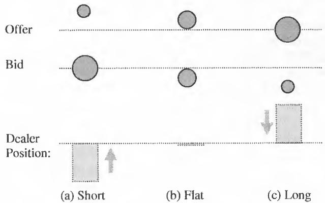  
Figure 8-1 How inventory can affect market maker quotes

Therefore, in Figure 8-1 (a), when the market maker's position is too low they may raise their bid quote to try to encourage sellers to sell to them, and so reduce the deficit. They can also discourage any further buy orders by setting a high offer price. The opposite holds true when the inventory is too high. So in (c) the market maker may quote a lower offer price than in (a) to encourage buy orders and so reduce their surplus. Likewise, the bid price may be set lower to discourage any further sell orders.

Regulation means that market maker's must often quote within a given range of the best bid and offer. So an alternative to adjusting the price is just to alter the size for the quotes, a low bid size will discourage sells, whilst a high offer size will encourage buy orders.

Note that in multi-broker markets the inventory effects will be distinct for each market maker, reflecting their differing inventories. So at any one time different brokers will be keen to set the best bid or offer. Hence, competition means that the market's overall spread tends to be narrower than any given market maker's spread.

The inventory-based model is also able to account for other market features. For example, liquid assets tend to have lower spreads than iliquid ones. Since market makers are able to turnover their positions more quickly for liquid assets they demand less compensation and so quote tighter spreads. Conversely, David Cushing and Ananth Madhavan (2001) observed substantial increases in costs towards the market close. This may be attributed to market makers bcing less keen to carry overnight positions and so pricing accordingly.

# Information-based models

The value of information was nicely outlined by Hirotaka Inoue (1999) in a study of the price formation and discovery process: For assets such as government bonds, where the cash flow is well established, prices are mainly affected by public information. Macroeconomic announcements can affect the discount rate, and so alter the present value. Whereas asscts like stocks are much more affected by private information, since the future cash flows arc less certain.

Information-based models attempt to account for the information asymmctry that is an important factor in real markets. Some traders will have a definite information advantagc over others. When trading with such an informed trader we are likely to lose, due to the resultant price reaction when the information becomes public. This is somctimcs refcrred to as the adverse selection effect.

A study by Thomas Copeland and Dan Galai (1 983) found that to protcct against adverse selection a market maker's bid offer spread should generate enough returns to cover this cost. They charactcrised the cost of supplying quotes as writing a put and a call option. Copeland and Galai concluded that the bid offer spread is positively related to the price and volatility and negatively related to market activity and depth. They also found the spread to be negatively correlated with the degree of competition faced by market makers. Likewise, an empirical study of NYSE specialists by Charles Lce, Belinda Mucklow and Mark Ready (1993) found that they are sensitive to information asymmetry, using both spread and quoted depth to manage their risk. Their study tracked the reactions of specialists to carnings announcements, after which they observed a widening of the spreads.

Information-based models for order-driven markets are slightly diferent; this is because the bid offer spread arises due to market conditions. A wide range of studies has used models of limit order markets to analyse how this affects trading. A purcly valuation-based approach was adopted by Thierry Foucault (1999), using a game theorctic model of price formation for a dynamic limit order market. Trading occurred due to inherent diffcrences in valuation; there was no private information.

Foucault's model was extended to incorporate asymmetric information by Puneet Handa, Robert Schwartz and Ashish Tiwari (2003). Using empirical data from France's main stock index, the CAC40, they showed that the size of the sprcad is based on differences in valuation among the traders as well as the risk of adverse selection. These effects were further quantified in a study by Ming-Chang Wang, Lon-Ping Zu and Chau-Jung Kuo (2006). Using empirical data from the Taiwan Stock Exchange they found that around $2 5 \%$ of the spread was attributable to valuation differences. The remaining $7 5 \%$ was a premium to offset the risk of adverse selection (split evenly for buyers and sellers).

Wang, Zu and Kuo (2006) also found that the average adverse selection cost varicd significantly over time; the largest cost was at the open whilst the smallest was at lunchtime. This is consistent with studies by Ken Nyholm (2002), and Harrison Hong and Jiang Wang (2000) who showed that the probability of informed trading is larger in the morning than in the afternoon. So spreads tend to be wider in the morning compared to later in the day.

# Order book data models

Many order-driven markets have visible order books, which in themselves are a source of information. Hence, a range of studies has focussed on how order book information allects the price formation proccss.

The interaetion between the order book and the supply and demand of liquidity was analysed for stocks on the Paris Bourse hy Bruno Biais, Pierre Hillion and Chester Spatt (1995). They found that when there were few limit orders on the order book incoming orders were often priced less aggressively than the corresponding best bid or offer. Therefore, instead of resulting in an execution such orders would stay on the order hook, gradually increasing liquidity by adding to the available depth. Conversely, when the order book was sufficicntly deep they found that new orders were often priced more aggressively, to take advantage of this liquidity, and so resulting in executions. A similar analysis was applied to the Swiss Stock Exchange by Angelo Ranaldo (2004). He tracked how the available depth on each side of the order book affected new order placement. His analysis showed that traders tended to place more aggressively priced orders when the same side of the order book was deeper, or when the opposite side was thinner.

In terms of the bid offer spread, Ranaldo (2004) found that less aggressively priced orders were placed as the spread widens. A similar result was found by Yue-Cheong Chan (2005). Chan also analysed the impact of short-term price movements and found that traders place more aggressively priced orders alter previously positive returns.

# Combined models

A hybrid model incorporating both inventory and asymmetric information effects was developed by Ananth Madhavan and Seymour Smidt (1993). In this model, the market maker also actively invested by dynamically modifying their target inventory levels aceording to the market conditions. Using data from NYSE specialists, they found that inventories exhihited a slow mean reversion with a half-life of around seven days.

In another study Wang, Zu and Kuo (2008) extended the Handa, Schwartz and Tiwari (2003) information-based model to include risk-averse traders. They also studied the effect of order book information, again using empirical data from the Taiwan Stock Exchange. The following inlormation acted as indicators for the traders' order strategies:

• order imbalance prior order aggressiveness   
● short-term volatility   
● short-term price momentum   
● relative spread   
● timeframe

Sellers were found to be more conecrned about non-execution risk; they followed the order aggressiveness of both prior buy and sell orders. Whereas buyers were more conccrned about orders becoming mispriced and so "picked-off'; hencc, orders were morc dependent on the aggressiveness of prior buys. A favourable signal tcnded to makc buyers morc aggressive and scllers more paticnt whilst the opposite applied for unfavourable information. They concluded that price formation continually reflected the changes in cxpcctation of picking-off risk and non-execution risk for buyers and sellers.

# 8.3 Price discovery/Order matching

Price discovery is radc execution, it occurs when the supply and demand requiremcnts from orders are matched. The price at which this happens is determined by the mcchanism. As we saw in Chapter 2, there are three main types of discovery mechanism:

• Bilateral trading ● Continuous auction ● Call auction

Bilatcral trading represents one-to-one quote-driven and negotiation-based mechanisms. The matching process is just a matter of whether their quoted prices are acceptable or not. The multilateral auction-based mechanisms are used for order-driven and hybrid markcts. Specific rules are applied to determine whcther executions occur. The main diffcrence between these two types of auction is simply the frequcncy. Unlike continuous auctions, callbased auctions allow orders to accumulate for some timc before the actual discovery (or malching) takcs placc.

# Continuous matching

The continuous auction mechanism consistently applies the matching rules cach time an order is added, updated or cancelled. Any matches result in corresponding executions. Typically, markets give price the most priority. A varicty of approaches is used for the secondary priority, which is used to differentiate between orders with the same ranking in terms of the primary condition (e.g. the same price). Two of the most common arc timc and pro-rata, so orders are often either ranked based on when they were first rcceived, or thcir sizc. There are also several common derivations of these two main types. In the following sections we will consider somc worked cxamples for cach of these. Notc that some venues do not have thcir own intcrnal pricing mechanism; instcad, the mid-point prices from the primary cxchange are often used, so we shall also look at an example for a mid-point match.

# Price/Time priority

Trade matching using price/time based priority is common in most equitics markets. The highest priced buy orders and the lowest priced sells havc the highest probabilitics of exccution. For orders at the same price, the time they were placed is then used to distinguish betwecn them, thus rewarding earlier orders.

For cxample, Ict's look at how a market order to buy 2,500 EEE will be handled for the order book shown in Figure 8-2. The ordcr book shows the orders arranged in tcrms of their execution priority, so the earlier scll order S1 takes priority over thc similarly priccd S2 and S3 and the higher priced S4. Now, in order to cross with the incoming market order we can see that order S1 will he filled completely, as will the next ordcr S2. The last 300 will result Irom a partial execution with order S3, leaving 2,200 remaining on the book. Alterwards, order S3 now has both price and time priority for any new incoming buy orders.

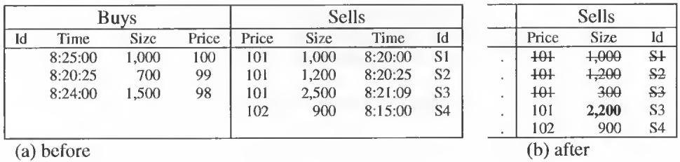  
Figure 8-2 An example buy order matched using price/time priority

# Price/Pro-rata priority

Trade matching using price/pro-rata based priority is more common in futures markets. Again, the best prieed buy and sell orders take priority, but allocation between orders at the same price point is donc on a pro-rata basis. That is to say, each order is allocated based on ils proportion of the total volume of orders at that price, thus rewarding larger orders.

For example, let's see how a market order to buy 1,000 EEE will be handled for the order book shown in Figure 8-3. Since orders S1, S2 and S3 all have the same price priority, the allocation is based on their size. Hence, sell Sl gets $( 7 5 0 / 2 0 0 0 ) = 3 7 . 5 \%$ of the allocation (labelled Alloc), or 375, whilst the larger order S3 gets $50 \%$ , despite being placed later than either order S1 or S2. The net result is that all three orders receive partial execution and remain on the order book ready for the next execution. Clearly, this approach rewards size nearly as much as price.

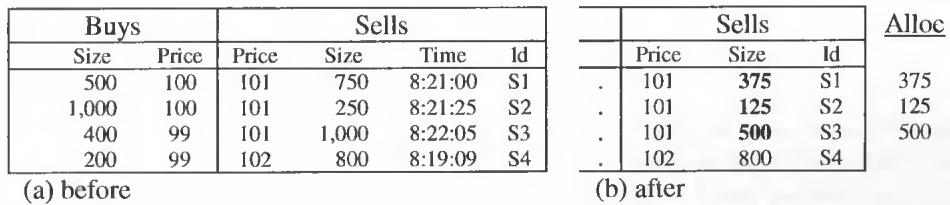  
Figure 8-3 An example buy order matched using price/pro-rata priority

A common addition is to grant special priority to the first order at each new price poinl, in order to encourage traders to place more aggressively priced orders. Taking the same example as before and applying this additional criterion, we shall assume that order Sl was the first order at 101 and so has special priority over the others.

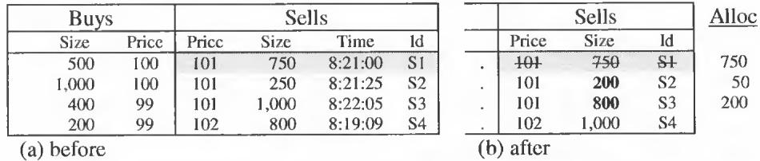  
Figure 8-4 An example buy order using price/pro-rata priority matched with preference for the first order

Therefore, as we can see in Figure 8-4 the market order to buy 1,000 EEE now is handled somewhat differently. This time, order S1 is completely filled and the remainder is allocated pro-rata between orders S2 and S3. Note that neither orders S2, nor S3 have the special priority so when a new buy order hits the order book the matching will go back to using the original pro-rata method.

Other variants of this approach apply volume caps to prevent traders from entering large orders at a new price, thus gaining special priority privileges for a significant volume. Conversely, minimum volume requirements may also be adopted to ensure that traders do not simply place a small order at a new price in order to obtain special priority.

Another alternative aimed at helping pro-rata allocations for smaller orders is adopted by the CME for its Eurodollar futures. The allocation is split into two stages. The first stage is a pro-rata based method; however, it rounds down al the allocations, and assigns zero to any orders that end up with less than two units. The remaining quantity is then distributed on a time-based priority, so earlier orders will get additional allocation. For example, let's look at how a market order to buy 100 EFG will be handled for the order book shown in Figure 8-5.

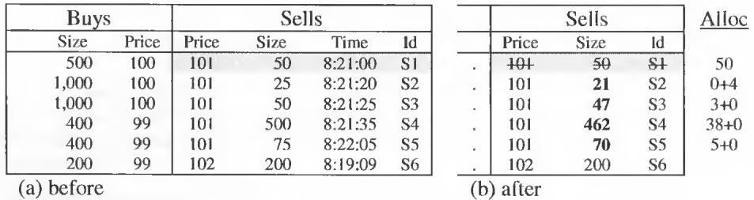  
Figure 8-5 An example buy order using price/pro-rata priority, with first order preference and secondary time priority

Order S1 had special priority so it is completely filled, the remaining 50 is then allocated amongst orders S2 to S5 (for simplicity we will assume the lot size is 1). Initially, the small order S2 gets nothing based on this allocation. The remaining 4 units are then assigned based on time priority, so these are allocated to the earliest order, which in this case is order S2.

# Priority, Parity, Yielding

The Priority, Parity, Yielding (PPY) trade matehing mechanism represents another noteworthy modification. Historically, NYSE's trading mechanism was based on this approach, although they have since moved to a more standard price/pro-rata mechanism. Still, it has some interesting features, so it is worth examining in more detail.

The priority refers to the fact that priority is assigned to the first order at a new price point, like some futures exchanges. Parity simply refers to its pro-rata nature, since after the order with priority is filled orders are then assigned based on their size. Though, there is one important difference from the price/pro-rata mechanisms, namely yielding. Traditionally, NYSE specialists acted as sole market makers for each asset. To protect client orders yielding meant that the specialist's quotes were required to give priority to client orders, i.e. those on the Designated Order Turnaround (DOT) system.

For example, let's focus on the sells for asset NLO as shown in Figure 8-6. The order book is formatted slightly differently, based on examples from NYSE (2006), because it actually comprises of orders from several sources.

<table><tr><td rowspan=1 colspan=1>Offer</td><td rowspan=1 colspan=1>Size</td><td rowspan=1 colspan=1>DOT</td><td rowspan=1 colspan=1>e-Quole</td><td rowspan=1 colspan=1>s-Quole</td></tr><tr><td rowspan=1 colspan=1>7.01</td><td rowspan=1 colspan=1>9,200</td><td rowspan=1 colspan=1>6,200</td><td rowspan=1 colspan=1>2,000</td><td rowspan=1 colspan=1>1,000</td></tr><tr><td rowspan=1 colspan=1>7.02</td><td rowspan=1 colspan=1>7,000</td><td rowspan=1 colspan=1>4,000</td><td rowspan=1 colspan=1>2,000</td><td rowspan=1 colspan=1>1,000</td></tr></table>

<table><tr><td rowspan=1 colspan=1>Offer</td><td rowspan=1 colspan=1>Size</td><td rowspan=1 colspan=1>DOT</td><td rowspan=1 colspan=1>e-Quote</td><td rowspan=1 colspan=1>s-Quote</td></tr><tr><td rowspan=1 colspan=1>7.01</td><td rowspan=1 colspan=1>4,200</td><td rowspan=1 colspan=1>2,400</td><td rowspan=1 colspan=1>800</td><td rowspan=1 colspan=1>1,000</td></tr><tr><td rowspan=1 colspan=1>7.02</td><td rowspan=1 colspan=1>7,000</td><td rowspan=1 colspan=1>4,000</td><td rowspan=1 colspan=1>2,000</td><td rowspan=1 colspan=1>1,000</td></tr></table>

(b) after

Thc DOT orders are also competing with electronic quotes from other floor brokers (eQuotes) and the specialist (s-Quotes). Figure 8-7 shows this in the more familiar order book style, orders with price priority are shaded in light grey whilst the specialist's quote (SQ) is highlighted in dark grey. The DOT orders have identifiers beginning with D, the e-Quotes start with E.

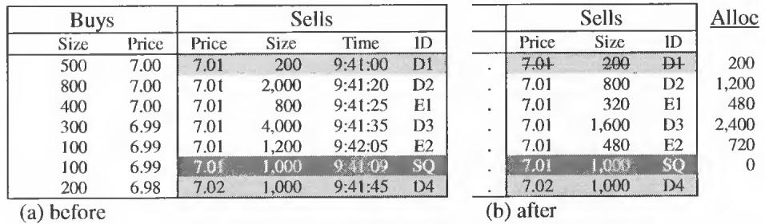  
Figure 8-6 An example buy order matched with price, parity, yielding   
Figure 8-7 An order level view of the example using price, parity, yielding   
Figure 8-8 A subsequent buy order handled with price, parity, yielding

When a market order to buy $5 { , } 0 0 0 ~ \mathrm { N L O }$ hits the order book, the priority is given to the earliest order at 7.01, which happens to be for a quantity of 200. The remaining 4,800 is then assigned at parity amongst the DOT orders and the floor brokers' e-Quotes. Given the cxtant order sizes have ratio of 3:1 between DOT and e-Quotes, 3600 will cross with DOT orders, whilst 1,200 will match with e-Quotes. The specialist's s-Quote is not involved since it yields to the extant DOT orders.

Hence, in Figure 8-7 the DOT order D1 is completely filled, whilst orders D2 and D3 and the e-Quotcs E1 and E2 are all partially filled from the remaining 4,800, based on their size. The specialist's quote SQ remains unchanged. The residuals are shown in Figure 8-7(b).

If another market order to buy $5 { , } 0 0 0 ~ \mathrm { N L O }$ now hits the exchange, the specialist's s-Quote may then participate, once the extant DOT orders at 7.01 have been filled. Since there are only 4,200 available in total at 7.01, all these orders will be filled. For the remaining 800, DOT order D4 at 7.02 has priority, so this will cross with the market order leaving a total remainder of 3,200 at 7.02 on DOT. We can see this summarised in Figure 8-8:

<table><tr><td rowspan=1 colspan=1>Price</td><td rowspan=1 colspan=1>Offer</td><td rowspan=1 colspan=1>DOT</td><td rowspan=1 colspan=1>e-Quole</td><td rowspan=1 colspan=1>s-Quote</td></tr><tr><td rowspan=1 colspan=1>7.01</td><td rowspan=1 colspan=1>4,200</td><td rowspan=1 colspan=1>2,400</td><td rowspan=1 colspan=1>800</td><td rowspan=1 colspan=1>1,000</td></tr><tr><td rowspan=1 colspan=1>7.02</td><td rowspan=1 colspan=1>7,000</td><td rowspan=1 colspan=1>4,000</td><td rowspan=1 colspan=1>2,000</td><td rowspan=1 colspan=1>1,000</td></tr><tr><td rowspan=1 colspan=5>(a) before</td></tr></table>

<table><tr><td rowspan=1 colspan=1>Price</td><td rowspan=1 colspan=1>Offer</td><td rowspan=1 colspan=1>DOT</td><td rowspan=1 colspan=1>e-Quote</td><td rowspan=1 colspan=1>s-Quote</td></tr><tr><td rowspan=1 colspan=1></td><td rowspan=1 colspan=1></td><td rowspan=1 colspan=1></td><td rowspan=1 colspan=1></td><td rowspan=1 colspan=1></td></tr><tr><td rowspan=1 colspan=1>7.02</td><td rowspan=1 colspan=1>6,200</td><td rowspan=1 colspan=1>3,200</td><td rowspan=1 colspan=1>2,000</td><td rowspan=1 colspan=1>1,000</td></tr></table>

This mechanism allowed the specialists to provide additional liquidity without taking priority over clicnt orders.

# Mid-point matches

Matching orders based on the mid-point price from the primary exchange is becoming a popular mechanism for continuous crossing systems. As we saw in Chapter 2, market orders will execute at the mid-point whencver there is suficient volume available on the other side of the order book. Limit orders will only match when the mid-point price is better than their limit; hence, the limit priccs in Figurc 8-9 are greyed out.

For cxample, if the order book shown in Figure 8-9 applied a normal continuous auction we would expect orders B1 and S1 to have matched already since their prices cross.

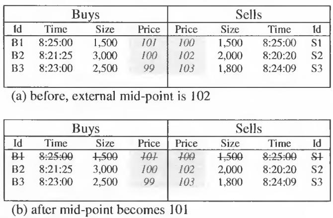  
Figure 8-9 An example mid-point match

However, on the primary exchange the best bid and offer is 101-103, so the cxternal midpoint price is 102. Therefore, the limit price on buy order B1 prcvcnts it from being matched. Only when the external best bid and offer changcs to 100-102 (so thc mid-point becomcs 101) can it participate. Since sell order S1 has a mid-point limit of 100, this can therefore cross with order B1. Note that both orders execute at the mid-point, so order SI actually sccs a price improvemcnt over its original limit price of 100.

This mechanism is generally used to support continuous crossing for block-size orders, hence the order book shown in Figure 8-9 would be completely opaque. Some venues also support minimum acceptable quantities (or minimum volumes), as we saw for call auctions in Chapter 4.

# Other types

Most of the common mechanisms for irade matching have alrcady been covered in the previous sub-sections. Though, there will invariably be venucs that use slightly different rules. It is always worth carelully reading the documentation and regulations for cach market venue to confirm exactly how matching is carried out.

Catering for some custom order types may also require modifications to the trade matehing mechanism. These can be reasonably straightforward, requiring a few cxtensions to the order matching logic, such as for handling hidden orders or discretionary price limits. However, some custom order types can pose more substantial problems. For instance, supporting contingent orders may require a separate order book.

In terms of pure matching, hidden orders are still limit orders. Though, to ensure fairness for other market participants most venues assign them a lower priority than visible orders at the same price. Otherwise, there would be little incentive to post visible liquidity.

Similarly, iceberg orders have a portion that is visible and a reserve, which is hidden. A key feature of iceberg orders is that when the visible portion is filled, it will be replaced with an equivalent order by reducing the size of the hidden reserve. Again, the trading mechanism will need to be modified to manage this process.

Discretionary orders actually have two price limits, a public one and a private one. Just as iceberg orders hide their true size, discretionary orders hide their true price limit. Therefore, when handling discretionary orders the trade matching mechanism needs to also check whether any orders match on the discretionary price limit.

Contingent ordcrs are more complex because they introduce additional dependencies. They allow links bctween orders, often for different assets. Normally, the order books for each asset are completely separate, so conditional orders introduce linkages between them. Suddenly, the trade matching mcchanisms for several assets need to interact with each other to determine whether a trade can occur. For this reason, markets that support contingent orders have tended to handle them in dedicated order books. Hence, spread orders between futures contracts and some complex option strategies may be handled completely separately. That said, as trade-matching engines become increasingly sophisticated some venues are now actually starting to use "implied orders" to integrate these complex orders back into the main order books. The aim of this is to improve the overall liquidity, although it does add a considerable level of complexity for the matching engines.

Researchers are also constantly looking into ways of improving the existing tradc matching mechanisms. An important area of study is finding a way of balancing the requirement for visibility (for price discovery) with the need to hide large orders (to prevent information leakage). An interesting proposal by Peter Gomber, Miroslav Budimir and Uwe Schweickert (2006) iniroduces a new custom order type, the volume order. Essentially, this is a cross between an iceberg order and a discretionary one: The discretionary price is linked lo a minimum volume requirement, so if there are corresponding orders which can fill this required volume and they are within the price limit then a match may occur. Alternatively, Leslie Boni and Chris Leach (2004) investigate the "expandable" limit order, which has been uscd in the inter-dealer market for U.S. Treasuries. Effectivcly, it gives the trader whose limit order had just executed the right of first refusal to trade additional volume with the same dealer. Whilst they note that this is useful for trading large block orders, the time taken for negotiation can be disruptive, since they arc essentially pushing in front of other orders on the order book. Boni and Leach propose some potential work-arounds, based on strict time limits for the option to refuse, only granting this right to the first order at a new price level, or even handling them on a separate order book. Hopefuly, more research will continue to look into alternative methods for trade matching, since this could well provide innovative new mechanisms that will help bridge the gap that currently exists between exchanges and crossing systems.

# Call-based matching

A call auction may be carried out as little as once a day, or as frequently as every 10 to 15 minutes throughout the trading day. Rather than continuously matching each order as it arrives, orders are just queued up and applied to the auction order book. The actual tradc matching only occurs at the set auction time. So, orders accumulate before the auction takes place. This allows longer for price formation and so can help when there is more uncertainty about what the price should actually be. Consequently, many markets often choose to open and close with a separate cal auction in an effort to reduce price volatiliy.

When the auction starts, a crossing algorithm tries to ensure that the maximum possibl volume of orders is crossed at the auction price. A typical approach is as follows:

Check that the order book is crossed, i.e. either the book contains market orders or there are buy orders with limit prices higher than some of the sell orders. Apply the following criteria step-wise until a single price match which achieves them is found:   
1. A maximum executable volume   
2. As above & a minimum order surplus   
3. As above & a consistent market pressure If a single price cannot be found then determine a price based on the reference price. Generally, this will be the last traded price, so last night's closc for an opening auction or the last trade for a closing auction. Once a price is found, the auction order book is then processed to match any orders that will execute within this price limit. Many venues use time as a secondary priority, this rewards the early entry of auction orders.

This forms the basis for many of the equity market call auctions, e.g. the Deutsche Börse and the London, Australian, Hong Kong and Singapore stock exchanges. A more in-depth review for a wide range of markets is provided by Carole Comcrton-Forde and James Rydge (2004).

Some venues may also publish information about the overall imbalance between the buy and sell orders before the crossing begins. The aim is to encourage new buycrs/sellers to address the imbalance and so maximise the potential auction volume. They may also offer an indicative auction price to help traders to decide on pricing for their auction orders.

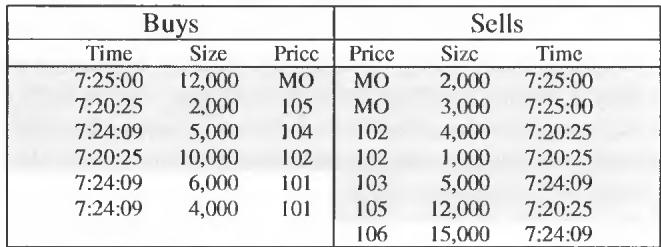  
Figure 8-10 An example call auction

From this, we can construct Table 8-1 which shows the calculated executable volumes, surpluses and pressures.

Cumulative buy/sell side pressures: These represent the total volume availahle for crossing at any given limit price. They are calculated by summing the order quantities from the highest priority, so this will start with any market orders and then sum from the highest priced limit order for buys, or the lowest for sells.

<table><tr><td rowspan="2">Pooled buy orders at limit</td><td rowspan="2">Price</td><td rowspan="2">Pooled sell orders at limit</td><td colspan="2">Cumulative pressure</td><td rowspan="2">Executable volume</td><td rowspan="2">Order surplus</td><td rowspan="2">Market pressure</td></tr><tr><td>Buy</td><td>Sell</td></tr><tr><td>12,000 0</td><td>MO 106</td><td>5,000 15,000</td><td>12,000</td><td>42,000</td><td>12,000</td><td>-30,000</td><td></td></tr><tr><td>2,000</td><td>105</td><td>12,000</td><td>14,000</td><td>27,000</td><td>14,000</td><td>-13,000</td><td></td></tr><tr><td>5,000</td><td>104</td><td>0</td><td>19,000</td><td>15,000</td><td>15,000</td><td>4,000</td><td>+</td></tr><tr><td>0</td><td>103</td><td>5,000</td><td>19,000</td><td>15,000</td><td>15,000</td><td>4,000</td><td>+</td></tr><tr><td>10,000</td><td>102</td><td>5,000</td><td>29,000</td><td>10,000</td><td>10,000</td><td>19,000</td><td>+</td></tr><tr><td></td><td></td><td></td><td></td><td></td><td></td><td></td><td></td></tr><tr><td>10,000</td><td>101</td><td>0</td><td>39,000</td><td>5,000</td><td>5,000</td><td>34,000</td><td>+</td></tr></table>

Executable volume: For each price, this volume is simply the minimum of the buy and sell pressures for that limit. This is because the total volume we can cross is limited by the buy and sell pressures, since it does not matter how much buy pressure there is if no-one wants to sell.

Order surplus: This represents the amount of buy or sell pressure that remains unexccuted due to lack of orders on the opposite side of the order book.

Markel pressure: This is just the sign of the order surplus. Positive pressure reflects a surplus of buy orders whilst negative shows a surplus of sells.

We can now use this example order book and the data from Table 8-1 to apply the outlined auction-crossing algorihm:

1. The light grey shading in Figure 8-10 shows the orders that cross, so we can continue.   
2. Two prices achieve the maximum executable volume of 15,000, so we should next use the order surpluses to try to isolate a single price match.   
3. Both of these prices result in the same order surplus of 4,000, so we must now consider the market pressure.   
4. The market pressure is consistent; it is positive for both 103 and 104. Since the surpluses are for buys, this implies the prices are more likely to increase after the auction; therefore, the higher of the two prices is used for the auction price.   
5. Hence, 104 will be used as the auction pricc, so we do not need to look at the refcrence price.

Having now assigned an auction-crossing price of 104, we can see the effect on the actual auction order book in Figure 8-11 (a) as the crossings take place and (b) once the auction is finally completed.

If this was the opening auction for a continuous double auction market, then Figure 8-11 (b) shows the order book as it will be when the market oficially opens for continuous trading. Alternatively, if this was a batch call auction or a closing auction then, depending on the market, these remaining orders will either be cancelled or left for the next auction.

Some crossing systems derive their auction price from another market. However, in all other respccts the auction crossing mechanism is the same as shown in Figure 8-1 1.

<table><tr><td colspan="3">Buys</td><td colspan="3">Sells</td></tr><tr><td>Time</td><td>Size</td><td>Price</td><td>Price</td><td>Size</td><td>Time</td></tr><tr><td>7:25:00</td><td>12,000</td><td>MO</td><td>MO</td><td>2,000</td><td>7:25:00</td></tr><tr><td>7:20:25</td><td>2,000</td><td>405</td><td>MO</td><td>3,000</td><td>7:25:00</td></tr><tr><td>7:24:09</td><td>1,000</td><td>104</td><td>102</td><td>4,000</td><td>7:20:25</td></tr><tr><td>7:24:09</td><td>4,000</td><td>104</td><td>102</td><td>+;000</td><td>7:20:25</td></tr><tr><td>7:20:25</td><td>10,000</td><td>102</td><td>+03</td><td>5,000</td><td>7:24:09</td></tr><tr><td>7:24:09</td><td>6,000</td><td>101</td><td>105</td><td>12,000</td><td>7:20:25</td></tr><tr><td>7:24:09</td><td>4,000</td><td>101</td><td>106</td><td>15,000</td><td>7:24:09</td></tr></table>

(a) order book crossing

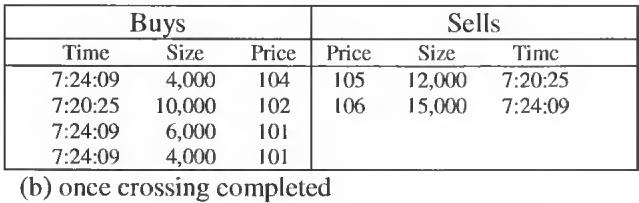  
Figure 8-11 A call auction crossing

# 8.4 Order placement decisions

When making decisions about order placement we need to balance the required objeetives with the current market conditions. Essentially, we are trying to find the best price with an acceptable probability of execution and risk. That used to simply mean choosing a target price and deciding when and how best to split an order for execution.

In today's increasingly fragmented marketplaces, choosing where to place an order can be as important a factor as the price or size. The small average order size now common in many markets (best typified by equities and listed futures) also means that signaling risk is now a signilieant concern. So to strive for optimal execution we must decide where we are prepared to trade and how (which order types we will use) as well as how aggressively we will price and size our order.

# Signalling risk

Signalling risk represents the information leakage to other market participants from our trading strategy. Placing an order on an open order book provides a valuable trading option that other traders may freely execute against. Our trading patern also relays information to the other market participants, such as whether we are a large buyer or seller.

Armed with this information the other participants may then adjust their trading strategies. For example, in seeing a large buy order sellers may become less aggressive in their pricing, since they know there is a buyer. Often, it is necessary to hide our actual intentions as much as possible, by seeking liquidity from alternative sources such as crossing networks or "dark pool" ATSs, or by using special order types.

Note that signalling risk is dependent on both the order size and the asset's liquidity. For instance, with an illiquid asset even a small order can result can result in signalling risk, since there may be very little displayed order book depth. Whereas for liquid assets the increased trade activity and decper order books means that signaling risk is less severe.

# Venue choice

Assets may often be traded on multiple exchanges, ECNs (MTFs), ATSs, or even over the counter, so there is a wide range of choice, as Figure 8-12 tries to show.

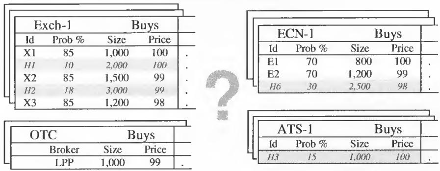  
Figure 8-12 Venue choice

In terms of visibility, venues range from fully transparent ones that do not support any hidden order types, to completely opaque ones where the whole order book is hidden. Investors or traders wishing to reduce their signalling risk will opt for venues which either support hidden order types, or are opaque, such as the "dark pool" ATSs. In fact, nowadays completely transparent venues are a rarity, since most exchanges or ECNs offer some type of hidden/iceberg order.

Execulion probability is another important factor when choosing between venues. The execution of our order may not be guaranteed, since there might be many other participants, sending different orders at the same time. Hence, in Figure 8-12 the order books are also shown with a percentage that reflects this probability. This may be based on a range of factors, including the probability of cancellation, latency and historical results. In section 8.6, we will consider this in some more detail. Hidden liquidity is another important consideration; we will cover this in more detail in section 8.5.

# Using "dark pool" ATSs

As their name implies, "dark pool" ATSs are intended to be opaque, hiding all orders so that their participants can trade in size without significant signaling risk. Though, the wide range of different mechanisms employed by ATSs and the increasing provision of hidden order types by exchanges has made it difficult to gauge just how opaque cach venue is. Some of the key concerns for investors are that their large orders are not:

gamed by other participants providing information for proprietary trading desks

Gaming refers to manipulating the market price for profit. We have already seen how IOC orders may be used to seek hidden liquidity without leaving a standing order on the order book. Normally, this should be used to try to cross in size with such liquidity, to the mutual benefit of both parties. In comparison, gaming implies taking a more cynical approach by issuing orders to drive the market price up (or down) before the final hit, when a large order is issued to cross with the hidden liquidity at this new price. This is a particular risk when the erossing is based on the main market's best bid and offer (e.g. the U.S. NBBO).

There is also concern that information about large orders is spotted by (or even made available to) proprietary trading desks. This would give them the advantage, allowing them to game or "front-run" the orders.' To prevent this most major broker/dealers enforce strict "Chinese walls" between their operations. This is not a question of technology – it is one of trust.

Toxie order flow is another term that is sometimes used. This is when orders interaet with low driven by participants, or quantitative systems, that are aetively trying to seek liquidity, solely to profit from short-term movements.

Many venues employ monitoring to spot when suspicious situations arise, gamers or frontrunners may then be exeluded from the venue. They may also set their pricing structures to make small orders prohibitively expensive for high-frequeney use. Enforcing large minimum trade sizes is another commonly used deterrent, since this prevents the initial liquidity secking (or "pinging"). Though, as Gabriel Butler (2007) points out, these have the downside of limiting the potential for aggregating liquidity since they prevent genuinely small orders.

Hitesh Mittal (2008) provides a nice review of some of the main concerns about these issues. In essence the main questions invesiors need to consider before using an ATS are:

Who has access? Is it buy-side only? Are liquidity providers used? Are proprietary desks allowed?   
What happens to my orders? - Are they advertised?   
How/where are trades reporied?

Clearly, buy-side only venues should be the "safest", since all participants should solcly be focussed on finding matches for their liquidity requirements. Still, it must also be remembered that liquidity providers and proprietary desks are useful sources of additional liquidity. It just needs to be clear that they are active at the venuc and that there is monitoring to protect all participants.

Indications of interest (IOIs) are another common concern. Advertisement-based ATSs generally restriet the information that is passed via these. Hence, the adverts or indieations are either sent to potential matehes, or if they arc broadcast to all participants then only a subset of the information is distributed, usually the asset and maybe the side and/or price. Some venues even allow the sender to control what information is publicised. Again, it is important to know these speeifies.

It is also important to remember that even though a "dark pool" may keep its order book hidden the trades must stil be reported. If the trade report does not include the ATS namc tradcrs may still be able to narrow it down to a number of venues based on where it is reported. For crossings, Mittal (2008) points out that most firms advertise the completed erosses with services such as Autex or Bloomberg. So there is always the potential for some signalling risk. This must also be factored in when deciding how best to take advantage of "dark pool!" iquidity.

# Order choice

In terms of risk, standing limit orders supply liquidity and so large orders have considerablc signaling risk. Thercforc, to reducc signalling risk it is important to hide our intentions. As we saw in Chapter 4, there is a wide range of order types that the trader may choose from, together with an array of optional instructions. Most exchanges and ECNs now support a mix of discrctionary, iccberg or fully hidden orders. Figure 8-13 highlights these various types and shows how different order choices take us from highly visible trading patterns through to more hiddcn ones.

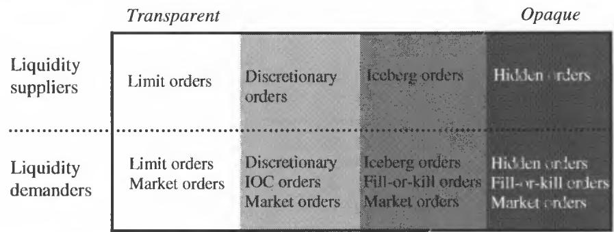  
Figure 8-13 Order types grouped by visibility

Starting with limit orders we then progress on to discretionary ones (hiding our true price limit) then to iceberg orders (hiding a portion of our ordcr size), finally ending with completely hidden orders. The orders are still providing liquidity, but with less and less visibility. Similarly, immediate-or-cancel and fill-or-kill instructions help hide marketablc limit ordcrs when they demand liquidity, since they prevent a residual order from staying on the ordcr book.

Order sizc is a key factor for order choice. Bessembinder, Panayides and Venkataraman (2008) found that on Euronext for large orders $( > \mathrm { { \notin } } 5 0 , 0 0 0 )$ more than $70 \%$ of orders wcrc hidden, whilst for small orders $( < \mathrm { { e } } 5 , 0 0 0 )$ only $5 \%$ were hidden. D'Hondt, De Winne and Francois-Heudc (2005) also confirmed that an order was more likely to be hidden when its sizc was greater than the currently displayed ordcr book depth.

Duc to thcir sizc, hidden orders can account for a considerable proportion of the available market volume. For instancc, Bessembinder, Panayides and Venkataraman (2008) found that $1 8 \%$ of the orders for thcir sample of Euronext Paris were hidden, these accounted for $44 \%$ of the total order volumc.

# Order aggressiveness

Aggressiveness is reflccted by order choice, price and size.

Market orders are gencrally the most aggressive type of order, since they have no pricc constraint. They strive to achievc immediate execution at the best price available. At the very Icast wc shall probably havc to pay half the bid offer spread, or even more if the order needs to swecp the order book in order to complete. So the aggressiveness of a market order is based on its sizc, since large orders are more likely to have to sweep the book.

Limit orders allow more control since we can choose how to set their inbuilt price limit.

Although this offers some price protection, it means they face the risk of failing to cxecute completely. Thus, the aggressiveness of a limit order is a function of both its limit pricc and its size.

In order to be able to compare the aggressiveness of different orders many of the microstructure studies have created classification schemes based on both price and size. One of the best-known schemes is shown in Table 8-2, based on a study by Bruno Biais, Pierre Hillion and Chester Spatt (1995). They assigned six categorics, ranked in order of aggressiveness. The three most aggressive levels are immediately executable and correspond to market orders or marketable limit orders, so order size is key to determining their impact.

Table 8-2 A classification scheme for order aggressiveness   

<table><tr><td rowspan=1 colspan=1>Category</td><td rowspan=1 colspan=1>Price</td><td rowspan=1 colspan=1>Size</td></tr><tr><td rowspan=1 colspan=1>1</td><td rowspan=1 colspan=1>Better than the bestopposite price</td><td rowspan=2 colspan=1>Larger than the bestopposite size</td></tr><tr><td rowspan=1 colspan=1>2</td><td rowspan=1 colspan=1>At the best oppositeprice</td></tr><tr><td rowspan=1 colspan=1>3</td><td rowspan=1 colspan=1>At or better than thebest opposite price</td><td rowspan=1 colspan=1>Less than or cqual to thebest opposite size</td></tr><tr><td rowspan=1 colspan=1>4</td><td rowspan=1 colspan=1>Within the best bid andoffer</td><td rowspan=1 colspan=1>Any</td></tr><tr><td rowspan=1 colspan=1>5</td><td rowspan=1 colspan=1>At the best price (sameside)</td><td rowspan=1 colspan=1>Any</td></tr><tr><td rowspan=1 colspan=1>6</td><td rowspan=1 colspan=1>Below the best price(same side)        =→</td><td rowspan=1 colspan=1>Any</td></tr></table>

The most aggressive category (1) represents orders that are priced better than the hest opposite price (either market orders or marketable limit orders) and are larger than the best opposite size. Next are orders that have a similar size, but are limited to the best opposite price, so a residual will be left on the book at that price. The third category consists of smaller orders, these are less than or equal to the best opposite size and are priced so that they may immediately execute. The remaining types are all standing limit orders that help provide liquidity; they are priced between, at or below the best price.

# Market factors affecting order piacement decisions

A substantial amount of microstructure research has examined how market conditions affect order choicc and aggressiveness. The studies are based on trading across a wide variety of execution venues, and help show how traders react to various market conditions. Some of these reactions are common sense, but some of the rescarch offers an insight into subtler responses.

To bricfly summarise these, the main determinants for order choice are generally the:

Spread Order book depth/height Volatility ● Time of day

Broadly speaking we can categorise these factors into three main types, based on liquidity, price and time. In the following sub-sections, we shall review the effect of each of these in turn.

# Liquidity-based factors

The importance of liquidity-based faclors such as spread and order book depth is hardly surprising. Liquidity is obviously a key driver for order placement dccisions.

# Spread

A widcr bid offer spread directly increases the cost of a market order. The price for immcdiacy is half the spread plus any additional market impact. Unsurprisingly, traders are more willing to supply liquidity when the reward is higher. Wider spreads tend to encourage the placement of limit orders over market orders. They also often decrease overall order aggressivencss.

Empirical support for this has been demonstrated for a rangc of stock exchanges, notably for the Paris Bourse by Biais, Hillion and Spatt (1995). It was also observed on the Stockholm Stock Exchange by Burton Hollifield, Robert Miller and Patrik Sandas (2004). Similarly, Angclo Ranaldo (2004) observed this for the Swiss Stock Exchange, whilst Joachim Grammig, Andreas Hcinen and Erick Rengifo (2004) reported it for the Xetra lrading systcm. Intercstingly, a study of the NYSE by Alessandro Beber and Cecilia Caglio (2005) found that this effect seems to be stronger for buyers than sellers.

Hidden ordcrs also seem to be adopted morc when spreads are narrower. This ncgative relationship with sprcad size was observed for NYSE Arca by Steve Bongiovanni, Milan Borkovec and Robert Sinclair (2006). It was also noted for trading on Euronext by Catherine D'Hondl, Rudy Dc Winne and Alain Francois-Heude (2005). They concluded that since narrow sprcads encourage more aggressive ordcrs, traders place more hidden orders to take advantagc of this increased execution probability.

In terms of overall aggressivcness, a study of the NYSE by Andrew Ellul et al. (2003) reported that marketable limit orders were more sensitive to spread than market orders. Whilst for the Spanish Stock Exchange Roberto Pascual and David Veredas (2008) concluded that the high immediacy costs of wider spreads discouraged traders from issuing small market orders.

# Order book information

The order book is an important source of information since it highlights the available liquidity. Order book dcpth represents the amount actually available for trading, whilst the imbalance corresponds to the difference between quantitics available to buy and sell. The order book height indicates the maximum potential price impact for a market order walking up the order book.

So far, we have generally viewed order books in a tabular fashion, Figure 8-14 shows another way of reprcsenting this liquidity, based on the total available depth. From this chart, we can clearly see the different order book hcights for buy and sell orders whilst the different gradicnts highlight the buy/sell imbalance.

The order book hcight affects the potential market impact. Charles Cao, Oliver Hansch and Xiaoxin Wang (2008a) showed that for the same side of the order book aggressivcness incrcases with book height, whilst for the opposite side it decreases.

Order book depth is important because so much of the available liquidity often lies outside the current best bid and offer, as we can clearly see in Figure 8-14. Mike Aitken et al. (2007) found on the ASX that institutional traders tended to offer more sell volume at one price step above thc best offer, with over $60 \%$ of the total volume up to threc price steps away. Likewisc, Hollificld, Miller, and Sandas (2004) noted that much morc depth was available on the Stockholm Stock Exchange, for Ericsson, away from the current best bid and offcr.

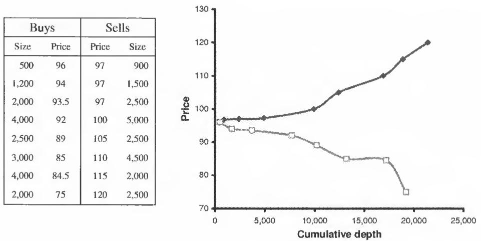  
Figure 8-14 Viewing the cumulative depth for an example order book

Empirically Jón Daníelsson and Richard Payne (2002) showed that limit orders became more common when order book depth was visibly low, for FX trading on Reuters Dealing2000. A similar result was found for orders on the Hong Kong Stock Exchange by Hee-Joon Ahn, Kec-Hong Bae and Kalok Chan (2001).

The different depths on each side of the order book can also have a major impact on the overall aggressiveness of orders. For instance, Mark Griffiths et al. (20oo), Pascual and Veredas (2008) and Ranaldo (2004) all observed that traders placed more aggressively priced orders when their own side of the order book was dceper. Convcrscly, they becamc less aggressive when the opposite side of the order book was deeper. This is not that surprising for execution venues that enforce strict price/time priority tradc matching. In an already crowded order book, the other orders will have time priority, therefore changing to use a market order or a more aggressive price limit is the most eflective way of increasing the execution probability. Hence, tradcrs tend to place more aggressive orders when the execution probability of a limit order is low. On the other hand traders placing orders on the opposite side will often tend to be more passive, relying on aggressive pricing by traders on the crowded side of the book. This is less of an issue for venucs based on price/pro-rata based trade matching.

Another way of viewing this is in terms of the overall order imbalance. A large imbalance of sells acts as an unfavourable signal, encouraging sellers to be more aggressive and buyers to be more passive.

Just as with spreads, Beber and Caglio (2005) observed some asymmetry in the behaviour of buyers and sellers with respect to depth on the opposite side. Sellers are considered to be more liquidity-driven and so become morc aggressive when the buy side of the order book is deeper. Failing to sell as the market moves downwards can result in a realised loss, whereas failing to buy as the market moves upwards means a reduced profit. Interestingly, Pascual and Veredas (2008) studied these relationships for both the best bid and offer as well as across the best five bids and offers for the Spanish Stock Exchange. They found that whilst liquidity providers seemed to base their decisions on information from the whole order book, market order traders focussed solely on the data from the best bid and offer.

The available depth can also have an important effect on the pricing of hidden orders. A study of hidden ordcr placement on Euronext by D'Hond, De Winne and Francois-Heude (2004) found that hidden orders were priced more aggressivcly if there was sufficient depth already available on the same side of the order book. Conversely, they noted that the displayed depth on the opposite sidc had limited effect on hidden order placement.

# Trade flow

There are two key indicators for trade flow, namely volume and frequency. Beber and Caglio (2005) found that for the NYSE, transacted volume had more impact on order aggressiveness than the trading frcquency, parlicularly for scll orders.

Trading volume has traditionally been scen as a proxy for market information, notably from work by David Easley and Maureen O'Hara (1987). Indeed Beber and Caglio (2005) concluded that the increased aggressiveness they obscrved for buy orders was consistent with information bcing revealed by large trading volumes. They also noted that volumc could confirm information about price trends. For most of their sample, there was a positive price trend, but even accounting for mormentum effccts they found that higher volumes generally led to an incrcasc in demand. Thus, buy orders became even more aggressive and sell orders more passive. For scll orders the increased picking-off risk helps cxplain the shift to more passive pricing.

In icrms of trading frequency, Bebcr and Caglio (2005) linked higher frequcncics to less aggressive buy and more aggrcssive sell orders. They concluded that these results were consisicnt with liquidity-based trading clustering on the sell side.

Notc that the increasing adoption of algorithmic trading and falling order sizes means that trade flow is significantly increasing. So in terms of information, there is now more noise in the markcts; trade flow is not quite thc indicator it once was.

# Other liquidity-based factors

Other asset-spccilic atributes may also be used as a proxy for liquidity. Most notably for equitics, we can use thc market capitalisation of firms as a rough guide. Likewise, credit ratings might also be used to help differentiate between the liquidity of bonds.

For firms traded on NYSE Arca, Bongiovanni, Borkovec and Sinclair (2006) found thal hidden ordcrs were used more for smaller cap firms, as shown in Table 8-3.

<table><tr><td rowspan=1 colspan=1></td><td rowspan=1 colspan=1>Large cap&gt; $10 billion</td><td rowspan=1 colspan=1>Mid cap</td><td rowspan=1 colspan=1>Small cap&lt;$1.5 billion</td></tr><tr><td rowspan=1 colspan=1># of stocks</td><td rowspan=1 colspan=1>26</td><td rowspan=1 colspan=1>43</td><td rowspan=1 colspan=1>260</td></tr><tr><td rowspan=1 colspan=1># of trades</td><td rowspan=1 colspan=1>207,000</td><td rowspan=1 colspan=1>87,800</td><td rowspan=1 colspan=1>72,000</td></tr><tr><td rowspan=1 colspan=1>Average visible size of trade</td><td rowspan=1 colspan=1>370</td><td rowspan=1 colspan=1>300</td><td rowspan=1 colspan=1>200</td></tr><tr><td rowspan=1 colspan=1>Average hidden sizc</td><td rowspan=1 colspan=1>550</td><td rowspan=1 colspan=1>450</td><td rowspan=1 colspan=1>320</td></tr><tr><td rowspan=1 colspan=1>% of tradc hidden</td><td rowspan=1 colspan=1>21</td><td rowspan=1 colspan=1>23</td><td rowspan=1 colspan=1>28</td></tr><tr><td rowspan=1 colspan=1>% fleeting/cancelled orders</td><td rowspan=1 colspan=1>11</td><td rowspan=1 colspan=1>9</td><td rowspan=1 colspan=1>13</td></tr></table>

Source: Bongiovanni, Borkovec and Sinclair (2006)

# Table 8-3 Results for trading on NYSE Arca

Similarly, Pardo and Pascual (2006) noticed that hidden ordcrs were more common for the Iess frequcntly traded Spanish index constituents. Whilst for Euronext Paris, Bessembinder, Panayides and Venkataraman (2008) found that up to $50 \%$ of ordcrs for the least liquid stocks were hidden, compared to $30 \%$ for the most liquid firms. Again, this makes sense, since we might expect hidden orders to be more prevalent for more illiquid asscts, wherc signaling risk is greater. Rudy De Winne and Cathcrine D'Hondt (2005) also found hidden liquidity to be negatively related to both trading volumc and market capitalization.

# Price-based factors

Again, it is no great surprise that price factors such as volatility and short-term trends have a considerable impact on order sclection. In particular, they affect order aggressivencss, as traders try to either catch up with the market or take advantage of favourable prices.

# Volatility

Thc execution probability of limit orders is clearly price dependent: The closer the price limit is to the current market price then the more chance it has to be filled. Higher volatility means the observed price range is likely to be wider and so incrcases the likclihood of cxecution for limit orders. However, it also increases the risk of adverse selection sincc ordcrs arc more likely to become mispriced. In seeking compensation for the raised advcrse selection risk, traders may place less aggressively priced orders. This in turn causcs sprcads to widen, making markct orders more expensive.

Scveral studies have confirmed that traders place less aggressive limit orders as volatility increases; for instance, Ahn, Bae, and Chan (2001), Daníelsson and Payne (2002), Ranaldo (2004) and Beber and Caglio (2005). These studies also noted a reduction in the usc of market orders. However, both Ellul et al. (2003) and Anthony Hall and Nikolaus Hautsch (2006) noted an increase in both limit and market order trading as volatility increased. Whilst Joel Hasbrouck and Gideon Saar (2002) found that limit orders were lcss likely to be suhmitted as volatility increased.

Price volatility may be measured over a wide range of timescales, ranging from intra-day to those bascd on months of historical data. Some of the diffcrences in these empirical observations may be explained by these different types of volatility. Short-term, or transient, volatility tends to closely rcflect the asset's liquidity whilst fundamcntal volaility is morc long-term and is often information-driven. For transient volatility, Puneet Handa and Robert Schwartz (1996) showed that the gains from supplying liquidity outweighed the adversc selection risk. Whilst in a later work, Handa, Schwartz and Tiwari, (2003) also found that higher fundamental volatility makes limit orders less attractive duc to thcir increased option value. For such asscts, they concluded that risk averse and informed traders tend to prcfer the certainty of market ordcrs.

Empirical studies have also positively linked the use of hidden orders to volatility. Hidden orders were found to he more commonly used for volatile stocks in trading on NYSE Arca by Bongiovanni, Borkovec and Sinclair (2006). Comparahle results wcre obscrved for the Australian Stock Exchange by Michael Aitken, Henk Berkman and Derck Mak (2001). Likewise, Michael Fleming and Bruce Mizrach (2008) found that pricc volatility increased the usage of iccberg orders for U.S. Treasuries on ICAP's BrokerTec.

Interestingly, analysis of Euronext's hidden orders found that liquidity-driven pricc volatility affected the order book asymmetrically. A study by D'Hondt, De Winne and Francois-Heude (2004) found that liquidity-driven volatility arising from the bid side encouraged placement of hidden buy orders. Whilst sell side volatility triggered more hidden sell orders. They concluded that traders adopted hidden orders when the risk of order exposure increases.

# Price Momentum

Trends in the market price are something that many traders closely follow. Consequently, price momentum can affect their decisions on both order choicc and aggressiveness. Ellul et al. (2003) analyscd short-term momentum trading on the NYSE. They found a positive dependcncy betwcen the frequcncy of buy orders and the return from the last five minutes, whilst a negative correlation was noted for sclls. In a similar study, Beber and Caglio (2005) used a momentum indicator based on the ratio between the price and an exponential moving avcrage (EMA):

$$
 M O M _ { t } = \frac { P _ { t } } { E M A _ { t } ( P _ { i } ) } = \frac { P _ { t } } { \lambda E M A _ { t - 1 } ( P _ { i } ) + ( 1 - \lambda ) P _ { t } }
$$

wherc $P _ { t }$ is the current price and the decay factor $\lambda { = } 0 . 9 5$ . They observed that as price momentum increased, buy orders became more aggressively priced whilst sell orders became less aggrcssive. Risk of non-execution is clearly an issuc for limit orders, particularly when the price is trending away. Beber and Caglio (2005) concluded that traders expect positive price trends to reduce the probability of execution of passive buy orders, whilst increasing the probability for sell limit orders. Conversely, the opposite holds for downward price momcntum. A similar rclationship was also noted by Yue-cheong Chan (2005) for the Hong Kong Stock Exchange.

The opposite cffcct was observed for the ASX by Hall and Hautsch (2006). They found a decrease in buy order aggressiveness for positivc price trends, based on five-minute returns. One possible explanation for these differences is that in the ASX study more traders may have becn cxpccting a reversion rather than a prolonged price trend. So any relationship between momentum and order pricing should also incorporate trader expectations.

Hidden order placement may also be affected by recent returns. Pardo and Pascual (2006) noticed a positive depcndency between the proportion of hidden orders and intraday slock returns. They concludcd that traders using hidden orders were often following the prevailing pricc trcnd.

# Tick-size

The tick-size represcnts the minimum allowed price increment. Thcrefore, it is closely aligncd with thc bid offer spread. Larger tick sizes will generally cause the bid offcr sprcad to incrcasc. They also make it more expensive to jump in front of an order, making "pennying" less attractive and helping to offset some of the signalling risk. So, in theory, hidden orders should be more common for assets with lower tick-sizes. Larry Harris (1996) studied the relationship bctwcen tick-size and order exposure for the trading of both French and Canadian stocks. He found that larger ticks did encouragc more order exposurc. This was also confirmed in an empirical study of the French scgmcnt of the Euro NM by D'Hondt, De Winne and Francois-Heudc (2001) and by analysis of the Australian Stock Exchangc by Aitken, Bcrkman and Mak (2001).

# Time-based factors

Time also has a marked effect on order placement, whether it is the timc of day or the recent trading history. Often, markets arc more volatile around their opcning and closing, hence thc adoption of call auctions.

# Time of day

Market conditions change throughout the day; therefore, traders adjust their order placement decisions accordingly. Figure 8-15 shows how the average spread, depth, volume and volatility changed for stocks on the Spanish stock market in 2002, taken from a study by

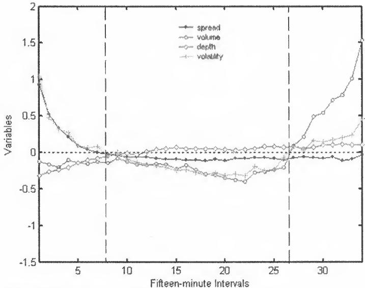  
Source: $^ { © }$ Abad, Sanabria and Yagüe (2005) Reproduced with permission from authors   
Figure 8-15 Intraday patterns of liquidity/activity in the Spanish stock market in 2002

David Abad, Sonia Sanabria and José Yagie (2005). The dashed lines highlight three distinct phascs throughout the trading day. At the open, a period of lower liquidity lasted for around two hours, with higher spreads and relatively low quoted depths. This corresponds to the uncertainty that traders face each morning. The next phase was an intermediate period where liquidity improved and volatility decreased. This may be explaincd by the fact that the trading patierns help relay information, thus decreasing some of the unccrtainty for traders. Finally, the last period, from around $3 { : } 3 0 ~ \mathrm { p m }$ , coincided with the U.S. open, hence there was a substantial inerease in trading volume. Though, there was only a slight improvement in overall liquidity.

Similar trends may be found in most markets. For example, a comparahle change in the average relative spread combined with an increase in the cumulative depth is noted for a study of Xetra stocks by Alexandcr Kempf and Daniel Mayston (2008).

Clearly, the natural evolution of market conditions throughout the day has a significant impact on order placement decisions. Simply knowing that the market will soon be closing can force some trader's hands. Indecd, it seems to polarise traders' behaviour; some become considerably more aggressive, whilst others will place more passive orders just before the close. Figure 8-16 shows how the type of order can vary over time, again taken from the Ahad, Sanabria and Yagiie (2005) study. In this casc, limit orders were more heavily used in the uncertain morning period whilst market orders dominated as the day reached a close. Similarly, several studies of the NYSE havc found that traders tcnd to place more aggressive orders as the day progrcsses. Beber and Caglio (2005) observed this for boih buy and sell orders, whilst Ellul et al. (2003) found that towards the close, limit orders were more likely to be priced at or inside the quote. They also found that traders placed less aggressively priced limit orders earlier in the day.

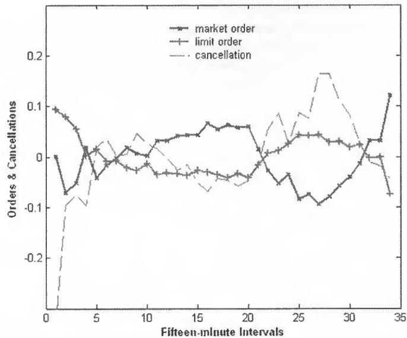  
Source: $\circledcirc$ Abad, Sanabria and Yagie (2005) Reproduced with permission from authors   
Figure 8-16 1ntraday patterns of orders in the Spanish stock market in 2002

This rcaction seems to vary based on the execution venue. For instance, Figure 8-17 shows order placement dccisions throughout the day on NYSE Arca, from a study by Bongiovanni, Borkovec and Sinclair (2006). They found that towards the close orders were more likcly to be passive, priced away from the market. At the beginning of the day, the

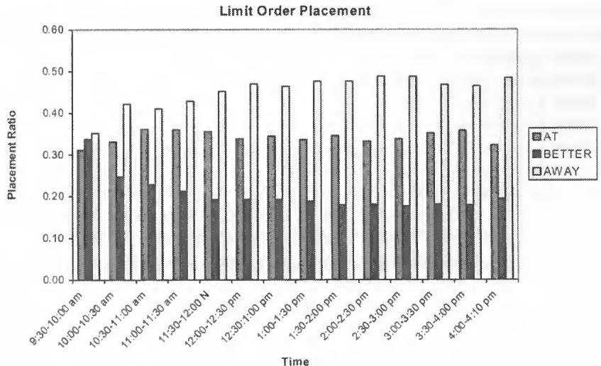  
Figure 8-17 Order placement probabilities on NYSE Arca based on the time of the day

Source: Bongiovanni, Borkovec and Sinclair (2006) Reproduced with permission from ITG Inc. and Insitulional Investor placement decisions were fairly evenly split between pricing at, better or away from the current best price. Then, as the day progressed, the proportion of aggressively priced orders steadily declined. They observed that thc order placement pattern mimicked the spread curve; so much of the change in order placement choice may be attributed to this. Some of this difference may also be due to the fact that NYSE Arca is effectively an ECN so traders may adopt slightly different strategies on the primary cxchange.

The time of day can also affect the decision to place hidden orders. Studics have shown that the proportion of hidden orders tends to increase towards the end of the day. A possible reason for this increase was proposcd by D'Hondt, De Winne and Francois-Heude (2001). They reasoned that the informational value of orders increases belore a call auction. Therefore, before the closing auction orders suffer higher lcvels of cxposure risk, making hidden orders more atractive.

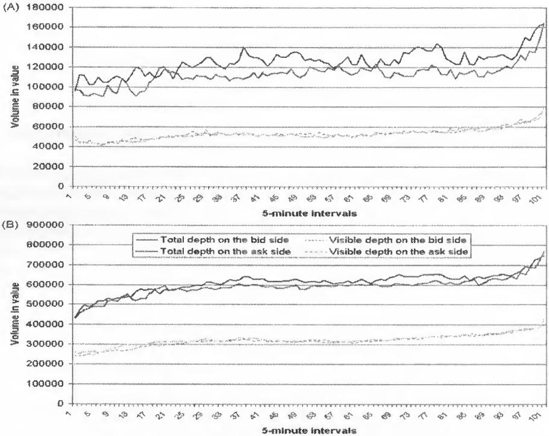  
Source: $^ { © }$ D'Hondt, De Winne and Francois-Heude (2004) Reproduced with permission from authors   
Figure 8-18 Depth behaviour at the (a) best (b) five best limits of the order book

Figure 8-18 shows charts for both the total and visible order book depth for stocks in the CAC40, throughout the trading day. This is from analysis by D'Hondt, De Winne and Francois-Heudc (2004). As we can see, the visible depth is fairly stable and increases gradually throughout the day, both at thc best limit and at the best five limits. However, note the volatile total depth for the best limit in Figure 8-18(a). This is due to sizeable fluctuations in hidden liquidity throughout the day, whereas across the best five limit prices the hidden depth sccms to be a lot more stable.

Hendrik Bessembinder, Marios Panayides and Kumar Venkataraman (2008) found a similar increase in hidden order usage on Euronext. Likewise, Angel Pardo and Roberto Pascual (2006) reported the same trend for hidden orders on the Spanish Stock Exchange.

Note that so far all of this analysis has been for equities. For U.S. Treasuries, Fleming and Mizrach (2008) found that the proportion of hidden depth was much higher outside New York trading hours; in fact, it was at its lowest between 08:00 and 11:00. Hence, dilferent hehaviour may well apply for other asset classes.

# Last event

Trading activity is often clustered, so any event is likely to increase the probability of anothcr one happening soon after, whether they are new orders, modifications or cancellations.

In thcir empirical analysis of the Paris Bourse Bias, Hillion, and Spatt (1995) found a positive serial correlation for the arrival of order types. In other words, a buy order will often be followed by another buy. A similar result was found in a study of the NYSE by Andrew Ellul et al. (2003). Note that this effect is not limited to stock markets, for instance, Daníclsson and Payne (2002) discovered a serial correlation for order placement on Reuters' Dealing 2000 FX broking system.

Hans Degryse et al. (2005) found a similar correlation in their study of French stocks. Though, they also found that there was a high probability that an aggressively priced order was followed by a more passively priced one, for both buy and sell orders. They attributed this to traders reacting to the change in spread after aggressive orders. Similarly, Ellul et al. (2003) found that after a marketable order had consumed liquidity, limit orders were more likely to arrive on the opposite side of the order book, rather than replacing the lost depth on the same side.

Rcsearch is continuing to look into why such serial correlation occurs. In fact, the cmpirical evidencc is still at odds with some of the theoretical models. For example, a model created by Christinc Parlour (1998) predicted a negative serial correlation, since sequential buys or sells reduce the probability of execution. The positive correlation is most likely due to a combination of factors, based on traders' order placement strategics and their reaction to short-term price trends. In fact, a study of NYSE data by Wee Yong Yeo (2008) ascrihes over two thirds of the correlation as being due to order spliting strategies and price undercutting.

# 8.5 Dealing with hidden liquidity

A range of studies has examined the impact of hidden liquidity, whether this is from fully hidden ordcrs or the hidden portion of icebergs. The hidden liquidity is either inferred from order book data or by analysing private exchange data. Primarily, these studies have focussed on thc equity markets. Table 8-4 shows estimates for the proportion of hidden orders used at the major U.S. venues, based on analysis by Rosenblatt Securities (2009). Clearly, a signilicant proportion of order flow at these venues is now hidden.

Academic studies have found similar results, for instance, Laura Tuttle (2003) found that up to $20 \%$ of the inside depth for NASDAQ 100 stocks was hidden. In Europe, D'Hondt, De Winnc and Francois-Heude (2004) reported that for France's CAC 40 stocks around $3 5 \%$ of the order volume at the five best limits was hidden. 2 Likewise, Bessembinder, Panayides and Venkataraman (2008) found that around $45 \%$ of the order volume was hidden for a

<table><tr><td rowspan=1 colspan=1>Venue</td><td rowspan=1 colspan=1>Hidden ADV (April 2009)in millions of shares</td><td rowspan=1 colspan=1>% of venue&#x27;svolume</td></tr><tr><td rowspan=1 colspan=1>NASDAQ</td><td rowspan=1 colspan=1>243.2</td><td rowspan=1 colspan=1>10.4</td></tr><tr><td rowspan=1 colspan=1>BATS</td><td rowspan=1 colspan=1>88.2</td><td rowspan=1 colspan=1>4.8</td></tr><tr><td rowspan=1 colspan=1>Direct Edge</td><td rowspan=1 colspan=1>65.2</td><td rowspan=1 colspan=1>4.6</td></tr><tr><td rowspan=1 colspan=1>NYSE Arca</td><td rowspan=1 colspan=1>63.1</td><td rowspan=1 colspan=1>3.4</td></tr></table>

Source: Rosenblat Securities (2009)

# Table 8-4 Hidden volume estimates for the order books of major U.S. equities venues

sample of 100 stocks traded on Euronext Paris. Whilst Pardo and Pascual (2006) found that for their sample ol trades on the Spanish Stock Exchange around $1 8 \%$ involved hidden volume.

So far, there has been less analysis of the usage of hidden liquidity for other asset classes. For U.S. Treasuries the use of iceberg orders on ICAP's BrokerTec platform was analysed by Michael Fleming and Bruce Mizrach (2008). They found that usage was fairly low on average (around $3 . 3 \%$ for the 2-year note); although when there was hidden depth, it was substantial.

Fully hidden orders have become popular once more, in part due to the success of the "dark pool" ATSs. Exchanges had been switching to the parially visible iceberg orders, but have now started to offer purely visible orders again. A study by Amber Anand and Danicl Weaver (2004) found that the total visible depth for Canadian stocks did not change whether hidden orders were allowed or not. However, the actual market depth incrcased with their reintroduction. They concluded that hidden orders increased the use of the limit order book and provided liquidity that would not have otherwise been available. Tutle (2003) reported similar findings for hidden volume on NASD AQ.

# Spotting hidden liquidity

Hidden orders and "dark pool" ATSs represent an important source of additional liquidity.   
Spotting or predicting where any such liquidity may be available can give a signilicant edge.

Whilst hidden orders may be used to reduce signalling risk it is important to remember that they are not always truly invisihle. For instance, on venues with visible order books the other market participants can try to track hidden orders by following changes on the order book and comparing these with the reported trades (provided they are reported in real-time). This is harder for completely opaque venues, such as some "dark pool" ATSs, but some participants may still try to find such liquidity.

To search for hidden liquidity we must compare the size and price of cach trade with the order book. Any diserepancies may signify additional liquidily, or they might be due to a delay between the price and trade feeds.

For example, Figure 8-19 shows the order book before and after a trade for 500 ABC at 101. Given the trade price and the fact that the buy side of the order hook remains unchanged, presumably the trade was triggered by a buy markel order for 500 or a marketable limit order with a limit of 101, possibly with an IOC or fill-or-kil instruction.

On the sell side, notice the new order S4 for 1,000 at 101. This may just be a new limit order; alternatively, it may correspond to another tranche of an iceberg order. Without being able to identify the owner of each order, it is dificult to tell. Only by tracking the order book continually may we start to identify regular patterns. For example, if the order Sl had originally been for 1,000 and 500 had previously executed, there might possibly be an iceberg order with a display size of 1,000 at 101.

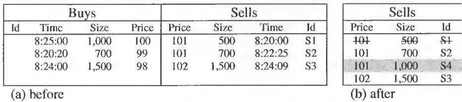  
Figure 8-19 Order book before and after a trade for ABC

Continuing our example from Figure 8-19, another order triggers trades of 2,200 at 101, leaving the order book as shown in Figure 8-20(b). The new sell order S5 could just be a coincidence, but it could also be a 1,000 display size for an iceberg at 101, which just crosscd 500 with the last buy order.

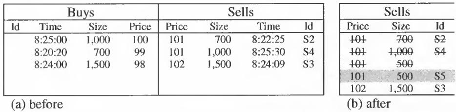  
Figure 8-20 Order book before and after further trades for ABC

A regular display size can make iccberg orders easier to spot, though the actual hidden liquidity may sti only be estimated. If the iceberg display sizes are randomized or fully hidden orders are used then things become even more difficult.

Often it is casier to spot hidden liquidity once it has been consumed. For example, Figure 8-21 shows the order book before and after trades for 2,000 ADE are reported at 110.

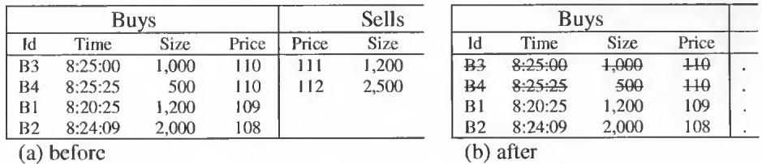  
Figure 8-21 Order book before and after trades for ADE

The sell side of the order book remained unchanged, so the incoming order crossed with buy orders and completed. Howcver, huy orders B3 and B4 can only account for 1,500 of the traded volume, therefore 500 was potentially filled from a hidden order. Since no new order has appeared on the buy side and the best bid is now 109, the hidden liquidity at 110 may well have bcen cxhausted. The only way to find out wil be to send an order at 110 and see if it is filled.

When traders do discover hidden liquidity, unsurprisingly, they tend to place morc aggressive orders in an attempt to bencfit from execution improvement. Thus discovering hidden depth on the buy side will result in more aggressive sell orders. Pardo and Pascual (2006) found cmpirical evidence for this on the Spanish Stock Exchange, as did D'Hondt, De Winne and Francois-Heude (2004) for Euronext Paris.

Still, even if the hidden liquidity is exhausted by the time our orders reach the venue, there is always the chance for more. As Bongiovanni, Borkovec and Sinclair (2006) point out, once hidden liquidity has been discovered there is a good chance that more will rcturn in the near future.

# Estimating the probability of hidden liquidity

As we have already seen, the proportion of hidden orders is dependent on market conditions such as the spread, price volatility and momentum, as well as factors such as the time of day. The aggressiveness of hidden orders may be related to the order book depth on the same side. Thereforc, models to cstimate the size and location of hidden liquidity must incorporate these various conditions.

Another important factor for the availability of hidden liquidity is the type of orders that are provided by the venue. A fully hidden order may exist anywhere on the order book as a standing limit order, although it must give priority to displayed orders. For some markets that support fully hidden orders, liquidity may even exist betwecn the current best bid and ofler. Alternatively, iceherg orders only hide a portion of their total order size. An aggressively priced iceberg order will make the market, thus becoming the new best bid or offer. So using these orders liquidity may only be hidden at, or behind, the best hid or offer.

A nice example of predicting the placement of fully hidden orders is provided by a study of trading on NYSE Arca by Steve Bongiovanni, Milan Borkovec, and Robert Sinclair (2006) from ITG Inc. They used models to cstimatc the size and location of hidden orders based on a mixture of live and historical market condilions. Firstly, they identified all the trades that executed with hidden orders and extracted the associated market conditions, mapping them using a probability regression model. Thus, for any given set of market conditions working backwards gave the historical average for the size of hidden orders. Next, they used a separate model to estimate the probabilities for where this volume might he hidden, again based on current market conditions such as spread and volatility.

As an example, they used the NASDAQ listed stock AGII (Argonaut Group Inc.): In the last five minutes, 1,000 shares traded, of which $30 \%$ were classified as hidden. They also note that the current effective spread was one standard deviation less than its historical average, whilst the current volatility was half a deviation higher than the norm. Both these factors suggest that more hidden liquidity is likely to be placed. Using these conditions, their model expected around 60 shares to be instantly available between the best bid and offer, whilst in five minutes this should increase to nearly 300 shares. Similarly, their placement model estimated that nearly three quarters of this hidden sell liquidity would be priced at the best offer price. By muliplying these probabilities by the expected quantitics, we can create a breakdown that shows the hidden sizes expected at each price level, shown in Table 8-5.

Figure 8-22 shows how our order book model might look once these estimates have been incorporated. This should help improve our order placement decisions for the next five minutes.

Table 8-5 Hidden liquidity estimates   

<table><tr><td rowspan=2 colspan=1>Price $</td><td rowspan=1 colspan=3>Estimated hidden quantity available:</td><td rowspan=2 colspan=1>Probability%</td></tr><tr><td rowspan=1 colspan=1>Instantaneous</td><td rowspan=1 colspan=1>2 minutes</td><td rowspan=1 colspan=1>5 minutes</td></tr><tr><td rowspan=1 colspan=1>35.00</td><td rowspan=1 colspan=1>3</td><td rowspan=1 colspan=1>7</td><td rowspan=1 colspan=1>13</td><td rowspan=1 colspan=1>4.6319</td></tr><tr><td rowspan=1 colspan=1>35.01</td><td rowspan=1 colspan=1>2</td><td rowspan=1 colspan=1>4</td><td rowspan=1 colspan=1>8</td><td rowspan=1 colspan=1>2.7683</td></tr><tr><td rowspan=1 colspan=1>35.02</td><td rowspan=1 colspan=1>5</td><td rowspan=1 colspan=1>12</td><td rowspan=1 colspan=1>23</td><td rowspan=1 colspan=1>8.0532</td></tr><tr><td rowspan=1 colspan=1>35.03</td><td rowspan=1 colspan=1>6</td><td rowspan=1 colspan=1>15</td><td rowspan=1 colspan=1>29</td><td rowspan=1 colspan=1>10.5157</td></tr><tr><td rowspan=1 colspan=1>35.05</td><td rowspan=1 colspan=1>43</td><td rowspan=1 colspan=1>109</td><td rowspan=1 colspan=1>207</td><td rowspan=1 colspan=1>74.0309</td></tr></table>

Source: Bongiovanni, Borkovec and Sinclair (2006)

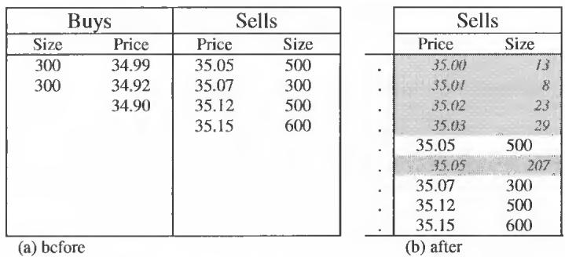  
Figure 8-22 Order book before and after including hidden liquidity estimate

For iccberg orders, an empirical study of CAC 40 stocks on Euronext Paris by D'Hondt, De Winne, and Francois-Heude (2004) found they were focussed around the five best limits of the order book. Figure 8-23 shows their results, plotting the proportion of orders placed against their level of aggressivencss. The categories for order aggressiveness are based on those proposed by Biais, Hillion and Spatt (1995) (see section 8.4) where 1 is the most aggressive and 6 the least.

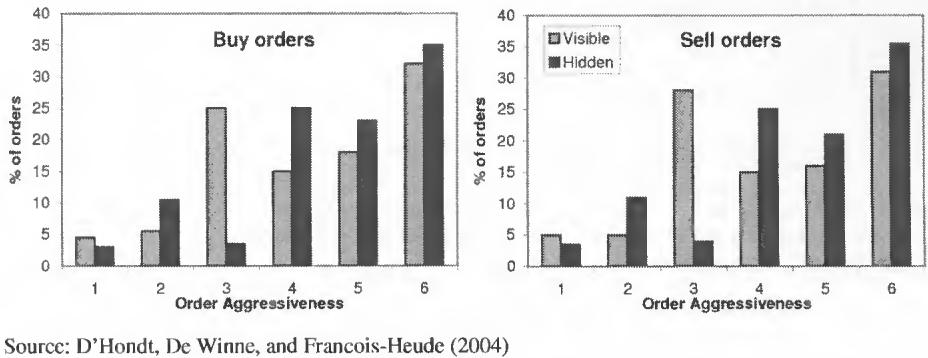  
Figure 8-23 Proportion of orders based on order aggressiveness

As we can sce from Figure 8-23, the behaviour of buy and sell orders is similar, with around $2 5 \%$ placed between the best bid and offer (group 4) and over $20 \%$ placed at the best price (bid for buys, ofer for sells). They are noticeably less aggressive than normal orders with about $3 5 \%$ placed away from the corresponding best bid or offer (group 6).

Another feature of iceberg orders is that the displayed size gives us a baselinc for gucssing the total order size. For instance, Angelika Esscr and Burkart Mönch (2007) observed a strong prcfcrence for the chosen display size to be $10 \%$ of the ovcrall volumc, for the samplcs in their study of trading on XETRA. Indeed, nearly $40 \%$ of all tradcrs followcd this trcnd, with $5 \%$ as the next most popular display size. Whilst on Euronext Paris D'Hondt, De Winne and Francois-Heude (2005) found that the median display size for iccberg orders was around $1 7 \%$ . In an carlicr study of the French segment of the Euro Nouveau Marché D'Hondt, De Winne, and Francois-Heude (2001) found that more than $70 \%$ of the hidden orders displaycd lcss than $30 \%$ of their total order size.

Obviously, thcre is no guarantce that there is hidden liquidity, or how closely it might match these cstimates, wc shall only find out when we place a buy order (or somconc else docs). Howevcr, these estimates can be some help when trying to choosc betwcen venues.

# 8.6 Estimating execution probability

Execution probability offers another way of looking at ordcr placcmcnt. Limit orders sacrifice execulion probability for pricc ccrtainty, whilst market ordcrs do the opposite. As we saw in section 8.4, a wide range of factors such as liquidity, volatility and price trends should be taken into account. By incorporating al these factors into suitablc modcls, we can estimate the probability of execution of any givcn limit order. Such limit ordcr modcls allow both tradcrs and algorithms to sclect limit prices that bcst match thcir trading rcquirements and the current market conditions.

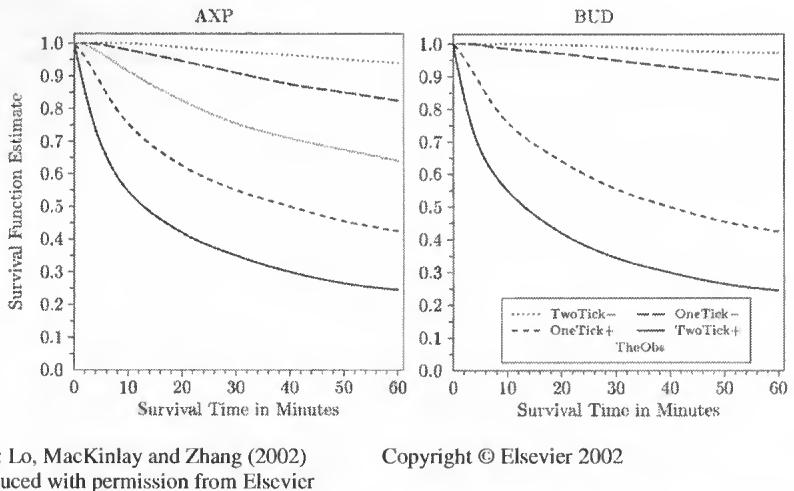  
Figure 8-24 Survival function sensitivity to limit price

Andrew Lo, A. Craig MacKinlay and June Zhang (2002) modclld thc dependency of execution times bascd on the limit price, order size and current market conditions. Thcy uscd a statistical technique called survival analysis to analyse the lifetimcs of limit orders. A survival function is defined and evaluated to dctermine the probability that a specific limit ordcr is still active after a certain amount of time. This function may then be uscd to infcr the probability of execution, once any canccllations are accountcd for. Figure 8-24 shows some examples for two NYSE stocks. Notice how much the probability can vary for different prices. For instance, in this example an order for Budweiser (BUD) has about a $9 5 \%$ probability of surviving 30 minutes when placed one tick below the limit price. Whereas an order placed one tick above has only a $5 5 \%$ chance. Clearly, for a buy order the higher its limit price the lower its survival probability, and so the higher the likelihood of its execution.

The ITG limit order model uses an econometric model of order execution time, also based around survival analysis. ITG (2003) provides a nice example, shown in Figure 8-25. This chart reflects the probability of execution of an order for a range of limit prices over the next half hour. It clearly highlights the non-linear relationships between the probability of cxccution and both price and time. Note that the shape of each chart will depend on the assct, thc order sizc, the current market conditions and the time of day. For example, thc chart shown in Figure 8-25 represents a buy of 500 shares for a liquid NYSE stock. The large rise in probability around the current bid $( \$ 23.00 )$ and offer $( \$ 23.10)$ is clearly visible.

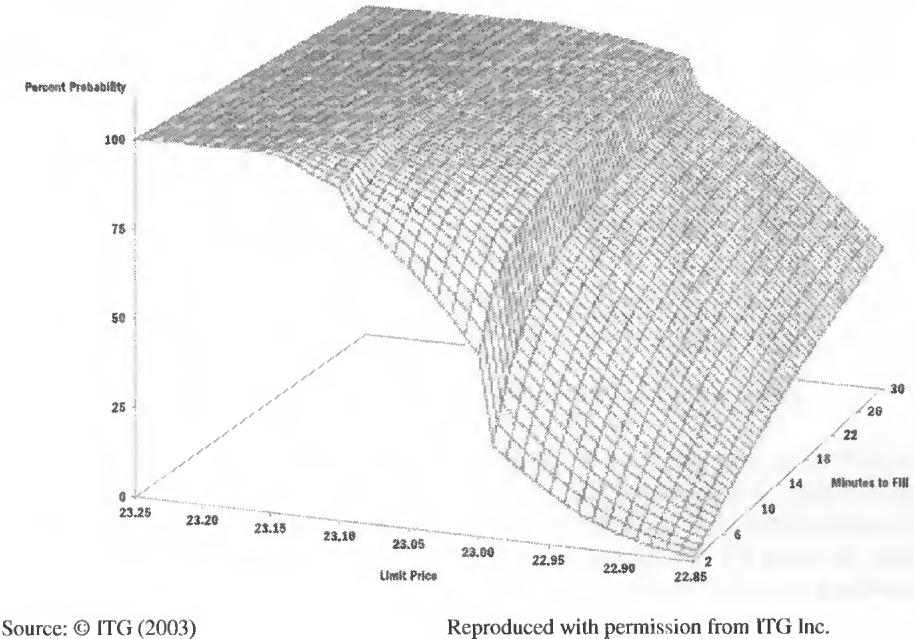  
Figure 8-25 Execution probabiity of a limit order

Also, notice that price increments have much more impact in the short term, hence the somewhat skewed surfacc.

Estimating thc likelihood of exccution is simply a matter of selecting a limit price from the bottom axis, matching this with thc required time horizon and then finding the corresponding probability from the chart's surface. So for this example order, sitting on the bid providcs around a $2 5 \%$ probability of execution within the next two minutes, or up to $70 \%$ over the next thirty minutes. Raising the limit price increases this, indeed setting the limit at the offer douhles the probability of execution. Therefore, we can use such limit order models to estimate the probability of execution of our orders. Alternatively, by targeting a specific probability of cxccution and a time horizon we can determine the limit price requircd to achicve this. For instance, if we requirc $100 \%$ certainty within the first two minutes then Figure 8-25 suggests using a limit price of $\$ 23.15$ .

Clearly, liquidity varies throughout the day and so alters the probability of execution. This can have a considerable efect, particularly for alternate execution venues, such as "dark pool" ATSs, where traders may opt to switch to trading on the main exchange around the close. Figure 8-26 shows a nice example of this, taken from a study for ITG Inc. by Hitesh Mittal and Ronald Taur (2008). For the sample "dark pool" shown in Figure 8-26, we can clearly sce a decline in the execution probability (or hit rate) just before the close. The effect is most pronounced for the large-cap stocks. This is probably because suhstantial volumes will be trading on the main exchanges at the close.

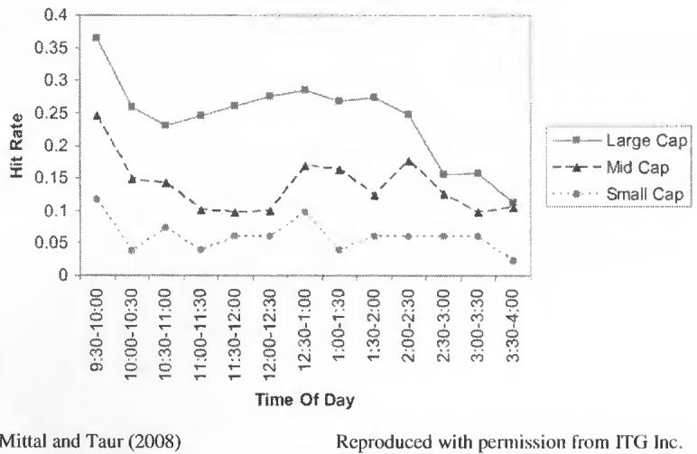  
Figure 8-26 Hit Rates for Iisted stocks in a "dark pool"' ATS

So in order to be accurate, limit order models have many different factors that they need to take into account. Though, once created they can be an invaluable aid to the decision making process. As we have seen, we can use them to select appropriate limit prices bascd on the order size and data for the current market conditions. This should allow us to scck price improvement without sacrificing execution probability.

# 8.7 Summary

Price formation is a multi-stage process. The fair valuc of an assct reflects its actual worth whereas the market price reflects what people are prepared to pay.   
Market microstructure rescarchers have used a wide range of models to investigate the price formation mechanism. Inventory-based models take the dealer's point of view, whilst information and order book based models assume there are other sources of information, which may in turn affect asset pricing.   
Price discovery / trade execution is generally achieved by bilateral trading (with a market maker) or via auctions (continuous or call-based).

Continuous auctions typically prioritise orders based on their price. Secondary priority is commonly assigncd to time (e.g. equitics markets) or pro-rata (size) (e.g. listed derivatives). Though, there is a range of other variants, particularly for pro-rata matching.

Mid-point matches may be used for venues that do not have their own price discovery mechanism; here the price is sourced externally, often from the primary exchange.

Order placement decisions require us to choose where we are prepared to trade and how (which order types we will use) as well as how aggressively we will price and size our order/s.

In today's increasingly fragmented marketplaces, choosing where to place an order can he as important a choice as the price or size.

Empirical market microstructure research has analysed how order placcment decisions and execution probability are affected by market conditions. Order choice and aggressiveness are affected by the:

spread   
order book depth and height   
volatility   
other factors such as the time of day

Hidden orders can be a significant source of additional liquidity, market conditions may also be used to estimate the probability of finding any.

Limit order models provide estimates for the exccution probability of an order. Such models provide a more quantitative basis for order selection.

# Chapter 9 Execution tactics

Execution tactics focus on the micro level decisions that need to be made when trading. They are responsible for the actual execution, monitoring the order book and managing order submission.

# 9.1 Introduction

Execution tactics represent the micro-level choices that must be made during trading. Typically, this means order placement and management. The division of labour between trading algorithms and execution tactics is clearest for the earlier schedule based algorithms. For example, in an all day VW AP algorithm the trading schedule might be based around 15 minute volume "buckets". During the first period, it might aim to trade 3,000, then 2,000 in the next and so on. So for each 15-minute period an execution tactic may be tasked with trading a specific amount. It might simply choose to place a single limit order at the best bid or offer; alternatively, it could slice the amount into a series of smaller orders, as shown in Figure 9-1. In some ways, an execution tactic may be thought of as a mini-algorithm, with a trading horizon of seconds or minutes rather than hours.

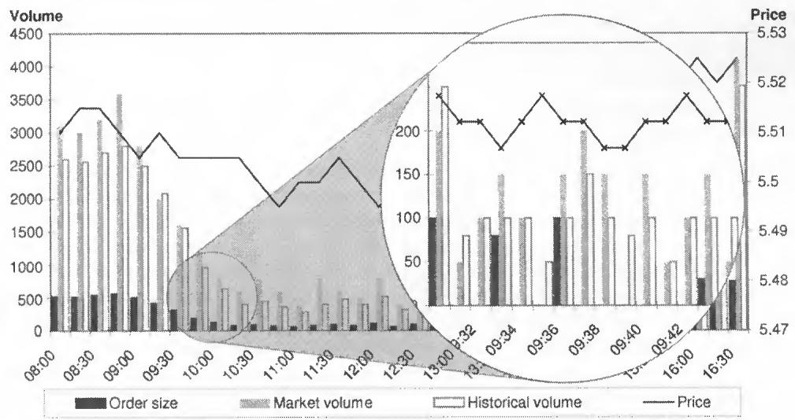  
Figure 9-1 Comparing trading algorithm and execution tactic horizons

In order to achieve thcir objectives, execution tactics oftcn adopt a range of common trading mcchanisms. As we saw in Chapter 4, dynamic orders arc becoming increasingly sophisticated, so there are often crossovers between common trading tactics and the actual underlying order types. For instancc, pcgging is obviously rclated to pegged orders, whilst hiding rclies on iccberg and hidden order types. Though, not all venues support these order types, so trading tactics can providc a convenicnt abstraction. The tactics can then cithcr use the native order types, or adopt an order placement strategy that essentially mimics the required behaviour for venues that do not support them. Alternatively, trading tactics may also employ more complex logic than is currently available via native order types.

As trading algorithms have evolved, many now track market conditions on a tick-by-tick basis. One way of adapting to changing conditions is to use different execution tactics. Whcn market conditions are favourable, an aggressive approach may be employed; then as they become less favourable, it could switch back to using a more passive one.

Note that it is important to realise that there does not have to be a one-to-onc relationship bctween trading algorithms and cxecution tactics. Somc algorithms may use several cxccution tactics in parallel, leaving passive ones to trade over a longer horizon whilst quicker, more aggressive techniques take advantage of favourable prices.

# 9.2 Designing execution tactics

The simplest execution tactics are static; so all the logic resides with the trading algorithm. Elfectively, these merely consist of spliting child orders to the market with an appropriatc price. Passive approaches will adopt limit ordcrs priced at or behind the markct whilst aggrcssive oncs usc cithcr markct or marketablc limit ordcrs.

Neutral tactics are morc llexible. They may start out passively, seeking price improvement, but if they fail to exccute within a ccrtain amount of time they will update or cancel the extant orders, replacing them with more aggressively priced ones. The dcadline for exccution may just be a fixed period (say five minutes). Alternatively, it could be determined from a limit ordcr modcl, as we saw in Chapter 8.

Tactics that are more dynamic tend to consider market conditions when making ordcr placement choices. For example, as wc saw in Chaptcr 8, thc order book conditions that generally tend to cncouragc traders to placc Icss aggressively priccd ordcrs arc:

• wider spreads suflicient depth, or prices further apart, on the opposite side of the order book insuflicient depth, or prices close togethcr, on our side of the order book

Given favourable conditions, a passive price-driven tactic may well price its orders further from the market, seeking price improvement. Alternatively, risk/cost-driven tactics may opt to weigh up the potential costs and decide whether it is better to wait or takc an immediate hit. Opportunistic tactics may trade aggressively to take advantage of the current conditions.

So, broadly speaking, execution tactics may be classified based on the goals that drivc thcir usage, just as we catcgorised trading algorithms in Chapter 5. Some common cxamplcs arc shown in Table 9–1.

In general, impact-driven tactics scck to further reduce markct impact by splitting thc order into smaller quantities or by hiding a portion of it. Price/risk-driven approaches strive to dynamically adjust bascd on the market conditions. Similarly, the opportunistic oncs look to take advantage when conditions are favourable.

Table 9-1 Common trading tactics/mechanisms   

<table><tr><td>Impact-driven</td><td>Price/Risk-driven</td><td>Opportunisticl Liquidity-driven</td></tr><tr><td rowspan="3">Slicing Hiding</td><td>Layering</td><td>Seeking</td></tr><tr><td>Pegging</td><td>Sniping</td></tr><tr><td>Catching</td><td>Routing Pairing</td></tr></table>

Note that a lot of the functionality is applicablc amongst the various types so thesc catcgorisations are merely guidelines; diferent approaches may well use them in a "pick ${ \bf \epsilon } _ { \mathrm { { n } } }$ mix" fashion. It is important to remember that the trading algorithm is stil the main driver of the trading strategy, but by selecting the most appropriate execution tactics, wc can further enhance performance.

# Impact-driven tactics

Just as impact-drivcn trading algorithms brcak down the order into smaller quantities, these tactics apply a similar approach to order placement. Order slicing usually creates tranches that are placcd scquentially. Alternatively, the child orders may be hidden, either with the appropriate order types or by scnding the order to an opaque ATS.

#

Order slicing is essentially the precursor to the early schedule-driven algorithms. That said, it can still be a useful approach. Reducing thc sizc of an order can lower its markct impact and any associated signalling risk, albeit at the cost of execution probability.

Exccution tactics usually focus on a much smaller timeframe than a trading algorithm. For cxample, an over the day VWAP algorithm might need to trade 100,000 of ABC. Though, in a ten-minutc period, it may only need the execution tactic to work 3,000. Dcpending on the market, 3,000 could still be too large to place as a single order, therefore order slicing can be used to reducc this to a scries of less noticeable sizes. Randomisation is a way of further reducing signaling risk. This applies to both the quantitics to be split and the time betwcen each child order. Otherwise, a very predictable trading pattern emcrges, which might be taken advantage of by other market participants. For instance, Figure 9-2 shows two diferent tactics to split an order for 1,000 ABC over the same time period. Clearly, the more random second strategy is harder to second-guess.

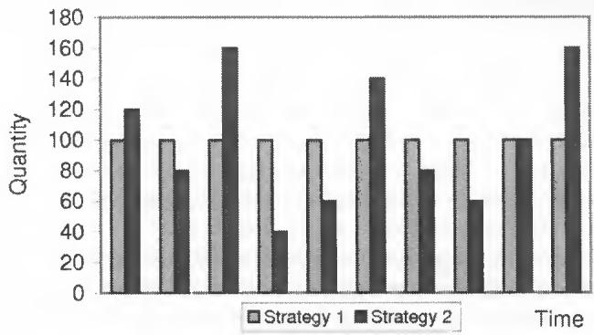  
Figure 9-2 Two alternative order splitting tactics

Used sequentially, order slicing efectively acts as a hiding mechanism. It may be adopted to create synthetic iceberg orders for venues that do not natively support this order type. Note that there is a key dilference between order slicing and native iceberg orders, as we saw in Chapter 4: For native iceberg orders, the hidden portion is still part of the order book, and so may still participate fuly in the trade crossing mechanism, albeit with only price priority. Whereas an order slicing mechanism relies on execution confirmations to know when next to send another order slice. Since these are dispatched alter the matching process, we will potentially miss out on some crossing opportunities.

For example, consider a requirement to sell 10,000 ABC, from which we have split an initial child order for 1,000 at 101 as S1. Figure 9-3(a-c) shows how an incoming market order to buy 2,200 affects the order book, whilst (d) shows the alternative outcome for a native iceberg.

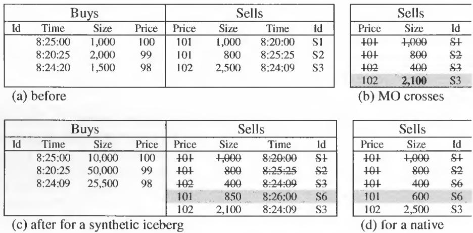  
Figure 9-3 An order slicing example

The incoming market order will immediately cross I,000 with our order S1, whilst another 800 will cross with order S2. Since there are no more orders at 101, it will now have to cross the remaining 400 at 102 with order S3. The venue will send out confirmations Ior these fills. Once the order conlirmation is received, we now split another order (S6), this lime for 850.

In comparison, for a native iceberg order its price priority would mean the hidden size completed the market order at 101. As we can see in Figure 9-3(d), a new display size would still have been split as order S6, 400 of which completes the incoming market order. The remaining 600 (assuming a display size of 1,000) stays on the order book, and now has price priority. Therefore, an exchange's native iceberg orders can offer both faster execution, and a higher probability of completion.

Clearly, the main disadvantage with order slicing is that we may miss out on crossing opportunities, since our order placement is reliant on the dispatch of execution notifications that take place afterwards. In this example, we only managed to cross 1,000 with the market order, since the crossing mechanism completes the market order by filling with S3 before we are notified that order S1 rilled. Note that when selling in an upward trending market missing execution opportunitics is less of an issue, but in a downward market this would have

rcsultcd in a loss.

The main ad vantage of ordcr slicing is that we have much more control of the display size, so our sccond order can be split with a random size, rathcr than simply splitting 1,000 each time (in this case 850 was used). Order book information and price trend indicators may be used to sclect the optimal display quantity and even limit price.

Order slicing may also be applied in parallel, allowing simultaneous trading across several execution venucs. Similarly, it may also be used to split orders across a range of prices; effectively this is the layering tactic, which we shall discuss shortly. Such versatility means that order slicing can still be a useful tactic, despite its simplicity.

# Hiding

Hiding is all about reducing signaling risk. Generally, it is used for ordcrs that would otherwise provide liquidity, namcly standing limit orders. This risk reflects the potential losses we can incur from the information that our trading pattern relays to the other market participants. For instance, placing a large buy order gives away our requirements; other traders will then react to this, most likely by raising the price at which they are prepared to scll. They may even cancel their ordcrs to see if we are prepared to go even higher.

Notc that in some multi-venue marketplaces hiding can be as straightforward as routing the order to a less obvious venuc, where it wil face less competition. This applies in particular for U.S. cquities since the order protection rule introduced for Regulation NMS means that orders placcd at the top of the order book should not be traded through.

Algorithmic ordcrs arc implicitly hidden, since most stratcgies only release a small portion of the order for immediate trading. However, signalling risk is dependent on both the order size and thc assct's liquidity. In fact, for iliquid assets cven a small order can result in the price shifting away as other tradcrs try to second-guess our requirements. We can further reduce the signalling risk by using hidden order types, as shown in Figure 9-4.

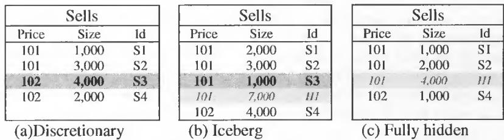  
Figure 9-4 Hidden order types

Discretionary orders, although fully visiblc, allow us to hide our actual limit price. For cxample, in Figure 9-4(a) we havc hidden our true intentions by displaying our order S3 with a limit price of 102, even though we are prepared to trade at 101. Admittedly, we could incrcase the discretionary amount to shift our order deeper into the order book; however, this will place even more orders in front of us in terms of execution priority. The full size is also visible; hence, discrctionary orders are gencrally more suited for smaller orders.

Iceberg orders go further and allow us to display only a portion of the order, whilst the remaining hidden portion retains pricc priority. For instance, in Figure 9-4(b) we have set the display sizc to 1,000, again shown as order S3. The remaining 7,000 will remain hidden until order S3 is complctcd, although it will maintain price priority over order S4. Note that it is important to get the right balance when selccting a display size. Too small a quantity and the order will take longer to complete, since only the visible portion will have both price and time priority. Converscly, selecting too large a display size will allow for faster completion, but at a greater exposure risk. Another factor to consider is the predictability of the display size. In a study of trading on XETRA, Angelika Esser and Burkart Mönch (2007) obscrvcd a distinct preference to use a display size of $10 \%$ of the parent order. Clearly, this will vary across both assets and markets; however, human nature also plays a part; pcople will often prefer to use a round number that is easy to calculate. For venues that do not support iceherg orders, we can create synthetic icebergs using randomised order slicing, as we saw in the previous section.

Fully hidden orders can further reduce signalling risk, so in Figure 9-4(c) our entire order H1 is hidden. Some exchanges, such as the Australian Stock Exchange (ASX) used to offer fully hidden orders; however, in an effort to balance the needs of both institutional and retail users many have replaced them with iceberg orders. That said, the introduction of new "dark pools" via alternative trading systems (ATSs) mcans that fully hidden orders are now making a comeback.

I1 is important to remember that even the best hiding mechanisms can only really delay the incvitable. Other market participants will undoubtedly be constantly monitoring the order book state and comparing this with the reported trades to try to find hidden liquidity.

# Price/Risk-driven tactics

Pricc-driven tactics may be based on changes in the spread and short-tcrm price trends. For instancc, as the gap between best bid and offer narrows we can afford to pay thc sprcad, and so the tactic can issue more marketable limit orders or even market orders. As soon as ihc spread widens, more passive pricing is used.

Likewise, for price trends, these lactics can react much like the adaptive trading algorithms we saw in Chapter 5. Thus, a passive trading style lends to rely on trends persisting, pricing its orders even further from the market during favourable price trends, to try to maximise price improvement. Conversely, during unfavourablc pricc trends it may price orders closer to the market to try to stem potential losses. Aggressive price-based tactics often rely on price trends mean reverting, and so they behave in the opposite fashion to passivc ones, aggressively taking advantage of favourable prices. The price trends may be based on forecasts or inferred from the order book imbalance. For example, a surplus of sell volume on the order book may indicate the price will soon decrease.

Risk-driven tactics may also consider the asset's price yolatility and how much time they have left to execute. These may be combined to create a timing factor, which can then he incorporated into the order placement decision. Hence, for a liquid assct at the start of its execulion the timing factor is fairly minor; however, it increases as time progresses. For less liquid assets, this factor is more important, and so is more likely to encourage placing more aggressivc orders.

In terms of common mechanisms, orders may be layered throughout the order book to try to maximise both cxecution probability and the potential for price improvement. Alternatively, they may simply be pegged to a market price, or linked with a cost-hased latching mechanism to reduce risk.

# Layering

The laycring tactic simultaneously maintains a range of standing limit orders. The orders arc sprcad throughout the order book, usually with different limit prices. This approach aims to take advantagc of favourable price movements. Also for venues where matching is based on price/time priority, the layering tactic helps preserve the time priority for each order. This is because when the market price moves a new order may be split, rather than just updating an existing order to match the new level. This allows the other layered orders to maintain their time priority in the order book queue.

As Michacl Aitken et al. (2007) point out, time priority is particularly important for liquid stocks that have densely populated order books. The high turnover of orders means that if time priority is lost, the only way to regain it is with a more aggressive price. For example, the order book in Figure 9-5(a) shows our three layered orders S1, S2 and S5 for ABC, ranging in price from 101 to 103. Compared to the single order S3 our combined orders offer more polential for price improvement, should an aggressive order walk up the order book.

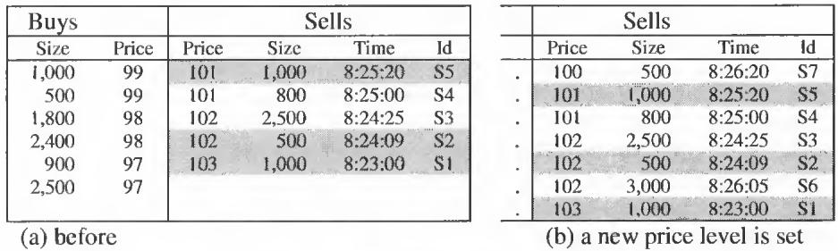  
Figure 9-5 Layered orders

Admiitedly, some execution probability is sacrificed, but the layered orders also allow us more scope to modify orders without losing time priority. For instance, when new orders S6 and S7 arrive, a new price level is set at 100. Assuming we want to participate at this new level, we have several options. If our requirement allows placing an additional order then we can simply split a new order S8 at 100. Though, if we do not want to increase our exposure then we shall need to adjust our existing orders. So we could either:

1. Update the limit price on order S5 to be 100.   
2. Reduce the quantity of S5 and use this to split a new order S8 at 100.   
3. Reduce the quantities of S1 and S2, then again split a new order S8.   
4. Reduce the quantity just for S1 and split a new order S8.

All these options allow us to participate at 100; in comparison a single order, such as S3, has fewer alternatives in such a situation. Option I leaves us with no presence on the order book at 101. If the price reverts slightly we could miss an opportunity to execute. Option 2 addresses this issuc, nevertheless, we have still reduced the size of the order that was second most likely to execute. ' To resolve this problem options 3 and 4 source the required volume using orders further away from the market, reducing the impact on our overall execution probability. Overall, option 4 is probably the best approach 2 since it modifies the order least likely to execute.

So layering orders is useful for highly liquid assets with dense order books where achieving time priority is difficult. Pegging the price of orders to keep up with the market would be an expensive option since it would keep reducing our priority. Whereas by layering orders across the book we can track price moves without significantly affecting our overall

cxccution probability.

Layering is useful for illiquid asscts as well, since there is more scope for price improvement, it also improves the visible depth. Deeper hooks with a lower range of prices tend to promote more aggressive orders from the opposite side. Thus, hy filling gaps we can reduce the expected market impact and so try to encourage participants on the other side to place more favourably priced orders. Note that filling gaps means just that, it does not mean filling an empty order book for an illiquid asset with layered orders to give the illusion of depth.

# Pegging

Pegged orders are a convenience, they provide dynamically updating limit prices that reducc the risk of mispricing for standing limit orders. Often this tactic is used with passive orders that are trying to benefit from price improvement. Pegging may also be based on the price of another assct, for instance, in pair trading, or versus a market index. Similarly, for options, delta-adjusted orders are effectively pegged based on the price of the underlying asset and the option's delta.

Care must be taken when using pegging sincc regular trading patterns can lead to considerahle signalling risk. Pegging cvery 30 seconds 0.5 away from the mid is nearly as predicable as the order slicing we saw in Figure 9-2. Hence, randomisation is important to reduce the predictability of pegged trading, both for when updates are madc as well as for their size. Two other potential issues with pegging were pointed out by David Brown and Craig Holden (2005): Pegged orders can contribute to momcntum since they continually shift liquidity with the prevailing trend. They also gencrally have a lower exccution prohahility, since in a price/time priority based venue changing the limit price will often place them at the end of the queue (unless a new price level is set).

A more adaptive approach to pegging could incorporate market conditions or short-term price predictions in the decision of whether to peg the order. Note that pegging can just as easily be applied to order sizes. Thus trading based on the available order book depth might peg orders to the best bid or olfer size. Note that most venues will allow an order to be reduced in size without losing priority. Increasing the size of an order would clearly disadvantage other similarly priced orders behind it in the order book queue, so to ensure fairness such an update often results in the order losing its priority. Alternatively, it may be belter to adopt an order layering tactic.

# Catching

This tactic is based on cutting our losses when the price looks to be trending away from us. In some ways, it may be thought of as a visible trailing stop. To start with, we shall adopt a fairly passive latching mechanism, as we can sce in Figure 9-6.

Essentially, this is a means of dynamically adjusting our limit price hased on the current market price. The main difference from pegging is that it works only in one direction. Generally, price latches are used to try to keep any potential gains from markct moves. Conscquently, this mechanism is used hy hoth trailing stops and lick-sensilive orders. A positive latch will only move when the price rises (e.g. trailing stop sells and downtick orders); whilst a negative one only tracks price drops (e.g. trailing stop huys and uptick orders).

Figure 9-6 shows a buy order positively latching to the best bid; hence, its limit price only changes when the best bid rises. In addition to the latch, we can assign a trigger limit, much like for a stop order. When the market price reaches this point we will becomc more aggressive, to try to stem any losses. This is the point labelled trigger in Figure 9-6. So our order will now be priced based on the best offer, paying the spread to prevent any further losses. Alternatively, a market order might even be used, risking further market impact to guarantee execution.

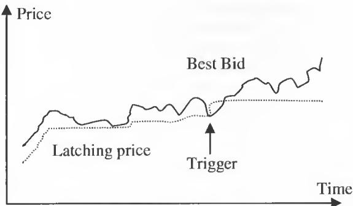  
Figure 9-6 Price latching

# Opportunistic/Liquidity-driven tactics

As with the opportunistic trading algorithms, these tactics tend to strive to maximise the benefits of favourable market conditions, such as liquidity. The seeking tactic aims to source additional liquidity from hidden orders. Tactics may also focus on reducing signalling risk. Clearly, any orders we place will change the available order book depth and so affect thc overall order imbalance. For example, if we need to buy but there is already an imbalance skewed towards buy volume then adding another buy order will only increase the probability of a pricc rise. Sniping tries to take advantage of available liquidity without giving away our own rcquirements. Finally, routing corresponds to choosing the best destinations to send orders to, bascd on a variety of criteria.

# Seeking

The seeking tactic is all about finding hidden liquidity. Market participants are constantly monitoring the state of the order book and comparing this with the reported trades to try to spot hidden liquidity. Based on this data we can create models to estimate the probability of how much volume is hidden at the various price levels throughout the order book, as we saw in Chapter 8. Note that these are just estimates; the only way we shall really know if there is any hidden liquidity is by issuing an order and, hopefully, being filled with a better price.

Another important concern when searching for liquidity is keeping our own orders hidden; otherwise, wc may be exposed to considerable signalling risk. We want to fil our own orders at the best price possible without giving away information about our actual requirements. So a persistent order will not do, instead we will need to use ecither market orders or marketable limit orders with specific fill instructions. Assuming we want to be able to control our market impact then we can rule out market orders. So thc choice is now between the various fill instructions available for limit orders: Of thesc only immediate-or-cancel and fill-or-kill are suitable, since the others all leave residual orders on the order book. The main difference between the two instructions is that immediatc-or-cancel allows partial fills whereas fill-orkill has a strict $100 \%$ execution requirement.

Having identified potential sites in the order book with hidden liquidity, all we need to do now is issue appropriale orders. For instance Figure 9-7(a) shows an example order book for asset ABC. In this example, our estimates suggest that there may be 6,000 hidden to sell at 101 (labelled H1). By sizing our order larger than the visible volume on the order book we are seeking hidden liquidity. If our order is filled then there may well be hidden liquidity at that price point. If sufficient liquidity is not available then our order is immediately caneelled, leaving no trace on the order book. Figure 9-7(b) shows our estimate of what the order book will look like after issuing a limit order to buy 3,000 ABC at 101.

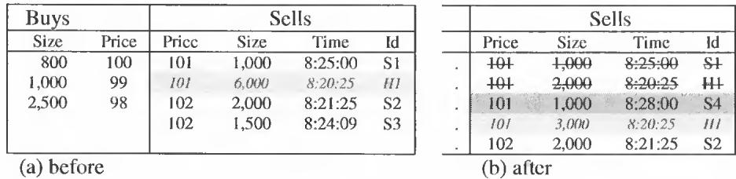  
Figure 9-7 An example search for hidden iquidity

In the case of an iceberg order, a new tranche may be issued, such as order S4. Though, neither this, nor a successful execution guarantees that there is any more hidden liquidity. We still need to carefully check the order book state before and after; since potentially we could have crossed with another visible order which hit the order book the same time as ours.

If sufficient hidden liquidity is available then the behaviour of our liquidity seeking order will be the same, regardless of whether we use an immediate-or-cancel or a fill-or-kill instruction. However, let's now assume that the hidden size shown in H1 is only for 1,500. An immediate-or-cancel instruction would mean that our order fils 2,500 ABC at 101, with the best offer becoming order S2 at 102. Having consumed al the hidden liquidity that was available at 101, we can also feedback this size into our hidden order models to help improvc future estimates. In comparison, a fill-or-kill order would have failed to cross since there is insufficient hidden liquidity; therefore, the order would be immediately cancelled leaving the order book still looking like Figure 9-7(a). Unfortunately, all this has told us is that there is not suffieient ABC hidden at 101.

Thus, immediate-or-cancel orders offer a way of probing for hidden liquidity that minimises their footprint on the order book and may partially fill, even if our estimate for the amount of hidden liquidity is wrong. Fill-or-kill orders are less forgiving in this Iast respeet duc to their $100 \%$ completion requirement. Partial fills are important since by the time we resubmit an order someone else may have already found and consumed any hidden liquidity.

# Sniping

Sniping is a tactie for capturing liquidity whilst minimising signalling risk. Effectively, it is a way for liquidity demanders to hide their strategy. Alternatively, it is just a version of the seeking tactic for visible liquidity. To reduce the potential for signalling risk we will use marketable limit orders with specific fill instructions. This gives us pricc control and limits our footprint on the order book.

When liquidity becomes available, an aggressive order is used to cross with it. For instance, Figure 9-8 shows the order book as new order S1 arrives, offering to sel 1,000 ABC at 101.

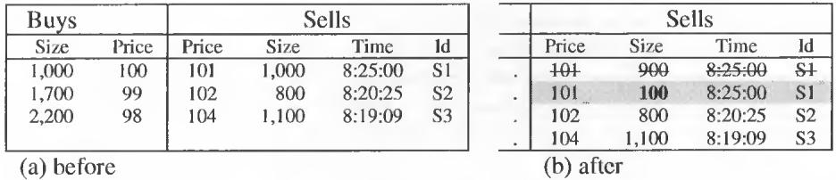  
Figure 9-8 An example sniping order

In order to grab this newly availablc liquidity we issue a fill-or-kill order to buy 900 at 101. By sizing our order just less than the best ofer size, we should leave a remainder on the order book, therefore the bid offer spread remains undisturbed at 100-101. This is a reasonable approach since the order book imbalance is currently tilted towards the buys, so if we had taken the whole volumc at 101 it is quite possible that the sprcad would have shifted up to a less favourable 101-102. Note that for sniping either immcdiate-or-cancel or fill-orkill instructions can be cqually useful, based on whether we want partial fills or not.

Sniping can also adjust to the available liquidity. For cxample, if order S2 in Figure 9-8 had bcen priced at 101 we could have executed 1,700 without altcring the spread.

# Routing

Routing is important for markets that have a range of cxccution venues. When choosing where to scnd orders, many different factors should be analyscd. Obviously, the price and quantity available are key to the decision, but other important considerations are the probability of hidden liquidity, the likelihood of successful execution, latency and any venue specific costs or fces. Routing mechanisms constantly make these decisions, based on thc available data, to try to ensure orders are sent to the optimal destination.

As we saw for liquidity-based trading algorithms, a common way of tackling the difficulty of trading in fragmented markets is to use liquidity aggregation. A virtual order book can be created by collccting data from all the possible cxecution venues. From this, we can then makc more balanccd decisions about how much to trade and at what price level. Having dccidcd this we then nccd to convert our requirements into actual orders. This transformation may be performed by the actual trading algorithm; alternatively, it can be dclegated to a routing based cxecution tactic.

Figure 9-9 shows an cxtension of the cxample we saw in Chapter 5 for liquidity bascd trading algorithms. The virtual order book has been decomposed back into its constituents. These arc ordered by price, probability of execution and size. The hidden orders are only estimates, and so are placed after visible orders. Each entry is also llagged with the venue it originated from, whether it is from the primary exchange (Exch-1), an alternative trading system (ATS) or an clectronic crossing network (ECN).

We can then usc this view to translate order requiremcnts into actual orders. For instance, if price is our key concern then we should clearly try to capture any hidden liquidity at 101 on ECN-2. f we are more conccrned about the probability of execution then we should focus on the orders available on Exch-1, ECN-2 and ATS-2. For larger quantities, we shall need to route orders to a wider range of venues.

For example, if we need to immediately sell 10,000 ABC, we could focus on just the visible liquidity, sending the following child orders:

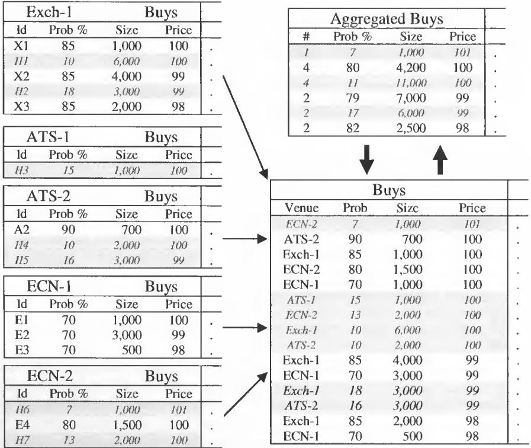  
Figure 9-9 An aggregated order book and its breakdown

Exch-1: Sel1 5,000 ABC at 99   
ECN-1: Sel1 2,800 ABC at 99

Alternatively, we could try to consumc some of the hidden liquidity by crcating orders based on a mix of the probability of cxecution and the estimated hidden liquidity:

ATS-1: Sel1 1,000 ABC at 100   
ATS-2: Sc11 1,500 ABC at 100   
ECN-1: Sell 1,000 ABC at 100   
ECN-2: Sell 3,000 ABC at 100   
Exch-1: Sel1 3,500 ABC at 100

Hence, we are able to easily route orders using various criteria, in an eflort to achieve the best execution bascd on our requirements.

# Pairing

As we saw in Chapter 4, somc cxecution venucs support a range of contingent order types and conditions; however, thc majority of venues do not provide thcse. Thus, one of the key aspects of the pairing tactic is to cmulate this behaviour in order to be able to link orders.

When trading pairs (or baskets) of assets, the trading algorithm focuses on the trigger, i.e. whether the ratio or spread is favourable. Ensuring that cach of the asscts are successfully bought or sold can be delegated to an cxecution tactic. Since execution cannot be guarantecd,

Icgging is an important consideration. This is the difference in value in the traded positions for each asset. Certainly, legging often drives the execution for these tactics.

If a reasonable amount of legging is permitted then each order can almost be worked separately. The execution tactic can choose to use standard mcchanisms, much like any other static, price or liquidity-bascd approach. Only when the legging reaches its limit will it need to try to intervenc.

For example, let's consider buying 2,000 of asset JKL and selling 2,000 of XYZ. For convcniencc, we will assumc both thesc assets are priced around $\$ 50$ . Our legging limit is set to $\$ 5,000$ , therefore it cquates to around 100 of either JKL or XYZ. So if we havc already executcd $4 0 0 ~ \mathrm { J K L } ,$ but only $3 0 0 ~ \mathrm { { X Y Z } }$ then we nced to address this legging before we can think about buying any more JKL. Similarly, any extant orders for JKL should be cancelled to ensure we do not get even more legged. In order to try to catch up and reducc thc legging we can convert any cxtant orders for XYZ to more aggressive ones, so long as the price of XYZ remains within our limits.

If a negligible amount of legging is allowed then each order will be contingent on the other. Figurc 9-10 shows the order books for each asset. Hence, the:

Buy order for 2,000 JKL (B4) is dependent on being able to sell XYZ at 50.5   
Sell order for 2,000 XYZ (S9) is dependent on being able to buy JKL at 50.8

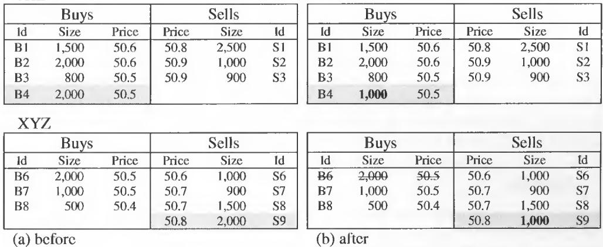  
Figure 9-10 An example of contingent orders

Therefore, when thc buy order B6 for XYZ is suddenly cancelled, we can no longer be sure of sclling 2,000 XYZ at 50.5, so we need to modify our buy order B4 for JKL, reducing it to he for 1,000, as shown in Figure 9-10(b). Essentially, each order is pcgging to what is availablc on the samc side of the ordcr book for the other asset. Note that this can also involve changing the price as well as the size.

In turn, these orders are also linked to the outcome of each other, like the contingent ordcrs that we saw in Chapter 4. This means that we may also nced to adjust the size of our scll order S9 for XYZ. Otherwise, we could end up with around $\$ 50,000$ of legging.

The rclativc liquidity of each asset is also important: If one asset is significantly less liquid than the other then this bccomes a bottleneck. In fact, the orders for the least liquid asset tend to drive the whole process.

# 9.3 Algorithm selection

In Chapter 5, we saw how various investment objectives could be translated into a range of trading algorithms. In turn, these may then use execution tactics to actually achieve their aims. This division of responsibility helps keep both the algorithms and the execution tactics simpler. Note that it is important to remember that the trading algorithm drives the cxecution tactics, and not the other way around. For example, a VWAP algorithm that uses pricedriven execution tactics is still trying to track the VWAP. The target quantitics and hard price limits are still determined by the algorithm. The choice of execution tactic simply makes it slightly more price sensitive in the way it places its orders.

'This "divide and conquer" approach also makes it easier to reuse the same logic between different markets or even across asset classes. For instance, we might well be able to "port' a VWAP or implementation shortfall algorithm built to trade U.S. equities to also work in Europe or Asia. Though, as we saw in Chapter 3, the world's financial marketplaces still have some substantial differences. So we shall only get the best performance if we fine-tune the algorithm for each specific region or market. Fundamentally, we are still tackling the same problem so much of the trading algorithm logic can stay the same. However, the actual order execution may need to be quite different. Thercfore, we could create execution tactics that are customised for specific regions or markets. These in turn could be reused, potentially allowing us to port other algorithms to new markets much more quickly. This approach could even be extended to port equities-based algorithms to other asset classes, such as futures or FX.

Execution tactics also allow common trading mechanisms to he shared amongst a wide range of algorithms. This is particularly useful given the increasing need for customisation and rapid turnaround of new trading algorithms. For example, modern VWAP and implementation shortfall algorithms may well share some of the same exccution tactics, even though at the algorithm level their objectives are very different.

Table 9-2 summarises some of the typical combinations.

<table><tr><td rowspan=2 colspan=2>Algorithm</td><td rowspan=1 colspan=3>Tactics</td></tr><tr><td rowspan=1 colspan=1>Impactdriven</td><td rowspan=1 colspan=1>Price/Riskdriven</td><td rowspan=1 colspan=1>Opportunistic/Liquidity</td></tr><tr><td rowspan=4 colspan=1>Impact</td><td rowspan=1 colspan=1>Time Weighted Average Pricc</td><td rowspan=1 colspan=1>•</td><td rowspan=1 colspan=1>0</td><td rowspan=1 colspan=1></td></tr><tr><td rowspan=1 colspan=1>Volume Weighted Average Price</td><td rowspan=1 colspan=1>●</td><td rowspan=1 colspan=1>0</td><td rowspan=1 colspan=1>0</td></tr><tr><td rowspan=1 colspan=1>Percentage Of Volume</td><td rowspan=1 colspan=1>●</td><td rowspan=1 colspan=1>0</td><td rowspan=1 colspan=1>0</td></tr><tr><td rowspan=1 colspan=1>Minimal impact</td><td rowspan=1 colspan=1>●</td><td rowspan=1 colspan=1>0</td><td rowspan=1 colspan=1>0</td></tr><tr><td rowspan=3 colspan=1>Cost</td><td rowspan=1 colspan=1>Implementation Shortfall</td><td rowspan=1 colspan=1>●</td><td rowspan=1 colspan=1>•</td><td rowspan=1 colspan=1>0</td></tr><tr><td rowspan=1 colspan=1>Adaptive Shortfall</td><td rowspan=1 colspan=1>●</td><td rowspan=1 colspan=1>•</td><td rowspan=1 colspan=1>0</td></tr><tr><td rowspan=1 colspan=1>Market On Close</td><td rowspan=1 colspan=1>●</td><td rowspan=1 colspan=1>●</td><td rowspan=1 colspan=1>0</td></tr><tr><td rowspan=3 colspan=1>Oppor-tunistic</td><td rowspan=1 colspan=1>Pricc Inlinc</td><td rowspan=1 colspan=1>●</td><td rowspan=1 colspan=1>●</td><td rowspan=1 colspan=1>0</td></tr><tr><td rowspan=1 colspan=1>Liquidity-driven</td><td rowspan=1 colspan=1>0</td><td rowspan=1 colspan=1>0</td><td rowspan=1 colspan=1>●</td></tr><tr><td rowspan=1 colspan=1>Pairs / Spread trading</td><td rowspan=1 colspan=1>0</td><td rowspan=1 colspan=1>0</td><td rowspan=1 colspan=1>●</td></tr></table>

• oficn uscd O somctimcs used

Note that thc relationship between trading algorithms and execution tactics does not have to he strictly onc-to-one; in fact, some algorithms may use multiple execution lactics in parallel.

Impact-driven algorithms cssentially use order slicing to try to minimise the overall market impact. They may simply be driven by time (TWAP), a historical volume profile (VWAP) or the actual market volume (POV). Thus, the algorithm just needs the cxccution tactics to work the order as best they can. So we could really use any of these approaches. For instance, a VWAP or POV algorithm using stealth-based or opportunistic tactics might prove to be a good way of reducing market impact.

Cost-driven algorithms have quite a difficult goal to achieve; they need to take account of market impact, timing risk, and even factors such as price trends. So it is important that the execution tactics arc attuned to this and do not miss opportunities or incur additional costs. Hence, thcse algorithms may well adopt multiple tactics. They may switch hetween approaches, or cven run tactics in parallel.

Opportunistic algorithms are focussed on taking advantage whenever the market conditions are favourable; they are lcss concerned about completing the wholc order. So they are much morc similar to execution tactics than the other two classes of algorithm. For instancc, liquidity-driven algorithms tend to adopt liquidity or stealth-bascd tactics. Similarly, pair trading implies a pair based, or order contingent approach, although if the legging is sufficicnt it might also be implemented with a mix of seeking (for illiquid assets) and sniping (for the more liquid ones). Price inline algorithms tend to adopt a wider range, since they are cssentially based on an undcrlying impact-driven algorithm.

# Factors affecting the choice of execution tactics

Each trading algorithm bases its trading approach on a wide range of factors, encompassing the investor's goals, the order dctails and asset-specific information. In Chapter 7 we saw how these factors affect the actual choice of trading algorithm. For cxecution tactics the main factors affecting their choice are morc straightforward. Essentially, this depends on both the current market conditions and how well the algorithm is actually performing.

# Market conditions

As trading algorithms have evolved many now track market conditions on a tick-by-tick basis. Internally, they may use this information to alter their target trading patterns. They may also choose to trade more or less aggressively based on whether the market conditions are favourable or not, as we saw for the adaptive shortfall and price inline algorithms.

In terms of their choice of execution tactics, the controlling algorithms may decide to switch betwcen more or less aggressive approaches, based on their perception of the current market conditions. For instance, if the current price trend is favourable thc algorithm may adopt a more passive approach, seeking price improvcment.

Some algorithms may use multiple cxccution tactics in parallel. For example, a passive price-bascd approach might be left running to try to achieve price improvement whilst more aggrcssive stealth-based tactics might be used to take advantage of any opportunities that arise.

Liquidity is another important factor. Although this is primarily an asset-specific charactcristic, we can also charactcrise this at the markct/venue level based on their average spreads and trade sizes.

# Average spread

The hid offer spread is one of the most visible indicators of liquidity. Tablc 9-3 shows the average spreads in basis points for a range of different venues and asset classes.

<table><tr><td rowspan=1 colspan=2>Asset class</td><td rowspan=1 colspan=1>Venue</td><td rowspan=1 colspan=1>Averagespread / bps</td></tr><tr><td rowspan=6 colspan=1>Equity</td><td rowspan=6 colspan=1>Stocks</td><td rowspan=1 colspan=1>NASDAQ</td><td rowspan=1 colspan=1>7</td></tr><tr><td rowspan=1 colspan=1>Euroncxt Paris</td><td rowspan=1 colspan=1>13</td></tr><tr><td rowspan=1 colspan=1>Italy SE</td><td rowspan=1 colspan=1>22</td></tr><tr><td rowspan=1 colspan=1>LSE</td><td rowspan=1 colspan=1>32</td></tr><tr><td rowspan=1 colspan=1>Hong Kong Ex 3</td><td rowspan=1 colspan=1>47</td></tr><tr><td rowspan=1 colspan=1>Singapore SE 3</td><td rowspan=1 colspan=1>61</td></tr><tr><td rowspan=3 colspan=1>Fixed income</td><td rowspan=1 colspan=1>U.S Treasury 2yr</td><td rowspan=1 colspan=1></td><td rowspan=1 colspan=1>~3</td></tr><tr><td rowspan=1 colspan=1>U.S Treasury 10yr</td><td rowspan=1 colspan=1></td><td rowspan=1 colspan=1>~6</td></tr><tr><td rowspan=1 colspan=1>Corporate bonds</td><td rowspan=1 colspan=1>TRACE</td><td rowspan=1 colspan=1>25+</td></tr><tr><td rowspan=1 colspan=1>FX</td><td rowspan=1 colspan=1>Spot</td><td rowspan=1 colspan=1>EBS</td><td rowspan=1 colspan=1>~1-3</td></tr><tr><td rowspan=1 colspan=1>Derivatives</td><td rowspan=1 colspan=1>S&amp;P 500 E-mini futs</td><td rowspan=1 colspan=1>CME</td><td rowspan=1 colspan=1>~2</td></tr></table>

Source: Equity: EDHEC (2007), FT Mandale (2006), Fixed Income: Edwards, Harris and Piwowar (2007) and aulhor's own csimales

# Table 9-3 Average spreads

For markets where a few key assets are highly traded, such as FX or U.S. Treasuries, competition ensures that the spreads are generally much lower. Indeed sprcads for these have been as litle as I or 2 bps or even less. As the liquidity decreases brokers/dealers cover their risk by inereasing the spread. For really illiquid assets, spreads may he measured in hundreds of basis points.

Spreads are also closely linked to volatility; since, as we saw in Chapter 2, they represent a premium that market makers apply to protect thcmsclves from the risk of adverse selection. During the 2007-09 financial crisis, spreads inereased considerably: Spreads for many stocks doubled, illiquid shares saw even higher rises. Similar increases occurred for othcr assct classcs, pretty much preserving the relative proportions shown in Table 9-3.

There can also be significant geographical differences in the average spread cost. Across Europe, spreads are traditionally somcwhat higher than thosc of the U.S., whilst those in Asia are often even higher. Consequently, aggressive trading tactics can be a lot morc expensivc in these regions.

When sprcads are high it can be worth adopting a more passive trading style to reduce the overall spread cost. Therefore, pegging or laycring ordcrs may bc used to try to maximise the price improvement. If risk is a significant factor then a catching mcchanism might be adopted to reduce the potential losses if the market suddenly moves away.

# Average trade size

When we are considering the difficulty of an order it is usual to comparc its ovcrall size to the averagc daily volume (ADV). Thus, an order that is less than $5 \%$ of the ADV should hc reasonably straightforward to cxccute. However, it is also worth considering thc averagc tradc size. Table 9-4 shows some of the average trade sizes and values for a range of assets and vcnucs.

Table 9-4 Average trade sizes   

<table><tr><td rowspan=1 colspan=2>Asset class</td><td rowspan=1 colspan=1>Venue</td><td rowspan=1 colspan=1>Averagetradesize</td><td rowspan=1 colspan=1>Averagetrade value($1000s)</td></tr><tr><td rowspan=5 colspan=1>Equity</td><td rowspan=5 colspan=1>Stocks</td><td rowspan=1 colspan=1>NASDAQ</td><td rowspan=1 colspan=1>330</td><td rowspan=1 colspan=1>9</td></tr><tr><td rowspan=1 colspan=1>NYSE</td><td rowspan=1 colspan=1>301</td><td rowspan=1 colspan=1>13</td></tr><tr><td rowspan=1 colspan=1>Euronext</td><td rowspan=1 colspan=1>956</td><td rowspan=1 colspan=1>36</td></tr><tr><td rowspan=1 colspan=1>LSE</td><td rowspan=1 colspan=1>6,335</td><td rowspan=1 colspan=1>64</td></tr><tr><td rowspan=1 colspan=1>Hong Kong Exch</td><td rowspan=1 colspan=1>39,544</td><td rowspan=1 colspan=1>18</td></tr><tr><td rowspan=2 colspan=1>Fixed income</td><td rowspan=1 colspan=1>U.S Treasury 2yr</td><td rowspan=1 colspan=1>ICAP BrokerTec</td><td rowspan=1 colspan=1>-</td><td rowspan=1 colspan=1>8,342</td></tr><tr><td rowspan=1 colspan=1>U.S Treasury 5yr</td><td rowspan=1 colspan=1>ICAP BrokerTec</td><td rowspan=1 colspan=1>-</td><td rowspan=1 colspan=1>2,974</td></tr><tr><td rowspan=1 colspan=1>FX</td><td rowspan=1 colspan=1>Spot</td><td rowspan=1 colspan=1>EBS</td><td rowspan=1 colspan=1>-</td><td rowspan=1 colspan=1>~3,000</td></tr><tr><td rowspan=2 colspan=1>Derivatives</td><td rowspan=1 colspan=1>Index futurcs</td><td rowspan=1 colspan=1>CME</td><td rowspan=1 colspan=1>3</td><td rowspan=1 colspan=1>-</td></tr><tr><td rowspan=1 colspan=1>Interest rate futs</td><td rowspan=1 colspan=1>LIFFE</td><td rowspan=1 colspan=1>10</td><td rowspan=1 colspan=1>-</td></tr></table>

Source: WFE (2008), Fixed Income: Fleming and Mizrach (2008), FX: Euromoney (2006a)

Electronic trading has helped significantly decrease order sizes, particularly for orderdriven venues. Consequently, the lowest average trade sizes/values in Table 9-4 are for the world's stock and listed derivative markets. In comparison, the fixed income and FX markets still have much larger average trade sizes. That said, actual trade sizes might be much lower than these averages. For instance, Galen Burghardt, in a report for the FIA (2006), showed that the most common trade size for E-mini S&P 500 futures was for a single lot.

When dcaling with very low average trade sizes, signalling risk can be a major issue. Hence, we should consider spliting orders to ensure they are not significantly larger than those already on the order book. So we will need to use slicing or layering, alternatively we might nced to hide them.

# Algorithm performance

Internally, most trading algorithms continually track their own performance. This might be versus a target executed quantity or as a comparison of its average executed price versus its benchmark. Therefore the algorithm can easily tell whether it is performing ahead or behind of its own targcts.

The algorithm's reaction to under-performance will depend on whether market conditions are favourable and how much time there is lcft to trade. If conditions are unfavourable, it will probably employ more aggressive trading tactics to try to stem its losses. Conversely, if the conditions are favourable it might hold out for a while longer to see if the extant orders can achicve significant price improvement. Similarly, if there is not much time left to execute the algorithm may revert to using more aggressive execution tactics.

# Other factors affecting tactic choice

So far, the focus has been on targeting the specific investment/trading goals. Though, at the micro-level we must also consider market characteristics, such as its fundamental trading mechanism and latency.

# Trading mechanism

Clcarly, whcther a market is quote-driven or order-driven will have a substantial impact on the choice of trading tactic. Indeed, most of the mechanisms we have covered require specialised order typcs and so nccd an order-driven or hybrid markct. They simply are not viable for request-driven markets. For purely quote-driven markets, we might still usc order slicing to spread the order amongst scveral brokers, but that is about it. Likewise, most of the trading tactics we have covered are primarily intended for continuous trading periods.

The preccdence rulcs that are used for order-driven markets arc also significant. If priority is given in terms of price and timc then it is important for orders to maintain thcir position in the queue. Thus, tacics such as layering becomc morc valuable. Convcrscly, if the secondary priority is assigned on a pro-rata basis, such as for many futures markets, then it is important to have orders with sufficient size at that price level.

# Latency

Latency corresponds to the timc lag that can occur between sending an order and it reaching its intended destination, and so be able to participale in trading. This lag may be due to delays in the various systems that process the order, as well as the time it takes to actually transmit the information betwcen locations. Latency has the most cffeet on order routing dccisions, but it can also affect dynamic tactics, such as pegging or catching.

A few years ago, latencies were measured in seconds. Although this can still be the case in some emerging markets, the major venucs are all now vying to offer platforms with latencies measured in milliseconds or less. Finding an impartial comparison of latencies can be quite difficult, sincc each venue is keen to stress the speed of their platform. Table 9-5 shows the results of a round-trip test by Exponential-e (2009) for their routing servicc. This gives an idea of the order transmission times to some key market localions. Lateney will be significantly higher for requcst-driven markets.

<table><tr><td rowspan=1 colspan=1>From:</td><td rowspan=1 colspan=1>To:</td><td rowspan=1 colspan=1>Latencyms</td></tr><tr><td rowspan=3 colspan=1>London</td><td rowspan=1 colspan=1>Frankfurt</td><td rowspan=1 colspan=1>10</td></tr><tr><td rowspan=1 colspan=1>New York</td><td rowspan=1 colspan=1>68</td></tr><tr><td rowspan=1 colspan=1>Chicago</td><td rowspan=1 colspan=1>85</td></tr><tr><td rowspan=4 colspan=1>New York</td><td rowspan=1 colspan=1>Toronto</td><td rowspan=1 colspan=1>25</td></tr><tr><td rowspan=1 colspan=1>Zurich</td><td rowspan=1 colspan=1>90</td></tr><tr><td rowspan=1 colspan=1>Tokyo</td><td rowspan=1 colspan=1>246</td></tr><tr><td rowspan=1 colspan=1>Sydney</td><td rowspan=1 colspan=1>260</td></tr></table>

Source: Exponenlial-e (2009)

# Table 9-5 A snapshot latency roundtrip comparison for some key locations

Clearly, scnding orders to remote markets can add a considerablc amount of latency. Hence, a number of venues now offer co-localion services, whereby spacc is made available for client nachines to reduce any transmission delays.

Latency reduces the probability of execution since by the time we havc been able to respond another market participant will probably have beaten us to it. Thercfore, a tactie like pegging is not suitable for higher latency venucs since its rcactive nature cxaccrbalcs the problem. Instead, it is better to adopt the order laycring tactic, so if the market docs move orders are already in place at a range of different price levcls. The catching taetic may also be used when latency is high, to stem potential losses.

Execution tactics focus on the micro level choices that need to be made for the actual exccution, monitoring the order book and managing order submission. They provide common mechanisms to achieve the goals of trading algorithms.

Tactics are often based around existing order types, for instance, pegging and hiding. For venues that do not natively support these dynamic order types the tactic can adopt an order placement strategy that essentially mimics the required behaviour. They may also employ more complex logic than is currently available via native order types.

A wide range of common trading mechanisms may be adopted:

Slicing is a straightforward means of lowering impact.   
Hiding takes advantage of hidden order types or using an opaque ATS.   
Layering places orders throughout the book to maximise execution probability and the potential for price improvement.   
Pegging provides dynamic adjustments, adjusting the price or even size of orders.   
Catching uses a price latch to cut losses when the market moves away from us.   
Sccking actively searches for hidden liquidity.   
Sniping takes available liquidity without giving away our own requirements.   
Routing determines the best destination for an order based on a range of criteria.

The main factors affecting the choice of execution tactic depend on both the current market conditions and how well the algorithm is actually performing.

Trading algorithms may adapt to changing conditions by switching betwcen execution tactics. Alternatively, they may use several tactics in parallel.

# Chapter 10.

# Enhancing trading strategies

Traders routinely base their decisions on a mix of current market conditions as well as anticipating how these might change in the future. Incorporating such logic into algorithmic trading strategies is a key to enhancing their performance.

# 10.1 Introduction

Having gone through the basies of both trading algorithms and execution tactics, this chapter aims to highlight some of the ways in which they may be enhanced. These mechanisms are rule-based approaches that respond to market conditions. Though, we can only ever estimate what conditions might be like in the future.

In Chapter 5, we used charts to compare the typical order placement patterns for different trading algorithms. However, during the execution it is important to remember that we just cannot tell what the future holds, as Figure 10-1 tries to show.

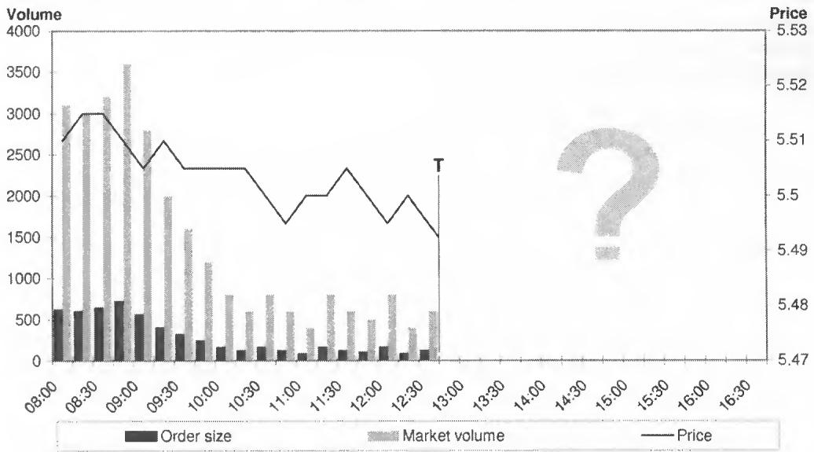  
Figure 10-1 Uncertain market conditions

From time T to the close, we do not know exactly what will happen to thc market pricc, volume or liquidity. Hence, trading algorithms and execution tactics arc inhercntly reactive. If a sudden shift occurs in the marketplace, such a reactive approach can be caught out and forced to play catch up, at less favourable prices.

One way of enhancing computcrised trading strategies is to incorporate short-term prediction models for key market conditions, such as volume and price. Thcse allow strategies to take a more proactive approach, placing more passively priced orders (providcd the forecasts are correct). For instance, a percent of volumc (POV) algorithm that only cver trades in response to market volume could incur significant market impact, sincc it would always be chasing the market. A short-term prediction of trading volumc allows thc algorithm to layer orders, cnsuring it takes part in the market volume rather than simply responding to it. Similarly, for pricc adaptive trading algorithms, a short-term price prediction will allow them to place appropriate limit orders to take advantage of price trends. If thc prediction proves to be inaccurate, the orders may be cancelled.

Estimating potential transaction costs has also become more important, particularly for cost-based algorithms such as implementation shortfal. Many of these cost modcls are based on a framcwork by Robert Almgren and Neil Chriss (2000) which uses a random walk model to estimate thc current market price in terms of costs.

Another potential cnhancement is better handling of specific events, which in turn may be either predictable or not. For example, futures have finite lifetimes, so cxpiration is a predictable factor for these contracts. Whilst on witching days when major dcrivatives contracts expirc, such as for the S&P 500 index, there will be sizable increascs in trading volume, and short-term volatility, on the stock markets. Changes to siock indiccs arc another examplc, since announcements are made some time belore they occur. Given how many investment firms track the major indices, these changes have relatively predictablc effects on the short-term trading for the aflected stocks, depcnding on whether they are being added or removed from the index. Unpredictable evcnts are generally triggered hy information or news. They may bc harder to forccast, but their short-term effects can still be quantilied. For instance, trading interruptions, such as halts or volatility auctions, are usually followed by periods of much higher volatility and volumes, although these often dissipatc aftcr a fcw hours. In Chapter 14, we will cover the impact of ncws in more detail.

# 10.2 Forecasting market conditions

Traders and investors and have sought to predict priccs for as long as markets have cxisted. Forccasting other market conditions such as volume, liquidity and volatility have also become more important.

Longer-term predictions are more useful for investment decisions. Exccution is gencrally more focussed on short-term price trends. Therefore, the focus of this section is on shortterm prcdictions, typically intraday. Short-term changes in market conditions arc closcly relatcd to market liquidity. Factors such as order book depth and imbalancc can give vital insights for how trade flow will react in the immediate future. In fact, many short-term predictions may be based just on recent market conditions. In Chapter 15, we will scc how artificial intelligence can also be used for forecasting.

# Predicting asset prices

At the simplest level, an asset's price merely represents what someone elsc is willing to pay.   
Imbalances in supply and demand can he a usecful indicator for short-term price movements.

An excess of supply (or sells) should lead to a price drop whilst an cxcess of demand should result in a price hike. Empirical research has considered imbalances in both traded volumc and order book depth to test their effectiveness.

A positive correlation betwcen trade imbalances and subsequent price changes was found by Joey Yang (2005) in a study of trades on the Australian Stock Exchange (ASX). He confirmed that the price is more likely to rise if more of the last 30 trades were due to demand on the buy-side, as we might expect. '

Imbalances in the best hid and offer sizes were also analysed by Yang (2005) for orders on the ASX. Using an ordered probit model, he established a strong link betwcen future price changes and the logarithms of the best bid and offer sizes. A larger bid size implicd price rises were more likely, whilst price drops were more probable when the ask size was larger. Similarly, in an earlier study, Scrgei Maslov and Mark Mills (2001) tracked the best quotes on NASDAQ. They focusscd on the average price changes around periods when significant imbalances between best bid and offer sizcs occurred. 2 Effectively, they were monitoring the short-term market impact of large trades, as shown in Figure 10-2.

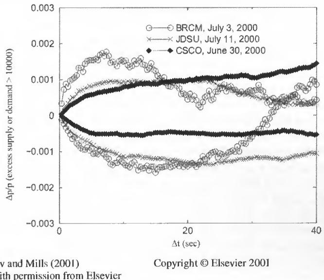  
Figure 10-2 The market impact of a large imbalance in best bid and offer size

The positive impacts refiect a surplus of demand for the stock, whilst the negative ones represcnt an cxcess supply. Note that the cfect is magnified, and more volatile, for the lower volumc stocks, Broadcom Corp. (BRCM) and JDS Uniphase Corp. (JDSU), compared to that of Cisco Systems Inc. (CSCO). By normalising their data, they found an approximately linear relationship hetween the imbalances and short-term average price changes. Given the relatively short timescales involved (less than a minute), such trends may be more casy for a computerised system to take advantage of than a busy trader.

Several groups have studied the effect of imbalances for the whole order book. The imbalancc $I _ { j }$ for each level $j$ of the order book is just the value of sell orders (supply) minus the value of the corresponding buy orders (demand):

$$
I _ { j } = { \cal Q } _ { j } ^ { s } { \cal P } _ { j } ^ { s } - { \cal Q } _ { j } ^ { d } { \cal P } _ { j } ^ { d }
$$

where $Q _ { j }$ is the quantity available at a given price $P _ { j }$ and the superscripts $s$ and $^ d$ correspond lo supply and demand. In comparison, the weighted price $W P _ { j }$ is simply the average price based on the available supply and demand at a given level of the order book:

$$
W P _ { j } = \frac { Q _ { j } ^ { s } P _ { j } ^ { s } + Q _ { j } ^ { d } P _ { j } ^ { d } } { Q _ { j } ^ { s } + Q _ { j } ^ { d } }
$$

The weighted price may also be calculated Ior specific portions of the order hook:

$$
W P _ { n _ { 1 } - n _ { 2 } } = { \frac { \displaystyle \sum _ { j = n _ { 1 } } ^ { n _ { 2 } } ( Q _ { j } ^ { s } P _ { j } ^ { s } + Q _ { j } ^ { d } P _ { j } ^ { d } ) } { \displaystyle \sum _ { j = n _ { 1 } } ^ { n _ { 2 } } ( Q _ { j } ^ { d } + Q _ { j } ^ { s } ) } }
$$

where $\mathfrak { n } _ { 1 }$ is a higher level than $\Pi _ { 2 } ,$ e.g. $W P _ { I - S }$ represents the weighted price for the first five levels of the order book. An example order book is shown in Figure 10-3 together with the associaled imbalances and weighted prices for cach level.

<table><tr><td rowspan=1 colspan=3>Buys</td><td rowspan=1 colspan=3>Sells</td><td rowspan=1 colspan=3>Value (thousands)</td><td rowspan=2 colspan=1>WP</td></tr><tr><td rowspan=1 colspan=1>ld</td><td rowspan=1 colspan=1>Size</td><td rowspan=1 colspan=1>Price</td><td rowspan=1 colspan=1>Price</td><td rowspan=1 colspan=1>Size</td><td rowspan=1 colspan=1>Id</td><td rowspan=1 colspan=1>Buys</td><td rowspan=1 colspan=1>Sells</td><td rowspan=1 colspan=1>lmbalance</td></tr><tr><td rowspan=1 colspan=1>D1</td><td rowspan=1 colspan=1>2,000</td><td rowspan=1 colspan=1>100</td><td rowspan=1 colspan=1>102</td><td rowspan=1 colspan=1>3,000</td><td rowspan=1 colspan=1>S1</td><td rowspan=1 colspan=1>200</td><td rowspan=1 colspan=1>306</td><td rowspan=1 colspan=1>106</td><td rowspan=1 colspan=1>101.20</td></tr><tr><td rowspan=1 colspan=1>D2</td><td rowspan=1 colspan=1>6,000</td><td rowspan=1 colspan=1>100</td><td rowspan=1 colspan=1>103</td><td rowspan=1 colspan=1>2,000</td><td rowspan=1 colspan=1>S2</td><td rowspan=1 colspan=1>594</td><td rowspan=1 colspan=1>206</td><td rowspan=1 colspan=1>-388</td><td rowspan=1 colspan=1>100.00</td></tr><tr><td rowspan=1 colspan=1>1)3</td><td rowspan=1 colspan=1>4,000</td><td rowspan=1 colspan=1>99</td><td rowspan=1 colspan=1>103</td><td rowspan=1 colspan=1>5,000</td><td rowspan=1 colspan=1>S3</td><td rowspan=1 colspan=1>392</td><td rowspan=1 colspan=1>520</td><td rowspan=1 colspan=1>128</td><td rowspan=1 colspan=1>101.33</td></tr><tr><td rowspan=1 colspan=1>D4</td><td rowspan=1 colspan=1>3,000</td><td rowspan=1 colspan=1>99</td><td rowspan=1 colspan=1>104</td><td rowspan=1 colspan=1>1,000</td><td rowspan=1 colspan=1>S4</td><td rowspan=1 colspan=1>291</td><td rowspan=1 colspan=1>105</td><td rowspan=1 colspan=1>-186</td><td rowspan=1 colspan=1>99.00</td></tr><tr><td rowspan=1 colspan=1>D5</td><td rowspan=1 colspan=1>5,000</td><td rowspan=1 colspan=1>98</td><td rowspan=1 colspan=1>104</td><td rowspan=1 colspan=1>6,000</td><td rowspan=1 colspan=1>S5</td><td rowspan=1 colspan=1>480</td><td rowspan=1 colspan=1>636</td><td rowspan=1 colspan=1>156</td><td rowspan=1 colspan=1>101.45</td></tr><tr><td rowspan=1 colspan=6>∑</td><td rowspan=1 colspan=1>1,957</td><td rowspan=1 colspan=1>1,773</td><td rowspan=1 colspan=1>-184</td><td rowspan=1 colspan=1>100.81</td></tr></table>

# Figure 10-3 An example order book with its associated imbalances and weighted prices

So for the top of the order book in Figure 10-3 the imbalance and weighied prices are determined as:

$$
\begin{array} { c } { { I _ { l } = ( 3 , 0 0 0 \times 1 0 2 ) - ( 2 , 0 0 0 \times 1 0 0 ) = 1 0 6 , 0 0 0 } } \\ { { W P _ { l } = ( ( 2 , 0 0 0 \times 1 0 0 ) + ( 3 , 0 0 0 \times 1 0 2 ) ) / ( 2 , 0 0 0 + 3 , 0 0 0 ) = 1 0 1 . 2 } } \\ { { W P _ { l . 5 } = ( 1 , 9 5 7 , 0 0 0 + 1 , 7 7 3 , 0 0 0 ) / ( 2 0 , 0 0 0 + 1 7 , 0 0 0 ) = 1 0 0 . 8 1 } } \end{array}
$$

Overall, the imbalance for the first live levels of this order hook is $\$ 5$ -184,000, so at the moment the demand is outweighing the available supply.

Shorl-term returns on the ASX were examined by Charles Cao, Oliver Hansch and Xiaoxin Wang (2008). They calculated liquidity measures based on the difference between the weighted price $W P _ { n l - n 2 }$ and the mid-price. They concluded that there is a strong link hetween these imbalances and future short-term returns. Predominantly, this was for the best bid and ofer, hut imbalances across the rest of the order book also had an effeet.

A similar approach was adopted by Jörgen Hellström and Ola Simonsen (2006) to study returns on the Stockholm Stock Exchange. They modelled the order book shape using weighted price measures $W P _ { n I - n 2 } -$ mid price) together with a time-adjusted variant. Their results showed that a positive skew in the order book imbalance (a surplus of supply from sell orders) increased the probability of a subsequent decrease in price. Conversely, a surplus of demand from buy orders was linked to subsequent price increases. Though, these relationships were found to be quite short lived, often less than a minute. They also confirmed that, whilst most of this effect could be explained by imbalances at the best bid and offer, taking into aceount the rest of the order hook did have some effect.

The importance of gaps in the order book was highlighted in a study of large price changes on the London Stock Exchange by J. Doyne Farmer et al. (2004). A reasonable assumplion for such changes might be large market orders sweeping deep into the order book. Still, their analysis showed that around $8 5 \%$ of the market orders that caused price changes matched the size at the best pricc. Essentially, they found the price fluctuations caused by market orders to be independent of the volume of orders. Instead, they revealed that the price jumps could be accounted for by liquidity fluctuations caused by gaps in the order book. So an order would take the available volume at the best price, leading to a price shift becausc the next entry in the order book was at a significantly different level. Interestingly, they found this issue affected even the most liquid stocks, although it was more prevalent for illiquid ones. They went on find that the distribution of gaps in the order book exhibited nontrivial correlations with the position in the book. This highlights the importance of looking past the best hid and offer if we do not want to noticeably affect the current price.

# Predicting trading volume

Forecasts for trading volumc have generally been based on historical data, or so-called volume profiles. Whilst these can give a reasonable forecast of intraday volume trends, there is still a wide range of factors that can affect daily trading volumes. These range from seasonal factors, such as the summer holidays, to asset specific ones such as news, corporate actions or contract expiration. To improve the relevancy of these forecasts some researchers have decomposed trading volume into both market and asset-specific components.

Volume prediction is important for algorithmic trading, partieularly for those algorithms based on statically determined trading schedules such as the original VW AP. If today's trade low differs considerably from this then the algorithm may well struggle to meet its benchmark. So the performance of a VWAP algorithm often relies on the accuracy of its historical volume profile. Similarly, these are in important input for implementation shortfall models, allowing them to determine the optimal trading horizon for a given order. Short-term trading volume prediction can also be important for purely dynamic algorithms, such as percent of volume (POV). These are driven by market volume and so there is no danger of them following a target trajectory that is out of sync with the market. However, if they only ever issue orders in response to market volume, they could end up chasing the market, and so incur subslantial market impact. Short-term volume predietions enable algorithms to effeetively place orders in a more proactive fashion, hopefully achieving price improvement.

# Volume profiles

A common starting point when predicting trading volume is to create a volume profile based on historical data. As we saw for the VWAP algorithm in Chapter 5, this is just a matter of defining a fixed time interval and then measuring the volume of trading for each period. For example, in Figure 10-4 the daily trading volumes for Matiel Inc. arc shown over 30 minute periods in terms of a percentage of the daily total, taken from a study by Dana Hobson (2006). Clearly, there can be considerable variation from day to day.

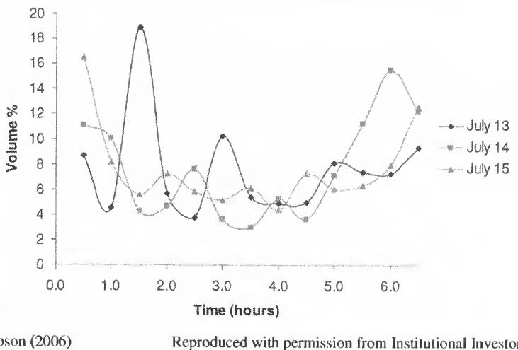  
Figure 10-4 Volume profiles for Mattel Inc. in 2005

Though, when these are averaged over longer periods, c.g. a month, the commonality becomes more evident. In this case, as a U.S. stock it exhibits the typical U-shaped curve with higher volumes around the open and close, something like we can scc in Figure 10-5.

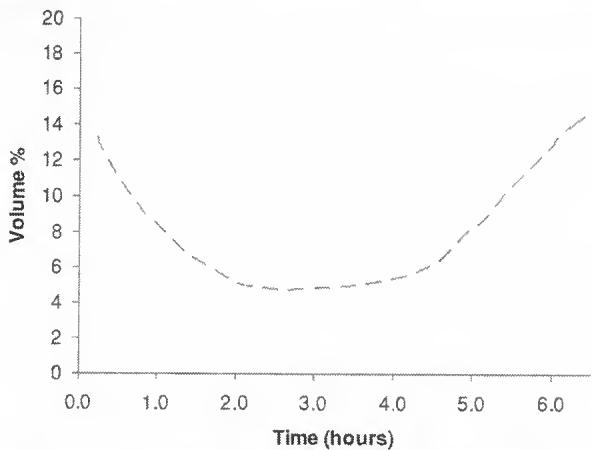  
Figure 10-5 An average volume profile based on Figure 10-4

Obviously, the exact shape of the volume profile will differ for each asset and will also depend on the number of days chosen for the average. Over timc, these patterns may wcll change. Therefore, onc way of viewing them is a 3-dimensional plot of the historical trading volume. Figure 10-6, shows a plot for a large-cap firm, GlaxoSmithKline, taken from a

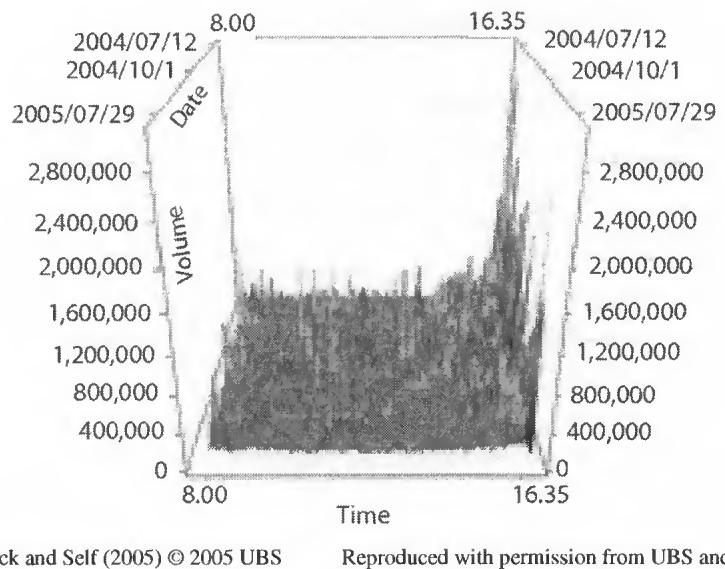  
  
Figure 10-6 Historical volume profiles for GlaxoSmithKline PLC

revicw by Tracy Black and Owain Self (2005). The trading volumes exhibit a relalively uniform pattcrn over time, with a clear increase in volume towards the close. Figure 10-7 shows thc cquivalent plot for the mid-cap technology firm, Logica CMG.

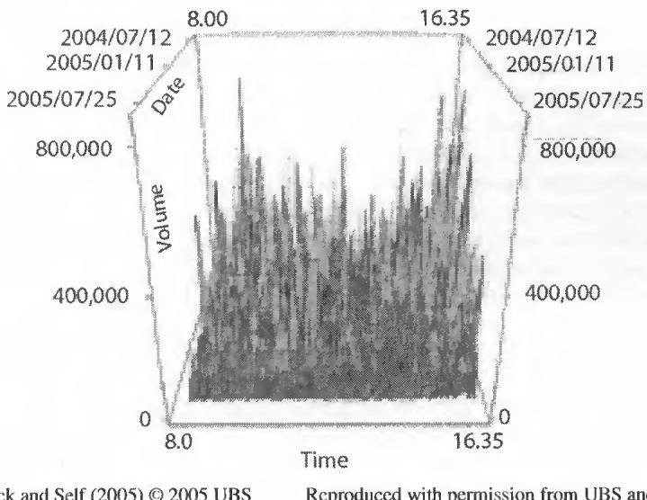  
Source: Black and Self (2005) Rcproduced with permission from UBS and The Trade   
Figure 10-7 Historical volume profiles for Logica CMG PLC

In comparison, for the mid-cap firm, the high levels of variation in daily trading volumes arc obvious, so much so that it is difficult to spot a daily volume trend. Also nole thc difference in volume scales. Overall, more liquid assets tend to have more stable daily volumes, whercas higher growth assets may exhibit much more volatility in their trading volumes. Consequently, historical trading volumes are likely to be more useful as predictor for liquid assets.

# Factors affecting trading volume

A wide range of factors can affect daily trading volumes: from general factors which apply across whole regions, or countrics, to more localised, market- and assct-specific ones. Examples of general factors arc seasonal and calcndar-based anomalics, such as summer holidays and the "day of the week" effect. Market holidays and macroeconomic announcemcnts are more market-specific, although thcy may also have regional and cvcn global efccts. Asset-specific factors tend to be hased on the asset class, so lor stocks this might be news announcements, corporate actions, dividends, mcrgcrs and stock splits. Expiration will be a consideration for assets that have fixed maturitics such as bonds and futurcs.

In their aptly titled report, 'Gone Fishin': Seasonality in trading activity and asset prices', Harrison Hong and Jialin $\mathbf { Y } _ { \mathbb { U } }$ (2006) studied the relationship betwcen stock market turnover and vacations for 51 stock markets. They found that trading activity was, on average, $7 . 9 \%$ lower during the summer than during the rest of the ycar. Notc that summer is defincd as Q3 (July, August and September) for countries in the Northern Hemisphere and Q1 (January, February and March) for those in the south. The effect was strongest for countries furthest from the equator, wherc summer vacations are more likely. So, the largest observed falls wcrc $1 5 . 6 \%$ for Europe and $1 3 . 2 \%$ for North America. In Asia, they only noted a fall of $3 . 4 \%$ , whilst Australia and New Zealand saw a dccline of $6 . 7 \%$ in their QI summer. Closer to the cquator, the effect was much less, for instance, only a $1 . 8 \%$ drop was obscrved for Latin American countrics.

The "day of the wcek" effect can also influcncc turnover. A study of stock market volatility and trading volume for the U.S., Canada and U.K by Halil Kiymaz and Hakan Berumcnt (2003) found average volumes to be consistently lower on Mondays. This also ties in with an earlier study of U.K stocks by Paul Draper and Krishna Paudyal (2002), who observed lower trading volumes on Mondays as well. For curency futures, Pei Hwang Wei and Susan Zee (1998) found volumes to be lower on Mondays and Fridays. Analysis of NYSE stock trading also showed a strong "day of the wcck" effcct, although Tarun Chordia, Richard Roll and Avanidhar Subrahmanyam (2000) noted this more as a decline of liquidity and trading activity on Fridays and an increase on Tucsdays. Many studics have found the middle of the week to have the highest volumes, for instance, Kiymaz and Berument (2003) noted that Wednesdays were the peak for the U.S. whilst it was Thursday for Canada and the U.K.

Specific holidays, such as Christmas, have a noticeable affect as well. Gencrally, trading volumes drop signilicantly on the day before the holiday. For example, Figure 10-8 shows a normalised view of trading volume for the Royal Bank of Scotland (RBS) crcated by Scre Darolles and Gaclle Le Fol (2003). The proximity of Christmas and the New Year's Day means that the abnormal trading volumc can persist for over a week. Notc, Figurc 10-8 also shows thc breakdown of the volume into both stock-specilic and common (or market) components, which we shall cover in the next sub-section.

In addition to seasonal cflects, asset-spccific factors considerably alter trading volumcs. Many of these arc spccific events, which we will cover in more detail in section 10.3. For cxamplc, there is gencrally be an incrcased turnover on witching days, or when stocks are added to major indices. Similarly, for bonds or futures which are about to expire, there is usually a sudden decline in their trading volumes.

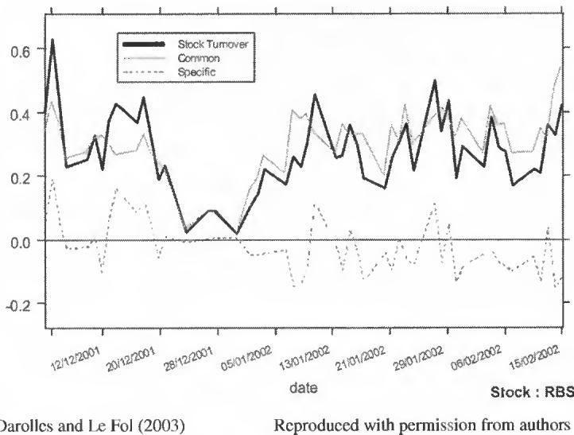  
Figure 10-8 Shift in trading volumes over Christmas holiday

One way of coping with these effects is to determine separate adjustments that compensate for them. These may then be applied to the historical volume profile, and compared with current market conditions to chcck they are reasonable. Allernatively, custom profiles could be adopted which may morc accurately represent the current market trends. Although by using fewer data points, there is more risk in the estimation.

Historical volume profiles are often based on data for the previous weeks or even months. So these factors not only affect current trading, but they also alter the historical averages. For instance, the increased volumes on days when special events occur, such as triple witching, can distort the historical volume profiles for normal days. Hence, they may be excluded from the average volume calculations. Corporate actions, in particular stock splits, also pose a specific problem for the historical volume profile for stocks. Stock splits are usually used to reduce the share price of growth companies, and so encourage more trading. Splitting a $\$ 100$ share into two $\$ 50$ shares should lead to significantly higher average daily volumes. Thus, when stock splits occur we need to adjust the historical volumcs accordingly, otherwise they will not properly reflect thc new levels of trading.

# Decomposing trading volume

An alternativc method of estimating trading volume is to break it down into its components, namely markct volume and asset-specific volume. Essentially, this is the samc approach as uscd for prices in the Capital Asset Pricing Model (CAPM). The CAPM expresses an asset's relurns in terms of the expected returns from the market and those of a risk-free asset. Based on this, portfolio risk may be split into both systematic, or market, risk and idiosyncratic risk.

A two-factor modcl for trading volume was proposed by Andrew Lo and Jiang Wang (2000). Using this approach, turnover models were created by Serge Darolles and Gaelle Le Fol (2003), and K.J. Cremcrs and Jianping Mei (2007). Both groups decomposed turnover into systematic and idiosyncratic components using principal components analysis (PCA). Darolles and Le Fol (2003) applied their model to empirical data for U.K. FTSE stocks, whilst Cremers and Mei (2007) studied NYSE and AMEX stocks.

The market component represents the normal volume that is common across all thc traded assets. This should incorporate all the seasonal effects, and so is a non-stationary series (its statistical properties change over time). It may also be viewed as the long-tcrm trading volume of the asset.

The idiosyncratic, or specific, component remains a random, or stochastic, process muct like the asset price. It represents the asset-specific unexpected changes in volume.

A Iater study by Jedrzej Bialkowski, Serge Darolles and Gaclle Le Fol (2007) gives a detailed example of this decomposition for French CAC-40 stocks, one of which is shown in Figure 10-9.

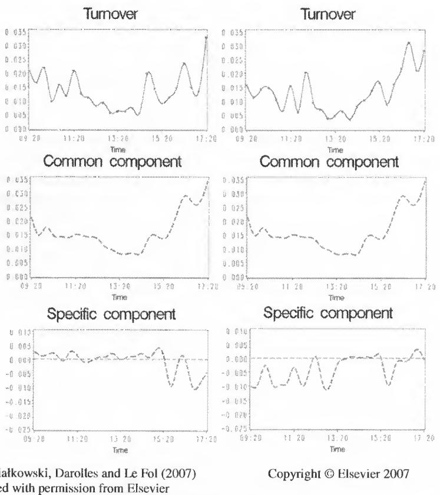  
Figure 10-9 Daily volume components for Total on September 9-10 2003

The overall turnover for the energy company Total is displayed in the top charts. This is followed by the common (or market) volume, which was determined as a historical average across all the CAC-40 stocks. Note that this common volume is identical on both days and adopts the common U-shaped pattern. The bottom charts illustrate the stock-spccific volumes, which are significantly different betwecn the two days. Thus, the daily diferences may clearly be related to the specific component.

Bialkowski, Darolles and Le Fol (2007) used two statistical methods for estimating these specific volumes. One was based on autoregressive moving averages (ARMA); the other used a sel f-extracting threshold autoregressive model (SETAR). Overall, they found that the SETAR model gave the best predictions of daily volume, although both methods were found to be better than a simple historical average. They atributed the performance of the SETARbased estimations as being due to the ability to discriminate between both turbulent and flat market periods.

# Predicting liquidity

In Chapter 8, we saw how limit order models could be used to predict the probability of execution of various limit orders. Short-term predictions of liquidity can allow trading strategies to decide whether they should be more or less aggressive when taking advantage of current market conditions.

Market depth often tends to increase throughout the day. Alexander Kempf and Daniel Mayston (2008) found this for trading on Xetra, as did Catherine D'Hondt, Rudy De Winne and Alain Francois-Heude (2004) for CAC-40 stocks on Euronext Paris. We can also see this trend in Figure 10-10, which is from a study of the Spanish Stock Exchange (SIBE) by David Abad, Sonia Sanabria and José Yagüe (2005).

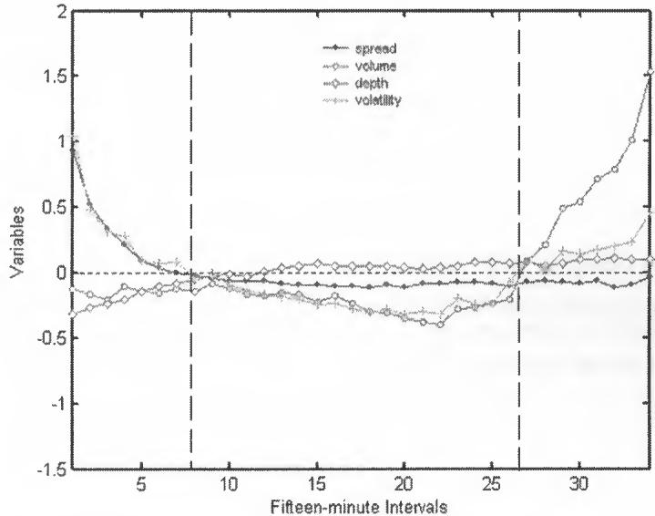  
Source: $\circledcirc$ Abad, Sanabria and Yagie (2005) Reproduced with permission from authors   
Figure 10-10 Intraday patterns of liquidity, trading activity in the Spanish stock market in 2002

The dashed lines highlight three distinct phases throughout the trading day. Thus, at the start of the day a period of lower liquidity lasts for around two hours, with higher spreads and relatively low quoted depths. This is then followed by an intermediate period where liquidity improves and volatility decreases. The last period is at around $3 { : } 3 0 ~ \mathrm { p m }$ which coincides with the U.S. open. This leads to a considerable increase in trading volume, although there is only a slight improvement in overall liquidity.

This chart also shows the characteristic U-shaped volume profile. So, just as historical averages are used to predict intraday trading volumes, a similar approach may be taken for liquidity estimates. In periods of lower liquidity, trading strategies can estimate when the depth might improve. They may then cvaluate whether the timing risk is sufficiently low to justify waiting; alternatively, they will have to issue more aggressive orders, and risk paying higher market impact costs.

Short-term liquidity predictions are also vital when seeking hidden liquidity, as we saw in Chapter 8. The concealed nature of this liquidity means that all such trading is based on estimates. This is particularly important when trying to choose between cxccution venues. Again, the availability of hidden liquidity often seems to increase throughout the day. Hendrik Bessembinder, Marios Panayides and Kumar Venkataraman (2008) and D'Hondt, De Winne and Francois-Heude (2004) both found this for hidden orders on Euronext. A similar trend was reported for the Spanish Stock Exchange by Angel Pardo and Roberto Pascual (2006).

# Predicting volatility

Price volatility is an important factor for many trading strategies as it helps determine the execution probability of limit orders. Higher volatility increases the likelihood of execution since it means the observed price range is likely to be wider. However, it also means orders are more likely to become mispriced, and so increases the risk of adverse selection. Higher volatility also makes hidden order usagc more likely. Hence, volatility is an important factor for limit order models, used to determine order placement, and thc cost modcls used by shortfall-based algorithms to determine the optimal trading horizon.

As with any market condition, short-term volatility fluctuates intraday, often increasing around the market open and close, as we saw back in Figure 10-10. There are two main ways of estimating volatility, these are based on either historical data or implying it from the priccs of options contracts.

# Predicting volatility with statistical methods

Historical measurement of volatility may be for a wide range of timescales, from intra-day to monthly, quarterly or even annual values. The volatility $\sigma$ of an assct's price may be calculated from the standard deviation of its returns, using the following formula:

$$
\sigma = \sqrt { \frac { 1 } { N - 1 } \sum _ { t = 1 } ^ { N } ( R _ { t } - \overline { { R } } ) ^ { 2 } }
$$

where $R _ { t }$ are the returns at time $t$ and $\overline { { R } }$ is the mean of the returns for $N$ days. Thc variance is $\sigma ^ { 2 }$

The simplest model for cstimating future volatility is just to base it on the previous day's value, often referred to as the random walk model. A slight enhancement of this approach is to determine an cstimate bascd on the average from of a range of historical volatilitics. This might simply be the mean of previously calculated volatilitics. Alternatively, it might be based on a moving average that just tracks the last 50 days. Exponentially weighted moving averages (EMA) give more weight to the recent values. The EMA method is used by RiskMetrics to model volatility. A detailed summary of all these techniqucs is provided by Ser-Huang Poon and Clive Granger (2003). They point out that one of the key issues to achicving useful estimates with these two moving average based methods is finding the optimal lag length (e.g. 50 days) or weighting scheme.

Another forecasting method is to create models based on previous values of volatility. The AutoRegressive (AR) model determines the volatility $\sigma _ { t }$ from the previous valuc $\sigma _ { t - I }$ using the following formula:

$$
\sigma _ { i } \mathrm { = } c + \sum _ { i = 1 } ^ { p } a _ { i } \sigma _ { t - i } + \varepsilon _ { t }
$$

where $c$ is a constant, each $a _ { i }$ is a parameter of the model and $\varepsilon _ { t }$ is an error term. The parameters may be estimated by carrying out least squares regressions on the data series. ARMA (AutoRegressive Moving Average) models are an extension of this approach that include a separate model based on the past volatility errors $\boldsymbol { \varepsilon } _ { t - l }$

$$
\sigma _ { i } = \varepsilon _ { t } + \sum _ { i = 1 } ^ { p } a _ { i } \sigma _ { t - i } + \sum _ { i = 1 } ^ { q } \theta _ { i } \varepsilon _ { t - i }
$$

where $\theta _ { i }$ are the parameters for this error model.

The ARCH (AutoRegressive Conditional Heteroskedasticity) family of models represent a more sophisticated approach. The first ARCH model was proposed by Robert Engle (1982). Instead of using sample standard deviations, the ARCH model uses a common statistical method (maximum likelihood estimation) to determine the best fit for its model, for a given probability distribution. A simple ARCH model determines the conditional variance as a function of past squarcd returns. The Generalised ARCH (GARCH) model was initially proposed by Tim Bollerslev (1986) and Stephen Taylor (1986). GARCH allows additional dependencics on lagged values; it also assumes a Normal distribution. Poon and Granger note that GARCH is the most popular model for many time series. This has led to a range of cxtensions such as the exponential, EGARCH, model.

In terms of overall accuracy, the historical volatility based averages tend to give similar results to GARCH models, although some of the later models, such as EGARCH, outperform GARCH. However, Poon and Granger note that the best overall results for volatility forecasts appear to be from implicd volatility.

Note this is obviously a very brief introduction to the statistical models for estimating volatility. Indeed, there are even more methods, such as stochastic volatility frameworks and regime-switching models. For further details on these, Poon and Granger (2003) is a good starting point. Also in Chapter 15, we shall see how arificial intelligence is being used to predict volatility.

# Using implied volatility

Implied volatility is based on the market prices of options contracts. Option pricing models, such as Black Scholes, allow us to determine what the market price for an option should be, given a certain asset price as well as other factors such as the maturity and interest rates. Therefore, by reversing this process we can use market prices to determine what level of volatility was used to generate them, hence the term implied volatility.

Figure 10-11 highlights the potential differences between a purely historical volatility measurement and an implied one, taken from an example for Instinet's (2006) implementation shortfall algorithm (Wizard).

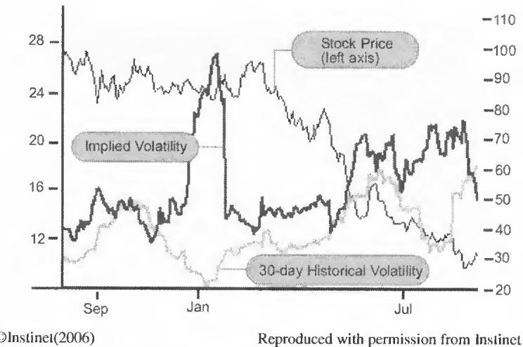  
Figure 10-11 Historical and implied volatility, from Instinet (2006)

The ehart shows the volatilities and the stoek price for CV Therapcutics Ine. (CVTX) in the period 2005-6. Notice how the implied volatility suddenly jumped in early January, coinciding with the company waiting for FDA approval for its new drug. The implied volatility aceurately reflects the uncertainty from the options market.

In comparison, the historical volatility based on the stock pric is purely backward lking and does not refleet this risk. So investors or traders unaware ol the imminent news release might underestimate the potential volatility of the stock if they focus solely on historical volatility. Hence, Instinet uses a weighted average of both historical and implied volatility for its risk estimates.

Implied volatility is not without its own problems, though. As Poon and Granger (2003) point out, the implied volatility refleets the market's expeciation of what the volatility will be for the underlying asset over the option's maturity. Thus, options for the same assct, hut with differing maturities, will have different implied volatilities. In practice, there are also often significant differences in the implied volatilities for options that have the same maturity but different strike prices. This phenomenon is the charaeteristie "volatility smile", as shown in Figure 10-12(a). If we then expand this to take account of the different maturities, we get a volatility surface, as shown in Figure 10-12(b).

Poon and Granger (2003) describe two of the main theoretical explanations for this cffect, namely the distributional assumption and stochastie volatility; they also outline other potential factors, such as market microstrueture and measurcment errors.

The distributional assumption refers to the faet that the Blaek Seholes model assumes the price of the underlying asset has a Log-Normal distribution. But for many risky assets the probability of outliers is higher than expeeted; the distribution is said to have "fat tails" (or is leptokurtic). So, deeply out-of-the-money options can actually have a probability of exereise which is higher than that expeeted by the Normal distribution, leading to higher priccs than predicted by Black Scholes.

Price/return distributions vary from asset to asset, but the differences arc particularly strong across different asset classes. Some nice examples are illustrated in a rcview by Gunter Meissner and Noriko Kawano (2001). For instance, in the currency and commodities markets, returns often have symmetrical, "fat tailed" distributions. Therefore, deeply out-ofthe-money options have higher volatilities for both high and low strike prices. In comparison, for the stock and bond markets distributions tend to be less symmetrical, with the "fat tails" more predominant on the left hand side of the distribution. This gives rise to a corresponding volatility skew (or grimace) with much lower implied volatilities at high strikes than at low ones.

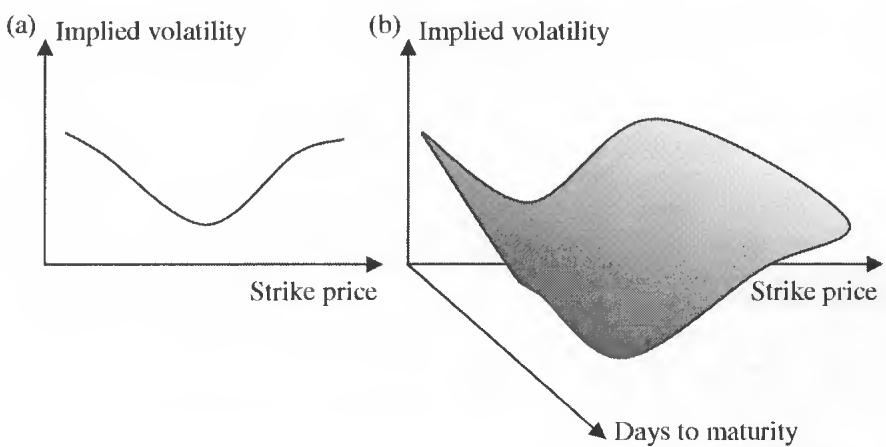  
Figure 10-12 An example implied volatiity (a) smile and its (b) surface

# Using volatility indices

Volatility indices provide a measure of the market expectations for near-term volatility, often hased on the prices of stock index options. Potentially, we can also decompose volatility into market and specific components, as we did for trading volume.

The best-known volatility index is the CBOE's VIX, which was started in 1993 and has also been dubbed the "fear index". Originally, the VIX was based on the S&P 100, but in 2003 it was switched to the S&P 500, to be more representative of the U.S. market as a whole. At the same time, a more sophisticated calculation was adopted. The VIX estimation derives the expected volatility for the next 30 days by averaging the weighted prices of a wide range of puts and calls for the index. It is constantly calculated in real-time; in fact, futures and options contracts are now available based solely on the VIX.

Figure 10-13 shows the historical closes for the VIX (based on the new calculation method). The volatility during the 2007-09 financial crisis is easy to see; it is also interesting to compare this to the much smaller spikes from 2001 and 2003. Indeed, October 2008 saw the VIX reach an all time high of 89. Before this, anything over 30 had been considered high. Although it is based on the S&P 500, the VIX has become the de-facto standard for global market volatility. That said, more localised variants are also starting to appear: The VXN caters for the NASDAQ 100, and in Europe there are now indices for the DAX, FTSE 100, CAC 40 and several other major indices. There are even indices for oil, gold and the euro. Over time, the coverage of such indices will probably continue to expand.

Hence, we can also use a volatility index to provide a short-term estimate for future market volatility. This may then be combined with asset-specific estimates to generate a more accurate estimate of an asset's future volatility.

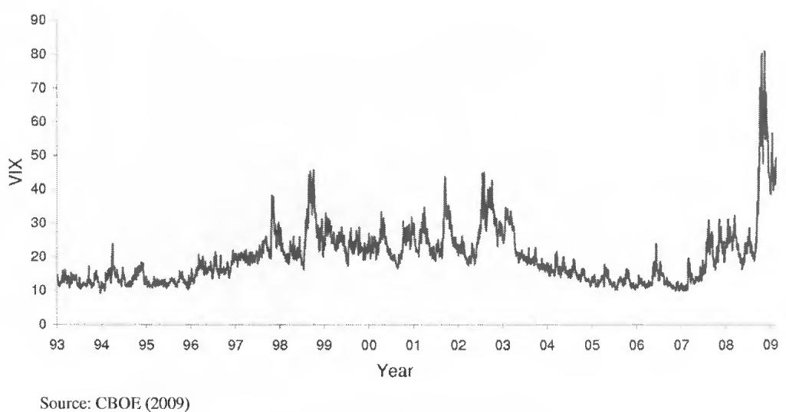  
Figure 10-13 VIX closing prices

# 10.3 Estimating transaction costs

Transaction cost models are essential for providing estimates of potential costs. In his guidc to market microstructure for practitioners, Ananth Madhavan (2002) points out threc key requirements for successful cost estimation models:

1. Distinguishing betwcen permanent and temporary pricc impact, sincc current trades will affect the prices of future ones   
2. Incorporating both order specific (size, trading horizon) and assct spccific (liquidity, volatility, price level, market) factors   
3. Varying estimates with the style of trading, so aggressive tactics which use market orders will incur higher costs than morc passive ones

The basis for many of these models is a framework suggested by Robert Almgrcn and Neil Chriss (2000). This uses a random walk model to estimate the current market price in terms of costs, such as permanent market impact, price trending and volatility. Robert Kissell, Morton Glantz, and Roberto Malamut (2004) cxpress this as:

$$
p _ { n } = p _ { 0 } + \underbrace { \sum _ { j = 1 } ^ { n } h ( x _ { j } ) e ^ { - ( n - j ) c } } _ { T e m p o r a r y } + \underbrace { \sum _ { j = 1 } ^ { n } g ( x _ { j } ) } _ { P e r m a n e n t } + \underbrace { \sum _ { j = 1 } ^ { n } \Delta p _ { j } } _ { P r i c e } + \underbrace { \sum _ { j = 1 } ^ { n } \varepsilon _ { j } } _ { P r i c e }
$$

where $p _ { \mathfrak { n } }$ is the current market price, $p _ { 0 }$ is the initial price, $p _ { j }$ is the price and $x _ { j }$ is the trade size for a transaction in period $j .$ The functions $g ( \ u )$ and $h ( )$ determinc permancnt and temporary impact respectively and $\varepsilon$ represents random noise. Notice that the temporary impact is dissipated by the function $e ^ { - ( n - j ) \hat { c } }$ where $c$ represents the rate of decay.

# Market impact

The price model shown in equation 10-2 is path dependent. As Kissell, Glantz, and Malamut (2004) point out, using it to estimate market impact requires accurate estimations of both the temporary and permanent impacts.

Early models assumed market impact functions were linear. In particular, Albert Kyle's (1985) model derived lincar equilibriums from fundamental principles. Similarly, Almgren and Chriss's (2000) firsl impacl models were also based on a linear approach.

The reality is probably something more complex and non-linear. Joel Hasbrouck (1991) reported a good fit for a square root relationship. Fabrizio Lillo, J. Doyne Farmer and Rosario Mantegna (2003) found a significant dependence on the market capitalisation. For low-cap stocks on the NYSE, Ihey found a square root relationship held, whilst for large-cap stocks and for those listed on the LSE they noted that the relationship was more like a power law, with an exponent between 0.2 and 0.3. In the next sub-section, we will review in more dctail a model by Almgren et al. (2005), which can catcr for both linear and non-linear solutions.

Another way of tackling this problem is a more top-down approach. Kissell and Glantz (2003) adopt a cost allocation technique lo estimate an average market impact cost based on aggregated trade imbalanccs. They then allocate this to specific trading pcriods rathcr Ihan to individual trades. We shall review this method in more detail later.

# A trade level approach

Robert Almgren et al. (2005) created a model for market impact estimation using empirical dala. This was based on earlicr work by Almgren and Chriss (2000) and Almgren (2003). Both the permanent impact function $g ( \ u )$ and the temporary one $h ( )$ were modelled as power laws:

$$
\begin{array} { l } { { g ( \nu ) = \pm \gamma \big | \nu \big | ^ { \alpha } } } \\ { { \big . } } \\ { { h ( \nu ) = \pm \eta \big | \nu \big | ^ { \beta } } } \end{array}
$$

whcrc $\nu$ is the tradc rale (the order size divided by 1he available time). The coefficients y and $\eta$ and the exponents $\alpha$ and $\beta$ may be determined from linear or non-linear regressions of empirical data. Thus, one of the aims was to confirm the nature of these functions: whelher they were truly linear, or were square roots or had another form.

Their empirical data consisted of a large private dataset of U.S. institutional orders from the Citigroup U.S. equity trading desks. This data also allowed details such as order side and large transactions to be identified. 4 Large orders were excluded, so the dataset was limited to only include ordcrs up to $10 \%$ of the ADV. Other simplifications were to assume a constant rate of trading and to ignore co-movement between asset prices.

The model assumes that the price change is actually based on an arithmetic Brownian motion $( B )$ . Given an initial market price $p _ { m } ,$ the permanenl impact function $g ( \ u )$ determincs the price drift $( d p )$ for a given trade rate $( \nu )$ \*\*

$$
d p = p _ { m } g ( \nu ) d \tau + p _ { m } \sigma d B
$$

where $\mathfrak { o }$ is the volatility and $\tau$ represcnts "volume time'" (the fractional average of the ADV which has executed so far). The temporary impact function $h ( )$ is used to determine the average execution price $( { \overrightarrow { p } } )$

$$
\overline { { { p } } } ( \tau ) = p ( \tau ) + p _ { m } h \left( \frac { X } { T } \right)
$$

where $\boldsymbol { X }$ is the order size and $T$ is the time.

Impact cost models were derived by integrating equations 10-5 and 10-6. They were then normalised so as to be able to use them across the wide rangc of asscts from their dataset. Hence, the asset specific volatility $( \sigma )$ was included, and the trading rate (X/T) was adjusted by dividing by the average daily volume $( V )$ . The resultant models for permanent and temporary impact $( I )$ are:

$$
I _ { p e r m } = \sigma T g \left( \frac { X } { V T } \right) + ( n o i s e )
$$

$$
I _ { t e m p } = I _ { r e a l } - \mu I _ { p e r m } = \sigma h \Bigg ( \frac { X } { V T } \Bigg ) + ( n o i s e )
$$

Notice that temporary impact is expresscd in terms of the realised and permanent impacts. Almgren et al. (2005) assume that the adjustment factor $\mu = 0 . 5 .$ The generic noise factor represents an error expression for each of the estimations.

In addition to normalising the impact functions, they also checked for any asset specifc dependencies. They discovered that an additional liquidity factor $( L )$ was required for the permanent impact cost function. 5 This factor is based on the shares outstanding (Θ) and the average daily volume (V) (effectivcly this is the inverse turnover):

$$
L = \left( \frac { \Theta } { V } \right) ^ { \delta }
$$

No such modifications were found to be required for the temporary impact function.

Finally, the power law impact functions, 10-3 and 10-4, were substituted into cquations 10-7 and 10-8 to give:

$$
\begin{array} { l } { \displaystyle { \frac { I _ { \mathit { p e r m } } } { \sigma } = \gamma T s i g n ( X ) \left| \frac { X } { V T } \right| ^ { \alpha } \left( \frac { \Theta } { V } \right) ^ { \delta } + ( n o i s e ) } } \\ { \displaystyle { \frac { I _ { \mathit { r e a l } } - \mu I _ { \mathit { p e r m } } } { \sigma } = \eta s i g n ( X ) \left| \frac { X } { V T } \right| ^ { \beta } + ( n o i s e ) } } \end{array}
$$

To solve the values of the exponents Almgrcn et al. (2005) used a modilied GaussNewton optimization algorithm. For their data sct, this resulted in the approximate values: [] ${ \mathfrak { a } } \approx 0 . 8 9$

$$
\begin{array} { c } { \beta \approx 0 . 6 0 } \\ { \delta \approx 0 . 2 7 } \end{array}
$$

They concluded that a linear function for permanent impact was feasible, since $\alpha$ was so close to one. These results also confirmed the concave nature of the temporary impact function since $\beta < 1$ . However, they found in favour of a 3/5ths power law, rather than the square root model. The liquidity factor δ also seems reasonable, suggesting that impact costs are higher for assets with lower average daily volumes.

These exponents were then used to determine the coefficicnts $\gamma$ and n. Almgren et al. (2005) termed these the "universal coefficients of market impact" since they found them to hold for their entire data set:

$$
\begin{array} { r } { \gamma \approx 0 . 3 1 4 } \\ { \eta \approx 0 . 1 4 2 } \end{array}
$$

Therefore, by substituting these values into equations 10-9 and 10-10 they were able to accuratcly estimatc market impact costs for any asset from their dataset using the following:

$$
\begin{array} { c } { { I _ { p e r m } = \gamma \sigma \displaystyle \frac { X } { V } \left( \displaystyle \frac { \Theta } { V } \right) ^ { 1 / 4 } + ( n o i s e ) } } \\ { { I _ { r e a l } = \mu I _ { p e r m } + s i g n ( X ) ~ \eta \sigma \displaystyle \left| \displaystyle \frac { X } { V T } \right| ^ { 3 / 5 } + ( n o i s e ) } } \end{array}
$$

It is important to note that their study was for U.S. equities. They concluded that the coeficients, possibly the exponents and mayhe even the functional forms might be significantly different across different markets as well as over time. For this reason, such models require careful calibration for each market before use.

Example 10-1: Almgren et al. (2005) provide an example estimating the impact costs of buy orders equivalent to $10 \%$ of the ADV of IBM and DRI, as shown in Table 10-1. Using their cost model, let's work through these calculations for the potential market impaet costs:

In this case, IBM is assumed to have an ADV of 6.561 million, from an outstanding total of 1,728 million shares, and a daily volatility of $1 . 5 7 \%$ .

Therefore, we can estimate the permanent impact by inputting these valucs into equation 10-11:

$$
I _ { p e r m } = 0 . 3 1 4 * 1 . 5 7 * 0 . 1 * ( 1 , 7 2 8 / 6 . 5 6 1 ) ^ { 1 / 4 } = 0 . 2 0 = 2 0 \mathrm { ~ b p s } .
$$

Similarly, the realized market impaet may then be determined using cquation 10-12. If we try to work the trade over half the trading day then $T { = } 0 . 5$

$$
I _ { r e a l } = 0 . 5 * 0 . 2 0 + ( \mathrm { s i g n } ( 0 . 6 5 6 1 ) * 0 . 1 4 2 * 1 . 5 7 * | 0 . 1 / 0 . 5 | ^ { 3 / 5 } ) = 0 . 1 8 = 1 8 \mathrm { b p s } .
$$

The temporary market impact may then be calculated using equation 10-8:

$$
I _ { t e m p } = 0 . 1 8 - ( 0 . 5 * 0 . 2 0 ) = 0 . 0 8 = 8 \mathrm { ~ b p s }
$$

Table 10-1 shows the market impact estimates for both IBM and DRI for a range of trade durations, from 0.1 to 0.5 of a day. The costs for DRI are higher than those for IBM; this is mainly due to its higher volatility. If we normalise the market impacts, by dividing them by the relative volatilities, we can see that the order DRI should actually have a lowcr permancnt impact cost. This makes sense, since DRI has a larger turnover so trading $10 \%$ of the ADV should have less impact than for IBM. Thercfore, DRI has a lower normalised permanent impact (O.096) compared to IBM (0.126). The normaliscd temporary impacts are the same, since the cost is not dependent on asset specific properties.

<table><tr><td rowspan=1 colspan=1></td><td rowspan=1 colspan=1></td><td rowspan=1 colspan=1>IBM</td><td rowspan=1 colspan=1>DRI</td></tr><tr><td rowspan=1 colspan=1>Average daily volumeShares outstandingInvcrse turnoverDaily volatility(%)Normalized trade size</td><td rowspan=1 colspan=1>V?ΘVσXV</td><td rowspan=1 colspan=1>6.561M1728 M2631.570.1</td><td rowspan=1 colspan=1>1.929 M168M872.260.1</td></tr><tr><td rowspan=1 colspan=1>Norm. perm impactPermanent impact bps</td><td rowspan=1 colspan=1>1pem/σIperm</td><td rowspan=1 colspan=1>0.12620</td><td rowspan=1 colspan=1>0.09622</td></tr><tr><td rowspan=1 colspan=1>Trade duration (days)</td><td rowspan=1 colspan=1>T</td><td rowspan=1 colspan=1>0.1      0.2      0.5</td><td rowspan=1 colspan=1>0.1      0.2      0.5</td></tr><tr><td rowspan=1 colspan=1>Normalized temporaryTemporary impact bps</td><td rowspan=1 colspan=1>ltem/σItemp</td><td rowspan=1 colspan=1>0.142    0.094    0.05422       15       8</td><td rowspan=1 colspan=1>0.142    0.094    0.05432      21       12</td></tr><tr><td rowspan=1 colspan=1>Realized impact bps</td><td rowspan=1 colspan=1>Ireal</td><td rowspan=1 colspan=1>32      25       18</td><td rowspan=1 colspan=1>43      32      23</td></tr></table>

Source: Atmgren et al. (2005)

# Table 10-1 Cost estimate details for Example 10-1

# A cost allocation approach

Kisscll and Glantz (2003) take the oppositc approach, using a top-down cost allocation model to estimate market impact. This method has proven capable of estimating costs at hoth the asset and portfolio level. The following providcs a brief summary of this model, but for more detailed analysis pleasc see Kisscll and Glantz (2003).

The market impact portion of equation 10-2 consists of a permanent impact function $g ( \mathbf { x } )$ and a temporary impaci function $h ( \mathbf { x } )$ ..

$$
M I ( x _ { j } ) = \sum _ { j = 1 } ^ { n } h ( x _ { j } ) e ^ { - ( n - j ) c } + \sum _ { j = 1 } ^ { n } g ( x _ { j } )
$$

The Kissell and Glantz (2003) model rclies on the following assumptions:

Market impact costs are the same for buys and sells. 6   
• Temporary market impact does not pcrsist beyond the current period.   
• Only liquidity demanding orders pay temporary market impact. All orders have permanent impact.

Based on these assumptions, they then derive averagc costs for both temporary $( \overrightharpoon { h } )$ and permanent $( { \overline { { g } } } )$ impact in $\$ 1$ share:

$$
\overline { { h } } = \frac { \displaystyle { \sum _ { j \in s i d e } } x _ { j } h } { \displaystyle { \sum _ { j \in s i d e } } x _ { j } } = \frac { b _ { 1 } I } { V _ { s i d e } } \quad \overline { { g } } = \frac { \displaystyle { \sum _ { j = 1 } ^ { n } \sum _ { i = 1 } ^ { j } x _ { i } g } } { \displaystyle { \sum _ { j = 1 } ^ { n } x _ { j } } } = \frac { ( 1 - b _ { 1 } ) I } { Q }
$$

where $\boldsymbol { I }$ is the total impact cost and $\boldsymbol { Q }$ is the net imbalance between buys and sells. They notc that only liquidity demanders pay temporary impact cost, so $V _ { s i d e }$ is the traded volume from liquidity demanders (on the same side as the imbalance or je side). The factor $b _ { 1 }$ represents the percentage of temporary impaet, so $\left( 1 \mathrm { ~  ~ { ~ - ~ } ~ } b _ { 1 } \right)$ equals the percentage of permanent impact.

Thesc averages may then be used to deseribe the market impact:

$$
M I _ { \mathfrak { H } } ( X ) = X \cdot \left( \frac { b _ { 1 } I } { V _ { s i d e } } + \frac { ( 1 - b _ { 1 } ) I } { \mathcal { Q } } \right)
$$

Kissell and Glantz found that the proportion of temporary impact in any given trading period $k$ was equal to the percentage imbalance at that time $( q _ { k } / Q )$

$$
M I _ { \mathbb { S } } ( x _ { k } ) = \sum _ { k = 1 } ^ { n } x _ { k } \left( \frac { q _ { k } } { \mathcal { Q } } \cdot \frac { b _ { 1 } I } { V _ { s i d e } } + \frac { ( 1 - b _ { 1 } ) I } { \mathcal { Q } } \right)
$$

The market impact may be restated in terms of just order details and expected markel volume by using the following assumptions:

• the imbalance is cqual to the order size $( Q = X )$ market volume is distributed evenly between buys and sells

Thus, the liquidity demander volume $\nu _ { s i d e }$ may be restated in terms of the order size $x _ { k }$ and the cxpceted volume for that period ${ \nu _ { k } } ^ { 7 }$ i.e. $\nu _ { s i d e } = x _ { k } + 0 . 5 ~ \nu _ { k } .$ Therefore:

$$
M I _ { \mathbb { S } } ( x _ { k } ) = \sum _ { k = 1 } ^ { n } x _ { k } \left( \frac { b _ { 1 } I x _ { k } } { X \cdot ( x _ { k } + 0 . 5 \nu _ { k } ) } { + \frac { ( 1 - b _ { 1 } ) I } { X } } \right)
$$

Finally, this may be rearranged to show the temporary and permanent components more clearly:

$$
M I _ { \mathfrak { G } } ( x _ { k } ) = \underbrace { \sum _ { k = 1 } ^ { n } { \frac { b _ { 1 } I x _ { k } ^ { 2 } } { X \cdot ( x _ { k } + 0 . 5 \nu _ { k } ) } } } _ { T e m p o r a r y } + \underbrace { ( 1 - b _ { 1 } ) I } _ { P e r m a n e n t }
$$

Equation 10-15 may be used to determine the market impaet solely from the impaet $I$ the order details (total size $X$ and order size $x _ { k }$ for period $k$ ) and the expected volume for that period $\nu _ { k }$

In order to actually estimate the model parameters, Kissell and Glantz rearranged the market impact cost for an order (equation 10-14) to be the product of two functions, allowing

estimation using non-linear regressions. This is achieved by assuming the order runs over a whole day, with a quantity $X$ equal to the net imbalance $Q$ , and by substituting $\eta ^ { - 1 } = Q / V _ { \mathrm { s i d e } } ,$ Hence, equation 10-14 may be rearranged to:

$$
{ M I } _ { \ S } \left( X = Q \right) = \frac { b _ { 1 } I Q } { V _ { s i d e } } + ( 1 - b _ { 1 } ) I = I ( Q , \sigma ) \cdot ( b _ { 1 } \eta ^ { - 1 } + ( 1 - b _ { 1 } ) )
$$

Finally, both the cost and imbalance are normalised to allow estimation across a wider range of data. The imbalanee is restated as $\mathrm { Z } ,$ a pereentage of the ADV, and the cost (in basis points) may be expressed as the product of both an instantaneous impact function ] $( I _ { b p } ^ { * } ( Z , \sigma )$ ) and a dissipation function $( d ( \eta ) )$

$$
M I _ { b p } = I _ { b p } ^ { * } ( Z , \sigma ) \cdot d ( \eta )
$$

Three possible structures for this instantaneous market impact function were investigated by Kissell and Glantz (2003):

$$
\begin{array} { l l l } { { L i n e a r : } } & { { I _ { b p } ^ { * } ( Z , \sigma ) = a _ { 1 } Z + a _ { 2 } \sigma + a _ { 3 } } } & { { = ( 8 Z + 0 . 3 0 \sigma + 9 0 ) } } \\ { { N o n l i n e a r : } } & { { I _ { b p } ^ { * } ( Z , \sigma ) = a _ { 1 } Z ^ { a _ { 2 } } + a _ { 3 } \sigma + a _ { 4 } } } & { { = ( 3 5 Z ^ { 0 . 6 5 } + 0 . 3 0 \sigma + 1 5 ) } } \\ { { P o w e r f u n c t i o n : } } & { { I _ { b p } ^ { * } ( Z , \sigma ) = a _ { 1 } Z ^ { a _ { 2 } } \sigma ^ { a _ { 3 } } } } & { { = ( 2 5 Z ^ { 0 . 3 8 } \sigma ^ { 0 . 2 8 } ) } } \end{array}
$$

They used non-linear regression to derive estimates for each of these models, from samples with a range of sizes, volatilities and participation rates. The preferred results for eaeh model are shown on the right hand side. Interestingly, the regression errors were found to be lower for the non-linear and power function based models, implying that the true relationship between impact cost and size is indeed non-linear.

The results proved to be consistent for both size and volatility; but as with any model, we still need to recalibrate it to find the most suitable estimates for specific markets.

Kissell and Glantz (2003) also determined an estimate for the dissipation function as:

$$
d ( \eta ) = ( 0 . 9 5 \eta ^ { - 1 } + 0 . 0 5 )
$$

The $9 5 \%$ was found in most of their regressions, and appeared to be time invariant and independent of size. Substituting this back into equation 10-16 gives:

$$
\hat { I } _ { \mathbb { S } } = I _ { \mathbb { S } } \cdot ( 0 . 9 5 \eta ^ { - 1 } + 0 . 0 5 ) = \underbrace { 0 . 9 5 I _ { \mathbb { S } } \cdot \eta ^ { - 1 } } _ { T e m p o r a r y i m p a c t } + \underbrace { 0 . 0 5 I _ { \mathbb { S } } } _ { P e r m a n e n t i m p a c t }
$$

So $9 5 \%$ of the total market impact costs are temporary, the cost of demanding liquidity. Therefore, regardless of trading strategy, a $5 \%$ permanent impact will result, rellecting the information content of the order.

Let's now put this in praetice with an example, loosely based on oncs from Kissell and Glantz (2003).

Example 10-2: Consider an order to buy 100,000 EFG, assuming a current price of $\$ 50$ a daily volatility of 200 bps and an ADV of 1,000,000.

In order to estimate the market impact we will first need a figure for the instantaneous impact cost. Using thc estimates shown for equation 10-17, we can substitute $Z$ with10 (sincc 100,000 is $10 \%$ of the ADV) and $\sigma$ is 200 bps:

Lincar: $I ^ { * } = ( 8 ^ { * } 1 0 + ( 0 . 3 ^ { * } 2 0 0 ) + 9 0 ) ^ { * } 1 0 ^ { 4 } ^ { * } 5 0 ^ { * } 1 0 0 , 0 0 0 = \ S 1 1 5 , 0 0 0$ Non-linear: $I ^ { ' } = ( 3 5 ^ { * } 1 0 ^ { 0 . 6 5 } + ( 0 . 3 ^ { * } 2 0 0 ) + 1 5 ) ^ { * } 1 0 ^ { - 4 } * 5 0 ^ { * } 1 0 0 , 0 0 0 = \ S 1 1 5 , 0 0 0 = 1 0 0 0$ 670 Powcr: $\begin{array} { r l } & { \boldsymbol { I } ^ { * } = ( 2 5 ^ { * } 1 0 ^ { 0 . 3 8 } * 2 0 0 ^ { 0 . 2 8 } ) * 1 0 ^ { 4 } * 5 0 * 1 0 0 , 0 0 0 = \mathbb { S } 1 3 2 , 1 9 0 } \\ & { \boldsymbol { I } ^ { * } = \mathbb { S } 1 2 0 , 9 5 3 } \end{array}$ Average

Thus, the avcragc instantaneous market impact is approximately $\$ 120,000$

We can now fecd this instantaneous market impact into equation 10-15 to estimate the ovcrall market impact. Table 10-2 shows an example trading strategy together with the cxpected market volumes.

<table><tr><td rowspan=1 colspan=1>Period</td><td rowspan=1 colspan=1>1</td><td rowspan=1 colspan=1>2</td><td rowspan=1 colspan=1>3</td><td rowspan=1 colspan=1>4</td><td rowspan=1 colspan=1>5</td><td rowspan=1 colspan=1>∑</td></tr><tr><td rowspan=1 colspan=1>Shares</td><td rowspan=1 colspan=1>20,000</td><td rowspan=1 colspan=1>15,000</td><td rowspan=1 colspan=1>10,000</td><td rowspan=1 colspan=1>25,000</td><td rowspan=1 colspan=1>30,000</td><td rowspan=1 colspan=1>100,000</td></tr><tr><td rowspan=1 colspan=1>E(Mkt volume)</td><td rowspan=1 colspan=1>250,000</td><td rowspan=1 colspan=1>150,000</td><td rowspan=1 colspan=1>100,000</td><td rowspan=1 colspan=1>250,000</td><td rowspan=1 colspan=1>250,000</td><td rowspan=1 colspan=1>1,000,000</td></tr><tr><td rowspan=1 colspan=1>Temporaryy orderimpact ($)</td><td rowspan=1 colspan=1>3,145</td><td rowspan=1 colspan=1>2,850</td><td rowspan=1 colspan=1>1,900</td><td rowspan=1 colspan=1>4,750</td><td rowspan=1 colspan=1>6,619</td><td rowspan=1 colspan=1>19,264</td></tr></table>

# Table 10-2 Execution details for Example 10-2

Bascd on this, and using equation 10-15, we can then determine each child order's temporary impact, as shown in the last row. For instance, in the first period the order size $x _ { k }$ is 20,000, whilst the cxpected volume $\nu _ { k }$ is 250,000. Therefore, using equation 10-15 the temporary impact for period (1) is defined as:

$$
\begin{array} { r l } & { = 0 . 9 5 \times \ S 1 2 0 , 0 0 0 \times \left( 2 0 , 0 0 0 \right) ^ { 2 } / } \\ & { \qquad 1 0 0 , 0 0 0 \times \left( 2 0 , 0 0 0 + 0 . 5 \times 2 5 0 , 0 0 0 \right) } \\ & { = \ S 3 , 1 4 5 } \end{array}
$$

Notc, this assumes we continue to use the same 0.95:0.05 ratio as we saw in equation 10-18, s0 $b _ { 1 } = 0 . 9 5$

As we can sce from Tablc 10-2, thc total temporary impact is $\$ 9$ 19,264. Estimating the permancnt impact is much easier since it is just a fixcd proportion of the instantancous impact. Thcrcfore:

Temporary impact $\$ 19,264$ Permancnt impact $= ( 1 - 0 . 9 5 ) * \ S \ 1 2 0 , 0 0 0 = \ S \ 6 , 0 0 0$ Market impact $= \ S \ 1 9 , 2 6 4 + \ S \ 6 , 0 0 0 = \ S \ 2 5 , 2 6 4 = 5 0 \mathrm { \ b p s } .$

So with a minimum of requircd data (pricc, volatility, ADV) we are able to use the Kissell and Glantz model to provide estimatcs for both the permanent and temporary market impact.

# Timing risk

Timing risk reflects thc uncertainty of thc transaction cost cstimatc. Pricc volaility and liquidity risk arc the two main sources of this uncertainty, although other factors such as sprcad risk may also be considered.

To make the determination of timing risk slightly easier Kisscll and Glantz (2003) assumc that volume and price movement are independent. This enables them to determine the pricc volatility and liquidity risk separately:

$$
\Re ( \phi ) = \sqrt { \underbrace { \sigma ^ { 2 } ( \mu ( x _ { k } ) ) } _ { P r i c e \nu o l a t i l i t y } + \underbrace { \sigma ^ { 2 } ( \kappa ( x _ { k } ) ) } _ { L i q u i d i t y \ r i s k } }
$$

The price risk for a trading strategy represents the volatility exposure for the remaining position. Hence, for a discrete trading strategy Kissell and Malamut (2005b) definc this as:

$$
\Re ( x _ { k } ) = p _ { 0 } \sqrt { \sum _ { j = 1 } ^ { n } r _ { j } ^ { 2 } \cdot \frac { t \sigma ^ { 2 } } { n } }
$$

where $r$ is the residual position and $t { \boldsymbol { \sigma } } ^ { 2 } / n$ is the per period variance.

The liquidity risk accounts for the variability of liquidity during the trading period. In turn, this affects the market impact estimations. For cxamplc, a suddcn drop in liquidity will mcan orders incur higher market impacts than expected. Kissell and Glantz use the unadjusted temporary impact function from cquation 10-15 to determine the liquidity risk. This is heyond the scope of this book, but more details may be found in Kissell and Glantz (2003).

# 10.4 Handling special events

Computerised trading strategies can react to changing market conditions extremely quickly. We have already seen how short-term predictions can enable them to make more proactive decisions about order placement. Another way of achieving this is to build in rules to recognise and react to specific market events. For instance, a futures contract has a set expiry date; we know from empirical evidence that approaching this date much of the trading volume will switch to the next contrac1. Therefore, adjustments may be built in to ensure that as it reaches maturity the trading volume estimates are realistic.

These events may be highly predictahle, such as contract expiration, or they may bc more unexpccted, such as a trading interruption due to news. Often they result in sudden rises in volatility and corresponding drops in liquidity. However, once the cvent has been recognised wc can use historical reactions as a guideline, providing short-term predictions for how market conditions will change, and how long this might last. This should help the strategy react more like a real trader might.

# Predictable events

Some events happen at set dates or they are pre-announced, so there is a high degree of certainty about them. Thus, it is relatively easy to crcate custom rules to be applied on these dates. Good examples of this are:

● New bond issues   
• Futures contract expiration   
• Witching days, when futures and options expire together   
• Stock index rebalances

In the following sub-scctions, we shall look at empirical examplcs of these events and examine how they affcct market conditions.

# New bond issues

For regular issucrs of bonds, most typically governments, new issues tcnd to attract higher Icvels of liquidity than the contracts that they have efectively replaced. For example, thc

U.S. Treasury distributes new issues of 1, 3 and 6-month bils every week, whilst issuance of 2 and 5-year notes is monthly, 10-year notes is quarterly and 30-year bonds is semi-annual. The current issue of any given U.S. Treasury is said to be "on the run". So cvery week, month or quarter a new bateh of Treasury securities become "on the run" and the bills/notes/bonds they have replaced are said to be "off the run".

A study by Michael Barclay, Terrence Hendershot, and Kenneth Kotz (2006) found that once Treasuries become "off the run" their trading volume rapidly drops by $90 \%$ within a matter of days. This is illustrated in Figure 10-14, which is based on average trading volumes between January 2001 and November 2002.

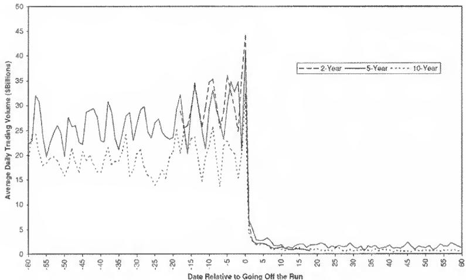  
Source: Barclay, Hendersholl, and Kotz (2006), Journal of Finance, Wiley-Black well Reproduced with permission from publisher   
Figure 10-14 Trading volume for on- and off-the-run U.S. Treasuries

The liquidity of new issues means hey can attract a slight premium over their "off the run" equivalents. David Goldrcich, Bernd Hanke and Purnendu Nath (2005) found an average premium of 1.5 basis points (bps) for 2-year notes. This dissipates to zero by the time of the nexl monthly issue. A higher premium of around 12 bps was observed for 30- year bonds by Arvind Krishnamurthy (2002).

# Futures contract expiration

Futures have a specific expiration date; just prior to this the exchanges re-designate the lead contract, such as transferring from the June to the September. Changing the lead causes a considerable shift in trading volume as hedgers roll their positions onto the new contract.

Figure 10-15 illustrates this effect for the CME S&P 500 futures contract, taken from a study by Adam Schwartz and Bonnie and Robert Van Ness (2004). On the right hand side we can sce that a brand new futures contract starts out with relatively low trading volumes. When the lead (or front-month) future has eight days left to maturity the lead is then switched to the next to expire (next-out) contract. The volume for the former lead contract has a final flurry before suddenly declining, shown at the eight-day marker in Figure 10-15.

For the new lead future, there will be a corresponding surge in trading volume, which we can see at the 98 days to cxpiry marker. During these crossovers the combined volume of

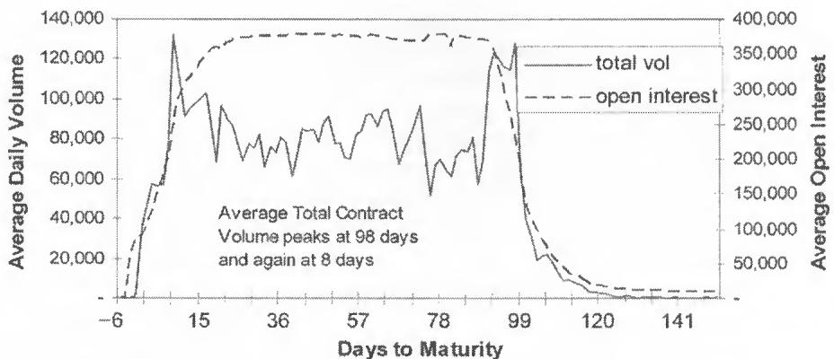  
Source: Schwartz, Van Ness and Van Ness (2004), Journal of Futures Markels Copyright 2004 John Wiley & Sons, Inc. Reprinted with permission of John Wiley & Sons, Inc.   
Figure 10-15, The daily volume and open interest of S&P 500 futures for 1999-2000

both contracts can actually see a net increase of around $30 \%$ , as observed for the S&P 500 by Ira Kawaller, Paul Koch and John Peterson (2001). They also found that the volatility of the contracts is closely linked to their trading volume. Hence, the lead contract has consistently lower volatility than the next-out contract.

Figure 10-15 also displays the open interest, which reflects the actual number of outstanding contracts. Again, we can sec this suddenly climbs around the 98-day marker, and falls around the eight-day marker. In between these two peaks, the open interest remains relatively static over this period, whilst the trading volume is noticeably lower. This phasc represents the secondary trading of contracts.

One way of handling this expiry-relatcd seasonality for trading volume data is providcd by Phil Holmes and Jonathan Rougier (2005). They used the change in open interest as an adjustment for the trading volume, so when a contract becomes lead there will be a negative adjustmcnt. This approach was successfully used to interpret the signilicancc of trading volumcs for the S&P 500, U.K. long gilts and Brent crude contracts.

# Witching days

Witching days occur when several classes of derivatives, for the same undcrlying asset, all expire on the same date. This is best typified for stock indices where the expiration of index futures and options as well as equity options is known as "riplc witching". The introduction of single stock futures has added even more volume, together with the more cumbersomc moniker "quadruple witching". The largest witching day is in the U.S., when the quarterly expirations of S&P 500 derivatives converge. A detailed review of this, and its effects on trading at both NYSE and NASDAQ, is providcd by Michael Barclay, Terrence Hendershott and Charles Jones (2006). The volumes involved on witching days can be huge, for instance, in terms of S&P 500 futures alone they note that since late 2004 between $\$ 50 – 75$ billion are settled on each witching day.

Arbitrageurs account for a sizeablc proportion of the volume during witching days. They maintain hedged positions in the cash and derivative markets, since the derivatives usually settle in cash. At cxpiration, they need to closeout their cash market positions. To make a prolit they must target the settlement price of the derivative contracts. Therefore, on witching days the cash markets reccive considerable additional order flow from arbitrageurs. For instance, Barclay, Hendershott and Jones (2006) note their activity can increase up to 50 times on witching days, taking normal arbitrage volumes of $\$ 0.24$ million per stock up to $\$ 12.74$ million on NYSE, based on data from 2003 to Q3 2005. These shifts can significantly alter the normal balance between supply and demand, potentially causing large, but transient, price changes.

The short-term effects on trading volume for both NYSE and NASDAQ are shown in Figure 10-16. This plots the ratio of witching day volume compared to normal volumes, based on averages for each quarter from 1998 to Q3 2004. Thus, on witching days they found the NYSE opening trade volume was, on average, around seven times larger.

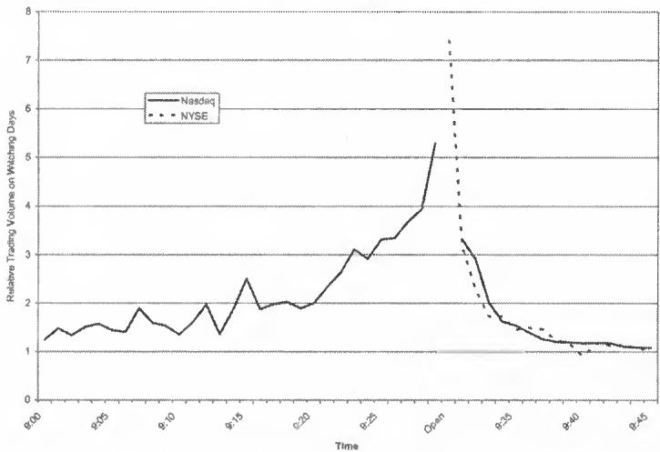  
Source: Barclay, Hendershotl and Jones (2006) Reproduced with permission from publisher Copyrighi $\odot$ 2001, School of Business Administration, University Of Washington   
Figure 10-16 Relative Witching day trading volume

The 2005 NYSE audit figures actually showed a ten times increase in volumes, with average opening volumes worth $\$ 15$ million per stock. Similarly, on NASDAQ pre-open volumes reached over five times their usual levels. In both markets, a higher volume persisted after the open. Though, this dissipated rapidly with volumes returning back to their normal levels by around $1 0 \mathrm { a m }$ .

A similar effect was observed for short-term volatility, as shown in Figure 10-17. Again, both markets saw a considerable jump in volatility on the morning of the witching. For the NYSE, Barclay, Hendershott and Jones (2006) determined an average increase of nearly 28 bps, whilst an excess of 64 bps was found for NASDAQ. As with volume, both markets also saw a rapid reduction in the excess volatility once the opening auction was completed. Though, by around $1 0 \mathrm { a m }$ both markets returned to normal.

The study by Barclay, Hendershott and Jones (2006) is clearly also an interesting comparison between the two major U.S. markets. Some of the differences, particularly in terms of volatility, may be atributed to the variety of companies traded on each exchange.

They also note that the NASDAQ's introduction of an opening call auction in 2004 significantly improved its efficiency at handling witching days. In fact, they suggest that this may have contributed to the $50 \%$ jump in open interest in the \$&P 500 which occurred in November 2004. This may have also helped triple the witching volume on the NYSE.

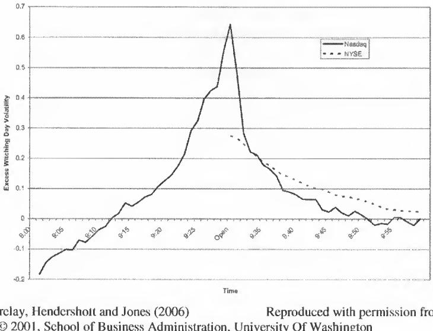  
Figure 10-17 Excess Witching day volatility

# Index Rebalancing

Stock indices are important benchmarks. In order to accurately reflect the markets they serve periodic rebalances are required. These ensure stocks that now meet the requirements for the index are added, and those that fail to meet them are removed. Hence, by rebalancing indices, such as the FTSE 100 or the S&P 500, manage to keep representing the major stocks for their respective markets.

Since so many investment firms track the major stock indices any such changes are publicised well before they aclually happen. This gives the investors suficient warning to realign their portfolios. To minimize their tracking error, index funds buy stocks added to the index, and sell those that are removed. So being included in a major index can lead to a sudden increase in demand for a company's shares. This can lead to a permanent improvement in its liquidity, in addition to improved coverage by analysts. Numerous studies have found that stocks that are added to an index see an abnormal increase in their returns whilst the stocks that are removed see a decrease.

A lot of research has focussed on the S&P 500, which is hardly surprising given the vast amount of assets that are benchmarked to this index. ⁸ Since 1989 Standard and Poor's have pre-announced adjustments a week in advance. Honghui Chen, Gregory Noronha and Vijay Singal (2006) analysed the returns for stocks involved in a rebalance, from before the initial announcement to over two months after the index change. Figure 10-18 shows the effect on the prices of these stocks for the period 1989-2002.

On announcement day, abnormal returns were, on average, $+ 5 . 1 2 \%$ for additions, experienced by over $94 \%$ of the sample firms. This increased to $+ 8 . 3 7 \%$ for the day of the actual rebalance. In contrast, stocks being removed from the index saw, on average, an $8 \%$ drop in returns by the day of the announcement, followed by a further decline to $- 1 4 \%$ on the effective date. Unlike the additions, though, this price effect did not appear to be permanent.

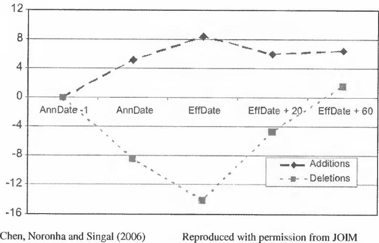  
Figure 10-18 Average price responses to S&P 500 rebalances (1989-2002)

The negative effect disappeared within 60 days of the rebalance.

Similar results for the period between the announcement and the effective date were obscrved by Ananth Madhavan and Kewei Ming (2003) and Anthony Lynch and Richard Mendenhali (1997). Though, after the effective date Lynch and Mendenhal (1997) only noted a partial reversion in prices. Chen, Noronha and Singal (2006) explain that this difference is most likely due to their study using larger samples, as well as tracking the returns for longer after the event. They also suggested that increased awareness was a potential explanation for the pcrmanent increase in returns for additions. They reason that investors do not suddenly become less aware of stocks which are rcmoved from the index, hence the asymmetry in the returns.

Madhavan and Ming (2003) focussed on the July 19 2002 S&P 500 rebalance when seven non-U.S. companies were replaced. They found that by trading in the period leading up to the actual rebalance investors could dramatically reduce their trading costs without exposing thcir portfolios to substantial tracking error risk.

Madhavan (2002a) found an cquivalent effect for the annual rebalances of the Russell 3000 index. He noted that the subsequent return reversals in July suggested that price pressure might have been an important determinant in generating the abnormal returns. He also concluded that the low liquidity of the stocks being removed might explain some of the asymmetry in the returns between the additions and the deletions.

Comparable short-term abnormal returns were also observed for rebalances of the U.K. FTSE-100 by Bryan Mase (2006). Though, he found no equivalent pcrmanent price effects for additions. Instead, he noted that a reversal occurred for both additions and delctions, within a month their returns were back to normal.

In terms of trading volume, Chen, Noronha and Singal (2006) found turnovers to be over three times higher for affected stocks on the S&P 500 announcemcnt days. They also saw turnovcrs jump to over 12 times normal levels on the effective dates. After the rebalance, the volumes returned to normal for the newly added stocks, but those removed from the index saw a decline in their volumes. In their study of the S&P 500, Lynch and Mendenhall (1997) reportcd significantly higher volumes on the day before the effective date. Similarly, Mase (2006) found peaks in trading volume on the day before FTSE-100 rebalances. The peaks applied to both additions and delctions; although post-rebalance therc was an apprcciablc decline in the volumes for the stocks removcd from the indcx.

The impact of index changes have also been analysed for the equity options markets. A study of the S&P 500 by Rong Qi and Libo Sui (2007) tracked the prices and trading volumes for stock options with strikcs within $5 \%$ of the market price and maturities of 30- 117 days. They found that on thc day of the announcement call options for the additions saw a considerable pricc risc whilst the cost of puts fell. For the deletions, thc put options saw an even grcatcr price risc, whilst their calls became cheaper. They note that hetwecn the announccmcnt and effective dates the highest abnormal return was for put options on the deletions, although the call options on additions also saw a positive return. Again, the price changes secmed to be permanent for the additions, whilst a partial reversal occurred within around 30 days of thc cffective date for the deletions. Interestingly, thcy also observcd that the option prices started to changc up to ten days before thc announcement and accelerated at livc days before, suggesting that thc option market could be a useful leading indicator. Qi and Sui (2007) also reported similar volume spikes. On announcement day, they found up to a 30-timcs incrcasc for put options on the additions and deletions, up to 50-times for call options on the deletions and around 17-times for call oplions on the additions. They notcd that the open-intcrcst level increased dramatically from announcemcnt to the efcctivc date, then suddenly dropped back to normal levels. Clearly, only so much volumc is due to indexfunds, they attributed much of the incrcasc to arbitrageurs.

# Unpredictable events

Events triggered by information or news are much less predictablc. Whilst they may be hardcr to forecast, their short-term effects can still be quantified. For example, trading interruptions, such as halts or volatility auclions, may be followed by periods of much higher volatility and volumes, although these often dissipate after a fcw hours.

# Trading interruptions

Excessive volatility poses a serious problem for market participants. In an attempt to prevent this, most markets adopt a variety of different methods to try to control things when new information suddcnly bccomes available, namely:

● Trading halts Price limits Volatility auctions

Trading halts are imposed by the market authorities; they ccase trading for a sct pcriod whilst new information is made public. Often these are followed by a call auction to provide a more stable reopening for thc affcctcd asset. Price limits act as trading ranges, any trades that would shift the price outside of these are simply not permited. Alternatively, volatility auctions switch continuous trading to a call auction for a short pcriod. Essentially, they are like micro-halts since they often only last for around five minules; howcvcr, they are generally triggered by set pricc rulcs, much like a price limit. This is a key difference bctwcen these mechanisms since both volatility auctions and price limits may he maintaincd automatically by markct monitoring systems. Their rule-based naturc makes them much easier to predict, In fact, a study by David Abad and Roberto Pascual (2006) cven detcrmines the probability of hitting such limits. In comparison, trading halts are morc subjcclive and so harder to predict.

Trading halts are commonly adopted in the U.S. equity markets, whereas pricc limits are used more in European and Asian stock markets, as well as the U.S. futures markets. Volatility auctions are becoming increasingly popular, especially in Europe. They have also been incorporated into NYSE as Liquidity Replenishment Points (LRPs).

Researchers are stil divided over which mechanism is best. Overall, trading halts seem to be preferred over price limits, whilst some studies find volatility auctions more effective than halts. For example, Yong Kim, José Yagüe and J. Jimmy Yang (2008) compared the effect of price limits and halts for trading on the Spanish stock exchange. They concluded that after both interruptions there was increased trading activity. Though, they noted that after trading halts volatility remained the same and the bid-offer spread actually reduced, whereas after price limit hits both the volatility and spread increased.

Note that the main focus of this section is on asset-specific interruptions, since these occur much more frequently than market-wide halts. For instance, in their NYSE study Bidisha Chakrabarty, Shane Corwin and Marios Panayides (2007) analysed 4,020 halts between January 2002 and December 2005, an average of over four a day.

# Trading halts

Trading halts may be broken down into two main types, those driven by ncws and those that arise from order imbalances. Exchange officials instigate news halts when information due to be released is expected to have a significant impact on prices. The halt allows time for this to be disseminated to traders and investors. Order imbalance halts are triggered by a market specialist when the imbalance between buys and sells is too large. During the halt traders may modify, cancel and place new orders, after the halt trading then reopens with a call auction.

NYSE supports both types of halts. In their study, Shane Corwin and Marc Lipson (2000) found the average NYSE halt lasted over 80 minutes. News halts took around 86 minutes whilst order imbalance halts lasted an average of 56 minutes. During this time they noted that order activity increased significantly, both for submissions of new orders and cancellations of existing ones. Hence, by the time the market reopens the order book mainly consists of orders submitted during the halt. Though, due to the uncertainty surrounding haits, they also noted that the depth near the quotes falls to unusually low levels during the halt, even though specialists and floor lraders provide additional liquidity. They also observed that order flow could remain at elevated levels for several hours after the halt. Importantly, they found that the market-clearing price after the reopening call auction was a good predictor of future prices. In their sample data, $3 6 \%$ of news halts led to price rises, $4 3 \%$ led to drops and $21 \%$ remained unchanged. Whilst for order imbalance halts, $48 \%$ led to riscs, $41 \%$ to drops and $11 \%$ were stable. Overall, the average absolute return after a halt was just under $4 \%$ .

NASDAQ caters for news-driven halts. Wiliam Christie, Shane Corwin, and Jeffrey Harris (2002) found that these led to substantial increases in both volume and volatility. Trading volume and the number of trades were over six times the normal levels for the half hour after the halt, and remained unusually high for up to two hours afterwards. Intraday halts mcan market makers cannot start posting prices until five minutes before the resumption of trading. These were found to result in up to nine times the normal levels of volatility, whilst the bid ofer spread more than doubled. In comparison, for halts that occur after $4 \mathrm { p m }$ there is an extended 90 minute opening the following day. The volatility associated with such openings was significantly lower and the bid offer spread was virtually unalfected. They concluded that there is a clear benefit to allowing more time for price discovery after any halts.

# Price limits

Price limits are gencrally adopted in order-driven markets. They may be static and/or dynamic. Static thresholds are usually applied to a benchmark price, such as the open or the previous close. So a $10 \%$ limit from the open restricts the price range betwcen 36 and 44 for an asset that opened at 40. Dynamic thresholds are more versatile and are often bascd on the last traded price. For example, a $5 \%$ limit on an asset whose last traded price was l00 allows a price range of 95.00-105.00. If the next trade is at 104, the allowed pricc range will shift to 98.8-109.2.

The rules intervene for any trades that would break these ranges and send the market price either above the high limit or below the low. Such trades may then simply not be permitted, in which case the trader must decide whether to alter their pricc or not trade, forcing them to re-evaluate the market conditions.

Research on the cffectiveness of price limits has not becn conclusive. Certainly, there are as many studies that find price limits to be inefficient arc there are ones finding them bencficial. A good cxample is an analysis of the Tokyo Stock Exchange by Kenneth Kim and S. Ghon Rhee (1997). They found that price limits could actually lead to higher volatility and volatility spillover on subsequent days. One of the problems with price imits is that the same price rule is often applied to all the assets within a certain market. This can pose issues for illiquid assets, sincc thcsc can have significantly wider spreads, which can lead to them triggering the limits more often. This is illustrated in a study of the Chinese stock market by Gong-Meng Chen, Kenneth Kim and Oliver Rui (2005), who conclude that wider limits may be appropriate for the less liquid B-shares.

# Volatility auctions

Volatility auctions shift continuous trading into a short period call auction, often lasting only about five minutes. This gives traders a brief respite before continuous trading recommences, allowing time for a new price level to be determined. The limits that trigger volatility auctions are usually much less than any daily price limits and so volatility auctions occur more frequently.

These are now in use at NYSE, Euronext and the London Stock Exchange, as wcll as a variety of other markets. A detailed study of the eflicicncy of volatility auctions on the Spanish stock exchange is provided by David Abad and Roberto Pascual (2007). They found that volatility started to increase half an hour beforehand, peaking in the ten-minutc window around the call auction. In this period volatility levels could shift over six standard deviations away from normal lcvels. Though, they also noted that volatility rapidly dissipated reaching normal levcls again within 90 minutes.

A similar effect was observed for trading volumes, whilst they found that the bid-offer spread was slightly wider for 30 minutes after the auction. However, no marked cffect on the displayed order book depth was found. Since the recovery periods were shorter than those observed for NYSE or NASDAQ, they concluded that volatility auctions are an effcctive mcans of handling such situations.

# Corporate announcements

Corporate announcements can be another relatively unpredictable event. Rclcases of details, such as company earnings or dividend payments, are often scheduled, but firms are Iree to change the dates. So, both the information they relay and when they occur can be hard to predict.

A study of dividend announcements for NYSE stocks was carricd out by John Graham,

Jennifer Koski, and Uri Loewenstein (2003). Overall, they observed a decreasc in liquidity immediately beforehand for notices that were well anticipated. As we might expect, the available depth decreased as traders prepared for the announcement. Afterwards, things returned to normal, although how long this took depended on how well the new information was received. For completely unanticipated announcements, the changes in liquidity were less noticeablc beforehand. They observed a considerable and sudden increase in the spread that lasted for up to an hour after the news. The time taken for the available depth to recover also seemed to be longer for such cvents. Interestingly, they also found that unanticipated events were preceded by abnormal trading volumes. The consistency of this pre-event volume suggested some anticipation by informed traders. Though, their study focused on public news, rather than any other sources of market information or rumours.

Whether the announcement is on time can also give away important information. Firms tend to be kecn to announcc good news and defer issuing bad news. Mark Bagnoli, William Kross and Susan Watts (2004) analyscd this effect for U.S. companies. They found that for each day of delay from the expccted date of the announcement there was a fall of one penny/share below the consensus forecasts. In addiion to these losses, they also noted that the markct reaction on the actual day of the announcement depended on how late it had heen. Thus, firms that reported late saw cven more adverse reactions to bad results than those with similar results who reported on time. In comparison, they found that the markct reaction to be more aggressive for early announcements.

The rclativcly unstructured format of news can make it very difficult for computer systems to analyse and interpret. In Chapter 14, we will examine methods to overcome these difficulties and analyse the impact of news in much more detail, covering both corporate and macroeconomic news.

# 10.5 Summary

Trading algorithms and execution tactics are rule-based approaches responding to market conditions. So generally they are reactive. To enhancc their performance we can:

Incorporate short-term prediction models for conditions such as price and volume.   
Improve their spotting and handling of specific events, such as witching or halts.

Short-term forecasting models for key market conditions enable trading strategies to be slightly more proactivc and so take advantage of price improvement by placing more passively priced orders than they might otherwise.

Price forecasts may only be for the next few minutes, based on: Imbalances in supply and demand. Gaps in the order book, which trigger price jumps.   
Volume forecasts tend to be for longer periods, based on: Daily historical trading volume profiles. These may be further adjusted to account for seasonal factors or even specific holidays or cvents. Volumes may also be decomposed into market and asset-specific components.   
Liquidity measures, such as the bid offer sprcad or order book depth may be   
forecast using intraday averages.   
Volatility forccasts help determine execution probability for orders, using: Statistical estimates, based on methods like EMA, ARMA or GARCH.   
Implied volatility, inferred from the market prices of options.   
Market volatility, estimated using indices such as the VIX.

Transaction cost estimation helps to gauge the balance between cost and risk. Many of these models are based on a framework by Almgren and Chriss (2000):

Market impact models adopt a bottom-up approach.   
Cost allocation models take a top-down view based on aggregated trade imbalances.

:  Identifying specific market events can also enhance performance. For instance:

New bond issues lead to lower liquidity for the newly "off the run" assets.   
Expiration of futures, as liquidity rolls from the current contract to the new one.   
Witching days often lead to increases in trading volume and short-term volatility.   
Additions and removals from stock indices lead to increased activity in these stocks.   
Trading halts and volatility auctions also lead to incrcases in volatility and volume.

Chapter 11

# Infrastructure requirements

Algorithmic trading is just as reliant on its infrastructure as the financial theory upon which its rules are based.

# 11.1 Introduction

So far, in this book we have focussed on the theory behind trading strategies. However, implementing them also involves a considerable amount of infrastructure. Figure 11-1 shows a high-level overview of the main components that are required for algorithmic trading and DMA.

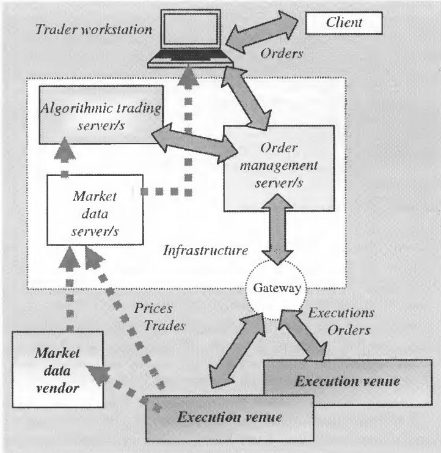  
Figure 11-1 A high level view of the infrastructure required for electronic trading

Clearly, order management is a key part of this process, without it nothing much would happen. Before we move on to look at some of the technical considerations for implementing trading algorithms let's first review the mechanics of order management.

# 11.2 Order management

Order management plays an important role in any trading. Just as orders are the basis of any strategy, so they must be entered and routed to the appropriate destination, as Figure 11-1 shows. Executions (or fills) and updates/confirmations must be propagated back so that we can track the status of any given order. This is all catered for by a wide range of platforms, available from brokers and third-party vendors. There are two main types, namely order management systems (OMSs) and execution management systems (EMSs). Table 11-1 summarises some of the key functions offered by these platforms.

<table><tr><td rowspan=1 colspan=2>Function</td><td rowspan=1 colspan=1>OMS</td><td rowspan=1 colspan=1>EMS</td></tr><tr><td rowspan=2 colspan=1>Portfoliomanagement</td><td rowspan=1 colspan=1>Modelling and rebalancing, &quot;what-if&quot; analysis</td><td rowspan=1 colspan=1>√</td><td rowspan=1 colspan=1></td></tr><tr><td rowspan=1 colspan=1>Portfolio accounting</td><td rowspan=1 colspan=1>✓</td><td rowspan=1 colspan=1></td></tr><tr><td rowspan=4 colspan=1>Riskmanagcmcnt</td><td rowspan=1 colspan=1>Position managcment and P&amp;L</td><td rowspan=1 colspan=1>✓</td><td rowspan=1 colspan=1></td></tr><tr><td rowspan=1 colspan=1>Risk management/exposure analysis</td><td rowspan=1 colspan=1>√</td><td rowspan=1 colspan=1></td></tr><tr><td rowspan=1 colspan=1>Cash management</td><td rowspan=1 colspan=1>√</td><td rowspan=1 colspan=1></td></tr><tr><td rowspan=1 colspan=1>Commission tracking</td><td rowspan=1 colspan=1>√</td><td rowspan=1 colspan=1></td></tr><tr><td rowspan=3 colspan=1>Analytics</td><td rowspan=1 colspan=1>Pre-trade analysis</td><td rowspan=1 colspan=1>√</td><td rowspan=1 colspan=1>✓</td></tr><tr><td rowspan=1 colspan=1>Post-tradc analysis</td><td rowspan=1 colspan=1>√</td><td rowspan=1 colspan=1>√</td></tr><tr><td rowspan=1 colspan=1>Real-time exccution benchmarks</td><td rowspan=1 colspan=1></td><td rowspan=1 colspan=1>√</td></tr><tr><td rowspan=4 colspan=1>Execution</td><td rowspan=1 colspan=1>Real time market data</td><td rowspan=1 colspan=1>√</td><td rowspan=1 colspan=1>√</td></tr><tr><td rowspan=1 colspan=1>Order book depth</td><td rowspan=1 colspan=1></td><td rowspan=1 colspan=1>√</td></tr><tr><td rowspan=1 colspan=1>Connectivity to brokers/routing networks/FIX</td><td rowspan=1 colspan=1>√</td><td rowspan=1 colspan=1>√</td></tr><tr><td rowspan=1 colspan=1>DMA/Trading algorithms/crossing</td><td rowspan=1 colspan=1>0</td><td rowspan=1 colspan=1>✓</td></tr><tr><td rowspan=3 colspan=1>Operations</td><td rowspan=1 colspan=1>Trade confirmations/allocations</td><td rowspan=1 colspan=1>✓</td><td rowspan=1 colspan=1>√</td></tr><tr><td rowspan=1 colspan=1>Connectivity to back-office systems/STP</td><td rowspan=1 colspan=1>√</td><td rowspan=1 colspan=1>√</td></tr><tr><td rowspan=1 colspan=1>Exception rcporting /reconciliations</td><td rowspan=1 colspan=1>√</td><td rowspan=1 colspan=1>✓</td></tr></table>

# Table 11-1 Typical OMS/EMS functions

Note that directories of the main OMS and EMS platforms may be found on the Advanced Trading website.

Order management systems were originally developed to help improve workflow. They also encompass post-trade functionality, handling reporting and account allocation ready for clearing and settlement. They may also include portfolio-based functionality.

Execution management systems trace their roots back to the trade blotters and simple order entry screens that traders have relied on for decades. The adoption of DMA and algorithmic trading has led these to become increasingly sophisticated. Similarly, the increasing focus on transaction cost analysis has meant that many such systems now incorporate detailed pre-trade analytics.

At present, the level of convergence between OMSs and EMSs is growing rapidly. Fundamentally, though, whichever platform we use the mechanics of order cntry and thcir subsequent routing are much the same. So let's examine each of these stcps more closely.

# Order entry

Clearly, thc main points to be captured for any order arc:

• the asset (a unique identifier or symbol)   
● the direction (whether we are buying or selling)   
● the order size   
• any price limits (if applicable) any additional information detailing the ordcr type and/or conditions

As we saw in Chapter 4, there are a lot more types of order available than just market and limit orders. Similarly, a wide range of conditions may be applied to orders, allowing control over factors such as when and how long they are active, whether they may be partially filled and where they are routed. Therefore, order entry screcns need to be able to support whatcver order types and conditions are available for any given market.

Traders usually have a lot going on. Order entry needs to be a quick and painlcss operation. Symbol and account lookups must be fast to help ensure that order entry is as painless as possible. Order entry screens also nced to make the appropriate options for order types and conditions easily available to the trader. For instance, Figure 11-2 shows an cxample order entry screen from the web version of the NASDAQ Workstation. Herc we can easily select betwecn different order types, routing destinations or change the time in forcc (TIF). We may create an iceberg order simply by setting a smaller display quantity. Likewise, therc is a checkbox to activate pegging and an associated offset. So from a few drop down menus and chcck boxes a wide variety of order types is possible.

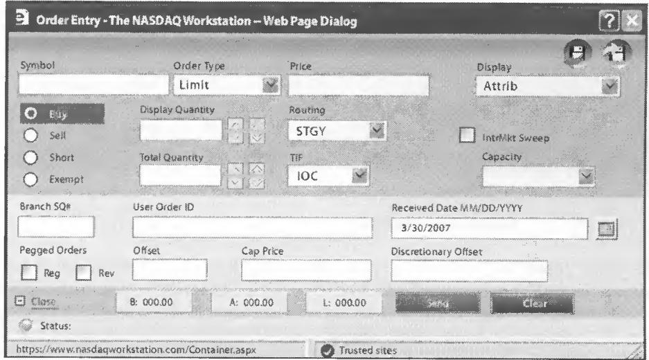  
Source: NASDAQ (2008) $^ ©$ Copyright 2008, The NASDAQ OMX Group, Inc., Reprinted with permission   
Figure 11-2 An example order entry screen

Validation is also important, given al the possible permutations of orders and conditions across difcrent venues/markets. Hence, order entry screens should ensurc that selected options are all compatible and are valid for the given market. Such validation is particularly important for DMA where the users may not be fully aware of all the intricacies of local market order types/conditions and regulations. It may also make sense to incorporate some "fat finger" logic, such as checking the overallorder size or comparing it with the asset's average daily volume (ADV), to try to catch any mistakes.

With trading algorithms, the order entry screens tend to be more customised, since each algorithm has slightly different parameters and requirements. Often vendors also incorporate pre-trade analytics and/or transaction cost estimates to help with algorithm selection. For example, Figure 11-3 shows a sample screen taken from Morgan Stanley's Passport trading application. Since the screens are customised for each algorithm, all the necessary parameters are laid out in an intuitive fashion, allowing easy and accurate order entry.

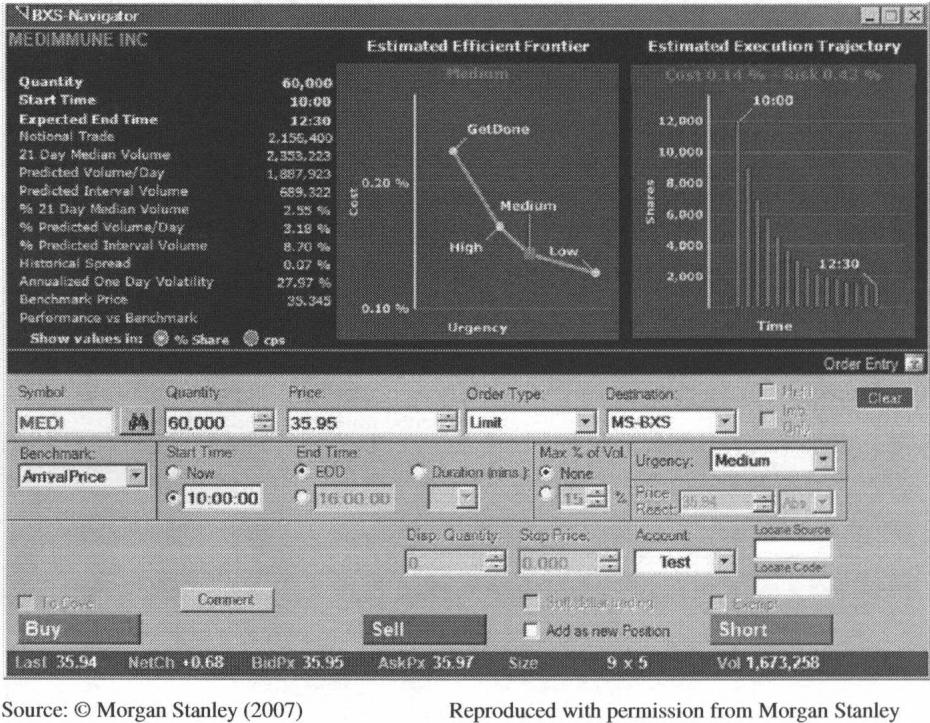  
Figure 11-3 An example algorithm entry screen

The rapid growth in the popularity of algorithmic trading, and the large number of algorithms involved, poses issues for OMS/EMS vendors. Keeping up with the rapid flow of new algorithms is difficult, particularly for those providing algorithms from a wide range of brokers. The screens for newer algorithms may well be queued up for testing and release by the various vendors. To gain access, clients will often need to upgrade their software. So, there can sometimes be a substantial delay before clients can get access to the latest algorithms.

One potential solution for this has been proposed by the Financial Information Exchange (FIX) group. Their algorithmic trading definition language (FIXatdl) is intended to ease the integration of algorithmic strategies by providing a consistent means of defining them. This XML-based 2 schema provides a standard framework for algorithm parameters, defining:

● Core data, such as their type and FIX tag ● Validation rules ● User interface requircments

For example, the following XML snippet shows the configuration details for a "RiskLevel" parameter, based on an cxample from FIX (2007):

<parameter name $=$ "RiskLevel" xsi:type $=$ "Int_t" fixTag="7078" use="optional" minvalue $=$ "1" maxValue ${ } = { }$ "10" mutableOnCxlRp1 $\backsimeq$ "true" controlType="slider"/>

The core data represents the key information about each specific parameter, starting with its name. In this example, Ri skLevel is mapped to the FIX tag number 7078. Its type is defined as an integer, although decimals, characters/strings and even enumerations arc also supported. The use tag defines this as an optional parameter, whilst the mut ableoncxlRp1 tag refers to whether it may be modified in a subsequent update (in this case it can).

Validation rules may just be basic constraints, such as the minimum and maximum values shown in the Ri skLeve1 example. Alternatively, they may be more complex, and based on combinations of parameters. The paramcter type will also cnsure a basic level of validation, sueh as bctween strings or numbers.

The user interfacc rcquirements determine how the parameter should appear in an order entry sercen. In this casc, the Ri skLeve1 parameter will be shown as a slider, allowing the user to pick the most appropriatc value between I and 10. Other supported widgets are check boxes, radio buttons, drop down list boxes (or combo boxes) and simple input fields for text or dates/times. A separate element, the strategyPanel, allows further control over how various parameters are grouped and displayed. For example, the following XML allows the screen shown in Figure 1i-4 to be generated, by grouping together parameters within strategyPanels.

<stategyPanel orientation "horizontal"> <strategyPanel title $=$ "Time Parameters" collapsible $=$ "false" orientation ${ } = { }$ "vertical"> <parameter name $\Longleftarrow$ "start Time" xsi:type $=$ "UTCTimestamp_t " fixTag $^ { \circ } =$ "168"use $: =$ "optional" controlType "Clock"/> <parameter name $=$ "End Time" xsi:type $=$ "UTCTimeStamp_t " fixTag="126"use $: =$ "optional" controlType $=$ "Clock"/> </strategyPanel> <strategyPanel title $=$ "Advanced" collapsible $=$ "false" orientation $=$ "vertical"> <parameter name $=$ "Participation Rate" xsi:type $=$ "Percentage_t" fixTag $\backsimeq$ "7022"use $\scriptstyle \mathtt { a = }$ "optional" controlType $_ { 1 } = "$ singlespinner"/> <parameter name $=$ "Aggression" xsi:type=" Intt" fixTag="7023"use $=$ "optional" controlType="ComboBox"> <enumPair uiRer $ \cdot =$ "High" wireValue $=$ "3"/> <enumPair uiRep $\scriptstyle 1 =$ "Medium" wireValue="2"/> <enumPair uiRep "Low" wireValue $=$ "1"/> </parameter> </strategyPanel>   
</strategyPanel>

For more information on the FIXatd specification, please sec the overview provided by FIX (2008) or their website www.lixprotocol.org.

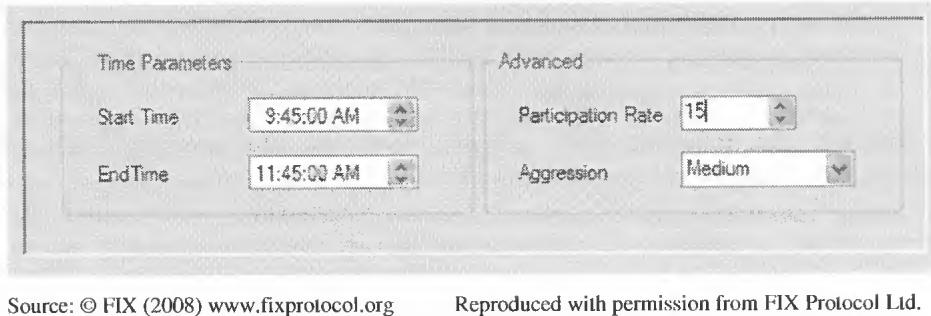  
Figure 11-4 A simple FIXatdl algorithmic parameter screen

# Order routing

Once we have successfully entered our order we then need to route it to the required destination. In Figure 1l-1 this is simply represented by some arrows going through a gateway process and then magically reaching the appropriate exccution venue. In practice, each venuc can have its own proprietary protocol for handling orders. Therefore, order routing systems have to convert (or encode) the details of cach order into the appropriate format and then transmit them on to the required destination.

# Order encoding

Before order routing was handled electronically, order encoding just mcant using the right terms with your trader. Similarly, for trading pits, it meant knowing the correct hand signals to communicate the right price, side and size.

As venues have shifted to electronic trading, they have each implemented their own protocols for how orders should be processed. These are often accessed by custom application programming interfaces (APIs). Fortunately, a common messaging scheme, the Financial Information Exchange (FIX) Protocol, has become a de-facto standard for many markets. FIX is intended for the exchange of any information related to securities transactions. Hence, it supports the transmission of orders, market data, security inlormation and settlement details. It exists in two main formats, a strictly machine-readable protocol and one based around an XML schema (FIXML).

The original FlX protocol is based on "Tag=Value" pairings, so an order to buy 1000 shares will contain the string $" 5 4 = 1 \setminus 3 8 = 1 0 0 0 "$ . For the first pair, 54 is the tag number that reprcsents the side whilst the value 1 maps to a buy. Whereas tag 38 maps to the order size.

Each message begins with a standard format; this reflects the version of FIX, the length of the message and the message type (tag 35). It ends with a checksum that may be used for validation. Thus a message for a new order to buy 5000 shares of IBM looks like this, based on an example from FIX (2008a):

$\begin{array} { r } { 8 = \mathrm { F T X } , ~ 4 , 2 ^ { { \scriptstyle \wedge } } 9 = 2 5 1 ^ { { \scriptstyle \wedge } } 3 5 = \mathrm { D } ^ { { \scriptstyle \wedge } } 4 9 = \mathrm { A F U N D M G R } ^ { { \scriptstyle \wedge } } 5 6 = \mathrm { A B R O K E R } ^ { { \scriptstyle \wedge } } 3 4 = 2 ^ { { \scriptstyle \wedge } } 5 2 = 2 0 0 3 0 6 1 5 - \mathrm { A B R } ^ { { \scriptstyle \wedge } } 3 5 = 2 ^ { { \scriptstyle \wedge } } 4 . 2 4 = 6 4 , } \end{array}$ $0 1 : 1 4 : 4 9 \AA ^ { \sim } 1 1 = 1 2 3 4 5 \AA ^ { \sim } 1 = 1 1 1 1 1 1 1 \cdot 6 3 = 0 \cdot 6 4 = 2 0 0 3 0 6 2 1 \cdot 2 1 = 3 \cdot 1 1 0 = 1 0 0 0 \cdot 1 1 . 1 = 3 0 0 0 \cdot 1 1 . 1 = 3 0 0 0 \cdot 1 0 0 0 0 \cdot 1 1 . 1 = 3 0 0 0 0 \cdot 1 0 . 1 0 = 3 0 0 0 0 \cdot 1 1 . 1 = 3 0 0 0 0 0 \cdot 1 0 . 1 0 = 3 0 0 0 0 0 \cdot 1 1 . 1 = 3 0 0 0 0$ 50000 $ \tiny \begin{array} { c }   \wedge \thinspace 5 5 = { \mathrm { T B M } } ^ { \wedge } { \bar { 4 } } \thinspace 8 = 4 \thinspace 5 9 \thinspace 2 0 \thinspace 0 1 \thinspace 0 1 \cdot { \hat { \thinspace } } 2 2 = 1 \cdot 5 \thinspace 4 = 1 \cdot 6 \thinspace 0 = 2 0 \thinspace 0 3 \thinspace 3 0 \thinspace 6 1 \thinspace 5 \thinspace 0 1 : 1 \thinspace 4 : 4 \thinspace 9 \cdot 3 8 = 5 0 \thinspace 0 \thinspace 0 \cdot 4 \thinspace 6 \thinspace 0 1 \cdot 6 \thinspace 0 1 \cdot 6 \thinspace 0 1 \cdot 6 \cdot 2 0 = 4 \thinspace 0 \cdot 1 1 \cdot 6 \cdot 3 8 = 5 0 \thinspace 0 \cdot 4 \thinspace 1 1 \cdot 6 \cdot 3 8 = 5 0 \thinspace 0 \cdot 4 \thinspace 1 1 \cdot 6 \cdot 3 8 = 5 0 \thinspace 0 \cdot 4 \thinspace 1 1 \cdot 6 \cdot 3 8 = 5 0 \thinspace 0 \cdot 4 \thinspace 1 1 \cdot 6 \cdot 3 8 = 5 0 \thinspace 0 \cdot 4 \thinspace 1 1 \cdot 6 \cdot 3 8 = 5 0 \thinspace 0 \cdot 4 \thinspace 1 1 \cdot 6 \cdot 3 8 = 5 1 \thinspace 0 \cdot 4 \thinspace 1 1 \cdot 6 \cdot 3 8 = 5 1 \thinspace 0 \cdot 4 \thinspace 1 1 \cdot 6 \cdot 3 8 = 5 1 \thinspace 0 \cdot 4 \thinspace 1 1 \cdot 6 \cdot 3 8 = 5 1 \thinspace 0 \cdot 4 \thinspace 1 1 \cdot 6 \cdot 3 8 = 5 1 \thinspace 0 \cdot 4 \thinspace 1 1 \cdot 6 \cdot 3 8 = 5 1 \thinspace 0 \cdot 4 \thinspace 1 1 \cdot 6 \cdot 3 8 = 5 1 \thinspace 0 \cdot 4 \thinspace 1 1 \cdot 6 \cdot 3 8 = 5 1 \thinspace 0 \cdot 4 \thinspace 1 1 \cdot 6 \cdot 3 8 = 5 1 \thinspace 0 \cdot 4 \thinspace 1 1 \cdot 6 \cdot 3 8 = 5 1 \thinspace 0 \cdot 4 \thinspace 1 1 \cdot 6 \cdot 3 8 = 5 1 \thinspace 0 \cdot 4 \thinspace 1 1 \cdot 6 \cdot 3 8 = 5 1 \thinspace 0 \cdot 4 \thinspace 1 1 \cdot 6 \cdot 3 8 = 5 1 \thinspace 0 \cdot 4 \thinspace 1 1 \cdot 6 \cdot 3 8 = 5 1 \thinspace 0 \cdot 4 \thinspace 1 1 \cdot 6 \cdot 3 8 = 5 1 \thinspace 0 \cdot 4 \times 1 1 \times 1 1 \thinspace 1 \cdot 6 \cdot 3 8 = 5 1 \thinspace 4 \times 1 \times 1 1 \times 1 1 \times 1 1 \times 1 1 \times 1 1 \times 1 6 \thinspace 1 \times 1 1 \times 1 6 \times 1 1 \times 1  \end{array}$ =1^44= $1 5 . 7 5 \wedge 1 5 = \mathrm { U S D } \wedge 5 9 = 0 \wedge 1 0 = 1 2 7$

(Note the  character is just a representation of the separator betwcen each pair.)

In this example, the message starts by stating the FIX version is 4.2, the message length is 251 bytes and the value of D refers to the fact that this message is for a new single order.

Clearly, this approach is fine for sending messages between computer systems, but it is not very amenable for humans to read, for instance, during testing or debugging.

FIXML offers a more readable syntax, and since it is based on XML it allows developers to crcate custom filters or handlcrs. So for our example new order a FIXML representation looks something like this:

<FIXML><0rder C1OrdID $=$ "12345"Side "1"TransactTn $\iota =$ "2001-09-11T09:30:47-05:00"OrdTyp $\scriptstyle \cdots$ "2"Px="93.25"Acct $=$ "26522154"><Hdr Snt="2001-09-11T09:30:47-05:00"PosDup $^ { 1 = }$ "N"PosRsnd ${ } = { }$ "N"SeqNun $1 =$ "521"><Sndr ID $\backsimeq$ "AFUNDMGR"/><Tgt ID $\mathop { : = }$ "ABROKER"/></Hdr><Instrmt Sym "IBM"ID $\backsimeq$ "459200101"IDSrc="1"/><OrdQty Qty $^ { \prime } =$ "5000"/></0rder>  
</FIXML>

Having replaced the numeric ficlds with more descriptive tags it is now easier to read the details. The groupings mean that the various parameters are placed with their associated tag, so we can clearly differentiate between the header details and those for the instrument. 'Though, some translation is still required. For example, the value of 1 for Side means it is a buy order, whilst the value of 2 for OrdTyp means it is a limit order with a limit $\left( \mathbb { P } \mathbb { x } \right)$ of 93.25. The instrument details confirm this is for IBM, both from the symbol and from the ID, which is hased on a CUSIP. We can also sce that the order is heing sent from AFUNDMGR to ABROKER, using account 26522154. Finally, the message itself also has a uniquc clicnt identifier (c1ordID), namely 12345.

The main disadvantage with FIXML is the increased size of messages, which can cause capacity and performancc issues for the required infrastructure. With earlier variants, the messages could be 3-5 times the size of an equivalent message using the FIX tag=value syntax. In version 4.4, the FIXML schema was updated to incorporate the latest XML enhancements. By streamlining the syntax and using more abbreviations the new FIXML messages are around $70 \%$ larger than the tag=value equivalents.

# Handling different market types

FIX was originally crcated to handle the flow of orders. Though, it now also caters for quotedriven markets, supporting both the request for quote (RFQ) and request for stream (RFS) mechanisms that are commonly used in the fixed income and FX markets.

An RFQ based transaction starts with the client sending a Quote Request message to a specific broker. This may optionally specify both the side and size (OrderQty), but the default is to request a standard market (two-way) quote. The broker must then respond with a corresponding Quote message in which they detail the price/s and size/s they are prepared to trade at. Alternatively, they may send a Quote Request Re ject message. The client can then reply to the quote with a Quote Response, in which they can set the QuoteRespType field to "hit or lift'" or to negotiate. Finally, if the RFQ results in a transaction the details are sent to the client in an Execut ion Report.

Streaming prices for RFS are handled via FIX's Market Data messages. Again thesc arc triggered by a Market Data Request. An initial Market Data Snapshot is providcd; quotcs are then streamed through via subsequenl Incremental Refresh mcssagcs. To trade in response to any given quote simply requires sending a ncw order based on the quoted price and sizc.

FIX also supports indications of interest (IOIs). To irade with any given Indicat ion o f Interest message means replying with an appropriate Quote Response, similar lo the RFQ mechanism.

# Asset specific details

Initially, FIX initially catercd solely for equities, but its range of supported asset classes has now expanded to includc fixed income, foreign exchangc, money market and derivativcs. The current version of FIX (5.0) supports:

● Global cquities   
● US and European governmcnt and corporale bonds   
• US agency and municipal securitics   
• Repos   
• US and European commcrcial paper FX spol, forwards and swaps Listed futures and options

A wide variety of different instrument classification types arc also catered lor. Hence, fields are provided for data such as the maturity date or strike price. More complex, multi-leg assets, such as swaps, may be delined using the Security Definit ion messagc. These may then be transmited between parties, cach leg may be handled individually or as part of the wholc. A similar approach may be used for futures, or options, sprcad trading stralegies.

# Order conditions

Ordcr conditions can ofer significant additional functionality (and control of) their associated orders, as we saw in Chapter 4. The most important FIX lag for order conditions is Time InForce; the permiitcd valucs arc shown in Table 11-2.

Table 11-2 Permitted values for the FIX Time InForce tag   

<table><tr><td>Value</td><td>Order type</td></tr><tr><td>0</td><td>Day (or session)</td></tr><tr><td>1</td><td>Good Till Cancel (GTC)</td></tr><tr><td>2</td><td>At the Opening (OPG)</td></tr><tr><td>3</td><td>Immediate Or Cancel (tOC)</td></tr><tr><td>4</td><td>Fill Or KilI (FOK)</td></tr><tr><td>5</td><td>Good Till Crossing (GTX)</td></tr><tr><td>6</td><td>Good Till Date (GTD)</td></tr><tr><td>7</td><td>At the Close</td></tr><tr><td>8</td><td>Good Through Crossing</td></tr><tr><td>9</td><td>At Crossing</td></tr></table>

The Time InForce tag may be uscd to control order lifetimes with valucs such as Day or Good Till Cancel. For ordcrs that are Good Till Datc thc deadline is spccilfied with thc Expi ryDate lag. Alternativcly, it may also be used to determinc whether the order permits partial fills; hence, there are values for immcdiate-or-cancel and fill-or-kill. Il is also used lo specify session requirements, such as at the opening or close.

# Order types

FIX supports a wide rangc of order ypes, most of which are specified using its OrdType tag, as shown in Tablc 11-3:

Table 11-3 Example values for the FIX ordrype tag   

<table><tr><td>Value</td><td>Order type</td></tr><tr><td>1</td><td>Market</td></tr><tr><td>2</td><td>Limit</td></tr><tr><td>3</td><td>Stop / Stop Loss</td></tr><tr><td>4</td><td>Stop Limit</td></tr><tr><td>J</td><td>Market If Touched</td></tr><tr><td>P</td><td>Pegged</td></tr></table>

In addition, each of the order types uses its own custom tags to define additional paramcters, such as a trigger price or offset value. Some examples are shown in Table 11-4.

Table 11-4 Associated FIX tags for different order types   

<table><tr><td rowspan=1 colspan=1>Order type</td><td rowspan=1 colspan=1>Specific FIX tags</td></tr><tr><td rowspan=1 colspan=1>Stop/StopLimit</td><td rowspan=1 colspan=1>StopPx</td></tr><tr><td rowspan=1 colspan=1>Discrelionary</td><td rowspan=1 colspan=1>DiscretionInstDiscretionOffsetValue</td></tr><tr><td rowspan=1 colspan=1>Peggcd</td><td rowspan=1 colspan=1>PegPriceTypePegOffset Value</td></tr><tr><td rowspan=1 colspan=1>Iceberg</td><td rowspan=1 colspan=1>DisplayQty</td></tr></table>

Stop and stop limit orders used to be specified in FIX by setting both the order type and the StopPx price field. In FIX 5.0, this approach has bcen replaced with a more sophisticated mcchanism, based around the Triggering Inst ructions block. This allows for all sorts of triggered behaviours: changing the status, price and even size or type of orders. The Tri ggerAct i on dictates whether the trigger activates, modifies or cancels the affcctcd order. The Tri ggerType determines what actually acts as the trigger, whether it is a price movemcnt, a ncw trading scssion/auction or cven partial execution. For pricedriven triggers, the Tri ggerPri ce is similar to the old stopPx tag, whilst the TriggerP ri ceType determines which price is tracked, e.g. the last price or the best bid/offer. A TriggerPriceTypescope field cven supports the ability to base this on local market, national or global prices. The TriggerPri ceDirect ion field specifics whether the trigger is hit on only rising or faling prices. Triggers may even be based on the prices of other assets, using the Triggersymbol or Tri ggersecurityID ficlds. This should permit triggers on futures or options to be based on the price of their underlying asset. In tcrms of what actually happens when the trigger is activated, the fields TriggerOrderType, TriggerNewPrice and TriggerNewQty allow control over the ordcr's fundamental propcrties.

Discrctionary orders are assigned by setting the Di scret ionInst tag, relating this to the displayed price. The Di scret ionOf f set Value defines the size of the price offset.

Pegged orders may be spccified in FIX by setting the order type and the PegP ri ceType and PegoffsetValue tags. The PegPriceType supports pegging versus a wide range of prices, including the last trade, mid, open or even Vw AP.

Iceberg, or reserve, orders are created by seting the Di splayQty tag. FIX also supports mixing and matehing of these various types, so pegged orders may also incorporate discretionary pricing or iccherg behaviour etc., provided this is supported by the destination.

FIX can handle contingent order lypes as well, such as one-cancels-other. For this, the orders are created as a New Order – Li st and so are linked by their Li st ID lag. The Cont ingencyType tag then determines whether the relationship is one-cancels-other (1) or one-triggers-other (2).

# Trading algorithms

FIX handles trading algorithms in a variety of ways. A nice introduction is provided by Roberto Rivero (2005) in FIXGlobal magazine. Clearly, wc need to specify both the trading algorithm and its parameters.

There are several ways of setting the algorithm name in FIX messages. Exactly which method is used will depend on the broker/vcndor's specific implementation. Table 11-5 shows some of the eommoner types, as outlined in a presentation by Scott Atwell (2004) for the FIX Protocol Limited (FPL) Algorithmic Trading and DMA working group.

Table 11-5 Different ways of specifying trading algorithms in FIX   

<table><tr><td rowspan=1 colspan=1>Type</td><td rowspan=1 colspan=1>FIX fields used</td></tr><tr><td rowspan=1 colspan=1>Text</td><td rowspan=1 colspan=1>TargetSubId(57) or Text (58)</td></tr><tr><td rowspan=1 colspan=1>ExecInst /OrdType</td><td rowspan=1 colspan=1>ExecInst (18)or OrdType(40)</td></tr><tr><td rowspan=1 colspan=1>TargetStrategy</td><td rowspan=1 colspan=1>TargetStrategy (847)</td></tr><tr><td rowspan=1 colspan=1>User Defined</td><td rowspan=1 colspan=1>FIX custom tags in 5000-9999 rangc</td></tr></table>

Probably the commonest way is just to pass the algorithm's name ("VwAP", or "ImpShort", "POV") as a text field in one of the instruction tags, or in the uscr-defined custom fields (in the 50 00–9999 range 3).

For parameters, some existing FIX tags may be uscd. For instance, the star and end limes may be defined by using the respective Ef fect iveTime and Expi reTime fields. Though, again it all depends on how the broker/vendor has chosen to implement things. Algorithm specific paramcters will often be set using eustom user-defined tags.

FIX 5.0 docs provide a more generie means of handling algorithm parameters. There is a repeating group (Nost rategyParameters), which can contain any number of paramcters. For each one a uniquc name is dcfincd (st rategyParameterName) together with its lype (strategyParameterType) and value (st rategyParameterValue). For example, if an implementalion shortfall algorithm needs to be passed a benchmark price and a risk aversion we could set these as lollows:

NoStrategyParameters (957) $= 2$   
StrategyParameterName (958) $\simeq$ BenchmarkPrice   
StrategyParameterType (959) $\qquad = \ 8$ (Price)   
StrategyParameterValue (960) $= ~ 7 , 4$   
StrategyParameterName(958) $=$ RiskAversion   
StrategyParameterType (959) $\qquad = \ 1$ (Int)   
StrategyParametervalue(960) $= ~ 5$

As trading algorithms, OMS and EMSs evolve, the level of standardisation should hopefully improve, making it easier for the buy-side to switch between brokers without having to significantly change the format of their FIX messages.

# Handling lists/portfolios

The FIX protocol also supports trading lists or portfolios. The New Or der – Li st message allows a wave of orders to be sent, hased on a unique List ID. A clordLink ID identifier may also be used to link orders. The constituent orders may still be updated or cancelled. However, FIX also provides an Order Mass Act ion Request that can be used to act on all the orders that match specific criteria. Similarly, there are equivalent requests to cancel orders en-mass or to query their status.

FIX even provides messages to handle ihe actual mechanics of portfolio trading. In the U.K. and U.S., this is often carried out via a blind auction, in which case the BidRequest message can be used to provide a summary model of the portfolio. This describes it in terms of its sectors, countries, indices and liquidity. The participating brokers may then reply with appropriate bids for the trade. The successful bidder will then be sent a New Order – Li st and the details of the actual portfolio. For some countries, such as Japan, the portlolio details may be disclosed for the auction; in which case the portfolio details are provided up-front, although the side may be left undefined. Principal trades are catercd for as well, with a Li st Stri ke Price message, which may be used to delail the agreed strike prices for each constituent. Given that portfolio trades often span many different accounts, FIX messages may also be used to communicate any account allocation details, ready for settlement.

# Order transmission

Having considered how to encode the orders, we now need to send them to their required destination. Order transmission brings us to the technical nitty-gritty of actually doing this. For the FIX protocol a lot of this logic is contained within specific FIX engine or gateway servers. These are readily available from a wide range of vendors. They understand the FIX message protocol and provide the necessary logic for establishing connections to other FIX engines/gateways.

Originally, these gaieways were just used by clients to establish a direct connection to their brokers, as shown by pathway 1 in Figure 11-5. The broker would in turn have connections to the different execution venues, often these would be implemented using native APIs. Over time, though, an increasing numher of execution venues have started to set up their own FIX gateways. Hence, clients now have the possibility of connecting directly to specific venues in addition to routing via their broker, as shown by the various pathways labelled 2 in Figure 11-5.

To ensure the data quality of messages they incorporate both check sums and message lengths, as we saw in the previous section. Thus, the FIX engine can confirm that the received message matches the one that was actually transmitted.

In terms of the actual transmission, clearly we want the connection to the broker/execution venue to be as resilient as possible. Consequently, when the FIX engine makes a connection it establishes a new session. All messages sent during this session are identified by a unique sequence number (MsgSeqNum). Messages should be delivered in order so if an engine receives a message whose identificr is out of sequence it can issue a resend request. Likewise, if an engine determines that there may have been a problem with transmiting the message it may opt to retransmit it, setting the PossDupF lag to $" \Upsilon "$ . It is the responsibility of the receiving engine to then process the message, or discard it if it has already been successfully processed. During periods when no messages are being transmited, heartbeat messages may also be sent, to confirm that the connection is still okay.

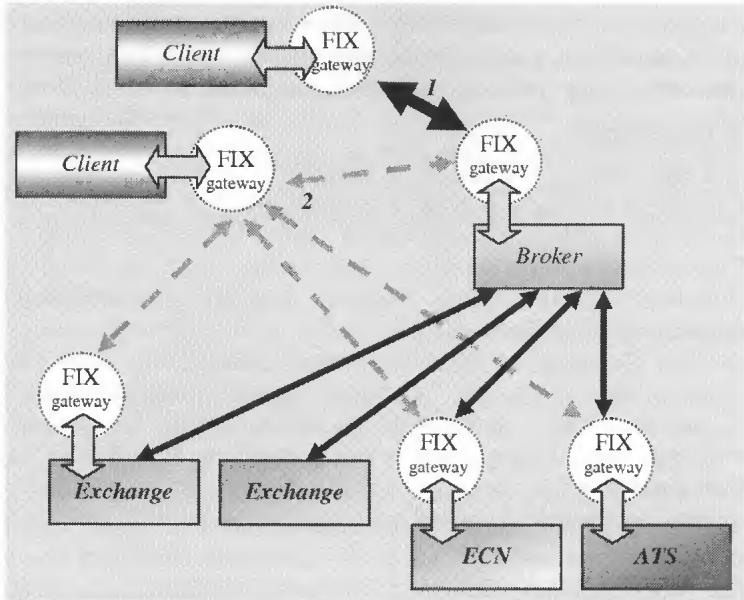  
Figure 11-5 Potential transmission routes between clients, brokers and venues

# 11.3 Algorithmic trading

Algorithmic trading is heavily dependent on both order management and market data services, as we saw back in Figure I 1-1. A slightly more detailed infrastructure diagram for a typical algorithmic trading platform is shown in Figure 1 1-6.

Trading platforms are generally based on client-server technology, so an application on the trader's workstaiion interacts with a series of back-end servers. The price data for the OMS/EMS client is supplied by market data servers, whilst the actual orders are handled by dedicated order management servers. Algorithmic trading servers make use of both these services as well. They may also use dedicated analytics servers to process historical data or for back-testing. Some proprietary or risk-based algorithms may even use profit and loss (P&L) or risk servers to track their performance and/or exposure.

Most brokers' algorithmic trading platforms have been developed in-house over the last five to ten years. Often these have been built from the ground up. Millions of dollars and years of effort have been invested as each platform seeks to offer "best of breed'" algorithms. This is combined with ensuring there is a resilient and scalable trading environment.

Third-party vendors also offer dedicated algorihmic trading platforms, often based on complex event processing (CEP) systems. These provide the basic constructs required for handling market data and processing orders and may even supply trading algorithms that can be extended or used as templates for brand new strategies. So implementing trading algorithms is now a much more viable proposition for the buy-side.

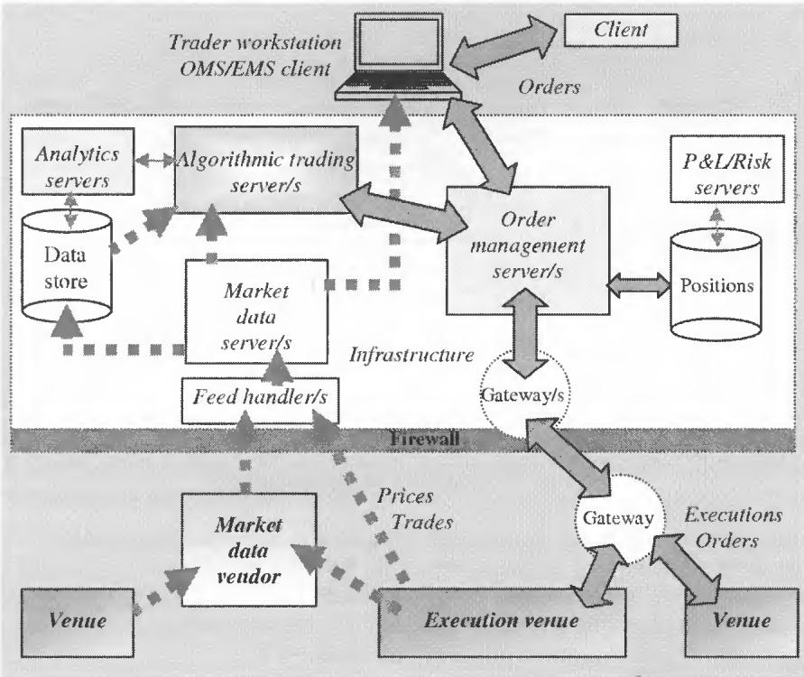  
Figure 11-6 A simple infrastructure for algorithmic trading

That said, building an algorithmic trading platform is not a decision to be taken lighily. It takes teams of developers, quanls and experienced traders to create effective algorithms.

# Infrastructure requirements for algorithmic trading

As the usage of electronic and algorithmic trading continues to increase, the associated infrastructure will play just as key a role as the quality of the actual trading algorithms.

Building a successful platform for algorithmic trading is not just about having the best algorithms. If the infrastructure is not resilient, or sufficiently sealable then its use will be limited. Hence, it is important not to underestimate how much work is involved to create a successful trading platform.

# Speed/Latency

Speed has always been important in trading; however, the timescales involved have drastically reduced. People now talk in terms of microseconds $( 1 0 ^ { - 6 } \mathrm { s } )$ . To put this in perspective, a blink takes between 100-150 milliseconds $( 1 0 ^ { - 3 } \mathrm { s } )$ .

Latency is an often-used term. It represents the inherent delays in transmitting and processing data (for orders or market data prices). Figure 1 1-7 shows another version of the infrastructure diagram, highlighting the various stages that orders and prices go through.

So to get to the execution venue an order is sent from the client via the various gateways, arriving at the broker, as shown by path A. The algorithmic trading engine then sends out orders (again via gateways) to the execution venue, shown by paths B and C. Finally, the execution venue must receive and process the order (path D).

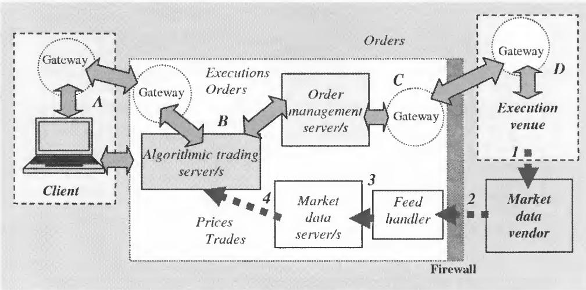  
Figure 11-7 Latency in infrastructure

Likewise prices from the execution venue are issued to market data vendors who then distribute them via their own infrastructure. Feed handlers at the broker (or client) receive these and then make them available to any processes that need them, again via their own infrastrueture of market data servers. The overal trip times represent the total latency for sending an order or receiving a market data price, as shown by:

$$
\begin{array} { r l } & { \mathrm { T o t a l ~ l a t e n c y ~ ( o r d e r ) } = \mathrm { A } + \mathrm { B } + \mathrm { C } + \mathrm { D } } \\ & { \mathrm { T o t a l ~ l a t e n e y ~ ( p r i c e ) } = 1 + 2 + 3 + 4 } \end{array}
$$

So there is no point having a super-fast connection to the external data sourees, or execution venues, if internal processes are causing a significant delay. Conversely, there is no benefit in having a fast infrastrueture with slow connections to external venues or market data.

Ideally, there should be the minimum number of steps so that data reaches its intended destination as fast as possible. Data messages should be as small as they can. Though, data can only be compressed so mueh. The time they take to be transmitted also depends on the physical distance they must travel. Table 11-6 shows the results of a round-trip test by Exponential-e (2009) for their routing service, to give an idea of the time it takes to communicate between different locations.

Thus, co-location has become inereasingly popular. This allows market participants to host their computerised trading systems in the same machine rooms as the exeeution venue, thus minimising any transmission-related delays. Otherwise, U.S. based brokers will have considerable latencies when dealing with Asia or Europe, similarly European and Asian firms will be disadvantaged when handling orders for the U.S.

It is important to note that latencies will constantly vary, depending on the overall load. At times when the markets are busiest, or at their most volatile, the latencies will inevitably increase due to the higher workload. Therefore, is important to track latency at peak loads rather than focussing on a minimum fligure, which will have been achieved given optimal conditions. In terms of infrastrueture, things like eareful load balaneing can help ensure that processes do not become swamped by their workload, introdueing additional delays.

<table><tr><td rowspan=1 colspan=1>From:</td><td rowspan=1 colspan=1>To:</td><td rowspan=1 colspan=1>Latency/ms</td></tr><tr><td rowspan=3 colspan=1>London</td><td rowspan=1 colspan=1>Frankfurt</td><td rowspan=1 colspan=1>10</td></tr><tr><td rowspan=1 colspan=1>New York</td><td rowspan=1 colspan=1>68</td></tr><tr><td rowspan=1 colspan=1>Chicago</td><td rowspan=1 colspan=1>85</td></tr><tr><td rowspan=4 colspan=1>New York</td><td rowspan=1 colspan=1>Toronto</td><td rowspan=1 colspan=1>25</td></tr><tr><td rowspan=1 colspan=1>Zurich</td><td rowspan=1 colspan=1>90</td></tr><tr><td rowspan=1 colspan=1>Tokyo</td><td rowspan=1 colspan=1>246</td></tr><tr><td rowspan=1 colspan=1>Sydney</td><td rowspan=1 colspan=1>260</td></tr></table>

Source: Exponcntial-e (2009)

# Table 11-6 A snapshot latency roundtrip comparison for some key locations

# Capacity

Over the last few years, eleetronie and algorithmic trading have led to smaller trade sizes and more frequent order updates. Consequently, the number of market data messages has massively inereased, as we can see in Figure 11-8.

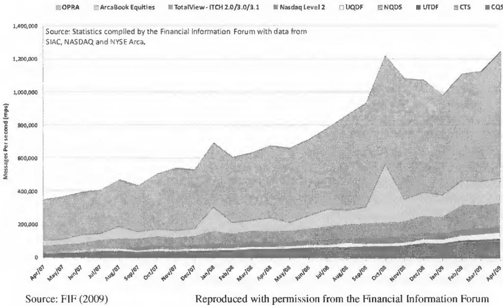  
Figure 11-8 OPRA and consolidated equities 5 second peak rates

This shows the historical 5-second peak rates from the main market data feeds for U.S. equities and listed options. The inerease is most notable for U.S. options. In fact messages from OPRA (Options Price Reporting Authority) now exeeed 1.2 million messages per second, having nearly tripled in just two years.

In comparison, the equity feeds have lower update rates; indeed, all but the depth of book feeds (for NYSE AreaBook, NASDAQ TotalView ITCH and NASDAQ Level 2) are at the very bottom of Figure 11-8, with peak update rates below 200,000 messages per second.

These include the Consolidated Quotation System (CQS) and Consolidated Tape System (CTS) which carry the quote and trade updates for the NYSE (Tape A), Regional (Tape B) and the UTP Quotation Data Feed (UQDF) and UTP Trade Data Feed (UTDF) for NASDAQ (Tape C) stocks. They may be much lower, but the trend is the same, these have all seen considerable increases in update rates over the last few years.

Clearly, the numbers in Figure 11-8 are huge; however, they cover al the traded assets whose prices/trades are broadcast on each of the respective feeds. So the number of market data updales per second for a specific asset will obviously be a lot lower. No one algorithm will be exposed to hundreds of thousands of updates per second. Still, at any one time an algorithmic trading platform may be trading hundreds or thousands of different assets. Hence, these massive update rates become relevant, and the infrastructure wil need to be able to cope with them.

# Other factors

Speed and capacity are obviously important. However, reliability is also vital. A fast car is great, unless it breaks down cvery other day. So the infrastructure also needs to cope with every-day usage, as well as handling the loads at peak times. In modern markets, this may mean the infrastructure being available $2 4 \mathbf { x } 7$ (or as close as possible). Therefore, all of the server-side processes we saw back in Figure 1 1-6 also need to be:

● Resilient Manageable Sealable

Hardware (or software) issues should not result in catastrophic failure. Therefore, if a machine or process fails there should be another machine/process ready to immediately take over in its place. This might be achieved by running machines/processes in fault-tolerant pairs, or using "server farms' to handle processes. Failures should also not be allowed to propagate, so a problem with analytics should not disable the algorithmic trading server.

Problems will always occur, so the infrastructure needs to be manageable. Failures should be simple to spot and correct. Monitoring should highlight the servers/processes that are under heavier load, since these may be more likely to fail in the future. Load balancing may also be adopted to try to ensure that the work is distributed evenly amongst the various processes/machines.

Scalability is another key issue. Obviously, for the long-term il is desirable to be able to easily extend capacity. There can also be short-term peaks in demand, so a flexible infrastructure where new servers can easily be added can be extremely uscful.

# Designing an environment for algorithmic trading

Having considered some of the infrastructure surrounding eleetronic trading lel's now take a closer look at how aetual lrading platforms might be designed and implemented. In Chapter 5, we saw a wide range of different trading algorithms. Still, they all share quite a lot of common functionality. Fundamentally, it all starts with an order, which details the trading requirements as well as the specifics for the algorithm. An instance of the algorithm will then be created with all these details. The trading algorithm's order placement decisions are fundamentally based on market data. Thus, it needs access to see the available prices and probably the liquidity. It also needs to be able to create, send and update orders to specific destinations, which will be one (or several) execution venues. Figure I1-9 shows a simple outline of these relationships.

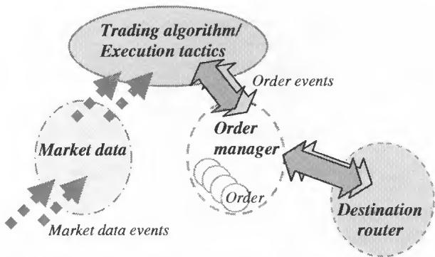  
Figure 11-9 A simplified algorithmic trading environment

In terms of object-oriented programming (OOP), the above ellipses may be viewed as objects. Each of these is an instance of a specific class, which we will go through in the following sub-sections. They al "encapsulate" the required logic and data they nced to work. In turn, they can be made up of other objects. For example, the order manager maintains a list of child orders which it is able to send on to the required deslination.

Essentially, this also represents a minimal design for an algorithmic trading platform. In practice, it is slightly more complex than this, but by designing the environment based around suitable classes a lot of the complexily may be hidden.

# Trading algorithm

The trading algorithm is effectively created from a parent order, which encapsulates the basic rcquirements such as the asset details, target size and direction (buy/sell) together with any price limit or specific conditions. The parent order also needs to maintain client details to ensure they can be provided with order status updates.

Bascd on the specilicd trading algorithm type and any associated parameters, the appropriate algorithm may then be launched. The trading algorithm conlains all the various information nceded for its execution. So il maintains market dala subscriptions to get access to the priccs etc. The algorithm also manages a list of all the child orders it has spawned, so if it is cancelled it can easily cycle through and cancel any extant orders. It also retains details such as the current position and maybe even its performance relative to any benchmarks. This information may then be used to determine whether it is ahead or behind of its targets, and so decidc how aggressively future orders should be priced/sized. Obviously, there are also the actual trading rules; we will consider these in more detail in the next section.

# Market data

Market data is generally provided for a specific assel at a set venue, although some vendors also provide consolidaled fceds. Therefore, a subscription to the market data for an asset provides us with streaming updates for each time the price or size changes, or for when trade reports are issued.

Throughout this book, we have used order books to visualise the available liquidity, as shown in Figure 11-10. Because of the additional informalion value held within the order book, many exchanges and market data venues have variable charges for the different depths. Level 1 usually corresponds to the best bid and offer quotes, whilst Level 2 provides a fuller view of the order book, although sometimes this aggregates orders. Sometimes thcre is even a Level 3, which gives a full view of the order book, except for hidden ordcrs, of course. This data might be sourced from a single subscription, but often sevcral differcnt market data subscriptions will be required.

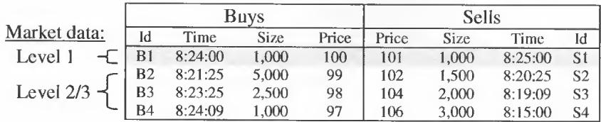  
Figure 11-10 An example order book

A dedicated order book class may be used io merge all this data together to provide a coherent image. Obviously, this translation needs to be fast so as not to introducc any significant additional latency. The order book class will also need to deline its own custom events to correspond to any changes in the ordcr book. In turn, classes for our trading rules may then subscribe to these events so as to be notified when the order book changes. This should allow our trading algorithms or execution tactics to react to any changes in liquidity.

Market data is also important for tracking reported trades. Algorithms such as POV nccd to track the market traded volume. Note that there can sometimes be substantial delays in trade reporting data; in fact, some might even be for previous days. So when reacting to trade ticks it is important to also check that the trade time and any conditions flags are appropriate.

Examining the reporicd trades is also important for tracking hidden liquidity, as we saw in Chapter 8. A custom order book class could be created which incorporates estimates for hidden liquidity. Though, again it is important to ensure that any calculations are performed as fast as possible, otherwise new data updates may render it meaningless.

# Orders

Each child order that is spawned by the trading algorithm needs to contain its specilic requiremcnts. Namely, the asset details, target sizc and direction (huy/sell), together with any limit price or other conditions. It also needs some sort of identifier so thal it may be linked back to the parent order/algorithm.

Orders lend themselves well to being implemented in a class. For instance, to send an IOC order with a limit price of 7.9 to a specific dest inat ion we could simply use codc like:

Order myord $=$ new Limitorder( 7.9 );   
myord.setCondition( Immediateorcancel );   
myord.send( destination );

The send () meihod wilI handle the necessary encoding and transmission details. Hence, all the implementation details we saw in the previous sections remain hidden, keeping things a lot simpler.

One key consideration when handling orders is their staic. Just because we have sent an order docs not mean it has yet reached its intended destination. The transmission might fail or the destination may reject the order. So we should treat it as a pending order until we reccive a successful acknowledgemcnt. The same applics for any order updates or cancclations. This may mean certain actions are prevented, for cxample, a pending cancel might fail if the destination issues an update that the order has just been lilled.

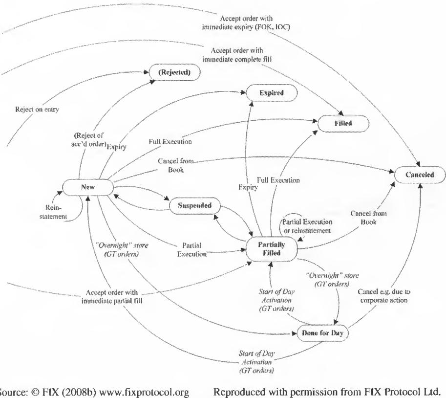  
Figure 11-11 FIX order states

A nice representation of the different states for a FIX order is provided in the documentation from FIX (2008b), as shown in Figure 11-11.

# Destination

Orders clearly need to be sent somewhere. Therefore, another key object that needs to be implemented is some sort of destination. This may simply be a wrapper for a connection to a FIX engine. The destination object might also incorporate additional logic, such as average latency information and details of any extra fees. This could then be used by any strategies that need to decide between execution venues.

# Other classes

Trading algorithms may also use a wide range of additional classes. For instance, VWAP algorithms need access to historical volume profiles. Cost-driven algorithms will need access to market impact and risk models. Liquidity-driven algorithms may use a diverse range of liquidity metrics. The logie associated with all of these analytics may be encapsulated in dedicated classes, which can then be shared between different trading algorithms.

# Implementing trading rules

So far, the trading algorithm class has just been a container. In order to recreate the algorithms we saw in Chapter 5 we need to add some actual trading logic to this. Typically, this means creating trading rules that respond to spccific cvents or situations, as shown in Figure 11-12.

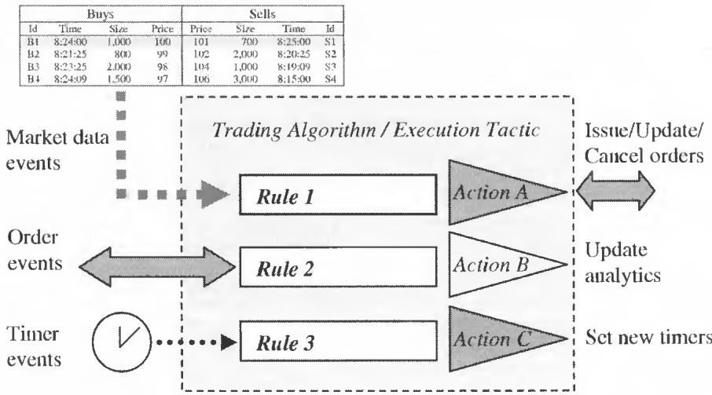  
Figure 11-12 A rules-based trading algorithm

This event-based approach is common to most algorithmic trading platforms. Obviously, the key cvents are those related to market data, for prices and liquidity, and to ordcrs, for fills and changes in status. Each rule wil react to an event in a spccific way, often by performing a set action. For example, a POV algorithm will need to take account of any ncw market volume; it might then updatc its target quantity or simply issue a new child order. Similarly, adaptive algorithms will react to changes in the market price or liquidity.

# Coding trading rules

Most algorithmic trading platforms arc event-driven, huilt using an object-orientcd languagc such as Java or $\mathbf { C } \mathbf { + } \mathbf { + }$ ; so trading rules are often written directly in codc.

In cvent-driven programming, cach event represents a message that may be transmited between objects. The objects are said to he cither producers (publishers) or consumcrs (subscriers) for a specilic cvent. So all the intercsted objects can register to cnsure they are notificd when an event occurs. These registrations may be handled by a separate intermcdiary, which allows the components to be "loosely coupled". Hence, the producers and consumers do not actually need to know any specifics about cach other; all they rcquire is access to the intermediary. This allows us to dynamically add new consumcrs or cven changc to usc a different producer object. Such an approach provides a lot of lexibility.

Thc actual triggcrs are called cvent handlcrs. These respond every timc a specific event happens. For instancc, each timc an order rcccives a fill an OrderFillEvent may be triggered. By registering a dedicated event handler for these we can bc notified by this event cach timc the order gcts a fill. We can then update our overall position based on thc new fil size, as shown in the following sample event handlcr:

public void onOrderUpdate( OrderFillEvent oe ){ if ( notYetProcessed( oe.getFillID() ) ) { position $=$ position $^ +$ oe.getFillSize(); flagAsProcessed( oe.getFillID() );

adjustTarget (); } }

In addition to updating the position we might also use this event to adjust our targets, as shown by the adjustTarget () placeholder. Note that the notYetProcessed () function simply protects us from situations when we might receive multiple confirmations for the same fill.

Market data provides two main types of information, firstly basic order book data such as the best bid and offer and their sizes. For example, let's consider recreating a simple pegging order. On each market data update (or tick) we check if the best bid or offer has changed:

public void onMarketDataUpdate( MarketDataEvent mde ){ if ( mde.hasBestBidOrOfferChanged () && priceChangeSufficient() ){ doPeg();   
}

If the price change is sufficient, we need to change the price of our extant order, this decision is handled by the placeholder function pricechangeSufficient (). The doPeg () method contains all the necessary logic for the actual pegging. All the trading rule really does is act as a link to trigger this, based on the market data changing.

Market data events may also deliver information from trade reports. For example, a simple reactive Percent of Volume (POV) algorithm will need to respond to market data trade reports, setting its new target based on the additional volume:

public void onMarketDataUpdate( MarketDataEvent mde ){ if ( mde.isTradeTick() && isValidTrade( mde ) ) { adjustTarget( mde.getTradeSize() ); if ( targetchanged() ) sendorder() ;

The isValidTrade () function allows us to check the trade report flags and date to ensure this is volume the algorithm should be tracking. If the trade is valid a new target is then set. For a truly reactive POV approach, we can then issue an order, provided that the target size has changed sufficiently. Note that this is just a simple example, as we saw in Chapter 5 such a reactive approach is not the best way of implementing a POV algorithm.

Obviously, event handlers can be much more complex than these basic examples. For orders we also need to deal with rejections, cancellations etc., similarly for market data we need to handle order book information as well. We also need to deal with infrastructure issues, for instance, possible failures in the connections for our orders or our data feeds.

However, the key point is that complex behaviours can be buil up from a large number of relatively simple rules. If they are designed well, the rules can often be used across a wide range of different strategies, and so helping to speed up development time for new strategics.

# Scripting trading rules

Some vendor's platforms provide applications that allow trading rules to be scripted. A good example of this is the Apama Event Modeler as shown in Figure 1 1-13.

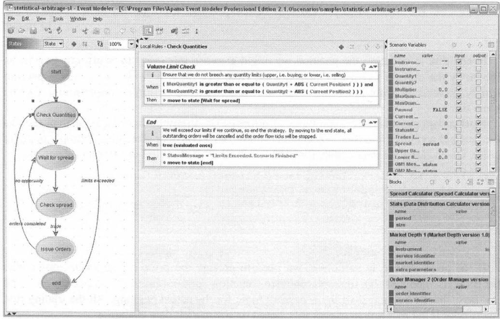  
Source: Apama (2008) $^ ©$ 2008 Progress Software Corporation. Used with permission   
Figure 11-13 A screenshot of the Apama Event Modeler

The Event Modeler provides a state-driven approach; the various potential states may be seen on the left hand side of Figure 11-13. The example scenario displayed is driven by the spread between the prices of two assets. The arrows show the progression from one state to another: So after starting and checking the quantities, the scenario effectively loops between the "wait for spread" and "check spread" states. Only when the spread is favourable will it shift to "issue orders". In the middle of Figure 11-13, we can also see the rules for the "check quantities" state. If it passes the'volume limit check' rule then it will move to the "wait for spread" state. Otherwise, it will terminate with a status message noting that the limits have been exceeded.

This approach allows traders to create strategies by scripting appropriate rules within a custom application. Obviously, significant testing is still required, but it can offer a rapid means of prototyping new strategies.

# Testing

Testing is clearly a vital part of the process.The basic mechanism of each trading strategy and rule must be verified, so a dedicated test environment is usually required. This enables us to test each separate component for a wide range of market conditions. Back-testing may then be used to analyse the overall performance, based on historical data.

Note that whilst test environments are important there is no substitute for the real thing. Therefore, once they have passed all the various tests and performance analyses trading algorithms will often undergo a period of small-scale live testing. Only after careful realworld performance monitoring and analysis will the algorithms be ready for more widespread use.

# Test environment

A test environment needs to be able to realistically recreate the actual infrastructure, so it will look similar to the layout we saw in Figure 11-1. Market data is important, similarly we need be able to dispatch orders and see their effect. Clcarly, all these proccsses need to operate separately from the live production instances so that there is no confusion (or any aceidents).

Testing against live market prices is certainly useful; however, historical (or "canned") data is often used as well. Live market prices are inherently uncertain, whereas using historical data allows us to control exactly what the market conditions are. This enables us to replay specific scenarios and so test the performance of a range of trading strategies, or rules, based on exactly the same conditions. A number of vendors already provide solutions which can store and replay historical data.

Validating the cncoding and transmission of orders is also important, although admittedly these will change much less frequently than the trading rules. Often this will require a mix of visual inspection by the developers and routing orders through to test cxchanges.

Another factor worth considering is latency. As strategies increasingly search for liquidity amongst different execution venues, they necd to be able to take account of latency. Unfortunately, test environments often perform very differently to the real world, so simulators can play an important role in reproducing thc effect of latency.

# Validating trading rules

As wc have already seen, trading algorithms may be broken down into scts of trading rules. Each of these must be individually verified. So a developer may create specific tests to ensure that given the required market conditions each rule will react as expected. Thus, replaying historical market data is invaluable, since it allows fine-grained control of the market conditions. In comparison with live data, we simply cannot predict exactly how the market will move throughout the day, so there is no guarantee that a test condition will be triggered.

It is also important to test for extreme market conditions, such as during the 2007-09 linancial crisis. Consequently, testing may also be carried out using historical datasets for periods in which there was a strong price trend, volatility, trading halts or cven sudden liquidity crises.

We also need to confirm how trading rulcs perform "en-masse" as part of an algorithm. For example, a perfcctly reasonable stop-loss rule might actually play havoc with performance when incorporated into a liquidity-sccking algorithm. Careful post trade analysis can highlight the child orders that eontributed most to the overall transaction costs. Then it is a matter of drilling down to understand why they were placed and to confirm whether this was the best approach.

# Back-testing

Back-testing is an important method for verifying the potential performance and profitability of trading strategics. For instance, let's consider a trading srategy that relies on price forecasts based on historical moving average (MA) prices, as shown in Figure 11-14.

If thc 10-day moving average rises above the 30-day moving average then we will treat this as a signal to buy the asset. Conversely, when it falls below the 30-day average we shall look to sell the asset. For this one cxample the rule seems to work quite wel. Still, that does not guarantee its future success. A common way of validating its potential is to check how it docs over time. By back-testing for the last few months we can determine whether the rule

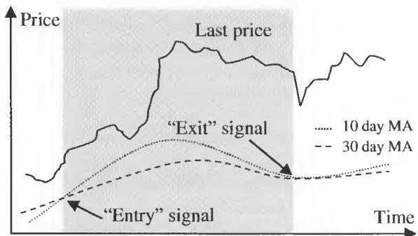  
Figure 11-14 A simple trading strategy

holds true or whether it breaks down over time. Usually, this is gauged by determining the overall profit and loss (P&L) of a simulated strategy. Based on this figure we can then compare the performance of different trading strategies.

Note it is vital to remember that just because a rule holds for a certain period of historical data docs not mean it will necessarily continue to do so in the future. As its name implics all back-testing docs is highlight the performance based on data from the past. Factors such as transaction costs also play a key role: Just because a strategy seems profitable based on closc prices docs not mean it will actually be viable.

Trading algorithms can be back-tested, although the focus will usually be on performance rather than the ovcrall P&L, since the decision to buy or sell remains a separate choice. Obviously, this rcquires a lot more data than simple close prices, simulations will necd to incorporate data for each price "tick" and all the trades, as a bare minimum. They will also usually recreate the order book, so as to bc able to replicatc thc exact market conditions.

Historical market data is invaluable for testing the fundamental behaviour of trading algorithms and rules. It is also important to remember that our trading stratcgies actually change market conditions. Each of our orders adds to the overall buying or scling pressure and so has an effect on both the market price and overall trading volume. Conscquently, there is always some uncertainty about how the market will actually react to our orders.

Market impact and signalling risk are important factors, so for performance testing we need to try to simulatc thcsc effects. Though, as we saw in Chapter 10, accurately cstimating market impact is non-trivial. Hence, simulators are often used to try to provide a rcalistic market for testing purposes. Any simulation must take into account competition from other participants and provide a realistic reaction to any tcst orders, whilst applying the same trade matching rules as the execution venue. Many of these will have becn devcloped in-house, although incrcasingly vendors are offering exchange simulators that provide this.

The overall quality achicved using back-testing owes a lot to the accuracy of the market simulation. In Chapter 15, we will see how artificial intclligence is being used to try to make these simulations more accurate.

# 11.4 Other requirements

This chapter has mainly focussed on the technical requirements for implementing trading strategies. fn order to successfully implement such strategies there are also some other important considerations: Gencrating thousands of electronic ordcrs is all very well, but it could easily swamp the clearing and settlement department. Thus, it is vital to ensure that their infrastructure is able to cope with the potential load. In addition, trading platforms must adhere to the rules set out by the different execution venues that they use. So it is also important to audit them for regulatory compliance.

# Clearing and settlement

The ultimate goal of any trading platform is to execute trades quickly and efficiently. Although getting an execution back from an exchange is only half the story, since settlement still needs to take place.

Electronic trading has led to markedly increased trading volumes, which could have swamped the clearing and settlement departments. Fortunately, the shift away from manual trading has helped streamline the process, since most (if not all) of the trade-related information may now be processed electronically. This has increased the accuracy and allowed clearing and settlement to become more highly automated.

Just as the FIX Protocol has proved invaluable as a means of linking trading platforms, it also offers solutions for post-trade reporting and settlement. Once an order has been completed, an Execut ion Report message may be sent, detailing how much was filled and the average price. The client may then send an Allocat ion message to specify the actual accounts that should be used for settlement. Alternatively, they can even include this pre-trade in their New Order message. Finally, the broker may issue Confi rmat ion messages that confirm each trade allocation, as well as the fees, account/s and other settlement details. More details can be found on the FIX website (www.fixprotocol.org).

As with any other piece of infrastructure, for a trading platform to be successful it is important that all its components are well integrated. Hence, the appeal of common protocols, such as FIX, which provide a uniform messaging structure allowing straightthrough processing (STP) from pre-trade right through to settlement.

# Regulations compliance

Trading must abide by market regulations, whether it is carried out manually or electronically. There is also scope to prevent potential problems by ensuring that systems perform basic "sanity checks" to ensure that orders are reasonable. These may be enforced by management or by dedicated compliance departments.

One of the advantages of clectronic (and algorithmic) trading is that it is much easier to implement a full audit trail, tracking any order placements, changes and resultant executions, than it is for manual execution. This makes it casicr to find the cause of any issues, should they occur.

# Sanity checks

Over the last few years, there have been several major instances of so-called "fat finger" irades. These are when someone accidentally enters an order with a ridiculous price or quantity, usually sending the asset's price spiralling downwards and resulting in the suspension of trading. It is important to ensure that there are systems and procedures in place to prevent such trades. This can be achieved by ensuring there are certain sanity checks to control orders':

● Pricc • Size ● Value

If any of these are significantly different from the norm then they probably warrant checking. These validations might be placed within the order entry screen, the order managemcnt system or both.

Clearly, the limit price is an important benchmark. If it bears no relation to the current market price this may be due to an input error. Alternatively, it might reflect a problem with currency conversion, or even issues with the market data source. For stocks, there might also have been a stock split or dividend, so it might be based on an old price.

Order sizes may be compared to the average daily volume (ADV). An order size that is more than $5 0 \%$ of the ADV might be a typo, or at least should be discussed carelully with the broker/dealer sincc it will need special handling.

By determining the ovcrall value of the order we can add an extra lcvcl of validation. For example, both the price and size might be reasonable; however, if a clicnt generally sends orders no larger than $\$ 2$ million then suddenly an order worth $\$ 20$ million arrives it may be an error.

Note that all of these checks are based on market data, so for them to be mcaningful it is vital that the prices are valid and up to date. Thus, it is important for the order management system to have monitoring in placc to ensure that market data is reliable and there is no significant latency in updates. Similarly, an algorithmic trading platform is blind without data, so such monitoring is even more important for these.

Trading algorithms also often make use of historical data and analytics, so it is important to ensure that there are mechanisms in placc to check the validity of thesc as well. Again, a good example is coping with the historical adjustments required for stock splits.

# Market regulations

Traders must pass exams in order to trade on most organised exchanges. This ensures that they havc a thorough knowledge of the rules and regulations associated with trading and setlement. For instance, they will need to be aware of the:

• Trading sessions, both continuous and auction, and opening and closing timcs   
● Order types and conditions, and pcrmitted combinations during each session   
• Trading halts/suspensions and market-wide halts Reporting requiremcnts   
• Code of conduct

Clearly, these regulations must be followed whether the trader is on the floor of the exchange, sending orders from a screen or using a trading algorithm. Therefore, order management systems must also be aware of these rules. Idcally, they should be able to prevent any incorrect orders from being sent to the cxecution venue. Order entry screens should also be aware of these and try to make life easier for the trader by only offering thc appropriate options and/or combinations.

Algorithmic trading platforms must also incorporate the appropriate rules and regulations within their logic. For example, they should certainly be aware of the different trading sessions, such as continuous trading or a call auction, and adjust accordingly. They must also be aware of any market halts, or delays in opening or closing the market. Again, should this happen they need to be able to adjust their strategy accordingly, or as a minimum they ought to flag that there has been an issue and they require attention or manual intervention. Some venues even stipulate that electronic and algorithmic trading platforms have to be able to be turned off during periods of market instability. There should also be processes in place to handle any technical problems, such as failure of a market data server or the link to the

exchange.

It is also important to revicw the logic behind trading algorithms, in order to try to prevent any accidental brcaches of market regulations. As an example, let's consider an algorithm which is some way behind its targets. In trying to be filled, it might place an aggressive order. Though, if the market has already moved substantially throughout the day this might be cnough to tip the balance and trigger a price-based halt. Ideally, there ought to be price checks in place to prevent this. Again, it is essential to test how algorithms respond to such cvenis.

Clearly, a full system audit is a time consuming process; however, it is important to check that systems are compliant. In general, market regulations do not usually change that frequently. Thus, compliance checks are mainly needed when trading platforms and algorithms cxpand to cater for new markets. That said, this can all change when the markets become volatile. A good example of this is the rapid change of regulations for short-sales during the 2007-09 financial crisis. Indeed, given the resultant market turmoil regulation is likely to increase. For instance, there is the possible reintroduction of some form of uptick 4 rule for U.S. equitics. Therefore, testing and auditing is a process that must continually cvolve in order to keep pace with changes in the world's markets.

# 11.5 Summary

▪ Order management plays an important role in any trading strategy, it comprises of:

Order entry, allowing specification of any necessary trade conditions or parameters Order cncoding, to convert the details into a format the target venue can use Transmission of order-related information to and from the venue

Order management (OMS) and execution management (EMS) systems provide an important front-end for managing orders, as well as offering functions like pre- and post-trade analytics. They also connect to back-end servers, which handle the order cncoding and routing.

The Financial Information Exchange (FIX) protocol offers a common messaging scheme for the exchange of any information related to securities transactions. It handles the transmission of orders, market data, security information and settlement details. FIX (5.0) supports equitics, bonds, repos, FX spot, forwards, swaps and listed futures and options.

Algorithmic trading and DMA are reliant on their implementation, they need easily accessible platforms that are stable and can deal with heavy loads. They should also be easily extendable to increasc capacity and allow new functionality.

Trading rules may be coded or scripted to respond to specific cvents, typically these are: Market data, for prices and liquidity Order notifications, for fills and changes in status

Testing is a vital part of this process. Individual trading rules must be verified, but it is

also important to see how they perform en-masse, as part of an algorithm. Replaying specifie seenarios allows the performance of a range of different rules to be compared based on exaetly the same conditions. Though, it is also always important to test against live market data. Hence, brokers generally use algorithms internally for a while before making them available to their clients.   
Clearing and setlement must also be considered; it is important to ensure they can cope with the trading volume from electronic and algorithmic trading.

# Part IV

Advanced trading strategies

This final part of the book focuses on some of the more advanced techniques that are stil at the cuting edge of algorithmic trading.

• Chapter 12 considers how algorihms may be used for trading portfolios. It also looks at the potential for portfolio-optimised algorithms that take account of portfolio risk and divcrsification.   
• Chapter 13 introduces multi-asset trading and revicws many of the common cross-asset trading strategies. It highlights the additional factors that must be considered when creating algorithms for these.   
• Chapter 14 examines the polential for incorporating ncws. This covers the various sources of information and the analytics used to create meaningful indicators. There is also a revicw of market rcaclions to news events.   
• Chapter 15 shifts the focus to data mining and artificial intelligence (AI). This shows how they may be applied to enhance trading performance by mining for relationships and providing short-term predictions.

Hopefully, by the end of these four chapters you should have a good idca of some of the techniques that may be more commonly adopted in the not too distant future.

Portfolio trading is not just about multi-tasking. Significant risk reductions can be achieved by tracking and managing portfolio risk.

# 12.1 Introduction

Portfolio trading providcs investors with a cost-effective means of trading whole baskcts of assets. This may be used to convert new cash flows, liquidate existing positions, or a combination of the two for portfolio rebalances. It may even be used to assist the transition of entirc invcstment portfolios, also known as transition management.

Just as with single asset trading, portfolios are traded on either an agency or principal basis. Agency trades may simply be worked on "best efforts", or target benchmarks such as the VW AP or daily close. Principal trades are agreed for a specific strike timc, at which point a snapshot of all the asset prices is taken. Quotes may be obtained from a number of brokers, although information leakage is obviously a key concern. Hence, trading may also bc pcrformed blind, in which case the broker is just given a description of the portfolio. This offcrs only an approximate value, number of assets, and factors such as weightings for the countries, indices and/or sectors. Clearly, with such blind trades the broker/s will tcnd to quote more conservatively to protect themsclvcs from the additional uncertainty.

Thcre are some hybrid trading types as well, namely inccntive agency and guarantecd benchmark trades. An incentive agency trade means the broker's commission depends on the performance relative to the benchmark, whilst a guaranteed benchmark trade enforces a strict target that the broker must meet.

Portfolio trading is also an important tool for risk control and efficiency. Most brokcrs provide comprehensive pre-trade and real-time trading analytics, which allow investors to more precisely assess the impact of trading. This information may also be useful for thcir hedging strategies. Dctailed post-trade analytics allow accuratc performancc measurement. The high level of automation associated with portfolio trading also enables the streamlining of post-tradc allocation and settlement.

Onc of the key considcrations when trading baskets of asscts is portfolio risk. So we will start this chapter by reviewing this in morc dctail. Then afier secing how transaction cost analytics may be applied, we shall focus on optimal portfolio trading strategies. This includes techniqucs such as hedging and determining the optimal portfolio makeup. Finally, we will consider a how best to apply trading algorithms for exccuting portfolio tradcs.

# 12.2 Portfolio risk

A portfolio's return is the weighted sum of the rcturns for its constituent asscts. So the associated portfolio's volatility is the standard deviation of these rcturns. Portfolio risk is somewhat harder to define. For the purposes of this book, we shall assumc that this may be defined in terms of the portfolio volatility $( \sigma _ { p } )$ and an error term (ε):

$$
P o r t f o l i o \ r i s k = \sigma _ { p } + \varepsilon
$$

The error term reflects the uncertainty associated with any risk estimatcs. Given that portfolio volatility forms the basis for this risk, the two terms are often uscd intcrchangcably.

Another important conccpt closely linked to portfolio risk is diversificalion. This is a significant risk reduction that occurs when the individual risks in thc portfolio offsct one another. Diversification helps to reduce the overall volatility of a portfolio's value, and so ensure a more consistent pcrformance. Often this may be achievcd simply by increasing the number of assets in the porfolio. For example, Figure 12-1 shows a plot of risk for portfolios of various sizes.

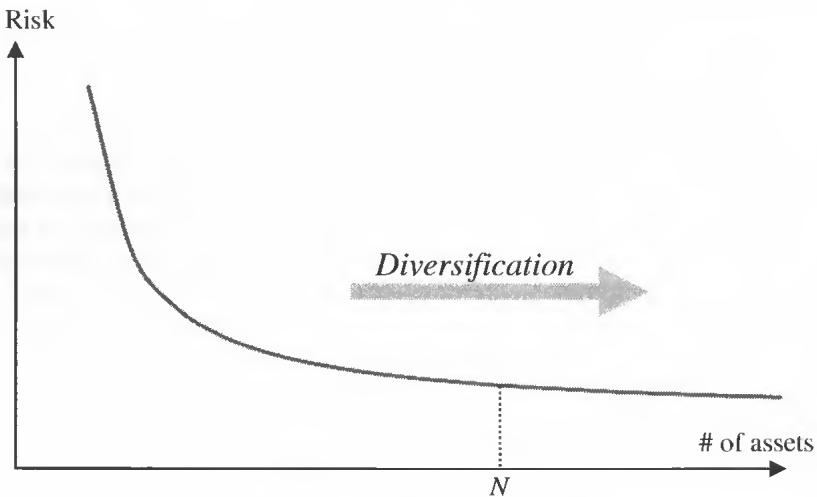  
Figure 12-1 A comparison of risk between various sizes of portfolio

A study oI stock portlolios by Burton Malkicl (2004) confirmed this efect. Although he found that the risk reduction soon became negligiblc once portfolios were larger than 15 stocks (cquivalent to the point $N$ in Figure 12-1). The key to achicving diversilication is to group together assets that are uncorrelated. This means that price rises/drops will not affect all the assets in the portfolio uniformly. Thus, Malkiel (2004) found that portlolios containing international stocks had much lower risk than those concentrated on U.S. stocks.

# Portfolio volatility

The relationship betwecn portfolio volatility and that of its constituent assets is actually nonlinear. So unlike the returns we cannot just determine it from the weighted sum of each asset's volatility. This was first pointed out by Harry Markowitz (1952) in his landmark paper “Portfolio Selection". He notcd that cach constitucnt's contribution to the overall

portfolio risk depends on three key factors:

● its proportion/weight in the portfolio the variance of its relurns the covariance of its returns with all other assets in the portfolio

Covariance is a measure of how much two variables vary together.

Therefore, the portfolio volatility $( \sigma _ { p } )$ may be defined as:

$$
\sigma _ { p } = \sqrt { \sum _ { i = 1 } ^ { n } \omega _ { i } ^ { 2 } V a r ( \boldsymbol { r } _ { i } ) + \sum _ { i \neq j } \omega _ { i } \omega _ { j } C o \nu ( \boldsymbol { r } _ { i } , \boldsymbol { r } _ { j } ) }
$$

where $r _ { i }$ is the relurn for constituent asset $i$ and $V a r ( r _ { i } )$ is its variance, ${ \mathfrak { O } } _ { i }$ and ${ \mathfrak { o } } _ { j }$ represent the wcights of specilic assets $i$ and $j$ and $C o \nu ( r _ { i } , r _ { j } )$ is the covariance betwcen their returns. Note that the covariance of a variable with itself equals its variance. We can further simplify equation 12-2 to:

$$
\sigma _ { p } = \sqrt { \sum _ { j = 1 } ^ { n } \sum _ { i = 1 } ^ { n } \omega _ { i } \omega _ { j } C o \nu ( r _ { i } , r _ { j } ) }
$$

The overall volatility $( \sigma _ { p } )$ of a simple portfolio with two equally weighted assets, which have corresponding volatilities $\sigma _ { I }$ and $\sigma _ { 2 } ,$ , may be determined as:

$$
\sigma _ { p } = \sqrt { \left( 0 . 5 ^ { * } \sigma _ { 1 } \right) ^ { 2 } + \left( 0 . 5 ^ { * } \sigma _ { 2 } \right) ^ { 2 } + 2 \cdot \left( 0 . 5 ^ { * } 0 . 5 \right) ^ { * } C o \nu ( 1 , 2 ) }
$$

Example 12-1: Let's examine the risk for a range of portfolios based on different compositions of two sample assets. Asset EFG has a volatility of $40 \%$ whilst HIJ has one of $2 5 \%$ . The covariance between these assels is 0.05.

So a portfolio that is $100 \%$ EFG will have $40 \%$ volatility, whilst one based solely on HIJ will have $2 5 \%$ .

Based on equation 12-4 a porlfolio with $5 0 \%$ of each stock has a volatility of:

$$
\sigma _ { p } = \sqrt { \left( 0 . 5 ^ { * } 0 . 4 0 \right) ^ { 2 } + \left( 0 . 5 ^ { * } 0 . 2 5 \right) ^ { 2 } + 2 ^ { * } ( 0 . 5 ^ { * } 0 . 5 ) ^ { * } 0 . 0 5 } = 2 8 \mathcal { H }
$$

In comparison, the weighted sum of asset volalililies is $3 2 . 5 \%$

This lower volatility is due to the low covariance between the two assets. In other words, the overall risk is reduced because they are not perfectly correlated. If we plot the actual portlolio risk for all the potential mixes, we get the curve shown in Figure 12-2. Based on this, the lowest portfolio volatility of $2 4 . 7 4 \%$ may be aehieved for a basket comprising of about $10 \%$ EFG and $90 \%$ HIJ.

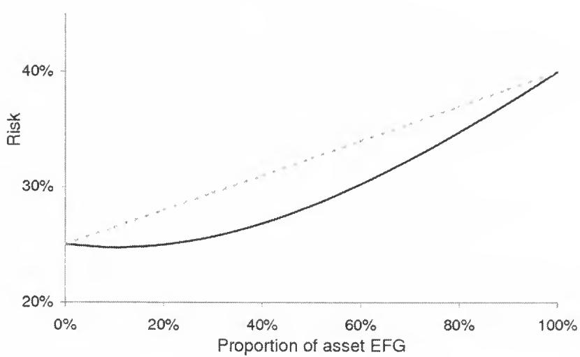  
Figure 12-2 Portfolio risk for a range of portfolio compositions

The dotted line shown in Figure 12-2 marks the weighted avcrages for cach portfolio composition. It corresponds to the risk that would he achieved if the two were $100 \%$ correlated.

The strength of the relationship between thesc two assets' returns may be quantified using a correlation coclficient $( \rho )$ . Esscntially, this is thcir covariance divided by the product of their standard deviations, as outlined in Addendum A at the cnd of this chapter.

Using cquation 12-9, we can determinc thc actual correlation $( \rho )$ betwcen thesc asscts:

$$
\rho _ { i , j } = \frac { C o \nu ( I , J ) } { \sigma _ { i } \sigma _ { j } } { = } \frac { 0 . 0 5 } { 0 . 4 0 ^ { * } 0 . 2 5 } { = 5 0 \% } { = 5 0 \% }
$$

Example 12-1 highlights the fact that the overall portfolio risk may bc lcss than or equal to the weighted sum of the individual asset risks, and that this is largely duc to the corrclation between them. For instancc, if the correlation between EFG and HIJ was zero the portfolio risk could be further reduccd to around $20 \%$ .

Clearly, portfolios usually have more than just two constitucnts. Since they can in fact be quite large, matrices are often used to simplify the calculation of portfolio volatility. Thus an alternative notation for cquation 12-3 is:

$$
\sigma _ { p } = \sqrt { \boldsymbol { w } ^ { T } \boldsymbol { \Omega } \boldsymbol { w } }
$$

where $\Omega$ is the covariancc matrix, $w$ is the vector of asset wcights and $w ^ { T }$ is its transpose. The covariance matrix represcnts all the possible pcrmuations across the portfolio, and for the purposes of this calculation is often expressed in terms of $\$ 1$ /share. Note, for more dctails on how to construct a covariancc matrix sec Addendum A at the end of this chapter.

Example 12-2: Consider a simple portfolio with three assets. The portfolio is long 120 of assct ABC (volatility) $\scriptstyle = 0 . 2 4 5$ and short 80 DEF (volatility $\mathrm { \tau } = 0 . 1 6 1$ ) and 40 HIJ (volatility $= 0 . 3 8 7$ ). The vector of asset weights (w) and the covariance matrix $( \Omega )$ are:

$$
w = \left( \begin{array} { l } { { 1 2 0 } } \\ { { - 8 0 } } \\ { { - 4 0 } } \end{array} \right) \quad \Omega = \left( \begin{array} { l l l } { { 0 . 0 6 0 } } & { { 0 . 0 3 3 } } & { { 0 . 0 2 1 } } \\ { { 0 . 0 3 3 } } & { { 0 . 0 2 6 } } & { { 0 . 0 0 2 } } \\ { { 0 . 0 2 1 } } & { { 0 . 0 0 2 } } & { { 0 . 1 5 0 } } \end{array} \right)
$$

Substituting these into cquation 12-5, the expected portfolio volatility (in dollars) is:

$$
\sigma _ { p } = { \sqrt { \left( 1 2 0 - 8 0 - 4 0 \right) \left( { \begin{array} { c c c c } { 0 . 0 6 0 } & { 0 . 0 3 3 } & { 0 . 0 2 1 } \\ { 0 . 0 3 3 } & { 0 . 0 2 6 } & { 0 . 0 0 2 } \\ { 0 . 0 2 1 } & { 0 . 0 0 2 } & { 0 . 1 5 0 } \end{array} } \right) \left( { \begin{array} { c } { 1 2 0 } \\ { - 8 0 } \\ { - 4 0 } \end{array} } \right) } } = { \mathfrak { S } } 2 1 . 1 7
$$

Consequcntly, our simple portfolio has an expected volatility of $\$ 21.17$

Note that it is important to remember that all of these are simply estimates. They rely on forecasts for the individual volatilities and correlations, which will usually be based on historical data. Their accuraey depends on how well these forecasts match reality. Hence the importance of the crror term (e) in equation 12-1.

# Diversification

Diversification can result in a significant decrease in the overall portfolio risk, as we saw back in Figure 12-1. Indeed, its effect is probably best summed up by Burton Malkiel (2004) as the closest thing there is to a free lunch in finance.

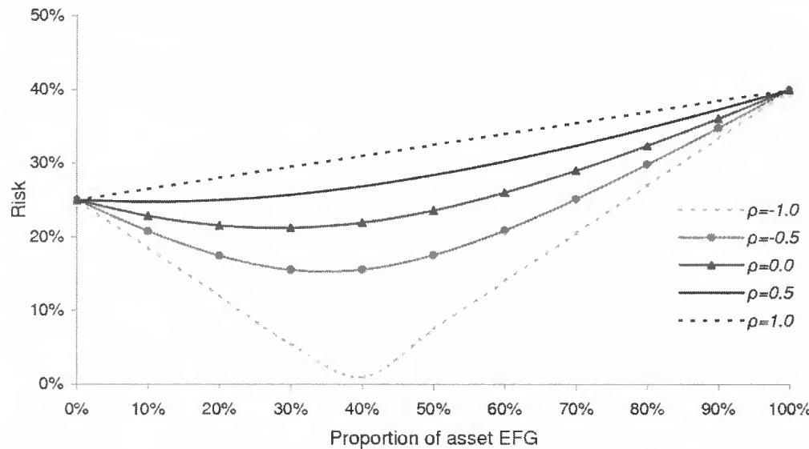  
Figure 12-3 Portfolio risk for a range of different correlations

If we go baek to our two-asset portfolio from Example 12-1, we can see how a lower correlation between the assets leads to a lower portfolio risk, as shown in Figure 12-3. This makes sense because with a correlation of -1.00 the price rise of one asset wil be offset by an equivalent drop in the price of the other. In comparison, a correlation of 1.00 means that both prices will rise, so there is no implicit hedging.

Successful diversification relies on grouping together assets that are uncorrelated, so thcir covariance is zero. Therefore, price rises/drops will not affect all the assets in the portfolio uniformly, reducing the overall volatility of the portfolio and ensuring a morc consistent performance. For example, correlation should be lower for stocks across different scctors, industries or countries.

Another way of visualizing the relationship between correlation and risk is shown in Table 12-1 which directly maps the correlation to the proportion of diversifiable risk which may be climinatcd:

<table><tr><td rowspan=1 colspan=1>Intra-portfoliocorrelation</td><td rowspan=1 colspan=1>Percent ofdiversifiable riskeliminated</td></tr><tr><td rowspan=1 colspan=1>1.00</td><td rowspan=1 colspan=1>0.00</td></tr><tr><td rowspan=1 colspan=1>0.75</td><td rowspan=1 colspan=1>12.50</td></tr><tr><td rowspan=1 colspan=1>0.50</td><td rowspan=1 colspan=1>25.00</td></tr><tr><td rowspan=1 colspan=1>0.25</td><td rowspan=1 colspan=1>37.50</td></tr><tr><td rowspan=1 colspan=1>0.00</td><td rowspan=1 colspan=1>50.00</td></tr><tr><td rowspan=1 colspan=1>-0.25</td><td rowspan=1 colspan=1>62.50</td></tr><tr><td rowspan=1 colspan=1>-0.50</td><td rowspan=1 colspan=1>75.00</td></tr><tr><td rowspan=1 colspan=1>-0.75</td><td rowspan=1 colspan=1>87.50</td></tr><tr><td rowspan=1 colspan=1>-1.00</td><td rowspan=1 colspan=1>100.00</td></tr></table>

Source: Wikipedia (2006)

# Table 12-1 The relationship between intra-portfolio correlation and the amount of diversifiable risk

This risk reduction may be harnessed to determine the optimal composition of portfolios, as Markowitz suggested. For each group of assets, the optimal composition may be discovered by altering the weightings of the constituents to find the solution with the lowest risk. This is effectively what we did in Example 12-1.

However, it is also important to take into account the returns for each asset; hence, we can plot a chart of risk versus returns for the various portfolio combinations. An cxamplc of this is shown in Figure 12-4, based on the assumption that the returns for asscts EFG and HIJ are $10 \%$ and $5 \%$ respectively.

This type of portfolio risk curve is sometimes called a Markowitz cflicicnt fronticr. The shape of each curve is dependent on the correlation between the two asscts: When the assets are perfectly correlaied, the frontier forms a straight line. The curvature of this Irontier increases as the assets become less correlated. Few assets exhibit perlect corrclation, consequently diversification is possible. Note, few asscts are perfectly ncgaiively correlated either.

# Decomposing portfolio risk

Portfolio risk may also be decomposcd into simpler componcnts, just as we did for transaction costs in Chapter 6. A common approach used for returns is the single factor model. This expresses returns in terms of an expected out-performancc compared to a specific factor. In this case, the factor represents the performance of a key benchmark (or thc market). Hence, the returns $( r )$ may be expressed as:

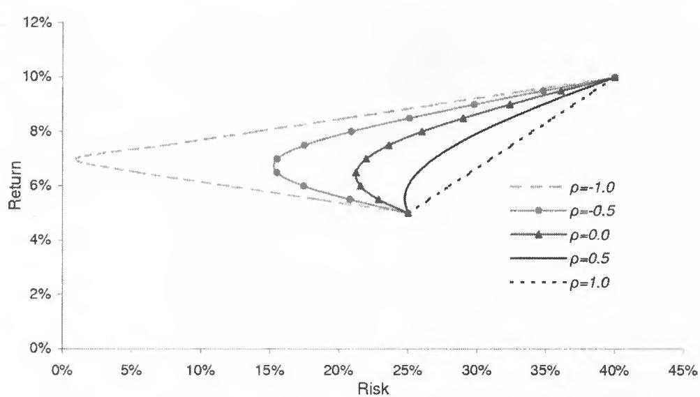  
Figure 12-4 Example Markowitz efficient frontiers

$$
r = \alpha + \beta r _ { B } + \varepsilon
$$

where $\alpha$ represents the out-performance, $r _ { B }$ is the benchmark (or market) return and $\varepsilon$ is an independent error factor. The beta $( \beta )$ factor determines how much impact the benchmark has on the overall returns. In comparison, the out-performance $( \alpha )$ and the error factor represent returns that are uncorrelated with the benchmark (or market).

A similar approach may be used to model the variance of these returns, or portfolio risk. Nadine Gottschalk (2003) shows that the variance may be represented as:

$$
\sigma _ { i } ^ { 2 } = \beta _ { i } ^ { 2 } \sigma _ { B } ^ { 2 } + V a r ( \varepsilon )
$$

where $\sigma _ { B }$ is the variance of the benchmark (or market) returns and Var(e) represents an independent error factor. So the portfolio risk may be broken down into two main components:

- a systematic benchmark (or market) risk a non-systematic or asset specific risk

The systematic (or market) risk represents the risk of a market move. Again, the beta factor determines how much impact this actually has on the overall portfolio, with higher betas implying more risk. Note that this also represents the baseline level of risk that may not he reduced by diversification. Although separate hedging strategies may still be used, for instance, trading futures to counteract the market risk.

The non-systematic (or specific) risk is actually the independent error factor in cquation 12-6. It represents the risk that may be reduced by diversification.

# Specific risk factors

Specific risk may in turn be broken down into a range of other common risk factors together with an assct specific residual risk. The common factors represent risks that may not be felt market-wide, but do cxert an effect on specific groups of assets.

A common means of decomposing risk is to replace the single factor model with more complex muli-factor models. The study by Eugene Fama and Kenneth French (1993) is a well-known example of this. They analysed the returns for a mix of U.S. stocks and bonds (government and corporate). Overall, they found three common risks for stocks, namely the market and factors related to the firm size and book-to-market equity (which relates the firm's balance sheet value to its actual market value). For bonds, they noted common factors based on their maturity and default risk. Other common factors may correspond to the asset's country of issuance or currency; or for firms the industries or sectors with which they are most aligned. Hence, one way of viewing this breakdown of portfolio risk is shown in Figure 12-5.

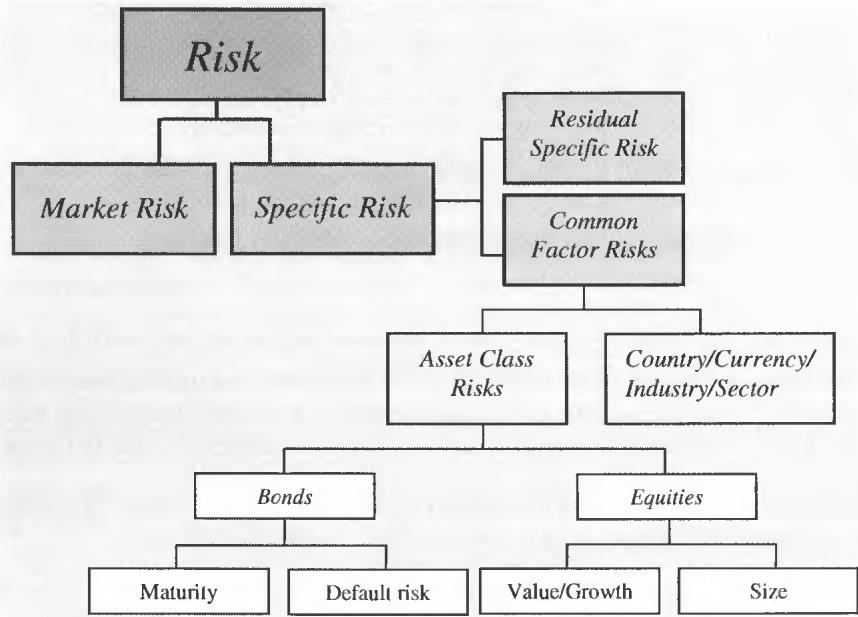  
Figure 12-5 Separating out the components of portfolio risk

A nice illustration of the impact of some of these factors is provided by Ananth Madhavan and Jian Yang (2003). They analysed data from the annual reconstitution of the Russell indices, the results are shown in Figure 12-6. Overal, they note that in 2002 the active risk was more than $2 \%$ between the pre and post-reconstitution of the indices, based on market capitalisation. Whilst much of this risk was systematic or market risk, it is interesting to see how much was attributed other common factors. In particular, for both indices the stylebased Value/Growth factor was extremely important. Similarly, it is worth noting just how small the asset specific residual risk can be: For the Russell 1000, we can see it was merely equal to the combined industry and sector risk.

Clearly, such risk hreakdowns will be different for each portfolio, hut as Figure 12-6 shows, the common risk factors can play a signilicant role and so should be considered rather than focussing solely on asset specific risk.

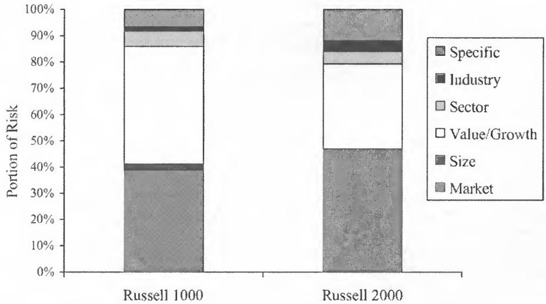  
Figure 12-6 A breakdown of portfolio risk factors

Source: Madhavan and Yang (2003) Reproduced with permission from ITG Inc. and Insitutional Investor

# Portfolio risk measures

Quantifying and tracking portfolio risk are vital in order to minimisc it. A variety of risk mcasures arc used in both pre and post-trade analytics. Some are even used during execution to track the ongoing performance. Based on the previous decomposition of risk, we can fairly easily divide portfolio risk into systematic (or market) and non-systematic (or specific) components.

Market risk may be tracked using the portfolio's overall beta coeficient, as we saw in equation 12-6. This allows us to quantify the level of non-diversifiablc risk that we may need to hedge.

Tracking crror provides a mcasure of how closely a portfolio follows a specific benchmark. If thc benchmark corresponds to the market then the tracking error reflects the specific risk componcnt. Thus, a high tracking error implies a considerable proportion of spccific risk.

An alternative approach to risk measurement is offered by the marginal contribution to risk (MCR). This is measured for each constituent of a portfolio. It reflects how the overall portfolio risk might change if thc position of a specific asset is increased. Therefore, the key to risk reduction is to targct thc constituents which havc a high MCR.

# Beta

The beta coefficient relates to the volatility of an asset's or portfolio's returns in comparison with the rest of the market. Essentially, it acts as a measure of the non-diversifiable market (or systematic) risk. A higher beta suggests greater volatility and so more risk.

The beta for an asset is based on the covariance of its returns with the market:

$$
\beta _ { i } = \frac { C o \nu ( r _ { a } , r _ { m } ) } { V a r ( r _ { m } ) }
$$

where $r _ { a }$ corresponds to the asset's returns and $r _ { m }$ represents those of the market. Hence, it is the ratio of the covariance of the two sets of returns divided by the variance of the market's returns. Note the market will olten be represented by a key benchmark price, such as that of a major stock index.

For example, an asset (or portfolio) whose returns change in line with the market has a beta of 1. Thus, a $10 \%$ incrcase in the market will also mean a $10 \%$ increase for the asset, whilst a $10 \%$ decrease will lead to a similar drop. A bcta of 2 means that the price swings are twice as rapid for the asset as the market, so a $10 \%$ rise in the market now leads to a $20 \%$ rise in the asset. Converscly, a beta of 0.5 mcans the sensitivity is halved, so a market fall of $10 \%$ only results in a drop by $5 \%$ for the asset. Assets with a negative beta actually move in the opposite direction to the market. For instance, during market crises the prices for precious metals often increase, so firms whose income is dependent on this can exhibit negative betas. A beta of zero is harder to find, this means there is absolutely no correlation between the two sets of returns.

Equation 12-7 may also be used to determine the beta of a portfolio, based on the covariance of the portfolio's returns with those of the market. Altcrnativcly, we can determine the portfolio beta from the weighted averagc of the betas of its constituent assets. For each constituent the beta is determined from its covariance with the other portfolio members. Using the matrix based notation we can express this as:

$$
\beta _ { i } = \frac { \displaystyle \sum _ { j = 1 } ^ { n } \Omega _ { i , j } w _ { j } } { \sigma _ { p } ^ { 2 } }
$$

where $\Omega _ { i , j }$ is the covariance matrix, $w _ { j }$ is the weight of each asset $( j )$ and $\sigma _ { \mathrm { ~ } \rho } ^ { 2 }$ is the variancc of the entire portfolio.

fn theory, if we could construct a portolio of assets with a beta of zero it would have no non-diversifiable risk. Consequently, we could usc diversilication to reducc the overall risk to a negligible amount. Realistically, though, most assets have some degrcc of correlation with each other.

# Tracking error

Many portfolios are managed to a benchmark, such as an index. Passive funds will often aim to match the returns of a spccific benchmark indcx, whilst active funds will try to outperform them. Tracking error provides a measurement of how closely a given portfolio follows the benchmark. Therefore, managers of passive index tracking portfolios will seek to minimise their tracking error. In general, tracking error is calculated from the standard deviation of the difference beiween the portfolio and index returns:

$$
T E = \sqrt { \frac { \displaystyle \sum _ { i = 1 } ^ { n } \left( R _ { P } - R _ { B } \right) ^ { 2 } } { N - 1 } }
$$

where $R _ { P }$ represents the portfolio returns and $R _ { B }$ are those of the benchmark for $N$ time periods. A high tracking error rellects a significant deviation from the benchmark. Essentially, it also reflects the active risk of a portfolio, which is a mcasurement more commonly adopted by active fund managers.

# Marginal contribution to risk

The marginal contribution to risk (MCR) may be used by investors to determine the portfolio's risk sensitivity to a specifie asset. It reflects the actual change in overall portfolio risk, so diversification is taken into aceount. Therefore, a comparatively risky asset may have a lower MCR than expected.

For any given portfolio the vector of marginal contributions to risk may be defined as:

$$
M C R _ { i } \equiv \frac { \partial \sigma _ { p } } { \partial w _ { i } } = \frac { ( \Omega w ) _ { i } } { \sigma _ { p } } = \frac { C o \nu ( r _ { i } , r _ { p } ) } { \sigma _ { p } }
$$

where $\Omega$ is the covariance matrix, $w$ is the vector of asset weights, ${ \sigma } _ { p }$ is the standard deviation of the entire portfolio and $r _ { i }$ and $r _ { p }$ are the returns of the asset $( i )$ and the portfolio respectively.

Note that generally the MCR is measured by determining the effect of varying the existing position of the given asset by $1 \%$ . Thus, the standardized change in portfolio risk may simply be determined by dividing equation 12-8 by 100.

Based on the similarity with equation 12-7 we can also express the MCR in terms of the asset's beta:

$$
\frac { \partial \sigma _ { p } } { \partial w _ { i } } = \boldsymbol { \beta } _ { i } \cdot \boldsymbol { \sigma } _ { p }
$$

So, the MCR is equivalent to a beta adjusted portfolio risk. Traders cannot vary the contents of a trade list; however, they can use the MCR as a guideline for how trading will affeet the residual risk, as Robert Kissell and Morton Glantz (2003) point out. If a particular asset has a high MCR then trading it more quickly will help reduce the overall risk. Conversely, assets with negative MCRs actually act as natural hedges; therelore, it makes sense to trade these more slowly to prolong this benefit.

# 12.3 Transaction cost analysis for portfolios

Portfolio risk and diversification mean that transaction cost analysis is slightly more complicated when dealing with portfolios. In the following sections, we wil briefly eonsider how the cost estimates we saw in Chapter 10 may be extended to deal with this.

# Market impact

Market impact costs are additive, therefore the market impact calculation for a portfolio is just a case of summing all the constituent impacts. Using the Kissell and Glantz (2003) market impact model, we can express the market impact cost for a portfolio of $m$ stocks as:

$$
M I = \sum _ { i = 1 } ^ { m } \sum _ { j = 1 } ^ { n } \frac { 0 . 9 5 x _ { i j } ^ { 2 } I _ { i } } { { X _ { i } } ^ { \ast } ( x _ { i j } + 0 . 5 \nu _ { i j } ) } + \sum _ { i = 1 } ^ { m } \sum _ { j = 1 } ^ { n } \frac { 0 . 0 5 x _ { i j } I _ { i } } { X _ { i } }
$$

wherc $I _ { i }$ is the instantaneous impact cost, $X _ { i }$ is the total order size for each asset and for each period $j$ the order size is represented by $x _ { i j }$ whilst $\nu _ { i j }$ is the expected volumc. Though easy to compute, the additive nature also means that market impact costs are not reduced by portfolio diversification. So impaet costs are an important eonsideration for portfolios.

# Timing Risk

Just as in Chapter 6, timing risk for portfolios may still be split into separate price and liquidity risks. The price risk is based on the portfolio risk of the remaining positions. From equation 12-5 Robert Kissell and Roberto Malamut (2005b) define the price risk for a portfolio as:

$$
\sigma ( x _ { j } ) = \sqrt { \sum _ { j } r _ { j } ^ { T } C r _ { j } }
$$

where $r _ { j }$ is the vector of residual portfolio positions that are left to be traded for each period $j ,$ and $C$ is the covariance matrix in $\$ 1$ share.

Liquidity risk represcnts the risk that our market impact estimations will be inaccurate due to unexpected market volumes. By assuming that any liquidity surprises are uncorrelated, Kisscll and Glantz (2003) are able to base liquidity risk on the variance of their temporary market impact function. So, for any given asset the liquidity risk may be defined as $\sigma ( h ( x ) )$

$$
\sigma ( h ( x ) ) = \sqrt { \sigma ^ { 2 } \Bigg ( \frac { I } { X } \sum _ { j } \frac { x _ { j } ^ { 2 } } { ( x _ { j } + 0 . 5 \nu _ { j } ) } \Bigg ) }
$$

where $I$ is the instantancous market impact, $X$ is the total order sizc and for each period $j$ the order sizc is represented by $x _ { j }$ whilst $\nu _ { j }$ is the expected volume.

Across an cntire portfolio, the liquidity risk may be represented as the sum of these individual risks:

$$
\sigma ( x _ { j } ) = \sqrt { \sum _ { i } \sigma ^ { 2 } ( h ( x _ { j } ) } )
$$

So as a whole, the portfolio timing risk may be expressed as:

$$
\Re ( x _ { j } ) = \sqrt { \sum _ { j } r _ { j } ^ { T } C r _ { j } + \sum _ { i } \sigma ^ { 2 } ( h ( x _ { j } ) } )
$$

Thus, the main dilfercnce to the portfolio volatility cxamples we saw in section 12.2 is thc addition of liquidity risk. This is covered in some more detail in Kissell and Glaniz (2003).

# 12.4 Optimal portfolio trading

In Chapter 7, we noted that achieving an optimal trading strategy requires us to meet the invcstor's specified trading objectives, which may be to:

Minimize the expected cost for a given level of risk Achieve price improvement over a givcn level of cost Balance the trade-off between expected cost and risk

The same principles apply for portfolio trading with the added complication of trying to maximisc divcrsification, and so minimise the portfolio risk. Again, thc set of optimal trading strategies is represented by the efficient trading fronticr. This may be found by solving the following optimisation for the expected cost $( E ( x ) )$

$$
\operatorname* { m i n } _ { x } ( E ( x ) + \lambda V ( x ) )
$$

where $V ( x )$ corresponds to the expected risk and $\lambda$ is represents the level of risk aversion. To find thc optimal solutions, mean-variance optimization techniqucs can help minimise the expcctcd impact cost, whilst covariance or multi-factor risk modcls may be used to provide the cxpected portfolio risk.

That said, when trying to minimise the expcctcd cost for a given level of risk, the optimal solutions are a constantly moving target. This is because the portfolio risk is based on the residual trading positions, and so it must be re-evaluated each time the porfolio changes. Hence, each change requircs thc crcation of a new efficient trading frontier, from which the minimum cost may then be targeted. Consequently, the minimum impact costs will vary over time. So to maintain the same level of risk we may have to alter the patern of our trading, as shown by the sample path in Figure 12-7.

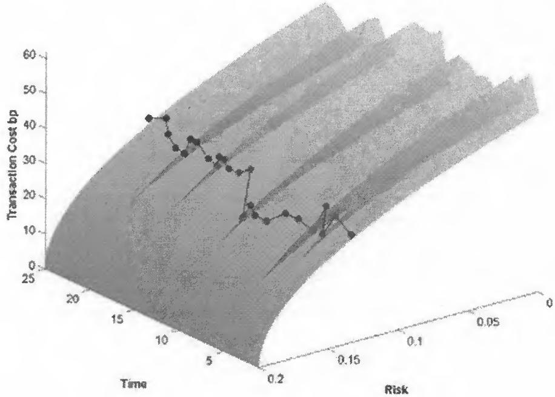  
Figure 12-7 Tracking portfolio risk and cost over time

Source: Domowitz and Krowas (2004) Reproduced with permission from ITG Inc. and Insriturional Investor

Likewisc, achieving price improvement over a given level of cost faces the same prohlem. Effectively, both these goals now have to dynamically balance the trade-off between expected cost and portfolio risk. For example, from a cost perspective it may make sense to aggressively trade one of the assets. However, if this was acting as a natural hedge for the residual portfolio (a negative MCR) then the reduccd diversification may lead to a significant increase in porfolio risk. Therefore, we need to determinc which effect is more important and act accordingly.

Thus, finding the optimal trading strategy for a porifolio requires both cost-based cxccution models and techniques from portfolio optimisation. Incrcasingly, thcsc arc converging to provide dedicated portfolio execution models.

# Additional goals for portfolio trading

Portfolio risk may be decomposed into a range of different factors, as we saw in Figure 12-5. Thus, portfolio managers may also track risk in terms of its market or assct specific componcnts. So they may considcr issues such as country, currency or sector risk. Alternativcly, they might focus on minimising the tracking crror for their fund. Therefore, investors often adopt a range of additional strategies to try to minimisc risk for their portfolios, such as:

● Cash balancing • Beta/Market neutrality • Sector/Country neutrality Minimising index tracking error

The easiest of these approachcs is cash balancing, which just halances thc value of the long and short positions, making the portfolio cash neutral. Still, this can leavc cxposure to market risk. Thereforc, markct neutral hedging trics to ensure that the net beta of the portfolio is zero. Similarly, even market neutral portfolios may still be exposed to considerahle risk from other common risk factors; hence, sector/country ncutrality may bc targeted. Each of these approaches requires careful halancing of the various groups. This also applies for tracking error, where a portfolio may he dividcd into the assets that help or hinder the indcx tracking. Clcarly, if multiplc goals are rcquired this balancing act can becomc cven more complicated; hence, it may be useful to prioritise them.

The portfolio manager needs to control the risk for the entire investmcnt portfolio. This also includes the basket of assets that have bcen sent for trading. Brokers/traders may also need to be able to support these additional goals when trading portfolios. Othcrwise, during the trading/transition process the investmcnt portfolio could be exposed to unnecessary risk, particularly if trading spans days or even weeks. These goals may also cnhance the overall performance. So, not only do portfolio trading strategies nced to balance impact costs with portfolio risk, they may also need to take account of any such additional requirements.

# Hedging

Incorporating hedging requirements into a portfolio trading strategy can pose somc difficuities. Wc nccd to strike the right balance between enforcing the hcdging and allowing thc constituent orders to trade optimally.

Essentially, this is similar to what we saw for the pair trading strategy, cxccpt that it can involve multiple groups. For instance, if the executed value for onc group starts to lag behind then we may necd to either:

• Trade morc aggressively for that group Slow down trading for the other group(s)

As a simple example, let's consider the following cash balanced trade list shown in Table 12-2, essentially we can view this as a three-asset portlolio. As long as we manage to tradc each asset in line with each other, we should maintain this natural hedging. Thus, for the first period $\left( t _ { l } \right)$ we can issuc $10 \%$ of cach targct position as a limit ordcr.

Let's assume that hy the end of this period only the ordcrs for ABC and XYZ havc completed, so the limit order for $5 0 \mathrm { H J K }$ is still unfilled (or cxtant).

Table 12-2 A simple two-sided trading portfolio   

<table><tr><td rowspan=2 colspan=1>Side</td><td rowspan=2 colspan=1>Asset</td><td rowspan=2 colspan=1>&#x27;Price</td><td rowspan=2 colspan=1>Target</td><td rowspan=1 colspan=2>Position at t1</td></tr><tr><td rowspan=1 colspan=1>Sent</td><td rowspan=1 colspan=1>Filled</td></tr><tr><td rowspan=2 colspan=1>Buy</td><td rowspan=1 colspan=1>ABC</td><td rowspan=1 colspan=1>31</td><td rowspan=1 colspan=1>500</td><td rowspan=1 colspan=1>50</td><td rowspan=1 colspan=1>50</td></tr><tr><td rowspan=1 colspan=1>HJK</td><td rowspan=1 colspan=1>31</td><td rowspan=1 colspan=1>500</td><td rowspan=1 colspan=1>50</td><td rowspan=1 colspan=1>0</td></tr><tr><td rowspan=1 colspan=1>Sell</td><td rowspan=1 colspan=1>XYZ</td><td rowspan=1 colspan=1>31</td><td rowspan=1 colspan=1>1,000</td><td rowspan=1 colspan=1>100</td><td rowspan=1 colspan=1>100</td></tr><tr><td rowspan=1 colspan=3>Net</td><td rowspan=1 colspan=1></td><td rowspan=1 colspan=1>0</td><td rowspan=1 colspan=1>-50</td></tr></table>

So by the end of the first period our rudimentary hedging has already broken down. To remedy this we could:

1. Wait for the buy order for HJK to complete before placing more orders   
2. Convert thc remaining buy to a morc aggressive limit or market order.

Option I could prove to be expensive if the more liquid assets ABC and XYZ have unfavourable price trends. Effectively, we have stalled trading until the iliquid asset catches up, exposing ourselves to timing risk for the other constituents. Likewise, option 2 could also prove to be expensive, since we may simply not be able to buy any HJK within acceptable price limits. The cost of catching up, to become cash neutral again, could actually outweigh the benefits of hedging.

In this case, hecause we are only striving to be cash neutral, a possible short-term solution to this problem is to make up the balance by additionally buying another 50 of the more liquid ABC. Though, for more complex hedging requirements such an approach may not always be possible.

A common solution is to incorporate a legging value, much as we saw for pair trading. This allows one of the groups (in this case one side of the portfolio) to lag the other/s by a specific amount. This gives the trading strategy some breathing space before any remedial action is taken to cnforce the hedging requirements. Otherwise, we could potentially miss out on good trading opportunities for some assets just becausc an order for a less liquid asset is struggling.

Note that if there is a significant mismatch in the liquidity of the portfolio constituents then cost effective hedging may be difficult to achieve. In some cases, it may well be worth handling the more illiquid assets separately. This highlights the importance of pre-trade analysis, to spot any such potential issues and determine how much of a problem they might pose before trading commences.

# Cash balancing

Cash balancing obviously only applies for two-sided portfolios. The aim is to stay "dollar neutral" so that the two sides offset one another. Essentially, the proceeds from selling cover the costs of the purchases.

We have already seen a simple example of cash balancing, back in Table 12-2. Another example of a cash balanced trade list is shown in Table 12-3. The buy and sell sides are alrcady halanced so we can split off child orders for the first period based on a percentage of their value. For the buy side, we have simply assigncd the target for the first period as $10 \%$ of the position, as shown in the column labclled target $( T g t )$ . Whilst for the sell side, the target quantitics have hecn assigned slightly more randomly. This allows us to take into account factors such as short-term liquidity or favourable prices. Though, in terms of remaining cash neutral, the sum of our target sell side positions still meets our target.

Buys   
Table 12-3 Example trading targets to maintain a cash balanced portfolio   

<table><tr><td rowspan=1 colspan=1>Asset</td><td rowspan=1 colspan=1>Prc</td><td rowspan=1 colspan=1>Pos</td><td rowspan=1 colspan=1>Tgt</td><td rowspan=1 colspan=1>Value</td></tr><tr><td rowspan=1 colspan=1>ABC</td><td rowspan=1 colspan=1>30</td><td rowspan=1 colspan=1>1,200</td><td rowspan=1 colspan=1>120</td><td rowspan=1 colspan=1>3,600</td></tr><tr><td rowspan=1 colspan=1>DEF</td><td rowspan=1 colspan=1>40</td><td rowspan=1 colspan=1>500</td><td rowspan=1 colspan=1>50</td><td rowspan=1 colspan=1>2,000</td></tr><tr><td rowspan=1 colspan=1>GHI</td><td rowspan=1 colspan=1>60</td><td rowspan=1 colspan=1>800</td><td rowspan=1 colspan=1>80</td><td rowspan=1 colspan=1>4,800</td></tr><tr><td rowspan=1 colspan=1>JKL</td><td rowspan=1 colspan=1>50</td><td rowspan=1 colspan=1>600</td><td rowspan=1 colspan=1>60</td><td rowspan=1 colspan=1>3,000</td></tr><tr><td rowspan=1 colspan=1>MNO</td><td rowspan=1 colspan=1>80</td><td rowspan=1 colspan=1>200</td><td rowspan=1 colspan=1>20</td><td rowspan=1 colspan=1>1,600</td></tr><tr><td rowspan=1 colspan=1>∑</td><td rowspan=1 colspan=1></td><td rowspan=1 colspan=1></td><td rowspan=1 colspan=1></td><td rowspan=1 colspan=1>15,000</td></tr></table>

Sells   

<table><tr><td rowspan=1 colspan=1>Asset</td><td rowspan=1 colspan=1>Prc</td><td rowspan=1 colspan=1>Pos</td><td rowspan=1 colspan=1>Tgt</td><td rowspan=1 colspan=1>Value</td></tr><tr><td rowspan=1 colspan=1>PQR</td><td rowspan=1 colspan=1>20</td><td rowspan=1 colspan=1>1,300</td><td rowspan=1 colspan=1>104</td><td rowspan=1 colspan=1>2,080</td></tr><tr><td rowspan=1 colspan=1>STU</td><td rowspan=1 colspan=1>30</td><td rowspan=1 colspan=1>700</td><td rowspan=1 colspan=1>84</td><td rowspan=1 colspan=1>2,520</td></tr><tr><td rowspan=1 colspan=1>VWX</td><td rowspan=1 colspan=1>70</td><td rowspan=1 colspan=1>600</td><td rowspan=1 colspan=1>66</td><td rowspan=1 colspan=1>4,620</td></tr><tr><td rowspan=1 colspan=1>YZA</td><td rowspan=1 colspan=1>40</td><td rowspan=1 colspan=1>400</td><td rowspan=1 colspan=1>32</td><td rowspan=1 colspan=1>1,280</td></tr><tr><td rowspan=1 colspan=1>BCD</td><td rowspan=1 colspan=1>90</td><td rowspan=1 colspan=1>500</td><td rowspan=1 colspan=1>50</td><td rowspan=1 colspan=1>4,500</td></tr><tr><td rowspan=1 colspan=1>∑</td><td rowspan=1 colspan=1></td><td rowspan=1 colspan=1></td><td rowspan=1 colspan=1></td><td rowspan=1 colspan=1>15,000</td></tr></table>

Market prices change constantly, so it is unlikely to achieve perfect cash balancing simply by trading percentages. Adjustments will need to be made based on real time price changes. Though, it is impractical to constantly change the size of extant orders; particularly for venues where this would result in a loss of priority on the order book, or those that charge for order updates. Hence, strategies may incorporate minimum limits to ensure that the pricc change is large enough to warrant changing ihe orders.

This approach may also be used for portfolios that are not actually cash balanced. For instance, we could modily the trading strategy to bias the trading rates for the buy and sell sides to try to improve the balance. If the portfolio was net long, we could trade the buy side more aggressively until it balanced with the sell side. However, for very unbalanced portfolios Anna Bystrik and Richard Johnson (2005) suggest that it may be worth trading cach side separately, since risk management techniques tend to be more cffective for halanced portfolios.

# Market-neutrality

A portfolio is typically said to be market-neutral if its net beta is zero. In other words, the portfolio returns must be uncorrelated with the market. This approach is popular with fund managers since it means general market risk is minimised, lcaving them only exposed to the specilic risks that they are focussed on.

Therefore, when trying to maintain a market-neutral approach the assets with a higher beta will olten be traded faster than those with a lower one. For example, let's consider the trade list shown in Table 12-4.

Table 12-4 Example buy trading targets to maintain a market neutral portfolio   

<table><tr><td rowspan=1 colspan=6>Buys</td><td rowspan=1 colspan=3>Residual</td></tr><tr><td rowspan=1 colspan=1>Asset</td><td rowspan=1 colspan=1>Prc</td><td rowspan=1 colspan=1>β</td><td rowspan=1 colspan=1>Position</td><td rowspan=1 colspan=1>β-wgt</td><td rowspan=1 colspan=1>Target</td><td rowspan=1 colspan=1>Position</td><td rowspan=1 colspan=1>Mkt Val</td><td rowspan=1 colspan=1>β-wgt</td></tr><tr><td rowspan=1 colspan=1>ABC</td><td rowspan=1 colspan=1>30</td><td rowspan=1 colspan=1>2.0</td><td rowspan=1 colspan=1>1,200</td><td rowspan=1 colspan=1>0.480</td><td rowspan=1 colspan=1>480</td><td rowspan=1 colspan=1>720</td><td rowspan=1 colspan=1>21,600</td><td rowspan=1 colspan=1>0.384</td></tr><tr><td rowspan=1 colspan=1>DEF</td><td rowspan=1 colspan=1>40</td><td rowspan=1 colspan=1>1.0</td><td rowspan=1 colspan=1>500</td><td rowspan=1 colspan=1>0.133</td><td rowspan=1 colspan=1>100</td><td rowspan=1 colspan=1>400</td><td rowspan=1 colspan=1>16,000</td><td rowspan=1 colspan=1>0.142</td></tr><tr><td rowspan=1 colspan=1>GH1</td><td rowspan=1 colspan=1>60</td><td rowspan=1 colspan=1>1.5</td><td rowspan=1 colspan=1>800</td><td rowspan=1 colspan=1>0.480</td><td rowspan=1 colspan=1>240</td><td rowspan=1 colspan=1>560</td><td rowspan=1 colspan=1>33,600</td><td rowspan=1 colspan=1>0.448</td></tr><tr><td rowspan=1 colspan=1>JKL</td><td rowspan=1 colspan=1>50</td><td rowspan=1 colspan=1>0.5</td><td rowspan=1 colspan=1>600</td><td rowspan=1 colspan=1>0.100</td><td rowspan=1 colspan=1>60</td><td rowspan=1 colspan=1>540</td><td rowspan=1 colspan=1>27,000</td><td rowspan=1 colspan=1>0.120</td></tr><tr><td rowspan=1 colspan=1>MNO</td><td rowspan=1 colspan=1>80</td><td rowspan=1 colspan=1>0.5</td><td rowspan=1 colspan=1>200</td><td rowspan=1 colspan=1>0.053</td><td rowspan=1 colspan=1>20</td><td rowspan=1 colspan=1>180</td><td rowspan=1 colspan=1>14,400</td><td rowspan=1 colspan=1>0.064</td></tr><tr><td rowspan=1 colspan=1>∑</td><td rowspan=1 colspan=1></td><td rowspan=1 colspan=1></td><td rowspan=1 colspan=1></td><td rowspan=1 colspan=1>1.247</td><td rowspan=1 colspan=1></td><td rowspan=1 colspan=1></td><td rowspan=1 colspan=1>112,600</td><td rowspan=1 colspan=1>1.157</td></tr></table>

Assets ABC and GHI have the highest betas, combined with their relative positions this means they contribute most to the overall net beta, as can be seen in the beta weight $\beta$ wgt) column.

As a baseline, we can trade $20 \%$ of each of the assets in the next period. Though, this will do nothing to alleviate the relative beta imbalance. A simple way of changing this is to adjust this proportion by ecach asset's beta, so we actually trade $40 \%$ of ABC and only $10 \%$ of JKL. If these fully execute this leaves residual positions with a significantly lower net beta, as shown in Table 12-4. So it should reduce by around $8 \%$ from 1.247 to 1.157.

Although this simple beta adjustment works for single-sided trade lists (or portfolios), we need to be more careful with two-sided ones. For example, let's now assume that the sells shown in Table 12-5 represent the other half of our list.

Table 12-5 Example sell trading targets to maintain a market neutral portfolio   

<table><tr><td rowspan=1 colspan=6>Sells</td><td rowspan=1 colspan=3>Residual</td></tr><tr><td rowspan=1 colspan=1>Asset</td><td rowspan=1 colspan=1>Prc</td><td rowspan=1 colspan=1>β</td><td rowspan=1 colspan=1>Position</td><td rowspan=1 colspan=1>β-wgt</td><td rowspan=1 colspan=1>Target</td><td rowspan=1 colspan=1>Position</td><td rowspan=1 colspan=1>Mkt Val</td><td rowspan=1 colspan=1>β-wgt</td></tr><tr><td rowspan=1 colspan=1>PQR</td><td rowspan=1 colspan=1>20</td><td rowspan=1 colspan=1>1.5</td><td rowspan=1 colspan=1>1,300</td><td rowspan=1 colspan=1>0.260</td><td rowspan=1 colspan=1>390</td><td rowspan=1 colspan=1>910</td><td rowspan=1 colspan=1>18,200</td><td rowspan=1 colspan=1>0.243</td></tr><tr><td rowspan=1 colspan=1>STU</td><td rowspan=1 colspan=1>30</td><td rowspan=1 colspan=1>0.8</td><td rowspan=1 colspan=1>700</td><td rowspan=1 colspan=1>0.112</td><td rowspan=1 colspan=1>112</td><td rowspan=1 colspan=1>588</td><td rowspan=1 colspan=1>17,640</td><td rowspan=1 colspan=1>0.126</td></tr><tr><td rowspan=1 colspan=1>VWX</td><td rowspan=1 colspan=1>70</td><td rowspan=1 colspan=1>1.3</td><td rowspan=1 colspan=1>600</td><td rowspan=1 colspan=1>0.364</td><td rowspan=1 colspan=1>156</td><td rowspan=1 colspan=1>444</td><td rowspan=1 colspan=1>31,080</td><td rowspan=1 colspan=1>0.360</td></tr><tr><td rowspan=1 colspan=1>YZA</td><td rowspan=1 colspan=1>40</td><td rowspan=1 colspan=1>1.5</td><td rowspan=1 colspan=1>400</td><td rowspan=1 colspan=1>0.160</td><td rowspan=1 colspan=1>120</td><td rowspan=1 colspan=1>280</td><td rowspan=1 colspan=1>11,200</td><td rowspan=1 colspan=1>0.150</td></tr><tr><td rowspan=1 colspan=1>BCD</td><td rowspan=1 colspan=1>90</td><td rowspan=1 colspan=1>1.2</td><td rowspan=1 colspan=1>500</td><td rowspan=1 colspan=1>0.360</td><td rowspan=1 colspan=1>120</td><td rowspan=1 colspan=1>380</td><td rowspan=1 colspan=1>34,200</td><td rowspan=1 colspan=1>0.365</td></tr><tr><td rowspan=1 colspan=1>∑</td><td rowspan=1 colspan=1></td><td rowspan=1 colspan=1></td><td rowspan=1 colspan=1></td><td rowspan=1 colspan=1>1.256</td><td rowspan=1 colspan=1></td><td rowspan=1 colspan=1></td><td rowspan=1 colspan=1>112,320</td><td rowspan=1 colspan=1>1.243</td></tr></table>

Using the same beta adjusted approach we can reduce the net beta for this side to 1.243. The reduction is less marked because unlike the buys the betas are more evenly balanced.

This simple approach results in a buy side with a net beta of 1.157 and a sell side with 1.243. The market values are virtually the same; though, our residual list is still more exposed to market risk on the sell side. So it is important to also consider the net beta when handling two-sided lists/portfolios.

A different approach might be to trade $20 \%$ of the buy side, maintaining its net beta as 1.247. Whilst on the sell side the beta-adjusted approach may be used, reducing it to 1.243. Alternatively, we could also use a scaling factor to trade more of the higher beta assets on the sell side, to try to address the imbalance.

# Categorised neutrality

Portfolios may also have substantial exposure to common factors, such as country, currency or sector risk. To reduce this we can try to trade the portfolio in such a way as to neutralise these risk factors.

For instance, Table 12-6 shows the country assignments for our example trade list, using the ISO Country codes for France (FR), Germany (DE) and the U.K. (GB). The net balances are shown in Table 12-7. Notice that the buys and sells are reasonably balanced, alhough there is more net exposure to U.K. assets than the other countries. Again, we shall aim to trade $10 \%$ of this list in the next period. To try to reduce the country risk we can bias trading towards the side that is largest for each country. So for the U.K., the focus will be on reducing the $\$ 42,000$ worth of assets to sell, whilst for France and Germany the focus will be on reducing the buys. Similarly, since the U.K. has the largest net imbalance we should also target these assets more than the others.

<table><tr><td rowspan=1 colspan=6>Buys</td><td rowspan=1 colspan=2>Residual</td></tr><tr><td rowspan=1 colspan=1>Asset</td><td rowspan=1 colspan=1>Prc</td><td rowspan=1 colspan=1>Ctry</td><td rowspan=1 colspan=1>Position</td><td rowspan=1 colspan=1>Mkt Val</td><td rowspan=1 colspan=1>Target</td><td rowspan=1 colspan=1>Position</td><td rowspan=1 colspan=1>Mkt Val</td></tr><tr><td rowspan=1 colspan=1>ABC</td><td rowspan=1 colspan=1>30</td><td rowspan=1 colspan=1>FR</td><td rowspan=1 colspan=1>1,200</td><td rowspan=1 colspan=1>36,000</td><td rowspan=1 colspan=1>90</td><td rowspan=1 colspan=1>1,110</td><td rowspan=1 colspan=1>33,300</td></tr><tr><td rowspan=1 colspan=1>DEF</td><td rowspan=1 colspan=1>40</td><td rowspan=1 colspan=1>GB</td><td rowspan=1 colspan=1>500</td><td rowspan=1 colspan=1>20,000</td><td rowspan=1 colspan=1>54</td><td rowspan=1 colspan=1>446</td><td rowspan=1 colspan=1>17,840</td></tr><tr><td rowspan=1 colspan=1>GH1</td><td rowspan=1 colspan=1>60</td><td rowspan=1 colspan=1>DE</td><td rowspan=1 colspan=1>800</td><td rowspan=1 colspan=1>48,000</td><td rowspan=1 colspan=1>88</td><td rowspan=1 colspan=1>712</td><td rowspan=1 colspan=1>42,720</td></tr><tr><td rowspan=1 colspan=1>JKL</td><td rowspan=1 colspan=1>50</td><td rowspan=1 colspan=1>FR</td><td rowspan=1 colspan=1>600</td><td rowspan=1 colspan=1>30,000</td><td rowspan=1 colspan=1>52</td><td rowspan=1 colspan=1>548</td><td rowspan=1 colspan=1>27,400</td></tr><tr><td rowspan=1 colspan=1>MNO</td><td rowspan=1 colspan=1>80</td><td rowspan=1 colspan=1>GB</td><td rowspan=1 colspan=1>200</td><td rowspan=1 colspan=1>16,000</td><td rowspan=1 colspan=1>28</td><td rowspan=1 colspan=1>172</td><td rowspan=1 colspan=1>13,760</td></tr><tr><td rowspan=1 colspan=1>∑</td><td rowspan=1 colspan=1></td><td rowspan=1 colspan=1></td><td rowspan=1 colspan=1></td><td rowspan=1 colspan=1>150,000</td><td rowspan=1 colspan=1></td><td rowspan=1 colspan=1></td><td rowspan=1 colspan=1>135,020</td></tr></table>

Table 12-6 Example trading targets to aim for a category nentral portfolio   

<table><tr><td rowspan=1 colspan=6>Sells</td><td rowspan=1 colspan=2>Residual</td></tr><tr><td rowspan=1 colspan=1>Asset</td><td rowspan=1 colspan=1>Prc</td><td rowspan=1 colspan=1>Ctry</td><td rowspan=1 colspan=1>Position</td><td rowspan=1 colspan=1>Mkt Val</td><td rowspan=1 colspan=1>Target</td><td rowspan=1 colspan=1>Position</td><td rowspan=1 colspan=1>Mkt Val</td></tr><tr><td rowspan=1 colspan=1>PQR</td><td rowspan=1 colspan=1>20</td><td rowspan=1 colspan=1>FR</td><td rowspan=1 colspan=1>1,300</td><td rowspan=1 colspan=1>26,000</td><td rowspan=1 colspan=1>38</td><td rowspan=1 colspan=1>1,262</td><td rowspan=1 colspan=1>25,240</td></tr><tr><td rowspan=1 colspan=1>STU</td><td rowspan=1 colspan=1>30</td><td rowspan=1 colspan=1>FR</td><td rowspan=1 colspan=1>700</td><td rowspan=1 colspan=1>21,000</td><td rowspan=1 colspan=1>26</td><td rowspan=1 colspan=1>674</td><td rowspan=1 colspan=1>20,220</td></tr><tr><td rowspan=1 colspan=1>VWX</td><td rowspan=1 colspan=1>70</td><td rowspan=1 colspan=1>GB</td><td rowspan=1 colspan=1>600</td><td rowspan=1 colspan=1>42,000</td><td rowspan=1 colspan=1>150</td><td rowspan=1 colspan=1>450</td><td rowspan=1 colspan=1>31,500</td></tr><tr><td rowspan=1 colspan=1>YZA</td><td rowspan=1 colspan=1>40</td><td rowspan=1 colspan=1>FR</td><td rowspan=1 colspan=1>400</td><td rowspan=1 colspan=1>16,000</td><td rowspan=1 colspan=1>18</td><td rowspan=1 colspan=1>382</td><td rowspan=1 colspan=1>15,280</td></tr><tr><td rowspan=1 colspan=1>BCD</td><td rowspan=1 colspan=1>90</td><td rowspan=1 colspan=1>DE</td><td rowspan=1 colspan=1>500</td><td rowspan=1 colspan=1>45,000</td><td rowspan=1 colspan=1>25</td><td rowspan=1 colspan=1>475</td><td rowspan=1 colspan=1>42,750</td></tr><tr><td rowspan=1 colspan=1>∑</td><td rowspan=1 colspan=1></td><td rowspan=1 colspan=1></td><td rowspan=1 colspan=1></td><td rowspan=1 colspan=1>150,000</td><td rowspan=1 colspan=1></td><td rowspan=1 colspan=1></td><td rowspan=1 colspan=1>134,990</td></tr></table>

Onc way of assigning the target trades is to base them purely on the imbalances. Given a sum total of $\$ 30,000$ for both buys and sells, we can assign half of this to redress the balance for U.K. assets, whilst the remainder is split evenly between France and Germany.

The net imbalances may then be used as a starting point, assigning this to the side that has the greatest value. The residual may then be split evenly between buys and sclls. Hence, for the U.K. $\$ 6,000$ will target sells, leaving $\$ 9,000$ to split between them. So our target values are $\$ 4500$ for U.K. buys and $\$ 10,500$ for sell orders. The remaining target values are shown in Table 12-7.

Table 12-7 Net balances for a category neutral portfolio   

<table><tr><td rowspan=1 colspan=1></td><td rowspan=1 colspan=3>Market Value</td><td rowspan=1 colspan=2>Target Value</td><td rowspan=1 colspan=3>Residual Value</td></tr><tr><td rowspan=1 colspan=1>Ctry</td><td rowspan=1 colspan=1>Butys</td><td rowspan=1 colspan=1>Sells</td><td rowspan=1 colspan=1>Net</td><td rowspan=1 colspan=1>Buys</td><td rowspan=1 colspan=1>Sells</td><td rowspan=1 colspan=1>Buys</td><td rowspan=1 colspan=1>Sells</td><td rowspan=1 colspan=1>Net</td></tr><tr><td rowspan=1 colspan=1>DE</td><td rowspan=1 colspan=1>48,000</td><td rowspan=1 colspan=1>45,000</td><td rowspan=1 colspan=1>3,000</td><td rowspan=1 colspan=1>5,250</td><td rowspan=1 colspan=1>2,250</td><td rowspan=1 colspan=1>43,200</td><td rowspan=1 colspan=1>43,200</td><td rowspan=1 colspan=1>0</td></tr><tr><td rowspan=1 colspan=1>FR</td><td rowspan=1 colspan=1>66,000</td><td rowspan=1 colspan=1>63,000</td><td rowspan=1 colspan=1>3,000</td><td rowspan=1 colspan=1>5,250</td><td rowspan=1 colspan=1>2,250</td><td rowspan=1 colspan=1>59,400</td><td rowspan=1 colspan=1>59,250</td><td rowspan=1 colspan=1>150</td></tr><tr><td rowspan=1 colspan=1>GB</td><td rowspan=1 colspan=1>36,000</td><td rowspan=1 colspan=1>42,000</td><td rowspan=1 colspan=1>-6,000</td><td rowspan=1 colspan=1>4,500</td><td rowspan=1 colspan=1>10,500</td><td rowspan=1 colspan=1>32,400</td><td rowspan=1 colspan=1>32,550</td><td rowspan=1 colspan=1>-150</td></tr></table>

Since the list is cash balanced, we will also try to preserve this, as there is no point introducing additional risks. In this example, the target buys and sells still add up 1o $\$ 15,000$ so there is no need to make any more changes.

Finally, we now need to convert the target balances into target shares for each of the assets. For simplicity, we shall evenly assign them for each couniry, although factors such as liquidity or price trends could also be taken into account. Adjustments could also be made to ensure quantities are rounded to mcet their lot sizes. Sample target quantities are shown in Table 12-6.

Provided we manage to trade these targets, we can see from Table 12-7 that the net values for the residual list will be almost zero. Though, the nced to balance other requirements means that the category imbalances will often be reduced more gradually than this. Also, note that exactly the same principles may be used for other common Iactors such as currency or sector risk.

# Minimising tracking error

Tracking error relates the portfolio returns to those of a spccilic benchmark. An alternative way of viewing this is to say that a portfolio with a minimal tracking error should have a net beta of 1.0. In other words, the performance of the portfolio exactly matches its benchmark, so changes in value are inline with each other.

We have also seen how adjustments could be made to try to achieve a net beta of 0.0 for market neutral portfolios. A similar approach may be used to minimise tracking error, except the target net beta is now 1.0. So again, we target the constituents with the highest beta weights, as we saw in Table 12–4.

# Minimising the overall portfolio risk

We can also seek to minimise the overall portfolio risk based on the matrix formation we saw in cquation 12-5. By using the first derivative of this cquation, we can try to find a possible minimum:

$$
\frac { \partial ( R i s k ) } { \partial w } = \frac { w ^ { T } \Omega } { \sqrt { w ^ { T } \Omega w } } = 0 \Rightarrow w ^ { T } \Omega = 0
$$

where $\Omega$ is the covariance matrix, $w$ is the vector of asset weights and $w ^ { T }$ is its transpose. Kissell and Glantz (2003) find that solving this for $w$ yields:

$$
w _ { o p t i m a l } = A * B * w
$$

where $A$ and $B$ are the following matrix operations:

and

$$
\begin{array} { r l } & { A = - i n \nu e r s e ( d i a g o n a l ( \varOmega ) ) } \\ & { B = \varOmega + i n \nu e r s e ( A ) } \end{array}
$$

They stress the fact that this solution is only valid for the execution of a single asset. The resultant position change will affect the whole portfolio's risk, so for each subsequent trade a fresh solution must be recalculated.

As an example, let's reuse the portfolio and covariance matrix from Example 12-2:

$$
w = { \left( \begin{array} { l } { 1 2 0 } \\ { - 8 0 } \\ { - 4 0 } \end{array} \right) } \quad \Omega = { \left( \begin{array} { l l l } { 0 . 0 6 0 } & { 0 . 0 3 3 } & { 0 . 0 2 1 } \\ { 0 . 0 3 3 } & { 0 . 0 2 6 } & { 0 . 0 0 2 } \\ { 0 . 0 2 1 } & { 0 . 0 0 2 } & { 0 . 1 5 0 } \end{array} \right) }
$$

We can then use the appropriate matrix operations to determine the product:

$$
A ^ { * } B ^ { * } w = \left( { \begin{array} { c c c } { 0 . 0 0 0 } & { - 0 . 5 5 0 } & { - 0 . 3 5 0 } \\ { - 1 . 2 6 9 } & { 0 . 0 0 0 } & { - 0 . 0 7 7 } \\ { - 0 . 1 4 0 } & { - 0 . 0 1 3 } & { 0 . 0 0 0 } \end{array} } \right) \left( { \begin{array} { c } { 1 2 0 } \\ { - 8 0 } \\ { - 4 0 } \end{array} } \right) = \left( { \begin{array} { c } { 5 8 } \\ { - 1 4 9 } \\ { - 1 6 } \end{array} } \right)  \Rightarrow \nu = \left( { \begin{array} { c } { 6 2 } \\ { 6 9 } \\ { - 2 4 } \end{array} } \right)
$$

This implies that the oplimal weightings are 58 of asset ABC, -149 of DEF and -16 of HIJ. Given our current positions, this implies the vector $\nu ,$ which represents the possible transitions to reach this optimal state. Note that we cannot trade any DEF since the optimal

position of -149 lies outside our permited range. Thus, we may sell 62 of ABC or buy 24 HIJ.

Using equation 12-5, we can now apply each of these potential positions to confirm which gives the lowest risk. For example, inputting the values for ABC gives:

$$
\sigma _ { p } = { \sqrt { \left( 5 8 - 8 0 - 4 0 \right) \left( { \begin{array} { c c c } { 0 . 0 6 0 } & { 0 . 0 3 3 } & { 0 . 0 2 1 } \\ { 0 . 0 3 3 } & { 0 . 0 2 6 } & { 0 . 0 0 2 } \\ { 0 . 0 2 1 } & { 0 . 0 0 2 } & { 0 . 1 5 0 } \end{array} } \right) \left( { \begin{array} { c } { 5 8 } \\ { - 8 0 } \\ { - 4 0 } \end{array} } \right) } } = \oint 1 4 . 7 4
$$

Trading ABC reduces the portfolio risk to $\$ 14.74$ whereas trading HIJ only reduces it to $\$ 123.97$ . Therefore, the optimal trade is to sell 62 shares of ABC.

As we saw back in Figure 12-7, the optimal solution when trying to minimise the expected cost for a given level of risk is a constantly moving target. Each trade changes the overall portfolio composiion and so the overall risk. Therefore, to find the next optimal trades we must simply keep repeating this process until the execution is complete.

# 12.5 Portfolio trading with algorithms

Conventional trading algorithms may easily be used for trading portfolios, although clearly there are complications when trading lists that span multiple markets, currencies and/or time zones.

Another important consideration is how the chosen trading strategies affect portfolio risk, or achieve any of the other specific goals covered in the previous section. Standard single asset algorithms have no inbuilt mechanisms to accommodate this. Therefore, we will also look at some methods for tailoring algorithms to cope with these rcquirements.

# Portfolio trading with standard trading algorithms

In general, any of the single asset trading algorithms we saw in Chapter 5 may be used for portfolio trading. A trading list might comprise of tens, or even hundreds of asseis, which might be buys, sells or a mixture of the two. These may all be traded with a single algorithm, targeting a benchmark such as VWAP or their arrival price. Alternatively, they might be for a range of different algorithms, depending on the relative difliculty of each order. The trading algorithms might be specified by the investor, or determined by the broker/dealer.

# Can "one size fit all"?

When choosing trading algorithms for portfolios we should first consider whether a single algorithm is appropriate for all the constituents of the trading list. An interesting example is given by Ian Domowitz and Henry Yegerman (2005a) from ITG. This is based on a large portfolio transition that was benchmarked using the daily VWAP for each asset. The strategy resulted in transaction costs that were approximately double the estimate from pre-trade analysis. By analysing the volatility and order sizes of the constituents, they concluded that costs might have been reduced by adopting differing trading strategics, rather than a "one size lits all" approach. This is illustrated in Figure 12-8.

To find a better alternative they classified the orders into three main groups, based on each asset's volatility and the relative size of the order compared to the average daily volume (ADV). At the two extremes, they found small orders for volatile assets and large orders for assets with a much lower volatility.

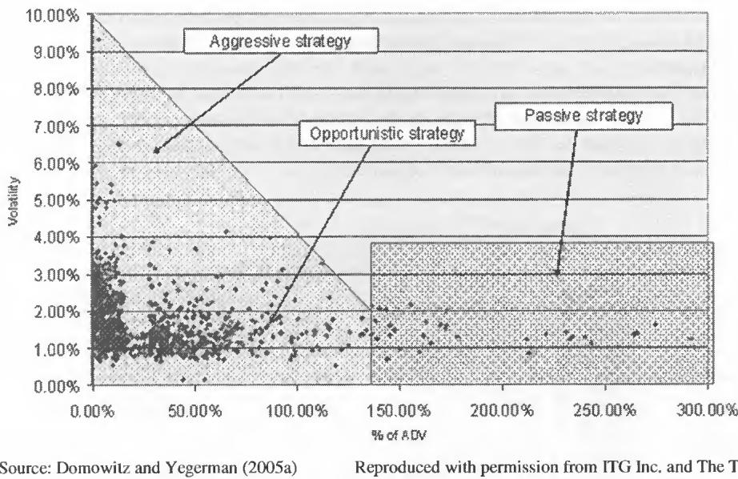  
Figure 12-8 Volatility versus percentage of ADV

As we saw in Chapter 7, volatile assets suit a more aggressive trading style, countering the associated timing risk. This is also helped by the small order size, which means lower market impact costs. Hence, Domowitz and Yegerman proposed an aggressive strategy for such orders. For example, we might use an implementation shortfall algorithm.

Converscly, for the larger orders a more passive approach makes sense, to try to reduce the overall market impact. Similarly, since the volatility of these assets is lower, the price risk will not he as significant. So a VWAP over the whole day may be an appropriate choice. That said, timing risk comprises of both price risk and liquidity risk, so liquidity can also be a considcrable factor for largc orders, as Domowitz and Yegerman point out. Thus, opportunistic trading may also be appropriate, depending on the uncertainty of the transaction cost estimates. Those orders, which are more than $40 \%$ of the ADV trading, may span multiple days. In such cases, a more aggressive strategy may be suitable for the first day, followed by more passive trading on any subsequent days.

Between thesc two extremes are orders that may be suitable lor more opportunistic trading. In terms of trading algorithms, this might range from a VWAP with a short horizon, a percent of volume or a pricc inline. Alternatively, an implementation shortfall or even a liquidity-based algorithm might be used. The choice also depends on other factors such as investor risk aversion, liquidity and price momentum.

# Standard trading algorithms and portfolio risk

Clearly, trading algorithms designed for cxecuting single assets have no consideration of portfolio risk. They are solely focussed on optimising the cxecution of their individual orders. So the trader handling the list will have to do this manually. They may decide to split it into wavcs (or slices), each weighted to try to maintain the diversification. Alternatively, the riskicr assets might be handled first; so trading algorithms may also be selected based on whether they are optimal for the portfolio as a whole, rather than for a specific order.

Only the simplest schedule-driven approaches, such as TWAP, provide a consistency of trading across the whole portfolio. For instance, if al the orders are traded using TWAP, we know that halfway through trading we should have $50 \%$ of the desired positions for each and every constituent.

In comparison, using more dynamic algorithms will often lead to a shift in the portfolio composition as they are traded. For example, Figure 12-9 shows how different the resultant trading schedules can be for a range of orders using an implementation shortfall (IS) algorithm (in this case Instinet's Wizard algorithm).

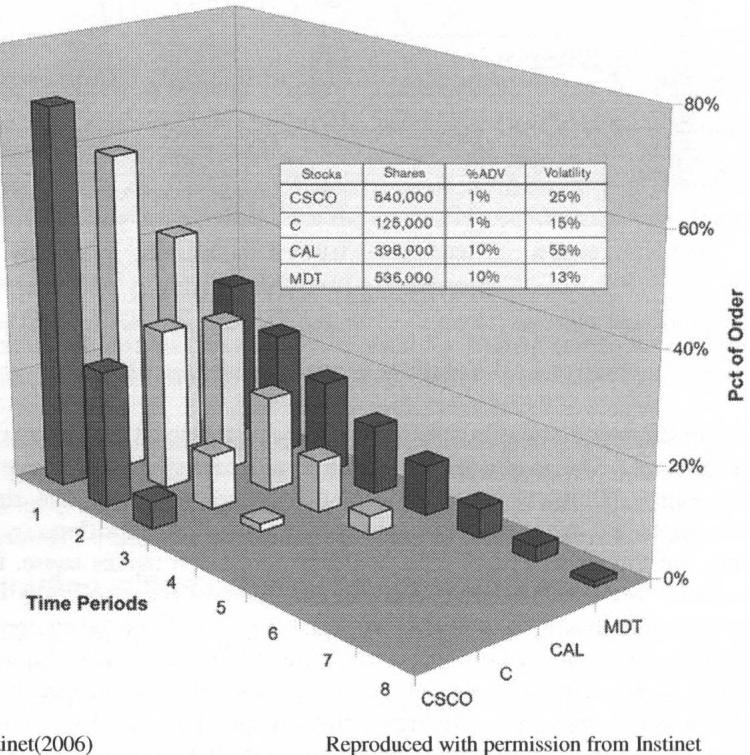  
Figure 12-9 Example implementation shortfall schedules

Since the implementation shortfall algorithm is trying to adopt the optimal trading strategy for each order, the resultant trading patterns are clearly very different. The larger orders (in terms of percentage of ADV) are allowed longer to trade to reduce the market impact, whilst a more aggressive approach is taken for the volatile assets to reduce timing risk. So, for this example, the relatively small orders for Cisco (CSCO) and Citigroup (C) should complete first, with the more volatile Cisco traded fastest. Next to complete should be the order for Continental Airlines (CAL), whose high volatility means that aggressive trading is required. Finally, the order for Medtronic (MDT) takes the longest, since its relatively low volatility allows the order to be traded more passively.

Taken in turn, each of these schedules may well be the optimal trading strategy for the corresponding order. Still,this does not necessarily mean it is the best trading strategy for the portfolio as a whole. Diversification is heavily dependent on portfolio makeup. So a significant change in the relative portfolio positions could lead to a considerable shift in the porfolio risk. For instance, let's compare the example portfolio in Figure 12-9 between time periods I and 3. Initially, the largest outstanding position is for Cisco, followed by Medtronic, Continental Airlines and finally Citigroup. By following the target schedules, at the start of period 3 the position for Cisco has fallen to be only the third largest position, just above Citigroup. So the residual portfolio is now dominated by Medtronic and Continental Airlines. Hence, the overall portfolio risk may be very different between these two periods.

Unsurprisingly, this problem is not unique to shortfall-based algorithms. Other trading algorithms will also face this issue, since trading is unlikely to be evenly balanced across the porlfolio. In particular, this concerns dynamic algorithms that are driven by market conditions. It also alfects schedule-driven algorithms like VWAP, since there is no guarantec that the volume profiles for the various assets will be similar enough to preserve the portfolio mix. Hliquid assets will also lag behind more actively traded ones. Again, this could reduce the overall divcrsification. Thus, a more aggrcssive trading strategy may be necessary to compensate for this.

Note that this issue is not just restricted to algorithm choice. A similar problem arises for portfolios that span multiple countries. Although marketplaces such as Europe are becoming more uniform, there can still be slight differences in market open and close times. Thus, some orders might begin trading before others, causing an imbalance. Explicit start and end times may be set to prevent this, although this obviously reduces the potential trading horizon. Things become even more complex for truly global portfolios where the time-zone differences make simultaneous trading difficult (if not imposible). For instance, during the European morning just after the Asian markets have closed and before the U.S. have opencd.

However, maintaining a consistently weighted portfolio is not necessarily the best way to minimise portfolio risk. In fact, all it does is ensure that the portfolio risk stays consistent. Instead, we nced to cvaluate each order to determine how much it contributes to the ovcrall risk. To minimise this overall risk we therefore need to focus on reducing the positions of thosc asscts that contribute the most. Also, note that the largest risk contributors will not necessarily be the orders for the riskiest assets, since natural hedging will occur betwecn the assets in the portfolio. So instead of selecting the optimal algorithm based on the specific order requirements we should try to determine the best approach for the entire portfolio.

# Tailoring algorithms for portfolio trading

Customising trading algorithms to incorporate portfolio risk makes a lot of sense. Although hedging requirements can prove quite complex, the potential risk reduction and related cost savings can be substantial.

Extending cxisting trading algorithms to incorporate portfolio models has been a typical (and logical) solution. As demand grows, some vendors are also creating sophisticated new algorithms, designed from the ground up to cater for portfolio trading.

An alternative approach is offered by Robert Kissell, Andrew Freyre-Sanders and Carl Carric (2005). They describe an "algorithm of algorithms" which manages the portfolio trading rcquirements whilst individual algorithms may still be used for each constituent order. The macro/micro-level split is similar to the division of labour we adopted between trading algorithms and execution tactics in Chapter 5. This offers the prospect of reusing existing single asset trading algorithms to provide a wide variety of trading styles.

In the following sections, we shall outline these two main approaches in some more detail. As the market for algorithmic portfolio trading grows, it will be interesting to see what other variants appear in the future.

# Algorithms incorporating portfolio risk models

We can incorporate portfolio risk models into rading algorithms by extending existing algorithms or by creating new portfolio specific algorithms from scratch. Either way, shortfall-based algorithms, with their inbuilt cost models, provide a good starting point.

The core of any such approach is a centralised portfolio risk model. One way of achieving this is to have the algorithm for each constituent asset tracking a combination of its own market impact modcl together with this shared portfolio risk model. Thus, each algorithm is able to make decisions that take into account all the other current portfolio positions. Correlations between the assets may also be used to find natural hedges, and so maximise diversification. Adjustments may be made to try to preserve these relationships, minimising the overall portfolio risk. Since the portfolio risk must be re-evaluated as positions change, this also allows traders to take advantage of other opportunities, such as blocks Irom crossing networks.

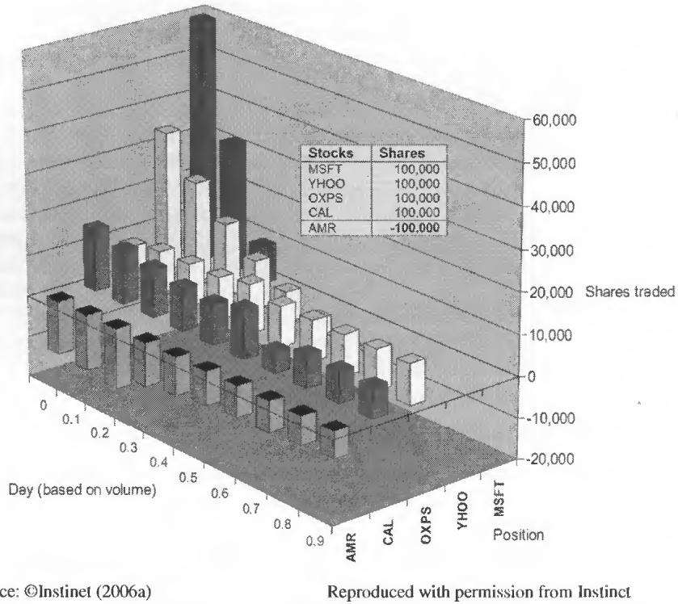  
Figure 12-10 Example portfolio optimised implementation shortfall schedules

For instance, Figure 12-10 shows an example two-sided portfolio, each order is traded in parallel using a portfolio optimised implementation shortfall algorithm (in this case Instinet's Wizard PRO 2 which incorporates Northfield Information Services' short-term factor risk model). Each algorithm adjusts its own optimal strategy based on correlations with the other constituents in order to help minimise the overall portfolio risk.

In this example, the two airline stocks, Continental Airlines (CAL) and the AMR Corporation (AMR), are highly correlated. Hence, these orders actually act as effective hedges for cach other since both CAL and AMR have similar prices and we are buying and selling equivalent amounts. The risk reduction achieved from this hedging allows us to trade them more passively, despite them being reasonably volatile stocks. As we ean see in Figure 12-10, the trading for both orders is spread throughout the day, helping to reduce their market impact.

A similar level of correlation exists between Microsoft (MSFT) and Yahoo (YHOO). Though, sinee these are both buy orders the resultant sector concentration could aetually increase the potential portfolio risk. Thus, both of these orders are executed reasonably quickly, more like a typical implementation shortfall algorithm. The illiquid Options Xpress (OXPS) has no natural hedges in the portfolio, so it left to trade throughout the day, primarily to minimise impact costs.

Clearly, if we compare this with a purely implementation shortfall based approach, which we saw back in Figure 12-9, one of the most noticeable differences is the fact that many of the orders are now traded throughout the day. This is because of the risk reduction afforded by diversification. It allows for more passive trading, to try to reduce the market impaet costs.

Another way of viewing the effectiveness of portfolio-optimised algorithms is to eompare their performance in terms of risk. For instance, Figure 12-11 shows an example from Olivier Thiriet (2006) at Credit Suisse. This charts the tracking error for a portfolio of 214 Japanese stocks, with 104 buys, worth $\$ 20$ million, and 110 sells, worth $\$ 22$ million. Their customised PHD (Portfolio Hedging Device) algorithm achicves a lower tracking error than using standard single asset market inline (effectively POV) algorithms, and much less than the ubiquitous VWAP.

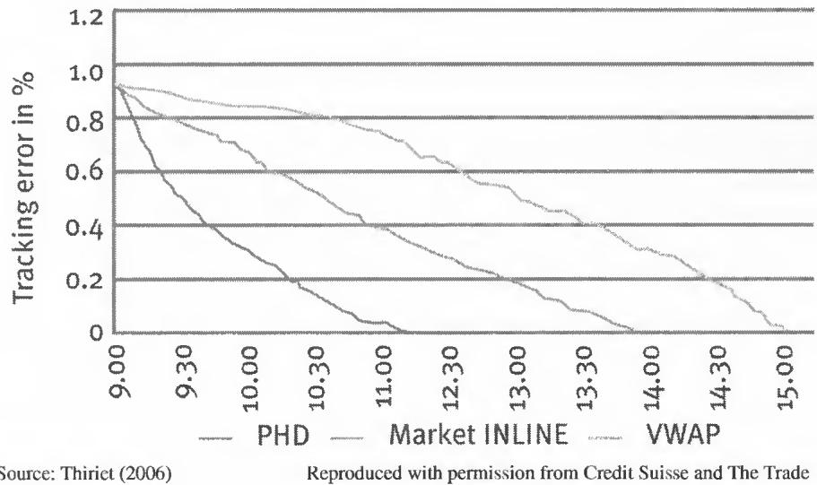  
Figure 12-11 Comparing portfolio risk for a range of different algorithm types

# An "algorithm of algorithms"

The "algorithm of algorithms" is a portfolio-focussed approach outlined by Kissell, Freyre

Sanders and Carrie (2005). It is responsible for managing the portfolio trading requirements whilst individual algorithms are still used for each constituent order. Therefore, a portfolio algorithm can track the overall risk, issuing adjustments to alter the trading patterns of the algorithms for the portlolio constituents.

This innovative approach should allow single asset trading algorithms to be used for optimal portfolio trading with the minimum of changes. The primary requirement is that they support dynamic updates of their parameters, allowing the portfolio algorithm to dynamically control them. Therefore, instead of adopting a "one size fits al" approach we can usc the algorithm that is most appropriate for each constituent order, given factors such as the asset's volatility and the order's size. Thus, a porfolio might employ of a range of POV, VwAP, implementation shortfall or liquidity-based algorithms. The standalonc portfolio algorithm tracks the progress of each of these orders, adjusting them when it becomes necessary in order to maintain the minimum overall risk.

Obviously, some algorithms are more suited to this approach than others. The target participation rate of POV algorithms makes them extremely easy to control, since the portfolio algorithm can alter the trading pattern simply by increasing or decrcasing this target. A similar approach may be taken with algorithms with support a tilt factor, such as some TWAP or VWAP variants. For shortfall-based algorihms, the risk aversion parameter could be updaicd to trigger more or less aggressive trading. Alternatively, the portfolio algorithm could also slow algorithms down by setting, or modifying, price limits.

Over time, as the portfolio risk prolile changes, the most appropriate algorithm for a constituent order might also change. So the porfolio algorithm might need to canccl the order for the original algorithm and replace it with a new order for the residual position. Thus, portfolio constituents might be swapped from a VWAP algorithm to a shortfall or liquidity based one.

In terms of the actual portfolio algorithm, clearly this nccds to carefully track the portfolio risk of the residual positions, as well as determining the optimal trading strategy for each constituent order. In addition, it necds to ensure that the projccted savings achicved from diversification outweigh any incurred by altering each individual order's optimal trading strategy.

An approach that lends itself well to this is based on the marginal contribution to risk (MCR) measure, as described by Bystrik and Johnson (2005). By determining the MCR for each constitucnt, we can quantify their effect on the portfolio risk. Hencc, positions that have a large positive MCR should ideally be reduced sooner, whilst thosc with a negative MCR should be preserved sinec they are actually helping offset the overall risk. These adjustments may then be applied to the constituent trading algorithm.

For example, Figure 12-12 illustrates how the target participation rate might be varied over time for a range of different risks. Initially, the target participation ratcs are raised for the constituents that have a positive MCR, whilst they are lowered for those with a negative one. As trading progresses, the urgency to trade those with a positive MCR decrcases, whilst it becomes morc important for the others to catch up.

Also, notice that no adjustments are needed for the constituents that have a negligible contribution to risk. Alternativcly, where two constituents with different liquidities both have a similar positive MCR, it may be more cost effective to trade the liquid one faster, since aggressive trading of the illiquid one could lead to prohibitive costs.

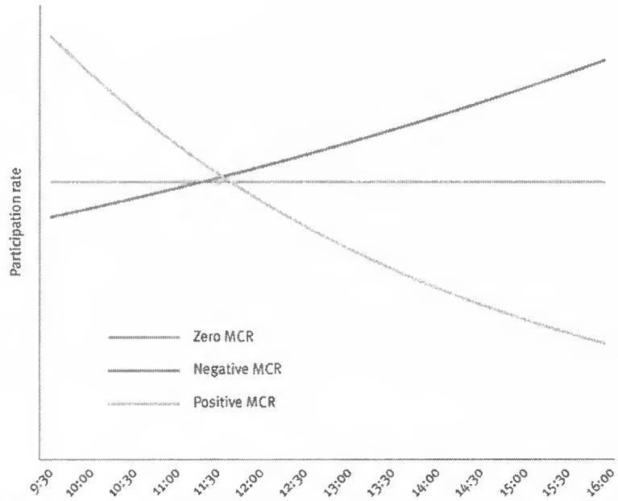  
Source: Bystrik and Johnson (2005) Reproduced with permission from Miletus Trading and The Trade   
Figure 12-12 Participation rates based on marginal contribution to risk

# 12.6 Summary

Portfolio trading provides a cost-effeclive means of trading whole baskets of assets Signilicant risk reductions can be achieved by tracking and managing portfolio risk.

Portfolio volatility is simply the standard deviation of the portfolio's returns. Howcver, the relationship between overall risk and each portfolio constitucnt is non-linear. Each constitucnt's contribution to the overall risk depends on its proportion/weight in the portfolio, the variancc of its returns and the covariance of its returns with all olher assets in the porfolio.

Diversification reduces portfolio risk, it occurs because the individual risks can olfset one another. Simply increasing the number of assets can reduce the ovcrall risk.

Portfolio risk may also be dccomposed into: Systematic benchmark (or market) risk Non-systematic (or asset specific) risk, which may be reduccd by diversification

Portfolio managers may havc additional trading goals, since they might also track risk in terms of other components, such as market, sector or country risk:

Cash balancing Beta/Market neutrality

Sector/Country ncutrality Minimising index tracking error

Optimal portfolio trading lowers portfolio risk by reducing the positions of thosc asscts that contribute the most. Note that the largest risk contributors will not necessarily be the orders for the riskiest assets, due to natural hedging.

Conventional trading algorithms may easily be used for trading portfolios. Though, dynamic algorithms will ofien lead to a shift in the portfolio composition since portfolio risk is not considered.

Porttolio optimised algorithms need to track risk for the whole portlolio. There are two main ways of doing this:

Extending existing algorithms to incorporate portfolio models Adopting an "algorithm of algorithms" to manage the portfolio trading rcquirements whilst individual algorithms are still used for cach constituent order

Covariance is just a measure of how much two variables $I$ and $J$ vary together:

$$
C o \nu \left( I , J \right) = E { \left( ( I - \mu ) ( J - \nu ) \right) }
$$

where the function $E ( )$ reprcsents the expected value (or mean), and variables $\mu$ and $\nu$ arc the respective mean values for variables $I$ and $J$ A positive covariance means that the two items vary together, so if the value of $I$ is more than its average then it is likely that $\jmath$ will also have a higher than normal value. Conversely, a negative covariance means that they behave in opposite fashions, so a high value for one implies a lower expected value for the other. A covariance of zero shows that the items are completely independent, so no inference may be made from either value.

Sometimes the relationship between variables is compared using the correlation coefficient $( \rho )$ . Essentially, this is their covariance divided by the product of their standard deviations:

$$
\rho _ { i , j } = \frac { C o \nu ( I , J ) } { \sigma _ { i } \sigma _ { j } } = \frac { E ( ( I - \mu _ { i } ) ( J - \mu _ { j } ) ) } { \sigma _ { i } \sigma _ { j } }
$$

where $\mu _ { i } , \ \mu _ { j }$ and $\sigma _ { i } , \ \sigma _ { j }$ are the means and standard deviations of variables $I$ and $^ { J }$ respectively.

Example 12-3: Let's determine the covariance between the four assets whose sample prices are shown in Table 12-8.

<table><tr><td rowspan=2 colspan=1>Asset</td><td rowspan=1 colspan=10>Price series</td><td rowspan=2 colspan=1>μ</td><td rowspan=2 colspan=1>^</td></tr><tr><td rowspan=1 colspan=1>1</td><td rowspan=1 colspan=1>2</td><td rowspan=1 colspan=1>3</td><td rowspan=1 colspan=1>4</td><td rowspan=1 colspan=1>5</td><td rowspan=1 colspan=1>6</td><td rowspan=1 colspan=1>7</td><td rowspan=1 colspan=1>8</td><td rowspan=1 colspan=1>9</td><td rowspan=1 colspan=1>10</td></tr><tr><td rowspan=1 colspan=1>A</td><td rowspan=1 colspan=1>3.50</td><td rowspan=1 colspan=1>3.50</td><td rowspan=1 colspan=1>3.28</td><td rowspan=1 colspan=1>3.34</td><td rowspan=1 colspan=1>3.69</td><td rowspan=1 colspan=1>3.86</td><td rowspan=1 colspan=1>3.58</td><td rowspan=1 colspan=1>3.69</td><td rowspan=1 colspan=1>3.12</td><td rowspan=1 colspan=1>3.17</td><td rowspan=1 colspan=1>3.47</td><td rowspan=1 colspan=1>0.06</td></tr><tr><td rowspan=1 colspan=1>B</td><td rowspan=1 colspan=1>4.41</td><td rowspan=1 colspan=1>4.42</td><td rowspan=1 colspan=1>4.28</td><td rowspan=1 colspan=1>4.34</td><td rowspan=1 colspan=1>4.69</td><td rowspan=1 colspan=1>4.86</td><td rowspan=1 colspan=1>4.58</td><td rowspan=1 colspan=1>5.00</td><td rowspan=1 colspan=1>4.22</td><td rowspan=1 colspan=1>4.03</td><td rowspan=1 colspan=1>4.48</td><td rowspan=1 colspan=1>0.09</td></tr><tr><td rowspan=1 colspan=1>C</td><td rowspan=1 colspan=1>5.42</td><td rowspan=1 colspan=1>5.54</td><td rowspan=1 colspan=1>5.58</td><td rowspan=1 colspan=1>5.68</td><td rowspan=1 colspan=1>5.44</td><td rowspan=1 colspan=1>5.03</td><td rowspan=1 colspan=1>5.82</td><td rowspan=1 colspan=1>5.93</td><td rowspan=1 colspan=1>5.61</td><td rowspan=1 colspan=1>5.94</td><td rowspan=1 colspan=1>5.60</td><td rowspan=1 colspan=1>0.07</td></tr><tr><td rowspan=1 colspan=1>D</td><td rowspan=1 colspan=1>6.42</td><td rowspan=1 colspan=1>6.54</td><td rowspan=1 colspan=1>6.58</td><td rowspan=1 colspan=1>6.34</td><td rowspan=1 colspan=1>6.69</td><td rowspan=1 colspan=1>6.86</td><td rowspan=1 colspan=1>6.58</td><td rowspan=1 colspan=1>6.93</td><td rowspan=1 colspan=1>6.30</td><td rowspan=1 colspan=1>6.94</td><td rowspan=1 colspan=1>6.62</td><td rowspan=1 colspan=1>0.05</td></tr></table>

# Table 12-8 Sample time series for covariance calculation

Tablc 12-9 shows the intermediate calculations for determining the covariance between the prices of assets A and B. $\Delta _ { \mathrm { A } }$ corresponds to the series of differences to the mean $( \mu )$ .

Table 12-9 Sample intermediate calculations for covariance   

<table><tr><td rowspan=2 colspan=1></td><td rowspan=1 colspan=10>Series</td></tr><tr><td rowspan=1 colspan=1>1</td><td rowspan=1 colspan=1>2</td><td rowspan=1 colspan=1>3</td><td rowspan=1 colspan=1>4</td><td rowspan=1 colspan=1>5</td><td rowspan=1 colspan=1>6</td><td rowspan=1 colspan=1>7</td><td rowspan=1 colspan=1>8</td><td rowspan=1 colspan=1>9</td><td rowspan=1 colspan=1>10</td></tr><tr><td rowspan=1 colspan=1>ΔA</td><td rowspan=1 colspan=1>0.02</td><td rowspan=1 colspan=1>0.03</td><td rowspan=1 colspan=1>-0.19</td><td rowspan=1 colspan=1>-0.13</td><td rowspan=1 colspan=1>0.22</td><td rowspan=1 colspan=1>0.39</td><td rowspan=1 colspan=1>0.11</td><td rowspan=1 colspan=1>0.22</td><td rowspan=1 colspan=1>-0.35</td><td rowspan=1 colspan=1>-0.30</td></tr><tr><td rowspan=1 colspan=1>∆B</td><td rowspan=1 colspan=1>-0.07</td><td rowspan=1 colspan=1>-0.07</td><td rowspan=1 colspan=1>-0.20</td><td rowspan=1 colspan=1>-0.14</td><td rowspan=1 colspan=1>0.21</td><td rowspan=1 colspan=1>0.38</td><td rowspan=1 colspan=1>0.10</td><td rowspan=1 colspan=1>0.52</td><td rowspan=1 colspan=1>-0.26</td><td rowspan=1 colspan=1>-0.46</td></tr><tr><td rowspan=1 colspan=1>△A△B</td><td rowspan=1 colspan=1>0.00</td><td rowspan=1 colspan=1>0.00</td><td rowspan=1 colspan=1>0.04</td><td rowspan=1 colspan=1>0.02</td><td rowspan=1 colspan=1>0.05</td><td rowspan=1 colspan=1>0.15</td><td rowspan=1 colspan=1>0.01</td><td rowspan=1 colspan=1>0.11</td><td rowspan=1 colspan=1>0.09</td><td rowspan=1 colspan=1>0.14</td></tr></table>

The sample covariance for assets A and B is equal to the sum $\Sigma ( \Delta _ { \mathrm { A } } \Delta _ { \mathrm { B } } )$ adjusted by dividing by $( n \ – \ I )$ where $n$ is the sample size:

This process is then repeated for all the other possible combinations.

Note that $C o \nu ( \mathbf { A } , \mathbf { B } ) = C o \nu ( \mathbf { B } , \mathbf { A } )$ , similarly $C o \nu ( \mathbf { A } , \mathbf { A } ) =$ Variance(A) or $\sigma ^ { 2 }$ as shown in Table 12-8. Hence, the covariancc malrix $\left( \Omega \right)$ for this example set may be delined as:

$$
\Omega = \left( \begin{array} { c c c c } { { 0 . 0 6 } } & { { 0 . 0 7 } } & { { - 0 . 0 3 } } & { { 0 . 0 2 } } \\ { { 0 . 0 7 } } & { { 0 . 0 9 } } & { { - 0 . 0 2 } } & { { 0 . 0 3 } } \\ { { - 0 . 0 3 } } & { { - 0 . 0 2 } } & { { 0 . 0 7 } } & { { 0 . 0 1 } } \\ { { 0 . 0 2 } } & { { 0 . 0 3 } } & { { 0 . 0 1 } } & { { 0 . 0 5 } } \end{array} \right)
$$

# Chapter 13

# Multi-asset trading

Multi-asset trading is nothing new; however, trading between different asset classes poses a whole new set of issues for trading algorithms.

# 13.1 Introduction

Multi-asscl rading is staring to attract nearly as much hype as algorithmic trading. In its simplest form, it means single systems that allow investors and traders to manage trading across multiple asset classes. Though, in terms of algorithmic trading the most interesting prospect is cross-asset trading. This ofers the potential of simultaneously trading a wide variety of different asset types using a single trading strategy.

Historically, the world markets have been highly segmenled, both regionally and across asset classes. Electronic trading has helped open up markets, allowing a much broader range of access. Trading any asset globally is rapidly becoming a straightforward technical issuc. Increasing numbers of order (OMS) and execution management systems (EMS) now provide unified platforms that enable trading across a range of asset classcs. Similarly, communications protocols such as FIX have expanded to cater for equities, bonds, FX and an array of derivatives.

Hedge funds are arguably the principal driver behind the current trend towards multi-asset trading. Their strategies are becoming inereasingly complex as they constantly seek new sources of profit, or alpha. Risk management has also becomc progressively more sophisticated in its use of derivatives for hedging. Consequenly, the overall buy-side use of derivatives has spiralled over the last few years, leading to increased demand for multi-asset support.

The sell-side has had to evolve to cope with a new era of lower margins and higher volumes. Many firms havc started reorganizing themselves; the old asset class silos are disappearing. Equities and derivatives businesses are merging, in some cases even fixed incomc and cquities desks are integraling. Sales desks are becoming more customerfocussed, able to cater for trading a wide range of assets. The aim is to try to achieve greater efficiencics of seale and so reduce the overall costs. Cross-asset trading strategies also offer them a significant mcans of differentiation, as well as the benefits associated with being firstto-market.

Competition amongst execution venues is also helping. As we saw in Chapter 3, the competition is now truly global and has even started to span across asset classes. Exchanges are increasingly catering for equities, derivatives and even fixed income trading. For example, both NYSE and NASDAQ have expanded to offer trading in ETFs, futures and options. The NYSE has even relaunched its bond-trading platform. Many of the European and stock exchanges also handle bonds, whilst some of the Nordic exchanges also cater for derivatives. In Asia, Australia, Korea and Singapore have all seen mergers between their stock and derivatives cxchanges. Likewise, the major derivatives exchanges have started hranching out into other asset classes as well. For instance, Eurex also caters for bond trading whilst the ISE has created its own stock market. Competition is also increasing hetween the "dark pool" ATSs. Indeed, if some of the newer ATS entrants in FX and options prove successful, we may sec mcrgers and takeovers in this arena as wcll.

Regulations will also play an important part in the expansion of multi-asset trading. In Europe, MiFlD means that regulations now span across a broad section of asset classes, which should help clear the way for cross-asset trading. Though, in the U.S. the disparate regulatory bodies mcan that it may he more complicated, as evidenced with dilficulties over newer assets such as ETFs and single stock futures.

Another factor that will be crucial to the growth of multi-asset trading is the provision of unified mechanisms for clearing and setlement. Prime brokerage serviccs will need to cxpand across the various assct classes. Neting agrecments for collateralization and margin requirements will also have to encompass a much wider range of assets.

Although the divisions betwcen the world's markets are hecoming increasingly blurred, the exact outcomc of all this change is still uncertain. At present, very few cxecution venues actually provide cross-assel trading. Some of the reasons for this are highlighted in an article by Ivy Schmerken (2006): Many exchanges still run separate plaiforms and matching engines for each asset class, some may have half a dozen different systems. Whilst there may he interest, the demand has still not heen sufficient to justify the expense of merging thesc systems. That said, as exchanges migrate to new platforms support for multiple asset classes is becoming a key consideration. Another important factor is that whilst linked orders may he convenient, such "one-stop shopping" runs counter to broker's best-exccution ohligations. In the shorl-term, many of the cross-asset trading solutions are likely to be from brokers and other third-partics. Complex orders can easily be split into multiple legs and routed to different venues. Reduced latencies have also helped to reduce the lcgging risk for such strategies. Hence, it is likely that for the foreseeable future much of the innovation in crossasset trading will be provided by specialised algorithms/platforms as brokers seek to continue to differentiate themselves with new value-added services.

# 13.2 Multi-asset trading strategies

Despite all the hype, cross-asset trading is nothing new. Cash positions in stock, bonds and commoditics have been hedged with futures and options ever since the creation of derivative contracts. The ability to protect against a broad spectrum of risks has made derivatives a virtually indispensable tool. Cross-asset arbitrage is nothing new, either. In particular, index arbitrage and basis trading have been around for decades. Though, the high cost of entry has meant that historically such arbitrage has been monopolised by market makers, dealers and proprietary traders. More recently, electronic trading has helped lower the cost of entry. Easier access and dccreasing transaction costs have made cross-asset trading viable for a much wider range of investors and traders. On the downside, it has also suhstantially reduced the timescales; many opportunitics might now only last minutes, seconds or even less.

Ten years ago, the precursors of modern trading algorithms were elficicncy tools, helping traders cope with the ever-increasing order flow. Finally, they werc packaged up into discrete strategies and made available to clients as trading algorithms. Dcalers' hedging and arbitrage systems arguably contain a lot more proprietary techniques. However, there is no real reason why the more established ones could not undergo a similar transformation. In fact, several broker dealers have already started releasing algorithms that provide hedging and other types of cross-asset trading. Similarly, hedge funds and other investment institutions have begun creating their own dedicated algorithms, to protect their own proprietary techniques. Vendors have already started to provide platforms geared up for this, for example, Flextrade, Progress Apama and AlgoTrader's OptimEx.

Unlike for existing trading algorithms, it is slightly more difficult to predict exactly what future multi-asset algorithms might look like. Broadly speaking, we can use some of the existing types of trading as a basis, as outlined in Table 13-1:

Table 13-1 Some examples of cross-asset trading types   

<table><tr><td rowspan=1 colspan=1>Strategy type</td><td rowspan=1 colspan=1>Examples</td><td rowspan=1 colspan=2>Assets involved</td></tr><tr><td rowspan=2 colspan=1>Utility</td><td rowspan=1 colspan=1>FX cash trades</td><td rowspan=1 colspan=1>Stock</td><td rowspan=1 colspan=1>FX</td></tr><tr><td rowspan=1 colspan=1>Covering short sales</td><td rowspan=1 colspan=1>Stock</td><td rowspan=1 colspan=1>Stock Lend/Rev repo</td></tr><tr><td rowspan=1 colspan=1>Structured</td><td rowspan=1 colspan=1>Principal protected notes</td><td rowspan=1 colspan=1>Bond</td><td rowspan=1 colspan=1>Option</td></tr><tr><td rowspan=3 colspan=1>Hedging</td><td rowspan=1 colspan=1>Hedging market risk</td><td rowspan=1 colspan=1>Stock/s</td><td rowspan=1 colspan=1>Future/s</td></tr><tr><td rowspan=1 colspan=1>Hedging interest rates</td><td rowspan=1 colspan=1>Bond/s</td><td rowspan=1 colspan=1>Future/s</td></tr><tr><td rowspan=1 colspan=1>Hedging the &quot;Greeks&quot;</td><td rowspan=1 colspan=1>Option/s</td><td rowspan=1 colspan=1>Stock/s</td></tr><tr><td rowspan=6 colspan=1>Arbitrage</td><td rowspan=1 colspan=1>ADR arbitrage</td><td rowspan=1 colspan=1>DR</td><td rowspan=1 colspan=1>Stock</td></tr><tr><td rowspan=1 colspan=1>Basis trading</td><td rowspan=1 colspan=1>Future/s</td><td rowspan=1 colspan=1>Bond/s</td></tr><tr><td rowspan=1 colspan=1>Index arbitrage</td><td rowspan=1 colspan=1>Future/s</td><td rowspan=1 colspan=1>Stocks</td></tr><tr><td rowspan=1 colspan=1>Option arbitrage</td><td rowspan=1 colspan=1>Options</td><td rowspan=1 colspan=1>Stocks/Bonds</td></tr><tr><td rowspan=1 colspan=1>Futures and options arbitrage</td><td rowspan=1 colspan=1>Options</td><td rowspan=1 colspan=1>Future/s</td></tr><tr><td rowspan=1 colspan=1>Dividend arbitrage</td><td rowspan=1 colspan=1>Stock</td><td rowspan=1 colspan=1>Option/s</td></tr></table>

The utility strategies are relatively straightforward additions, such as incorporating FX cash trades with stock trading in order to facilitate cross currency trading or covering short sales using stock lending or reverse repos.

Structured products are combinations of cash and derivative assets designed to meet specific investment objectives, such as enhancing returns or reducing risk. The more straightforward products, such as principal protected notes, may well form the basis for some multi-asset trading strategies.

Likewise, hedging provides a mechanism for offsetting risk, generally via derivatives. Although this is often simply applied to existing positions, hedging may also be used in tandem with normal trading, such as for porifolio transitions. Hedging also forms the backbone of many of the arbitrage techniques that seek to extract risk-free profits when price imbalances occur.

Note that a reasonable grasp of derivatives is important for many of these trading strategies. So if you are new to these instruments, it may be worth rereading the corresponding parts of Chapter 3 and Appendix E. Alternatively, for a more detailed review 'Understanding Futures Markets' by Robert Kolb and James Overdahl (2006) or Options, Futures, and Other Derivaives' by John Hull (2003) are both good starting points.

In the following sections, we shall look at each of these various strategy types before reviewing some of the key considerations for multi-asset trading algorithms.

# 13.3 Utility strategies

These are simple extensions of procedures, which are routinely carried out manually. For cxample, when trading assets dcnominated in forcign currencies we could automatc the FX cash trades. Aulomatic handling could also cover short salcs, by finding lending or reversc repos to borrow the required assct. As volumes continue lo inerease and tradcrs get busier the market for such conveniences may well expand.

# FX cash trades

When trading pairs or portfolios of asscts with multiplc currcncies the exchangc rates are an important consideration. Admittedly, setlemcnt currencies may often be spccified; however, any changes in the exchange rate could mcan scttling at a disadvantageous rate. Therclore, when trading asscts denominated in a different currency it may be appropriatc to also pcrform an FX cash trade, to ensurc there is a sulficient amount of local currcncy for settlement.

Trading systems may be extended to issue FX cash trades to match the value traded. Depending on the value and the volatility of the currency, this could hc carricd out automatically upon completion of the order. Aliernatively, the currcncy could be traded in parallel with the order. Existing trading algorithms could be extended to incorporatc currency handling, or it could be donc manually using DMA. The client may also want to perform this across multiple assets, so a nct currency position could be traded. This might be handled by the broker or, if execution information is sent back to the client in rcal-lime, they could take charge of this for themselves.

For example, Ict's consider a pairs tradc between the pharmaccutical firms Genentech (U.S.) and GlaxoSmithKline (U.K.) for $\$ 10$ million. The ratio algorithm will steadily build positions in the two companies. To ensure our U.K. sterling cash account is suflicient for settlement the algorithm could also incrementally issue FX cash orders for sterling bascd on the current sizc of our GlaxoSmithKline position. This might simply mcan issuing limit orders; alternatively, a separale algorithm could be uscd to handle the FX irading.

# Covering short sales

To sell short most cash assets we will usually need to cover the position by borrowing the asset, either via stock lending or reverse repos. As the markets for stock lending and repos becomc increasingly electronic this also opens up the possibility of automating short covering. Hence, an algorithm could scan the lending and/or repo markets to source the required asset. Sincc it may be more difficult to borrow the asset, thc short sale could even bc made dependent on the success of this transaction. It could evcn take account of the cost ol borrowing when placing the short scll orders to ensure the fccs arc covered.

# 13.4 Structured strategies

Structured products are synthetic assets created to meet specific investment rcquirements, such as enhancing the yield, increasing tax efficiency or reducing risk for a givcn asset. Financial enginccring is used to delcrminc the required combinations of cash and derivativc assels to mcct these objectives.

Structurcd products have primarily been targeted at retail investors, although usagc by institutional investors is also growing. Ovcr $\$ 100$ billion of new issucs were made in 2007 according to cstimates from the Structured Products Association (SPA) (2008). ' Indeed, their increasing popularity mcans they are starting to emerge as a separate asset class. Note that they are principally designed to be kept to maturity, so this is an OTC only marketplace with little or no sccondary trading.

Although structured products may be highly complex and tailored to the needs of a specific investor, there are also some increasingly common variants such as structured notes, as Chris Biscoc (2005) points out. Trading algorithms may well evolve which approximate to some of the more common or straightforward products.

# Principal protected notes

Principal protectcd notes offcr a guarantee to return a set percentage (usually $100 \%$ of the amount invested at maturity. As well as this, they also ofer the potential of additional returns, derivcd from the performance of other assct/s. Note that a participation rate may be sct on the enhanced returns, so the investor might receive 70 or $80 \%$ of them.

Equity linked notes are effectively deht instruments combined with an option on a specific stock or index. Thcy do not usually have any coupon payments; instead the returns at maturity arc based on the gains of the underlying equity. The investment amount is protected to maturity, although it is still cxposed to issuer default risk.

Intcrcst rate linked notes are based on the moves for market benchmark rates, such as Fed Funds or LIBOR. Range accrual notes only accrue interest on days when the reference rate is within a set rangc.

Currency (or FX) linked notcs augmcnt their returns from the performance of a currency, or basket of currencics. There are also range accrual notcs where interest is accrued only on days when the currcncy is within set bounds.

Hybrid linked notes even allow the performance to depend on multiple asset classes.

Many of these structurcd notes have a maturity of hetwcen 1-3 years. The basic principle behind them is to invcst in risk-free bonds which provide the protection. For instance, zero coupon bonds may be bought at a discount to achieve this. The rcmaining funds may be used to purchase derivatives to enhance the returns. This might be purchasing long-term call options for the required stock, currency or commodity. Alternatively, some structures may incorporate more exotic derivatives, such as barrier options.

As an example we might construct a $\$ 1$ million two year principal protected note by purchasing two year zero coupon Treasury notes with a notional of $\$ 1$ million. These are priced at 90, leaving $\$ 100,000$ to purchase two-year call options to provide the enhanccd rcturns. A customised trading algorithm could be used to link these two orders together.

# 13.5 Hedging strategies

Hedging is simply a mcchanism for offsetting risk. Since positions may be constantly exposed to market risk, hedging is effectively a continual cycle comprising of the following three stages:

analysing the various risks for existing positions dctermining what is required to counteract them issuing orders to achicve the target hedge positions

For cash asscts, such as stocks or bonds, hedging often uscs dcrivatives. Whilst for derivative positions the hedging may be based on the underlying assets, other derivatives or a combination of the two.

Transaction costs mean that it is not necessarily cost efective to constantly adjust the hedging positions. As always, it is a careful balancing act between risk and cost. That said, clectronic trading has made it much more viable to perform hedging in real-time.

For existing positions, investment firms alrcady maintain their own hedging, which may then he traded manually or via trading algorithms or DMA. For portfolio trades the brokers could also incorporate any required hedging, as we saw for FX cash trades. In Chapler 12, we saw that dedicated portfolio trading algorithms that incorporate portfolio risk are already available. Extending these to also handle hedging with derivatives is not that great a leap.

For example, consider an investment fund worth $\$ 1$ billion hedged with S&P 500 futures. A portfolio trade to increase the fund by $10 \%$ would need a corresponding increasc in the futures cover. So in addition to the portfolio of stocks the broker could also trade the additional futures for the hedging. Alternatively, if the broker is supplying frequent status updates, the buy-side traders could manage the futures hedging themselves, although they may be disadvantaged by any delays.

In the following sub-sections, we shall outline some of the commoner types of hedging which might he incorporated into custom algorithms.

# Hedging market risk

Futures can provide a cost-efficient means of hedging market risk, particularly for portfolios. For stock portfolios, an index future allows us to offset market risk. The number of futures contracts required ean be determined based on the overall beta of the portfolio $( \beta _ { P } )$ , using the lollowing equation:

$$
N u m b e r ~ o f ~ C o n t r a c t s = - \beta _ { P } ~ \frac { V _ { P } } { V _ { F } } = - \beta _ { P } \frac { V _ { P } } { P _ { F } \cdot m }
$$

where $V _ { P }$ and $V _ { F }$ are the corresponding market values of the portfolio and of a futures contract. The futures value may also be expressed in terms of its price $P _ { F }$ and its contract multiplier $m$ ,

Remember that the actual beta of a portfolio for a specific index may be determined by comparing its returns with thosc of the index, as we saw in Chapter 12. The portfolio beta $( \beta _ { P } )$ may in turn be derived from its covariance:

$$
\beta _ { p } = \frac { C o \nu ( r _ { p } , r _ { m } ) } { V a r ( r _ { m } ) }
$$

where $r _ { p }$ and $r _ { m }$ are the respective returns for the portfolio and the index.

Example 13-1: Let's assume we need to add $\$ 5$ million of S&P 500 stocks to our portfolio. To protect against a lalling market we can sell an equivalent number of September futures contracts. For convenience, we will base this on their closing value (1,559.7) with a multiplier of $\$ 250$ point. Since this is a basket of S&P stocks, we shall assume the beta is 1.0.

Using equation 13-1, we get:

Number of contracts $= - \ \ S 5 , 0 0 0 , 0 0 0 / \left( \ S 2 5 0 * 1 , 5 5 9 . 7 \right) = - 1 2 . 8 2 \approx - 1 3$

Therefore, selling 13 futures contracts should provide suficient hedging for our portfolio. A month later, the S&P 500 fell from 1549.37 to 1445.94, whilst the futures price fell to 1449.9. Hcnce, the stock position sees a loss of nearly $7 \%$ or $\$ 33,456$ . Conversely, the value of the short futures hedge actually increased, due to the 109.8 drop in price. This equates to $\$ 250\times13\times(1559 .7 – 1449 .9 ) =\ S 3 56,850$

Table 13-2 summarises the market values at each date. Overall, the hedge worked: If we nceded to liquidate the portfolio in August, the losses realised from the stock sales would be more than compensated for by the gain from our futures.

Table 13-2 An example of short futures hedging   

<table><tr><td rowspan=1 colspan=1>Date</td><td rowspan=1 colspan=1>Position</td><td rowspan=1 colspan=1>MarketValue/$</td><td rowspan=1 colspan=1>NetValue/$</td></tr><tr><td rowspan=1 colspan=1>16 Jul</td><td rowspan=1 colspan=1>Stock portfolioS&amp;P 500 SEP futures</td><td rowspan=1 colspan=1>5,000,000-5,069,025</td><td rowspan=1 colspan=1>-69,025</td></tr><tr><td rowspan=1 colspan=1>17Aug</td><td rowspan=1 colspan=1>Stock portfolioS&amp;P 500 SEP futures</td><td rowspan=1 colspan=1>4,666,219-4,712,175</td><td rowspan=1 colspan=1>-45,956</td></tr></table>

Example 13-2: Let's now consider shorting a $\$ 5$ million basket of stocks. Compared to the S&P 500 the basket has a beta of 1.5. To protect against a rising market we wil need to buy more futures than before:

Numher of contracts $= - \ 1 . 5 * \ S \bar { \Phi } { - 5 , 0 0 0 , 0 0 0 } / \left( \ S 2 5 0 \mathrm { ~ ^ * ~ } 1 , 5 5 9 . 7 \right) = 1 9 . 2 3 \approx 1 9$

So in this case we need to huy 19 futures to hedge our short basket. The beta also means that the falling market wil probably have even more effect on this portfolio. Indeed, by the $1 7 ^ { \mathrm { t h } }$ August it is only worth $\$ 4,475,000$ . So if we were to buy back the stocks we could realise a profit of $\$ 525,000$ . However, these potential profits will be reduced by losses from the futures hedge. The market valucs and the $\beta \mathrm { . }$ -adjusted equivalents are shown in Table 13-3:

Table 13-3 An example of long futures hedging   

<table><tr><td rowspan=1 colspan=1>Date</td><td rowspan=1 colspan=1>Position</td><td rowspan=1 colspan=1>MarketValuel$</td><td rowspan=1 colspan=1>β-adjustedMarket Value/$</td><td rowspan=1 colspan=1>NetValue/$</td></tr><tr><td rowspan=1 colspan=1>16 Jul</td><td rowspan=1 colspan=1>Stock portfolioS&amp;P 500 SEP futures</td><td rowspan=1 colspan=1>-5,000,0007,408,575</td><td rowspan=1 colspan=1>-7,500,0007,408,575</td><td rowspan=1 colspan=1>2,408,575</td></tr><tr><td rowspan=1 colspan=1>17 Aug</td><td rowspan=1 colspan=1>Stock portfolioS&amp;P 500 SEP futures</td><td rowspan=1 colspan=1>-4,475,0006,887,025</td><td rowspan=1 colspan=1>-6,7t2,5006,887,025</td><td rowspan=1 colspan=1>2,412,025</td></tr></table>

Thc long futures position decreases in value by $2 5 0 \mathrm { ~ x ~ } 1 9 \mathrm { ~ x ~ } ( 1 5 5 9 . 7 - 1 4 4 9 . 9 ) = \ S 5 2 1 . 5 5 0$ . Thus, the hedging prevented us from realising any significant directional profits. More importantly, though, it protected us from any losses due to a rising market.

For instance, let's consider if the S&P had actually risen to 1600, and the SEP future to 1605. Our short stock position would instead be worth $\$ 5,250,000$ , effectively a loss of $\$ 250,000$ . This is offset by a gain of $\$ 215,175$ in the value of the futures position, as shown in Table 13-4. Although not perfect, this hedge has still provided an important insurance mechanism against markct moves.

Table 13-4 An alternative scenario for long futures hedging   

<table><tr><td>Date</td><td>Position</td><td>Market Value/$</td><td>β-adjusted Market Value/$</td><td>Net Valuel$</td></tr><tr><td rowspan="2">16 Jul</td><td>Stock portfolio</td><td>-5,000,000</td><td>-7,500,000</td><td rowspan="2">2,408,575</td></tr><tr><td>S&amp;P 500 SEP futures</td><td>7,408,575</td><td>7,408,575</td></tr><tr><td rowspan="2">17 Aug</td><td>Stock portfolio</td><td>-5,250,000</td><td>-7,875,000</td><td></td></tr><tr><td>S&amp;P 500 SEP futures</td><td>7,623,750</td><td>7,623,750</td><td>2,373,750</td></tr></table>

# Hedging interest rate risk

Fixed income assets are obviously affected by changcs in interest rates. When markct interest rates increase bond prices dccrease, and vicc versa. This is because the cash flows are fixed, so a higher intercst rate reduces their present value.

For a standard bond we may represent its current valuc $( V )$ as the sum of all its future cash flows $( C _ { i } )$ each discounted to their present value $( P ( i ) )$ based on the rate $( r )$

$$
V = \sum _ { i } P ( i ) = \sum _ { i } C _ { i } e ^ { - r \Delta T _ { i } }
$$

where $T _ { i }$ is the timc left to maturity for each payment (in years). Note the rate $( r )$ is effectively the yield to maturity (YTM) of the bond. It represents the overall interest rate that would be earned by buying it at the current market price and holding to maturity.

Example 13-3: Let's consider a 2-ycar bond with an annual coupon of $5 \%$ for a notional value of $\$ 100,000$ It is priced such that its yield to maturity (YTM) is also $5 \%$

So at the end of the first year we receivc a coupon of $\$ 5,000$ , which has a current value of $( 5 , 0 0 0 \mathrm { ~ ^ { * } e ~ ^ { - 0 . 0 5 ^ { * } l } } ) = \ S 4 , 7 5 6$

At the end of the second year, we receive both the final coupon payment and the full notional amount. This gives a total eurrent value of $\$ 99,764$ , shown in Table 13-5.

Table 13-5 Calculating value of a bond   

<table><tr><td rowspan=1 colspan=1></td><td rowspan=1 colspan=1></td><td rowspan=1 colspan=3>YTM=5.00%</td><td rowspan=1 colspan=1>YTM=5.01%</td><td rowspan=1 colspan=1>YTM=4.99%</td></tr><tr><td rowspan=1 colspan=1>Time(years)</td><td rowspan=1 colspan=1>Cashflow</td><td rowspan=1 colspan=1>Presentvalue</td><td rowspan=1 colspan=1>Weight</td><td rowspan=1 colspan=1>Weightedtime</td><td rowspan=1 colspan=1>Presentvalue</td><td rowspan=1 colspan=1>Presentvalue</td></tr><tr><td rowspan=1 colspan=1>1</td><td rowspan=1 colspan=1>5,000</td><td rowspan=1 colspan=1>4,756</td><td rowspan=1 colspan=1>0.05</td><td rowspan=1 colspan=1>0.05</td><td rowspan=1 colspan=1>4,756</td><td rowspan=1 colspan=1>4,757</td></tr><tr><td rowspan=1 colspan=1>2</td><td rowspan=1 colspan=1>105,000</td><td rowspan=1 colspan=1>95,008</td><td rowspan=1 colspan=1>0.95</td><td rowspan=1 colspan=1>1.90</td><td rowspan=1 colspan=1>94,989</td><td rowspan=1 colspan=1>95,027</td></tr><tr><td rowspan=1 colspan=1>Total</td><td rowspan=1 colspan=1></td><td rowspan=1 colspan=1>99,764</td><td rowspan=1 colspan=1>1</td><td rowspan=1 colspan=1>1.95</td><td rowspan=1 colspan=1>99,745</td><td rowspan=1 colspan=1>99,784</td></tr></table>

Now let's consider the situalion if interest rates increase by onc basis point (bps). The bond's yield to market will also increase to $5 . 0 1 \%$ . The present value of the second year payment is now $( 1 0 5 , 0 0 0 \mathrm { ~ ^ { * } ~ e ~ } ^ { - 0 . 0 5 0 1 ^ { * } 2 } ) = \ S 9 4 { , } 9 8 9$ , so he overall value of the hond decrases by $\$ 19$ . Conversely, if rates deerease by one basis point the value inereases to $\$ 99,784$ , or $\$ 20$

Thus, the average ehange in value for a 1 bps change in interest rates $= ( 1 9 { + } 2 0 / 2 0 ) =$ $\$ 19.5$ This risk measure is sometimes referred to as the PVBP (price value of a basis point), whilst if measured in dollars it is called the $D V 0 1$ (dollar value of a basis point change).

Alternativcly, we can use duration to represent the sensitivity of a bond to interest rate movements. This is inversely related to the coupon rate, so higher rate bonds have shorter durations, whilst for zero coupon bonds the duration is equal to their maturity. The duration $( D )$ may he expressed as the sum of the weighted maturities for the associated cash flows:

$$
D = \sum _ { i = 1 } ^ { n } { \frac { P ( i ) { \ } T _ { i } } { V } }
$$

For Example 13-3, the weight column in Tahle 13-5 is simply each present value divided by the total. Hence, the duration for the bond is 1.95 years when the yield to market is $5 \%$ .

These risk metrics may also be applied to portfolios of bonds, as a weighted sum based on the size of cach bond's position. Hull (2003) shows that the number of interest rate futures - $( N )$ required to hedge this risk may be determined using the following equation:

$$
N = - \frac { D _ { S } \cdot S } { D _ { F } \cdot F }
$$

where $D _ { S }$ is the duration of the portfolio (or bond) and $D _ { F }$ is the duration of the underlying (cheapest to deliver) bond for the future. The value of the portfolio is $s$ and the value of a future is $F$ . Alternativcly we can express this based on $D V 0 1$

$$
N = - { \frac { D V 0 \mathsf { I } _ { b o n d } } { D V 0 \mathsf { I } _ { f u u r e } } } \times { \frac { S } { F } }
$$

There are scveral ways to determine the $D V 0 1$ for a future, the easiest is to make an approximation based on the $D V 0 1$ of the most cconomical underlying asset, the "cheapest to deliver" (CTD). So the $D V 0 1 _ { f u t u r e }$ is in turn based on the $D V 0 1$ of this CTD bond and a conversion factor $( C F )$

$$
D V 0 1 _ { f u t u r e } = - { \frac { D V 0 1 _ { C T D } } { C F } }
$$

Example 13-4: A bond portfolio worth $\$ 10$ million has a $D V 0 1$ of $\$ 195$ . The current futures contract for a ten-year bond is priced at 94.20, with a notional of $\$ 100,000$ .

Each futures contract is worth $( 9 4 . 2 / 1 0 0 ) \times \ S 1 0 0 , 0 0 0 = \ S 9 4 , 2 0 0 .$ [ At the future's maturity, the cheapest to deliver bond has a $D V 0 1$ of $\$ 250$ . For simplicity, let's assume the conversion factor is 1, so the $D V 0 1$ of our future is $\$ 250$ .

Using cquation 13-2:

$$
\# c o n t r a c t s = - \frac { 1 9 5 } { 2 5 0 } \times \frac { \ S 1 0 , 0 0 0 , 0 0 0 } { \ S 9 4 , 2 0 0 } = - 8 2 . 8
$$

Therefore, by selling 83 futures contracts we should have hedged our bond portfolio. If interest rates increasc, both the bond portfolio and the futures contracts will be worth less. The loss in value from the bond portfolio should be offset by profit from the short futures position. Conversely, a drop in interest rates will make the bond portfolio worth more, whilst the futures position will realise a loss.

There are some other important assumptions with this approach: Firstly, it relies on the cheapest to deliver bond not changing. Neither does it account for basis risk, the possibility that the spot price of the asset and the futures price do not converge, towards the expiration date. Basis trading is covered in more detail in section 13.6.

It is also important to remember that $D V 0 1$ applies to small changes in interest rates. Still, this is not a linear relationship. With large changes in rates more significant price changes rmay occur. This is due to a property called convexity: Bonds or portfolios with higher convexity will see higher increases in value as rates decline than those with lower convexity. To compensate for this it is possible to adjust the hedge calculation to also incorporate convexity.

Finally, there is no guarantee thal interest rate changes will apply uniformly across the yield curve. If this does not happen, the portfolio will be exposed to diferent risks depending on the maturity. This may be handled by identifying these "gaps'" and adding extra hedging for them. More details about all these considerations may be found in Hull (2003).

# Hedging derivative risk factors (the "Greeks")

Hedging derivatives requires us to fully understand their sensitivities to the price of the underlying asset as well as factors such as interest rates. There are many dillerent pricing models for derivatives; however, the Black Scholes (1973) is easily the best known:

A call option's price $( C )$ may be defined as a function of the price of its underlying asset (S) and the time left to expiry $( T )$ .

$$
C ( S , T ) = S \Phi ( d _ { 1 } ) - K e ^ { - r T } \Phi ( d _ { 2 } )
$$

where $K$ is the option's strike price, $r$ is the interest rate and $\Phi$ is the standard normal cumulative distribution function. The first component $( S \Phi ( d _ { l } ) )$ corresponds to a probability weighted estimate of the asset price at expiration, whilst the second $( K e ^ { - r T } \Phi ( d _ { 2 } ) )$ represents a discounted exercise price. In turn, the factors $d _ { I }$ and $d _ { 2 }$ are defined by:

$$
d _ { 1 } = { \frac { \ln ( S / K ) + ( r + \sigma ^ { 2 } / 2 ) T } { \sigma { \sqrt { T } } } } \qquad d _ { 2 } = d _ { 1 } - \sigma { \sqrt { T } }
$$

where $\sigma$ is the assel's price volatility. The option price is sensitive to all of these key parameters, each of which has been assigned its name based on the name for their mathematical symbol. Since most of these are Greek, they became known as the "Grecks".

Delta represents the rate of change in value with respect to the underlying price. Rho measures the sensitivity to changes in the interest rate. Vega reflects the impact of changes in volatility and theta corresponds to the effect of ime on the derivative's value. Gamma is a secondary risk factor, rather than directly mapping to one of the parameters in cquations 13-3 or 13-4 it measures the rate of change in delta based on changes in the underlying price.

Since the focus of this chapter is cross-asset trading, we will concentrate on the hedges targeting risk from changes the underlying price, namely delta and gamma.

# Delta Hedging

Delta hedging balances some of the risk from an option position by buying or selling a set amount of the underlying asset. This protects against price moves in the underlying.

The value of delta ranges between -1.0 and 1.0. A delta of 1.0 means that for every rise (fall) of $\$ 1$ in the underlying asset the derivative's price wil also rise (fall) by $\$ 1$

Conversely, a negative delta means that the derivative's price moves in the opposite direction. So a delta equal to -0.5 means that a price increase of $\$ 1$ lor the underlying asset will result in a price drop of $\$ 0.5$ for the derivative.

Using the Black Scholes model, equation 13-3, thc delta for a call option is actually equal to the weighting $\Phi ( d _ { I } )$ , so these have deltas ranging from 0 to 1.0. Conversely, for put options the delta is $( \Phi ( d _ { I } ) - 1 )$ , so these vary from 0 to -1.0.

The size of the delta rellects how likely the option is to be exercised. An option is said to be at-the-money when its strike price is equal to the market price of its underlying. A call (put) option is in-the-money when the underlying market price is higher (lower) than its strike price, whilst if the opposite holds true it is said to be out-of-the-money. At-thc-money options tend to have deltas around $\pm 0 . 5$ , as they become deeper in-the-money this bccomes closer to $\pm 1 . 0$ , whilst deeply out-of-the-money options have deltas approaching O.0. Nearer to expiration, deltas tend to become closer to $\pm 1 . 0$ . Deltas also vary based on changes in the underlying asset price, volatility and interest rate, as we can see from equation 13–4.

When calculating the delta risk for positions we must also incorporatc whether they are long or short. This is done hy negating the deltas of short positions. Thus a long call position and a short put position are both actually delta positive, due to the double negatives for the short put. Similarly, short call and long put positions are both delta negative.

For instance, a long position of 50 call options with a delta of 0.5 has a delta-adjusted position of $5 0 \times 0 . 5 = 2 5$ To delta hedge this position we can sell 25 shares of the underlying asset. Alternativcly, we might buy 100 out-of-the-money puts each with a delta of -0.25 (although hedging with another option can introduce additional risk factors). Either way we achieve our goal of achieving a delta neutral position.

Example 13-5(a): We have sold 100 OCT 50 call options for EFG at $\$ 4$ EFG is currently irading at $\$ 45$ and its volatility is $20 \%$ .

Since we have sold a call option we are delta negative, therefore we can hedge this by buying shares of EFG. Givcn that the cal option delta is initially 0.15, this means buying 15 shares. The hedge will be updated on a daily basis for the lifetime of the option. Table 13-6 shows how this progrcsses over time.

Table 13-6 An example of delta hedging   

<table><tr><td rowspan=1 colspan=1>Date</td><td rowspan=1 colspan=1>Assetprice</td><td rowspan=1 colspan=1>Optiondelta</td><td rowspan=1 colspan=1>Deltashares</td><td rowspan=1 colspan=1>HedgingPIL$</td></tr><tr><td rowspan=1 colspan=1>13 Aug 07</td><td rowspan=1 colspan=1>45.30</td><td rowspan=1 colspan=1>0.15</td><td rowspan=1 colspan=1>15</td><td rowspan=1 colspan=1></td></tr><tr><td rowspan=1 colspan=1>14 Aug 07</td><td rowspan=1 colspan=1>46.90</td><td rowspan=1 colspan=1>0.19</td><td rowspan=1 colspan=1>19</td><td rowspan=1 colspan=1>30.4</td></tr><tr><td rowspan=1 colspan=1>15 Aug 07</td><td rowspan=1 colspan=1>47.80</td><td rowspan=1 colspan=1>0.33</td><td rowspan=1 colspan=1>33</td><td rowspan=1 colspan=1>29.7</td></tr><tr><td rowspan=1 colspan=1>16 Aug 07</td><td rowspan=1 colspan=1>48.60</td><td rowspan=1 colspan=1>0.44</td><td rowspan=1 colspan=1>44</td><td rowspan=1 colspan=1>35.7</td></tr><tr><td rowspan=1 colspan=1></td><td rowspan=1 colspan=1>…</td><td rowspan=1 colspan=1>0</td><td rowspan=1 colspan=1>…</td><td rowspan=1 colspan=1>…</td></tr><tr><td rowspan=1 colspan=1>17 Sep07</td><td rowspan=1 colspan=1>53.80</td><td rowspan=1 colspan=1>0.75</td><td rowspan=1 colspan=1>75</td><td rowspan=1 colspan=1></td></tr><tr><td rowspan=1 colspan=1>18 Sep07</td><td rowspan=1 colspan=1>55.60</td><td rowspan=1 colspan=1>0.89</td><td rowspan=1 colspan=1>89</td><td rowspan=1 colspan=1>160.2</td></tr><tr><td rowspan=1 colspan=1>19 Sep07</td><td rowspan=1 colspan=1>56.25</td><td rowspan=1 colspan=1>0.92</td><td rowspan=1 colspan=1>92</td><td rowspan=1 colspan=1>59.8</td></tr><tr><td rowspan=1 colspan=1>20 Sep07</td><td rowspan=1 colspan=1>57.50</td><td rowspan=1 colspan=1>0.95</td><td rowspan=1 colspan=1>95</td><td rowspan=1 colspan=1>118.8</td></tr></table>

As the call options become deeper in-the-money, their delta approaches 1.00, so by the end of September we effectively have a fully covered call position. It is likely that the option will be assigned, causing us to realise a loss. Though, the delta hedging means that much of this loss will be covered by gains from our long hedge.

With any hedging strategy, it is vital to strike thc right balancc betwecn cost cffcctivencss and risk. This is particularly true for delta hedging since the delta is affectcd by so many factors. Changes in the underlying asset price, its volatility, the interest rate and the time left to expiry may trigger a change in the delta. In theory, we should constantly adjust the hedge position to ensure we remain delta neutral. Unfortunately, due to transaction costs this is impractical.

Re-hedging may be carricd out in an ad-hoc fashion based on (1) time, (2) delta or (3) the underlying price, as Euan Sinclair (2008) points oul in his book 'Volatility Trading'. Thus position adjustments may be made at diserete time intervals, when the delta reaches a specilic level or when the underlying asset reaches a set price level, such as for every $\$ 1$ or $1 \%$ move. Alternatively, Sinclair (2008) outlines some more systematic approaches based on utility theory, which take into account the risk aversion of the trader. Thesc use delta banding, with hedging only undertaken when the delta moves outside its allowed range. Short positions are hedged more defensively whilst long positions are handled more loosely (the deltas are allowed "to run'"). The width of the delta band corresponds to the trader's risk aversion.

The type of volatility being used for these calculations can also play an important role. As we saw in Chapter 10, implied volatility is based on the market priccs of options contracts, whilst realised volatility is determined from the underlying asset price changes. Both of these may be used to try to forecast what future volatility may be. For delta hedging, Sinclair (2008) notes that using implied volatility lowers the variance of the profit and loss (P&L) over time, although the linal P&L is less certain when compared to using realised volatility.

Delta hedging is an important tool; hence, venues have already started ollering linked orders between a stock and its options. For example, the International Securities Exchange (ISE) introduced "buy-write" orders in 2004. The stock leg is sent to NYFIX for execution, upon completion the option leg then becomes active on the ISE's order book. Initially, only a 1:1 ratio was supported, although this has sincc been cxtended to support any ratio.

# Gamma Hedging

Gamma hedging is an extension of delta hedging which also aims to keep the gamma close to zero. Delta hedging works well for small moves in the price of the underlying. However, the delta can change rapidly when the option is almost at-the-money. By controlling the gamma, we can slow this rate of change and so improve the effeetiveness of delta hedging.

As we havc already seen, gamma is a second derivative risk measure which represents how much the delta will change when the underlying assel's price moves by one unit, such as $\$ 1$ . For instancc, lct's consider a call option priced at $\$ 6$ with a delta 0.5 and a gamma of 0.25. When the underlying asset price increases by $\$ 1$ , the delta mcans the call option will increase to $\$ 6.5$ , whifst its dclta will increase to 0.75 because of the gamma.

Based on the Black Scholes model, equation 13-3, we can actually define gamma as:

$$
\frac { \varphi ( d _ { 1 } ) } { S \sigma { \sqrt { T } } }
$$

where $\varphi$ is the standard normal probability density function, $s$ is the underlying asset's price, $\sigma$ is its volatility, $T$ is the time to expiry and $d _ { l }$ is as defined in equation 13-4.

Unfortunalely, the gamma of the underlying asset or any futures/forwards is zero. Thus, gamma hedging relies primarily on options, or any other derivatives that have a non-lincar

relationship with the underlying asset's price.

Example 13-5(b): Let's add a gamma hedge to our position from Example 13-5(a).

Initially, the call option delta is 0.15 and the gamma is 0.1.

Our nct delta is $- 1 0 0 \times 0 . 1 5 = - 1 5 .$ This is offset to 0.0 by buying 15 EFG. Our nct gamma is currently $- 1 0 0 \times 0 . 1 = - 1 0$

We can offset this gamma with a long option position in a cheap out-of-the-money call. For this cxample, let's assume the cal's delta is 0.088 and its gamma is 0.08. Buying 125 of these options offsets the gamma by $1 2 5 \times 0 . 0 8 = 1 0$ , making us gamma neutral. Though, it also alters our net dclta:

$$
\mathrm { { N e t \ d e l t a } = ( - 1 0 0 \ x 0 . 1 5 ) + 1 5 + ( 1 2 5 \ x 0 . 0 8 8 ) = 1 1 . }
$$

So to remain delta neutral we need to reduce our long position in EFG from 15 to 4.

Note that care must be taken when gamma hedging, since the new option positions can also introduce other risks. For instance, being delta and gamma neutral may well lead to volatility (vega) risk. Hedging against vega also relies on options. So to become vega neutral we may well necd to take on a new option position and rebalance the portfolio in order to achicve the desired risk characteristics. Time (theta) and interest rate (rho) based risks may also be introduced. These are beyond the scope of this book, but Hull (2003) is a good starting point.

# 13.6 Arbitrage strategies

Simple arbitrage, such as assets listing with different prices on multiple venues, is easy to understand and take advantage of. Essentially, "we buy low and sell high". Though, all trading has associated risks: For example, having bought the asset at the first venue, what if the market price at the second venue has adjusted? Suddenly, our profit margin may have disappeared, plus we must also take account of transaction costs. Hence, to try to guarantee profits any successful arbitrage must minimise risk by incorporating hedging techniques.

As well as simple price arbitrage, each asset class can also have its own particular arhitrage opportunities. For instancc, yield curve arbitrage takes advantage of discrepancies in the pricing between short, medium or long-term bonds. Similarly, cash-flow arbitrage decomposes bonds into their cffective constituents. If there are cheaper alternatives to create the same cash-flow, arbitrageurs may take advantage of the discrepancy. An example of this is stripping the coupons from bonds, such as U.S. Treasuries, and trading the zero-coupon honds and their coupon strips separately.

However, the focus of this chapter is multi-asset trading: Arbitrage opportunities trading across different countries may involve multiple currencies, hence an FX cash trade may also be nccessary to minimise the currency risk. For example, there can still be price discrepancies betwcen dual listed companics, or stocks and their depositary receipts.

Derivatives are the main source of multi-asset arbitrage. In fact, one of the oldest types of arbitrage is basis trading. This is typically used to take advantage of mispricing between futures and their underlying commodities or bonds, although the principle may just as well be applied for options. Since both futures and options can be based on the same underlying cash assets, there is actually the potential for a three-way sct of arbitrages between them. This is demonstrated for stock indices by pathways (a), (b) and (c) in Figure 13-1, which is based on a diagram from Sheri Markose and Hakan Er (2000).

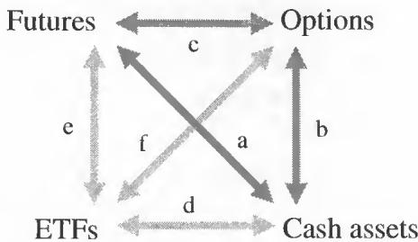  
Figure 13-1 Cross-asset index arbitrage opportunities

Index arhitrage focuses on mispricing between index futures and the underlying cash index, as shown by pathway (a) in Figure 13-1. Like basis trading, it is based on the concept of the future's fair value. For options, arbitrage is often based on the principle of Put-Call parity, shown by pathway (b). Pathway (c) shows the potential arbitrage between futures and options; this is driven by the Put-Call-Futures parily relationship.

The introduction of ETFs has provided additional opportunilies for arbitrage. Thus, Figure 13-1 also shows pathways (d), (e) and (f) for cash indices. The daily creation and redemption mechanism (d) for ETFs provides a natural arbitrage with the underlying assets, whilst ETFs may act as substitutes for the cash assets in index arbitrage (e) and potentially cven Put-Call option arbitrage (f). The creation of single stock futures based on ETFs should add cven more permutations.

Note that many of the pathways shown in Figure 13-1 may also be applicd for other types of underlier. There are also other derivative-based arbitrages, such as dividend arbitrage.

Clearly, speed plays a key role in successful arbitrage. Hence, electronic trading has had a huge effect. The simplest arbitrages have almost disappeared, since even Ior Iragmented markets it is now relaively easy to spot and take advantage of any such opportunities within milliseconds. Even the more complex multi-market or multi-asset opportunities are likely to be monitored closely. Often, the timescales involved, and the associated margins, for such opportunities have been drastically reduced. So it is vital to get the hedging right.

l is also important to note that just because an arbitrage opportunity exists, that does not necessarily mean it is profitable. The cost of hedging must be considered, plus the associated transaction costs. So cost minimisalion is another key focus. Taking advantage of any facilities such as netting trades via a CCP or cross-margining (to reduce margin payments for any futures positions) can also make a signilicant difference.

Given the progression of electronic and algorithmic trading, it is likely that in the future arbitrage opportunities will become cven more complex, possibly involving exotic derivatives. As the saying goes, "There is no such thing as a free lunch"; arbitrage opportunities may well be out there, but making a profit from them is ofien non-trivial.

# Multiple listing/depositary receipt arbitrage

Some companies are dual-listed or listed on multiple exchanges. However, the most widespread arbitrage opportunity comes from trading between depositary receipts and their underlying local stocks.

Figure 13-2 shows some examples of the price diferences between ADRs and other crosslisted shares in the U.S., taken from an extensive study by Louis Gagnon and G. Andrew

Karolyi (2003). Each chart plots both the U.S. dollar price of the ADR and the local price of the stock converted into dollars. Mispricing opportunities arise from both the difference in currency and local information. Different time zones and languages can mean that information flows to the markets at diffcring rates. For large cap stocks from developed countries, such as British Petroleum (BP) and Toyota Motor Corp., this should pose less of a problem. Indeed, we can see very few price discrepancies for these. Though, for smaller cap stocks or those from developing countries there can be quite substantial inconsistencies. For example, Figure 13-2 shows clear differences for Taiwan Semiconductor Manufacturing and Infosys Technologies. They also found that cross-listed stocks tended to follow U.S. market indices more closely than other domestic stocks.

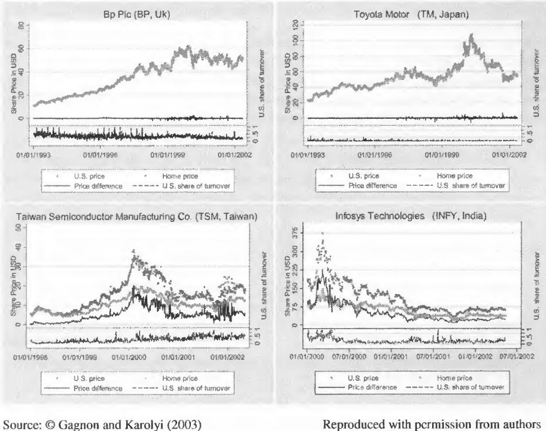  
Figure 13-2 ADR prices versus their local shares

Another factor to consider for depositary receipts is the administration fee that is charged for their conversion. When this is taken into account, it can significantly reduce the number of arbitrage opportunities.

In order to implement this arbitrage we need a model that compares both prices, accounting for any currency differences and any additional fees. The orders for the ADR and the stock must also be dependent, much like for pair trading. As with any cross currency arbitrage, in order to take full advantage of price imbalances it is important to minimise the currency risk. So, as we saw for cross currency trades, a separate FX cash trade may be used. In fact, brokers are already starting to provide automated conversion services, notably ADR Direct from BNY ConvergEx. This allows clients to convert to and from ADRs as well as providing an automatic currency conversion.

# Basis trading

In general, basis trading refers to an arbitrage between a futures contract and its undcrlying cash product. Though, in thcory it could also be applied to the arbitrage bctween other derivatives and their corresponding undcrlying assets. The name is derived from the concept of the future's basis $( B )$ , which is the difference betwecn the current cash markct pricc (S) and thc futures contract's price $( F )$

$$
B = S - F \quad \equiv \quad F = S - B
$$

This is also sometimcs referred to as the total basis or thc gross basis. Note that when the gross basis is positive the futurcs price is below the cash price, which is rcfcrred to as normal backwardation. Alternatively, a negative basis means the futures price is higher than the cash pricc, sometimes described as contango.

The basis changes over time, although generally it is less volatilc than either the cash or the futures prices. Howevcr, towards expiration of the futurc the two priccs will start to converge, sincc at expiry there is no real diffcrcnce between a futurcs contract and the cash assct, barring transaction costs. This convergcnce means that the basis must also decrcasc, and should reach zero when the futures contraet expires, as shown in Figure 13-3.

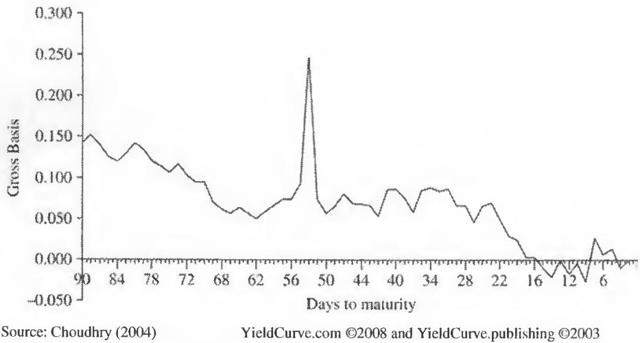  
Figure 13-3 Convergence of basis towards zero

Another way of expressing the relationship between the cash and futures prices is the cost of carry model:

$$
F = S + C
$$

where the cost of carry $( C )$ represents the net costs associated with the cash position:

$C o s t \ o f c a r r y = F u n d i n g \ c o s t + S t o r a g e \ c o s t - I n c o m e \ e a r n e d$ In turn, this cost may be represented as:

$$
C = ( S \cdot r ^ { T / 3 6 5 } ) + A - I
$$

where $r$ is funding interest rate, $T$ is number of days until the futures contract expires, A represents the storage costs and I corresponds to the income earned.

The funding cost is the interest that would have to be paid to fund a cash position for the pcriod of the futures contract, often this is based on the repo rate. The storage costs and income earned will differ depending on what the underlying asset is. For instance, with investment assets, such as bonds or stocks, the slorage costs will be negligible whilst the income earned may he considerable (Bonds may earn accrued interest whilst equities may receive dividends.). Alternatively, for commodities the storage costs may be sizeable whilst no income will be generated.

When the net cost of carry is positive the futures position is more attractive since we will not need to make any payments until the future reaches expiry, apart from margin calls. Whereas if the cost of carry is negative it actually pays to take on the cash position instead.

The net basis, also termed the value basis, adjusts the gross basis for the cost of carry:

$$
N e t b a s i s = G r o s s b a s i s + C o s t o f c a r r y
$$

Hence, the net basis represents the difference betwecn the fair value of the future and its actual market price. A positive value shows it is underpriced, whilst a negative one means it is overpriced.

Buying the basis means issuing a buy order for the cash asset whilst simultaneously selling the corresponding futures contraet. This is also called cash-and-carry trading. When we are long the basis, we benefit from any increases in the basis; in other words, from price rises for the cash asset or price drops for the future. Effectively, being long the basis allows us to earn the cost of carry.

Selling the basis is the opposite process, so the cash asset is sold and the future is bought. This is also known as reverse cash-and-carry trading. A short basis position will benefit from a decreasing basis; cffectively it pays the cost of carry.

These strategies may effectively he implemented by using an appropriate pricing model and linking the orders for the future and the underlying asset/s.

# Index arbitrage

Index arbitrage focuses on the profit opportunities that arise between index futures and their underlying constituents. Typically, most index arbitrage is carried out for stock indiees, although it could also be applied to bond indices or even CDS indices. Effectively, it is another example of basis trading, except that the cash position corresponds to a basket of asscts.

Based on equation 13-6, we can use the cash price and the net cost of carry to determine the fair value of the futures contract. Opportunities for arbitrage arise when the market price for the index future deviates significantly from this fair value. If the futures price exceeds the fair value then a cash-and-carry trade can profit by buying the eonstituents of the index whilst selling the overpriced futures contract. Conversely, when the futures price is less than its fair value we can use a reverse cash-and-carry trade to buy the futures and sell the index. Generally, these positions will be closed out once the price discrepancy has disappeared, rather than when the futures contract expires.

As we noted for the cost of earry, the income earned is dependent on the underlying asset. Thus, accurately estimating the dividend cash flows is key to succcssful stock index arbitrage. The issuance of dividends is reasonably seasonal; however, even for short periods they may be delayed or even brought forward. Similarly, whilst analysts can offer reasonable estimates for the normal dividend amounts, special dividends can be much harder to predict. Unfortunately, special dividends often make a substantial proportion of the overall dividend cash flow, as James Cummings and Alex Frino (2007) note. Clearly, the risk of inaccuracy is greater for larger indices, such as the Russell 2000, and for longer periods.

Example 13-6: Let's determine the cost of carry and fair valuc for the S&P 500 SEP 2007 future using the following data for the $2 6 ^ { \mathrm { t h } }$ of June 2007, from www.1ndexArb.com (2007).

The SEP 07 contract has 87 days to expiry Thc short-term interest ratc is around $5 . 5 2 \%$ . The cash index value is 1492.89

Before we can substitute these values into equation 13-7, we necd to estimate a figure for the income earned from dividends $( I )$ . The cstimate from www.indexArb.com (2007) for this is $\$ 57,411$ , which we may convert into index points by using an appropriate divisor. In this case, the divisor is 8,883.46 giving an adjusted dividend of 6.46 index points. Note we shall assume the storage cost is zero. Thus, the cost of carry may be detcrmined as:

$$
C = ( 1 4 9 2 . 8 9 * 1 . 0 5 5 2 \ ^ { 8 7 / 3 6 5 } ) - 6 . 4 6 \ = 1 2 . 7 8
$$

Using equation 13-6 the fair value of the future is $( 1 4 9 2 . 8 9 + 1 2 . 7 8 ) = 1 5 0 5 . 6 7 $

Example 13-6(a): Let's now assume the current S&P 500 SEP 07 futures price is 1510.00.

Compared to our fair value of 1505.67 the futures contract seems overpriced, with a basis of -17.11. Thercfore, it may be worth considering a cash and carry trade, sclling the September future and buying the equivalent basket of stocks. Table 13-7 shows the resultant cash flows for such a strategy.

Table 13-7 Example cash flows for cash and carry index arbitrage   

<table><tr><td rowspan=1 colspan=1>Date</td><td rowspan=1 colspan=1>Action</td><td rowspan=1 colspan=1>Underlyingcash flow/$</td><td rowspan=1 colspan=1>Futurescash flow/$</td></tr><tr><td rowspan=1 colspan=1>26 June</td><td rowspan=1 colspan=1>Buy stocks for $250 x 1492.89Borrow cash at 5.52%Sell SEP future at 1510.00</td><td rowspan=1 colspan=1>-373222.50</td><td rowspan=1 colspan=1></td></tr><tr><td rowspan=1 colspan=1>21 Sept</td><td rowspan=1 colspan=1>Sell stocks for $250 x 1533.38Receive dividends, $250 x 6.46Interest payments for 87 days loanFuture expires, $250 x (1510.00-1533.38)</td><td rowspan=1 colspan=1>383,345.001,615.00-4,810.58</td><td rowspan=1 colspan=1>-5845.00</td></tr><tr><td rowspan=2 colspan=3>Gross amounts       6,926.92Total</td><td rowspan=1 colspan=1>6,926.92</td></tr><tr><td rowspan=1 colspan=1>1,081.92</td></tr></table>

Note that the S&P 500 is a market capitalization based index, so each constituent has a weighting based on their company's size. To make things slightly easier we will assume we can create a basket of stocks equivalent to the value of the futures contract. The valuc of this basket is equal to the futures multiplier $( \$ 250)$ times the index closing price. 2 The S&P 500 futures contract expires on the third Friday of the delivery month, in this case September $2 1 ^ { \mathrm { s t } }$ ; at which point we must sell back our stocks (with market on open orders) whilst the future is settled for cash.

Also, note that throughout the lifetime of this trade there wil be various other eash flows, such as the daily futures margin payments and loan interest payments. Stock dividends will also be paid out intermitently over the period, and may he reinvested until expiry to further reduce costs. For simplicity, all these cash flows are merely presented in Table 13-7 as aceumulated sums to be paid at expiry.

Overall, we can see that in this example the profit is derived solely from the cash leg, which had a gross profit of ncarly $\$ 7,000$ . Much of this was due to the overall increase of the stoek index, although the dividend payments actually ensured that the strategy did more than break even. Offsetting this were the interest payments and the loss of nearly $\$ 6,000$ on the futures position. The futures leg did provide a successful hedge, since if the index had fallen we would have been in the opposite position. If this had happened, the profit from the futures contraet would have compensated for the loss on the stoeks.

Example 13-6(b): In actual fact the S&P 500 SEP 2007 futures price closed at 1497.80 on the $2 6 ^ { \bar { \mathrm { t h } } }$ of June.

Compared to our fair value of 1 505.67 the futures contract now seems underpriced, with a basis of -4.91. Therefore a rcverse cash and carry trade is actually more appropriate. So we should consider buying the September future and seling the equivalent basket of stocks. The resultant cash Ilows for this approach are shown in Table 13-8.

Table 13-8 Example cash flows for reverse cash and carry index arbitrage   

<table><tr><td rowspan=1 colspan=1>Date</td><td rowspan=1 colspan=1>Action</td><td rowspan=1 colspan=1>Underlyingcash flow/$</td><td rowspan=1 colspan=1>Futurescash flow/$</td></tr><tr><td rowspan=1 colspan=1>26 June</td><td rowspan=1 colspan=1>Sell stocks for $250 x 1492.89Lend cash at 5.52%Buy SEP future at 1497.80</td><td rowspan=1 colspan=1>373222.50</td><td rowspan=1 colspan=1></td></tr><tr><td rowspan=1 colspan=1>21 Sept</td><td rowspan=1 colspan=1>Buy stocks for $250 x 1533.381nterest from 87 days loanFuturc cxpires, $250 x (1533.38-1497.80)</td><td rowspan=1 colspan=1>-383,345.004,810.58</td><td rowspan=1 colspan=1>8,895.00</td></tr><tr><td rowspan=2 colspan=3>Gross amounts       -5,311.92Total</td><td rowspan=1 colspan=1>-5,311.92</td></tr><tr><td rowspan=1 colspan=1>3,583.08</td></tr></table>

This time, our long futures position actually benefits from the increase in the index level, leading to a gross profit of $\$ 8,895$ In comparison, our short cash position realised losses of $\$ 10,122$ , which were offset by the $\$ 4810$ income from interest. Though, since we were short stock, there was no additional income from dividends.

Note that for both of these examples the final value of the stock basket is aetually based on the futures settlement price (1533.38), rather than the opening price of the S&P 500 on the $2 1 ^ { \mathrm { s t } }$ (1520.1 1). This is because the index's opening price is based on when the NYSE opened rather than when all the morning's opening auetions had completed, which could actually be some time after the official open. Therefore, the official index open is aetually based on some stocks' close prices from the $2 0 ^ { \mathrm { t h } }$ . So at expiry the CME instead provides a special opening quotation (SOQ), which is not finalised until all of the index econstituent's official opening prices are set. This ensures that arbitrageurs can liquidate their trades at coordinated levels. Though, it does mean that there can somctimes be a sizable difference hetween these two prices. The SOQ was introduced in June 1987 to try to minimise the volatility, prior to this settlement was based on the closing price. For more information, please sce the CME (2005) documentation.

There are some further complications, which were omitted from Example 13-6 (a) and (b) for clarity. Real-world arbitrage strategies must cope with the risk that the cost of carry is uncertain. Over the length of the trade short-term interest rates could shift, similarly the dividend cash flow may differ from its estimate. Arhitrageurs must also account for factors such as transaction costs, interest rates and market regulations.

Transaction costs obviously have a direct impact on arbitrage opportunitics; high costs can make even significant mispricings unprofitable. Consequently, arbitrage models should also factor in the bid offer spread for the stocks and futures, as well as any fees or commissions. For larger waves, market impact could be an important factor as well. Also, when shorting stocks the cost of borrowing them must also be considered. This means that index futures are more often underpriced than overpriced, as Catherine Shalen (2002) points out.

Funding rates can also have an effect. The same funding rate was used throughout Example 13-6 (a) and (b). Though, the interest rates to borrow will be slightly higher than this market rate, whilst those for lending will be lower.

Market regulations can also have a noticeable impact on arbitrage. Short selling restrictions, such as the up-tick rule, make it more difficult to keep the cash and futures leg synchronized. Market collars also pose a considerable problem. For example, the NYSE Rule 80A enforces a collar based on the DJIA index; when triggered it requires indexarbitrage orders for the S&P 500 stocks to be stabilizing. So if the index falls 190 points (Irom the prior close) arbitrage orders can only be sold on an up-tick; conversely, if it rises by this amount buy orders must be on a down-tick.

To counter some of these issues, arbitrageurs often close out of their positions before the futures contract expires. Indeed a study of the NYSE by George Sofianos (1990) found this to he true for over $70 \%$ of positions, with liquidation occurring upon reversal of the original mispricing or within a few days. Arbitrageurs may also sometimes trade only a portion of the actual index, instead creating a subset that acts as a proxy. Although this offers reduced transaction costs, it does create the potential risk of tracking error between the proxy and the actual index.

Clearly, successful index arbitrage is non-trivial. Whilst there is still plenty of moncy to be made from this, it is not without some risk or difficulty. To automate this proccss we require detailed price models that need to take account of all of these factors. Similarly, to perform the trading we shall need to use approaches for handling baskets of orders, as we saw in Chapter 12. This will also need to be linked to the futures trading.

# ETF Index Arbitrage

The daily creation and redemption mechanism for ETFs ensures that there is a natural arbitrage between these funds and their underlying assets. Therefore, when the ETF trades at a premium (discount) to its net asset value (NAV) dealcrs can simply sell (huy) the ETF and buy (sell) the underlying assets. This ensures that any mispricing for the ETF is kept to a minimum.

The rapid growth of the ETF marketplace has given rise to new arbitragc opportunities. 1n particular, lor index arbitrage they can replace the cash leg. ETFs are attractive to arbitrageurs because they are:

● based on the actual index • casy to short

• not subject to any up-tick rules • potentially much cheaper to trade than a basket of stocks

Since ETFs represent a pro-rata share in a fund modelled on the index they should have a negligible tracking error. Their inherent daily creation mechanism means that short sales pose no issues. As Gary Gastincau (2003) notes, this also means short squeezes are not possible. The lack of an up-tick rule also makes them much more flexible when selling. Thus ETFs circumvent many of the issues we saw in the previous section. They offer a low risk and cost efficient alternative for index arbitrageurs, provided they have sufficient liquidity.

There is one key difference between using a basket of stocks or an ETF for the cash leg of an index arbitrage, as Andrew Economopoulos (2005) highlights: For ETFs, dividends are accumulated in the fund and distributed 45 days after the ex-dividend date. The value of these accumulated dividends will actually be discounted, so the market price of an ETF will be slightly lower than its net asset value (NAV). This also means the ETF may actually trade at a slight premium to the index, which wi also be reflected in any futures fair value based on the ETF price.

Arguably, the main appeal of ETFs is their potential to substantially reduce transaction costs. For instance, Economopoulos (2005) gives an example of the S&P 500, where ten SPDR shares are cquivalent to the index. For a portfolio worih $\$ 25$ million he estimated a total cost of $\$ 120,362$ for trading the cash index. In comparison using the SPDR ETF cost $\$ 45,357$ whilst the futures only cost $\$ 2,777$ Table 13-9 helps to explain these differences.

Table 13-9 Round trip cost comparison between cash and ETFs   

<table><tr><td rowspan=1 colspan=1></td><td rowspan=1 colspan=1>Shares purchased</td><td rowspan=1 colspan=1>Average spread ($)</td><td rowspan=1 colspan=1>Cost (bps)</td></tr><tr><td rowspan=1 colspan=1>Cash index</td><td rowspan=1 colspan=1>714,185</td><td rowspan=1 colspan=1>0.219</td><td rowspan=1 colspan=1>68</td></tr><tr><td rowspan=1 colspan=1>ETF</td><td rowspan=1 colspan=1>266,810</td><td rowspan=1 colspan=1>0.15</td><td rowspan=1 colspan=1>18</td></tr></table>

Source: Economopoulos (2005)

The main cause is the sheer number of stocks which have to be traded. Combined with a higher spread this leads to a total cash index cost of 68 bps, whereas the ETF costs some 50 bps less. Even accounting for the fund management costs of 4.6 bps the ETF offers a considerable saving over trading cash equities.

Note that realizing these savings requires the ETF to have enough liquidity. So the liquidity premium must be sufficiently low; otherwise it will cancel out any savings. For instance, Economopoulos (2005) points out that prior to 1996, even though the SPDR ETF offered a cost advantage, its liquidity was insufficient to attract traders as a cash substitute. He also notes that the mispricing relationship declined after November, 1997, suggesting increased arhitrage. This seems to be linked to the CME halving the denomination of the S&P 500 futures contract, and their carlier introduction of the E-mini contract. Likewise, an earlier study by Lorne Switzer, Paula Varson and Samia Zghidi (2000) found that the introduction of the SPDR ETF had improved the pricing efficiency in the futures market, observing that mispricing was negatively related to SPDR volume.

Another benefit of arbitrage using ETFs is that we no longer need to trade baskets of assets. Thus a more straightlorward pair trading approach may be used, although we will still clearly need a sophisticated pricing model.

# Option arbitrage

Put-call parity is a key principle in option pricing, most notably demonstrated by Hans Stoll (1969). He highlighted the relationship between the fair values for a pair of identical European eall and put options and their underlying asset, as shown in equation 13-8:

$$
C _ { t } + X e ^ { - r t } = P _ { t } + I _ { t }
$$

where $C$ is the price of the call option, $P$ is the price of the put, $I$ is the price of the underlying, $X$ is thcir strike price, $r$ is the interest ratc and $t$ is the time left to expiry. Note that this depends on the put and the call having the same strike price and expiration.

Stoll showed that by using this principle the payoff of any one of the trio may be recreated by an appropriatc combination of the other two. Hence, the whole concept of synthetic option positions was spawned. For example, a synthetic long call is just a long position in the underlying combined with purchasing an at-the-money (ATM) put. Altcrnatively, a synthetic long put corresponds to a short position in the underlying together with the purchasc of an ATM call option.

Using put-call parity we should always be able to infer the fair price for a call or a put option based on the prices of the other two assets. So, any mispricing may be casily spottcd and taken advantage of by arbitrageurs. If the call option is rclatively ovcrpriccd then a conversion stratcgy may be used. This means selling the call and hedging by creating a synthetic long call position. Alternatively, if the put option is overpriced we may adopt a reversal, or reverse conversion strategy, which consists of sclling thc overpriced put and hedging with a synthctic long put.

A conversion strategy comprises of selling ATM call options, and buying the underlying and ATM puts. Alternatively, we can view this as going long the underlying and creating a synthetic short position. Figurc 13-4 shows the payouts for this strategy.

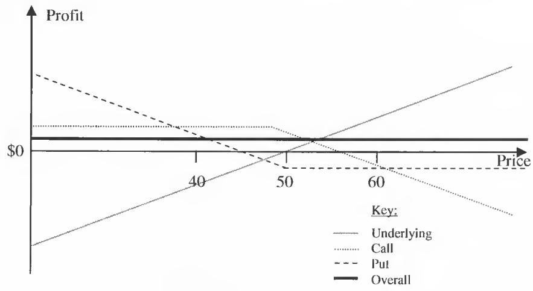  
Figure 13-4 Payouts for the conversion strategy

Any gains in the underlying will be ofset by losses from the calls; similarly, any losscs will he compensated for by gains in the puts. Hence, the position is completely hedged.

Example 13-7(a): Asset HJK is currently trading at $\$ 50$ . The OCT 50 call is priced at $\$ 3$ whilst the OCT 50 put is $\$ 2$ , The interest rate is $5 . 5 2 \%$ .

Based on equation 13-8, we should first detcrmine the discount factor, assuming that both options will ire ina nh $e ^ { - r t } = e ^ { - l / l 2 x 0 . 0 5 5 2 } { = 0 . 9 9 5 }$

We can now substitute these values into the put-call parity equation (13-8):

$$
3 + ( 5 0 \times 0 . 9 9 5 ) = 2 + 5 0 \Rightarrow 5 2 . 7 5 \neq 5 2
$$

Clearly, cithcr the call option is overpriced or the put is underpriced. Assuming that the call option price is fair then the put option should actually be $\$ 2.75$ .

Either way, we can take advantage of this with a conversion strategy:

<table><tr><td></td><td>Income</td><td></td><td>Outgoings</td></tr><tr><td></td><td>Buy underlying</td><td></td><td>$50 x 100= $5,000</td></tr><tr><td></td><td>Sell ATM calls</td><td>$3 x 100 = $300</td><td></td></tr><tr><td></td><td>Buy ATM puts</td><td></td><td>$2 x 100 = $200</td></tr><tr><td></td><td>Total = $ -4,900 =</td><td>$300</td><td>$5,200</td></tr></table>

Setting up the conversion trade has cost $\$ 4,900$ so it is $\$ 100$ cheaper than simply buying the underlying. This saving is due to the difference in pricing between the ATM calls and puts. This profit is immediately locked in, as Figure 13-4 shows.

In October, if the asset price rises to $\$ 60$ the call options will be in-the-money and so will be exercised. The long underlying position may be used for delivery. The put options will becomc worthiess. Overall, we shall receive $\$ 5,000$ giving a gross profit of $\$ 100$

Conversely, if the pricc fcll to $\$ 40$ the puts will be in-the-money whilst the call options wil be worthless. So we can exercise the put options to sell our underlying position for $\$ 5,000$ , again leaving a gross profi t of $\$ 100$ .

Alternatively, if the price does not change we can scll the underlying for $\$ 5,000$ ,with a gross profit of $\$ 100$ .

Regardiess of the outcome, a gross profit of $\$ 100$ should bc achieved. All that remains is to subtract any interest payments and transaction costs.

For a reversal strategy, we sell ATM put options, and sell the underlying and buy ATM calls. We can also view this as shorting the underlying and creating a synthctic long position. Figure 13-5 plots the potential payouts for this approach.

Example 13-7(b): Assct HJK is still trading at $\$ 50$ , but now thc OCT 50 call has fallen to $\$ 2$ whilst the OCT 50 put has risen to $\$ 3$

Let's assume the call price is fair, in which case, based on the discount we calculated in Example 13-7(a), the put should be priced at $\$ 127$ . This time the put is ovcrpriced relative to thc call, in which case wc can adopt a reversal:

Income Outgoings   
• Sell underlying $\$ 50\mathrm { ~ x ~ l ~ 0 0 } = \$ 5,000$   
● Buy ATM calls $\$ 2\mathrm { ~ x ~ }100 = \$ 200$ Sell ATM puts $\$ 3\mathrm { ~ x ~ l 0 0 } = \$ 300$ Total $= \$ 5,100$ \$5,300 \$200

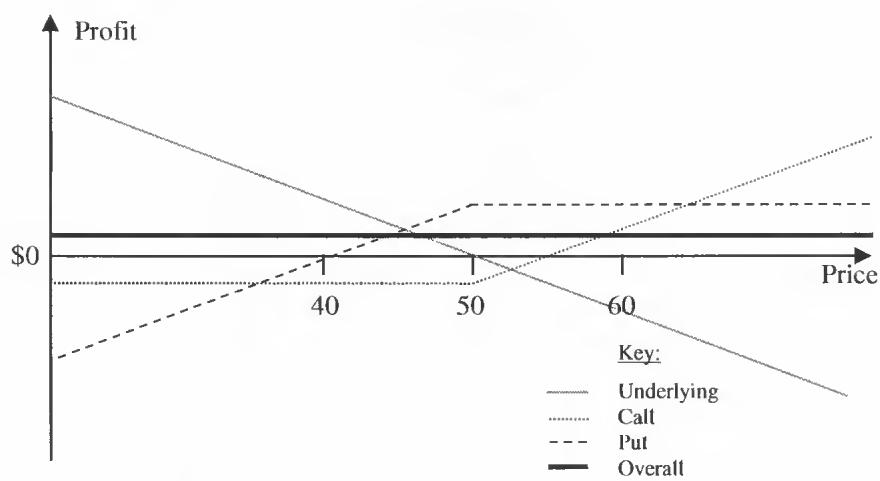  
Figure 13-5 Payouts for the reversal strategy

Again, setting up the reversal trade has proven morc profitable than simply shorting the underlying. Once more, the profit is derived from the differencc in pricing between the ATM calls and puts, and is instantly locked in. As we can sec from Figure 13-5, any losscs on the underlying are offset by gains from the calls, whilst any gains are neutralised by the puts.

In October, if the assct price rises to $\$ 60$ the call options will be in-the-moncy and so will be exercised, allowing us to flatten our undcrlying short for $\$ 5,000$ . The puts will expire worthless. Hence, the overall gross profit remains $\$ 100$

If the price falls to $\$ 40$ then our call options will expire worthless. Though, the put options we sold will expire in-the-money, so the purchaser will want to sell us 100 HJK Ior $\$ 5,000$ . This fl attens our short position, leaving us with $\$ 100$ profit again.

If the price does not change, we can latten our short position, at a cost of $\$ 5,000$

The net profit for this stratcgy will also incorporate any interest earned for the $\$ 5,000$ over the month, which will help offset any borrowing costs associated with shorting 'the underlying.

# Futures and options arbitrage

The put-call parity relationship we saw in equation 13-8 relates the prices of options with the price of the undcrlying asset. Similarly, we can relate these to futures positions, as Alan Tucker (1991) showed with the Put-Call-Futurcs (P-C-F) parity rclationship.

The price of a stock index future may be related to the underlying index price (S) by its forward value:

$$
\boldsymbol { F } _ { t } = \boldsymbol { S } _ { t } e ^ { ( r - q ) \tau }
$$

wherc $q$ is a constant rate representing income from dividends, $r$ is thc risk-frcc rate and $\tau$ is the time to cxpiry. Sheri Markose and Hakan Er (2000) rcarrange this to show that discounting the futures price gives the underlying stock index pricc adjusted for dividends:

$$
\boldsymbol { F _ { t } } \boldsymbol { e } ^ { - r \tau } = \boldsymbol { S _ { t } } \boldsymbol { e } ^ { - q \tau }
$$

We can substitute this into the right hand side of the put-call parity equation (13-8) to express it in terms of the futures price, and so define the P-C-F parity:

$$
C _ { t } + X e ^ { - r \tau } { = } P _ { t } + F _ { t } e ^ { - r \tau }
$$

If the futurcs contract is underpriced relative to the options we can take advantage using a conversion strategy. Essentially, this is the same as we saw in Example 13-7(a), except we go long the futures contract rather than the underlying. To counter this position, a synthetic short future is created by selling ATM calls and buying the equivalent puts. The synthetic future is completed by Iending an additional cash amount, based on the discounted difference betwecn the strike price and the futures price i.e. $\left( X - F _ { t } \right) e ^ { - r \tau } .$ [

Whereas if the futures contract is overpriced compared to the options then we can adopt a reversal stratcgy, as we saw in Example 13-7(h). Again, rather than shorting the underlying we sell the futures contract. This is then hedged with a synthetic long futures position, from buying ATM calls and selling the puts and borrowing $( X - F _ { t } ) e ^ { - r \tau } .$ [

Trading a futures contract is a much cheaper alternative to trading a basket of stocks. So trading based solely on index futures and options can prove a cost-effective and eficient means of index arbitrage.

In their study of FTSE-100 P-C-F arbitrage, Markose and Er (2000) note that when the index future is at its fair valuc the put-call and put-call-futures parity conditions are identical. They concludcd that some of the most profitable P-C-F arbitrage opportunities were Ior futures contracts further from maturity, such as 20-50 and 50-80 days. They also noted that the so-called Black elfect could have a substantial impact on the opportunities for arbitrage. This is due to market makers for index options often using the Fisher Black (1976) pricing method, a modification of the Black Scholes formula that is based on the futures price rather than the index. The cffect can mean that overpriced index futures lead to overpriced calls and underpriced puts, and vice-versa. Markose and Er (2000) found that the Black effect limited the efficiency of P-C-F arbitragc and in some circumstances noted that arbitrage could even exacerbate the futures underlying mispricing.

# Dividend arbitrage

Company dividend payments can be an important source of carnings. Dividend arbitrage combines a position in the stock with deep in-the-money options in order to lock in profits.

When a dividend is formally announced, the company will specify when the payment will actually be made, termed the duc date. They also stipulate the record date that determines the actual entitlement, since only the shareholders of record at this time will receive payments. However, since it takes time for trades to be cleared and settled, the exchange will usually set a separate deadline. This is the ex-dividend (or ex-div) date, which is often two days before the record date. Anyone purchasing the stock before the ex-dividend date will reccive the dividend, even if they subsequently sell the stock. Thus, the market price usually reflects this fact with a price drop equal to the dividend, as shown in Figure 13-6.

If we buy the stock just before the ex-div date we are effectively paying a premium based on the dividend value. The pricc drop at the ex-div date will realise an immediate loss for long positions. Only at the subsequent due date will the dividend actually be paid. So a quick sale will often return a loss, or at best a negligible profit. To lock in any profits from the dividend there are two main types of arbitrage based on either buying put options or selling call options.

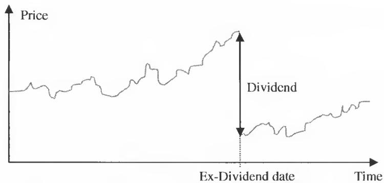  
Figure 13-6 The price effect of stock dividend payments

By purchasing an in-the-moncy put option at the same timc as buying the stocks, we have locked in an exit price. Although, there will be a significant premium to be paid for such options. In order for this strategy to be profitable, this premium must be less than the exercise profit and the dividend payment.

Example 13-8: Stock EFG is trading at $\$ 50$ ; it goes ex-div on the 20th Scptember paying $\$ 2$ share. A SEP 55 put costs $\$ 6$

To lock in dividend profits we can buy 100 EFG and 100 SEP 55 puts. The resultant cash flows are shown in Table 13-10:

Table 13-10 Dividend arbitrage using puts   

<table><tr><td>Date</td><td>Action</td><td>Cash flow/$</td></tr><tr><td>18 Sept</td><td>Buy stocks for $50 × 100</td><td>-5,000</td></tr><tr><td rowspan="2">20 Sept</td><td>Buy SEP 55 put for $6 × 100</td><td>-600</td></tr><tr><td>Exercise put for $55 x 100</td><td>5,500</td></tr><tr><td rowspan="2"></td><td>Dividend payment $2 × 100</td><td>200</td></tr><tr><td>Total</td><td>100</td></tr></table>

The cxcrcise cost is $\$ 100$ whilst $\$ 200$ is made from the dividend; thercfore, the SEP 55 puts are sufficiently cheap to result in a net profit of $\$ 100$ This trade is risk free since we have flatened our long position by exercising the puts, so we are unaffected by price changes on the ex-div date.

The alternative approach is to sell an in-the-money call option. Though, this relies on the Tact that assignment docs not occur before the ex-div datc (that is the purchaser does not cxercise them). At which point, the price drop will affect both the stock and its options. We should be able to buy back the call option more cheaply, which will olffset the losses from our stock position, leaving thc dividend payment as profit.

Example 13-9: Stock HJK is trading at $\$ 60$ ; it goes ex-div on the 16th October paying $\$ 2$ sharc. An OCT 50 call costs $\$ 10$ .

We can lock in the dividend profits by going long $1 0 0 \ \mathrm { \ H J K }$ and sclling 100 calls. Assuming that the call options were not assigned, the cash flows for the stocks and options balance out leaving $\$ 200$ profit from the dividend, as shown in Table 13-11.

Table 13-11 Dividend arbitrage using covered calls   

<table><tr><td>Date</td><td>Action</td><td>Cash flow/$</td></tr><tr><td>15 Oct</td><td>Buy stocks for $60 x 100 Sell OCT 50 call for $10 x 100</td><td>-6,000 1,000</td></tr><tr><td rowspan="3">16 0ct</td><td>Scll stocks for $58 x 100</td><td>5,800</td></tr><tr><td>Buy call for $8 x 100</td><td>-800</td></tr><tr><td>Dividend payment, $2 x 100</td><td>200</td></tr><tr><td colspan="2">Total</td><td>200</td></tr></table>

Thus, the main risk with this strategy is the likelihood of the call option being assigned before the ex-div dale, which would lead to a loss of the dividend profits. Further examples may be found at TheOptionsGuide.com (2007).

# 13.7 Adapting algorithms for multi-asset trading

In many ways, multi-asset trading algorithms are similar to the two-sided portfolio trading algorithms we saw in Chapter 12. Though, since they involve a more diverse range of markets they are more likely to suffer from marked differences in liquidity. This could pose real problems for achieving best execution. Therefore, risk models need to start expanding to cope with this.

# Factors to consider for multi-asset trading algorithms

Obviously, the main starting point for any multi-asset trading is to already have successful algorihms in place for trading cach of the targel asset classes. This ensures that any asset class specific issues have already been identified and appropriate adjustments have been made.

Multi-asset trading adds an extra level of complexity since it will invariably mean trading across different trading platforms, currencies and time-zones. Hence, it is vital that any trading algorithms can cope with differences in:

• Liquidity ● Latency ● Transparency ● Consistency ● Dependency

Otherwise, there may he a considerable additional risk exposure.

# Liquidity

As we saw in Chapter 3, liquidity varies considerably between the various markets and asset classes, just as i does between specific assets. Multi-asset trading algorithms need to balance their trading based on the liquidity of the target assets. Simplistically, this means focussing on the lowest common denominator, so the mos1 iliquid asset drives the rate of trading.

For instance, when trading a corporate bond against its stock, orders might only be placed for the stock leg once an execution has been confirmed for the less liquid bond. Alternatively, we could use legging to provide some more flexibility over execution, just as we saw for pairs trades. Though, for very iliquid assets this could expose us to significant risk. Whilst such approaches will work, they could miss opportunities for the more liquid assets.

# Latency

Lateney ean be just as important as liquidity. It makes it harder to rely on the prices we can see, sinee by the time our order is handled the price may have shifted.

Each asset elass may well be traded over different platforms, across different execution venues and possibly even spanning time-zones. Exchanges are now foeussed on reaching turnaround times less than $\mathrm { { I 0 ~ m s } }$ . However, there are still plenty of venues where this figure is more like $1 0 0 ~ \mathrm { { m s } }$ or more. So there are bound to be diflerences in latency betwcen the venues.

The aetual trading mechanism is another key factor for lateney, since it is quite possible that trading might need to span both order books and request-for-quote (RFQ) or request-forstream (RFS) based platforms. In such cases, the differenee in latencies might range from milliseconds to seconds.

For example, let's eonsider executing a simple pairs trade, both assets have the same liquidity exeept one trades at a venue with a lateney of 50ms whilst for the other it is ${ 5 0 0 } \mathrm { m s } . $ If we place a matehing buy and sell order for each asset there is at least $4 5 0 \mathrm { m s }$ of uncertainty. A busy trader might not notice this lag; after all, it is equivalent to a few blinks. However, it can still have an appreciable effect. In order to compensate for this, the trading algorithm will have to bias trading towards the venue with higher lateney.

# Transparency

Transparency can also vary considerably between markets. Within a single market, differing levels of transparency have proved fairly suecessful. Highly transparent primary venues allow for easy price discovery, whilst more opaque venues enable volume diseovery. Indeed, the "dark pool” ATSs have proven so successful for equities because although being opaque their price discovery tends to be based on the primary exchanges.

Across asset classes, diferences in transparency can pose more of a problem, since there are no equivalent links. For instanee, the entire order book might be visible when trading stocks, but for other assets we might only be able to see the best bid and offer. Although we might have confidence of best execution for our stock trading, it is much harder to have this for the other assets.

# Consistency

Consistency is another major factor for ensuring suecessful multi-asset trading, particularly for transaetion costs. As we saw in section 13.6, there is a wide range of arbitrage opportunities between asset classes. For these to be profitable it is vital that any additional costs are considered when looking at relative prices. This might be as obvious as incorporating the different bid offer spreads, commissions or routing/handling fees. However, it must also include asset specific factors such as storage/delivery fees, acerued interest or dividend payments.

# Dependency

Over the years, microstructure studies have analysed the price relationships across many of the different asset classes. For example, studies have focussed on whether the futures markets lead or lag the markets for their underlying assets. Such inter-market relationships are an important source of information for short-term predictions of prices and other market conditions, as we will see in Chaptcr 15. Taking advantage of these could be the differcnce bctwcen a profitable trading strategy and a loss-making one.

# Minimising risk

Lower transaction costs may be achieved for portfolios by maximising the natural hedging, or diversification, for as long as possible. Therefore, it is quite likely that risk-based models, similar to those we saw for portfolio trading, will be at the heart of next generation multiassct algorithms. Clearly, constructing multi-asset risk modcls is more complex than the existing single asset ones. However, these should hopefully provide the flexibility required to achievc best exccution for all the assets in a mixed portfolio.

For cxamplc, let's consider the dummy trade list shown in Table 13-12.

Table 13-12 Potential prioritisation for a sample portfolio   

<table><tr><td rowspan=1 colspan=1>Asset</td><td rowspan=1 colspan=1>Size/$mm</td><td rowspan=1 colspan=1>Side</td><td rowspan=1 colspan=1>Liquidity</td><td rowspan=1 colspan=1>Risk</td></tr><tr><td rowspan=1 colspan=1>Euro mid-cap stock</td><td rowspan=1 colspan=1>10</td><td rowspan=1 colspan=1>Buy</td><td rowspan=1 colspan=1>Medium</td><td rowspan=1 colspan=1>High</td></tr><tr><td rowspan=1 colspan=1>Euro equity put options</td><td rowspan=1 colspan=1>2</td><td rowspan=1 colspan=1>Buy</td><td rowspan=1 colspan=1>Low</td><td rowspan=1 colspan=1>Medium</td></tr><tr><td rowspan=1 colspan=1>Euro FX</td><td rowspan=1 colspan=1>10</td><td rowspan=1 colspan=1>Buy</td><td rowspan=1 colspan=1>High</td><td rowspan=1 colspan=1>Medium</td></tr><tr><td rowspan=1 colspan=1>U.S. equity put options</td><td rowspan=1 colspan=1>2</td><td rowspan=1 colspan=1>Buy</td><td rowspan=1 colspan=1>Medium</td><td rowspan=1 colspan=1>Low</td></tr><tr><td rowspan=1 colspan=1>U.S. large-cap stock</td><td rowspan=1 colspan=1>10</td><td rowspan=1 colspan=1>Buy</td><td rowspan=1 colspan=1>High</td><td rowspan=1 colspan=1>Low</td></tr></table>

In this parlicular case, the Europcan mid-cap stock and its put options have the lowest liquidity. Notc that the put options are intended for hedging and so may be made dependent on the underlying stock position. The out-of-the-money puts for the U.S. large-cap stock are assigned a lower overall risk than the FX trade, since the required sizc is less. Hence, for this basket the mid-cap stock position poses the most risk, so we can target this more aggressivcly. This is clearly a simplistic example, but it highlights the fact that liquidity should not be the sole dcterminant when evaluating trading strategies.

A morc quantitative approach would be to determine the marginal coniribution to risk (MCR) for each order in the trade list and then adjust their execution accordingly, as we saw in Chapter 12. We should also try to incorporate factors such as latency into the estimates for timing risk.

# Trading algorithm choice

The simplest multi-assct orders could be handled by slight extensions to cxisting algorithms.   
For example, we could extend the pairs/spread trading mechanism that we saw in Chapter 5.   
An additional leg could incorporate handling FX cash trades with relative ease.

Alternatively, for strategies where there is a clear dependency betwcen the orders, a conditional algorithm could be created; essentially, this would just use conditional orders. This could be used to try to cover short sales with orders for lending/repos. It might also provide the mcchanism for simple structured notes, or even some hedging.

For more complex strategies, the "algorithm of algorithms" approach that we saw in Chapter 12 seems a reasonable starting point. Again, the portfolio algorithm would need to contain the requircd control logic, whilst the individual ordcrs could continue to use standard single asset algorithms. So stock, bond, currency, future and option positions could each be handlcd by their own algorithms, which thc portfolio algorithm continually checks and adjusts. If the links between the investor and the broker are sufficiently fast and reliable, there is no rcal rcason why the portfolio algorithm could not reside on the buy-side, with updates sent to the individual algorithms being worked on the sell-side.

Similarly, since hedging and arbitrage rely on position information and potentially proprietary analytics thesc are good candidates for in-housc devclopment by the buy-side.

# 13.8 Summary

Multi-asset trading strategies are now morc widely accessible due to electronic trading:

Utility strategics incorporate FX cash trades or cover short salcs.   
Some structured products may be recrcated using algorithms.   
Hedging strategies offset risk, whethcr this is for duration, beta, delta or gamma.   
Arbitrage stratcgics take advantage of mispricing bctwcen asscts, cven bctwecn assct classes. Hedging is also vital to lock these profits in by staying risk-frcc.

To cope with trading across diferent asset classes it is vital that strategics takc account of differences in:

Liquidity Latency Transparency

For best execution, strategies must also ensurc that prices arc comparcd consistcntly, by including any relevant asset specific costs or factors.

Strategies may also use established inter-market price relationships to gain an edge from short-term price forccasts.

Multi-asset trading may require cxtensions to existing trading algorithms to deal with:

Adding conditional orders   
Adopting a pairs/spread trading approach   
Handing thc diferent legs as a portfolio, possibly adopting an "algorithm of   
algorithms" to minimise risk

Information is everything. Automated news handling and interpretation can be complex, but these techniques offer the potential to further enhance trading strategy performance.

# 14.1 Introduction

The world's markets are driven by information, much of which is reported in news headlines and stories. Adapting to breaking news events can give traders a significant edge over the rest of the market. Over the last few years, the incorporation of news into algorithmie trading systems has attracted more and more attention.

Clearly, the relentless increase in both the speed and capacity of computers offers a massive potential for news-based analysis. Nevertheless, people are still much more adept at interpreting news and events than machines. Computer-based news analysis is a non-trivial task. Part of the difficulty is simply the fact that news is often based on unstructured text so it is difficult for rule-based systems to process it, and even harder for them to reliably interpret it. The inereasing digitisation of news to computer-readable formats is helping to bridge this gap. Complex artificial intelligence and natural language processing techniques are also being employed. As we shall see in the following sections, progress is being made on computer-based analysis, but there is still quite a long way to go.

# 14.2 Types of news

News items can represent a wide variety of information. Broadly speaking, we can categorise most news items into thrce main classes: global/regional, macroeconomic and corporate.

Table 14-1 Key news types   

<table><tr><td rowspan=1 colspan=1>Event</td><td rowspan=1 colspan=1>Examples</td></tr><tr><td rowspan=1 colspan=1>Global/regional</td><td rowspan=1 colspan=1>Political events, wars and terrorism, naturaldisasters</td></tr><tr><td rowspan=1 colspan=1>Macroeconomic</td><td rowspan=1 colspan=1>Interest rate, US non-farm payroll, GrossDomestic Product (GDP) announcements</td></tr><tr><td rowspan=1 colspan=1>Corporate</td><td rowspan=1 colspan=1>Mergers and acquisitions, bankruptcies,board/executive changes, product releases,quarterly/annual reports, dividend announcements</td></tr></table>

Table 14-1 shows some examples. Note that all three types of news can have distinct effects on the volume and volatility of both markets and specific assets. Though, the full effects of global/rcgional ncws can be quitc difficult to interpret. Hence, this chapter focuses on the impact of both macroeconomic and corporate ncws.

# Macroeconomic news

Most macrocconomic news comes in the form of regular announcements that provide information on key economic indicators. Therc is a wide range of diffcrent indicators; some of the main ones for the U.S. economy are shown in Table 14-2.

Table 14-2 Some of the key U.S. macroeconomic announcements   

<table><tr><td rowspan=1 colspan=1>Class</td><td rowspan=1 colspan=1>Announcement Type</td><td rowspan=1 colspan=1>Freq</td><td rowspan=1 colspan=1>Time</td></tr><tr><td rowspan=1 colspan=1>GDP</td><td rowspan=1 colspan=1>Gross Domestic Product (GDP)</td><td rowspan=1 colspan=1>Q</td><td rowspan=1 colspan=1>8:30</td></tr><tr><td rowspan=1 colspan=1>Consumption</td><td rowspan=1 colspan=1>Personal Consumption Expenditures</td><td rowspan=1 colspan=1>M</td><td rowspan=1 colspan=1>8:30</td></tr><tr><td rowspan=5 colspan=1>Investinent</td><td rowspan=1 colspan=1>Business Inventories</td><td rowspan=1 colspan=1>M</td><td rowspan=1 colspan=1>8:30</td></tr><tr><td rowspan=1 colspan=1>Durable Goods Orders</td><td rowspan=1 colspan=1>M</td><td rowspan=1 colspan=1>8:30</td></tr><tr><td rowspan=1 colspan=1>Factory Orders</td><td rowspan=1 colspan=1>M</td><td rowspan=1 colspan=1>10:00</td></tr><tr><td rowspan=1 colspan=1>Construction Spending</td><td rowspan=1 colspan=1>M</td><td rowspan=1 colspan=1>10:00</td></tr><tr><td rowspan=1 colspan=1>New Home Sales</td><td rowspan=1 colspan=1>M</td><td rowspan=1 colspan=1>10:00</td></tr><tr><td rowspan=1 colspan=1>Net Exports</td><td rowspan=1 colspan=1>Trade Balance</td><td rowspan=1 colspan=1>M</td><td rowspan=1 colspan=1>8:30</td></tr><tr><td rowspan=1 colspan=1>Government Expenditure</td><td rowspan=1 colspan=1>Government Budget</td><td rowspan=1 colspan=1>M</td><td rowspan=1 colspan=1>14:00</td></tr><tr><td rowspan=1 colspan=1>FOMC</td><td rowspan=1 colspan=1>Target Federal Funds Rate</td><td rowspan=1 colspan=1>6W</td><td rowspan=1 colspan=1>14:15</td></tr><tr><td rowspan=1 colspan=1>Money supply</td><td rowspan=1 colspan=1>M2</td><td rowspan=1 colspan=1>W</td><td rowspan=1 colspan=1>16:30</td></tr><tr><td rowspan=6 colspan=1>Real Activity</td><td rowspan=1 colspan=1>Non-Farn Payrolls/Employment</td><td rowspan=1 colspan=1>M</td><td rowspan=1 colspan=1>8:30</td></tr><tr><td rowspan=1 colspan=1>Initial Unemploynent Claims</td><td rowspan=1 colspan=1>W</td><td rowspan=1 colspan=1>8:30</td></tr><tr><td rowspan=1 colspan=1>Industrial Production Capacity Uilization</td><td rowspan=1 colspan=1>M</td><td rowspan=1 colspan=1>9:15</td></tr><tr><td rowspan=1 colspan=1>Retail Sales</td><td rowspan=1 colspan=1>M</td><td rowspan=1 colspan=1>8:30</td></tr><tr><td rowspan=1 colspan=1>Personal Income</td><td rowspan=1 colspan=1>M</td><td rowspan=1 colspan=1>8:30</td></tr><tr><td rowspan=1 colspan=1>Consumer Credit</td><td rowspan=1 colspan=1>M</td><td rowspan=1 colspan=1>15:00</td></tr><tr><td rowspan=2 colspan=1>Prices</td><td rowspan=1 colspan=1>Producer Price Index (PPI)</td><td rowspan=1 colspan=1>M</td><td rowspan=1 colspan=1>8:30</td></tr><tr><td rowspan=1 colspan=1>Consumer Price Index (CPI)</td><td rowspan=1 colspan=1>M</td><td rowspan=1 colspan=1>8:30</td></tr><tr><td rowspan=4 colspan=1>Forward-Looking</td><td rowspan=1 colspan=1>Index of Leading Indicators</td><td rowspan=1 colspan=1>M</td><td rowspan=1 colspan=1>8:30</td></tr><tr><td rowspan=1 colspan=1>ISM/NAPM Index</td><td rowspan=1 colspan=1>M</td><td rowspan=1 colspan=1>10:00</td></tr><tr><td rowspan=1 colspan=1>Consumer Confidence Index</td><td rowspan=1 colspan=1>M</td><td rowspan=1 colspan=1>10:00</td></tr><tr><td rowspan=1 colspan=1>Housing Starts</td><td rowspan=1 colspan=1>M</td><td rowspan=1 colspan=1>8:30</td></tr></table>

The classification scheme is bascd on those commonly adopted in economic litcrature. In the U.S., most of the announcements are made monthly (M), although somc are issued quarterly (Q) or weckly (W). Indicators may also be referred to as procyclical or countercyclical; this just shows whether they move in the same dircction as the cconomy or not. For instance, GDP and Non-Farm payrolls are procyclical indicators, whilst unemployment claims is a countercyclical onc.

The Gross Domestic Product (GDP) is probably the best-known indicator of an economy. It represents the total value of goods and serviccs produced by a country, usually over a year. Another way of cxpressing GDP is:

GDP announcements are generally made quarterly and olten in several stages, beginning with an advance figure, followed by preliminary and then final figures. The Real GDP is a GDP based indicator that includes adjustments for price changes and inflation.

Consumption represents private consumption; in other words, houschold expenditures on food, clothing and bills for utilities, health, education and insurance.

Investment corresponds to the investment in capital, which in turn is broken down into scveral sub-categories: Business Inventories reflects the three stages of production, namely manufacturing, wholesaling and retail. Effectively, it acts as a leading indicator for consumer demand. Durable Goods Orders measures the number of orders placed with manufacturers, similarly Factory Orders monitors the total order placements. These give an indication of the health of the factory/manufacturing sectors. The remaining investment indicators highlight the state of the building/housing markets. Construction Spending provides an estimate of the total domestic expenditure on all types of construction, whilst New Home Sales focuses on family dwellings. These may be used to estimate the future demand for mortgages. Housing market indicators also often act as a leading indicator for the general health of the economy.

Net Exports are rellected by the balance of trade. Essentially, this is the difference between the value of an economy's imports and exports.

Government Expenditure is represented by the overall budget, which incorporates the cost of government services and projects as well as the wage bill for government sector cmployees.

Another important cconomic indicator is the Target Federal Funds rate, which reflects U.S. monetary policy. For the moncy markets, the M2 indicator measures the total U.S currency held in reserves, checking, savings or current accounts.

The Real Activity indicators provide a view on key economic activities such as employment, retail sales, credit and personal income. Non-Farm Payrolls, or the Employment report, provides a count of the number of paid full and part-time employees. Whilst the Initial Unemployment Claims shows the number of people newly out of work. Industrial Production gives a mcasurc of the output of domcstic industries. Retail Sales values the total sales from retail stores, and so reflects consumer spending. Personal Income mcasures the total income before and after taxes, whilst Consumer Credit measures the level of pcrsonal debt.

The Price Indices provide measures of the averagc costs for manufacturers (PPI) or for consumers (CPI). Therefore, they act as indicators for inflation, whether it is for commodity prices or domcstic.

Most of the indicators so far mentioned provide a lagged measure of economic performance. The Index of Leading Indicators tries to provide a forecast for the economy in the next six to nine months. The Institute for Supply Management (ISM) Survey, formerly the National Association of Purchasing Management (NAPM), gives an indication of whether the manufacturing sector is cxpanding or contracting. Similarly, the Consumer Confidence survey mcasures the level of optimism held by consumers.

Macroeconomic indicators may differ slightly for other countries, but essentially they all offer the same kind of information.

# Corporate news

For corporations, news arrives in two main forms: Company reports provide regular indications on the economic strength of a firm. Other corporate news is just a catch-all for any important event that might happen for a firm.

Company reports provide results, showing their historical performance, and cstimates for future earnings and growth. Often these are made yearly, although for some countries, such as the U.S., they are filed quarterly. Unlike macroeconomic indicators, thesc are not ticd to specific dates, firms may freely choose to bring forward or delay their reports. The same applies for any dividend announcements.

In terms of other corporate news, a wide range of specific events may occur. This can include anything from:

• New issues or repurchases, of shares or debt   
● New or lost orders/sales   
● New product releases   
• Joint ventures/mergers/takeovers   
• Management changes   
● Lawsuits   
● Bankruptcy   
• Analyst upgrades/downgrades

Obviously, such news tends to be less predictable, both in terms of when it is released and how the market reacts to it.

# 14.3 The changing face of news

News has been steadily changing over the last few years, from how it is delivered to where it is being sourced.

Increasingly, news items are being fully digitised into machinc-readable formats. This is making it much easier for computer programs to filter and even analyse the information from news stories.

The internet has also had a significant impact, making alternative sources of information, such as message boards and blogs, casily accessible. In fact, these are even starting to compete with the mainstream news services to deliver scoops, although credibility and reliability are still issues.

# Digitisation of news

News has been available digitally, in one form or other, for decades. Though, only over the last few years have we secn more efforts to make it easier for computers to actually process and interprct il.

When news screens first became accessible digitally, they were simply copics of the original terminal screens. An example is simulated in Figurc 14-1.

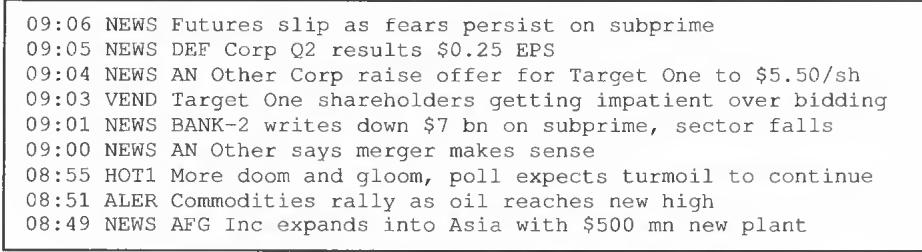  
Figure 14-1 An example news terminal screen

The only real way to handle news in this format is to extract the raw text, also known as "screen scraping". Just like web page scraping, this has been used as a means of merging headlines from a range of sources or adding rudimentary filtering. Although such an approach is useful for delivering headlines for traders to read, it is less suitable for computerised news analysis and interpretation.

In the carly '90s, vendors introduced news feeds that could deliver separate headlines and stories. For example, Reuters journalists tagged each headline and story with specific categorics. The categories covered markets, countries, languages, industries and companies. This was a more versatile delivery mechanism, making storage and retrieval of news much easier. The category codes could be easily used to filter news items. However, the news was still in a single body of text, which had to be parsed for interpretation and analysis.

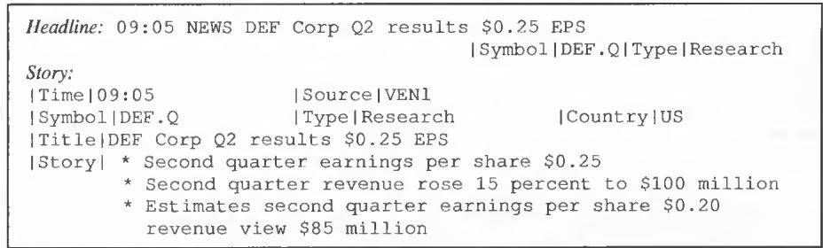  
Figure 14-2 An example categorised news headline and story

A simulated example is shown in Figure 14-2 based on the headline we saw in Figure 14-1 for DEF Corp. The data is delivered in a fully digital format, so for readability it is shown as plain text with the different fields separated (using I characters). The natural progression from this has been for vendors to start digitising the actual news content.

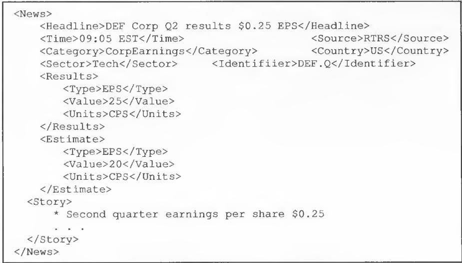  
Figure 14-3 An example elementized news story in XML

Indeed, they have started converting their news feeds for delivery in various formats, often based on the Extensible Markup Language (XML). So our example story might now look something like Figure 14-3 (again reformatted for readability). Clearly, this allows more lields to be added to the data and makes the information easier to access. For this cxample, both the actual earnings per share (EPS) and the estimate figures are now readily accessible for computerised systems, without the need for any text parsing. This allows programs to read in these values in much the same way as they might use bid and olfer prices from market data feeds. Hence, they are much more easily incorporated into rules for trading strategies and algorithms. This technology is already available; for example, the Dow Joncs Elementized News Feed publishes key corporate and economic data clements such as earnings numbers while simultaneously publishing the news stories about the earnings.

# Digitisation of corporate reports/research

Digitisation is also starting to be cstablished for corporate reporting and research. The eXtensible Business Reporting Language (XBRL) provides a framework for corporations to create machine-readable reports. Instead of just being treated as blocks of text and tabular data, XBRL reports ensure that each item has its own unique tag. Thus, every item on the balance sheet or expenses is tagged, and may even be assigned to groups or linked to other items. A taxonomy acts as the classification scheme that enablcs the data and tags to be correctly interpreted. This allows the same set of information to be viewed and processed in a variety of different ways whilst maintaining consistency. Bcing machinc-readable, this should allow automated systems to pcrform most of the routine data processing and validation steps. The hope is that this will free up analysts, allwing them to focus on more value-added aspects, whether they are sell-side rescarchers, buy-side investors, auditing accountants or regulators.

For the companies themselves, XBRL will learly require a lot of work. Hopefully, it will help streamline the process of corporate data collection and reporting, allowing finance divisions to more quickly and reliably generate management reports and financial statements. Still, the uptake of XBRL is most likely to be determined by regulation, rather than longterm efficiency gains.

Clearly, the migration to something like XBRL is a much bigger task than elementized news feeds. Instcad of a handful of major ncws vendors there are hundreds of thousands of companies across dozcns of countries with a wide range of accounting and reporting practiccs.

The main driving force behind the adoption of XBRL will be the U.S. The SEC has already paved the way for filing in XBRL by U.S. companies and is looking to transform its company information database (EDGAR). To date, this has ben a voluntary Giling programme, although it should be mandatory for the largest companies from 2009 and for all public companies by 2011. Other countries have also started adopting XBRL. For instance, in Europe the Spanish Stock Exchange now uses it to receive and distribute reports from over 3,000 listed companics. The National Bank of Belgium has plans to migrate the filing of accounts for commercial and industrial companies to XBRL. Similarly, the UK government plans to make XBRL mandatory for the filing of company accounts. The shift to IFRS (International Financial Reporting Standards), a unified set of accounting standards, should also help case Europe's transition to XBRL. In Asia, the task is more complex, since every country has its own set of accounting standards, each of which will necd to be handled by their own XBRL taxonomies. That said, in 2005 more than 800 Chinese companies filed their half-year reports with the Shanghai Stock Exchange using XBRL. The Tokyo Stock

Exchange has also launched a pilot scheme.

Closely linked with XBRL is the Research Information eXchange Mark-up Language (RIXML). This framework is intended for the distribution of investment and financial research. Taken together, these projccts mcan that most corporate-related rcports will be availablc in complctely machinc-readable formats. Whilst this is most applicable for quantitative investmcnt systems, trading algorithms may also benefit from the ability to quickly interpret thc key information, such as earnings figures/estimates, in real-timc updates. More information on XBRL may be found at www.xbrl.org, whilst the homepagc for RIXML is www.rixml.org.

# Changing sources of news

The internet is steadily transforming the news, in tcrms of how information is supplied and how quickly, as well as from where it may be sourced. The major news wires and press services havc bcen elcctronic for a long time. However, conventional media is starting to face fresh competition from social media, which covers the raft of technologies now used to share information and opinions, such as blogs, mcssage boards, wikis and podcasts. Social media sites can offcr glimpses of information well before it reaches the mainstream media as official press rcleascs and news wires. Figure 14-4 gives a nice illustration of this shift:

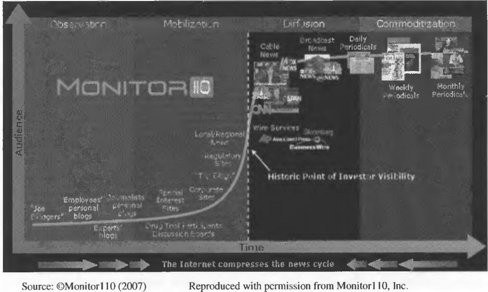  
Figure 14-4 The new information dissemination cycle

Companics, such as Collective Intcllect, trawl through thousands of web sites and message boards to glean useful information. Official press rcleases and other information may be extracted from a rangc of government, regulatory and corporate web sites, whilst opinions and rumours may bc sourced from blogs and discussion boards.

Scrviccs that aggrcgate both conventional and alternative media sources are also being established. These provide a uniform means of accessing data from a huge range of feeds. For instance, Relegence's First Track product scans ovcr 18,000 different business-centric sources, ranging from the news wires and business media, to domestic and foreign newspapers, as wel as government and corporate web sites and blogs. Their Mail Track product can even incorporate email and its attachments. This is particularly useful given how much information is communicated over email, from internal memos to newsletters and research notes. The major news agencies are also starting to offer similar facilics, for cxample, news and information from Dow Joncs is available through their own current awareness solution (Dow Jones Factiva).

Thus, a new breed of alternative and complementary news services has hen created. Will these be the equivalent of ECNs for news?

# Potential benefits

Sourcing information from alternative sources can give a significant head start over more conventional news feeds. For instance, over a fortnight before Google's Q4 2005 earnings announcement a blog created by a Yahoo technologist predicted that they would miss their Q4 estimates. Admittedly, this could be secn as misinformation from the competition, in Tact CNN Moncy picked up the story on January $3 1 ^ { \mathrm { s t } }$ with a report titled "Rival trashes Google's growth prospects". However, the prediction proved to be accurate with the stock falling by up to $10 \%$ shortly after the earnings announcement, as shown in Figure 14-5(a). Clearly, it is much easier to judge such information with hindsight. Although an alternative point of view from a domain expert is still useful, even if it had proven to be incorrect.

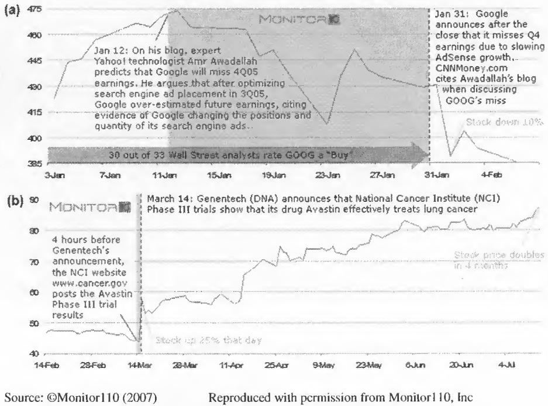  
Figure 14-5 Two examples of information available before the news wires

Blogs and forums are not the only source of news leads; regulatory bodies can also give an insight into upcoming announcements. This is particularly appropriate in the field of medicine. For example, Figure 14-5(b) highlights an example for Genentech: Avastin is their trade name for Bevacizumab, an anti-angiogenic drug that has been approved for use against colorectal cancer since 2004. On March ${ \overline { { 1 4 } } } ^ { \mathrm { t h } }$ 2005, the National Canccr Institute (NCI) postcd the results of Phasc II trials using Bevacizumab combined with chemotherapy for paticnts with advanced lung cancer. Around four hours latcr, Genentech released this news to the press, resulting in a $2 5 \%$ hike in its stock price. Anyone who made the connection between Bevacizumab and Genentech could have had a significant market lead.

# A note of caution

Credibility is vital for news. The news wires and press services have carefully built their reputations over the last century. Still, human or technical errors may mean incorrect news or old stories can sometimcs be picked up: Chief executives have been given premature obituaries and company reports from years before have appcared as if just issued.

Clcarly, when using information taken from alternative sources, such as internet blogs or news forums, more caution must be taken. Fake news announcements are not uncommon for micro-cap or penny stocks, with fraudsters adopting "pump and dump" tactics. Though, as David Leinweber and Ananth Madhavan (2001) point out, large-cap stocks are not immune to such fraud either: They use the example of Lucent Technologies, which in March 2000 saw its market cap drop $\$ 7$ billion in a day, triggered by a series of fake postings. The scam was successful because at the start of the year internet bulletin boards and chat rooms were full of negative rumours about the company, which were confirmed when Lucent issucd an earnings warning on January $6 ^ { \mathrm { t h } }$ So on March $2 2 ^ { \mathrm { { n d } } }$ , when a series of postings suggested that Lucent would not meet their QI earnings projections these carried more wcight than might have been expected. Indeed, Lucent's stock price started to fall rapidly. Then in the same evening, a new posting was made titled "LUCENT RELEASES EARNINGS WARNING! DAMN!" together with comments from a disappointed investor and what appeared to be a press release from Luccnt, similar to the one from January. This was forwarded to over 20 different message boards. The next day, Lucent's price continued to fall before the company was finally able to convince the market that the news was fraudulent. A subsequent SEC investigation found that a single fraudster had used a trio of aliases to post the fake news item together with a barrage of replies and comments to lend credibility to it. The names used were specifically chosen to be similar to those of established posters, although with user names like "hol_like_wasabe" it is clearly hard to tell friend from foe. How did they find the fraudster? Well, unsurprisingly, he made a huge profit from buying Lucent on the $2 2 ^ { \mathrm { n d } }$ and $2 3 ^ { \mathrm { r d } }$ of March.

Hencc, vendors sourcing data from social media sites are incorporating filters and ranking mechanisms to ensure that only the most reliable sourccs are used. Analysts are sometimes involved to ensure additional data quality. Some vendors cven use voting systems to incorporate end-user fcedback on the quality/relevancy of particular articles and sources. Gaining a solid reputation takes both time and results, so for the moment experience gives the established media the edge.

# 14.4 Computerised news handling techniques

Computerised news handling was originally based on simple calcgorisation and filtering tcchniques. In an effort to analyse and interpret this information these have cvolved into even more complex mechanisms.

# News filtering

Given the amount of information available, ncws filtcring is vital to ensure traders and investors notice the stories that are important to them, rather than bcing distractcd by thc general flow of news.

Back in the days of terminals, the ncws services directly controlled the filtering, providing specific pages for key news topics. Whilst "screcn scraping" techniqucs could be used, it was dificult to achieve $100 \%$ accuracy, particularly for companics since a wide range of namcs and abbreviations may be used. Filtering became much easier when vendors started tagging news with additional data, such as the Reutcrs News 2000 category codes. Adding this metadata allowed users to configure custom filters for themselves, based on any combination of category codes. Similarly, elementized news feeds offer the prospect of cven finer grained filtering. Instcad of having to rely on the categorisations assigned by news editors and/or journalists, we can now crcate filters which match on the actual contents of the news.

Outside of the mainstream news services, information on web sites, blogs and forums is much more unstructured. Again, thcsc were initially handled with simple "'scrcen scraping" programs. This has since progressed to more advanced techniques based on textual and statistical analysis, or even natural language processing. Commercial sofi ware to do this data proccssing is becoming available, similarly alternative news feed serviccs have started attaching additional meta-data to the raw information, which may then be used for more standardised filtering.

Clustering is closcly aligned with filtering, ensuring that we do not sce a handful of headlines, from various sources, all for the same event. This can be as simple as removing duplicate headlines. Alternatively, more sophisticated approaches cluster based on their interpretation of the actual information, coping with the fact that cach source may use slightly different headlines for the samc story. This is offered by systems like Relegancc's First Track and Infonic's Burst>.

# News association

News storics all differ in their efects. However, implicit relationships mean that beyond the immcdiate impact, secondary and tertiary effects can also propagate throughout the markcts. For instance, macroeconomic factors will often have more immediate impact on the fixed income and foreign cxchange markets; ultimately, though, they can also affect stock prices. Likewise, bad news for a company may cause its pricc to drop, but it may also affcct the price of its main competition or even the whole sector.

Ideally, we would like to see any associated news that might affect us. For cxample, we could simply reduce the level of filtering, e.g. by shifting the focus from company-level to sector-level. Still, we do not want to be so inundated with news that we miss key items. The goal is to strike the best balance between these two cxtremes. One way of tackling this is to incorporate a dependency model that reflects all the key relationships. For instance, consider a supply chain. It is highly likely that a problem with a component supplicr may also afect other companics, both upstream and downstrcam. In the U.S., firms must disclose financial information for any customer representing more than $10 \%$ of the total sales, or any industry segment that comprised more than $10 \%$ of consolidated yearly sales, asscts or profits. This data may be used to infer the main dependencies.

There are several ways to construct dependency models. For example, services like TextMap crcate them based on analysis of distinct entities from historical news archives. Figure 14-6 shows an association map for news storics about Google.

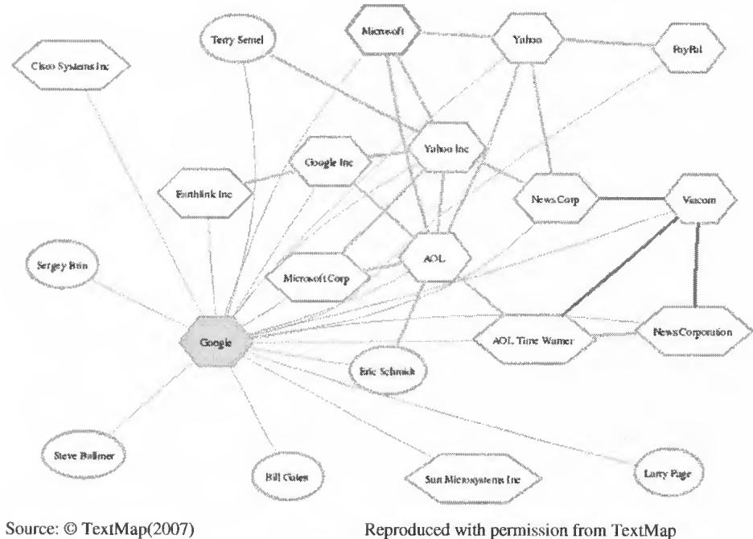  
Figure 14-6 An association map for Google

We could also weight thc importance of each relationship bascd the number of news matches. Though, we should probably also try to incorporate how these correlate with actual asset priccs. Therefore, for the time being the most accurate dependency models are still crcated manually, and gcncrally based on fundamcntal analysis. Hence, Relegence's Connect servicc incorporates proprietary mappings of corporate relationships and supply chains from the broker Credit Suisse.

A nicc example of just how useful such relationships can be is given by Lauren Cohen and Andrea Frazzini (2008). In 2001, the Callaway Golf Corp. was the major customer for Coastcast Corp.'s golf club hcads, accounting for $50 \%$ of their production. On the $7 ^ { \mathfrak { h } }$ of June 2001, Callaway was downgradcd by one of the analysts covering it; the following day it lowered its Q2 revenuc projections by $\$ 50$ million. Effectively, this meant nearly a $5 0 \%$ reduction in its expected earnings per share (EPS), falling from 70 down to 35-38 cents per share. This resulted in a $30 \%$ drop in its market price to close at $\$ 15.03$ on the $8 ^ { \mathrm { t h } }$ of June. Howevcr, such negative news about its largcst customer did not seem to affect Coastcast's share price at all. Cohen and Frazzini searched the archives for thc newswires and financial publications but could find no mention of Coastcast in the two months after Callaway's slump. It was not until July $5 ^ { \mathrm { t h } }$ that the price of Coastcast began to steadily decline, announcing an EPS of -4 cents on July $1 9 ^ { \mathrm { t h } }$

Figurc 14-7 shows thc price changes over this period (normaliscd relative to $\mathbb { I } ^ { \mathrm { s t } } \mathbb { M } \mathrm { a y } 2 0 0 1$ Icvcls). Anyone closcly tracking both companies would have had nearly a month before the price of Coastcast Corp. dropped in a similar fashion to Callaway Golf Corp. To prove their point Cohen and Frazzini tested a strategy of buying firms whose customers had the most positivc returns in the previous month and shorting thosc with the worst. Thcy found

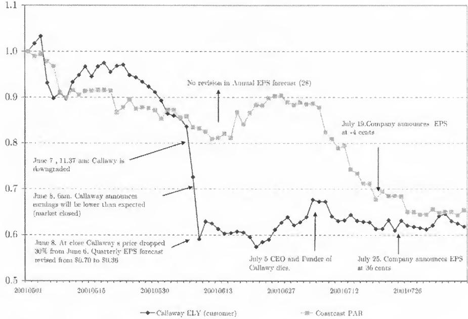  
Source: Cohen and Frazzini (2007), Jourmal of Finance, Wiley-Blackwell Reproduced with permission from publisher   
Figure 14-7 Delayed reaction of Coastcast Corp.'s price to the slump in its leading customer Callaway Golf Corp.

potential annualized returns of $1 8 . 6 \%$ . Unsurprisingly, association based analysis is provin£ to be increasingly popular.

# News analysis

At present, the most common form of news analysis is interpreting its sentiment. Once we can reliably determine whether a specific news item is good or bad we can then start to estimate its impact on the market.

The simplest way of trying to determine sentiment is to look for, and count, specific words, such as "exceeds" or "profits". Clearly, this has its limits, since the text may contain words that by themselves may be construed as positive, e.g. "rising", but in context are actually negative, e.g. "debt is rising". The next logical progression is to extend the counting to phrases. A study by Young-Woo Seo, Joseph Giampapa and Katia Sycara (2002) used bigrams (two linked keywords) to infer sentiment. Their tcchnique extracts the key phrases by first removing any unnecessary words or identities, so "Shares of ABC Company rose" becomes the bigram "Shares rose" for ABC. These bigrams are then translated into a sentiment based on a range of five different classifications, as shown in Table 14-3.

News stories also differ in terms of whether they are reporting facts after the cvent or reflecting predictions for the future. So news that is certain uses phrases like "revenue rose" or "shares lell", whereas uncertain news includes words like expect, forecast, anticipate or warning. Overall, this technique can achieve reasonable results, in particular for simpler text such as news headlines. However, cverything that does not contain a good or bad bigram is classified as neutral, so useful information may be ignored. Therefore, they concluded that its

<table><tr><td rowspan=1 colspan=1>Class</td><td rowspan=1 colspan=1>Examples</td></tr><tr><td rowspan=1 colspan=1>GOOD</td><td rowspan=1 colspan=1>.·.Shares of ABc Company rose % or 2 percenton the Nasdaq to $24-15/16. ...Bigrams: &quot;revenue rose&quot;, &quot;exceeds expectations&quot;, &quot;share rose&quot;, &quot;roseprofit&quot;</td></tr><tr><td rowspan=1 colspan=1>GOOD,UNCERTAIN</td><td rowspan=1 colspan=1>... ABc Company predicts fourth-quarterearnings will be high. ...Bigrams: &quot;expect earnings&quot;, &quot;forecasts earnings&quot;, &quot;anticipate earnings&quot;</td></tr><tr><td rowspan=1 colspan=1>NEUTRAL</td><td rowspan=1 colspan=1>... ABc and xYZ Inc. announced plans to developan industry initiative. ...Bigrams: &quot;alliance company&quot;, &quot;alliance corp&quot;, &quot;announces product&quot;</td></tr><tr><td rowspan=1 colspan=1>BAD,UNCERTAIN</td><td rowspan=1 colspan=1>... ABC (Nasdaq: ABC) warned on Tuesday thatFourth-quarter results could fall short ofexpectations. ...Bigrams: &quot;warning profits&quot;, &quot;short expectation&quot;, &quot;warning earnings&#x27;&quot;</td></tr><tr><td rowspan=1 colspan=1>BAD</td><td rowspan=1 colspan=1>... Shares of ABC (ABc: down $0.54 to $49.37)fell in early New York trading. ...Bigrams: &quot;share off&quot;, &quot;share down&quot;, &quot;profit decrease&quot;, &quot;fall percent&quot;,&quot;sales decrease&quot;</td></tr></table>

Source: Seo, Giampapa and Sycara (2002)

# Table 14-3 Example sentiment classifications

inability to cope with complex grammar prevented it from exceeding $7 5 \%$ accuracy.

A further complication is the fact that news articles frequently contain information on a range of items or companies. Therefore, to ensure an accurate sentiment analysis we really need to be able to extract the exact context of any key words or phrases. This lcad Seo, Giampapa and Sycara (2002) to consider future approaches based on more sophisticated natural language processing (NLP) techniques and semantic analysis. These techniques are more appropriate, since they can cope with more complex grammar. For example, they break down sentences into grammatical units, so phrases such as "profits falling" can be attributed to a specific cntity.

Commercial systems capablc of large-scale sentiment analysis are now becoming available. For instance, Infonic's Sentiment> offers a potential capacity of 10 articles/second at high levels of accuracy. It adopts a hybrid approach: the first phase performs linguistic analysis to extract the key features from cach document. The second phase of processing performs the actual classification, based on machine learning. Numeric sentiments are then assigncd for each story, together with a confidence level. It can also assign separate scores if the story concerns multiple companies. The major news services are starting to offer sentiment analysis as well. Indccd, Reuters has used the Infonic software to make available sentimcnt analysis for their own news fceds via their NewsScope Sentiment Engine.

# News interpretation

The logical progression from sentiment analysis is for systems to be able to perform a full interpretation of the news. Rather than simply deciding whether a given story is good or bad, they start to estimate how much the information should change the asset's price. So interpretation systems will nced to identify and extract all the key information from the news story. Again, this may use NLP based approaches. Alternatively, with the increasing availability of machine-readable news and corporate reports this may just be a matter of extracting data using the required tags.

However the information is sourced, it must then be uscd to determine its effect on the asset's price. Asset pricing is non-trivial, so in order to interprct the potential impact on prices the new information will need to be incorporated into dedicated asset pricing models. Obviously, this is easier to do for some stories than others. For examplc, an announcement of a new contract can mean adjustments to figures for expected sales and costs, whilst the resignation of a senior executive is more difficult to quantify. Morc advanced news interpretation techniques may even try to "read betwcen the ines". For examplc, a study by Antonina Kloptchenko et al. (2004) found that the tone used in company reports often better reflects future performance than the reported results.

The new target prices generated by this analysis may then be uscd to make investment decisions. Still, in terms of execution its use is debatable. The changes may not be reflected soon enough in the markets for execution systems to bencfit from this information in realtimc.

# News mining

News mining combines the analysis of historical data with information from news archives. At present, much of the research focuses on interpreting the text from news headlines/stories and using this to explain price changes. Pattern recognition techniques are used to infer the market impact of news. Artificial intelligence (AI) techniques, such as neural networks or support vector machines, are then trained on this historical data in order to learn how to predict future changes.

As we saw in the previous sub-sections, accurately interprcting the meaning of news is a complex task. Many studies struggle to achicve better than $5 0 \%$ accuracy. Though, given time, it is likely that semantic analysis will improve sulficicntly to make such techniques a worthwhile addition (in the not too distant future). In the meantime, data is also becoming available in machine-readable formats such as XML.

Analysing the short-term impact of news is an easier goal than estimating its mid and long-tcrm effects. By comparing the news data, such as EPS figures, with market expcctations we can determine how much of a surprise the news actually is. If the news meets expectations then the market will most ikely already have incorporated this information into the asset's price, so a significant price change is unlikely. Whereas if the news is a huge surprise then a period of volatility will be likely, whilst the market adjusts to this new information. Section 14.5 provides a review of empirical market studies detailing these short-term effects.

Note that when trying to assess the impact of a particular news story or headline, rather than treating it as a discrete cvent we can look back over prcvious news items to confirm how much new information it actually contains. By chaining together news stories, we can determinc the relativc amount of new information each one contains. Thus, we can start to analyse whether news has a substantial momentum effect. This could also enable us to study how effcctively new information is assimilated by the market, and whether it under or overrcacts to news.

An interesting example is given in a study by Gur Huberman and Tomer Regev (2001). EntreMed Inc. (ENMD) is a pharmaceutical company focussed on releasing drugs for the trcatment of cancer and inflammatory diseases. On May $3 ^ { \mathrm { r d } }$ 1998, the Sunday cdition of the New York Times (1998) had an article on its front page titled “HOPE IN THE LAB: A special report; A Cautious Awe Greets Drugs That Eradicate Tumors in Mice". This outlined the potential of endostatin, an anti-angiogenic protein. Endostatin was found to inhibit the growth of cancer tumours, and in studies on mice had demonstrated no onset of drug resistance. In fact, after repcated cycles it was even found to remove the tumours in mice altogether, efectively curing the cancer. The article also mentioned EntreMed, since they had the licence for producing the drugs based on this research. On the following Monday, EntreMed's price opened at 85 falling to close at around 52, up from 12.063 on the previous Friday, a $3 3 0 \%$ increase. This is shown in Figure 14–8.

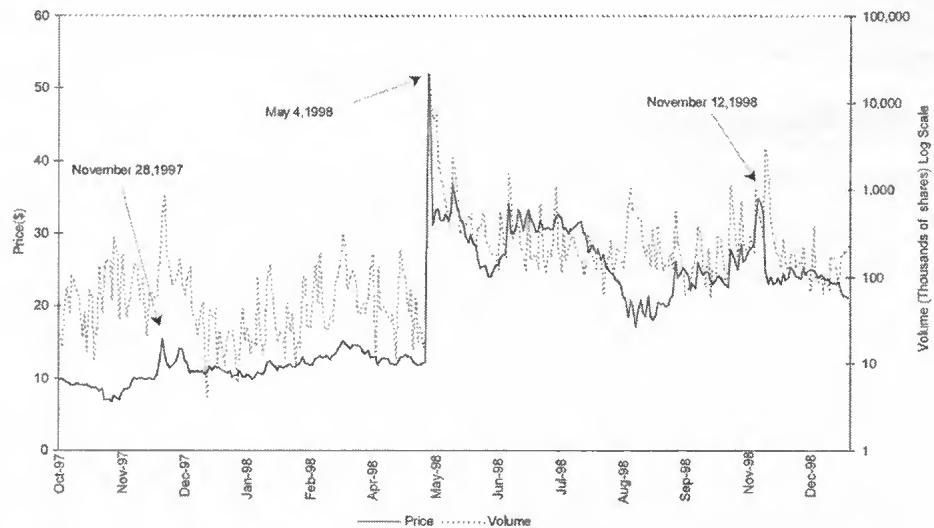  
Sourcc: Huberman and Regev (2001), Journal of Finance, Wiley-Blackwell Reproduced with permission from publisher   
Figure 14-8 EntreMed trading price and volume around news of its new drug

Still, as Huberman and Regev note the news story did not actually bring any significant new information to the market. In fact, it was just a fuller version of an earlier article printed in the New York Timcs (1997) the previous November $2 7 ^ { \mathfrak { u } }$ , titled "Tests on Mice Block a Defense by Cancer". This covered the publishing of the same research results in the journal Nature. There was also coverage on CNN's MoneyLine and CNBC's Street Signs on November $2 7 ^ { \mathrm { t h } }$ . Although this earlier news was released around Thanksgiving, it still saw a sizeable market reaction with a $2 8 . 4 \%$ price increase. They concluded that the key difference would seem to be due to being placed on the front page of the New York Times versus page 28, generating corresponding increases of $3 3 0 \%$ versus $2 8 \%$ . Certainly, there was an overreaction to the news in May. The persistent price increase in EntreMed may reflect an underreaction by profcssional investors in November; alternatively, it may also reflect the massive additional publicity that the company received. So when tracking the impact of news we should also consider how much attention the information might receive.

News mining may also be used to infer relationships that are more complex. For instance, the spillover effects and correlations that can occur between assets, typically across stock industries and sectors. In the case of EntreMed, Huberman and Regev (2001i) note that on May $4 ^ { \mathrm { t h } }$ the seven firms of the NASDAQ Biotechnology Combined Index (excluding ENMD) saw a daily average return of $4 . 8 9 \%$ whilst the spotlight was on this sector.

It is also important to consider other sources of information when carrying out news mining. Asset pricing is complex, so key factors, such as markel conditions or fundamental data, are necessary to explain the asset's price changes. For example, consider the substantial price lag, which we saw for the supplier-customer relalionship between Coastcast Corp. and Callaway Golf Corp. Data mining could be used to check whether any other market variables might explain such a lag, other than investor under-reaclion.

As with any forecasting method, caution must be taken to ensure that data is not overfitted, as we will see in Chapter 15. A common method is to exclude a set period of the historical data and news archives, olten the most recent.Any relationships based on the main dataset may then be retested on the excluded period to check their suitability. Any rules that survive this test may then be exposed to further tcsting with real-time news and prices.

# 14.5 Market reactions to news

News announcements represent a flow of information to the markets. Sincc most asset priccs are based on such information it is hardly surprising that news can have a marked elfect.

A large number of empirical studies have analysed the impact of news for most of the major markets. In this section, we will review these to see the effects of both macrocconomic and corporate news on prices, trading volumes, liquidity and volatility. We shall also consider how other factors, such as the business cycle, affect the market response to news.

# Reactions to macroeconomic news

Macrocconomic news gives a regular indication of the performance of an economy. The announcements may be used to predict future economic growth, so they can have a marked ellect on the trading of most asset classes. For instance, if key indicalors show signs of a recession then governments may be prompted to change interest rales or alter their fiscal policy. Companies may well have to adjust their expected earnings in the light of these new conditions. Likewise, investors may choose to alter their portfolios, shilting to saler larger cap stocks or increasing the proportion of bonds.

The impact of news on asset prices varies somewhat for dilferent assct classes. For example, news of an interest rate drop wil help increase the price of existing bonds, whilst it weakens the currency. For corporations, the picture is slightly more complex, since they may benefit from lower interest rate but may also suffer from the weaker currency. Though, in terms of trading volume, liquidity and volatility, the reaction is generally a significant shortterm increase for all asset classes.

# Price

In their study of U.S. Treasuries, Pierluigi Balduzzi, Edwin Elton and T. Clifton Green (1997) found thal the Non-Farm Payroll announcement had the most impact on prices. The impact was persistent and almost immediate; it also behaved roughly symmetrically hetwecn positive and negative surprises. In addition to Non-Farm Payrolls, they found that announcements for PPI, CPI, Consumer Confidence, ISM/NAPM survey, New Homc Sales, Durable Gods Orders, Housing Starts and Initial Jobless Claims all had a noticeable impact on the market price. For example, Figure 14-9 shows the reaction to the Consumer Price Index for the 10-year note.

A comparable effect was observed for the 5-year Treasury note in analysis by Michacl Fleming and Eli Remolona (1997). The key announcements were hroadly similar, with NonFarm Payrolls dominating, whilst PPI, CPI, Consumer Confidence, ISM/NAPM survey and

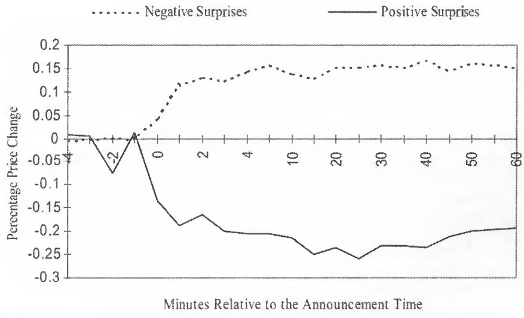  
Source: Balduzzi, Elton and Green (1997) Reproduced with permission from publisher Copyrighi $^ \mathrm { \textregistered }$ 2001, School of Business Administration, University Of Washington   
Figure 14-9 Price responses of the active 10-year Treasury note to surprises in CPI

New Home Sales were also found to be significant. Though, they found Durable Goods Orders and Housing Starts had much less effect. Instead, they observed that Retail Sales and the Federal Funds Target rate were more important, as we can see from their relative rankings in Table 14–4.

Unfortunately, the complexity of the relationship between macroeconomic indicators and bond prices means that each study seems to find slightly different relationships. Some of this may be related to the investment timeseales associated with different assets. Balduzzi, Elton and Green (1997) analysed the effect on 3-month bills, 2-year notes and 30-year bonds. They observed that the size of the reaction tended to increase with the maturity of the Treasury, highlighting the inereased volatility of longer-term bond prices. A later study by Fleming and Remolona (1999) also foeussed on this trend. They found this effeet to occur for most announcements with the exception of the price indices (CPI and PPI) where the reaction seemed to remain constant for maturities over four years.

The number of announcements that affeet different securities also seems to vary based on the maturity date. Balduzzi, Elton and Green (2001) reported that nine announcements significantly affected the price of the 3-month bill, whilst there were 13 for the 2-year note, 16 for the 10-year note, then falling back to 10 for the 30-year bond. This could be due to differences in the applicability of cach announeement to both short and long-term expectations.

For exchange rates, Alain Chaboud et al. (2004) analysed the impact of announcements using data from EBS. They found sudden inereases in price occurred almost instantly, but only lasted for about 5-10 minutes and generally stabilised in less than an hour. Surprises for GDP and Non-Farm Payrolls generally had the most effeet. Overall, they found that news that indicated stronger than expected activity for the U.S. was systematically followed by dollar appreciation. A similar trend was reported in an earlier study by Torben Andersen et al. (2003). They observed the largest price changes for Non-Farm Payrolls and Trade Balance surprises, followed by Durable Goods Orders, Retail Sales and the Federal Funds

<table><tr><td rowspan=2 colspan=1>Announcement</td><td rowspan=1 colspan=2>Effect on:2</td><td rowspan=1 colspan=2>Ranking by:</td></tr><tr><td rowspan=1 colspan=1>Price</td><td rowspan=1 colspan=1>Volume</td><td rowspan=1 colspan=1>Price</td><td rowspan=1 colspan=1>Volume</td></tr><tr><td rowspan=1 colspan=1>Employmcnt (Non-Farm Payrolls)</td><td rowspan=1 colspan=1>-23.1</td><td rowspan=1 colspan=1>60.52</td><td rowspan=1 colspan=1>1</td><td rowspan=1 colspan=1>2</td></tr><tr><td rowspan=1 colspan=1>Producer Price Index</td><td rowspan=1 colspan=1>-8.59</td><td rowspan=1 colspan=1>27.87</td><td rowspan=1 colspan=1>2</td><td rowspan=1 colspan=1>8</td></tr><tr><td rowspan=1 colspan=1>Retail Sales</td><td rowspan=1 colspan=1>-6.51</td><td rowspan=1 colspan=1>39.03</td><td rowspan=1 colspan=1>5</td><td rowspan=1 colspan=1>4</td></tr><tr><td rowspan=1 colspan=1>Consumer Price lndex</td><td rowspan=1 colspan=1>-6.48</td><td rowspan=1 colspan=1>24.56</td><td rowspan=1 colspan=1>6</td><td rowspan=1 colspan=1>12</td></tr><tr><td rowspan=1 colspan=1>New Single-Family Home Salcs</td><td rowspan=1 colspan=1>-5.08</td><td rowspan=1 colspan=1>23.97</td><td rowspan=1 colspan=1>7</td><td rowspan=1 colspan=1>13</td></tr><tr><td rowspan=1 colspan=1>Federal Funds Target Rate</td><td rowspan=1 colspan=1>-4.61</td><td rowspan=1 colspan=1>60.8</td><td rowspan=1 colspan=1>8</td><td rowspan=1 colspan=1>1</td></tr><tr><td rowspan=1 colspan=1>Consumer Confidence</td><td rowspan=1 colspan=1>-4.42</td><td rowspan=1 colspan=1>9.62</td><td rowspan=1 colspan=1>9</td><td rowspan=1 colspan=1>16</td></tr><tr><td rowspan=1 colspan=1>NAPM Survey</td><td rowspan=1 colspan=1>-4.17</td><td rowspan=1 colspan=1>35.83</td><td rowspan=1 colspan=1>11</td><td rowspan=1 colspan=1>5</td></tr><tr><td rowspan=1 colspan=1>Industrial Production</td><td rowspan=1 colspan=1>-3.87</td><td rowspan=1 colspan=1>17.81</td><td rowspan=1 colspan=1>12</td><td rowspan=1 colspan=1>14</td></tr><tr><td rowspan=1 colspan=1>Housing Starts</td><td rowspan=1 colspan=1>-3.42</td><td rowspan=1 colspan=1>12.05</td><td rowspan=1 colspan=1>13</td><td rowspan=1 colspan=1>15</td></tr><tr><td rowspan=1 colspan=1>Gross Domcstic Product</td><td rowspan=1 colspan=1>-3.2</td><td rowspan=1 colspan=1>29.04</td><td rowspan=1 colspan=1>14</td><td rowspan=1 colspan=1>7</td></tr><tr><td rowspan=1 colspan=1>Trade Balance</td><td rowspan=1 colspan=1>-2.5</td><td rowspan=1 colspan=1>4.94</td><td rowspan=1 colspan=1>15</td><td rowspan=1 colspan=1>21</td></tr><tr><td rowspan=1 colspan=1>Construction Spending</td><td rowspan=1 colspan=1>-1.79</td><td rowspan=1 colspan=1>-5.35</td><td rowspan=1 colspan=1>16</td><td rowspan=1 colspan=1>19</td></tr><tr><td rowspan=1 colspan=1>Consumer Credit</td><td rowspan=1 colspan=1>-1.7</td><td rowspan=1 colspan=1>2.24</td><td rowspan=1 colspan=1>17</td><td rowspan=1 colspan=1>23</td></tr><tr><td rowspan=1 colspan=1>Factory Inventories</td><td rowspan=1 colspan=1>1.61</td><td rowspan=1 colspan=1>27.55</td><td rowspan=1 colspan=1>18</td><td rowspan=1 colspan=1>9</td></tr><tr><td rowspan=1 colspan=1>Durable Goods Orders</td><td rowspan=1 colspan=1>-1.41</td><td rowspan=1 colspan=1>-5.1</td><td rowspan=1 colspan=1>19</td><td rowspan=1 colspan=1>20</td></tr><tr><td rowspan=1 colspan=1>Leading Indicators</td><td rowspan=1 colspan=1>-0.46</td><td rowspan=1 colspan=1>2.28</td><td rowspan=1 colspan=1>22</td><td rowspan=1 colspan=1>22</td></tr><tr><td rowspan=1 colspan=1>Federal Budget</td><td rowspan=1 colspan=1>-0.29</td><td rowspan=1 colspan=1>-1.86</td><td rowspan=1 colspan=1>23</td><td rowspan=1 colspan=1>24</td></tr><tr><td rowspan=1 colspan=1>Personal lncome</td><td rowspan=1 colspan=1>0.19</td><td rowspan=1 colspan=1>-1.66</td><td rowspan=1 colspan=1>24</td><td rowspan=1 colspan=1>25</td></tr><tr><td rowspan=1 colspan=1>Business Inventorics</td><td rowspan=1 colspan=1>0.05</td><td rowspan=1 colspan=1>24.88</td><td rowspan=1 colspan=1>25</td><td rowspan=1 colspan=1>11</td></tr></table>

Source: Fleming and Remolona (1997)

# Table 14-4 Impact of macroeconomic announcement surprises on the 5-year U.S Treasury note

Target Rate. Though, there were slight differenccs for the various cxchangc rates, for instance, the Trade Balance had the most impact for Ihe yen/dollar, whilst GDP advance notices were important for both the euro and the Swiss franc versus the dollar.

For equitics, a study by Rui Albuquerquc and Clara Vega (2007) analysed the responsc of the stocks in the Dow Jones Industrial Average (DJIA) and Portugal's PSI-20 indices to macroeconomic news. They grouped the announcemenis into classes, such as consumption and investment, but also analysed the impact of individual announcements. In general, for the DJIA, U.S. macroeconomic announcements led to an immediate responsc that stabilised within the first hour. Though, for the price indices (CPI and PPI) and Initial Unemploymenl Claims Ihey found the impact was only appreciable for around the first ten minutes. Overall, the most positive responses were for good news in Personal Consumption Expenditures, Capacity Utilization, Personal Incomc, the Index of Leading Indicators and the Trade Balance. The most negative responses were for news on the GDP Advance, ISM/NAPM survey, Housing Starts, New Home Sales and the Federal Funds Target Rate. For instance, they found that a one standard deviation unexpected surprisc in the Fedcral Funds Target

Rate could lead to a $0 . 5 \%$ decrease in the DJlA. Similar studies that focussed on the impact of FOMC announcements found around a $1 \%$ response for Federal Funds surprises. Michael Ehrmann and Marcel Fratzscher (2004) analysed the impact on the S&P 500 and Ben Bernanke and Kenneth Kuttner (2005) studied the CRSP value weighted index. Albuquerque and Vega (2007) reason that the difference in results is due to their sample being based on the DJIA which is a small sample of large firms, which are often less affected by monetary policy surprises.

A useful comparison of the effects for a range of futures contracts is provided in a study by Andrew Clare and Roger Courtenay (2001), shown in Figure 14-10. Using data for 1994- 99, they investigated the impact of U.K. macroeconomic and interest rate announcements, whieh are generally released at $9 { : } 3 0 { \mathrm { a m } }$ and $1 2 { : } 0 0 \mathrm { p m }$ The aim of their study was to determine the effect of operational independence being granted to the Bank of England in 1997 allowing the Monetary Policy Committee to set interest rates.

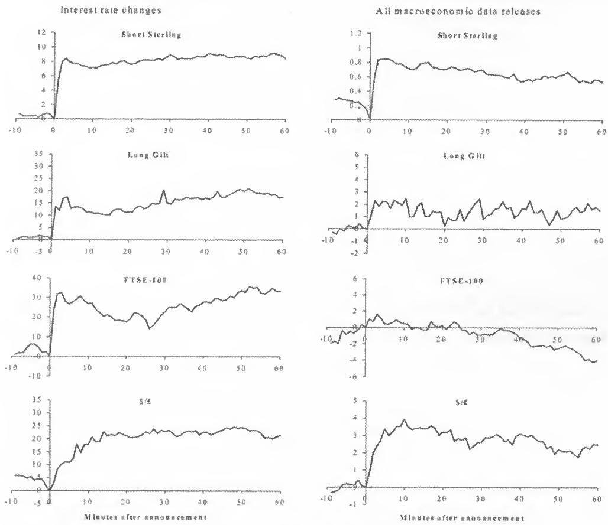  
Source: Clare and Courtenay (2001) Reproduced with permission from Deutsche Bundesbank   
Figure 14-10 Impact of macroeconomic news on the prices of futures and currencies

They tracked the price reaction of curreneies and LIFFE futures contracts for short-term (Short Sterling) and Iong-term (Long Gilts) debt and the FTSE-100 stock index. The average hourly responses are shown in Figure 14-10. From these charts, it is clear that the interest rate changes have much more considerable effeet on both the futures and the currency than other macroeconomic data. Interestingly, the largest overall impact for interest rates was for the FTSE-100 futures, although these had much less response to more gencral U.K. macrocconomic announcements. In comparison, the currency and Long Gilts appeared to be the most affected by general macroeconomic news. The Long Gilts also seemed to be more volatile than the Short Sterling, which is similar to what we have seen for U.S. Treasuries.

# Volume

The fixed scheduling of many U.S. macroeconomic announcements makes their effect on trading activity and volumes easy to spot. For instance, the sudden peak in inter-dealer trading activity for Treasury notes at 8:30am is clear to see in Figure 14-11, taken from a study by Fleming and Remolona (1997). There is also a noticeable peak for the 10:00am news. Fleming and Remolona (1998) observed an almost identical trend for traded volume.

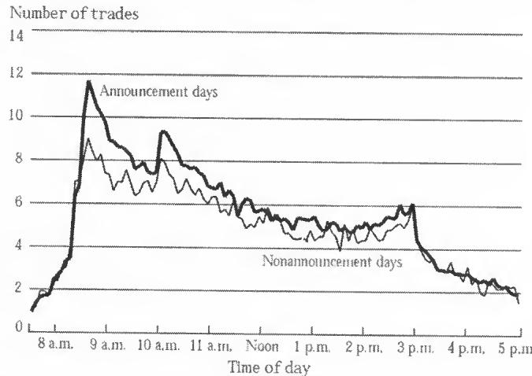  
Source: Fleming and Remolona (1997) Reproduced with permission from Federal Reserve Bank of New York   
Figure 14-11 Intraday activity on announcement days for five year U.S Treasury notes

Therefore, key macroeconomic announcements can lead to large, but short-lerm, increases in trading volume. This has been reported by a wide range of studies. For example, Fleming and Remolona (1998) observed elevated volumes in the 5-year note for over 90 minutes after Employment and CPI/PPI price index announcements. Similarly, a study of the efect of FOMC announcements by Michael Fleming and Monika Piazzesi (2005) analysed the impact for 3 and 6-month bills and 2, 5 and 10-year notes. They found a significant volume increase that lasted for around 45 minutes after the announcements, whilst volumes remained higher than normal for $1 \%$ to $2 \%$ hours.

In the previous section, we saw how each type of announcement had a markedly different effect on the market price. Fleming and Remolona (1997) also analysed the impact of each announcement on the trading volume. The results are displayed back in Table 14-4. The largest influence was held by the Federal Funds Target Rate and the Non-Farm Payrolls, which had virtually identical coefficients from the regression analysis. In terms of importance, these were then followed by Retail Sales, the ISM/NAPM survey, GDP, and PP1 announcements. In total, around a dozen of the announcements had a notable impact on trading volume. Balduzzi, Elton and Green (2001) found a similar number of key announcements.

The volume efects tend to be comparable across the range of Treasury securities, although the relative sizes differ. Fleming and Piazzesi (2005) found the largest percentage increases for the 3 and 6-month bills, with peaks of around $40 0 \%$ . In comparison, the increases for five and ten year notes reached about $1 5 0 \%$ . Likewise, a study by Balduzzi, Elton and Green (2001) found volume for the 10-year note peaked at around $1 7 0 { - } 2 0 0 \%$ of normal levels within the first fifteen minutes after the announcement. Though, for the 3- month bill they found the volume effects to be much weaker.

Another trend Fleming and Piazzesi (2005) reported was a slight decrease in volumes around an hour before the announcements. They attribute this as being "the calm before the storm" when traders wait to see what news the announcement brings. Fleming and Remolona (1998) noted a slight lag of up to two minutes after the announcement when volumes remain at normal levels. This might be attributed to a delay whilst the market reacts to the news.

For cxchange rates, Chahoud et al. (2004) focussed on a subset of indicators in their study of the impact of macroeconomic announcements. The reactions shown in Figure 14-1 2 arc for Employment (Non-Farm Payrolls), since this had the largest impact. Note this is essentially a percentage change, since 100 represents the average one-minute volume. For comparison, the average volumes for non-announcement days are shown as dotted lines.

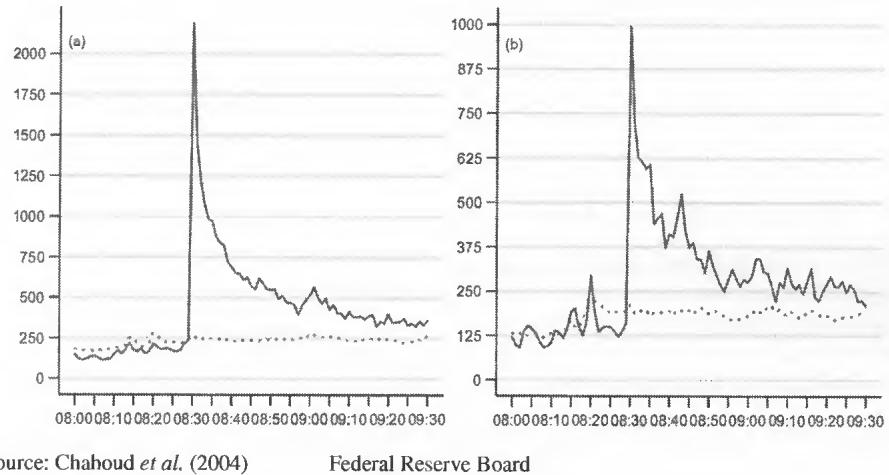  
Figure 14-12 Average one-minute volume on announcement days for (a) Euro/Dollar, (b) Dollar/Yen

GDP has ncarly as much effcct, followed by Retail Sales, Trade Balance and the Producer Price Index. The FOMC results had less immediate impact; however, their overall effect secmed to last longer. In addition, as we can see from the relative scales in Figure 14-12, the Dollar/Yen was much less affected than the Euro/Dollar; this trend was consistent across the other macro indicators.

# Liquidity

An appreciahle increase in the bid ofer spread often accompanies macroeconomic announcements. For instance, Fleming and Remolona (1998) observed sharp increases in the spread for five year U.S. Treasury notes around 8:30 and $1 0 { : } 0 0 { \mathrm { a m } }$ on announcement days. Empirical studies also find a consistent trend for the effect on the bid offer sprcads: Just before the announcement, they start to widen, peaking around the time of the news. The spreads remain at higher than normal levels for between half an hour to two hours afterwards. Fleming and Piazzesi (2005) found the 10-year note rccovered fastest, in around 30 minutes. The 3 and 6-month bills and the 2-year note took much longer to recover. A similar effect was noted by Fleming and Remolona (1997a) and Balduzzi, Elton and Green (2001). The latter study also notes that the Employment report caused the most cffect, both in terms of the size of the spread increase and its duration.

# Volatility

The effect of news on short-term volatility can be extremely important, often more so than its effeet on trading volumes. Some of the volatility is due to the market adjusting to the new information delivered in the news announcement, whilst some of it is also due to the sudden changes in trading volume and liquidity.

For U.S. Treasuries, the distinctive spikes in response to macroeconomic news at $8 { : } 3 0 { \mathrm { a m } }$ and 10:00am are again evident in Figure 14-13 (as a standard deviation of log price changes), laken from Fleming and Remolona (1997).

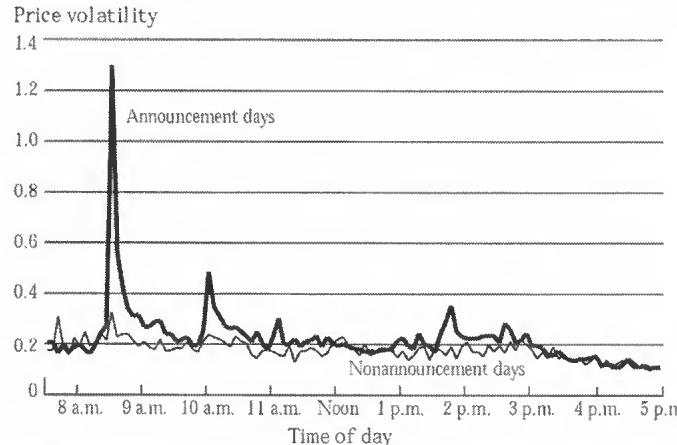  
Source: Fleming and Remolona (1997) Reproduced with permission from Federal Reserve Bank of New Yorl   
Figure 14-13 Intraday volatility on announcement days for 5 year U.S Treasury notes

Studies by Fleming and Piazzesi (2005), Fleming and Remolona (1997a) and Balduzzi, Elton and Green (1997) all found that volatility increased immedialely after the announcement, remaining at higher than normal levels for over an hour. For instance, Balduzzi, Elton and Green (1997) found that the volatility for the ten-ycar nole stayed at more than twice its normal levels for 30-45 minutes afterwards. Fleming and Piazzesi (2005) found that the largest changes in volatility were for the 3-6 month bills and the 2-year notes.

In terms of the actual announcement types, Balduzzi, Elton and Green (2001) found that the largest increases in volatility were for the employmenl and PPl announcements, both for 3-month bills and 10-year notes.

For exchange rates, there is a similar spike in volatility around the announcement, as shown by the average absolute one-minule returns in Figure 14-14, taken from a study by Chaboud et al. (2004).

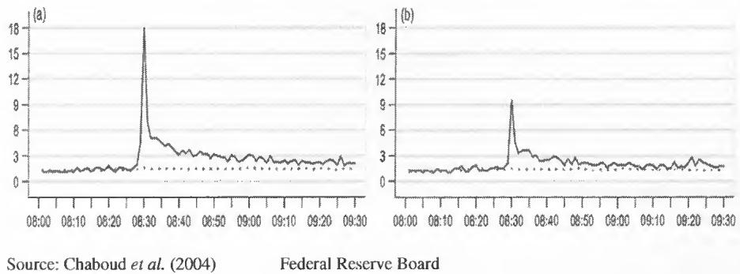  
Figure 14-14 Intraday volatility (in bps) on announcement days for (a) Euro/Dollar, (b) Dollar/Yen

They found that volatility also follows the same trends that we saw for FX trading volumes. Hence, announccmcnts for employment, GDP and target federal funds rate had the most impact, followed by rctail salcs, trade balance and the PPI.

# Reactions to corporate news/announcements

Corporatc news is obviously much more closely linked to specific assets than macrocconomic news. That said, the information may also have a considerable effect on other firms in the same industry/sector, or the supply chain.

Earnings announcements are the corporate equivalent of macroeconomic indicators, so therc is a lot of activity around these. Indecd, analysis of S&P 500 companies by Paul Tetlock, Maytal Saar-Tscchansky and Sofus Macskassy (2008) found that company news tended to cluster around earnings announcements.

# Price

In a study of French stocks, Angelo Ranaldo (2008) confirmed that news events, and parlicularly earnings announcements, triggered significant short-term price changes. The effect on priccs was much larger and lasted for up to an hour for earnings announcements, relflecting the additional information that they convey. He also noted that for intraday announcements the shift in prices actually started around ten minutes before a corresponding news item in his data. Potentially, these premature market movements are due to the fact that there arc many sources of information available to traders, whilst his study focussed on Reuters hcadlines.

An intercsting analysis of the effect of overnight earnings announcements was carried out by Louhichi Wael (2008), again for French stocks. Overall, he found that prices could increase by $1 . 7 \%$ for stocks where thc announcement was good news, whilst bad news led to a fall of around $1 \%$ These abnormal returns persisted for well over an hour for both types of news. Since his study focussed on overnight announccments most of these changes were achieved in the opening auction, yielding an increase of $0 . 9 6 \%$ for good news and $- 1 . 2 8 \%$ for bad ncws. He also observed a slight rcversal around half an hour after announcements of bad news, suggesting a possible initial overreaction.

For stocks, the effects of news can last days, weeks or even longer. Wael's (2008) study also analysed the performance for six days beforc and after each announcement. He found the abnormal results were mainly centred on the announcement day, although there were some minor reversals over the following days, particularly for bad news. The mid-term effect of news items on U.S. stock returns was also analysed by Paul Tetlock, Maytal SaarTsechansky and Sofus Macskassy (2008). They tracked around 350,000 news articles for S&P 500 companies. The news was taken from both the Dow Jones News Service (DJNS) and the Wall Street Journal (WSJ) from 1980 through to 2004. Stories were classified as positive or negative using lexicon-based sentiment analysis. Overall, they found effects persisted for over ten days after the announcement. Figure 14-15 shows a plot of the abnormal event returns covering ten days before and after a news story.

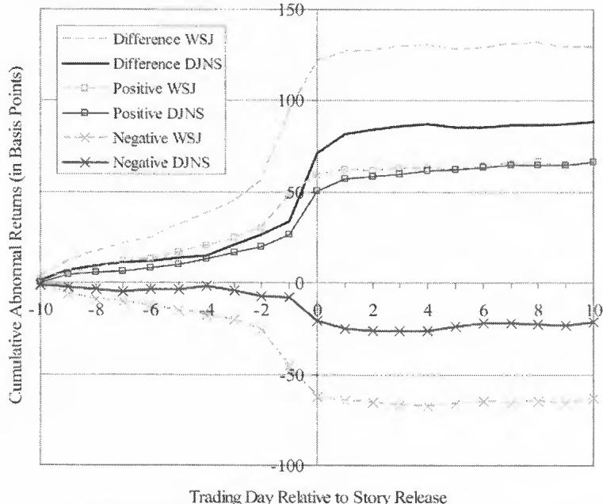  
Souree: Tetloek, Saar-Tsechansky and Maeskassy (2007), Journal of Finance, Wiley-Black well Reproduced with perrnission from publisher   
Figure 14-15 Firms' valuations around news stories

As we can see in Figure 14-15, positive news led to similar improvements in returns, although the reaction to news from the Dow Jones news wire seemed to lag behind that for the Wall Street Journal. Whereas for negative news, there was a marked diference in the losses, with more effect seen from news published in the Wall Street Journal. They also noted that the market anticipated the news over the preceding days. In fact, the returns the day before the announcement could be nearly as important as those on the actual day the story broke. There was also a noticeable delay in seeing the full effect of the news, suggesting that it takes the market a while to fully react to it. This drift can actually last several days. The slight reversal that is visible for the reaction to bad news from Dow Jones also suggests that there may be a slight overreaction for bad news.

An earlier study of U.S. stocks by Wesley Chan (2002) found broadly similar results. He noted that stocks experiencing negative returns associated with news stories continued to under-perform their peers. In comparison, stocks with similar negative returns but no public news tended to see a price reversal in the following month. Much less price drift was evident with positive returns. He also found the drift to be more pronounced for smaller and less liquid companies.

One of the factors that make corporate announcements different from macroeconomic news is that the exact dates of these notices can vary considerably. Estimates for these used to be from calendar-based calculations, although it is becoming more common for firms to provide the expected dates for their next announcement. Products such as Thomson Financial's First Call Corporation now provide centralised sources for these dates. Other than providing a warning for upcoming announcements, the estimated dates may actually be used to help predict whether the news will be good or bad. This is because firms tend to be keen to announce good news and defer issuing bad news. A more quantitative analysis of this cffeet was performed by Mark Bagnoli, William Kross and Susan Watts (2004). They analysed the returns for U.S. stocks based on the lag between the estimated dates and the actual corporate announcements, for around 26,000 examples between 1995-8. They found that, on average, late announcements contained bad news $4 4 . 5 \%$ of the time, whilst this was only $3 6 . 1 \%$ for early or on-time announcements. The proportion increased so that after seven days late more than $50 \%$ of notices had bad news. For reporting losses they found that this was more than $90 \%$ more likely with late announcements than on-time ones. They found no such ohvious trends for firms that made early reports.

Overall, Bagnoli, Kross and Watts (2004) discovered an average fall of one penny/share below the consensus forecasts for each day of delay from the expected date of the announcement. In terms of market prices, they observed similar declines for stocks that were late in making announcements. For instance, a delay of four days led to a cumulative loss of around $1 \%$ of returns. In addition to these losses, they also noted that the market reaction on the actual day of the announcement dcpended on how late it had been. Firms that reported late saw even more adverse reactions to bad results than those with similar results who reported on time. In comparison, they found the market reaction to be morc aggressive for early announcements.

# Volume

Unsurprisingly, corporate news also leads to noticeable short-term volume increases. Ranaldo (2008) observed this in terms of hoth volume and number of trades in his study of Frcnch stocks. Wael (2008) also found that lor hoth good and bad news trading volumes increased slightly up to thirty minutes before the news breaks. Though, the most significant shift was still centred in the ten minutes around the actual announcement. He also noted that the heightened trading volumes persisted for around two days when the news was bad, and for five days after good news. Similar volume effects were found for the Spanish stock exchange by David Abad, Sonia Sanabria and José Yagüe (2005). They noted that both trading volume and frequency were unusually high up to three hours before the announcement, together with a sizeable increase when the news was released. These effects then persisted at abnormal levels for the rest of the trading day.

As we havc alrcady seen with prices, the effect of news on trading volumes can often be more prolongcd for stocks; indeed, the volume increase can drift over days and weeks. For examplc, a study of U.S. stocks by Joon Chae (2005) found announcements had a considerable effect on volumes for more than 15 days afterwards. He also noted that the volume preceding scheduled earnings announcements actually decreased slightly in anticipation of the results. Although for unscheduled announcements, such as changes in Moody's ratings, takeovers or acquisitions, he found that the volume increased noticeably in the days belorehand.

# Liquidity

The effect of corporate news on liquidity is less clear-cut, since the results of empirical rescarch are mixed. Some studies find marked decreases in liquidity around announcements whilst some report increases and others find the changes to be negligible.

A decrease in liquidity around corporate announcements has been noted for studies of the NYSE by Kenneth Kavajecz (1999), Itzhak Krinsky and Jason Lec (1996) and Charles Lee, Belinda Mucklow and Mark Ready (1993). These showed how the quoted sprcads increased whilst the available depth, from both specialists and the order book, decreascd. Similarly, Jean-Frangois Gajewski (1999) found that spreads widened after corporate announcements for French stocks.

A noticeable increase in liquidity was found to occur after the announcement in a study of the Spanish stock exchange by Abad, Sanabria and Yagüe (2005). They used a wide range of measures to analyse the available liquidity. In the time before the announcement, they found no notable changes in the bid offer spread or order book depth. Though, for around 90 minutes after the announcement, they observed a marked narrowing of the spread and an increase in the available depth. After this period, these returned to more normal levels. Wael (2008) found a similar decrease in spreads for French stocks, but also noted that spread levels were noticeably higher in the days preceding the news. Alternatively, Kazuhisa Otagawa (2003) found a consistent decrease in spreads both before and alter quarterly earnings announcements for Japanese stocks. On the announcement day, market depth was found to improve slightly as well.

Not al research has found a noteworthy change in liquidity around corporate news cvents. For example, in a study of German stocks Peter Gomber, Uwe Schweickert and Erik Theissen (2004) tracked changes using the Xetra Liquidity Measure (XLM). Overall, they found no significant changes in the available liquidity at the time of the actual news item. Though, they did observe a slight decrease in liquidity in the fifteen minutes before the news release, which they atribute to traders having access to muliple information sources. The effect was most noticeable for the less liquid non-DAX stocks. Fifteen minutes alter a news item, their XLM cost had increased by around $3 \%$ hence giving a slight reduction in their overall liquidity. In comparison, DAX stocks actually saw around a $3 \%$ reduction in their XLM cost alter a news item, suggesting a slight improvement.

Some of these differences may be attributable to the markets being studied. For instance, markets where liquidity is provided by market makers or specialists may well exhibit increased spreads around announcements, as dealers try to minimise the cost of trading with more informed traders. Though, as Ranaldo (2008) points out, this efect may be reduced by competition betwcen liquidity providers. In some markets, the liquidity may shift to hidden orders or on to "dark pool" ATSs. For instance, a study of the INET ECN (now part of NASDAQ) by Bidisha Chakrabarty and Ken Shaw (2006) showed that hoth the number and average size of hidden orders increased around earnings announcements, asting up to seven days afterwards.

The information content of the news is another potential factor. An incrcase in liquidity after an announcement may suggest a decline in information asymmeiry between traders. A study of French stocks by Faten Lakhal (2008) found that the uncertainty around earnings forecasts triggered an incrcase in spreads, leading to a decrease in the availablc liquidity. In comparison, the certainty of quarterly announcements was found to lead to an increase in liquidity. Wael (2008) also noted that the immediate impact on liquidity after an announcement was very much dependent on what information was imparted.

Announcements that met expectations (no news) saw an immediate decrease in their spreads, which then gradually rcverted to normal levels over the next 90 minutcs. Unexpected news took longer to react: For good news, spreads returned to normal about half an hour afier the announcemcnt, whilst for bad news they took nearly an hour. Similarly, unexpectcd news seemcd to lead to much higher spreads in the half hour before each announcement, again this cffcct was most pronounced for bad news.

The level of information may also be reflected in diferences between quarterly and annual reports. A study of earnings announcements by Theresa Libhy, Robert Mathieu and Scan Robb (2002) found that the changes in liquidity were grcater for quarterly announcements than annual ones.

Dispersion in market cxpectations may be another factor accounting for these differcnces. For instance, a study of NASDAQ by John Affleck-Graves, Carolyn Callahan and Niranjan Chipalkatti (2002) found that firms with less predictable carnings had consistently higher sprcads, particularly in the days around announcemcnts.

Onc last potential factor is the timing of the announcements. A study of the Spanish stock exchange by Abad, Sanabria and Yagie (2005) found that overnight announcements led to an immediate improvement of liquidity at the following open. They reasoned this was becausc investors and traders had the time to properly cvaluate the information. For intraday announcements, they found that it took around 90 minutes after the news before a notable improvement in liquidity was observed. They also notcd a tendency for Spanish firms to prefer intraday releascs when earnings were lowcr than cxpected.

# Volatility

Volatility is usually higher immcdiately after a corporate announcement. Ranaldo (2008) found higher levels to persist for 10 minutes after firm-specific news and for over 40 minutes after carnings announcements. Likewise, Abad, Sanabria and Yagüe (2005) noted significanily raiscd levels of volatility for around 45 minutes after earnings announcements.

The volatility may also he affected by whether the ncws is good or bad. Unsurprisingly, after bad ncws Tetlock, Sar-Tsechansky and Macskassy (2008) found there to be higher Icvels of volatility. Wael (2008) also noted that it takes longer for the market to adjust to bad ncws than good. Thus, higher volatility persisted for nearly an hour after bad news, compared to around half an hour for good news.

# Other factors which affect the impact of news

The effect that news has obviously depends on the information that it brings to the market. News providcs information that either confirms or confounds the market consensus. So the degrce of surprise indicates how the market will react. The timeliness of ncws also dictates whether it is ncw information or simply a confirmation of existing data.

Market conditions and the business cycle are another important consideration, since these reflect investor sentimcnt. In a declining market, even good news can fail to huck the trend. Therefore, the reaction to news is also dependent on the prevalent conditions.

# Reactions to surprises

In order to gauge the degree of surprise, we necd a common source of expectations. For macroeconomic indicators this means data from consensus forecasts. These are provided in publications such as the Wall Strcet Journal and Barron's. Another source, widely used in research studies, is the consensus forecasts from Moncy Markct Services International (MMS). These surveys of money market managers provide cstimates for what they expect the upcoming economic announcements to be. Based on these expected values, we can ther determine how much of a surprise the actual announcements really are.

In their analysis of U.S. Treasuries, Balduzzi, Elton and Green (1997) confirmed that the size of the surprise aflected the price change. They highlighted the potential impacts by expressing the price changes caused by a one standard deviation surprise, as a percentage of the daily volatility, shown in Table 14-5.

<table><tr><td rowspan=1 colspan=1>Macroeconomic announcement</td><td rowspan=1 colspan=1>Price change as %of daily volatility</td></tr><tr><td rowspan=1 colspan=1>Non-Farm Payrolls</td><td rowspan=1 colspan=1>89</td></tr><tr><td rowspan=1 colspan=1>PPI</td><td rowspan=1 colspan=1>39</td></tr><tr><td rowspan=1 colspan=1>CPI, Durable Goods Orders, Retail Sales,NAPM Index, Consumer Confidence</td><td rowspan=1 colspan=1>25-30</td></tr><tr><td rowspan=1 colspan=1>Initial Joblesss Claims, CapacityUtilization,Industrial Production, New Home Sales</td><td rowspan=1 colspan=1>12-19</td></tr><tr><td rowspan=1 colspan=1>Factory Orders, M2 Medians</td><td rowspan=1 colspan=1>4-9</td></tr></table>

Source: Balduzzi, Elion and Grecn (1997)

# Table 14-5 Effect of macroeconomic surprises on U.S. 10-year Treasury notes

For cxample, a one standard deviation surprise in Non-Farm Payrolls was around 1 10,000. An unexpected announcement with a corresponding increase could lead to a price change equivalent to nearly $90 \%$ of the daily volatility. Given a daily volatility of $0 . 4 7 \%$ for the 10- ycar note, this equates to a price change of $0 . 4 1 8 \%$ due to the surprise. They also confirmed that procyclical indicators, such as Non-Farm Payrolls, had a negative effect on bond prices, whilst counter-cyclical ones, such as Initial jobless claims, had a positive elfect.

In terms of trading volume, Balduzzi, Elton and Green (1997) found little evidencc for it being affected by the size of surprises. They reasoned that the trading volume is more closely related to the dispersion of views across the market.

# Timeliness

The timeliness of an announccment particularly applies to the regular macroeconomic announcements. It helps quantify their information content by relating them to the data they are based on. Fleming and Remolona (1997) used the timeliness of an announcement to help explain its impact on U.S. Treasury prices. Likewise, David Vcredas (2006) used it to explain the behaviour of Treasury futures.

For example, Figure 14-16 shows some of the major U.S. macroeconomic announcements ordered in terms of the data they are based on, taken from an article by Fleming and Remolona (1997). Consequently, the forward-looking Consumer Confidence measure is on the far left hand side. The majority of announcements are in the middle since they report on results for the previous month. On the right hand side, the Trade Balance reports two month old data, so as an announcement it imparts less new information to the market when compared to other indicators. Less timely reports are likely to have less impact on prices and volumes, which is indeed what Fleming and Remolona (1997) obscrved for the U.S. Treasury markets. Hence, the timeliest reports, such as Employment, PP1, CPI and Retail Sales tend to have the strongest effects.

In comparison, the forward-looking indicators, namely Consumer Confidence and the ISM/NAPM survey have slightly less impact. This is probably because they are forecasts

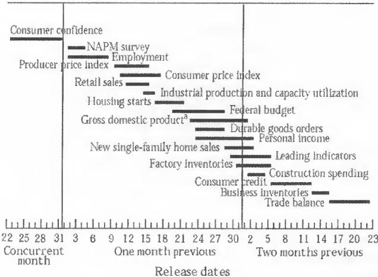  
Source: Fleming and Remolona (I997) Reproduced with permission from Federal Reserve Bank of New York   
Figure 14-16 U.S. macroeconomic announcement release dates

rather than actual reports, so the bond markets aribute more weight to the real data.

Veredas (2006) took a similar approach in his study of the 10-year U.S. Treasury note future. He used timcliness to rate the impact of different announcements, as shown in Figure 14-17. The forward looking consumcr confidence (CC) and ISM/NAPM surveys were given more weight by the futures market, whilst cmployment remained the most significant report. As with the underlying bonds, important announcements such as GDP and the trade balance actually had only a limited effcct, since they relay very litle new information.

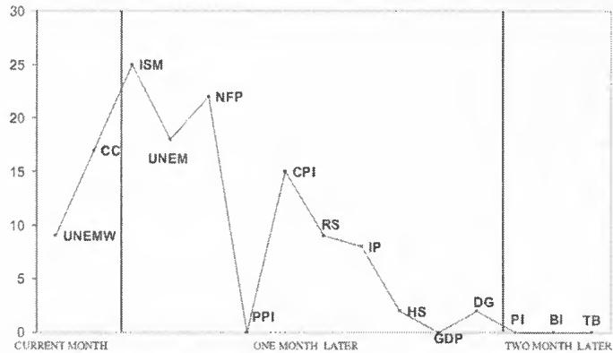  
Source: Vredas (2006), Journal Empirical Economics, Physica-Verlag Heidelberg, Reproduced with permission from publisher   
Figure 14-17 The impact of timeliness for the U.S. 10-year Treasury note future

Another point to consider is that market reactions are not always for the latest figurcs. Revisions to key macroeconomic indicators can have a considerable effect as well. Indeed, Veredas (2006) notes that the repeated revisions for GDP help to reduce market intercst in it as an indicator.

# Market conditions

In their study of the response of U.S. Treasurics to news, Fleming and Remolona (1997) also considered the potcntial effects eaused by market eonditions. They demonstrated that the price reaetion for a given surprise was often greater during conditions of increased uncertainty. As indicators for market uncertainty, they used the implied volatility of Treasury futures options together with the expected change in the Federal Funds Target Rate. For thc price impact on the 5-year note, they found that the uncertainty from implicd volatility helped explain the market reaction to announcemcnts for Durable Goods Orders, Housing Starts and GDP surprises. The expected change in the Federal Funds Target Rate helped explain the reaction of Employment and Durable Goods Orders surprises.

In tcrms of trading volume, thcy noted that both indicators still had an cffcct, although the links were somewhat weaker than for prices. Both indicators of uncertainty helped explain thc increases for CPI, PPI and Trade Balance surprises. As with prices, the expected Federal Funds Target Rate also helped to account for the inereascs for Employment and Durable Goods Orders surprises.

# Business cycle

The busincss cycle is closely related to market conditions. We can break down the cyelc into four main stages whieh refleet when the market is at its top or bottom, and when it is either expanding or contracting. News surpriscs may well have considerably differcnt impacts depending on what stage of the business cycle the market is at. Intuitively, we might expcct the most impact to be in the expansion and contraction parts of the cycle, sincc these phascs are more likely to have higher uncertainty/volatility.

One measure of the business cycle is an index from the Institute for Supply Management (ISM). Unlike factors like the GDP, it is a forward-looking measure, based on a survey of market expectations from the manufacturing industry. More details about the ISM may he found in Niemira and Zukowski (1998).

David Veredas (2006) used the ISM to confirm whether business cycles do indeed alter the impact of macroeconomie news on the price of U.S. 10-year Trcasury note futures. He found a strong inverse correlation (-0.71) between the futures price and the ISM, which is shown in Figure 14-18. For each peak in the ISM, the price of the Treasury future was generally at a low, and vice versa: Based on historical data, Veredas (2006) concluded that when the ISM was above 55 the business cycle was at a top, whilst below 50 it was at a bottom. In between this range, a rising value was treated as the expansion part of the cycle, whilst a falling onc indieated a contraction.

Veredas also analysed the impact of surpriscs on the price of the futures contract during specific cyeles. Overall, he found that news tended to have more effcct in down cycles than in up cycles. He noted that bad news had more impact in good times than bad, whilst good news had less effect when the cycle was already depressed. As an illustration of this Figure 14-19 shows corresponding plots of the impact of surprises in the figures for Consumer Confidence. Note that the solid lines show the average response whilst the doted ines are only negative surprises and the dashed ines only positive ones. The time axis represents tenminute intcrvals.

When the business cycle is down or eontracting (shown on the right hand side of Figurc 14-19) we can see that any type of news has a negative impact on priccs. Interestingly, in these depresscd phascs positive surprises seem to cause the most impact.

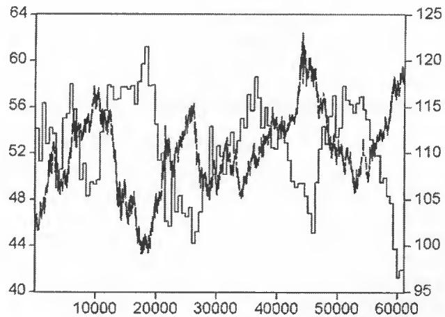  
Figure 14-18 ISM versus the U.S. 10-year Treasury note price (continuous, right axis)

Source: Veredas (2006), Journal Empirical Fconomics, Physica-Verlag Heidelbcrg, Reproduccd with permission from publisher

Source: Veredas (2006), Journal Empirical Economics, Physica-Verlag Heidelberg, Rcproduced with permission from publisher

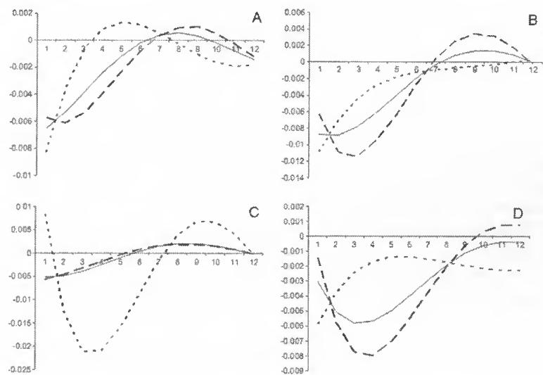  
Figure I4-19 Impulse responses of U.S. 10-year Treasury note price to shocks in Consumer Confidence when economy is in the (a) top, (b) bottom, (c) expansion, (d) contraction part of the cycle

When the cycle is at a top or in expansion (shown on the left hand side of Figure 14-19), we can see that ncgative surprises led to the largest price drops. Overall, for Consumcr Confidence the most significant pricc drop seems to be caused by negative surprises in an expansion cyele. Veredas notes that whenever the indicator was against the trend it seemed to have more impact, probably due to more publicity. It is also worth noting thal in most of these cascs the initial impact dissipated reasonably quickly, with the prices returning to normal within one or two hours of the news.

# 14.6 Incorporating news into trading strategies

Precognition, or "second sight", would clearly be a very useful add-on for most investment and trading stralegies. However, the focus of this book is on execution, not investment. Though we may not be able to reliably predict exactly what information news will bring, we can still cstimate how the market might react, as we saw in the prcvious section. These shorlterm predictions of market conditions may enable our trading stralegics to lake advanlage of the market response, rather than simply reaeting to the rapidly changing conditions.

Even though we are using news to augment trading strategics, rather than to generatc invcstment ideas, certain precautions are still necessary. Corrcct interprctation is vital otherwise, the estimates for the market response will be wrong. The aecuracy and validity of information is also important.

An easy way of incorporating news into trading strategies is to use indicators. They provide a simple means for algorithms to interpret whether news is good or bad, and so respond accordingly. These may then be added to adaptive trading algorithms alongside the price trend and short-term liquidity indicators that many already usc. In the future, we might also start to sce more opportunistie news-driven algorithms.

# Precautions for automated news handling

We have become used to trading algorithms and execution tactics routincly making automatic decisions about the location, price and size of orders. These decisions are often bascd on a mix of historieal and real-time market data, and the responses arc driven by rules spccified by expert traders and subjected to rigorous testing. Incrcasingly, though, algorithms are becoming cven more adaptive, responding dynamically to changing market condilions, such as liquidity. Therefore, reacling lo news may just be viewed as another real-time adaptation. Just as with anything clse, the standard computer maxim of "Garbage in, garbage out" applies. Bad data or poor interprelations could lead to cxpensive mistakes.

Market condilions, such as prices, spreads or depths, correspond to actual quantiliable factors. News is always an interpretation, even if this is done by a vendor rather than inhouse systems. Thus, accuracy and authenticity are obviously key concerns when leaving a system to automatically rcact to news headlines/stories. Though, in the short-tcrm, whether it is inaccurate or even false is less signifieant, since the whole market reacts to the same news.

Given thal bad news dala of one sort or another is almost certain to creep through at some point, it is important to apply some additional controls/sanily checks. If the market reacts as expected then we may assume the ncws is being treated as valid by other markel participants. If not, then it may be saler to trigger an alert allowing a trader to monitor the situation and either intervene or resume the trading algorithm. Thesc checks may nced to be performed repeatedly afier any news announcements. So an immcdiate aggressive response to a news item may not be the best approach, although neither is waiting until the market reaction has subsided. We nced to strike some sorl of balance, trying to safely capitalise on advantageous conditions without laking exeessive risks, much like the behaviour of an adaptive shortlall or a liquidity-based algorithm.

On the other hand, we may not even be alerted about a news story. The news liltering may not identify the story as being relevant for our order. News handling systems may lail to correctly identify the key entities affected by the story. Alternatively, the news vendor might accidentally miss an important tag, or fail to consistently tag all stories in the same way. Whatever happens, though, the news will still spread and the market will still react. Hence, in such cases we are reliant on the trading algorithm simply adapting to the changing market conditions, just as it would if there were no news component.

# Potential news-based indicators

Converting textual information from news into a numeric indicator makes it much easier for computer-based systems to react to it. Obviously, this is easier to do for some news, such as macroeconomic or earnings announcements, than others. As we saw in section 14.3, the increasing digitization of news and corporate reports means that soon much of this key information will be readily available digitally.

News indicators can range from a simple count of the number of stories to more complex sentiment-based analysis. They can also be used to quantify the diference between consensus estimates and actual announcements.

# News flow

Following the old adage "There is no smoke without fire'", news flow is itself an important trading signal. The sheer volume of news items can be just as much an indicator as the actual information they convey. Clearly, we cannot reliably use the number of headlines to predict future prices; for that we need to know whether the news was good or bad. Though, a sudden rush of headlines does suggest that volatility may increase, since uncertainty breeds volatility. Therefore, by tracking the amount of news generally associated with a given topic or asset we can determine historical averages.

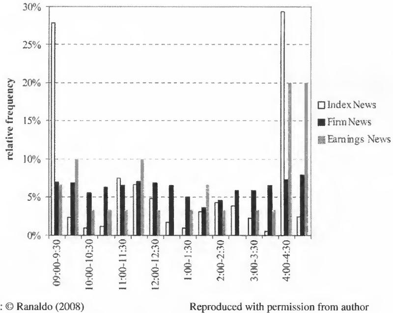  
Figure 14-20 Intraday news patterns

Time of day effecis may nced to be taken into account as well, since news events can cluster around the open and close, as we can see in Figurc 14-20. This shows the results from a study of news patterns for French stocks by Ranaldo (2008). In particular, he found thc peaks for ncws were most pronounced for the CAC 40 index compared to firm specilic news.

Thus, when news levels rise significantly above the historical average wc have an immediate indicator that somcthing unusual is happening. This gives us a very quick and easy way of tracking potential issues, since we do not even need to read or interprct the actual news stories. For cxamplc, Relegence calculatcs a news hcat index, based on the number of stories for a specific company, converting this to a scalc ranging from $^ { - 4 }$ t0 $+ 4$ [

For traders, a news flow indicator acts as a simple alert, allowing them to study the situation more carcfully. Whilst for trading algorithms, it can be uscd as an indicator that short-term volatility is likely to increasc. So, risk and cost-based algorithms can then adjust their trading stratcgies accordingly.

# News sentiment

In section 14.4, we saw how news items could be analysed to extract whether they represented good, bad or neutral information. By assigning thesc scntiments numeric scorcs we can calculatc avcrages, so we can determine the prevalent market sentiment hour by hour or day by day. We can also track sentiment over time just as if it werc pricc or rcturn data. For instance, Figure 14-21 shows charts of the stock prices and sentiment for two companies, from a study by Sanjiv Das (2005). The sentiments were determined from statistical analysis of bulletin board mcssages; each point on the charts represents the arrival of a new message.

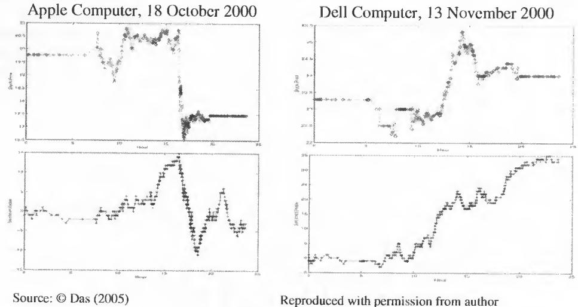  
Figure 14-21 The stock prices (upper) and sentiment (lower) charted throughout the trading day

Obviously, substantial changes in price can have a marked impact on the associated sentiment, as we can sec in Figure 14-21. Though, inferring future changcs in price based on the sentiment is more complex. For example, the continucd shift in sentiment for Dell Computer seen in Figure 14-21 is not immediately reflected in the market price. So, at the level of individual companies, the complex relationship between sentiment and price can make it difficult to reliably take advantage of this information.

Sentiment scores may also be aggregated across sectors or indiccs to create broader indicators, as shown in Figurc 14-22. Sanjiv Das and Mike Chen (2007) found a significantly stronger correlation between sentiment and returns for indices than for individual stocks. In their study, they aggregated the sentiment for the 25 stocks in the Morgan Stanley High Tech Index (MSH), bascd on nearly 150,000 buletin board messagcs. The correlation between the two serics shown in Figure 14-22 was relatively low, only 0.48. Though, using regression analysis Das and Chen found that the MSH 35 index was strongly related to its value from the prcvious day and was also significantly relatcd to the sentiment index value from the prior day. In comparison, the scntimcnt index was found to have no such depcndency on the stock index, so they concluded that the causality flowed from the sentiment to the stock index. Thus, scntiment offcrcd somc explanatory power for the level of the MSH 35.

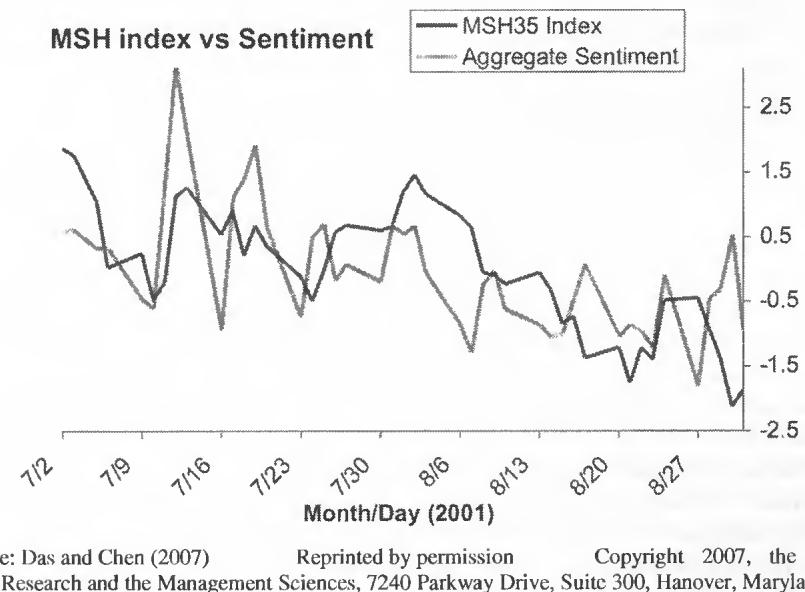  
Figure 14-22 Comparing the MSH Index with aggregated sentiments

They also found that highcr trading volume was significantly correlated with positive sentimenl, but could find no relationship between volume and the previous day's sentiment.

# News surprises

As we have alrcady scen, the size of the surprise information contained in a ncws story can often havc a substantial effect on markct conditions, particularly prices. Some news obviously lends itsclf to this approach more than others. Macrocconomic or corporate announcemcnts deliver new numbers to the market, whether they represent Non-Farm Payrolls figures or a firm's quarterly earnings. These may quickly be compared with expected figures to dctermine how much of a surprise they represent. A nicc example of this is given in a study by Linda Goldberg and Deborah Leonard (2003). Figure 14-23, reproduccd from this study, shows the monthly changes in Non-Farm Payroll data togciher with thc markct cxpectations from MMS surveys between January 2000 and June 2002.

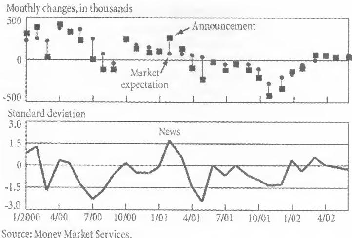  
Figure 14-23 U.S. Non-Farm payrolls: Announcements, expectations and news

Source: Goldberg and Leonard (2003) Reproduced with permission from Federal Reserve Bank of New York

To quantify the size of any surprises they normalised the differencc between actual and expected figures by dividing by the standard deviation of Non-Farm Payrolls relative to expectations for the period. For real-time analysis, we could adopt a similar approach using a standard deviation hased on historical data. The normalisation confirms that cvents such as the ones at 7/00 and 2/01 are statistically signilieant. Based on the cmpirical results we have already seen, we might expeet the surprise factor of such cvents to havc a noticeable eflect on the market. Since this news is easy to interpret, it is also likely that the impact wil be relatively short-lived, as the market can rapidly incorporate the information into its prices.

Other types of news may require much more analysis in ordcr to interpret their information. Quantitative models or fundamental analysis may be required to recalculate ncw fair valucs for assets. Some news may be extremely dificult to quantify, such as the resignation of a senior exccutive or losing a key contract. Hence, such news tends to take longer for the market to react to. Therc may also be a wider range of interpretations, so this dispersal of vicws could lead to an increase in volatility. Therc might even be a decline in liquidity while the market analyses the potential effects. So cven for more eomplex news items without fully interpreting them we may be able to make some simple cstimates of their short-term eflcct on the market's liquidity and volatility.

# News-based algorithms

News-bascd algorithms have already atracted the moniker "news flow" algorithms. Note that our focus remains on execution, rather than automated trading. Consequently, ncws is simply treated as information that affects our exeeution decisions. Unlike pric, volumc, liquidity or volaility, news is not a core market variable - it arives sporadically. The arrival of news is a faetor that has a clcar short-term impact on these market variablcs, as we saw in section 14.5. Focussing solely on news cannot guarantee to mect spccific investment objectives such as minimising market impact or transaction costs. For this reason, newsbased algorithms are clearly more opportunistic in nature.

# Incorporating news handling into existing algorithms

Just as pricc and liquidity-adaptive behaviour is being incorporated into existing algorithms, the same can be done for news. Adding a news handling capability may well improve their performance when news events do occur. For example, VWAP algorithms could modify their target volume profiles to account for the news release, whilst shortfall-based algorithms could alter their short-term volatility estimates. Similarly, temporary adjustments could be made to limit order models used by cost-based algorithms or execution tactics to determine the optimal approach for order placement. Thus, news just becomes another factor, like price and liquidity, upon which algorithms and execution tactics base their order placement decisions.

# News-adaptive algorithms

These are the news-based equivalents of price-adaptive algorithms. In which case a newsadaptive algorithm might trade a sell order less aggressively when good news arrives, whilst for a buy order it might be more aggressive. Clearly, this approach is closely related to priceadaptive algorithms. However, since news is the trigger the decisions are effectively making short-term estimates of how they think the price wil react to the news. So long as the market reaction behaves as cxpected, the news adaptation should give slightly better results than the morc reactive price-based approach. Again, this highlights the importance of inhuilt monitoring to ensure that the market does react as our interpretation of the news suggests.

# News-driven algorithms

Market prices and trades vary continuously throughout the day, hence algorithms such as percent of volume or price inline can constantly track this data and adjust their trading patterns accordingly. In comparison, the arrival of news is a much more discrete event. Each day there might only be a handful of news stories that might affect an order, and often there may be none. Even for a worst case scenario there is likely to only be a few pieces of significant news arriving in a day. There may well be 30 or 40 different stories, but many of these wil simply be the same information from different sources, possible revisions, or daily summaries outlining the effect the news has had on the market. Thus, if an order is to be driven solely by news it will tend to behave more like a conditional order, only being activated if good (or bad) news appears. For some investment firms news-conditional orders may act as a useful placeholder to reduce (or increase) their position if a certain event occurs. Essentially, though, it is much like a stop order, but based on information rather than price. In fact, a stop order (or trailing stop) might be used just as well; given a reasonably accurate estimate for the potential impact of the news.

In the future news-driven algorithms may well become more complex, but at the moment it is hard to tell what form these might take.

# 14.7 Summary

Adapting to breaking news cvents can give traders a significant edge, although pcople are still more adept at interpreting news and events than machines.

▪ Major news wires and press services have been electronic for a long time. Conventional media is now facing competition from social media, such as mcssage boards and blogs.

Computer-bascd news analysis is a non-trivial task Complex artificial intelligence and natural languagc processing techniques are being employcd to analyse unstructured text:

News filtering searches for keys to narrow the amount of information.   
News association uses relationships to spot secondary/tcrtiary cffccts.   
News analysis is primarily sentiment analysis at the moment.   
News interpretation combines information with asset pricing models for forecasts.   
News mining combines the analysis of historical data with information from news archives, helping to find causal relationships betwecn the news and market prices.

Market rcactions to news depend on the information relayed and market conditions.

With macroeconomic news, thc reaction varies for different assets. For instance, news of an interest rate drop will help increase the price of existing bonds, but weakens the currency. Corporations may benefit from lowcr interest rate, but may also suffer from the weaker currency. For corporate news, the reaction is more closely linked to spccific assets, although it may also have an effect on other firms in the same industry/sector.

News-based indicators may casily be added to existing trading algorithms:

News flow can help to forecast future volatility.   
Sentimcnt can be tracked over time just as if it wcre price or return data.   
Surprise relates to the diference between conscnsus cstimates and actual figures.

News is not a core market variable like price. Each day there might only be a handful of ncws stories that affect an asset. So:

News-adaptive algorithms use appropriate indicators for short-term estimations of how the market may react to the ncws.   
News-driven algorithms are likely to be more ike conditional orders, triggered by a set outcome or information.

# Chapter 15

# Data mining and artificial intelligence

Trading is a complex process; markets keep getting faster and the volumes of data keep escalating. Data mining and artificial intelligence offer the potential to give traders an edge by spotting or predicting trends.

# 15.1 Introduction

Trading algorithms and execution tactics are inherently reactive, responding to market conditions based on predefined rules. In Chapter 10, we saw how they may be enhanced by using short-term prcdiction models for key markct conditions, such as volume and price. These allow a more proactive approach, placing more passively priced orders.

Howcvcr, in volatile markcts, such as those during the 2007-09 financial crisis, sudden unexpected shifts can occur. These are hard to predict and can wrong-foot forecasts based on statistical analysis of historical data. Techniqucs such as data mining and artificial intelligence offer the potential to improve short-tcrm predictions for key market variables, even during volatile markets. This is because they can incorporate a much wider range of factors in their forccast models. They may also be able to cope better with today's more complex markctplaces, where trading is fragmented betwcen multiple venues.

Data mining is all about finding and confirming trends and/or relationships, some of which may be obvious whilst others may be much more subtle. Many of these techniques are purcly statistical in naturc. Ccrtainly, much of the market microstructure analysis we have alrcady seen in Chapters 8 and 10 may be viewed as a form of data mining. Likewise, textual analysis can be incorporated. So associations may also be inferred from information in news stories or company rcports, as we saw in Chapter 14.

Artificial Intclligencc (AI) systems are designcd to adapt and learn, and so they can cfectively think for thcmselves. There arc two main types, namely conventional AI and computational intelligcncc. Conventional Al is a top-down approach, which applies logic and rules to makc decisions. Esscntially, trading algorithms are an example of conventional AI. Computational intelligencc takes a bottom-up approach, and is inspired by biological mcchanisms. For instance, neural networks try to rcproduce the action of our brain's ncurons, whilst gcnetic computation simulates evolution.

In terms of trading and finance, there are three main applications for these techniqucs:

● Prediction • Finding associations/relationships

Generating trading strategics

All of these are quite closely rclated. Prediction and association mining often use similar methods to find rclationships in the data. These may form the basis of new trading rules or strategies. Artificial intclligence systems are ablc to test a huge number of variations in parallel, sccking the optimal solution. Hence, they can also help in the creation, lesting and fine-tuning of rules for trading strategies/algorithms and their associated parameters.

In the following sections, we will review these techniqucs and survey some of the reports on their effcctiveness, particularly for short-term forecasts. We will also consider how they might be incorporated to enhance cxecution.

# 15.2 Data mining

As its name suggests, data mining is all about data. By applying analytical techniqucs, trend: and/or relationships may be found within data, or between different datascts.

# Data mining techniques

Dongsong Zhang and Lina Zhou (2004) provide a nice overview of data mining for the financial markets. There are sevcral main types, namely:

● Classification and clustering analysis • Time-series mining • Association rulc mining

These employ a range of different statistical analysis/infcrence methods. They may also incorporate AI-based mechanisms such as neural nctworks and genetic algorithms.

# Classification and clustering analysis

Classification and clustering analysis both seek to identify common featurcs in the data. Any commonalities may then be used for prcdictions, since if the results are known for onc cntity (or may be accurately estimated) they are likely to be comparable for those with similar properties. Note that often such predictions will focus on the direction rather than the potential value. For example, specific conditions might be uscd to detcrmine whether a stock index or exchange rate will increase or decrease in a certain time span. These analyses may also be used for risk management or for spoting potential investments.

Classification may be strictly hierarchical, in which case propertics such as country, currency, industry and sector are uscful. Other factors such as thc financial ratios (e.g. price to book) may also be used. Cluster analysis may also be applied to create intermediate hierarchies, based on results such as price returns or volatility.

Alternatively, a more geometric approach may be taken. This is often achicved using AIbased tcchniques, which we shall cover in section 15.3. For instance, the k-ncarcst neighbour algorithm classifies based on a majority vote Irom its neighbours. Likcwise, probabilistic neural networks employ a weighted vote for each category based on the distancc from test cases. Support vector machines may also be uscd to seek the planc/s which optimally separate/s any categories or clusters.

# Time-series mining

In finance, timc series analysis is often used for forecasting. As we saw in Chapter 10, regrcssion-based models, such as ARMA, are used to make short-term predictions for prices or volatility. Historical volume profiles are another example, using average-based models to

estimate future trading volumes.

Time serics analysis can also use factor models to try to identify any regular features, such cyclical or seasonal effects. Thus, data is often de-trended and normalised. Curve fitting tcchniques may be applied as well, using lagged data, simple moving averages or even Fouricr transforms or wavelets to try to model the data. Transformations may also be used: shirting, scaling or warping the data to try to highlight any patterns. Due to the non-linear nature of many of these patterns, Al techniques, such as neural networks and support vector machines, have proved to be effective forecasting tools. We will cover this more fully in section 15.3.

In addition to purely quantitative forecasting, these tcchniques may also be used more qualitatively. For example, a common application is identifying turning points in the timc series, to determine when a sudden change in direction is likely.

# Association rule mining

Association rules are probably best known for their shopping basket examples. Supermarkets can use their huge databases to determine relationships, such as what type of milk customers will buy based on their choice of brcakfast cereal.

In statistics, an association represents any relationship hetwcen two variables that makes them dependent. In terms of probability, this means the occurrence of one event makes it more likely that the other will occur. Correlation is often used to measure statistical associations. As we saw in Chapter 12, the correlation coefficient can be found by dividing the covariance of the two variables by the product of their standard deviations.

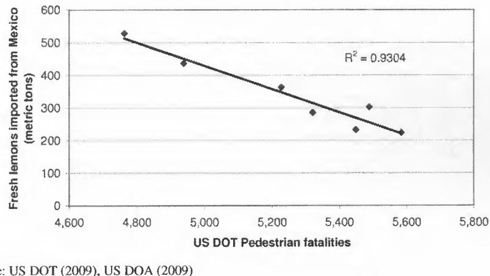  
Figure 15-1 Association and causality

Notc, it is important to differentiate between association and causality. A statistical association between two types of data is simply that; it does not imply anything more. Stephen Johnson (2008) illustratcs this with two clcarly unrelated datasets, namely the U.S. imports of fresh lemons from Mexico and the U.S. Highway fatality rate. Figure 15-1 shows a similar plot of lemon imports versus pedestrian fatalities for the period 1994-2000. For this sample, the correlation coefficient $( \rho )$ is -0.965. As we can see from the negative slope in Figure 15-1, there seems to be a significant negative association between the two, with fatalities decrcasing as lemon imports increase.

When looking at associations, it is also important to consider the measure of confidencc we can have in them. ${  { \mathbb { R } } } ^ { 2 }$ is a statistical mcasure of the "goodness of fit" between different data sets. In the case of statistical models, it shows how likely future outcomcs are to be predicted by the model. An $\mathbb { R } ^ { 2 }$ of 1.0 (or $100 \%$ ) reprcsents a perfcct match, so the $\scriptstyle { \mathsf { R } } ^ { 2 }$ of 0.93 means we can be confident that this association holds for this sample data.

However, can we really infer any link between lemon imports and traffic accidents? Even when we lind a statistically significant association, it is difficult to provc a causal link. Probabiliy models may quantify the likelihood of each occurrence, whilst Bayes' theorcm helps to relate the conditional probabilities between two such events. Prediction models can also be used, to see if an event may be linked to subscqucnt events or specific reactions. Though, it is important to remember that we are still dealing in probability, not certainty.

# Finding patterns/associations

In Chapter 10, we saw how statistical analysis of historical data could bc used to provide forecasting models for key market variables, such as price, volatility and liquidity. Much of this focussed on data for a specific asset. However, useful information may also bc inferred from relationships bctween assets, both in the same market and across different markets or even asset classes. Data mining can help to find these associations, allowing us to create forecasting models that are based on a wider range of data.

Some of these associations are already well known, such as the beta of a stock versus its index. Others require some more work to find. For instance, lead/lag relationships may be found between some key sectors and the market as a whole, or in thc supply chain. They can also exist between countries and between the cash and dcrivativc markets. Therefore, automated data mining techniques provide a way of searching for useful or promising relationships. The results may then be examined morc closely to see how viable they are as predictive indicators. They may also be related to other sources of information, such as news and macroeconomic indicators, as we saw in Chapter 14.

Relationships between assets and markets are also heavily dependent on market conditions. At the most basic level, many of the world's markets arc driven by a mixture of fear and greed, which is why volatile conditions can so easily spread between markets. For example, the Mexican Peso crisis, the Asian currency crisis, Russia's devaluation, thc collapse of LTCM, and the 2007/8 sub-prime debacle all led to substantial downturns, which spread across the world's markets. In such volatile times, tracking other key markets, such as the U.S., can be another useful predictive indicator. The "flight to quality" is a wellestablished phenomenon, with investors shifting to saler, or more liquid, assets during troubled times. Thercfore, it can also be useful to look across asset classes, for instance during volatile markets investors may well shift to hold more bonds than equities.

# Intra-market relationships

Many of the studics examining intra-market relationships have focussed on corporations, due to their ease of classification via industries and sectors.

A detailed study of the co-movements for U.S. industry sectors was carricd out by Jarl Kallberg and Paolo Pasquaricllo (2008). They created a model for returns bascd on four fundamental factors. Three of these were the systematic risks identified by Eugcne Fama and Kenncth French (1993): market, book-to-market and small-firm risk. The fourth factor was sector risk. They found a signilicant amount of excess co-movement, bascd on the covariation betwecn asset prices. For some sectors, such as utilities and non-cyclical serviccs, the cxcess was much higher than average. Whilst for others, such as general industrials, noncyclical consumer goods, financials and cyclical serviccs, thc excess was slightly below averagc. This is summarised in Table 15-1, which is ordered based on their findings.

Table 15-1 Excess co-movement for specific sectors   

<table><tr><td rowspan=11 colspan=1>herver</td><td rowspan=1 colspan=1>Sector</td><td rowspan=1 colspan=1>Examples</td></tr><tr><td rowspan=1 colspan=1>Utilities</td><td rowspan=1 colspan=1>Electricity, gas distribution, water providers</td></tr><tr><td rowspan=1 colspan=1>Non-Cyclical Services</td><td rowspan=1 colspan=1>Food/drug retailers, telecom providers</td></tr><tr><td rowspan=1 colspan=1>Rcsources</td><td rowspan=1 colspan=1>Mining, oil and gas</td></tr><tr><td rowspan=1 colspan=1>Information Technology</td><td rowspan=1 colspan=1>Hardware, software and computer services</td></tr><tr><td rowspan=1 colspan=1>Cyclical Consumer Goods</td><td rowspan=1 colspan=1>Automobiles, household goods and textiles</td></tr><tr><td rowspan=1 colspan=1>Basic Industries</td><td rowspan=1 colspan=1>Chemicals, construction /building materials,forestry and papcr, steel and other metals</td></tr><tr><td rowspan=1 colspan=1>Gencral Industrials</td><td rowspan=1 colspan=1>Aerospace and defence, diversified industrials,engineering and machinery</td></tr><tr><td rowspan=1 colspan=1>Non-Cyclical Consumcr Goods</td><td rowspan=1 colspan=1>Beverages, food produccrs, health,pharmaceuticals, tobacco</td></tr><tr><td rowspan=1 colspan=1>Financials</td><td rowspan=1 colspan=1>Banks, insurance, investment companies</td></tr><tr><td rowspan=1 colspan=1>Cyclical Services</td><td rowspan=1 colspan=1>General retailers, leisure, media, transport</td></tr></table>

Their fundamental modcl was only able to explain $2 7 \%$ of the excess co-movement for the markct as a whole. Whilst for some sectors, such as resources and utilities, it was much more effcctive. Thus, a sizcable proportion of the co-movement was attributablc to nonfundamcntal factors. However, there was also a considerable amount, which was not. Kallberg and Pasquaricllo wcnt on to invcstigate some additional factors that might explain the remaindcr of the excess co-movement. They found that it was negatively related to market volatility and the level of short-term interest rates.

Co-movemcnt also appeared to be negatively related to U.S. monetary and real output dcvelopments. Conversely, it was positivcly related to the dispcrsion and the number of analysts' carnings forccasts, which acts as a proxy for information flow. Momcntum, contemporancous and lagged returns were found to have negligible explanatory cfects. Overall, thcsc othcr factors were able to explain another $23 \%$ of thc excess co-movement.

An additional factor that might help explain excess co-movement is firm size. Kewei Hou (2002) observed a significant lead/lag effect for stocks in the U.S., with the returns of large firms leading those of smaller companies. Lior Menzly and Oguzhan Ozbas (2004) found that for small and medium-sized firms cross-industry momentum could be significant, whilst it was negligible for largcr firms (above the NYSE median market capitalisation cut-off).

The supply chain is another potential factor for relating the price moves between different sectors. A lead/lag rclationship seems reasonable since problems with upstream suppliers could wcll affect the future returns of firms that are dependent on their goods. For instance, Y.L. Hsich, Don-Lin Yang and Jungpin Wu (2006) used gcnetic algorithms to analyse the price relationships between firms in Taiwan's technology industry. Rules were created based on the daily rcturns. Using thesc, they found they could predict future price changes with 60- $70 \%$ accuracy. In the U.S., Menzly and Ozbas (2004) used the input-output survey Irom the Bureau of Economic Analysis to quantify the supply chain. They found a significant momentum from upstrcam and downstream industries. The effect from upstream industries was about double the size of the cross-industry momentum, whilst for downstrcam industries it was less, but still around $50 \%$ larger.

Certain industries can also act as an important indicator for the market as a whole. Harrison Hong, Walter Torous and Rossen Valkanov (2007) analysed the relationship between industry and market rcturns in a range of countries. For the U.S., they found that the returns from stocks in over a dozen industries showed a significant lcad, of around a month, versus the market as a whole. In terms of economic significance, the banking scctor led, followed by real estatc, print, apparcl and services. They also found a negative relationship for some of the resource-based industries, such as petroleum and metals. Ovcrall, they concluded that the industries that lcd the market also acted as indicators of cconomic activity. A similar effect was found for other countries, including the U.K., Canada, Germany, and Japan, although therc was more variation in the number of key industrics.

# Inter-market relationships

The intraday dynamics between international equity markets havc becn analysed by Kari Harju and Syed Hussain (2006a). Once the returns wcre descasonalized, they found a correlation of O.54 between the rcturns for the U.K. FTSE and the Gcrman DAX. Interestingly, this increased to 0.7 at around 15:30 Central Europcan Timc (CET), which coincides with the U.S. open. The significancc of the U.S. open is also highlighted in a similar study by Harju and Hussain (2006), where they compared the average intraday returns for major European indices between days when the U.S. markets were open or closed. They found a clear shift in the returns at around 15:30 CET on the days when the U.S. markets were opcn.

Harju and Hussain (2006a) also used a vector autorcgrcssive exponential GARCH model to analyse the volatility. They found that significant price spillovers from Gcrmany and the U.S. rapidly spread to the U.K. The German market also affectcd U.S. returns, but they could find no evidence of the U.K. significantly affecting either the U.S. or Germany.

A similar analysis was carried out by Kate Phylaktis and Lichuan Xia (2008). They analyscd the returns of stocks across Europe, Asia and Latin America. Overall, they found the Asian stocks to be more responsive to the US markct than to the regional markets, whilst European and Latin American stocks showed more reaction to regional markets than the U.S. That said, a notablc exception is information technology, which was found to be globally responsive for firms from every region.

Robin Brooks and Marco Del Negro (2003) broke down returns into global, country and industry specific components for stocks from 20 countries. They confirmed that the level of risk for a stock was dcpendent on its international cxposure. A $1 0 \%$ increasc in international sales was found to increasc the stock's exposure to global shocks by $2 \%$ , whilst reducing its country specific risk by $1 . 5 \%$ .

# Cross asset class relationships

A lot of research has focusscd on the lcad/lag relationships that can exist hetwcen asset classes, particularly bctween cash and derivatives. Thc potential for arbitrage means that the price differenccs between markets should generally not be any larger that the costs of executing the arbitrage.

Jeff Fleming, Barbara Ostdiek and Robert Whaley (1996) analysed the relationships between stock indices and their futures or options markets. They found that thc lead/ag return relations amongst these markcts were consistcnt with their relative trading costs. The cost-elficient index derivativcs appeared to lead prices in the stock market, in turn the prices of index futures tended to lead those of index options. Similar rcsults were found in an analysis of the Korean KOSPI 200 index by Jangkoo Kang, Soonhec Lec and Changjoo Lee (2004). They noted that both the futures and the options markets led the cash index prices by up to ten minutes, even when accounting for transaction costs. They also analysed the relationship for volatility and found the cash market again lagged the others, this time by around five minutes.

The lead/lag relationship for S&P 500 index options was analysed by Phelim Boyle, Soku Byoun and Hun Park (2002). They also found that the contracts led the cash index. In another study, Fleming, Ostdiek and Whaley (1996) noted that, in terms of the lead/lag relationship, the prices of index calls and index puts moved together. Though, analysis of short-term at-the-money (ATM) CAC 40 index options by Alexis Cellier (2003) noted a marked difference beiween calls and puts. The call options led the cash index by up to five minutcs, although a significant effect was found to last for up to fifteen minutes. The puts were found to be more contemporaneous with the index.

For single stock options, Richard Holowczak, Yusif Simaan and Liuren Wu (2006), and Sugato Chakravarty, Huseyin Gulen and Stewart Mayhew (2004) analysed the price discovery with U.S. stocks. Both groups found stocks tended to lead options prices. Though, they also noted that during periods of substantial options trading the options market became more informative. In their study, Chakravarty, Gulen and Mayhew (2004) estimated that the option market's contribution to price discovery was around a fifth, so there was a meaningful two-way flow between the two markets. In earlier work, Matthew O'Connor (1999) also found that the stock market Icd the options market. He observed that the lead was related to the options' trading costs. Whilst Holowczak, Simaan and Wu (2006) noted that the increasing use of automated quoting algorithms by options market makers was helping increase the reliance on the stock market for prices.

The relationships between the corporate bond, crcdit default swaps (CDS) and stock markets were analysed by Lars Norden and Martin Weber (2005), for a sample of 90 firms from Europe, the U.S. and Asia. Stock returns were seen to lead changes in the spreads for both bonds and CDSs. They also found that CDS sprcad changes were likely to have more influence on bond spreads than vice versa. The stock market lead may be ascribed to its higher liquidity and trading volumes, as well as the relative casc of shorling stocks. Similar results were found in an carlier U.S. based study by Francis Longstaf, Sanjay Mithal and Eric Neis (2003). They noted that both the stock and CDS markets led the corporate bond market. In their study, Nordcn and Weber (2005) found that CDSs were more sensitive to moves in the stock market than bonds, and this effect increased for firms with lower credit ratings. This additional sensitivity was explained by the fact that CDSs represent pure issuer credit risk, whilst bonds are a bundle of both credit risk and market risk.

For currcncies, Tiffany Hutcheson (2003) analysed the differences between the intraday relurns based on CME FX futures contracts and Reuters spot prices for the euro and the U.S. dollar. She found that the spot market led the futures market, within a 5-minute period.

The relationships for commodity prices were sludied by Frank Asche and Alle Guttormsen (2001). They analysed the relationship beiween spot and futures prices for gas (or heating) oil on the International Petroleum Exchange (IPE). They saw that the futures price did indeed lead the spot prices. They also reported that the prices of futures contracts with a longer time to expiration led those thal were closer to expiry.

# Crises and contagion

The relationships that exist within and between markets can change considerably during extrcme periods. In terms ol intra-market relationships, research has shown that correlation tends to increase for down ward moves, so this can be an important issue for forecasts.

Param Silvapulle and Clive Granger (2001) analysed the daily returns for the Dow Joncs Industrial stocks between 1991-9. They conlirmed that the corelation betwecn them incrcased for largc negative market movcments, whilst there was no notablc difcrence for large positive movements. They concluded that this reaction reduccd the benefits of diversification, so in downturns portfolios can be exposcd to more risk than expected. A similar increase in correlation during market falls was reported by Andrew Ang and Joscph Chen (2002). In their analysis of the correlations bei ween U.S. stocks and the market as a whole, thcy noted the effect was strongcst for the most extrcmc drops. They also found that the largest changes in corrclation were for firms that were smaller, had scen low returns recently or could bc catcgorised as "growth" stocks. A significant change was also observcd for the traditionally dcfensive sectors, such as petroleum and utilities. Intcrcstingly, stocks with lower betas werc affected most; higher risk stocks wcrc less alfected.

Across markeis, Donald Lien, Y.K. Tse and X.B. Zhang (2002) analysed the relationship between stock and futures markets for the Nikkci 225 index bctween 1995 and 1999. Thcy found three clusters of structural changes. The first of these originated in the futures markct, as we might cxpect; however, the other two were led by the stock market. They also found another structural shif in the stock market, although this did not seem to be large enough to affect the futures. Hencc, the traditional lead/lag relationships that we saw in the previous suh-section do not always hold during crises.

A global incrcase in correlation has also been observed during crises. Frangois Longin and Bruno Solnik (2001) used "cxtreme value thcory" to derive the distribution of extreme correlations hetween the U.S., European and Asian stock markcts. They established that the change in correlation was related to the market trend rather than the market volatility. Thus, correlation was sccn to increase in bcar markets but was lcss affected in hull markets. Thcre was a notable shift in correlation for a drop of $10 \%$ whcreas a rise of $10 \%$ behaved as expected. They concluded that the probability of having largc losses simultancously on two markcts is larger than might be expected. Simón Sosvilla-Rivero and Pedro Rodríguez (2004) also studied the relationship between the S&P 500, FTSE 100 and the Nikkci 225 stock indices. They found that the S&P 500 seemed to lead the other two markets in tcrms of extreme positive or negative returns.

Rescarch has also focused on how thcse crises sprcad across markets. For instancc, a nicc summary of the Asian currency crisis is provided by JarI Kallberg, Crocker Liu and Paolo Pasquariello (2005). They examined both returns and volatility for currencics and stocks and tracked how the information shocks moved from country to country in the 1992-1998 timc period. For volatility, they found that the first breaks actually clustered around the 1994-5 Mexican Peso crisis for Malaysia, Taiwan and Thailand. Volatility breaks were found for thc other Asian countries towards the end of 1997. The equity markcts were then afected by the currency volatility. Return shocks were found to affect Malaysia and South Korea in early 1998, thesc then spread across the rest of Asia. Phylaktis and Xia (2008) also examincd both the Mexican and Asian criscs in their sectoral analysis. They found that nearly hall thc scctors in Europe, Asia and Latin America werc affected by thc Mexican crisis. Yct, in the Asian currency crisis, they found no additional contagion in Europe or Latin Amcrica.

The effects of contagion have also been studied for the dcbt markcts. Amar Gandc and David Parslcy (2005) analysed the publicly traded U.S. dollar denominated sovereign dcht for 34 countrics across Europe, Asia and the Americas. They found that, on average, a onenotch downgrade, such as from $\mathbf { A A } +$ to AA, for a country's credit rating led to an increasc in the spreads of sovereign bonds for the othcr countries. Assuming a $6 \%$ yield, they estimatcd this could lead to a change of 12 bps in the spread. They also found cvidencc for competitive spillovers occurring, so a downgrade for a country with highly negatively correlated trade or capital flows to the U.S. actually led to a decrease in the spreads for similar countries.

During crises, there is often a "flight to quality". George Theocharides (2006) found evidence of this for U.S. bonds; resulting in wider spreads for corporate bonds and a drop in the yields for U.S. Treasuries. He also noted a tendency for older bonds to be traded during these periods. But for U.S. corporate bonds, he found that company specific shocks had ncgligible cffects on the bonds from firms in the same industry.

Rcsearch is still divided about exactly how and why contagion occurs. Data mining has bcen applied to try to identify the causes of contagion. For example, it has been linked to the dynamics of economic fundamentals, such as interest rates. In fact, Robert Shiller (1989) found that a marked proportion of the cxcess covariance between U.S. and U.K. stocks could be cxplained by positively correlatcd interest rates. A nicc summary of research into contagion is provided by Kallberg and Pasquariello (2008): Studies by Kathy Yuan (2005), Albert Kyle and Wei Xiong (2001) and Guillermo Calvo (2002) have focussed on liquidity shocks due to the trading activity of financially constrained investors. Other researchers such as Paolo Pasquariello (2007) and Jefr Fleming, Chris Kirby and Barbara Ostdiek (1998) have concentrated on investors' portfolio rebalancing activity. Both are probably contributory factors, although further research will be needed to fully quantily thcir relative importance.

# Important precautions for data mining

Statistical analysis is an important tool, but it can also be a dangerous one. Indeed, there are lies, damned lies, and statistics, as popularised by Mark Twain (1907). As with any analysis, due care must be taken to check any potential relationships which may be discovered. It is essential to apply economic sanity checks and a wide range of testing before too much is read into any relationship.

Stefan Zemke (2002) provides a nice review of some of the potential pitfalls that should be considered when handling financial data. In particular, he emphasises the importance of the data pre-processing. To start with, we must be sure that the data quality is good enough. The old maxim "garbage in, garbage out" holds just as true for statistical analysis as for computer programs. Therefore, it is important to have checks in place to inspect and, if necessary, clean the data. Apparent outliers may in fact be genuine; they may be due to cvents such as stock splits or dividends. Similarly, missing data may need to be back-filled, or simply excluded.

Inferring relationships from data must also be done with some caution. Again, it is important to remember that any associations often simply reflect a probability, rather than a truly causal relationship: Just because one event has happened, it does not necessarily guarantee anything – although it may make related events more likely to occur. A commonly cited example is the "Texas sharpshooter" fallacy: If we just look at a target with several shots in the dead centre, we might assume that the shooter had a good aim. Howevcr, without having seen the shots we do not know how far they were taken from, or even whether the target was painted on afterwards! In other words, it is always important to check whether the discovered relationships make economic sense. This may also mean taking into account factors such as transaction costs.

For relationships to be meaningful, they must be based on a reasonably sized dataset. Two points can always be joined by a straight line (with an ${ \tt R } ^ { 2 }$ of 1.0 or $100 \%$ ). For instance, hack in Figure 15-1 we saw that the data lor U.S. Iemon imports and pedestrian fatalities were very closely related, with an $\scriptstyle { \mathbf { R } } ^ { 2 }$ of 0.93. However, this is only for annual results from 1994- 2000; in fact, this range was chosen solely because it happened to give a high correlation and $\mathbf { R } ^ { 2 } .$ If we expand the period up to 2008 the corrlation drops o 0.554, with an $\textstyle \mathbf { R } ^ { 2 }$ of only 0.31.

Another risk when data mining is the potential for over-fitting dala. Essentially, this means thal the discovered relationship works perfectly for the test data; but as soon as it is exposed to real data it gives compleiely useless results. For example, let's consider if there might be any link hetween the Dow Jones Industrial Average (DJtA) and U.S. traffic accidents from 1995-2007, as shown in Figure 15-2.

Source: US DOT (2009)

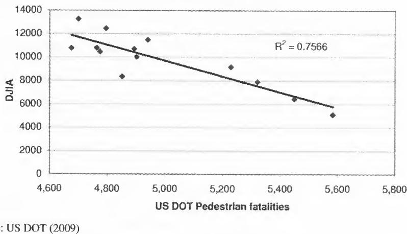  
Figure 15-2 The dangers of over-fitting data

Again, the correlation of -0.87 and an $\mathbf { R } ^ { 2 }$ of 0.75 shows a reasonably close fit between these datasets. Maybe if we added some other datasets, a meaningful relationship might be found. David Leinweber (2000) carries out a brilliant example of this: he starts with the returns for the S&P 500, finding a reasonable fi1 with the level of butter production in Bangladesh, achieving an $\mathbf { R } ^ { 2 }$ of 0.75. Delermined to improve the model he then found that incorporating U.S. cheese production and the sheep population of both countries raised the $\mathbb { R } ^ { 2 }$ to 0.99 for the test period. Equally high $\textstyle \mathbf { R } ^ { 2 }$ were achieved for models using fitted polynomials based on the year's digits. So associations can be found hetween almost anything if you look hard enough.

Obviously, these are purposefully outlandish examples. Unsurprisingly, the relationships are non-existent outside the test period. However, Leinweber makes the key point that just because regression charts for interest rales or GDP seem plausible, the statistics can sometimes be just as meaningless. So when examining data, it is important to hold back a porlion to allow for "out-of-sample" testing. Leinweber also suggests that this should he done on both a temporal and a cross-sectional basis.

# 15.3 Artificial Intelligence

The term Artificial Intelligence (AI) was first coined by John McCarthy in 1956 during a workshop on computers and intelligence at Dartmouth. AI systems are designed to adapt and learn, and so effeclively think for themselves.

The progress of Al has certainly had its fair share of "ups and downs". Buoyed by carly success in the 1960s AI seemed unstoppable. A brief slowdown in the 1970s was followed by a surge in the 1980s as the sudden availability of personal computers helped it becomc more commercial. In fact, by 1985 the market for AI systems had reached a billion dollars, according to Daniel Crevicr (1993). In the mid 1980s, AI systems spread to finance and more spccifically trading, heralding the dawn of AI-driven automated trading. Although the harsh realities of dealing on the world's markets meant that many such systems became write-offs within a few years. Overall, a lack of results meant the honeymoon ended and much of the corporatc and government funding for AI research disappeared.

The 1990s saw a rcsurgence of AI techniques, particularly in the technology industry. It again becamc headine news in 1997, when IBM's Deep Blue computer managed to beat the Grand Master Gary Kasparov at chess, nearly fi ty years after the first AI researchers had begun. Unsurprisingly, financial applications for AI are once again being found.

# Types of artificial intelligence

AI can actually be split into two main approaches:

● Convcntional AI Computational intclligence

Conventional AI is a top-down approach that uses logic and rules to make decisions. This generally relies on data that has been translated into known symbols, employing custommadc knowlcdge bases or statistical analysis. Examples of conventional AI include expert and case-based reasoning systems, as wcll as Bayesian networks.

On the other hand, computational intelligence is a bottom-up approach that takes its inspiration from biological mechanisms. For instance, neural networks try to reproducc the action of our brain's neurons, whilst evolutionary computation simulatcs populations. Other examples are hybrid intelligent systems, which are a combination of neural and evolutionary mcchanisms, whilst fuzzy logic offers probability based solutions.

# Conventional Al

Conventional AI is generally based on logic. Experts definc rules for how to identify specific situations and what actions to take in response to them. These may be broken down into simple logical statements: IF <this happens> THEN <do this> ELSE <do this instcad>. Rules also need to be placed in context; hence, structures like decision trees may be used to ensure they are followed in a sensible order. Once cnough of these are defined, a system has all the basics of how to cope. Obviously, though, there are some subtle nuances – there will always be situations that simply do not follow the rules.

All of this sounds rather familiar, since a trading algorithm is essentially a complex collection of rules each designcd to respond to various events. The rules themsclves have generally becn detcrmincd by experienced traders or quants. So, in essence, a trading algorithm is just an instance of an AI expert system.

Conventional AI may be also used to make forecasts; however, the reliance on explicit rules means it is less adaptable than techniqucs involving computational intelligence.

# Computational intelligence

Computational intelligence, or soft computing, applies an array of different techniques, using elements of lcarning, optimisation and adaptation/evolution.

Machine learning is used by computer systems to recognize complex patterns in data, and make intelligent decisions based on this. There are three main categories:

Superviscd learning • Unsupervised learning Reinforcement learning

Supervised learning is adopted by many solt computing techniques, from the $\mathbf { k }$ -nearcst neighbour algorithm to neural networks and support vector machines. During training, the ideal outputs are provided for test inputs. Hence, the learning mechanism wil try to validate its own oulputs against these target values. Repeated cycles should mean it optimises itself to produce output much closer to the ideal. with unsuperviscd learning, no test oulputs are provided, so the mechanism must find another way to validate itself. Reinforeement learning takes a different approach: instead of using a dedicated training period, it relies on constant fcedback from its environment. Some neural networks use unsupervised or reinforcement learning.

Optimisation is also important. For many problems, there is an optimal solution, which may be found by searching through the possible solutions. Computational intellgence may be employed to scarch the solution space more efficiently.

Likewise, adaptation is another key consideration. One of the downfalls of conventional AI is the fact that situations can arise for which none of the pre-determined rules fit. By being able to adapt, or evolve, computational intellgencc has a better chancc of dealing with such siluations.

In the following sub-sections, we shall examine some of thesc methods in more detail, starting with the simplest $\mathbf { k }$ -nearest neighbour algorithm then progressing on to ncural networks and support vector machines and finally genetic algorithms and programming.

# k-nearest neighbour algorithm

The $\mathbf { k }$ -nearest neighbour (k-NN) algorithm classifies objects based on a majority vote from its closest $k$ neighbours, where $k$ is a small number. To start with, we need to seed the mechanism with some sample assignments. For inslance, Figure 15-3 shows an example where objects have already been classified as type 1 or type 2.

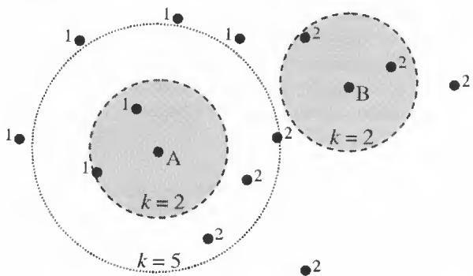  
Figure 15-3 An example of k-NN classification

When classifying sample objects, if $k = 2$ then A will be classed as type I since its elosest two neighbours are both type 1, whilst B will be classed as lype 2, as shown by the shaded circles. If we now use k = 5, for sample A three of the five closest neighbours are now type 2, so A would be reclassified as type 2. Although this is a simple 2D example, the concept may also be exlended for multiple dimensions.

The k-NN mechanism may be used for regression as well, so the ideal value for our sample objeet is based on the average values for its $k$ nearest neighbours, each weighted by their distanee from the sample. Note, there is very litle training for the k-NN algorithm; it simply eonsists of storing the details for the seeded training samples. The rest is done in the elassilication phase.

# Neural networks

Artifieial ncural networks (ANNs), also known as neural nets, take their biological inspiration from the mechanism of neurons. The brain is a complicated network of interconnected neurons where information is passed by electrical stimulation. Signals are received by a neuron's dendrites, or branches, which in turn connect to many other ncurons. If sufficient eleetrieal signals are received, the neuron may become activated; in which case it will transmit a signal to other neurons via its axon. The human brain has around a hundred billion $( 1 0 ^ { 1 1 } )$ neurons whilst there may he 100-500 trillion $( 1 0 ^ { 1 2 } )$ connections (or synapses), bascd on estimates from David Drachman (2005).

Each node in a neural network mimies the biological structure fairly closely, as Figure 15-4 tries to show. A node takes inputs $I _ { I , 2 , 3 }$ which are then processed and the resultant output $O _ { n }$ is transmitted. The actual processing may be split into two, firstly summing the input data then determining what kind of output signal is appropriate (if at all).

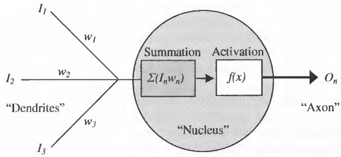  
Figure 15-4 A neural network node

Note that the summation funetion applies distinet weights $w _ { I , 2 , 3 }$ to the corresponding inputs, so the signals from some connections may be given more importance than others. The activation function detcrmines the appropriate output for the node, based on this input information. Oftcn the activation funetion is a reasonably simple method that normalises the summed inputs to becomc a value in the ranges [-1, 1] or [0, 1]. This might be achieved with a threshold funetion (which will only output a set value if the inputs are more than a speeifie limit) or with continuous Gaussian, trigonometrie or sigmoid funetions.

The node shown in Figure 15-4 is effeetively an example of a perceptron, whieh was invented by Frank Roscnblatt in 1957. By itself, this is of limited use; however, when multiple nodes are conneeted together the resultant networks can be much more powerful and versatile. Figure 15-5 shows some example networks where each circle represents an individual node. In turn, each of these nodes may be classed as being input, output or hidden. Gencrally, there is one input node for each variable being investigated. The number of output nodes will depend on the information that the network must generate. In between these, there may be any number of hidden nodes, aeting as the intermediate steps in the transition from input to output data. They are often arranged in layers, although grids may be used as well.

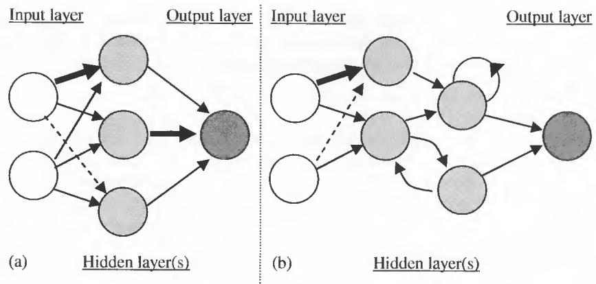  
Figure 15-5 Example (a) feed-forward and (b) recurrent neural networks

The overall size of a network is an important consideration. Too few nodes and it may fail to fit the data well enough, too many and it becomes a significant computational burden. There is also the risk of over-fiting data, which can lead the network to start modclling random noise. Unfortunatcly, there is no real consensus on exactly how best to size a network. As a rough rule of thumb, Lou Mendelsohn (1993) suggests using betwecn half and double the number of input variables as hidden nodes.

That said, the architecture of a neural network is much more than just how many nodes it employs. It also specifies how the nodes are interconnected and how signals flow through the network. In terms of how signals flow through networks Figure 15-5 shows the iwo main types, namely fced-forward and recurrent. Fced-forward nctworks process signals in a lincar fashion. So they are organised much like the internals of cach node. Recurrent nctworks allow signals to flow in both directions. Nodes may conncct to themselves or cven nodes in earlier layers, as we can sec in Figure 15-5(b). Thesc fcedback loops mcan that recurrent networks can retain additional state information, allowing them to better adapt to input signals that change over time.

There is also a range of other architectures catering for specific applications, such as probabilistic and general rcgression ncural networks. For more details of these approaches, a nice overview is provided on the DTRcg (2008) wcbsite and by Joarder Kamruzzaman, Rezaul Begg and Ruhul Sarker (2006).

The training of the nctwork is also an important consideration. Back propagation is a commonly adopted method for supervised learning. The error value is the differencc between the output yalue and the desired figure. In back propagation, this crror valuc is passcd backwards through the network, so that each hidden node can then compare this with its own inputs to see how strongly these relate to the required output. The hidden nodes then modify the weights for these to reduce the overall error. Alter a series of cycles, the weightings should be optimised.

Onc of the disadvantages of neural nctworks is their "black box" nature. After training, a model may provide useful results, but to determine how this has been achicved means decoding the various weightings to discover the relationships. That said, interpreters can be created to handle this; indccd, researchers have been using other AI techniques, such as genetic algorithms or programming, to do this automatically.

# Support vector machines

A support vector machine (SVM) classifies objccts by seeking the plane that optimally separatcs them. For example, Figure 15-6(a) shows the classification problem we considered back in Figurc 15-3. The solid linc marks a plane between the two typcs.

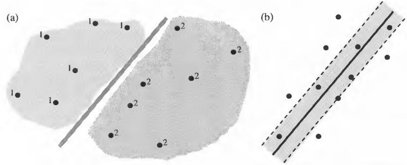  
Figure 15-6 Examples of SVM (a) classification and (b) regression

SVMs may also be applicd to regression, as shown in Figure 15-6(b), by using Vladimir Vapnik's (1995) error-inscnsitive loss function. The bold line represents the best plane for the data values, from which we can actually interpolate the ideal values. The dotted lines show additional boundaries that incorporate a maximum permittcd error. Any data outsidc this boundary is cflcctively ignored.

The cxamples shown in Figure 15-6 have straightforward linear solutions; however, SVMs are also able to dcal with problems spanning multiple dimcnsions. For a morc detailed review of SVMs Kristin Bennett and Colin Campbel's (2000) report is a good starting point.

In many ways, SVM models are actually quite similar to neural networks, although their training is very difercnt: Essentially, it is like solving a quadratic programming problem with linear constraints. So for optimisation problcms this means that a unique and globally optimal solution will be found. There is no risk of solutions reaching local minima, which can happen with techniques like back propagation.

# Evolutionary computation

Evolutionary algorithms arc based on the thcory of natural sclcction, first proposed by Charles Darwin (1859). Traits or propertics that are successful bccome increasingly common over succcssivc generations of a population. This is due to thc increased likelihood of survival of individuals with those traits. Evolution relies on the transmission of these traits by genetic inhcritance, as well as the innovation provided by mutation.

Computcr simulations of evolution started in the 1950s, but one of the most well known models is still John Conway's (1970) Game of Life, a deceptively simple grid-based ccllular automaton.

# Genetic algorithms

Genctic algorithms (GAs) becamc popular in the 1970s, most notably based on work by John Holland (1975). For GAs, the population of individuals represent potential solutions to a givcn problem. A fitncss function is used to gauge the quality of each individual. Evolutionary cycles are then repeatcd, with selection biased to ensurc that the next gencration is based on thosc with thc highest scores. A nice summary of this cycle is

provided by Jin Li and Edward Tsang (1999):

1. Create an initial population.   
2. (a) Assess the fitness of each individual. (b) Select the set of parents for the next generation. (c) Crcate a new generation of individuals.   
3. Repeat step 2 until the required eyeles are completed or the time is up.

The aim is that once these iterations are finished the population should be dominated by (he highest scoring individuals, and so hopefully the hbest potential solutions for the problem. Though, this does not guarantee that the global optimum will be reached.

Each individual in the population may be defined as a sequence of genes, which in turn correspond to a set of specific settings or parameters for the required solution. Often these are encoded in a binary fashion, as shown in Figure 15-7:

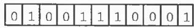  
Figure 15-7 Binary representation for an individual GA solution

This is because the bitwise lormat is very casy to manipulate when simulating reproduction and mutation. The reproduction is based on a genetic crossover, as shown in Figure 15-8(a): The genes of each parent are cut in two at some random point (marked by the dotted line) and then spliced with the corresponding remainder from their partner. This generates siblings that share parts of each parent's characteristics.

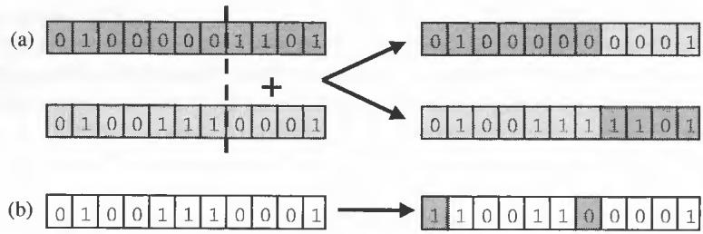  
Figure 15-8 Examples of GA (a) reproduction and (b) mutation

The fitness function is obviously central to finding good solutions. Often determining the fitness of a potential solution wil entail running a separate simulation. For instancc, the individual's settings might correspond to setings for a set of trading rules. These will then need to be back tested to determine their effectiveness. Only then may the overall fitness be rated.

Since there is the danger that the population might simply revolve around a single good solution, it is also important to incorporate mutation, which adds the potential for completely new variants. As we can see in Figure 15-8(b), with a bitwise implementation this is extremely simple, since all we need to do is toggle the value at random points. Mutation helps increase the potential for the population to span a wider range of possible solutions, and so scan more of the scarch space for the optimal solution. An alternative to mutation is to use immigration, in which case completely new individuals are randomly generated and introduced into cach cycle, as suggested by Jurgen Branke (1999).

# Genetic programming

Genetic programming (GP) is a natural progression of the work donc by genetic algorithms. Instcad of relying on simple bit-strings, the individuals are based on more complex data structures, such as trees. This allows even more sophisticated modeling. The early work in this licld was led by John Koza (I992). Initially, much of the focus was on evolving actual computer programs; however, this has since expanded to cncompass fields as diverse as quantum computing and electronic design.

Tree-based structures are ideally suited for mathematical expressions, for example, Figure 15-9(a) shows a tree for the equation $( 8 \ast ( ( 3 + 2 ) / 4 ) )$ . Similarly, they may be also be used to encode trading rulcs. For example, Figure I5-9(b) shows a trading rule that requires the Bid price to be less than I0 and the corresponding size to be more than 500.

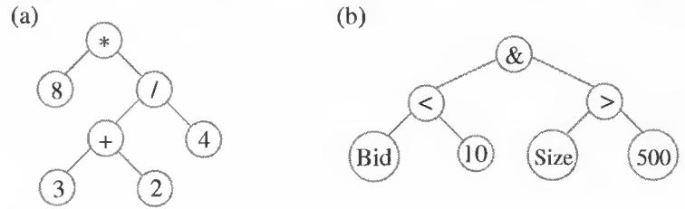  
Figure 15-9 Example trees for (a) mathematical and (b) trading rules

Processing for genetic programming is just as with genetic algorithms. Crossover and mutation are csscntially the same, except that it is bascd around nodes of the tree rather than bits in thc bit-string. Potential issues with this approach are that over a reasonable number of cycles the trecs can become quite complex. In addition, some crossovers or mutations may lcad to defunct expressions such as $1 = 1 .$ Note that it is important to leave the trees alonc during testing. This is bccause further crossovers and mutations can easily changc defunct cxprcssions to becomc useful ones, as Jean-Yves Potvin, Patrick Soriano and Maxime Vallée (2004) point out.

# Predicting data and trends

In terms of applications, AI has often been used as a forecasting tool. This cxpands on the forecasting tcchniqucs we saw in Chapter I0. Again, the goal is to enhance execution rather than find investment opportunities, since when an order is received the decision to buy or sell the assct has already been made. Hencc, we will focus on short-term predictions of market conditions. The results of thesc prcdictions may be used within cost or risk models as a facior in determining order choice and placemcnt. Thcsc should help the algorithms/tactics dccide on an appropriate level of aggressiveness. Note that for such decisions directional trends can be just as uscful as actual numbers.

# Predicting asset prices

Understandably, much of the research has focusscd on forecasting asset prices. In terms of AI-based models, ncural networks are the commonest approach, although support vector machines arc incrcasingly bcing adopted.

# Price prediction with neural networks

Ncural networks were first applied to stock pricc prediction in a study by Halbert White (1988). He cmployed a feed-forward nctwork to analyse the daily stock returns of IBM in order to test the Efficient Markets Hypothesis (EMH), which asserts that asset prices follow a random walk. Although no predictive rules were found, his research highlighted the potential for such analysis. Indeed, a later study of six other U.S. stocks by Gcorge Tsibouris and Matthew Zeidenberg (1995) found some predietive ability from historical prices. Further prediction studies ol stock returns, such as those by Apostolos-Paul Refenes, Achileas Zapranis and Gavin Franeis (1995) and Manfred Steiner and Hans-Georg Wittkemper (1995), found thal neural networks outperformed comparable statistical techniques, such as regression models. Some studies have even incorporated aspects of technical analysis, for instance, K. Kamijo and T. Tanigawa (1990) used an Elman recurrent network to predict stoek prices for Japanese stocks. Their method sought to find triangle palterns to determine whether price rises might be permanent, based on historical highs, lows and eloses.

Predieing stock indices has been a particularly popular area of research. Amol Kulkarni (1996) performed a study of the S&P 500, with weekly data covering both the crash of Oetober 1986 and the bull run of 1994. His network was a straightforward feed-forward net, with 19 input neurons and a single hidden layer of 7 neurons. The model incorporated both short- and long-term interest rates together with historical prices. It was trained with 275 weeks of data. He found thal for out-of-sample testing the network gave reasonahle predietions one week ahead of the actual index, as shown in Figure 15-10.

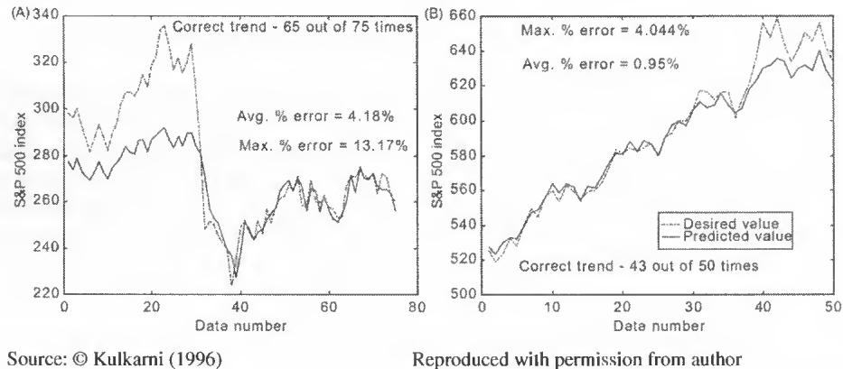  
Figure 15-10 Predicted values for the S&P 500 (a) during the 1986 crash and (b) the 1994 bull run

It also correetly predicted the overall price trend 65 out of 75 times for the period of the 1986 crash, and 43 out of 50 times for the 1994 bul-run. In particular, he aseribed its sueccess over the period of the 1986 erash to having incorporated the elfeet of rising long-term interest rates, sinee there was no hint of this from the index price trends.

In their study of the S&P 500 index, Tim Chenoweth, Zoran Obradović and Sauchi Lee (1995) also used interest rate data, namely the US Treasury rate, lagged by two and three months. They employed two separate neural networks, which were trained with either upward or downward trending index data. The quality of the predietion was found to be sufficient to yield an annual rate of return elose to $1 5 \%$

Another study which looked at both "bull" and "bear'" markets was carried out for the Madrid stock marker's General Index hy Fernández-Rodríguez, González-Martel and Simón Sosvilla-Rivero (2000). They used a feed-forward network with nine inputs for the previous close prices and a single hidden layer with four neurons. Their results proved superior to a simple buy-and-hold strategy; although incorporating transaction costs showed the ANN underperformed buy and hold during bull markets.

Other factors have also been incorporated into models, such as FX and the prices of other major indices. Thomas Ankenbrand and Marco Tomassini (1 995) carried out a study of the Swiss Performance Index. Their model incorporated interest rates, relative performance to the S&P 500 and the DEM/USD exchange rate, due to the importance of exports for Swiss companies. Overall, the prediction accuracy was around $70 \%$ out-of-sample.

Technical indicators such as moving averages and RSI were also used as input together with the historical prices for the main indices on the Kuala Lumpur stock exchange by Jingtao Yao, Chew Lim Tan and Hean-Lee Poh (1999) and Yao and Poh (1995). They tested fecd-forward networks with back propagation for a range of different network configurations. Networks with two hidden layers seemed to give the best results, both in terms of accuracy and from paper-trading profits. Overall, they estimated that annual returns of up to $26 \%$ could be achieved from these predictions for the 1990 data, taking into account $1 \%$ transaction costs.

Using neural networks for predicting prices is not solely limited to equities; they have been applied to most of the major asset classes, such as bonds, FX, futures and options.

Forecasts of U.S, U.K and German 10-year government bond yields were made by Christian Dunis and Vincent Morrison (2004). The inputs for their ANN-based models incorporated a range of daily close prices for 2001-3, including currencies, leading stock indices and commodities like oil. They actually found the ARMA model to give consistently more accurate predictions; however, the ANN-based models proved to be the best at predicting the directional trends. Hence, their trading simulation actually saw the most profit from the ANN-bascd models.

A study of the U.S. dollar/euro exchange rate, using daily data from 1994-2001, by Christian Dunis and Mark Williams (2003), noted that ANN-based models outperformed statistical techniques such as ARMA. The exchange rates for six different currencies versus the U.S. dollar were modelled by Yao and Tan (2000), using weekly moving averages from 1984-95 as inputs. They found that for most of the currencies the neural network outperformed ARIMA based models, reaching accuracies of over $70 \%$ with relatively low deviations. Similar results were found by Joarder Kamruzzaman and Ruhul Sarker (2003), in their study based on a range of currencies versus the Australian dollar. Weekly data was used with training over 500 weeks. Two of the out-of-sample forecasts (spanning 65-weeks) are shown in Figure 15-1 1. Another feature of their research was the comparison of a range of learning mechanisms. They reported that scaled conjugate gradient-based learning gave significantly better results than back propagation.

The short-term dynamics of daily prices for S&P 500, Libor and Deutsche Mark futures were analysed using Elman recurrent networks by Ludmila Dmitrieva, Yuri Kuperin and Irina Soroka (2002). The best predictions were achieved for the S&P 500. Similarly, ANNs were used to predict NYMEX crude oil future prices by Saeed Moshiri and Faczeh Foroutan (2004). Their ANN-based predictions outperformed both ARMA and GARCH models.

Neural networks have also been applied for predicting the prices of options. Gunter Meissner and Noriko Kawano (2001) forecasted the daily prices of options on ten U.S. hightech stocks from 1999-2000. They compared standard feed-forward networks with those based on radial basis functions (RBF) and probabilistic and gencralised regression networks. The inputs were based on those for the Black Scholes model, so they used the ratio of the spot to the strike price, the maturity, the risk-free rate and a GARCH estimate of the volatility. The standard feed-forward networks performed best, outperforming all the other types including the standard Black Scholes model. Subrata Mitra (2006) also saw improved performanee when using an ANN to modify the Black-Scholes based pricing modeI for call options on India's Nifty stock index. Whilst Alex Faseruk and Lev Blynski (2006) used a simple back-propagation ANN to forecast the pricc of the OEX S&P 100 index option from the CBOE, using data from 1986-93. They also noted that the ANN model outperformed the conventional Black-Scholes pricing model when both were based on historical volatility. Switching both models to use implied volatility gave improved results; although the ANN's relative outperformance was less.

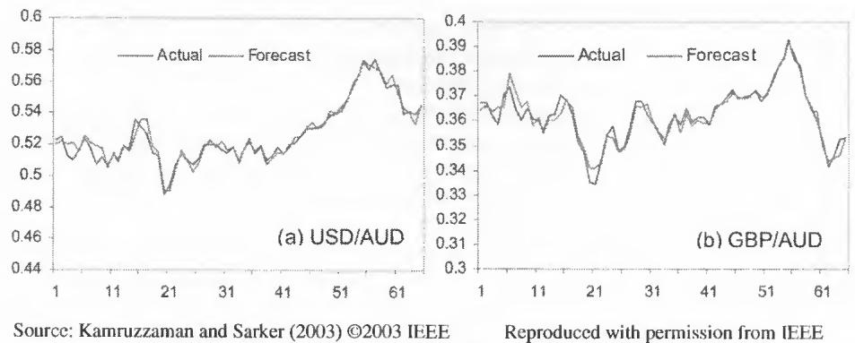  
Figure 15-11 ANN based 65 week currency forecasts

Most of the examples, so far, have been based on feed-forward or recurrcnt networks, but other types have also been successful. For example, a probabilistic neural network was used to predict the Singapore Stock Price Index by Steven Kim and Se Hak Chun (1998). Whilst Sung-Suk Kim (l998) used a time delay recurrent network to forecast the Korean Stock Market Index.

# Price prediction with SVMs

Support veetor machincs (SVMs) have also been applied to forecast prices. A study of the Nikkei 225 stock index, using weckly data from 1990-2002, was performed by Wei Huang, Yoshiteru Nakamori and Shou-Yang Wang (2004). They compared the SVM's predictions with an Elman recurrent neural network and found that the highest accuracy was achicved by the SVM $(73 \% )$ , followed closcly by the neural net $( 6 9 \% )$ . A similar analysis was performed for six major Asian stock market indices by Wun-Hua Chen, Jen-Ying Shih and Soushan $\mathbf { W } \mathbf { u }$ (2006). They used SVMs to predict the returns for the Nikkei 225, Australia's All Ordinaries, Hong Kong's Hang Seng, the Singapore Straits Timcs, Taiwan's weighted index and Korea's KOSPI indices. Daily close prices were used with test data from 1984-2001. For comparison, they also tested auto regressive (AR1) models and back propagation (BP) ncural nets. Overall, they found mixed results for the performance of both sVMs and neural nets. In terms of accuracy, the SVM models performed better for the indices in Hong Kong, Taiwan and Korea, whilst for Japan and Singapore the neural nets werc better. In out-of-sample testing there was no appreciable difference betwccn the two models for Australia, as shown in Figure 15-12. Both SVMs and ncural nets performed better than autoregressive models, except for predicting the direction of returns.

Tony Van Gestel et al. (2001) used least squares SVM regressions to predict the time serics and related volatility for U.S. short-term interest rates, as wcll as the German DAX

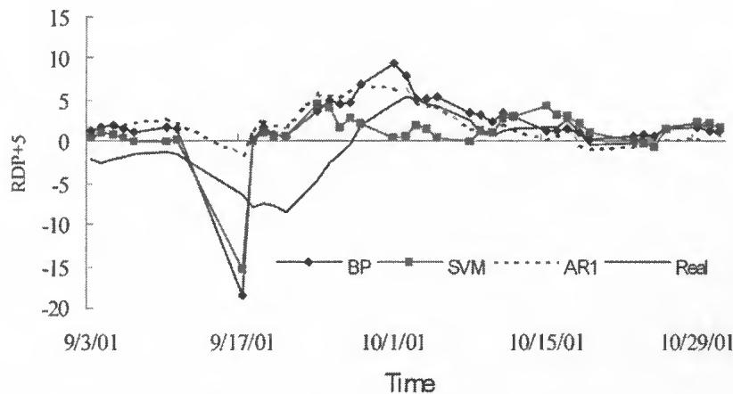  
Source: Chen, Shih and Wu (2006) Copyrigh 2006 Inderscience Enterprises Lld. Reproduced wih permission   
Figure 15-12 A comparison of the relative differences in percentage of price (RDP) for the All Ordinaries index

stock index. The accuracy of prediction for the sign of future returns was over $5 \%$ higher for the SVM models compared to both autoregressive (AR) and GARCH methods.

SVMs have also been used to predict the prices of futures, Francis Tay and Lijuan Cao (2001) studied five contracts, covering both stock indices (S&P 500 and CAC 40) and major government bonds (U.S. 10 and 30 year, and German 10 year bunds). Daily close prices were used with a training period of over 900 days. A neural network was used for additional comparison. Overall, the forecasts from the SVMs were better than from the neural net. The deviations from the actual were smaller and the predictions of the directional trend were more accurate.

For option prices, Michael Pires, Tshilidzi Marwala (2007) found that SVM's offered the most effective price forecasts for American options, with significantly less deviations when compared to ANN-based models.

# Predicting volatility

R. G. Donaldson and Mark Kamstra (1997) created a non-linear GARCH model, based on a neural nel, to study the return volatility of stocks from the U.S., Canada, U.K. and Japan. They found that the neural network captured volatility effects overlooked by traditional GARCH and EGARCH methods.

For stock indices, Fernando Gonzalez Miranda and Neil Burgess (1997) used neural networks to predict the intraday volatilities from Spain's IBEX 35 index options. Again, the networks were found to outperform more traditional linear methods. Apostolos-Paul Refenes and Will Holt (2001) also found that neural networks generally outperformed other statistical methods for volatility prediction. Likewise, a study by Peter Tiño, Christian Schittenkopf and Georg Dorffner (200o) found neural networks effective in predicting the volatility of the U.K. FTSE and Germany's DAX stock index options. Though, they noted that on average simple binary Markov models outperformed both GARCH and neural network based techniques in simulated trading tests.

Valeriy Gavrishchaka and Supriya Banerjee (2006) used a support vector machine tc forecast the volatility of the S&P 500 index. They found that it was comparable to be bes1

GARCH model across different volatility regimes, and even outperformed GARCH in some.

Currency volatility was modelled by Christian Dunis and Xuehuan Huang (2002). They used both feed-forward and recurrent neural nct works to predict the volatility of the British pound and the Japanese yen versus the U.S. dollar, using daily data from 1993-99. Again, both the ANNs performed well compared to GARCH models, giving the best simulated trading results. The recurrent networks marginally outperformed the feed-forward ones in terms of directional accuracy. Overall, though, the highest accuracy was achieved by a combination model that incorporated both the neural and GARCH estimates.

Even the volatility for options on index futures has been analysed. Shaikh Hamid and Zahid Iqbal (2004) used ANNs to study the S&P 500, using daily prices from 1984-94. They found that the volatilities from the neural network outperformed implied volatility forecasts, and were not significantly different from realized volatility.

More exotic neural models have also been used to prediet volatility. For instance, Dirk Ormoneit and Ralph Ncuneier (1996) used a conditional density estimating ncural nctwork to predict volatility of the DAX. They found that this outperformed a standard feed-forward network. Similarly, a mixture-density network was applied to the DAX index by Christian Schittenkopf, Georg Dorffner and Engelbert Dockner (2000). This is esscntially a set of neural networks used to estimate the parameters for a mixture density model. They found that their predictions had a higher correlation with the implied volatilities than those of the GARCH model. In an carlicr work Schittenkopf, Dorlfncr and Dockner (1998) also studied the volatility of the Austrian stock market.

Genctic prograrnming (GP) has been used to forecast volatility as well. In a study of the S&P100 index, using intraday data from 1987-2003, Irwin Ma, Tony Wong and Thiagas Sankar (2007) found they could achieve $7 5 \mathrm { - } 8 0 \%$ accuraey within a hundred generations. Wo-Chiang Lee (2006) used both ANN and GP models to forecast the volatility of Taiwan's TAIEX index. He found that empirically both types performed reasonably well in forecasting out-of-sample volatility compared to other methods, such as GARCH.

# Predicting volume

A study forecasting the total daily trading volume on the NYSE was carricd out by Blake LeBaron and Andreas Weigend (1994). They applied a bootstrapping, or resampling, technique, to simple feed-forward networks. The inputs were the aggregate turnover and the level of 1he DJIA. The turnover was dctrended by dividing by its 100-day moving average. (Note logarithms were used to ensure the distributions of the input series were less skewed.) Contrary to their expectations, they found that the neural network did not give a marked improvement over standard linear models, although they rcasoned that bettcr rcsults might be achieved by using additional forecast variahles.

More promising results were found in a subsequent study of trading volume for six futures contracts on the on the Winnipeg Commodity Exchange by Iebeling Kastra and Milton Boyd (1995). They again used feed-forward networks, but with an cxpanded set of input parameters. These were individually selected as predictors for futures trading volume. So the models were based on lagged trading volume, the futures price volatility, open interest and the average cash price as well as a proxy for the overall hedging demand. The ncural network outperformed both naive and ARIMA models, providing forecasts for up to nine months into the future.

# 15.4 Incorporating in trading strategies

Trading algorithms and execution tactics can adapt to market conditions. Limit order models may be used to determine the execution probability of orders, whilst cost-models help estimate the potential market impact and risk associated with a trading strategy. Hence, it is not a great leap to consider adding short-term forecast models. These may also be used to augment models for execution probability and/or cost estimates.

Algorithms may be broken down into specifie trading rules. Generally, these are defined by experienced traders, or quants, based on experience of what works best for a specifie market. Often this requires a substantial amount of testing and fine-tuning. Artificial intelligence systems ofer a way of enhancing this process, sinee they can dynamically test a huge number of variations in parallel. Evolutionary algorithms may be used to fine tune trading rules and/or their parameters. Alternatively, whole rule-sets or algorithms could be evolved. Closely linked with this, is the ability to back-test the rules or strategies to determine their performance. By suceessfully automating both of these processes, we should be able to harness the power modern computers provide to literally test thousands of combinations.

# Applying short-term forecast models

In Chapter 5, we used charts to eompare the typical order placement patterns for a range of trading algorithms. However, during the execution it is imporlant to remember that we do not know exactly what the future holds. So from time T in Figure 15-13 all we really have is uncertainty.

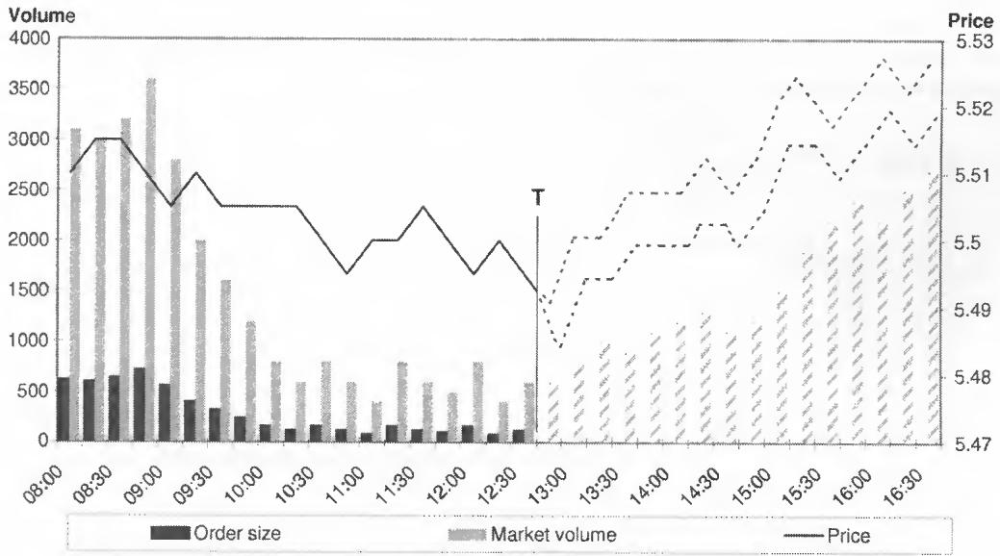  
Figure 15-13 Using short-term estimates for future market conditions

Modern trading algorithms are used to making dynamic adjustments to cope with changing market conditions. Though, if a sudden shift occurs such a reactive approach can be caught out and foreed to play cateh up at less favourable prices, leading to sub-optimal

performance.

Data mining and artificial intelligence offer the potential to improve our short-term predictions for key market variables, such as price, volume and liquidity. This may be direct, using specifiec forecasting techniques, or indirect, based on changes in other assets or markets where data mining has shown a clear association.

Volume prediction is important for many trading algorithms. If future trade flow differs markedly from the historical volume profile then VWAP algorithms will probably struggle to meet their benchmarks. Even implementation shortfall algorithms nced an accurate idea of the daily trading volume in order to determine the optimal trading horizon. A sudden spike or lull in volume will affect its performance. Likewise, a sudden shift could lead a dynamic percent of volume (POV) algorithm to chase the market, incurring considerahle market impact. Using a short-term forecast would enable POV algorithms to place more passively priced orders in anticipation of future trading volume.

As we saw in Chapter 10, historical volume profiles go some of the way towards this, particularly when seasonal or even asset specific factors are incorporated. AI-based models can also offer useful short-term volume predictions, which may perform better in volatile markets. They might also be able to cope better with today's complex marketplaces, where volume is fragmented between multiple venues. However, so far there seems to have bcen little AI-based rescarch into this.

Similarly, the market price may exhibit a consistent price trend, or there may he a reversion as in Figure 15-13. In Chapter 5, we saw how price adaptive algorithms can easily adapt to this. A passive in-the-money (PIM) strategy assumes any trends will persist and so prices orders more passively when market conditions are favourable, seeking to maximise the potential price improvement. Conversely,an aggressive in-the-money (AIM) tactic takes the opposite approach, assuming that trends will soon mean rever and so aggresively takes advantage of favourable prices. For instance, let's assume we are selling assct ABC, three potential short-term price forecasts are shown in Figure 15-14.

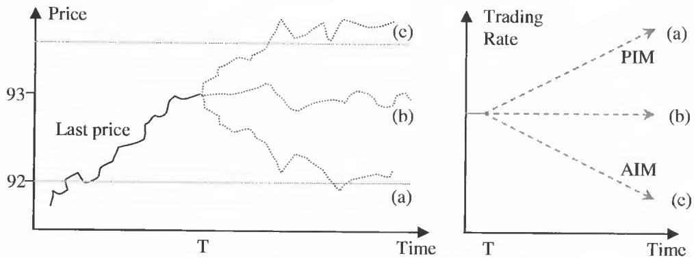  
Figure 15-14 Linking expected trading rate to future conditions

So at time T, a PIM strategy might expect the favourable trend to persist (pathway c) and so will continuc to passively price its orders. If the trend slows down (pathway h) or even reverts (pathway a) it will need to trade more aggressively, trying to stem the now less favourable price trend. In comparison, an AIM strategy would cxpect reversion, so if the trend actually persists it will under perform.

Rcacting to the changes as they happen will mean seeking immediate fills and so paying half the sprcad as well as any market impact costs. Whereas if at time T we could accurately forecast such a reversion, our trading algorithm could alter its approach. Less passively priced orders could he placed, reducing our potential spread and impact costs.

In tcrms of their choice of execution tactics, the controlling algorithms may decide to switch betwcen more or less aggressive approaches, based on their perception of the current market conditions. For instance, if the current price trend is expected to stay favourable the algorithm may adopt a more passive tactic, such as layering orders, to try to maximise the price improvement.

Price volatility is another important factor for many trading stratcgies. Historical volatility is certainly useful, hut in highly volatile markets, it can still underestimate the actual volatility. AI-based methods have proven to give more accurate forecasts than estimations based on implied volatility and statistical analysis.

This approach may also be adopted for other market conditions, such as liquidity or spreads. Provided the short-term forecasts are accurate, we should be able to benefit from more proactive order placement. If they are not then the orders may be cancelled, and more aggressively priccd orders may be used to catch up.

# Incorporating forecast models

In Chapter I1, we looked at how a simplified algorithmic trading environment might be set up. Figure 15-15 illustrates how this could be extended in order to incorporate short-term estimation models.

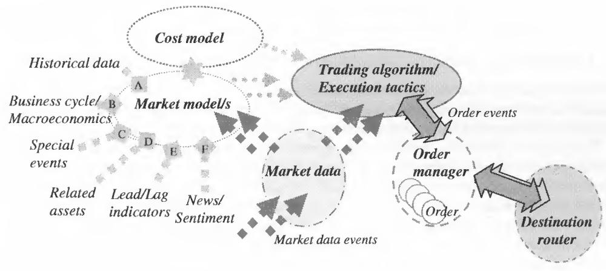  
Figure 15-15 Extending an algorithmic trading environment

Keeping the modcls separate from the actual algorithm allows them to be reused more easily. Each trading algorithm, or even execution tactic, may then use thcse short-term market cstimates as part of their decision making process, choosing how much weight to give this information.

In fact, several models may be used, weighting the results from each and adjusting for optimal performance, as we saw for the ncural network node back in Figure 15-4. This is similar to a technique called ensemble learning, which may be used to improve the accuracy of forecasting. Multiple models are cmployed for the forecast; each one is given a weighted vote (labelled A-E in Figure 15-4), based on its accuracy from prior testing. Even if models are not that accurate to start with, by combining them in this way the probability of a correct forecast increases. Hence, a variant of this technique is called boosting.

The models themselves may be purely statistical, as we saw in Chapter 10, or use AI or relationships learned from data mining. For example, short-term price estimation might be achieved hy looking to the futures or options markets, or other major market indices, based on historical lead/lag relations. Another model might track prices across stock industries or sectors based on historical correlations. For example, in Chapter I4 we saw how ncws in one company led to a spillover effcct across the whole sector (in this case biotechnology). A lurther model might simply give an indication of whether the price is likely to increase or decrease, based on analysis (statistical or AI-based) of previous prices.

Clearly, each model will need access to a range of data, from:

● Market data for the specific asset   
• Market data for other related assets and/or indices/indicators   
● News/sentiment data   
• Business cycle/Macroeconomic data   
• Historical data for any/all of the above

There should also be monitoring to ensure that the forecast models are improving the overall performance of the trading algorithms. A control might cven use market data to check the accuracy of the model/s, and make adjustments based on whether the market reaction is more or less than expectcd. Factors such as perlormancc and reliability play a part as well, as wc saw in Chapter I1. Any analytics must also be calculated Tast enough to he useful for exccution and/or order placement decisions.

# Generating trading strategies/rules/parameters

Trading algorithms and execution tactics are sets of trading rules that are chosen to meet specific objectives. These rules are generally defined by traders, but there will also have been a significant amount of testing and fine-tuning to ensure they perform sufliciently.

Trec-based expressions, supported by genetic programming techniqucs, provide a very flexible means of generating or evolving trading rules, as we saw hack in Figure 15-9. Evolutionary algorithms are potentially well suited to such fine-tuning; since they have the ability to test a huge number of variations in parallcl. The changes being tested might be as simple as different paramcters, alternatively whole sets of rules may be cvolved.

Much of the rescarch into trading rule generation has concentrated on investment decisions. Technical trading rules for the S&P 500 index were created by Franklin Allen and Risto Karjalainen (1999), using daily price data. The rules were specified in cxpression trces that incorporated variables, such as market prices, and functions, such as moving averages. A similar approach was adopted by James Butler (1997) and Edward Tsang et al. (2000) to create the EDDIE (Evolutionary Dynamic Data Investment Evaluator) system. They also incorporated fundamental data, such as the price-earnings ratio, together with market prices in the rules. EDDIE was used by Butler (1997) and Li and Tsang (1999, 1999a) to predict whether a specific rate of return (or more) could be achieved within a given timelrame (1-3 months) for the S&P 500 and DJIA stock indices. In each case, they found that it was indecd possible to generate rules that could outperform random tests and common technical rules. A variant was even created by Tsang, Markose and Er (2005) to invcstigate the futures call-put parity arbitrage for the FrSE- 1 00 index, which outperformed naive arbitrage rules.

However, generated trading rules may be just as easily be used for execution tactics, such as order placement decisions. Figure 15-16 shows what the rule-tree might look like for a sample cxecution tactic. This models the decision for choosing between market order and a limit order placemcnt.

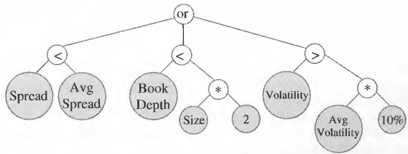  
Figure 15-16 An example order placement rule

The rules arc bascd on order book conditions and asset specific variables, as we saw in Chaptcr 8. Thus, less aggressively priced limit orders are placed when:

the spread is less than its historical intraday avcrage, or the book depth (on the same side) is less than double our order size, or the short-term volatility is $10 \%$ greater than normal.

This approach could also be applicd to choose betwcen cxecution venues in fragmented markets, or to try to minimise legging risk for contingent/pairs and portfolio trades.

# Back-testing

Back-testing is an important means of verifying the potential performance and profitability of any trading stratcgy. It allows us to scc how the strategy might have performcd under market conditions. Testing can also show how the strategy copes with specific situations, such as news events or markct crashes.

A nicc overvicw of the key considerations for back-testing is provided by Steve Oppenheimer and Thomas Parry (2007) in eForex magazine. As they point out, it is important to be able to simulate how the market might have reacted to our orders. To do this accurately we need to consider the available liquidity, as well as taking into account factors such as latency. Another important consideration is how deterministic the simulation is. For example, when testing trading rules or parameters we want to be able to see the impact of just thesc changcs. If the simulation is deterministic then each time the results will be the same, making it easier to isolate the effect of any rules changes. In comparison, random (or stochastic) simulations will give completely different results each time. Ideally, it would be useful for the simulation to be able to toggle between these two types, giving us the most flexibility.

So far in this book, we have concentrated on cmpirical studies; however, there has also been a lot of rescarch based on artificial markets. Thesc offer one potential solution for backtesting. In particular, artificial markcts allow us to test a wide variety of conditions such as trending or volatile markets or even sudden liquidity crises. An alternative approach is to base thc simulation on real market data. In which case the simulator somchow needs to merge the test ordcrs with this data and try to emulate the appropriate reactions.

# Testing with artificial markets

Artificial intelligence is being used to create simulated marketplaces that are populated with clectronic agents, although some also allow human participants. Unlike real markets, these simulations may be controlled and configured, allowing activc cxperimentation. Rescarch is primarily focussed on market microstructure analysis and testing the performance of specific trading strategies. The data from these simulations may then be compared with thcoretical predictions and empirical evidence from real markets.

# Artificial agents

The artificial agents used to simulate trading can range from simple random order generators to rule-bascd agents or cven ones based on sophisticated AI techniques. A nice summary of the various types is given by Blake LeBaron (2000).

Purely random agents are easily implemented, but they can often lead to high volatility. In comparison, experimcnts involving human traders generally achicve quitc a rapid pricc convergencc. LeBaron (2000) notes that market cfficiency tests assign random agents at betwecn $5 0 \mathrm { - } 1 0 0 \%$ , whilst human traders are much closer to $100 \%$ .

Onc step up from purcly random order generators is the zero-intelligence agent, as outlincd by Dhananjay Gode and Shyam Sunder (1993). These still place random ordcrs to buy or sell, but they also adhere to strict budget constraints. LeBaron (2000) notes that such budget constrained agents allocate assets at over $9 7 \%$ efficicncy, which is close to the performance of humans in similar tests.

Dave Clifr"s (1997) zero-intelligence plus (ZIP) traders further cxtend this model to include a variable profit (or utility) margin. Each ZlP agent has an inbuilt price limit. In addition to this, there are thrce main parameters, namely its profit margin, learning rate and a momentum term. Using these, each agent can determine a target price, based on its price limit and the desired profit margin together with a random factor. The learning rate parameter controls the rate of convergence betwecn the agent's order prices and their target price. The momentum term dictates how much history the agent takes into account when reevaluating its margin. Essentially, this adjustment is based on how successful the agent has been at getting its orders filled, as well as the dynamics of the market price. A genetic algorithm may be used to optimise these parameter settings.

Similarly, Steven Gjerstad and John Dickhaut (1998) created agents that maintain an order and trade history. From this, they form a subjective "belief' function that represents their estimated probability of the fair price.

Other studies have used agents that are cven more sophisticated. For instance, Marco Raberto et al. (2003) created them based on particular invcstment styles. Momentum and contrarian agents uscd simple technical trading rules to make decisions, whilst fundamental agents traded based on a firm view of the asset's valuc. Gilles Danicl (2006) created selfreferential agents, which acted as informed and rational arbitrageurs. Agents have also been designed to adopt the role of market makers. For example, Sanmay Das (2005a), Yi Feng, Ronggang Yu, and Peter Stone (2003) and Alexander Sherstov and Peter Stone (2004) all report on market making agents.

'The performance of both human and electronic agents in a continuous doublc auction was analysed by Rajarshi Das et al. (2001). Several different agents were used, including ZIP traders. To their surprise, they found that the electronic traders consistently outpcrformed their human counterparts by around $20 \%$ .

# Artificial markets

Research into trading stratcgies and market microstructure has yielded a rangc of diffcrent market simulators. A nice ovcrvicw of these is provided by Julien Derveeuw et al. (2007), Gilles Danicl (2006) and LeBaron (2001).

The Santa Fe artificial stock markct was onc of the earliest simulated markets to be crcated. Trading evolves around two asscts, a risk-frce bond and a risky stock. In the lirst version, outlined by Richard Palmer et al. (1994), the market was driven solely by the decision of the agent traders to buy or sell. In later versions, described by Blake LeBaron (2001a), agents could predict the value of the stock based on cstimates for its future dividend.

The Gcnoa artilicial stock market, outlined by Marco Raberto et al. (2001), supports the samc two assets as the Santa Fe simulator, but agents may issue limit orders. Using this model, they werc able to see some of the key features of price dynamics, namely volatility clustering and fat-tailed distributions.

The NatLab market simulator provides a fully asynchronous event driven plalform. The design is bascd around a central ordcr book and supports both market and limit orders. By using a mixture of different agent tradcr types the simulator has been able to reflect phenomcna such as financial bubbles, crashes and recoveries, as detailed by Lev Muchnik, Yoram Louzoun and Sorin Solomon (2006).

Another notable platform is the U-Mart simulator, reported by Yoshihiro Nakajima et al. (2004), which provides an artificial futures market for both human and machine agents.

# Simulating real markets

Artificial agcnts and markcts can be useful for testing. However, basing the simulation on real market data givcs an immediate head start in tcrms of realism. The simulator needs to be able to recreate the order book and apply the same trade matching rules as the venue it is simulating. Though, simply giving an immediate fill for every test order with a matching price docs not providc suficient realism. The simulator also needs to take into account competition from other participants. Otherwise, thc stratcgy/algorithm being tested may perform poorly when transferred to the real world. Therefore, it is also vital that the simulator provides a realistic reaction to the test orders. Figure 15-17 shows an examplc of what this might look like.

As we saw with market impact, it is difficult to predict the long-term effect of placing additional ordcrs. Though, based on the short-term responses we saw from the cmpirical studics in Chapter 8, simulators can make slight adjustments to the historical data in response to the lest ordcrs. For instance, subsequent orders might be priced more passively if the test ordcrs increase the available depth on the order book. The simulator might also takc into account other market conditions, such as volatility or price trends.

Some research groups have already created their own simulations based on real data. Most notably the Penn-Lehman Automated Trading Project (PLAT), as described by Michael Kearns and Luis Ortiz (2003). This order book bascd platform integrates data from the former Island ECN. The Penn Exchange Simulator augmcnts the order book data from the ECN with its own simulated orders. Additional rcalism is provided by competition from multiple agents. Thus, agents' orders may end up executing with simulated ones from the ECN or with orders from a competitor. Based on this approach Sheri Markose, Azeem Malik, Wing-Lon $\mathbf { N g }$ (2007) also rcport on a simulator for London's SETS limit order book.

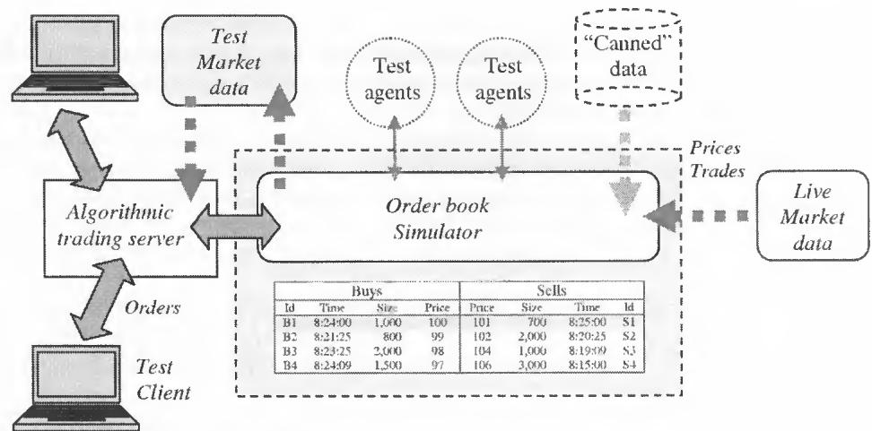  
Figure 15-17 An example test environment

Commcrcial simulators are available as wcll. Thcse are focussed on catering for the testing needs of algorithmic trading systems. For instance, Allicd Testing's Exchange Simulator (SIM) 2 provides both live and playback modes, much like PLAT. The order book is recreated using exchange data fecds. It can also be reconstructed using the order book depth and by inferring the order flow based on trade details from level two market data. Instead of using competing agents, the simulator responds to user orders based on the available liquidity. It adjusts the historical data in response to the uscr's trading activity and even simulates new orders to mimic the typical market reactions. These reactions also take account of stock-specific hehaviour, so orders tend to qucue for assets with large spreads whilst for more liquid assets simulated orders compete by using more aggressive pricing and filling any gaps in the order book. Hence, the simulator is able to provide behaviour tailored to the typical dynamics and microstructure properties of each asset.

Both PLAT and SIM support real-time and replay modes, so simulations may be performed live or back-tested by replaying historical data. This provides a very llexible framework for testing and training. Note that single agent testing is likely to be more deterministic, and so more suited to reproducibly testing changes for trading rules and parameters. Further testing may then be performed in a multi agent environment.

# 15.5 The future

Artificial intelligcnce often evokes images of the “"black box" supercomputers used to play chess. However, chess is a gamc with delined board and a very strict set of rules, so despite the billions of permutations a computer can potentially learn cvery move, as James Finnegan points out in CFA Magazine (2006).

Financial markets are a lot more complex than chess; for startcrs, there are a lot morc participants, and the rules are less well dclined and constantly evolving. Relying on a computer's processing power and brute force is not going to solve the problem of best execution. Artificial intelligence may well offer a solution, although it still appears to be

somc way in the future.

Autonomous vehicles may offer a closer approximation to the required complexity than chess. These also highlight the rapid progress that is being made in AI. In 2004, the objective of the DARPA (Defensc Advanced Research Projects Agency) Grand Challenge was for autonomous vehicles to navigate a 142-mile long course through the Mojave Desert. The vehicles relied on a combination of satellite navigation, radar, laser range finding, and video cameras. The AI systems somehow needed to take all these disparate inputs and use them to keep control of the vehicle and navigate safely to the destination. On this first run within a few hours all of the fifteen competitors had failed, been disqualificd or withdrawn. However, the 2005 rerun was much more successful with five teams finishing. Stanford University's robot-car "Stanley" completed the course in less than seven hours. In fact, all but one of the 2005 entrants surpassed the 7.36 mile limit, which had been achieved in 2004.

On the back of this rapid progress, DARPA significantly raised the goals for thcir 2007 Urban Challenge. This time, the vehicles had to negotiate 60 miles through a mock city avoiding obstacles. The AI systems also had to contend with other vehicles, and more complex driving patterns such as overtaking and parking. The entry from Carnegic Mellon won, but al the cars showed considerable improvements over the previous models. This is a closer approximation to the financial markets, since they had to contend with other drivcrs and other AI-based systems.

The techniques we have covered in this chapter may seem somewhat esoteric. Still, if AI systems can be used to drive a car 60 miles through town and park it without crashing, then there is certainly some scope for them to be applied to the financial markets. It is important to remember that we are not talking about recreating human intelligence. Best execution seems like a fuzzy goal, but it is still less complicated than life. AI systems for trading are not conscious and they cannot communicate. In terms of raw intelligence, the goal is probably more like that of an insect, which (in theory) should be a lot more achievable.

That said, the financial markets have thousands of traders, each with their own opinions and strategies. Collectively their behaviour shapes the markets, and so affects the prices of assets. Advances are certainly being made in collective inteligence, using massive multiagent simulations. But this an incredibly complex phenomenon, so the science of forecasting market reactions is still evolving.

Admittedly, some of the studies we have secn in this chapter have failed to show AI techniques performing substantially better than statistical models. Nevertheless, computers continue to get more and more powerful. Over the next fcw years, they will be able to support increasingly complex data mining and artificial intelligence techniques. Therefore, their accuracy and spced are likely to increase. Hardware innovations, such as memristors, may even make building dedicated artificial intelligence hardware viable. As for whether this latest progress in AI will be successfully applied to trading – only time will tell.

# 15.6 Summary

Artilicial intelligence (Al) and data mining offer the potential to give traders an edge by spotting or predicting trends; they may even be used to generate trading strategies.

Data mining is a mix of statistical analysis and inference techniques:

Classification and clustering analysis seek to identify common fcatures in the data.   
Time-scrics mining is generally used for forecasting or spotting trends.   
Association rule mining searches for corrclation patterns.

Relationship based data mining has analysed:

Intra-market relationships, such as co-movements between industries and scctors. Inter-market relationships, highlighting the correlation betwecn major markcis. Crises and contagion, highlighting that relationships can change significantly during extreme periods. For instancc, correlation tends to increasc with downward moves.

AI can actually be split into two main approaches

Conventional AI is a top-down approach using logic and rulcs to make decisions. This olten relies on data from statistical analysis or custom-made knowledge bases. Computational intelligence is a llexible bottom-up approach, inspired by biological mcchanisms. Neural networks try to reproducc the action of our brain's ncurons, whilst cvolutionary computation simulates populations.

Trading algorithms are already an example of conventional AI sincc they encapsulatc trading logic within a rules-based framework.

Short-icrm predictions of conditions, such as prices and volatility have been shown as elfective, using neural networks, support vector machines and statistical analysis.

Evolutionary algorithms and genetic programming can test a huge number of variations in parallcl, making them suitable for checking trading stratcgies and their paramctcrs.

Back-testing is an important means of verifying the potential performance and profitability of any trading strategy. AI can hclp create simulated markctplaces for this.

# Epilogue

It is hard to say what the trading environment will look like in five or ten years time, but algorithmic trading and DMA are here to stay.

The preface of this book started by noting that today's trading environment bears very litle resemblance to that of the 1980s, or even the early 1990s. Certainly, trading has experienced some major changes over the last 20 years. At the moment, it is hard to see what might cause a similar impact in the 2010s. Therefore, over the next few years we are more likely to see evolutionary changes rather than major paradigm shifts.

Algorithmic trading is still work in progress, doubtless in ten year's time some of the earlier algorithms will seem positively naive. The following points try to highlight some of the key "take-homes" from this book.

# Algorithmic trading has already proven itself

The 2007-09 financial crisis certainly shook things up for the world's markets. Trading volumes, liquidity and volatility saw huge shifts. However, algorithmic trading platforms proved their mettle. The financial press was not inundated with stories of trading algorithms "blowing up'", bringing down exchanges (or even banks). Market share for algorithmic trading has continued to steadily increase, despite the challenging market conditions.

# Algorithmic trading will continue to spread

The world's markets have predominantly shifted towards electronic trading. Algorithmic trading is the next logical progression.

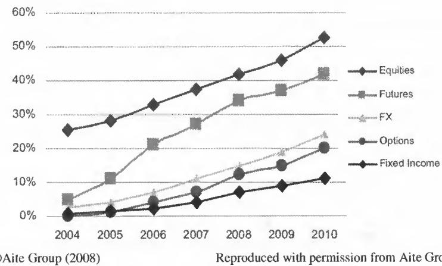  
Figure Ep-1 Estimates for the adoption of algorithmic trading

Ratcs of adoption of are continuing to increase across all the major assct classes, as Figure Ep-1 shows.

# Trading algorithms will continue to evolve

So far, there have been threc main gencrations in the evolution of trading algorithms:

The first algorithms were natural cvolutions of simple order slicing, focussing on specific benchmarks, such as TWAP or VWAP. Initially, thesc were schedule driven, and often based on historical data; variants then evolved which were more dynamic. The second generation of trading algorithms were crcated in response to the application of transaction cost analysis; such as implementation shortfall algorithms striving to minimise cost by balancing both market impact and risk. The third generation of algorithms have tended to he more adaptive and opportunistic focussing on liquidity, due to the fragmcntation of major markets and the arrival of "dark pool" ATSs.

Brokers have already started to consolidate their algorithms to make the selection proccss easicr. Those that remain are now more highly configurable, allowing much more clientspecific customisation.

As algorithmic trading continues to spread across asset classcs, ncw types of algorithm will doubtless be created, such as the volatility-driven and multi-leg algorithms we considered in Chapter 5.

# Algorithms will become even more adaptive

Adaptive shortfall and liquidity-driven algorithms have already become commonplacc.

The market volatility during the 2007-09 financial crisis showed how important it can he fo1 algorithms to cope with (and take advantage of) such changeable conditions.

Algorithms will increasingly try to take advantage of short-term predictions of markct conditions and even news/sentiment-hased indicators.

# Portfolio-based and cross-asset algorithmic trading will increase

As portfolio-optimised algorithms continue to improve, many of the hurdles to cross-asset trading will also be reduced. In other words, algorithms will he better ahle to cope with significant differences in liquidity and latency across one and two-sided trading lists.

Many of the major OMS and EMS platforms now support multiple asset classcs, so multiassct trading is already a reality. Algorithms will make cross-asset trading casicr, but may also reduce the opportunitics for arbitrage.

The demand for some structured products may even decline, with trading algorithms offering similar functionality.

# World markets will continue with waves of consolidation and fragmentation

As the Greek philosopher Heraclitus put it: The only thing constant is change ..

# Appendices

The following appendiccs provide an overview of each of the major asset classes and thcir main markets. The focus is on their adoption of electronic trading and the provision of algorithmic trading and DMA. They also examine the regional differences between the Americas, Europe and Asia.

Invariably, any review of the world markets will date rapidly given how quickly the markets are changing. Nevertheless, the main sources of information remain the same, namely the:

• World Federation of Exchanges (WFE) (www.world-exchanges.org) • Bank for International Settlements (BIS) (www.bis.org) • Securitics Industry and Financial Markets Association (SIFMA) (www.sifma.org)

Each of these organisations publishes annual (and somctimes monthly) statisics for the world's major markets.

For analysis that is even more comprchensive, the reports by consultancies, such as the Aite Group, Celent, Greenwich Associates and the TABB Group, are invaluablc.

Note that no particular reading order is required for thesc appendices. You may prefer to jump straight to the markets that are most relevant to you. Still, it is worth coming back to review the other material since there is a lot to gain from secing how things are done in the other markets.

# Appendix A Equity markets

The world's equity capital markets account for a quarter of the global financial market valuc, as we saw back in Chapter 3. Historically, stock markets have developed around strong interdealer networks, usually centred on major exchanges. In par, this is due to the highly standardised nature of stocks. Trading on these cxchanges is stil mainly carried out by brokers. They act as intermediaries, acting as an agency through which to trade orders on the exchanges; broker/dcalers may also be prepared to deal in principal with OTC trades. The equity markets have proven to be ideally suited for implementing electronic and algorithmic trading. Hence, the lcvels of adoption of these tcchniqucs are stil significantly higher for the equities markets than any other asset class.

# Asset specific

The equity in a corporation represents the value of the remaining asscts once al the liabilities have been deducted. A share in a company (also known as stock) represents a portion of this total cquity. A finite number of shares are issued by public corporations. Though, they may periodically choose to issue new shares or buy back some of the outstanding ones. If the company performs well its value (and so its share price) should increase. However, if it fails and falls into bankruptcy, sharcholders rights are subordinate to those of creditors, so they are typically Ieft with litle or nothing. Therefore, shares are forward looking invcstments; investors expect the value of their shares to increase in order to compensate them for the risk of default. Alternatively, periodic dividend payments may also be made by the company to reimburse investors.

Growing companies tend to need cash so they will often rely on sharc price riscs to appease investors. Whereas more established companies may prefer to issue larger dividends. This flexibility explains part of the appeal of issuing shares for companies.

The kind of equity issued by a company may difer in terms of voting rights and in the distribution of dividends and assets, in casc of bankruptcy. The two main types are common stock and preferred stock. Common stock allows the holder to vote in certain corporate decisions, such as the election of directors, issuance of new shares and approving takcovers. Preferred stock has priority over common stock when dividends are issued and in liquidation; however, they tend to have less voting rights.

The total value of the outstanding shares is refered to as the corporation's market capitalisation, or market cap. In U.S. terms, a large-cap, or bluc-chip, stock has a valuc of grcater than $\$ 10$ billion. Mid-caps have values betwcen $\$ 1$ and $\$ 10$ billion, small-caps are bclow $\$ 1$ billion and micro-caps have values less than $\$ 100$ million. The values for these categories will vary for other countrics, but the relative sizes will be similar.

# Pricing and trading

Determining the fair value for equitics is non-trivial. Present value theory states that the valuc of an asset is the discounted sum of its future payments. For stocks, these correspond to their future dividend payments, which in turn depend on future earnings. Though, dividend paymcnts can be difficult to predict. Firms may also choose to reinvest some of their income rather than increasing dividend payouts. A range of estimation models try to take such factors into account. Alternatively, cross-scctional regression analysis may be used to infer prices by comparing key ratios such as Price/Earnings (P/E) with similar firms, or across whole scctors/industries.

Investors also have varying information about cach company and so their valuations will be dissimilar. Thus, market prices reflect the average of al thesc valuations combined with the effects of supply and demand. Consequently, the market capitalisation will often be different to the fundamental value of a corporation's (its assets minus its liabilities).

In terms of trading, stocks are readily transferable in a domestic context, so markets like the U.S. have secn a hugc amount of local competition, betwcen both exchanges and other cxccution vcnucs. Electronic access and remote memberships, for foreign investors/traders, are helping to increase acccss to venues. There is also a buoyant depositary receipt market for trading forcign stocks. Essentially, these are just proxies allowing foreign stocks to be tradcd locally (they arc covered in more detail in Appendix F). Together, all these factors mean that stocks are starting to become truly global assets that may be traded 24 hours a day. For instance, Mark Howarth (2004) uses Sony as an example to demonstrate how such trading is now possible for many major firms. Table A-1 shows some of the potential trading venues for this throughout the day.

Table A-1 Potential trading venues for a Japanese stock   

<table><tr><td rowspan=1 colspan=1>Time(Japan Standard Time)</td><td rowspan=1 colspan=1>Trading venue</td></tr><tr><td rowspan=1 colspan=1>08:00-09:00</td><td rowspan=1 colspan=1>Tokyo pre-trade</td></tr><tr><td rowspan=1 colspan=1>09:00-15:00</td><td rowspan=1 colspan=1>Tokyo</td></tr><tr><td rowspan=1 colspan=1>15:00-24:00</td><td rowspan=1 colspan=1>London, GDR IOB</td></tr><tr><td rowspan=1 colspan=1>18:00-24:00</td><td rowspan=1 colspan=1>Tokyo after-hours markets</td></tr><tr><td rowspan=1 colspan=1>22:30-05:00</td><td rowspan=1 colspan=1>U.S. ADR</td></tr><tr><td rowspan=1 colspan=1>05:00-08:00</td><td rowspan=1 colspan=1>U.S. after-hours markets</td></tr></table>

Oncc the Tokyo stock exchange has closcd, trading may continue either on its after-hours platform (ToSTNeT) or on other local after-hours markets, such as SBI JapanNext. Trading can also shift to London stock exchange's International Order Book (IOB). Similarly, before London closcs the U.S. opcns, allowing depositary receipts to be traded here and on after market venues until Tokyo opens again.

# World equity markets

The world's cquity markets continue to be centred on stock exchanges. However, an increasing array of new cxecution venues such as Electronic Communications Networks (ECNs) and Alternative Trading Systems (ATSs) have brought both competition and fragmentation. That said, the high level of elcctronic trading and acccss via DMA and algorithmic trading mean that the world's equity markets have arguably the highest level of clicnt-side acccssibility.

Table A-2 shows the world's top fifteen stock exchanges in terms of their domcstic market capitalisation and total value of share trading for 2007 and 2008, bascd on data from the World Federation of Exchanges (WFE) (2009). Clearly, the U.S. dominates the world's equity trading with both the NYSE and the NASDAQ exchanges. The Tokyo, Euroncxt and London stock exchanges also have significant market shares and turnovers.

<table><tr><td rowspan=2 colspan=1>Exchange</td><td rowspan=1 colspan=2>Domestic market capin $ billions</td><td rowspan=1 colspan=2>Total value of sharetrading in $ billions</td></tr><tr><td rowspan=1 colspan=1>2008</td><td rowspan=1 colspan=1>2007</td><td rowspan=1 colspan=1>2008</td><td rowspan=1 colspan=1>2007</td></tr><tr><td rowspan=1 colspan=1>NYSE Euronext U.S.</td><td rowspan=1 colspan=1>9,209</td><td rowspan=1 colspan=1>15,651</td><td rowspan=1 colspan=1>33,639</td><td rowspan=1 colspan=1>29,114</td></tr><tr><td rowspan=1 colspan=1>Tokyo Stock Exchange</td><td rowspan=1 colspan=1>3,116</td><td rowspan=1 colspan=1>4,331</td><td rowspan=1 colspan=1>5,607</td><td rowspan=1 colspan=1>6,413</td></tr><tr><td rowspan=1 colspan=1>NASDAQ OMX (U.S.)</td><td rowspan=1 colspan=1>2,396</td><td rowspan=1 colspan=1>4,014</td><td rowspan=1 colspan=1>36,447</td><td rowspan=1 colspan=1>28,116</td></tr><tr><td rowspan=1 colspan=1>NYSE Euronext Europe</td><td rowspan=1 colspan=1>2,102</td><td rowspan=1 colspan=1>4,223</td><td rowspan=1 colspan=1>4,411</td><td rowspan=1 colspan=1>5,640</td></tr><tr><td rowspan=1 colspan=1>London Stock Exchange</td><td rowspan=1 colspan=1>1,868</td><td rowspan=1 colspan=1>3,852</td><td rowspan=1 colspan=1>6,272</td><td rowspan=1 colspan=1>10,334</td></tr><tr><td rowspan=1 colspan=1>Shanghai Stock Exchange</td><td rowspan=1 colspan=1>1,425</td><td rowspan=1 colspan=1>3,694</td><td rowspan=1 colspan=1>2,600</td><td rowspan=1 colspan=1>4,029</td></tr><tr><td rowspan=1 colspan=1>Hong Kong Exchanges</td><td rowspan=1 colspan=1>1,329</td><td rowspan=1 colspan=1>2,654</td><td rowspan=1 colspan=1>1,630</td><td rowspan=1 colspan=1>2,134</td></tr><tr><td rowspan=1 colspan=1>Deutsche Börse</td><td rowspan=1 colspan=1>1,111</td><td rowspan=1 colspan=1>2,105</td><td rowspan=1 colspan=1>4,679</td><td rowspan=1 colspan=1>4,325</td></tr><tr><td rowspan=1 colspan=1>TSX Group</td><td rowspan=1 colspan=1>1,033</td><td rowspan=1 colspan=1>2,187</td><td rowspan=1 colspan=1>1,716</td><td rowspan=1 colspan=1>1,635</td></tr><tr><td rowspan=1 colspan=1>BME Spanish Exchanges</td><td rowspan=1 colspan=1>948</td><td rowspan=1 colspan=1>1,781</td><td rowspan=1 colspan=1>2,411</td><td rowspan=1 colspan=1>2,970</td></tr><tr><td rowspan=1 colspan=1>S1X Swiss Exchange</td><td rowspan=1 colspan=1>857</td><td rowspan=1 colspan=1>1,271</td><td rowspan=1 colspan=1>1,500</td><td rowspan=1 colspan=1>1,883</td></tr><tr><td rowspan=1 colspan=1>Australian Stock Exchange</td><td rowspan=1 colspan=1>684</td><td rowspan=1 colspan=1>1,298</td><td rowspan=1 colspan=1>1,213</td><td rowspan=1 colspan=1>1,372</td></tr><tr><td rowspan=1 colspan=1>Bombay Stock Exchange</td><td rowspan=1 colspan=1>647</td><td rowspan=1 colspan=1>1,819</td><td rowspan=1 colspan=1>302</td><td rowspan=1 colspan=1>344</td></tr><tr><td rowspan=1 colspan=1>National Stock Exchange India</td><td rowspan=1 colspan=1>600</td><td rowspan=1 colspan=1>1,660</td><td rowspan=1 colspan=1>725</td><td rowspan=1 colspan=1>751</td></tr><tr><td rowspan=1 colspan=1>BM&amp;FBOVESPA</td><td rowspan=1 colspan=1>592</td><td rowspan=1 colspan=1>1,370</td><td rowspan=1 colspan=1>724</td><td rowspan=1 colspan=1>598</td></tr></table>

Source: WFE (2009)

# Table A-2 Major world stock markets

Although some global execution is possible, stock markets are gencrally locussed on domestic trading. In part, this is due to the much higher level of regulation for the stock markets. Still, over the last few years exchanges have started to become truly global entitics. The mergers between NYSE and Euronext, NASDAQ and OMX are a good example of this. Hence, global competition is likely to increase significantly in the coming ycars.

Electronic trading has become ubiquitous for the world's stock markets, particularly for the sell-side. Buy-side levels of adoption of DMA and algorithmic trading are also high, cspecially in the U.S. Figure A-I shows both the current lcvels of adoption of algorithmic trading and projections for 2010, bascd on estimates from the Aite Group (2007a) consultancy. Clearly, it will still take some time before the Icvels of adoption for algorithmic trading in Europe and Asia reach those of the U.S.

# American equity markets

North America obviously dominates the region with some of the world's largest cxchanges, as shown in Table A-2. The markets in Canada and Latin Amcrican arc much smaller.

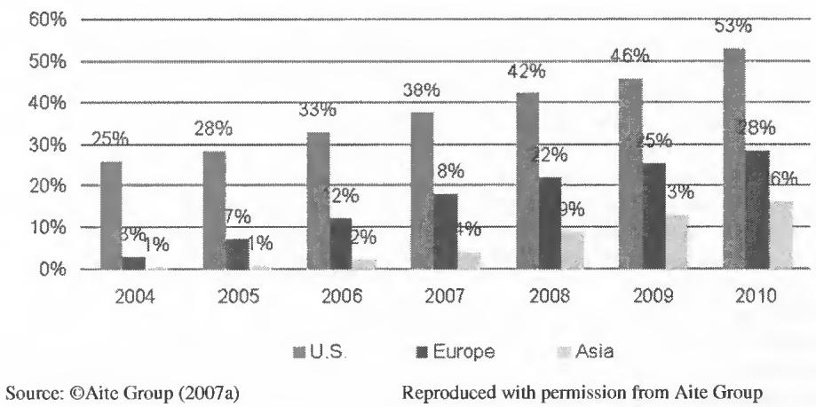  
Figure A-1 Regional adoption of equity algorithmic trading

# U.S. equity market

The U.S. equity market is led by two of the largest stock markets in the world, the New York Stock Exchange (NYSE) and the NASDAQ (originally an acronym for the National Association of Securitics Dealers Automated Quotations). Figure A-2 shows an estimate for the hreakdown of the market-share in December 2008.

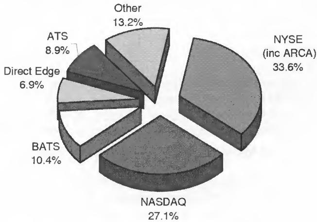  
Source: FIF (2009), ' Direct Edge (2009) and Rosenblatt Securities (2009)   
Figure A-2 U.S. equity market share in 2008 (December)

Although they still lead the U.S. marketplace, both NYSE and NASDAQ have had to constantly evolve in order to maintain their position. They have also kept an eye on the global marketplacc: As evidenced by NYSE's merger with Euronext and NASDAQ's acquisition of OMX. The rest of the U.S. market is split between BATS and Direct Edge, the regional exchanges, brokers, and around 40 distinct electronic communication networks (ECNs) and alternative trading systems (ATSs). The intense competition has made the U.S. a very fluid marketplace. In fact, the two leading competitors, BATS and Direct Edge, have evolved from ECNs into full exchanges (or are in the process of doing so). Hence, the market-share breakdown for 2009/10 may be noticeably different from Figure A-2.

The U.S. equities market leads the world for the level of adoption of DMA and algorithmic trading. Uptake has been greatest on the sell-side where traders have relied on remote electronic access for many years. Trading algorithms are often used by traders as an efficiency tool, although buy-side usage has also increased. In their 2007 U.S. Equity Investors Study, Greenwich Associates (2007) found that three-quarters of investment managers and mutual funds used algorithmic trading strategies, whilst for hedge funds the figure was more than $8 5 \%$ .

A TABB Group (2008) survey of U.S. institutional trading found that $5 5 \%$ of U.S. equity trades were executed via DMA $( 9 \% )$ ,algorithms $( 2 4 \% )$ , crossing networks $( 1 1 \% )$ or program trading $( 1 1 \% )$ in 2008. Note that in 2007 this total was actually $6 3 \%$ . The 2007-09 financial crisis and ensuing market volatility led to increased levels of high touch trading. However, the proportion of algorithmic trading has continued to grow, up from $22 \%$ in 2007. Other surveys put the level of DMA even higher. For cxample, the Celent (2008b) consultancy estimates that DMA accounts for around $1 5 \mathrm { - } 1 8 \%$ of the share volume, predicting this to increase to $20 \%$ by 2010. Similarly, an earlier report by the Aite Group (2007a) consultancy put the level of DMA at around $19 \%$ ,whilst they estimaled that algorithmic trading had reached $1 8 \%$ .

Regulation has played a significant part in shaping the U.S. equity marketplace; it has generally been used to try to increase competitiveness, or correct practices that are perceived as being anti-competitive. Table A-3 outlines some of the key regulatory milestones and their effects.

Table A-3 Milestones in U.S. equity market regulation   

<table><tr><td rowspan=1 colspan=1>Year</td><td rowspan=1 colspan=1>Regulation</td><td rowspan=1 colspan=1>Direct effects</td></tr><tr><td rowspan=1 colspan=1>1963</td><td rowspan=1 colspan=1>Restructuring OTC trading</td><td rowspan=1 colspan=1>NASDAQ created</td></tr><tr><td rowspan=1 colspan=1>1975</td><td rowspan=1 colspan=1>National Market System (NMS)</td><td rowspan=1 colspan=1>1TS created</td></tr><tr><td rowspan=1 colspan=1>1997</td><td rowspan=1 colspan=1>NASDAQ order handling rules</td><td rowspan=1 colspan=1>ECNs</td></tr><tr><td rowspan=1 colspan=1>2001</td><td rowspan=1 colspan=1>Decimalisation</td><td rowspan=1 colspan=1>Reduced sprcads</td></tr><tr><td rowspan=1 colspan=1>2007</td><td rowspan=1 colspan=1>Regulation NMS</td><td rowspan=1 colspan=1>More compctition</td></tr></table>

Starting in 1963, the Securities and Exchange Commission (SEC) recommended restructuring over the counter (OTC) trading, leading to the creation of NASDAQ. Whilst the National Market System (NMS) was introduced to consolidate price and trade information amongst the various exchanges, as well as provide an inter-market system (ITS) to route orders between them. Then in 1997, NASDAQ order handling rules were introduced to offer investors more protection for their limit orders, and to ensure that dealers always displayed their best quotes. The ruling to display client limit orders (when priced better than the dcaler's quote) helped push NASDAQ away from being a purely quote-driven market to incorporating behaviour more like a limit order book. Notably, though, it was the quote ruling which had the most impact. Previously, dealers had been able to use private interdealer systems to trade at better prices; the new ruling meant that these prices should also be available to the public. In effect, this opened a window on NASDAQ for external execution venues, and suddenly many new ECNs were created, all competing for market share.

Decimalisation was introduced in 2001, leading to lower bid offer spreads. The resultant 0.1 cent tick size also encouraged the practice of "pennying" (jumping ahead of an existing order simply by upping the price by a penny). Decimalisation has helped continue the trend of smaller order sizes and so has encouraged traders with large orders to use alternative venues, in particular the newer ATSs or so-called "dark pools". Last, but not least, Regulation NMS was implemented in 2007, providing rules for:

● Fair access   
● Order protection   
● Abolishing sub-penny pricing • Market data revenue allocation

In part, these rekindle the earlier 1975 regulations, although they meant scrapping the ITS. Instead, the fair access rule mandates that private links must be established to allow venues to route orders between each other. In addition, venues capturing a significant proportion of the ADV must provide a market quote. The order protection (or "trade-through'") rule requires that trades must be executed at the best displayed price accessible in under a second. So an order placed on the NYSE will actually be routed and executed wherever the best quoted price is, be it NASDAQ or an ECN. In comparison, the ITS allowed a 30 second time window for an order to be acted on, whilst this may have seemed reasonable 30 years ago, in a market where trading is now often measured in milliseconds this delay is a lifetime. In fact, this huge delay put the ITS order creator at a considerable disadvantage to the market, as Larry Tabb points out in an article for the TABB Group (2003). Regulation NMS should help increase market competition, but its long-term impact remains to be secn.

The 2007-09 financial crisis also triggered a fresh look at many aspects of the U.S. marketplace by regulators. Initially, the focus was on short selling, but has since expanded to look at the "dark pool" ATSs and the use of IOIs, as well as "flash" orders and highfrequency trading. Only time will tell what new regulations result and how they affect the markets.

The U.S. equity marketplace has arguably seen more changes than any of the world's markets. As we saw in Figure A-2, the major cxchanges still lead the market share; however, they are facing stiff competition. Since stocks are so fungible, trading in them can happen at virtually any of these venues, regardless of whcre they are actually listed.

<table><tr><td rowspan=1 colspan=1>Venue</td><td rowspan=1 colspan=1>% of Tape A(NYSE)</td><td rowspan=1 colspan=1>% of Tape B(Regional)</td><td rowspan=1 colspan=1>% of Tape C(NASDAQ)</td><td rowspan=1 colspan=1>% of Total</td></tr><tr><td rowspan=1 colspan=1>NYSE (inc Arca)</td><td rowspan=1 colspan=1>42.77</td><td rowspan=1 colspan=1>28.08</td><td rowspan=1 colspan=1>15.64</td><td rowspan=1 colspan=1>33.55</td></tr><tr><td rowspan=1 colspan=1>NASDAQ</td><td rowspan=1 colspan=1>19.90</td><td rowspan=1 colspan=1>32.37</td><td rowspan=1 colspan=1>40.79</td><td rowspan=1 colspan=1>27.09</td></tr><tr><td rowspan=1 colspan=1>BATS</td><td rowspan=1 colspan=1>8.57</td><td rowspan=1 colspan=1>15.10</td><td rowspan=1 colspan=1>10.41</td><td rowspan=1 colspan=1>10.36</td></tr><tr><td rowspan=1 colspan=1>Dircct Edge</td><td rowspan=1 colspan=1>7.10</td><td rowspan=1 colspan=1>5.55</td><td rowspan=1 colspan=1>7.83</td><td rowspan=1 colspan=1>6.93</td></tr><tr><td rowspan=1 colspan=1>ATSs (dark pools)</td><td rowspan=1 colspan=1>n/a</td><td rowspan=1 colspan=1>n/a</td><td rowspan=1 colspan=1>n/a</td><td rowspan=1 colspan=1>8.90</td></tr><tr><td rowspan=1 colspan=1>Other</td><td rowspan=1 colspan=1>21.66</td><td rowspan=1 colspan=1>18.90</td><td rowspan=1 colspan=1>25.33</td><td rowspan=1 colspan=1>13.17</td></tr></table>

Source: FIF (2009), 3 Direct Edge (2009) and Rosenblatt Securities (2009)

# Table A-4 U.S. equity matched market share breakdown in 2008 (December)

Table A-4 quantifies this by showing the market share breakdown for NYSE and

NASDAQ listed stocks across cach of the major vcnues for December 2008. Figure A-3 tries to illustrate this in a slightly differcnt way, with the major exchanges at the centre and all the alternative venues above and below them, frec to trade in any of their stocks.

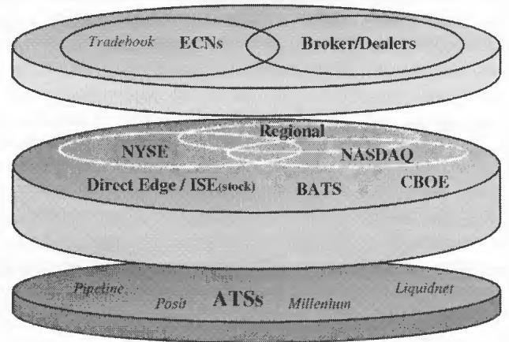  
Figure A-3 An alternate view of the U.S. equity market

The NYSE is by far the world's largest stock exchange. Historically, trading has been based around specialists, 4 who are responsible for maintaining a "fair and orderly" market for each stock. Early on, the NYSE was onc oI the first cxchanges to offer clectronic order routing; namely via the 1976 Dcsignated Order Turnaround (DOT) system. This was followed by SuperDOT in 1984, which went on to handle more than $7 5 \%$ of the order flow, cven though such routing meant the specialist was still required to manually match orders (which could be up to 100,000 in size). Though, the NYSE has been slower than somc cxchanges in the shift to fully electronic trading, in part due to the sucess of its trading floor and specialists. Fully automated execution was first offered in 2000 for small orders (up to 1,099 shares) by NYSE Direct+. The next major step forward was the introduction of thc NYSE Hybrid market in 2005. This offers the automated execution of Dircct+, but for orders of up to a million sharcs; it also removes the timc restrictions and is fully integrated with OpenBook to allow off-market participants a much more detailed vicw of the availablc market depth. By Q2 2007, electronic trading accounted for over $90 \%$ of NYSE trading with ovcr $80 \%$ of the total share volume, as noted on NYSE Exchanges (2007). NYSE Hybrid has significantly reduced average execution times. A review in Trading Talk by Rosenblatt Securities (2007) notes that it also helped to reduce quoted spreads, although volatility was found to increase slightly. Structural changes have also becn made. In 2008, thc NYSE changed the role of specialist to become designated market makers (DMMs). DMMs are able to trade at parity, rather than having to give priority to client orders, cncouraging them to provide additional liquidity, as outlined by Ivy Schmerken (2008). In addition, supplemental liquidity providers (SLP) are also able to make markets in NYSE stocks. Such innovation, both in terms of market structure and technology, is vital for NYSE to maintain its position.

Increascd competition has meant that over time NYSE's market share has noticeably decreased. In 2005, it was over $80 \%$ ; however, since then it has dipped below $50 \%$ ,the estimate for Dccember 2008 is shown in Table A-4. Incorporating the Arca exchange in 2006 helped in consolidating its position. The market structure and trading platform changes also seem to have helped.

NASDAQ was originally created in 1971 as a bulletin board, allowing OTC trading of stocks, but it soon became a multi-dealer quote-driven market. Like the NYSE, the systems behind NASDAQ have been extensively updated over the last few years. Fully clectronic trading was first provided in 1984 by the Small Order Exccution System (SOES). Then in 1988 the relcase of SelectNet allowed dealers to negotiate electronically. These were later merged to form SuperSOES. The next major step was the release of Super Montage in 2002, which displayed markct depth (the three best buy and sell orders), fully supported limit orders and allowed anonymous trading by using the SIZE moniker. Continuing its transformation, clcctronic call auctions were introduced for both the opening and closing in 2004. In terms of market share, NASDAQ has also faced a lot of competition, indeed in 2005 ECNs had a combined market share greater than $60 \%$ leaving NASDAQ with less than a third of the market. Though, NASDAQ has managed to regain its position, notably by buying two of its largcst competitors, namely Brut in 2004 and INET in 2005. These additional order books were fully intcgrated with SuperMontage in Single-Book in 2007. NASDAQ has also managed to capture an incrcasing proportion of rading in NYSE isted stocks, whilst its new listing segmcnt (Global Select Markets) should help bolster its own listings.

BATS Trading started life as an ECN in 2006, although in 2008 it became an exchange in its own right. Initially, NASDAQ market share was targcted with aggressive pricing schemes. For instance, in January 2007 more was awarded in rebates than fees, growing its NASDAQ share to $14 \%$ although this dropped slightly afterwards. BATS has also managed to significantly increase its proportion of NYSE volume. By August 2008, average daily yolumes were around 750 million shares; about half of what traded on NYSE Arca, making it the third most important venue in the U.S. Volume has steadily continucd to increase since then.

Dircct Edge is another venue that started out as an ECN. The International Securities Exchange (ISE) stock exchange is now a wholly owned subsidiary. Direct Edge is continuing plans to become an exchange in its own right. Interestingly, it provides two execution platforms, EDGA and EDGX. EDGA charges the same fee for adding or removing liquidity, it is intended for more pro-active traders. EDGX follows a maker/taker fee schedule, so liquidity providers receive a rebate.

The regional exchanges, namely the American (AMEX), Boston, Chicago (Midwest) and National (Cincinnati) stock exchanges have managed to maintain some presence in both NYSE and NASDAQ stocks, as well as smaller listed companies. Many of them have also embraced the options markets. Howcvcr, market consolidation and compctition has had a massive effect on them. The Pacific cxchange was taken over by Archipelago before being incorporated into the NYSE. Likewise, AMEX has also been bought and is now called NYSE Alternext; its focus is on listing smaller firms and options. The Boston Equities exchange closcd its doors back in 2007; it has since become NASDAQ OMX BX. This has pricing designed to attract liquidity takers, giving NASDAQ a dual structure like Direct Edgc. Clearly, such consolidation makes the outlook for the remaining regional exchanges less certain. Despite their rclatively small market share, they can still be attractive propositions as independent entitics since they ofer the chance to recoup rcvenue from market data and cxchange fees, as noted by Joshua Galper (2006).

As we have already seen, ECNs have had a hugc impact on the cxchanges, particularly NASDAQ. By the millennium there were over a dozen ECNs, all vying for market sharc; although the market was dominated by Island, Instinet and Archipelago. Sincc then, thc competition has inercased, but there has becn a largc amount of consolidation. In fact, of the original four ECNs founded after the 1997 SEC order handling rules, only Bloomberg Tradebook remains. The Area ECN merged with REDIBook in 2002, forming the Archipelago Exchange; it then went on to merge wih the Pacific Exchange before being bought by NYSE in 2006. Similarly, Island merged with Instinet in 2002 to form the INET ECN, which was bought by NASDAQ in 2006, two ycars after its purchase of thc Brut ECN. Meanwhile BATS has now become an exchange and Direct Edge is in the proccss of becoming one. Soon, indepcndent ECNs may be something of a rarity.

In the last few ycars, ATSs (or the so-called "dark pools" or "dark books") have become more promincnt. Their number is growing just as rapidly; currently there are around 40 venues, double that of early 2006. This is understandable when average exccution sizcs of up to 40-50,000 shares may be aecomplished on some of them, in comparison to less than 500 on NYSE or NASDAQ. Rosenblat Securities providc a regular report dctailing the volume traded on "dark pool" venues. Table A-5 shows their adjusted avcrage daily crossing volumes (for April 2009) for some of the kcy venucs, togcther with the corresponding market share. The adjusiments try to takc account of the double counting which can occur when orders are matched across multiplc venues.

<table><tr><td rowspan=1 colspan=1>Venue</td><td rowspan=1 colspan=1>Averagetrade size</td><td rowspan=1 colspan=1>Adj. ADVApril 2009(in millionsof shares)</td><td rowspan=1 colspan=1>Adjmarketshare %</td></tr><tr><td rowspan=1 colspan=1>BIDS</td><td rowspan=1 colspan=1>324</td><td rowspan=1 colspan=1>9.7</td><td rowspan=1 colspan=1>0.09</td></tr><tr><td rowspan=1 colspan=1>BNY ConvergEx Vortex</td><td rowspan=1 colspan=1>437</td><td rowspan=1 colspan=1>6.9</td><td rowspan=1 colspan=1>0.06</td></tr><tr><td rowspan=1 colspan=1>Citi Match</td><td rowspan=1 colspan=1>386</td><td rowspan=1 colspan=1>35.5</td><td rowspan=1 colspan=1>0.32</td></tr><tr><td rowspan=1 colspan=1>Credit Suisse CrossFinder</td><td rowspan=1 colspan=1>319</td><td rowspan=1 colspan=1>133.9</td><td rowspan=1 colspan=1>1.19</td></tr><tr><td rowspan=1 colspan=1>Dircct Edge</td><td rowspan=1 colspan=1>283</td><td rowspan=1 colspan=1>99.4</td><td rowspan=1 colspan=1>0.89</td></tr><tr><td rowspan=1 colspan=1>GETCO Execution Services</td><td rowspan=1 colspan=1>344</td><td rowspan=1 colspan=1>140.5</td><td rowspan=1 colspan=1>1.25</td></tr><tr><td rowspan=1 colspan=1>Goldman Sachs SigmaX</td><td rowspan=1 colspan=1>570</td><td rowspan=1 colspan=1>150</td><td rowspan=1 colspan=1>1.34</td></tr><tr><td rowspan=1 colspan=1>Instinet CBX</td><td rowspan=1 colspan=1>306</td><td rowspan=1 colspan=1>29</td><td rowspan=1 colspan=1>0.26</td></tr><tr><td rowspan=1 colspan=1>ISE Midpoint Match</td><td rowspan=1 colspan=1>231</td><td rowspan=1 colspan=1>9.6</td><td rowspan=1 colspan=1>0.09</td></tr><tr><td rowspan=1 colspan=1>ITG POSIT</td><td rowspan=1 colspan=1>~6,000</td><td rowspan=1 colspan=1>~21.1</td><td rowspan=1 colspan=1>0.19</td></tr><tr><td rowspan=1 colspan=1>Knight Link</td><td rowspan=1 colspan=1>357</td><td rowspan=1 colspan=1>116</td><td rowspan=1 colspan=1>1.03</td></tr><tr><td rowspan=1 colspan=1>LeveL</td><td rowspan=1 colspan=1>341</td><td rowspan=1 colspan=1>57</td><td rowspan=1 colspan=1>0.51</td></tr><tr><td rowspan=1 colspan=1>Liquidnet</td><td rowspan=1 colspan=1>52,428</td><td rowspan=1 colspan=1>~35.7</td><td rowspan=1 colspan=1>0.32</td></tr><tr><td rowspan=1 colspan=1>Millennium</td><td rowspan=1 colspan=1>288</td><td rowspan=1 colspan=1>17.3</td><td rowspan=1 colspan=1>0.15</td></tr><tr><td rowspan=1 colspan=1>Morgan Stanley MS Pool</td><td rowspan=1 colspan=1>277</td><td rowspan=1 colspan=1>46</td><td rowspan=1 colspan=1>0.41</td></tr><tr><td rowspan=1 colspan=1>Pipelinc</td><td rowspan=1 colspan=1>~47,105</td><td rowspan=1 colspan=1>~10.4</td><td rowspan=1 colspan=1>0.09</td></tr><tr><td rowspan=1 colspan=1>UBS PIN Cross</td><td rowspan=1 colspan=1>n/a</td><td rowspan=1 colspan=1>~41.9</td><td rowspan=1 colspan=1>0.37</td></tr></table>

Source: Rosenblait Securilies (2009)

# Table A-5 Non-displayed U.S. liquidity pool volumes

A detailed revicw of many of the main ATS venues is provided in an article from Rosenblatt Securities (2007a). To categorise them we will use ihe same types as in Chapter

2, so the crossings are scheduled or continuous, and are negotiated, advertised, blind or internal.

Scheduled crossings have becn provided since 1987 by ITG's POSIT. Currently, this offers a dozen separate intraday crosses together with two after the close. Effectively, cach cross is an anonymous call auction, priced at the midpoint of the national best bid and offer (NBBO). Instinet offer a similar service, with 7 intraday crosses (IDX) and an after the close (LDX); in addition there are two morning crosses which use a VWAP price (VWAPX).

Continuous crossing systcms havc grabbed a significant proportion of the market share. A notable example is Liquidnet, a buy-side orientcd system launched in 2001 that offers a negoliation-based crossing mechanism. Liquidnet constantly tries to find matches between its clients' buy and sell order requirements, when it finds them notifications are sent to each party. They are then free to enter into anonymous bilateral negotiations for both the size and price. Although the negotiation is anonymous, Liquidnet employs a scorecard (like eBay's ralings) to reflect each uscr's history of successful crossings. This approach has proven extremely popular with the buy-side, in part because of the added sense of security that no sell-side or proprietary traders have access.

Continuous blind crossing systcms have also become increasingly popular. In 2001, the Millcnnium ATS 5 was launched by NYFIX, offering pass through"' orders. ITG released POSIT Now in 2002, providing a continuous version of their popular crossing mechanism. LeveL is another noteworthy venue, which has seen rapid growth since its launch in 2006 by a consortium of Boston Stock Exchange (BSE) investors. For many of these blind crossing networks, "pass through" orders have bccome a notable source of liquidity. As their name suggests, these orders first try to match with the liquidity available within the ATS, before then bcing routed on to their intended destination, whether that is a primary/regional exchange, ECN or possibly even another ATS. Similar approaches are offered by Instinet's Continuous Block Crossing (CBX) and Liquidnet's $\mathrm { H } _ { 2 } \mathrm { O }$ network. Liquidnet $\mathrm { H } _ { 2 } \mathrm { O }$ allows smart order routers to send sell-side flow to Liquidnet to cross with buy side orders. The fact that the interaction is only at the smart order router level, ensuring no human intcrvention, minimises information leakage for the buy side.

Advertised crossing is another important mechanism, for which Pipeline is probably the best-known example. It maintains a block-board of stocks, which are highlighted in orange when liquidity is present. Block price ranges are available as a guideline, although no sizes are displayed. Users may then place firm orders to execute with the availablc liquidity. Pipeline enforces strict minimum share thresholds to prevent predatory trading. The Millennium ATS also provides its clients with an optional Plus order type, which sends liquidity alerts to a group of passive liquidity partners (PLPs) once the order reaches Millennium. These PLPs are other dark pools or internal crossing engines that allow for automated responses without any human intervention. Again, this ensures that the alerts are not visible to traders whilst maximising their chance to be filled. In 2005, ITG released POSIT Alert, 6 based on indications it alerts users when liquidity is available, leaving them to decide whether to execute. Buy-side firms may also choose to only notify other buy-side uscrs.

Constant market evolution means hybrids of the above crossing types are also being devclopcd. For instance, in 2006 a consortium of broker/dcalers announced the Block Interest Discovery Service (BIDS) for both the buy and sell side. This uses firm and conditional orders to support both continuous blind crossing as well as negotiated crossing using scorecards. BNY ConvergEx's VortEx combines "actionable" Indications of Interest (IOIs) from a large network of external liquidity providers with its continuous blind crossing platform to securely provide additional liquidity. Other innovations are Instinet's CBX, which allows users to fully configure what information (price, size) they may wish to share with other participants. The LeveL ATS can even incorporate client preferences for spccilic counterparties in ils matching logic.

Brokers' own crossing networks have rapidly become a major force in terms of "dark pool" liquidity, as shown by their respective market shares in Table A-5. Originally, these were just internal crossing networks that allowed them to save the fces from executing on exchanges or other venucs. Still, over the last few years these have progressively opened up for direct client access, effectively transforming them into ATSs in their own right. The volumes passing through the brokers mcan that these are now major competitors in this space. Prominent amongst these are Credit Suisse's CrossFinder, Goldman Sachs' Sigma X and UBS's Pricc Improvement Network (PIN). In 2008, Goldman Sachs, UBS and Morgan Stanley also made agrecmcnts that will allow their clients acccss to liquidity from each other's networks.

"Dark pools" inked to market making operations have become another important source of liquidity. For cxample, GETCO Exccution Services is an ATS that provides execution via IOC orders, with liquidity sourced from thc GETCO market makers.

Unsurprisingly, exchanges and ECNs have also been keen to cnter this arena, as they attempt to retain and attract liquidity from the ATSs. In 2006, the International Securities Exchange (ISE) created MidPoint Match, a blind crossing venue that supports pass-through flow to its electronic market. It also allows orders to advertise via firm Solicitations of Interest (SOIs). The Direct Edge ECN allows orders to be routed to a range of ATSs including Liquidnet $\mathrm { H } _ { 2 } \mathrm { O }$ . Similarly, in 2007 NASDAQ launched its own crossing network with an aggrcssive pricing scheme, whilst 2008 saw NYSE launch Matchpoint, its own anonymous crossing service. In 2009, the New York Block Exchange (NYBX) was launched; this is a joint venture beiween NYSE Euronext and BIDS Holdings. Unlike many of the other ATSs, NYBX has full access lo the NYSE order book, including its nondisplayed liquidity. Other financial institutions arc also creating thcir own internal crossing systems, such as Fidelity's CrossStrcam.

Despitc all these changes and the acute competilion, it is still widely cexpected that further cycles of fragmentalion and consolidation will occur. As usual, liquidity and order low will be the keys to survival.

# Canadian equity market

The Canadian market is still dominated by the primary exchange, the six main banks, and their brokerage arms. A nice overview of the market is provided by Alison Crosthwait (2009) from ITG Canada Corp. In 2006, new regulations werc passed to cnsure hest cxecution, as well as allowing the establishment of alternative trading systems. Effectivcly kick-starting the same processes we have seen in the U.S. Prior to this, around a third of all trading was still carried out off-exchange in the upstairs market. In fact, Crosthwait (2009) estimales this had fallen to around $1 6 \%$ in 2008.

Historically, much of the competition for trading Canadian slocks has been from the U.S. In fact, around 200 of the 1,500 Canadian companies are cross-listed on U.S. cxchanges. For these, the U.S. accounts for a considerable amount of trading, although thc majority still takes place on the primary exchange. ITG Inc. evcn offers a Best Market Server smart router that adjusts for FX and so can trade such stocks by automatically routing orders between the U.S. and Canada.

Local competition arrived in 2003, in the form of the Canadian National Stock Exchange (CNSX) (formerly the Canadian Trading and Quotation System, Inc.) which offers an altcrnate site for listing emerging companies. This is a fully electronic trading platform, now based on the X-stream trading engine from NASDAQ OMX.

ECN-like venues have also been established, such as Pure Trading. This was launched in early 2008 with maker/taker based pricing. Like the CNSX, it is also based on the X-stream enginc. The Alpha ATS is another new elecironic order book bascd venue; launched in November 2008 by nine major Canadian brokers, based on Cinnober's TRADExpress ATS platform. Alternatively, a fully anonymous order book is provided by the Omega ATS, which was launched in 2007.

The major players from the U.S. have also started tailoring their platforms for Canada. For example, Instinet has launched a Canadian version of Chi-X, based on the same software as used in its European crossing market. Bloomberg Tradebook has also established itself.

Several "dark pool" execution venues have already been established in Canada. Liquidnet offers their continuous negotiation driven crossing platform. Likewise, ITG's Match Now ATS provides a virtually continuous blind auction (every 30s) which also incorporates strcaming liquidity to other venues. Perimeler Financial's BlockBook also offered a dark pool ATS, but it has been reported thal it is shuting down due to lack of business.

# Other American equity markets

The Latin American markets are much smaller than those in the U.S. Although its largest market Brazil is one of the top twenty in the world, in terms of capitalisation and trading volume. For comparison, Table A-6 shows most of the American exchanges.

<table><tr><td rowspan=2 colspan=1>Exchange</td><td rowspan=1 colspan=2>Market cap ($ billions)</td><td rowspan=2 colspan=1>2008ADV($ millions)</td><td rowspan=2 colspan=1>2008 Avg value($ thousands)</td></tr><tr><td rowspan=1 colspan=1>2008</td><td rowspan=1 colspan=1>2007</td></tr><tr><td rowspan=1 colspan=1>NYSE Euronext U.S.</td><td rowspan=1 colspan=1>9,209</td><td rowspan=1 colspan=1>15,651</td><td rowspan=1 colspan=1>132,960</td><td rowspan=1 colspan=1>8.3</td></tr><tr><td rowspan=1 colspan=1>NASDAQ OMX (U.S.)</td><td rowspan=1 colspan=1>2,396</td><td rowspan=1 colspan=1>4,014</td><td rowspan=1 colspan=1>144,057</td><td rowspan=1 colspan=1>9.6</td></tr><tr><td rowspan=1 colspan=1>TSX Group</td><td rowspan=1 colspan=1>1,033</td><td rowspan=1 colspan=1>2,187</td><td rowspan=1 colspan=1>6,837</td><td rowspan=1 colspan=1>9.2</td></tr><tr><td rowspan=1 colspan=1>BM&amp;FBOVESPA</td><td rowspan=1 colspan=1>592</td><td rowspan=1 colspan=1>1,370</td><td rowspan=1 colspan=1>2,908</td><td rowspan=1 colspan=1>14.8</td></tr><tr><td rowspan=1 colspan=1>Mexican SE (BMV)</td><td rowspan=1 colspan=1>234</td><td rowspan=1 colspan=1>398</td><td rowspan=1 colspan=1>438</td><td rowspan=1 colspan=1>24.2</td></tr><tr><td rowspan=1 colspan=1>NYSE Amex</td><td rowspan=1 colspan=1>132</td><td rowspan=1 colspan=1>258</td><td rowspan=1 colspan=1>2,219</td><td rowspan=1 colspan=1>n/a</td></tr><tr><td rowspan=1 colspan=1>Santiago SE</td><td rowspan=1 colspan=1>132</td><td rowspan=1 colspan=1>213</td><td rowspan=1 colspan=1>144</td><td rowspan=1 colspan=1>41.6</td></tr><tr><td rowspan=1 colspan=1>Colombia SE</td><td rowspan=1 colspan=1>88</td><td rowspan=1 colspan=1>102</td><td rowspan=1 colspan=1>82</td><td rowspan=1 colspan=1>34.7</td></tr><tr><td rowspan=1 colspan=1>Buenos Aires SE</td><td rowspan=1 colspan=1>40</td><td rowspan=1 colspan=1>57</td><td rowspan=1 colspan=1>26</td><td rowspan=1 colspan=1>7.0</td></tr><tr><td rowspan=1 colspan=1>Lima SE</td><td rowspan=1 colspan=1>38</td><td rowspan=1 colspan=1>69</td><td rowspan=1 colspan=1>25</td><td rowspan=1 colspan=1>17.7</td></tr></table>

Source: WFE (2009)

# Table A-6 Other American stock markets

The Bolsa de Valores de Sao Paulo (BOVESPA) is both Brazil's and the region's largest stock exchange. It is a completely electronic market; the trading floor was closed in 2005. In 2008, it merged with the Brazilian derivatives exchange (Bolsa de Mercadorias & Futuros). BOVESPA's trading platform MegaBolsa provides a fully transparent order book, based on the Nouveau Système de Cotation (NSC) platform. Market makers provide additional liquidity for stocks. Brokers offer DMA and have also stared providing algorithmic trading.

Mexico's Rolsa Mexicana de Valores (BMV) is the region's second larges1 exchangc. This has becn fully eleetronic sincc 1999, based on its BMV-SENTRA Captiales central limit order book. Brokers also offer DMA and algorithmic trading is becoming available.

However, around as much volume for Brazil and Mexican companics is traded via depositary reccipts as is traded on exchange. These are proxies, allowing stocks to be traded as if they were domestie shares in the U.S. or Europc. For instance, in 2008, $\$ 750$ billion traded on BM&FBOVESPA and $\$ 112$ billion traded on the BMV, based on data from the WFE (2009). In comparison, $\$ 899$ worth of Brazilian and $\$ 191$ billion worth of Mexiean depositary reccipts were traded, according to the Bank of New York Mellon (BNYM) (2008). Therefore, the key competitor for the Latin American stocks is actually the depositary receipt market, which we shall eover in more detail in Appendix F.

# EMEA equity markets

Europe is elearly the largest market in the Europc, Middle East and Africa (EMEA) region. The European equity market is second in size only to the U.S. Indced, four of the lop ten stock cxchanges (by 2008 market cap) are European. The European Union has helped unify the marketplace, particularly with the creation of the single currency in 1999. There has also been some consolidation amongst the exchanges, notably the creation of Euroncxt. Still, Europe consists of thirty states so there is a diverse range of currencics, regulations and trading mcchanisms.

Just as in the U.S., regulation is likely to be a major faetor in shaping the future of the European marketplace. In November 2007, the Markcts in Financial Instruments Directive (MiFID) took effeet. This aims to encourage competition betwecn trading venucs, improve pre and post-irade transpareney and enforce "best cxecution" requirements. Previously, concentration rules in countries such as France, Spain and Italy prevented signilicant offexchange trading. For broker/dcalers the compulsory post-trade reporting mcans their OTC trades must be reported. Firms that provide off exchange trading venues may be classified as Systematic Intcrnalisers (SIs) and so beeome subject to regulations much like the exchanges. For cxample, SIs must publish firm quotes during market hours, report al trades and may not offer price improvemcnt on orders below a speeific market sizc. Alternatively, rather than managing this by themselves there is always the option to join one of the Multilateral Trading Facilities (MTFs), such as Turquoise. In the short to medium term, MiFID has resulted in a spate of new execution venues competing for liquidity from the exchanges, hut also sourcing new liquidity that previously may have been hidden. A report by the Aite Group (2009) consultancy notes that MTFs should reach $20 \%$ market share of European trading in 2009, and could achieve $50 \%$ by 2013. Hencc, Europe is cntering a eyele of fragmentation, which may well be followed by a consolidation phase.

Electronic trading is pretty much universal on thc sell-side, with lcvels of algorithmic trading growing rapidly. Though, buy-side uptake has tended to lag the U.S. A report by the TABB Group (2007b) consultancy notes that in 2007 electronic order routing was used by over $5 0 \%$ of firms, and should grow to $6 5 \%$ by 2009, most of this routing over FIX. In terms of volume, the Celent (2008b) consultancy cstimates that DMA accounts 1or $8 \%$ of the flow, projecting this to grow to $1 5 \%$ by 20l1. The buy-side adoption of algorithms is also growing; the TABB Group (2007b) reported it at $4 1 \%$ , expecting it to rcach $5 8 \%$ by 2009.

Most of the region's venues are based on elcctronic central limit order hooks, often using call auctions for the open and close. Many also incorporate dedicated market makers or liquidity providers. The widespread adoption of electronic order books ean be traced back to the competition that London's International Order Book spawned in 1986. Each country's primary exchange generally still has a monopoly over its listed stocks. Though, since the implementation of MiFID they are now starting to face stiff competition from a wide range of MTFs. Table A-7 shows the breakdown of market capitalisation and trading volumes for the region's main exchanges.

<table><tr><td rowspan=2 colspan=1>Exchange</td><td rowspan=1 colspan=2>Domestic market cap($ billions)</td><td rowspan=2 colspan=1>2008ADV($millions)</td><td rowspan=2 colspan=1>2008Avgvalue($thousands)</td></tr><tr><td rowspan=1 colspan=1>2008</td><td rowspan=1 colspan=1>2007</td></tr><tr><td rowspan=1 colspan=1>NYSE Euronext Europe</td><td rowspan=1 colspan=1>2,102</td><td rowspan=1 colspan=1>4,223</td><td rowspan=1 colspan=1>17,231</td><td rowspan=1 colspan=1>23.0</td></tr><tr><td rowspan=1 colspan=1>London SE</td><td rowspan=1 colspan=1>1,868</td><td rowspan=1 colspan=1>3,852</td><td rowspan=1 colspan=1>24,691</td><td rowspan=1 colspan=1>31.1</td></tr><tr><td rowspan=1 colspan=1>Deutsehe Börse</td><td rowspan=1 colspan=1>1,111</td><td rowspan=1 colspan=1>2,105</td><td rowspan=1 colspan=1>18,420</td><td rowspan=1 colspan=1>33.0</td></tr><tr><td rowspan=1 colspan=1>BME Spanish Exehanges</td><td rowspan=1 colspan=1>948</td><td rowspan=1 colspan=1>1,781</td><td rowspan=1 colspan=1>9,491</td><td rowspan=1 colspan=1>64.5</td></tr><tr><td rowspan=1 colspan=1>S1X Swiss Exchange</td><td rowspan=1 colspan=1>857</td><td rowspan=1 colspan=1>1,271</td><td rowspan=1 colspan=1>5,977</td><td rowspan=1 colspan=1>35.7</td></tr><tr><td rowspan=1 colspan=1>NASDAQ OMX Nordic Exehange</td><td rowspan=1 colspan=1>563</td><td rowspan=1 colspan=1>1,243</td><td rowspan=1 colspan=1>5,268</td><td rowspan=1 colspan=1>24.1</td></tr><tr><td rowspan=1 colspan=1>Borsa Italiana</td><td rowspan=1 colspan=1>522</td><td rowspan=1 colspan=1>1,073</td><td rowspan=1 colspan=1>5,926</td><td rowspan=1 colspan=1>21.6</td></tr><tr><td rowspan=1 colspan=1>Johannesburg SE</td><td rowspan=1 colspan=1>483</td><td rowspan=1 colspan=1>828</td><td rowspan=1 colspan=1>1,574</td><td rowspan=1 colspan=1>22.7</td></tr><tr><td rowspan=1 colspan=1>Oslo Bors</td><td rowspan=1 colspan=1>146</td><td rowspan=1 colspan=1>353</td><td rowspan=1 colspan=1>1,756</td><td rowspan=1 colspan=1>26.1</td></tr></table>

Source: WFE (2009)

# Table A-7 European equity markets

Euronext was created in 2000 by the merger of the Paris, Brussels and Amsterdam stock exchanges. These were joined in 2002 by Portugal; it has also established membership/ access agreements with the Helsinki and Warsaw stock exchanges. Though, clearly the most notable merger was completed in 2007 with the NYSE. Euronext is based on an electronic order book that allows aecess for dedicated liquidity providers. Originally, this was the Nouveau Système de Cotation (NSC); however, early in 2009 equity trading migrated to the new Universal Trading Platform (UTP) which offers cven greater capacity and lower latency.

On the London Stock Exchange (LSE), the eleetronie central limit order book for FTSE 100 companies is provided by its Stock Exchange Electronic Trading Service (SETS), which dates back to 1997. Although in 2007, the platform was upgraded with a new transaction engine (TradElect). Around $8 0 0 \ \mathrm { m i d }$ and small eap stocks are also catered for by SETS with registered market makers providing liquidity to the order book via displayed quotes. (Note these were formerly handled by the SETSmm hybrid market, whose quote functionality was rolled into SETS as part of the preparations for MiFID.) Less liquid main market stocks are currently handled by SETSqx, which combines a quote based market with four intraday erosses to improve overall liquidity and to help member firms to meet MiFID requirements. The Borsa Italiana has also migrated to the LSE's TradElect platform, as has the Johannesburg Stock Exchange. Norway's Oslo Bors is also planning to adopt TradElect; currently their trading is based on the NASDAQ OMX's SAXESS platform.

The Deutsche Börse operates the Frankfurt Stock Exchange. Xetra, its electronic platform, offers a hyhrid marketplace, based on an electronic order book that allows designated market makers to provide additional liquidity. They have introduced discounts to encourage algorithmic trading. It is cstimated that around $40 \%$ of thcir volumc now originates from such systems. Xetra is also used by the Vienna, Irish and Budapest stock exchanges.

The Spanish Bolsas y Mercados Españoles are linked through an electronic system (SIBE), and have scen considerablc volume growth over the last Iew ycars.

The Stockholm, Copenhagcn and Helsinki stock exchanges are part of the NASDAQ OMX Group, as are the Baltic exchanges for Riga, Vilnius and Tallinn. Trading is based on thcir INET platform (previously the SAXESS platform was used).

For smaller companies, there is a range of dedicated exchangcs, most notably London's Altcrnative Investments Market (AIM). This is operated by the LSE, and is now the world's leading market for small-cap stocks. By 2008, AIM had over 1600 quoted companics including 300 intcrnational ones and a combined market cap of over $\$ 120$ billion. It uses SETS for its fifty most traded stocks, whilst the quote driven SEAQ is used for the less traded, although ultimately this will probably migrate to SETSqx. Euronext's Alternext market, Spain's Nuevo Mercado and the NASDAQ OMX First North also offer altcrnative marketplaces, although these are much smaller than AIM. Germany's Neuer Markt has bcen incorporated back into the main market. In the U.K., the PLUS Markets Group has cstablished somc local competition; its cxchange has over 180 listings and a total market cap of ncarly $\$ 4$ billion. It provides trading for around $7 { , } 5 0 0 \ \mathrm { U . K }$ and Europcan small and midcap stocks.

Pan-Europcan execution venues have also been established. In the past, their success has becn somewhat mixed; venues such as Chi-X have flourished whilst others such as EASDAQ and Jiway 8 floundered. In part, this has been due to national concentration regulations that favoured many of thc primary exchanges. In addition, the rapid adoption of electronic order books by the European exchanges meant that ECNs initially had much Iess impact in Europe than the U.S. Though, the introduction of MiFID meant that regulations now actively encourage such competition. Hence, MTFs from Turquoise, NASDAQ OMX Europe and BATS were launched in 2008. NYSE Euronext launched its own MTF in 2009, as did Equiduct and Burgundy, other venucs are also due.

Instinet's Chi-X MTF has proven that liquidity can be shifted away from the major cxchanges. Launched in 2007 it currently offers trading in stocks for most of the major European indices and has managed to attract large scll-side firms to providc liquidity. In terms of market share, it estimated to have captured around $1 7 \%$ of trading for the U.K.'s FTSE 100 stocks, around $1 3 \%$ of France's CAC 40 firms and Amstcrdam's AEX stocks and around $9 \%$ of Germany's DAX 30, bascd on the companics own data in November 2008. For its top stocks, it is capturing anything from $3 0 { - } 5 0 \%$ of the daily volume, reporting average price improvements of 4 bps. This rapid success may be attributed to a mix of its pricing structurc and its specd. Interestingly, it also offers trading to 3 decimal placcs for all stocks, and so allows trading between the spreads quoted on the major cxchanges. This is something that Regulation NMS removed from ECNs in the U.S. (the Sub-Penny rule).

The Turquoise MTF has been driven primarily by a group of broker/dealers and was launched in September 2008. It provides an electronic order book for most of the major Europcan indices, together with support for fully hidden orders. The platform is based on Cinnober's TRADExpress, which also powers the London Metals Exchange. An article in

The Trade News (2008) notes that in early November it had captured around $7 \%$ of trading for stocks in France's CAC and Switzerland's SMI indices, $5 \%$ or more for the Duteh AEX, German DAX and UK's FTSE, as well as a smaller portion of trading in Italy's MIB and Sweden's OMX indices. The London Stock Exchange has announced plans to purchase a majority share in Turquoise, so it wil be interesting to see what effeet this has.

The NASDAQ OMX Europe MTF went live in September 2008. It caters for over 1,200 stoeks, covering the major indices for markets in the U.K., Germany, Franee, Netherlands, Italy, Switzerland, Austria, Belgium, Denmark, Finland, Ireland, Norway, Sweden and Spain. Bascd on NASDAQ OMX's INET platform it also supports pan-European order routing to the region's other main exchanges and MTFs.

BATS also launched its own MTF in October 2008, aiming to recreate the suceess of its U.S. operation for European stocks. Trading eneompasses stocks from all the major European indices.

Meanwhile, March 2009 saw the introduction of NYSE Area Europe. Based on their UTP platform, it supports trading for the blue-chip European stoeks, which are not already handled by its Euronext markets.

Equiduct's MTF also went live in March 2009, supporting trading for the most liquid stocks from the LSE, Euronext and Deutsche Börse. Its HybridBook platform is an eleetronic order book that also supports trading at proprietary benehmarks, namely the Europe-wide Best Bid and Offer (EBBO), which is based on consolidated prices from the major markets. A Volume weighted Best Bid and Offer (VBBO) is offered as well, although there is a premium for these benchmark trades.

The Burgundy MTF launehed in May 2009, backed by major Nordic brokers. This focuses on trading mid-cap and small-cap Nordie stocks and also offers hidden (or "dark") order types. It is based on Cinnober's TRADExpress trading system.

In response to such competition, the European exchanges are already making changes to try to retain their liquidity post MiFID. They are altering their fee structures, adopting a maker/taker approach and offering reduetions for trading in volume. London, Xetra and Euronext have all either released, or are in the process of updating their trading systems to support greater yolumes and lower their latencies to below $1 0 \mathrm { m s }$ , to compete with the likes of Chi-X. NYSE Euronext has also started reducing the tiek sizes of many of its stoeks, introdueing support for pricing to three deeimal places, like Chi-X. The Deutsche Börse has also launched a pan-European trading segment, the Xetra International Market (XIM), to further compete with the MTFs.

In terms of order internalisation, the Deutsche Börse was one of the first exchanges to recognise the importance this, introducing Xetra-BEST in 2002. This allows brokers to internalise their retail orders, gaining MiFID compliance and saving on settlement fees, whilst retail clients benefit from a mandatory price improvement. They have also reduced their fes and eut the mandatory price improvement to $\mathrm { \ E 0 . 0 0 1 }$ to encourage more brokers to adopt BEST. Likewise, in early 2007, Euronext announced that it was developing a new trading mechanism to ensure best execution, allowing members to be MiFID complaint without having to become Systematic Internalisers.

The ramp-up in "dark pools'" of liquidity has also been slower in Europe, although given that signifieant amounts trade off-exchange, particularly in the U.K. and Germany, there is plenty of opportunity. A report by the Celent $( 2 0 0 7 \mathrm { c } )$ consultaney predicts that ATSs will capture around a $5 \%$ market share by 2011. In part, this is beeause the major European exehanges have offered hidden and/or iceberg orders for some time, helping to accommodate bloek trading. The Deutsche Börse supports intraday blind crossings, every 15 minutes (except during auctions on the main market) via their XETRA-XXL platform. The LSE also offers a crossing service via SEAQ Crosses, although it is intended primarily for less liquid stocks. Undoubiedly, the other exchanges will also consider providing crossing systems to try to retain their liquidity.

In terms of continuous "dark pools", Xetra MidPoint offers a closed order book with continuous midpoint trading. Likewise, SWX has launched "Swiss Block" in partnership with NYFIX. In 2009, NYSE Euronext launched SmartPool, as a joint project with several major international banks. SmartPool provides continuous mid-point crossing together with four daily periodic crosses; it also offers routing to the NYSE Euronext central order book. Also in 2009, NASDAQ OMX launched its coninuous dark pool, NEURO Dark. Based on INET it offers mid-point crossing from the primary market and caters for over a thousand European stocks (it supports internalised orders as well). In the same year, Chi-X's ChiDelta and the BATS Europe Dark Pool were launched, providing continuous mid-point crossing. The LSE will also provide a dark pool for the region.

Unsurprisingly, the major U.S. ATSs, namely ITG and Liquidnet, have already established themselves in Europe. For scheduled crossing systems POsIT is arguably the leader, being established here since 1998. It covers over 9,000 stocks across 15 countrics with eight matching sessions each day (biased lowards the open). ITG acquired its main direct European competition (E-Crossnet) in 2005. Other types of crossing are also available in Europe, the negotiated crossing system Liquidnet went live in Europe in 2002, and offers trading in 22 markets, allowing institutional users to trade liquid stocks in much larger average sizes than those available on the exchanges. It is also considering expanding into the Middle East. ITG has introduced a European version of its POSIT Alert platform as well, complementing its continuous blind crossing system, POSIT Now, which was released in 2007. Likewise, Euro Millennium was launched by NYFIX in 2008; this is a European version of its continuous blind crossing platform, although it is now owned by NYSE Euronext.

Many of the major brokers have also established European internal crossing networks, fo1 example, Credit Suisse's CrossFinder.

In order to cope with all these new venues and to try to reduce the impact of fragmentation, pre- and post-trade information need to be aggregated. Presently, this is handled by the main market data providers. Markit's Boat (formerly "Project Boat') also provides a single interface for pan-European trade reporting. The UK's Financial Services Authority has proposed the creation of dedicated Trade Data Monitors to meet this requirement.

Another area that may see further consolidation across Europe is its setlement systems. For instance, Table A-8 shows some of the potential settlement options Ior the company Royal Dutch (Shell).

Table A-8 Potential settlement destinations for a European stock   

<table><tr><td rowspan=1 colspan=1>Execution venue</td><td rowspan=1 colspan=1>Central Securities Depository</td></tr><tr><td rowspan=1 colspan=1>Euronext Amsterdam</td><td rowspan=3 colspan=1>Euroclear Amsterdam</td></tr><tr><td rowspan=1 colspan=1>London Stock Exchange</td></tr><tr><td rowspan=1 colspan=1>Instinet Chi-X</td></tr><tr><td rowspan=1 colspan=1>Virt-x</td><td rowspan=1 colspan=1>Euroclear Bank</td></tr><tr><td rowspan=1 colspan=1>Deutsche Börsc</td><td rowspan=1 colspan=1>Clearstream Banking Frankfurt</td></tr></table>

Source: Instinel (2007)

Lifc would be a lot simpler, and more eficient, if there were a single depository like the U.S. Depository Trust & Clearing Corp. (DTCC). The choice of depository can also affect the lrade cost since each may have different settlement costs. Therefore, liquidity aggregation is only really appropriate for prices from venues that share the same depository, as noted in a white paper on market data consolidation from Instinet (2007). Otherwise, additional costs may be incurred which are not reflected in the price. Cross-border settlement has traditionally been expensive in Europe.

A rcport by thc Deutsche Börse Group (DBG/Clearstream) (2002) noted that wholesale trades could be $3 0 \%$ more expensive, whilst retail ones were up to $1 5 0 \%$ more. Thus, until there is further consolidation amongst Europe's depositories, smart order routing systems and trading algorithms will need to take these additional costs into account. Fortunately, there arc somc signs that this situation should improve. A subsidiary of the U.S. DTCC has launched EuroCCP, which provides a unified clearing and settlement facility that is used by Turquoise.

# Asian equity markets

The Asian cquity marketplace has seen huge incrcases in trading volume in the last few years, as well as significant returns. However, this is much more fragmented than cither Europe or the U.S. There is no common currcncy, or legal framework, so sovereignty is still a major factor for each country's exchanges. Despite these issucs, many exchanges have started to form agrecmcnts and alliances with each other. There has also becn a lot of consolidation within each country, particularly between the stock and dcrivative markets, c.g. Korea and Singapore.

Most of thc rcgion's execution venues support clectronic trading; although, in terms of adoption, Asia is still some way behind both Europe and the U.S., particularly for the buyside. DMA and algorithmic trading have also bcen quile slow to take off. Though, this is changing as buy-side attention starts to focus more on execution costs. A survey by Greenwich Associates (2009) found that in 2008 electronic trading accounted for $1 5 \%$ of equity trading in Asia, up from $11 \%$ in 2007. This breaks down into $9 \%$ for DMA, $5 \%$ via algorithms and $1 \%$ in "dark pools" and crossing networks. They also estimate this figure could rise to $2 8 \%$ in threc years. The Aite Group consultancy estimates that the region's algorithmic trading could increase to around $16 \%$ by 2010 from $4 \%$ , as noted by Cristina McEachern (2007). Levels of adoption are slightly higher in Japan, although uptake has been faster with foreign investors. A survey of Japanese equity trading by Greenwich Associates (2008) found that in 2008 electronic trading accounted for $17 \%$ of institutional volume. DMA increased to $9 \%$ , from $8 \%$ in 2007, whilst algorithmic trading rose from $5 \%$ in 2007 to $7 \%$ in 2008. By 2012, they project electronic trading to reach $3 5 \%$ , with DMA at $16 \%$ and algorithmic trading at $1 5 \%$ of the volume.

Thc Asian marketplace is dominated by cxchanges and broker/dealers. Table A-9 gives a breakdown of the largest exchanges in terms of market cap. The exchanges have been quick to move to clectronic trading, but for many capacity and latency still pose issues. That said, over the last few years, the pacc of upgrading exchanges has increased significantly.

Japan is still thc largest market in Asia. The Tokyo Stock Exchange (TSE) is the second largest in the world (by 2008 domestic market cap). The TSE closed its trading floor and became fully electronic in 1999. Trading is purely order driven with two daily sessions of continuous trading (referrcd to as the Zaraba method) are augmented by call auctions (Itayose) at the open and close of cach. Its trading system is known as "arrowhead", which

<table><tr><td rowspan=2 colspan=1>Exchange</td><td rowspan=1 colspan=2>Domestic market cap($ billions)</td><td rowspan=2 colspan=1>2008 ADV($millions)</td><td rowspan=2 colspan=1>2008Avgvalue($thousands)</td></tr><tr><td rowspan=1 colspan=1>2008</td><td rowspan=1 colspan=1>2007</td></tr><tr><td rowspan=1 colspan=1>Tokyo SE</td><td rowspan=1 colspan=1>3,116</td><td rowspan=1 colspan=1>4,331</td><td rowspan=1 colspan=1>22,887</td><td rowspan=1 colspan=1>na</td></tr><tr><td rowspan=1 colspan=1>Shanghai SE</td><td rowspan=1 colspan=1>1,425</td><td rowspan=1 colspan=1>3,694</td><td rowspan=1 colspan=1>10,656</td><td rowspan=1 colspan=1>2.0</td></tr><tr><td rowspan=1 colspan=1>Hong Kong Exchanges</td><td rowspan=1 colspan=1>1,329</td><td rowspan=1 colspan=1>2,654</td><td rowspan=1 colspan=1>6,652</td><td rowspan=1 colspan=1>14.6</td></tr><tr><td rowspan=1 colspan=1>Australian SE</td><td rowspan=1 colspan=1>684</td><td rowspan=1 colspan=1>1,298</td><td rowspan=1 colspan=1>4,776</td><td rowspan=1 colspan=1>11.4</td></tr><tr><td rowspan=1 colspan=1>Bombay SE</td><td rowspan=1 colspan=1>647</td><td rowspan=1 colspan=1>1,819</td><td rowspan=1 colspan=1>1,226</td><td rowspan=1 colspan=1>0.5</td></tr><tr><td rowspan=1 colspan=1>National Stock Exchange India</td><td rowspan=1 colspan=1>600</td><td rowspan=1 colspan=1>1,660</td><td rowspan=1 colspan=1>2,948</td><td rowspan=1 colspan=1>0.5</td></tr><tr><td rowspan=1 colspan=1>Korea Exchangc</td><td rowspan=1 colspan=1>471</td><td rowspan=1 colspan=1>1,123</td><td rowspan=1 colspan=1>5,776</td><td rowspan=1 colspan=1>2.2</td></tr><tr><td rowspan=1 colspan=1>Taiwan SE Corp.</td><td rowspan=1 colspan=1>357</td><td rowspan=1 colspan=1>664</td><td rowspan=1 colspan=1>3,333</td><td rowspan=1 colspan=1>4.1</td></tr><tr><td rowspan=1 colspan=1>Shenzhen SE</td><td rowspan=1 colspan=1>353</td><td rowspan=1 colspan=1>785</td><td rowspan=1 colspan=1>5,076</td><td rowspan=1 colspan=1>1.9</td></tr><tr><td rowspan=1 colspan=1>Singapore Exchange</td><td rowspan=1 colspan=1>265</td><td rowspan=1 colspan=1>539</td><td rowspan=1 colspan=1>1,031</td><td rowspan=1 colspan=1>n/a</td></tr><tr><td rowspan=1 colspan=1>Bursa Malaysia</td><td rowspan=1 colspan=1>189</td><td rowspan=1 colspan=1>325</td><td rowspan=1 colspan=1>382</td><td rowspan=1 colspan=1>6.9</td></tr></table>

Source: WFE (2009)

# Table A-9 Asian equity markets

went live in 2010 replacing the former CORES platform. This brings a much-anticipated boost in performance and capacity. Japan's second largest exchange, the Osaka Securitics Exchange (OSE), is the leading Japanese derivatives exchange, but it also lists over 1,000 companies, and is used to trade TSE listed stocks as well. The OSE has also announced plans to migrate to a new trading platform, from the NASDAQ OMX Group. Further competition is offered by the JASDAQ, a Japanese version of the NASDAQ, with a market cap now similar to the OSE. For small-cap stocks, the TSE incorporates a dedicated segmcnt called the Mothers market, which lists around 130 stocks, with a market cap of around $\$ 40$ billion.

The Hong Kong exchange (HKEx) provides a gateway for access to mainland China. Trading is provided via an electronic order book, based on its third generation Automatic Order Matching and Execution System (AMS/3). Algorithmic trading is alrcady estahlished, analyst estimates put algorithmic flow at around $3 . 4 \%$ , as reported in Securities Industry News (SIN) (2007). In mainland China, the most important venues are the Shanghai and Shenzhen stock exchanges. Both are again based on limit order books, the Shanghai's trading system is adapted from the Deutsche Börse's Xetra. The Shanghai and Shenzhen exchanges saw massive annual turnover increases in 2007 $( 5 0 0 - 6 0 0 \% )$ , with a corresponding increase in their overall market cap of $3 0 0 { - } 4 0 0 \%$ , based on data Irom the WFE (2007, 2008). If their growth continues, they will soon be serious competitors for domination of the regional marketplace. Smaller companies are catered for by Hong Kong's Growth Enterprisc Market (GEM), which lists around 200 stocks.

The Australian Securities Exchange (ASX) is a product of the 2006 merger between the Australian Stock Exchange and the Sydney Futures Exchange. It operates a fully electronic order book using its Integrated Trading System (ITS), which is based on NASDAQ OMX's CLICK-XT. In 2006, it altered its pricing structure from per-trade to a value based approach, mainly to encourage DMA and algorithmic trading, which now accounts for around a filth of its order flow.

The Korea Exchange (KRX) was formed in 2005, from a merger between the Korean

Stock, Futures and KOSDAQ exchanges. This merger also incorporated the region's first ECN, founded in 2001 by Korea ECN Securities. The KRX provides an order driven trading system, with call auctions for the open and close, via its Automated Trading System (KATS). I also allows market makers to provide liquidity for less traded stocks and newer issues. For smaller companies, the KOSDAQ arm of the KSX caters for around 900 stocks, with a combined market cap of around $\$ 50$ billion, making it globally just behind AIM in terms of size. Algorithmic trading is starting to take hold in Korea: In 2007, its first commercial algorithmic platform was crcated by a joint venture between Koscom (a subsidiary of the KRX) and Progress Apama.

The Bombay Stock Exchange (BSE) is India's largest, by market cap, and has around 4,800 listed companies. Though, it faces stiff competition from the National Stock Exchange (NSE), which was created in 1994 to encourage market reform. Originally, the BSE was based on open outcry, its Bombay On-line Trading (BOLT) system was introduced in 1995 in response to the fully automated NSE. BOLT provides a hybrid electronic market, which incorporates two-way quotes from "jobbers", or market makers. In comparison, the NSE runs an anonymous pure limit order book, based on its National Exchange Automated Trading (NEAT) system. Brokers are also starting to offer DMA for these exchanges, a report from the Celent (2008) consultancy cstimates this could rcach $1 1 \%$ of trading by 2010. The ever-expanding trend of exchange globalisation has also seen NYSE-Euronext purchase $5 \%$ of the NSE whilst the Singapore exchange and the Deutsche Börse have cach taken $5 \%$ of the BSE.

The Taiwan Stock Exchange operates a continuous limit order book together with periodic call actions for the lunch break and close. This is based on its Fully Automated Securities Trading system, which was introduced in 1993.

The Singapore Exchange (SGX) was formed in 1999 by the merger of the Stock Exchange of Singapore and the derivative Singapore International Monetary Exchange; both are based on central limit order books. SGX stock trading is carried out on its Quest-ST platform, which is based on the NASDAQ OMX's CLICK-XT exchange software. It is also planning to reduce the average hid offer spread to improve its competitiveness. Between 10 and $1 5 \%$ of trading is currently estimated to be traded algorithmically, as noted in an article on TradingMarkets (2007). For smaller companies, listing and trading is handled by the SESDAQ.

The Bursa Malaysia has updated its trading platform, migrating to Bursa Trade, which is based on the NSC platform from Euronext and the Atos Origin Consultancy. This provides much lower latencics (down from 5s for the old platform to milliseconds) and enables DMA. It has been handling Malaysian derivatives trading since 2006.

Alternative trading venues have yet to capture a sizeable proportion of the Asian marketplace. A report by Greenwich Associates (2007a) notes that crossing networks are expected to capture about $1 \%$ of the total market share, although this could reach up to $3 \%$ in Japan. In part, this is duc to the prevalence of electronic central limit order books amongst the exchanges, as in Europe. Local regulations can also pose problems, as noted by Maria Trombly (2007). For instance, China has severe restrictions for foreign investors whilst India does not allow off -exchange crossing. Other market peculiarities can also pose problems, such as Taiwan's requirement that trades be pre-funded with cash. Nonc of these are insurmountable, indeed alternative venues have already started to appear in Asia.

ECNs have spread to Japan, aided by their 1998 legislation for Proprietary Trading Systems (PTS). This allows the creation of private markets intended to augment the existing exchanges. Instinet's CBX ASIA was launched in 2001, providing a central limit order book for Japanese and Hong Kong equities. Likewise, in 2003 Japan Sccuritics Agents was granted status as a PTS, providing dealers an off-exchange mechanism. SBI Holdings launched its JapanNext in 2007, catering for after-hours stock trading. Australia should sce its first ECN in the form of AXE in 2009/10. Intcrcstingly, this venturc is partially owncd by the New Zealand stock exchangc. Instinct has also announced plans to cstablish Chi-X in the Asia Pacific region.

Crossing networks and "dark pool" ATSs arc also sprcading across the region. 2001 saw the cstablishment of Instinet's JapanCrossing. This PTS offcrs a prc-market VWAP cross as well as a morning close and an afternoon close. Though initially slow to takc off, by Q1 2006 it had captured around $4 \%$ of the TSE's daily turnover, this growth has continued. CLSA has launched its BlocSec ATS, providing crossings for Singaporc, Hong Kong, Japan, and Australia. Liquidnet brought its continuous negotiated crossing mcchanism to Japan, Hong Kong, Singapore and South Korea in 2007 and to Australia in 2008. ITG also has a presence in Asia; POSIT Match offers intraday crossings for Japan, Australia and Hong Kong. ITG Australia has also launched its continuous crossing system, POSIT Now, together with its POSIT Alert continuous indications system. Instinct has also released its continuous blind crossing system CBX in Japan. Other broker's liquidity pools havc started appearing as well, for example, Credit Suisse's CrossFinder is live in Japan, Australia, Hong Kong, Singapore and South Korca. Instinet has also established an agreemcnt with Credit Suissc to allow mutual access to cach other's liquidity pools. Combined this forms onc of the largcst "dark pools" of liquidity currently available in Asia.

# Summary

Electronic trading is now ubiquitous for thc world's stock markcts. Buy-side Icvels of adoption of DMA and algorithmic trading arc high, particularly in the U.S. It will still take some time before the levels of adoption for algorithmic trading in Europe and Asia reach those of the U.S., but the pace of change is increasing.

Appendix B

# Fixed income markets

The fixed income marketplace accounts for a third of the global financial market, in terms of valuc, as we saw back in Chapter 3. Fixed income trading has developed around the OTC mechanism, mainly because the assets are much less standardised than stocks. However, strong inter-dcaler markets have become cstablished for some fixed income securitics, which are sufficiently uniform, such as government bonds. These sccuritics have tended to be the oncs that have most successfully migrated to electronic trading, although the overall level of adoption still lags many of the other asset classes.

# Asset specific

A fixed-incomc asset represents a debt for a specilic amount (the principal), whereby the issucr is obliged to repay the holder at some future date (the maturity date). Debt can be issued by governments, other agencics and by companies. A variety of names are used for thesc, for cxample, the U.S. Treasury terms them based on their maturity, namely bills $( < 1$ year), noles (2-10 years) and bonds $( > 1 0$ ycars). For simplicity, in this book all such debt will gencrally be referred to as bonds. Debt may also be issued based on pools of loans, which is the csscncc of asset-backed securitics. Similarly, mortgage-backed securitics are the equivalcnt for rcal estate debt.

The return for an investment in bonds is usually more predictable than for stocks, and is bounded by their principal value. Investors are typically looking for safer returns than the potential growth offered by equitics. Therefore, some of the largest investors are pension funds and insurance companies. Since these firms often adopt buy-and-hold strategies, the liquidity of bonds traded in the secondary markets can be much less than for stocks.

The issuer of a bond will usually pay interest (the coupon) to the holder at a given frequcncy for the lifetime of the loan, e.g. every 6 months. Alternatively, zero coupon bonds make no such payments; instcad, their price is discounted by an cquivalent amount. Either way, at maturity the bond should redcem its principal amount, or face value. Hence, the main risk with bonds is that the issuer defaults on the debt. This risk is generally reflected by the bond's interest rate, so riskier debt pays higher coupons to compensate investors. The bond's pricc will also reflect this, so higher risk bonds usually trade at a much decper discount than others.

The cffective interest rate that a bond issuer must pay depends on the maturity date of the contract, as well as their credit rating and the current market rates. Bonds will sometimes have additional collateralization or credit protection to reduce the credit risk, allowing issuers to use slightly lower rates. For secured bonds, specific assets (collateral) have been pledged which may be sold to ensure the debt holders are paid in case of bankruptcy. Debts may also be differentiated in terms of their seniority when it comes to bankruptcy hearings, with senior debt taking priority over subordinated debt. All these specifics should be detailed in the bond's indenture, which formally specifies the rights of bondholders. It also contains details of any covenants that may relate to the finances of the issuer, e.g. pledging to maintain specific capital requirements, or cven restricting the levels of dividends. Often such covenants are intended to protect the income strcam for bondholders, so again they can affect the coupon rate.

Bonds may also have a range of conditions associated with their maturity date. Extendable bonds allow the issuer to extend the maturity date, for instance, when the market rates become unfavourable. Callable bonds allow the issuer to redeem the bond before it matures. Thus, to compensate the bondholders for such provisions the issuer must pay a premium. On the other hand, some bonds incorporate an option that allows the bondholder to forcc redemption on specific dates, for which they must in turn pay a premium.

# Pricing and trading

In general, bonds are more straightforward to price than equities. Essentially, the fair price of a bond is the prcsent value of all its future interest and principal payments. The present value incorporates a discount for the market rate of return, which in turn depends on the bond's characteristics. So for a government bond issued in the local currency with negligible default risk the market rate should approximatc to the risk-frcc rate. For higher risk issuers, the rate will need to be higher. Macroeconomic factors, such as inflation expectations, will also have a considerable impact on the price of bonds.

The main risk with bonds is that the issuer defaults on the debt. This is reflected in both their interest rate and price, so riskier bonds usually trade at a deeper discount than others.

Bonds are priced in terms of a percentage of their par value, where 100 represents $100 \%$ of the lace value. They can also trade at a premium where the price will be above 100, for instance, when the bond's coupon is more attractive than the prevaiing market rates. Bonds are still quoted in fractions for many markets, so 95:05, 95-05 or 95'05 are not the samc as 95.05. Some bonds quote in cighths, whilst U.S. treasuries are quoted in $1 / 3 2 ^ { \mathrm { n d } } \mathrm { s } ,$ s0 95-05 is actually 95 $5 / 3 2 = 9 5 . 1 5 6 2 5$ , whilst $9 5 – 0 5 +$ adds another 1/64 so it is 95.171875. Hopefully, decimalisation will continue to spread.

Another factor that can affect bond prices is related to the interest that has been accrued since the last coupon payment, which must also be transferred when the bond is traded. Some markets include this interest in the bond's current price, also referred to as a "dirty price", whilst others exclude it – instead adopting a "clean price".

A bond's yield to maturity (YTM) represents the annualised rate of return it would give if held to maturity. This is inversely related to the bond price, so the higher the price the lower the YTM and vice versa. So, when market interest rates rise, bond prices should fall. In fact, bonds are often referred to by their yield, rather than their price.

Unlike stocks, a single issuer can have a huge range of bonds, cach differing in terms of when they were issued and their maturity, their interest rate and payment structure, any collateralization/credit-protection as well as the specifics of the indenture. Indeed, the number of different bonds is phenomenal. For example, in the U.S alone there are more than three million bonds, that is two hundred times more than the number of equities available globally. This diversity can pose serious liquidity problems, since for many assets it will be difficult to find sufficient depth in a given bond for a continuous market. Only the markets for reasonably standardised debt, such as U.S. Treasuries, tend to have sufficient volume to be viable for continuous trading. One factor that helps is the fact that many bond investors tradc based on specifications, such as credit rating and maturity, rather than sceking a specific bond. This provides more liquidity to a market that would otherwise be much sparser.

Liquidity for bonds can often differ significantly over their lifetime. For instance, most of the activity is focussed on the current issue of a bond (when it is "on the run'). As soon as thc next issue is released, the trading volume of the previous (now "off the run") asset plummcts. In fact, a study by Michael Barclay, Terrencc Hendershott, and Kenneth Kotz (2006) found that "off the run' U.S. treasuries fall to around $10 \%$ of their former volumc. The prevalencc of "buy and hold" strategies, particularly for corporatc bonds, mcans that shortly after issuance, many bonds are simply not available for trading.

Bonds tend to trade in much larger size than stocks, but often with much lower frequcncics. For example, a report by the U.K. Financial Services Authority (FSA) (2005) notes that the average trade size for gilts was £5 million compared with only £43,000 for U.K. equitics, in 2004. Whilst even the most heavily traded issue in the gilt market only saw around 200 trades in a day, whereas for stocks this figure is at least an order of magnitude more.

Corporate debt is even less heavily traded. A study of U.S. corporate bonds by Amy Edwards, Lawrcnce Harris and Michael Piwowar (2007) found that, on average, bonds traded less than 1.9 times a day, with more than $60 \%$ of the trades worth less than $\$ 100,000$ . Similarly, a Europcan study by Bruno Biais et al. (2006) found an average of 3.07 trades per day for euro denominated corporatc bonds and only 2.23 for U.K. sterling ones, with a maximum number of trades no more than 50 a day. Bonds with lower associated credit ratings tend to tradc less regularly, although the trends for maturity date were less conclusive with Biais et al. (2006) noting that short and long-term debt seemed to be the most heavily tradcd.

# World fixed income markets

Globally there is over $\$ 85$ trillion of outstanding fixed income debt. This is bascd on data for thc total outstanding domcstic and international debt in H1 2008, from the Bank for Intcrnational Settlcments (BIS) (2008). Government debt accounts for around $\$ 30.7$ trillion $( 3 6 \% )$ of this. A further $\$ 45.5$ trillion is owed by financial agencies $( 5 3 \% )$ whilst the remaining $\$ 9$ trillion is from corporate debt. Much of this debt is actually concentrated in a handful of countrics, as Figure B-1 shows. Overall, the Americas account for $42 \%$ , followed by $40 \%$ for the EMEA region and $1 8 \%$ for Asia.

Bond markets differ based on the type of debt. Government bond markets tend to issue more standardised contracts, whercas corporate debt is often more customised. Hence, the government debt markets tend to be larger and more liquid. The governments also have much morc control over how these markets are structured and run.

The secondary markets for most of the world's bonds arc dealer-based and much of the trading is still donc over-the-counter (OTC). The markets are segmented between interdcaler and dealer-to-clicnt trading. The lack of centralised markets, or exchanges, means that for clients most trading is principal.

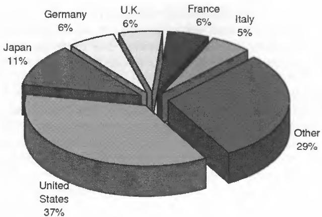  
Source: Aulhors own calculalions based on data from BIS (2008)   
Figure B-1 Global market share of fixed income market

# American fixed income markets

The U.S. dominates the world's fixed income marketplace, as is clear from Figure B-1.   
Though, Canada and Latin America also have significant debt markets.

# U.S. fixed income market

The U.S. fixed income market is huge; it caters for a debt of around $\$ 25$ trillion, together with a daily trading volume of more than a trillion dollars. Over half of this daily volume consists of government debt trading. Though, as Table B-1 shows, much of the U.S. outstanding dcbt is actually issucd by other agencies, municipalities and corporations.

<table><tr><td rowspan=1 colspan=1>Type</td><td rowspan=1 colspan=1>Outstanding debtH1 2008 ($ billions)</td><td rowspan=1 colspan=1>Daily tradingvolume H1 2008($ billions)</td><td rowspan=1 colspan=1>% ofdailyvolume</td></tr><tr><td rowspan=1 colspan=1>U.S. Treasury securities</td><td rowspan=1 colspan=1>4,700</td><td rowspan=1 colspan=1>615.1</td><td rowspan=1 colspan=1>54</td></tr><tr><td rowspan=1 colspan=1>Federal agencies</td><td rowspan=1 colspan=1>3,100</td><td rowspan=1 colspan=1>116.5</td><td rowspan=1 colspan=1>10</td></tr><tr><td rowspan=1 colspan=1>Municipal securities</td><td rowspan=1 colspan=1>2,700</td><td rowspan=1 colspan=1>23.1</td><td rowspan=1 colspan=1>2</td></tr><tr><td rowspan=1 colspan=1>Mortgagc-backed securities</td><td rowspan=1 colspan=1>7,600</td><td rowspan=1 colspan=1>365.1</td><td rowspan=1 colspan=1>32</td></tr><tr><td rowspan=1 colspan=1>Corporate securities</td><td rowspan=1 colspan=1>6,200</td><td rowspan=1 colspan=1>18.8</td><td rowspan=1 colspan=1>2</td></tr></table>

Source: SIFMA (2008, 2008a) 9

# Table B-1 U.S. fixed income market 10

U.S. treasuries are the most liquid fixed income assets, accounting for ncarly two thirds of the daily volume, which is not that surprising givcn the demand for treasury debt and the amount available. This liquidity is, in part, due to the essentially risk-free nature of the issuer. It is also helped by the rclative standardisation, in terms of the characteristics of each bond issue. The benchmark asset for U.S. Trcasury debt is the 1O-year note. In fact, thcse are often used as an indicator for long-term interest rates. Although in 2006 the Treasury also rcintroduccd quarterly issues of its 30-year bond. About $70 \%$ of the trading volume is solely attributable to the currently on-the-run assets. So most trading activity is concentrated on this small subsct, as Frank Fabozzi and Michael Fleming (2004) notc, despite the wide range of bonds that are available.

In comparison, agcncy and municipal debt is much less heavily traded. To compensate for the slightly grcater credit risk they offer tax benefits, so they are generally held by single invcstors, insurance companies or trusts (hence their low daily turnover).

Likewisc, the turnover for U.S. corporate debt is negligible, considering the size of the outstanding dcbt. As we can see in Table B-1 it accounts for around $2 \%$ of the average daily volumc. In fact, the corporate dcbt market turns over only about once a year. 11 In comparison, treasuries turn over thirty times a year, as Harrell Smith (2005) points out. This lack of liquidity is partly due to the fact that much corporate dcbt is held to maturity.

Although there have been no massive structural changes in the U.S. fixed income marketplacc, at the height of the dot.com bubblc there were over a hundred vendors offering electronic trading platforms. Intensc competition and rationalisation has whittled this down to a more rcalisic marketplace. A report by the Celent (2008a) consultancy cstimates that clectronic trading accounts for $57 \%$ of the U.S. fixed income market's averagc daily volume. They predict that this should rcach $62 \%$ by 2010. The highly liquid U.S. Treasuries lead the way with nearly $80 \%$ of the volume traded electronically. They found much lowcr levels for thc other classes. For instance, only $32 \%$ of mortgage-based security trading was electronic.

The intcr-dealer broker market for U.S. Treasuries is dominated by a few brokers. These have cffcctivcly taken the place of bond exchanges, as Larry Tabb (2004) notes. Electronic trading accounts most of the trading in on-the-run treasuries; even the off-the-run market has around $5 0 \%$ clectronic trading. The market share is split between ICAP's BrokerTec $( 5 8 \% )$ and BGC's eSpeed $(4 1 \% )$ platforms, given cstimates from ICAP (2007). Both systems allow anonymous order matching, so the market placc for 2, 5 or 10-year treasury notes is much like the equity markcts. BrokerTec also supports "workups", allowing dcalers to negotiate the tradc quantity. In terms of volume, ICAP (2009) reportcd average daily trading figures of $\$ 141$ billion for U.S. Treasuries in 2008 (note this also includes T-bills). ICAP also has a major presencc in the clcctronic inter-dealer market for mortgage-backed securities. BrokerTec supports agency and corporate deht trading as well. For municipals, the MuniCenter provides a similar inter-dcaler platform, which also competes for agency and corporate debt.

In the dcaler-to-client marketplace there is a lot less liquidity. Tradewcb is the market leader in offcring electronic access, via a request-for-quote mechanism, with average daily volumes of around $\$ 300$ billion in 2008, bascd on figures from the company. It caters for trading governmcnt, agency, mortgagc-backed and corporate debt, as well as money market, credit and derivatives. Bloomberg's BondTrader provides a similar service. In terms of corporatc debt, MarketAxess leads the market for electronic trading, with its multi-dealer RFQ based platform. Further competition in the dealer-to-client market should have arrived in the form of LiquidityHub, which was to provide clients with a request-for-stream based trading mechanism for govcrnment bonds, aggregating the liquidity from a consortium of over a dozen banks. Unlortunatcly, the 2007-09 financial crisis helped put an end to this venture.

The U.S. is seeing a gradual shift in market structure. Investment firms/hedge funds have started to become an important part of the inter-dealer market. A paper by the European

Primary Dealers Association (EPDA) (2007) notes that these were reported to account for five of the top ten participants on BrokerTec and three of the top ten on eSpeed. A thriving arbitrage business has developed between the two systems and the futures market, as reported in an article by Daniel Safarik (2005). In this article, the CEO of electronic brokerage at ICAP, David Rutter, explains that much of this is due to a small number of quantitative trading firms laying off risk against bond-based futures contracts lrom the CBOT. Interestingly, he also highlighted that algorithmic trading was their fastest growing customer segment, with more than half of the bids and offers from computerised systems. The advent of such trading has also helped to reduce price discrepancies and become an important source of liquidity.

Exchange based trading was rekindled in 2007 with NYSE re-launching its bonds trading platform. This is based on the electronic order book from its Arca platform; trading is anonymous and both limit and reserve/iceberg style orders are supported. In addition to the main trading segment, there is also an early trading session from 4am, and a late session lasting until 8pm. It currently caters for over 3,000 bonds, although ultimately this figure should double. It will be interesting to see how much market share this captures, and how it affects the overall market in the long term.

"Dark pools" have not quite spread to the U.S. fixed income market. That said, State Street Global Markets FICross is a pretty close approximation. A nice summary of FICross is provided by Cristina McEachern (2008). Effectively, it offers a bulletin board where users can post anonymous orders or indications of interest. Matching is still done manually with State Strect acting as the intermediary, although they are also planning to offer an automated process. At present, the coverage is for cash bonds with most of the activity in corporate and asset-backed instruments.

Post-trade transparency has also been improved for the corporate debt market by the Trade Reporting and Compliance Engine (TRACE) initiative, first approved by the SEC in 2001. This mandated reporting of trade prices for all dealers and brokers, and does seem to have helped reduce overall costs. A study by Michael Goldstein, Edith Hotchkiss and Eric Sirri (2007) found that the increased transparency had a neutral or positive effect on market liquidity, based on measurements of trading volume and effective spreads. Though, some market participants still fcel that overall liquidity has declined since the introduction of TRACE.

# Other American fixed income markets

Canada is the second largest debt market in the Americas, although as Table B-2 shows it is closely followed by Brazil.

Table B-2 Outstanding debt for other American debt markets   

<table><tr><td rowspan=2 colspan=1>Country</td><td rowspan=1 colspan=3>Outstanding domestic debtHI2008  in $billions</td><td rowspan=1 colspan=3>Outstanding international debtH12008  in $billions</td></tr><tr><td rowspan=1 colspan=1>Total</td><td rowspan=1 colspan=1>Govern.</td><td rowspan=1 colspan=1>Corporate</td><td rowspan=1 colspan=1>Total</td><td rowspan=1 colspan=1>Govern.</td><td rowspan=1 colspan=1>Corporate</td></tr><tr><td rowspan=1 colspan=1>Canada</td><td rowspan=1 colspan=1>1126.0</td><td rowspan=1 colspan=1>727.8</td><td rowspan=1 colspan=1>135.5</td><td rowspan=1 colspan=1>506.9</td><td rowspan=1 colspan=1>92.3</td><td rowspan=1 colspan=1>128</td></tr><tr><td rowspan=1 colspan=1>Brazil</td><td rowspan=1 colspan=1>1162.6</td><td rowspan=1 colspan=1>789.4</td><td rowspan=1 colspan=1>8.7</td><td rowspan=1 colspan=1>126.2</td><td rowspan=1 colspan=1>54.0</td><td rowspan=1 colspan=1>13.5</td></tr><tr><td rowspan=1 colspan=1>Mexico</td><td rowspan=1 colspan=1>428.3</td><td rowspan=1 colspan=1>214.4</td><td rowspan=1 colspan=1>32.3</td><td rowspan=1 colspan=1>95.1</td><td rowspan=1 colspan=1>41.8</td><td rowspan=1 colspan=1>20.3</td></tr><tr><td rowspan=1 colspan=1>Argentina</td><td rowspan=1 colspan=1>77.6</td><td rowspan=1 colspan=1>65.8</td><td rowspan=1 colspan=1>7.5</td><td rowspan=1 colspan=1>63.5</td><td rowspan=1 colspan=1>56.7</td><td rowspan=1 colspan=1>3.6</td></tr></table>

Souree: BIS (2008)

The Canadian debt market has started to atract more interest, particularly from U.S. investors. Though, trading levels are still relatively low compared to the U.S. Overall, the Investmcnt Industry Association of Canada (IIAC) (2008) reported that $\$ 7$ trillion was traded in 2007. The turnover ratio for government debt is around 6.8, versus over 30 for the U.S. The Canadian corporate debt market is also tiny compared to the U.S., with only around $\$ 250$ billion in outstanding debt. In terms of clectronic trading, a consolidated view of the market is provided by CanPX, which has merged quotes from inter-dealer brokers since 1999. In the dcaler-to-client space, CanDeal and Bloomberg's Bondtrader were launched in 2002; both provide RFQ trading for institutional clients. There is also an alternative execution venue run by Collective Bid (CBID) Markets Inc. CBID offers an anonymous electronic order book for both dealers and clients, although it also provides an RFQ mechanism for less liquid bonds.

Brazil has a substantial debt market, most of which is for government debt, since its corporate market is relatively undeveloped. However, the trading volumes are relatively low; in 2005, the annual turnover for government bonds was $\$ 433$ billion, based on a BIS (2006) report. In fact, based on the turnover ratio it appears to be even less liquid than the U.S. corporate debt market. It will be interesting to see how much impact the setup of MTS Brazil has, which is due to crcate a dedicated electronic platform for Brazilian sovereign debt.

Mexico is the next largest source of debt in Latin America, although it is around half the size of the Brazilian market. Government securities are quite heavily tradcd, the BIS (2006) report found that annual turnover was more than five times the outstanding notional valuc in 2005.

# EMEA fixed income markets

The introduction of the Euro currency in 1999 helped crcate the second largest debt market in the world. The main Euro-zone countries are Austria, Belgium, Finland, France, Gcrmany, Grcecc, Ireland, Italy, Netherlands, Portugal and Spain. Their combined outstanding domestic debt is worth over $\$ 14$ trillion, based on figures from BIS (2008). Another $\$ 1.4$ trillion comcs from the U.K., together with $\$ 1.4$ trillion for Denmark, Norway, Sweden and Switzerland combined.

Despite this sizeable debt, the trading volumes are much lower than the U.S. The average daily volume for the Euro-zone secondary government debt market is around $\$ 90$ billion (€65 billion), according to BearingPoint (2007), as compared to around $\$ 500$ billion for U.S. treasury. In parl, this is due to the fact that the Euro-zone represents a diverse range of issuers, so the market is much more fragmented. Most of the trading, around $70 \%$ is concentrated on German, French and Italian government dcbt. The largest of these is the German bond market with around €20 billion traded daily.

The inter-dcaler market accounts for around half of the Euro-zone government bond trading volumc. Of this, BearingPoint (2007) estimate that around $50 \%$ is handled by electronic platforms whilst the remainder is voice brokered. An earlicr study by Peter Dunne, Michacl Moorc and Richard Portes (2006) puts this at closer to two thirds for electronic trading. The electronic trading marketplace is dominated by the MTS platform, which has around an $80 \%$ market share. The remainder is split mainly between Greece's HDAT $( 1 5 \% )$ , Eurex Bonds $( 4 \% )$ and Spain's SENAF $( 1 \% )$ , based on the BearingPoint (2007) survey.

Originally, the MTS (Mercato Telematico dei Titoli di Stato) was created in 1988 to improve the secondary market for Italian government bonds. Since the late ${ \bf \hat { \rho } } _ { 9 0 \bf { s } }$ it has expanded across the Euro-zone with separate national markets. EuroMTS was launched in

1999 to cater for benchmark government bonds and other high quality debt from Euro-zone countries. MTS aggregates market maker's firm two-way prices and provides anonymous trading. By 2004, it had reached an average daily volume of around €25 billion, according to a report from the Bond Market Association (TBMA) (2005).

In terms of the other platforms, Greece's HDAT quote-driven trading system is based on the same technology as List Group's FastTrack-ATS. SENAF and Eurex Bonds both provide anonymous electronic order books. All of these systems predominantly cater for local debt, although Eurex Bonds has started to move beyond Germany to cover Euro-zone benchmark government and corporate debt as well. The UK Gilt market adopts a hybrid trading environment that incorporates anonymous quote-driven trading, although it is somewhat less liquid than the Euro-zone. Unlike in the U.S., ICAP's BrokerTec and BGC's eSpeed have found it harder to gain a sizeable market share in Europe. As Avinash Persaud (2006) explains, primary dealerships have often been awarded based on trading on local platforms, usually MTS, so there has heen less incentive for dealers to use alternatives such as BrokerTec or eSpeed. That said, things have started to improve, for example, Austrian, Belgian and Dutch state treasury agencies have now formally recognised BGC's European Government Platform.

For the dealer-to-client marketplace, BearingPoint (2007) estimate that around $40 \%$ is handled clectronically. They also report that Tradeweb is the market leader with $52 \%$ market share, followed by MTS's BondVision $( 2 5 \% )$ and Bloomberg's BondTrader $( 2 1 \% )$ multidealer system. Other systems, such as Reuters RTFI trading system only account for around $2 \%$ . These proportions have not changed signilicantly since the 2004 report from TBMA (2005) when Tradeweb had an average daily volume of €8 billion, compared to €3 billion for both BondVision and BondTrader. MarketAxess also offers its multi-dealer platlorm for European corporate debt. Again, all of these systems are gencrally based on request-forquote trading mechanisms.

Europe is also starting to see some changes in the overall market structure. The MTS Group is considering providing access for hedge funds. Eurex Bonds has also been looking to incorporate a wider range of investment firms and hedge funds.

# Asian fixed income markets

The financial crisis that spread throughout Asia in 1997-98 highlighted the need for a welldeveloped domestic bond market. Before this, banks and corporations had relied on forcign currency based funding, taking advantage of low overseas interest rates. When market perceptions changed in I997, this loan market dried up and so intensified the crisis, as Atsushi Takeuchi (2005) points out. Some ten years later, the Asian bond market has now grown to nearly the same size as Europe, in terms of outstanding domestic debt. Japan still accounts for the majority $( 6 6 \% )$ of this, followed by China $( 1 4 \% )$ South Korea $( 7 \% )$ and Australia $( 5 \% )$ , based on data from BIS (2008).

Japan has the largest outstanding government deht in the world, at around $\$ 7.8$ trillion, hased on H1 2008 data from BIS (2008). In comparison, its corporate debt is unusually low, at less than $\$ 0.7$ trillion, or around $7 \%$ of the government debt. Average daily volumes are lower than in the U.S. Figures from Asian Bonds Online (2007) put the ADV for Japanese government bonds at around $\$ 150$ billion, whilst corporate debt trades less than $\$ 2$ billion.

Despite its size, the market for Japanese government debt, or JGBs, has been slow to embrace electronic trading. The inter-dealer market for JGBs is led by Japan Bond Trading; the brokerages ICAP Totan Securities and BGC Securities also have a considerahle presence.

Some trading is also carried out on the Tokyo, Osaka, and Nagoya stock exchanges. Electronic trading is steadily increasing, based on Celent's (2006a) figures it should increase to nearly $60 \%$ by 2009 from around $3 5 \%$ in 2005. Japan Bond Trading has around a $60 \%$ market share, based on data from an article in the International Herald Tribune (THT) (2006). It provides both a FIX interface as well as BB Super Trade, an order-driven platform initially created for trading short-term government bills (TB and FB), outlined in more detail by the Bank of Japan (BOJ) (2001) Market Review. It has also formed an alliance with Instinet. Electronic trading is also catered for by ICAP's ETC and BGC's eSpeed platforms. Though, MTS-Japan closed in 2003 after struggling to cope with an initially dormant market, which then became extremely volatile. Unlike in Europe the market makers did not have thc benefit of being primary dealers, as noted by Tomohiko Taniguchi (2003), so thc cost of providing liquidity in such a market was simply too high. For the dealer-to-client (D2C) market, trading is still generally handled by phone. The small electronic market, barely $2 \%$ in 2005, consists of multi-dealer platforms, such as Yensai.com, JBond and Bloomberg's Tradebook, and single broker systems. The Celent (2006a) consultancy estimates that electronic D2C trading may increase to nearly $13 \%$ hy 2009.

China has the next largest government dcbt to Japan, with $\$ 0.9$ trillion outstanding, based on data from the Asia development bank's Asia Bond Monitor (ABM) (2007). Government debt markets in Hong Kong and China have an average daily volume of over $\$ 4$ billion each. Corporate debt in China accounts for nearly $\$ 0.5$ trillion. This is a significant increase due to growing numbers of Chincse corporations being allowed to directly issue their own bonds. Average daily volumes for corporate debt are around $\$ 1.3$ billion. Secondary trading for all types of bonds takes place mainly on the quote-driven inter-bank bond market and the order books of the Shanghai and Shenzhen stock exchanges. The MTS group have also signed a letter of intent with the China Foreign Exchange Trade System to cooperate with the development of an MTS-like market for government debt.

South Korea has less than $\$ 0.5$ trillion each of outstanding government and corporate debt. The government debt market is more liquid with daily market volume of nearly $\$ 5$ billion versus only $\$ 1$ billion for corporate debt. Around $9 5 \%$ of the total bond trading in on the OTC market, again based on figures from Asian Bonds Online (2007a). The remainder is traded on the Korcan Exchange's dedicated bond platform, which will also form the basis for Malaysia's new platform.

# Summary

Electronic trading is becoming more widespread for fixed income assets, particularly for the more liquid government bonds in the U.S. and Europe.   
The most scope for algorithmic trading is currently in the inter-dealer markets, which are often based on hybrid electronic order books. Though, it is also possible using the RFQ and RFS platforms commonly provided in the dealer-to-client markets.   
lt will take some time before the adoption of electronic and algorithmic trading reaches that of equities, but the size of this market means it is a significant opportunity.

Appendix C

# Foreign exchange markets

The foreign exchange (FX) market enables the transfer of money across different currencies. This ranges from spot transactions, which lock-in exchange rate for cash settlement, to forwards, and swaps that arrange transfers for months or even years in the future. This is a huge market, accounting for daily trading volumes of over $\$ 3$ trillion. Historically, the FX markets have dcveloped around inter-dcaler networks (but not exchanges). Electronic trading has becn common for some time in the FX marketplace; direct access trading via DMA and algorithms is also becoming more widespread.

# Asset specific

Foreign cxchange represents the trading of cuencics, essentially by the transfer of ownership of deposits. Therefore, a U.S. dollar / Japanese yen trade consists of one counterparty selling U.S. dollars to another in cxchange for a specific amount of yen. For this deal, the exchange rate might be 118.50, which means a single dollar buys 118.5 yen. 12 Generally, exchange rates are expressed in terms of dollars, it is said to be the base currency whilst the other currency is referred to as the quoting or counter currency. Note that British pounds and Australian dollars are an exception to this rule, these also act as basc currencies and so the exchange rate is expressed in terms of them.

What we first think of as foreign exchange is spot trading. This corresponds to a cash trade at the current exchange rate, which will usually be settled within two days. FX forwards, or outrights, offcr a mcans of locking-in an exchangc rate that will then be used for an exchange at a specified datc in the future. Rather than being straight cash transactions, forwards are based on binding contracts. The forward rate will try to rellect the expected future cxchangc ratc, and so it incorporates the volatility of the two currencics. The availability of forwards allows both counterparties to hedge against shifts in the cxchange rate; conversely, speculators will try to predict and benelit from them. An FX option is similar, although it gives the purchaser the right to buy or sell, rather than an obligation.

Forcign exchangc swaps consist of two legs, a standard spot FX transaction linked with a simultaneous FX forward trade. Initially, the two currencies are exchanged, and when the outright matures, they are swapped back again, at the pre-agreed rate. A currency swap is slightly different since it represents an exchange of intercst payments for underlying fixed income assets in two distinct currencies. At maturity, it may also involve exchanging the notional amount of the underlying fixed income assets. This provides a means for foreign companies to borrow at the more favourable interest rates that are available to domestic companies. Both of these swaps are often used for much longer-term exchanges than FX forwards (years rather than months).

# Pricing and trading

FX trading is largely concentrated on a small subset of currencics. In fact, around two thirds of all trading involves just four major currencies. The 2007 triennial survey by the Bank for International Settlements (BIS) (2007h) reports that $8 6 . 3 \%$ of all transactions involve the U.S. dollar, $3 7 . 0 \%$ the Europcan euro, $1 6 . 5 \%$ the Japanese yen and $1 5 . 0 \%$ the British pound sterling (Bearing in mind that each trade involves two currcncies, so the total sums to $200 \%$ ). In terms of actual currency pairs, they reported that, for the overall turnover in April 2007, $2 7 \%$ was for the U.S. dollar / Euro, followed by $1 3 \%$ for U.S. dollar / Japanese yen and $12 \%$ for the U.S. dollar / British pound (known as cable). Emerging market currencies accounted for around $20 \%$ of trading.

Pricing foreign cxchange rates can be quite difficult, since they are affected by a wide range of cconomic factors. Traditional exchange rate determination models based solely on macroeconomic faclors have failed to explain and forecast fluctuations in exchange rates. This has been clearly noted in studies by Yin-Wong Cheung, Menzie Chinn, and Antonio Garcia-Pascual, (2005) and Richard Meese and Kenneth Rogoff (1983). An alternativc method of pricing is to adopt a market microstructure-based approach. This has heen pioncered by Martin Evans and Richard Lyons (2002), and Lyons (2001). In these models, macroeconomic information affects exchange rates directly, but also indirectly via order flow, or net buying pressure. Subsequent studies have shown that order flow can both explain and forecast changes in exchange rates. For more information, see the work by Dagfinn Rime, Lucio Sarno and Elvira Sojli (2008) and Evans and Lyons (2005).

Both exchange rates and order flows react to macroeconomic factors such as changes in economic growth, inflation, interest rates or budget/trade balances. Any such information, which might reflect future order flows, can have an important, and often immediate, effect on exchange rates. This can make the trading volumes quite volatile. Indeed, the spot market can vary by up to $30 \%$ day to day, as noted by Naureen Malik from the Wall Street Journal (WSJ) (2004). Whilst the actual news is publicly broadcast, global order flow is still relatively opaque. Clearly, the major banks have an advantage here since the more clients they have then the more order flow information they possess.

Another factor, which can have a considerable effect on foreign exchange, is the possibility of central bank interventions. Although these may be able to smooth short-term fluctuations, it is just no longer feasible to prop up a currency for any length of time. For instance, the infamous Black Wednesday $1 6 ^ { \circ }$ September 1992) when the U.K. finally announced it was withdrawing from the European exchange rate mechanism. This netted over a billion dollars profit for speculators, who had shorted up to $\$ 10$ billion in pounds sterling in the previous two weeks, anticipating of the pound's fall from grace. Central bank intervention is also an interesting signal for investors, since it can indicate future changes in monetary policy.

# Global FX markets

Thc FX market is enormous; the BIS (2007b) triennial survey reported a total average daily turnover of $\$ 3.2$ trillion in 2007 for both spot and “traditional” FX derivative trading (forwards and FX swaps). This figure increases to around $\$ 3.5$ trillion when currency swaps and FX options are included in the total. To put this in perspective, that is well over ten times the daily volume of all the world's stock exchanges. The rapid growth of the FX market is such that the 2007 turnover is nearly double the recorded volume for 2004, and nearly three times the figure for 2001. Estimates for 2009/10 predict this to grow to between $\$ 4-5$ trillion. Table C-1 shows a breakdown of this volume by instrument type.

<table><tr><td rowspan=1 colspan=1></td><td rowspan=1 colspan=2>Globalaverage daily volume($ billions)</td></tr><tr><td rowspan=1 colspan=1>Foreign Exchange</td><td rowspan=1 colspan=1>Apr2007</td><td rowspan=1 colspan=1>Apr2004</td></tr><tr><td rowspan=1 colspan=1>Spot</td><td rowspan=1 colspan=1>1,005</td><td rowspan=1 colspan=1>631</td></tr><tr><td rowspan=1 colspan=1>Outright forwards</td><td rowspan=1 colspan=1>362</td><td rowspan=1 colspan=1>209</td></tr><tr><td rowspan=1 colspan=1>Foreign exchange swaps</td><td rowspan=1 colspan=1>1,714</td><td rowspan=1 colspan=1>954</td></tr><tr><td rowspan=1 colspan=1>Currency swaps</td><td rowspan=1 colspan=1>32</td><td rowspan=1 colspan=1>21</td></tr><tr><td rowspan=1 colspan=1>FX options</td><td rowspan=1 colspan=1>212</td><td rowspan=1 colspan=1>117</td></tr><tr><td rowspan=1 colspan=1>Othcr</td><td rowspan=1 colspan=1>129</td><td rowspan=1 colspan=1>108</td></tr><tr><td rowspan=1 colspan=1>NYSE stocks</td><td rowspan=1 colspan=1>80</td><td rowspan=1 colspan=1>45</td></tr></table>

Source: BIS (2007b), FX JSC (2007, 2008) and NYSE (2009)

<table><tr><td rowspan=1 colspan=3>U.K.average daily volume($ billions)</td></tr><tr><td rowspan=1 colspan=1>Oct2008</td><td rowspan=1 colspan=1>Apr2007</td><td rowspan=1 colspan=1>Apr2004</td></tr><tr><td rowspan=1 colspan=1>605</td><td rowspan=1 colspan=1>335</td><td rowspan=1 colspan=1>222</td></tr><tr><td rowspan=1 colspan=1>210</td><td rowspan=1 colspan=1>124</td><td rowspan=1 colspan=1>103</td></tr><tr><td rowspan=1 colspan=1>719</td><td rowspan=1 colspan=1>899</td><td rowspan=1 colspan=1>428</td></tr><tr><td rowspan=1 colspan=1>18</td><td rowspan=1 colspan=1>18</td><td rowspan=1 colspan=1>16</td></tr><tr><td rowspan=1 colspan=1>108</td><td rowspan=1 colspan=1>106</td><td rowspan=1 colspan=1>64</td></tr><tr><td rowspan=1 colspan=1>0</td><td rowspan=1 colspan=1>0</td><td rowspan=1 colspan=1>0</td></tr></table>

# Table C-1 Average daily FX trading volumes

The spot market alone now trades over a trillion dollars every day. FX swaps have higher daily volumes than even OTC interest rate derivatives, making them the world's most heavily traded asset. That said, the 2007-09 financial crisis has certainly had an elfect on FX, volumes decreased in the latter part of 2008, but they have started to recover.

In terms of location, London is still the biggest centre of FX trading $( 3 4 . 1 \% )$ followed by the U.S. $( 1 6 . 6 \% )$ , Switzerland $( 6 . 1 \% )$ ,Japan $( 6 . 0 \% )$ and Singapore $( 5 . 8 \% )$ . London and Switzerland have seen the most gains in market share since 2004, based on figures from BIS (2007b).

The proportion of electronic trading within the FX marketplace is increasing rapidly. In fact, a report from the Aite Group (2007) consultancy notes that it increased from only $2 2 \%$ in 2001 to over $5 6 \%$ by the end of 2006. They predict that this could reach up to $7 5 \%$ hy 2010. Likewise, the TABB Group (2007e) consultancy estimates electronic trading reached around $6 2 \%$ by the end of 2006, and should reach $80 \%$ by 2010. The adoption of electronic trading is highest in the inter-dealer market. Globally, the Aite Group (2007) found electronic trading levels of around $66 \%$ for the inter-dealer market. Data from the U.K. foreign exchange Joint Standing Committee (FX JSC) (2008) shows that $61 \%$ of inter-dealer volume was clectronic in October 2008. In comparison, the proportion is still lower in the dealer-to-client marketplace. However, buy-side adoption of electronic trading is still increasing. For instance, the annual buy-side FX survey by Greenwich Associates (2007a) found that over $5 3 \%$ reported using e-trading systems for FX. The Aite Group (2007) found $45 \%$ electronic trading in the dealer-to-client marketplace. The FX JSC (2008) data shows that $20 \%$ ol client volume was traded on single broker systems and another $7 \%$ on multibroker platforms. 13

Algorithmic trading is also starting to take hold in FX. Estimates for the total proportion of algorithmic trading are around $7 \%$ with this predicted to rise to up to $1 5 \%$ by 2010, from an Aite Group (2008a) report. The Celent (2007b) consultancy estimates that on some venues algorithmic trading may already account for over $20 \%$ of the volume.

The FX marketplace is still segmented with strong inter-dealer networks and separate dealer-to-client markets. Though, inter-dealer trading is declining in importance as the proportion of client-driven trading increases, particularly from hedge funds. The BIS (2007b) survey shows $4 3 \%$ of FX trading was due to inter-dealer activity, down from $59 \%$ in 2001. In comparison, trading between dealers and financial institutions increased to $40 \%$ , whilst retail FX trading reached $1 7 \%$

Over the last few years, the FX marketplace has seen many new entrants. Table C-2 shows estimates of market share for the key participants in both the inter-dealer and dealer-to-client markets, based on data from the TABB Group (2007) consultancy:

<table><tr><td rowspan=1 colspan=1>2007 market share estimates</td><td rowspan=1 colspan=1>Inter-dealer(Sell-side) %</td><td rowspan=1 colspan=1>Dealer-to-client(Buy-side) %</td></tr><tr><td rowspan=1 colspan=1>Bank plalforms</td><td rowspan=1 colspan=1>23</td><td rowspan=1 colspan=1>46</td></tr><tr><td rowspan=1 colspan=1>EBS/Reuters/Bloomberg</td><td rowspan=1 colspan=1>27</td><td rowspan=1 colspan=1>15</td></tr><tr><td rowspan=1 colspan=1>FXAl/State Street/Currenex/Hotspot</td><td rowspan=1 colspan=1>27</td><td rowspan=1 colspan=1>31</td></tr><tr><td rowspan=1 colspan=1>Lava</td><td rowspan=1 colspan=1>14</td><td rowspan=1 colspan=1>8</td></tr><tr><td rowspan=1 colspan=1>CME</td><td rowspan=1 colspan=1>9</td><td rowspan=1 colspan=1>0</td></tr></table>

Source: TABB Group (2007)

# Table C-2 FX global market share

The inter-dealer market has been dominated by Reuters and EBS (the Electronic Brokers Service) for some time. Whilst this has provided competition, a segregation of the traded currency pairs has occurred. EBS leads for the Euro-Dollar, Dollar-Yen and a range of other Euro based crosses whilst Reuters leads for Sterling-Dollar and for the Euro-Sterling.

Reuters pionecred electronic trading for FX by introducing their monitor dealing service in 1981, based on a "conversational" approach. Effectively, this negotiation is much like the request-for-quote (RFQ) model. Then in 1992, they incorporated a matching service Tor FX spot orders into the Dealing 2000 platform, and so providing a hybrid order book based execution model. Subsequently, this has been extended to support both forwards and options. They have also introduced an interface designed to cater for algorithmic trading.

EBS was launched in 1993 by a consortium of banks, primarily to compete in the spot marketplace, although it has since been acquired by the inter-dealer broker ICAP. It also provides a hybrid order book marketplace that includes quotes from multiple dealers. EBS is now a major venue for spot FX, trading reached an average of $\$ 217$ billion a day in 2008, based on figures from ICAP (2009). Their Spot-API provides an interface specifically catering for algorithmic trading.

In the dealer-to-client space, the large multi-national banks still prevail. Though, competition has meant that the dealer market has continued to consolidate. In fact, the 2008 Euromoney FX poll shows that the five most active banks accounted for just over $60 \%$ of the trading, as detailed in Euromoney (2008). These were Deutsche Bank $( 2 1 . 7 \% )$ ,UBS $( 1 5 . 8 \% )$ , Barclays Capital $( 9 . 1 2 \% )$ , Citi $( 7 . 4 9 \% )$ and RBS $( 7 . 3 \% )$ . The banks offer clients a mix of phone-based trading, dedicated platforms or trading via white label offerings (as serviccs that may then be repackaged by other companies). To compete, Reuters have introduced their Trading for FX platform, and EBS is now availablc via Bloomberg terminals.

The major banks also participate in the multi-hroker dealcr-lo-client platforms such as FXAll and State Street's FX Connect and Currenex. Generally, these systems all either provide an RFQ market or stream prices direct to clients (RFS). Currenex adopts a hybrid mechanism that also supports limit orders, although there is no visible order book. In terms of trading volume, FX All achieved average daily volumes of more than $\$ 60$ billion in 2008, based on the companies own figures. Estimates from the Celent (2007b) consultancy give FX Connect and Currenex average daily trading volumes in the $\$ 40 – 50$ billion range.

Many of the dealer-to-client platforms do not support anonymous trading, since the client identity is important for credit checking. However, anonymous trading is beeoming available to clients, based on prime brokerage style arrangements to address the issue of credit risk. For example, FXAll have extended their streaming prices to support anonymity via their QuickFill mechanism. EBS has also crcated EBS Prime, which cnables financial institutions to trade on their platform. In fact, in 2006 it accounted for over $14 \%$ of the avcrage daily volume, according to the Celent (2007b) report.

ECNs have also become established for the FX marketplacc, the first was Hotspot FXi. Based around visible, but anonymous, central limit order books these systems arc targeting hedge funds, a rapidly growing portion of the marketplace. Hotspot was joined by Lava Trading's LavaFX in 2006, whilst Bloomherg offers Tradcbook FX. Similarly, FXAlI released its own ECN called Accelor in 2007. FXAll has also signed an agrecment to purchase LavaFX, so the FX market is also starting to see some consolidation.

The natural progression of such order book bascd venucs might be to crcate a dedicated exchange. Indeed, a joint venture between Reuters and the Chicago Mercantile Exchange resulted in the creation of FXMarketSpace in 2007. This was the first dedicated FX cxchange, catering for both inter-dealer and institutional trading. It was based on a fully clectronic order book providing straight-through proccssing, centralised clearing and settlement (much like the central counterparties for some stock exchanges) and credit checking. Initially, it focussed on spot FX in the six major currencies and six cross-currency pairs, with plans to extend the product to swaps and forward outrights. Unfortunately, the venture failed to meet its targets and so closed down in October 2008.

"Dark pool" ATS and crossing networks have also become available for FX. Instinet's FX Cross, a joint venturc with Citigroup, was established in 2002, providing three anonymous crossing scssions a day in 17 currencies. Flextrade's MilanFX, announced in 2007, is the first continuous block trading venue for FX, providing fully hidden crossing for large orders.

# Summary

Electronic trading is now commonplace for foreign exchange.   
Levels of adoption of algorithmic trading are increasing.   
The increasing competition and the huge size of this market means it is a significant opportunity.

# Appendix D

# Money markets

The money markets are key to the provision of short-term financing for banks, institutions and corporations. Oftcn this is for short pcriods of timc, from overnight to around a month, although it can be for as much as a year.

In the following sub-sections, we will review the markets for unsecured short-term debt, repurchasc agreements and stock lending. In Appendix E, wc shall also touch on some of the key money market derivatives, such as ovcrnight interest ratc swaps. Note that a more detailed ovcrvicw of the U.S. money markets is provided in Chapter 4 of the New York Fed's (1998) book 'U.S. Monetary Policy and Financial Markets'.

# Short-term debt

Short-tcrm dcbts encompass a variety of assets, from traditional fixed income contracts to tradable loans/deposits and commercial paper. There is a considerable market for such debt, although it is often handled as part of thc fixed income or FX markets.

# Asset specific

Generally, thc lifetime for short-term debt is less than a ycar, and is often anything from overnight to a month. Hencc, the risk of default is lower than their longer-term counterparts.

Government bonds provide a comparatively risk-free investment, particularly over the short-term. Usually, short-term issues are traded at a discount, rather than paying coupons. Thc bcst-known example is U.S. Treasury bills. Their European counterparts are Gcrmany's Bubills, France's BTF bills, Italy's BOT bills and the Dutch DTC bills. Short-term governmcnt agency and municipal debt is also available, such as federal agency discount notes. Other than their shorter lifespan, none of these instrumcnts is that diferent from the fixed incomc assets that wc saw in Appendix B.

Inter-bank lending is an important source of short-tcrm liquidity for banks, particularly overnight, for banks. Both U.S. federal funds and Eurodollars are sources of immediately available funds for banks, and through them large financial institutions. U.S. federal funds refer to depository accounts held with the Federal Reservc. Banks that have excess liquidity can loan it out to those that may need additional overnight cover. The rate at which these dcals occur is bascd on the federal funds rate. Eurodollar deposits represent dollar accounts held in banks outsidc of the U.S. The London Interbank Offer Rates (LIBOR) are the rates at which highly rated banks may borrow Eurodollar deposits, from overnight to three or six months.

Deposits usually pay slightly higher interest than govcrnment bills, since there is more credit risk. Their rate is also obviously linked to the set term period. A time (or tcrm) dcposit reprcsents moncy that may not be withdrawn from an account for a set amount of time. Negotiable deposits may be traded in the sccondary markets, whilst non-negotiable ones are held to maturity. Large time deposits are classified in the U.S. as those with a value greater than $\$ 100,000$ . A certificate of deposit (CD) is just a type of time deposit, where all the details used to be printed on a certificate.

A banker's acceptance is a money draft to pay a set amount on a certain date. Once accepted by a bank they become liable for the amount, in turn they may then choose to trade it on the secondary markets.

Commercial paper (CP) provides an alternative to bank loans for corporations. Effectively, these are unsecured promissory notes, often issued at a discount. Due to the credit risk, these obviously pay higher rates than government bills. Still, these are often lower than the corporation could achievc funding via a bank; hence their appeal to both irms and investors. In the U.S., commercial paper generally has a maturity date of less than 270 days since this is the limit before registration with the SEC is required.

Unlike the previous instruments, asset-backed commercial paper (ABCP) represents a secured loan. Generally, these are issued against a special purpose vehicle (SPV) company, which was setup specifically to provide these secured loans.

# Global short-term debt markets

The world's money markets are sizeable. For the U.S. alone, they account for around $\$ 5.5$ trillion of outstanding notional value, as shown in Table D-1.

<table><tr><td rowspan=1 colspan=1>Type</td><td rowspan=1 colspan=1>Outstanding amountQ3 2008 in $billions</td></tr><tr><td rowspan=1 colspan=1>Treasury bills</td><td rowspan=1 colspan=1>1,484.3</td></tr><tr><td rowspan=1 colspan=1>Commercial paper</td><td rowspan=1 colspan=1>1,555.3</td></tr><tr><td rowspan=1 colspan=1>Large time deposits</td><td rowspan=1 colspan=1>2,413.3</td></tr><tr><td rowspan=1 colspan=1>Bankers acceptances</td><td rowspan=1 colspan=1>0.0</td></tr></table>

Souree: SIFMA (2008b, 2008e) 14

# Table D-1 U.S. money market

Short-term government debt is an important and highly liquid segment of the money market. In the U.S., Treasury Bills are issued weekly for pcriods of 4, 13 and 26 wccks. Although off-the-run bills suffer a significant fall in trading volume, the weckly issuance cnsures this is still a highly liquid market. For 2008, the U.S. primary dealcrs association reported average daily trading volumes of around $\$ 77$ billion, according to the New York Fed (2009). The U.S. elcctronic inter-dcaler market mainly consists of ICAP's BrokerTec and BGC's eSpeed platforms. In Europe, Germany's Bubills are important benchmarks for short-term government debt. There arc inter-dealer markets for these on hoth MTS and Eurex Bonds. Other important Europcan government bills are Francc's BTFs and Italy's BOTs, which are also tradable on Euro MTS. ICAP caters for trading of these key European benchmark bills as well.

Overnight unsecured lending for banks in the U.S. is provided by the Fed funds market.

ICAP's i-Feds platform provides a multi-dealer venue where live prices are posted for the ovcrnight Fed funds market. They cstimate that over $40 \%$ of the total market is represented by the providers using i-Feds, with over a thousand registered lenders and over 130 active sellers. In Europe, c-MID has offered clectronic trading for inter-bank deposits since 1990, starting with the Lira then moving on to cater for the Euro, U.K. sterling and U.S. dollar. In 2007, e-MID saw average daily volumes of over €30 billion, but the 2007-09 financial crisis led to a considerable declinc in turnover for deposits, so by Q2 2008 this had fallen to around €15 billion, based on data from the ECB (2009) review. Across Europe, the ECB estimate that $1 7 \%$ of such unsecured trading is electronic.

Corporate short-term debt, in the form of commercial paper, was also significantly affected by fallout from the financial crisis. This hit the U.S. asset backed commercial paper (ABCP) segment particularly hard. In fact, from its high of nearly $\$ 1.2$ trillion outstanding in 2007, U.S. ABCP has since fallen to $\$ 758$ billion in H1 2008, based on figures from SIFMA (2008a). Unsccured commercial papcr accounts for ncarly another trillion dollars, with $\$ 817$ billion from financial institutions and $\$ 165$ billion from non-financial firms. The European market for ABCP has secn a similar decline to around €70 billion outstanding (from €175 billion) based on data from the ECB (2009) revicw. In terms of electronic trading, there is some but commercial paper is still predominantly traded OTC via the phone.

The dealer-to-client marketplace for moncy market assets is catered for by a range of offcrings, including those from the major fixed income and forcign exchange markets as well as dedicated platforms.

For instance, Tradeweb not only caters for short-term government debt, but also provides trading for U.S. agency notcs, CDs and both U.S. and European commercial paper. Bloomberg offcrs similar trading via its BondTrader and Money Markets platforms. These both offer firm dealer quotes as well as a request-for-quote (RFQ) mechanism. In Canada, CanDeal provides a multi-dealer to clicnt RFQ platform for trading Canadian Treasury bills and moncy market assets. Whilst in Europe, MTS's BondVision provides trading for shortterm government debt.

Many of the foreign cxchange platforms have also expanded to incorporate money market trading. FXAll providcs trading of cash loans and deposits via its multi-dealer quote-driven mcchanism, which also allows electronic negotiation. Similarly, Currenex have extended their multi-dealer platform to enable trading of loans and deposits. Whilst the 360t platform not only caters for deposits but also allows trading of commercial paper and forward ratc agrcements (FRAs), which are cffectively money market derivatives.

There are dedicatcd offerings as well, such as the SunGard Transaction Network (STN) Money Markets servicc. This helps connect institutional investors and corporate treasurers, allowing them to trade CDs and commercial paper directly with the issuers. Brokers have also cxtended thcir single dealer-to-client platforms to cater for the money markets. Noteworthy examples are Deutsche Bank's Autobahn and Barclays' BARX platforms, which support both request-for-streaming (RFS) prices and RFQ trading.

# Repos

Repos reflect both the money markets and the bond markets. Their short terms place them in the category of moncy market asscts, but since the underlying collateral is often a bond they are also affected by the same factors which influence bonds.

# Asset specific

A repo is the common name for a sale and repurchase agrcement, essentially this is a secured loan. The scller provides securities in return for cash, but they also commit to repurchase them back at a specified date for a set price together with an interest payment. The interest paid is based on a pre-negotiated repo rate, which will often be offsct from a benchmark, such as the Fed funds rate. A reverse-repo transaction is simply the opposite of a repo. A sell/buy back is similar to a repo, although the sale and repurchase are simultancous. This is because the repurchase is achieved with a forward transaction. The repo rate is implied in this forward price. A more detailed introduction to repos is provided by Moorad Choudhry (2006).

Specific repos are for a certain security. In the U.S., these are often termed special collateral repos or "specials". In comparison, general collateral (GC) repos allow the security to be fungible so any acceptable security that meets the set requirements may be used. The difference between the general collateral repo rate and the specials rate reflects the demand to borrow the specific security. Although repos have traditionally been used for bonds, the market for equity repos is steadily growing.

During the term of the repo, the legal title to the securities is transferred. Though, the repo seller remains exposed to the risk ol owning them, since they have commited to repurchasing them at a set price. Therefore, if the market value of the collateral securities drops they will sulfer a loss. In comparison, the repo buyer remains unaffected.

Repos have become extremely important for central banks as a mcans of implementing their monetary policies. They trade repos with the primary dealers to inject reserve balances into the banking system, whilst reverse-repos allow them to reduce the available balances. Thus, they enable them to control the overall liquidity. They also allow both dealers and investment firms to finance their positions at lower interest costs.

The standardisation of repos, using the International Capital Market Association's (ICMA) Global Master Repurchase Agrcement, makes them well suitcd for electronic trading. Triparty repos are also becoming increasingly popular. These involve a third party clearing bank with which both parties must have cash and collateral accounts. Essentially, this acts like a central counterparty (CCP) allowing for anonymous trading, as opposcd to the more bilateral delivery versus payment settlement.

# Global repo markets

The global repo market accounts for a daily notional outstanding value over $\$ 16$ trillion, most of which is split between the U.S. and Europe. Over $\$ 6.5$ trillion of this involves U.S. government financing with the primary dealers, based on Q3 2008 figures from the Federal Rescrve (2009). Thc European repo market accounts for around another $\$ 8.1$ trillion, or €6.4 trillion, based on a market review by Celent (2007). The European market has more than trebled in size since 2001, although in the last few years its size has stabilised. In Asia, repo levels are lower; for instance, Japan's market is worth around $\$ 1$ trillion, according to a report from the Nomura Research Institute (NRI) (2007).

Adoption of electronic trading is growing. In Europe, the ECB (2009) survey found that $48 \%$ of trading was carried out electronically. A similar value was reported in the Celent (2007) analysis. The Bearing Point (2007a) consultancy predicts that by 2012 over $7 5 \%$ of trades should be electronic, accounting for a third of the total volume. Automation is also starting to be applied to OTC repo trading via trade matching and confirmation systems, such as ETCMS and Trax II.

The wholesale inter-dealer repo market in the U.S. focuses on overnight repos. ICAP supports trading over their electronic BrokerTec platform, as well as via voice. They allow trading for any institutions that are netting members of the Fixed Income Clearing Corporation (FICC). BrokerTee automates the process for general collateral deals, allowing traders to casily change the assigned security. In 2008, they achieved average daily volumes of around $\$ 195$ billion, based on data from ICAP (2009). Tullett Prebon's TradeBlade, also offers anonymous matching for bids and offers from any netting member of FICC. BGC's eSpeed platform is available for repos as well, for the $1 8 \ 1 \mathrm { J } . 5$ primary dealers who trade with the Federal Reserve BNY. Longer-term repos tend to be handled more by voice brokers.

The European inter-dealer market is also led by ICAP followed by Eurex Repo and MTS. ICAP Europe trades repos for European government securities, UK Gilts, Euro Supra National Agencies and Sovereigns, as well as covered bonds, corporate bonds and U.S. treasuries. In terms of volume, ICAP (2009) reported average daily figures of $\$ 259$ billion for European repos in 2008. Eurex Repos caters for repos on European and German government securities as well as other bonds. It has also introduced GC Pooling, allowing a much wider range of European Central Bank (ECB)-eligible collateral. MTS's Money Market Facility is a dedicated MTS segment for repos and buy/sell backs, which was established in 1997. MTS focuses on repos for European government securities, Italian bonds and German covered bonds. There is also an important local market for repos on Spanish bonds traded via SENAF. Note that a further complication for European repo trading is the multitude of clearing and setlement venues, whereas the U.S. has a central clearing counterparty.

In Japan, repo trading has been mainly voice based. Though, Japan Bond Trading Co. has announced that it will introduce an electronic marketplace for repos.

In the dealer-to-client markets, voice trading is still the norm, although there are some clectronic alternatives. Tradeweb provides an electronie trading platform for triparty repo with average daily volumes in excess of $\$ 125$ billion, based on their own figures (Tradeweb (2008)). Bloomberg has a repo offering as well; there are also single broker solutions, such as Morgan Stanley's RepoLink. The European dealer-to-client market is much smaller.

# Securities lending

Securities (or stock) lending is like a repo without the loan; the securities are simply lent for a fee. Over the last few years, the securities lending business has seen a considerable level of growth as hedge funds have increasingly needed to borrow securities to support their short positions. However, the 2007-09 financial crisis had a considerable effeet, particularly with governments introducing regulations to restrict short selling for certain sectors.

As with repos, the type of lending may be classified into general and specifie. General lending is equivalent to a repo with general collateral so the security just needs to match a set of eriteria. Again, the fees for lending depend on the scarcity of the security, so general lending costs significantly less.

# Global securities lending markets

The global securities lending market is sizable and steadily growing. A report by the Celent (2007a) consultaney notes that around $\$ 3.6$ trillion worth of assets are involved in lending, from an available total of about $\$ 16$ trillion. The U.S. accounts for around $\$ 2.7$ trillion, whilst Europe is around $\$ 900$ billion. By 2009, Celent estimate that the U.S. market may reach $\$ 2.9$ trillion, and Europe $\$ 1$ trillion.

At present, securities lending is still very much a relationship driven marketplace, with most of the trading being phone bascd. However, Celent (2007a) notc that $10 \mathrm { - } 1 5 \%$ of deals wcre traded over electronic platforms. They cxpect this to incrcase to around $20 \%$ in 2009.

The earlicst clectronic trading platforms for lending offered either bilateral order routing or auction-based trading mechanisms. As its namc suggests, SunGard's Loanet Centralized Order Routing system provides a network dedicated to handling equity lending. It was launched in f999 and by 2006 was processing over 100,000 borrow requests a day. Indced, SunGard (2006) reported handling 22 million requests in 2005, worth $\$ 6$ trillion. Another notable platform is EquiLend; launched in 2002 by a consortium of ten large financial institutions it offers several types of trading services. Their AutoBorrow mechanism allows borrowers to review the available securities. Borrowers may direct orders to their lending counterparty, any successful executions are then returned to proprietary settlement systems. This bilateral mechanism also supports elctronic negotiation through a service called Tradc $_ { 2 0 }$ , which allows lenders and borrowers to upload spccific positions or whole portfolios. It is targeted at the non-GC market in global equity and fixed income securities. EquiLend also allows lenders to run their own open or blind auctions via AuctionPort, to which the lender may invite specific bidders. In 2007, annual transaction volumcs reached $\$ 2.9$ trillion for equity lending and $\$ 277$ billion for fixed income securities, based on data from EquiLend (2008). As of October 2008, they were cxecuting up to 20,000 trades a day. Other noteworthy platforms offering a purely auction drivcn approach are eSecLending and BNY Mellon's I-Bid.

Centralised order-driven markets are also starting to appear for securities lending, notably SecFinex, Eurex's SccLend and ICAP's I-Sec. SecFinex was established in 2000, and now is part of NYSE Euronext. It caters for lending in U.S., European and Japanese equities; providing an order driven market that supports pre-trade anonymity and credit checking, whilst a separate service allows entire portfolios to be auctioned. SecFinex also offers a private market, based on a bilateral trading mechanism that supports negotiation. The private market provides a search mcchanism allowing borrowers to check for thc availability of a particular stock across their entire lender base. They were also the first system to make available executed trade information, helping to improve the post-trade transparency for this market. Eurcx's SecLend has been around since 2005, enabling clectronic lending for fixed incomc or equities. Around $\$ 150$ billion worth of assels are availablc for lending in SecLend. In 2007, ICAP's I-Sec was launched, based on their BrokerTec platform. It supports an anonymous order driven market for equity lending in similar markets to SecFinex, also providing an anonymous bilateral negotiation mechanism.

# Summary

Electronic trading is incrcasingly available for the money markets, often based on platforms also used lor fixed income or foreign exchange.   
Short-lerm debt seems the most likely candidate for algorithmic trading, alhough cross-asset trading strategies may well start to incorporale repos and securities lending as well.

# Appendix E Derivatives markets

The derivatives markets are by far the largest financial markets in the world. Figures for H1 2008, from BIS (2008), show that the total notional amount outstanding reached $\$ 766$ trillion, up $2 5 \%$ from 2007. A breakdown of thesc notional amounts is given in Table E-1.

<table><tr><td rowspan=2 colspan=2>Derivative type</td><td rowspan=1 colspan=2>Notional $billions</td><td rowspan=2 colspan=1>%change</td></tr><tr><td rowspan=1 colspan=1>Jun-08</td><td rowspan=1 colspan=1>Jun-07</td></tr><tr><td rowspan=4 colspan=1>Equity</td><td rowspan=1 colspan=1>Forwards and swaps</td><td rowspan=1 colspan=1>2,657</td><td rowspan=1 colspan=1>2,470</td><td rowspan=1 colspan=1>8</td></tr><tr><td rowspan=1 colspan=1>Options</td><td rowspan=1 colspan=1>7,520</td><td rowspan=1 colspan=1>6,119</td><td rowspan=1 colspan=1>23</td></tr><tr><td rowspan=1 colspan=1>ET index futures</td><td rowspan=1 colspan=1>1,584</td><td rowspan=1 colspan=1>1,315</td><td rowspan=1 colspan=1>20</td></tr><tr><td rowspan=1 colspan=1>ET index options</td><td rowspan=1 colspan=1>7,088</td><td rowspan=1 colspan=1>8,897</td><td rowspan=1 colspan=1>-20</td></tr><tr><td rowspan=5 colspan=1>Interestrate</td><td rowspan=1 colspan=1>FRAs</td><td rowspan=1 colspan=1>39,370</td><td rowspan=1 colspan=1>22,809</td><td rowspan=1 colspan=1>73</td></tr><tr><td rowspan=1 colspan=1>Swaps</td><td rowspan=1 colspan=1>356,772</td><td rowspan=1 colspan=1>272,216</td><td rowspan=1 colspan=1>31</td></tr><tr><td rowspan=1 colspan=1>Options</td><td rowspan=1 colspan=1>62,162</td><td rowspan=1 colspan=1>52,288</td><td rowspan=1 colspan=1>19</td></tr><tr><td rowspan=1 colspan=1>ET futures</td><td rowspan=1 colspan=1>26,874</td><td rowspan=1 colspan=1>30,165</td><td rowspan=1 colspan=1>-11</td></tr><tr><td rowspan=1 colspan=1>ET options</td><td rowspan=1 colspan=1>46,905</td><td rowspan=1 colspan=1>55,986</td><td rowspan=1 colspan=1>-16</td></tr><tr><td rowspan=4 colspan=1>FX</td><td rowspan=1 colspan=1>Outright fwds/forex swaps</td><td rowspan=1 colspan=1>31,966</td><td rowspan=1 colspan=1>24,530</td><td rowspan=1 colspan=1>30</td></tr><tr><td rowspan=1 colspan=1>Currency swaps</td><td rowspan=1 colspan=1>16,307</td><td rowspan=1 colspan=1>12,312</td><td rowspan=1 colspan=1>32</td></tr><tr><td rowspan=1 colspan=1>Options</td><td rowspan=1 colspan=1>14,710</td><td rowspan=1 colspan=1>11,804</td><td rowspan=1 colspan=1>25</td></tr><tr><td rowspan=1 colspan=1>ET ccy futures/options</td><td rowspan=1 colspan=1>367</td><td rowspan=1 colspan=1>303</td><td rowspan=1 colspan=1>21</td></tr><tr><td rowspan=1 colspan=2>Commodity-based15</td><td rowspan=1 colspan=1>13,229</td><td rowspan=1 colspan=1>7,567</td><td rowspan=1 colspan=1>75</td></tr><tr><td rowspan=1 colspan=2>Credit default swaps</td><td rowspan=1 colspan=1>57,325</td><td rowspan=1 colspan=1>42,580</td><td rowspan=1 colspan=1>35</td></tr><tr><td rowspan=1 colspan=2>Other</td><td rowspan=1 colspan=1>81,708</td><td rowspan=1 colspan=1>61,713</td><td rowspan=1 colspan=1>32</td></tr></table>

Source: BIS (2008, 2007a)

# Table E-1 Outstanding notional amounts for derivative contracts

Note that forwards and forward rate agreements (FRAs) are effeetively the OTC equivalent of exchange traded (ET) futures.

Unfortunately, the BiS figures do not incorporate notional amounts for exchange traded (ET) single stoek or commodity derivatives. Despite these omissions, the majority of the outstanding notional is clearly for interest rate swaps, which are still generally traded OTC. In faet, around $\$ 684$ trillion of the outstanding notional is for derivatives traded OTC, $53 \%$ of which is just for interest rate swaps (IRSs).

Most OTC derivatives are still traded manually. Therefore, in the following sub-scctions we will primarily focus on the exchange traded futures and options. We shall also cover swaps and CDSs since there are now electronic platforms that cater for these as well.

# Futures and options markets

The futures and options markets primarily represent the exchange-traded segment of the derivatives marketplace. As we saw in back in Table E-I, their outstanding notional value is easily overshadowed by OTC derivatives. Though, in terms of trading volume, the positions are reversed. For instance, in 2007 over $\$ 6$ trillion worth of interest rate futures and options contracis were iraded daily on the world's exchanges, compared to just over $\$ 4$ trillion traded OTC, bascd on data from the 2007 triennial survey by the Bank for International Scttlcments BIS (2007b).

<table><tr><td rowspan=2 colspan=1>Underlying asset</td><td rowspan=1 colspan=2>Futures</td><td rowspan=1 colspan=2>Options</td></tr><tr><td rowspan=1 colspan=1>Number ofcontracts(millions)</td><td rowspan=1 colspan=1>% oftotal</td><td rowspan=1 colspan=1>Number ofcontracts(millions)</td><td rowspan=1 colspan=1>% oftotal</td></tr><tr><td rowspan=1 colspan=1>Equity index</td><td rowspan=1 colspan=1>2,286.0</td><td rowspan=1 colspan=1>29.4</td><td rowspan=1 colspan=1>4,077.1</td><td rowspan=1 colspan=1>44.0</td></tr><tr><td rowspan=1 colspan=1>Single stock</td><td rowspan=1 colspan=1>1,058.9</td><td rowspan=1 colspan=1>13.6</td><td rowspan=1 colspan=1>4,367.9</td><td rowspan=1 colspan=1>47.2</td></tr><tr><td rowspan=1 colspan=1>lnterest rate</td><td rowspan=1 colspan=1>2,565.1</td><td rowspan=1 colspan=1>33.0</td><td rowspan=1 colspan=1>609.6</td><td rowspan=1 colspan=1>6.6</td></tr><tr><td rowspan=1 colspan=1>Currency</td><td rowspan=1 colspan=1>331.7</td><td rowspan=1 colspan=1>4.3</td><td rowspan=1 colspan=1>49.9</td><td rowspan=1 colspan=1>0.5</td></tr><tr><td rowspan=1 colspan=1>Commodities</td><td rowspan=1 colspan=1>1,541.9</td><td rowspan=1 colspan=1>19.8</td><td rowspan=1 colspan=1>153.7</td><td rowspan=1 colspan=1>1.7</td></tr><tr><td rowspan=1 colspan=1>Total</td><td rowspan=1 colspan=1>7,783.5</td><td rowspan=1 colspan=1>100.0</td><td rowspan=1 colspan=1>9,258.2</td><td rowspan=1 colspan=1>100.0</td></tr></table>

Source: Based on data from WFE (2009)

# Table E-2 Global exchange traded futures and options market for 2008

Futures and options may be based on a wide range of underlying assets. As Table E-2 shows, there is a marked difference in trading volumes betwcen futures and options. (Note the market volumes for futures and options are commonly compared in terms of numbers of contracts rather than their corresponding value.) Clcarly, trading in futures is led by interest rate products, much ike their OTC counterparts. In comparison, trading for options contracts seem to be much more concentrated on equities. Though, the high value of interest rate contracts means that these still account for over $8 0 \%$ of the total markct turnover for both futures and options, despite their lower levels of volumc, hascd on BIS (2007b) data.

# Asset specific

Futurcs and options represent agreements to buy or sel a set quantity of a certain assct, whether this is a stock, a bond or cven a commodity such as oil. Where they differ is that a futures contract is binding, whilst an option contract gives thc owner the right, but not the obligation to trade.

# Futures

A forward contraci is an agrcement to buy (or sell) a fixed quantity of a given assct at a certain price on a specific date in the future, e.g. a contract to buy 5,000 bushels of grain in July for $\$ 3$ . When the maturity date is reached, the contract expires and the transaction must then be settled. A futures contract is simply a forward with standardiscd terms (e.g. amounts, prices, dates) which is traded on an exchange. The standardisation makes futures more readily tradable than forwards. Historically, these contracts were focussed on commodities, since they allow both producers and consumers to hedge their risks. Much of the market liquidity is actually provided by intermediaries and/or speculators. Without them, producers and consumers would still struggle to find sufficient market liquidity, although too much speculation makes the markets volatile.

Having bought (or sold) a contract we have locked in a set price. Futures contracts are not generally held to expiry, but are instead traded out of. For example, we may have taken up a futures position just to capitalise on our view of where the market price should move to. If this stil has not been reached just prior to the contract's expiry we can roll our position over to the next contract. This is achieved by sclling (buying) our current position and buying (selling) the next maturing contract. So we might sell our July contract and buy an equivalent September future. Effectively, this has given us a synthetic position in the underlying asset. At expiry, if we are still holding a contract and the market price is higher then we have made money; however, if the price has fallen then we have lost the difference.

Futures contracts may be physically settled. This means that at expiry a buyer must pay the notional amount to the exchange in return for the underlying asset, whilst a seller must deliver the asset to the exchange. Alternatively, cash settlement was introduced in the early 1980s. This allowed futures to expand beyond commodities and incorporate a diverse rangc of financial assets, sincc settlement is based on a cash amount determined from thc settlement price.

# Pricing and trading

The price of a futures contract rellects the expected future value of its underlying asset, discounted to give a present value. Some other factors also need to be considered, such as any additional costs (for storage etc.) or incomes (e.g. dividends). A more detailed review of pricing futures contracts is given by Robert Kolb and James Overdahl (2006).

Clearly, the price of a futures contract is affected by the underlying asset, as well as the market's expectations of how that pricc will change over time. Hence, the factors that affect it are asset dependent. Single stock futures will be affected by stock specific or sector related news. Interest rate or currency futures will react to economic news and events. Agricultural futures will be affected by forecasts for crop yields and weather predictions.

In terms of risk, thcse contracts could have considerable exposure, since they represent trades that wi take place in the future (e.g. 3, 6 or 12 months). Futures contracts remove counterparty risk since the exchange acts as a central counterparty, so the trade is effeclively split into separate trades between each counterparty and the exchange. The other risks are reduced by ensuring that an initial margin is deposited with the exchange as collteral. This is then adjusted daily by marking-to-market the contract, so any resultant profits (or losses) are settled each day.

# Options

Option contracts are similar to forwards and futures in that they allow a price to he struck to trade a set quantity of a given assct at a specific future date. The settlement price is called the strike price of the option. The premium represents the actual price paid for the option. An option contract to buy is called a call, whilst a contract to sell is a put.

The main difference with forwards and futures is that the owner of an option is not obliged to trade. If the market price is more favourable they may choose not to exercise their option contract (hence its name). Though, the creator (writer) of the option contract is obliged to

trade, should the purchaser wish to do so.

Options may also be classified as European or American stylc. This refers to when they can actually be exercised. American style options may he cxcrcised at any timc prior to the expiry date, whereas European style options may only be exercised at maturity. This flexibility mcans American style options usually trade at a premium to coresponding European ones.

# Pricing and trading

Options may be traded OTC or on exchanges. Like futures, exchangc traded options are standardiscd contracts. Whilst there is gencrally a single future for a given maturity date, there are a wide range of options, both calls and puts for an array of strike prices. For instance, major corporations may have hundreds of exchange tradable options (if not more). Clearly, such diversity affccts the available liquidity, so options tend to be less liquid than futures.

One of the main differences with options is the ability to buy and sell call and put options. For futures contracts, and their underlying cash assets, things are much simpler; we are either a natural buyer or a scller at a given price. In comparison, with options we are trading rights. The risk charactcristics of these are very diferent: buying a put or call gives us the right to exccute at the strike price, so the most we can lose is the option premium. However, writing an option obliges us to trade at the strike price if the owner wishes to exercise the contract, so our losses could potentially be infinite. Thercfore, whilst there may be plenty of investors who want to buy calls or puts, much fewer may be prepared to sell them. Thus, spccialised broker/dealers often play a vital role as liquidity providers and market makers.

Though pricing options can be quite complex, there are many standard modcls out therc, such as the ubiquitous Black Scholes equation crcated by Fisher Black and Merton Scholes (1973). These can compute the fair value of an option based on factors such as the contract's strike pricc, the underlying asset's market price and its volatility, the time left to cxpiry and the risk-free interest rate. Other factors that may need to be considered are whether it is a European or an American option, also asset-specific factors such as dividend payments. What this means is that there are a lot more factors cxerting pressure on the option price than just the market price of its underlying asset. Thus noticeable price shifts may occur cven when there does not appcar to be important new information, or changes in the levels of liquidity, supply and demand.

# World futures and options markets

Exchanges are still the focal point of trading for listed futures and options contracts. They provide the main inter-dealer marketplace, since membership is usually held by brokers. Client acccss is still reasonahly segregated with brokers acting as agcnts for investor's orders, or dealers negotiating principal trades. Still, the increasing adoption of clectronic trading has meant that clients may now acccss markets more directly via DMA and cven algorithmic trading.

Listed derivatives may be standardised products, but they are still not as rcadily transferable (or fungible) as cash or cquities. A futures contract or option bought from onc cxchange will generally not be tradable elsewhere. Conscquently, thc exchanges that were first to market have had the most advantage. Thus, liquidity tends to concentrate around the major exchanges. Table E-3 shows the worlds top ten cxchanges in terms of traded contracts, hased on data from the WFE (2009).

<table><tr><td rowspan=2 colspan=1>Exchange</td><td rowspan=1 colspan=3>Number of contracts traded in 2008 (millions)</td></tr><tr><td rowspan=1 colspan=1>Total</td><td rowspan=1 colspan=1>Futures</td><td rowspan=1 colspan=1>Options</td></tr><tr><td rowspan=1 colspan=1>CME Group</td><td rowspan=1 colspan=1>3,277.2</td><td rowspan=1 colspan=1>2,776.7</td><td rowspan=1 colspan=1>500.5</td></tr><tr><td rowspan=1 colspan=1>Korea Exchange</td><td rowspan=1 colspan=1>2,867.3</td><td rowspan=1 colspan=1>100.8</td><td rowspan=1 colspan=1>2,766.5</td></tr><tr><td rowspan=1 colspan=1>Eurex</td><td rowspan=1 colspan=1>2,164.8</td><td rowspan=1 colspan=1>1,231.4</td><td rowspan=1 colspan=1>933.4</td></tr><tr><td rowspan=1 colspan=1>Chicago Board Options Exchange</td><td rowspan=1 colspan=1>1,167.3</td><td rowspan=1 colspan=1>0.0</td><td rowspan=1 colspan=1>1,167.3</td></tr><tr><td rowspan=1 colspan=1>Liffe</td><td rowspan=1 colspan=1>1,049.7</td><td rowspan=1 colspan=1>610.0</td><td rowspan=1 colspan=1>439.7</td></tr><tr><td rowspan=1 colspan=1>International Securitics Exchange</td><td rowspan=1 colspan=1>1,007.7</td><td rowspan=1 colspan=1>0.0</td><td rowspan=1 colspan=1>1,007.7</td></tr><tr><td rowspan=1 colspan=1>BM&amp;FBOVESPA</td><td rowspan=1 colspan=1>681.9</td><td rowspan=1 colspan=1>278.1</td><td rowspan=1 colspan=1>403.8</td></tr><tr><td rowspan=1 colspan=1>National Stock Exchange India</td><td rowspan=1 colspan=1>601.6</td><td rowspan=1 colspan=1>439.6</td><td rowspan=1 colspan=1>162.0</td></tr><tr><td rowspan=1 colspan=1>NASDAQ OMX PHLX</td><td rowspan=1 colspan=1>543.3</td><td rowspan=1 colspan=1>0.0</td><td rowspan=1 colspan=1>543.3</td></tr><tr><td rowspan=1 colspan=1>Johannesburg Securities Exchange</td><td rowspan=1 colspan=1>478.1</td><td rowspan=1 colspan=1>446.2</td><td rowspan=1 colspan=1>31.8</td></tr></table>

Source: Based on data from WFE (2009)

# Table E-3 Global exchange traded futures and options

Competition in the marketplace has become increasingly global as exchanges try to launch equivalent products. A comhination of technological innovation and reduced costs has allowed exchanges to grab market share, proven by the success of Eurex and the International Securitics Exchange (ISE). This has also helped iransform the marketplace, shifing from flor-based open-outcry auctions to side-by-side and fully electronic trading. In fact, most of the world's listed futures and options are now either traded electronically, or side-by-side with open-outcry.

Computerisation has also helped turn this into virtually a 24-hour marketplace. For instance, CME's Globex platform allows trading up to 23 hours each day, five days a week, starting in Asia-Pacific and following the morning through to Europe and the U.S.

# American futures and options markets

The Americas are clearly still a major force in the listed derivatives marketplace. Half of the top ten cxchangcs shown in Table E-3 come from this region. Based on data from the Futures Industry Association (FIA) (2008) around $40 \%$ of both the exchange traded futurcs and options volume was for North American based assets.

# U.S. futures and options markets

The U.S. is clearly onc of the main markets for exchange-listed derivatives. In facl, it dominated the global futures and options marketplace until the late 90s, when competition arrived from venues such as Eurex and Liffe. Table E-4 shows the breakdown of the 2008 figures for futures and options trading on the major U.S. exchanges.

The last few years have secn a considerable shift with the major U.S. exchanges increasingly moving from floor-based to elcctronic trading. Nowadays, at least $7 5 \mathrm { - } 8 5 \%$ of Lhe most liquid contracts are traded electronically. Many brokers/vendors provide DMA access to the major exchanges. Some brokers have even started expanding their algorithmic trading oferings to incorporate futures and options trading. Though, the adoption of these low-touch strategies still lags behind the equities market. A review of equity derivative trading by the TABB Group (2007d) consultancy estimates that around $47 \%$ of futures traders used DMA whilst $53 \%$ still used the phone. They also found that only $2 7 \%$ of options traders adopted DMA, with the remainder again using the phone. By 2009, they predict that DMA uptake may have risen to 58% and 40% respectively for futures and options trading. Overall, they noted that $6 8 \%$ of buy-side derivatives orders wcre handled by high-touch trading with only $32 \%$ adopting low-touch strategies. Again, hy 2009 they cxpect the adoption of low-touch strategies, such as DMA and algorithmic trading, to increase to $40 \%$ Interestingly, they also found that smaller firms seemed to be adopting these new techniques more rapidly than larger ones.

<table><tr><td rowspan=2 colspan=1>Exchange</td><td rowspan=1 colspan=3>Number of contracts traded in 2008 (millions)</td></tr><tr><td rowspan=1 colspan=1>Total</td><td rowspan=1 colspan=1>Futures</td><td rowspan=1 colspan=1>Options</td></tr><tr><td rowspan=1 colspan=1>CME Group</td><td rowspan=1 colspan=1>3,277.2</td><td rowspan=1 colspan=1>2,776.7</td><td rowspan=1 colspan=1>500.5</td></tr><tr><td rowspan=1 colspan=1>Chicago Board Options Exchange</td><td rowspan=1 colspan=1>1,167.3</td><td rowspan=1 colspan=1>0.0</td><td rowspan=1 colspan=1>1,167.3</td></tr><tr><td rowspan=1 colspan=1>International Securities Exchange</td><td rowspan=1 colspan=1>1,007.7</td><td rowspan=1 colspan=1>0.0</td><td rowspan=1 colspan=1>1,007.7</td></tr><tr><td rowspan=1 colspan=1>NASDAQ OMX PHLX</td><td rowspan=1 colspan=1>543.3</td><td rowspan=1 colspan=1>0.0</td><td rowspan=1 colspan=1>543.3</td></tr><tr><td rowspan=1 colspan=1>NYSE Arca Options</td><td rowspan=1 colspan=1>416.9</td><td rowspan=1 colspan=1>0.0</td><td rowspan=1 colspan=1>416.9</td></tr><tr><td rowspan=1 colspan=1>NYSE Amcx</td><td rowspan=1 colspan=1>207.3</td><td rowspan=1 colspan=1>0.0</td><td rowspan=1 colspan=1>207.3</td></tr><tr><td rowspan=1 colspan=1>Boston Options Exchange</td><td rowspan=1 colspan=1>177.6</td><td rowspan=1 colspan=1>0.0</td><td rowspan=1 colspan=1>177.6</td></tr><tr><td rowspan=1 colspan=1>ICE Futures U.S.</td><td rowspan=1 colspan=1>81.0</td><td rowspan=1 colspan=1>63.4</td><td rowspan=1 colspan=1>17.5</td></tr></table>

Source: WFE (2009)

# Table E-4 U.S. exchange traded futures and options

The U.S.'s two largest derivatives exchanges, namely the Chicago Mercantile Exchange (CME) and Chicago Board of Trade (CBOT) merged in 2007. Whilst this has created a huge local monopoly, it is more understandable from a global point of view, since the combined cntity has a similar daily volume to Eurex, which has merged with the International Securitics Exchange (ISE).

The Chicago Mercantile Exchange (CME) originated from the Chicago Buter and Egg Board; however, it has since moved away from agricultural contracts and is now one of the world's leading financial exchanges. This shift may be traced back to 1972 when it created the world's first financial futures. These were currency futures for British pounds, Canadian dollars, Deutsche marks, French francs, Japanese yen, Mexican pesos and Swiss francs. Nowadays, currency trading only accounts for around $10 \%$ of CME's volume. The majority of its trading is from interest rate products. The most important of which is the Eurodollar, a short-term debt contract that it introduced back in 1981. The Eurodollar was the world's first cash setled future; it is now the most traded futures contract and a key henchmark for U.S. short-term debt. Together with Eurodollar options, they account for around half of the volume traded on the CME. Equity index contracts account for another third of the CME's volume. The Standard & Poor's (S&P) 500 index future was first introduced in 1982, whilst the NASDAQ-100 contract was created in 1996. Though, CME index trading volumes arc now dominated by their E-mini counterparts. E-mini futures were first introduced in 1997; they are a fifth of the size and traded electronically. They have proven to be extremely popular, particularly with portfolio hedgers and retail investors. The most important of which is the E-mini S&P 500 index future, the $2 ^ { \mathsf { n d } }$ most traded listed derivative in the world, hased on the 2008 review by the FIA (2009). Other indices such as the NASDAQ, Russell 1000 and 2000 and the S&P MidCap 400 are also catered for. Globally, the CME continues to face stiff competition, which has helped spur the migration of volume from the floor to Globex, its trading system. Globex provides an electronic order book, as well as supporting lead market makers. This second-generation system was introduced in 2002, based around the NSC trading engine. In fact, the majority of trading is now carricd out on Globex.

The Chicago Board of Trade (CBOT) has also become predominantly a financial exchange. Although ncarly a fifth of its daily volume is still atributable to agricultural, metal and energy based contracts. The most important contracts are based on long-term interest rate futures; namely the 10 year Treasury Note, followed by the 5 year note and 30 ycar bond futures. The CBOT has faced competition from the bond market, where lower spreads made it cheaper to trade treasuries, whilst in 2004 Eurex also started listing Trcasury note and bond futures. In response, it has shifted more trading away from open-outcry auction to be electronic. Originally, its clectronic order book was based on Liffe's Connect platform; however, this has now been completely migrated to Globex in line with its merger with the CME. Elcctronic trading now accounts for the majority of trading. Settlement is straightforward since CBOT alrcady used the CME to clear its trades.

The New York Mercantile Exchange (NYMEX) is another venue that has had to rapidly embrace electronic trading in the face of new global competition, in particular from the IntercontinentalExchangc (ICE). Primarily, NYMEX is an exchange for energy-based derivatives although it also handles contracts for metals. Its clectronic trading platform is provided by the CME's Globex, which has helped it realise a sizeable increase in trading volumes. In 2008, it became part of the CME Group.

The remaining cxchanges shown in Table E-4 are mainly involved in the trading of U.S equity options, which we will review more fully in the next sub-section.

There are also some other U.S. exchanges which cater for derivatives trading, such as OneChicago and the U.S. Futures Exchange. OneChicago is a joint venture between the CME Group, CBOE, and the IB Exchange Corp. It provides a fully electronic exchange, primarily for single stock futures but also futures on ETFs. Lead Market Makers ensure liquidity and the platform is based on the CBOEdirect match engine, although it also caters for Globex users. The U.S. Futures Exchange (USFE), formerly Eurex U.S., is another Chicago-based clectronic futures exchange. It offers futures on a variety of fixed income, equity and commodity based funds/indices, as well as new derivative products. For cxample, it offered a binary event future based on the outcome of a CME-CBOT merger.

Further local competition is also arriving. NYSE Liffe U.S. was launched in 2008, based on the precious metals business it bought from the CME Group. It will also have transatlantic links to Europe's Liffe exchange. The NASDAQ OMX Futures Exchange (NFX), formerly the Philadelphia Boards of Trade (PBOT), offers trading of futures for interest rates swaps, currency and sector indices. Also the Electronic Liquidity Exchange (ELX) was launched in 2009, backed by a consortium of major brokers, institutions and technology firms. Its electronic exchange is bascd on the eSpced platform. Initially, it is targeting trading for treasury futures, alhough it also plans to cover other key assets in the future.

ATSs are starting to appear for derivatives as well. LiquidityPort has announced plans to offer an clectronic block-trading platform for both futures and options contracts.

# U.S equity options market

The U.S. equity option marketplace has seen some of the highest levels of growth of any of the world's listed derivatives markets. Having noted that most futures and options are not fungible, this marketplace is an interesting exception since a common clearing mechanism cnsures that the options are readily transferable. Therefore, U.S. stock options may be traded on any one of seven exchanges, making this the most competitive listed option marketplace in the world. Figure E-1 highlights the difference in growth between the U.S. equity option marketplace and the rest of the world.

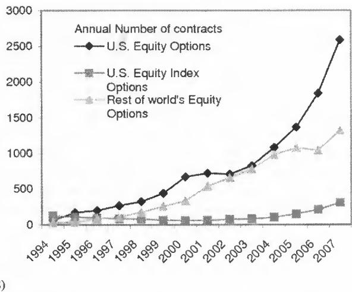  
Figure E-1 Global Exchange Traded Equity Option growth

Source: BIS (2008)

Figure E-1 also shows the disparity in growth between option trading for equities and indices. Admittedly, this is not all atributable to market competition, but also due to changing investment and hedging styles. Nevertheless, it does help cmphasisc just how important competition can be.

There has been a phenomenal growth in the trading of U.S. equity options. This the largest market of its kind in the world, accounting for nearly two thirds of the globally traded volume. As a marketplace, it has become a microcosm of its cousin, the stock market. Trading is now dispersed amongst seven main venues. Table E-5 shows a breakdown of their trading volumes. Unlike many other markets there now a split in how venues actually match orders, with the newer venues such as NYSE Arca, Boston and NASDAQ all offering a price/time based order book, rather than the pro-rata matching traditionally offered by the other derivatives exchanges.

Much of the current market structure is due to changes in regulation. This dates back to 1999 when the Justice Department and the SEC won setlements agrecing that competition had been blocked by selective trading practices. Suddenly, by the end of the ycar stock options were no longer concentrated at specific venues, but instead could be traded at any of the options exchanges. The resultant competition helped reduce spreads and lcd to a significant increase in overall trading volumes. Decimalisation has also helped, so in 2007 the SEC instigated a pilot program to further reduce the tick size Irom $\$ 0.05$ to $\$ 0.01$ .Early indications are that this "penny pilot" program is working. However, it also appcars to have encouraged even lower trade sizes and higher overall volumes, mimicking the effect secn in the cquitics market. New portfolio margining regulations that allow positions to be netted may well cause a further increase in volumes, since they help lower the cost of entry.

Algorithmic trading is starting to take hold as wel1. A report by the TABB Group (2009) consultancy found that $23 \%$ of the hedge funds and $9 \%$ of the long-only funds they surveyed were already using trading algorithms.

The International Securities Exchange (ISE) has rapidly become the leading exchange for U.S. equity options, since its creation in 2000, with repeated year on ycar growth of over $30 \%$ . Its trading system is based on NASDAQ OMX's CLICK platform. Trading is via a hybrid mechanism, based on a fully electronic order book with hoth primary and secondary

<table><tr><td rowspan=2 colspan=1>Exchange</td><td rowspan=2 colspan=1>OrderMatching</td><td rowspan=1 colspan=2># of contracts traded(in millions)</td></tr><tr><td rowspan=1 colspan=1>2008</td><td rowspan=1 colspan=1>2007</td></tr><tr><td rowspan=1 colspan=1>1nterational Securities Exchange</td><td rowspan=1 colspan=1>Pro-rata</td><td rowspan=1 colspan=1>988.1</td><td rowspan=1 colspan=1>787.9</td></tr><tr><td rowspan=1 colspan=1>Chicago Board Options Exchange</td><td rowspan=1 colspan=1>Pro-rata</td><td rowspan=1 colspan=1>933.8</td><td rowspan=1 colspan=1>713.9</td></tr><tr><td rowspan=1 colspan=1>NASDAQ OMX PHLX</td><td rowspan=1 colspan=1>Pro-rata</td><td rowspan=1 colspan=1>537.9</td><td rowspan=1 colspan=1>399.1</td></tr><tr><td rowspan=1 colspan=1>NYSE Arca</td><td rowspan=1 colspan=1>Price/Time</td><td rowspan=1 colspan=1>416.9</td><td rowspan=1 colspan=1>335.8</td></tr><tr><td rowspan=1 colspan=1>NYSE Amex</td><td rowspan=1 colspan=1>Pro-rata</td><td rowspan=1 colspan=1>199.8</td><td rowspan=1 colspan=1>226.5</td></tr><tr><td rowspan=1 colspan=1>Boston Options Exchange</td><td rowspan=1 colspan=1>Price/Time</td><td rowspan=1 colspan=1>177.6</td><td rowspan=1 colspan=1>129.7</td></tr><tr><td rowspan=1 colspan=1>NASDAQ Options Market</td><td rowspan=1 colspan=1>Price/Time</td><td rowspan=1 colspan=1>n/a</td><td rowspan=1 colspan=1>n/a</td></tr></table>

Source: WFE (2009)

# Table E-5 U.S. Equity Option Marketplace

market makers. The ISE also allows order preferencing (for specific market makers) as well as directed orders, which initiate a price improvement mechanism (effectively a one-second bilateral auction). Block crossing is catered for as well; a separate mechanism advertises the order to members who may then respond with the prices and sizes at which they are wiling to trade. It has led the way in terms of transparency, ensuring that the top three price levels of the order hook are visible. The ISE has also announced plans to develop a new global trading system that will replacc its current system in early 2011. The new system is a joint devclopment project hetwcen the technology teams at the ISE and the Deutsche Börse Group.

The Chicago Board Options Exchange (CBOE) was the world's first equity options cxchangc, founded in 1973. In rcsponsc to the increasingly competitive marketplace, it has created a hybrid trading system. This blends its floor-based technology with CBOE Direct, its dedicated electronic trading platform. Designated primary market makers are responsible for oversceing the markct for each stock's options. Additional liquidity is provided by "incrowd" and remote market makers.

The NASDAQ OMX PHLX (formerly the Philadelphia Stock Exchange) provides another hybrid electronic market. This was formerly based on the PHLX XL system, but has since becn migrated to the INET platform. There are still specialists, and other market makers may participate as well. Order flow may also be directed to specific dealers. NASDAQ OMX has another separate venue, the NASDAQ Options Market, which went live in 2008. This is based on INET as well, but it adopts a price/time priority.

NYSE Arca's involvement with options datcs back to the Pacific Exchange, which merged with Archipelago to form Arca, before merging with the NYSE. This electronic market uses Lead Market Makers to provide liquidity, particularly for the more thinly traded options, in return they are guarantced $40 \%$ of the incoming order flow (so long as they are quoting at the NBBO). The NYSE has also bolstecred its offering by incorporating the Amex (formcrly the American Stock Exchange), which has moved its trading floor to the NYSE and has migrated to the Arca platform.

Bctween the options exchanges there is an inter-market linkage program, which aims to ensure that market orders execute with the NBBO. This is due to be replaced with a deccntralised order routing approach, similar to the U.S. equity markets. Liquidity aggregation is also starting to be offered by some vendors. For example, Orc Software has launched a U.S. Options Montage, which consolidates quotes across all the exchanges and allows smart order routing to achieve best execution.

Current regulation means that ECNs/ATSs are not yet possible since trades must be handled by an exchange, as pointed out in an articlc by Emily Fraser (2007). However, new platforms to allow block crossing are still being created For instance, 2008 saw the launch of Ballista. This provides a hybrid approaeh, combining auctions with electronic negotiations. Each order is placed in an electronic auction, which is open to other members for up to five minutes; the user can also specify how mueh information the order revcals (size or direction). A successful counter bid from another member then triggers an exclusive negotiation between the two. Ballista also allows members to place orders for complex strategies, comprising of up to three option legs and/or their underlying slock. Meanwhile Pipeline's Archangel takes a different approach. It adopts a blind auction, similar to those used for portfolio trading. Therefore, participants only have access to the key characteristics of the available orders. So decisions are based on risk factors such as the "Greeks" (delta, gamma, theta etc), order size indications and other static information such as the industry sector. Once a match is agreed, the orders are then routed to the corresponding venues, such as the CBOE or ISE. In addition to protecting the details of orders, this model-driven approach should also improve the numher of matches. Given the size of the option universe, finding an exact match for a specifie contract would otherwise be diflicult. If (or once) the trading rcgulations change we may well sce other entrants look to expand into the block crossing space.

# Other American Futures and Options Markets

Though dwarfed by their U.S. counterparts Latin America still has some of the world's largest derivatives exchanges, as shown in Table E-6.

<table><tr><td rowspan=2 colspan=1>Exchange</td><td rowspan=1 colspan=3>Number of contracts traded in 2008 (millions)</td></tr><tr><td rowspan=1 colspan=1>Total</td><td rowspan=1 colspan=1>Futures</td><td rowspan=1 colspan=1>Options</td></tr><tr><td rowspan=1 colspan=1>BM&amp;FBOVESPA</td><td rowspan=1 colspan=1>681.9</td><td rowspan=1 colspan=1>278.1</td><td rowspan=1 colspan=1>403.8</td></tr><tr><td rowspan=1 colspan=1>Mexican Derivatives Exchangc</td><td rowspan=1 colspan=1>70.1</td><td rowspan=1 colspan=1>69.5</td><td rowspan=1 colspan=1>0.6</td></tr><tr><td rowspan=1 colspan=1>Montrcal Exchange</td><td rowspan=1 colspan=1>38.1</td><td rowspan=1 colspan=1>22.0</td><td rowspan=1 colspan=1>16.0</td></tr><tr><td rowspan=1 colspan=1>Buenos Aires SE</td><td rowspan=1 colspan=1>25.2</td><td rowspan=1 colspan=1>0.0</td><td rowspan=1 colspan=1>25.2</td></tr></table>

Source: WFE (2009)

# Table E-6 Other American futures and options exchanges

Brazil has the region's two largest exchanges. The Sao Paulo Stock Exchange (BOVESPA) caters for cquity options, whilst the Bolsa de Mercadorias & Futuros (BM&F) covers lixed income, currency and commodity hased contracts. These merged in 2008 to become BM&FBOVESPA. Their main contraet is a one-day inter-bank deposit future; in fact, in 2007 this was the $9 ^ { \mathrm { t h } }$ most traded listed derivative, according to the FIA (2008). Their trading systems are hased on the order-driven NSC platform. Although there is still some opcn-outcry trading, much of the volume has become elecironie. They have been keen to encourage DMA access as well. In 2009, they established a link to route orders to the CME; this is also used to allow CME users to trade BM&F contracts.

Thc Mexican Derivatives Exchange was founded in 1998. Its most suceessful eontrael is a future based on a shorl-term interest rate, the TIIE 28 day inter-bank rate, whieh was the $1 1 ^ { \mathfrak { u } }$ most actively traded dcrivative in 2007, bascd on the FIA (2008) report. It also offers a range of other fixed income, equity and FX contracts. The cxchange provides a fully automated and anonymous marketplace, as well as supporting FIX.

# EMEA futures and options markets

Over the last tcn ycars, thc major European derivative cxchanges have consolidated their position as leading venues in the global marketplace. Certainly, the merger between the CME and CBOT owes much to their competition. Table E-7 outlines the breakdown in terms of traded contracts in 2008 for the region's top exchanges.

<table><tr><td rowspan=2 colspan=1>Exchange</td><td rowspan=1 colspan=3>Number of contracts traded in 2008 (millions)</td></tr><tr><td rowspan=1 colspan=1>Total</td><td rowspan=1 colspan=1>Futures</td><td rowspan=1 colspan=1>Options</td></tr><tr><td rowspan=1 colspan=1>Eurex</td><td rowspan=1 colspan=1>2,164.8</td><td rowspan=1 colspan=1>1,231.4</td><td rowspan=1 colspan=1>933.4</td></tr><tr><td rowspan=1 colspan=1>Liffe</td><td rowspan=1 colspan=1>1,049.7</td><td rowspan=1 colspan=1>610.0</td><td rowspan=1 colspan=1>439.7</td></tr><tr><td rowspan=1 colspan=1>Johannesburg Securities Exchange</td><td rowspan=1 colspan=1>478.1</td><td rowspan=1 colspan=1>446.2</td><td rowspan=1 colspan=1>31.8</td></tr><tr><td rowspan=1 colspan=1>ICE Futures Europe</td><td rowspan=1 colspan=1>153.0</td><td rowspan=1 colspan=1>152.3</td><td rowspan=1 colspan=1>0.6</td></tr><tr><td rowspan=1 colspan=1>NASDAQ OMX Nordic Exchange</td><td rowspan=1 colspan=1>143.4</td><td rowspan=1 colspan=1>80.4</td><td rowspan=1 colspan=1>63.1</td></tr></table>

Source: WFE (2009)

# Table E-7 Top European futures and options exchanges

Eurex originated in 1998 from a merger of the Deutsche Terminbörse (DTB) and the SWG's SOFFEX derivative markets. It offers a fully electronic order book with provision for market makers to supply liquidity. By 1999, it had become the world's largest futures and options exchange. Eurex's success led the way for trading electronically, causing the openoutcry bascd venucs to re-examine the benefits of electronic access. Its most heavily traded contracts are fixed incomc benchmark futures, namely the Euro-Bund (10y), Euro-Bobl (5y) and the Euro-Schatz (2y), together with futures and options for the Dow-Jones Euro Stoxx 50 stock index. Eurex is the leading marketplace for European stock options and has also expanded into single stock futures, becoming the world's third largest exchange for these. In 2007 Eurex merged with the International Securities Exchange (ISE), adding considerably to its market share of the option and U.S. markets, and creating a truly global cxchange.

The London International Financial Futures Exchange (Liffe), founded in 1982, was initially modelled on the CBOT and CME open-outcry markets. Mergers with other London derivative markets led it to become Europe's leading derivatives exchange by 1996. Still, it faced increasing competition from the DTB and subsequently Eurex, causing it to shift to a fully automated marketplace by 2000. In 2002 Liffe was acquired by Euroncxt, which already incorporated the derivatives markets for Amsterdam, Brussels and Paris, most notably the MATIF. Liffe has remained an important competitor in the global derivatives marketplace. Trading on Liffe is based on an order book, running on the Connect system. Liffe's main contracts are its short-tcrm interest rate futures, namely the Euribor (3m) and Sterling (3m) futures. Trading volumcs are lower for equity and index based contracts; but an article by Joc Morgan (2007) notes that these have seen a steady increase in automated trading, with levels reaching up to $50 \%$ for the more liquid contracts. This is encouraged by their liquidity provider system, which gives market makers a mass quoting facility, enabling them to rapidly submit updates, which is particularly useful for options.

The South African Futures Exchange (SAFEX) merged with the Johannesburg Securities Exchange (JSE) in 2001. Offcring fully automated trading it has since become the world's most active exchange for singlc stock futures.

The NASDAQ OMX derivatives market is dominated by equity derivative trading, with futures and options for both single stocks and indices. Trading for these is fully clcctronic, based on the CLICK trading platform. For fixed income derivatives, SAXESS is used by designated market makers to provide indicative quotes. Note that the actual trading for these takes place off-cxchange, and is separately reported to the NASDAQ OMX for clearing.

The IntercontinentalExchange was created in 2000, with the intention of creating a fully electronic around-the-clock energy exchange. A year later, it incorporated the International Petroleum Exchange (IPE) to becomc ICE Futures. ICE olfers a hybrid markeiplace; markct makers provide firm quotes, whilst centralised credit management allows anonymous order matching. ICE's Brent crude oil futures are the fourth most highly traded futures contract globally. It has become competition for NYMEX, particularly with its new West Texas Intermediate (WTI) crude oil contract. ICE has continued to expand, buying the New York Board of Trade (NYBOT) in 2007; it also sought a merger with CBOT.

Further competition is also starting to appear in Europe. A group of broker/dealers has announced Project Rainbow, a derivatives equivalent of Turquoise. This plans to compete with the established exchanges, initially for short term interest rate contracts.

# Asian futures and options markets

Asia lags both the U.S. and Europe in terms of the number of futures and options contracis traded on cxchanges, except for the behemoth that is the Korean options market. Tablc E-8 shows the top exchanges bascd on the number of contracts traded in 2008.

<table><tr><td rowspan=2 colspan=1>Exchange</td><td rowspan=1 colspan=3>Number of contracts traded in 2008 (millions)</td></tr><tr><td rowspan=1 colspan=1>Total</td><td rowspan=1 colspan=1>Futures</td><td rowspan=1 colspan=1>Options</td></tr><tr><td rowspan=1 colspan=1>Korea Exchange</td><td rowspan=1 colspan=1>2,867.3</td><td rowspan=1 colspan=1>100.8</td><td rowspan=1 colspan=1>2,766.5</td></tr><tr><td rowspan=1 colspan=1>National Stock Exchange India</td><td rowspan=1 colspan=1>601.6</td><td rowspan=1 colspan=1>439.6</td><td rowspan=1 colspan=1>162.0</td></tr><tr><td rowspan=1 colspan=1>Dalian Commodity Ex (China)</td><td rowspan=1 colspan=1>313.2</td><td rowspan=1 colspan=1>313.2</td><td rowspan=1 colspan=1>0.0</td></tr><tr><td rowspan=1 colspan=1>Zhengzhou Commodity Ex (China)</td><td rowspan=1 colspan=1>222.6</td><td rowspan=1 colspan=1>222.6</td><td rowspan=1 colspan=1>0.0</td></tr><tr><td rowspan=1 colspan=1>Australian SE</td><td rowspan=1 colspan=1>175.2</td><td rowspan=1 colspan=1>153.2</td><td rowspan=1 colspan=1>22.0</td></tr><tr><td rowspan=1 colspan=1>Osaka SE</td><td rowspan=1 colspan=1>163.7</td><td rowspan=1 colspan=1>131.0</td><td rowspan=1 colspan=1>32.7</td></tr><tr><td rowspan=1 colspan=1>Shanghai Futures Exchangc</td><td rowspan=1 colspan=1>140.3</td><td rowspan=1 colspan=1>140.3</td><td rowspan=1 colspan=1>0.0</td></tr><tr><td rowspan=1 colspan=1>Taiwan Futures Exchange</td><td rowspan=1 colspan=1>136.7</td><td rowspan=1 colspan=1>37.7</td><td rowspan=1 colspan=1>99.0</td></tr><tr><td rowspan=1 colspan=1>Hong Kong Exchanges</td><td rowspan=1 colspan=1>105.0</td><td rowspan=1 colspan=1>44.7</td><td rowspan=1 colspan=1>60.3</td></tr></table>

Source: WFE (2009)

# Table E-8 Top Asian futures and options exchanges

The KOSPI 200 options, traded on the Korca Exchange, lead the global exchangc traded derivatives volume. Alone they account for $45 \%$ of the total volume traded by the top ten contracts in 2008, based on the FIA (2009) report, and around $1 5 \%$ of the global volume. Trading by institutions and foreign investors makes up around $60 \%$ of the volume, although historically retail trading was more dominant. Since much of the retail trading was speculative, this trend has meant the volatility of the KOSPI has declined. As the market matures, the rapid growth in trading for thesc contracts has also declined slightly. Trading is based on an electronic order book provided by the KOSPI futures-trading-system, which has proven able to cope with thesc huge trading volumes.

The National Stock Exchange of India is currently the world's second most active market for single stock futurcs. The rest of its volume is mainly from index futures trading for the

S&P CNX Nifty, the leading 50 stocks on the NSE.

China's largest derivatives cxchange is the Dalian Commodity Exchange, which specialises in agricultural commodity futures. Electronic trading is available, based on its own dedicated platform. Most of its trading volume is in contracts for corn and soy meal, for which it is the world's largest market. Other agricultural contracts, such as sugar, cotton and wheat are tradahle on the Zhengzhou Commodity Exchange. Metal, rubber and fuel contracts are traded on the clectronic Shanghai Futures Exchange (SHFE). Exchange trading of purely financial derivatives has not yet taken off. That said, 2006 saw the foundation of the China Financial Futures Exchange (CFFEX), its first exchange dedicated to purely financial derivatives. The first traded contract will be a future on the CSI-300 (China Securitics Index). Note that futures contracts will provide a way to synthetically short stocks, which is not currently possible on the cash market. Once the CSI-300 has gone live, contracts for honds and currency are also expected. Commodity options are also likely to be introduced. Another dedicated commodities exchange should be launched in 2009/10, the Hong Kong Mercantile Exchange. Initially, its focus will be on oil contracts, the platform will be based on Cinnober's TRADExpress system. The U.S. has also been eager to capitalise on China's rapid growth, for instance, the CME has launched a mini-futures contract linkcd to an index for China's top 25 cquitics (by market cap).

The Australian Securities Exchange was formed in 2006 by a merger between the Sydney Futures Exchange (SFE) and the Australian Stock Exchange. Listed derivative trading has been electronic since 1999 when the SFE closed its trading floor. Its SYCOM trading system provides 24 hours access and includes a FIX gateway. The most heavily traded contract is the futurc for the 3 year Treasury bond; there is also significant trading for the S&P/ASX 200 stock index as well as other fixed income futures, ranging from 90-day bank bill to 10- ycar treasury honds.

The Taiwan Futures Exchange (TAlFEX) is fully electronic, based on its in-house Electronic Trading System. Around $8 5 \%$ of its trading volume is accounted for by TAIEX index options, whilst nearly another $10 \%$ is for the TAIEX future. It has started supporting DMA and is looking to provide spread order functionality. The exchange has also begun listing dollar-based contracts and is looking to expand the range of futures, which may he traded by foreign investors.

In Japan, financial derivatives are traded on separate exchanges. Equity index contracts are traded on the corresponding stock exchanges. The Nikkei 225 is catered for by the Osaka SE; currently the most successful contract is the Nikkei 225 mini future, which was introduced in 2006. The TSE handles derivatives for the TOPIX; it also provides sector index futures. In 2009, it released its new options trading platform Tdex+, based on Liffe Connect. In terms of fixcd income contracts, the Tokyo Financial Exchange (TFX, formerly TIFFE) trades contracts for the 3 month Euro-Yen; its platform is also based on Liffe Connect. Futures and options on JGB bonds are actually traded on the TSE. For commodity derivatives, the Tokyo Commodity Exchange (TOCOM) is the largest venue, with a market sharc of nearly $70 \%$ . Primarily, it trades contracts for gold and other metals, rubber, gasoline and other energy products. It has ofered electronic trading since 1991 with a continuous market as well as call auctions. In 2009, it saw a major upgrade with a trading engine from NASDAQ OMX. Note there are three other commodity exchanges, the Central Japan Commodity Exchange (C-COM), the Tokyo Grain Exchange (TGE) and the Kansai Commodity Exchange (KEX). Although this is down from 16 in 1989, it is quite likely that further consolidation will occur for Japan's derivatives exchanges.

# Swaps markets

Swaps are one of the most important types of dcrivative, accounting for around halr the global outstanding notional value in the first half of 2008, as we saw back in Table E-1. Essentially, a swap is an agreement between two counterpartics to exchange cash streams. These streams may bc linked to fixed/floating interest rates, currencies, or even dividend paymcnts. Thus, they offer a flexible means of controlling cash flows, which gocs some of the way to cxplaining their popularity.

Swaps are still essentially viewed as an OTC derivative. Though, the shccr volume of interest rate swaps mcans there can be considerable liquidity for the more standardised contracts. Hence, electronic trading is becoming more important.

# Asset specific

A swap contract is a bilateral agrccment to exchange cash strcams for a principal amount over a set time period. Generally, thc associated cash streams are bascd on intercst ratcs or currencies (or both), although they can also incorporate flows from cquities or commodities. For cxample, a cash stream might correspond to the income or interest payments from a specific bond, the interest rate of a spccific fixing (such as LIBOR) or the gains/losses from marking to market a stock position. As with bonds, swaps may be classified by the maturity date: short-term range from a week to less than 1-2 years, mcdium term range from 1-10 years whilst long term may Iast up to 50 years. Swaps give organisations an extremcly lexible means of controlling thcir cash streams, although their individuality also means they have primarily been traded OTC.

The commonest type is an Interest Rate Swap (IRS). Note that the principal (or notional) amount is not actually exchanged; only the associated interest payments arc swapped. A vanilla interest rate swap consists of one lcg based on a floating rate of interest whilst the other is based on a fixed rate. For the floating leg, the actual paymcnts are determined by the fixing schedules for the interest rate, e.g. quarterly lor the thre-month London Interbank Overnight Rate (LIBOR), whilst the fixed leg is usually paid semi-annually. Alternatively, a basis swap is one where both legs are based on floating rates, albeit with different fixing sources or schedules.

As its name suggests, a currency swap adds exchange rates into the mix. However, it also requires cxchange of the notional amount at maturity and optionally at thc start ol the contract. This allows companics to borrow in the curency where they can obtain the best interest rate then convert it to the currency they actually need. The most common type of currency swap involves a floating U.S. dollar rate (often based on LIBOR) with a fixed rate in another foreign currency. Note that a currency swap should not be confused with a forex swap, which just represents an exchange of currencies. A forex swap is the combination of a spot FX transaction together with a forward contract to reverse this initial exchange and so close out the deal; interest paymcnts are not involved. Effectively, a forex swap reprcsents a spread trade hetwecn the spot FX rate and the forward rate.

An overnight indexed swap (OIS) is similar to a vanilla IRS, with a leg linked to an overnight fixing. At maturity, the differencc betwcn thc accrued intercst for the fixed rate and the average of the floating rates is exchanged. These are usually short-term swaps with maturities ranging from a week to two years.

A total return swap exchanges periodic interest payments for the total return of an assct or basket of asscts. This allows investors acccss to capital gains, without having to actually hold the assct/s, since the ownership is not transferred. Effectively, they provide the purchascr with a synthetic position in the given asset. If a large price drop or even a dcfault occurs then the purchaser will actually have to compensate the seller. So they are exposed to both the asset's market and credit risk. An equity swap is basically a total return swap based on an underlying stock, portfolio or stock index.

Asset swaps are the combination of an interest rate swap with a fixed rate bond, where the interest from the hond should be sufficient to pay for the swap rate (the IRS fixed rate). Therefore, the swap effectively cancels out the interest rate risk of the bond, lcaving the holder exposed to a mix of bond credit risk and counterparty risk for the swap.

Other, more exotic types of swaps are also available, including fcatures such as being callable or incorporating price ratcheting, but these are beyond the scope of this book.

# Global swaps markets

The global market for swaps is huge; its notional value has increased nearly eight-fold sincc 1998 to over $\$ 370$ trillion in the first half oI 2008. Of this, interest rate swaps account for over $9 5 \%$ , whilst less than $5 \%$ is due to currency swaps.

In terms of trading volume, interest rate swaps had an average daily turnover of $\$ 121$ trillion in 2007, based on data from BIS (2007b). That is about double the volume recorded in their 2004 triennial survey, which in turn was double the value for 2001. Clearly, the growth in turnover is considerable. In comparison, currency swaps had a daily turnover of around $\$ 80$ billion in 2007, although this is actually four times its 2004 level.

Swaps are generally for the Euro and U.S. dollar. In fact, over $44 \%$ of interest rate swaps are based on the Euro and $2 7 \%$ on the dollar. In comparison, only $10 \%$ are for U.K. sterling, $9 \%$ for Japanese Yen and the remaining $10 \%$ covers all othcr currencies. Likewise, three quarters of all currency swaps involve the dollar. The sizeable volumes of Euro denominated swaps may seem surprising. However, for the Eurozone swaps have proven invaluable as a means of generating pan-European interest rates, as Joseph Mariathasan and Mark Bannister (2007) point out. This is also reflected by the fact that around $4 2 . 5 \%$ of the trading is based in London, whilst the U.S. only accounts for around $2 3 . 8 \%$ .

The maturities of swaps are spread relatively evenly, with around $3 8 \%$ of interest rate swaps lasting up to a year, $3 6 \%$ betwcen one to five years and around $26 \%$ for cvcn longer periods, bascd on the BIS (2007e) report. Whilst for currency swaps the BIS data shows that around three quarters of them are arranged for less than a year.

The swap marketplace is still strongly segmented with separatc inter-dealer and dealer-toclient markets. In terms of elcctronic trading, progress has actually been faster in the dealerto-clicnt segment, although the inter-dealer space is catching up. A report from the Celent (2006) consultancy estimates that by 2009 electronic dealer-to-client trading should account for around $42 \%$ of the market, up from $9 \%$ in 2006, whilst inter-dealer trading may reach around $22 \%$ . In Europe, a study by the ECB (2009) found that interest rate swaps had reached around $16 \%$ electronic trading by 2008, whilst for overnight indexed swaps it was only $8 \%$ .

Competition is growing in the inter-dealer markct. The first dedicated electronic marketplace for these was e-MIDER, created in 2000 by a consortium of banks, based on a requcst for quote mechanism. Although, at present, the two main inter-dealer systems providing the widest range of electronic swap trading are i-Swap and the Swapstream, both introduccd in 2003. The ICAP brokeragc's i-Swap caters for overnight, short and mediumterm interest rate swaps. Although initially the focus has been on the euro, it also supports trading in pounds, dollars and yen. Orders may be entered electronically and are also transcribed from phone-dealing into a visible order book. This hybrid marketplace is actually based on thc NASDAQ OMX's X-stream platform. i-Swap also supports implicd orders, allowing additional liquidity from trading strategies such as spreads. The CME bought Swapstream in 2006; it offers trading for U.S. dollar and euro swaps versus Libor or Euribor with maturities from 6 months to 30 years as well as short-term overnight indexed swaps. EuroMTS has also launched a dedicated swap market for trading overnight indexed swaps.

The dealer-to-client segment consists of a mix of single and multi-dealer platforms. Barclay's were quick to capitalise on the opportunity offered by clectronic trading, displaying live prices via Bloomberg and seting up a dedicated trading system in 2003. Since then, other brokers have gone on to release their own trading platforms. Other vendors have also been keen to crcate swap trading platforms; Reuters introduced its Matching for Interest Rates in 2004 followed by Bloomberg's SwapTrader and Tradeweb in 2005. Thesc cater for short, mcdium and long-term euro and dollar swaps, generally using an RFQ mechanism to allow prices to be compared betwecn several dcalcrs bcforc trading. Tradewcb also supports streaming (RFS) prices for Euro and GBP interest rate swaps. The hanks and exchanges have noticed the succcss of these systems, and are working on their own competing platforms. The CME has also introduced sPro, a dealer-to-client version of Swapstream, which offers a hybrid market with streaming prices. LiquidityHub was proposed as a gateway for brokers to provide streaming prices for curo and dollar swaps, although the 2007-09 financial crisis helped put an cnd to this project.

Centralised clearing is starting to be offcred for swaps trading as well, which may help further increase the adoption of electronic trading platforms. In particular, the CME has introduced Clearing360, which provides a mcchanism for substituting intercst rate forwards and swaps. Indccd, onc of the main advantages of swaps traded on Swapstream is that they are centrally cleared through CME Clearing 360. Hence, this platform offers full straightthrough-processing (STP) for electronic swaps trading.

# Credit derivative markets

Credit derivatives were first created in 1990s as banks sought custom guarantces to hedgc and diversify the credit risk associated with their loans. They have rapidly become a major asset class, enabling investors to trade credit risk without having to actually manage or fund loans. As Nishul Saperia and Jean Gross (2008) point out, incrcasing standardisation and a ready supply has allowed traders to track a single credit spread curve for any given entity, as opposed to following a large range of honds. This led the credit derivative market to hecome a primary indicator of creditworthiness. In fact, they note that the volume of trading in credit derivatives outstripped the volume of bonds outstanding some time ago.

Although sti primarily traded OTC, noteworthy steps have been made in the clectronic trading of credit derivatives.

# Asset specific

Credit derivatives act as financial guarantees that may be used to provide protection against a varicty of credit events, hut most typically default or bankruptcy. They include single entity credit default swaps, basket swaps, index-based credit swaps and synthetic collateralised debt obligations as well as some other credit based products.

A credit default swap (CDS) is a contract in which the credit risk for a notional amount of debt issued from one (or more) entities is translerred. The purchaser gains protection from this credit risk, whilst the seller is paid regular premiums for the lifetime of the contract. If a eredit event oecurs then the seller must compensate the purchaser and the contract expires. The key features, which differentiate each CDS, are the:

● Covcrage, in terms of entities and notional amount of debt   
• Premium payments Types of eredit event allowed Settlement procedures

CDSs provide eredit protection for debt issued from a variety of entities, ranging from companies to governments or their agencies. Note that when multiple entities are involved the swap is sometimes referred to as a basket CDS. The notional amounts vary depending on the entity's credit rating. Generally, investment grade CDSs have a notional value of around $\$ 10 – 20$ million whilst riskier, higher yield contracts are often between $\$ 2-5$ million. The allowed eredit events may range from failure to pay, defaulting or bankruptey, to debt restrueturing or credit rating changes.

'The required premium, or spread, is based on the eredit rating of the entitics and the notional amount of debt to be covered. The typical maturity for a CDS contract is five years. Generally, the premium is quoted in terms of basis points per annum, and paid quarterly. Note that for constant maturity swaps the credit spread is periodically reset based on the current market level.

Like futures, CDSs may be settled either physically or via a cash settlement. When triggered by a credit event physical settlement means the purchaser must deliver the corresponding debt in exchange for the cash notional amount from the seller. Though, cash settlement is becoming increasingly popular. This requires the seller to pay the difference belween the notional amount and the current market value. Often, post-default the current market value will be determined by an auetion of the defaulted debt, such as the Credit Event Auctions administered hy Creditex and Markit, more details of this are given in Saperia and Gross (2008).

A credit-linked note is elfectively a funded CDS that provides securitisation to protect the purchaser against counterparty risk. In case of default, this acts as a guarantee to ensure that the buyer is compensated. Often this is achieved through an intermediary special purpose company.

CDS indices represent a natural evolution from single entity or basket CDSs. These standardised eredit swaps often cover more than a hundred separate companies. Usually, these are equally weighted so each company is covered by an equal share of the notional amount. They have proven to be ineredibly popular, since they allow investors to make much broader macro trades for credit risk. In addition, it is possible to buy or sell tranches of CDS indices, allowing investors to deline limits for the protetion coverage. For instance, a $3 . 7 \%$ tranche for the CDX index means that proteetion is provided for losses of between 3 and $7 \%$ of the notional amount, but not above or helow these levels. Leading exchanges have even started to offer futures and options based on underlying CDS indices.

Another use for CDSs has been for struetured produets that involve eredit risk. Collateralized debt obligations (CDO) are asset-backed seeurities based on an underlying portfolio of bonds or loans. A synthetic CDO replaces these underlying assets with credit default swaps, the income from which is invested in low risk bonds. Effectively, a synthetie CDO is a portfolio of CDSs combined with low risk assets.

Pricing credit derivatives is non-trivial. Unlike an interest rate swap, we must also incorporate the probability of default together with the recovery price for the asset. A variety of methods are used to price credit derivatives, but these are beyond the scope of this book.

A brief revicw is provided by Brian Ealcs (2007) and David Mengle (2007). These sourccs also provide a more detailed review of credit derivatives in gencral.

# Global credit derivative markets

Credit derivatives have experienced phenomenal growth over the last ten ycars. In 1997, the global notional outstanding volume was just $\$ 180$ billion. For 2008 the Intcrnational Swaps and Derivativcs Association Inc. (2009) rcported a total notional outstanding of $\$ 38.6$ trillion. Admittedly, the credit crunch has dampened the growth of the credit markets; in fact, the 2008 figure was down $3 8 \%$ from the 2007 year-end. The $20 \%$ increasc in outstanding notional between 2005 and 2007 now seems a distant memory. Still, it is important to remcmber that credit derivatives are wcll established as a major asset class.

Trading is focussed in London and New York, each with around a $40 \%$ market share, whilst the rest of Europc accounts for around $10 \%$ . In terms of assct types, much of the trading is concentrated on CDSs and CDS indices, each accounting for over $30 \%$ of the market whilst CDOs account for around $16 \%$ , based on the 2006 Credit Derivatives Report from the British Bankers' Association (BBA) (2006). In terms of maturity, B1S (2007c) note that around $60 \%$ of the CDSs range between one to five years whilst another third are Ior periods longer than this.

Standardisation has played an important role in the levcl of growth which credit derivative trading has achicved. Standards have helped make the contracts and transactions more uniform. But the most noticeable impact has been from the introduction of CDS indices. These have experienced an cxtraordinary surge in usage since 2004, when they had less than $10 \%$ market share, based on the BB A (2006). In Europe, much of this is due to the enhanced liquidity that arose from the 2004 mcrger of the iBoxx and Trac-X indices into the iTraxx Europe, which consists of 125 investment grade companies. The Dow Jones CDX is the main U.S. index, covering investment gradc debt from 125 North American corporations. There are also a wide range of other indices covering Asia, emerging markets as well as high yield and specific industry sectors.

Credit derivatives are still generally traded OTC with brokers. Though, electronic trading is making noteworthy progress, particularly for the more standardised products such as CDS indices. A report by the Celent (2004) consultancy noted that around $2 5 \%$ of index based trading was clctronic, predicting it would increase to around $50 \%$ by 2007. Thesc predictions seem to have been met in Europe, where a Euromoney (2008a) report notes that around $45 \%$ of inter-dealer transactions were electronic. Adoption in North America and Asia is still at an early stage. The ratc of progress for Iess standardised products, such as single entity CDSs, is also likely to be slower.

The inter-broker market has a range of electronic platforms which cater for CDSs, most notably Creditex's RealTime platform, GFI's CreditMatch and ICAP's BrokerTec. The Euromoncy (2008a) report notes that thesc three accounted for $90 \%$ of the Europcan interdealer market. The focus has primarily been on the liquid CDS indices, although systems are increasingly catering for single cntity CDSs and other less liquid products. In addition, to cater for correlation trading, vendors are also starting to provide Ior trading large portfolios of single entity CDSs. These orders can be huge, with aggrcgate notional amounts of morc than a bilion dollars and encompassing over 100 CDSs. In particular, in 2007 Creditex launched a platform dedicated to handling such trades (called Q-WiXX), providing live prices from up to four different dealers.

In the daler-to-client market, lctronic rading has seen ess significant uptake. Initially, single vendor systems were the norm, such as those from BNP Paribas and Barclays Capital. Multi-dealer platforms have also started to appear, in the form of MarketAxess and Tradeweb. Again, the initial focus has been on the highly liquid CDS indices, based around an RFQ trading mechanism. Both platforms have integrated real-time prices to provide users with indicative quotes. It is also likely that vendors will soon cater for clients who require CDS portfolio trading.

The leading exchanges have proven keen to enter the credit market as well, starting with the Eurex's launch of futures based on the iTraxx indices. In the U.S., the CBOT announced an index future bascd on the CDR Liquid 50 index. The CME has also announced a joint venture with the Citadel Investment Group LLC for a CDS trading platform called CDMX. This wi provide an RFQ mechanism for trading both single entity and CDS indices, coupled with a central counterparty clearing facility. Whilst the CBOE also has plans for CDS based options. At the moment, it is still too early to gauge how successful these ventures will prove to be, but given the size of this market, even a small percentage would be important.

The 2007-09 financial crisis also focussed attention on the clearing and settlement procedures for credit derivatives. The counterparty risk associated with CDS contracts made it hard to trade out of them, particularly with the collapse of several major banks. Hence, regulators are sceking to mandate centralised clearinghouses to try to reduce this risk. In the U.S, centralised clearing proposals from NYSE Euronext Liffe and the CME have already been approved. Likewise in Europe there is growing support for central counterparties, with a number of hanks already committed to using them. Centralised clearing should also make it easicr to implement fully electronic trading platforms in the future, as Ivy Schmerken (2009) points out.

Strcamlining the settlement process is also important to allow for continued market growth. In fact, the 2006 BBA report highlights that trade confirmations were more than two months late for almost $10 \%$ of trades. Tales of huge back-ofice backlogs for settlement are not unheard of. That said, steps are being made to improve the provision of straight-through processing. For instance, vendors such as T-Zero now offer dedicated platforms to streamline the conlirmation and assignment processes.

# Summary

Electronic trading is now commonplace for listed derivatives (futures and options); it is even availahle for swaps and credit derivatives, which traditionally are traded OTC. Algorithmic trading is becoming established for listed derivatives, particularly futures. The rapid growth and fragmentation of the U.S. cquity options marketplace means this is likely to be a focal point for algorithm development as well. Other derivatives may also he electronically traded as part of cross-asset trading strategics.

# Appendix F Other markets

A few types of financial asset do not quite fit in the main catcgorics. Most notably, depositary rcceipts and exchange traded funds. Both asset classcs havc secn considerable growth over the last few ycars.

Depositary receipts (DRs) are securities that represent the shares of a foreign company. They provide an important means of accessing the major financial markets for foreign companies, as well as offcring a cheaper alternative to cross-border trading. In a scnsc, DRs may be viewed as derivatives, since they have an underlying asset. However, therc is no contract based on some future value of the underlier, as in futures and options. So really, they are more a proxy than a derivative.

Exchange traded funds (ETF), as thcir name suggests, represcnt tradable investment funds. Like depositary receipts, they have helped provide an easier and chcaper mcans for investors to access assets from other markets. Sinee they represent baskets of asscts, they are an extremely efficient means for investors to gain much hroader cxposure to sectors or markets, much like futurcs.

# Depositary receipts

Depositary reccipts allow trading in shares of forcign companies without having to carry out any cross-border transactions. Note that these are for single companies and bear no rclation to the similarly named Standard & Poor's Depositary Reccipt (SPDR), which is an exchange-traded fund (ETF).

# Asset specific

Depositary receipts (DRs) essentially act as proxies for foreign shares that may be traded locally either at exchanges, other exccution venues or OTC. They are issued by a domcstic bank or brokerage against their own inventory of the foreign stock. Note that the ratio of shares does not have to be 1:1, so a single depositary receipt might translate to 0.5, 5, 10 or even 100 foreign shares, depending on the share price. A sponsored DR mcans that thc depositary bank is also involved with the forcign company, for instance, organising proxy votes for the DR holders. An un-sponsored DR is issued without such involvement, so holders may not receive the same shareholder benefits or voting rights. Any dividends are generally paid in the local currency, and for a fce the depositary bank will convert the reccipts back into the underlying stock. So in many respccts they behave much like domestic stocks.

DRs are attractive to companies since they allow them to raise capital from abroad, without having to undertake many of the onerous reporting and accounting requirements, which would otherwise be necessary for dual listing.

An American Depositary Receipt (ADR) for a foreign company is priced in dollars and may be traded OTC or on the major U.S. exchanges. The first ADR was in fact issued by JP Morgan in 1927 for the London department store Selfridges & Co. There are several levels of ADR available to issucrs. These dictate how and where they may be traded, and are based on how much U.S. reporting the company is prepared to do. The easiest starting point for firms is to issue them as restricted stock, under SEC Rule 144(a), although this restricts trading to only be for large institutional investors (or qualified institutional buyers). Alternatively, Regulation S allows trading, but only for offshore non-U.S. residents. Neither of these options enforces any specific reporting requirements on the company. A Level I ADR has minimal reporting rcquirements, but still only permits OTC trading of the company's ADRs. Quarterly and annual reporting to the SEC is not mandatory, similarly there is no requirement to follow the U.S. generally accepted accounting principles (GAAP) standards. For Level I ADRs, the company must file a GAAP compliant annual report with Ihe SEC. This allows them to be traded on a U.S. exchange, provided they meet the appropriate listing requirements. Finally, a Level II ADR has the highest level of reporting requirements since it means the company is actually issuing new shares in the U.S.

Depositary rcceipts are also used outside the U.S., European depositary receipts allow trading and settlement on Europe's stock exchanges. Likewise, global depositary receipts (GDRs) are effectively global equivalents of ADRs. They allow trading in more than one country, often this means both Europe and the U.S.

A similar approach is used for the large number of Canadian companies that are crosslisted on U.S. exchanges. These so-called Canadian ordinaries do not require a depositary bank as an intermediary, so there are no restrictions on trading and no conversion fecs. Though, as Louis Gagnon and G. Andrew Karolyi (2003) point out, they are not $100 \%$ fungible, since those traded on U.S. exchanges must be held in U.S. dollar accounts and their dividends are also made in U.S. dollars.

Global registered shares (GRS), or global ordinaries, adopt a similar approach to Canadian ordinaries. These may be traded internationally, such as on the NYSE, as well as on their domestic cxchange. Again, there are no conversion fees, although the process does need 1o be coordinated betwcen agents. The GRS was first created in 1998 for DaimlerChrysler AG, currently only a handful of companics use this structure.

# Pricing and trading

A depositary receipt is based on an underlying asset, namely a foreign stock. Its value is dcpcndcnt on the current market price of this underlying asset, rather than some future value. Therefore, the price of a DR should be similar to the price of the forcign stock, adjusted by the current market exchange rates. Note that the conversion ratio is usually chosen by the depositary agent to best reflect the value of the foreign shares. Hence, the price of most ADRs is between $\$ 10$ and $\$ 100$ . So for cheaper stocks each ADR share might equate to hundreds of actual shares in the company.

There are some complications, though: A true price comparison should also factor in the fces associated with convcrting a DR into the actual stock. The savings in managcment and settlement costs which the DR ofcrs may also be reflected in the price of the DR. Also there is the transaction cost associated with any FX trades to consider. So differences in the prices of the two asscts do not necessarily represent arbitrage opportunities.

When trading DRs, it is vital to remember that they are based on foreign stocks. Consequently, they are much more likely to be impacted by shifts in the exchange rate. Whilst for DRs based on emerging market companies there may also be the risk of inllation to consider. Time-zones can also have a considerable effect since the market for the underlying stock may wcll be closed whilst its DRs are being traded, or vice versa.

Research into the relationship between prices for ADRs and their underlying stocks confirms that the most information is held by the underlying stock. Though, analysis by Gagnon and Karolyi (2003) also found that cross-listed stocks tend to have higher systematic price co-movements with the U.S. and lower co-movements with local indices than other stocks. We review such relationships in more detail in Chapter 13.

# Global DR markets

Worldwide, there were 2,130 depositary receipts at the end of 2008. An increase of $3 0 \%$ on the year before, based on figures from the annual review by the Bank of New York Mellon (BNYM) (2008). 16 They encompass companies from 77 countries. The BRiC 17 countries dominate the market in terms of numbers, accounting for a third of the issued depositary receipts. In fact, India has the highest number of depositary receipts for any country (276) followed by Russia (176), whilst Brazil has 128 and China 110. Developed countries also play a major role, for instance, the U.K. has 141 depositary receipts and Australia has 125.

The majority of these are actually GDRs (1,013) followed by U.S. Level I ADRs (716) and U.S. listed Level II and II ADRs (403). The popularity of GDRs is, in part, due to the stricter regulatory requirements in the U.S. Though, a change in rulings by the SEC has simplified the process for un-sponsored DR programs which are to he traded OTC. So the balance may change; indeed, 2008 saw 605 new un-sponsored depositary receipts created.

In terms of investment value, by the end of 2008 over $\$ 1.2$ trillion was invested in depositary receipts, a decrease of about $2 5 \%$ since 2007. U.S. listed ADRs accounted for $\$ 773$ billion, European listed DRs were only worth $\$ 214$ billion, whilst the remaining OTC and other receipts were worth around $\$ 163$ billion. In terms of issuance, the largest proportion was for western European companies $\$ 452$ billion), whilst the remainder was split fairly evenly between firms from Emerging Europe and Africa $\$ 249$ billion), Latin America $\$ 237$ billion), and Asia Pacific $( \$ 212$ billion).

For 2008, the global value of depositary receipt trading was around $\$ 4.4$ trillion, a third higher than the year before. In comparison, 2007's volumes were $72 \%$ higher than those of 2006, so the financial crisis slowed the massive growth that the IDR markets were seeing. DRs for firms from the BRIC countries accounted for the majority of this trading with around $54 \%$ of it. Specifically, Brazil led with $\$ 899$ billion worth of trading, from China's $\$ 792$ billion and Russia's $\$ 579$ billion. Most of the trading is executed at stock exchangcs, in fact only $2 \%$ was traded OTC. Table F-1 shows a more detailed breakdown of the trading volumes at major venues.

The U.S. is clearly the largest market for DRs. Given that around $\$ 70$ trillion traded on the two major U.S. exchanges in 2008, DRs accounted for around $5 \%$ of this total. Though, the trading is quite concentrated. In fact, the top five ADRs accounted for $2 7 \%$ of the total U.S. exchange turnover. This was led by China's Baidu Inc. $( \$ 33| | \mathsf { b n } )$ and Brazil's Petrobras $( \$ 2445 n )$ and Vale $( \$ 204 b n )$ . The top ten also included Finland's Nokia, Mexico's America Movil, the UK's BP and Australia's BHP Billiton.

<table><tr><td rowspan=2 colspan=1>Venue</td><td rowspan=2 colspan=1>Number ofsponsoredDRs</td><td rowspan=1 colspan=2>Trading volumein $billions</td><td rowspan=2 colspan=1>%volumechange</td></tr><tr><td rowspan=1 colspan=1>2008</td><td rowspan=1 colspan=1>2007</td></tr><tr><td rowspan=1 colspan=1>NYSE</td><td rowspan=1 colspan=1>291</td><td rowspan=1 colspan=1>3,000</td><td rowspan=1 colspan=1>2,288</td><td rowspan=1 colspan=1>31</td></tr><tr><td rowspan=1 colspan=1>NASDAQ</td><td rowspan=1 colspan=1>109</td><td rowspan=1 colspan=1>698</td><td rowspan=1 colspan=1>620</td><td rowspan=1 colspan=1>31</td></tr><tr><td rowspan=1 colspan=1>London/IOB Luxembourg</td><td rowspan=1 colspan=1>388</td><td rowspan=1 colspan=1>523</td><td rowspan=1 colspan=1>387</td><td rowspan=1 colspan=1>35</td></tr><tr><td rowspan=1 colspan=1>OTC</td><td rowspan=1 colspan=1></td><td rowspan=1 colspan=1>99</td><td rowspan=1 colspan=1>76</td><td rowspan=1 colspan=1>30</td></tr><tr><td rowspan=1 colspan=1>Other</td><td rowspan=1 colspan=1>15</td><td rowspan=1 colspan=1>45</td><td rowspan=1 colspan=1>40</td><td rowspan=1 colspan=1>13</td></tr></table>

Source: BNYM (2008)

# Table F-1 Global traded volumes of Depositary Receipts

The NYSE is still the world's largest market for DRs, with more than two thirds of the global market share. The BNYM (2008) report points out that $4 4 \ \mathrm { D R }$ programs had a trading value greater than $\$ 25$ billion in 2007, 40 of these were listed on the NYSE. Trading DRs is supported electronically via NYSE Hybrid, just like any normal stock. Similarly, the NASDAQ supports ADR trading just as if they were stocks. There are no figures for levels of trading on ECNs and ATSs, although venues such as ITG POSIT and Pipeline also allow them to be tradcd.

The London Stock Exchange's International Order Book (IOB) is still the lcading competitor for the U.S exchanges. It handles much of the European DR trading. Most of the lOB turnover is actually for Russian companies, which were eight of its top ten most actively traded DRs in 2008. In fact, Gazprom was the $4 ^ { \mathfrak { t h } }$ most heavily traded DR in 2008, with total volumes of $\$ 127$ billion. The LSE provides continuous electronic rading on an order book similar to SETS, although it additionally pcrmits member firms to display their identity via named orders. For less liquid DRs, there is an auction-only model, which comprises of three daily auctions, cach providing a two-hour call period before the final matching takes place. They olfer an International Bulletin Board as well, which allows dedicated market makers to provide liquidity for the clectronic trading of certain DRs. The IOB also supplies the trading platform for Luxcmbourg Stock Exchange listed DRs.

Electronic venucs for OTC DR trading have been established as well. In 2007, Pink Sheets LLC (now Pink OTC Markets Inc.) launched the International OTCQX Market, which provides an clectronic platform for OTC trading of Level I ADRs. The market comprises of two segmcnts, PremierQX for those companies that mect the U.S. national exchange listing requirements, and PrimeQX for smaller firms. The NASDAQ PORTAL market trading system was also launched in 2007. This provides electronic trading for Rule 144(a) securities, including ADRs. The BNYM (2008) report estimates that around $\$ 141$ billion traded on Pink OTC Markets in 2008. They also predict that these levels are likely to rise higher due to the SEC easing of OTC DR listing regulations.

Another interesting innovation in the DR market is ADR Direct from the BNY ConvergEx Group. This platform enables institutional investors to trade stocks overseas and then automatically convert them into ADRs. This handles the FX transaction, and sources liquidity to try to achieve the best price for the ADR. Services such as this should help smooth out any price discrepancics between ADRs and the underlying sharcs.

# Exchange Traded Funds

Investment funds are collectivc investmenl schemes. However, thcy can also be traded as asscts. Funds may be categorised as cither open-ended or closed-cndcd. This relatcs to their size; open-cnded funds can continuously expand or reduce, whcreas closcd-ended funds maintain a fixed size.

Perhaps one of the best-known types of open-ended fund is thc U.S. mutual fund. For ncw investors the fund manager must issue additional shares, whilst for departing invcstors they must redeem them for cash or securities. Historically, open-ended funds were bought or sold based on the day's closc prices.

Closed-ended funds (CEFs) behave more like stocks. There is an iniial distrihution of a fixed number of sharcs in the fund, much like an IPO. Subsequently, invcstors wanting to join or leave the fund will gencrally necd to trade the shares on the sccondary markcts.

The exchange-traded fund (ETF) was first introduced in the early 1990s. Inilially, thcse werc simply open-ended funds which were tradable intraday on the sccondary market, just like closed-ended funds. Exchange traded funds are becoming an incrcasingly popular way for fund managers to gain an overall market exposure, or to provide hcdges for risk management. In fact, they have proven to be so successful that a range of closed-cnded funds now also class themselves as ETFs.

# Asset specific

ETFs are generally classified as either being index or optimiscd funds. Index funds passively track or replicate a specific benchmark, whilst optimised funds try to heat market henchmarks and so adopt similar techniques to aetive investors.

Initially, most open-ended ETFs concentrated on major stock indices as their benchmarks. Nowadays, sector specific ETFs are becoming commonplace, as are ETFs containing foreign assets. They are not just restricted to equities; ETFs may also be created bascd on portfolios of bonds or even commodity futures. Fixcd income ETFs are useful bccause the fund manager is responsible for maintaining the portfolio, so bonds are rolled before they mature and coupon payments are reinvested. Likewise, for commodity ETFs the managcr handles the margin requirements and again rolls any contracts heforc cxpiry.

Optimised ETFs often track custom benchmarks, which are created by applying strict rules and quantitative techniqucs. This allows them to prcserve their transparency. ETFs have even heen creatcd to cater for specific invcstmcnt styles. For instance, the Claymore MacroShares Oil Down fund comprises of assets that will benefit from a drop in oil prices, whilst their Insider ETF invests in 100 stocks in which insiders have recently heen buying.

ETFs offer several advantages to other types of investment funds:

● Transparency ● Lower fees / overall cost ● Tax cfliciency

In gencral, ETFs employ fixed compositions, often published daily, so they arc morc transparent than other typcs of funds. In comparison, for some activcly managcd mutual funds or closcd-ended funds the publicly availahlc compositions may he months old, in part to protcct thcir investments. ETFs also tend to have lower fces, particularly for the more straightlorward index trackers. For instance, thc SPDR ETF, which covcrs the S&P 500 index, has an cxpcnse ratio of 9.45 bps, whilst many mutual funds quote an cquivalcnt cost around doublc this. Meanwhile active funds may chargc anywhere from 100-150 bps or more. Similarly, for bonds, Rebecca Knight (2007) points out that many of the newer ETFs have expense ratios around 20 bps, in comparison to the average annual ratio of 109 bps for typical bond funds. Tax efficiency may also be achieved for stock ETFs, since investors can exit the fund with equivalent positions in the underlying, and so avoid incurring capital gains tax.

# Pricing and trading

The net assct value (NAV) of a fund is simply the total valuc of all the asscts in the fund divided by the number of shares issued. For an open-ended fund the NAV represents the pricc investors must pay (havc redecmcd) when they join (or leave), in addition to any fees.

Arbitragc cnsurcs that the market value of the ETF keeps in line with the NAV, since if the ETF tradcs at a premium (discount) the dealers will just sell (buy) the ETF and buy (scll) the underlying assets. In comparison, closcd-cnd funds may tradc at a considerable premium or discount to their NAV, based on analysts/traders estimates for the actual value of their composition. Likewisc, ETFs for funds holding foreign assets will tend to tradc with a more noticcable diffcrencc bctween their market price and the NAV. This is similar to what we saw for depositary reccipts. Variations may be causcd by changes in the exchange rate, information flow or simply due to time-zones. For example, some funds will be priced based on stalc data, since the native market is closed. Price discrcpancies can also be highlight new and forward-looking information. For instance, in a study of Asian ETFs traded in the U.S., Timothy Jares and Angelinc Lavin (2002) found that discounts for thc ETF were a significant negative predictor for the subscquent daily return in Japan/Hong Kong.

ETFs may be freely bought and sold on the secondary markets throughout the trading day. Unlike mutual funds, they arc not subjcct to any minimum holding periods. They may also he lent, and so allow short sales. All these factors mean that ETFs tend to be much more liquid than any other typc of investment fund.

Although ETFs may be traded much like equities, it is still important to remember they are diffcrent. Most notably open-ended funds are not subject to a fixed fund size. Instead, an inkind crcation and redemption process allows spccialised dcalers, sometimes known as authorized participants, to react to the demands of the secondary market by trading large blocks of ETFs with thc fund sponsor. Therefore, supply and demand have less impact on pricc than for equities: If demand is outstripping supply the dealers wil just crcate more ETFs, alternativcly they can redcem them to reduce the supply. Hence, trading volume is somcwhat lcss important as an indicator for ETFs.

# Global ETF markets

ETFs may be traced back to the TIPS-35 a fund launched in 1990 which tracked the stocks in Canada's TSE 35 index. Some three years latcr saw the introduction of the now ubiquitous Standard & Poor's Depositary Receipts (SPDRs), which track the S&P 500 index of U.S. firms. By 2001, ETFs were well established in North America and Asia and were being introduced across Europe.

A dctailed review of the worldwidc market is provided by Barclays Global Investors (BGI) (2009): Globally, there are around 1600 ETFs, 472 of these were launched in 2008 with plans to launch anothcr 600 in the near future. Overall, these cover around $\$ 710$ billion worth of assets under management. The majority of these investmcnts are equity-based, with ovcr 1300 ETFs, for a total value $\$ 596$ billion. Though, fixed income ETFs have steadily grown in popularity, with more than 160 funds and $\$ 104$ billion now invested in them. Nearly 50 commodity-based funds have also been established; although investment in them is still much lower, at around $\$ 10$ billion. There are also some funds for currencies and mixed investments.

Despite the economic downturn, investment in ETFs is still growing. The BGI (2009) report estimates that the total value invested in them could reach $\$ 2,000$ billion by 2011; a similar value was predicted by Morgan Stanley in the FT (2007). This is a comparable rate of growth to that seen for U.S. mutual funds in the 1980s and $^ { 6 } 9 0 \mathrm { s }$ .

In terms of the investment lfirms issuing ETFs, the global marketplace is led by Barclays Global Investors (BGI) whose iShares funds account for about $50 \%$ of the U.S. and nearly $40 \%$ of the European markets, again based on data from the BGI (2009) review. In the U.S., State Street and Vanguard also stand out as major players, although there are 18 fund managcrs in total. In Europe, there is nearly double the number of providers, but again $80 \%$ of the market is catered for by just three, namcly BGI, Lyxor Asset Management and Deutsche Bank.

The average daily traded volume for ETFs has also grown significantly, with a global average of $\$ 80.4$ billion in 2008, a third higher than the year before, based on BGI (2009). Trading is mainly concentrated at the major stock exchanges, ofien sharing the same syslems as stocks. So the potential for electronic and algorithmic trading is good. Globally, $\$ 10$ trillion worth of ETFs wcre traded on exchanges in 2008, based on figures Irom the WFE (2009). Table F-2 outlines the top exchanges in terms of volume traded.

<table><tr><td rowspan=2 colspan=1>Exchange</td><td rowspan=1 colspan=2>Value tradedin $ billions</td><td rowspan=2 colspan=1>%change</td><td rowspan=2 colspan=1>Number of ETFslisted in 2008</td></tr><tr><td rowspan=1 colspan=1>2008</td><td rowspan=1 colspan=1>2007</td></tr><tr><td rowspan=1 colspan=1>NYSE Euronext U.S.</td><td rowspan=1 colspan=1>6,821</td><td rowspan=1 colspan=1>2,710</td><td rowspan=1 colspan=1>152</td><td rowspan=1 colspan=1>1048</td></tr><tr><td rowspan=1 colspan=1>NASDAQ OMX</td><td rowspan=1 colspan=1>1,906</td><td rowspan=1 colspan=1>n/a</td><td rowspan=1 colspan=1>n/a</td><td rowspan=1 colspan=1>46</td></tr><tr><td rowspan=1 colspan=1>NYSE Amex18</td><td rowspan=1 colspan=1>283</td><td rowspan=1 colspan=1>270</td><td rowspan=1 colspan=1>5</td><td rowspan=1 colspan=1>356</td></tr><tr><td rowspan=1 colspan=1>Deutsche Börse</td><td rowspan=1 colspan=1>205</td><td rowspan=1 colspan=1>173</td><td rowspan=1 colspan=1>19</td><td rowspan=1 colspan=1>408</td></tr><tr><td rowspan=1 colspan=1>NYSE Euronext Europe</td><td rowspan=1 colspan=1>143</td><td rowspan=1 colspan=1>119</td><td rowspan=1 colspan=1>20</td><td rowspan=1 colspan=1>396</td></tr><tr><td rowspan=1 colspan=1>TSX Group</td><td rowspan=1 colspan=1>141</td><td rowspan=1 colspan=1>73</td><td rowspan=1 colspan=1>92</td><td rowspan=1 colspan=1>96</td></tr><tr><td rowspan=1 colspan=1>London SE</td><td rowspan=1 colspan=1>101</td><td rowspan=1 colspan=1>n/a</td><td rowspan=1 colspan=1>n/a</td><td rowspan=1 colspan=1>305</td></tr><tr><td rowspan=1 colspan=1>Borsa ltaliana</td><td rowspan=1 colspan=1>70</td><td rowspan=1 colspan=1>49</td><td rowspan=1 colspan=1>40</td><td rowspan=1 colspan=1>326</td></tr><tr><td rowspan=1 colspan=1>Hong Kong Exchanges</td><td rowspan=1 colspan=1>56</td><td rowspan=1 colspan=1>20</td><td rowspan=1 colspan=1>175</td><td rowspan=1 colspan=1>24</td></tr><tr><td rowspan=1 colspan=1>Shanghai SE</td><td rowspan=1 colspan=1>39</td><td rowspan=1 colspan=1>15</td><td rowspan=1 colspan=1>150</td><td rowspan=1 colspan=1>3</td></tr><tr><td rowspan=1 colspan=1>Mexican Exchange</td><td rowspan=1 colspan=1>35</td><td rowspan=1 colspan=1>23</td><td rowspan=1 colspan=1>54</td><td rowspan=1 colspan=1>159</td></tr></table>

Souree: WFE (2009)

# Table F-2 Top exchanges by value of ETFs traded

The U.S. leads the world ETF marketplacc, followed by Europe then Asia. Emerging markets, such as Mexico, are also seeing considerable levels of trading. The U.S. market has continued to grow rapidly, with 144 new ETFs issued in 2008 alone, rcsulting in $\$ 497$ billion in assets invested in over 698 funds and an average daily trading volume of $\$ 77$ billion, based on data from BGI (2009). ETF trading volumes now account for a sizeable proportion of trading in the U.S. In fact, in 2008 they reached around a third of the total equity trading volume. During some of the worst market moves in November, ETFs accounted for nearly $40 \%$ . Given such volumes, it is hardly surprising that competition for this trade flow is increasing. ETFs are now regularly the most traded assets at many U.S. venues. Note that the bulk of ETF trading in the U.S. is concentrated on a few key funds, as shown in Table F-3. Stock index tracking funds dominate the market, with the ubiquitous "Spiders" for the S&P 500, "Qubes" for the NASDAQ-100, iShares Russell 2000 and the DJIA based "Diamonds".

<table><tr><td rowspan=1 colspan=1>ETF</td><td rowspan=1 colspan=1>ADV Q42008$ millions</td><td rowspan=1 colspan=1>Assets Dec 2008$ millions</td></tr><tr><td rowspan=1 colspan=1>SPDR S&amp;P 500 ETF (SPY)</td><td rowspan=1 colspan=1>43,278</td><td rowspan=1 colspan=1>93,922</td></tr><tr><td rowspan=1 colspan=1>PowerShares QQQ (QQQQ)</td><td rowspan=1 colspan=1>7,466</td><td rowspan=1 colspan=1>12,537</td></tr><tr><td rowspan=1 colspan=1>iShares Russell 2000 (1WM)</td><td rowspan=1 colspan=1>5,436</td><td rowspan=1 colspan=1>11,018</td></tr><tr><td rowspan=1 colspan=1>ProShares Ultra Short S&amp;P 500 (SDS)</td><td rowspan=1 colspan=1>4,902</td><td rowspan=1 colspan=1>2,251</td></tr><tr><td rowspan=1 colspan=1>DIAMONDS Trust (D1A)</td><td rowspan=1 colspan=1>3,550</td><td rowspan=1 colspan=1>8,966</td></tr><tr><td rowspan=1 colspan=1>iShares MSCI Emerging Markets (EEM)</td><td rowspan=1 colspan=1>3,472</td><td rowspan=1 colspan=1>19,210</td></tr></table>

Source: Author's own estimates based on NSX (2009)

# Table F-3 Most traded U.S. ETFs for Q4 2008

ETFs were initially championed in the U.S. by the American Stock Exchange (Amex). However, competition soon arrived from the NYSE when unlisted trading privileges meant that venues could trade the same funds without them having to be dual listed. This combined with the NYSE's purchase of Arca has helped make the NYSE the largest venue for ETF trading in the world. NYSE Euronext also took over the Amex in 2008. NYSE ETF trading now uses the ARCA platform where dedicated liquidity providers ensure there is suficient liquidity. In 2007 NASDAQ launched its own dedicated ETF market; again using designated liquidity providers. Unsurprisingly, other venues such as BATS and the National Stock Exchange (NSX) are also competing for ETF market share.

Europe was slower to embrace ETFs, due to regulatory issues, although since 2000 their uptake has heen rapid. In fact, the EDHEC (2006) European ETF survey points out that in 2005 nearly two-thirds of the global market growth was from this region. In 2008, over 630 ETFs were offered in Europe, accounting for more than $\$ 140$ hillion of assets and an average daily trading volume of $\$ 2$ billion, based on data from BGI (2009).

As we can sec from Table F-2, two European exchanges make the top five venues globally. Based on their own figures for Q1 2008, the Deutsche Börse (DBG) (2008) leads with around $3 7 \%$ of the region's market share, followed by Euronext's ETF segment with $34 \%$ . Whilst the Borsa Italiana has nearly $1 3 \%$ and the London Stock Exchange has over $6 \%$ . Chi-X also supports ETF trading. The Deutsche Börse XTF platform is essentially hased on Xetra with liquidity provided by Designated Sponsors. A similar approach is adopted for Euronext's ETF segment; both venues also continuously publish indicative NAVs. London's ETF segment is based on their SETS platform. In terms of actual funds, the DAX EX is the most heavily traded, followed by the Dow Jones and iShares Euro STOXX 50 funds. Though, volumes are much lower than those of the giant U.S. funds, for example, the DAX EX has an ADV of about $\$ 375$ million. Pan-European and local stock indices are still in the majority, although international and fixed income ETFs are also gaining importance. Commodity funds are increasing as well; in fact, the London Stock Exchange has a dedicated exchange traded commodity (ETC) segment.

The Asian ETF market is noticeably smaller than Europe. BGI (2009) reports a total of 200 ETFs with over $\$ 50$ billion invested. More than half of this value is invested in the 61 Japanese ETFs. Japan also leads the way in terms of trading volumes, at both the Tokyo and Osaka stock exchanges. This has also been helped by cross-listing agreements with the U.S. That said, volumes are inereasing across the region, in particular at the Hong Kong and Shanghai exchanges.

# Summary

Electronic trading is commonplace for many depositary receipts and exchange traded funds, since they are generally traded on the world's stock markets. Buy-side levels of adoption of DMA and algorithmic trading for these assets are likely to increase. They may also be incorporated in cross-asset trading strategies.

# Abbreviations & Acronyms

e.g. exempli gratia (for cxample)   
et al. et ali(i/ac/a) (and others)   
ie. id est (that is)   
ABCP Asset Backed Corporate Paper   
ADR American Depositary Receipt   
ADV Average Daily Volume   
A1 Artificial Intelligence   
AIM Aggressive in the money   
ANN Artificial Neural Network   
AON All or Nonc   
AP1 Application Programming Interface   
AR Autoregressive   
ARCH Autoregressive Conditional Heteroskedasticity   
ARMA Autoregressive Moving Average   
AS Adaptive shortfall   
ASX Ausralian Sccuritics Exchange   
ATM At the money   
ATS Alternative Trading System   
B1S Bank for International Settlements   
BNY The Bank of New York   
BNYM The Bank of New York Mellon   
BP Basis Point   
BRIC Brazil, Russia, India and China   
CBOE Chicago Board Options Exchange   
CBOT Chicago Board of Trade   
CCP Central Counterparty   
CDA Continuous Double Auction   
CDS Credit Default Swap   
CFA Chartered Financial Analyst   
CME Chicago Mercantile Exchange   
CPI Consumer Price Index   
CTD Cheapest to deliver   
DBG Deutsche Börse Group   
DJIA Dow Jones Industrial Average   
DMA Direct Market Access   
DMM Designated Market Maker   
DOT Designated Order Turnaround   
DR Depositary Receipt   
DTCC Depository Trust & Clearing Corporation   
DV Dollar value   
ECB European Central Bank   
ECN Electronic Communications Network   
EGARCH Exponential Generalized Autoregressive Conditional Heteroskedasticity   
EMA Exponential Moving Average   
EMEA Europe, Middle-East and Africa   
EMS Execution Management System   
EPS Earnings Per Share   
ET Exchange Traded   
ETF Exchange Traded Fund   
FlA Futures Industry Association   
FIX Financial information exchange protocol   
FIXML FIX Markup Language   
FOK Fill or Kill   
FOMC Federal Open Market Committece   
FPL FIX Protocol Limited   
FRA Forward Rate Agreement   
FT Financial Times   
FX Foreign exchange   
GA Genetic Algorithm   
GARCH Gencralizcd Autoregressive Conditional Heteroskedasticity   
GC General Collateral   
GDP Gross Domestic Product   
GDRs Global Depositary Receipt   
GP Genetic Programming   
GWAP Gamma Wcighted Average Price   
1CE IntcrcontinentalExchange   
IDB Inter Dealer Broker   
IOB International Order Book   
10C Immediate or Cancel   
1OI Indication of Interest   
IS Implementation Shortfall   
ISE International Securities Exchange   
ISM Institute for Supply Management   
ITS Intermarket Trading System   
LIBOR London Intcrbank Borrow Rate   
LP Liquidity Provider   
LSE London Stock Exchange   
MA Moving Average   
MBF Must be Filled   
MC Market Close   
MCR Marginal Contribution to Risk   
MI Market I mpact   
MiFID Markets in Financial Instruments Direclive   
MO Market Order   
MTF Multilateral Trading Facility   
NAPM National Association of Purchasing Management   
NASDAQ National Association of Securities and Dealers Automated Quotation   
NAV Net Asset Value   
NBBO National Best Bid and Offer   
NMS Normal Market Sizc   
NN Neural Network   
NYSE New York Stock Exchange   
OHLC Open High Low Close   
OMS Order Managcment System   
OTC Over The Counter   
PIM Passive in the money   
POV Percent of Volume   
PPI Producer Price Index   
RFQ Request For Quote   
RFS Request For Stream   
RPM Relative Performance Mcasure   
SE Stock Exchange   
SEC Securities and Exchange Commission   
SI Systematic Internaliser   
SIFMA Securitics Industry and Financial Markets Association   
SIN Securitics Industry News   
SPDR Standard & Poor's Depositary Reccipt   
STP Straight Through Processing   
SVM Support Vector Machine   
TCA Transaction Cost Analysis   
TWAP Time Weighted Average Price   
VIX Chicago Board Options Exchange Volatility Index   
VWAP Volume Weighted Average Pricc   
WFE World Federation of Exchanges   
WSJ The Wall Strecet Journal   
XBRL Extensible business reporting language   
XML Extensible markup language   
YTM Yield to maturity

# References

Abad and Pascual (2006) Abad D. and Pascual R., 'On the Magnet Effect of Price Limits', European Financial Management, vol:13 (5), p 833-852, doi:10.1111j.1468-036X.2007.00399.x   
Abad and Pascual (2007) Abad D. and Pascual R., 'Switching to a Temporary Call Auction in Times ofHigU,EFA2006ic   
Abad, Sanabria and Yagie (2005) Abad D., Sanabria S. and Yagüe J., Liquidity and information arundnual aringsnnuneentsn inaday aalysis of theSpanis sto mart, Instit Valenciano de Investigaciones Económicas, S.A., Working Papers. Serie EC   
ABM (2007) 'Asia Bond Monitor', Asian Development Bank (asianbondsonline.adb.org)   
Advanced Trading (2008) \*Algorithmic Trading Directory', Advanced Trading   
(www.advancedtrading.com)   
Afleck-Graves, Callahan and Chipalkatti (2002) Afleck-Graves J., Callahan C. and Chipalkatti N.. Earnings Predictability, Information Asymmetry, nd Market Liquidity', Journal of Accounting Research, vol:40 (3), p 561-583, doi:10.1111/1475-679X.00062   
Ahn, Bae and Chan (2001) Ahn HJ., Bae K.H., Chan K., 'Limit Orders, Depth, and Volatility: Evidence f the StockExchange of HongKong, Joual of Finance, vol:56(2), p767–788 doi:10.1111/0022-1082.00345   
Aite Group (2007) \*Electronic FX: Welcome to the Banks' Neverland', Aite Group   
(www.aitegroup.com)   
Aite Group (207a)Algorithmic Trading: Top 10 Keys to Succes in 2007, Aite Group   
(www.aitegroup.com)   
Aite Group (2008), Order Execution Management: Convergence and Mult-Aet Capabilities', 2008 FPL (FIX Protocol Lid.) Canadian Electronic Trading Conference   
Aite Group (2008a) 'Algorithmic Trading in FX: Fad or Reality?", Aite Group (www.aitegroup.com), September 2008   
Aite Group (2009) 'European Multilateral Trading Faciliies: The Post-MiFID Exchange Landscape', Aite Group (www.aitegroup.com)   
Aitken et al. (2007)Aitken M.,AlmidaN. HarisFH.andMenishTH.Liquidiy Supply in Electronic Markets', Journal of Financial Markets, vol:10 (2), p 144-168   
Aitken, Berkman and Mak (2001) Aitken M.J., Berkman H. and Mak D., The use of undisclosed limit orers on theAustralian Stock Exchange, Journal of Banking and Finance, ol:25 (8),p 1589– 1603   
Albuquerque and Vega (2007) A1buquerque R. and Vega C., Economic News and Intemational Stock Market Co-movement.', EFA 2006 Zurich Meetings   
Allen and Karjalainen (19) Allen F. and Karjalainen R. Using enetic algorithms to ind technical trading rules', Journal of Financial Economics, vol:51 (2), p 245-271   
Almgren (2003) Almgren R., 'Optimal execution with nonlinear impact functions and tradingenhanced risk.', Applied Mathematical Finance, vol:10, p 1–18   
Almgren and Chriss (200o) Almgren R. and Chriss N., Optimal Execution of Porfolio   
Transactions', Journal of Risk, vol:3, p 5-39   
Almgren et al. (2005) Almgren R., Thum C., Hauptmann E. and Li H., Direct Estimation of Equity   
Market Impact', Risk magazine (www.risk.net), July 2005, p 57–62   
Anand and Weaver (2004) Anand A. and Weavcr D., Can order exposure be mandated?', Journal of   
Financial Markets, vo1:7 (4), p 405-426, doi:10.1016/j.finmar.2004.04.001   
Andersen et al. (2003) Andersen T.G., Bollerslev T., Diebold F.X. and Vega C., Micro Effects of   
Macro Announcements: Real-Time Price Discovery in Foreign Exchange', American Economic   
Review, vol:93 (1), p 38-62   
Ang and Chen (2002) Ang A. and Chen J., 'Asymmetric correlations of cquity portfolios', Journal of   
Financial Economics, vol:63 (3), p 443-494, doi:10.1016/S0304-405X(02)00068-5   
Ankenbrand and Tomassini (1995) Ankenbrand T. and Tomassini M., 'Multivariate Time Series   
Modelling of Financial Markets with Artificial Neural Networks', Proceedings of the International   
Conference on Arificial Neural Networks and Genetic Algorithms ICANNGA'95 (Alès, France, April   
18-21, 1995) D. W. Pearson, N. C. Steele and R. F. Albrecht (Eds.), p 257-260   
Apama (2008) 'Screenshot: Apama Event Modcler', Progress Sofiware Corporatian   
(www.progress.com/apama)   
Asche and Guttormsen (2001) Asche F. and Guttormsen A., 'Lead lag relationships between futures   
and spot prices', Institute for Researcl in Economics and Business Administration (SNF) Working   
paper   
Asian Bonds Online (2007) 'Market Liquidity: Trading Volume', Asian Bonds Online   
(asianbondsonline.adb.org)   
Asian Bonds Online (207a) 'Asian Bonds Korea Market Infrastructure Exchanges and Trading   
Platforms', Asian Bonds Online (asianbondsonline.adb.org)   
Atwell (2004) Atwel S., 'FPL Algorithmic Trading and DMA Working Group Update', FPL (FIX   
Protocol Lid.) Americas Conference 2004   
A-Team Group (2009) 'Algorithmic Trading Directory – 2009 cdition', A-Team Group (www.a  
teamgroup.com)   
Bae, Jang and Park (2003) Bac K.H., Jang H. and Park K.S., Traders' choice between Iimit and   
market orders: evidence from NYSE stocks', Journal of Financial Markeits, vol:6 (4), p 517-538,   
doi:10.1016/S1386-4181(02)00047-2   
Bagnoli, Kross and Watts (2004) Bagnoli M., Kross W., Watts S.G., 'The Information in   
Management's Expected Earnings Rcport Date: A Day Late, a Penny Shor', Journal of Accounting   
Research, vol:40 (5), p 1275-1296, doi:10.1111/1475-679X.t01-1-00054   
Balduzzi, Elton and Green (1997) Balduzzi P., Elton E.J. and Green T.C., Economic News and the   
Yicld Curve: Evidence from the U.S. Treasury Market', Journal of Financial and Quantitative   
Analysis, vo1:36 (4), p 523–543   
Balduzzi, Elton and Green (2001) Balduzzi P., Elton E.J. and Green T.C., 'Economic News and Bonc   
Prices: Evidence from the U.S. Treasury Market', Journal of Financial and Quantitative Analysis,   
vol:36 (4), p 523-543   
Barelay, Hendershott and Jones (2006) Barclay M., Hendershott T. and Jones C., 'Order   
Consolidation, Price Efficiency, and Extreme Liquidity Shocks', forthcoming Journal of Financial and   
Quantitative Analysis   
Barelay, Hendershott and Kotz (2006) Barclay M.J., Hendershott T. and Kotz K., 'Automation   
versus Intermediation: Evidence from Treasuries Going Off the Run', Journal of Finance, ol61 (5),   
2395-2414, doi:10.1111/j.1540-6261.2006.01061.x   
BATS (2008) Website, BATS (www.batstrading.com)   
BBA (2006) Barrett R. and Ewan J., 'BBA Credit Derivatives Report 2006', British Bankers'   
Association (www.bba.org.uk)   
BearingPoint (2007) 'Electronic Bond Market 2007 survey', BearingPoint (www.bearingpoint.com)   
BearingPoint (2007a) Gast F., 'Electronic Trading Platforms – European Repo and Bond Markets,   
ACl Germany Confcrcnce', BearingPoint (www.bearingpoint.com)   
Beber and Caglio (2005) Beber A. and Caglio C., Order Submission Strategies and Information:   
Empirical Evidence from the NYSE', EFA 2003 Annual Conference Paper No. 875; FAME Research   
Paper No. 146   
Bennctt (205) Bennet P., 'End of the road or new beginning for NYSE Specialists?', Exchange   
Handbook (www.exchange-handbook.co.uk), 2005 edition   
Bennett nd Campbel (2o) BennetK.P and CambelC.,Support Vector Machines Hye r   
Hallujah?, ACM SIGKDD Explorations Newsleter archive, vol:2 (2), p 1-13,   
doi:http:/doi.acm.org/10.1145/380995.380999   
Bernanke and Kuttner (2005) Bernanke B.S., Kuttner K.N., 'What Explains the Stock Market's   
Reaction to Federal Reserve Policy?', Journal of Finance, vol:60 (3), p 1221-1257,   
doi:10.1111/j.1540-6261.2005.00760.x   
Bessembinder, Panayides and Venkataraman (2008) Bessembinder H., Panayides M. and   
Venkataraman K., 'Hidden Liquidity: An Analysis of Order Exposure Strategies in Electronic Stock   
Markets', Working paper   
BGI (2009) 'ETF Industry Preview Year End 2008', Barclays Global Investors (barclaysglobal.com)   
Biais et al. (2006) Biais B., Declerck F., Dow J., Portes R. and von Thadden E.L., 'European Corporate   
Bond Markets: transparcncy, liquidity, efficiency', Centre for Economic Policy Research, May 2006   
Biais, Glosten and Spatt (2005) Biais B., Glosten L. and Spat C., 'Market microstructure: A survey   
of microfoundations, empirical resuls, and policy implications', Journal of Financial Markets, vol:8   
(2), p 217-264, doi:10.1016/j.finmar.2004.11.001   
Biais, Hillion and Spatt (1995) Biais B., Hillion P. and Spatt C., 'An Empirical Analysis of the Limit   
Order Book and the Order Flow in the Paris Bourse', Journal of Finance, vol:50 (5), p 1655-1689   
Bialkowski, Darolles and Le Fol (2007) Bialkowski J., Darolles S. and Le Fol G., Improving VWAP   
strategies : A dynamical volume approach old - Decomposing Volume for VWAP Strategies', Journal   
of Banking & Finance, vol:32 (9), p 1709-1722, doi:10.1016/j.jbankfin.2007.09.023   
BIS (2006) Jeanneau S. and Tovar C.E., 'Domestic bond markets in Latin America: achievements and   
challenges', Bank for International Setlements (www.bis.org) Quarterly Review, June 2006, p 51-64   
BIS (2007a) Quarterly Review Statistical Annex - September 2007', Bank for International   
Settlements (www.bis.org), September 2007   
BIS (2007b) Heath A., Upper C., Gallardo P., Mallo C. and Mesny P., 'Triennial Central Bank Survey   
December 2007 Forcign exchange and derivatives market activity in 2007', Bank for International   
Settlements (www.bis.org), Dccember 2007   
BIS (2007e) Upper C., Gallardo P. and Mallo C., Triennial and semiannual surveys on positions in   
global over-the-counter (OTC) derivatives markets at end-June 2007', Bank for International   
Setlements (www.bis.org), November 2007   
BIS (2008) 'BIS Quarterly Revicw, December 2008 Statistical Annex', Bank for International   
Settlements (www.bis.org), March 2008   
Biscoe (2005) Biscoc C., Multi-asset class trading', FIX Global (www.fixglobal.com), Vol 1 Issue 8   
Q42005   
Black (1971) Black F., 'Towards a fully automated exchange, part I', Financial Analysts Journal,   
vol:27, p 29-34   
Black (1976) Black F., The Pricing of Commodity Contracts', Journal of Financial Economics, vol:3,   
p167-79   
Black and Scholes (1973) Black F. and Scholes M., 'The Pricing of Options and Corporate   
Liabilities', Journal of Political Economy, vol:81 (3), doi: 10.1086/260062 Black and Self (2005) Black T. and Self O., 'Choosing the right algorithm for your irading strategy', 'Algorithmic Trading, A Buy-Side Handbook', Ist edition (2005), publisher The Trade   
(www.thetradenews.com), p 41-50   
Blank (2007) Blank J.J., 1mplicd Trading in Energy Futures', Journal of Trading, Summer 2007 BNYM (2007) 'The Depositary Receipt Markets 2007 Year End Review', Bank of New York Mellon BNYM (2008) 'The Depositary Receipt Markets 2008 Year End Review', Bank of New York Mellon Boehmer and Wu (2006) Boehmer E. and Wu J., Order flow and prices', AFA 2007 Chicago Meetings Paper   
BOJ (2001) 'lncreasing Use of Electronic Trading Systems and 1ts 1mplications on Japanese Financial Markets', Bank of Japan Financial Markets Departinent   
Bollerslev (1986) Bollerslev T., Generalized autoregressive conditional heteroskedasticity', Journal oj Econometrics, vol:31 (3), p 307-327, doi:10.1016/0304-4076(86)90063-1   
Bongiovanni, Borkovec and Sinclair (2006) Bongiovanni S., Borkovec M. and Sinclair R.D., Let's Play Hide-and-Scek: The Location and Size of Undisclosed Limit Order Volume', Journal of Trading, Summer 2006   
Boni and Leach (2004) Boni L. and Leach C., 'Expandable limit order markets', Journal of Financial Markets, vo1:7 (2), p 145-185, doi:10.1016/j.finmar.2003.10.001   
Boyle, Byoun and Park (2002) Boyle P., Byoun S. and Park H., 'The lead-lag relation betwecn spot and option markets and implied volatility in option prices', Research in Finance, vol:19, p 269-284, doi:10.1016/S0196-3821(02)19012-5   
Brandes et al. (2007) Brandes Y., Domowitz 1., Jiu B. and Yegerman H., 'Algorithms, Trading Costs, and Order Size', 'Algorithmic Trading, A Buy-Side Handbook', 2nd edition (2007), publisher The Trade (www.thetradenews.com)   
Branke (1999) Branke J., 'Evolutionary Approaches to Dynamic Optimization Problems - A Survey', GECCO Workshop on Evolutionary Algorithms for Dynamic Optimization Problems   
Brooks and Del Negro (2003) Brooks R. and Del Negro M., 'Firm-Level Evidence on 1nternational Stock Market Comovement', Review of Finance, vol:10 (1), p 69-98, doi:10.1007/s10679-006-6979-1 Brown and Holden (2005) Brown D.P. and Holden C.W., 'Pegged limit orders', Working paper Burr (2005) Burr D., 'Vision: In the Blink of an Eye', Current Biology, vol:15 (14), p 554-556 Butler (1997) Butler J., 'EDDlE Beats the Market, Data Mining and Decision Support Through Genetic Programming', Reuters: Developments, vol:1   
Butler (2007) Butler G., Liquidity Aggregation: What Institutional Investors Need to Know', Journal of Trading, Spring 2007   
Bystrik and Johnson (2005) Bystrik A. and Johnson R., 'Basket algorithms The next gcneration', Algorithmic Trading, A Buy-Side Handbook', 1st edition (2005), publisher The Trade   
(www.thetradenews.com)   
Calvo (1999) Calvo G., 'Contagion in emerging markets: when Wall Street is a carrier', proceedings from the International Economic Association Congress, vol. 3, Buenos Aires, Argentina 2002. Also in G. Calvo 'Emerging Capital Markets in Turmoil: Bad Luck or Bad Policy?', Cambridge, MA: MIT Press 2005.   
Cao, Hansch and Wang (2008) Cao C., Hansch O. and Wang X., 'The Informational Content of an Open Limit Order Book', Journal of Futures Markets, forthcoming   
Cao, Hansch and Wang (2008a) Cao C., Hansch O. and Wang X., Order Placement Strategies in a Pure Limit Order Book Market', Journal of Financial Research, vol:31 (20), p 113-140, doi: 10.1111/j.1475-6803.2008.00234.x 10.1086/260062   
CBOE (2009) VIX historical data, Chicago Board Options Exchange (www.cboe.com/VIX) Celent (2004), 'E-Credit Trading: A Screen-Based Future?', Celent (www.celent.com)   
Celent (2006) 'Interest Rate Swaps 2006: New Participants, New Challenges', Celent   
(www.celent.com)   
Celent (2006a) 'eJGBs: e-Trading in The Japanesc Govermment Bond Market', Celent   
(www.celent.com)   
Celent (2007) Thc European Repo Market', Celent (www.celent.com)   
Celent (2007a) 'Securitics Lending: Topic, Technology, and Trends', Celent (www.celent.com)   
Celent (2007h) 'Electronic Platforms in Foreign Exchange Trading', Celent (www.celent.com)   
Celent (2007e) 'Alternative Trading Systems in European Equities', Celent (www.celent.com)   
Celent (2008) 'Impact of Direct Market Access in India', Celent (www.celent.com)   
Celent (2008a) 'Elcctronic Bond Trading: Reaching the Tipping Point', Celent (www.celent.com)   
Celent (2008b) 'The Evolution of Direct Market Access (DMA) Trading Services in the US and   
Europe', Celent (www.celent.com)   
Cellier (2003) Cellicr A., 'Lead Lag Relationships between Short Term Options and the French Stock   
Index CAC 40: The Impaet of Time Measurement', Brusslls Economic Review / Cahier Economique   
de Bruxelles, vol:46 (2), p 65-82   
CFA Magazine (2006) Opicla N., 'Hype and Algorithms Is algorithmic trading the way of the future   
or "just okay"?, CFA Magazine, March-April 2006   
Chaboud et al. (2004) Chaboud A., Chernenko S. Howorka E., Krishnasami lyer R., Liu D. and   
Wright J., 'The High-Frequency Effccts of U.S. Macroeconomic Data Releases on Priccs and Trading   
Activity in the Global Interdealer Forcign Exchange Market', Federal Reserve   
(www.federalreserve.gov)   
Chac (2005) Chac J., Trading Volume, Information Asymmetry, and Timing Information', Jounal of   
Finance, vol:60 (1), p 413-442, doi:10.111/j.1540-6261.2005.00734.x   
Chakrabarty and Shaw (2006) Chakrabarty B. and Shaw K. Hidden Liquidity', Journal of Business,   
Finance and Accounting, forthcoming   
Chakrabarty, Corwin and Panayides (2007) Chakrabarty B., Corwin S.A. and Panayides M.A., 'The   
Informativeness of Off-NYSE Trading during NYSE Market Closures', 2007 FMA Conf. (Orlando)   
Chakravarty, Gulen and Mayhew (2004) Chakavaty S. Gulen H, MayhewS. Informed Trading   
in Stock and Option Markets', Journal of Finance, vol:59 (3), p 1235-1258, doi:10.1111/j.1540-   
6261.2004.00661.x   
Chan (002) Chan W.. Stock price eaction to news and no-news: drif and reversal after headines,   
Journal of Financial Economics, vo1:70 (2), p 223-260, doi:10.1016/S0304-405X(03)00146-6   
Chan (2005) Chan Y.C., Price Movement Effects on the State of the Electronic Limit-Order Book,   
Financial Review, vol1:40 (2), p 195-221, doi:10.1111j.1540-6288.2005.00100.x   
Chen, Shih and Wu (2006) Chen W.H., Shih J.Y. and Wu S. Comparison of support-vector   
machines and back propagation ncural networks in forecasting the six major Asian stock markets',   
International Journal of Electronic Finance, vol:1 (1), p 49-67   
Chen, Kim and Rui (2005) Chen G.M., Kim K.A. and Rui O.M. 'A note on pricc limit performance:   
The case of illiquid stoks, Pacific-BasinFinnce Jual, vol:13 (1), p 8192,   
doi:10.1016/j.pacfin.2004.05.002   
Chen, Noronha and Singal (2006) Chen H., Noronha, G. and Singal V., 'S&P 500 Index Changcs and   
Investor Awareness', Journal of Investment Management, vol:4 (2), p 23   
Chenoweth, Obradoic and Lee (195) ChenwethT, Obradovic Z an Lee STechnical ing   
rules as a prior knowledge to a neural nctworks prediction system for the S&P 500 index, Northcon   
95.IEEETechnical Applications Conference and Workshops, p111,   
doi:10.1109/NORTHC.1995.485023   
Cheung, Chinn and Gareia-Pascual (2005) Cheung Y.W., Chinn M.D. and Garcia Pascual A.,   
Empirical exchange rate models of the nineties:Are any fit to survive?, Journal of Internatinal   
Money and Finance, vol:24 (7), p 1150-1175, doi:10.1016/j.jimonfin.2005.08.002   
Chi-X (2008) Website, Chi-X (www.chi-x.com)   
Chordia, Roll and Subrahmanyam (2000) Chordia T., Roll R. and Subrahmanyam A., 'Market   
Liquidity and Trading Activity', Journal of Finance, vol:56 (2), p 501-530, doi:10.1111/0022-   
1082.00335   
Choudhry (2004) Choudhry M., 'The Government Bond Basis', YieldCurve.publishing   
(www.yieldcurve.com)   
Choudhry (2006) Choudhry M., 'Financial market liquidity and the Repo instrument',   
YieldCurve.publishing (www.yieldcurve.com)   
Christie, Corwin and Harris (2002) Christic W.G., Corwin S.A., Harris J.H. Nasdaq Trading Halts:   
The Impact of Market Mechanisms on Prices, Trading Activity, and Exccution Costs', Journal of   
Finance, vol:57 (3), p 1443-1478, doi:10.1111/1540-6261.00466   
Clare and Courtenay (2001) Clare A. and Courtenay R., 'What can we learn about monelary policy   
transparency from financial market data?', Deutsche Bundesbank, Research Centre Discussion Paper   
Series I: Economic Studies   
Clirf (1997) Cliff D., Minimal-intelligence agents for bargaining behaviours in market cnvironments',   
Institution Technical Report HPL-97-91, HP Labs, 1997   
CME (2005) Labuszewski J., 'Understanding the Special Opening Quotation (SOQ)', Chicago   
Mercantile Exchange (www.cme.com)   
CME (2006) 'Developer's Guide for CME iLink 2.X', Chicago Mercantile Exchange (www.cme.com)   
CME (2006a) \*CME Eurodollar Futures', Chicago Mercantile Exchange (www.cme.com)   
Cohen and Frazzini (2008) Cohen L. and Frazzini A., 'Economic Links and Predictable Returns',   
Journal of Finance, vol:63 (4), p 1977-2011, doi: 10.1111/j.1540-6261.2008.01379.x   
Comerton-Forde and Rydge (2004) Comerton-Forde C. and Rydge J., 'A Revicw of Stock Market   
Microstructure', SIRCA working paper   
Conway (1970) Conway J., Mathematical games: The fantastic combinations of John Conway's new   
solitaire game “"life", Scientific American October 1970, vol:223, p 120-123   
Copeland and Galai (1983) Copeland T.E. and Galai D., Information Effects on the Bid-Ask Spread',   
Journal of Finance, vol:38 (5), p 1457-1469   
Corwin and Lipson (2000) Corwin S.A. and Lipson M.L., \*Order Flow and Liquidity around NYSE   
Trading Halts', Journal of Finance, vo1:55 (4), p 1771-1805, doi:10.1111/0022-1082.00267   
Cremers and Mei (2007) Cremers K.J.M. and Mei J., 'Turning Over Turnover', Review of Financial   
Studies, vol:20 (6), p 1749-1782, doi: 10.1093/rfs/hhm038   
Crevier (1993) Crevicr D., Al: The Tumultuous Search for Artificial Intelligence', publisher Basic   
Books, NY   
Crosthwait (2009) Crosthwait A., Is Chaos Good? Canadian Equity Market Evolution: What   
Institutional Investors Need To Know', ITG Inc. (www.itg.com)   
Cummings and Frino (2007) Cummings J.R. and Frino A., 'Time-dependent risk measurement for   
stock index arbitrage', SIRCA (Securities Industry Researclt Centre of Asia-Pacific) Limited   
Cushing and Madhavan (2001) Cushing D. and Madhavan, A., 'The Hidden Cost of Trading at the   
Close', 'Transaction Costs', Institutional Investor Investment Guide, p 12-19   
D'Hondt, De Winne and Francois-Heude (2001) D'Hondt C., De Winne R. and Francois-Heude A.,   
'Hidden Orders $:$ an Empirical Study on the French Segment of Euro.NM', Working paper   
D'Hondt, De Winne and Francois-Heude (2004) D'Hondt C., De Winne R. and Francois-Heude A.,   
'Hidden Orders on Euronext:Nothing is quite as it seems', Working paper   
D'Hondt, De Winne and Francois-Heude (2005) D'Hondt C., De Winne R. and Francois-Heude A., 'To Hide or Not to Hide?", Working paper   
Daniel (2006) Danie G., Asynchronous simulations of a limit order book', University of Manchester   
PhD Thesis Dec 2006   
Danielsson and Payne (202) Danéelsson J. and Payne R., Liquidity determination in an order drive1   
market', ISE Working paper   
Darolles and Le Fol (2003) Darolles S. and ILe Fol G., "Trading volume and Arbitrage', Working   
paper   
Darwin (1859) Darwin C., 'The Origin of Species'   
Das (2005) Das S., Information Structurc and Investor Sentiment Extraction using the Internet',   
Working paper   
Das (2005a) Das S. \*A learning market-maker in the Glosten-Migrom model', Quantitative Finance,   
vol:5 (2), p 169-180   
Das and Chen (2007) Das S.R., Chen M.Y., 'Yahoo! for Amazon: Sentiment Extraction from Small1   
Talk on the Web', Management Science, vo1:53 (9), p 1375-1388, doi: 10.1287/mnsc.1070.0704   
Das et al. (2001) DasR., Hanson JE., Kephart, JO. and Tesauro G. Agent-human interactions in the   
continuus double auctio', Proceedngs of the Intenational Joint Conference on Arificial   
Intelligence, vol:2, p 1169-1176   
DBG (2008) 'Deutsche Börse Europe's Market Leader in ETF Trading', Deutsche Borse (deutsche  
boerse.com), April 2008   
DBG/Clearstream (2002) Cross-Border Equity Trading, Clearing & Setlement in Europe', Deutsch   
Borse Group and Clearstream Intermational, April 2002   
De La Vega (1688) de la Vega J., 'Confusion de Confusiones'   
De Winne and D'Hondt (2005) De Winne R. and D'Hondt C., 'Hidden Liquidity in a Pure Order  
Driven Market', Finance Letters, forthcoming   
Degryse et al. (2005) Degrysc H. de Jong F., van Ravenswaaij M. and Wuyts G., Aggressive Orders   
and the Resiliency ofaLimitOrder Market', Review of Finance, vol9(2),p201-242,   
doi:10.1007/s10679-005-7590-6   
Demsetz (1968) Demsetz H., The cost of transacting', Quarterly Journal of Economics, vol:82 (1), p   
33-53   
Derveeuw et al. (2007) Derveeuw J., Beaufils B., Mathieu, P. and Brandouy, O., Testing double   
auction as a component within a generic market model architecture', Lecture notes in Economics and   
Mathematical Systems   
D'Hondt (2008) D'Hondt C. Which Execution Improvement for Orders on Euronext?", Banque &   
Marchés, vol:95, p 15-26   
Direct Edge (2009) Direct Edge Monthly Volume for December 2008', Press Release   
Dmitrieva, Kuperin and Soroka (2002) Dmitrieva L, Kuperin Y. and Soroka I., Neural Network   
Prediction of Short-Term Dynamics of Futures on Dcutsche Mark, Libor and S&P500', Lecture Notes   
in Computer Science, vol:2331/2008), p 1201-1208, doi:10.1007/3-540-47789-6   
Domowitz and Krowas (2004) Domowitz I. and Krowas, J., 'Wherc Risk Control Meets Cost Control   
in Analytics Devclopment', Journal of Investing, vol:13, p 82-87   
Domowitz and Yegerman (2005a) Domowitz I. and Yegerman H., 'Measuring and Interpreting the   
Performance of Broker Algorithms', 'Algorithmic Trading, A Buy-Side Handbook', Ist edition (2005),   
publisher The Trade (www.thetradenews.con)   
Domowitz, Finkelshteyn and Yegerman (2008) Domowitz 1., Finkelshteyn I. and Yegerman H., 'Cui   
de Sacs and Highways An Optical Tour of Dark Poo Trading Performance', ITG Inc. (www.itg.com),   
August 2008   
Donaldson and Kamstra (1997) Donaldson R.G. and Kamstra M., 'An artificial neural network  
GARCH model for international stock return volatility, Jounal of Empirical Finance, vol:4 (1), p 17-   
46, doi:10.1016/S0927-5398(96)00011-4   
Drachman (2005) Drachman D.A., Do we have brain to spare?', Neurology, vol:64, p 2004-2005   
Draper and Paudyal (2002) Draper P. and Paudyal K., Explaining Monday Returns', Journal of   
Financial Research, vo1:25 (4), p 507-520, doi:10.1111/1475-6803.00034   
DTReg (2008) Website, DTReg (www.dtreg.com)   
DuCharme (2007) DuCharme M., 'First Steps in Foreign Exchange Transaction Cost Analysis',   
Journal of Performance Measurement, vol:1 1 (3), p 19   
Dunis and Huang (2002) Dunis C.L. and Huang X., 'Forecasting and trading currency volatility: an   
application of recurrent neural regression and model combination', Journal of Forecasting, vol:21(5),   
p 317-354, doi:UK 10.1002/for.833 US: http://dx.doi.org/10.1002/for.833   
Dunis and Morrison (2004) Dunis C.L. and Morrison V., 'The Economic Value of Advanced Time   
Series Methods for Modeling and Trading 10-year Govermment Bonds', European Journal of Finance,   
vol:13 (4), p 333-352, doi: 10.1080/13518470600880010   
Dunis and Williams (2003) Dunis C.L. and Williams M., 'Applications of Advanced Regression   
Analysis for Trading and Investment', 'Applied Quantitative Methods for Trading and Investment', eds   
Dunis C., Laws J., Naim P., publisher John Wiley & Sons Lid., doi:10.1002/0470013265.ch1   
Dunne, Moore and Portes (2006) Dunne P., Moore M. and Portes R., 'European Government Bond   
Markets: transparency, liquidity, efficiency', Centre for Economic Policy Research, May 2006   
Eales (2007) Eales B., 'The Case for Exchange-Based Credit Futures Contracts', Eurex publication,   
May 2007   
Easley and O'Hara (1987) Easley D. and O'Hara M., Price, Trade Size, and Information in Securitie:   
Markets', Journal of Financial Economics, vol:19 (1), p 69-90   
ECB (2009) 'Euro Money Market Study 2008', European Central Bank. ECB publications are freely   
available at http://www.ecb.int   
Economopoulos (2005) Economopoulos A.J., 'The Impact of S&P Depository Reccipts on the S&P   
Cash & Futures Market', Investment Management & Financial Innovations, vol:2 (2), p 72-82   
EDHEC (2006) Amenc N., Giraud J.R., Le Sourd V., Goltz F., Martcllini IL. and Ma X., 'EDHEC   
European ETF survey 2006', EDHEC (www.edhec-risk.com)   
EDHEC (2007) Giraud J.R. and D' Hondt C., 'Transaction Cost Analysis in Europe: Current and Best   
Practices European Survey', EDHEC (www.edhec-risk.com), January 2007   
Edwards, Harris and Piwowar (2007) Edwards A.K., Harris L.E. and Piwowar M.S., 'Corporate   
Bond Market Transaction Costs and Transparency', Journal of Finance, vol:62 (3), p 1421-1451   
Ehrmann and Fratzscher (2004) Ehrmann M. and Fratzscher M., 'Taking Stock: Monetary Policy   
Transmission to Equity Markets', Journal of Money, Credit, and Banking, vol:36 (4)   
Elkins MeSherry (2008) Newsletter', Elkins McSherry LLC (www.elkinsmcsherry.com), May 2008   
Elkins MeSherry (2008a) 'Newsletter', Elkins McSherry LLC, August 2008   
Ellul et al. (2003) Elul A., Holden C.W., Jain P. and Jennings R., 'Determinants of Order Choicc on   
the New York Stock Exchange', Working paper   
Engle (1982) Engle R.F., Autoregressive Conditional Heteroscedasticity with Estimates of the   
Variance of United Kingdom Inflaion', Econometrica, vol:50 (4), p 987-1007   
EPDA (2007) 'EPDA Third Party Access Discussion Paper', European Prinary Dealers Association   
Equilend (2008) Websitc, Equilend (www.equilend.com)   
Esser and Möneh (2007) Esser A. and Mönch B., 'The navigation of an iceberg: The optimal use of   
hidden orders', Finance Research Lelters, vol:4 (2), p 68-81, doi: 10.1016/j.frl.2006.12.003   
Euromoney (2006a) 'The growing pains of foreign exchange', Euromoney (www.euromoney.com),   
March 2006   
Euromoney (2008) \*2008 Euromoncy FX Poll', Euromoney (www.euromoney.com), April 2008   
Euromoney (2008a) 'Crunch wakes US to CDS e-trading', Euromoney (www.euromoney.com),   
February 2008   
Evans and Lyons (2002) Evans M.D. and Lyons R.K., 'Order Flow and Exchange Rate Dynamics',   
Journal of Political Economy, vol:110 (1), doi: 10.1086/324391 Evans and Lyons (2005) Evans M.D. and Lyons R.K. Meese-rogoff redux: Micro-based exchangerate forecasting, American Economic Review, vo1:95 (2), p405-414, doi:   
10.1257/000282805774669934   
Exponential-e (2009) Website, Exponential-e (www.finance.exponential-e.com)   
Fabozzi and Fleming (2004) Fabozzi F. and Fleming M., US Treasury and Agency Securities', 'The Handbook of Fixed Income Securities', 6th edition, publisher McGraw Hill,New York, NY   
Fama and French (1993) Fama E. and Freneh K., Common risk factors in the returns of stocks and bonds.', Journal of Financial Economics, vol:33, p 3–56   
Farmer et al. 24) armer D. GillemotL. LillF. MikeS. and enA.What really causes Iare price changes?', Quantitative Finance, vo1:4 (4), p 383-397, doi:10.1080/14697680400008627 Faseruk and Blynsk (2006) Faseruk A. and Blynski L., Comparison of the Effectiveness of Option Price Forecasting: Black-Scholes vs. Simple and Hybrid Neural Networks', Journal of Financial Management and Analysis, vol:19 (2)   
Federal Reserve (2009) 'Financing by U.S. Government Securities Primary Dealers', SIFMA Feng, Yu, and Stone (2003) Feng Y., Yu R. and Stone P., Two Stock-Trading Agents: Market Making and Technical Analysis', Lecture Notes in Computer Science Agent-Mediated Electronic Commerce, vol:3048/2004, p 18-36, doi:10.1007/b99040   
Fernández-Rodriguez, González-Martel, Sosvilla-Rivero (2000) Fernández-Rodríguez F., Gonal-Ma C.and Sosvila-Rivero S.On the profitabiity of tchnical rding rules basedon aicaalr Evidne f Mai s , Eics et, o) 89-94, doi:10.1016/S0165-1765(00)00270-6   
FIA (2006) Burghardt G., Anual Volume Survey - 9,899,780,283 Contracts Traded', Fuures Industry Magazine (www.futuresindustry.org), March/April 2006   
FIA (2008) Burghardt G., Volume Surges Again: Global Futures and Options Trading Rises $28 \%$ in 2007, Futures Industry Magazine (www.futuresindustry.org), March/April 2008   
FIA (2009) Burghardt G. and Aeworth W. 2008: A Wild Ride Global Futures and Options Volume Rises $1 3 . 7 \%$ But Credit Crisis Damages Liquidity in the Core Markets', Futures Industry Magazine (www.futuresindustry.org), March/April 2009   
FIF (2009) Website, Financial Information Forum (www.f f.com)   
FIX (2007) 'F1X Algorithmic Trading Definition Languagc', FPL Press Briefing July 25th, 2007 FIX (2008) 'Algorithmic Trading Definition Language: Introduction and Tutoriar, FIX Protocol Ld. (FPL) (www.fixprotocol.org)   
FIX (2008a) 'Financial Information Exehange Protocol (FIX) Version 5.0 Service Pack 1 Vo1 1', FIX Protocol Lid. (FPL) (www.Jfixprotocol.org)   
FlX (2008h) 'Financial Information Exchange Protocol (FIX) Version 5.0 Service Pack 1 Vo1 7, FIX Protocol Lid. (FPL) (www. fixprotocol.org)   
Fleming and Mizrch (2008) Feming M.J. and Mizrach B. The Microstrcture of a US.Treasuy ECN: The BrokerTec Platform', Working paper   
Fleming and Pizzes (2005) Fleming M. and Piazzes M., Monetary Policy Tick-by-Tiek', Workig paper   
Fleming and Remolona (1997) Fleming M.J and Remolona E., What Moves the Bond Market?, Federal Reserve Bank of New York Economic Policy Review, vol:3 (4)   
Fleming and Remolona (1997a) Fleming M.J. and Remolona E., Price formation and liquidity in the U.S. Treasury Market: Evidencc from intraday patterms around announcements', New York Fed (www.newyorkfed.org)   
Fleming and Remolona (1998) Fleming M.J. and Remolona E., Price Formation and Liquidity in the U.S. Treasury Market: The Response to Public Information', Journal of Finance, vol:54 (5), p 1901- 1915, doi:10.1111/0022-1082.00172 Fleming and Remolona (1999) Fleming M.J. and Remolona E., 'The Term Structure of   
Announccment Effects', EFA 200I Barcelona Meetings; BIS Working Paper No. 71; FRB of New York No. 76.   
Fleming, Kirby and Ostdiek (1998) Fleming J., Kirby C. and Ostdick B., 'Information and volatility linkages in the stock, bond, and money markets', Journal of Financial Economics, vol:49 (1), p 111- 137, doi:10.1016/S0304-405X(98)00019-1   
Fleming, Ostdiek and Whaley (1996) Fleming J., Ostdiek B. and Whaley R.E., Trading Costs and the Relative Rates of Price Discovery in Stock, Futures, and Options Markcts', Journal of Futures Markets, vol:16(4), p 353-387   
Foucault (1999) Foucault T., 'Order flow composition and trading costs in a dynamic limit order market', Journal of Financial Markets, vol:2 (2), p 99-134, doi:10.1016/S1386-4181(98)00012-3 Fraser (2007) Frascr E., 'Options in the Dark', Waters magazine (www.watersonline.com), November 2007   
FSA (2005) 'Trading transparency in the UK secondary bond markets', Financial Services Authority FT (2007) 'Surge in volume of cxchange traded funds', Financial Times website (f.com), May 31 2007   
FT Mandate (2006) 'Getting Asia to adopt algorithmic trading', Financial Times Mandate   
(www.ftmandate.com), June 2006   
FX JSC (2007) 'BIS triennial survey of foreign exchange and over-the-counter derivatives markets in April 2007–UK data - results summary', www.bankofengland.co.uk/markets/forexfxjsc   
FX JSC (2008) 'Results of the Semi-Annual FX Turmover Survey in October 2008',   
www.bankofengland.co.ukmarkets/forex/fxjsc   
Gagnon and Karolyi (2003) Gagnon L. and Karolyi G.A., 'Multi-Market Trading and Arhitragc', Dice Center No. 2004-9   
Gajewski (1999) Gajewski J.F., 'Earnings Announcements, Asymmctric Information, Tradcs and Quotes', European Financial Management, vol: 5 (3), p 411-424, doi:10.111/1468-036X.00102 Galper (2006) Galper J., Against the Duopoly: The New Economics for U.S. Regional Stock Exchanges and Equity ECNs', Journal of Trading, Spring 2006   
Gande and Parsley (2005) Gande A. and Parsley D.C., 'News spillovers in the sovcreign debt market', Journal of Financial Economics, vol:75 (3), p 691-734, doi:10.1016/j.jfineco.2003.11.003 GAO (2005) 'Securities Markets: Decimal pricing has contributed to lower trading costs and a more challenging trading environment', United States Government Accountabiliy Office report to congressional requesters, May 2005   
Garman (1976) Garman M., 'Market Microstructure', Journal of Financial Economics, vol:3 (3), p 257-75   
Gastineau (2003) Gastineau G.L., Is Selling ETFs Short a Financial “Extreme Sport?", Short selling: strategies, risks, and rewards', Fabozzi F., published 2004 by John Wiley & Sons, Inc., NJ Gavrishehaka and Banerjee (2006) Gavrishchaka V. and Bancrjce S., Support Vector Machine as al Efficient Framework for Stock Market Volatility Forecasting', Computational Management Science vol:3 (2), p 147-160, doi: 10.1007/s10287-005-0005-5   
Gjerstad and Dickhaut (1998) Gjerstad S. and Dickhaut J., Price Formation in Double Auctions', Games and Economic Behavior, vol:22 (1), p 1-29, doi:10.1006/game.1997.0576   
Gode and Sunder (1993) Gode D.K. and Sunder S., 'Allocative Eficiency of Markets with ZeroIntellgence Traders: Market as a Partial Substitute for Individual Rationality', Journal of Political Economy, vol:101 (1), doi: 10.1086/261868   
Goldberg and Leonard (2003) Goldberg L. and Leonard D., 'What Moves Sovereign Bond Markels? The Eflects of Economic News on US and German Yields', Federal Reserve Bank of New York Current Issues in Economics and Finance, vol: 9 (9) Goldreich, Hanke and Nath (2005) Goldreich D. Hanke B. and Nath P., 'The Price of Future Liquidity: Time-Varying Liquidity in the U.S. Treasury Market', Review of Finance, vol9 (1), p 1-32, doi: 10.1007/s10679-005-2986-x   
Goldstein, Hotchkiss and irri (207) Goldstein M.A., Hotchkiss E.S. and Sirr E.R., 'Transpareny and Liquidity: A Controlled Experiment on Corporate Bonds', Review of Financial Studies, vol:20 (2), p 235-273, doi:10.1093/rfs/hh1020.   
Gomber, Budimir and Schwcickert (2006) Gomber P., Budimir M. and Schweickert U., 'Volume Discovery: Leveraging Liquidity in the Depth of an Order Driven Market', Electronic Markets, vol:16 (2), p 101-111, doi: 10.1080/10196780600643688   
Gomber, Sehweickert and Theissen (2004) Gomber P., Schweickert U. and Theissen E., Zooming in on Liquidity', EFA 2004 Maastricht Meetings Paper No. 1805   
Gonzalez Miranda and Burgess (1997) Gonzalez Miranda F. and Burgess N., Modelig Market Volatilies: The Neural Network Perspective', European Journal of Finance, vol:3(2), p 137–157, doi:10.1080/135184797337499   
Gordon (1962) Gordon M.J., 'The investment, financing, nd valuation of the corporation', publisher RDIrwin, Homewood, Ill.   
Gottsehalk (2003) Gottschalk N., Porfolio Theory Covariance and the Optimal Portfolio, Master Thesis in "Mathematical Finance", Oxford (2003)   
Graham, Koski and Loewenstein (2003) Graham J.R., Koski JL. and Loewenstein U., 'Information Flow and Liquidiy aroundAnticipated and Unanticipated Dividend Announcements', Jounal of Business, vol:79 (5), doi: 10.1086/505236   
Grammig, Heinen and Rengifo (2004) Grammig J., Heinen A. and Rengifo E., "Trading activity and liquidity supply in a pure limit order book market', EFA 2005 Moscow Meetings Paper   
Greenwich Associates (2007) U.S. Equities Balancing Act: Cheaper Trades Versus Sell-Side Service', Greenwich Associates (www.greenwich.com)   
Greenwich Associates (2007a) Electronic Trading Systems Capture Onc Half of Global FX Volume', Greenwich Associates (www.greenwich.com)   
Greenwich Aociates (2008) 2008 Japanese Equity Investors Study', Greenwich Associates (www.greenwich.com)   
Greenwich Assoeiates (2009) \*Asian Equity Investors – Asian Equities for 2008', Greenwich Associates (www.greenwich.com)   
Grifrths et al. (2000) Grifiths M.D., Smith B.F., Turnbull D.A.S and White R.W., The Costs and the Determinants of Order Aggressiveness, Journal of Financial Economics, vol:56, p 65-88   
Hall nd Hautsch (2006) HallA.ad HautschN.Order aggressiveness nd orer book dyamis, Journal Empirical Economics, vol:30 (4), p 973-1005, doi: 10.1007/s00181-005-0008-7   
Hamid and Iqbal (2004) Hamid S.A. and Iqbal Z. Using neural networks for forecasting volatility of SP 500 Index futures prices', Joual of Business Research, vo1:57 (10), p1116-1125,   
doi:10.1016/S0148-2963(03)00043-2   
Handa and Sehwartz (1996) Handa P. and SchwartzR., Limit Order Trading', Jounal of Finance, vol:51 (5), p 1835-1861   
Handa, Sehwartz and Tiwari (203) Handa P., Schwartz R. and Tiwari A., Quote Setting and Price Formation in an Order Driven Maret', Joural of Financial Markets, vol:6(4), p 461489,   
doi:10.1016/S1386-4181(02)00041-1   
Harju and Hussain (2006) Harju K. and Hussain M., 'Intraday Seasonalites and Macroeconomic news announcements', Workingpaper   
Harju and Huain 2006a) Harju K. and Hussain M., Intraday Linkages across International Equity Markets 2006', Working paper   
Harris (1991) Haris L. 'Stock price clustering and discreteness', Review of Financial Studies, vol:4, p 389-415 paper   
Harris (1999) Harris L., 'Trading and Exchanges: Market Microstructure for Pracitioners', publisher Oxford University Press, USA   
Hasbrouck (1991) Hasbrouck J., Measuring the Information Content of Stock Trades', Journal of Finance, vol:46 (1), p 179-207   
Hasbrouek and Saar (2002) Hasbrouck J. and Saar G., 'Limit Orders and Volatiliy in a Hybrid Market: The Island ECN', Stern School of Business Dept. of Finance Working Paper FIN-01-025 Hellström and Simonsen (2006) Hellström J. and Simonsen O., Does the Open Limit Order Book Reveal Information About Short-run Stock Price Movements?"', Umea Economic Studies   
Hobson (2006) Hobson D., VWAP and Volume Profiles', Journal of Trading, Spring 2006   
Holland (1975) Holland J.H., 'Adaption in Natural and Artificial Systems: An Introductory Analysis with Applications to Biology, Control and Artificial Systems', publisher University Press of Michigan Holifield, Miller and Sandas (2004) Holifield B., Miller R.A. and Sandas P., 'Empirical Analysis of Limit Order Markets', Review of Economic Studies, vo1:71 (4), p 1027-1063, doi: 10.111/0034- 6527.00313   
Holmes and Rougier (2005) Holmes P. and Rougier J., Trading Volume and contract rollover in futures contracts', Journal of Empirical Finance, vol:12, p 317-338, doi:10.1016/j.jemplin.2004.01.003 Holowezak, Simaan and Wu (2006) Holowczak R., Simaan Y.E. and Wu L., Price discovery in the U.S. stock and stock options markets: A portfolio approach', Journal Review of Derivatives Research, vol:9 (1), p 37-65, doi: 10.1007/s11147-006-9004-0   
Hong and Wang (2000) Hong H. and Wang J., 'Trading and Returns under Periodic Market Closures', Journal of Finance, vol: 55 (1), p 297-354, doi: 10.111/0022-1082.00207   
Hong and Yu (2006) Hong H. and Yu J. Gone Fishin': Seasonality in Trading Activity and Asset Priccs', Working paper   
Hong, Torous and Valkanoy (2007) Hong H., Torous W. and Valkanov R., 'Do industries lead stock markets?, Journal of Financial Economics, vol:83 (2), p 367-396, doi:10.1016/j.jfineco.2005.09.010 Hou (2002) Hou K., Industry Information Difusion and the Lead-lag Effect in Stock Returns', Review of Financial Studies, vol:20, p 1113-1138, doi:10.1093/revfin/hhm003.   
Howarth (2004) Howarth M., Best execution across multiple pools of iquidity via FlX', FIX Global (www.fixglobal.com), Vo1 1 Issue 1 Q1 2004   
Hsieh, Yang and Wu (2006) Yang D.L., Hsieh Y.L. and Wu J. Using Data Mining to Study Upstream and Downstream Causal Relationship in Stock Market', Advances in Intelligent Systems Research JCIS-2006 Proceedings, doi:10.2991/jcis.2006.191   
Huang, Nakamori and Wang (2004) Huang W., Nakamori Y. and Wang S.Y., Forecasting stock market movement direction with support vector machine', Computers & Operations Research Applications of Neural Networks, vol:32 (10), p 2513-2522, doi:10.1016/j.cor.2004.03.016   
Huberman and Regev (2001) Huberman G. and Regev T., Contagious Speculation and a Cure for Cancer: A Nonevent that Made Stock Prices Soar', Journal of Finance, vol: 56 (1), p 387-396, doi:10.1111/0022-1082.00330   
Hull (2003) Hul J, 'Options, Futures, and Other Derivatives', 5th edn, publisher Prentice Hall New Jersey, USA   
Hutcheson (2003) Huicheson T., 'Lead-lag Relationship in Currency Markets', SIRCA working paper ICAP (2007) 'Preliminary Results Presentation', ICAP (www.icap.com), May 2007   
ICAP (2009) Monthly volume data, ICAP (www.icap.com)   
IHT (2006) Ujikane K. and Morita 1., 'Computer hitch shuts down Japan bond trading', International Herald Tribune, 30 June 2006   
II (2006) Paulden P., 'Keep the change', Institutional Investor Magazine, December 2006   
IAC (2008) 'An Issue of Debt: Inside Canada's Debt Markets', Investment Industry Association of   
Canada, Q1 2008   
Inoue (1999) Inoue H., 'The Stylised Facts of Price Discovery Processes in Government Securities   
Markets: A Comparative Study', publisher BIS Committee Publications   
Instinet (2005) 'Algorithmic trading: An overview', Instinet (source: www.northinfo.com)   
Instinet (2006) '1nstinet Algorithms: Wizard', Instinet (www.instinet.com)   
Instinet (2006a) '1nstinet Algorithms: Wizard PRO', Insinet (www.instinet.com)   
Instinet (2007) Misra H., 'European Market Data Consolidation in a fragmented landscape', Instinet   
(www.instinet.com)   
International Swaps and Derivatives Association (2009) 'News release: ISDA Publishes Year-End   
2008 Market Survey Results', www.isda.org   
ITG (2003) '1TG Connect', ITG Inc. (www.itg.com), Spring 2003   
ITG (2008) '1TG Global Trading Cost Revicw', ITG Inc. (www.itg.com), February 2008   
ITG (2009) '1TG Global Trading Cost Review', ITG Inc. (www.itg.com), May 2009   
Jain (2005) Jain P.K., 'Financial Market Design and the Equity Premium: Electronic versus Floor   
Trading', Joumal of Finance, vol: 60 (6), p 2955-2985, doi: 10.111/j.1540-6261.2005.00822.x   
Jares and Lavin (2002) Jares T.E. and Lavin A.M., Japan and Hong Kong Exchange-Traded Funds   
(ETFs): Discounts, Returns, and Trading Strategies', Journal of Financial Services Research, vol:25   
(1), p 57-69, doi: 10.1023/B:F1NA.0000008665.55707.ab   
Johnson (2008) Johnson S. The Trouble with QSAR or How I Learned To Stop Worrying and   
Embracc Fallacy)', Journal of Chemical Information and Modeling, vol:48 (1), p 25-26, doi:   
10.1021/ci700332k   
Kaastra and Boyd (15) Kaastra 1. and Boyd M.S. Forecasting Futures Trading Volume Using   
Neural Networks', Journal of Futures Markets, vol:15(8), p 953-970, doi:10.1002/fut.3990150806   
Kallberg and Pasquariello (2008) Kallberg J. and Pasquariello P. Time-serics and cross-sectional   
excess comovement in stock indexes', Journal of Empirical Finance, vol:15 (3), p 481-502   
Kallberg, Liu and Pasquariello (2005) Kallberg J., Liu C.H. and Pasquariello P., 'An Examination of   
the Asian Crisis: Regime Shifts in Curency and Equity Markets', Journal of Business, vol:78 (), doi:   
10.1086/426523   
Kamijo and Tanigawa (1990) Kamijo K. and Tanigawa T., 'Stock price pattern recognition-a   
recuentnural network apprach, NeurlNetworks, 1990. 1990ICNNInterationalJoin   
Conference on, vol:1, p 215-221, doi: 10.1109/JCNN.1990.137572   
Kamruzzaman and Sarker (203) Kamuzzaman J. and Sarker RA. Forecasting of cuency   
exchange rates using ANN: a case study', Neural Networks and Signal Processing, 2003. Proceedings   
of the 2003 International Conference on, p 793-797, doi: 10.1109/ICNNSP.2003.1279395   
Kamruzzaman, Begg and Sarker (2006) Kamruzzaman J., Begg R.K. and Sarker R.A., Artificial   
Neural Networks in Finance and Manufacturing', publisher Idea Group Publishing Hershey, PA, USA   
Kang, Le and ee (2004) ang J L. an LeC.AnEmpirical nvestigation of the Le-La   
Relations of Returms and Volatilities among the KOSP1200 Spot, Futures and Options Markets and   
their Explanations', Journal of Emerging Market Finance, vo1:5 (3), p 235-261,   
doi:10.1177/097265270600500303   
Kavajez (1999) Kavajecz K.A., 'A Specialist's Quoted Depth and the Limit Order Book', Joual of   
Finance, vol:54 (2), p 747-771, doi: 10.1111/0022-1082.00124   
Kawaller, Koch and Peterson (2001) Kawaller 1.G., Koch P.D. and Peterson J.E., 'Volume and   
Volatility Surrounding Quarterly Redesignation of the Lead S&P 500 Futures Contract', Journal of   
Futures Markets, vol:21 (12), p 1119-1149   
Kazakov (2003) Kazakov V., 'Optimal VWAP trading on the ASX', PhD Thesis   
Kearns and Ortiz (2003) Kearns M. and Ortiz L., The Penn-Lehman automated trading project',   
Intelligent Systems, IEEE, vol:18 (6), p 22-31, doi: 10.1109/MIS.2003.1249166   
Kempf and Mayston (2008) Kempf A. and Mayston D. Liquidity commonality beyond best prices',   
Journal of Financial Research, vol:31 (1), p 25-40, doi: 10.1111/j.1475-6803.2008.00230.x   
Kim (1998) Kim S., 'Time-delay recurrent neural network for temporal correlations and predietion',   
Neurocomputing, vol:20 (1-3), p 253-263, doi:10.1016/S0925-2312(98)00018-6   
Kim and Chun (1998) ${ \bf K i m } \thinspace { \bf S . H }$ and Chun S.H., 'Graded forecasting using an array of bipolar   
prcdietions: application of probabilistic neural networks to a stock market index', International Journa   
of Forecasting, vol:14 (3), p 323-337, doi:10.1016/S0169-2070(98)00003-X   
Kim and Rhee (1997) Kim K.A. and Rhee S.G., Price Limit Performance: Evidence from the Tokyo   
Stock Exchange', Journal of Finance, vol:52 (2), p 885-901   
Kim, Yagüe and Yang (2008) Kim Y., Yagüe J. and Yang JJ, Relative performance of trading halts   
and price limits: evidence from the Spanish Stoek Exchange', International Review of Economics and   
Finance, vol:17 (2), p 197-215, doi:10.1016/j.iref.2007.06.003   
King and Yaroshevsky (2005) King J. and Yaroshevsky Y., 'The Ticker', Abel/Noser   
(www.abelnoser.com), Fall 2005   
Kissel (2006) Kissell R., The Expanded Implementation Shortfall: Understanding Transaction Cost   
Components', Journal of Trading, Summer 2006   
Kissell and Glantz (2003) Kissell R., Glantz M. and Malamut R., 'Optimal Trading Strategies:   
Quantitative approaches for managing market impact and trading risk', publisher American   
Management Association   
Kissell and Malamut (2005) Kissell R. and Malamut R., Understanding the Profit and Loss   
Distribution of Trading Algorihms','Guide to Algorithmic Trading', publisher Institutional Investor   
Inc., Spring 2005   
Kissell and Malamut (2005b) Kissell R. and Malamut R., Algorithmic Decision-Making   
Framework', Journal of Trading, Winter 2006   
Kissel, Freyre-Sanders and Carrie (2005) Kissell R., Freyre-Sanders A. and Carric C., 'The future   
of algorithmic trading', 'Algorithmic Trading, A Buy-Side Handbook', Ist edition (2005), publisher   
The Trade (www.thetradenews.com)   
Kissell, Glantz and Malamut (2004) Kissell R., Glantz M. and Malamut R., \*A practical framework   
for estimating transaction costs and developing optimal trading strategies to achieve best execution',   
Finance Research Letters, vol:1 (1), p 35-46, doi:10.1016/S1544-6123(03)00004-7   
Kiymaz and Berument (2003) Kiymaz H. and Berument H., 'The day of the week effect on stock   
market volatility and Volume: International Evidence', Review of Financial Economics, vol:12 (4), p   
363-380, doi: 10.1016/S1058-3300(03)00038-7   
Kloptehenko et al. (2004) Kloptehenko A., Eklund T., Back B., Karlsson J., Vanharanta H. and Visa   
A. 'Combining data and text mining techniques for analyzing financial reports', International Journal   
of Intelligent Systems in Accounting, Finance, and Management, vol:12 (1), p 29-44, doi:   
10.1002/isal.239   
Knight (2007) Knight R., 'Fixed-incomc ETFs in market to stay', Financial Times website (ft.com), 4   
June 2007   
Kolb and Overdahl (2006) Kolb R.W. and Overdahl, J.A., 'Understanding Futures Markets',   
publisher Blackwell Publishing   
Koza (1992) Koza J.R., 'Genetic Programming: On the Programming of Computers by Means of   
Natural Selection', publisher MIT Press   
Krinsky and Lee (1996) Krinsky I. and Lee J., 'Earnings Announcements and the Components of the   
Bid-Ask Spread', Journal of Finance, vol:51 (4), p 1523-1535   
Krishnamurthy (2002) Krishnamurthy A., 'The bond/old-bond spread', Journal of Financial   
Economics, vol:66 (2-3), p 463-506, doi: 10.1016/S0304-405X(02)00207-6 Kulkarni (1996) Kulkarmi A., 'Application of Neural Networks to Stock Market Prediction', Report Kyle (1985) Kyle A.S., Continuous Auctions and Insider Trading', Econometrica, vol1:53(6), p 1315- 1335   
Kyle and Xiong (201) Kyle AS. and Xiong W., Contagion as a Weaith Effect', Journal of Finance, vol:56 (4), p 1401-1440, doi: 10.1111/0022-1082.00373   
Lakhal() Lahal Stockmaret iquidity ndinformation asymmetry aroundVouna eamings announcements:New evidence from France', Intermational Journal of Managerial Finance, vol:4 (1), p 60-75, doi: 10.1108/17439130810837384   
Larison (2008) Larison S., Transaction Cost Analysis and Liquidity Discovery with Equity Options, Journal of Trading, Winter 2008   
LeBaron (2000) LeBaron B. \*Agent-based computational finance: Suggested readings and early research', Journal of Economic Dynamics and Control, vol:24 (5 -7), p 679-702, doi:10.1016/S0165- 1889(99)00022-6   
LeBaron (2001) LeBaron B., 'A builder's guide to agent-based financial markets', Quantitative Finance, vol:1 (2), p 254-261   
LeBaron (2001a) LeBaron B., 'Empirical regularities from interacting long and short memory investors in an agent-based financial market', IEEE Transactions on Evolutionary Computation, vo1:5, p442-455   
LeBaron and Weigend (1994) LeBaron B. and Weigend A.S., 'Evaluating neural network predictors by bootstrapping', Proceedings of International Conference on Neural Information Processing (ICONIP'94), p 1207-12   
Lee(2006) Lee W.C., 'Forecasting high-frquency financial data volatility via nonparametric algorithms: evidence from Taiwan's financial markets', New Mathematics and Natural Computation (NMNC), vo1:2 (3), p 345-359, doi: 10.1142/S1793005706000543   
Lec and Radhakrishna (2000) Lee C.M.C. and Radhakrishna B., 'Inferring investor behavior: Evidence from TORQ data, Journal of FinancialMarkets, vo1:3(2), p 83-111, doi:10.1016/S1386 4181(00)00002-1   
Lee and Ready (1991) Lee C.M.C. and Ready M.J., 'Inferring Trade Direction from Intraday Data', Journal of Finance, vol:46 (2), p 733-746   
Lee, Mucklow and Ready (1993) Lee C.M.C., Mucklow B. and Ready M.J, 'Spreads, depths, and the impact of earmings information: an intraday analysis', Review of Financial Studies, vol:6, p 345-374 Leinweber (200) Leinweber D.J., Stupid Data Miner Tricks: Overfiting the S&P 500', Journal of Investing, Spring 2007   
Leinweber (2002) Leinweber D. 'Using information from trading in trading and porfolio   
management: ten years later', Working paper   
Leinweher and Madhavan (2001) Leinweber D.J. and Madhavan A., 'Three Hundred Years of Stock Market Manipulations', Journal of Investing, Summer 2001   
L'Habitant 207) L'Habitant FS.'Handook of hedge funds', publisher Jon Wiley & Sons, Inc. Hoboken, NJ   
Li and Tsang (1999) Li J. and TsangE.PK.'Investment decision making using FGP: a case study Evolutionary Computation, 199. CEC 99. Proceedings of the 1999 Congress on, vo1: 2, p 1259, doi: 10.1109/CEC.1999.782584   
Li and Tsang (1999a) Li J. and Tsang E.P.K. Improving Technical Analysis Predictions: An Application of Genetic Programming', Proceedings of the Twelfth International Florida Artificial Intellgence Research Society Conference, p 108-112   
Libby, Mathieu, Robb (2002) Libby T., Mathieu R. and Robb S.W.G., 'Earnings Announcements and Information Asymmery: An Intra-Day Analysis', Contemporary Acounting Research, vol:19 (3), p 449-472   
Lien, Tse and Zhang (2002) Lien D., Tse Y.K. and Zhang X., 'Structural changc and lead-lag   
relationship between the Nikkei spot index and futures price: a genetic programming approach',   
Quantitative Finance, vo1:3 (2), p 136-144, doi: 10.1088/1469-7688/3/2/307   
Lillo, Farmer and Mantegna (2003) Lillo F., Farmer J.D. and Mantcgna R.N., 'Single Curve   
Collapse of the Price 1mpact Function for the New York Stock Exchange', Working paper   
Lo and Wang (2000) Lo A. and Wang J., 'Trading Volume: Definition, Data Analysis, and   
Implication of Portfolio Thcory', Review of Financial Studies, vol:13(2), p 257-300   
Lo, MacKinlay and Zhang (2002) Lo A., MacKinlay C. and Zhang J., 'Econometric modcls of limit  
order cxecutions', Journal of Financial Economics, vol:65 (1), p 31-71, doi:10.1016/S0304-   
405X(02)00134-4   
Longin and Solnik (2001) Longin F. and Solnik B., 'Extreme Correlation of International Equity   
Markets', Journal of Finance, vol:56 (2), p 649-676, doi:10.1111/0022-1082.00340   
Longstaff, Mithal and Neis (2003) Longstaff F., Mithal S., and Neis E., 'The Credit-Default Swap   
Market: Is Credit Protection Priccd Correctly?', USC FBE Finance Seminar   
LSE (2006) 'Guide to Trading Services', London Stock Exchange, July 2006   
LSE (2006a) 'SETSmm Evolution for success', London Stock Exchange, July 2006   
Lyden (2007) Lyden S., 'Time of Day and Market Impact', Journal of Trading, Summer 2007   
Lynch and Mendenhall (1997) Lynch A.W. and Mendenhall R.R., 'New Evidencc on Stock Price   
Effects Associated with Changes in the S&P 500 Index', Journal of Business, vol:70 (3),   
doi:10.1086/209722   
Lyons (2001) Lyons R., 'The Microstructure Approach to Exchange Rates.', publisher MIT Press   
Ma, Wong and Sankar (2007) Ma 1., Wong T. and Sankar T., 'Volatility forecasting using time serics   
data mining and evolutionary computation techniques', Genetic And Evolutionary Computation   
Conference archive Proceedings of the 9th annual conference on Genetic and evolutionary   
computation   
Madhavan (200o) Madhavan A., 'Market microstructure: A survcy', Journal of Financial Markets,   
vol:3 (3), p 205-258, doi: 10.1016/S1386-4181(00)00007-0   
Madhavan (2002) Madhavan A., 'Market Microstructure: A Practitioner's Guide', Financial Analysts   
Journal, vol:58 (5), p 28-42, doi: 10.2469/faj.v58.n5.2466   
Madhavan (2002a) Madhavan A., '1ndex Reconstitution and Equity Returns', ITG Inc. (www.itg.com)   
Madhavan (2002b) Madhavan A., 'Implementation of Hedge Fund Strategies', Hedge Fund Strategies   
(Institutional Investor), Fal1 2002   
Madhavan and Ming (2003) Madhavan A. and Ming K., The Hidden Costs of 1ndex Rebalancing: A   
Case Study of the S&P 500 Composition Changcs of July 19, 2002', Journal of Investing, Fal1 2003   
Madhavan and Smidt (1993) Madhavan A. and Smidt S., An Analysis of Changes in Specialist   
Quotes and Inventories.', Journal of Finance, vol:48 (5), p 1595–1628   
Madhavan and Yang (2003) Madhavan A. and Yang J., 'Practical Risk Analysis for Portfolio   
Managers and Traders', Journal of Porfolio Management, vol:30 (1), p 73-85   
Malkiel (2004) Malkiel B.G., 'A Random Walk Down Wall Street', publisher WW Norlon & Company   
Mariathasan and Bannister (2007) Mariathasan J. and Bannister M., \*A Market Perspective on the   
EuroMTS Governmcnt Bond Index Futures On Euronext.liffe', Euronext publication   
Markose and Er (2000) Markose S. and Er H., 'The Black(1976) effect and cross markct arbitrage in   
FTSE-100 index futures and options', Economics Discussion Papers, University of Essex   
Markose, Malik and Ng (2007) Markosc S., Malik A. and $\mathbf { N g }$ W.L., Market micro-structure multi  
agent simulator and London SETS', CCFEA Summer School Presentation Sept 2007   
Markowitz (1952) Markowitz H., 'Portlolio Selection', Journal of Finance, vol:7 (1), p 77-91   
Mase (2006) Masc B., 'The 1mpact of Changes in the FTSE 100 Index', Financial Review, vol:42 (3),   
p461-484, doi:10.1111/j.1540-6288.2007.00179.x   
Nakajima et al. (2004) Nakajima Y., Ono 1., Sato H., Mori N., Kita H., Matsui H., Taniguchi K.,   
Deguchi H., Terano T. and Shiozawa Y., Introducing Virtual Futures Market System "U-Mart",   
Working paper   
NASDAQ (2008) 'The NASDAQ Workstation', NASDAQ (www.nasdaq.com)   
NASDAQ (2008a) 'Order Types and Routing Strategies Reference Guide', NASDAQ   
Natenberg (1994) Natenberg S., 'Option volatility and pricing', 2nd edn, publisher McGraw  
HilWIrwin NY   
New York Fed (1998) 'U.S. Monetary Policy and Financial Markets: Ch 4 The Financial Markets',   
New York Fed (www.newyorkfed.org)   
New York Fed (2009) Primary dcaler transactions volume in U.S. Government and Federal Agency   
Securities', New York Fed, 11 October 2007   
New York Times (1997) Wade N., 'Tests on mice block defense by cancer', New York Times,   
November 27, 1997   
New York Times (1998) Kolata G., 'Hope in the lab: A special report; A cautious awe greets drugs   
that cradicate tumors in mice', New York Times, May 3, 1998   
Nicoll (2004) Nicoll E., 'Reducing Transaction Costs and Recapturing Value for Your Plan', Pension   
Observer Winter 2004   
Niemira and Zukowski (1998) Niemira M.P. and Zukowski G.F., Trading the fundamentals',   
publisher McGraw-Hill, New York   
Norden and Weber (2005) Norden L. and Weber M., The Comovement of Credit Default Swap,   
Bond and Stock Markets: An Empirical Analysis',forhcoming European Financial Management   
NRI (2007) 'Technical Assistance for Developing Bond Markets in Thailand Repo Market   
1mplications from foreign markets', Nomura Research Institute   
NSX (2009) 'National Stock Exchange Historical ETF data', www.nsx.com   
Nyholm (2002) Nyholm K., Estimating the Probability of Informed Trading', Journal of Financial   
Research, vol:25 (4), p 485-505, doi:10.1111/1475-6803.00033   
NYSE (2006) 'Hybrid Market Training Program', NYSE (www.nyse.com), September 2006   
NYSE (2009) 'Historical monthly volume', New York Stock Exchange (www.nyse.com)   
NYSE Exchanges (2007) 'How much volume is hybrid', NYSE Exchanges (exchanges.nyse.com)   
O'Connor (1999) O'Connor M.L. "The Cross-Sectional Relationship Between Trading Costs and   
Lead/Lag Effects in Stock & Option Markets', Financial Review, vol:34 (4), p 95-117,   
doi:10.1111/j.1540-6288.1999.tb00471.x   
Oppenheimer and Parry (2007) Oppenheimer S. and Parry T. 1ntclligent Backtesting: Gaining a   
competitive advantage in FX strategy development', e -FOREX magazine, Oct 2007   
Ormoneit and Ncuneier (1996) Ormoneit D. and Neuneier R., 'Experiments in predicting the German   
stock index DAX with densit estimating neural networks., Comutational Intelligence for Financial   
Engineering, 1996., Proceedings of the IEEE/AFE 1996 Conference, p 66-71,   
doi:10.1109/CIFER.1996.501825   
Pagano and Padilla (2005) Pagano M. and Padilla A.J., 'The Economics of Cash Trading: An   
Overview', Working paper   
Palmer et al. (1994) Palmer R.G., Arthur W.B., Holland J.H., LeBaron B. and Tayler P., 'Artificial   
Economic Life: A Simple Model of a Stockmarket', Physica D, vol:75, p 264–274   
Pardo and Pascual (2006) Pardo A. and Pascual R., On the hidden side of liquidity', Working paper   
Parlour (1998) Parlour C., Price dynamics in limit order markets', Review of Financial Studies,   
vol:11, p 789-816   
Pascual and Veredas (2008) Pascual R. and Veredas D., 'What Pieces of Limit Order Book   
Information Matter in Explaining the Behavior of Limit-Order Traders and Market-Order Traders?',   
Working paper Pasquaricllo (2007) Pasquariello P., 'Imperfcct Competition, Information Heterogeneity, and FinancialContagin, Reviewof FinncialStuies, vol:20p391426,doi 10.1093/fs010. Pensions & Investments (2003) Williams F., 'Trading cost analysis tools finally available for fixedincome world', Pensions & Investments   
Perold (1988) Perold A., 'The implementation shorfall: paper versus reality', Journal of Portfolio Management, Spring 1988   
Persaud (2001) Persaud A., 'Liquidity Black Holes', Working paper   
Persaud (2006) Persaud A. Improving efficiency in the European government bond market', ICAP and Intelligence Capital publication   
Phylaktis and Xia (2008) Phylaktis K. and Xia L., 'Equity Market Comovement and Contagion:A Sectoral Perspective', Financial Management, forthcoming   
Pires and Marwala (2007) Pires M.M. and Marwala T., 'Option Pricing Using Bayesian Neural Networks', Working paper   
Poon and Granger (2003) Poon S.H. and Granger C.W.J., Forecasting Volaity in Financial Markets: A Review, Journal of Economic Literature, vol:41(2), p 478-539, doi:   
10.1257/002205103765762743   
Potvin, Soriano and Valle (2004) Potvin J.Y., Soriano P. and Vallée M., 'Generating trading rules on the stok markets with genetic programming, Computers & Operations Research, vol:3(7), p103– 1047, doi:10.1016/S0305-0548(03)00063-7   
Qi and Sui (207) Qi R. and Sui L., 'The Addition and Deletion Effects of the Standard & Poor's 500 Index on Option Markets', 2007 FMA Conf. (Orlando)   
QSG (2008)Study of NYFlX Millenium Trade Executions Shows Significant Reduction in Market Impact Across Market Sectors and Trading Strategies', NYFIX Press release, June 2008   
Raherto et al. (2001) Raberto M., Cincott S., Focardi S.M. and Marchesi M., 'Agent-based simulation of a financial market', Physica A: Statistical Mechanics and its Applications, vol:299 (1-2), p 319-327, doi:10.1016/S0378-4371(01)00312-0   
Raberto et al. (2003) Raberto M., Cincotti S., Focardi S.M. and Marchesi M., 'Traders' Long-Run Wealth in an Arificial Financial Market', Journal Computational Economics, vol:22 (s2-3), p 255-272, doi:10.1023/A:1026146100090   
Ranaldo (2004) Ranaldo A., Order aggressiveness in limit order book markets', Journal of Financial Markets, vol:7 (1),p53-74, doi:10.1016/S13864181(02)00069-1   
Ranaldo (2008) Ranaldo A. Intraday Market DynamicsAround Public Information Arivals, pubisheinGreoriGd'HaintS.):"SckMaket Liquiity: ication Market Microstructure and Asset Pricing", 2008, John Wiley and Sons   
Refenes and Holt (2001) Refenes A.P.N. and Holt W.T., Forecasting volatility with neural regression: A contribution to model adequacy, NeuralNetworks,EEETransactions on, vol:12(4), p850-864, doi:10.1109/72.935095   
Refenes, Zapranis and Francis (1995) RefenesA.PN. Zapranis A. and Francis G. Modeling stock reus in the framewor of APT: a coartive sudy with regession modelsNeuralNewoks i the Capital Markets', ed. Refenes A., publisher John Wiley & Sons, p 101–125   
Rime, Sarno and Sojli (2008) Rime D., Sarno L. and Sojli E., Exchange rate forecasting, order flow and macroeconomic information', Working paper   
Rivero (2005) Rivero R., FIX and algorithmic trading', FIX Global (www.fixglobal.com), Vol 1 Issuc 7Q32005   
Rosenblatt Securities (2007) Gawronski J., 'Is this Really Goodbye? And Why? An analysis of shrinking price imprvement at he NYSE ts causes, the potential for a reversal, and other markt quality and market structure observations', Trading Talk, Rosenblat Securitis Inc. (www.blt.com), February 2007   
Rosenblatt Securities (2007a) Gawronski J., "The Decline and Fall of Displayed Markets???   
Highlighting some recent trends in non-displayed liquidity pools (PART DEUX)', Trading Talk,   
Rosenblatt Securities Inc. (www.rblt.con), October 2007   
Rosenblatt Securitics (2008a) Schack J. and Gawronski J., 'Let there be light', Trading Talk,   
Rosenblatt Securities Inc. (www.rblt.com), December 2008   
Rosenblatt Securities (2009) Schack J. and Gawronski J., 'Let there be light', Trading Talk,   
Rosenblatt Securities Inc. (www.rblt.com), May 2009   
Safarik (2005) Safarik D., 'Fixed Income Meets the Black Box', Advanced Trading   
(www.advancedtrading.com), October 2005   
Saperia and Gross (2008) Saperia N. and Gross J., 'Credit Event Auction Primer',   
www.creditfixings.com   
Schittenkopf, Dorffner and Dockner (1998) Schittenkopf C., Dorffner G. and Dockner E.J.,   
'Volatility Predictions With Mixture Density Networks', ICANN 98 – Proceedings of the 8th   
International Conference on artificial Neural Networks, L. Niklasson, M. Bodén and T. Ziemka, ed.,   
Berlin, p 929-934   
Schittenkopf, Dorffner and Dockner (20oo) Schittenkopf C., Dorfner G. and Dockner E.J.,   
'Forecasting time-dependent conditional densities: A semi-nonparametric neural network approach',   
Journal of Forecasting, vol:19 (4), p 355-374   
Schmerken (2006) Schmerken I., 'Exchanges Gamble On Multi-Asset Trading', Advanced Trading   
(www.advancedtrading.com), January 2006   
Schmcrken (2008) Schmerken I., 'NYSE Says Good Bye to Specialists; Hello DMMs', Advanced   
Trading (www.advancedtrading.com), June 2008   
Schmerken (2009) Schmerken I., 'Regulatory Push for Clearing Platforms in Credit Derivatives Could   
Pave the Way for E-Trading', Advanced Trading (www.advancedtrading.con), January 2009   
Schwartz and Pagano (2005) Schwartz R. and Pagano M., 'On Exchange Consolidation and   
Competition', A Comment Letter to the Competition Commission in Connection with the London Stock   
Exchange Inquiry   
Schwartz, Van Ness and Van Ness (2004) Schwartz A.L., Van Ness B.F. and Van Ness R.A.,   
'Clustering in the futures market: evidence from S&P 500 futures contracts', Journal of Futures   
Markets, vol:24 (5), p 413-428, doi:10.1002/fut.10129   
Seo, Giampapa and Sycara (2002) Seo Y.W., Giampapa J. and Sycara K., Text Classification for   
Intelligent Portfolio Management', Tech. report CMU-RI-TR-02-14, Robotics Institute, Carnegie   
Mellon University   
Shalen (2002) Shalen C., 'The Nity-Gritty of CBOT DJ1A Futures Index Arbitrage', Chicago Board   
of Trade (www.cbot.com)   
Sherstov and Stone (2004) Sherstov A.A. and Stone P., 'Three Automated Stock-Trading Agents: A   
Comparative Study', AAMAS 2004 Workshop on Agent Mediated Electronic Commerce VI   
Shiller (I989) Shiller R.J., 'Comovements in Stock Prices and Comovements in Dividends', Journal of   
Finance Papers and Proceedings of the Forty-Eighth Annual Meeting of the American Finance   
Association, New York, vol: 44 (3), p 719-729   
SIFMA (2006) 'Fixed income e-commerce survey', SIFMA (www.sifma.org)   
SIFMA (2007a) 'Securitics Industry and Financial Markets Global Addendum 2007', SIFMA   
(www.sifma.org)   
SIFMA (2008) \*Average Daily Trading Volume in the U.S. Bond Markets', SIFMA (www.sifma.org)   
SIFMA (2008a) 'Research-Quarterly', SIFMA (www.sifma.org), September 2008   
SIFMA (2008b) \*Outstanding Money Market Instruments', SIFMA (www.sifma.org)   
SIFMA (2008c) 'U.S. Treasury Securities Outstanding', SIFMA (www. sifma.org)   
Silvapulle and Granger (2001) Silvapulle P. and Granger C.W.J., Large returns, conditional   
iv   
542-551, doi: 10.1080/713665877   
SIN (2006a) Harris L.E., 'No End to Fragmentation', Securities Indusiry News - Special Report Marke   
Structure   
SIN (2007) Trombly M., 'Buy-Side-Driven Trading Takes Hold in Hong Kong', Securites Industry   
News - Algorithmic Trading, April 2007   
SIN (2007a) Kite S., Two bond platforms, two approaches', Securiies Industry News, April 30 2007   
Sinclair (2008) Sinclair E., 'Volatility Trading', publisher John Wiley & Sons, Inc., Hoboken, NJ   
Smith (198) Smith S.N.P., Trading Applications of Genetic Programming', Financial Engineering   
News, Sep 1998, vol:6   
Smith (2005) Smith H, ECNs: An uncertain future', IBM: Building an Edge —the Financial Services   
newsletter, vol:6 (9)   
Sofianos (1990) SofanosG., ndexArbitrage Profitability, Joual of Derivaives, vol:1 (1)   
Sosvill-Rivero and Rodriguez (2004) Sosvilla-Rivero S. and Rodriguez P.N., Linkages in   
SPA (2008) Website, Strucured Products Associaion (www.structuredproducts.org)   
Steiner and Wittkemper (1995) Steiner M. and Wittkemper H.G. Neural Networks as an Alternative   
Stock Market Moder','Neural Networks in he Capital Markeis' ed. Refenes A. publisher John Wiley   
& Sons   
Stoll 1969) Stol HR. The Relationship Between Put and Cal1 Option Prices', Joual f Finance,   
vol:24 (5), p 801-824   
Stol 2001) StollH.R., 'Market Microstructure', Handbook of the Economics of Finance, vol:1 (1), P   
553-604   
Streichert (2002) Streichert F., Introduction to Evolutionary Algorithms', Frankfurt MathFinance   
Workshop presentation   
SunGard (2006) SunGard's Lanet Centralized Order Routing Service Reaches Miestone for Daily   
Volume', SunGard (www.sungard.com), August 2006   
Switzer, Varson and Zghidi (2000) Switzer L.N., Varson P.L. and Zghidi S., Standard and Poors   
  
Markets, vol1:20 (8), p 705-716   
Tabb (2004) Tab L., 'A New Market Structure for Bonds', Finance Tech (www.financetech.com)   
TABB Group (23) Tab L., NYSE: Why the buy-side is crying for change', TABB Group   
(www.tabbgroup.com)   
TABB Group (2006) Johnson J. Locating the Invisible: Aggregating Dark Book Liquidity', TABB   
Group (www.tabbgroup.com)   
TABB Group 27) ati R., The Xmarket has become fragmented', TABBGroup   
(www.tabbgroup.com)   
TABB Group (2007b) Sussman A. and Simon M, European Institutional Equity Trading 2007: Te   
Buy-Side Perspective', TABB Group (www.tabbgroup.com)   
TABBGrp (2007d)NyoA.Exchane-TdedEquity Derivatives: TeBuy-Sie's Incrasi   
Exposure', TABB Group (www.tabbgroup.com)   
TABB Group (2007e) Berke L., FX Algorithms: Bringing Best Execution to the FX Markets', TABB   
Group (www.tabbgroup.com)   
TABB Group (2008) Berke L., 'US Institutional Equity Trading: Crisis, Crossing and Competition',   
TABB Group (www.tabbgroup.com)   
TABB Group (2009) Nybo A., 'US Options Trading 2009: Resilience in the Face of Crisis', TABB   
Group (www.tabbgroup.com) Takeuchi (2005) Takeuchi A., 'Study of Impediments to Cross-border Bond Investment and Issuance in Asian Countries', Asian Bonds Online (asianbondsonline.adb.org)   
Taniguchi (2003) Taniguchi T., 'Who lost MTS? The Electronic Trading Platform Killed By JGB', GLOCOM (www.glocom.com), 6 November 2003   
Tay and Cao (2001) Tay F. and Cao L., 'Application of support vector machines in financial time series forecasting', Omega: The International Journal of Management Science, vol:29(4), p 309-317, doi:10.1016/S0305-0483(01)00026-3   
Taylor (1986) Taylor S., 'Modeling Financial Time Series', publisher John Wiley & Sons   
TBMA (205) European Bond Pricing Sources and Services: mplications for Price Transparency in the European Bond Market', SIFMA (www.sifma.org)   
Tetlock, Saar-Tsechansky and Macskassy (2008) Tetlock P.C., Saar-Tsechansky M. and Macskassy S. More Than Words: Quantifying Language to Measure Firms' Fundamentals', Journal of Finance, vol:63 (3), p 1437-1467, doi: 10.1111/j.1540-6261.2008.01362.x   
TextMap (2007) 'Relational network for Google', TextMap (www.textmap.com)   
The Trade News (2008) 'Turquoise breaks through $5 \%$ market share barrier', The Trade News (www.thetradenews.com), 7 November 2008   
Theocharides (2006) Theocharides G., 'Contagion: Evidence from the Bond Market', Working paper TheOptionsGuide.com (2007) 'Dividend Arbitrage', TheOptionsGuide.com website   
Thiriet (2006) Thiriet O., 'Level best execution', The Trade Magazine, Issue 7 Jan-Mar 2006 Tiǎo, Schittenkopf and Dorffiner (2000) Tino P., Schittenkopf C. and Dorfner G., Temporal Pattern Recognition in Noisy Non-stationary Time Series Based on Quantization into Symbolic Streams: Lessons Learned from Financial Volatility Trading', Working paper   
Traders Magazine (2007h) 'Traders Magazine Special Report: Algos 3.0 Developments in   
Algorithmic Trading.', Traders Magazine (www.tradersmagazine.com)   
Tradeweb (2008) Website, www.tradeweb.com   
TradingMarkets (2007) 'Singapore Exchange's target pricc raised to 20 SGD from 15 SGD - UBS Tuesday, October 09, 2007', Trading Markets (www.tradingmarkets.com)   
Trombly (2007) Trombly M., 'Asia Report', Waters magazine (www.watersonline.com), July 2007 Tsang et al. (2000) Tsang E.P.K., Li, J., Markose S., Er H., Salhi A. and Iori G., 'EDDIE In Financial Decision Making', Journal of Managenent and Eonomics, vol: 4 (4)   
Tsang, Markose and Er (2005) Tsang E.P.K., Markose S. and Er H, Chance discovery in stock index option and futures arbitrage', New Mathematics and Natural Computation., vol:1 (3), p 435–447 Tsibouris and Zeidenberg (1995) Tsibouris G. and Zeidenberg M., Testing the efficient markets hypothesis with gradient descent algorithms', 'Neural Networks in the Capital Markets', ed. Refenes A., publisher John Wiley and Sons   
Tucker (1991) Tucker A.L., 'Financial futures, options, and swaps', publisher West Pub. Co St. Paul Tuttle 2003) Tutl L., Hidden orders, rading costs and information', 2008 FMA European Conf. (Athens)   
Twain (1907) Twain M., Chapters from My Autobiography', North American Review, No. DCXVIl, July 5, 1907   
U.S. DOA (2009) Website, U.S. Department of Agriculture FATUS Commodity Aggregations (www.fas.usda.gov)   
U.S. DOT (2009) Website, U.S. Department of Transport Fatality Analysis Reporting System (wwwfars.nhtsa.dot.gov)   
Van Gestel et al. (2001) Van Gestel T., Suykens J.A.K., Baestaens D.E., Lambrechts A., Lanckriet G.. Vandaele B., De Moor B. and Vandewall J., 'Financial time series prediction using least squares support vectormachines within the evidence framework', Neural Neiworks, IEEE Transactions on, vol:12 (4), p 809-821, doi: 10.1109/72.935093   
Vapnik (1995) Vapnik, V., 'The Nature of Statistical Learning Theory.', publisher Springer, NY   
Veredas (2006) Veredas D., 'Macroeconomic surpriscs and short-term behaviour in bond futures',   
Empirical Economics, vo1:30 (4), p 843-866, doi:10.1007/s00181-005-0002-y   
Vidyamurthy (2004) Vidyamurthy G., 'Pairs Trading: Quantitative Methods and Analysis', publisher   
John Wiley and Sons   
Wael (2008) Wael L., 'Adjustment of stock prices to earnings announcements: evidence from Euronext   
Paris', Review of Accounting and Finance, vol:7 (1), p 102-115, doi:10.1108/14757700810853879   
Wagner (2006) Wagner W.H., 'Creating A Hierarchy of Trading Decisions', Journal of Trading,   
Winter 2006   
Wagner and Edwards (1993) Wagner W.H. and Edwards M. Best exccution', Financial Analysts   
Journal, vol:49 (1), p 65–71, doi: 10.2469/faj.v49.n1.65   
Wagner and Glass (2001) Wagner W.H. and Glass S., 'What every plan sponsor needs to know about   
transaction costs', Transaction Cost Guide, Institutional Investor Inc., p 9–16   
Wang, Zu and Kuo (2006) Wang M.C., Zu L.P. and Kuo C.J., Anatomy of Bid-Ask   
Spread:Empirical Evidence from an Order Driven Market', Money Macro and Finance (MMF)   
Research Group Conference 2006   
Wang, Zu and Kuo (2008) Wang M.C., Zu L.P. and Kuo C.J., 'The State of the Electronic Limit   
Order Book, Order Aggressiveness and Price Formation', Asia-Pacific Journal of Financial Studies,   
vol:37 (2), p 245-296   
Wei and Zee (1998) Wei H.P. and Zee S., 'Interday variation in price volatility, volume and open   
interest in the market for forcign currency futures', Journal of Research in Finance, vol:1, p 6–27   
WFE (2007) 'Focus', World Federation of Exchanges (www.world-exchanges.org), May 2007 No171   
WFE (2007a) 'WFE Annual Report 2006', World Federation of Exchanges (www.world  
exchanges.org)   
WFE (2008) 'WFE Annual Report 2007', World Federation of Exchanges (www.world  
exchanges.org)   
WFE (2009) 'WFE Annual Report 2008', World Federation of Exchanges (www.world  
exchanges.org)   
White (1988) White H., 'Economic prediction using neural networks: the case of 1BM daily stock   
returns', Neural Networks, 1988., 1EEE International Conference on, vol:2, p 451-458,   
doi:10.1109/ICNN.1988.23959   
Wiese (1930) Wicsc R.F., 'Investing for True Valuc', Barron's, September 1930, p 5   
Wikipedia (2006) Diversification (fi nance)', Wikipedia (en.wikipedia.org)   
Wikipedia (2008) 'Nearecst neighbor (pattern recognition)', Wikipedia (en.wikipedia.org)   
Williams (1938) Williams J.B., The Theory of Investment Value', publisher Harvard University   
Press   
WSJ (2004) Malik N.S., Currency Trading Is Moving From Brokers to Home Offices', Wall Street   
Journal, 25 November 2004   
www.IndexArh.com (2007) Website, www.indexarb.com   
Yang (2005) Yang J.W., 'Predicting Stock Price Movements: An Ordered Probit Analysis on the   
Australian Stock Market', Working paper   
Yang and Jiu (2006) Yang J. and Jiu B., 'Aigorithm Selection: A Quantitative Approach',   
'Algorithmic Trading I', publisher Institutional Investor, New York   
Yao and Poh (1995) Yao J. and Poh H.L., 'Forecasting the KLSE index using neural networks',   
Neural Networks, 1995. Proceedings., IEEE International Conference on, vol: 2, p 1012-1017,   
doi:10.1109/1CNN.1995.487559   
Yao and Tan (2000) Yao J. and Tan C.L., 'A case study on using neural networks to perform technical   
forecasting of forex', Neurocomputing, vol:34 (1), p 79-98, doi: 10.1016/S0925-2312(00)00300-3 Yao, Tan and Poh (1999) Yao J., Tan C.L. and Poh H.L., Ncural networks for technical analysis: a study on KLCI', International Journal of Theoretical and Applied Finance (IJTAF), vol:2 (2), p 221- 241, doi: 10.1142/S0219024999000145   
Yeo (2008) Yeo W.Y., 'Serial Correlation in the Limit Order Flow: Causes and Impact', 2008 FMA European Conf. (Prague)   
Yuan (2005) Yuan K., Asymmetric Price Movements and Borrowing Constraints: A Rational Expectations Equilibrium Model of Crisis, Contagion, and Confusion', Journal of Finance, vol:60 (1), p379-411   
Zemke (2002) Zemke S., On Developing a Financial Prediction System: Pitfals and Possibilitics', Proceedings of DMLL-2002 Workshop at ICML-2002, Sydney, Australia

# Index

# A

Adaptive shortfall algorithms 138–41, 201   
ADR …….e  Depositary receipts   
Advertised orders . ..109   
Agency trading …… ….6   
Aggressive in-the-money… . See AIM   
AIM138–41, 144–46, 182, 201, 202, 207,   
462   
Algorithmic trading …… . 4, 7, 11–13, 77   
designing an environment for.… .326   
fears and myths.…… .22   
implementing trading rules.… .329   
infrastructure . .322   
performance of …   
safety of .   
testing…  Testing   
the evolution of. .13-15   
usefulness of ... ….4   
Algorithms   
asset-class specific factors .…… ….10   
categorising . .116   
choosing between algorithms … ….199   
common parameters. .118   
cost-driven. .132   
data requirements.… .208   
factors affecting algorithm choice . ..203   
impact-driven.. .119   
mapping to the efficient trading frontier 199   
market slructure requirements .209   
multi-asset trading. .397   
news-based . ..36   
opportunistic. .143   
other types .… .154   
portfolio trading. .360   
All-or-none instructions.… ….1   
Arbitrage strategies   
basis trading.. ..386   
dividend arb. .395   
ETF index arb. ..90   
futures and options arb.… .394   
index arb… .387   
multiple listing/depositary receip …..384   
option arb. ..392   
statistica(pairs) … .150-54   
Artificial intelligence ..448   
computational intelligence. ..449   
conventional. .449   
evolutionary computation .… .453   
future prospects... ..468   
generating trading   
strategies/rules/parameters . ….464   
incorporating in trading strategies ….461   
types... ….49   
Asset price.. . See Price   
ATS .....8, 11, 34, 59, 65-66, 211, 254   
Auction   
call... ..34, 45, 231   
continuous.. .3.4, 43   
mid-point match. .45,230   
other matching types…   
price/pro-rata priority.. ..44, 227   
price/time priority . ….44,226   
priority, parity, yielding. .228   
Automated trading. 9

# B

Benchmarks... 48,168   
choosing for optimal trading. .194   
intraday . ..169   
post-trade .. ..169   
pre-trade. ..171   
Beta ... ..349   
Bilateral trading. .41   
Block trading.. .8   
Business cycle . ..430   
Buy-side .. .3

# C

Call auction . See Auction   
Central counterparty . .47,72   
Child orders.. ….4   
Clearing.…. 46,335   
Contingent orders .. ..110   
Continuous auction.. See Auction   
Corporate announcements . .308   
Corporate news. .. 403   
market reaction to . ..423   
Credit derivatives .. 57,530   
markets . ..532

# Crossing.. . 8, 16, 211

# D

Dark pools . . See ATS   
Data mining. .440   
relationships   
crises and contagion .. .445   
cross asset class... ..444   
inter-market. ..444   
intra-market.. 442   
techniques.. .440   
association rules. ..441   
classification and clustering. 440   
time serics . ..440   
Dealer-to-client markets ….62   
Depositary receipts .58,534   
markets ….. ..536   
pricing and trading. ..535   
Derivatives.. ..56   
markets . ..515   
Direet Access Trading. ..15   
Direct Liquidity Access . ..16   
Direct Market Access … . See DMA   
Direct Strategy Access.. ..17   
Directed-routing instructions . ..93   
Discretionary orders . .104   
Diversification . ..345   
DMA... ..4,7, 15   
Do-not-route instructions.. .93

# E

# ECN. 11,59,64,478,482

Efficient trading fronticr   
mapping algorithms to . 199   
Electronic Communication Network . See   
ECN   
Electronic trading 77   
global trends. ..67   
history……. ..10   
Equity . ..54   
markets .. ..474   
Asia.... ..491   
Canada ….. .484   
EMEA. ..486   
Latin Amcrica .485   
U.S.. ..477   
pricing and trading. ..475   
ETF.. .58,538   
markets .. ….539   
pricing and trading.. .539   
Exchange Traded Fund . . See ETF   
Execution  management systems …..12   
Execution methods   
comparing… 17   
core.. ..6   
efficiency.…... ..18   
how much are they used. .21   
performance/cost . ..20   
usability. ..19   
Execution tactics .257   
catching …. ..264   
designing. ..258   
hiding.… ..261   
impact-driven. ..259   
layering.….. ..262   
opportunistic/liquidity-driven.…… ..265   
pairing... ..268   
pegging.. ..264   
price/risk-driven ..262   
routing … ..267   
secking... ..265   
slicing... ..259   
sniping . ..266

# F

Fat finger trades. 335   
Fill-or-kill instructions . 0   
FIX protocol. .316   
asset class suppor.. .318   
FIXML .316   
market types ..317   
order   
conditions .. ..318   
types ... ..319   
portfolios .. ..321   
trading algorithms. ..314,320   
Fixed income. .54,495   
markets …. ….495   
Americas. .500   
Asia... .502   
EMEA. .501   
U.S... ….498   
new issues.. ..300   
pricing and trading.. ..496   
short term debt.. .509   
Flash ordcrs . .94   
Foreign exchange .55,504   
markets. .504,505   
pricing and trading. ….505   
Futures ….. 56,516   
contract cxpiration. ..301   
markets ….. ..516   
Americas. ..524   
Asia... ..526   
EMEA. .525

U.S.. ..519 pricing and trading. ..517   
G   
Gamma Weighted Average Price …. See GWAP   
Genetic algorithms... ..453   
GWAP algorithms. 159-60 benchmark . ..159

# H

Heaging   
beta ... ..376   
cash balancing portfolios. ..355   
categoriscd neutrality for portfolios... 357   
delta ... ..380   
gamma.... ..382   
interest ratc risk . .378   
market-ncutral portfolios . .356   
minimising portfolio tracking error …..359   
stratcgies... ..375   
Hidden liquidity   
dealing with . .247   
estimating the probability of . ..250   
spotting.…… .2.48   
Hidden orders . ..101   
High frequency trading. ..9   
High-touch trading. .7

# I

Iceberg orders … 101   
Immediate-or-cancel instructions .... 89   
Implementation shortfall . .. 49, 162   
algorithms... ..133–38,200   
Implied orders.. 111   
Index rebalancing . .304   
Indication of interest. . See lOI   
Institutional trading 6   
styles... ….8   
Inter-dealer markets. ..59   
exchangcs .. ….0   
OTC/nter-dealer broker networks.…….61   
Inter-market sweeps.. ..93   
IOI 108,318   
L   
Limit orders. ..5   
Linked-alternative orders. ..109   
Liquidity …… ..29   
prediction   
statistical. 287   
reaction to news

#

corporate… macroeconoic ….421   
Liquidity-driven algorithms . 146–50, 202   
Low-touch trading… 7   
M   
Macroeconomic news. market reaction t.……   
Marginal contribution to risk. .351   
Market close algorithms ….. 141–43   
Market Close algorithms … 200   
Market impact estimating ….. ..293 estimating for portfolios. .51 ransaction costs... ….7   
Market maker ...31, 39, 41, 42, 48, 223, 224,225   
Market microstructure.… classifying major market types. …33 liquidity ……… …. market function.… ….8 market stcue and design…30 markettpes… … participants … ..28 trading frequency…… ….3 trading mechanism…… ….1 trading protocols.. transparency…   
Market orders .. 84   
Market-to-limit orders. ==   
Market-with-protection orders . .97   
MiFID uations   
Minimal impact algorithms .. 130–32, 200   
Minimum-volume instructions ….. 91   
Money markets.. 55,509 repos... .51 short-term debt. ..510 stock lending.…. ….513   
MTF. 59,64,486,488   
Multi-asset trading…… .371 arbitrage strategies. ..383 covering short sales . … …7 FX cash trades.…. ….7 hedging strategies …… ..375 structured strategies … .374   
Multilateral Trading Facilit ….. See MTF   
Multi-leg trading algorithms ……. 15–57   
Must-be-filled instructions …. 92   
N   
Negotiated orders …… ….109   
Neural networks …. 451

#

predicting   
asset prices … ..455   
trading volume . .460   
volatility.. .459   
News   
altcrnativc sources. .. 407   
analysis... ..412   
association.. ..410   
digitisation. 404,406   
filtering…. .410   
flow .... ..433   
incorporating into rading strategies …..432   
interpretation . ..413   
market reactions to .416   
mining … ..414   
surprises... .427,435   
timeliness.. .428   
types of... ..401   
Not-held orders. .103

# 0

#

One-cancels-other instructions …. ..95   
Optimal trading strategies.… .1.89   
assessing the difficulty of orders ….. 190   
choosing between algorithms … ….199   
decision tree for strategy selection …..214   
factors affecting algorithm choice ..203   
for portfolios... ..352   
Options ….. ..56, 517   
markets ….. ….516   
Americas .. ..524   
Asia... .526   
EMEA... .525   
U.S... ..519   
pricing and trading.…… ..518   
Order instructions . ..88   
auction/crossing session. ..89   
duration. ..88   
fil... ..89   
linking ….. ….95   
miscellaneous … ..95   
preferencing and directed ..92   
routing …. ….92   
Order management . ..312   
order   
encoding. ..316   
entry . ..313   
routing.. .316   
transmission. ….321   
Order  managecment systems ...12, 337   
Order placement   
estimating execution probability …..252   
hidden liquidity . ..247   
market factors. ..238   
Order types .. 35,96   
conditional. .98   
crossing.…. ..108   
discretional ..103   
hidden .. ..100   
hybrid . ..96   
order-contingcnt . ..109   
routed.. ..106   
Order-driven trading… 31

#

P   
Pair trading algorithms ….. 150–54, 202   
Passive in-the-money … . See PIM   
Pass-through orders …… ..106   
Pegged orders . ..104   
Percent of Volume.. .. e POV   
Performance analysis.…… ….67 henchmarks. ..168 Relative Performance Measure. ..1   
PIM.….138–41, 144–46, 201, 207, 462   
Portfolio risk. .342 beta... ..349 decomposing.… .346 diversification.….. ..345 marginal contribution to risk .351 risk measures …. …. tracking error... ..350   
Portfolio trading tailoring algorthms for. ..363 using standard algorithms. ..360   
Post-trade analysis.… .167   
POV algorithms.….. 127–30,200   
Pre-trade analysis …… .165   
Price prediction artificial intelligence. .455 imbalances... ..278 reaction to news corporate . ..423 macroeconomic. ….416   
Price adaptive algorithms .. See Adaptive shortfall, Price inline, AIM, PIM   
Price discovery … …. 0, 26 call auction ….. ..231 continuous matching. ..226   
Price formation.… .39,222 combined models.. ..225 information-bascd models . ..224 invcntory-hased modcls .. .223 models ... .23 order book data models. ..225

valuation. ..222   
Price inline algorithms..... 14446, 202   
Principal trading .8   
Program trading. ..9

# Q

Quantitative trading.… .9   
Quote-ariven traing …… 31

R   
Regulations compliance . ..335 fat finger trades. .335 market rules... ..336 sanity checks …. ..335 MiF1D... .11,486,488 Reg-NMS . .11, 478, 479   
Repos….. ….11   
Request-for-quote . .. Se RFQ   
Request-for-strcaming. .. e FS   
Reserve orders . ..101   
RFQ.. ..42,208,209,317,398   
RFS... .. 42, 208,317,398   
Risk... ….5 aversion. ..196 portfolio...   
Routing-strategy ordcrs … .107   
S   
Scale orders .. .. 105   
Securities Lending. ..513   
Scll-side.... ….3   
Sentiment.. ..434   
Settlement.. …. 6, 335   
Smart order routing…. ….7   
Sponsored access.……… ….15   
Statistical arbitrage …….9, 151   
Stop orders. ….98   
Straight-through-processing … 47., 35   
Support vector machincs … .53 predicting asset prices . ….458 volatility .   
Swaps ……. .57,528 markets . ….529   
Systematic trading … ..9   
T   
TCA... .See Transaction costs

Testing.….. ..332 back testing. .333,465 markcts artificial. .466

real simulations . ..467   
Tick sensitive orders. 100   
Time Weighted Average Price See TWAP   
Timing risk estimating … ..299 estimating for portfolios . .352 transaction costs. .1.82   
Tracking eor … .350   
Trade execution.. Se Price discovery   
Trade reporting.……   
Trading interruptions. .306 price limits... .308 trading halts.. ..307 volatility auctions … ….30   
Trading algorithm.. . Se Algorithms   
Trading goals.. 196 balancing cost and rsk ..197 minimising portfolio risk … ..59 minimize cost. .197 portfolio hedging …… .354 price improvement ….197   
Trading volume.… . See Volume   
Trailing stop orders. 99   
Transaction costs.…… .161,292 across world markets 184 benchmarks.… 48 breaking own …49, 173 commission... …7 delay ….. ..175 estimating. .292 fees … invcstment-related market mpac … ..178 measurent… … opportunity …. ..1.83 post-trade … price trending…181 spreads…48, 178 taxes. .175 timing risk. …. trading-related.. ..176   
Transparency…… global trends .. …9   
TWAP algorithms... ..120–23,200 benchmark …169   
U   
Uncommitted orders.. ..108

Upstairs market . .16,34

#

V   
VIX... .213, 291   
Volatility indices .. .291 prediction. ..288 artificial intelligence . ..459 implied volatility … ..289 statistical . .288 volatility indiccs . .291 reaction to news corporate . ..427 macroeconomic .422   
Volatility-driven algorithms .. 157–59   
Volume decomposing.…. .285 factors affecting. .284 historical profi les. ..281 prediction.... .281

artificial intelligence... ..460 historical volume profiles... .281 reaction to news corporate .. ..425 macroeconomic. ..420 Volume Weightecd  Average Price ... See VWAP VWAP algorithms .. .123-27,200 benchmark . ..170 W Witching days. 302 World markets. ..53 comparison. ..74 trends .. .66 Z Zero-touch trading.

# Algorithmic Trading & DMA

Advanced execution techniques, such as algorithmic trading, have already proved their value, in some of the most volatile markets.

To get the best out of these tools it is vital to understand them fully. This book provides a thorough grounding, helping you get up to speed on these strategies and how best to use them.

Electronic trading has transformed the markets. Algorithmic trading and Direct Market Access (DMA) are important tools helping both buy and sell-side traders to achieve best execution.

This book starts from the ground up,providing detailed explanations of both these techniques

An introduction to the different types of execution is followedby a summary of market microstructure theory.   
Throughout hebookxamples fomempirical stuies bridge thegapbeten the theory andpractic ofai   
Orersa uilgsuttaetii, thn routed and immediate-or-cancel orders are all described, using ilustrated examples.   
• Trading algorithms are explained, and compared using charts to show potential trading patens.TWAP, VwAP. Percent of Volume, Minimal Impact, Implementation Shortfall, Adaptive Shorfall, Market On Close and Pairs trading algorithms are alleovered, together with common variations.   
Transaction stsanhavesigicantefet on iesen esAn indptpleshwso he bebroken down into constituents,suchas market impact timing risk, spread andopportunity cost andother fees.   
Coverage includes all the major asset classes, from equities to fixed income, foreign exchange and derivatives. Detailed overviews for each of the world's major markets are provided in the appendices.   
Order placement and execution tactics are covered in more detail, as well as potential enhancements (such as short-erm forecasts), for those interested in the specifics of implementing these strateges.   
Cutting edge applications, such as portfolio and multi-asset tradingare also considered asare handling newsn   
data mining/artificial intelligence.