# 高频交易

(美）艾琳·奥尔德奇(Irene Aldridge)著 谈效俊 杨燕王仰琪 等译

# HIGH-FREQUENCY TRADING A PRACTICAL GUIDE TO ALGORITHMIC STRATEGIES AND TRADING SYSTEMS

#

# 高频交易

Irene Aldridge. High-Frequency Trading:A Practical Guide to Algorithmic Strategies and Irading Systems.

Copyright $\mathfrak { O }$ 2010 by John Wiley & Sons, Inc.

'This translation published under license. Simplifed Chinese translation copyright $©$ 2011 by China Machine Press.

No part of this book may be reproduced or transmitted in any form or by any means, electronic or mechanical, including photocopying, recording or any information storage and retrieval system, without permission, in writing, from the publisher.

All rights reserved.

本书中文简体字版由JohnWiley&Sons公司授权机械工业出版社在全球独家出版发行。未经出版者书面许可，不得以任何方式抄袭、复制或节录本书中的任何部分。

本书封底贴有JohnWiley&Sons公司防伪标签，无标签者不得销售。

封底无防伪标均为盗版版权所有，侵权必究本书法律顾问北京市展达律师事务所本书版权登记号：图字：01-2010-5392图书在版编目（CIP）数据

高频交易/（美）奥尔德里奇（Aldnidge，1）著；谈效俊等译.一北京：机械工业出版社，2011.5

（金融知识堂）

书名原文：High-Frequency Trading：APractical Guide to Algorithmic Strategies and Irading Systems

ISBN 978-7-111-34324-0

I.高…Ⅱ.①奥.②谈…Ⅲ.计算机应用-证券交易-研究V．F830.91-39中国版本图书馆CIP数据核字（2011）第076380号机械工业出版社（北京市西城区百万庄大街22号邮政编码100037）

责任编辑：李梦薇白春玲 版式设计：刘永青

凡购本书，如有缺页、倒页、脱页，由本社发行部调换  
客服热线：（010）88379210；88361066  
购书热线：（010）68326294；88379649；68995259  
投稿热线：（010）88379007  
读者信箱：hzjg@hzbook.com

高频交易是交易方式的革命。传统的交易模式分为基本面模式和技术模式，而高频交易无法简单地归为其中任何一类。或许在部分高频交易技术中，也可以看到基本面模式或者技术模式的影子，但是这已经不是传统的基本面或者技术方式了。

如果说传统的交易技术关注的是水面之上的波涛汹涌，那么高频交易关注的则是水面之下的丝丝涟漪。高频交易所利用的交易机会可能不为交易员所觉察，或者容易被交易员所忽视，但正是市场中这些看似微不足道的交易机会构成了高频交易的核心。正如有一句话所说的，高频交易并不试图去发现那些100元的大钞，而是不断地拾起随处可见的1元钱。积土成山，风雨兴焉，这就是高频交易盈利的秘诀所在。

高频交易是科技进步的结晶，如果没有高速计算机和高速网络，高频交易便无从谈起。高频交易还是人类对市场结构更加深入研究的结果，人们开始定量地理解买卖双方的委托单流以及市场信息对价格运动的影响，并由此派生出了多种交易策略。在高频交易手段的竞争中，交易方式本身也促进了行业的进步，进一步深化了人们对市场的理解。

#

中国的金融市场在不断发展，市场参与者也逐渐成熟，在国内部分条件合适的金融市场中，高频交易是一种客观存在。但是对于普通投资者而言，要想系统地了解高频交易却不是一件很容易的事。深人介绍高频交易的资料往往伴随着复杂的数学公式，而全面涵盖高频交易的文字材料并不多见。为促进中国高频交易以及市场微观结构研究的发展，我们决定将这本介绍高频交易的书籍译成中文。如果这本书能为我国的市场参与者提供一定的帮助，我们将感到十分的荣幸。

南华期货研究所的众多研究员参与了这本书的翻译工作。其中第1\~4章的译者为姜帆、谈效俊，第5章的译者为张静静、谈效俊，第6章、第9章的译者为胡浩、谈效俊，第7\~8章的译者为何炜、李晓萍、谈效俊，第10\~12章的译者为王仰琪，第13\~16章的译者为杨燕，第17章的译者为王珏，第18、19章的译者为谈效俊，全书由谈效俊负责统筹审核。由于时间仓促，并且译者水平有限，书中出现不当甚至错误之处在所难免，在此恳请各位读者不吝批评指正。

# 目录

High-Frequency Trading

# 推荐序

# 第1章简介

第2章高频交易的发展…… 7  
金融市场与技术革新 7  
交易方法的演变… 13

# 第3章高频交易综览 20

和传统交易的比较 21   
市场参与者… 23   
运作模型 25   
经济效益 30   
高频交易系统的资金 32   
结论… 33   
第4章适合高频交易的金融市场 . 34   
金融市场及其对高频交易的适用性 36   
结论…… 44

# V

# 第5章高频交易策略表现评估 … 45

收益的基本特征………… …45  
有可比性的比率· . 47  
绩效归因…… …53  
策略评估中的其他考虑因素 …54  
结论…… …56

# 第6章指令、交易者及其在高频交易中的应用 57

指令类型…… 57  
指令分布 67  
结论… 69

# 第7章不同频率下的市场无效和获利机会 70

高频下的价格波动的可预测性 72  
结论 83

# 第8章寻找高频交易机会… 84

收益率的统计特征…… …84  
线性计量经济学模型 90  
协整……… …94  
波动率建模…… …95  
非线性模型 100  
结论 …… 105

# 第9章处理分笔数据 106

分笔数据的属性 ……………………………………………107  
分笔数据的数量和质量 108  
买卖价差 … 109  
买卖价格反弹 …111  
对分笔数据的到达进行建模 112

#

用传统计量经济学方法处理分笔数据 ……………………………114  
结论 ……116

# 第10章市场微观结构下的交易——存货模型 117

存货交易策略概述…… ……118   
指令、交易者和流动性 120   
有利可图的做市…… 124   
有方向的流动性供应…… 130   
结论… 132

# 第11章市场微观结构下的交易——信息模型 …133

度量信息不对称性…… 134   
信息交易模型 136   
结论…… 151

# 第12章事件套利… 152

开发事件套利交易策略 152  
什么构成了一次事件 ……………………………………153  
预测方法 ……155  
可用于交易的新闻…… …159  
宏观经济新闻… ……161  
事件套利的应用…162  
结论…… …171

# 第13章高频统计套利…… 172

数学基础…… 173   
统计套利的实际应用 175   
结论… 186

# 第14章创建和管理高频策略投资组合 187投资组合优化的解析基础 188

#

有效的投资组合管理实践… …196  
结论… 201

# 第15章交易模型的回顾测试· 202

评估点位预测 203  
评估方向预测 205  
结论…… 213

# 第16章实施高频交易系统. 214

模型开发的生命周期 …215  
系统实施… …217  
测试交易系统  227  
结论…… …230

# 第17章风险管理… 231

确定风险管理目标……………………………… 231  
风险度量… …233  
风险管理 …………………246  
结论… 251

# 第18章高频交易的执行和监控 252

执行高频交易系统 253   
高频交易执行的监控 259   
结论… 260

# 第19章交易后的盈利分析 261

交易后成本分析… 262  
交易后表现分析… 272  
结论…… 278

# 参考文献… ……279

# 简 介

高频交易如风暴般席卷了华尔街，究其原因，无非是其巨大的盈利能力而已。根据《Alpha》杂志的报道，2008年收益最高的基金经理是来自文艺复兴技术公司（RenaissanceTechnologiesCorp.）的吉姆·西蒙斯（Jim Si-mons)，他长期以来一直是高频交易的支持者。仅在2008年一年，西蒙斯博士就获得了25亿美元的利润。虽然在撰写这本书的时候，还没有哪个机构完全地跟踪过各个高频交易基金的表现，但坊间传言，2008年大部分的高频交易基金经理都取得了正的收益，而据《纽约时报》的报道， $70 \%$ 的低频交易者在2008年都是赔钱的。这个行业指数式的增长也印证了高频交易的巨大盈利能力。根据Aite集团2009年2月的报告，目前交易所中 $60 \%$ 的交易量都来自于高频交易。专业高频交易人才炙手可热，并且薪酬也是登峰造极。甚至在2008年金融危机最惨烈的几个月中，仍有 $50 \%$ 的金融行业招聘的职位是与高频交易技术人员有关的（Aldridge，2008）。尽管市场对这一领域的信息有巨大需求，但能帮助投资者理解和运用高频交易系统的出版物却少之又少。

什么是高频交易，它的魅力何在呢？相较于低频交易而言，高频交易的主要创新之处在于其在电脑驱动之下，对变化的市场迅速做出反应，并且实现资金的快速周转。高频交易的特征是交易次数更多，而每笔交易的平均盈利较小。很多传统的资金管理人持有交易头寸长达数周乃至数月，每笔交易的盈利为数个百分点。相比之下，高频交易的资金管理人每天都交易多次，平均每笔交易的盈利不到一个百分点，并且他们基本上不持有隔夜头寸。不隔夜持仓对于投资者和投资组合经理都十分重要，这是因为以下3个方面的原因。

（1）随着资本市场的全球化，大多数的交易行为都可以延长至24小时，并且，以市场现有的波动率来看，隔夜持仓是具有很高的风险的。高频交易策略则规避了这种隔夜风险。

（2）高频交易策略允许账户持仓完全透明，这消除了锁定资金的必要性。

（3）持仓过夜的头寸除了保证金之外的部分需要按照所谓的隔夜利率（overnight carry rate）来支付利息。隔夜利息通常比LIBOR略高。随着LI-BOR波动的增加以及可能到来的通货膨胀，隔夜持仓成本会变得越来越高，以至于会使得很多资金管理人感到无利可图。高频交易策略能够避免隔夜持仓成本，这在信贷收紧或者利率高企的时候，能给投资者节省下可观的成本。

高频交易还有其他的一些优势。高频交易策略与传统的长期买入并持有策略几乎不存在什么关联，因此，对于长期投资组合来说，高频交易策略是一种很好的分散投资的工具。由于高频交易策略的统计学性质，高频交易策略需要的评估时期也相对较短，我们在本书后续的章节中将深人讨论这个问题。如果说对于一个以月度为周期的交易策略，需要6个月到2年的观察期来评估这个策略的可信程度的话，那么对很多高频交易策略而言，只需不到一个月的时间就可以对策略的表现下一个统计学上的结论了。

除了上面所列举的优势之外，高频交易还能节约操作成本，并且给社会带来很多好处。从运营的角度来看，高频交易的全自动交易方式能够节约人力成本，并且减少因人为的犹豫或者情绪而造成的失误。

高频交易给社会带来的最大好处体现在以下几点：

●提高市场效率●增加流动性●促进计算机技术创新●稳定市场体系

高频交易策略发现并消除市场暂时出现的无效率之处，并促进市场价格更快地反映市场信息。很多高频交易策略给市场提供了显著的流动性，使市场运行更加平稳，并且让每个投资者都降低了摩擦成本（frictionalcosts）。高频交易者促进计算机技术的革新，推动找到解决网络通信瓶颈的新办法。他们还刺激计算机处理器的创新，以提高计算和数字通信的速度。最后，高频交易还能纠正市场错误定价，从而稳定市场体系。

在2009年3月的FXWeek会议上，Oanda公司的首席执行官RichardOlsen提出了一个恰当的比喻。Olsen博士说，如果将金融市场比做人的身体，那么高频交易就是在人体内一天循环多次的血液。它能帮助冲洗毒素、愈合伤口，并且调节体温。相比之下，低频交易由于反应过慢，可以视为有碍于系统稳定的因素。即使是一个简单的去公园散步的决定也会给身体带来风险，比如感染疾病、失足或者摔倒等。高频交易能对这种情况进行快速反应，就像一个人重新站稳一样，高频交易使市场受到冲击后能重新稳定下来。

在外汇、股票、期货以及衍生品市场上都有很多成功的高频交易策略。高频交易本身的属性使其能应用于任何有足够流动性的金融工具之上（“有足够流动性的金融工具”是指在一个交易日中的任何时刻都有足够买家和卖家的金融资产)。

高频交易策略可以全天候地执行。电子外汇市场一周交易5天，一天交易24小时。美国股票现在可以“超出常规交易时间”进行交易，每个工作日从东部标准时间早上4点开始直到午夜。对于一些期货和期权，同样存在24小时交易。

许多高频交易的公司设于纽约、康奈迪克、伦敦、新加坡和芝加哥。很多设在芝加哥的公司利用其毗邻芝加哥商业交易所的优势来进行期货、期权和商品的高频交易。位于纽约和康奈迪克的公司交易范围较广，其中交易最多的是美国股票。欧洲的时区使得伦敦人在交易货币上很有优势，而新加坡

# 4高频交易

公司则主要专注于亚洲市场。尽管高频交易策略可以在一天的任何时候应用于世界上的任何一个角落，实际上不同地方聚集的公司或者人才往往倾向于交易某一类的金融资产。

全球最大的知名高频交易公司包括Millennium，DEShaw，Worldquant和RenaissanceTechnologies等。大多数高频交易公司是对冲基金或者是一些不为其他市场参与者所知的专属投资工具。些主要银行的自营席位也涉足高频交易产品，但其一旦发展壮大，就逐渐演变成了类似于对冲基金的运作模式。

日前，高频交易中有4类最为流行的策略：自动提供流动性（automatedliquidity provision)、市场微观结构交易（market microstructure trading）、事件交易（event trading），和偏差套利（deviations arbitrage）。表1-1总结了每种交易策略的主要性质。

表1-1高频交易策略分类  

<table><tr><td>策略</td><td>描述</td><td>典型持仓时间</td></tr><tr><td>自动提供流动性</td><td>利用量化算法优化做市（market-making） 头寸的报价和执行</td><td>小于1分钟</td></tr><tr><td>市场微观结构交易</td><td>通过对观测到的报价进行逆向工程解析， 从而获得买卖双方下单流的相关信息</td><td>小于10分钟</td></tr><tr><td>事件交易</td><td>利用宏观事件进行的短期交易</td><td>小于1小时</td></tr><tr><td>偏差套利</td><td>对价格均衡的偏差进行统计套利：例如三 角交易、基差交易等</td><td>小于1天</td></tr></table>

开发高频交易策略给大多数资金经理带来了一系列前所未有的挑战。第一个挑战是要处理大量的日内数据。与传统的投资分析中所使用的日间数据不同，高频交易的日内数据更加浩繁，并且数据点之间的时间间隔不等，这需要在处理之时引人新的工具和方法。一般而言，大多数审慎的资金经理会在投入使用一种交易策略之前，要求对其进行至少两年的回顾测试（backtesting）。对很多人而言，处理两年或两年以上的日内数据就已经是很大的挑战了，而可信赖的交易系统通常需要4年或更长时间的数据来对其潜在缺陷进行全面的检查。

第二个挑战是交易信号的精确性。如果交易信号发生了位移，盈利可能很快就会变成亏损，一个交易信号必须足够精准，才能在瞬间触发交易。

执行的速度是第三个挑战。传统的电话下单方式在高频环境下是行不通的。要使交易达到所需的速度和精度，唯一可靠的方法就是计算机自动产生下单指令并自动执行。编写高频交易计算机系统需要在软件开发方面具有高超的技艺。运行间出现错误所带来的成本相当高，因此，为了保证系统在预先设定的风险范围内运行，对交易的人工监测仍然是不可或缺的。人工监测具有这种决断性。然而，对交易的介人也只能限于这一个决定：系统的表现是否仍然处于预定范围之内，如果不是，现在是不是应该拔下插头。

从运行的角度来讲，由于计算机驱动的交易决策具有高速度和低透明度的特点，它要求计算机指令执行具有一定程度的可靠性。这种可靠性可能会受到很多因素的考验，比如网络病毒以及其他可能使系统陷入瘫痪的计算机安全挑战等。

最后，仅仅是为了能够留在高频交易这个游戏之中，就需要不断地对设备进行维护和升级，以跟上信息科技“军备竞赛”的步伐。银行和其他金融机构都为开发世界上最快的电脑系统和最强大的执行引擎准备了大量预算。

总而言之，高频交易是一个有难度、但能够在不同市场环境下带来稳定盈利的交易策略。成功实施高频交易需要在金融学、计算机科学的理论和实务方面都具有扎实的功底。尽管过去的业绩不是未来回报的保证，但是如果一个高频基金经理扣除交易成本后能够获得良好的收益，那么基于其收益的投资管理指标也会向投资者很好地展示该资金管理人的管理能力。

这是第一本从“怎么办”的角度讲述如何建立高频系统的著作。本书对高频交易的讨论深度足够帮助读者处理手边的问题。同时，书中还把艰深的数学问题留在了原始文献之中，读者可以通过贯穿全书的参考文献来找到它们。

以下的专业人员会发现本书对他们有所帮助：

●想要了解高频交易的投资机构或经纪自营商的高级管理人员 ●想要更好地理解高频交易的运作、收益以及风险的机构投资者，比如

养老基金、基金的基金等

●想要找到全面综述当代高频交易研究成果及其应用的书籍的量化分  
析师  
●高频交易系统的IT支持人员  
●对高频交易有兴趣的学术界或商科学生  
●寻找交易新途径的个人投资者  
●高频交易员、风控人员和政府监管人员

本书共分为5部分。第一部分描述了高频交易系统的历史和商业背景。第二部分回顾了常见的高频策略的统计学和计量经济学基础。第三部分阐述了建立高频交易策略模型的细节。第四部分描述了建立高质量高频交易系统所需的步骤。第五部分，也就是最后一部分讲述了运行、监测和评估高频交易系统的相关问题。

这本书包括很多量化交易策略，并且还给出了首次提出这些交易策略的相关参考文献。本书讨论的交易策略反映了高频交易的不同侧面。第10章介绍了最高频的交易策略，其持仓时间在1分钟以下。第11章研究了-·类市场微观结构模型高频交易策略，其典型持仓时间很少超过10分钟。第12章详细讲述了捕获特殊事件发生时（比如公布经济数据）的超常收益的交易策略，这种策略叫做“事件套利”，其最优持仓时间通常为30分钟到一个小时。第13章描述了另外一类统称为“统计套利”的高频交易策略，其持仓时间不超过一个交易日。第14章介绍了建立多策略投资组合的一些最新科学见解。

这里提供的策略都基于已出版的学术研究成果，并且专业人士可以很容易地加以利用。不过值得注意的是，一个公开的交易策略很快就会失效，这是因为众多人蜂拥而至使用这个策略进行交易，从而消除了该策略的盈利空间。因此，最好的交易策略往往是高度机密的，我们从公开出版物中难以觅其踪影，这本书当然也不例外。这本书的主要目的是展现已有的学术研究是怎样抓住市场的无效率之处的，并且我们想借此激发读者自己的创造性，从而开发出新的有利可图的交易策略。

# 高频交易的发展

计算机技术的发展加快了交易指令的传输和执行过程，并缩短了投资所需的持仓时间。当我们对大规模的历史数据进行量化的市场行为模拟时，一种叫做“高频交易”的投资方法应运而生了。

本章通过回顾交易历史的演变来解释技术突破是如何影响金融市场并促进高频交易出现的。

# 金融市场与技术革新

很多因素会影响到金融市场的运作，技术革新的影响无疑最为深刻和久远。当引人一种新的金融产品时，例如1999年的欧元/美元，会对市场运行形成大规模的一次性冲击，而技术进步对市场的改变则是微妙而持久的。数年以来，科技改善了信息的传播方式，提高了金融分析的质量，加快了市场参与者之间的沟通速度。这些改变使得市场变得更加透明，并且减少了市场的无效率，技术进步还为投资者打开了全新类型的套利交易之门。

多年以前，证券市场完全以人工模式运行。为了得到一个金融产品的报价，客户需要和销售代表（salesrepresentative）直接碰面，或者通过信件取得联系；在电话通信方式产生后，则是通过电报或者电话取得联系。之后销售人员要走到交易代表（trading representative）那里，或者向交易代表喊话，要求获得客户所关心的证券的报价，交易人员则报出从其他经纪商或者交易所那里所获取的市场价格。当客户下达指令时，以上的过程会再重复一遍。

这个过程耗费时间、容易出错且开销庞大，其费用最终还是由投资者承担。大部分错误主要来自以下两方面。

（1）由于交易所成交和客户获得报价之间存在较大的时间差，市场可能在这个时间段内发生大幅波动。

（2）在人与人之间的多次交流中，人们可能会因为听错报价而把错误的信息传递下去。

这样的信息传递过程容易出错并且费用高昂，这个沟通链条上的每个人都需要获得相应的报酬，并且市场参与者承担了发生错误时所产生的损失。

直到20世纪80年代，才产生了第一个电子交易系统，这项新生事物很快就被视为一个革命性的进展。这个系统收集各个经纪商和交易所的数据，并同时把信息发送给众多的市场参与者，系统使得通过信誉审核的参与者相互之间可以以系统所显示的最优价格成交，并且系统还会生成可靠的信息和交易记录。根据雷恩韦伯（2007）的记载，纽约证券交易所（NYSE）引人的订单转送及成交回报系统（DOT）是第一个电子执行系统。由于只有场内特定经纪商们可以使用这一系统，因此，这个系统的引人只给纽约证券交易所的内部运作带来了便利。1983年推出的纳斯达克计算机协助交易系统只对做市商开放，1984年，细盘撮合系统（small-order execution system）也随之推出。

尽管基于计算机的交易所和交易网络自20世纪80年代中期就已出现，但系统化交易（systematictrading）直到20世纪90年代才开始受到关注。据歌德哈特和O’Hara（1997）介绍，交易模式系统化的推迟主要是由于使用计算机的成本昂贵及当时交易所电子指令的通量过低造成的。举个例子，纳斯达克自1985年引入电子执行系统，系统只接受每次买卖小于1000股的小额交易指令。其他的交易所，比如美国证券交易所（AMEX）和纽约证券交易所发展出一种电子和交易大厅相结合的复合市场，它们并没有完全的利用电子交易所具有的能力。

当金融机构接纳新技术之后，它们对新技术的应用往往会增加其对自动化交易的需求。也就是说，对冲基金中系统交易基金比例的激增和交易技术的重要发展是密不可分的。如图2-1所示，系统交易基金数量在20世纪90年代早期出现了显著上扬。巧合的是，1992年，芝加哥商业交易所（CME）启动了其第一个电子交易平台：Clobex。最初，Clobex只交易流动性最好的货币对（currency pairs）期货：德国马克和日元。随后，电了交易扩展到英镑、瑞士法郎、澳元和加元等CME期货品种上。1993年，CME股票期货开始使用系统化交易。到2002年10月，CME电子交易的交易量达到日均120张合约，交易技术的革新和广泛应用促使期货系统交易产生了爆炸式增长

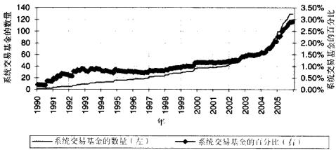  
图2-1自称为“系统交易”的对冲基金的绝对数量和相对比例源：Aldidge(2009b)。

2000年，总部位于纽约的国际证券交易所（ISE）建立了第一个完全电子化的美国期权交易所。截止到2008年中期，已有七个交易所提供完全电子化，或是电子化与交易大厅相结合的期权交易平台，这七个交易所分别是：国际证券交易所、芝加哥期权交易所（CBOE）、波士顿期权交易所（BOX）、美国证券交易所、纽约证券交易所高增长板市场期权（NYSE'sArca Options）和纳斯达克期权市场（NOM）。

根据总部设立在波士顿的Aite集团的估计，如图2-2所示，电子交易的交易量已经从2001年的 $2 5 \%$ 迅速增长到2008年的 $8 5 \%$ 。预估至2010年，近 $100 \%$ 的股票交易都将通过电子网络进行。

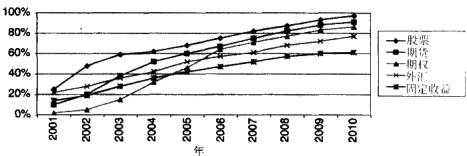  
图2-2不同类型的资产采用电子交易的比例  
资料来源：Aite集团。

技术进步还显著地提升了每日成交量。1923年，纽约证券交易所每日股票交易量为100万股，到2003年，纽约交易所每日的交易量超过了10亿股，增长幅度达到1000倍。

科技进步还把金融服务行业从盛行于20世纪的僵化的层级结构改变成了20世纪90年代后期通行的扁平非集中式的网络结构。传统的20世纪金融服务网络体系如图2-3所示。这个体系的中心是交易所，对于外汇交易，则是内部交易商网络（inter-dealernetwork）。交易所是集中进行证券交易和清算的地方，在非集中的外汇交易市场，由自营商间经纪商（inter-dealerbroker）组成的内部交易商网络起着和交易所相类似的作用，这个组织保证市场的流动性，并和其他同僚及经纪自营商进行交易。

经纪自营商有双重职责—他们一方面为自己的账户交易（通常叫做自营交易），另一方面为其客户进行交易和清算。经纪自营商利用自营商间经纪商在其他经纪自营商的交易网络里迅速找到交易某种证券的最优价格。有时，尤其是对于流动性差的金融产品，如定制的期权产品等，经纪自营商也和其他经纪自营商直接交易。经纪自营商的交易客户包括投资银行客户（机构客户）、大公司（公司客户）、中型公司（商业客户）和高净值人士(high-net-worth individual，HNW）。投资机构也可以相应地成为为其他投资者，比如小型投资机构和小账户的个人（散户），提供交易接人服务的经纪自营商。

直到20世纪90年代末期，经纪自营商都在金融系统中扮演着最核心的角色，也赚取着行业中的最高利润，他们控制着客户接入交易所的权利，并由此获得丰厚的报酬。不同层次的经纪商服务于不同层次的投资者。顶级的经纪机构寻求大单交易，它们服务的是机构投资者和资本雄厚的专业投资团队；零售经纪商为个人投资者提供服务，并且收取较高的佣金。这种层级结构从20世纪20年代一直延续到90年代，直至互联网的发展把这种传统秩序连根拔起。当时，大量普通的在线经纪自营商如雨后春笋般涌现，他们为客户提供直连交易所的服务，这使得经纪架构迅速地变得扁平起来。

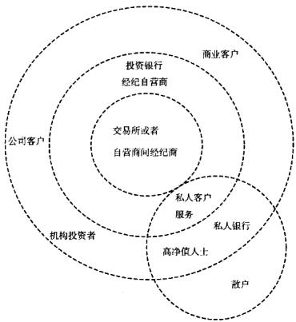  
图2-320世纪资本市场的结构

交易商通过把客户的指令单集中起来形成大笔的交易委托单。为了保证快速执行客户的指令，交易商会浏览他的清单，也就是其手中的证券存货数量，交易商会根据他们对未来的需求以及市场情况的预期来决定是扩大还是缩小其手中持有的存货数量。交易商面临持有存货的风险，并且要对像

100000美元这种小型委托单提供交易便利，作为补偿，交易商向其客户报出的买卖价差会大于交易商间经纪商所报出的买卖价差。由于交易量的要求，交易商的客户通常不能直接与交易所或者交易商间经纪商进行交易。同样是因为交易量的关系，散户一般情况下既不能直接接触到交易商间经纪商，也接触不到交易商。

今天，金融市场正变得越来越分散化。除了老牌的交易所如纽约证券交易所和美国证券交易所，越来越多参与竞争的交易所迅速成长起来，它们为市场提供了更多的流动性。

在计算机技术的推动下，交易网络越来越扁平化。交易所和交易商间经纪商逐渐让位给电子通信网络（ECNs），也叫做“流动资金池”（liquiditypool)。电子通信网络利用复杂的算法迅速的传递交易指令并将买方和卖方优化配对。在暗流动资金池（darkliquiditypool）中，交易者的身份和指令都是匿名的。

Island是最大的电子通信网络之一，2002年，它的交易量大约占纳斯达克总交易量的 $1 0 \%$ 。在Island，所有的市场参与者都可以提交匿名限价指令。Biais、Bisiere和Spatt（2003）发现纳斯达克的流动性越高，Island的流动性也就越高，但是反之却并不一定成立。LLC自动交易平台（ATD）是暗资金池（darkpool）的一个例子。池中的客户无法看见彼此的身份或是他人下单的市场深度，这保证了匿名交易的流动性。ATD算法还进一步监视市场中的破坏性行为，比如操纵买卖价差等。这种行为一旦被查出，其责任人将面临相应的罚款。

图2-4显示了一个包含电子通信网络和暗资金池的典型“分布式”现代交易网络结构。连接网络中参与者的直线表示各种可能的交易路径。一般来说，只有交易所、电子通信网络、暗资金池、经纪自营商和零售经纪商有对交易进行清算和结算的权利，不过某些机构客户，比如芝加哥的Citadel，最近刚刚获得了投资银行的经纪自营业务资格，他们现在可以对所有的交易自行清算。

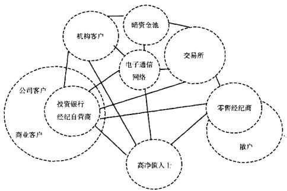  
图2-4当代的交易网络

# 交易方法的演变

在交易员中最早流行起来的分析方法之一是技术分析法。技术分析师致力于寻找证券价格走势中重复出现的一些模式。很多技术分析方法涉及度量现价与价格移动平均线之间的关系，或者是现价与移动平均线组合以及价格标准差之间的关系。例如，一种叫做指数平滑异同移动平均线（MACD）的分析方法使用三条指数移动平均线来产生交易信号。更资深的技术分析师可能会观察证券价格与市场信息之间的相互关系，或者是观察更为广泛的市场环境以对未来价格走势获取一个更为全面的看法。

技术分析方法在20世纪上半叶最为盛行，那时交易技术还处在电报和气压输送管（pneumatic-tube）的年代，相比于今天，当时主要证券的交易复杂度要小得多。由于信息传输速度有限，股票的换手量受到限制，信息反映到价格中间的速度也较慢，这使得图表能够显示出证券的潜在供需关系。前一日的交易情况会出现在第二天早上的报纸上，通常这些公开发布的信息足以让技术分析师成功地预测未来的价格走势。在第二次世界大战之后，交易技术有了长足的进步，此时技术分析变成了一种自我实现的预言方法。

例如，如果有足够多的人相信某个金融工具出现“头肩顶”形态时，接下来面临一个大的抛压，那么这个理论的信奉者就会在头肩顶形态形成后挂出卖单，这样就使得之前的预测真的变成了现实。之后，机构投资者开始使用强大的计算机技术对技术图形进行建模，并且在肉眼尚不能明显识别这些形态的时候就入场交易。目前，低频环境下（比如对日线和周线）的技术分析已经被边缘化到用于分析那些最小的、流动性最低的证券中，这些证券的交易频率非常低，通常是每日甚至每周只交易一两次。虽然如此，一些研究人员发现技术分析还是有可取之处的：Brock、Lakonishok和LeBaron（1992）发现了移动平均线可以预测未来的超额收益。Aldridge（ $2 0 0 9 \mathrm { a }$ ）发现移动平均线、随机指标和相对强弱指标（RSI）对于日内每小时数据能够产生有利可图的交易信号。

在某种程度上，技术分析是现代微结构理论的先驱。尽管市场微观结构理论适用于更高的交易频率，并且比技术分析要复杂得多，但是无论是市场微观结构理论还是技术分析，其目的都是从过去的价格运动中推导出市场的供需状况。大量的现代高频交易策略都是用最近一分钟的价格运动情况来识别潜在的市场信息。虽然如此，并没有多少现成的技术图形可以用于高频交易。相反，高频交易模型常常是概率性地进行计量经济学推断，并且时常糅合一部分基本面分析。

基本面分析源于股票，交易员们注意到未来的现金流如股息，会影响其市场价格。把预期的现金流折现就可以得到股票现在的公允市场价值。格雷厄姆和多德（1934）是最早提出这种方法的人，并且这种方法现在依旧盛行。数年来，“基本面分析”这个名词的应用扩展到根据预期经济变量为没有明确现金流的证券进行定价。例如，现在说用基本面分析的方法确定汇率，意思是指用宏观经济学的理论得到汇率的均衡值。

基本面分析在20世纪大部分时间内都有所发展。今天，基本面分析指的是预期价格会运动到按照供需关系以及基本经济理论所预测的水平。在股票分析中，发展出很多微观经济学模型。在大多数情况下，股票价格仍然是用未来现金流的现值来确定的。在外汇交易中，宏观经济学模型最常用，这些模型利用各国的通货膨胀率、贸易平衡状况等信息来确定预期外汇汇率。衍生品基本面交易依据的是一些高级的计量经济学模型，这些模型包含了衍生品基础证券价格运动的统计特征。商品的基本面交易则是要分析供给面和需求面的情况。

基本面分析中的很多因素都可应用于高频交易模型，并且和市场微观结构理论一起构成了一种交易模式。比如，事件套利就是利用证券价格对新的基本面信息的反映而形成的价格趋势进行交易。新闻事件发布的日期和时间一般都是事先知道的，新闻的具体内容会在新闻发布时公布。在高频事件套利交易中，基本面分析可以用来预测即将公布的经济指标的值，并以此来对高频交易进行进一步调整。

在20世纪的大部分时间内，技术分析和基本面分析都在同台共舞。之后，大量拥有物理学和统计学高级学位的新型交易员涌人华尔街，这些勇士们有一个绰号叫做宽客（quant），他们开发出了许多与传统的基本分析和技术分析几乎毫无关联的先进的数学模型。新的数量模型孕育了“量化交易”，这种数学模型驱动的交易方式从根本上与已有的基本面和技术分析交易方式分道扬镳了。统计套利（stat-arb）策略成了金钱帝国里的一颗新星。随着统计套利大发其财的故事传播开来，统计套利技术也变得非常流行，而不断进行技术创新的军备竞赛也接踵而来，那些跑在最前面的交易者往往能获得市场上的最高利润。

速度的竞争是最明显的竞争。谁能运作最快的数量模型，谁就能最先找出并利用市场无效率的瞬间，从而赚取最高利润。为了提高交易速度，交易者开始利用高速计算机来产生和执行交易指令。随着技术的进步，交易所逐渐适应了这种技术驱动的交易文化，并为交易提供方便的对接服务。由于计算机交易都是由计算机系统处理实时数据，做出交易决策并执行买卖指令，因此，计算机交易也被称为“系统交易”。

20世纪90年代，随着计算机科技的发展以及交易所采用了新的技术，高频交易也随之发展起来。从最开始的初步指令处理到今天拥有现代科技水平包罗万象的交易系统，高频交易已经演变成为一个规模数十亿美元的产业。

为了确保系统交易在执行中的最优化，交易算法模拟了传统交易员所使用的交易执行策略。目前，“算法交易”（algorithmictrading）一般指系统执行交易指令的过程，也就是说，在交易系统的其他部分或是投资经理已经做出买卖决策之后，算法交易优化买卖指令的执行方式。算法交易可以决定在给定市场环境下如何处理交易指令：是主动的执行（以接近市价下单）还是被动的执行（在远离市价之处挂出限价指令单），是一次性交易还是分割成几个小的交易单。正如前面提到的，算法交易一般不涉及投资组合的资产配置，何时买卖以及买卖哪种证券则是一个外生的问题。

高频交易成为这样一种交易方法：它利用计算机系统处理数据和进行量化分析，高速做出交易决策，并且隔夜持仓。

在过去的数十年间，计算机技术的革新为全自动化的高频交易铺平了道路，而交易柜台盈利能力的显著提高，为科技的进一步发展提供了动能。交易柜台得以通过利用交易算法及其他先进的计算机技术代替薪酬高昂的交易员来节省开支。另外，机器在交易的执行速度、精准性及果断性上比传统的交易员更胜一筹，这也是各大银行机构决定由传统的交易模式转变为系统化操作的一个重要原因。隔夜持仓的大幅下降迅速降低了隔夜持仓成本，在危机时期的信贷紧缩或高利率环境下，这个问题会显得尤为突出。

买方投资者的需求是银行开发并引人高频交易的另一个原因。由于大量的资金追求更短的锁定期以及每日向投资者披露信息，使得机构投资者也参与到高频交易中来。无论是机构投资者还是散户都发现了日内的量化交易投资产品和传统的买人并持有策略没有明显的相关关系，因此，日内量化投资能给他们的投资组合增加净收益，或者说能为其增加阿尔法。

随着计算机技术的进步及成本的大幅降低，高频交易无疑将在金融市场中扮演更积极的角色。虽然如此，我们得特别注意，高频交易这个概念与电子交易（electronic trading）、算法交易和系统化交易是有所不同的。图2-5解析了高频交易、算法或电子交易及传统长期投资策略的大致区别。

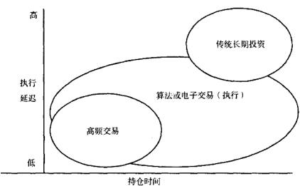  
图2-5高频交易与算法或电子交易以及传统长期投资的区别

电子交易指的是通过电子方式传送交易指令，是一种不同于电话、信件和人工的指令传递方式。由于现今的金融市场中大部分指令都是通过计算机网络下达的，电子交易这个名词也迅速变得没有什么实际意义了。

算法交易比电子交易更为复杂，它既可以指建立在各种算法之上的指令执行过程，也可以指高频的资产配置决策。当买卖决策在另一个地方产生后，执行算法（executionalgorithms）承担优化交易指令执行过程的任务。执行算法决定将指令传送到交易所的最佳方式，如果-个指令不是要求立即执行，执行算法要找出最优的执行时间点，并且，执行算法还要决定拆分执行一个交易指令时一系列分笔交易的最优交易量。另外一些算法生成决定资产配置及对某种证券开平仓的高频交易信号。例如，如果执行算法收到一个买人 $\textbf { 1 0 0 0 0 0 0 }$ 股IBM股票的指令，算法可决定将其拆成每次100股的很多小单分开交易，以免大笔买人引起股价的瞬间飙涨。虽然如此，但传递给执行算法的指令本身既可以是高频的，也可以是非高频的。另一方面，用于生成高频交易信号的算法负责做出买人 $1 \ 0 0 0 \ 0 0 0$ 股IBM股票的决策。这种高频信号会传送给执行算法，执行算法再决定执行交易指令的最优时间和最佳路径。

成功实施高频交易同时需要两种算法：产生高频交易信号的算法和优化交易执行过程的算法。用于产生高频交易信号的算法往往比用于优化执行过程的算法复杂得多。这本书的大部分内容都是针对高频信号产生算法的。第18章将详细讨论常见的交易执行优化算法。

TRADE集团的调查显示了交易者从事算法执行的目的。图2-6全方位展示了TRADE集团的调查结果。根据TRADE集团的2009年度算法交易调研，在交易中使用算法的买方交易员比例从2008年的 $9 \%$ 上升到2009年的$26 \%$ ，有超过 $40 \%$ 的委托单流是用算法或至少是部分使用算法管理的。至于为什么采用算法交易，除了前文中提到的盈利能力以及交易的精确性等因素外，买方经理还提到，算法交易可以使他们匿名地执行交易也是一个重要原因。匿名交易使得大的机构投资者能够隐藏他们的交易意图，从而降低了其他市场参与者从中破坏的可能性，并提高了整体的交易利润。

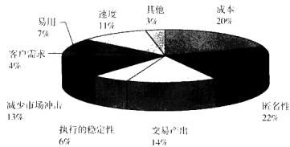  
图2-6使用算法交易的原因  
资料来源：TRADE年度算法交易调研。

系统交易是指由计算机驱动的交易，其持仓时间可能是个月、一天或一分钟，因此系统交易可能是也可能不是高频交易。一个系统交易的例子是某个计算机程序每天、每周甚至每个月运行一次，程序接收每日的收盘价数据，并输出资产配置信号，下达买卖指令。这样的系统便不是高频交易系统。

真正的高频交易系统需要在交易中做出全方位的决策，从找出价格被低估或高估的证券到优化资产配置再到交易指令执行的最优化。高频交易的与众不同之处是持仓时间短暂，一般为一天或更短，通常不隔夜持仓。由于高频交易迅速执行的特点，大多数高频交易系统是完全系统化的，并且可以看成是系统交易和算法交易的实际例子。然而，并非所有的系统化交易和算法交易平台都

是高频的。

对于一种证券，能够通过算法执行交易指令是进行高频交易的前提条件。正如第4章讨论的，有一些市场现在还不适合高频交易，因为这些市场的大部分交易都是场外交易（overthecounter，OTC)。Aite集团的一项研究表明，股票是使用算法执行最多的金融产品，预计到2010年，超过 $50 \%$ 的股票交易量都将通过算法执行交易。如图2-7所示，紧随股票之后的是期货。但在外汇、期权及固定收益产品中，算法执行的应用就没有那么广泛了。图2-7还显示，固定收益类证券中算法执行应用上的滞后是由于这些证券电子交易发展缓慢造成的，很多固定收益产品是在场外市场交易的，因此难以同步进行。

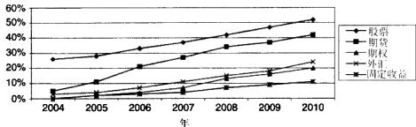  
图2-7不同类型的资产采用算法执行的比例

和长期的买入持有策略相比，高频交易系统收益数据稀缺，因此很少有人致力于高频交易收益的研究，从一些蛛丝马迹上来看，大部分计算机驱动的交易策略都是高频策略。系统化交易和算法交易天然地适合于那些要求执行速度快、精度高并能对大量分笔数据做出高频分析的交易模式。另外，从几个关键指标来看，系统交易的表现都优于人工交易。比如Aldridge（2009b）发现，用詹森阿尔法值（Jensen，1968）来度量投资收益时，系统交易基金的表现恒定地优于传统交易模式基金的表现（詹森阿尔法值是一种用来度量交易员交易水平的指标，它扣除了交易收益中受到大市影响的部分)。Aldridge（2009b）还发现，在危机时期，系统交易基金的收益要超出非系统交易的基金。这个现象可以归因于系统化交易不受情绪影响，而交易员却无法摆脱情绪的困扰。

# 高频交易综览

由领先的对冲基金信息发布机构FINalteratves.com公布的技术与高频交易研究调查报告结果显示：在2009年6月间，参与调查研究的201个资金管理人中， $90 \%$ 的受访者认为高频交易前景明朗，相比之下，仅半数受访者持续看好投资管理的行业前景；另外，仅仅有 $4 2 \%$ 的受访者对美国经济保持乐观态度。

这些受访者认为高频交易具有以下关键特点：

（1）处理分笔交易数据；  
（2）高资金周转率；  
（3）日内开平仓；  
(4）算法交易。

处理分笔交易数据和高资金周转率基本上定义了什么是高频交易。在高频交易中，报价流的一些微小变化常常会触发大量的开平仓信号。“高频”二字本身就显示出高速建仓和平仓的特点。在FINalteratve的调查中， $8 6 \%$ 的受访者认为“高频交易”这个概念是指持仓时间等于或小于一个交易日（见图3-1)。

高频交易中当日开平仓的特点可以大大地降低隔夜持仓成本。隔夜持仓成本是指隔夜持有保证金头寸的成本，通常基于北美交易时段结束后账户中的保证金头寸进行计算。在信贷收缩或者高利率的时期，隔夜成本可因此而显著降

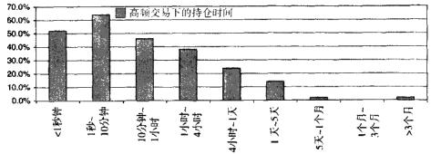  
图3-12009年7月FINalterative技术和交易调查问卷中，对于“持仓多久称得上是高频交易”这个问题给出的答案

低到交易的最低水平。

在收盘的时候平掉所有头寸，还可以降低由于被动隔夜持仓所带来的风险暴露，而风险暴露的降低会在相当大的程度上增加风险调整收益。

最后，“算法交易”是高频交易平台不可或缺的组成部分。人类的大脑无法计算间隔仅为毫秒量级的分笔数据，无法如此快速地处理市场信息，也不可能一直保持客观理智的判断。相反，算法交易可以快速有效、不带任何感情色彩地做出交易决策，因此算法交易是高频交易必需的一个环节。

# 和传统交易的比较

高频交易是一种较新的投资策略，因此，对它的困惑及疑问常常和它与传统交易的区别和联系有关，这一部分将就这些疑问给出解答。

# 技术派，基本派，还是量化派？

正如第2章所讨论的，技术交易以技术分析为基础，其目的是找出价格变动的固有规律。通过对过去价格运行轨迹的研究，技术分析可能会判断出现有价格是高估还是低估。技术交易将买进由技术分析判定价格过低的证券，或卖出判定其价格过高的证券。技术分析可用于任何频率的交易，当然也可以完美地应用于高频交易模型之中。

基本面交易以基本分析为基础。在经济均衡理论下，给定相应的市场信息，通过基本分析推断出均衡价格。正如技术交易，基本面投资买进由基本分析判定价格低于基本价值的证券或卖出价格高于基本价值的证券。和技术交易一样，基本分析也可用下任何频率的交易。尽管在超高频环境下，由于价格形成机制或市场微观结构的影响，价格可能呈现出一些异常变化。

最后，量化交易指的是采用一些科学的原则来进行资产配置决策。这些原则可以是基本面的、技术面的或单纯的统计关系的。量化分析相对于技术分析和基本分析的最大的区别在于量化分析方法极少受主观因素的影响。例如，基本面分析师在给公司治理进行排名时可能会掺杂自己的主观因素，而不同的技术分析师也会对图表做出不同的解读。只要有充分的数据支持，量化分析便可以应用到高频交易上。

量化分析最适用于高频交易的原因很简单：高频的交易指令没有给交易员留下做后续主观决策，并把决策输入交易系统的时间。高频交易无法与主观的交易行为兼容，除此之外，不论是基于基本面的，还是基于技术面的量化分析，都可以在高频交易系统下运作。

算法交易、系统化交易、电子交易，还是低延迟交易？

“高频交易”这个名词常常与“算法交易”，“系统化交易”，“电子交易”和“低延迟交易”等概念产生混淆。

高频交易是指快速地重新分配或者周转交易资金。为了实现这种重新分配，大多数的高频交易系统都是算法交易系统，即利用复杂的计算机算法来分析报价、做出交易决策并且优化交易执行过程。所有的算法交易都要通过电子系统来完成，所以算法交易自然是电子交易的一种。

虽然所有的算法交易都是电子交易，反之却不尽然。很多电子交易系统仅仅是用于传递交易指令而已，这些指令不一定都是算法交易产生的。同样的，尽管绝大多数高频交易都是算法交易，但很多算法却不能算是“高频”的。

“低延迟交易”是另一个容易和高频交易混淆的概念。实际上，“低延迟”指的是交易指令的执行速度，这个交易指令可能是也可能不是由高频交易系统发出的。“低延迟交易”是指迅速传递并执行交易指令的能力，和持仓时间长短无关。而高频交易是指资本的迅速周转，有可能需要低延迟的执行能力。当低延迟交易的快速执行特性被用来对不同交易所同一证券的瞬时价差进行套利

表1-18工件零点偏移值的系统变量  

<table><tr><td>变量号</td><td>功能</td><td>变量号</td><td>功 能</td></tr><tr><td>#5201</td><td>第1轴外部工件零点偏移值</td><td>#5301</td><td>第！轴G58工件零点偏移 </td></tr><tr><td>:</td><td>:</td><td>:</td><td>:</td></tr><tr><td>#5204</td><td>第4轴外部工件零点偏移值</td><td>5304</td><td>第4轴G58工件零点偏移值</td></tr><tr><td>#5221</td><td>第1轴G54工件零点偏移值</td><td>#5321</td><td>第1轴G59工件零点偏移值</td></tr><tr><td>:</td><td>:</td><td>:</td><td>:</td></tr><tr><td>#5224</td><td>第4轴G54工件零点偏移值</td><td>5324</td><td>第4轴G59工件零点偏移值</td></tr><tr><td>5241</td><td>第1轴G55工件零点偏移值</td><td>7001</td><td>第1轴工件零点偏移值（C54.1 P1)</td></tr><tr><td>:</td><td>:</td><td>:</td><td>:</td></tr><tr><td>#5244</td><td>第4轴G55工件零点偏移值</td><td>#7004</td><td>第4轴工件零点偏移值（G54.1 P1）</td></tr><tr><td>5261</td><td>第1轴C56工件零点偏移值</td><td>w7021</td><td>第1轴工件零点偏移值(C54.1 P2)</td></tr><tr><td>:</td><td>:</td><td>: #7024</td><td>:</td></tr><tr><td>#5264</td><td>第4轴C56工件零点偏移值</td><td></td><td>第4轴工件零点偏移值(C54.1 P2)</td></tr><tr><td>5281</td><td>第1轴C57工件零点偏移值</td><td>: #7941</td><td>:</td></tr><tr><td>:</td><td>:</td><td>:</td><td>第1轴工件零点偏移值（G54.1 P48）</td></tr><tr><td>#5284</td><td>第4轴G57工件零点偏移值</td><td>#7944</td><td>: 第4轴工件零点偏移值（G54.1 P48）</td></tr></table>

表1-19允许使用的变量  

<table><tr><td rowspan=1 colspan=1>轴</td><td rowspan=1 colspan=1>功能</td><td rowspan=1 colspan=1>变</td><td rowspan=1 colspan=1></td><td rowspan=1 colspan=3>轴</td><td rowspan=1 colspan=1>功能</td><td rowspan=1 colspan=1>变</td><td rowspan=1 colspan=1></td></tr><tr><td rowspan=7 colspan=1>第一轴</td><td rowspan=1 colspan=1>外部工件零点偏移</td><td rowspan=1 colspan=1>82500</td><td rowspan=1 colspan=1>#5201</td><td rowspan=1 colspan=3></td><td rowspan=1 colspan=1>外部工件零点偏移</td><td rowspan=1 colspan=1>#2700</td><td rowspan=1 colspan=1>5203</td></tr><tr><td rowspan=1 colspan=1>G54工件零点偏移</td><td rowspan=1 colspan=1>#2501</td><td rowspan=1 colspan=1>#5221</td><td></td><td></td><td></td><td rowspan=1 colspan=1>G54T.件零点偏移</td><td rowspan=1 colspan=1>2701</td><td rowspan=1 colspan=1>#5223</td></tr><tr><td rowspan=1 colspan=1>C55 工件零点偏移</td><td rowspan=1 colspan=1>#2502</td><td rowspan=1 colspan=1>#5241</td><td></td><td></td><td></td><td rowspan=1 colspan=1>G55工件零点偏移</td><td rowspan=1 colspan=1>#2702</td><td rowspan=1 colspan=1>#5243</td></tr><tr><td rowspan=1 colspan=1>C56工件零点偏移</td><td rowspan=1 colspan=1>#2503</td><td rowspan=1 colspan=1>#5261</td><td></td><td></td><td></td><td rowspan=1 colspan=1>G56工件零点偏移</td><td rowspan=1 colspan=1>¥2703</td><td rowspan=1 colspan=1>#5263</td></tr><tr><td rowspan=1 colspan=1>G57工件零点偏移</td><td rowspan=1 colspan=1>42504</td><td rowspan=1 colspan=1>#5281</td><td></td><td></td><td></td><td rowspan=1 colspan=1>G57工件零点偏移</td><td rowspan=1 colspan=1>#2704</td><td rowspan=1 colspan=1>#5283</td></tr><tr><td rowspan=1 colspan=1>G58工件零点偏移</td><td rowspan=1 colspan=1>#2505</td><td rowspan=1 colspan=1>#5301</td><td></td><td></td><td></td><td rowspan=1 colspan=1>C58工件零点偏移</td><td rowspan=1 colspan=1>#2705</td><td rowspan=1 colspan=1>#5303</td></tr><tr><td rowspan=1 colspan=1>C59工件零点偏移</td><td rowspan=1 colspan=1>#2506</td><td rowspan=1 colspan=1>#5321</td><td rowspan=1 colspan=2></td><td rowspan=1 colspan=2></td><td rowspan=1 colspan=1></td><td rowspan=1 colspan=2>C59工件零点偏移</td></tr><tr><td rowspan=7 colspan=1>第二二轴</td><td rowspan=1 colspan=1>外部工件零点偏移</td><td rowspan=1 colspan=1>#2600</td><td rowspan=1 colspan=1>#5202</td><td rowspan=1 colspan=3></td><td rowspan=1 colspan=1>外部工件零点偏移</td><td rowspan=1 colspan=1>#2800</td><td rowspan=1 colspan=1>#5204</td></tr><tr><td rowspan=1 colspan=1>G54工件零点偏移</td><td rowspan=1 colspan=1>#2601</td><td rowspan=1 colspan=1>#5222</td><td></td><td></td><td></td><td rowspan=1 colspan=1>G54工件零点偏移</td><td rowspan=1 colspan=1>#2801</td><td rowspan=1 colspan=1>#5224</td></tr><tr><td rowspan=1 colspan=1>G55工件零点偏移</td><td rowspan=1 colspan=1>#2602</td><td rowspan=1 colspan=1>#5242</td><td></td><td></td><td></td><td rowspan=1 colspan=1>G55 工件零点偏移</td><td rowspan=1 colspan=1>#2802</td><td rowspan=1 colspan=1>#5244</td></tr><tr><td rowspan=1 colspan=1>C56工件零点编移</td><td rowspan=1 colspan=1>#2603</td><td rowspan=1 colspan=1>#5262</td><td></td><td></td><td></td><td rowspan=1 colspan=1>G56工件零点偏移</td><td rowspan=1 colspan=1>#2803</td><td rowspan=1 colspan=1>#5264</td></tr><tr><td rowspan=1 colspan=1>G57工件零点偏移</td><td rowspan=1 colspan=1>#2604</td><td rowspan=1 colspan=1>#5282</td><td></td><td></td><td></td><td rowspan=1 colspan=1>G57工件零点偏移</td><td rowspan=1 colspan=1>#2804</td><td rowspan=1 colspan=1>#5284</td></tr><tr><td rowspan=1 colspan=1>G58工件零点偏移</td><td rowspan=1 colspan=1>#2605</td><td rowspan=1 colspan=1>#5302</td><td></td><td></td><td></td><td rowspan=1 colspan=1>G58工件零点偏移</td><td rowspan=1 colspan=1>#2805</td><td rowspan=1 colspan=1>#5304</td></tr><tr><td rowspan=1 colspan=1>G59工件零点偏移</td><td rowspan=1 colspan=1>#2606</td><td rowspan=1 colspan=1>#5322</td><td rowspan=1 colspan=3></td><td rowspan=1 colspan=1>C59工件零点偏移</td><td rowspan=1 colspan=1>#2806</td><td rowspan=1 colspan=1>#5324</td></tr></table>

# 1.3.3算术和逻辑运算

表1-20列出的运算可以在变量中执行。运算符右边的表达式可包含常量和/，或由函数、运算符组成的变量。表达式中的变量书和可以用常数替换。左边的变量也可以用表达式赋值。

软件高频交易操作中需要使用以下一些软件，这些软件可能是自己开发的，也可能是由外界开发的。

●产生交易信号是高频交易系统的核心功能。系统接受并处理分笔数据、产生资产分配和交易信号，并且记录交易盈亏（P&I）。  
●高频交易操作需要使用金融建模软件来构建新的交易模型，MatLab和 $\mathbf { R }$ []是业界使用得最为广泛的量化建模软件。  
●信息搜集软件能够在国际互联网上搜集各种信息，使人们能够高频率地按照基本信息对资产进行定价。及时地搜集各种传言以及新闻能更好地预测价格的短期走势。汤森路透就有一系列发布计算机可读模式的即时新闻的产品。  
●交易软件中包含“最优执行”交易算法，它通过选择交易时机、探测市场活跃程度、拆分交易委托单等方式获取一个时段内的最优执行价格。位于纽约的MarketFactory就提供一系列的软件工具帮助自动交易商在市场中获取-些额外的优势，他们帮助提高模型精度、增加成交比率、降低交易滑点等，从而增加在市场中的盈利能力。我们将在第18章讨论交易执行的最优化问题。  
●实时的风险管理软件将确保系统的表现和盈亏都在事先设定的界限之内平稳运行，这种软件也常常被称为系统监控软件或者容错软件。  
●移动设备上的高频交易系统监控软件会对运行故障发出警报。  
●实时的第三方研究服务可提供更为领先的信息和预测。

法律、会计及其他专业服务正如金融行业的其他领域一样，高频交易必须确保其所有的操作都符合有关法律及会计准则。因此，有资质的法律和会计服务是开展高频交易必不可少的环节。

# 政府

高频交易和普通交易受同样的法律条文和政府监管约束。因此，高频交易需要遵守基本的交易准则，如禁止内幕交易等。2009年2月曾有人提议通过提高交易费用来对高频交易增加监管，不过这项提议最终没有成功。

# 运作模型

# 概述

奇怪的是，直至目前，仍然很少有文章在应用高频交易系统的最佳实践方面进行论述。本章将对高频交易的各种事项提供一个概述，其中包括如何对系统开发进行规划，以及开发和实施一个盈利的交易系统所需的资金等一系列信息。

如图3-2所示高频交易的全部流程主要由三部分组成：

●基于当前市场环境对短期价格走势进行预测的高度量化的计量经济学模型。●快速执行复杂计量经济学模型所需的先进计算机系统。●在精确的风险监控和成本控制框架之下运作的投资资金。

传统投资方式和高频交易的主要区别在于其开仓和平仓的频率加快了，这使得高频交易能够从证券价格的微小偏离中获利。在一日之内这些小的盈利不断累加，到当日收盘时，所获得利润也就相当可观了。

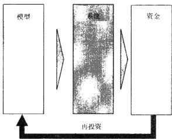  
图3-2高频交易开发周期概览

经营开发一个高频交易业务的方式，与传统的金融机构的运作方式大相径庭。首先，设计一个全新的高频交易策略的成本非常高，而维持和监控已经完成的高频交易策略的成本却接近于零。相反，对于传统的交易模式，从一个有经验的业绩显赫的高级交易员管理一个交易席位并且训练有潜质的新人员开始，直到这些新手最终替代他们的前辈这一过程中，固定成本一直都存在。

图3-3显示了成功运行传统交易系统和高频交易系统所需的成本曲线图。传统交易的成本基本上不会随着时间的推移而改变。除非交易员紧缺，需要培训新的交易员，传统的交易席位的人力成本是保持不变的。但是开发一个计算机交易系统，需要在期初投人大量的人力和时间。一个成功的交易系统平均需要18个月来完成，随着这种交易系统的投人使用，成本支出却越来越小，最后只需要一个专业的系统工程师和一个监控管理员就可以了。无论是系统工程师还是监控管理员都可以同时管理几个交易系统，如此平摊下来，维护成本基本上接近于零。

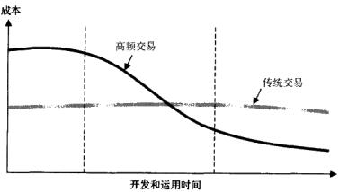  
图3-3高频交易和传统交易的经济效益比较

# 模型开发

开发高频交易模型始于开发各种能够反映证券之间相互关系的计量经济学模型。在不同的市场环境下，再把这种关系放在足够长的时间区间内的分笔数据中进行检验，看其预测的准确性。这种对模型进行验证的过程也叫做“回顾测试”（back-testing)。标准的回顾测试要求有至少两年的历史数据。通常的建模过程如图3-4所示。

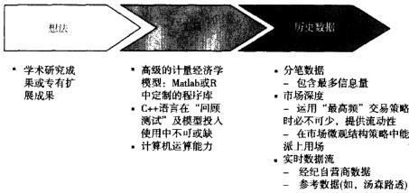  
图3-4高频交易中经济计量学模型开发的过程

# 系统的应用

模型一般使用MatLab之类的计算机语言进行构建，因为这类计算机语言可以提供很多建模的工具，但缺点是可能并不适合在高频下运作。因此一旦一种计量经济学的关系得以确立，这种关系就被编入如 $\mathrm { ~ c ~ } + \mathrm { ~ } +$ 这种高速的计算机语言中。然后，这种模型在模拟交易中试用一段时间保证其按预期运行，并把出现的问题（常称为“bugs”）一一解决。一旦此系统的表现达到预期，系统就开始转到实盘上，在实盘交易中，系统会被密切监控以保证其运行的准确性和收益性。

高频交易的执行系统往往是可以及时发现并对各种市场情况做出反应的复杂系统。图3-5展示了高频交易在真实资本投人下的标准运作过程。

如图3-5所示，一个典型的高频交易系统由以下六个模块组成，它们彼此承接关联并作为一个整体运行。

●A模块接收并保存所关注证券的实时分笔数据。  
●B模块应用经过回顾测试的计量经济学模型来处理A模块中接收到的分笔数据。  
●C模块发出交易指令并记录持仓大小和盈亏值。$\mathbf { D }$ 模块监视实时交易行为，和预先设定的参数对比，并利用观察结果来管理实时交易风险。

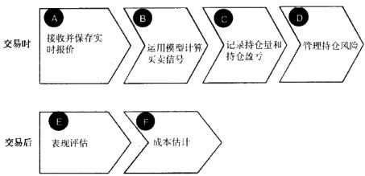  
图3-5典型的高频交易在交易时和交易后的工作流程

●E模块用一系列预先设定的基准对交易表现进行评估。

• $\mathbf { F }$ 模块确保执行交易中所发生的费用在可接受范围之内。

以上六个功能模块每一个都有独立的预警系统，当出现问题或者发生异常状况时，监控人员会收到警报。如市场行为出乎意料、处理市场数据发生紊乱，交易费用超出预期，无法发送指令或者接收信息，等等。

由于执行过程的复杂性，开发这六个模块并非易事。最好的开发方式莫过于采用一种对整个流程进行多轮迭代的开发方法，在此过程中使得系统的执行能力逐渐地扩展。图3-6展示了设计和实现一个高频交易系统的标准流程。

开发实时高频交易系统首先要仔细地计划，计划要将系统的核心功能和开发系统所需的预算都列出来。计划阶段之后，流程进入分析阶段。在这个阶段，将确定该项目第一轮开发所需要实现的目标范围，收集所有利益相关者的反馈，并且高层管理人员需在项目说明书上签字确认。下一阶段是设计阶段，将系统分解成各个较容易管理的模块，列出每一个模块的功能，及具体想达到的效果。在接下来的实施阶段中，这些模块将交付专门的软件工程师团队进行编写，并且按照设计阶段中的说明进行测试。一旦系统的表现达到预期，项目就进人到生产和维护阶段，在此阶段，如果系统和预想中的行为有所偏离，则将其记录在案。当项目最终达到稳定之后，便可以开始新一轮的计划流程，以便增强系统功能或者加人其他一些功能。有关高频交易系统设计和实现的最佳

  
图3-6实施高频交易系统的典型开发过程

实践的一些细节，请参见第16章。

# 交易平台

现今的大部分高频交易系统都是“平台独立”的，也就是说它对于不同的经纪自营商、电子通信网络，甚至不同的交易所都集成了灵活的数据接口。这种独立性是通过FIX语言完成的，此语言是专门为传递金融交易数据而设计的一连串编码。通过FIX，只要指令轻轻一闪，交易指令的传递就可以从一个执行经纪商转到另外一个，或者同时转到另外几个执行经纪商那里。

# 风险管理

完善的风险管理是任何一个高频交易系统成功的关键。程序代码、市场数据或市场环境中看起来微不足道的差错都可能使整个交易系统失灵，并且导致巨额损失。风险管理的目的在于评估潜在的损失并建立一个在系统运行出现差错时减小其损失的机制。我们将在第17章详细论述风险管理这个话题。

# 经济效益

# 杠杆和夏普比率与收益的关系

为了使一项事业能够进行下去，这项事业的收益必须足够支付其运行所需的成本，这个道理对于高频交易也不例外。对于交易成本，收益的一部分（一般是 $80 \%$ ）用于支付给交易的投资者，剩下的部分是资金管理人的“表现费”。此外，资金管理人可能会收取管理费，这项费用用来支付交易的行政管理支出，无论业绩如何，这部分费用占资产总额的比例都是固定的。

即使是成本最低的高频交易，也要支付员工薪水、行政管理费、交易手续费，以及法律费用和维持费用，等等。平均而言，支付给每个员工的工资和福利就可以轻轻松松地达到100000美元，这还不包括可协商的激励性支出。其他的还有办公场地相关的固定支出等。

为了支付这些成本，一个高频交易经理每年应该保持怎样一个最低资本回报率来维持经营呢？答案取决于交易平台的杠杆率。设想有一个拥有五个员工的高频交易公司，把工资和办公支出计算在内，这种规模的公司的固定支出大概是每年600000美元。进一步假设公司收取资产规模 $0 , 5 \%$ 的管理费，并且当资产收益超过前期高点时收取收益的 $20 \%$ 作为激励费。图3-7展示了在不同的杠杆比率下，这家公司保持盈亏平衡所需的最低资产收益状况。如图所示，2000万无杠杆的资金和五名雇员每年最少需要产生 $12 \%$ 的回报来达到盈亏平衡，但相同的资金通过 $500 \%$ 的杠杆作用（借入四倍于投资资产的资金）每年只需产生 $3 \%$ 的回报就可使公司生存下去了。

然而，传统的经验告诉我们，高杠杆意味着高风险。为了评估高杠杆率所带来的风险，我们下面估算公司损失其资本 $2 0 \%$ 以上的可能性。图3-7和图3-8显示，产生重大损失的概率更多地取决于交易策略的夏普比率，而不是对冲基金所用的杠杆比率。

在第5章将详细讨论高频交易策略中的夏普比率，它是所用交易策略的平均年化收益和年化收益标准差的比率。夏普比率越高，出现重大损失的概率就越小。如图3-8所示，一个年夏普比率为0.5，预期获得 $20 \%$ 年收益的无杠杆交易，有 $1 5 \%$ 的可能性损失掉其1/5的资本金。如果把杠杆比率提高9倍，损失掉其1/5资本金的概率就只提高两倍。相应的，一个年夏普比率为2的无杠杆交易损失掉其1/5资本金的概率只有 $0 , 1 \%$ ，而把杠杆率提高到相同比例后，损失掉1/5资本金的概率仅增加至 $1 , 5 \%$ (见图3-9)。

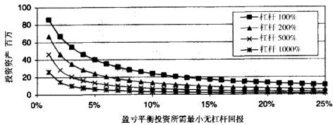  
不同杠杆比率下的盈亏平衡样本点  
图3-7雇用五人高频交易公司的盈亏平衡样本点

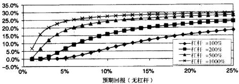  
图3-8夏普比率为0.5时，投资损失大于等于 $20 \%$ 的概率

此外，如图3-8和图3-9所示，夏普比率不变时，出现重大损失的概率实际上是随着预期收益的增加而增加的，这反映出此时收益率分布的分散程度变大了。从投资者的角度而言，一个预期收益率为 $5 \%$ ，夏普比率大于2的交易策略显然比一个预期收益为 $3 5 \%$ ，但是夏普比率较低（如0.5）的交易策略要好得多。

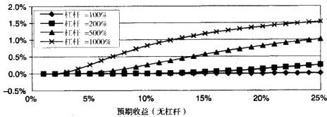  
图3-9夏普比率为 $^ 2$ 时，投资损失大于等于 $20 \%$ 的概率

总之，如果一个高频交易系统使用杠杆，并且有很高的夏普比率，那么它更有可能存活下去并且走向兴旺发达。高杠杆比率提高了其收益足够支付成本的可能性，而高夏普比率则降低了发生重大损失的风险。

# 潜在费用

在高频交易环境之中，理解交易的成本结构显得尤为重要，因为频繁的交易很可能抵消收益。正如第19章所述，除了常规的交易成本外，高频交易还应该算上各种不太引人注意的，或者潜在的开销。有关各种开销的细节，详见第19章。

高频交易系统的最初开发既昂贵又风险巨大，开发交易模型的员工在金融和计量经济学方面的量化研究需要达到博士的水平。此外，编程人员需要有足够的经验来处理系统内部可操作性、计算机安全性和算法效率等一系列复杂问题。

# 高频交易系统的资金

高频交易所用的资金包括股本和杠杆。股本一般由公司创办人的出资、私募资金、投资者资金，或者母公司的资金组成。杠杆即是负债，负债可以是简单的银行贷款或保证金借款或是其他向经纪自营商取得的借款。

# 结论

开发高频交易系统要面临诸多挑战，很多“灰盒”或“黑盒”系统会出现的问题在这里都会遇到。习惯了在深思熟虑后给出交易指令的交易员很可能不适应这种低透明度的、复杂的算法交易模式。一旦演算上出现问题，在高频率的交易下是很难应付的。更不用说处理整个计算机系统安全的问题了！

尽管成功实现高频交易绝非易事，但最终的结果却会证明这一切都物有所值。随着时间的流逝，高频交易系统的部署和执行费用会显著降低，此时留给我们的将是一部稳定工作的利润生产引擎，这部引擎不受感情困扰，不为疾病所累，人类的各种因素都与之无关。对于传统长线投资策略可能毫无用武之地的市场，高频交易会显得极其有效。地缘政治和经济的高度不确定性可能导致传统的投资方式无利可图，而精心设计和执行的高频交易系统，通过利用证券价格的短期变动，却有能力在高度不确定的市场中获得可靠的利润。

# 适合高頻交易的金融市场

很多证券和无数的市场都可以进行高频交易。然而，一些证券市场却比其他的更适合高频交易。本章将讨论高频交易的市场适应性问题。

有两个因素是进行高频交易的先决条件：一是快速开平仓的能力，二是市场具有足够的波动性以保证价格变动能够超出交易成本。不同市场的波动率是高度关联的，这取决于到达市场的宏观经济信息量。快速开平仓的能力义取决于两个因素：市场流动性和电子交易的可获得性。

流动性资产的特征是总是有足够的供给和需求。比如像外汇对这样流动性好的证券一周交易5天，一天交易24小时。流动性差的证券，比如低价股，有可能几天才交易一次。低流动性资产每笔交易之间的价格跳动可能非常大，因此，交易流动性较差的证券比交易流动性好的证券风险高得多。

高频策略主要交易流动性最好的证券。在流动性不好的市场中，一个持仓仅10分钟的策略可能无法及时找到交易对手。相反，无论证券流动性的高低，都适合长期投资者进行交易，Amihud和Mendelson（1986）发现长期投资者最好是持有流动性差的资产。根据他们的研究，这中间的关键因素在于风险/收益比率，长期投资者（不受短期市场不利波动的影响）在流动性差的投资中承受了较高的风险，从而获得了更高的平均收益。

Bervas（2006）的研究认为，具有完美流动性的市场应该是不论交易量多大，都可以获得买人报价和卖出报价的市场。市场的流动性与市场中交易对手的多少，以及交易对手的交易意愿有关。市场参与者的交易意愿又取决于他们的风险厌恶程度和他们对接下来价格走势的看法，以及其他的一些市场信息。

一种比较不同证券流动性的方法是使用各个证券的日均成交量作为度量流动性的指标。在这个指标之下，外汇是流动性最高的市场，其次是新发行的美国国债，再然后是股票、期权、商品和期货。在这些流动性最好的证券之中，仅有即期外汇、股票、期权和期货市场能够进行全自动交易，其他市场还通常采用场外单个合约逐一谈判的模式进行交易，从而降低了交易的速度。表4-1列出了当前不同证券的市场交易量及执行方法。随着高频交易需求的增加，在场外市场发展电子化交易可能会带来可观的利润。图4-1展示了不同证券的最优交易频率，其中最优交易频率是市场流动性的函数。本章接下来的部分将详细讨论在不同证券市场上进行高频交易的有利和不利之处。

表4-1主要证券类别的日均交易量及主要执行方式  

<table><tr><td>市场</td><td>日均交易量（10亿美元）</td><td>主要执行方式</td></tr><tr><td>外汇互换①</td><td>1714.4</td><td>OTC</td></tr><tr><td>即期外汇①</td><td>1004.9</td><td>电子化</td></tr><tr><td>直接远期外汇①</td><td>361.7</td><td>OTC</td></tr><tr><td>美国国债</td><td>570.2</td><td>OTC</td></tr><tr><td>不动产抵押担保债券②</td><td>320.1</td><td>OTC</td></tr><tr><td>联邦机构债券②</td><td>83.0</td><td>OTC</td></tr><tr><td>市政债券②</td><td>25.0</td><td>OTC</td></tr><tr><td>公司债券</td><td>24.3</td><td>OTC</td></tr><tr><td>纽约证券交易所③</td><td>2.6</td><td>电子化</td></tr><tr><td>期权</td><td>1.6</td><td>电子化和OTC</td></tr></table>

$\textcircled{1}$ 全球外汇交易量信息来自国际清算银行对2007年4月的调查报告。

$\textcircled{2}$ 美国债券日交易量信息引自美国证券业及金融市场协会（SIFMA）2007年报告的数据。到2009 年1月，由于金融危机余波的影响，美国国债的日均交易量下降到3 580 亿美元，不动产抵押担保债券交易量上升到3 580亿美元，联邦机构债券下降到750亿美元，市政债券到120 亿美元，公司债券到 120 亿美元。

$\textcircled{3}$ 日均交易量根据2009 年4 月组约证券交易所(NYSE)报告的每日交易量计算而得。

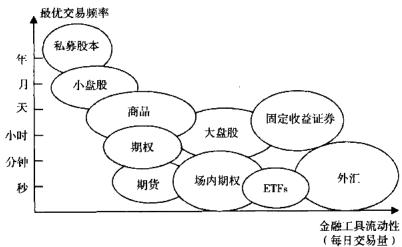  
图4-1根据每种金融T具流动性的不同而得的不同金融工具的最优交易频率

# 金融市场及其对高频交易的适用性

这一部分我们将讨论不同金融市场对高频交易的适用性。就像本章第一部分提到的一样，对于一个合适的市场而言，必须具有足够的流动性并且能够进行电子化交易以方便资金的快速周转。在接下来的小节中，我们将考虑每个市场的三个关键指标：

●可获得的流动性●电子交易的能力●监管因素

# 固定收益市场

固定收益市场包括利率市场和债券市场。利率市场交易短期和长期存单，债券市场交易公开发行的债务。利率产品和债券的相似之处在于它们都向持有者支付固定的或事先约定的收益。除了固定收益的特性相似之外，债券和利率产品是大相径庭的。

利率市场和债券市场都使用现货、期货和互换合约等工具。不论是利率产品还是债券，现货交易都是指即时或“现场”交割并转变所交易资产的所有权。期货交易指在预先指定的日期交割和转换所有权。互换交易是指用合约的方式约定交易双方交换其现金流。利率互换可能指固定利率和浮动利率的互换；债券互换在大多数情况下指在一个交易策略中，投资者卖出一种债券，同时买人另外一种价格相当，但性质不同的债券。

在固定收益市场上，很多投资者关注的是产品的收益而不是产品本身的价格。和长期的投资者一样，利用短期价格变动的高频交易者也可以获利。

利率市场即期利率市场由银行对银行之间的报价组成，也称为“即期利率”，“现金利率”，或“银行间利率”。和其他金融产品一样，银行间利率也分为买人报价和卖出报价。想获得存款的银行报出买人利率，而想要贷款的银行报出卖出利率。

信用利率并不一定是银行间借款时采用的利率。实际的借款利率是报价利率加上一个信用利差，信用利差是借出银行所承担风险的补偿。借出银行所面临的风险取决于拆人银行的信用状况。拆入银行的信誉越低，借出银行所面临的风险就越大，为了补偿风险，借出银行要求的信用利差就越高。

即期利率有固定的到期时间，主要以口或者月为单位。目前的到期时间主要有以下几种：

隔夜：（O/N)  
●明日之后的下一个工作日，称为“明日次日”（tomorrownext)：T/N  
一周：S/W  
●一个月：1M  
两个月：2M  
三个月：3M  
●六个月：6M  
九个月：9M  
一年：1Y

利率期货是一种约定在将来买卖某种标的利率的合约。短期利率期货的流动性比即期利率期货的流动性要好得多。利率期货市场的流动性在利率期货的买卖价差中可以反映出来，平均而言，利率期货的买卖价差仅仅为其标

的即期利率买卖价差的1/10。

利率期货常常基于3个月存款利率。期货实际的买卖报价 $f _ { \mathrm { b d } }$ 和 $f _ { \mathrm { w h } }$ 分别取决于场外市场远期利率的年化买卖报价 $r _ { \mathrm { b i d } }$ 和 $r _ { \mathrm { w k } }$ ，其公式如下：

$$
\begin{array} { r } { f _ { \mathrm { b i d } } = 1 0 0 \left( 1 - \frac { r _ { \mathrm { b i d } } } { 1 0 0 \% } \right) } \\ { f _ { \mathrm { c a k } } = 1 0 0 \left( 1 - \frac { r _ { \mathrm { a k } } } { 1 0 0 \% } \right) } \end{array}
$$

例如，如果远期利率为 $3 \%$ ，则期货价格应该为97.00。期货合约标的的远期利率通常三个月到期。期货合约一般每年有四个标准的交割时间一分别是3月、6月、9月和12月。

与即期利率不同的是，利率期货并不因借款人的信用状况而不同。交易所交易的利率期货并不是显性地在价格中反映风险，而是要求借款人提供反映其信用情况的保证金账户。

互换是最为流行的利率产品，不过大部分互换产品仍然是在场外进行交易的。有一些互换产品正在做成电子交易的形式。例如，芝加哥商业交易所集团（CMEGroup）写出了电子程序用于交易30日联邦基金期货，芝加哥商品交易所（CB0T）5年期、10年期、30年期利率互换期货，30日联邦基金期权，2年期、5年期和10年期中期国债期权以及长期国债期权。虽然如此，如表4-2所示，电子交易的交易量在利率产品中还是很有限的。

表4-22009年6月12日CME电子交易(Globex)中最活跃利率产品的日交易金额，交易金额的计算方法为用CME给出的总合约量乘以平均价格  

<table><tr><td>互换产品</td><td>期货日交易量（千美元）</td></tr><tr><td>欧洲美元存单</td><td>196 689.9</td></tr><tr><td>LIBOR</td><td>163.5</td></tr><tr><td>30年期互换</td><td>934.5</td></tr><tr><td>5年期互换</td><td>1295.2</td></tr><tr><td>10年期互换</td><td>978.6</td></tr><tr><td>30日联邦基金</td><td>2917.7</td></tr></table>

债券市场债券是公开发行的债务。债券发行的主体可以是很多组织，从联邦政府到地方政府再到上市公司都可以发行债券。债券通常是在其生命期内支付利息，并在债券到期日偿还本金。为了满足债券发行者和债券购买者的需要，债券中还可以嵌入各种期权。例如，一个陷人低谷的公司可能会发行一种债券，这种债券嵌入在未来某个时期将债券转变成公司股票的选择权。此类型的债券称为可转换债券，其目的是让潜在投资者在公司破产清算时能够获得优先补偿权，如果公司完全复原，投资者又能把债券转变成股票，从而在长期获得更大的收益。可转换债券除了会吸引风险厌恶型投资者之外，还会吸引那些想在近期持有保守投资组合，在远期持有风险较高的股票投资组合的投资者。

虽然债券市场有诸多好处，但是债券现货大部分在场外市场进行交易，因此并不产生可观测的高频数据流。

债券可以按投资者的需求量身定做，而债券期货合约则是被交易所标准化了的，并且常常是电子交易（见表4-3）。债券期货与利率期货有类似的特点。和利率期货一样，债券期货每年交割四次，分别是3月、6月、9月和12月。具体的结算和交割规则因交易所的不同而有所差异。到期日较近的债券期货比到期日较远的债券期货流动性更好。

利率期货的标的物是3月期存单，债券期货的标的物通常是多年以后到期的政府债券。因此，债券期货受其发行者中央银行的影响相对较小。到期日小于两年的债券称为短期国库券（bills），到期日在2\~10年之间的债券称为“中期国库券”(notes)。

表4-32009 年6 月12日CME 电子交易（Globex）中最活跃债券期货产品的日交易金额，交易金额的计算方法为用CME给出的总合约量乘以平均价格  

<table><tr><td>债券期货产品</td><td>期货日交易量（千美元）</td></tr><tr><td>30年期美国国债期货</td><td>19 486.6</td></tr><tr><td>10年期美国国债期货</td><td>82 876.5</td></tr><tr><td>5年期美国国债期货</td><td>31 103.0</td></tr><tr><td>2年期美国国债期货</td><td>14 187.1</td></tr></table>

# 外汇市场

概括来讲，外汇汇率实际上是用不同货币表示的利率互换。外汇交易始于1971年，当时由于美国的债务问题，金本位体制崩溃。从1971年开始到20世纪80年代末，外汇交易完全在商业银行之间进行，它们利用这种方式对不同货币的存款进行调整。商业银行拥有专属的接人内部交易商网络的权利，这个网络由松散的第三方代理商组成，他们促进指令在不同的商业银行客户之间进行快速的分配。像高盛这样的投资银行不能直接接入内部交易商网络，它们需要通过商业银行才能完成外汇交易。

在20世纪90年代初，投资银行进入了经纪自营商网络。到了90年代末，非银行公司和非美国投资银行也得以直连自营商间交易池了。从2003年开始，对冲基金和自营交易基金也拥有了享有自营商间流动性的权利。目前，外汇即期、远期和互换产品都通过这种分散的、低监管的机制进行交易。仅有外汇期货和某些期权合约在交易所进行交易。

外汇交易的分散化产生了两个关键的后果：一是“唯一价格”不存在，二是交易量度量的缺失。

在某一交易时点不存在唯一价格是交易分散化的直接结果。不同的自营商得到的信息不同，他们对证券的定价也各不相同。没有“唯一价格”意味着在高频交易下蕴藏着巨大的套利机会。分散化的另一个结果是在任意交易时点都无法得到整个市场的外汇交易量。为了检测外汇市场的发展状况，中央银行每三年对金融机构进行一次调查。这项调查由国际清算银行（Bankfor International Settlements，BlS)负责汇总并发布。

BIS估计2007年外汇市场每日交易量大约在3万亿美元左右。这包括了现货市场和远期、期货、期权及互换产品。现货市场每日交易量占整个市场的 $3 3 \%$ ，即大约1万亿美元。根据BIS三年一度的调查报告，现货市场的交易量占整个外汇市场交易量的比重一直呈下滑趋势；1989年，现货市场占外汇交易市场的 $59 \%$ ；到1999年，这·比重下降到 $40 \%$ 。在外汇市场中非现货的2万亿美元交易量之中，互换占了1.7万亿美元。

有些外汇期货和期权是在交易所交易的。表4-4显示了CME交易最频繁的外汇期货品种的每日电子交易的交易量。

表4-42009年6月12日CME电子交易中最活跃外汇产品的日交易金额，交易金额的计算方法为用CME给出的总合约量乘以平均价格  

<table><tr><td>货币</td><td>期货日交易量（千美元）</td><td>迷你期货日交易量（千美元）</td></tr><tr><td>澳元</td><td>5389.8</td><td>N/A</td></tr><tr><td>英镑</td><td>17 575.6</td><td>N/A</td></tr><tr><td>加拿大元</td><td>6 988.1</td><td>N/A</td></tr><tr><td>欧元</td><td>32037.9</td><td>525.3</td></tr><tr><td>日元</td><td>8 371.5</td><td>396.2</td></tr><tr><td>新西兰元</td><td>426.5</td><td>NA</td></tr><tr><td>瑞士法郎</td><td>4180.6</td><td>NA</td></tr></table>

外汇市场有三种目标不同的参与者：高频交易者、长期投资者和企业。高频交易者的目标是抓住日内的小幅价格变动。长期投资者主要是想从全球宏观经济的变化中获利。最后，企业货币管理者则常常是为了对冲跨境资金汇率发生不利变动的风险，例如一家在美国销售商品的加拿大公司可能会购买美元/加元期货看跌期权来对冲其收益的波动风险。这三种类型的市场参与者的指令单流会相当不同，如表4-5所示。

表4-51993 年1月至1999年7月花旗银行观测到的欧元/美元指令单流周数据的描述统计量  

<table><tr><td rowspan="2">指令单流</td><td colspan="7">描述统计量（1993-1999年花旗银行欧元/美元指令单流周数据）</td></tr><tr><td>均值</td><td>最大值</td><td>偏度</td><td></td><td>自相关系数滞后阶数</td><td></td><td></td></tr><tr><td rowspan="3">A：欧元/美元总计</td><td>标准差</td><td>最小值</td><td>峰度0</td><td>1</td><td>2</td><td>4</td><td>8</td></tr><tr><td>-0.043</td><td>3.722</td><td>0.105</td><td>-0.061</td><td>0.027</td><td>0.025</td><td>-0.015</td></tr><tr><td>1.234</td><td>-3.715</td><td>3.204</td><td></td><td></td><td>(0.287)(0.603）(0.643)</td><td>(0.789)</td></tr><tr><td>B：欧元/美元指令单流 客户类型</td><td></td><td></td><td></td><td></td><td></td><td></td><td></td></tr><tr><td>（i）美国公司</td><td>-16.774</td><td></td><td>549.302-0.696</td><td></td><td>-0.037-0.04</td><td>0.028</td><td>-0.028</td></tr><tr><td></td><td>108.685</td><td>-529.055</td><td>9.246</td><td></td><td></td><td>(0.434)(0.608)(0.569)</td><td>(0.562）</td></tr><tr><td>（ii）非美国公司</td><td>-59.784</td><td>634.918</td><td>：-0.005</td><td>0.072</td><td>0.089</td><td>-0.038</td><td>0.103</td></tr><tr><td></td><td></td><td>196.089 -692.419</td><td>3.908</td><td></td><td></td><td>(0.223)(0.124)(0.513)</td><td>(0.091)</td></tr></table>

（续）

<table><tr><td rowspan="2">指令单流</td><td colspan="7">描述统计量（1993-1999年花旗银行欧元/美元指令单流周数据）</td></tr><tr><td>均值</td><td>最大值</td><td>编度</td><td colspan="4">自相关系数滞后阶数</td></tr><tr><td rowspan="3">（ii）美国交易者</td><td>标准差</td><td>最小值</td><td>峰度①</td><td>1</td><td>2</td><td>4</td><td>8</td></tr><tr><td>-4.119</td><td>1710.163</td><td>0.026</td><td>-0.021</td><td>0.024</td><td>0.126</td><td>-0.009</td></tr><tr><td></td><td>346.296-2024.28</td><td>8.337</td><td></td><td></td><td>(0.735)(0.602)(0.101)</td><td>（0.897）</td></tr><tr><td>（iv）非美国交易者</td><td>11.187</td><td>972.106</td><td>0.392</td><td></td><td>-0.098  0.024</td><td>0.015</td><td>0.083</td></tr><tr><td>（v）美国投资者</td><td>183.36</td><td>-629.139</td><td>5.86</td><td></td><td>(0.072)(0.660)</td><td>(0.747)</td><td>（0.140）</td></tr><tr><td rowspan="3"></td><td>19.442</td><td>535.32</td><td>-1.079</td><td></td><td>0.096-0.024</td><td>-0.03</td><td>-0.016</td></tr><tr><td>146.627</td><td>-874.15</td><td>11.226</td><td></td><td></td><td>(0.085)(0.568)(0.536)</td><td>(0.690)</td></tr><tr><td>15.85</td><td>1881.284</td><td>0.931</td><td>0.061</td><td>0.107</td><td>-0.03</td><td>-0.014</td></tr><tr><td>（vi）非美国投资者</td><td>273.406</td><td>-718.895</td><td>9.253</td><td></td><td>(0.182)(0.041)（0.550)</td><td></td><td>(0.825）</td></tr></table>

$\Phi$ 指令单流的偏度度量指令单流是否偏向均值的左侧或者右侧，峰度则标志着非常大或者小的指令单流出现的可能性。有关偏度和峰度统计性质的详细讨论请参见第8 章。

表4-5记录了1993年1月至1999年7月花旗银行观测到的欧元/美元指令单流周数据的描述统计量A：这些统计量汇总了每周花旗银行企业客户，交易客户和投资客户所有的指令单流；B：每周从不同的最终用户那里汇总交易指令。右边的最后四列给出了滞后阶数为i时自相关系数i的值，以及在原假设（ $\dot { \iota } = 0$ ）下的 $p$ 值。这里有关指令单流的描述性统计量摘自Evans和Lyons（2007）的文章，他们把指令单流定义为在花旗银行报价下欧元/美元的总买人量（单位为100万美元）。

# 股票市场

股票市场中高频交易非常盛行，这主要是因为股票市场范围广阔，有更多机会发现市场无效现象；在2006年，仅纽约证券交易所一家就挂牌2764只股票。除了股票，股票市场还有交易所交易基金（ETF）、权证、凭证，甚至是结构性产品，还交易股票期货和期权，以及指数期货和期权等。大多数股票交易所为所有可交易的产品提供了完整的电子交易功能。表4-6记录了Globex中最活跃股票期货产品的日交易金额。

股票市场投资者的目的多种多样。很多股市参与者采用买人并持有的长期投资模式。对于高频交易者而言，短期的交易机会也大量存在。

表4-62009 年6月12日CME 电子交易中最活跃股票期货产品的日交易金额，交易金额的计算方法为用CME给出的总合约量乘以平均价格  

<table><tr><td>股票期货产品</td><td>期货日交易量（千美元）</td><td>迷你期货日交易量（千美元）</td></tr><tr><td>标普500</td><td>2 331.6</td><td>N/A</td></tr><tr><td>纳斯达克100</td><td>172.4</td><td>N/A</td></tr><tr><td>E-mini</td><td>2 300537.2</td><td>N/A</td></tr><tr><td>E-中小盘</td><td>40820.9</td><td>N/A</td></tr><tr><td>E-纳斯达克</td><td>515 511.8</td><td>N/A</td></tr><tr><td>日经指数</td><td>56 570.3</td><td>N/A</td></tr><tr><td>GSCI</td><td>211.0</td><td>N/A</td></tr><tr><td>MSCI EAFE</td><td>24727.7</td><td>2126.9</td></tr></table>

# 商品市场

商品市场同样包括现货、期货和期权。商品现货合约涉及实物（例如1蒲式耳的玉米）交割，因此不适合高频交易。然而，进行电子交易并且流动性很好的期货和期权产品却提供了很多可盈利的交易机会。

和其他类型的期货一样，商品期货是一种约定在未来某个时间买人或卖出标的资产（这里指的是商品）的合约。由于丰收时节的原因，农产品期货的到期日可能是不规则的。商品期货的合约规模一般小于外汇期货或者利率期货。

2009年，CME提供表4-7所示商品的期货和期权电子化交易。表4-7还展示了2009年6月12日CME几种期货的日交易量。

表4-72009年6月12日CME电子交易中商品期货的日交易金额，交易金额的计算方法为用CME给出的总合约量乘以平均价格  

<table><tr><td>商品期货产品</td><td>期货日交易量（千美元）</td><td>迷你期货日交易量（千美元）</td></tr><tr><td>玉米</td><td>121 920.9</td><td>178.0</td></tr><tr><td>小麦</td><td>33 399.5</td><td>N/A</td></tr><tr><td>大豆</td><td>147 168.6</td><td>423.1</td></tr><tr><td>豆柏</td><td>13 089.6</td><td>NA</td></tr><tr><td>豆油</td><td>4 334.1</td><td>N/A</td></tr><tr><td>燕麦</td><td>212.9</td><td>NA</td></tr><tr><td>糙米</td><td>447.0</td><td>N/A</td></tr></table>

（续）

<table><tr><td>商品期货产品</td><td>期货日交易量（千美元）</td><td>迷你期货日交易量（千美元）</td></tr><tr><td>牛奶</td><td>12.9</td><td>N/A</td></tr><tr><td>奶粉</td><td>0.1</td><td>N/A</td></tr><tr><td>现金黄油</td><td>14.3</td><td>NA</td></tr><tr><td>猪腩</td><td>1.6</td><td>N/A</td></tr><tr><td>瘦肉猪</td><td>1385.0</td><td>NA</td></tr><tr><td>活牛</td><td>728.0</td><td>N/A</td></tr><tr><td>饲牛</td><td>179.8</td><td>N/A</td></tr><tr><td>木材</td><td>167.3</td><td>N/A</td></tr><tr><td>乙醇</td><td>40.8</td><td>N/A</td></tr></table>

# 结论

正如前面章节所讲的，电子交易的迅猛发展使大多数证券都可以即时执行交易。高频交易对于电子市场的发展有双重意义：

●由于缺乏竞争，新电子交易市场中的先行者往往能从投机行为中获得显著收益。●从长期来看，所有市场都不是零和游戏。市场参与者的目的多种多样，这保证了所有的参与者都能获得符合自身标准的那一份价值。

# 高频交易策略表现评估

策略表现的评估方法多种多样。在过去的多年中，已经发展出了很多不同的策略表现度量方法。本章将对最为常用的策略评估方法进行总结，并且讨论交易策略的能力以及评估一个策略所需的时间。

# 收益的基本特征

交易策略可能会多种多样，但它们都有一个共同的特点：策略的收益，这让不同的交易策略之间可以互相比较。

然而，收益本身可以按不同的时间长度来衡量，比如每小时、每天、每月、每季度、每年，等等。因此，在对不同交易策略的收益进行比较时，需要保证所采用的收益频率是一致的。

不同策略的收益可以用很多指标来度量，比如平均年度收益。平均收益值仅仅是收益分布均值所在的位置。高平均收益可能比低平均收益更好，但是平均收益本身并不包含收益在均值周围分散程度的信息，而这一点对于很多风险厌恶型投资者而言是至关重要的。

收益的波动率衡量的是收益在平均收益周围的分散程度，一般用收益的标准差来表示。波动率，或者标准差，常常作为风险的代名词。然而，标准差只概括了对均值的平均偏离程度，它还没有考虑那些可能导致多年收益毁于一旦的极端负面风险。

实际工作者常用的一个度量尾部风险的方法是观察历史数据中的最大损失值，这种方法称为最大回撤（maximumdrawdown）法。最大回撤记录的是上.一个全局最大值之后，下一个全局最大值（超出前一个全局最大值）之前出现的最小值所带来的波峰到波谷的最低收益。过去任何一个时刻所记录的全局最大值称为“最高水位线”（high-watermark）。最大回撤就是两个相邻最高水位线之间的最低收益。水位最低的回撤也就是最大回撤。

图5-1用图示的方法说明了最高水位线和最大回撤的概念。该图显示了某—-投资模型的累积收益的变化曲线。在时间 $t _ { A }$ ，收益 $\scriptstyle R _ { A }$ 是图上所记录的最高累积收益，因此也就是 $t _ { \star }$ 时刻的最高水位线。随后，累积收益在时刻 $t _ { B }$ 下降到了 $R _ { \tilde { \theta } }$ ，但是此时最高水位线仍然是 $R _ { \mathcal { A } }$ 。因为 $R _ { \mathfrak { g } }$ 是截至 $t _ { \beta }$ 时刻累积收益的最低值， $R _ { B } \ : - \ : R _ { A }$ ）就成为了时刻 $t _ { B }$ 的最大回撤。

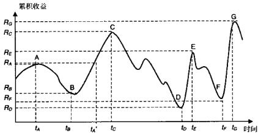  
图5-1最大回撤的计算

接下来，在时刻 $\pmb { t } _ { A } ^ { \prime }$ ，累积收益突破了前期的最高水位线 $R _ { A }$ ，达到了一个新的最高水位线。最高水位线的值继续上升到点C，达到了迄今以来的峰值$R _ { c }$ 。此时最大回撤仍然是 $\left( R _ { B } - R _ { A } \right)$

C点之后，累积收益大幅下跌，跌至新的低点。在任一点X，只要 $R _ { \xi }$ -$R _ { c } < R _ { y } - R _ { A }$ 成立，就可以算出新的最大回撤值。在未达到新的峰值G之前，点C及其对应的累积收益 $R _ { c }$ 仍然是最高水位线。点D对应新的最大回撤 $R _ { p }$ - $R _ { c }$ ），直到图示的时间结束，这个最大回撤值都是有效的。

在预先设定的时间窗口和频率之下，平均收益、波动率和最大回撤是不同交易策略之间相互比较以及观察某个交易策略最主要的指标。除了平均收益、波动率和最大回撤之外，实际工作者有时还使用偏度和峰度来描述收益率的分布特征。与往常一样，偏度描述的是收益率分布相对于均值的位置，正的偏度表示收益在均值右侧居多，而负的偏度则表示大部分收益在均值左侧。峰度则指示收益分布的尾部是否是正态的，高的峰度值意味着存在“厚尾”，即出现极端正值或者负值的概率比正态分布的情形要高。

# 有可比性的比率

尽管平均收益、标准差和最大回撤勾勒出了一幅有关某个交易策略表现的图像，但是仅靠它们还不能对两个或更多策略进行简单的点对比。现在已经有多种表现度量方法试图将均值、方差和尾部风险等整合进一个数字，而后用这个数字来比较不同的交易策略。表5-1总结了最为常用的点度量方法。

表5-1 表现度量指标概要  

<table><tr><td colspan="2">夏普比率 E[r]- r (Sharpe [1966]) SR= ，其中 σ[]</td><td rowspan="2">如果收益服从正态分 布，则此方法是充分的</td></tr><tr><td rowspan="5"></td></tr><tr><td>T</td></tr><tr><td>₁ - E[])2 +. +(r -[])</td></tr><tr><td>r- 1</td></tr><tr><td>高频交易中夏普比率定义为：</td></tr><tr><td></td><td></td></tr><tr><td></td><td></td></tr><tr><td>特雷诺比率 E[r] − Treynor; =</td><td></td></tr><tr><td>(Treynor [1965]) β</td><td>如果收益服从正态分</td></tr><tr><td>B：是交易收益对投资者参考投资组合（例如市场</td><td>：布，并且投资者希望将</td></tr><tr><td>组合）收益的回归系数</td><td></td></tr><tr><td></td><td>在一种交易策略和市场</td></tr><tr><td></td><td>投资组合之间分配持仓，</td></tr><tr><td></td><td>则此方法是充分的</td></tr><tr><td></td><td></td></tr></table>

# 48高频交易

（续）

<table><tr><td>詹森指数</td><td>αi = E[i] − r − βi(n − )</td><td>度量交易收益超出</td></tr><tr><td>(Jensen [1968])</td><td>β是交易收益对投资者参考投资组合（例如市场</td><td>CAPM预测收益的部分。</td></tr><tr><td></td><td>组合）收益的回归系数</td><td>如果收益服从正态分布， 并且投资者希望将在一</td></tr><tr><td></td><td></td><td>种交易策略和市场投资</td></tr><tr><td></td><td></td><td></td></tr><tr><td></td><td></td><td>组合之间分配持仓，则</td></tr><tr><td></td><td></td><td>此方法是充分的，但该</td></tr><tr><td></td><td></td><td>指标会受到交易策略杠</td></tr><tr><td></td><td></td><td>杆率的操纵</td></tr></table>

基于下偏矩（lower partial moments，LPMs）的指标：

证券i的n阶LPM：

$$
L P M _ { n i } ( \tau ) = \frac { 1 } { T } \sum _ { i = 1 } ^ { r } \mathrm { m a x } [ \tau - r _ { u } , 0 ] ^ { n }
$$

其中是最低可接变收益： $_ n$ 是矩的阶数： $\qquad n = 0$ 时为低于目标收益的概率， $n = 1$ 时为预期不足值，$\bar { n } \ = 2$ 且 $\tau = E \left[ r \right]$ 时为半方差

根据Eling和Schuhmacher（2007）的说法，风险厌恶程度高的投资者应当使用高阶的 $_ { n }$ 。LPM仅考虑对最低可接受收益的负偏差，而标准差同时考虑了正偏差和负偏差，因此，LPM被认为是一种比标准差更好的风险度量方法（Sortino和van derMeer[1991]）。最低可接受收益可以是0.无风险利率，或者是平均收益

<table><tr><td></td><td>a=$ E[r] -τ +1</td><td>E[r:]-是平均收益</td></tr><tr><td>Omega（Shadwick</td><td>LPMu(τ)</td><td>超出基准收益的部分</td></tr><tr><td>和Keating [2002],</td><td></td><td></td></tr><tr><td>Kaplan和</td><td></td><td></td></tr><tr><td>Knowles [2004])</td><td></td><td></td></tr><tr><td>Sortino 比率</td><td>Sortino = E[r] −τ (LPM2i(τ))</td><td></td></tr><tr><td>(Sortino 和van</td><td></td><td></td></tr><tr><td>der Meer [1991])</td><td></td><td></td></tr><tr><td>Kappa 3</td><td>E[r]-r</td><td></td></tr><tr><td>(Kaplan 和</td><td>K3:= (LPMx(τ))1</td><td></td></tr><tr><td>Knowles [2004])</td><td></td><td></td></tr></table>

<table><tr><td>上行空间比率 ( Upside Potential UPR;=</td><td>HPM(τ) 根据 Eling 和 Schuhma-</td></tr><tr><td>Ratio) HPM=上偏矩 (Sorino, van der T HPM(τ)= 1 Meer，和 max [r −r,0]° T</td><td>cher（2007）的研究， 这个比值同时在分子和 分母中使用了最低可接 受收益τ，因而相比而</td></tr><tr><td>Plantinga [1999]) p.5）的说法，这是“因为这些指标描述了顾问们怎样做才是最好的—总是能累计收益并且总是 能控制损失（参见Lhabitant，2004）。”MD表示最低的最大回撤，MD₂表示次低的最大回撤，依此</td><td>言更有优势 基于回撒的指标；商品交易顾问（CTA）常常使用这些指标，根据Eling和Schuhmacher（2007.</td></tr><tr><td>类推 Calmar 比率 Calmar; = E[r]-1 (Young [1991]) − MD Sterling: E[r,]-_ Sterling 比率</td><td>MD表示最大回撒 1 MD是平均最</td></tr><tr><td>(Kestner [1996]) $\\ra}$ 1 MD Burke比率 E[r]-r Burke;= (Burke [1994]) (MD)22</td><td>N N 大回撤 \a N [ (MD)2]{是 一种仅计入大额损失的</td></tr><tr><td>基于风险价值（value at risk）的指标</td><td>方差，这里仅计人第N 个最大回撒之下的损失</td></tr><tr><td>收益服从正态分布，则VaR；=-（E[r]+σ），其中₂是标准正态分布的α分位数 风险价值上的超额 E[r]- r{</td><td>风险价值描述了投资的可能损失值，在特定时期内，投资损失以1-α的概率不会超过该值。如果 不适用于收益非正态</td></tr><tr><td>收益 Excess R onVaR = VaR: (Dowd,[2000])</td><td>分布的情况 CVaR的好处是其具有 很多良好的性质（Ar</td></tr><tr><td></td><td></td></tr><tr><td></td><td></td></tr><tr><td></td><td></td></tr><tr><td></td><td></td></tr><tr><td></td><td></td></tr><tr><td></td><td></td></tr><tr><td></td><td></td></tr><tr><td>条件夏普比率 (Agawal 和</td><td>E[1]- Conditional Sharpe = CVaR;</td></tr><tr><td></td><td></td></tr><tr><td></td><td></td></tr><tr><td>Naik [2004]）</td><td></td></tr><tr><td>修正的夏普比率</td><td>CVaRj = E[ − r | r ≤− VaRi] tzner等[1999])</td></tr><tr><td></td><td></td></tr><tr><td></td><td></td></tr><tr><td>Modified Sharpe =</td><td>B[r]-r$ 适用于收益非正态分</td></tr><tr><td>(Gregoriou和</td><td>MVaR</td></tr><tr><td></td><td>布的情况</td></tr><tr><td>Gueyie [2003]) +(z-3x₂)EK,/24-(2-5za)S/36))</td><td>Camnish-Fisher展开计算如下： MVaR; = − (E[ri] + σi(za +(z −1)S/6</td></tr></table>

第一代的点度量方法起源于19世纪60年代，其中包括夏普比率（Sharperatio)，詹森指数（Jensen'salpha)，和特雷诺比率（Treynor ratio）等。夏普比率或许是进行表现比较评估时使用最为广泛的指标，它涵盖了三个标准：平均收益、标准差和资金成本。

夏普比率于1966年提出，其发明者威廉·夏普在晚些时候获得了诺贝尔经济学奖，夏普比率也成了金融研究和实践领域中一个重要并且经久不衰的概念。教科书上对夏普比率的定义是 =R-R，其中R是交易的年化平均收益， $\sigma _ { R }$ 是交易收益的年化标准差， $R _ { \ell }$ 是无风险利率（如联邦基金），式中包含这一项是为了计人与交易相关的机会成本和持仓成本。值得注意的是在高频交易中，由于不会隔夜持仓，持仓成本为 $_ 0$ 。因此，高频夏普比率的计算方式为：

$$
S R = \frac { \bar { R } } { \sigma _ { R } }
$$

是什么让夏普比率相对于其他表现度量指标，比如原始绝对收益，显得这么有吸引力呢？令人惊奇的是，夏普比率是一个很好的选取均值一方差有效证券的指标。

以图5-2为例，它描述的是经典的均值一方差边界。图中，夏普比率是直线的斜率，该直线起始于无风险利率，并且穿过代表给定投资组合（M表示市场投资组合），或者交易策略，或者单一证券的点。与代表所有投资组合的均值一方差集合相切的粗实线就是有效边界。这条直线具有最大的斜率，相应的，它在集合中的所有投资组合中也具有最高的夏普比率。对于其他的投资组合、交易策略或者单一证券而言，夏普比率越高，证券距离有效边界越近。

夏普本人是在给一家共同基金当顾问时为了寻找投资组合优化机制而提出这个指标的。夏普的任务是为基金开发一个投资组合选择框架，并且需要遵循以下条件：任何一只金融证券在基金投资组合中所占比例不得超过 $5 \%$ 。夏普给出的解决方法是：首先，他将所有证券按照今天我们所称的夏普比率进行排序，然后根据夏普比率指标挑出表现最好的20只证券，并且在每只证券上投人 $5 \%$ 的资金。在具有最高夏普比率的证券上等权重分配资金只是夏普比率成

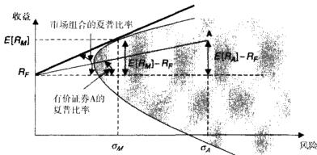  
图5-2用均值一方差斜率表示的夏普比率。市场组合最优最大的斜率，因此，也具有最高的夏普比率。

功应用的一个例子。

詹森指数是一种从大市影响中抽象出来的表现度量指标，其风格与CAPM是一致的。詹森指数隐含地考虑了收益波动中与所选市场指数共同运动的部分。

此处介绍的第三个比率是特雷诺比率，它度量的是单位风险下平均收益超出基准收益的值，这里的风险是由CAPM中估计的贝塔系数来表示的。

尽管这三种度量方法仍然广为使用，但它们都没有考虑极端收益情况下的尾部风险。比如，Brooks 和Kat（2002）、Mahdavi（2004）和 Sharma（2004）都举出了收益非正态分布情形下不应该使用夏普比率的例子。这些研究者主要关注使用衍生工具时夏普比率的应用，在这些情况下，收益是不对称的并且具有厚尾。如果实际分布偏离正态，我们却视而不见，这可能导致低估风险并且高估表现。目前已经发展出多种考虑了尾部风险的表现度量方法，而对于大部分交易策略的收益而言，尾部风险都是其固有特征。

夏普比率的一个自然延伸是把风险的度量标准从标准差换成基于最大回撤的方法，从而抓住策略的尾部风险。Calmar比率、Sterling比率，还有Burke比率正是这样做的。Calmar比率最先由Young（1991）提出，它用最大回撤来度量波动性。Sterling比率最先由Kestner（1996）提出，使用平均回撤来度量波动性。最后，Burke（1994）提出的Burke比率则用最大回撤的标准差作为

波动性的度量标准。

除了忽略尾部风险之外，人们还常常批评夏普比率在度量波动性时考虑了正收益。批评观点认为，在对不同交易策略进行估计和比较时，只有负收益才是有意义的。由此，产生了一类“希腊”比率，这些比率在扩展夏普比率时仅使用负收益计算的平均值来对波动率进行度量。这些负面收益度量指标称为下偏矩（lower partial moments，LPMs），其计算方法与常规分布的矩（比如均值，标准差，和偏度等）一致，只是计算时只使用低于某个特定基准的收益数据。因此 Shadwick和Keating(2002)，还有Kaplan和 Knowles(2004）提出了一种称为Omega的指标，这种指标在计算夏普比率时用一阶下偏矩（基准下收益的平均值）代替了标准差。Sortino和van derMeer（1991）提出的Sorti-no比率在计算夏普比率时使用二阶下偏矩，即基准下收益的标准差来度量波动性。Kaplan和Knowles（2004）提出的Kappa3指标用收益的三阶下偏矩（基准下收益的偏度）代替了夏普比率中的标准差。最后，Sortino，vanderMeer，和Plantinga（1999）提出了上行空间比率（UpsidePotential ratio）指标，该指标度量了每单位基准下收益标准差所带来的基准上平均收益（一阶上偏矩)。

风险价值度量（VaR）方法也获得了广泛使用，这种方法能在一定的统计学框架下将尾部风险概括成一个方便的数字。VaR指标实际上确定的是收益分布的 $90 \%$ , $9 5 \%$ ，或 $9 9 \%$ 临界Z值（该指标还常常应用于每日美元实际损益的分布)。 $\mathbf { V } _ { \mathbf { a } } \mathbf { R }$ 的伴随指标条件VaR（CVaR）—也称预期亏损（expec-ted loss，EL）度量了临界尾部内收益的平均值。当然，原始的VaR假设收益服从正态分布，而实际上收益是有厚尾性的。为了解决这个问题，Gregoriou和Gueyie（2003）提出了修正VaR（MVaR）指标，这个指标考虑了收益分布与正态分布的偏离。Gregoriou和Gueyie（2003）还提议在计算夏普比率时用MVaR来替代标准差。

既然有这么多指标，那么又该如何权衡呢？实际上，所有指标给出的交易策略排名是大体一致的。Eling和Schuhmacher（2007）用这里列出的13种指标对对冲基金的表现进行了比较，结论为，对于衡量对冲基金而言，夏普比率

就已经足够了。

# 绩效归因

绩效归因分析（performanceattribution analysis）常称为“基准评价"（benchmarking），这种方法可以追溯到Ross（1977）提出的套利定价理论(arbitrage pricing theory)，Sharpe（1992)，Fung 和 Hsieh（1997)还有其他一些人将这种方法应用到了交易策略表现评估之中。概括来说，绩效归因指明如果一个策略 $_ i$ 投资到多个证券上，每个证券在 $\ell$ 期的收益为 $r _ { \mu }$ ，其中 $j = 1$ ,…,$J$ ，则该策略在t期的收益有如下的因子结构：

$$
R _ { i } = \sum _ { j } x _ { j } r _ { j }
$$

其中 $\pmb { x } _ { \kappa }$ 是时刻 ${ _ t }$ 第 $j$ 只证券在投资组合中的相对权重， $\sum _ { j } x _ { j } = 1$ 。相应的，证券 $j$ 在 $\pmb { t }$ 期的收益又可以用 $K$ 个系统性因素来解释：

$$
r _ { \mu } \simeq \sum _ { i } \lambda _ { \mu } F _ { u } + \varepsilon _ { \dot { \mu } }
$$

其中 $F _ { y }$ 是 ${ \pmb t }$ 期 $K$ 个系统性因素中的一个， $k = 1 , \cdots , K , \lambda$ 是因子载荷， $\varepsilon _ { j }$ 是证券 $j$ 在 $\pmb { t }$ 期的特有收益。根据Sharpe（1992）的研究，因子可以假设是一系列的资产组合，也可以是单个股票或者其他证券。结合方程（5-1）和方程(5-2），收益的表达式可以重写如下：

$$
R _ { i } ~ = ~ \sum _ { i , k } ~ x _ { \mu } \lambda _ { j k } F _ { k i } + \sum _ { i } ~ x _ { \mu } \varepsilon _ { j }
$$

如此，就将策略 $_ i$ 收益中的影响因素从大量的金融证券消减为几个全局因子。对不同的因子做绩效归因涉及将策略的收益对多个因子进行回归：

$$
R _ { i i } \ = \ \alpha _ { i } \ + \ \sum _ { k } \ b _ { i k } F _ { k i } \ + \ u _ { i i }
$$

其中 $b _ { * }$ 度量了策略绩效中可以归因于因子 $k$ 的部分， $\alpha _ { i }$ 度量了策略持续获得超额收益的能力， $u _ { \mu }$ 则度量了策略在时期 $\pmb { t }$ 所获得的特有收益。

绩效归因是一个有效的衡量策略收益的方法，其原因如下。

●除了策略设计者所报告的细节之外，这种方法有可能准确抓住黑盒策略的投资风格。

●绩效归因方法衡量的是交易策略带来了多少真实价值，从而让一个策略能够很方便地与其他策略比较。●趋势因子具有短期持续性，这让我们能够根据绩效归因方法对策略的表现进行预测（参见Jegadeesh和Titman[1993】的研究）。

在绩效归因模型中，交易策略的特有收益就是策略收益超出一揽子加权策略因子绩效的部分。

Fung和Hsieh（1997）发现，以下八组资产类别可以有效充当绩效归因的基准。

●三种股票类：MSCI美国股票，MSCI非美国股票，和IFC新兴市场股票●两种债券类：摩根大通美国政府债券和摩根大通非美国政府债券●代表现金的1月期欧洲美元存单●代表商品的黄金价格，和代表外汇的美联储贸易加权美元指数

# 策略评估中的其他考虑因素

# 策略的资金容量

策略表现可能会随着投人资金量的不同而发生改变。资金规模的变化导致的策略表现变化一般是由所交易金融工具的市场流动性造成的。规模庞大的交易会消耗掉目前的流动性，把价格推向不利方向，从而降低交易策略的盈利能力。一个策略的资金容量可以通过其市场冲击进行估算，我们将在第19章对此进行详细讨论。在对冲基金的多种策略组合交易中，人们已经对市场冲击的影响进行了大量研究。本节将介绍投资规模对基金表现影响研究的一些主要成果。

Fransolet（2004）指出，整个行业资金的快速增长可能会削弱很多有利可图策略的盈利能力。另外，Brown，Goetzmann和Park（2004）认为，策略的资金容量还取决于资金管理人的交易技巧。Getmansky，Lo和Makarov（2004）进一步指出，策略资金容量是交易成本和资产流动性的函数。因此，Ding等人（2008）推论认为，如果投人到某个交易策略的资金小于策略的资金容量，则策略表现可能会和资金量成正比。然而，一旦资金量超过了策略的资金容量，其表现就开始变得与资金量负相关了。

# 高频交易策略评估期的长度

很多投资组合管理人在评估候选交易策略时都会面临如下问题：要保证策略的夏普比率能够像其目前表现的那样，应该用多长时间来评估这个交易策略呢？

有些投资组合经理随意地选择一个评估周期：从六个月到两年都行。有些投资者则要求至少六年的交易记录。还有一些认为一个月的日表现数据就足够了。实际上，从统计学上讲，以上所提到的时间长度都是正确的，只要它与想要验证的夏普比率相匹配就行。夏普比率越高，验证该夏普比率所需要的评估期越短。

Jobson和Korkie认为，如果交易策略的收益服从正态分布，那么交易策略夏普比率估计值的误差也服从正态分布，其均值为0，标准差为：

$$
s ~ = ~ [ ~ ( 1 / T ) ~ ( 1 ~ + 0 . 5 S R ^ { 2 } ) ~ ] ^ { 1 / 2 }
$$

在 $90 \%$ 置信水平下，所宣称的夏普比率至少要比夏普比率标准差s大$^ { 1 , }$ 645倍。因此，进行夏普比率验证所需的最短评估期为：

$$
T _ { \mathrm { m i n } } ~ = ~ ( 1 . 6 4 5 ^ { 2 } / S R ^ { 2 } ) ( 1 ~ + 0 . 5 S R ^ { 2 } )
$$

然而，需要注意的是用于计算 $T _ { \mathrm { m i n } }$ 的夏普比率SR应当与评估期的频率相对应。如果一个交易策略宣称的年度夏普比率是2，并且该比率是用月数据计算的，那么对应的月度夏普比率SR就是 $2 / \left( 1 2 \right) ^ { 0 . 3 } = 0 . 5 7 7 4$ 。另一方面，如果所宣称的夏普比率是基于日数据的，那么对应的夏普比率 $s R$ 为 $2 / \ ( 2 5 0 ) ^ { 0 . 5 }$ ${ \bf \omega } = { \bf 0 }$ .1054。对于月度表现数据而言，要在 $90 \%$ 的统计置信度下验证所宣称的夏普比率，所需要的时间为九个多月；若是使用日表现数据，则只需要八个多月；如果所宣称的夏普比率为6，只需要不到一个月的日表现数据即可验证。表5-2列出了验证表现数据的一些关键夏普比率所需的最小评估期。

表5-2验证报告夏普比率所需的最短交易策略表现评估时间  

<table><tr><td>宣称的年度夏普比率</td><td>需要的月份数 （月度表现数据）</td><td>需要的月份数 （日表现数据）</td></tr><tr><td>0.5</td><td>130.95</td><td>129.65</td></tr><tr><td>1.b</td><td>33.75</td><td>32.45</td></tr><tr><td>1.5</td><td>15.75</td><td>14.45</td></tr><tr><td>2.0</td><td>9.45</td><td>8.15</td></tr><tr><td>2.5</td><td>6.53</td><td>5.23</td></tr><tr><td>3.0</td><td>4.95</td><td>3.65</td></tr><tr><td>4.0</td><td>3.38</td><td>2.07</td></tr></table>

# 结论

利用交易策略评估的统计工具，投资经理可以确定一个高频策略对于其投资组合而言是否适合和可行。目前已经发展出来的统计策略评估方法多种多样，但夏普比率仍然是最受欢迎的。

# 指令、交易者及其在高频交易中的应用

高频交易旨在识别市场失效的瞬间，并对之进行套利，这种暂时性的市场无效来自于市场参与者之间的利益冲突。了解交易者为实现其目标所能使用的指令类型，才能让我们洞察不同交易者所使用的交易策略。最终，这种理解力可以帮助我们预测市场参与者即将采取的行动，这是成功实施高频交易的关键所在。本章将对目前市场上的各种类型的交易指令进行研究。

# 指令类型

当代的交易所和电子通信网络提供了多种多样的交易指令。不同指令之间可以在执行价格、执行时间、指令规模，甚至是披露说明方面有所不同。本节将详细考察交易指令的各种特征。

# 指令价格

市价指令（market order)与限价指令（limitorder）指令可以以最优可获得价格成交或者是以指定价格成交。以最优可获得价格买卖证券的指令称为市价指令，以指定价格买卖证券的指令称为限价指令。

当交易所或者电子通信网络收到一个市价指令时，这一指令会立即与可获得最优的反向交易指令进行配对，或者是与好几个最优反向指令配对，具体做法要取决于到达指令的交易规模。例如，如果交易所收到一个卖出100000手标准普尔500指数（SPY）的市价指令，并且交易所拥有如下的买人指令，这些买人指令按照价格从高到低的排列为：以935美元买人 $1 0 ~ 0 0 0$ 手，以930美元买人40000手，以925美元买人 $5 0 ~ 0 0 0$ 手，那么这个到达的市价卖出指令会“走过指令单簿”，直至其完全成交：第一个10000手以935美元卖出，接下来的40000手以930美元成交，最终的 $5 0 ~ 0 0 0$ 手以925美元成交，加权平均价格将会是928美元/手：

$$
P = { \frac { 1 0 ~ 0 0 0 \times ~ \oint ~ 9 3 5 + 4 0 ~ 0 0 0 \times ~ \oint ~ 9 3 0 ~ + 5 0 ~ 0 0 0 \times ~ \oint ~ 9 ~ 2 5 } { 1 0 0 ~ 0 0 0 } } = \oint ~ 9 ~ 9 2 8
$$

交易成本，例如经纪自营商和交易所费用，均单独核算，这将进一步降低这笔交易的收益。如果想要详细了解成本类型及成本大小，请参见第19章。

限价指令是以指定限价成交，如果存在更优价格的话，则以更优价格成交。当交易所或者电子通信网络收到一个限价指令时，指令首先会同目前可获得的最优反向指令进行比较，以确定新到达的指令是否能够立即成交。例如，当一个以930美元每手价格卖出SPY的限价指令到达交易所时，交易所会首先核对是否已经存在以930美元或者以更高价格买人SPY的指令。如果已存在930或者更高价格买人SPY的指令，那么新到达的指令会被当做一个普通的市价指令处理，这个指令将立即成交并且收取市价指令交易费用。如果不存在匹配的指令，那么新到达的限价指令会被置于限价指令簿中，它在那里一直等到成为能与其他新到达市价指令相匹配的最优可获得指令。

限价指令簿中指令的总规模代表着市场的流动性。在某个特定价格上限价指令的数量称为市场深度（marketdepth）。限价委托单簿中存在限价指令的价格点的数量称为市场宽度（marketbreadth）。图6-1根据Bervas（2006）的研究，展示了限价委托单簿中流动性的各个组成部分。

限价指令可以看成是以特定价格买人或卖出特定数量的某种证券的预先承诺，而市价指令则要求以市场可获得的最优价格尽快交易指令数量的证券。因此，市价指令确定会快速执行，但是执行价格存在不确定性，并且交易成本相对较高。与之相对的是，限价指令有可能得不到执行，但交易成本更低，并且可以以不同价格重新提交指令。表6-1列出了市价指令和限价指令之间重要的不同之处。

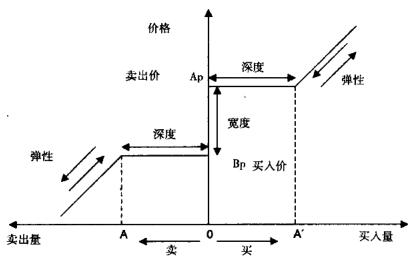  
图6-1市场流动性图（Bervas 2006)。流动性量（liquidity quantiy）OA和OA'分别表示买价和卖价之下的市场深度。注：图中宽度（hreadth）指的是买卖价差，和前文定义的市场宽度（market breadth）不是一个概念。

表6-1限价指令与市价指令  

<table><tr><td></td><td>市价指令</td><td>限价指令</td></tr><tr><td>指令执行</td><td>确定</td><td>不确定</td></tr><tr><td>执行时间</td><td>短期</td><td>不确定</td></tr><tr><td>执行价格</td><td>不确定</td><td>确定</td></tr><tr><td>重新提交指令</td><td>无</td><td>执行前可无限次重新提交</td></tr><tr><td>交易成本</td><td>高</td><td>低</td></tr></table>

市价指令要阐明指令委托的交易所、证券交易代码、买人或者卖出证券的数量，以及是买人还是卖出。限价指令要阐明同样的参数，并且要加上执行价格。

限价指令的盈利性一个交易员在市场中下达了一份限价买人指令，就等同于他向市场开出了一份不带任何权利金的卖出期权。同样的，下达限价卖出指令的交易员相当于是开出了一份免费的买人期权。除了上面谈到的期权权利金之外，下达限价指令的交易员还面临着被信息更为灵通的交易者“利用”的风险。比如，限价交易者（limit trader）提交了一份以\$30.00买人某种证券的限价指令，而另外一个消息灵通的交易者得知，\$30.00是一段时间之内该证券所能达到的最高价格。这个消息灵通的交易者将抓住机会，将证券卖给限价交易者，从而让限价交易者处于不利地位。

尽管限价指令交易看上去不是那么有利可图，但是却十分兴旺。现在大部分交易所提供限价指令交易功能，并且基于限价指令的交易所替代平台也取得了飞速的发展。交易所和电子通信网络能够吸引到大量的限价指令交易者，这说明对很多市场参与者而言，限价交易还是能给他们带来收益的。

Handa和Schwartz（1996）研究了限价指令交易者也称为流动性交易者（liquidity trader）——的盈利状况。他们发现相对于市价指令策略而言，限价指令策略能够获得一定的经济租金（economicrent）。Handa和Schwartz（1996）发现，买人限价指令策略让交易者平均每次交易可以获得 $0 , 1 \%$ \~$1 , 6 \%$ 的权利金，具体的数值与限价指令策略的类型有关。Handa和Schwartz（1996）考虑了四种买入限价指令策略：分别是买入限价低于市价 $0 . 5 \%$ ,$1 \%$ , $2 \%$ 和 $3 \%$ 。

为了度量限价指令交易的收益，Handa和Schwartz（1996）进行了下面的实验。

●首先将交易数据等分成几个盈利评估期。  
●在每-个评估期，模拟市价交易者会以评估期的开盘价执行所有交易。  
●限价指令交易者在比市场开盘价低 $x \%$ 处设定限价买入指令。  
●当市价穿越限价指令的价位时，就认为限价指令获得成交。  
●如果限价指令在评估期没有成交，则强制限价交易者以下一个评估期的开盘价执行其交易指令。

Handa和Schwartz（1996）利用每个评估期内限价指令策略所获得的价格与市价指令策略所获得的价格的平均差异来度量限价指令策略的盈利性。

如果实际限价指令的平均成本低于实际市价指令的平均成本，那么限价指令策略就是有利可图的。在每一个评估期内，买人限价指令策略的盈利性将使用式（6-1）进行度量：

$$
\Pi _ { \iota } \ = \ P _ { \iota , \pmb { \mathscr { n } } } - P _ { \iota , \pmb { \mathscr { L } } }
$$

式中， $\mathfrak { N } _ { i }$ 是买人限价策略在评估期之内的盈利性； $P _ { \{ , u }$ 是评估期的开盘价，也

就是市价买人指令的成交价： $P _ { \cdot , t }$ 是限价指令所获取的价格，正如前文所定义的，这个价格既有可能是市价穿越买人限价所获得价格，也可能是下一个评估期的开盘价。

买人限价指令的平均盈利性就是每个评估期盈利性的平均值：

$$
\Pi _ { \iota } \ = \ \frac { 1 } { T } \sum _ { \iota = 1 } ^ { \tau } \ ( P _ { \iota , \boldsymbol { u } } \ - \boldsymbol { P } _ { \iota , \boldsymbol { L } } )
$$

在每-个评估期，Handa和Schwartz（1996）评估了下面几种买入限价指令的表现：限价低于开盘价 $0 . 5 \%$ , $1 \%$ , $2 \%$ 和 $3 \%$ 。他们使用在纽约证券交易所交易的30只道琼斯工业指数公司的股票进行实验，发现平均而言，限价指令策略的表现要优于市价指令策略。表6-2复制了Handa和Schwartz（1996）实验中限价指令策略的平均结果。结果显示了限价指令表现超出市价指令的平均百分比。

表6-2限价指令策略超出市价指令策略的平均盈利性  

<table><tr><td rowspan="2"></td><td colspan="4">限价指令与市价指令的价格差（偏向有利的方向）</td></tr><tr><td>0.5%</td><td>1%</td><td>2%</td><td>3%</td></tr><tr><td>平均盈利性</td><td>0.100%</td><td>0.361%①</td><td>0.516%①</td><td>1.605%</td></tr></table>

$\textcircled{1}$ 表示在95%的置信水平下是统计显著的。

总之，限价指令策略能够给交易者带来明确的回报。限价指令策略在震荡市（比如我们现在所面临的市场）的表现尤其出色。

限价指令执行的延迟当限价指令被执行的时候，在大多数情况下会比确定会成交的同等的市价指令获得更优的成交价格。虽然如此，限价指令执行前所需的等待时间却是无法预知的，限价指令可能会立刻被市价指令“命中”，但如果市价远离了限价指令指定的价格，限价指令就无法成交。当限价指令用于平仓时，指令无法成交带来的后果可能相当严重，尤其是当目前的仓位处于亏损状态时，代价就更加高昂。比如，一个交易策略目前正持有美元/加元的多头头寸。假设这一头寸以市价买人指令在1.2005的价格开仓，目前的市价是1.1955，该策略将发出止损指令以了结头寸。如果止损指令以市价指令执行，那么指令会百分之百地以当前市价或者是比当前市价更低的价格执行。如果止损指令设置为限价指令，并且如果美元/加元的市场价格突然跳水，那么市价指令就不会成交，损失也会急剧扩大。因此，人们更多地用市价指令进行止损，以确保能够控制损失。

当开仓限价指令没有执行的时候，代价也可能是高昂的，因为这会产生机会成本，从而影响策略的平均单笔预期收益。例如，考虑一个“平的”交易策略，或者是在时点0完全为现金的交易策略。进一步假设，在时点1，美元/加元价格是1.2005，此时策略发出了一个买入指令。如果买入指令以市价指令下达，那么这一指令将会被 $100 \%$ 执行，但能够得到的最好的价位就是1.2005（执行的延迟和其他的滑点问题可能会使我们获得更加不利的价格）。另一方面，如果买人指令以限价指令的方式在1.2000的价位下单，那么如果市场价格跌落至这一水平，这一指令就可能会在1.2000成交，但如果市场价格始终保持在限定价格之上，指令可能根本不会成交。如果限价指令没有成交，那么它就失去了这一交易机会，以市价成交的这笔交易可能获得的收益也就相当于失去这一交易机会所带来的损失。

Foucault（1999）和Parlour（1998）模拟了一个动态场景，以保证所提交的限价指令会与市价指令成交，并且发现提交限价指令的交易者是有一定获利空间的。这两篇研究文献主要回答了如下的问题：

1.交易者会在什么价位下达限价指令？   
2.交易者更改限制指令的频率有多高？

这些指令单流中的动力学问题会影响到交易者的议价能力，并通过交易成本影响到他们的收益。这些研究的主要发现是，在高度波动的情况下，人们倾向于使用限价指令而不是市价指令。因此，在高度波动的情况下，市场上限价指令的比例会提高，同时由于大量的委托不会成交以及买卖价差的扩大，代理商的累积收益也会相应地降低。Parlour（1998）进一步解释了Biais、Hillion和Spatt（1995）观察到的对角线效应（diagonaleffect）：一个市价买人指令将减小卖方委托单所提供的流动性，从而导致卖方挂出更多的限价卖出指令，而不是市价卖出指令，随后，这将触发更多的市价买人指令。因此，除了知情交易（informedtrading）以外，流动性动力学一样会导致委托单流之间存在序列自相关性。Ahn、Bae和Chan（2001）发现随着香港证券交易所波动性的增加，限价委托单的数量也会相应增加。

不论是Foucault、Kadan和Kandel（2005）还是Rosu（2005），他们都假设，投资者关心交易执行的时间，并基于他们对执行时间的预期来发出相应的指令。

Kandel和Tkatch（2006）发现，当投资者向特拉维夫证券交易所提交限价指令单的时候，他们确实会考虑到延迟执行的问题。Lo，MacKinlay和Zhang的生存分析（survivalanalysis）研究发现，随着限价指令激进程度的增加（指令限价与当前市场价格之间的距离），限价指令执行前的存续期会有所缩短。

Goettler、Parlour和Rajan（2005）将研究扩展到了投资者可以以不同价格和不同委托数量提交多重限价指令的情况。Lo和Sapp（2005）测试了外汇市场中指令规模和指令激进程度的影响，他们发现，指令的激进程度性与指令规模是负相关的。

Hasbrouck和Saar（2002）证明了交易者可能会提交瞬时限价指令（fleet-ing limitorder）；根据Rosu（2005）的研究，瞬时限价指令切割了由委托单簿中有耐心的买方和有耐心的卖方所造成的区别。

对自己掌握的信息有信心的交易者，可能会在认为所掌握的信息会影响价格的期间之内，选择下达限价指令。例如，Keim和Madhavan（1995）揭示了如果知情交易商的信息衰减较慢，他们会倾向于使用限价指令。因此，一个交易者或者一个交易策略使用限价指令的比例，可以用来度量交易者对他们所掌握信息的信心强弱。利用这个信心变量，我们可以从观测到的交易决策和交易者委托单流中提取更多的信息。

限价交易指令和买卖价差当买卖价差较高时，交易者也可能转向限价指令。相对于使用限价指令导致无法成交的机会成本而言，买卖价差带来的成本可能更大。Biais、Hillion和Spatt（1995）揭示了在巴黎交易所，买卖价差较大时，交易者确实更多地使用限价指令，而买卖价差较小时，交易者更多地使用市价指令。Chung和VanNess（1999）进一步揭示当买卖价差较大时，提交限价指令的交易者比例会相应地有所提高。

限价指令和市场波动Bae、Jang和Park（2003）检测了在不同波动情况下，交易者下达限价指令和市价指令的倾向。他们发现不论买卖价差处于什么水平，日内市场波动上升时，限价指令的数量就会增加。Handa和Schwartz（1996）认为，相对于永久的波动性变化，由不知情交易或噪声交易引起的暂时性市场波动更能诱使交易者下达限价指令，这是因为交易者既可以通过提供流动性获得补偿，又能限制自身被利用的可能性。然而，Foucault（1999）发现，即使限价指令会被知情交易商利用，限价指令仍然是优于市价指令的选项。

# 指令时间

不论是市价指令还是限价指令，都可以规定其在某个时间长度之内有效，甚至是在一天之内的特定时间段有效。“撤销前有效”（good tillcanceled，GTC）指令在完全成交之前，会一直保留在指令单簿之中。“到期前有效”（good till date，GTD）指令则是在完全成交前，或者到期日前一直会保留在指令单簿中。在指定日期之后（比如90天），或者是公司发生了特殊事件（比如破产或者摘牌），或者是交易所发生了结构变化（比如更改了最小指令单规模）时，交易所和电子通信网络可以“杀死”或者取消GTC指令和GTD指令。

日内指令，也称“日内有效”（good for the day，GFD）指令，这种指令会在执行之前，或者交易日的最后正常交易时段之前一直保留在指令单簿之中。“延长日内有效”（good for the extended day，GFE）指令则允许指令保留至交易日延长交易时段结束之时。还有一种特别适合高频交易的期限更短的交易指令，叫做“到时前有效”（goodtill time，CTT）指令。GTT指令会一直保留在指令单簿之中，直到完全成交，或者到达了指定日期或指定时间，这种指令可以用于提交短期委托单。对于收取指令撤销费用或者指令修改费用的市场，如期权市场，GTT指令特别有用。当市场情况改变时，如果要撤销或者改变相关交易指令，需要缴纳撤销或者改单费用，但是交易者可以选择让他们之前的交易指令在指定的时间到期，然后再下达一个新的指令。

# 指令规模（order size)

不论是限价指令还是市价指令，指令规模说明的仅仅是想要执行的合约数量而已。普通的指令规模一-般是“整数股”（roundlots），也就是交易所交易的标准合约规模。比如，对于纽约证券交易所普通股而言，一份整数股就是100股股票。更小的指令叫做“零碎股”（oddlots），这些指令由特约零碎股交易商负责成交（交易的最小单位是一股），通常这些指令的交易费用比整数股的交易费用要高。市价指令和限价指令都可以交易零碎股。

比整数股规模更大，但是又不是整数股倍数的交易指令称为“混合股”（mixedlots），交易所通常把混合股指令拆分成整数股和零碎股，并分别由常规的交易商和零碎股交易商成交。

当一笔大规模的限价指令到达时，市场或许没有足够的流动性使该指令完全成交，剩下的部分可能只能以该限价指令交易者无法接受的价位达成交易。为了解决这个问题，大部分交易所和电子通信网络都接受“成交并撤销”（fllandkill，FAK）指令，该指令要求委托单立即全部成交或部分成交，未成交部分则予以撤销。如果交易者不能接受市价指令部分成交，那么他可以提交“成交或撤销”（fllorkill，FOK）指令，这种指令要么立即完全成交，要么全部撤销。如果交易者不是那么关心指令成交的即时性，只关心指令成交规模的话，那么他还有另外一种选择，就是提交“全部或全不”（allornone，AON）指令。AON指令将停留在指定单簿之中，并且保持其时间优先级，直至一次全部成交。

# 指令信息披露

不同的交易所和不同的电子通信网络，其指令信息披露程度各不相同。对有些交易所和电子通信网络，所有的市价指令和限价指令的执行情况对每一个市场参与者都是完全透明的。一些交易所，比如纽约证券交易所，允许做市商决定一个给定价格可以成交多少市价指令。另外一些交易所仅显示距离市价最近的几个价位上的限价委托单。还有一些交易所接受“冰山”指令（icebergorder)，这种指令只向其他市场参与者显示一部分的委托量。

“标准冰山”（standard iceberg）指令是一个指定了总规模（total size）和披露规模（disclosed size）的限价指令。其披露的部分会按照限价指令进行显示。当披露部分完全成交之后，新的一部分会接着披露出来，新披露的委托单可以与其他指令成交，并且其时间优先级以披露时间为准。

一般而言，指令都是匿名发布的，不用向交易所和电子通信网络的其他参与者披露交易者或交易机构的相关信息。对于交易大单的交易者而言，匿名指令显得特别有吸引力，因为如果他们身份被公布，其他市场参与者可能会向其提供不利的交易价格。

# 止损和止盈指令

除了前文提到的各种指令说明外，一些交易所还提供止损和止盈指令功能。当某个预先指定的价格——称为平仓价位（stopprice）——被达到或逾越时，止损指令和止盈指令会转变成市价或者限价指令，并买人或卖出相应证券。

# 管理指令

更改指令（changeorder）是一种改变正在等待中的限价指令的指令，不论这个限价指令是开仓限价指令，还是止盈或止损限价指令，更改指令都可以更改其指令价格、指令方向（买人还是卖出）和指令规模。更改指令还可以用于撤销已挂出的限价委托单。一些执行对手（executioncounterparty）可能会对更改指令收取一定的手续费。

保证金催缴平仓指令（margincall closeorder）可能是很多交易者都想避免的一种指令。当交易者账户中的保证金不足交易者所有未平仓头寸亏损金额的二倍时，执行对手就会发出这种指令。保证金催缴平仓指令在收盘之前执行，具体时间依金融工具的不同而不同。

大部分经纪自营商和电子通信网络会给客户提供电话服务。如果客户的电脑系统或者网络连接因为某种原因出了故障，那么客户可以通过电话下达指令。这种电话指令有时候称为“手T.下单”（ordersbyhand），并且手续费通常会高于电子下单方式。

最后，还有些取消指令既可以由客户下达，也可以由执行对手下达。当客户资金不足以新开一个仓位时，执行经纪商可以发出资金不足取消指令。如果限价指令的价格超出了预先规定的价格范围，也可以取消该限价指令，这种取消指令称为超出范围取消指令。

# 指令分布

表6-3列出了Oanda公司外汇交易统计信息，像这种指令统计信息表，即使有，也很少公之于众。然而，值得注意的是，Oanda公司外汇交易指令单规模的均值和中值表明，大多数Oanda的客户都属于小客户，因此，这些数据可能并不能代表经纪自营商和电子通信网络那里指令单流的状况。当然，这里的数据还是为我们的比较研究提供了一个有趣的视角。

如表6-3所示，就2003年10月1日到2004年5月14日之间每日数据的平均值而言，从指令单数量和交易量两个方面来看，最为常用的指令是止损和止盈指令（分别占指令单量的 $2 2 \%$ 和交易量的 $23 \%$ ），市价买人开仓指令( $13 \%$ 和 $1 4 \%$ ），市价卖出开仓指令（ $1 1 \%$ ），和市价卖出平仓指令（ $10 \%$ 和 $12 \%$ )。

将指令按买人和卖出进行加总可以让我们更加了解指令的统计分布特性。如表6-3进一步显示， $5 5 \%$ 的市价开仓指令和限价开仓指令都属于买入指令。这一数据反映出较小的客户稍稍偏向于建立多头头寸。

以数量而言、在所有限价开仓指令里面， $6 0 \%$ 的买人限价开仓指令和$61 \%$ 的卖出限价开仓指令是命中或者成交了的（每5个指令中会成交3个)。虽然如此，从成交量上来讲，限价指令的成交比例却很低。在所有的买人限价开仓指令中，仅有 $3 9 \%$ 的指令成交（每1000欧元的买人限价开仓指令成交390欧元）。在所有的卖出限价开仓指令中，成交比例则更低，仅仅为 $2 9 \%$ （每1000欧元卖出限价开仓指令成交290欧元）。这一明显的差异可能反映出大客户更加倾向于讨价还价—他们设置的限价开仓指令价格距离市价较远，以期获得更低的买价或者更高的卖价。

在已经开仓的头寸当中，无论是多头还是空头，在平仓方式上也存在差别。比较表6-4的第2列和第3列，可以看出相对于小客户而言，大客户不怎么使用止损或止盈指令来了结头寸，相反，他们喜欢使用市价指令。这个发现可能表明大客户更加富有交易技巧：因为所有的止盈和止损指令都可能由Oanda自营交易团队人为触发，而大客户则用恰当时机的市价指令取而代之。

表6-3Oanda公司外汇交易平台上交易的外汇现货每一种交易类别的每日交易指令分布。Oanda公司是一家位于多伦多的电子外汇经纪商。此表来自Lechner和Nolte（2007）的记录  

<table><tr><td>交易记录</td><td>以数量计的 交易指令占比</td><td>以欧元计的平均 每日交易量</td><td>以交易量计的 交易指令占比</td></tr><tr><td>市价买入（开仓）</td><td>13.1%</td><td>167096</td><td>14.13%</td></tr><tr><td>市价卖出（开仓）</td><td>10.61%</td><td>135754</td><td>11.48%</td></tr><tr><td>市价买人（开仓）</td><td></td><td>110461</td><td>9.34%</td></tr><tr><td>市价卖出（开仓）</td><td>8.27% 10.27%</td><td>140263</td><td>11.86%</td></tr><tr><td>限价指令：买人</td><td>5.41%</td><td>61856</td><td>5.23%</td></tr><tr><td>限价指令：卖出</td><td>4.76%</td><td>48814</td><td>4.13%</td></tr><tr><td>成交的买人限价指令（开仓）</td><td>3.22%</td><td>23860</td><td>2.02%</td></tr><tr><td>成交的卖出限价指令（开仓）</td><td>2.92%</td><td>14235</td><td>1.20%</td></tr><tr><td>成交的买人限价指令（平仓）</td><td>0.46%</td><td>6091</td><td>0.52%</td></tr><tr><td>成交的卖出限价指令（平仓）</td><td>0.46%</td><td>6479</td><td>0.55%</td></tr><tr><td>买入止盈（平仓）</td><td>3.14%</td><td>12858</td><td>1.09%</td></tr><tr><td>卖出止盈（平仓）</td><td>3.49%</td><td>19401</td><td>1.64%</td></tr><tr><td>买入止损（平仓）</td><td>2.18%</td><td>19773</td><td>1.67%</td></tr><tr><td>卖出止损（平仓）</td><td>2.55%</td><td>23391</td><td>1.98%</td></tr><tr><td>买人追加保证金（平仓）</td><td>0.12%</td><td>733</td><td>0.06%</td></tr><tr><td>卖出追加保证金（平仓）</td><td>0.17%</td><td>1213</td><td>0.10%</td></tr><tr><td>更改指令</td><td>3.01%</td><td>61229</td><td>5.18%</td></tr><tr><td>止损或者止盈</td><td>22.36%</td><td>268568</td><td>22.71%</td></tr><tr><td>手工撒销指令</td><td>2.41%</td><td>44246</td><td>3.74%</td></tr><tr><td>取消指令：资金不足</td><td>0.28%</td><td>10747</td><td>0.91%</td></tr><tr><td>取消指令：超出范围</td><td>0.20%</td><td>860</td><td>0.07%</td></tr><tr><td>指令到期</td><td>0.65%</td><td>4683</td><td>0.40%</td></tr><tr><td></td><td></td><td></td><td></td></tr><tr><td>总计</td><td>100.04%</td><td>1182611</td><td>100.00%</td></tr></table>

然而，在使用止损和止盈指令的客户之中，小客户的成功率更高一些：按指令数量计算， $21 \%$ 的指令是止盈指令， $1 6 \%$ 的指令是止损指令。而从成交量上看，仅有 $9 \%$ 的指令是止盈的， $1 3 \%$ 的指令是止损的。

表6-42003年10月1日到2004年5月14日间，Oanda公司所记录的，以指令数目和总交易量计的各种交易指令占比  

<table><tr><td>指令类型</td><td>日均指令数目</td><td>以欧元计的总交易量</td></tr><tr><td>开仓指令中买人指令占比</td><td>55%</td><td>55%</td></tr><tr><td>市价指令中买人指令占比</td><td>55%</td><td>55%</td></tr><tr><td>买人限价开仓指令成交比例</td><td>60%</td><td>39%</td></tr><tr><td>卖出限价开仓指令成交比例</td><td>61%</td><td>29%</td></tr><tr><td>每日开仓的总多头头寸</td><td>1647</td><td>190956</td></tr><tr><td>多头平仓</td><td></td><td></td></tr><tr><td>市价卖出（平仓）</td><td>63%</td><td>73%</td></tr><tr><td>止盈卖出（平仓）</td><td></td><td></td></tr><tr><td>止损卖出（平仓）</td><td>21%</td><td>10%</td></tr><tr><td>成交的卖出限价指令（平仓）</td><td>16%</td><td>12%</td></tr><tr><td></td><td>3%</td><td>3%</td></tr><tr><td>保证金催缴卖出（平仓）</td><td>1%</td><td>1%</td></tr><tr><td>每日开仓的总空头头寸</td><td>1367</td><td>149989</td></tr><tr><td>空头平仓</td><td></td><td></td></tr><tr><td>市价买人（平仓）</td><td>61%</td><td>74%</td></tr><tr><td>止盈买人（平仓）</td><td>23%</td><td>9%</td></tr><tr><td>止损买人（平仓）</td><td>16%</td><td>13%</td></tr><tr><td>成交的买人限价指令（平仓）</td><td>3%</td><td>4%</td></tr><tr><td>保证金催缴买人（平仓）</td><td>1%</td><td>0%</td></tr></table>

# 结论

指令的类型是多种多样的，交易者可以通过改变指令的价格、时间、透明度以及其他参数来构造复杂的交易策略。当然，简单的市价指令和限价指令在交易之中仍然魅力不减，它们因为功能全面和方便使用而深受投资者的欢迎。

# 不同频率下的市场无效和获利机会

所有类型的高频交易策略背后都有一个共同的关键特征，就是它们都利用了某些潜在的可交易的现象。本书的这一部分将讨论如何识别这些有持续性的交易机会。

高频交易机会的涵盖范围很广，它可以是秒级的价格运动，交易者利用做市交易从中获利；它也可以是数分钟的策略，交易者根据市场微观结构理论对价格趋势的预测进行交易；它还可以是某些重复发生的事件出现后几个小时之内的市场运动，交易者利用的是价格对统计规律的偏离。Dacorogna等（2001）强调一种标准的学术型模型开发方式如下：

1．记录所观察到的现象。  
2．建立模型解释这种现象。  
3．测试模型的预测能力。

开发高频交易策略始于在高频数据中发现重复出现且能够获利的交易机会。至于什么频率之下才是最有利可图的，这个问题常常因为数据的可获得性以及研究者无法量化不同策略在不同频率下的收益等问题而只好搁置边。那些拥有数据的交易者常常远离公众的视野，而埋首于利用这些数据进行成功的高频交易。其他的来源则趋向于从有问题的交易策略中生成数据。

交易策略的盈利能力受到所选择的交易频率的限制。在以日为级别的交易频率下，最大收益和亏损都受限于当日的价格波动幅度。在小时级别的频率下，价格运动的幅度进一步缩小，但是对于大部分股票而言，每日小时级别的价格运动已经增加至7个，对于外汇而言则达到了24个。其总的潜在收益是一天之中所有小时内价格变动幅度的总和。在更高的频率下，价格运动的幅度进一步缩小，而数据则进一步增加，从而能提供更高的盈利机会。

表7-1展示了2009年4月21日SPY和欧元/美元在不同频率下的最大潜在收益以及其他一些有关波动幅度的统计量。在每种频率之下，最大收益用价格变动幅度的和来计算。之后，再将SPY和欧元/美元的最大收益分别用SPY和欧元/美元的当日开盘价进行标准化，得到百分比形式的相对收益。每种频率的最大潜在收益由该频率之下每个时间区间的价格变动幅度加总而得。

高频之下的潜在收益是令人膛目的，当然，最大的潜在亏损（即最大收益的相反数）也令人咋舌。为了充分实现高频交易的收益潜能，精心的策略设计、大量的回顾测试、严谨的风险管理以及策略的实施都是必不可少的。

表7-12009年4月21日SPY和欧元/美元在不同频率之下的最大  
潜在收益以及其他一些有关波动幅度的统计量  

<table><tr><td colspan="6">SPY</td></tr><tr><td rowspan="2">统计量</td><td colspan="5">每个周期的持续时间</td></tr><tr><td>10秒</td><td>1分钟</td><td>10分钟</td><td>1小时</td><td>1天</td></tr><tr><td>每日最大潜在收益（所有单</td><td>96.33%</td><td>44.59%</td><td>13.96%</td><td>5.66%</td><td>1.09%</td></tr><tr><td>期变动幅度的和） 每个周期的平均幅度</td><td>0.04%</td><td>0.11%</td><td>0.35%</td><td>0.81%</td><td>1.09%</td></tr><tr><td>日内周期数</td><td>2340</td><td>390</td><td>39</td><td>7</td><td>1</td></tr><tr><td>欧元/美元</td><td></td><td></td><td></td><td></td><td></td></tr><tr><td colspan="6"></td></tr><tr><td rowspan="2">统计量</td><td></td><td></td><td>每个周期的持续时间</td><td></td><td></td></tr><tr><td>10 秒</td><td>1分钟</td><td>10分钟</td><td>1小时</td><td>1天</td></tr><tr><td>每日最大潜在收益（所有单 期变动幅度的和）</td><td>319.23%</td><td>90.07%</td><td>18.48%</td><td>6.44%</td><td>0.57%</td></tr><tr><td>每个周期的平均幅度</td><td>0.04%</td><td>0.06%</td><td>0.13%</td><td>0.27%</td><td>0.57%</td></tr><tr><td>日内周期数</td><td>8640</td><td>1440</td><td>144</td><td>24</td><td>1</td></tr></table>

交易策略的盈利性常常用夏普比率来衡量，这是一个由夏普（1966）

首先提出的经过风险调整的收益度量方式。如表7-2所示，随着交易频率的提高，最大夏普比率也相应地提高。从2009年3月11日到2009年3月22日，每天进行仓位调整的欧元/美元交易策略最大年化夏普比率为37.3，而持仓时间为10秒钟的欧元/美元交易策略最大可能夏普比率会显著超过5000。

表7-2一个能够正确预测欧元/美元所有周期内价格变动的理想交易策略所能产生的最大夏普比率比较。（这些结果是用2009年2月9日到2009年3月22日这30个交易日的数据事后计算而得的）  

<table><tr><td></td><td>每个周期的平均最</td><td>每个周期变动</td><td>样本期内观察</td><td>最大年化</td></tr><tr><td></td><td>大收益（变动幅度）</td><td>幅度的标准差</td><td>值的数目</td><td>夏普比率</td></tr><tr><td>10秒</td><td>0.04%</td><td>0.01%</td><td>2 592 000</td><td>5879.8</td></tr><tr><td>1分钟</td><td>0.06%</td><td>0.02%</td><td>43 200</td><td>1860.1</td></tr><tr><td>10分钟</td><td>0.12%</td><td>0.09%</td><td>4 320</td><td>246.4</td></tr><tr><td>1小时</td><td>0.30%</td><td>0.19%</td><td>720</td><td>122.13</td></tr><tr><td>1天</td><td>1.79%</td><td>0.76%</td><td>30</td><td>37.3</td></tr></table>

最大可能日内夏普比率的计算方法为，用样本周期内的平均收益除以样本周期内收益变动幅度的标准差，之后再乘以一年之内所观测到的样本数据量的平方根：

$$
S R = \frac { E [ \phi _ { \mathrm { B I } } ^ { s } / \lambda _ { \mathrm { C } } ^ { s } ] } { \sigma [ \phi _ { \mathrm { B I } } ^ { s } / \lambda _ { \mathrm { C } } ^ { s } ] } \times \sqrt  \boxed { \dot { \star } } \boxed { \dot { \star } } \dot { \bf H } \boxdot { \dot { \star } } \boxdot { \bf H } \ddot { \bf \phi } _ { \mathrm { B C } } ^ { s } \times - \dot { \bar { \phi } } \dot { \bar { \bf H } } \dot { \bar { \bf H } } \boxdot { \bf H } \ddot { \bf \phi } _ { \mathrm { C } } ^ { s } \boxdot { \bf H } \boxdot { \bf H }
$$

注意高频交易策略通常不隔夜持仓，没有隔夜持仓成本，因此，上式中也就没有在长期投资夏普比率中经常出现的无风险利率项。

在实际中，精心设计并仔细实施的高频交易策略往往能产生最高的收益，其夏普比率能够达到两位数。实际生活中执行得很好的每天进行仓位调整的交易策略的夏普比率通常只能达到1\~2而已。

# 高频下的价格波动的可预测性

# 可预测性和市场效率

每位交易员与每一个交易系统都旨在产生能够在大量交易中获得稳定收益的信号。为了寻找这些信号，不论是交易员还是计量经济学家设计的系统交易平台都在极力寻找能够预测所选证券未来价格走势的蛛丝马迹。在交易中和统计学中，可预测性都是随机性的对立面。因此，所有交易系统的目标都是找到区分可预测性与随机价格运动的方法，然后对可以预测的部分采取相应的行动。

未来是不确定的，但如果某些事件能够重复发生的话，过去的历史就能为我们预测未来提供一定的线索。因此，所有成功的交易系统都需要用大量的历史数据进行检验。例如，技术分析考察历史价格图表以获得对过去价格走势的见解。基本面分析常常采用多元回归的方法来确定一个基本因子是如何影响另一个因子的。高频交易系统则在儿年的历史分笔数据中运行它们的模型，以确认其交易信号的有效性。

还有一种更加科学地分析某一特定金融证券的方法，就是确定该证券的价格变化是否是随机的。如果价格变化确实是随机的，那么在这个证券上找到可稳定获利的交易机会的可能性微乎其微。反过来，如果价格变化不是随机的，那么该金融证券就具有持续的可预测性，值得进行更加深入的研究。

交易机会的相对多寡可以用市场有效程度来度量。在有效市场（Fama，1970）中，所交易证券的价格会立即反映所有的可用信息。如果信息是慢慢整合到证券价格之中的，那么就会存在套利机会，同时可以认为该市场是无效的。图7-1对比展示了有效市场和无效市场的概念。寻找具有套利机会的市场也即寻找无效市场。套利机会本身就是市场的无效之处。

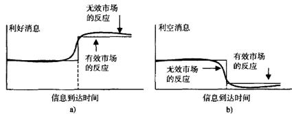  
图7-1有效市场和无效市场下的信息整合

在图7-1中，图（a）展示了有效市场和无效市场对推动证券价格上涨的“利好消息”的反应，图（b）展示了有效市场和无效市场对推动证券价格下跌的“利空消息”的反应。在有效市场中，当信息出现时，证券价格会立即调整到新的水平。而在无效市场中，信息公开之前证券价格就开始调整（“信息泄露”），信息公开之后，价格通常还会有暂时的过度反应（“反应过度”）。很多可靠的交易策略就是利用信息泄露和反应过度来产生稳定收益的。

# 检验市场有效性及可预测性

市场越无效，具有可预测性的交易机会就越多。对市场效率进行检验可以帮助我们发现市场在多大程度上存在可预测的交易机会。本章将介绍几种市场有效性的检验方法，以帮助研究者挑选出最具有盈利性的市场。本章无意对学术论文中所提到的各种市场有效性检验方法进行面面俱到的综述，相反，这里将总结几种复杂程度不一的重要检验方法，从最简单的到最为先进复杂的。

市场有效性假说具有几个“层次”：弱式有效、半强式有效和强式有效。对市场弱式有效进行检验就是要看是否能通过历史价格和收益率对未来收益率进行预测。其他形式的市场有效性则是限制了预测未来价格时所能考虑的信息范围。强式有效包含所有类型的公开和非公开信息；半强式有效则不考虑信息集合中的非公开信息。与当代其他有关市场有效性的学术文献一样，我们这里只讨论对弱式有效性的检验。

非参数游程检验多年以来，已经发展出了多种对市场有效性进行检验的方法。其中最早的一个是由LouisBachelier在1900年提出的，该方法度量一系列连续的正的或连续的负的价格变动（或称“游程”）出现的概率。就像抛掷一枚硬币一样，连续的两个价格交动具有相同符号（比如--个正的变动接着另一个正的变动）的概率为 $1 / ( 2 ^ { 2 } ) \ = \ 0 . 2 5$ 。连续三个价格变动具有相同符号的概率为 $1 / ( 2 ^ { 3 } ) \ = \ 0 . \ 1 2 5$ 。四个连续价格变动具有相同符号的可能性更小，其概率为 $1 / ( 2 ^ { 4 } ) \ = \ 0 . 0 6 2 5$ 或者 $6 , 2 5 \%$ 。不论在什么频率之下，多个连续的具有相同符号的价格变动都提供了一个交易机会，只要交易所得

能够覆盖掉交易成本即可。

其检验过程如下：

1．对所要求频率下的价格运动样本数据，记录下包含严格同方向价格运动的序列的个数。如果所要求的频率是每一笔交易，那么一个游程就是每笔交易价格变动严格为正或者严格为负的序列。如果所要求的频率是一分钟，那么一个游程就是一分钟间隔下价格变动严格为正或者严格为负的序列。表7-3展示了格林尼治时间2009年6月8日16:00到16：20之间澳元/美元的一分钟汇率变动情况。

1分钟汇率变动计算方式为：如果这一分钟澳元/美元的收盘价高于上一分钟的收盘价，则这一分钟的变动记为正。如果这一分钟澳元/美元的收盘价低于上一分钟，则这一分钟的变动记为负。如表7-3所示，从格林尼治时间$1 6 { : } 0 0$ 到16：20，总共有9分钟澳元/美元的变动是正的，有8分钟澳元/美元的变动是负的，还有3分钟澳元/美元的变动是0。总括起来，共有6个正的游程澳元/美元价格上涨，4个负的游程澳元/美元价格下跌。正的游程在“游程”列中标记为“P”，负的游程标记为“N”。因此，标记为“P2”的那一分钟对应第二个连续正变动的游程，标记为“N1”的那一分钟对应的是第一个负的游程。

2.记样本中观测到的所有游程的总数（包括正的和负的）为 $\boldsymbol { u }$ 。此外，记样本中1分钟变动为正值的分钟数为 $\pmb { n } _ { 1 }$ ，1分钟变动为负值的分钟数为$n _ { z }$ 。表7-3所示的样本中， $u = 1 0$ , $n _ { 1 } = 9$ . $n _ { 2 } = 8$ o

3.如果价格变动是完全随机的，在一个随机样本中，游程总数的期望值为 $\bar { \pmb { x } } = \frac { 2 n _ { 1 } n _ { 2 } } { n _ { 1 } + n _ { 2 } } + 1$ \$2n₁n^{+1，标准差为：

$$
s = { \sqrt { \frac { 2 n _ { 1 } n _ { 2 } \left( 2 n _ { 1 } n _ { 2 } - n _ { 1 } - n _ { 2 } \right) } { \left( n _ { 1 } + n _ { 2 } \right) ^ { 2 } \left( n _ { 1 } + n _ { 2 } - 1 \right) } } }
$$

在表7-3的例子中， $\hat { x } ~ = 9 . 4 7 , s ~ = 1 . 9 9$ e

4.接下来，我们检验实际出现的游程数目是否能表明统计上的非随机性。如果游程数目与均值 $\bar { \bf x }$ 的偏差在1.645倍标准差 $s$ 以上，则可以在 $9 5 \%$ 的统计置信度下认为该频率下的游动是可以预测的，或者是非随机的。如果以 $z$ 值为

基础的双边检验被拒绝，则游程的数据是非随机的。z值的计算方法为 $z =$ $\frac { \mid u - \bar { x } \mid - 0 . 5 } { s }$ 。换言之，只要 $z$ 值大于 $^ { 1 , }$ 645，就可以在 $9 5 \%$ 的统计置信度下拒绝游程随机的原假设。若Z<1.645，则不能拒绝游程随机的原假设。

表7-3格林尼治时间2009年6月8日16:00到16：20澳元/美元1分钟收盘价  

<table><tr><td>日期</td><td>时间</td><td>收盘价</td><td>1分钟变动</td><td>变动的符号</td><td>游程</td></tr><tr><td>6/8/2009</td><td>16:00</td><td>0.7851</td><td></td><td></td><td></td></tr><tr><td>6/8/2009</td><td>16:01</td><td>0.7853</td><td>0.0002</td><td>+</td><td>P1</td></tr><tr><td>6/8/2009</td><td>16:02</td><td>0.7848</td><td>-0.0005</td><td></td><td>N1</td></tr><tr><td>6/8/2009</td><td>16:03</td><td>0.7841</td><td>-0.0007</td><td></td><td>N1</td></tr><tr><td>6/8/2009</td><td>16:04</td><td>0.784</td><td>-1E-04</td><td>-</td><td>N1</td></tr><tr><td>6/8/2009</td><td>16:05</td><td>0.7842</td><td>0.0002</td><td>+</td><td>P2$</td></tr><tr><td>6/8/2009</td><td>16:06</td><td>0.7844</td><td>0.0002</td><td>+</td><td>$P2$</td></tr><tr><td>6/8/2009</td><td>16:07</td><td>0.7845</td><td>1E -04</td><td>+</td><td>$P2$</td></tr><tr><td>6/8/2009</td><td>16:08</td><td>0.7845</td><td>0</td><td></td><td></td></tr><tr><td>6/8/2009</td><td>16:09</td><td>0.7847</td><td>0.0002</td><td>+</td><td>P3</td></tr><tr><td>6/8/2009</td><td>16:10</td><td>0.7849</td><td>0.0002</td><td>+</td><td>P</td></tr><tr><td>6/8/2009</td><td>16:11</td><td>0.7846</td><td>-0.0003</td><td></td><td>N2</td></tr><tr><td>6/8/2009</td><td>16:12</td><td>0.7845</td><td>-1E-04</td><td></td><td>N2</td></tr><tr><td>6/8/2009</td><td>16:13</td><td>0.7839</td><td>-0.0006</td><td></td><td>N2</td></tr><tr><td>6/8/2009</td><td>16:14</td><td>0.7841</td><td>0.0002</td><td></td><td>P4</td></tr><tr><td>6/8/2009</td><td>16:15</td><td>0.7841</td><td>0</td><td></td><td></td></tr><tr><td>6/8/2009</td><td>16:16</td><td>0.7837</td><td>-0.0004</td><td>-</td><td>N3</td></tr><tr><td>6/8/2009</td><td>16:17</td><td>0.7842</td><td>0.0005</td><td>+</td><td>P5</td></tr><tr><td>6/8/2009</td><td>16:18</td><td>0.784</td><td>-0.0002</td><td></td><td>N4</td></tr><tr><td>6/8/2009</td><td>16:19</td><td>0.784</td><td>0</td><td></td><td></td></tr><tr><td>6/8/2009</td><td>16:20</td><td>0.7842</td><td>0.0002</td><td>+</td><td>P6</td></tr></table>

在表7-3的例子里， $Z = 0$ 0147；因此，此样本中 $^ { 1 }$ 分钟价格变化的随机性不能被拒绝。

表7-4总结了在不同频率下，利用2009年6月8日的所有数据对几种证券进行游程检验所得的 $z$ 值。如表7-4所示，除了标普500存托凭证外，对其他所有的证券，游程检验都拒绝了1分钟频率下价格随机变动的原假设。这个结果暗示，这

里所展示的几种证券的1分钟数据存在严重的市场无效现象。当频率降低到10分钟或更低时，由游程检验所度量的市场无效程度会下降，甚至完全消失。

表7-4利用2009年6月8日的数据对多种证券在不同频率下  
进行非参数游程检验的结果  

<table><tr><td>证券代码</td><td>数据频率</td><td>N_</td><td>$N_₂}$</td><td>U</td><td>z</td><td>结论</td></tr><tr><td>SPY</td><td>1分钟</td><td>179</td><td>183</td><td>193</td><td>1.11</td><td>随机</td></tr><tr><td>SPY</td><td>10分钟</td><td>21</td><td>17</td><td>20</td><td>-0.10</td><td>随机</td></tr><tr><td>T</td><td>1分钟</td><td>142</td><td>138</td><td>187</td><td>5.45</td><td>可预测</td></tr><tr><td>T</td><td>10分钟</td><td>18</td><td>17</td><td>20</td><td>0.35</td><td>随机</td></tr><tr><td>USD/JPY</td><td>1分钟</td><td>558</td><td>581</td><td>775</td><td>12.11</td><td>可预测</td></tr><tr><td>USD/JPY</td><td>10分钟</td><td>68</td><td>64</td><td>82</td><td>2.55</td><td>可预测</td></tr><tr><td>XAU/USD</td><td>1分钟</td><td>685</td><td>631</td><td>778</td><td>6.61</td><td>可预测</td></tr><tr><td>XAU/USD</td><td>10分钟</td><td>75</td><td>66</td><td>76</td><td>0.73</td><td>随机</td></tr></table>

随机游动检验这些年来发展出很多更先进的市场有效性检验方法。这些检验方法可以帮助交易人员评估市场状态，并把资金配置到有效性最差的，也就是获取利润机会最多的市场中去。

当价格随机变化时，一般大家说价格是“随机游动”的。正式来说，随机游动过程可以表示如下：

$$
\ln P _ {  } = \ln P _ {  1 } + \varepsilon _ {  }
$$

式中，ln $P _ { \mathrm { ~ r ~ } }$ 是时刻 ${ \pmb t }$ 所考虑证券价格的对数值；ln $P _ { { t } - 1 }$ 是按之前确定的频率往前一个周期（比如1分钟，1小时等）该证券价格的对数值； $\pmb { \varepsilon } _ { t }$ 是均值为0的残差项。由式（7-2），可得对数价格变化 $\Delta \ln P _ { i }$ 为：

$$
\Delta \ln P _ { \mathrm { \it { i } } } ~ = ~ \ln P _ { \mathrm { \it { i } } } - \ln P _ { \mathrm { \it { i - 1 } } } ~ = ~ \varepsilon _ { \mathrm { \it { i } } }
$$

在任一时刻，对数价格的变化取正值和负值的概率是相等的。对价格取对数保证了模型中不会出现负的价格（负数的对数不存在）。

随机游动过程是可以带有漂移的，有漂移的随机游动用式（7-3）表示：

$$
\ln P _ { \imath } = \mu + \ln P _ { \imath - 1 } + \varepsilon _ { \imath }
$$

在这种情况下，由于 $\Delta { \ln P } _ { \varepsilon } = { \ln P } _ { \varepsilon } - { \ln P } _ { \varepsilon - 1 } = \mu + \varepsilon ,$ ，价格的平均变动等于漂移项，而不是0。漂移产生的原因可以是多种多样的，比如，持续的通货膨胀会降低美元的价值，从而让所有美国股票的价格产生小幅正向漂移。然而，在非常高频的情况下，漂移一般是觉察不到的。

Lo和MacKinlay（1988）提出了一种颇为流行的检验价格走势是否服从随机游动的方法。这种检验方法对有漂移的和无漂移的过程都适用。检验过程的原理如下：如果在某一频率下（比如1小时），价格的变化是随机的，那么在更低的频率下（例如，2小时），价格变化同样应该是随机的。另外，1小时和2小时价格变化的方差也应当是有确定性关系的。值得注意的是，以上情况反之并不成立，1小时价格变化是随机的并不表示10分钟价格变化也是随机的，另外，它也不能证明1小时价格变化的方差和10分钟价格变化的方差存在某种关系。

检验本身基于以下一些估计量：

$$
\widehat { \mu } = \frac { 1 } { 2 n } \sum _ { k = 1 } ^ { 2 n } \ : \left( \ln P _ { k } - \ln P _ { k - 1 } \right) = \frac { 1 } { 2 n } ( \ln P _ { 2 a } - \ln P _ { 0 } )
$$

$$
\hat { \sigma } _ { \alpha } ^ { 2 } = \frac { 1 } { 2 n } \sum _ { k = 1 } ^ { 2 n } ~ ( \ln P _ { k } - \ln P _ { k - 1 } - \hat { \mu } ) ^ { 2 }
$$

$$
\hat { \pmb { \sigma } } _ { b } ^ { 2 } \ = \ \frac { 1 } { 2 n } \sum _ { k = 1 } ^ { n } \ ( \ln P _ { 2 k } - \ln P _ { 2 k - 2 } - 2 \hat { \pmb { \mu } } ) ^ { 2 }
$$

如果式（7-2）和式（7-3）中的残差项 $\varepsilon _ { t }$ 是一系列独立同正态分布，且均值为0，方差为 $\sigma _ { \circ } ^ { 2 }$ 的随机变量，即 $\varepsilon _ { \varepsilon }$ \~ i. i. d. $N ( 0 , \sigma _ { 0 } ^ { 2 } )$ ，Lo和MacKin-lay证明了参数 $\scriptstyle \pmb { \sigma } _ { 0 } ^ { 2 }$ , $\hat { \pmb { \sigma } } _ { \circ } ^ { 2 }$ （见式7-5），和 $\hat { \sigma } _ { b } ^ { 2 }$ （见式7-6）之间渐近的服从如下分布：

$$
\begin{array} { l } { { \sqrt { 2 n } ( \hat { \sigma } _ { \mathfrak { e } } ^ { 2 } - \sigma _ { 0 } ^ { 2 } ) \underbrace { a } _ { \sim } N ( 0 , 2 \sigma _ { 0 } ^ { 4 } ) } } \\ { { \sqrt { 2 n } ( \hat { \sigma } _ { \mathfrak { e } } ^ { 2 } - \sigma _ { 0 } ^ { 2 } ) \underbrace { a } _ { \sim } N ( 0 , 4 \sigma _ { 0 } ^ { 4 } ) } } \end{array}
$$

市场有效性检验按照式（7-9）进行：

$$
J _ { \prime } \equiv \frac { \hat { \sigma } _ { b } ^ { 2 } } { \hat { \sigma } _ { a } ^ { 2 } } - 1 , \sqrt { 2 n } J _ { r } \underset { \simeq } { a } N ( 0 , 2 )
$$

Lo和MacKinlay（1988）随后用这种方法对多种证券的日数据、周数据和月数据进行了检验，他们的结论认为，虽然在每周和每月的频率下，不能拒绝市场有效的假设，但是每日的证券价格并非是有效的。

表7-5总结了对几种外汇金融工具在不同频率下进行方差比检验的结果。其中每行代表式（7-9）定义的方差比检验 $J _ { r }$ 的估计值。括号中的值是度量 $J ,$ 与0偏离程度的检验统计量。如果时间序列服从随机游动，则检验统计量 $J _ { r }$ 将服从正态分布。

表7-5表中每行中的数据为式（7-9）定义的方差比J，，每行下方括号里的数字为异方差-稳健性检验统计量z（q）的值。在随机游动的原假设下， $J _ { r }$ 的值是0并且检验统计量服从标准正态分布（渐近的）。检验统计量标有星号表示对应的方差比在 $5 \%$ 的显著性水平下是不等于0的。这里的估计基于2008 年11到12月这两个月期间的数据

<table><tr><td>货币对</td><td>每日现货</td><td></td><td>5分钟现货15分钟现货1小时现货1小时期货</td><td></td><td></td><td>1小时 看涨期权</td><td>1小时 看跌期权</td></tr><tr><td>澳元/美元</td><td>0.6354</td><td>0.7320</td><td>0.7310</td><td>0.7128</td><td>0.7176</td><td>0.6851</td><td>0.6937</td></tr><tr><td rowspan="2">美元/加元</td><td>(2.27)•</td><td>(8.74)*</td><td>(9.21)</td><td>(4.90)*</td><td>(5.48)</td><td>(3.72)</td><td>(3.75)</td></tr><tr><td>0.5672</td><td>0.7301</td><td>0.7278</td><td>0.7124</td><td>0.7181</td><td>0.6919</td><td>0.6614</td></tr><tr><td rowspan="2">美元/瑞士 法郎</td><td>(1.89)</td><td>(7.97)*</td><td>(8.61)*</td><td>(4.90)*</td><td>(5.48)*</td><td>(3.87)</td><td>(2.98)*</td></tr><tr><td>0.6356</td><td>0.7325</td><td>0.7315</td><td>0.7123</td><td>0.6952</td><td>0.6796</td><td>0.6850</td></tr><tr><td rowspan="2">欧元/美元</td><td>(2.27)</td><td>(8.85)*</td><td>(9.77)</td><td>(5.00)*</td><td>(4.14)*</td><td>(3.57)*</td><td>(3.80)*</td></tr><tr><td>0.6355</td><td>0.7359</td><td>0.7337</td><td>0.7135</td><td>0.7189</td><td>0.6912</td><td>0.6836</td></tr><tr><td rowspan="2">英/美元</td><td>(2.27).</td><td>(15.07)</td><td>(10.08)*</td><td>(5.00)*</td><td>(5.57)*</td><td>(3.87)*</td><td>(3.77)*</td></tr><tr><td>0.6658</td><td>0.7346</td><td>0.7263</td><td>0.7068</td><td>0.6927</td><td>0.6962</td><td>0.6871</td></tr><tr><td rowspan="2">美元/日元</td><td>(2.27)</td><td>(11.00)*</td><td>(7.01)•</td><td>(4.84)</td><td>(3.27)*</td><td>(3.88)•</td><td>(3.81)</td></tr><tr><td>0.6353</td><td>0.7386</td><td>0.7322</td><td>0.7129</td><td>0.7123</td><td>0.6580</td><td>0.6384</td></tr><tr><td rowspan="2"></td><td>(2.27)</td><td>(17.37)</td><td>(9.83)</td><td>(5.00)*</td><td>(5.36)°</td><td>(2.88)°</td><td>(2.61)</td></tr><tr><td></td><td></td><td></td><td></td><td></td><td></td><td></td></tr></table>

将方差比检验应用于标普500指数的日数据时，得到的 $J ,$ 均值是0.7360，对应的检验统计量的值是13.84，这在 $0 . 0 0 1 \%$ 的置信水平下是统计显著的。表7-5显示，六种主要的美元外汇对都比标普500的有效性要高：相比于标普500，主要的美元外汇对方差比检验统计量 $J ,$ 与0的偏离程度的统计显著性要低得多，甚至在更高的频率下也是如此。标普500相对缺乏效率意味着标普500比六种美元外汇有更多的套利机会。

根据表7-5，在六种美元货币对中，美元/加元每日现货价格的市场效率最高，套利机会最少。在所有美元货币对看跌期权中，美元/加元和美元/日元看跌期权的市场效率是最高的，它们标的物为最近期日元/美元和加元/美元期货。

如表7-5所示，当数据抽样频率提高时，现货工具的效率会随之降低，套利机会随之增多。例如，以1小时为间隔的欧元/美元现货报价的市场效率低于以1天为间隔的报价，这从每天及每小时估计量相伴随的统计量的

大小可以看得出来。

表7-5进一步显示，即期外汇汇率在日频率下持续存在的交易机会最少。令人惊讶的是，与1小时频率的现货及期货相比，相同频率下的期权交易机会还要少一些。然而，市场在更高频的情况下，确实表现出了更多的持续盈利空间，这也为已经十分热门的高频交易找到了进一步的佐证。

正如表7-5载录的那样，即使是在外汇市场，在高频之下仍然存在有价值的交易机会。要把握这些机会需要你拥有足够的智慧、领先的速度，以及一丝不苟的精确性，而且整个过程还可能十分费时和昂贵。对市场效率进行检验可以帮助交易者节约时间和金钱，让他们在开发模型之前就能选择到具有最大盈利可能的金融工具及交易频率。

基于自回归的检验交易策略在效率最低的市场中表现最好，因为那里存在着大量的套利机会。完全有效的市场能够立刻消化所有的市场信息，未来的价格走势和过去没有任何关系。因此，-种衡量市场相对有效程度的方法是估计过去价格的解释能力。Mech（1993）、Hou和Moskowitz（2005）提出，通过计算用滞后期变量来对收益率进行解释的无约束模型（unrestrictedmodel）和不采用任何过去数据的有约束模型（restrictedmodel）之间经调整的 $R ^ { 2 }$ 系数的差别，可以度量市场的有效程度。

无约束模型具体表示如下：

$$
\boldsymbol { r } _ { i , \iota } = \alpha _ { i } + \beta _ { i , 1 } \boldsymbol { r } _ { i , \iota - 1 } + \beta _ { i , 2 } \boldsymbol { r } _ { i , \iota - 2 } + \beta _ { i , 3 } \boldsymbol { r } _ { i , \iota - 3 } + \beta _ { i , 4 } \boldsymbol { r } _ { i , \iota - 4 } + \boldsymbol { \varepsilon } _ { i , 6 }
$$

其中 $r _ { i , t }$ 是证券 $_ i$ 在时间 $\scriptstyle t$ 的收益率（有关收益率计算的详细讨论请参见第8章)。

有约束模型限制所有的系数 $\beta _ { i , j }$ 等于0：

$$
{ r _ { i , \ i } } \ = \ \alpha _ { i } \ + \ \varepsilon _ { i , \ i }
$$

之后，市场无效程度（market inefficiency）可以用这两种模型的普通最小二乘（OLS) $R ^ { 2 }$ 系数的相对差别来衡量。

$$
M a r k e t ~ I n e f f i c i e n c y ~ = ~ 1 ~ - \frac { R _ { \mathrm { R e s u r s t e d } } ^ { 2 } } { R _ { \mathrm { u n c e s t i r e t e t } } ^ { 2 } }
$$

这里的差别值越接近于0，显示过去价格运动的影响越小，市场也越

有效。

基于鞅假设的市场有效性检验Samuelson（1965）用证券收益率给有效市场下了一个经典的定义，他提出在有效市场中，合理预期的价格波动是随机的。换句话说，如果所有的信息都瞬间整合到证券价格之中，那么在给定目前信息的条件下，证券未来价格的期望值将永远是证券当前价格本身。这种关系称为鞅。正式来讲，如果基于目前信息集 $I _ { c }$ 对 $P _ { \scriptscriptstyle { ( + ) } }$ 的最佳预测等于$\boldsymbol { P } _ { \iota }$ ，则称随机价格过程 $\mid P _ { \uparrow } \mid$ 是信息集 $I _ { \iota }$ 下的鞅：

$$
E \left[ P _ { \iota * 1 } \mid I _ { \iota } \right] \ = P _ { \iota }
$$

将鞅假设应用于价格水平的变化之中，我们可以将给定当前信息下的“异常”，或者超出预期的收益表述为：

$$
Z _ { \iota + 1 } \ = \ \Delta P _ { \iota + 1 } \ - \ E \big [ \Delta P _ { \iota + 1 } \ | \ I _ { \iota } \big ]
$$

如果异常收益 $Z _ { \varepsilon + 1 }$ 是一个“公平游戏”，即：

$$
E [ Z _ { \iota + \iota } \mid I _ { \iota } ] \ = 0
$$

则称该金融证券或者金融证券投资组合是市场有效的。有关这个问题，Le-Roy（1989）提供了一份内容广泛的文献摘要。

一个遵循公平游戏收益的金融市场是有效的，因为其缺乏持续的盈利机会。正如Fama（1991）指出的那样，在一个存在交易成本的市场中，式（7-15）会在交易成本偏差范围内成立。

Fama（1991）还认为，有效市场假说是难以检验的，这是因为市场完全反映了所有可获得信息这个观点，实际上包含了—-个联合假设。一方面，收益的期望值是信息的函数；另一方面，实际收益与期望收益之间的偏差是随机的。在同一个检验中同时检验这两个假设是非常困难的。不过，基于鞅假设对市场有效性进行检验的方法仍然存在。

例如，Froot和Thaler（1990）推导出了一种对外汇汇率市场有效性进行检验的方法。在均衡状态下，外汇市场遵循非抛补利率平价假设，外汇汇率是双边两个国家利率水平的函数。基于非抛补利率平价模型，在给定信息集$I _ { e }$ 下，均衡即期汇率 $s$ 的预期变化值是国内与国外利率之差 $r _ { i } { \cdot } r _ { i } ^ { d }$ 和汇率风险溢价 $\smash { \xi _ { t } }$ 的函数：

$$
E [ \Delta S _ { t + 1 } \mid I _ { t } ] \ = r _ { t } - r _ { t } ^ { d } + \xi _ { t }
$$

其中，对于风险中性的投资者而言，风险溢价 $\xi ,$ 等于 $_ 0$ ；对于其他投资者，则可以通过分散投资将 $\xi _ { \varepsilon }$ 调整至 $_ 0$

除此之外，在鞅假设之下，时刻 $\textit { t + 1 }$ 的即期汇率 $S _ { t + 1 }$ 与之前的期望值$E [ S _ { t * } , 1 \ I _ { t } ]$ 的关系如下：

$$
S _ { \iota * 1 } \ = \ E \big [ \ S _ { \iota * 1 } \ | \ I _ { \iota } \big ] \ + \ u _ { \iota * 1 }
$$

其中 $E [ \ : u _ { t + 1 } \ : \{ \ : I _ { 1 } \} \ : = \ : 0$ 。结合式（7-16）和式（7-17)，可得到如下的与信息独立的对外汇市场有效性检验方法：

$$
\Delta S _ { \varepsilon * 1 } \ = \ r _ { * } - r _ { i } ^ { d } + \varepsilon _ { t * 1 }
$$

其中 $\{ \varepsilon , \}$ 是均值为0的独立同分布序列。

对式（7-18）两边取指数，检验可化为如下的远期利率的形式：

$$
\log S _ { \iota + 1 } = \log F _ { \iota } + \nu _ { \iota + 1 }
$$

其中 $\nu _ { r }$ 的均值是 $E { \left[ { \nu _ { \varepsilon } } \right] } = 0$ ，方差是 $\sigma _ { \ast } ^ { 2 }$

式（7-19）在低频下为到期时间通常为一个季度的远期合约及其公开市场的对应金融工具（如期货）提供了一个可检验的假设。大多数的低频检验拒绝了远期汇率能预测即期汇率的假设。例如，Hodrick（1987）提出，在1987年之前的所有检验中，没有哪个涉及用远期汇率预测即期汇率的检验能够很好地对数据进行拟合。Engel（1996）进一步印证了Hodrick的结论，并且进一步指出，即使假设式（7-18）中的风险溢价不等于0，风险溢价仍然不能解释远期模型缺乏预测能力的现象。然而，Alexakis和Apergis（1996）发现如果用ARCH模型来度量预测能力的话，远期汇率确实能准确地预测即期汇率。对式（7-19）的两个接连的实现取微分，可以得到其在高频下的形式：

$$
\log \Big [ \frac { S _ { \iota + 1 } } { S _ { \iota } } \Big ] = \log \Big [ \frac { F _ { \iota } } { F _ { \iota + 1 } } \Big ] + \Delta \nu _ { \iota + 1 }
$$

其中 $\Delta \nu _ { i }$ 的均值是 $E { \left[ \Delta \nu _ { \iota } \right] } ~ = 0$ ，方差是 $2 \sigma _ { \nu } ^ { 2 }$ 。

基于协整性的市场有效性检验另一种检验市场有效性的方法是基于Engle和Granger（1987）的表示定理，该定理指出，两个变量之间的协整性意味着系统的可预测性。例如，如果某个市场因子 $\chi$ ，比如远期汇率的对数，能够依据公式 $S _ { t } = b _ { 0 } + b _ { 1 } X _ { t } + \varepsilon _ { i }$ 预测即期汇率 $s$ ，其中 $\varepsilon _ { r }$ 是平稳的（具有时间不变分布）并且 $E { \left[ \varepsilon _ { i } \right] } = 0$ ，那么基于协整性检验的 $s$ 对 $\boldsymbol { \chi }$ 的依赖性的方程如下：

$$
\Delta S _ { t } ~ = ~ \alpha ( { b } _ { 0 } + { b } _ { 1 } X _ { t - 1 } - S _ { t - 1 } ) { } ~ + \beta \Delta X _ { t - 1 } + { \gamma } \Delta S _ { t - 1 } + \eta _ { t }
$$

式中， $\eta _ { t }$ 是均值为0且独立同分布的残差项； $\pmb { \alpha }$ 度量了模型调整到长期均衡值的速度； $\beta$ 和 $_ { \gamma }$ 则度量了 $X$ 和 $s$ 滞后期变化的短期影响。

Goodhart(1988）、Hakkio和 Rush（1989）、Coleman（1990)，还有Alex-ander和Johnson（1992）等人的研究记录了三种或更多货币对日收盘汇率之间存在协整关系的证据。

对外汇市场有效性假设进行研究的文献进一步区分了投机效率和套利效率。根据Hansen和Hodrick（1980）提出的投机有效性假说（speculative ef-ficiencyhypothesis)，在可获得信息集下，远期市场投机的期望收益率是0。套利效率假说（arbitragingefficiencyhypothesis）提出一个包含一单位某种货币的多头和一单位该货币期货的空头的投资组合，该投资组合的期望收益率是0。这种买人一单位货币，同时卖出一单位期货合约的套利策略被称为非抛补套利（uncovered interestarbitrage）。这种策略试图利用非抛补利率平价理论进行套利。

#

对市场有效性进行检验从不同侧面揭示了证券价格和收益率与其他变量之间的关系。想从市场无效中获利，首先需要对这些发现市场无效性的检验方法有所了解。

同一个证券，可能在一个频率下是可预测的，而在另外一个频率下是完全随机的。不同证券的组合也可能有不同水平的市场效率。有时两个或更多证券分开来看时是随机的，但这些证券的组合的价格变化却可能是可预测的，反之也是如此。

# 寻找高频交易机会

本章将回顾书中接下来要用到的最重要的计量经济学概念。对于这个话题，我们不会面面俱到，而是只打算对高频交易中所用的核心计量经济学概念做一个概览。虽然如此，对于很多习惯使用别人编写好的统计软件包的读者而言，这里涉及的内容足够读者定量分析各种高频交易机会。统计学内容的深度也足够使得读者能够理解本书其余部分所提出的各种模型。如果读者有兴趣对各种统计学知识做更进一步了解，可参考Tsay（2002）；Campbell、Lo和MacKinlay（1997）；Gourieroux和 Jasiak（2001）等人的著作。

在本章，我们首先回顾一些基本的统计量，然后转到线性判别方法和波动率建模技术，最后我们以一些对交易机会进行识别和建模的标准非线性方法结尾。

# 收益率的统计特征

如Dacorogna等人（2001，p.121）所述，“高频数据开辟了一个全新的研究领域，同时也使我们能看到很多低频环境下无法观测到的现象”。一些描述数据整体行为的基本统计量—人们称之为“特征事实”（stylizedfact）—可以帮助我们了解高频数据自身的特征。Dacorogna（2001）等人对外汇汇率、银行间货币市场利率，以及欧洲美元期货的特征事实做了一个综述。

金融数据一般采用收益率进行分析。收益率是指时间上相邻的两个价格的差用前一个报价进行调整之后的值。由于收益率与具体价格水平无关，因此，很适合用它来对不同金融工具的表现进行比较。简单收益率的计算公式为：

$$
R _ { t } \ : = \ : \frac { P _ { \iota } - P _ { \iota - 1 } } { P _ { \iota - 1 } } \ : = \ : \frac { P _ { \iota } } { P _ { \iota - 1 } } \ : - \ : 1
$$

式中， $R _ { \iota }$ 表示时间段 ${ _ t }$ 的收益率； $P _ { \ell }$ 是 $\pmb { t }$ 时刻该金融工具的价格； $P _ { t + 1 }$ 是 $_ { t - 1 }$ 时刻该金融工具的价格。如我们前面所提到的，有时测算高频数据的价格并不是那么容易的事，报价的到达时间间隔是随机的，而上面的分析要求我们等间隔地取得价格数据。

尽管简单收益率非常直观，但大多数金融文献中采用的是对数收益率。对数收益率的定义如下：

$$
r _ { \iota } \ = \ \ln \ \left( R _ { \iota } \right) \ = \ \ln \ \left( P _ { \iota } \right) \ - \ \ln \ \left( P _ { \iota - 1 } \right)
$$

相比于简单收益率，对数收益率在研究中较简单收益率更受欢迎的原因如下。

1．如果对数收益率服从正态分布，那么其背后的简单收益率和用于计算简单收益率的资产价格将服从对数正态分布。相对于正态分布而言，对数正态分布能够更好地反映资产价格的实际分布。比如说，资产价格-般是正的，对数正态分布能够很好地表现出这--特性，而正态分布允许价格是负的。

2.对数正态分布比正态分布具有更厚的尾部，在这一点上与真实的资产价格的分布类似。虽然对数正态分布一般也无法精确地描述资产价格尾巴的厚尾特性，但它比正态分布更接近实测的厚尾。

3.有了对数价格之后，计算对数收益率简直易如反掌。

收益率可通过买入价、卖出价、最新成交价或者中间价来计算。中间价可以看成是一个算术平均值，或者说是任一时刻买价和卖价的中点。若不存在同步的买卖报价，中间价可用最新价和卖出价来计算。

不论简单收益率还是对数收益率，我们都可通过对时间进行平均来估计较低频率下的收益率。求简单收益率或者对数收益率平均值时，使用简单的算术平均值公式即可：

$$
E [ R ] \ = \ \frac { 1 } { T } \sum _ { i = 1 } ^ { r } \ R _ { i }
$$

$$
\mu = { \frac { 1 } { T } } \sum _ { t = 1 } ^ { t } r _ { t }
$$

顺序收益率之间的变动程度称为波动率。波动率可以用很多种方法来度量。最简单的度量方法就是使用简单收益率或对数收益率的方差，方差的计算公式如式（8-5）和式（8-6）所示：

$$
\mathsf { v a r } \left[ R \right] \ = \frac { 1 } { T - 1 } \sum _ { \ell = 1 } ^ { r } \ ( R _ { \ell } - E [ R ] ) ^ { 2 }
$$

$$
\sigma ^ { 2 } = \frac { 1 } { T - 1 } \sum _ { t = 1 } ^ { r } \left( r _ { t } - \mu \right) ^ { 2 }
$$

请注意，以上两式中的除数是 $T { - } 1$ ，而不是 $T$ 。进行这样的处理主要是因为计算过程中自由度的降低的缘故：在方差的计算公式中用到了收益率的均值，而在大多数情况之下均值本身也是由收益率的样本数据估计出来的。标准差是方差的平方根。

其他经常用来描述价格、简单收益率或者对数收益率分布的统计指标有偏度和峰度。偏度用来衡量与标准正态分布相比一个分布是偏向均值的左边还是均值的右边。标准正态分布的偏度为0。偏度的计算公式如下：

$$
S [ R ] \ = \frac { 1 } { T - 1 } \frac { \displaystyle \sum _ { i = 1 } ^ { r } \ ( R _ { i } - E [ R ] ) ^ { 3 } } { ( \mathrm { \ v a r } \ [ R ] ) ^ { 3 / 2 } }
$$

峰度则用来衡量一个分布的厚尾程度。收益率分布的尾部越厚，则该分布出现极端正收益或者极端负收益的概率越大。极端负收益率对于一个交易策略来说尤其具有破坏性，它不仅可能将之前的利润全部吞噬，甚至还可能殃及本金。标准正态分布的峰度是3。峰度的计算公式如下：

$$
K [ R ] \ = \ \frac { 1 } { T - 1 } \ \frac { \displaystyle \sum _ { \varepsilon = 1 } ^ { r } \ ( R t - E [ R ] ) ^ { 4 } } { ( \mathrm { v a r } \ [ \ R ] ) ^ { 2 } }
$$

如果收益率确实服从对数正态分布（例如，对数收益率 $r _ { i }$ 服从均值为$\pmb { \mu }$ ，标准差为 $\sigma$ 的正态分布），那么简单收益率的均值和方差有如下特性：

$$
E [ R _ { \iota } ] \ = \ \exp \ ( \mu - \frac { \sigma ^ { 2 } } 2 ) \ - \ 1
$$

$$
\begin{array} { r } { \mathrm { \bf ~ v a r ~ } \left[ \begin{array} { l } { R _ { t } } \end{array} \right] = \mathrm { \bf ~ e x p ~ } \left( 2 \mu + \sigma ^ { 2 } \right) \left[ \mathrm { \bf ~ e x p ~ } \left( \sigma ^ { 2 } \right) - 1 \right] } \end{array}
$$

表8-1列出了欧元/美元对数收益率的一些统计量。这里的对数收益率是用不同频率下各个时间段的收盘价计算出来的。若在某段时间内没有交易，就采用上个时间段的收盘价来计算。正如表8-1所示，数据频率越高，其峰度也就越大，数据分布的尾部越厚。

表8-1不同频率、不同金融工具之下欧元/美元对数收益率的描述统计量（对数收益率用2008年8月\~11月间不同频率下各时段的收盘价计算而得）  

<table><tr><td>频率</td><td>均值</td><td>最大值</td><td>最小值</td><td>中值</td><td>标准差</td><td>偏度</td><td>峰度</td></tr><tr><td>现货日价格</td><td>-0.0003</td><td>0.0119</td><td>0.0001</td><td>-0.0179</td><td>0.0052</td><td>-0.4389</td><td>3.3051</td></tr><tr><td>现货5分钟</td><td>-0.0001</td><td>0.0184</td><td>0.0000</td><td>-0.0225</td><td>0.0009</td><td>-1.4723</td><td>83.7906</td></tr><tr><td>现货15分钟</td><td>-0.0001</td><td>0.0186</td><td>0.0000</td><td>-0.0226</td><td>0.0015</td><td>-1.0278</td><td>32.6960</td></tr><tr><td>现货1小时</td><td>-0.0002</td><td>0.0213</td><td>-0.0001</td><td>-0.0228</td><td>0.0029</td><td>-0.8184</td><td>14.5028</td></tr><tr><td>期货1小时</td><td>-0.0002</td><td>0.0213</td><td>-0.0001</td><td>-0.0300</td><td>0.0032</td><td>-0.7207</td><td>13.5256</td></tr><tr><td>看涨期权1小时</td><td>-0.0001</td><td>0.6551</td><td>-0.0031</td><td>-0.6555</td><td>0.1411</td><td>0.3333</td><td>8.3108</td></tr><tr><td>看跌期权1小时</td><td>0.0000</td><td>2.1 115</td><td>0.0022</td><td>-1.7717</td><td>0.1736</td><td>0.9859</td><td>51.8545</td></tr></table>

另外一个描述收益率特征的指标是自相关性，这是一个用来衡量按照某一频率抽样的收益率序列之间相关程度的指标。比如，1分钟收益率的1阶序列自相关度是指1分钟收益率与其之前1分钟收益率之间的相关性。1分钟收益率的2阶序列自相关度是指 $^ 1$ 分钟收益率与2分钟之前1分钟收益率之间的相关性。 $p$ 阶自相关系数的计算公式如下：

$$
\rho ( p ) \ = \frac { { \displaystyle \sum _ { \iota = p + 1 } ^ { \bar { r } } } \left[ \left( R _ { \iota } - E \left[ R \right] \right) \left( R _ { \iota - p } - E \left[ R \right] \right) \right] } { \displaystyle \big ( \sum _ { \iota = p + 1 } ^ { \bar { r } } \left( R _ { \iota } - E \left[ R \right] \right) \big ) ^ { 1 / 2 } \big ( \sum _ { \iota = p + 1 } ^ { \bar { r } } \left( R _ { \iota - p } - E \left[ R \right] \right) \big ) ^ { 1 / 2 } }
$$

和其他的相关系数函数一样， $\rho ( p )$ 的变化范围也是介于–1到1之间。式（8-10）是利用简单收益率来计算自相关系数的，但是此公式对于其他任何形式的

收益率都适用。

人们之所以对自相关度感兴趣是因为它揭示了收益率行为的某些固有特征。比如，Dacorogna等（2001）就把10分钟外汇现货交易数据的一阶负相关现象作为其价格形成过程中存在持续趋势的一个证据。

自相关系数可以让我们检验数据中是否存在某些恒定的动量（momentum）现象或者反转（reversal）现象以供我们进行交易。例如，一个广为人知的特征事实是：当金融证券价格出现大幅的单边行情或者趋势时，其后往往会伴随着反转。通过分析不同频率下的自相关系数，我们可以判断这个规律是否稳健，以及我们能否用它来进行交易。

自相关系数与其他任何相关系数一样，取值范围都在–1和1之间。高的自相关系数（比如0.5或者以上）意味着当前观测值和之后的观测值之间有显著的正相关关系。低的自相关系数（比如-0.5或者更低）则说明当前观测值和之后观测值之间存在显著的负相关关系。因此，如果今日的收益率为正，并且1阶自相关系数大于0.5，则我们预期明日的收益也将为正，起码有 $50 \%$ 以上的概率它将如此。同样，如果今日的收益率为正，并且1阶自相关系数小于－0.5，则我们预期明日的收益率将有 $5 0 \%$ 以上的概率为负。如果自相关系数接近于0的话，那么我们便很难从中推断出任何信息了。

当然，在没有对观测到的自相关系数进行正式的统计显著性检验之前，我们还不能草草地就开始进行推断。常用的检验类型有两种：（1）t-ratio检验，用于检验某个滞后期下自相关系数是否显著；（2）Portmanteau检验和其变种Ljung-Box检验，用于确定从 $\rho ( 1 )$ 开始的自相关系数序列中最后一个显著的自相关系数所在的位置。Portmanteau检验和Ljung-Box检验可用于确定自回归过程中所需要的滞后阶数，有关自回归过程我们将在接下来的部分中讨论。

要想确定一个单独的 $\pmb { \rho } ( l )$ 是否显著，我们可用下式来进行检验：

$$
t \gets \mathrm { r a t i o } = \frac { \hat { \pmb \rho } _ { i } } { \sqrt { ( 1 + 2 \sum _ { i = 1 } ^ { t - 1 } \hat { \pmb \rho } _ { i } ) / T } }
$$

在 $1 0 0 \mathrm { ~ - ~ } \alpha ) \%$ 的显著性水平下，如果有 $\mid t \mathrm { ~ - ~ } \operatorname { r a t i o } \mid { } > Z _ { \alpha 2 }$ ，则我们拒绝观察到的自相关系数 $\pmb { \rho } ( l )$ ，此处 $Z _ { \infty }$ 是标准正态分布的 $1 0 0 ( 1 - \alpha / 2 )$ 分位数。

正如 $t$ -ratio检验所显示的，如果只有1阶和2阶自相关系数具有 $90 \%$ 以上的统计显著性，这意味着我们最多只能使用提前两天的数据来对未来进行具有统计精确度的预测。

为了找到对未来数值进行预测的最佳自相关系数个数或者最佳滞后期的数目，很多研究人员使用Portmanteau检验及其在有限样本下的推广Ljung-Box检验。与t一ratio检验只检验某一滞后期下单个自相关系数的统计显著性不同，Portmanteau检验和Ljung-Box检验用于确定滞后期为 $^ { 1 , 2 , \cdots , l }$ 之下的自相关系数是否是共同显著的。

这种检验的最终目的是为了找到一个滞后期 $^ { m }$ ，使得 $1 , 2 , \cdots , m$ 阶自相关系数是共同显著的，而 $1 , 2 , \cdots , m , m + 1$ 阶自相关系数就不再是共同显著了。这样一个滞后期 $m$ 一旦找到，就可视为最优滞后期以对所研究的证券进行进一步的建模研究。

当观测值数目巨大时，Portmanteau检验和Ljung-Box检验的结果是相似的。对于Ljung-Box检验而言，样本观测值在200以上时表现最优，一般而言，观测值最低不能少于30个。

关于这些检验的正式表述如下：原假设为 $_ { m }$ 个自相关系数不是共同显著的，即 $H _ { 0 } : \rho _ { 1 } = \cdots \rho _ { \infty } = 0$ ，备择假设为 $H _ { \alpha }$ ：对于 $i \in \{ 1 , \cdots , m \}$ ，存在 $\pmb { \rho } _ { i } \neq 0$ 。为了证实第 $^ m$ 个自相关系数是统计显著的，则我们需要拒绝原假设。

Portmanteau检验（Box和 Pierce [1970]):

$$
Q ^ { \star } \left( m \right) ~ = ~ T \sum _ { l = 1 } ^ { \infty } \hat { \rho } _ { l } ^ { 2 }
$$

Ljung-Box检验（Ljung 和Box[1978]）:

$$
Q ( m ) ~ = ~ T ( T + 2 ) \sum _ { l = 1 } ^ { \bullet } { \frac { \hat { \rho } _ { l } ^ { 2 } } { T - l } }
$$

假设原始数据序列是独立同分布的，则这两个统计量都渐进地服从 $_ m$ 个自由度的 $\chi ^ { 2 }$ 分布。当 $Q ( m ) > \chi _ { \alpha } ^ { 2 }$ 时，我们可以在 $( 1 0 0 - \alpha ) \%$ 的显著性水平下拒绝原假设，其中 $\chi _ { \alpha } ^ { 2 }$ 是 $_ m$ 个自由度 $\chi _ { \alpha } ^ { 2 }$ 分布的 $( 1 0 0 - \alpha ) \%$ 分位数。表8-2列举了 $\alpha$ 在不同水平下 $\cdot \chi ^ { 2 }$ 分布的临界值。

高频交易需要快速的、几乎是瞬时的执行交易指令。从这个角度来讲，高频交易最好排除任何人为干扰，从指令的产生、传递到执行全部由计算机网络来完成。在这种特殊的交易机制下，由于交易员的犹豫或者分心，哪怕产生一秒钟的延误都会大大降低系统的收益。

表8-2不同自由度下卡方分布的临界值  

<table><tr><td rowspan="2">自由度</td><td colspan="4">统计显著性</td></tr><tr><td>90%</td><td>95%</td><td>99%</td><td>99.99%</td></tr><tr><td>1</td><td>2.705541</td><td>3.841455</td><td>6.634891</td><td>15.13429</td></tr><tr><td>2</td><td>4.605176</td><td>5.991476</td><td>9.210351</td><td>18.42474</td></tr><tr><td>3</td><td>6.251394</td><td>7.814725</td><td>11.34488</td><td>21.10402</td></tr><tr><td>4</td><td>7.779434</td><td>9.487728</td><td>13.2767</td><td>23.5064</td></tr><tr><td>5</td><td>9.236349</td><td>11.07048</td><td>15.08632</td><td>25.75065</td></tr><tr><td>6</td><td>10.64464</td><td>12.59158</td><td>16.81187</td><td>27.85266</td></tr><tr><td>7</td><td>12.01703</td><td>14.06713</td><td>18.47532</td><td>29.88138</td></tr><tr><td>8</td><td>13.36156</td><td>15.50731</td><td>20.09016</td><td>31.82683</td></tr><tr><td>9</td><td>14.68366</td><td>16.91896</td><td>21.66605</td><td>33.72467</td></tr><tr><td>10</td><td>15.98717</td><td>18.30703</td><td>23.20929</td><td>35.55716</td></tr><tr><td>11</td><td>17.27501</td><td>19.67515</td><td>24.72502</td><td>37.36475</td></tr><tr><td>12</td><td>18.54934</td><td>21.02606</td><td>26.21696</td><td>39.13058</td></tr><tr><td>13</td><td>19.81193</td><td>22.36203</td><td>27.68818</td><td>40.87346</td></tr><tr><td>14</td><td>21.06414</td><td>23.68478</td><td>29.14116</td><td>42.57523</td></tr><tr><td>15</td><td>22.30712</td><td>24.9958</td><td>30.57795</td><td>44.25964</td></tr><tr><td>16</td><td>23.54182</td><td>26.29622</td><td>31.99986</td><td>45.92551</td></tr><tr><td>17</td><td>24.76903</td><td>27.5871</td><td>33.40872</td><td>47.55914</td></tr><tr><td>18</td><td>25.98942</td><td>28.86932</td><td>34.80524</td><td>49.18533</td></tr><tr><td>19</td><td>27.20356</td><td>30.14351</td><td>36.19077</td><td>50.78726</td></tr><tr><td>20</td><td>28.41197</td><td>31.41042</td><td>37.56627</td><td>52.38323</td></tr></table>

# 线性计量经济学模型

线性计量经济学模型利用其他当期的和滞后期的随机变量（这些变量服从一定的概率分布）的线性组合对未来的随机变量进行预测。写成方程的形式，线性模型可以表述如下：

$$
y _ { i } = \alpha + \sum _ { i = 0 } ^ { \bullet } \beta _ { i } x _ { i - i } + \sum _ { i = 0 } ^ { \bullet } \gamma _ { j } z _ { i - i } + \cdots + \varepsilon _ { i }
$$

式中， $\{ \boldsymbol { y } \imath \}$ 是待估的随机变量时间序列； $\{ _ { \pmb { x t } } \}$ 和 $\scriptstyle \{ { \boldsymbol { z } } t \}$ 是对于预测 $\{ \gamma t \}$ 有显著作用的因子； $\pmb { \alpha }$ $\pmb { \beta }$ 和 $_ { \gamma }$ 是待估计的系数。

技术分析师喜欢提及趋势或者反转。虽然这两者都能很容易地从图表中观察到，但要精确预测下个趋势或者反转何时开始或者何时结束并不是件容易的事情。自回归滑动平均模型（ARMA）可以作为一种估计框架，用于检测选定频率下是否存在持续的趋势或者反转现象。

大多数线性模型要求所用数据的分布特性是随时间推移几乎不变的，或者说是平稳的。

# 平稳性

平稳性是根据计量经济学模型中的残差（误差项）来衡量的。平稳性要求残差的分布随时间推移是稳定的。这也是大多数线性模型的必要条件。

平稳性用来描述随机变量分布的稳定性。一个平稳时间序列的分布不会随时间和空间的转换而改变。对于平稳性检验的研究也有不少，例如Choi(1992)，Cochrane（1991），Dickey 和 Fuller（1979），还有 Phillips 和 Perron（1988）等。ADF检验频繁地出现在各类文献中，对因变量多期滞后的自相关系数进行单位根检验。若不存在单位根，则意味着在估计中得到推断是比较可靠的；若存在单位根，这就暗示所得到的结论可能是有一定欺骗性的以及站不住脚的。

# 白回归（AR）估计

自回归估计模型是在滞后的因变量基础上进行回归：

$$
y _ { i } = \alpha + \sum _ { i = 0 } ^ { \bullet } \beta _ { i } y _ { i - i } + \varepsilon _ { i }
$$

自回归过程中所得系数显示了数据的趋势或反转模式。比如说，正的具有统计显著性的 $_ { \beta }$ 系数意味着有正的序列相关性或者说具有趋势性。同样，负的且统计显著的 $\beta$ 系数则意味着反转。

# 滑动平均（MA）估计

滑动平均模型是另外一类用于预测金融工具未来走势的方法。自回归模型主要是估计过去时期的数据在未来可能会维持什么样的比例关系，而滑动平均模型主要关注未来数据会对过去的数据的变化有怎样的反应。换句话说，自回归模型估计的是未来数据对已预期到部分的反应，而滑动平均模型估计的是未来数据对未预期到的部分的反应。图8-1说明了自回归估计和滑动平均估计之间的区别。

自回归模型可用普通最小二乘法进行估计，而滑动平均模型的估计要复杂很多。许多现成的软件包都提供了内置的程序以帮助使用者完成这些过程。

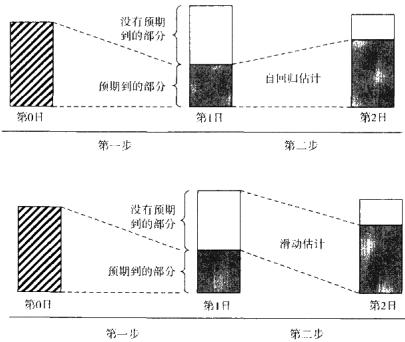  
图8-1自回归模型与滑动模型的区别

在滞后期为 $q$ 时，MA $q$ ）滑动平均模型可用下式来描述：

$$
r _ { \iota } \ = \ c _ { 0 } \ + \ a _ { \iota } \ - \ \theta _ { 1 } a _ { \iota - 1 } \ - \ \cdots \ - \ \theta _ { q } a _ { \iota - q }
$$

式中， $c _ { 0 }$ 是截距， $\theta _ { \ell }$ 是在滞后期 $\iota$ 下的系数； $a _ { \ell }$ 为滞后期 $\iota$ 下收益的未预期部分；  
$\pmb \theta$ 前面的负号只不过是滑动平均模型中惯用的符号，没有其他特殊意义。

为了清楚起见，这里介绍两种主要的方法来进行滑动平均估计。

1．假定初始未预期部分为0，然后由最小二乘法递归地估计其他的未预期值。

2．假定未预期部分为额外的待估计参数，然后用一种叫做最大似然估计（maximum likelihood estimation，MLE）的方法来对参数进行估计。

第一-种方法的估计步骤如下：

1．用自相关分析找到最后一个统计显著的滞后期 $q$ o

2.通过对第一步中向量 $r _ { 1 }$ 的最小二乘回归来估计 $c _ { 0 }$ : ${ \pmb r } _ { 1 } = { \pmb c } _ { 0 } + { \pmb a } _ { r }$ ，假定$a _ { \iota } \sim N ( 0 , \sigma ^ { 2 } )$ 。利用公式 $a _ { i } = r _ { i } - c _ { 0 }$ 来计算 $\alpha _ { 1 }$ 。

3.通过下式的最小二乘回归来估计 $c _ { 0 }$ 和 $\theta _ { \iota } \colon r _ { t } = c _ { 0 } - \theta _ { \iota } a _ { 1 } + a _ { 2 }$ ，其中 $a _ { 1 }$ 已由第2步计算得出。利用公式 $a _ { 2 } = r _ { t } - c _ { 0 } + \theta _ { 1 } a _ { 1 }$ 来计算 $\pmb { a } _ { 2 }$ o

4.重复第3步，直到算出所有的 $a _ { 3 }$ ，…, $\pmb { a } _ { q }$ ，滞后期 $g$ 在第1步已经求出。

5.利用方程 $r _ { \parallel } = c _ { 0 } - \theta _ { 1 } a _ { \scriptscriptstyle { t - 1 } } - \theta _ { 2 } a _ { \scriptscriptstyle { t - 2 } } - \cdots - \theta _ { \varphi } a _ { \scriptscriptstyle { t - q } } + a _ { \scriptscriptstyle { t } }$ 估计MA $\dot { } _ { , 9 }$ ）模型中的参数 $\scriptstyle { c _ { 0 } }$ , $\pmb \theta _ { 1 }$ , $\theta _ { 2 }$ ，…, $\pmb { \theta } _ { \mathcal { G } }$ ，其中 $a _ { \scriptscriptstyle { ( - i ) } } = a _ { \scriptscriptstyle { i } }$ ，这在前面的步骤中已经估计过， $a _ { \prime }$ 是均值为0方差为 $\scriptstyle { \pmb { \sigma } } _ { \mathrm { e } } ^ { 2 }$ 的误差项。

用滑动平均模型进行预测是一件相当直观的事情。对于一步向前预测，我们实际上就是寻找 $E [ r _ { \iota + 1 } ]$ ，对于 $M A ( q )$ 模型而言：

$$
\begin{array}{c} E { \left[ \begin{array} { l } { r _ { t + 1 } } \end{array} | } { \begin{array} { l } { I _ { t } } \end{array} \right] }  \end{array} = E { \left[ \begin{array} { l } { c _ { 0 } - \theta _ { 1 } a _ { t } - \theta _ { 2 } a _ { t - 1 } - \dotsb - \theta _ { q } a _ { t - q } + a _ { t + 1 } } \end{array} | \right]} { \begin{array} { l } { I _ { t } } \end{array} }  
$$

式中， $I _ { t }$ 是 $\pmb { t }$ 时刻所有可用信息的集合。关键是要记住对未预期部分 ${ \pmb { a } } _ { i }$ 的预测有如下性质： $E [ a _ { t + 1 } \mid I _ { \downarrow } ] = 0$ ，并且 $V a r [ a _ { \iota + \iota } \mid I _ { \iota } ] = \sigma _ { a } ^ { 2 }$ 。在这些性质之下，$\pmb { \cal E } [ r _ { t + 1 } \mid I _ { t } ]$ 则变成：

$$
E [ r _ { t + 1 } \mid I _ { t } ] = c _ { 0 } - \theta _ { 1 } a _ { t } - \theta _ { 2 } a _ { t - 1 } - \dotsb - \theta _ { q } a _ { t - q }
$$

同样的，预测误差为 $\begin{array} { r c l } { e \left( \ 1 \ \right) } & { = } & { r _ { i + 1 } - \ E \left[ \ r _ { i + 1 } \ \left( \ 1 \ \right. \ { \ I } _ { \ \ } \right] \ \ = \ a _ { i + 1 } } \end{array}$ ，其方差为$V a r [ e ( 1 ) ] ~ = ~ \sigma _ { o } ^ { 2 }$ 。两步向前预测可以计算如下： $\begin{array} { r } { E [ r _ { t + 2 } \mid I _ { t } ] = E [ c _ { 0 } - \theta _ { 1 } a _ { t + 1 } - } \end{array}$ $\theta _ { 2 } a _ { \iota } - \dots - \theta _ { \varphi } a _ { \iota - \varphi + 1 } + a _ { \iota + 2 } \mid I _ { \iota } ] \ = \ c _ { 0 } - \theta _ { 2 } a _ { \iota } - \dots - \theta _ { \varphi } a _ { \iota - \varphi + 1 }$ 。最后，对于向前 $\iota$ 步预测， $l > q$ 时， $E [ r _ { i * i } \mid I _ { i } ] = c _ { 0 }$ 。

# 自回归滑动平均模型（ARMA）

自回归滑动平均模型将自回归模型和滑动平均模型整合在一个框架之内。例如，对于ARMA（P，q），其表述如下：

$$
r _ { \prime } = \alpha + \sum _ { i = 0 } ^ { r } \beta _ { i } r _ { \prime - i } - \sum _ { i = 0 } ^ { \ast } \theta _ { i } a _ { \prime - i } + \varepsilon _ { \prime }
$$

与滑动平均模型类似，自回归滑动平均模型的参数也是用最大似然方法来

估计的。

# 协整

协整技术被广泛地应用于投资组合优化、对冲以及风险管理之中。协整用来检验一个变量对另一个变量产生的同期或滞后的影响。例如，假设时间序列$\left| x \right.$ 和y分别代表了两种金融证券的价格时间序列，协整方法可以检验出两个时间序列之间的领先——滞后关系。

下式是检验领先——滞后关系的最简单方法，这是由Engle和Granger（1987）最先提出的：

$$
x _ { t } = \alpha + \beta y _ { t } + \varepsilon _ { t }
$$

式（8-20）中的参数可以用最小二乘法来估计，并且要对残差进行平稳性检验。

然而，式（8-20）中描述的协整关系并不能反映一个变量是否驱动或者导致另外一个变量发生。为了检验因果关系，我们常常需要使用另外一种叫做误差修正模型（errorcorrection model，ECM）的方法。在最简单的只有两个变量的情况下（例如对数价格序列），误差修正模型可以写成如下成对的同步方程的形式：

$$
\begin{array} { r l } & { \Delta x _ { \iota } = \alpha _ { 1 } + \beta _ { 1 } \Delta x _ { \iota - 1 } + \beta _ { 2 } \Delta y _ { \iota - 1 } + \gamma _ { 1 } z _ { \iota - 1 } + \varepsilon _ { 1 } } \\ & { } \\ & { \Delta y _ { \iota } = \alpha _ { 2 } + \beta _ { 3 } \Delta x _ { \iota - 1 } + \beta _ { 4 } \Delta y _ { \iota - 1 } + \gamma _ { 2 } z _ { \iota - 1 } + \varepsilon _ { 2 } } \end{array}
$$

式中， $\Delta$ 是一阶差分算子； $z _ { t }$ 是一个平稳的协整向量。由式（8-20)， $z _ { \ell } = x _ { \ell } -$ $\alpha \mathrm { ~ - ~ } \beta y _ { \varepsilon }$ 。式（8-21）用最小二乘法同步估计。系数 $\gamma _ { 1 }$ 和 $\gamma _ { 2 }$ 限制了与通过式（8-20）得到的长期均衡值的偏离，是ECM模型中的“误差修正”项。

如果在 $\Delta x$ 的方程中，滞后一期 $\boldsymbol { y }$ 的系数 $\beta _ { 2 }$ 是显著的，那么 $\boldsymbol { y }$ 的改变就会引起 $_ { x }$ 的改变。用Granger因果关系检验的术语来说，就是 $\boldsymbol { y }$ “导致” $_ x$ 。这种因果关系的方向和强度都可能会随着时间而发生变化。

协整理论广泛地应用于检验跨资产交易信号产生过程中的领先-滞后关系。协整理论还是投资组合管理和对冲操作中的重要组成部分。

# 波动率建模

如今大部分的波动率模型都涉及对未来收益的一些组成部分进行预测。这些预测包括的范围很广，从点预测到预测收益率的分位数，再到预测未来收益率的概率分布。资产组合管理人利用这些预测来优化其投资组合的表现，风险管理人员用它来限制其交易的下行风险，量化交易人员则用它来开发更好的交易模型。根据Engle和 Patton（2001，p.238）的说法：

今天一个风险管理人员必须知道他所管理的投资组合在未来下行的可能性有多大。对于期权交易员，他会想知道合约生命期之内的波动率有多大。为了对冲这个合约，他还想知道他的预测的波动性如何。投资组合经理可能想在股票或投资组合的波动性变得过大之前卖掉它们。做市商可能想在未来波动性会变大的时候扩大买卖价差。

一个好的波动率模型需要恰当地对波动率进行预测：

1．波动率具有持续性。  
2.波动率具有均值回归的特性。  
3.市场收益可能会对波动率有不对称的影响。  
4.外界（外生）变量可能会影响波动率。

波动率的持续性有时也称为“波动聚类”。这个现象描述了波动率水平的持续性。如果今天的波动率很高，那么明天的波动率可能依然很高；反过来也是这样，当前这段时期的波动率较低，很有可能接下来一段时间的波动率也比较低。

波动率的持续性意味着“干扰”（通常是大的价格变动）因素会在多个观察期之前就对预期波动率的度量值形成影响。Engle和Patton（2001）的研究表明，干扰对未来预期波动率的影响呈几何级数下降，但是这一干扰在一年之后的期权数据中仍然能够体现出来。

波动率的均值回归特性描述了波动率向内在最优水平回归的现象。因此，如果波动率在之前一段时间比较高的话，由于波动率的持续性，在接下来的一段时间内，波动率仍然会较高，但是，它最终还是要回复到正常水平。一个有用的比较波动率模型的办法就是比较各个模型向前多期的预测值。根据波动率的均值回归特性，所有波动率模型的长期预测值都应该收敛到相同的内含波动率，这是一个固定的数值。

人们发现市场收益率正面的干扰和负面的干扰对接下来的波动率的影响是不同的。市场崩盘或其他的负面干扰所引起的市场波动水平要高于市场上涨等利好消息所引起的波动水平。波动率的这种不对称特征让不同执行价格的期权隐含波动率曲面产生偏斜。Engle和Patton（2001）举出波动率偏斜的例子：实值看跌期权的隐含波动率低于当值看跌期权的隐含波动率，当值看跌期权的隐含波动率又低于虚值看跌期权的隐含波动率。

最后，波动率预测可能会受外界事件的影响，比如新消息的发布等。例如，在外汇市场上，货币对的任何一方有重大宏观经济事件发生时，货币对的价格和收益率的波动都会大幅上升。

波动率的预测有很多种方法。最简单的波动率预测方法假定波动率是恒定且不随时间变化的，因此，未来的波动率与用历史数据估算出来的波动率相等。在这种情况下，未来平方形式的波动率 $\sigma _ { \iota * 1 } ^ { 2 }$ 就是证券或投资组合过去收益率的方差：

$$
E _ { t } \big [ { \sigma } _ { \iota + 1 } ^ { 2 } \big ] \ = \ \sigma _ { \iota } ^ { 2 } \ = \ \sigma ^ { 2 } \ = \frac { 1 } { t - 1 } \sum _ { \tau = 1 } ^ { i } \ ( R _ { \tau } - \bar { R } ) ^ { 2 }
$$

当然，波动率可能会随着时间而变化。证券波动率展现出的这种随时间变化而变化的特征叫做“异方差”性，其中术语“异方差”指的是变化的波动率，术语“同方差”描述的是恒定的波动率。

对随时间变化的波动率进行建模的方法之一是假设它在短期内保持不变，这个时期叫做波动率的估计窗口。如此一来，波动率就可以用证券在时间窗口内的收益率进行估计：

$$
E _ { \iota } [ \sigma _ { t + 1 } ^ { 2 } ] \ = \frac { 1 } { T - 1 } \sum _ { \tau = t - \tau + 1 } ^ { t } \ ( R _ { \tau } - \bar { R } _ { \iota } ) ^ { 2 }
$$

$$
\smash { \widetilde { R } = \frac { 1 } { T } \sum _ { \tau = \tau - T , \tau } ^ { i } R _ { \tau } }
$$

与移动平均估计相似，用于估计波动率的窗口也随时间移动，以获得最新估计。根据中心极限定理，每个用于预测收益率的时间窗口至少应当包含30个观测值。而窗口内收益率序列的时间间隔则可以是任意短——三十个1秒钟收益率数据可以用来估计分钟内的波动率。

移动窗口方法对样本中的所有观测值赋予相同的权重。最早的收益率变动和最新的收益率变动的权重相等，可是，最新的变动可能与目前关系更大，对未来收益率的预测能力更强。为了解决这个问题，人们提出了几种在波动率估计窗口中对收益率进行加权的方法。

最简单的加权方法是线性或三角加权：时间窗口内的 $\boldsymbol { \tau }$ 个观测值分别乘以一个反映其在时间窗口内序号的系数。最早的观测值权重最低，最新的观测值权重最高。然后可以根据式（8-25）算出 $\ell + 1$ 时刻方差的预测值：

$$
E _ { \iota } \ [ \sigma _ { \iota + 1 } ^ { 2 } ] \ = \ \sum _ { \tau : \iota - T + 1 } ^ { \iota } \big ( \frac { \tau - t + T } { T } R _ { \tau } - \bar { R } _ { \iota } \big ) ^ { 2 }
$$

其中：

$$
\overline { { R _ { \iota } } } \ = \ \sum _ { \tau = \tau + 1 } ^ { \iota } \frac { \tau - \iota + T _ { \cal { R } } } { T } { R } _ { \ \tau }
$$

还有一种指数加权方式同样是对近期的观测值赋予较高的权重。这种方法使用几何系数 $\pmb { \lambda }$ 对波动率估计窗口中的观测值进行加权。这个几何系数常称为“平滑参数”（smoothing parameter)，它在估计中的应用如下：

$$
E _ { \iota } \ [ \ \sigma _ { \iota \star 1 } ^ { 2 } ] \ = \ \sum _ { \prime \bullet \iota \ – \tau \bullet 1 } ^ { \iota } \ [ \lambda ^ { \iota - \tau } \big ( 1 \ - \lambda \big ) R _ { \tau } \ - \ \overline { { R _ { \iota } } } ] ^ { 2 }
$$

$$
\overline { { R _ { \mathfrak { r } } } } = \sum _ { \mathfrak { r } \bullet \mathfrak { r } \bullet \mathfrak { r } \bullet \mathfrak { l } } ^ { \bullet } \mathbb { I } \lambda ^ { \iota \sim \tau } ( 1 - \lambda ) R _ { \mathfrak { r } } ]
$$

平滑参数一般是对历史数据采用最大似然方法估计出来的。RiskMetricsT估计出的 $\pmb { \lambda }$ 是0.94，但是 $\pmb { \lambda }$ 会随着证券的不同而不同，也会随着波动率估计窗口中观测值数量 $\pmb { T }$ 的不同而改变。

图8-2用图示的方法比较了波动率估计中简单等权重移动窗口、三角移动窗口和指数移动窗口权重的形状。

波动率的移动窗口估计模型没能抓住波动率的一个重要特征：“波动聚

A：等权重估计

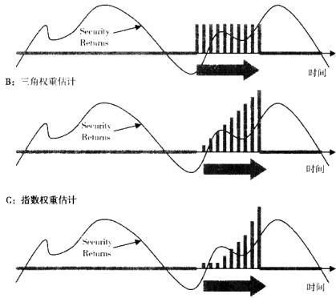  
图8-2时间窗口波动率估计中几种不同的加权方法

类”，波动聚类描述了波动率的持续性现象。目前的高波动率水平不会迅速回归到较低的波动率水平，而是会在数个时间周期内继续维持较高的波动。对于低波动率的阶段同样如此；当前较低的波动水平会让接下来一段时期的波动率水平继续保持低位。

为了描述波动聚类现象，研究者运用了自回归滑动平均模型技术：

$$
\sigma _ { \iota } ^ { 2 } \ = \ \alpha _ { 0 } \ + \ \sum _ { i = 1 } ^ { n } \ \alpha _ { i } \alpha _ { i - i } ^ { 2 } \ + \ \sum _ { j \neq 1 } ^ { i } \ \beta _ { j } \sigma _ { { t } { - j } } ^ { 2 }
$$

式中， $\pmb { a } _ { i } = \pmb { \sigma } _ { t } z _ { i } \ ; \ \{ z _ { i } \}$ 是均值为0方差为1的独立同分布随机变量序列。附加的平稳性条件包括 $\alpha _ { 0 } > 0 , \alpha _ { i } \geqslant 0 , \beta _ { j } \geqslant 0$ 并且 $\begin{array} { r } { \sum _ { k = 1 } ^ { \mathsf { m a x } ( m , s ) } \left( \alpha _ { k } + \beta _ { k } \right) < 1 } \end{array}$ 。这种波动率模型叫做广义自回归条件异方差模型（GARCH），它是由Bollerslev（1986）对Engle（1982）的ARCH模型进行推广而得的。

GARCH模型的参数常常使用最大似然方法进行递归估计而得，并且用时间窗口方法估计的波动率值作为 $\sigma _ { 0 }$ 的种子。对GARCH模型还有很多推广，比如在等式右边增加用于控制外界事件的解释变量，用于描述收益率对正面干扰和负面干扰（利空消息带来的市场波动大于利好消息带来的波动）不对称响应特性的指数“EGARCH”模型，以及考虑到证券收益与证券波动率相关性的“CARCH-M”模型，等等。

除了移动窗口和GARCH波动率模型之外，比较常用的波动率度量方法还包括称为“实际波动率”（realizedvolatility）的期间内波动率估计量；有好儿种模型是基于期间内价格幅度的；在一种随机波动率模型（stochasticvolatilitymodel）中，波动率被认为是从特定分布中抽取的随机变量。Andersen、Boller-slev、Diebold和Labys（2001）提出的实际波动率是通过将时间样本区间等间隔地拆分成n个较小的子样本区间，再将它们区间内的收益平方后加总而得到的：

$$
R V _ { \varepsilon } ~ = ~ \sum _ { i = 1 } ^ { n } ~ r _ { i , i } ^ { 2 }
$$

基于幅度的波动率模型是用每个时间区间内开盘价、最高价、最低价和收盘价综合而得的。例如Garman和Klass（1980）发现，以下所有的波动率估计量噪声都比传统的基于收益率方差的估计量的噪声要低（ $O , \ , \ H , \ L _ { e }$ 以及 $C _ { \iota }$ 分别表示时期t内的开盘价、最高价、最低价及收盘价）：

$$
\hat { \pmb { \sigma } } _ { 1 , i } ^ { 2 } = \frac { ( O _ { i } - C _ { t - 1 } ) ^ { 2 } } { 2 f } + \frac { ( C _ { i } - O _ { i } ) ^ { 2 } } { 2 ( 1 - f ) } , 0 < f < 1
$$

$$
\hat { \sigma } _ { 2 , i } ^ { 2 } = \frac { ( H _ { i } - L _ { i } ) ^ { 2 } } { 4 \mathrm { l n } ( 2 ) }
$$

$$
\hat { \sigma } _ { 3 , \iota } ^ { 2 } \ = 0 . 1 7 \frac { ( O _ { \iota } - C _ { \iota - 1 } ) ^ { 2 } } { f } + 0 . 8 3 \frac { ( H _ { \iota } - L _ { \iota } ) ^ { 2 } } { ( 1 - f ) 4 \mathrm { l n } \ ( 2 ) } , \ 0 \ < f < 1
$$

$$
\hat { \sigma } _ { 5 , \iota } ^ { 2 } \ = \ 0 . 5 \ ( H _ { \iota } \ - \ L _ { t } ) ^ { 2 } \ - \ [ 2 ] { \mathbf { n } } \ ( 2 ) \ - 1 ] \ ( C _ { \iota } \ - \ O _ { t } ) ^ { 2 }
$$

$$
\hat { \sigma } _ { 6 , \iota } ^ { 2 } \ = 0 . 1 2 \frac { ( O _ { \iota } - C _ { \iota - 1 } ) ^ { 2 } } { f } + 0 . 8 8 \frac { \hat { \sigma } _ { 5 , \iota } ^ { 2 } } { 1 - f } \ 0 \ < f < 1
$$

GARCH模型假设波动率是滞后观测值及其方差的一个决定性函数。这个决定条件非常严格，以致难以反映波动率的动态本质。另外--种不同类型的波动率估计量——随机波动率估计量——就没有使用函数的形式对波动率的条件

异方差性以及波动聚类特性进行建模。

最简单的随机波动率估计量可以定义如下：

$$
v _ { t } \ = \ \sigma _ { t } \xi _ { t } \ = \ \zeta \exp \ ( \alpha _ { t } / 2 ) \xi _ { t }
$$

式中， $\alpha _ { i } = \varphi \alpha _ { i \cdot 1 } + \eta _ { i }$ 是用来描述波动率持续性的参数； $| \varphi | < 1 : \xi _ { t }$ 是一个均值为0方差为1的独立同分布的随机变量； $\boldsymbol { \zeta }$ 是正值常量。

随机波动率模型很好地反映了波动率内在的随机性，但是随机波动率很难估计。式（8-36）中的参数通常用最大似然法或者相近的计量技术来估计。由于随机波动率模型的随机性，这个模型的估计过程相当复杂。相对于估计随机波动率模型而言，估计GARCH模型真可谓是小菜一碟。

# 非线性模型

# 概要

顾名思义，非线性模型能够描述数据之间的复杂关系。

与本章第一部分所讨论的线性模型有所不同，非线性模型预测的是那些不能表示成其他同期或滞后期随机变量线性组合的随机变量。相反，非线性模型可以用其他一些随机变量的函数f．）来表示。写成数学公式的形式，线性模型可以用式（8-37）表示（为了方便起见，这里列出此式），非线性模型可以用式（8-38）表示：

$$
y _ { \iota } \ = \ \alpha + \ \sum _ { i = 0 } ^ { \infty } \ \beta _ { i } x _ { \iota - i } \ + \ \varepsilon _ { \iota }
$$

$$
y _ { \ell } = f ( x _ { \ell } , x _ { \ell - 1 } , x _ { \ell - 2 } , \cdots )
$$

式中， $\{ \boldsymbol { y } _ { t } \}$ 是待预测的随机变量时间序列； $\{ x _ { t } \}$ 是预测 $\{ \boldsymbol { y } _ { \imath } \}$ 的一个显著因素； $\pmb { \alpha }$   
和 $\beta$ 是待估参数。

基于先前可获得信息的一步向前预测常常用布朗运动来表示，如式（8-39）所示：

$$
y _ { \iota + \mathfrak { t } } = \mu _ { \iota + 1 } + \sigma _ { \iota + 1 } \xi _ { \iota + 1 }
$$

式中， $\mu _ { t + 1 } ~ = ~ E _ { t } ~ [ \dot { y } _ { t + 1 } ]$ 是所预测变量均值的一步向前预测值； $\sigma _ { \iota + 1 } =$ $\sqrt { \operatorname { v a r } _ { t } { \mathrm { ~ I ~ } } _ { { \pmb x } _ { t + 1 } } } 1$ 所预测变量波动率的一步向前预测值； $\xi _ { t + 1 }$ 是均值为0方差为1的独立同分布的随机变量。 $\xi _ { t + 1 }$ 通常成为一个标准的扰动或者更新。

非线性模型常用于衍生品或其他复杂衍生品的定价。事实上，很多读者都认为式（8-39）是衍生品定价模型的基石。

这里，我们简短地回顾一下非线性估计方法：

●泰勒序列展开法（双线性模型）   
●门限自回归模型   
●马尔科夫转移模型   
●非参数估计   
●神经网络

如果需要详细地了解这些非线性模型，请参照 Priestley（1988）和Tong（1990）的研究。

# 泰勒序列展开法（双线性模型）

应对非线性函数一个最简单的方法就是用泰勒序列展开法将它们线性化。单变量函数 $f ( x )$ 在某个特定值 $^ a$ 附近的展开式是基于 ${ \bf \nabla } \cdot f ( \mathbf { \sigma } _ { x } )$ 微分形式的对 $f ( x )$ 的近似，其定义如下：

$$
f ( \chi ) \ = f ( \ a ) \ + \left( x - a \right) \frac { \mathrm { d } f ( x ) } { \mathrm { d } x } \ \lvert _ { x = a } \ + \frac { 1 } { 2 } \left( x - a \right) ^ { 2 } \frac { \mathrm { d } ^ { 2 } f ( x ) } { \mathrm { d } x ^ { 2 } } \ \lvert _ { x = a } \ + o \big ( f ( x ) \big )
$$

式中 $\mathcal { f } ( a )$ 是函数 $f ( x )$ 在 $^ { a }$ 点的值； $\frac { \mathrm { d } f ( x ) } { \mathrm { d } x } \mid _ { x = a }$ 是函数 $f ( x )$ 在 $\textit { \textbf { x } } = \textit { \textbf { a } }$ 时的斜率； $\frac { \mathrm { d } ^ { 2 } f ( x ) } { \mathrm { d } x ^ { 2 } } \mid _ { x = 0 }$ 是函数 $f ( x )$ 在 $^ { a }$ 点的曲率； $o ( f ( x )$ ）是函数 $f ( x )$ 的高阶导数项。高阶导数项 $o ( f ( x )$ )一般较小，通常在估计中可以忽略不计。

Granger和Andersen（1978）将式（8-40）转化为以下线性计量公式：

$$
y _ { i } = \alpha + \sum _ { i = 1 } ^ { p } \phi _ { i } y _ { i - i } - \sum _ { j = 1 } ^ { 4 } \theta _ { j } x _ { i - j } + \sum _ { i = 1 } ^ { 0 } \sum _ { j = 1 } ^ { i } \beta _ { i j } y _ { i - i } x _ { i - j } + \varepsilon _ { i }
$$

式中， $P \ , \ q \ , \ m$ 以及 $s$ 都是非负整数。

泰勒序列展开可以运用于跨市场衍生品/标的证券套利模型的估计。

# 门限自回归（TAR）模型

门限自回归模型在自变量不同的门限范围之内采用不同的线性函数来逼近非线性函数。例如，模型可能会对正的自变量和负的自变量采用不同的函数形式，另外，对大的正值和负值也采用不同的线性模型。这种方法可以用于对套利模型进行估计。图8-3阐明了这种方法的理念。

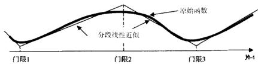  
图8-3非线性函数的分段线性近似

图8-3所示的TAR的一个例子可能就如同以下AR（1）模型：

$$
\begin{array} { r } { \gamma = \left\{ \begin{array} { l } { - 5 \gamma _ { t - 1 } + \varepsilon _ { t } , \frac { \dot { \varepsilon } \dot { \log \mathcal { R } } } { 2 } y _ { t - 1 } < \dot { \lceil \rceil } \mathfrak { R } \textbf { 1 } } \\ { 5 \gamma _ { t - 1 } + \varepsilon _ { t } , \quad \dot { \mathfrak { m } } \mathscr { R } y _ { t - 1 } \ \in \textbf { ( } \dot { \lceil \rceil } \mathfrak { R } \textbf { 1 } , \dot { \mapsto } \ddot { \mathbb { R } } \textbf { 2 } ) } \\ { - 5 \gamma _ { t - 1 } + \varepsilon _ { t } , \frac { \dot { \varepsilon } \dot { \log \mathcal { R } } } { 2 } y _ { t - 1 } \ \in \textbf { ( } \dot { \lceil \rceil } \mathfrak { R } \textbf { 2 } , \dot { \lceil \rceil } \mathfrak { R } \textbf { 3 } ) } \\ { 5 \gamma _ { t - 1 } + \varepsilon _ { t } , \quad \dot { \varepsilon } \mathfrak { m } \mathscr { R } y _ { t - 1 } > \dot { \lceil \rceil } \mathfrak { R } \textbf { 3 } } \end{array} \right. } \end{array}
$$

TAR主要的问题是在阀值处模型的不连续性。有人提出平滑转换自回归模型（smooth transitionAR，STAR）来解决TAR模型的不连续问题。有关STAR模型的细节，请参照Chan与Tong（1986）的文章以及Terasvirta(1994）的文章。

# 马尔科夫转移模型

马尔科夫模型是一种拥有有限个互斥“状态”的模型，这些状态可以被定义为前文所述TAR模型中连续的门限区间，也可以定义为其他的一些不连续值，比如反映总体经济状态的外生变量等。与TAR模型不同的是，在马尔科夫模型中，任何一个状态都有一定的概率转移到另一个状态。这种转移概率通常由历史数据估计得出或者理论分析得出。

例如，考虑一个两状态马尔科夫模型，在每个状态下都具有线性AR

（1）性质，则其特征可表示如下：

$$
y _ { \iota } \ = \ \left\{ { \begin{array} { l } { - 5 y _ { \iota - 1 } \ + \varepsilon _ { \iota } , \ \notin \mathbb { I } \mathbb { I } \mathbb { R } \ s _ { \iota } \ = \ 1 } \\ { \qquad \quad \quad \quad \quad \quad \quad \quad \quad \quad \quad \quad \quad \quad \quad } \\ { 5 y _ { \iota - 1 } \ + \varepsilon _ { \iota } , \ \quad \ \quad \displaystyle \mathrm { i n } \mathbb { H } \ s _ { \iota } \ = \ 2 } \end{array} } \right.
$$

其中 $\pmb { s } _ { t }$ 表示 $\pmb { \gamma } _ { \pmb { \imath } }$ 的“状态”，定义好状态之后，状态之间的转移概率可以定义如下：

$$
\begin{array} { r l } & { P ( s _ { i } = 2 \mid s _ { i - 1 } = 1 ) = p _ { 1 } } \\ & { P ( s _ { i } = 1 \mid s _ { i - 1 } = 1 ) = 1 - p _ { 1 } } \\ & { P ( s _ { i } = 1 \mid s _ { i - 1 } = 2 ) = p _ { 2 } } \\ & { P ( s _ { i } = 2 \mid s _ { i - 1 } = 2 ) = 1 - p _ { 2 } } \end{array}
$$

运用马尔科夫过程的高级统计特征，我们可以看到两状态马尔科夫过程在状态1停留的时间正比于 $1 / { p _ { 1 } }$ ，与此同时，这个两状态马尔科夫过程在状态2停留的时间正比于 $1 / p _ { 2 }$ 。

马尔科夫转移模型可以用于估计限价交易或者其他指令执行优化过程中的交易等待时间以及成交概率等，还可以用于估计跨市场套利机会。

# 非线性模型的非参数估计

非参数估计指的是一个大类的计量模型，这类计量模型对估计误差或者自变量和因变量之间的函数关系没有什么先人为主的假设。这里讨论的有类非参数模型能让我们根据历史数据直接得出自变量和因变量之间的函数关系。这类非参数技术可以归结为将数据平滑至函数的形式。

非线性模型的非参数估计旨在估计以下函数：

$$
y _ { \varepsilon } = f ( x _ { \varepsilon } ) + \varepsilon _ { \varepsilon }
$$

式中， $\{ _ { \pmb { \mathscr { s } } _ { t } } \}$ 是正态分布的残差时间序列； $f ( . )$ 是待估计的任意且平滑的函数； $f ( x )$ 在每个点 $x \ = \ X$ 的值由简单的平均平滑方法决定，这种方法对式（8-46）两边求跨时间的均值，并且利用了 $E : { \boldsymbol { \varepsilon } } ^ { } ] = 0$ 的事实，它假设：

$$
E [ \ : y ] = f ( \pmb { x } ) + E [ \ : \varepsilon ] = f ( \pmb { x } )
$$

或者，等价的：

$$
f ( x ) = { \frac { 1 } { T } } \sum _ { \mid \cdot \mid } ^ { T } y ,
$$

式中， $\pmb { T }$ 是样本的规模。

为了保证估计 $f ( x )$ 时只使用了 $_ x$ 周围的值，而非整个时间序列，我们可以对 $\boldsymbol { y } _ { t }$ 的值用权重函数 $\omega _ { \varepsilon } ( x )$ 进行加权。权重由另一个函数决定，该函数常称为“核函数”，记为 $K _ { k } ( x )$

$$
w _ { \prime } ( x ) = \frac { K _ { \mathrm { h } } ( x - x _ { \prime } ) } { \displaystyle \sum _ { t = 1 } ^ { T } K _ { \mathrm { h } } ( x - x _ { t } ) }
$$

权重函数 $\omega _ { \ast } ( x )$ 决定了过滤窗口的位置，离现在要估计的 $\mathbf { x }$ 值近的y值就会包含进来，而在过滤窗口之外的y值就统统略去。核函数 $\smash { K _ { h } ( x ) }$ 决定了过滤窗口的形状。随着窗口连续地移过 $x \mathrm { ~ , ~ } y$ 值也会因为其与估计的关联性而进人或离开估计窗口。对于所有考虑的 $\boldsymbol { y }$ 值，其权重 $\pmb { \omega }$ 之和必须为1，$\pmb { K } ( \pmb { x } )$ 可以定义为概率密度函数， $K _ { \ast } ( x ) \ > 0$ 并且 $\int K _ { \mathfrak { h } } ( z ) d z \ = \ 1$ 。

图8-4展示了用高斯核函数进行核估计的过程，高斯核函数的分布为正态分布：

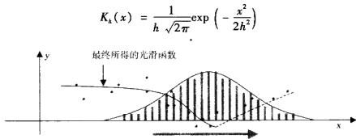  
图8-4利用正态核函数进行核估计

估计窗口的宽度可以通过一个叫做带宽的参数来控制，该参数通过式（8-50）所示的方式进人到核函数之中：

$$
K _ { h } ( x ) \ = \ \frac { 1 } { h } K ( x / h )
$$

Fan和Yao（2003）发现，最优的带宽参数 $h$ 等于 $1 , 0 6 s T ^ { - 0 . 2 }$ ，其中 $s$ 是样本 $\pmb { x }$ 的标准差， $_ { T }$ 是样本总规模。

使用各种核函数的核平滑方法常常用于过滤数据，即消除异常值和其他噪声等。

# 神经网络

神经网络是一种半参数法估计方法。“神经网络”这个术语有时候被理解为发出高频系统的高等复杂信号。事实上，神经网络常常是用来简化一些计量问题的计算方法的。

本质上而言，神经网络是相互连接的规则的集合，这些规则依据实时数据的情况而有选择地依次触发。Caudill（1988，p.53）将神经网络定义为“一个由若干简单的、高度互联的处理单元组成的计算系统，其中每个处理单元都根据自身的动力特性对外部输入做出反应。”一个最简单的神经网络可以依据图8-5进行构建：

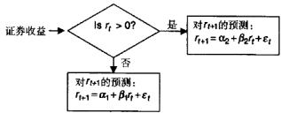  
图8-5一个用前期收益率数据预测未来收益率的简单神经网络。预测参数 $\hat { \pmb { \alpha } } _ { 1 }$ $\hat { \alpha } _ { 2 }$ $\hat { \boldsymbol { \beta } } _ { 1 }$ $\hat { \boldsymbol { \beta } } _ { z }$ 根据历史数据估计得出

更加高级的神经网络可以同时含有多个输人单元，并在此基础上包含多个决策单元。神经网络还可以含有反馈机制，例如，上一期的输出结果可以当做这一期的输入数据。

神经网络的主要优势是其简单的逐步递进结构（step-by-step structure）可以显著地提高预测算法的执行速度。神经网络在预测过程中既可能用到对分布的假设，也可能用到基于规则的系统，因此，神经网络是一种半参数算法。

# 结论

计量经济学为我们提供了很多给数据之间的依存关系进行建模的数学工具。线性模型假定数据之间的相互关系是直接的或线性的，而非线性模型则包含了一系列应对更为复杂关系的数学函数。第9章还介绍了其他一些高频估计模型。

# 处理分笔数据

交易机会很大程度上取决于识别这些机会的数据。正如我们在第7章中讨论的那样，数据频率越高，套利机会越多。因此，当我们研究可盈利的交易机会时，很重要的一点是数据的时间间隔越短越好。近来市场微观结构和计量经济学的进展为我们理解分笔数据的独特性质提供了有力的工具。传统的低频数据是等时间间隔的，而分笔数据则是在很短的时间内随机到达的，其时间间隔是不规则的，这种不规则性给研究者和交易者提供了大量在低频数据集中无法获得的信息。两笔交易之间的时间间隔可能会反映出市场波动性、流动性等很多其他因素的变化，这一点将在本章的剩余部分继续讨论。

此外，庞大的数据量也有助于研究者做出具有统计显著性的推断。正如Dacorogna等人（2001）指出的那样，大的数据集允许的自由度更大，因此能够容纳更多的输入变量（参数）。

最后，大量的分笔数据还让研究者利用短期数据就能做出有关市场最新变化的具有统计显著性的推断。如果拿日线数据进行统计预测的话，通常一个月的时间太短了，无法得出什么有意义的结果，然而，同样是一个月的分笔数据，其数据量却足够用来进行实用的短期估计。其他一些与频率有关的因素，比如日内季节性，在评估观测值是否足够时必须予以考虑。

本周将讨论如下一些话题：

●分笔数据的各种特征●专门用于分笔数据的计量经济学技术●交易系统如何利用分笔数据做出更好的交易决策●交易系统如何利用传统的计量经济学原理

# 分笔数据的属性

最高频率的数据就是“分笔”数据，这些数据包含最新报价、成交、价格和交易量等信息。分笔数据通常具有如下属性：

●时间戳   
●金融证券识别码（identification code)   
●说明包含哪些信息的字段 ●买价(bid price) ●卖价(ask price) ●申买量(available bid volume) ●申卖量(available ask volume) ●最新成交价（last trade price) ●最新成交量（last trade size) ●期权特有数据，例如隐含波动率

●市场信息的具体值，例如价格的实际数值、申买和申卖的量或者规模。

时间戳记录了报价出现的日期和时间。它可能是交易所或者经纪自营商发布报价的时间，也可能是交易系统接收到报价的时间。报价从交易所或经纪自营商到达交易系统的时间可以短到20毫秒。因此，所有精细的系统都会将毫秒作为其时间戳的一部分。

报价的另一部分是金融证券的识别码。在股票之中，识别码可以是股票代码（ticker）；对于同时在多个交易所交易的股票，识别码可以是股票代码加上交易所代码；对于期货而言，识别码由标的资产、期货到期日以及交易所代码组成。

最新成交价显示最近一笔交易的成交价格。最新成交价可能与买价和卖价都不同。这种情况的产生是因为有客户挂出了优惠的限价指令，该指令马上被经纪商匹配成交，而没有向外界发布。最新成交量显示了最后一笔交易

的实际成交规模。

买价是在市场上卖出证券可获得的最高价格。卖价是在某一时刻买人证券可获得的最低价格。买价和卖价都是其他市场参与者通过限价指令提供的。一个以最高价格买人但尚未成交的限价指令就成为市场买价，一个比委托单簿中其他限价指令的卖价都要低的限价指令就成为市场卖价。申买量和申卖量分别表示在买价和卖价上的总需求。

# 分笔数据的数量和质量

高频数据量非常庞大。根据Dacorogna等人（2001）的研究，单日内分笔数据的量抵得上30年日数据的量。然而，数量并不总是等同于质量。集中交易的交易所通常会提供具有合理时间戳、精确的买价卖价，以及每笔交易的交易量。限价指令单簿的信息不是那么容易获得。在非集中交易的市场上，比如外汇市场或银行间货币市场，在任意时间点都无法获得整个市场的报价数据。在这样的市场当中，参与者知道月前的价格水平，但是每个机构都根据他们的限价指令单簿调整自己的报价。在非集中市场，每位自营商只能向客户提供自己的分笔数据。因此，在任一给定时间，同一个金融工具在每个自营商那里的报价都是不同的。Reuters、Telerate和KnightRidder等几家公司将不同交易商的报价数据收集到一起，再把这些报价反馈回来，这提高了非集中市场的效率。通常认为，自营商间报价的不一致性会产生三种异象。

每个自营商的报价都反映了他们的存货状况。例如，如果一个自营商刚刚向客户卖出1亿美元的美元/加元，他此时会很想分散他的头寸风险，并避免卖出更多的美元/加元。然而，大部分的自营商有义务与他们的客户在可交易的报价上进行交易。为了鼓励客户下达美元/加元卖出指令，自营商会临时提高美元/加元的买人报价。同时，为了引导客户暂缓下达买人指令，自营商会提高美元/加元卖出报价。因此，当自营商持有某金融工具空头头寸时，自营商会倾向于同时提高买价和卖价，当其持有不成比例的多头头寸时，会同时降低买价和卖价。

在匿名市场中，比如黑池，自营商和做市商可能会发布比之前报价低很多的指示性报价来评估市场的供给和需求，并以此来搜集市场信息。

Dacorogna等人（2001）发现，一些自营商的报价可能滞后于实际的市场价格。这种滞后从几毫秒到一分钟不等。一些自营商根据其他自营商报价的移动平均水平进行报价。自营商提供滞后报价往往是为了显示他们在数据传输中的市场存在。尤其在大部分指令价格是通过电话协商时更是如此，这允许报价和指令之间存在相当长的滞后。快节奏的电子市场限制了滞后报价，从而改善了市场品质。

# 买卖价差

在任意给定时间，买人报价和卖出报价之间的差成为买卖价差（bid-askspread）。买卖价差是即时买入并卖出证券所需的成本。买卖价差越大，一次证券交易的收益就要越高，这样才能覆盖价差以及其他交易成本。大多数低频价格变动都足够大，买卖价差与之相比完全可以忽略。但对于分笔数据而言，价格变化与买卖价差相当，甚至还要更小。

买卖价差通常在一个交易日内会有所变化。图9-1展示了2008年10月最后两周机构欧元/美元市场平均价差的周期性变化。如图9-1所示，在市场比较平静的东京交易时间段内，平均价差大幅增长。在伦敦和纽约交易时间段的交叠处，由于市场上有很多活跃的买家和卖家，价差达到最低水平。2008年18\~19日周末的时候，价差达到峰值，这反映了市场对2008年10月17日雷曼高级执行官由于雷曼兄弟涉嫌证券欺诈而受到法院传唤事件的担忧。

买卖价差通常在市场不确定或不稳定时有所增长。例如，图9-2比较了2008年7月至8月市场稳定时期和2008年9月至10月危机时期欧元/美元的平均买卖价差。如图9-2所示，无论是在危机时期还是正常时期，日内价差的模式都是一致的，但是在全天每--个小时里，金融危机期间的价差大大高于正常市场情况下的价差。图9-2还显示，价差的增加并不是一天之中每个小时都始终如一的。在格林尼治时间12点到16点，也就是伦敦和纽约交易时间段重合的部分，欧元/美元平均每小时价差增加了 $0 . 0 0 4 8 \%$ （0.48个基点）。在格林尼治时间0点至2点；即东京交易时间，价差增加了

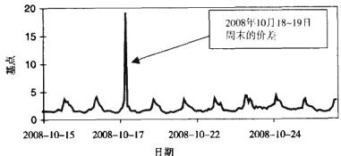  
图9-12008年10月最后两周欧元/美元现货平均每小时买卖价差，交易规模的中位数是500万美元

$0 , 0 1 5 6 \%$ ，超过纽约/伦敦交易时段的平均增幅的3倍。

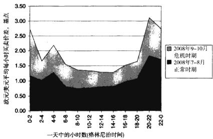  
图9-2正常市场情况以及金融危机情况下每天不同小时之间平均买卖价差的比较

不确定时期和危机时期，买卖价差的增加会导致高频策略盈利能力的下降。例如，与正常市场情况相比，2008年9月和10月在亚洲时段交易欧元/美元的高频策略的交易成本会显著提高。一个在亚洲时段执行100次交易的策略会因为买卖价差的增加损失掉1.56个百分点的利润，而同样的策略在伦敦和纽约时段运行每日交易利润的损失为0.48个百分点，这个数字虽然仍然不容忽视，但是相对而言已经小了很多。对于为流动性较低的金融工具设计的高频交易策略，这种情况甚至可能会更加严重。例如，在2008年9月至10月，新西兰元/美元（没有显示）买卖价差的平均值比2008年7月至8月增长了三倍。

未来的买卖价差可以用Roll（1984）提出的模型进行估计，模型假设资产在时刻 ${ \pmb t }$ 的价格 $p _ { \varepsilon }$ 等于一个不可观测的基础变量 $m _ { \iota }$ ，外加买卖价差s的一半作为补偿。如果下一个市价指令是买入指令，则价格的补偿值是正的，下笔交易为卖出指令则补偿为负的，如式（9-1）所示：

$$
p _ { \varepsilon } ~ = ~ m _ { \varepsilon } + { \frac { s } { 2 } } I _ { \varepsilon }
$$

其中：

$$
I _ { \star } = \{ \begin{array} { l } { { 1 , \quad \forall \big \} / \exists \big / \hat { \star } \mathcal { W } \not \to \exists \mathrm { : } \emptyset \mathrm { : } \emptyset } } \\ { { - 1 , \lfloor \downarrow \lambda \rfloor \exists \big \langle \emptyset \big \rangle \not \to \emptyset  \emptyset \mathrm { : } \not \ G i \big \rangle \not \to \emptyset } } \end{array} 
$$

如果接下来买入或卖出指令到达概率相等，则有 $E { \left[ \begin{array} { l } { I _ { t } } \end{array} \right] } ~ = ~ 0$ ，并且$E { \left[ \Delta p _ { i } \right] } ~ = 0$ ，与基础资产价值 $m _ { \ell }$ 的变动无关。然而，相邻价格变化的协方差不等于0：

$$
\mathrm { c o v } \ \big [ \Delta p _ { \mathrm { t } } , \Delta p _ { \mathrm { t + 1 } } \big ] \ = \ E \big [ \Delta p , \Delta p _ { \mathrm { t + 1 } } \big ] \ = - \ \frac { s ^ { 2 } } { 4 }
$$

因此，未来的期望价差可以估计如下：

对于Roll的模型，已经发展出 $\cdot \varsigma$ 很多扩展版本，这些扩展考虑到了当代的市场状况以及其他很多因素。Hasbrouck（2007）对这些模型进行了一个很好的综述。

# 买卖价格反弹

分笔数据包含很多有关市场动态的信息，可是同样的过程既使得这些数据价值不菲，又会使这些数据遭到扭曲。Dacorogna等（2001）报道了市场执行指令时序列交易价格在买人报价和卖出报价之间来回反弹的现象，这种现象给估计高频交易的参数带来了麻烦。例如，Corsi、Zumbach、Muller和

Dacorogna（2001）揭示了买卖价格反弹（bid-askbounce）会让波动率估计产生很大的偏差。他们的计算表明，平均而言，买卖价格反弹会让分笔数据产生 $- 4 0 \%$ 的一阶自相关性。Corsi等(2001），还有Voev和Lunde(2007)提出应该在估计之前过滤掉这些买卖噪声数据以修正估计偏差。

# 对分笔数据的到达进行建模

低频数据是按规则的时间段来记录的，而分笔数据则完全不同，其到达的时间间隔是不规则的。一些研究者就相邻报价到达的时间间隔本身是否含有一定信息这一问题进行了探讨。大多数研究者同意，对于禁止卖空的证券而言，交易间的时间间隔确实会携带信息，两笔交易之间等待的时间越短，越有可能是发生了将为市场所知的利好消息，接下来的价格变动就越大。

信息到达的过程常用久期（duration）模型来描述。久期模型用于估计两笔相邻分笔数据间久期的影响因子。这种模型也分别称为报价过程（quote process）和交易过程（trade process）。久期模型还用于度量预定幅度价格变化之间的时间间隔和事先指定的交易量增长之间的时间间隔。处理固定价格的模型称为价格过程（price process），用于估计固定交易量增量久期变化的模型称为交易量过程（volume process)。

久期常用泊松过程（Poisson process）进行建模。泊松过程假设序列事件（比如报价的到达）彼此之间是相互独立的，并且任意两个时间点 $t$ 和$t + \tau$ 之间到达的个数服从泊松分布（Poisson distributian)。

在泊松过程中，单位时间平均到达个数为λ。换句话说，到达事件的平均发生率为（1/λ）。我们可以假设平均到达率是恒定的，也可以认为它是随时间变化的。如果平均到达率是恒定的，则在时间 $t$ 和 $t + \tau$ 之间正好观测到 $k$ 个到达事件的概率为：

$$
P [ \left( N ( t + \tau ) - N ( t ) \right) \ = \ k ] \ = { \frac { 1 } { k ! } } e ^ { - \lambda \tau } \left( \lambda \tau \right) ^ { k } , k \ = 0 , 1 , 2 , \cdots
$$

Diamond 和Verrecchia（1987）以及 Easley 和O'Hara（1992）首先提出序列数据到达之间的久期会携带信息。这个模型认为，在存在卖空限制的情况下，交易间久期可以预示利好消息的存在；在不允许卖空的证券市场上，交易间久期越短，尚未为公众所知的利好消息出现的概率越高。反之也成立：在限制卖空和流动性正常的市场上，序列交易到达之间的久期越长，越有可能是发生了将为市场所知的利空消息。如果完全没有交易，则表示没有消息。

Easley和O'Hara（1992）进一步指出，由时间间隔分开的交易和彼此之间几乎相连的交易所包含的信息是大不相同的。Easley和O”Hara（1992）结论的一个隐含的意思是，整个的价格序列都传递信息，应该在有可能的情况下加以充分利用，这也成了支持高频交易的又一个论据。

表9-1显示了通过计算2009年5.月13日标普500存托凭证ETF所有交易而得的久期的描述性统计量。如表9-1所示，在常规市场时间之外，交易间平均久期最长，在收盘前一个小时（美国东部时间下午3\~4点），平均久期最短。

表9-12009年5月13日观测到的标普500指数存托凭证ETF每小时交易间久期分布  

<table><tr><td rowspan="2">小时（东部 时间）</td><td rowspan="2">交易数量</td><td colspan="5">交易间久期（毫秒）</td></tr><tr><td>平均</td><td>中位数</td><td>标准差</td><td>偏度</td><td>峰度</td></tr><tr><td>4-5AM</td><td>170</td><td>19074.58</td><td>5998</td><td>47985.39</td><td>8.430986</td><td>91.11571</td></tr><tr><td>5~6AM</td><td>306</td><td>11556.95</td><td>4781.5</td><td>18567.83</td><td>3.687372</td><td>21.92054</td></tr><tr><td>6~7AM</td><td>288</td><td>12606.81</td><td>4251</td><td>20524.15</td><td>3.208992</td><td>16.64422</td></tr><tr><td>7-8AM</td><td>514</td><td>7096.512</td><td>2995</td><td>11706, 72</td><td>4.288352</td><td>29.86546</td></tr><tr><td>8~9AM</td><td>767</td><td>4690.699</td><td>1997</td><td>7110.478</td><td>3.775796</td><td>23.56566</td></tr><tr><td>9~10AM</td><td>1089</td><td>2113.328</td><td>1934</td><td>24702.9</td><td>3.5185</td><td>24.6587</td></tr><tr><td>10 ~11AM</td><td>1421</td><td>2531.204</td><td>1373</td><td>3409.889</td><td>3.959082 ：</td><td>28.53834</td></tr><tr><td>11~12AM</td><td>1145</td><td>3148.547</td><td>1526</td><td>4323.262</td><td>3.240606</td><td>17.24866</td></tr><tr><td>12~1AM</td><td>749</td><td>4798.666</td><td>1882</td><td>7272.774</td><td>2.961139</td><td>13.63373</td></tr><tr><td>1~2AM</td><td>982</td><td>3668.247</td><td>1739.5</td><td>5032.795</td><td>2.879833</td><td>13.82796</td></tr><tr><td>2~3AM</td><td>1056</td><td>3408.969</td><td>1556</td><td>4867.061</td><td>3.691909</td><td>23.90667</td></tr><tr><td>3~4AM</td><td>1721</td><td>2094.206</td><td>1004</td><td>2684.231</td><td>2.9568</td><td>.15.03321</td></tr><tr><td>4-5AM</td><td>423</td><td>8473.593</td><td>1500</td><td>24718.41</td><td>7.264483</td><td>69.82157</td></tr><tr><td>5-6AM</td><td>47</td><td>73579.23</td><td>30763</td><td>113747.8</td><td>2.281743</td><td>7.870699</td></tr><tr><td>6~7AM</td><td>3</td><td>1077663</td><td>19241</td><td>1849464</td><td>0.707025</td><td>1.5</td></tr></table>

相邻交易间久期的变化可能是多种原因导致的。缺乏交易可能是因为缺乏新的信息，交易不活跃则可能是因为流动性水平低、交易所暂停交易或交易商的策略考量。Foucault、Kadan和Kandel（2005）认为，耐心地使用限价指令提供流动性可能本身就是一个有利可图的交易策略，因为流动性提供者应当因为其等待而获得补偿。补偿常常以买卖价差的方式进行，并且是限价指令被流动性消耗着“命中”所需等待时间的函数；交易间久期越短，其引致的买卖价差也就越小。然而，Dufour和Engle（2000）以及Saar和Hasbrouck（2002）发现，交易者观察到短的久期时，买卖价差实际上更高，这与基于时间的限价指令补偿假设相悖。

久期模型还用于度量预定幅度价格变化之间的时间间隔和事先指定的交易量增长之间的时间间隔。处理固定价格的模型称为价格过程，用于估计固定交易量增量久期变化的模型称为交易量过程。

除了研究相邻交易和报价的久期之外，研究者还发展了用于描述固定证券价格变化和交易量变化的久期模型。前后价格变化达到特定幅度所需的时间间隔称为价格久期（priceduration），随着波动率的上升，价格发期会下降。同样，前后交易量变化达到预先设定规模所需的时间间隔称为交易量久期（volumeduration），交易量久期会随着流动性的增加而减小。

然而，报价、交易、价格和交易量久期等所包含的信息可能会导致估计过程出现偏差。如果相邻交易之间的时间是由可获得的信息决定的，那么时间本身就不再是一个独立变量，这会导致估计过程产生大幅的内生性偏差。因此，和价格序列的实际方差相比，用传统方法估计出来的交易价格方差会偏高。然而，对于高频数据，其方差可以运用广义自回归条件异方差模型结合交易间和报价间久期数据进行一致的估计。

# 用传统计量经济学方法处理分笔数据

大部分的现代计算技术都是用于处理均匀时间间隔数据的，比如月数据、周数据、日数据、小时数据，以及其他固定间隔数据等。研究人员对固定时间间隔的传统依赖性主要来源于以下几个方面：

●每日数据相对容易获得（从19世纪20年代开始报纸就已经公开发布每日报价）  
●均匀间隔数据相对易于处理  
●“驱动证券价格和收益的因素在短期之内应该不会有太大变化”（Goodhart和O'Hara1997，Pp.80-81）这类过时观点的影响

分笔数据和传统均匀间隔数据的主要不同之处在于，分笔数据之间的时间间隔是有变化的。一种应对这种数据不规则性的方法就是按照事先确定的时段（例如，每小时或每分钟）进行采样。

传统的金融文献对收盘价进行取样。例如，如果要将分笔数据转换成分钟“线”（bar），那么按照传统的方法，任一分钟的买价或者卖价都将是这一分钟最后一笔达到的报价。如果该分钟没有报价达到，就用上一分钟的收盘价作为这一分钟的收盘价，并且依此类推。图9-3a展示了这种做法。这种方法隐含的假设是在没有新报价出现的情况下，价格会保持不变，而事实上并不一定如此。

Dacorogna等人（2001）提出了一种可能更精确的报价采样方法：在相邻报价之间进行线性时间权重插值。插值技术的核心假设是，在任意给定时间，未观测到的报价处于与它相邻的两个观测到的报价连接而成的直线上。图9-3b展示了线性插值采样的方法。

如图9-3a、b所示，这两种报价采样方法产生的结果有很大不同。Dacorogna等（2001）并没有对这种采样方法的表现进行比较，也没有提到其他人是否做过比较。

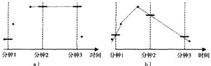  
图9-3数据采样方法

从数学上来说，这两种采样方法可以表述如下：

抽取收盘时的报价：

$$
\hat { \boldsymbol { q } } _ { \iota } \equiv \boldsymbol { q } _ { \iota , \iota _ { a a t } }
$$

抽取线性插值法得到的报价：

$$
\hat { q } _ { i } ~ = ~ q _ { t , l a n t } + \left( ~ q _ { t , n e n t } ~ - ~ q _ { t , l a n t } \right) \frac { t - t _ { l a n t } } { t _ { n e n t } - t _ { l a n t } }
$$

式中， $\widehat { \boldsymbol { q } } _ { \ell }$ 是报价采样的结果；是所要求的采样时间（比如新一分钟的开始时刻）； $\mathbf { \delta } _ { t _ { i n s t } }$ 是采样时间 ${ \pmb t }$ 之前最后一笔观测到报价的时间戳； $q _ { i , l a n t }$ 是采样时间t之前最后一笔报价的值； $t _ { p e s t }$ 是采样时间 $\pmb { \imath }$ 之后第一笔观测到报价的时间戳；$q _ { \ell , n e a }$ 是采样时间 $\pmb { t }$ 之后第一笔报价的值。

另外一种评估分笔数据波动性的方法是使用混合分布模型（mixturesofdistributions model，MODM）对高频数据的分布进行建模。例如，Tauchen和Pitts证明，如果市场价格的变动服从正态分布，那么价格变动与交易量一起近似服从联合正态分布。

# 结论

分笔数据与低频数据大相径庭。利用分笔数据可以创造很多在低频数据下无法获得的交易机会。

# 市场微观结构下的交易-存货模型

在理性预期和有效市场假说下，市场价格会在相关信息披露后立即调整到位。从长线投资者的角度来看，由于持有头寸的时间往往长达数日或数月之久，这种调整看来确实是在瞬间实现的。但是任何在重大新闻披露前后密切关注过市场表现的人们却会看到一幅截然不同的画面，即价格实际上是在一个特定的区间内波动的。注意，在任何市场情况下，由于总是有一定的波动（不管是多么小的波动）因此市场价格实际上是运行在一个价格区间之内，而不是达到某个恒定的价格水平。市场寻找信息披露后的最佳价格区间的过程通常被称为tatonnement，来自法语，意为“试错过程”。

图10-1展示了在不同频率下所观察到的价格调整过程。在很高频率之下，价格调整过程很难一蹴而就。确立新的最佳价格的试错过程（tatonne-ment）是由买方和卖方持续不断地通过下单指令隐性沟通协调而成的。信息披露后市场参与者各自独立判断出证券的价值，并把价值反映在他们的买人和卖出申报价之中，这些报价让市场参与者能够了解到其他投资者的估价。这个过程持续重复直到大多数市场参与者都同意一个可接受的报价范围，平衡价格区间由此可认为已经达成。因此试错过程不仅仅是考虑信息对价格的影响，还通过集合竞价过程使市场参与者形成新的价值观点。

研究价格形成过程的这一学科便是市场微观结构，在市场微观结构下的交易是高频交易的核心。市场微观结构交易的理念就是从观察到的报价数据中提取信息，并依据提取的信息进行交易以获利。在市场微观结构交易下持有头寸的时间长度可以从几秒到几小时不等。

对投资者而言，最佳持仓时间受到其交易成本的影响。若仅持有头寸数秒钟时间，则持仓盈利很可能最多只有几个基点（一个基点 $= 1 \mathrm { b p } = 1 \mathrm { p i p } =$ $0 , 0 1 \%$ ），此种交易要切实可行，则预期收益必须高于交易成本。对机构而言（比如经纪自营商的自营交易席位），它们在某些特定股票上的交易成本常常仅有1个基点甚至更少，这样超短线（即数秒钟时间）的交易策略若有2个基点的预期收益，盈利便相当可观。对其余的机构投资者而言，例如对冲基金，它们每笔交易的费用多在3\~30个基点不等，这便要求它们的交易策略更长时间地持有头寸。

Lyons在2001年发表的文章中提到，市场微观结构学说里包含了两种基本的模型：存货模型（inventory model）和信息模型（information model)。信息模型更关注消息公布后，信息反映到价格中的这一过程。在信息模型中，含有市场信息的委托单流（orderflow）导致了价格变动。而存货模型则解释了没有消息公布时价格短暂波动的原因。在信息模型里，价格的短暂波动是由委托单流的变化引起的。与信息模型中委托单流是交易者接收并且对信息做出反应的结果不同，存货模型则关注代理商委托单簿不平衡对委托单流的影响。

本章将回顾存货模型及其在高频交易中的应用。在第11章，我们将会讨论信息模型。

# 存货交易策略概述

存货交易也被称为流动性供应或者做市，是通过有效管理存货从而达到盈利的活动。流动性供应一度只能由指定的经纪自营商来操作，这些人称为做市商。做市商手中必须保证持有足够的流动性以满足任何前来交易的买方或者卖方。在过去的十年间，这种制度改变了。电子交易的广泛应用加上1997年美国证券交易委员会颁布的委托显示规则使得大部分交易者能够通过短线限价下单指令来参与做市。目前已有几种能较好抓住市场中存在的流

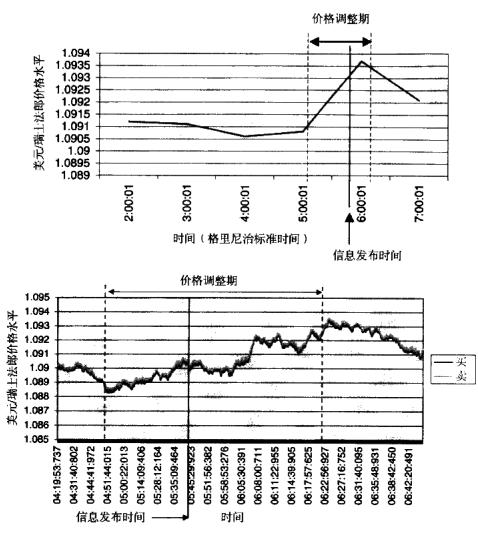  
图10-1瑞士公布失业率信息时美元/瑞士法郎的价格调整走势图，数据记录时间是2009年7月8日，上图的价格走势是小时级别的，下图的价格走势是逐笔数据

动性溢价的流动性供应策略产生。

存货交易策略通常具备以下--些关键要素：

●这些交易策略基本由限价指令完成，尽管偶尔也会使用市价指令了结头寸。·策略依赖于大量的微小盈利。使用这些交易策略时，一天交易2000

次并不稀奇。

●因此，这些策略的操作频率非常之高。短暂的持仓时间能让资金在当天反复进出，从而在交易日结束的时候产生大量的盈余。

●指令的高速传递以及低延迟执行是成功实施流动性供应策略的先决条件。

# 指令、交易者和流动性

# 微观结构交易中使用的指令

在第6章中首次介绍到的限价指令，是以事先指定的价格买人或卖出某种股票的交易指令。限价指令可以看做对提供市场流动性的事先保证。Dem-setz（1968）曾经指出，限价指令在排队成交过程中，使用限价指令的交易者需要承担存货和等待成本。存货成本（inventorycost）来自于股票市价的不确定性，在等待限价指令触发的过程中交易者可能正持有他的投资组合。等待成本（waitingcost）则是从下单到指令成交这段时间里产生的机会成本。另外，Copeland和Galai（1983）进一步指出，限价指令容易受到信息不对称的不利影响，在面对消息灵通的投资者时常常处于劣势地位。

限价指令成交的可能性自然应该取决于限价指令的价格和市价的接近程度。Cohen、Maier、Schwartz和Whitcomb（1981）把这种现象称为现有报价的“引力拉动”（gravitationalpull）。以当前市场报价下单的限价指令很可能成交，相对的，激进的限价指令成交的可能性则趋近于零。

用限价指令进行的交易产生的盈利是非线性的，限价指令有时能被执行，有时不能被执行，因此限价指令很难用模型去概括。Parlour和Seppi（2008）指出，限价指令与其他的那些已经存在的或者即将递交的限价指令相互竞争，然后，所有的限价指令和随后的市价指令配对成交。因此，当选择限价指令的价格和数量时，投资者需考虑之后的交易过程，包括当前的限价委托簿和指令的历史价格纪录及成交结果。

早期的限价指令模型，也就是静态均衡模型，认为限价指令的下单者会因提供流动性而得到相应的补偿。这类模型的例子可以参见Rock（1996）、

Glosten（1994）和Seppi（1997）等人的文章。指令执行前的等待时间越长，那些一旦递交指令便不再更改的流动性供应者所期望获得的补偿就越高。静态均衡模型的假设反映了早期的交易状况，那时更改限价指令细节的成本很高，因此不太可行，做市商确实期望能够得到一笔可观的收益，以补偿他们的限价指令被触及而使他们处于不利头寸的风险。

但是静态平衡模型在近年来的文献中几乎找不到实证研究的支持。事实上，Sandas（2001）在对斯德哥尔摩证券交易所交易较为活跃的股票上限价指令的研究发现，限价指令的预期收益是随着市价指令间时间间隔的增加而减少的，这与此前形成的理论相悖。实证研究的结果暗示着交易者是基于对盈利的追求才提交限价指令的，而不是如做市者般仅为提供流动性。

在众多因素中，交易者对资金的需求以及他们的风险厌恶情绪会促使他们选择即刻成交。急需资金的交易者可能会将限定价格设定得接近市价，以便尽快将手上持有的头寸变成现金。厌恶风险的投资者可能为了确保迅速执行指令并减小不确定性而同样如此操作。

在一种静态均衡模型的扩展之中，对激进的限价指令通过计人不执行费用来进行惩罚。这个费用可以理解为指令限价对活跃的限价指令交易者交易目标价格的大幅偏离而产生的罚金。此种方式的例子可参见Kumar和Seppi（1994）的文章，他们模拟了两种限价指令交易者：价值交易者（valuetrad-er）和流动性交易者（liquiditytrader）。价值交易者递交限价指令仅仅是为了利用被低估的限价指令。而流动性交易者递交限价指令是对随机的流动性冲击的反应。他们下单指令的随机性使得其他以市价指令交易的交易者产生了价格风险，并且使所有的限价指令都产生了执行风险。Cao、Hansch和Wang（2004）发现限价委托单簿中不同指令之间具有协整关系，这支持市场中存在价值交易者的看法。

# 市场微观结构交易下交易商的类型

Harris（1998）定义了以下三类交易商：

1.知情交易商（informedtraders），他们知悉即将产生的市场价格运动方向的相关信息。

2.流动性交易商（也称为不知情交易商），他们没有相关市场信息，仅仅期望通过提供流动性及追随短期价格趋势获利。

3.价值驱动型交易商（value-motivatedtraders），他们分析基本面因素并等待股票价格低至其认为有投资价值时再进行买卖。

知情交易商掌握私有信息，这使得他们能够预测某些证券的价格变动。私有信息包括公众无法获取的从付费信息源所得的分析（例如彭博），以及基于市场微观结构的高级预测。知情交易商通常是高频交易的资金经理，或者其他有较好信息渠道且能出色分析即时市场信息的交易者，他们的私有信息对市场有重大的影响。知情交易商较为缺乏耐心，他们通常选择以市场价格或接近市场价格执行指令（详见Vega（2007））。Alam和Tkatch（2007）发现机构下单更多地使用市价指令，而不是限价指令，这也暗示着机构资金经理往往拥有更优越的信息以及更为领先的技巧。

流动性交易商试图为其客户捕捉最优价格，他们更专注于下单指令递交策略的研究。这些交易商对他们所交易股票的真实价值没有更多的专有资料。执行经纪自营商就是流动性交易商的一种。

价值驱动型交易商在市场公开信息的基础上通过其模型得出每只股票的公允价值。价值驱动型交易商可以是较为传统的、低频交易的机构资金管理人；或者是个人当日交易者（daytrader）；或是运行高频基本面交易模型的资金经理人。

这三种类型的交易商决定何时下达市价指令，何时下达限价指令，以及以什么价格下达限价指令。他们根据交易成本最小化和投资组合回报最大化的原则优化其下单决策。

Harris（1998）指出，缺乏耐心的交易者常常使用市价指令和激进的限价指令，因为他们知悉市场相关重要信息即将被公布。那些与市场价格相去甚远的限价指令单通常来自于价值驱动型交易商，他们期望能在市场中以有利的价格成交。余下的一些限价指令则由不知情的流动性交易商下单。他们试图通过做市，或者通过发现并跟随市场价格的短期趋势而获利。图10-2给出了限价指令簿中指令单的激进程度和交易商类型相对于市场价格的分布图。Harris（1998）假设了一个只有一种股票的市场，因此当价格过高或流动性不足时并无其他股票可以替代交易。

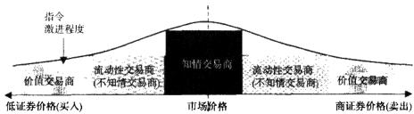  
图10-2指令单的激进程度和交易商类型在限价委托单簿中的分布

Kaniel和liu（2006）进一步推广了Angel（1992）和Harris（1998）的理论，他们指出，如果知情交易商拥有的私有信息能够达到足够的持久度，他们就可能会使用限价指令。Bloomfield、O'Hara和Saar（2005）讨论了为何知情交易商会是流动性提供者。因为知情交易商知道资产的真实价值，当价格调整到限价指令不会被其他交易者攫取时，他们会第一个知道。通过度量委托单流的激进程度，交易者可能会捕捉到知情交易商的信息，并且从中获取短期利润。

# 流动性供应

限价指令给市场提供了流动性。因此限价指令在低流动性市场中或许会表现更好。市场流动性程度可以用以下一种或多种指标衡量：

1．买卖价差的紧度（tightness)。买卖价差决定了即时反转一个给定标准交易数量的头寸，或一码（clip）所需的成本。

2.市场深度（marketdepth）。市场深度是指在当前市场价格下（最优限价）所有限价指令单的数量。因此市场深度决定了当前市场价格水平下可即刻成交的指令数量。

3.市场的弹性（marketresilience)。市场弹性是指当市场价格因为随机委托单流发生波动时，回复到均衡状态的速度。

4.价格对大宗交易的敏感度（sensitivity）。敏感度通常用我们知道的“Kyle的λ”来表示，这是一个由如下回归方程用普通最小二乘法估计的系数（Kyle，1985):

$$
\Delta P _ { \varepsilon } = \alpha + \lambda N V O L _ { \varepsilon } + \varepsilon _ { i }
$$

式中， $\Delta P _ { \cdot }$ 是指市场受指令的影响而引起的价格变动； $N V O L _ { \ast }$ 是指时刻 ${ \pmb t }$ 买卖双方市场深度的差异。市场对交易量的敏感度入越小，市场以当前价格消化指令的能力就越大。

5.Amihud(2002）提出的非流动性比率(illiquidityratio)。Amihud(2002）指出非流动性市场的特点是每笔交易所造成的价格波动较为剧烈。尽管对流动性充足的证券而言，交易价格的变动可以低至一个点（例如，大部分货币市场是1%的0.005倍），但在非流动性市场中，交易价格的波动可以剧烈至每笔交易变动20%。因此Amihud在其论文中提出将价格变化相对交易量的比例的平均值作为衡量市场非流动性程度的指标：

$$
\gamma _ { \ast } = \frac { 1 } { D _ { \iota } } \sum _ { d \ast 1 } ^ { D _ { \iota } } \frac { | r _ { d , \iota } | } { v _ { d } , t }
$$

式中， $D _ { \ell }$ 是在时间段 $\varepsilon$ 内的交易次数； $\boldsymbol { r } _ { d , t }$ 是在时间段 $\pmb { \tau }$ 内第 $d$ 笔交易引起的相对价格变动； $\nu _ { d , \iota }$ 是第 $^ d$ 笔交易中执行的交易量。

限价指令簿通常会存在所谓的“缺口”（holes），就是投资者提交限价指令单时跳过的某些价格范围。Biais、Hillion和Spatt（1995）以及其他人实证记载过“缺口”现象。

# 有利可图的做市

Harrison和Kreps（1978）指出，资产的现价是由它的转售（resale）潜力决定的。因此，高频交易的投资者会利用价格在不同市场的差异进行跨市套利交易。最简单而且有利可图的流动性供应交易策略就是确定同种证券在不同市场上的价格偏差，并利用套利交易消除这些价差。这种方法在低价位市场中提交略低于市价的买入限价指令，并且在高价位市场中提交略高于市场价格的卖出限价指令，然后等到利润覆盖了交易成本便可以反转头寸。

Garman（1976）是第一个通过模拟短时间内买卖指令数量的不平衡来研究最佳做市环境的人。这些不平衡来源于各独立交易商之间的不同以及自营商（dealer）优化其下单流的行为。自营商的行为可能反映了他们各自在.预算、风险偏好、进人市场的难易程度，以及其他各方面特性的不同。每个交易商追求最优化问题本身远不如这些最优化的差异所带来的指令不平衡来的重要。在Garman（1976）的模型中，市场有一个垄断的做市商，负责决定买人价和卖出价，接受所有的下单指令并撮合成交。做市商的目的是在避免破产失败的同时追求利润最大化。只要做市商没有存货或现金，就会陷人失败的境地。买人和卖出指令的到达均为独立的随机过程。

模型通过估计买卖现金流的到达率来计算最佳买入报价（bidprice）和卖出报价（askprice）。当客户买人证券（付钱给自营商）时一单位的现金（例如，一美元，或者是外汇中的一码）便会“到达”（arrive）做市商手中，而当客户卖出证券（自营商付钱给客户）时现金便从做市商手中“离开”（depart）。假设到达的概率，也即客户下单以市场卖价 $\pmb { p _ { \ast } }$ 买人某证券的概率用 $\lambda _ { a }$ 表示。相应地，一单位的现金从做市商处离开流人到客户手中，也即客户以市场买价 ${ p } _ { b }$ 向做市商卖出证券的概率用 $\lambda _ { \nu }$ 表示。Garman（1976）提出了一个简单却有效的模型，从而计算出了做市商为了在市场中生存下去而必须维持的最小买卖价差。

该模型的解基于经典的赌徒破产问题（Gambler'sRuinProblem）。在此问题的自营商版本里，赌徒，或者说自营商，开始时手中有一笔初始资金和赌注（以便进人这个市场），一直到他输光所有的钱离开为止。此版本的赌徒破产问题是一个无边界问题（unboundedproblem），而有边界问题（boundedproblem）则假设赌徒会一直赌到他输光所有钱，或者在赢钱达到一定的资金额时退出。

在赌徒破产问题中，赌徒输光的概率是：

$$
\operatorname* { P r } _ { F _ { F a i l u v e } } \ = \ \Big ( \frac { \operatorname* { P r } ( \mathrm { \ L o s s } ) \ \times \mathrm { \ L o s s } } { \operatorname* { P r } ( \mathrm { \ L e a i n } ) \ \times \mathrm { \ G a i n } } \Big ) ^ { \mathrm { \ l n i t i a l ~ w e a l t h } }
$$

式中，InitialWealth是赌徒的起始资金，Pr（Loss）是输掉起始资金中（Loss）部分现金的概率； $\mathrm { P r } \ ( G a i n )$ 是赢取（ $G a i n$ ）现金的概率。

在赌徒破产问题中，我们可以看出赌徒输光的概率永远是正的。更进一步我们还可以发现，只要输钱的概率超过赢钱的概率，则赌徒最终一定会输

光。换句话说，长期而言，赌徒以正的概率避免陷人失败境地的基本条件是$\mathrm { P r } ( G a i n ) \ > \ \mathrm { P r } ( L o s s )$

Garman（1976）通过以下两种方式将赌徒破产问题运用到了做市上。

1．一且手中现金用完，则做市商失败。

2.若做市商手中存货用完，无法满足客户需求时同样宣告失败。

为了用赌徒破产问题对做市商因为用尽所有存货而破产的情形进行建模，我们假设变量Gain和Loss都为一单位的金融资产。换言之：

$$
\begin{array} { l } { G a i n \ = \ 1 } \\ { L o s s \ = \ 1 } \end{array}
$$

对于股票而言，一个单位可以是一只股票。对于外汇而言，一单位可以是一码。从做市商的角度来看，失去一单位存货，也就是卖出一单位存货的概率，亦相当于一个买家达到的概率，即 $\lambda$ a。同理而言，得到一单位存货，也即一个卖家到达的概率是 $\lambda _ { * }$ 。赌徒破产问题的式（10-3）就变成

$$
\operatorname* { l i m } _ { i  \infty } \mathrm { P r } _ { F a i l o r e } ( t ) \approx ( \frac { \lambda _ { e } } { \lambda _ { s } } ) ^ { l a i l n o l \psi _ { e a i l i } / E _ { s } ( p _ { s } , p _ { t } ) }
$$

式中， $E _ { \circ } ( p _ { \circ } , p _ { b } )$ 是一单位存货的初始平均价格，并且 $\frac { I n i t i a l \ W e a l t h } { E _ { 0 } ( p _ { a } , p _ { b } ) }$ 是做市商最初手中最初拥有的金融证券的数量。

赌徒破产问题还被进一步用于计算做市商因为用尽现金而失败的概率。从做市商的角度来看，当一个购买证券的客户到达时，他即得到一个单位的现金（比如一美元）。和之前一样，一个客户到达并愿意以价格 $p _ { e }$ 购买证券的概率是 $\lambda _ { \mathfrak { a } }$ 。因此，做市商得到一美元的概率为 $p _ { \ast }$ 。同样，做市商“失去”一美元，或者把一美元交给卖出证券的客户的概率是 $\lambda _ { b }$ 。赌徒破产问题的公式就变成以下形式：

做市商要在市场中生存下去，式（10-4）和式（10-5）的第一项条件必须同时满足。换言之，以下这两个不等式必须同时成立：

若要以上两式同时成立，则在任意时刻必须有 $p _ { * } ~ > ~ p _ { * }$ ，这就是买卖价差的来源。买卖价差使得做市商能够在维持足够存货的同时实现盈利。

其余的存货模型对做市商的目标及约束做出了更多的假设限制。例如，Stoll（1978）假设自营商的主要目标不仅仅是在市场上生存，还要能在市场压力下有效管理其自身的投资组合。买卖价差是做市商承担做市成本的回报。这些成本来自于以下三个方面：

1．存货成本：为了满足市场流动性需求，做市商经常需要持有次优头寸。2.因做市商交易机制而异的指令处理成本：这些成本可能包括交易费用，结算和清算费用，交易税等。3.信息不对称成本：做市商在和知情交易商交易时常常会陷入不利的交易头寸。

因此Stoll（1978）的模型预测，不同做市商报价的买卖价差是各做市商风险容忍程度和执行方案的函数。

在Ho和Stoll（1981）的文章中，做市商根据收益最大化和风险最小化的原则来决定买卖报价。做市商控制自身的初始财富，以及任一给定时间点手中所持有的资金和存货。Garman（1976）在其文中指出，买人指令和卖出指令的到达率是买价和卖价的函数。Ho和Stoll（1981）的模型结果认为，价差取决于做市商的时间跨度。例如，在一天交易快结束时，头寸变动的可能性变小了，做市商持仓风险便因此降低。因此，在一天交易快结束时，做市商可能缩小价差。另一方面，随着做市商时间跨度的延长，他也会提高价差以弥补更高的市场产生对做市商头寸不利变化的风险。

Avellaneda和Stoikov（2008）将Garman的模型进一步发展成可以持续产生盈利的量化做市限价委托单簿策略（quantitative market-making limit orderbookstrategy）。此外，这种策略的表现超出了“最优买价最优卖价”做市策略（“best-bid-best-ask”market-making strategy），在“最优买价最优卖价”做市策略中，交易者按照市场上可获得的最优买价和最优卖价提交限价指令。对完全理性的，“风险中性”的交易者而言，Avellaneda和Stoikov（2008）的策略的表现同样超出了“对称”买卖策略（“symmetric”bid and ask strate-gy），在“对称”买卖策略中，交易者提交的买人报价和卖出报价与当前市场中间价的距离相等。

Avellaneda和Stoikov（2008）重点研究了存货风险的影响，并且在给定以下六个参数的情况下计算出对做市商而言最佳的买卖限价。

●新买入报价出现的频率； $\pmb { \lambda } ^ { \pmb { \nu } }$ 。例如， $\lambda ^ { \delta }$ 可以是每分钟5笔。我们可以认为买人报价出现的频率代表对某只股票的需求，因为这反映新卖家不断到来。

●新卖出报价出现的频率， $\lambda ^ { \ast }$ 。卖出报价的频率可以看成是某只给定股票的供给指标，以及新买家出现的概率。

●新买入报价出现频率的最新变动值， $\pmb { \Delta \lambda } ^ { \delta }$ 。例如，假设上一分钟有5笔买人报价出现，而在此前一分钟有10笔买人报价出现，那么新买入报价出现频率的变动值就是 $\Delta \lambda ^ { \delta } = { \bf \nabla } \left( 5 - 1 0 \right)$ $/ 1 0 = - 0 . 5$ o

●新卖出报价出现频率的最新变动值， $\mathbf { \Delta } \mathbf { A } ^ { * }$ 。例如，若一分钟内有5笔卖出申报价出现，而此前一分钟同样有5笔卖出申报，那么卖出报价到达频率的变动值即为 $\Delta \lambda ^ { \circ } = { \bf \nabla } \left( 5 - 5 \right) { \bf \nabla } / 5 = 0 .$

●交易商风险厌恶值， $\pmb { \gamma } _ { \circ }$ 若风险厌恶值较小，即 $\gamma \sim 0$ 代表投资者是风险中性投资者。另一方面，若风险厌恶值为0.5，则说明此投资者是相当强烈的风险厌恶者。

●交易商的保留价格（reservationprice)。这是指交易商对于某只股票所愿意出的最高买入价 $r ^ { * }$ ，以及交易商对此股票愿意给出的最低卖出价 $r ^ { \ast }$ o $r ^ { \alpha }$ 和 $r ^ { b }$ 都是从一个含有股票价格 $\boldsymbol { s }$ 、交易商存货 $\pmb q$ ，以及时间 ${ \pmb t }$ 的偏微分方程中解出来的。

最优买入限价 $^ b$ 以及最优卖出限价 $^ a$ 的方程式为：

Avellaneda和Stoikov（2008）假设了一个合理的交易商风险厌恶值0.1，并在此假设之下将其存货策略与“最优卖价最优卖价”做市策略以及对称买卖策略进行了比较。如图10-3所示，Avellaneda和Stoikov（2008）提出的存货策略的收益分布十分集中，这使得其交易表现的夏普比率相当之高。

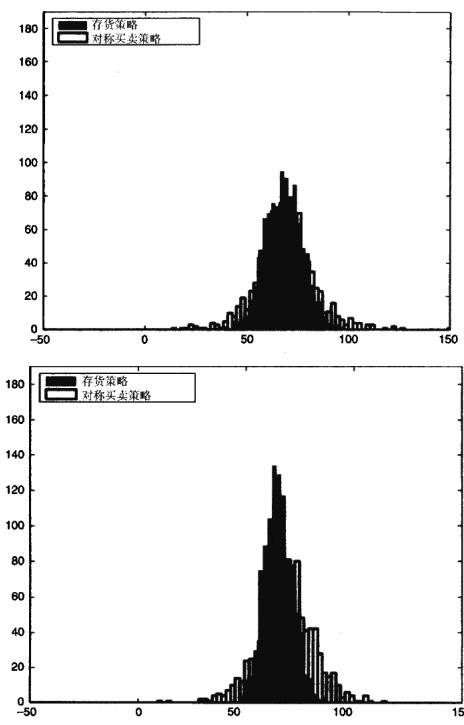  
图10-3Avellaneda和 Stoikov（2008）所做的存货策略，最优买价/最优卖价策略，和对称买卖策略的比较

# 有方向的流动性供应

# 能观测到限价指令簿的情形

存货模型的一个重要观点是指令簿的形状可以预测随后的市场价格的变化。图10-4描绘了Cao，Hansch，和Wang（2004）发现的一种现象。在图10-4a中，市价被大量聚集的保守限价指令“推”向右侧。

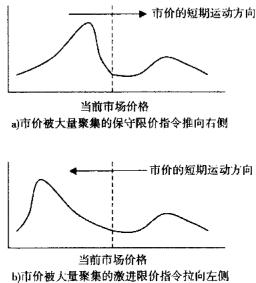  
图10-4限价指令单簿的分布与接下来价格走势之间的关系

Cao、Hansch和Wang（2004）发现做市型的交易商对限价指令簿的形状进行了积极利用。他们还发现限价指令簿的宽度和深度（也称为长度和高度）可预测 $3 0 \%$ 即将发生的价格变动。此外，指令簿的不对称性还透露出更多的信息。Handa、Schwartz和Tiwari（2003）研究发现当买家和卖家的数量相近时，这种“平衡”市场上的买卖价差会更大。相反，当一方的交易商数量超过另一方时买卖价差会缩小。Handa、Schwartz和Tiwari（2003）对此的解释是：这种不平衡是因为处于较少数量一方的交易商拥有更强的市场支配力(market power)，他们能从另一方众多迫不及待想要交易的投资者手中得到更优的价格。

Rosu（2005）提出限价指令簿的形状取决于市价指令出现的概率分布。如果大笔市价指令单出现概率较大，则限价指令簿呈驼形（hump-sharped）。Foucault、Kadan和Kande（2005）的文章中将连续时间市场视为一个带有无限期存活限价指令的多重价格网格上的指令驱动过程。Rosu（2005）的文章中引人了可撤销限价指令，进一步扩展了这个研究。

Foucault、Moinas和Theissen（2005）发现限价指令簿的深度能够预测资产价格的波动率。Holden和Subrahmanyam（1992）的研究发现，交易资产的通用估值波动越大，从限价指令簿中可获取的信息深度就越低。因此，限价指令市场加剧了交易资产波动率的变化。交易资产价值波动率的细小变化都会导致交易价格波动率的较大变动，并且知情交易商不太可能去提供流动性。

Berber和Caglio（2004）发现在诸如收益财报公布之类事件的前后，限价指令中会含有一些私有信息。

对做市商来说，能够观测到全部的限价委托单簿使他们获得了一种不公平的优势。Haris和Panchapagesan（2005）的研究表明，由于能够看到限价委托单簿中的全部信息，做市商可以因此获得超额收益，或者说他们“取走”了其他限价指令交易者的利润。

# 不能观测到限价指令簿的情形

Cao、Hansch和Wang（2004）提出的方向性策略要求所感兴趣的金融工具的限价指令簿完全透明。但在众多的交易场所（例如黑池）之中，限价指令簿是不能获取的。本小节将讨论估计此类委托单簿形状的方法。

Kavajecz和Odders-White（2004）的研究表明限价指令单对未来的流动性有一定的指示作用。技术分析一直以来都是交易者的帮手，但却是学院派的死敌。在投资管理行业中，有大量的资源被投人到技术分析上，但一直让学术界感到困扰的是，他们在经济学中基本上找不到技术分析的合理解释。大部分人似乎都认可技术分析是一种会自我实现的预言。当有足够多的人相信某种价格运动即将发生时，他们自然会将价格推动至目标价位。技术分析在某些市场中更为流行。例如，很多外汇交易者会频繁使用技术分析，而证券交易者使用的比例就比较小。

Kavajecz和Odders-White（2004）发现了一项有趣的技术分析的新应用。他们发现技术分析有可能提供一些关于限价指令簿形状的信息，具体来说，他们发现交易商更倾向于将限价指令单挂在技术支撑位和阻力位上。因此，这些支撑位和阻力位就指示了限价指令委托单簿中流动性峰值出现的地方。他们的研究结果可能对那些在不透明市场或者暗市（darkmarket）中交易的超高频交易者有很大帮助。

另外，Kavajecz和Odders-White（2004）还发现，基于移动平均线的一些指标有助于确定限价指令簿的偏度。当短期移动平均线向上穿越长期移动平均线时，限价指令簿中的买方流动性聚集朝市价方向移动。从这个角度讲，移动平均指标帮助确立了限价指令簿的偏度。Kavajecz和Odders-White（2004）推测技术分析之所以在外汇市场上盛行正是因为缺乏集中的限价指令簿。作者相信技术分析能帮助交易商还原出限价指令簿，从而使他们能部署有利可图的流动性供应策略。

# 结论

如何利用超高频率交易市场上所存在的机会呢？首先，我们需要对短期历史价格以及委托单簿的变动进行详尽的计量经济学分析，以便从中发现一些可以用来交易的相互关系。其次，交易商可以同时提交一系列的市价指令和限价指令，以灵活应对市场上多空兴趣的随机波动。虽然如此，我们还必须恰当管理限价指令执行时间的不确定性，因为这会导致交易商投资组合的随机滑动，从而给手头上的投资组合增加潜在的不利的随机维度。

流动性供应不仅有利可图，而且还是一项极为重要的功能。如Parlour和Seppi（2008）所言，公开交易资产的价值评估是一项“社会活动”，它加强了流动性和资产价格之间的联系。因此，当投资者个人对其资产估值发生变动从而想要重新配置其投资组合时，交易活动便给这些投资者创造了价值。

# 市场微观结构下的交易信息模型

第10章中讨论的存货模型指出，做市商可以根据自身特点（例如存货和风险偏好程度）来设定限价指令的价格。如此一来，存货模型并未将其他市场参与者的动机考虑在内。然而，交易之间的相互作用以及其他市场参与者的行为会在很大程度上对做市商的行为产生影响。

信息模型就特别着重于各类市场参与者的意图及其未来可能采取的行动。信息模型包括采用对策论模型对报价和交易单流进行逆向工程解析，以发现做市商所拥有的信息。信息模型还利用观测到的或者推测出的指令单流来做出知情交易决策。

从本质上而言，信息模型描述了一类依据信息流和信息传播过程中可能产生的信息不对称现象而进行的交易。不同市场上的信息流动彼此有别。在透明集中的市场上，例如大多数股票市场和电子交易市场，信息的流动就相对较快；在不透明市场上，比如外汇市场及债券和衍生品的场外交易市场，信息的流动就慢得多。

信息模型的一个主要结论是：即使做市商手中有无限的存货并且能够即时满足任何交易需求，买卖价差依然会存在。实际上，在市场存在知情交易商的情况下，价差是做市商维持其偿付能力的一种方式。当指令单从知情交易商传递给做市商的时候，信息也相应地从交易商手中传递到了做市商手中，接下来买卖价差的改变同样可能将信息从做市商那里传递给更多的市场参与者。

本章我们将讨论基于信息模型的市场微观结构交易策略。

# 度量信息不对称性

市场中的信息不对称性会导致逆向选择（adverseselection）问题，知情交易商有能力“捡走”不知情市场参与者的利润。根据Dennis和Weston（2001）以及Odders-White和Ready（2006）的总结，数年以来，人们提出了以下几种度量信息不对称性的方法：

●买卖报价价差（quoted bid-ask spread）   
●有效买卖价差（effective bid-ask spread）   
●基于信息的影响（information-based impact)   
买卖价差中的逆向选择成分（adverse-selection components of thebid-ask   
spread)   
●知情交易的概率（probability of informed trading)

# 买卖报价价差

买卖报价价差是最粗糙的，也是最容易观测到的度量信息不对称性的方式。这个方法最先由Bagehot（1971）提出，随后众多研究者对其进行了扩展。买卖价差反映了做市商在信息不对称情况下对市场运动的预期。当报价自营商收到一些指令，并且怀疑这些指令来自于知情交易商，从而有可能将自己置于和市场走势相悖的不利境地时，自营商就会提高其报价的买卖价差，以补偿他所面临的价格发生不利运动的风险。因此，买卖价差越大，自营商对他与其客户之间信息不对称程度的估计值就越高。假设自营商与大多数的自营商客户都能获得类似的公共信息，那么买卖报价价差总体而言可以用来度量市场上存在的信息不对称性。

# 有效买卖价差

有效买卖价差的计算方法是：将最新成交价与买卖报价的中间值之间的差值乘以2，然后再除以买卖报价的中间值。因此，有效买卖价差几乎等同于买卖报价价差，不过它反映了委托单簿的真实状况，并且可以让不同价格水平下的金融工具进行相互比较。

# 基于信息的影响

用基于信息的影响来度量信息不对称性的研究始于Hasbrouck（1991）。Brennan和Subrahmanyam（1996）提出了以下用于估计基于信息的影响 $\lambda$ 的向量自回归模型：

$$
V _ { i , t } \ = \ \theta _ { i , 0 } + \sum _ { i = 1 } ^ { \kappa } \beta _ { i , k } \Delta P _ { i , t - k } + \sum _ { n = 1 } ^ { w } \gamma _ { i , n } V _ { i , t - m } + \tau _ { i , t }
$$

$$
\Delta P _ { i , \iota } = \phi _ { i , 0 } + \phi _ { i , \iota } \mathrm { s i g n } ( \Delta P _ { i , \iota } ) + \lambda _ { i } \tau _ { i , \iota } + \varepsilon _ { i , \iota }
$$

式中， $\Delta P _ { i , \ell }$ 是从时间 $\varepsilon - 1$ 到时间 $\boldsymbol { \ t }$ 证券 $i$ 的价格变化； $V _ { i , t } ~ = ~ \mathrm { s i g n } ( \Delta P _ { i , t } ) ~ \cdot ~ \boldsymbol { v } _ { i , t }$ ,$v _ { i , i }$ 是时间 $ \mathbf { \Delta } t - 1$ 到时间 $\scriptstyle { \tmspace 4 } { \mathrm { ~ } } t$ 证券 $_ i$ 的交易量。Brennan 和 Subrahmanyam（1996）提议计算式（11-1）时使用5阶递延，即 $K = M = 5$ 。

# 买卖价差中的逆向选择成分

Closten和Harris（1988）提出了买卖价差中逆向选择成分的问题。他们的模型将买卖价差分解成以下三部分：

●逆向选择风险■处理指令的成本●存货风险

Roll（1984）、Stoll（1989）以及George、Kaul和Nimalendran（1991）都曾经提出过类似的模型。Glosten和Harris（1988）的模型现在比较流行的版本是Huang和Stoll（1997）进行完善过的，这个版本的模型集成了存货风险和处理指令的成本，其表述如下：

$$
\Delta P _ { i , \iota } \ = \ ( 1 - \lambda _ { i } ) \ \frac { S _ { i , \iota } } { 2 } \mathrm { s i g n } ( \Delta P _ { i , \iota } ) \ + \lambda _ { i } \frac { S _ { i , \iota } } { 2 } \mathrm { s i g n } ( \Delta P _ { i , \iota } ) \cdot v _ { i , \iota } \ + \varepsilon _ { i , \iota }
$$

式中， $\Delta P _ { i , t }$ 是从时间t-1到时间 $\pmb { t }$ 证券 $\mathbf { \chi } _ { i }$ 的价格变化， $V _ { i , \varepsilon } = \mathrm { s i g n } ( \Delta P _ { i , \varepsilon } ) \cdot v _ { i , \varepsilon }$ ,$\boldsymbol { v } _ { i , t }$ 是时间 $\mathbf { \Delta } t \mathrm { ~ - ~ } 1$ 到时间 $t$ 证券 $_ i$ 的交易量， $S _ { i , \ell }$ 是之前定义的有效买卖价差， $\lambda _ { i }$ 是买卖价差中由逆向选择所形成的部分。

# 知情交易的概率

Easley、Kiefer、O'Hara和Paperman（1996）提出了一种从序列报价数据中推断知情交易概率的算法。该模型通过逆向工程方法解析自营商提供的报价序列数据，以期从自营商所见到的指令单流中获取一些概率上的洞见。

模型的建立基于以下观点：假设市场中发生了某个会影响价格水平的事件，但是仅有少数投资者获知了这一事件。这类事件可能是有控制地发布某些选定的信息，或者是优秀分析师的研究结论。假设这种事件发生的概率为 $\alpha$ 。另外，进一步假设如果有事件发生，其对价格产生负面影响的概率为δ，对价格产生正面影响的概率为（1-8）。当事件发生时，知情交易商知道它对价格可能产生的影响，并根据自身的判断以速率 $\pmb { \mu }$ 下单交易。因此，所有知晓该事件发生的投资者将在市场的同一个方向下单—要么是买，要么是卖。与此同时，不知晓该事件的投资者依旧会在两个方向分别以速率 $\omega$ 下单交易。知情交易发生的概率由下式表示：

$$
P I = { \frac { \alpha \mu } { \alpha \mu + 2 \omega } }
$$

参数 $\alpha , \mu$ 和 $\omega$ 通过如下似然函数用 $_ { T }$ 时期之内的数据进行估计：

$$
L ( B , S \mid \alpha , \mu , \omega , \delta ) = \prod _ { i = 1 } ^ { \tau } \ell ( B , S , t \mid \alpha , \mu , \omega , \delta )
$$

其中， $\ell ( B , S , t \mid \alpha , \mu , \omega , \delta )$ 是当日观察到 $B$ 份买入与 $s$ 份卖出的概率：

$$
\begin{array} { r l } { ( B , S , t \mid \alpha , \mu , \omega , \delta ) } & { = ( 1 - \alpha ) [ \exp ( - \omega T ) \frac { ( \omega T ) ^ { 8 } } { B ! } ] [ \exp ( - \omega T ) \frac { ( \omega T ) ^ { s } } { S ! } ] } \\ & { \qquad + \alpha ( 1 - \delta ) \{ \exp ( - ( \omega + \mu ) T ) \frac { [ ( \omega + \mu ) T ] ^ { 8 } } { B ! } \} [ \exp ( - \omega T ) \frac { ( \omega T ) ^ { s } } { S ! }  } \\ & { \qquad + \alpha \delta [ \exp ( - \omega T ) \frac { ( \omega T ) ^ { 8 } } { B ! } ] } \\ & { \qquad \times \{ \exp [ - ( \omega + \mu ) T ] \frac { [ ( \omega + \mu ) T ] ^ { s } } { S ! } \} } \end{array}
$$

# 信息交易模型

# 利用买卖价差中包含的信息进行交易

提供流动性的市场参与者（或称做市商）利用买卖价差作为自己做市成本的补偿。做市成本主要来自于以下四个方面：

1.指令处理成本（order-processingcosts）。指令处理成本的大小对于每个做市商的交易平台都是不同的。这些成本可能包括交易所费用、结算和清算费用、交易税费等。为将指令处理成本转移给交易对手，做市商们只需简单地提高买卖价差以覆盖其指令处理成本就行了。

2.存货成本（inventorycosts）。做市商经常会为了满足市场的流动性需求而持有次优头寸。因此，这个时候他们会提高向交易对手报价的买卖价差，以减缓不利头寸的累积速度，这个过程至少会持续到做市商能够把手里的存货分发给其他市场参与者为止。

3.信息不对称成本（information asymmetrycosts)。在与知情交易商交易时，做市商经常被迫持有不利头寸。例如，假设一个知情交易商正确地预测到欧元/日元将上涨 $1 \%$ ，那么知情交易商将从做市商手中买入一定数量的欧元/日元，这将使得欧元/日元上涨时，做市商却持有空头头寸。为了对冲此类风险，做市商会向所有的交易对手—包括知情交易商和不知情交易商——提高买卖价差。买卖价差平均而言补偿了做市商处于不利头寸的风险。

4.时间跨度风险（time-horizonrisk）。大部分做市商是以每日为基准评估其表现的，一般而言，一个交易日时长为8小时。在每个交易日的末尾，做市商结清其头寸单簿，或者把头寸单簿转交给下一个做市商，由下一个做市商决定如何处理剩余头寸。在每一次交易轮班开始的时候，做市商如果对其手中敞开的头寸放任不管的话，这些头寸可能会在交易日结束前产生大幅的不利价格变动，这给做市商带来了较大风险。随着交易终了的临近，做市商未来的时间跨度越来越小，所交易资产发生严重不利价格变动的风险也随之降低。做市商利用对其交易对手报价的买卖价差来对冲其交易期间的持仓风险。通常买卖价差在交易日初始时最大，在临近交易日结束时最小。

Lyons（2001）用图11-1\~图11-3对前三种成本进行了说明。如果买卖价差仅仅是为了补偿自营商的指令处理成本，那么中间价将不会因为指令而改变。如果买卖价差是用于补偿交易商手中存货过多的风险，则任何价格变动都将只是暂时的。如果所有指令都包含着导致价格发生永久性变动的信息，则买卖价差将用于补偿自营商因为信息不对称而产生的风险。

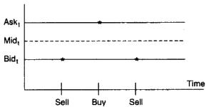  
图11-1指令处理成本

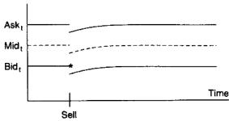  
图11-2存货成本

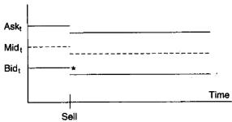  
图11-3信息不对称（逆向选择）

分析做市商报出的买卖价差为我们研究做市商手中存货的多少提供了线索，这也让其他市场参与者能够估计到做市商所面临的委托单流状况。价差出乎意料的扩大可能说明做市商刚刚接收到并且正在处理--份大额头寸。这些头寸或许来自于消息灵通的机构投资者，并且可能预示着证券价格短期的运动方向。因此，从买卖价差中提取有关价格短期波动的信息可能会是预测未来价格变动的可靠方式。

市场中的盈利要么来自于市场行为，要么来自于交易行为。市场收益，也叫做资本收益，对大部分长线投资者而言都非常熟悉。当市场向上时，在市场中做多的投资者便会有所盈利；当市场掉头向下时情况则正好相反。随着市场的起起伏伏，投资者平均而言获得的收益应当与市场收益持平。然而，正如Bagehot（1971）最先指出的那样，短线投机交易者的存在可能会使最终的收益率产生偏差。

如果做市商确切地知道某个交易商具有信息优势，那么做市商可能会单独提高该交易商的买卖价差。但是，大部分交易者都是利用特定事件产生的概率进行交易，并且在平仓前无法将知情交易商与不知情交易商区分开来。为了弥补与知情交易商进行交易的损失，做市商会提高对所有客户的买卖价差以增加利润。结果，由于知情交易商的存在，不论知情或不知情的市场参与者都必须承担较高的买卖价差。

Glosten和Milgrom（1985）在这方面做出了相当重要的研究。他们的模型描述了知情交易商的委托单是如何在竞争性市场中体现并将信息传播出去的。从根本上来说，当交易商提前获知某只股票的利空消息时会立刻卖出股票，获知利好消息时则会买人股票。然而，知情交易商也会可能会进行产生流动性的买卖行为。做市商会根据所接受的委托单种类的不同（买进或卖出）而即时调整对某只股票未来走势的看法。因此，随着做市商对证券期望价值的改变，做市商会调整愿意与客户进行交易的买入价和卖出价。

Glosten和Milgrom（1985）将交易过程描述为一系列的有序行为。首先，一些拥有信息优势的交易商获知了证券的真实价值V，此时其他的市场参与者还并不知情。知情交易商获利的可能性远远超过不知情交易商，因此他们乐意尽可能频繁地进行交易。因为知情交易商知道证券的真实价值 $V$ 他们的赢利永远以不知情交易商的亏损为代价。不知情交易商选择交易的原因通常不是为了短线获利。例如，长线投资者之类市场参与者尽管不知道下一分钟股票的真实价值，但却可能对下一个交易日股票的真实价值有很好的认识。因此，不知情投资者愿意在当下与知情交易商进行交易，只是他们并不知道再多等一分钟，他们就能获得更好的价格。在外汇市场中，不知情交易商（比如跨国公司）可能会因为对冲外汇风险敞口而进行交易。

做市商会把知情交易商拥有的信息反映到价格中。当做市商收到一份指令单时，他会根据指令单的参数来重新评估证券的真实价值。指令单的参数包括建仓方向（买或卖），指定价格（如果是限价指令的话），委托数量，杠杆率或者保证金水平，交易者之前的成功率等。每当有一个新的指令到达时，做市商都会把这些新信息整合进先验概率，这个过程常常用贝叶斯法则（Bayesrule）来描述。根据贝叶斯法则来调整并更新观点的过程称为贝叶斯学习（Bayesian learning）。采用贝叶斯学习的计算机算法通常称为遗传算法(genetic algorithm)。

2000年9月编号为40的《经济学人》中曾发表一篇题为“赞扬贝叶斯”（InPraiseofBayes）的文章，其中对贝叶斯学习的描述如下：

贝叶斯方法的精髓在于其提供了一种数学法则来解释当有一系列新证据出现的情况下，你该如何改变自己现有的信念。换句话说，它让科学家能够将新的数据与他们现有的知识或专长结合起来。一个典型的例子就是，假设一个天赋异禀的新生儿看到了他人生中第一次的日出，接着会想知道太阳是否会再次升起。他赋予这两个可能的结果同等的先验概率，并且在袋子里放入一粒白色弹珠和一粒黑色弹珠来代表此种情况。第二天当太阳升起时，这个孩子在袋子里又放入一粒白色弹珠。此时，从袋子里随机拿出一粒白色弹珠的概率（也就是孩子对将来太阳会升起的信念程度）就从1/2增加到了2/3。当太阳再一天升起后，孩子再放入一粒白色的弹珠，此时概率（信念的程度）从2/3上升到3/4，依此类推。慢慢地，最初认为太阳每天早晨指不定是否升起信念就慢慢地被修正为几乎可以断定太阳永远会再次升起。

在数学上，贝叶斯法则定义如下：

Pr（观测到数据） $= \mathbf { P r }$ （观测到数据I事件发生）Pr（事件发生）+Pr（观测到数据！没有事件发生）×Pr(没有事件发生）

其中，Pr（事件发生）可以代表太阳再次升起或股票价格上涨，而Pr（观测到数据）可以是收到一个买人指令或者看到日出。没有事件发生可以是没有买人指令，或者某日（比如多云天气）没有观测到日出。观测到数据和事件发生同时出现的概率有着以下的对称性质：

Pr(观测到数据，事件发生) $= \operatorname* { P r }$ （事件发生1观测到数据）

Pr(观测到数据) $= \operatorname* { P r }$ （观测到数据！事件发生）.

对式（11-8）进行变形可以得到 $\scriptstyle \mathbf { P r }$ （事件发生！观测到数据）的表达式，再用式（11-7）替换式中的 $\mathrm { P r }$ （观测到数据）项，可得如下结果：

式（11-9）便是我们熟知的贝叶斯法则，它也可另写为：

不论做市商是有意识地计算概率，还是无意识地运用自身交易经验，实际上在每笔指令后他们都应用了贝叶斯规则来判断当前市场形势。例如，假设做市商负责为澳元/美元提供流动性，当前澳元/美元的中间价 $V _ { m i d }$ 是0.6731。因此，做市商对澳元/美元真实价格的最初信念是0.6731。那么，做市商该如何设立买卖价格水平呢?

根据贝叶斯法则，在收到买人指令 $E [ V _ { \mathrm { a s t } } ]$ 买人指令]的情况下，做市商应设立一个新的买人价格 $V _ { \mathrm { w h } }$ 。假设做市商无法区分知情交易商与不知情交易商，他赋予买人指令 $50 \%$ 的概率是来自于知情交易商， $5 0 \%$ 的概率是来自于不知情交易商。另外再进一步假设，知情交易商只有在确定每笔交易扣除买卖价差（无其他交易费用）之后还能盈利5pips以上时，才会下达买入指令。如果做市商对澳元/美元报价的平均买卖价差为2pips，那么知情交易商只有在确信澳元/美元的真实价值至少为0.6738时才会买入。从做市商的角度来说，在接收到一个买人指令后，澳元/美元的真实价值 $V _ { a r b }$ 为0.6738的贝叶斯概率可以用下式计算：

价格设定成如下的条件期望值（conditional expectedvalue）：

新的卖出价 $= E [ V |$ 买入指令] $\mathbf { \tau } = 0 , 6 7 3 1 \times \mathrm { P r }$ $\mathbf { \tilde { \Gamma } } _ { V _ { a s k } } = 0 . 6 7 3 1 \rangle$

$$
+ 0 . 6 7 3 8 \times \mathrm { P r } ( V _ { \alpha \nu \mathrm { ~ } } = 0 . 6 7 3 8 )
$$

$$
= 0 . 6 7 3 1 \times 2 5 \% + 0 . 6 7 3 8 \times 7 5 \% = 0 . 6 7 3 6
$$

与此类似，新的买人价E[ $V _ { b i d }$ |卖出指令]也可以在观察到个卖出指令后依此方法来计算。

最终的买人价格和卖出价格都是可交易的无悔（regretfree）报价。当做市商以0.6736的价格卖出一码的存货给客户时，做市商就会获得保护，从而得以避免因客户拥有内幕信息而造成自己的损失。

当确实有0.6738价位的买人指令到来后，做市商用新的条件期望值重新计算他的买人报价和卖出报价。通过上述计算，做市商会将买人指令来自于知情交易商的后验概率调整为 $7 5 \%$ 。另外，只有在澳元/美元的真实价值与卖出报价的差值大于平均价差以及交易商的最小期望获利值时，知情买家才会以0.6738的价格买人。和之前一样，我们假设交易商期望的最小盈利值为5pips，平均价差为2pips，那么澳元/美元的真实价值必须在0.6745以上交易商才会愿意以0.6738的价格买人。做市商会基于此种条件期望值而再次调整自己的买卖报价

Glosten和Milgrom（1985）的--个结论是，当有大量的知情交易商存在时，做市商会设立一个不合理的高价差来弥补自己的损失。结果就是不会发生任何交易，市场也会因此关闭。

在Glosten和Milgrom（1985）的研究中，所有的交易都以一个单位的证券来进行。Glosten和Milgrom（1985）并未考虑交易规模对价格的影响。Easley和O'Hara（1987）扩展了Glosten和Milgrom的模型，使其包含了交易规模可变的情况。Easley和O'Hara（1987）还加人了一个复杂的元素——信息到达的概率 $\pmb { \alpha }$ 。但是，无论是Glosten和Milgrom（1985）还是Easley以及OHara的模型，知情交易商只是简单地在每个交易机会到来时下单，直到价格调整到他们所认同的新价位为止。交易商并不详细地考虑做市商可能采取的最优化行为以及做市商如何做出反应以消减交易商的利润。

$$
D i f f _ { t } ~ = ~ \beta _ { 0 } ~ + \beta _ { 1 } S i z e _ { t } ~ + \beta _ { 2 } A g g r e s s i v e n e s s _ { t }
$$

$$
+ \beta _ { 3 } I n s t i t u t i o n a l _ { \iota } + \gamma _ { \iota } D _ { \iota \iota } + \cdots + \gamma _ { \iota } D _ { k - 1 , \iota } + \varepsilon _ { \iota }
$$

式中， $\ell$ 是指令递交时间； $n$ 为指令递交后的5分钟或60分钟；Size（规模）是一个指令中交易的股票数量除以该股票在样本时间段之内一天交易量的平均值。对于买人指令而言，Aggressiveness（激进程度）是一个虚拟变量，如果指令的价格设置在当前价格或者更优价格时，其值取为1，否则取为0。Institutional（机构）也是一个虚拟变量，当下单者是机构时，其值取为1，当下单者是个人时，其值取为 $0 _ { \circ } D _ { \iota }$ 到 $D _ { k - 1 }$ 是与所交易的股票相关的虚拟变量。

表11-1机构指令单与个人指令单表现的差异  

<table><tr><td></td><td>戴距</td><td>规模</td><td>激进程度</td><td>机构</td></tr><tr><td>A组：97只股票</td><td></td><td></td><td></td><td></td></tr><tr><td>指令提交后5分钟</td><td>0.005</td><td>0.010①</td><td>0.016①</td><td>0.004①</td></tr><tr><td>指令提交后60分钟</td><td>0.0202</td><td>0.020①</td><td>0.012①</td><td>0.006①</td></tr><tr><td>B组：144只股票</td><td></td><td></td><td></td><td></td></tr><tr><td>指令提交后5分钟</td><td>0.006</td><td>0.012①</td><td>0.014①</td><td>0.004①</td></tr><tr><td>指令提交后60分钟</td><td>0.021②</td><td>0.023①</td><td>0.012①</td><td>0.004①</td></tr></table>

注：这张表出自Anand、Chakravarty和Martell（2005）的研究文章，其中总结了机构指令单和个人指令单表现差异的回归稳健性检验结果。回归方程通过机构交易者和个人交易者区分对股票的选择。回归方程中的因变量是指令提交之后5分钟或60分钟之内买卖中间价的变动值。

$\Phi$ 表示！检验在1%的置信水平下是统计显著的。  
②表示1检验在5%的置信水平下是统计显著的。

资料来源：Reprinted from Journal of Financial Markets,8/32005，Amber Anand, Sugato Chakravarty，and Terrence Martell, "Empirical Evidence on the Evolution of Liquidity: Choice of Market vensus Limit Orders by Informed and Uninfomed Traders," page 21, with permission from Elsevier.

多项研究发现，市场的激进程度体现出自相关的特性，这种特性使得我们可以对未来市场的激进程度进行预测。市场激进程度的自相关性可能与以下两个原因有关：

●机构将大笔指令单拆分成小笔指令单依次递交，每笔小指令单具相似走势，指令单流的重要性由此可见一斑。再次强调，能够观测到指令单流的个体最容易利用交易发生时的市场短期走势来获利。

Lyons（2001）还进一步区分了透明指令单流和不透明指令单流，透明的指令单流能提供即时信息，而不透明的指令流则不能产生有用的数据，也不能通过主观的分析来提取对市场的观点看法。Lyons（2001）认为，指令单流的透明程度包含了以下三个维度：

●交易前信息与交易后信息●价格信息与数量信息●公共信息与经纪自营商信息

经纪商能够直接看到客户以及交易商之间的指令单流，他们拥有交易前信息，并且他们既能看到委托单的价格，也能看到委托数量，另外，他们还能同时看到公共信息和经济自营商信息。另一方面，终端客户般只能看到交易后的价格信息，并且要等到这些信息对所有客户公布的时候。如果所有信息都能得到有效利用的话，经纪自营商在利用委托单流信息获得超额收益方面无疑处于更加有利的地位。

指令单流信息很容易用来交易获利。一份不成比例的大笔买人指令单必然会推动证券价格上涨，在观测到此种指令单时下达买人指令则必能产生盈利。类似的，大笔卖出指令单会压低价格，在观测到这种指令单时及时下达卖出指令同样会获得正的收益。

可直接观察到指令流Lyons(1995)，Perraudin 和 Vitale（1996)，Evans和Lyons（2002）以及其他一些研究报告指出，指令单流是先前分散在不同市场参与者那里的信息的集中体现。对于在某一特定时刻的给足金融证券，指令单流指的是买方发起的交易和卖方发起的交易之差。指令单流有时也称为买方压力或卖方压力（buyingorselling pressures）。如果交易规模可见，指令单流可以用买方发起的累积交易量与卖方发起的累积交易量之差来表示。如果不能直接观测到交易规模，指令单流可以用某个时间段内买方发起的交易次数和卖方发起的交易次数的差值来度量。

不论是基于交易规模（trade-size-based），还是基于交易次数（number-of-trades-based）来度量指令单流，在实证研究文献中都有所应用。大多数指令单都转换成“clips”，或者包裹成一份份的标准数量，因此，这两种度量方式差别不大。对指令单进行这种处理最主要的目的是避免引起过度注意，以及避免进行大笔交易时价格过度上涨。Jones、Kaul和Lipson（1994）实际发现，基于交易次数度量的指令单流比基于交易规模度量的指令单流在预测价格和波动性方面的表现要更好一些。

指令单流在信息发布后价格水平变动过程中的重要性已经为实证研究所证明。例如，Love和Payne（2008）调查了宏观经济新闻发布前后外汇交易所指令单流的情况，他们发现，整合到市场价格中的信息至少有一半直接来自于指令单流。

Love和Payne（2008）研究了以下三种货币对的指令单流：美元/欧元(USD/EUR)，英镑/欧元（GBP/EUR)，以及美元/英镑（USD/GBP)。Love和Payne（2008）所得出的指令单流对各个汇率影响的结果如表11-2所示。他们用每分钟之内买方发起的交易次数和卖方发起的交易次数的差来度量指令单流。Love和Payne（2008）发现，在欧元区发布新闻之后，买方发起的交易每超过卖方发起的交易一次，会导致美元/欧元上涨0.00626，即 $0 , 6 2 6 \%$ 。

表11-2买方发起的交易超出卖方发起的交易一次引起的一分钟收益率变化平均值  

<table><tr><td></td><td>美元/欧元收益率</td><td>英镑/欧元收益率</td><td>美元/英镑收益率</td></tr><tr><td>欧元区发布新闻时的Flow：</td><td>0.00626①</td><td>0.000544</td><td>0.00206</td></tr><tr><td>英国发布新闻时的Flow：</td><td>0.000531</td><td>0.00339③</td><td>0.00322③</td></tr><tr><td>美国发布新闻时的Flow</td><td>0.00701</td><td>0.00204</td><td>0.00342②</td></tr></table>

$\textcircled{3}$ 、②和①分别代表99.9%，95%和90%统计显著性。

不可直接观察到指令单流指令单流并不是对所有的市场参与者都是透明的。例如，执行经纪商可以直接观察到来自客户的买卖指令单，但大部分客户只能看到买卖报价信息，或许还有市场深度信息。

因此，人们提出了很多从观测数据中提取指令单流信息的模型。大部分模型都基于以下原则：某证券价格上涨时，则该证券买人指令单的累积数量必定远超卖出指令单的累积数量，反之亦然。Hasbrouck（1991）提出用下面的方程来对指令单流进行判定，该方程根据前面各时段的指令单进行了调整，并且方程与一天之内的时间段有关：

$$
x _ { i , \ i } = \alpha _ { s } + \sum _ { k = 1 } ^ { \ K } \beta _ { k } r _ { i , \ i - k } + \sum _ { \sigma = 1 } ^ { M } \gamma _ { m } x _ { i - m } + \sum _ { \ i = 1 } ^ { T } \delta D _ { i } + \varepsilon _ { i , \ i }
$$

式中， $\pmb { x } _ { i , \ell }$ 是证券 $_ i$ 在时间段 $\pmb { t }$ 的指令单流的累计值，当为买人指令时，指令单流 $^ { + 1 }$ ，当为卖出指令时，指令单流 $- \mathrm { ~ l ~ } : r _ { i , i }$ 是证券i从时间 $_ { t }$ 到时间 $t + 1$ 的收益率； $D _ { \ell }$ 是用于控制时间 $\boldsymbol { \varepsilon }$ 位于一天之内哪个时段的虚拟变量。Has-brouck（1991）使用了19个 $D$ ，对应美国东部时间上午7:30到下午5：00之间19个半个小时长的时间段。

指令单流的自相关性与市场激进度类似，指令单流也体现出一定的自相关性，这种现象在一系列文献中均有记述，如Biais、Hillion和Spatt（1955）；Foucault（1999);Parlour（1998）;Foucault、Kadan 和Kandel（2005）；Goetler，Parlour和 Rajan(2005，2007）；以及Rosu（2005)。

对高频指令单流的短期自相关现象，Ellul、Holden、Jain和Jennings（2007）认为，这与市场事件发生时，一波又一波的竞争性指令单流形成的流动性耗尽和流动性补充有关，他们证实了在纽约证券交易所，在高频之下指令单流呈现出很强的正的序列相关性，而在低频之下，指令单流却体现出负的相关性。Holli-field、Miller和Sandas（2004）在一只瑞典股票上测试了限价指令单在不同盈利情况下的成交比例。Hedvall、Niemeyer和Rosenqvist（1997）和Ranaldo(2004），Hollifeld、Miller和Sandas（2004）发现芬兰证券交易所里市场两边的投资者行为的不对称现象。Foucault、Kadan和Kandel（2005）以及Rosu（2005）对指令单流的自相关性进行了预测，他们的研究结果支持Biais、Hillion和Spatt（1955）最早提出的对角线自相关效应。

#

了解每个市场参与者的种类和动机可以让我们制定出有利可图的交易策略。例如，分辨出某个市场参与者是否拥有有关未来市场运动方向的信息能立即导致获利，如果他们是不知情交易商，那么就与之交易；如果他们是知情交易商，那么就请跟随他们的步伐。

# 事件套利

在新闻即时发布并且交易分笔进行的情况下，高频交易策略完全可以从消息对市场的影响中获利。这类利用消息公布前后的市场运动进行交易的高频策略统称为事件套利（eventarbitrage）。本章将按如下顺序对事件套利的机制进行研究。

●对策略开发过程进行概述。  
●通过以下统计学模型产生价格预测。  
●方向预测（directional forecasts)  
●点位预测（point forecasts)  
●将事件套利应用于公司重大事件宣布、行业新闻以及宏观经济新闻之中。  
●记录事件对外汇、股票、固定收益、期货、新兴经济体、商品市场以及房地产投资信托（REIT）市场的影响。

# 开发事件套利交易策略

事件套利指的是一类利用市场对事件的反应进行交易的交易策略。事件可以是经济事件，也可以是行业相关事件，这些事件会重复地对所感兴趣的证券产生影响。例如，美国联邦基金利率的意外上升通常会使美元价值上涨，同时提升美元/加元汇率，并降低澳元/美元汇率。因此，美国联邦基金决议的宣布就是一类可以持续的并且有利可图的套利事件。

事件套利策略的目标是在每个事件发生的时间窗口内建立能够产生盈利的投资组合。一个时间窗口通常起始于事件发生前的一瞬，在事件发生后的一小段时间内结束。有些事件的发生是能够事先预知的，比如按确定时间表公布经济数据等，在这种情况下，应当在事件公布之前，或者刚刚公布之后就建立投资组合头寸，随后在公布之后的一小段时间之内就平仓了结。

事件套利的持仓时间可以是几秒，也可以是几个小时，套利通常能以较低的风险产生稳定的盈利。交易收益往往取决于对事件的反应速度，反应越快，策略抓住事件公布后价格向均衡价格调整所产生的一波价格变动的可能性越大。因此，事件套利特别适合于高频交易，并且在全自动的交易条件下才能取得最大盈利。

开发事件套利策略需要利用价格均衡方面的研究，还需要利用统计学工具对事件公布瞬间的分笔数据进行研究。在本章接下来的部分，我们将简要介绍学术界对事件价格影响的研究。现在我们开始讨论开发事件套利策略的过程和方法。

大部分的事件套利策略的开发都遵循如下三个步骤：

1．对每一类事件，确定历史上这类事件发生的日期和时间。2.以合适的频率计算所感兴趣证券在步骤1中事件前后的历史价格变动。3．根据历史上事件前后的价格行为估计预期价格反应。

过去某类事件发生的日期和时间均可以从各种网站上找到。大部分的信息都会在一天的同一个时间公布，数据收集工作也因此更为容易。例如，美国失业率数据总是在东部时间上午8：30公布。而另外一些信息的公布时间是不确定的，比如美国联邦公开市场委员会利率变化公告等，这就要求在收集数据时更加尽心一点。

# 什么构成了一次事件

事件套利策略中的事件可以是任何的经济活动新闻公布、市场干扰，或其他影响市场价格的事件。经典的金融理论告诉我们，在有效市场中，价格会在消息公布的瞬间立即针对新信息调整到位。实际上，以通货膨胀数据而言，市场参与者在正式统计数据公布之前就已经有了一个预期。很多金融经济学家的任务就是利用其他可连续观测到的市场变量（比如商品期货和其他市场证券的价格等）对通货膨胀数据进行预测。当这些预测公布时，市场参与者根据预测结果交易证券，这就使得市场在实际数据公布之前就将参与者的预期整合到价格中去了。

不同事件的幅度（magnitude）是不同的。有些事件可能会对价格有正面或负面的影响，还有些事件产生的影响会比其他事件严重得多。事件的幅度可以用事件的预期值与真实值之间的偏差来衡量。例如，某只股票的价格会在高于或低于预期的业绩公布之后调整到其未来现金流的现值。然而，如果业绩与投资者预期一致，价格就不会有所改变。同样，在外汇市场上，两国货币汇率的改变是由未预期到的变化引起的，比如国内消费者价格指数（CPI）的意外变动等。然而，如果国内CPI数据符合市场预期，则汇率就不会有什么变化。

衡量新闻事件影响最重要的目的是确定到底什么事件才能构成一个未预期的变化或新闻。在早期的宏观经济事件研究中，例如Frenkel（1981）和Edwards（1982）认为，如果对所研究的宏观经济变量进行一步向前自回归预测，那么样本外误差就构成了一个新闻。这种想法的基础是，大部分经济指标都是随时间而缓慢变化的，因此过去几个月或几个季度所观察到的趋势是对下一个数据发布日所公布数值的最好预测。新闻，或者是新闻的未预期部分就是实际公布的数值与自回归分析所得的预期值之间的差异。

有一些研究者，比如Eichenbaum和Evans（1993），还有Grilli和Roubi-ni（1993）曾经用自回归预测过中央银行的决策，包括美联储的决策。同样，这里利用自回归来预测中央银行行为的主要理由是，中央银行不能让他们控制的经济变量有过于剧烈的变化，太大的变化可能会导致大规模的市场混乱。相反，中央银行会采取长期行动，逐渐地改变他们所控制的变量，比如利率和货币供应等，以引导经济朝预期方向发展。

经验证据表明，自回归分析所定义的新闻确实能用于预测证券价格的未来变化。不过事件的影响只在短期之内表现明显——比如日内数据。Almei-da、Goodhart和Payne（1998）证实了在5分钟时间间隔下，宏观经济新闻的发布确实对美元/德国马克的汇率有重要影响。他们发现，美国的就业率数据和贸易平衡数据对预测汇率尤为重要，但是它们只在公布后两个小时内有效。另一方面，美国非农就业数据和消费者信心指数对价格运动的影响能够持续到消息公布之后12个小时甚至更久。

最近，人们根据相对于此前公布的经济学家预测平均值来衡量宏观经济数据中的未预期部分。例如，Barron's以及《华尔街日报》（Wall street Jour-nal）每周都会刊登经济学家对下周即将公布经济数据的一致预期值。此预期值通过对该领域的经济学家进行调查而得。

# 预测方法

方向预测和点位预测是估计价格对事件反应的两种方法。方向预测推断的是某种证券的价格是要上涨还是下跌，而点位预测则推断新的价格会达到什么水平。接下来的两节将详细讨论方向预测和点位预测方法。本章的最后一部分将介绍迄今为止学术文献中记录的事件相关研究成果。

# 方向预测

我们可以使用符号检验法（sign test）来对事件发生后股票价格运动的方向进行预测。符号检验法回答的问题是：所考虑证券的价格是否会在某类信息公布后一致地向上或向下运动?

符号检验假设在没有任何事件发生的情况下，价格变化或者说收益为正或者为负的概率是相等的。然而，当事件发生时，收益却可以一致为正或者为负，具体取决于事件本身。符号检验法的目标是估计市场对于某种事件是否有一致为正或为负的反应，以及这种反应是否具有统计显著性。如果符号检验法得到统计显著的结果，那么事件套利策略就是可行的。

MacKinlay（1997）对符号检验法做出了如下检验假设：

●原假设， $H _ { \mathrm { \diamond } } \colon P \leqslant 0 . 5$ ，表示事件不能导致价格产生一致的行为，即价格一致地向某一方向运动的概率 $P$ 小于或等于 $50 \%$ 。

●备择假设， $H _ { s } : P > 0 . 5$ ，表示事件确实导致所感兴趣证券的价格产生了一致的行为，或者说，价格一致地向某一方运动的概率 $P$ 大于 $5 0 \%$ 。

接着，我们定义 $N$ 为事件总数， $N ^ { + }$ 表示所考虑证券价格有正收益的事件次数。如果渐近检验统计量 $\theta ~ > ~ \phi ^ { - 1 }$ (α)，其中 $\theta ~ = ~ \left[ \frac { N ^ { * } } { N } - 0 . 5 \right] \frac { \sqrt { N } } { 0 . 5 } ~ { \sim } ~$ $N ( 0 , 1 )$ ，则我们能在 $1 - \alpha$ 的统计置信度下拒绝原假设，认为证券价格会对事件有一致的反应。

# 例子：利用美国通货膨胀数据公布交易美元/加元

最新的美国通货膨胀率数据在预定日期的上午8：30分公布。当消息公布时，美元/加元现货还有其他货币对美元汇率会有即时的一次性调整，至少理论上如此。如果确定了这种调整实际发生的时间和调整速度，我们就可以针对最新通货膨胀数据公布之后的价格变化构建一个有利可图的交易策略。

即使是一个漫不经心的市场观察者，也会注意到通货膨胀数据公布时美元/加元的价格调整可能不是一蹴而就的，在美国通货膨胀数据公布前后可能存在能够盈利的交易机会。日内美元/加元现货数据的符号检验表明，可盈利的交易机会确实为数不少。不过，这些机会都只存在于高频交易之中。

确定可盈利交易机会的第一个步骤是找出事件公布后到交易机会截止中间的时间段，也称为“事件窗口”（eventwindow）。我们选择了从2002年1月到2008年8月美国通货膨胀数据公布前后事件窗口的样本分笔数据。因为所有的美国通货膨胀数据都是在东部时间上午8：30公布的，因此，我们将上午8点至9点之间定义为交易窗口，并且下载了该时段所有的报价和交易记录。我们进一步将数据分为5分钟、1分钟、30秒以及15秒的块。之后，我们度量数据公布对5分钟、1分钟、30秒以及15秒美元/加元现货收益率有什么样的影响。

购买力平价（purchasing power parity，PPP）理论指出，本国和外国货币现货汇率等于国内和国外购买力之比。当美国的通货膨胀率变化时，原本的购买力平价平衡就会被打破，从而促使与美元相关的汇率调整到一个新的水平。当美国的通货膨胀率上升时，理论上美元/加元汇率会立即上升，反之亦然。为了简单起见，这里我们忽略市场在数据公布之前对通货膨胀预期值的调整，只考虑通货膨胀数据公布所带来的影响。

符号检验法能够告诉我们在上午 $8 : 0 0$ 至 $9 : 0 0$ 这个“交易窗口”之内，如果市场对数据公布事件有恰当和一致的反应的话，这样的反应存在于在什么样的时间间隔下。我们的数据样本仅包括公布通货膨胀数据的那些交易日。表12-1展示了主要的统计结果。

表12-1美国通货膨胀率公布之后美元/加元交易机会出现的次数  

<table><tr><td>估计频率</td><td>美国通货膨胀率上升</td><td>美国通货膨胀率下降</td></tr><tr><td>5分钟</td><td>0</td><td>0</td></tr><tr><td>1分钟</td><td>1</td><td>0</td></tr><tr><td>30秒</td><td>4</td><td>1</td></tr><tr><td>15秒</td><td>s</td><td>6</td></tr></table>

就美国通货膨胀数据公布前后5分钟间隔的数据来看，好像美元/加元仅仅会对美国通货膨胀率降低有反应，并且这个反应确实是即时完成的。当公布的通货膨胀率降低时，在上午8：25至8：30这5分钟之内，美元/加元汇率会在 $9 5 \%$ 的统计置信度下有所下降。这个结果应该算是潜在地支持了即时调整的假设。毕竞美国通货膨胀数据是在上午8：30公布的，在这个时间点上汇率对通货膨胀率下降的调整好像已经结束了。如果通货膨胀率有所上升，则不存在任何有统计显著性的反应。

高频间隔下的价格变化却给我们展示了另外一幅景象——调整会在短期之内突然发生。例如，在1分钟的时间间隔下，我们能在上午8：34至8：35观测到汇率对通货膨胀率上升的一致反应。因此，这种消息公布之后的价格调整能够带来稳定的盈利机会。

如果将数据以30秒的时间间隔细分，我们发现交易机会的数量会进一步上升。当公布的通货膨胀率上升时，在消息公布后有四个30秒的时间间隔都存在价格调整。如果公布的通货膨胀率下降，则消息发布之后有一个30秒的时间间隔存在价格调整。

再进一步检查15秒的时间间隔，我们能发现更多的交易机会。如果公布的通货膨胀率上升，在消息发布之后从上午8：30到9：00，有五个15秒的周期美元/加元会一致上升，这些周期都会带来交易机会。从上午8：30到9：00，有六个15秒的时间间隔汇率会对通货膨胀率下降的信息做出一致反应。

总的来看，我们观察的时间间隔越短，我们能发现的货币对信息有统计显著性的反应次数就越多。这些机会的短期本质使其更适合于进行系统交易（例如，黑盒交易），如果系统交易实施得好的话，它能降低执行延迟风险，减少持有成本，并且避免昂贵的人为误判。

# 点位预测

方向性预测推测的是趋势方向，而点位预测则估计消息公布后新的均衡价格。开发点位预测系统需要对所关注消息公布前后的具体交易数据进行事件研究。

事件研究量化地度量了新闻事件前后信息的发布对收益率的影响，通常步骤如下：

1．找出并记录信息公布的日期、时间，以及“超出预期”部分的变化等。为了创建有效的模拟，事件的数据库和事件前后证券的交易价格必须非常详尽，时间必须仔细分类，报价和交易数据也必须具有足够高的频率。未预期部分可以用下面的方式度量：

●实际值与自回归预测值之间的差异。  
●实际值与彭博或汤森路透分析师一致预期值之间的差异。

2.计算证券在信息公布前后所关注时间段的收益率。例如，如果研究人员想评估CPI发布事件对美元/加元5分钟收益率的影响，那么就应该计算历史上CPI公布当天上午8：00至8：35美元/加元的变化。（之所以选择上午8:30至8：35来计算CPI公布事件在5分钟内的影响，是因为美国的CPI数据总是在东部时间8：30发布)。

3.信息发布的影响力可以用简单的线性回归方程进行估计：

$$
R _ { \iota } \ = \ \alpha + \beta \Delta X _ { \iota } + \varepsilon _ { \iota }
$$

式中， $R _ { \iota }$ 是信息发布前后的收益率数据，并且按照信息发布的先后顺序进行排列； $\Delta X _ { t }$ 也是按信息发布顺序排列的超预期变化数据； $\varepsilon _ { r }$ 是新闻发布时的特异性误差； $\pmb { \alpha }$ 是回归方程中的截距项，用于表示收益中不是由未预期信息引起的部分； $\boldsymbol { \beta }$ 是信息发布对证券收益的平均影响。

在计算股票价格变化时，需要使用大市变化对其进行调整以消除大市变化对股票价格的影响。这种调整通常使用夏普（1964）的市场模型：

$$
R _ { i } ^ { \alpha } \ = \ R _ { i } \ - \hat { R } _ { i }
$$

其中 $\hat { R } _ { e }$ 是用如下的市场模型依据历史数据估算出的股票预期收益：

$$
R _ { t } \ = \alpha + \beta R _ { n , t } + \varepsilon _ { t }
$$

这种方法最早由Ball和Brown（1968）提出。现在按照这种方式可以得出具有统计显著性的交易机会。

事件套利交易策略可以追踪各种宏观经济数据的发布、公司业绩报告，以及其他各种重复发生的经济信息。通常在一个交易日内，在世界范围内会发布无数的经济数据。这种信息可能关系到某一公司、某一行业，或者某一国家；甚至像宏观经济新闻一样，具有全球影响。公司新闻一般包括季度或年度业绩报告、收购和兼并公告、新产品发布等。行业新闻包括某国行业监管法规、关税，以及行业经济环境的改变等。宏观经济新闻包括主要中央银行的利率公告、政府发布的宏观经济指标，以及区域经济表现评估数据等。

随着信息技术的发展，比如RSS馈料、提醒、专线报道，还有新闻聚合引擎等，现在数据公布后投资者能立即收到相关信息。一个良好的自动事件套利系统能够抓取新闻，将事件分类，并根据历史数据将事件与证券对应起来。

# 可用于交易的新闻

# 公司新闻

公司发布季报或年报时，报告内容会显著影响公司股价。业绩的意外增长会抬升股票价格，而业绩的意外下滑通常会降低公司的股票价格。

分析师会在业绩公布之前对业绩做出预测。如果实际公布的数据与分析师的预期数据不一致，股价会很快地调整到一个新的均衡水平。实际公布数据与分析师预测数据的中值或均值的差异就是公布数据的未预期部分，在估计事件对价格的影响时，未预期部分是一个关键的变量。

理论上说，股票价格应当等于未来现金流的现值。贴现时既可以使用资本资产定价模型所确定的利率，也可以使用Ross（1976）提出的套利定价理论，或者是投资者特有的机会成本：

$$
= \sum _ { t = 1 } ^ { \infty } \frac { E [ \mathcal { \hat { H } } \mathcal { Q } , \dot { \Xi } _ { t } ] } { ( 1 + R _ { t } ) ^ { \prime } }
$$

式中， $E$ （股息）是公司在未来时间 $\ell$ 的预期现金流； $R _ { r }$ 是将股息从时间：贴现到当下的贴现率。未预期的业绩变化会使股价迅速对新的业绩信息调整到位。

如果实际业绩大幅偏离预测值，会导致市场大幅波动，甚至引起市场崩溃。为了避免业绩报告对市场造成过大影响，大部分业绩报告会选择在股市收盘后发布。

其他公司层面的新闻同样会影响股票价格。例如，Famma、Fisher、Jensen和Roll（1969）曾经研究了股票分割效应，他们发现相对于股票的均衡价格水平，股价往往会在分割之后有所上涨。

事件套利模型注意到了业绩报告对不同公司会有不同影响的现象。公司市值大小是研究最为广泛的公司层面的影响因子之一（详见Atiase（1985），Freeman（1987），还有Fan-fah、Mohd和Nasir（2008））。

# 行业新闻

行业新闻主要包括相关法律法规的制定和新产品的发布等。这类消息会影响整个行业并促使行业内的股票朝同一个方向波动。宏观经济数据的收集和发布是按系统化的方式进行的，而行业新闻通常是不定期地出现。

对法规决策的实证研究表明，政府放宽对某一行业的政策限制通常会导致股价的上升，而收紧政策则会压低股价。Navissi、Bowman和Emanuel（1999）的研究结果就是其中的诸多证据之一，他们发现，放松或者取消价

格管制会导致股价上升，而价格管制则会压低股价。Boscaljon（2005）的研究也发现当美国食品药物监督管理局（FDA）放宽广告法规时，往往也伴随着股价的上涨。

# 宏观经济新闻

政府机构按照预定的时间表公布各项宏观经济决策和经济指标。例如，利率是由美联储或英格兰银行之类的中央银行里的经济学家制定的。另一方面，消费者物价指数之类的指标一般不是人为制定的，而是国家央行的附属机构调查得出的。

其他的宏观经济指标一般是由营利或非营利的私人机构的研究部门发布的。例如，高盛连锁店销售指数（ICSCGoldman storesales index）就是国际购物中心协会（ICSC）编制，并由高盛集团进行支持和推广的。这个指数追踪采样零售商的每周零售额，以此作为衡量消费者信心的一个指标：消费者对经济和他们未来收入的信心越强，他们的消费支出就越多，这个指数值也就越高。其他各类指标也用来衡量经济活动的各个方面，从麦当劳汉堡在不同国家的相对价格，到石油供应，以及不同行业的就业水平等。

表12-2展示了在2009年3月3日周二（一个典型的交易日）宏观经济数据的发布计划表。欧洲数据通常在欧洲交易时段的上午，即北美市场收盘之后发布。美国和加拿大政府的大部分宏观经济数据在北美上午的交易时段，即欧洲下午的交易时段发布。亚太地区包括澳大利亚及新西兰的大部分数据则通常在亚洲交易时段的上午发布。

大多数公布的经济数据都会有“一致预期值”，此数值是对各个金融机构分析师的预测值进行整合而来的。一致预期值常常由彭博等大型媒体数据公司发布，他们每周对分析师的预测进行调查，并算出行业预期的平均值。

宏观经济新闻来自全球的各个角落。人们常常通过事件研究来估计信息对货币、商品、股票、固定收益证券，以此及衍生工具的影响，以此衡量新闻对所感兴趣证券价格的持续影响力。

表12-22009年3月3日宏观经济数据公布计划时间表  

<table><tr><td>时间（美东部）</td><td>事件</td><td>前值</td><td>一致预期值</td><td>国家</td></tr><tr><td>1:00 A. M.</td><td>挪威消费者信心指数</td><td>-13.3</td><td></td><td>挪威</td></tr><tr><td>1:45 A. M.</td><td>GDP季度值</td><td>0.0%</td><td>-0.8%</td><td>瑞士</td></tr><tr><td>1:45 A. M.</td><td>GDP年度值</td><td>1.6%</td><td>-0.1%</td><td>瑞士</td></tr><tr><td>2:00A. M.</td><td>批发价格指数月度值</td><td>-3.0%</td><td>-2.0%</td><td>德国</td></tr><tr><td>2:00 A. M.</td><td>批发价格指数年度值</td><td>-3.3%</td><td>-6.3%</td><td>德国</td></tr><tr><td>3:00A. M.</td><td>挪威采购经理指数SA</td><td>40.8</td><td>40.2</td><td>挪威</td></tr><tr><td>4:30 A. M.</td><td>建筑业采购经理人指数</td><td>34.5</td><td>34.2</td><td>英国</td></tr><tr><td>7:45 A. M.</td><td>国际购物中心协会/高盛连锁店销售指数</td><td></td><td></td><td>美国</td></tr><tr><td>8:55 A. M.</td><td>红皮书</td><td></td><td></td><td>美国</td></tr><tr><td>9: 00 A. M.</td><td>加拿大银行利率</td><td>1.0%</td><td>0.5%</td><td>加拿大</td></tr><tr><td>10:00 A. M.</td><td>成屋待完成销售指数</td><td>6.3%</td><td>-3.0%</td><td>美国</td></tr><tr><td>I:00 P. M.</td><td>四周债券拍卖</td><td></td><td></td><td>美国</td></tr><tr><td>2:00 P. M.</td><td>汽车销售量</td><td>9.6M</td><td>9.6M</td><td>美国</td></tr><tr><td>2:00 P. M.</td><td>国内汽车销售量</td><td>6.8M</td><td>6.9M</td><td>美国</td></tr><tr><td>5:00 P. M.</td><td>ABC/华盛顿邮报消费者信心指数</td><td>v48</td><td>-47</td><td>美国</td></tr><tr><td>5: 30 P. M.</td><td>AIG服务业表现指数</td><td>41</td><td></td><td>澳大利亚</td></tr><tr><td>7:00 P. M.</td><td>全英（房屋抵押贷款协会）消费者信心指数</td><td>40</td><td>38</td><td>英国</td></tr><tr><td>7:30 P. M.</td><td>GDP季度值</td><td>0.1%</td><td>0.1%</td><td>澳大利亚</td></tr><tr><td>7:30 P. M.</td><td>GDP年度值</td><td>1.9%</td><td>1.1%</td><td>澳大利亚</td></tr><tr><td>9:00 P.M.</td><td>澳新银行商品价格指数</td><td>-4.3%</td><td></td><td>新西兰</td></tr></table>

注：“SA"表示经过季节性调整（seasonally adjusted）的数据；“NSA”表示未经季节性调整(non-seasonally adjusted）的数据。

# 事件套利的应用

# 外汇市场

很多学者研究过外汇市场对宏观经济新闻的反应，比如Almeida、Goodhart、Payne（1998);Edison（1996);Andersen、Bollerslev、Diebold 和 Vega(2003);以及 Love 和 Payne（2008）等。

Edison（1996）研究了宏观经济数据对美元相关外汇汇率以及部分固定收益证券每日收益的影响，发现外汇市场对实体经济事件例如非农就业数据的反应最为明显。Edison（1996）特别指出，非农就业数据每意外增加100000人，美元汇率平均会上升 $0 . 2 \%$ 。与此同时，他们还发现，通货膨胀数据对汇率儿乎没有什么影响。

Andersen、Bollerslev、Diebold和Vega（2003）使用本书第9章介绍的方法从具有时间戳的外汇报价数据中精确地获得了5分钟的时间间隔，并在此基础上进行分析。他们指出，平均汇率会在消息公布后迅速并有效地调整到新的水平。然而，波动率在信息公布后需要更长的时间才能逐步恢复正常。他们还发现，利空消息通常会比利好消息的影响力更大一些。

Andersen、Bollerslev、Diebold和Vega（2003）用国际货币服务机构（IntermationalMoneyMarketServices，MMS）编辑的一致预期值作为估计发布新闻中未预期部分的基准。他们对外汇汇率5分钟变化 $R _ { \varepsilon }$ 建立模型如下：

$$
R _ { t } = \beta _ { 0 } + \sum _ { i = 1 } ^ { t } \beta _ { i } R _ { t - i } + \sum _ { k = 1 } ^ { \kappa } \sum _ { j = 0 } ^ { l } \beta _ { i j } S _ { K , t - j } + \varepsilon _ { i } , t = 1 , \cdots , T
$$

式中， $R _ { t = i }$ 是5分钟即时汇率的 $_ i$ 周期的滞后值； $\mathbf { \delta } _ { S _ { K } , t } - j$ 是第 $K$ 个基本面变量的$J$ 期滞后值的未预期部分； $\varepsilon _ { e }$ 是随着时间以及日内季节性差价变化而变化的波动率。Andersen、Bollerslev、Diebold和Vega（2003）评估了以下这些因素的影响：

●GDP（初始值，●非农就业数据●零售数据  
·工业生产值  
●产能利用率  
●个人收人  
●消费者信贷  
●个人消费支出●新屋销售数据●耐用品订单  
●营建开支  
●工厂订单  
●商业库存  
●政府预算赤字  
●贸易收支  
●生产者物价指数  
●消费者物价指数  
●消费者信心指数  
●供应管理协会（ISM）指数（前身为全美采购经理人协会指数）  
●房屋开工率  
●领先指标  
●联邦基金利率目标  
●初次申请失业金人数  
●货币供应量（M1，M2，M3）  
就业率  
●制造业订单  
●制造业产量  
●贸易差额  
●经常项目  
生产者价格  
●批发价格指数  
●进口价格指数  
●货币存量M3

Andersen、Bollerslev、Diebold 和Vega（2003）研究了从1992年1月3日至1998年12月30日这段时间内如下几个货币对：英镑/美元，美元/日元，德国马克/美元，瑞士法郎/美元，还有欧元/美元。他们发现，在 $9 9 \%$ 的统计显著性下，所有的货币对都对下列指标的未预期改变有积极的反应：非农就业数据、工业生产指数、耐用品订单指数、贸易收支、消费者信心指数、供应管理协会指数。所有的货币对都对申请失业金人数及货币存量M3的未预期增长有消极反应。

Love和Payne（2008）的研究显示不同国家的宏观经济数据会对不同的货币组合产生影响。他们研究了美国、欧元区以及英国的宏观经济数据对欧元/美元、英镑/美元以及欧元/英镑汇率的影响。结果表明美国的经济数据对欧元/美元汇率的影响最为明显，而英镑/美元受英国经济数据的影响最大。Love和Payne（2008）还在文章中研究了公布的指标对三个区域各自货币的影响，其结果如表12-3所示。

表12-3地区经济数据公布对各自货币的影响，Love和Payne（2008）  

<table><tr><td colspan="4">数据公布类型</td></tr><tr><td>数据公布的地区</td><td>货币或价格的上升</td><td>产量的增加</td><td>贸易收支的增长</td></tr><tr><td>欧元区，对欧元的影响</td><td>升值</td><td>升值</td><td></td></tr><tr><td>英国，对英镑的影响</td><td>升值</td><td>升值</td><td>升值</td></tr><tr><td>美国，对美元的影响</td><td>贬值</td><td>升值</td><td>升值</td></tr></table>

# 股票市场

一个典型的交易日通常会充斥着各种国际国内的宏观经济数据。宏观经济数据是如何影响股票市场的呢?

经典的金融学理论认为，股票价格的改变是由两个因素引起的：上市公司预期股息的改变以及与这些公司相关的贴现率的改变。预期股息可能会随着市场环境的变化而变化。例如，消费者信心以及消费者支出的增加很可能会刺激零售额的增长，提高零售业利润增长的前景。另一方面，劳动力成本的上升则可能预示着企业状况将更加艰难，从而减少股息的预期值。

在经典金融理论中，贴现率是由无风险利率以及特定股票所特有的风险水平所决定的。与美国股票相关的无风险利率通常可以用美国3月短期国债利率替代；其他国家股票的无风险利率则通常被认为是该国央行宣布的短期目标利率。无风险利率越低，股息的贴现率就越低，理论上股票的价格就越高。

在现实中，宏观经济数据是如何影响股价的呢？大量的实证研究显示，相对其他宏观经济数据而言，股价对利率的公布有着较强的反应。无论是长期利率还是短期利率的下降都会对股票月度收益产生积极影响，长期利率具有$90 \%$ 的统计置信度，短期利率具有 $9 9 \%$ 的统计置信度。Culter、Poterba和 Sum-mers（1989）的文章分析了纽约证券交易所1946\~1985年样本期间的股票月收益，他们发现，美国3月短期国债的收益率每降低 $1 \%$ ，纽约证券交易所股票的月收益率平均会增加1. $2 3 \%$ 。

股票对非货币政策的宏观经济数据通常反应不一。在其他市场条件不变的情况下，通货膨胀的上升会降低股票的投资回报率（详见Pearce（1983）和Roley（1985））。其他一些宏观经济变量带来的影响要视当前经济周期的具体情况而定。McQueen和Roley（1993）的研究发现，在经济衰退阶段，高于预期的工业生产值对股市来说是个好消息，但在经济十分活跃的时期则并不是个好消息。

同样，失业率的非预期改变对股市的影响也视经济状况而定。Orphanides（1992）的研究发现只有当经济处于扩张阶段时失业率的增加才会使得股票回报率提高。在经济萎缩时期，股票回报率会随着失业率的增加而降低。Orphanides（1992）将股票的这种不同的反应归结为“过热假说”：当经济过热时，失业率的增加事实上是个好消息。这一研究结果被Boyd、Hu和Jagan-nathan（2005）所证实。对宏观经济数据的不对称反应并不仅仅只局限于美国市场。例如LÖflund和Nummelin（1997）观察到工业生产指数对芬兰股票市场的不对称影响，他们发现高于预期的工业生产增长率会在经济萧条时支撑股价。

不论宏观经济数据的公布是否会影响股价的走势，数据的公布通常都会加大市场的波动率。Schwert（1989）指出，股票市场的波动并不一定跟宏观经济因素的变动有关，不过宏观经济数据的未预期程度会极大地增加市场的波动。例如，Bernanke和Kuttner（2005）的研究显示美国联邦公开市场委员会（FOMC）公布利率的未预期变动会加大股票回报率的波动幅度。Connolly和Stivers（2005）记录了美国宏观经济数据引起的道琼斯工业平均指数成分股的波动情况。高波动率代表高风险，金融理论告诉我们高风险应该伴随着高收益。实际上，Savor和Wilson（2008）的研究显示，股票价格在美国主要宏观经济数据公布当日的回报率要高于无主要数据公布的交易日。Savor和Wilson（2008）认定的主要宏观经济数据包括消费者价格指数，生产者价格指数（PPI)，就业数据以及FOMC的利率决议等。Veronesi（1999）的研究显示经济环境不稳定的时候投资者对宏观经济数据的公布会非常敏感，从而导致资产价格波动较大。欧洲市场方面，Errunza和Hogan（1998）的研究发现货币和实际宏观经济数据的公布对欧洲大型证券市场的波动有较大影响。

不同来源的信息对股票有着不同频率的影响。随着股票观察数据频率的增加，宏观经济数据的影响力也会逐步显现。例如Chan、Karceski和Lakonishok（1998）在套利定价理论框架下分析了美国和日本股票市场的月度收益，他们发现，在低频交易下股票自身的一些特征是对未来收益最有预测能力的。他们用模拟因子的投资组合研究显示，规模大小、过去收益、账面市值比，以及股票本身的股息收益率是跟随股票回报率而共变最多的因素。然而，他们也认为，在月度收益频率之下，“宏观经济因素不能很好地解释股票收益的共变”。Wasserfallen（1989）认为宏观经济数据在股票季度数据上没有显示出任何影响。

Flannery和Protopapadakis（2002）发现美国股票的日回报率受到几种宏观经济数据非常显著的影响。他们用一些独立变量估计了—个GARCH收益模型并发现以下这些宏观经济数据的公布对股票的收益率及波动率均有显著影响：消费者价格指数、生产价格指数、货币供应量、国际贸易差额、就业报告以及新屋开工数等。

Ajayi和Mehdian（1995）认为除美国外的发达国家的证券市场通常对美国宏观经济数据反应过度。因此国外证券市场对美元汇率及国内经常项日平衡表现较为敏感。例如，Sadeghi（1992）发现在澳大利亚股票市场上，股票的收益率会随着经常项目赤字、澳元兑美元的汇率以及GDP终值的上升而增加；而随着国内通货膨胀或利率的提高，股票收益率会降低。

不同行业的上市公司对宏观经济数据的反应也不同。例如，Hardouvelis（1987）指出金融机构的股票对货币政策的调整显示出极高的敏感度。股票的市值也会有所影响。Li和Hu（1998）的研究显示市值大的股票对宏观经济数据未预期改变的敏感程度要高于小盘股。

宏观经济数据“意外”程度的大小对股价影响会有所不同。Aggarwal和

Schirm（1992）的文章显示，当非预期部分较小，距离均值在一个标准差之内时，它对股票及外汇市场的影响要远大于高“意外”数据公布时的影响力。

# 固定收益市场

Jones、Lamont和Lumsdaine（1998）研究了就业数据及生产价格指数对美国国债的影响。作者发现债券价格的波动在数据公布当天会明显加大，但这种波动不会持续到公布日之后，这表明公布的信息快速地整合到了价格之中。

Hardouvelis（1987）和Edison（1996）的研究表明，就业数据、生产价格指数以及消费者价格指数会影响债券价格。Krueger（1996）的研究结果显示美国失业率的下降会提高美国债券的收益率。

在高频环境下债券市场对宏观经济数据反应的研究成果包括Ederington和Lee（1993)；Fleming[1997]和 Remolona（1999)；Balduzzi、Elton 和 Green(2001）等。Ederington和Lee（1993）以及Fleming和Remolona（1999）的研究显示，在数据公布后的两分钟内，新的信息便会被完全地吸收至债券价格中。Fleming和Remolona（1999）研究了宏观经济数据公布在高频下对美国债券收益曲线的影响。Fleming和Remolona（1999）度量了十种不同类型信息的影响：消费者价格指数、耐用品订单、国内生产总值、房屋开工率、失业率、领先指标、非农就业数据、生产者物价指数、零售数据和贸易差额。Fleming和Remolona（1999）将宏观经济数据的未预期部分定义为实际公布数值减去汤森路透对该数据的一致预期值。

Fleming和Remolona（1999）研究的所有10个宏观经济数据公布时间均为早上8：30。他们测量了早上 $8 { : } 3 0 \sim 8 { : } 3 5$ 这个时间段内数据公布后对债券收益曲线的影响，并记录了宏观数据每 $1 \%$ 的未预期改变导致的收益曲线的有统计显著性的变化。表12-4展示了实验结果。如表12-4所示，在 $9 5 \%$ 的统计置信度下，失业率每未预期增加 $1 \%$ 会导致3月期短期国债收益率平均下跌 $0 . 9 \%$ 在 $9 9 \%$ 的统计置信度下，失业率每未预期增加 $1 \%$ 会导致2年期国债收益率下跌 $1 , 3 \%$ 。30 年国债收益率的下跌则没有统计显著性。

表12-4Fleming 和Remolona（1999)研究的宏观经济数据公布的影响  

<table><tr><td>公布数据</td><td>3月期国债</td><td>2年期国债</td><td>30年期国债</td></tr><tr><td>消费者物价指数</td><td>0.593①</td><td>1.472②</td><td>1.296②</td></tr><tr><td>耐用品订单指数</td><td>1.275②</td><td>2.180②</td><td>1. 170②</td></tr><tr><td>国内生产总值</td><td>0.277</td><td>0.379</td><td>0.167</td></tr><tr><td>新屋开工率</td><td>0.670②</td><td>1.406②</td><td>0.731②</td></tr><tr><td>失业率</td><td>-0.939①</td><td>-1.318②</td><td>-0.158</td></tr><tr><td>领先指标</td><td>0.411②</td><td>0.525①</td><td>0.271①</td></tr><tr><td>非农就业数据</td><td>3.831②</td><td>6.124②</td><td>2.679①</td></tr><tr><td>生产者物价指数</td><td>0.768②</td><td>1.879②</td><td>1.738</td></tr><tr><td>零售数据</td><td>0.582①</td><td>1.428②</td><td>0.766②</td></tr><tr><td>贸易差额</td><td>-0.138</td><td>0.027</td><td>-0.062</td></tr></table>

注：表格列出了宏观经济数据每非预期改变 $1 \%$ ，美国3月期国债，2年期国债及30年期国债的平均变动百分值。 $\textcircled{1}$ 和②分别代表95%和99%的统计置信度：估计所用样本数据来自1991年7月1日到1995年9月29日这一时阀段。

# 期货市场

很多学者也研究了宏观经济数据的公布对期货市场的影响，例如Becker、Finnerty，和 Kopecky(1996）;Ederington 和 Lee(1993）;Simpson 和 Ram-chander（2004）等。Becker、Finnerty和Kopecky（1996）以及Simpson和Ramchander（2004）的研究显示生产者价格指数、商品贸易、非农就业数据以及消费者价格指数等数据的公布会影响债券期货的价格。Ederington和Lee（1993）的研究则发现新闻引起的利率及外汇期货价格调整往往发生在数据公布后的一分钟内。然而，新闻引起的价格波动则通常会持续15分钟。

# 新兴经济体

一些学者研究了宏观经济数据对新兴经济体的影响。例如，Andritzky、Bannister和Tamirisa（2007）研究了宏观经济数据的公布如何影响债券利差。他们发现美国的数据对此有着重要的影响，国内的数据反而并不能产生如此大的影响。另一方面，Nikkinen、Omran、SahlstrOm和ÅijO（2006）对证券市场进行了类似的研究发现，成熟的证券市场对美国宏观经济数据的反应快速灵敏，而新兴国家的证券市场通常不受影响。Kandir（2008）测算了宏观经济数据对伊斯坦布尔证券交易所交易的股票月度回报率的影响，发现土耳其里拉兑美元汇率、土耳其利率以及全球市场收益率对土耳其股票有着重大的影响。而国内的经济指标如工业产值以及货币供应量则几乎没有影响力。Muradoglu、Taskin和Bigan（2000）研究发现新兴市场更多地受全球宏观经济指标的影响，而受影响程度则与新兴市场的规模及其在全球经济中的融人程度有关。

东盟（ASEAN）国家则主要受其国内经济指标的影响。Wongbangpo和Sharma（2002）发现当地的国民生产总值、消费者价格指数、货币供应量、利率，以及美元对东盟国家（印度尼西亚、马来西亚、菲律宾、新加坡、泰国）货币的汇率都对当地的股票市场有显著影响。同时，Bailey（1990）发现美国的货币供应量与亚太地区股票市场的回报率之间没有什么因果关系。

# 商品市场

Gorton和Rouwenhorst（2006）对商品市场进行了实证研究，结果指出实体的经济活动及通货膨胀指数均影响商品价格。然而，新闻公布的影响则效果不一，超出预期的实体经济活动以及通货膨胀数字通常会促使商品价格上升，除非利率也随之上升，因为利率上升会冷却商品的升值。有关商品价格及利率之间关系的详情可以参考Bond（1984），Chambers（1985），以及Frankel(2006）的研究文章。

# 房地产投资信托基金（REITs）

由美国国会于1960年建立的房地产投资信托基金是一种较为新颖的公开交易证券。所有美国房产投资信托基金在1991年的总市值为900万美元，此后逐步增加至2006年的3000亿美元。房地产投资信托基金可以如普通的股票般买卖，但有如下特殊的要求：房地产投资信托基金资产必须至少有 $7 5 \%$ 投资于房地产，并且必须将至少 $90 \%$ 的应税所得用于分红。鉴于其红利支付率很高，房地产投资信托基金对宏观经济数据的反应可能会与普通的股票有所不同。

Simpson、Ramchander和Webb（2007）研究了通货膨胀对房地产投资信托基金的影响。结果发现通货膨胀未预期的下跌或上涨都会引起房地产投资信托基金回报率的上升。Bredin、O”Reilly和 Stevenson（2007）检测了房地产投资信托基金的回报率对美国货币政策未预期改变的反应。他们发现，房地产投资信托基金与股票的反应类似—联邦基金利率的提高会增加房地产投资信托基金的波动率，同时压低房地产投资信托基金的价格。

# 结论

只有当投资者对新闻事件做出反应的时候市场才会达到新的平衡，因此事件套利策略可利用高频交易来完成。事件套利交易窗口时间短暂，如果我们能正确估计历史信息公布的影响，就能在市场信息公布前后做出有利可图的交易决策。

# 高频统计套利

统计套利在20世纪90年代末期开始流行起来，当时像物理学等“硬科学”的博士们利用这种简单的统计现象获得了两位数的收益。从那以后，统计套利就开始毁誉参半。2007年前，许多统计套利交易者获得的超额收益使得统计套利技术流行起来。但是，也有人i病统计套利交易者在2007\~2008年的经济危机中使市场变得不稳定。统计套利能让行家里手受益匪浅，也能让一知半解者损失惨重。

统计套利是“布林带”（BollingerBands）这种技术分析策略的现代近亲。布林带在价格的简单移动平均线上下画出两倍标准差的包络线，来揭示某时刻的价格最高和最低位置。尽管近来统计套利策略迅速流行，可是关于统计套利的错误理解也随处可见。本章将对统计套利技术进行详细考察。

统计套利的核心直接依赖于数据挖掘（datamining）。首先，统计套利分析者对海量的历史数据进行筛选，以期发现某种普遍的统计关系。这种关系可以存在于一个证券的当前价格水平及其近期历史价格水平之间，也可存在于两个证券的价格水平之间，甚至可以存在于一个证券的价格水平和另一个证券的波动率之间。在寻找的过程中，关键在于这种关系必须在 $90 \%$ 的统计置信度下成立， $90 \%$ 是大多数统计分析中可以接受的最低置信阀值。

当我们检测到一个显著的统计关系之后，我们就可以建立一个基于如下假设的统计套利交易模型：如果某一时刻这种统计关系被违反，那么它将会均值回复（mean-revert）到它的历史正常水平，此时我们就应该在均值回复方向建立头寸。当对这种统计关系的违反程度变得很大时，我们假设均值回复的趋势也会相应增加。

我们可以用目前的相互关系与历史平均值偏离几倍的标准差来衡量当前对历史关系的违反程度。例如，假设我们感兴趣的变量是价格，在短时期内美元/加元的价格水平相对于美元/瑞士法郎的价格水平上升了它们之差的历史水平两倍标准差以上，统计套利策略认为美元/加元这种非同寻常的大幅变动有可能在不久的将来会有一个反转，因此交易策略会建立一个美元/加元的空头头寸。如果均值回复确实发生了，这一策略就取得了盈利，否则，止损会被触发，这个策略产生了一次亏损。

# 数学基础

从数学上讲，我们需要基于两种证券之间的价格关系或者是其他特征之间的关系来构建统计套利交易信号。对于任意两个证券 $\pmb { i }$ 和 $j$ ，我们可以通过如下步骤来获得它们的价格 $S _ { i , \ell }$ 和 $s _ { j , e }$ 之间的关系：

1.找出具有适当流动性的证券，即在我们期望的交易频率单元内至少交易一次的证券。例如，对于小时级别的交易频率，我们就选取那些每小时至少交易一次的证券。

2.对于时间t，计算步骤（1）选取的证券中任意两个证券 $i$ 和j之间的价格差：

$$
\Delta S _ { i , i } \ = \ S _ { i , i } - S _ { j , i } \ , \ t \ \in \ [ 1 , T ]
$$

式中， $\boldsymbol { \tau }$ 是日观察数据的总数，这个数字需要足够大。根据统计学中的中心极限定理（CLT），在选定的交易频率中至少需要30个观察数据。然而，由于日内数据有着很强的季节性，即每天特定时间我们能总观察到一些反复出现的关系，因此，我们强烈建议选取一个比较大的 $\tau$ ，至少也需要超过30。如果要求推断结果具有很好的稳健性，我们需要选取500天（两年）的日观测数据。

3.从所有证券配对中选出具有最稳定关系的证券组合——那些变化一致的证券配对。为此，Gatev、Goetzmann和Rouwenhorst（2006）对每两个流动性证券的历史回报之差做了一个简单的极小化：

$$
\operatorname* { m i n } _ { i , j } \sum _ { i = 1 } ^ { r } { ( \Delta S _ { i j , i } ) ^ { 2 } }
$$

证券价格关系的稳定性也可以用协整（cointegration）或是其他统计方法来评估。接下来，对证券i，选择使得式（13-2）具有最小平方和的证券j与之配对。

4.按照如下方法来估计价差的基本分布性质。

价差的均值：

$$
E [ \Delta S _ { \varepsilon } ] ~ = ~ \frac { 1 } { T } \sum _ { i = 1 } ^ { \tau } \Delta S _ { i }
$$

标准差：

$$
\sigma [ \Delta S _ { \imath } ] = \frac { 1 } { \imath - 1 } \sum _ { \imath = 1 } ^ { \imath } ~ ( \Delta S _ { \imath } - E [ \Delta \mathrm { S } _ { \imath } ] ) ^ { 2 }
$$

5.监测证券价差，并付诸行动：

在某个特定时刻 $\tau$ ，如果

$$
\Delta S _ { \tau } = S _ { i , \tau } - S _ { j , \tau } > E [ \Delta S _ { \tau } ] + 2 \sigma [ \Delta S _ { \tau } ] 
$$

则卖出证券 $_ i$ 同时买人证券 $j$ 。另一方面，如果

$$
\Delta S _ { \tau } ~ = ~ S _ { i , \tau } - S _ { j , \tau } ~ < { \cal E } [ \Delta S _ { \tau } ] ~ - 2 \sigma [ \Delta S _ { \tau } ]
$$

则买人证券 $\dot { \iota }$ 同时卖出证券 $j$ 。

6.如果证券间的价差反转使我们获得预期的盈利，我们就平仓了结头寸；如果价格朝我们预测的相反方向变动，那我们就止损。

除了检测价格水平的统计异常外，我们还可以把统计套利应用到其他变量，比如两个证券的相关性和一些传统的基本面关系。我们将在接下来的文中讨论基于基本面因素的统计套利的实施细节。

我们可以动态地调整统计套利策略使之适应市场状况的变化。比如，对于所考虑的变量的均值，也就是我们假定统计关系将会回归到的数值，我们可以利用加权移动平均的办法来计算，这样我们赋予计算时间窗口内最新观测到数据以更高的权重。类似地，我们可以用有限数量的最新观察数据来计算标准差，以反映最新的经济状况。

统计套利策略的缺点是显而易见的。往往检测出来的统计关系其实是随机的，或者是“伪”的，实际上它们对于未来并不具有预测能力。然而，那些在经济学或是金融学中被学术研究证实的统计关系却总能给许多交易员带来正收益。全面了解经济学理论可以帮助量化分析师区分稳定的相互关系和随机的相互关系，相应可以提高使用统计套利方法进行交易的获利能力。

除了在估计统计关系时存在一些内在问题以外，统计套利策略还受其他许多不利市场状况的影响。

●此种策略有正概率面临所选择金融工具的发行方破产的问题。严峻的市场形势，未预料到的监管规则的改变，恐怖袭击事件等都可能在一夜之间摧毁一家具有良好信用记录的上市公司。  
●交易费用有可能抵消掉统计套利交易的所有收益，特别是对于那些使用高杠杆或者是资金有限的投资者而言更是如此。  
●过大的买卖价差可能抵消掉这种策略所获得的收益。  
●最后，交易配对的表现可能会受到所选择股票的规模，以及其他一些市场状况的影响。比如，盈利公告发布后引起的股价跳动等。

然而，如果我们能对风险进行审慎的评估和管理，统计套利会为我们带来很高的收益。Gatev、Goeztmann和Rouwenhorst（2006）证明，在使用1967\~1997年的每日股价数据进行样本外数据回顾测试时，他们的统计套利策略能够产生夏普比率超过4的收益。高频统计套利策略甚至能产生表现更好的收益。

# 统计套利的实际应用

# 总体原则

很多常见的统计套利策略仅仅依赖于统计关系而没有任何经济学上的基础，这些交易策略也可能产生不错的结果，但是此类相互关系通常都被证明是随机的或是伪的。一个经典的伪的关系例子是时间作为连续变量和某只股票的回报之间的关系，我们预期所有的上市公司都随时间而发展壮大，然而即使它们之间的关系表现出很强的统计相关性，我们也很难用这种相互关系对证券的未来的价值做出什么有意义的预测。Challe（2003）给出了另外一个极端的可能是伪的相互关系，他发现太阳黑子的出现与资产回报之间的关系是统计显著的。

基于经济学模型的高频统计套利会有更为持久的获利能力，这是因为它背后有着坚实的经济学原理支撑。我们把这类利用经济学方程中的偏差进行统计套利的策略称为基本面套利（fundamentalarbitrage）模型，这种模型利用了市场对基本经济学原理的偏离。

用于配对交易的股票之间往往有这样或者那样的相互关系，但它们也可以涵盖不同的资产类别和个股。在股票市场中，我们交易股票的发行公司可能属于同一行业，因而对大市的变化有着类似的反应。或者这些股票可能是由同一家公司发行的。一家公司经常发行不止一种类型的股票，这些股票通常只是在表决权上有所区别。甚至由同一家公司发行的同一类型的证券，但由于在不同交易所交易，也可能产生让我们有利可图的日内价差。在外汇市场，我们选择的资产配对可以是一种汇率和以之为标的物的衍生产品（比如期货合约）。这种标的物—衍生品配对交易策略也能很好地适用于股票和固定收益证券。被动型指数，比如不是经常进行调整的交易所交易基金，当其指数值与成分股之间暂时性的偏离其均衡关系时，便出现能够盈利的交易机会。在期权中，用来配对的证券可以是具有相同标的物但不同到期日的期权。

我们将在这一节里讨论许多应用到不同证券的统计套利的例子。表13-1列举了我们将依次论述的策略。我们选取这些策略的目的是为了展示基本面套利的思想。这个列表并不能囊括所有策略，我们还可能找到许多其他的基本面套利机会。

表13-1本节将介绍的按资产类别分类的基本面套利策略一览  

<table><tr><td>资产类别</td><td>基本统计套利策略</td></tr><tr><td>外汇</td><td>三角套利</td></tr><tr><td>外汇</td><td>非抛补利率平价（UIP）套利</td></tr><tr><td>股票</td><td>隶属于同一发行人的不同类型的股票</td></tr><tr><td>股票</td><td>市场中性套利</td></tr><tr><td>股票</td><td>流动性套利</td></tr><tr><td>股票</td><td>大对小信息溢出</td></tr><tr><td>期货及其标的物</td><td>基差交易</td></tr><tr><td>指数和ETF</td><td>指数成分股套利</td></tr><tr><td>期权</td><td>波动率曲线套利</td></tr></table>

#

外汇交易有许多被证明在短时间内有效的经典模型。这一节将总结应用到统计套利之中的三角套利（triangulararbitrage）和非抛补利率平价模型（un-covered interest rate parity model)。其他一些基本的外汇模型，比如弹性价格货币模型（flexible price monetary model)，粘性价格货币模型（sticky price mone-tary model），资产组合模型（portfoliomodel）也可在统计套利的框架下发现持续盈利的交易机会。

三角套利三角套利利用三种外汇对合理交叉价格的暂时性偏离性来套利。仿造Dacorogna（2001）等描述的三角套利的案例，下面我们给出一个欧元/加元（EUR/CAD）三角套利的例子。此策略利用欧元/加元的市场价格与“合成”（synthetic）价格之间的差异来套利，其中合成价格由以下公式来计算：

$$
\mathrm { C A D } _ { \mathrm { S y m t h e t i c , b i d } } ~ = ~ \mathrm { E U R } / \mathrm { U S D } _ { \mathrm { M a r k e t , b i d } } \times \mathrm { U S D } / \mathrm { C A D } _ { \mathrm { M a r k e t , b i d } }
$$

$$
\mathrm { \Sigma \Psi \Sigma U R { \cal V } \subset A D _ { \mathrm { S p r a b e i c , u k } } \ } = \mathrm { \Sigma \ E U R { \cal V } U S D _ { u n t e t , u k } \times U S D / \ C A D _ { u n t e t , u k } }
$$

如果欧元/加元的市场卖价低于其合成买价，那么此时采取的策略就是买人市场欧元/加元，而卖出合成的欧元/加元，等到市场价格和合成价格一致时再平仓获利。市场卖价和合成买价之间的差异要足够大，至少需要覆盖欧元/美元（EUR/USE）和美元/加元（USD/CAD）两种价差。用来计算合成汇率的以美元标价的汇率需要同时采样。哪怕价格采样只有少至1秒的延误，也可能由于发生了没有观察到的但在背后影响价格的交易，而导致这种关系被显著扭曲；当交易员收到指令的时候，价格或许已经调整到无套利均衡水平了。

非抛补利率平价套利非抛补利率平价（UIP）只是这样的关系中的一种。Chabound和Wright（2005）发现当我们对美国东部时间下午4\~9点之间的数据进行计算时，UIP能够最好地预测高频外汇汇率以及日内外汇汇率。UIP定义如下：

$$
1 + i _ { \iota } \ = \ ( 1 \ + i _ { \iota } ^ { \ast } \ ) \ \frac { E _ { \iota } [ S _ { \iota + \iota } \ ] } { S _ { \iota } }
$$

式中， $i _ { \varepsilon }$ 是本国货币存款的单期利率； $i _ { \ast } ^ { \ast }$ 是以外币计价的存款单期利率； $s _ { \varepsilon }$ 是1个单位的外币折算成多少单位本国货币的现汇汇率。例如，如果本国指美国，外国指瑞士，那么我们可以用式（13-5）来计算瑞士法郎/美元（CHF/USD）的均衡汇率如下：

$$
1 + i _ { \iota , \iota ; \iota ; \iota \boldsymbol { \nu } } = ( 1 + i _ { \iota , C H F } ^ { * } ) \frac { E _ { \iota } [ S _ { \iota + 1 , C H F / U s \boldsymbol { \nu } } ] } { S _ { \iota , C H F / U s \boldsymbol { \nu } } }
$$

以上表达式可以很方便地转化成如下便于做线性估计的回归形式：

$$
\left( S _ { _ { t + 1 , C H F U S D } } \right) \ - \ \ln \ \left( \ S _ { _ { t , C H F / U S D } } \right) \ = \ \alpha + \beta ( \ln \ \left( 1 \ + i _ { t , U S D } \right) \ - \ \ln \ \left( 1 \ + i _ { t , C H F } ^ { \ast } \right) ) \ + \ \varepsilon _ { t + 1 , _ { C H F } } \ \exp \left( - \frac { 1 } { \varepsilon _ { t + 1 , _ { C H F } } } \right) \ - \ \exp \left( - \frac { 1 } { \varepsilon _ { t + 1 , _ { C H F } } } \right)
$$

基于以上关系的统计套利策略将考察对式（13-7）两边的统计背离，并做出相应的交易决策。

# 股票

基于股票基本面模型而获得成功的统计套利策略的例子比比皆是。这一节将评述以下比较流行的配对交易策略：隶属于同一发行人的不同类别的股票，市场中性配对交易，流动性套利，大对小信息溢出等。

隶属于同一发行人的不同类别的股票套利我们期望同一公司发行的两种普通股相互之间保持在较稳定的交易价格范围之内，这是颇为合理的。同一公司发行的不同类别的普通股通常仅在两个特征上有所不同：表决权和发行股数。

具有较高级别表决权的股票一般比只有较低级别表决权或是没有表决权的股票价值更高，赋予股票更广泛的表决权使得股东可以对公司的发展方向施加一定程度的影响—这方面可以参考Hormer（1988）以及Smith和Amoako-Adu（1995）等人的研究。Nenova（2003）揭示了在绝大多数国家都存在表决权溢价的现象，在不同的国家，这种溢价也各不相同。这种溢价取决于法律环境、对投资者的保护程度、强制接管法规以及其他因素。在具有最大透明度的国家，如芬兰，表决权溢价几乎为0；然而在韩国，表决权溢价有可能接近于有表决权股票的市场价值的 $50 \%$ 。

具有更大流通数量的股票一般来说流动性更好，这促使交易活跃的投资者赋予它们更高的价值，请参考Amihud和Mendelson（1986，1989）；Amihud(2002）;Brennan 和 Subrahmanyam（1996)；Brennan、Chordia和 Subrahmanyam（1998)；以及Eleswarapu（1997）等人的研究。同时，流动性更好的股票明显要比那些流动性较差的股票能更快地吸纳市场信息，从而创造出信息套利的可能性。

一个典型的交易机制可能如下：如果没有什么充足的理由，价格范围扩大到平均每日价格范围的两倍标准差之外，那么我们可以认为价差会在几个小时之内回归。

这种双类别股票策略有两个主要缺陷，而且可能无法运用于资产管理规模(assets under management，AUM）较大的基金。

1．有两种不同类别的股票，且它们都在开放市场中交易的上市公司的数目极为有限，这限制了此种策略的适用性。例如在2009年1月份，雅虎财经列出了只有8家公司有两种在纽约证券交易所交易的股票，它们是：Block-buster, Inc.; Chipotle; Forest City Entertainment; Greif, Inc.; John Wiley & Sons;K V Pharma; Lennar Corp.;和 Moog， Inc。

2.流动性较差的股票的日成交量通常都很小，这进一步限制了此种策略的可行性。表13-2给出了2009年1月6日在纽约证券交易所登记的双类别股票的收盘价及日成交量。表内所有的B类股票在2009年1月6日的日成交量都没有达到100万股，这对于维持任何合理交易规模的交易策略来说都太小了。

表13-22009年1月6日纽约证券交易所交易的双类别股票的收盘价和日成交量  

<table><tr><td rowspan="2">公司名称</td><td rowspan="2">A类 股票</td><td rowspan="2">A类 收盘价</td><td rowspan="2">A类 （百万股）</td><td rowspan="2">B类 股票</td><td rowspan="2">B类 收查价</td><td rowspan="2">B类 成交量 （百万股）</td></tr><tr><td>成交量</td></tr><tr><td>Blockbuster, Inc.</td><td>BB1</td><td>1.59</td><td>2.947</td><td>BBI-B</td><td>0.88</td><td>0.423</td></tr><tr><td>Chipotle</td><td>CMG</td><td>60.38</td><td>0.659</td><td>CMG-B</td><td>55.87</td><td>0.156</td></tr><tr><td>Forest City Entertainment</td><td>FCE-A</td><td>8.49</td><td>1.573</td><td>FCE-B</td><td>8.41</td><td>0.008</td></tr><tr><td>Grief, Inc.</td><td>CEF</td><td>35.42</td><td>0.378</td><td>GEF-B</td><td>35.15</td><td>0.016</td></tr><tr><td>John Wiley &amp; Sons</td><td>JW-A</td><td>36.82</td><td>0.237</td><td>JW-B</td><td>36.63</td><td>0.005</td></tr><tr><td>K V Phamma</td><td>KV-A</td><td>3.68</td><td>0.973</td><td>KV-B</td><td>3.78</td><td>0.007</td></tr><tr><td>Lennar Corp.</td><td>LEN</td><td>11.17</td><td>8.743</td><td>LEN-B</td><td>8.5</td><td>0.074</td></tr><tr><td>Moog, Inc.</td><td>MOG-A</td><td>37.52</td><td>0.242</td><td>MOG-B</td><td>37.9</td><td>0.000</td></tr></table>

市场中性套利市场套利是指基于经典的金融均衡理论的一类交易模型。从本质上来讲，大多数市场套利模型都是基于Sharpe（1964），Lintner（1965）和Black（1972）提出的资产资本定价模型（CAPM）。

资产资本定价模型的基本想法是所有证券的收益率都受大市收益的影响。每一只股票与整个市场的联动程度都各不相同，而且还可以随时间而变化。例如，当大市呈现正收益的时候，奢侈品公司的股票也会有正的收益率；然而当整个市场的回报都处于向下趋势的时候，啤酒厂和电影公司反而能会有较高的正收益。

CAPM方程定义如下：

$$
r _ { i , \ i } - r _ { f , \ i } = \alpha _ { i } + \beta _ { i } ( r _ { M , \ i } - r _ { f , \ i } ) + \varepsilon ,
$$

式中， $r _ { i , \ell }$ 是证券 $_ i$ 在时刻的收益率； $r _ { M , t }$ 是 $\ell$ 时刻市场指数收益率； $\boldsymbol { r } _ { f , t }$ 是 $\pmb { t }$ 时刻的无风险利率，比如美国的联邦基金利率。我们可以用普通最小二乘法回归来估计上面的方程。我们得到参数估计值 $\hat { \pmb { \alpha } }$ 和 $\hat { \boldsymbol { \beta } }$ $\hat { \pmb { \alpha } }$ 估量的是证券内在的非常规收益， $\hat { \pmb { \beta } }$ 估量的证券与市场的联动性。

最简单的基于CAPM的股票配对套利的例子莫过于我们同时交易两只股票，它们对市场环境的变化反映一致，即它们有相同的 $\beta$ ，但却有着不同的内在收益率，即 $\pmb { \alpha }$ 。这种策略常被称做市场中性策略，因为人们认为分别买和卖两个具有相近 $\beta$ 的证券可以中和投资组合所面临的市场风险。

通常用于配对的证券属于同一或是相似的行业，尽管这不是必须的。证券i和 $j$ 的 $\propto$ 和 $\beta$ 系数可由式（13-8）得出。当我们得到这两个证券的 $\propto$ 与 $\beta$ 系数的点估计，以及点估计的标准差后，我们就可以用均值检验来计算两个 $\pmb { \alpha }$ 和 $\beta$ 系数之间差异的统计显著性，这里我们仅对 $\beta$ 系数进行描述：

$$
\Delta \hat { \beta } = \hat { \beta } _ { i } - \hat { \beta } _ { i }
$$

$$
\hat { \sigma } _ { \Delta \beta } = \sqrt { \frac { \sigma _ { \beta \mathrm { e } } ^ { 2 } } { n _ { i } } + \frac { \sigma _ { \beta \mathrm { e } } ^ { 2 } } { n _ { j } } } 
$$

其中 $n _ { i }$ 和 $n _ { i }$ 分别是式（13-8）中用于估计证券i和 $j$ 参数的观测值的个数。

标准的 $\pmb { t }$ 统计量计算公式如下：

$$
\mathrm { S u d e n t } _ { \beta } \ = \ \frac { \Delta \hat { \beta } } { \hat { \sigma } _ { \alpha \beta } }
$$

$\pmb { \alpha }$ 系数的差异性检验也遵循以上为 $\beta$ 系数所列的式（13-9）\~式（13-11）一样的过程。

如同其他 $t$ 检验一样，我们可以认为 $\beta$ 值是统计近似的，如果t统计量处于一倍标准差区间之内：

$$
t _ { \beta } \epsilon \big [ \Delta \hat { \beta } - \hat { \sigma } _ { \Delta \beta } , \Delta \hat { \beta } + \hat { \sigma } _ { \Delta \beta } \big ]
$$

与此同时， $\pmb { \alpha }$ 值之间的差异必须在经济学和统计双重意义下是显著的。 $\pmb { \alpha }$ 值之间的差异必须超过交易费用 $_ { T C }$ ，而且 $\boldsymbol { \ t}$ 检验必须表现出很强的统计显著性，一般至少需要在 $9 5 \%$ 以上：

$$
\Delta \hat { \alpha } > T C
$$

$$
| t _ { \alpha } | > [ \Delta \hat { \alpha } + 2 \hat { \sigma } _ { \Delta \alpha } ]
$$

一旦找到符合式（13-12）\~式（13-14）要求的一对证券，交易商就可以买人 $\pmb { \alpha }$ 值较高的证券而卖出 $\pmb { \alpha }$ 值较低的证券。头寸持有时间由预先用来预测的范围决定。

基本的市场中性配对交易策略还有其他一些变种，包括用于解释一些证券特有的因素如股票基本面的策略。例如，Fama和French（1993）提出如下的三因子模型可以成功地应用于股票配对交易之中。

$$
r _ { i , t } \ = \ \alpha _ { i } \ + \beta _ { i } ^ { M K T } M K T _ { \iota } \ + \beta _ { i } ^ { S M B } S M B _ { \iota } \ + \beta _ { i } ^ { H M L } H M L _ { \iota } \ + \ \varepsilon _ { i }
$$

式中， $\boldsymbol { r } _ { i , i }$ 是证券 $_ i$ 在时间 ${ \pmb t }$ 的回报率，MKT是时间t大市指数回报率； $S M B _ { i }$ （small minus big，小减大）是时间 $\pmb { \varepsilon }$ 小市值股票的市场指数或投资组合的回报率与大市值股票的市场指数或投资组合回报率之差； $H M L _ { e }$ (high minus low，高减低）是通过买人具有相对较高的账面市值比的股票而卖出相对较低的账面市值比的股票来构建的投资组合的回报率。

流动性套利在经典的资产定价文献中，如果一个金融证券给潜在的投资者带来一些不便之处，那么它应当提供更高的回报率以补偿给投资者带来的不便。流动性限制就是其中一种不便之处，较差的流动性使得投资者更难了结头寸，从而有可能导致过高的成本。从另外一方面来说，如果流动性真的从资产收益率中得到体现，那么有限流动性的时期可能会给灵活的投资者提供获取高额收益的交易机会。

事实上，有一些研究表明流动性较差的股票有着更高的平均收益率：这方面可以参考Amihud 和Mendelson（1986）；Brennan和 Subrahmanyam（1996）；Brennan，Chordia，和 Subrahmanyam(1998);以及 Datar,Naik，和 Radcliffe（1998）等人的研究。然而，单单因为股票流动性较差而买卖这只股票并不能获得正的超额收益。这类股票相对较高的平均收益率只不过是对投资者持有这些流动性较差的证券而承担的风险的一种补偿。

然而Pástor和Stambaugh（2003）认识到我们所观察到的金融证券的低流动性至少有一部分要归结于整个市场的原因。如果整个市场的流动性价值体现到单个资产的收益率里面，那么在风险调整后，市场低流动性套利策略也能持续带来正的超额收益。

Pástor和Stambaugh（2003）发现如果股票的收益更多地暴露于整个市场的流动性变化之下，那么他们的收益率就会高于那些与整个市场流动性无关的股票。为了测量证券 $_ i$ 对市场流动性的敏感度，Pástor和Stambaugh（2003）提出度量值 $_ { \gamma }$ ，该值可用如下的最小二乘法来估计：

$$
\begin{array} { r } { r _ { i , \iota + 1 } ^ { \epsilon } \ = \ \theta + \beta r _ { i , \iota } \ + \gamma s i g n ( r _ { i , \iota } ^ { \epsilon } ) \ \cdot \nu _ { i , \iota } \ + \tau _ { \iota + 1 } } \end{array}
$$

式中， $\boldsymbol { r } _ { i , t }$ 是股票i在时间 ${ \pmb t }$ 的收益率； $\pmb { v } _ { i , t }$ 是 $_ \ell$ 时刻以美元为单位的成交量； $\boldsymbol { r } _ { i , \ell } ^ { \ast }$ 是时间 $\pmb { t }$ 股票 $_ i$ 超出市场收益率的部分： $r _ { i , t } ^ { \star } = r _ { i , t } - r _ { m , t }$ 。超额收益 $\pmb { r } _ { i , t } ^ { \star }$ 的正负号代表了 $\boldsymbol { t }$ 时刻交易委托单流的方向，当股票的收益率为正时，我们可以很合理地认为市场上的买入指令要多于卖出指令，反之亦然。公式中还含有前一期的收益率 $r _ { i , t }$ ，加人这一项是为了反映大多数金融资产收益率时间序列中普遍存在的一阶自相关现象。

大对小信息溢出只有相对有限市值的股票或是其他证券被认为是“小”的。不同交易所对具体多大规模算是“小”的有不同的划分。比如2002年，纽约证券交易所把市值在10亿美元以下的股票称为“小盘股”，市值介于10亿和100亿美元之间的被认为是“中盘股”，而“大盘股”是指市值超过了100亿美元的股票。

小盘股对新闻的反应明显慢于大盘股。例如，Lo和MacKinlay（1990）发现小盘股的收益率跟随大盘股收益率的变化而变化。对此现象的一个解释是大盘股比小盘股交易更活跃，对信息的吸纳也更有效。Hvidkjaer（2006）进一步阐述了一种小盘股对大盘股过去的收益率“反应极其缓慢”的现象，并把这种反应不足归结于小投资者的投资行为效率低下。

人们提出这种反应延迟是因为小盘股对机构投资者相对缺乏吸引力，而机构投资者才是信息影响市场价格的主要推手。小盘股对机构投资者没有吸引力是因为他们的规模。对于一家机构的中级经理，他们所管理资金的典型规模为2亿美元左右；如果一个投资组合经理决定投资于小盘股，即使机构投资组合充分多元化，都会显著改变小盘股的行情，并且会减少盈利水平，并增加其持有头寸的流动性风险。此外，对一只股票持股超过 $5 \%$ 就必须向美国证券交易委员会报告，这使机构对小盘股的投资变得更加复杂。因此，小盘股绝大部分都是由小投资者在交易，而许多小投资者只是用日线级数据和传统的“没有技术含量”的技术分析来做交易决策。

小盘股的市场特性使得它们流动性不足和严重效率低下，从而提供了可盈利交易的机会。Llorente、Michaely、Saar和Wang（2002）进一步研究了交易成交量中所蕴含的信息，他们发现小公司或买卖价差较大的股票在高成交量交易时期后会显示出一定的趋势。而大公司或是买卖价差较低的股票在高成交量交易时段后不但没有趋势，反而会发生反转。由此我们可以得到一些可获利的交易策略，比如基于小盘股与大盘股滞后收益率之间的相关性或是协整关系，或者是基于之前一段时期大小盘股的成交量记录来买卖小盘股股票等。

# 期货

我们还可将统计套利应用到某种证券及其衍生产品组成的证券配对中。用于配对的衍生产品通常是期货合约，这是因为期货价格是其标的物价格的线性函数：

$$
F _ { \tau } = S _ { \tau } \mathbf { e x p } \left[ r _ { \tau } ( T - t ) \right]
$$

式中， ${ \boldsymbol { F } } _ { t }$ 是期货合约在 $\ell$ 时刻的价格； $S _ { r }$ 是 ${ _ t }$ 时刻标的物的价格（例如股票、外汇汇率，或者利率）； $_ T$ 是期货合约的到期日； $r _ { t }$ 是 $t$ 时刻的利率。对于外汇期货， $r _ { e }$ 是国内与国外利率之差。

基差交易期货合约及其标的物之间的统计套利被称为“基差交易”（basistrading)。如同股票配对交易，基差交易过程遵循如下步骤：估计同期价差的分布，持续监测价差变动，并且就此采取行动。

Lyons（2001）记录了涉及6对货币的基差交易策略的结果：马克/美元、美元/日元、英镑/美元、美元/瑞士法郎、法国法郎/美元和美元/加元。此策略假定现货和期货的价差会向其均值或是中值回归。它的工作机制如下：当期货价格超出现货价格某一个预定的水平或更多时，卖出外汇期货；而当期货比现货价格低至少某个预先指定价差时，则买人外汇期货。Lyons（2001）指出当预定的策略触发值为基差的中位数时，这个策略的收益的夏普比率可达0.4 \~0.5。

期货/股票套利就对市场信息公告的反应而言，期货市场的调整要比现货市场更为迅速。例如Kawaller、Koch和Koch（1993）证明了在Granger因果关系意义下，标普500指数期货对信息的反应要比标普500指数本身更快。Stoll和Whaley（1990）也证明了一个类似结果：如果每隔5分钟计算一次收益率，则标普500和货币市场指数期货都要比股票市场的收益率领先5\~10分钟。

期货市场比股票市场调整更快可能与期货和股票市场的历史发展过程有关。芝加哥商品交易所，即北美期货合约的中央结算所，在1990年代初期就推出了一个功能齐全的电子交易平台。而直到2005年，绝大多数股票交易所还是依赖于既需要人工交易员又需要机器的混合结算机制。因此，在期货市场，更快地利用信息进行套利的策略已经很完善了，而系统的股票策略直到今天仍然很落后。到作者写这本书的时候，期货市场和现货市场之间的领先滞后效应已经从由Stoll和Whaley（1990）所记载的5\~10分钟减少至只有1\~2秒了。然而，只要有超强的高频交易系统以及低廉的交易费用，目前仍然存在很多获利机会。

# 指数和ETF

指数套利是利用指数与其组成成分之间的相对定价偏差进行交易的一种策略。根据一价定律，指数价格应该等于由组成指数的所有证券构成的投资组合的价格，其中各证券按它们在指数中的权重进行加权。指数的相对价格与其成分证券偶尔会背离一价定律，从而提供了以下的套利机会。如果扣除交易成本之后，模拟指数投资组合的价格超过该指数本身的价格（也扣除交易成本），则卖出模拟指数的投资组合，买进指数，一直持有，直到市场纠正其指数定价，从而实现收益。类似的，如果模拟指数投资组合的价格低于指数本身，则卖出指数，买进投资组合，获利后了结头寸。

Alexander（1999）证明了基于协整关系的指数套利策略可提供持续的正收益，他还详尽描述了一个基于协整关系的投资组合管理技术：

1．投资组合经理人选定或被指定一个基准。例如，对于一个投资国际股票的投资组合经理，基准可以是欧洲、亚洲，或远东（EAFE）摩根士丹利指数及其成分指数。投资组合经理的目标是要表现优于EAFE。

2.接着，投资组合经理以 $\mathbf { l o g }$ （EAFE）为因变量，把以当地货币计算的成分指数价格的对数作为自变量（解释变量），运行误差修正模型（ECM）以确定哪些国家引领EAFE：

$$
E A F E _ { t } = { \alpha } + \beta _ { 1 } x _ { 1 , t } + \cdots + \beta _ { n } x _ { n , t } + \varepsilon _ { t }
$$

式中，统计显著的系数 $\beta _ { 1 } \cdots \beta _ { s }$ 表明与之相对应国家的指数 $x _ { 1 } \cdots x _ { n }$ 的最优配置；如果协整回归的残差项是平稳的， $\pmb { \alpha }$ 则代表了表现优于基准EAFE部分的预期值。根据投资者的个人偏好，在估计过程中可以对 $\beta _ { 1 } \cdots \beta _ { n }$ 附加一些约束条件。

进一步，我们可以按由步骤2确定的比例买人成分指数，卖出EAFE指数，从而得到—个绝对回报策略。

# 期权

在期权和其他收益结构非线性的衍生工具中，统计套利操作通常使用具有同一标的物，但是在某一方面又有所不同的衍生工具组成交易配对。此不同点通常要么是到期日，要么是衍生物的执行价格。此种策略的开发遵循前面章节标明的步骤。

# 结论

高频统计套利的功能是十分强大的，它提供了一系列简单的定义明确的条件，在这些条件之下高频系统交易方法能够行之有效。基于坚实的经济学理论的统计套利比仅仅依赖于统计现象的统计套利具有更好的持续盈利能力。

# 创建和管理高频策略投资组合

投资组合的管理过程就是将交易资金在最佳可用交易策略之间进行分配。在此过程之中，我们需要同时将以下两点牢记于心：

1．最大化交易总资产的收益率

# 2.最小化整体风险

高频投资组合管理涵盖的范围很广，从瞬间决定单个交易策略的资产配置到每周或每月对不同类型的交易策略进行资产再平衡，都属于高频投资组合管理的范畴。交易策略可以用交易方法分类（比如事件套利），也可以按交易的资产类别分类（比如股票交易策略），还可以按交易频率分类（比如小时级别），等等。据一位投资顾问估计，大多数成功的基金不论何时都大约运行25种交易策略，策略太少不容易分散风险，策略太多又难以掌控。反过来，每种策略又可以随时随地同时交易一种到成千上万种金融证券。

本章将从理论和实践两方面回顾现代高频投资组合优化方法。通常，要进行有效的资产管理，首先得仔细度量策略的表现；投资组合中各策略的收益率分布是进行投资组合优化最重要的输人参数。本章将论述在已估算出各策略收益率分布的情况下，进行投资组合优化的理论基础。我们首先回顾经典的投资组合理论，接着讨论最新的投资组合管理应用进展。

# 投资组合优化的解析基础

# 用图形表示的投资组合优化问题

任何投资组合管理工作最关注的都是最小化风险，同时最大化收益。投资组合优化这门学科起源于Markowitz（1952）的开创性工作。对于一个投资组合，他考虑了两个维度，一是组合的平均收益，二是组合中单个资产的风险和整个组合的风险。对投资组合的优化是通过构造“有效边界”来实现的，有效边界上的点对应所考虑各种金融工具的最佳风险回报组合。在不存在杠杆（包括从别处借钱以增加可用资金总额和借钱出去以方便他人使用杠杆）的情况下，有效边界的构建过程如下：

1.对所有可能的证券配置组合，我们将其风险与收益绘制成-个二维图，如图14-1所示。由于风险函数的二次特性，我们得到的图形会呈现出抛物线的形状。

2.对给定的风险水平，我们选取有最大收益的点作为有效边界。如果对于每个给定收益水平，我们选取具有最小风险的点集作为有效边界，也能得到同样的结果。图中的有效边界用粗线标出。

3.个人投资者可以根据他们的风险偏好在有效边界上选择一个投资组合。

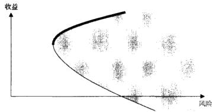  
图14-1无杠杆情况下风险收益最优化组合的构建过程。粗实线代表有效边界

在存在杠杆的情况下，有效边界会显著向上移动，变成一条连接贷款利率和“市场组合”的直线。其中，为了进一步分析，我们认为，贷款利率近乎无风险，而“市场组合”则位于图14-2中有效边界的切线上。图14-2展示了最终所得的有效边界。

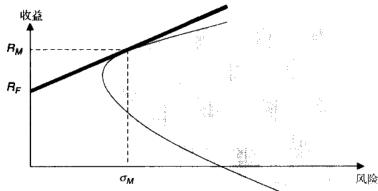  
图14-2有杠杆情况下风险收益最优化组合的构建过程。假设所有的杠杆行为都是在无风险利率 $R _ { \nu }$ 下进行的。粗实线代表有效边界。对于给定的 $R _ { F }$ 和投资组合的集合，点 $( \sigma _ { M } , R _ { M } )$ 是相应的“市场组合”

当杠杆利率为 $R _ { F }$ 时，可以对有效边界做如下解释。如果投资者将他的一部分资金以利率 $R _ { F }$ 借给优质借款人，那么他会因为减少风险敞口而降低整体投资组合的风险。借出资金的投资者将处于 $\scriptstyle R _ { \ell }$ 与“市场组合”点 $( \sigma _ { y } , R _ { y } )$ 之间的粗实线上。与从图14-1所示的有效边界上选取一个投资组合相比，借出资金能够给投资者带来两点好处：

1．投资者可以获得比无借出情形下任何时候都低的风险。2.在可以借出的情况下，投资者的收益与风险呈线性关系。在无借出的情况下，投资者收益下降的速度要快于其风险的下降速度。

类似的，借人资金以增加组合资金量的投资者也处在有效边界上，不过位于市场组合的右侧。借人投资者也能在收益上得到好处，因为收益随风险线性增加，且在无借人机会集合之上。

# 投资组合优化的核心框架

在获得有效边界的解析之前，我们需要了解投资组合中每种策略的收益情

况。我们用策略 $_ { i }$ 在时间段 $t \in [ 1 , \cdots , T ]$ 之中收益的平均值来度量该策略的收益率：

$$
\bar { R } _ { i } = \frac { 1 } { T } \sum _ { t = 1 } ^ { \tau } R _ { u }
$$

式中， $R _ { i t }$ 是策略 $_ i$ 在 $_ \ell$ 时段的收益率： $: t \in [ 1 , \cdots , T ]$ 策略 $i$ 的年化风险 $\pmb { \sigma } _ { i } ^ { 2 }$ ,通常由方差 $V _ { i }$ 来度量， $V _ { i }$ 即标准差的平方：

$$
V _ { i } \ = \frac { 1 } { T - 1 } \mathop { \sum } _ { i = 1 } ^ { r } \ ( R _ { i i } - \bar { R } _ { i } ) ^ { 2 }
$$

需要注意的是，在计算平均收益率 $\textstyle { \overline { { R } } } _ { i }$ 时，我们用收益率之和除以收益率的总数T，而在计算式（14-2）中的风险时，均值偏离量平方和的除数却是 $T - 1$ 。因子 $T - 1$ 反映了计算 $V _ { i }$ 时的“自由度”。统计方程把每一个独立变量（一个原始数字）计为一个自由度；同时，每当统计方程用到一个估计量，自由度就减少1。因而，在估计 $\bar { \pmb R } _ { i }$ 时，独立变量的个数为 $_ { T }$ 而在估计V时，独立变量的个数要减少1，这是因为式（14-2）里用到了 ${ \bar { R } } _ { i }$ ，它本身就是一个估计量。

对时间段 $\pmb { \ell }$ 的采样频率应当与我们想要分析的频率一致。在开发高频交易系统时，我们可能需要日内极为高频（比如，一分钟或者是一秒钟）的收益率来进行相关推断。出于投资者关系的考虑，频率达到每日甚至是每月量级收益率数据就已经足够了。

如果一个投资组合包含 $\boldsymbol { \mathscr { I } }$ 个策略，每个策略在投资组合中的比例记为 $x _ { i }$ ,并且该策略的平均年化收益为 $\bar { \pmb R } _ { i }$ ，风险为 $V _ { i }$ ，那么该投资组合的总体收益和风险计算如下：

$$
\begin{array} { r c l } { { } } & { { } } & { { E [ R _ { p } ] ~ = ~ \displaystyle \sum _ { i = 1 } ^ { t } x _ { i } E [ R _ { i } ] } } \\ { { } } & { { } } & { { { } } } \\ { { } } & { { V [ R _ { \rho } ] ~ = ~ \displaystyle \sum _ { i = 1 } ^ { t } ~ \displaystyle \sum _ { j = 1 } ^ { i } x _ { i } x _ { j } \mathrm { c o v } ~ [ R _ { i } , R _ { j } ] } } \end{array}
$$

式中， $x _ { i }$ 是任意给定时刻分配给策略i的投资组合资产的比例， $E [ R _ { p } ]$ 和 $E [ R _ { i } ]$ 分别表示投资组合和单个策略i的平均年化收益率；cov $[ R _ { i } , R _ { j } ]$ 是策略 $_ i$ 和策略j收益率之间的协方差：

$$
\mathsf { c o v } \big [ R _ { i } , R _ { j } \big ] \ = \rho _ { i j } V _ { i } ^ { 0 . 5 } V _ { j } ^ { 0 . 5 } \ = E \big [ R _ { i } \big ] E \big [ R _ { j } \big ] \ - E \big [ R _ { i } R _ { j } \big ]
$$

此外，最优投资组合还应满足以下约束条件：投资组合中的所有分配比例

$x _ { i }$ 之和应当等于 $100 \%$ 。

$$
\sum _ { i = 1 } ^ { l } x _ { i } = 1
$$

注意式（14-6）允许单个策略占投资组合的权重 $\{ \pmb { x } _ { i } \}$ 为任意实数，既可以是正的，也可以是负的。正数代表多头头寸，而负数代表空头头寸。

于是，基本投资组合优化问题定义为：

$$
\operatorname* { m i n } V [ R _ { \mathnormal { p } } ] , \mathrm { s . ~ t . } E [ R _ { \mathnormal { p } } ] \geqslant \mu , \sum _ { i = 1 } ^ { i } x _ { i } \ = 1
$$

式中， $\pmb { \mu }$ 是最小可接受平均收益率。

对于考虑到风险厌恶系数 $\lambda$ 的交易活动，均值一方差最优化问题如式（14-8）所示：

$$
\operatorname* { m a x } \ \sum _ { t = i } ^ { r } \ ( \ E [ R _ { p , i } ] - \lambda V [ R _ { p , i } ] ) \ : , \sum _ { i = 1 } ^ { i } \ x _ { i } = 1
$$

优化式（14-8），可以得到目标函数的优化值，这个值可以看成是给风险厌恶系数为 $\lambda$ 的投资者带来的“价值增值”。当风险厌恶系数 $\lambda$ 取0.5时，对应于非常厌恶风险的投资者，0对应于风险中性的投资者，负数则对应于风险偏好的投资者。

更进一步，当交易活动的目标是战胜某个特定基准 $\pmb { \mu }$ 时，最优化问题就转化为：

$$
\operatorname* { m a x } \ \sum _ { i = 1 } ^ { r } \ ( E [ R _ { p , i } ] - \lambda V [ R _ { p , i } ] ) , { \mathrm { s . t . } } \sum _ { i = 1 } ^ { r } \ E [ R _ { p , i } ] \geqslant \mu , \sum _ { i = 1 } ^ { r } x _ { i } = 1
$$

# 考虑到交易成本的投资组合优化问题

上一节的投资组合最优化模型没有考虑到交易成本。交易成本（我们将在第19章中进行详细分析）会降低收益率，还会改变投资组合的风险状况。交易成本可能会增加投资组合的整体风险，这具体取决于交易成本与投资组合收益率之间的相关性情况。本节我们将讨论考虑到交易成本的投资组合优化问题。

交易成本最小化问题的表述如下：

$$
\operatorname* { m i n } _ { \substack { \mathrm { \ r { A } } \nu ( \tau c ) \leqslant \kappa } } E [ \tau c ]
$$

式中，E[TC]是交易成本观察值的均值；V[TC]是交易成本观察值的方差； $\pmb { K }$

是指明交易成本最大方差的参数。通过改变参数 $\pmb { K }$ ，我们可以找出“有效交易边界”，即每个交易成本分散水平下的最小交易成本所构成的集合。

另外，对于风险厌恶系数为 $\lambda$ 的投资者或者投资组合经理，通过优化下式，可以得到目标交易成本策略：

$$
\mathrm { m i n } E [ T C ] + \lambda V [ T C ]
$$

无论是有效交易边界，还是目标交易成本，都可以用来作为比较个人交易者和经纪自营商交易执行水平的基准。然而，优化交易成本本身并不能解决考虑到交易成本情况下的投资组合最优化的问题。

Engle和Ferstenberg（2007）进一步提出了一个整合了投资组合和执行风险的整体框架。我们用 $x _ { i t }$ 表示在期期末投资组合总价值中证券i所占的比例；$p _ { i t }$ 表示t期期末证券i的价格， $c _ { t }$ 表示 $\scriptstyle t$ 期期末投资组合中持有现金数量，Engle和Ferstenberg（2007）指出， $\pmb { t }$ 期期末投资组合价值为：

$$
y _ { \imath } \ = \ \sum _ { i \ = 1 } ^ { \prime } \ x _ { i \imath } p _ { \breve { u } } \ + \ c _ { \imath }
$$

如果我们在每期期末对投资组合进行再平衡，那么从 $\pmb { t }$ 时刻到 $\ t + 1$ 时刻，投资组合价值的一期变化为：

$$
\begin{array} { r l r } {  { \Delta y _ { \iota * 1 } = y _ { \iota * 1 } - y _ { \iota } = \sum _ { i = 1 } ^ { l } x _ { i , i } \big ( p _ { i , \iota * 1 } - p _ { i } \big ) + \sum _ { i = 1 } ^ { l } \big ( x _ { i , \iota * 1 } - x _ { i } \big ) p _ { i , \iota * 1 } } } \\ & { } & \\ & { } & { + \big ( c _ { \iota * 1 } - c _ { \iota } \big ) = \sum _ { i = 1 } ^ { l } x _ { i , \iota } \Delta p _ { i , \iota * 1 } + \sum _ { i = 1 } ^ { l } \Delta x _ { i , \iota * 1 } p _ { i , \iota * 1 } + \Delta c _ { \iota * 1 } } \end{array}
$$

如果现金头寸没有利息，也不存在分红，那么现金头寸的变化完全是因为我们在 $_ t$ 时刻以价格 $\tilde { p } _ { \omega }$ 对每只证券 $_ i$ 进行买卖，投资组合的成分发生变化所造成的。

$$
\Delta c _ { i , \iota + 1 } \ = - \ \sum _ { i = 1 } ^ { \prime } \ \Delta x _ { i , \iota + 1 } \hat { p } _ { i , \iota + 1 }
$$

式（14-14）右边的负号反映了如下事实，即增加证券i的持有量 $\Delta x _ { i , t }$ 会减少投资组合中可用的现金。结合式（14-13）和式（14-14），我们可以得到 ${ \pmb t }$ 时刻投资组合的变化为：

$$
\Delta y _ { i + 1 } = \sum _ { i + 1 } ^ { \prime } x _ { i i } \Delta p _ { i , i + 1 } + \sum _ { i = 1 } ^ { \prime } \Delta x _ { i , i + 1 } ( p _ { i , i + 1 } - \bar { p } _ { i , i + 1 } )
$$

$$
\mathbf { \Sigma } = \sum _ { i = 1 } ^ { l } \ x _ { i } \Delta p _ { i , t + 1 } - T C _ { t + 1 }
$$

式中， $\sum _ { i = 1 } ^ { l } x _ { i } \Delta p _ { i , i + 1 }$ 表示由主动投资组合管理而引起的投资组合价值的变化；$\sum _ { i = 1 } ^ { l } \ \Delta x _ { i , i + 1 } ( p _ { i , i + 1 } - \dot { p } _ { i , i + 1 } )$ 表示由交易成本引起的价值变化。如果所有交易能够以目标价格 $p _ { i , t + 1 }$ 成交，那么 $\sum _ { i = 1 } ^ { l } \Delta x _ { i , i + 1 } ( p _ { i , i + 1 } - \hat { p } _ { i , i + 1 } )$ 的值将为 $_ 0$ 。

在风险厌恶系数为 $\lambda$ 的情况下，对于每一个时间段 $t + 1$ ，投资组合联合最优化问题 $\operatorname { n a x } E [ \Delta y _ { \iota + 1 } ] - \lambda V [ \Delta y _ { \iota + 1 } ]$ 可以改写为：

$$
\operatorname* { m a x } E \big [ \sum _ { i = 1 } ^ { l } x _ { i i } \Delta p _ { i , t + 1 } - T C _ { i + 1 } \big ] - \lambda V \big [ \sum _ { i = 1 } ^ { l } x _ { i i } \Delta p _ { i , t + 1 } - T C _ { t + 1 } \big ]
$$

式中， $\begin{array} { r } { T C _ { t } \ = \ \sum _ { \ i = 1 } ^ { I } \Delta x _ { i i } ( p _ { i i } - \bar { p } _ { i i } ) \ ; \Delta \bar { \theta } } \end{array}$ 是证券投资组合权重的一期变化； $p _ { \tilde { \mu } }$ 是t时期期末交易证券的目标执行价格； ${ \tilde { p } } _ { \mu }$ 是实际成交价格。

此外，交易成本和投资组合配置之间的相互作用可用下式表示：

$$
\begin{array} { r } { { \displaystyle V \big [ \sum _ { i = 1 } ^ { i } x _ { i } \Delta p _ { i , i + 1 } - T C _ { t + 1 } \big ] ~ = ~ V \big [ \sum _ { i = 1 } ^ { t } x _ { i } \Delta p _ { i , t + 1 } \big ] ~ + ~ V \big [ T C _ { t + 1 } \big ] } } \\ { { ~ - 2 \mathrm { c o v ~ \Big [ \sum _ { i = 1 } ^ { i } x _ { i } \Delta p _ { i , t + 1 } , T C _ { t + 1 } \big ] ~ } } } \end{array}
$$

此投资组合的夏普比率如下：

$$
\mathbb { \ Z } \not \in \dot { \mathbb { E } } \not \equiv = \frac { E \big [ \sum _ { i = 1 } ^ { l } x _ { i } \Delta p _ { i } - T C \big ] - R ^ { f } } { \sqrt { T } \sqrt { V [ \sum _ { i = 1 } ^ { l } x _ { i } \Delta p _ { i , i + 1 } - T C _ { i + 1 } ] } }
$$

# 相关系数不对称情形下的投资组合多样化问题

前文所讨论的投资组合最优化问题假设无论是在上升市场还是在下降市场，交易策略之间的相关性不会有什么太大变化。然而，Ang和Chen（2002）证明，事实并非如此。他们发现，在市场的下降时期，股票收益率之间的相关性往往是增加的，而这有可能会扭曲投资组合中交易策略之间的相关性。如果建立一个清晰描述各交易策略之间的相关性随时间变化的模型，我们就有可能改善对投资组合的估计，并且获得更为稳定的结果。

对相关系数进行建模可以使用Ang和Chen（2002）开发的方法。他们的方法需要考察收益相关系数的分布：如果相关系数表现正常，那么它们就是对称的；极端负收益下的相关系数与极端正收益下的相关系数相等。在极端收益情况下，相关系数的任何不对称现象都需要纳入到资产配置解决方案的考量之中。

# 处理投资组合优化中的估计误差

所有投资组合最优化过程都涉及估计收益率的均值、收益率的方差以及相关系数。经典的Markowitz（1952）的方法将估计出的参数当做真实值，并忽略了估计误差。Frankfurter、Phillips 和 Seagle(1971）；Dickenson（1979），Best和Crauer（1991）以及其他一些人指出估计误差会扭曲投资组合的选取过程，从而导致整个资产组合在样本外的表现很差。

常见的克服估计误差的方法就是从误差自身中获取信息。一种叫贝叶斯方法的技巧提出，通过比较系统的预测结果和实际表现，系统可以从其自身的估计误差中学习相关信息。进而，投资组合优化系统会基于其学习到的知识来修正后来的预测。在纯粹的系统化环境中，这种自我修正过程是没有任何人为干预的。贝叶斯自我修正机制也常称为“遗传算法”。

在贝叶斯方法中，某只证券收益率均值的估计值被当做是随机变量，并且依据先前所获得的信息，或称先验（prior），呈现出一定的概率分布。之后所有的期望值都根据估计所得的分布计算得出。多重先验（multiplepriors）可能会代表多个投资者或者分析师的意见，因而可以提高估计值分布的准确性。

在贝叶斯设定下，均值和方差一协方差的估计值都有一个与之相关联的置信区间，以度量估计的准确性。准确的估计值的置信区间较窄，而不准确估计值的置信区间较宽。在获知了估计值的准确度之后，我们就可以根据置信区间的宽度来决定每种证券在投资组合中的权重。参数估计的置信区间越宽，证券在投资组合中的权重越小。当置信区问长度接近于0时，权重值就与从经典的均值一方差最优化方法中所得权重值相似。

Jorion（1986）将传统的贝叶斯方法运用到均值一方差优化之中，其工作原理为：对于从当前数据估计出来的均值和方差，用历史（先验）观测信息

进行修正。

随着时间的推移，收集和分析的数据越来越多，均值和方差真实值分布的分散程度会逐渐降低。设 $R _ { p , \ell }$ 是由式（14-7）所得到的投资组合在 $t - 1$ 至 $\pmb { t }$ 时刻的收益率， $\hat { \boldsymbol E } [ R _ { i , i } ]$ 是证券i的平均收益的估计值， $\hat { E } [ R _ { i , t } ] \ = \ \frac { 1 } { t } \sum _ { t = 1 } ^ { i } \ R _ { i , \tau }$ ，那么使用“Bayes-Stein 收缩估计量”（Bayes-Stein shrinkage estimators）对某只证券 $_ i$ 的预期收益和方差的估计如下式所示，这些估计值将会应用于下一期 $t + 1$ 时间段内的均值一方差优化过程。

$$
E \left[ R _ { i , t + 1 } \right] _ { B S } = \left( 1 - \phi _ { i , B S } \right) \hat { E } \left[ R _ { i , t } \right] + \phi _ { i , B S } R _ { p , t }
$$

$$
V \left[ R _ { i , t + 1 } \right] _ { B S } = V { \left[ R _ { i , t } \right] } \left[ 1 + \frac { 1 } { t + v } \right] + \frac { v } { t ( t + 1 + v ) } V { \left[ R _ { i , t } \right] }
$$

式中， $\pmb { v }$ 是对均值估计的精确度： $\upsilon = \frac { ( N - 2 ) } { t } \frac { V [ R _ { i , \iota } ] } { ( R _ { p , \iota } - \hat { E } [ R _ { i , \iota } ] ) ^ { 2 } }$ (R, -E[R,]):N是时刻的样本观察值个数： $\phi _ { B S }$ 是均值的收缩因子 $\langle \phi _ { B S } = \frac { v } { t + v }$ 精度为 $_ 0$ 的情形 $\mathit { \Psi } _ { { \boldsymbol { v } } } = 0$ ）对应于完全分散的估计。

有些投资者对于预测的准确性特别敏感，他们倾向于从他们的交易工具中剔除那些给出不准确或模棱两可预测的系统。Garlappi、Uppal和Wang（2007）为这些投资者开发出了一种贝叶斯投资组合分配办法。模糊厌恶（ambiguity-averse）型投资者可能会参照多个信息来源，并且只有当所有信息来源对于某个证券未来走势看法一致时，他们才会交易此证券。模糊厌恶与风险厌恶是两个不同的概念。风险厌恶衡量的是交易执行之后，投资者对事后收益方差的容忍度；而模糊厌恶衡量的是交易执行之前，投资者事前对交易结果预测值分散程度的容忍度。

为了定义模糊厌恶程度，Garlappi、Uppal和Wang（2007）在标准的均值一方差优化方程中添加了如下约束条件， $f ( E [ R ] , { \hat { E } } [ R ] , V [ R ] ) \leqslant \varepsilon$ ，其中 $f$ 表示对期望收益率的预测的不确定性， $\boldsymbol { \varepsilon }$ 表示投资者对不确定性的最大容忍度：

$$
f ( E [ R ] , \hat { E } [ R ] , V [ R ] ) = \frac { ( E [ R ] - \hat { E } [ R ] ) ^ { 2 } } { V [ R ] / T }
$$

式中， $\boldsymbol { \tau }$ 是样本观察值的个数。

式（14-7）中在单一投资期内的多元资产的优化问题现在变为：

$$
\begin{array} { r l } & { \operatorname* { m a x } \ ( E [ R ] - \lambda V [ R ] ) , \mathrm { s . t . } \ \displaystyle \sum _ { i = 1 } ^ { r } { x _ { i } } } \\ & { = 1 , E [ R ] \geqslant \mu , f ( E [ R ] , \hat { E } [ R ] , V [ R ] ) \leqslant \varepsilon } \end{array}
$$

Garlappi、Uppal和Wang（2007）证明了式（14-20）中的优化问题可改写为：

$$
\operatorname* { m a x } \left( E [ R ] - \lambda V [ R ] - { \sqrt { \xi V [ R ] } } \right) , \mathrm { s . t . } \sum _ { i = 1 } ^ { r } x _ { i } = 1
$$

式中， $\xi$ 限定了多元资产的模糊厌恶程度：

$$
( { \hat { E } } [ R ] - E [ R ] ) ^ { \prime } V [ R ] ( { \hat { E } } [ R ] - E [ R ] ) \leqslant \xi
$$

前文中的方法介绍了投资组合优化的解析办法。接下来，我们将讨论一些实际应用问题，其中包括前面定义的投资组合最优化估计，以及高频交易中其他一些有关有效进行投资组合管理的问题。

# 有效的投资组合管理实践

在实际中进行有效的投资组合管理涉及如下一些关键决策：

1.投资组合应当使用多大的杠杆率?  
2.投资组合中多少比例的资产应当配置给哪一个交易策略?本节将介绍解决这些问题的一些最佳实践。

# 投资组合应当使用多大的杠杆率

有两种方法涉及了投资组合最优化过程中的杠杆比率问题，它们分别是基于期权产品的投资组合保险（option-based portfolio insurance，OBPI）和固定比例投资组合保险（constant proportion portfolio insurance，CPPI)。这两种方法都要求在任何时候将投资组合的一部分留作现金或者投资于无风险债券。每种方法都精确地规定了投资组合多大比例应当留作现金，多大比例应该杠杆化并且投资于风险资产。OBPI策略本质上来说是静态的，而CPPI策略会随着投资组合整体价值的变化而对资产配置进行调整。

1.OBPI方法要求只将投资组合的固定比例（如百分之 $X , X \gets 1 0 0 \%$ ）资产投资于风险金融工具。这项策略最早由Leland和Rubinstein（1976）提出，他们引人了基于期权产品的保险这个概念。根据Leland和Rubinstein（1976）的做法，将投资组合构造成既保存原始组合资产的百分之 $1 0 0 - X$ ，又让投资组合受惠于另外百分之 $X$ 的风险资产（比如期权）所带来的收益。这样的投资组合现在通常已经证券化，作为“结构性产品”在市场上销售。投资组合比例 $X$ 可通过成本效益分析来确定，即对期权和债权的价格相较于期权支出的预期概率分布做成本效益分析，在高频交易的情形下，则是对期权与债权的价格相较于期权的卖价做分析。

2.CPPI是另外一种被广泛采用的配置策略，该策略要求动态地调整投资组合中现金和风险资产的比例。这一点与OBPI不同，在OBPI中，现金与风险资产的分解是静态的。Black和Jones（1987）以及Perold和Sharpe（1987）推广了OBPI而创建了CPPI，它今天已经成为业内人士广泛使用的一种自动化方法。

CPPI的运作步骤如下：

1．投资组合管理人设定一个最坏情况下绝对的最大回撤比例，即投资组合市值的最低保险金额（floor）。如果投资组合的市场价值触及最低保险金额，则将投资组合完全变现。假设所能容忍的最大回撤比例为 $L \%$ 。

2.投资组合市值与最低保险金额之间的差值称为“缓冲头寸”（cush-ion)。我们将一定比例的缓冲头寸加杠杆投资于风险证券。缓冲头寸中投资于风险工具的具体比例由“乘数”M决定。M的取值范围通常在3\~6之间。

3.于是，配置给风险证券的资金的量则变成 $M \times$ 缓冲头寸。举个例子，假设某投资组合的总资产是1亿美元，并且要求绝对最大回撤比例不能超过$10 \%$ 。此时，缓冲头寸的值为1000万美元。如果我们将乘数设为5（ $M = 5$ )，那么最大主动性投资的风险资产可达5000万美元。不过，这5000万美元是可以应用杠杆的。Black和Jones（1987）以及Perold和Sharpe（1988）假设在投资组合存在的整个阶段，加于缓冲头寸的杠杆率都保持不变，这是CPPI中的“固定”一词的来历。在现代CPPI策略中，是允许杠杆比率发生变动的，在不利的市场环境下，我们可以降低杠杆比率。

CPPI的资产配置方式保证了投资组合总会有足够的现金去减缓投资组合风险以及保障投资本金。投资组合会进行定期再平衡，以反映组合目前的市场价值。投资组合的市场价值越高，分配给风险资产的份额就越多。反之，投资组合市场价值越低，组合中现金或者几乎无风险的固定收益证券的份额就越高。

# 多少比例的资产应当配置给哪一个交易策略

在我们完成对单个证券和交易策略表现的评估，且确定表现最佳的策略之后，我们就可以利用这些最佳策略来构建投资组合。这个步骤称为资产配置，主要涉及确定投资组合中各种策略的相对权重。

最简单的投资组合优化办法是等权重地配置各个最佳交易策略。等权重的方法虽然能分散整个投资组合的风险，但效果可能比不上进行完全投资组合优化的分散效果。然而，随着投资组合中证券数量的增加，确定每个证券的最优权重会变得越来越难，并且越来越费时——对于高频交易而言，这确实是一项挑战。

为了简化和加速计算最优投资组合权重的过程，人们提出了好几种相关算法。优化算法可以分为如下三类：

1．根据Markowitz方法，可以直接得到一个联立方程组算法。可是，如果投资组合中的策略超过10个，这种优化方法的效果就开始大打折扣；当投资组合涉及20个或者更多的资产时，此算法可能会给出极其错误的预测结果。之所以会这样，是因为我们在计算平均收益和方差时本身就存在估计误差。本章之前介绍的贝叶斯误差修正办法能够减少一些输入值的估计误差。但是，即使不算上这些问题，此算法的计算时间也会随着交易策略个数的增长而呈指数式增长，这也使得这种方法很难适用于多种资产的高频交易。

2.非线性规划是商业软件中经常使用的一种优化算法。在给定一些特定参数（比如投资组合配置权重）的情况下，非线性规划算法采用一些技术来最大化或者最小化投资组合优化的目标函数。其中，一些技术采用了梯度法，梯度法计算目标函数在给定点的斜率，并选择上升最快或下降最快的路径以逼近目标函数的最大值或最小值。非线性规划算法对于收益率均值和方差的估计误差同样很敏感。在大多数情况下，这种算法的计算复杂度也太高，因此在高频交易环境下并不切实可行。最近，Steuer、Qi和Hirschberger（2006）给出了

…个非线性优化方法的例子。

3.Markowitz（1959）为了方便计算自已提出的投资组合理论，开发了一种临界线（criticalline）优化算法。这种算法运算较快并且实现起来相对简单。不过，临界线算法给出的不是投资组合中每种证券的配置权重，而是有效边界上投资组合的集合，这个缺点使得很多商业公司无法采用此方法。近来Markowitz和Todd（2000）提供的一个算法部分地解决了这个问题。根据Nied-ermayer（2007）的研究，在同时考虑至少2000种资产的情况下，Markowitz和Todd（2000）的算法比 Steuer、Qi和Hirschberger（2006）设计的算法要快上10000倍。

现有的一些算法，无论他们在资产配置计算上的复杂性和准确性如何，可能都不是非常适合在高频交易环境下进行应用。首先，高频交易中一秒钟的延误可能会导致百万美元的损失，在这种情况下，现有形式的优化算法所消耗的时间和系统资源仍然是太长太多了。其次，这些算法忽略了目前交易环境中的流动性因素：大多数交易都以预先确定的规模批量地进行。在高频交易之中，不论是大于正常规模的批量交易，还是小规模的交易，交易成本都会更高，这将严重损害系统的盈利性。

Aldridge $2 0 0 9 \mathrm { c }$ ）开发了一种离散配对（discrete pair-wise，DPW）优化算法，这是复杂优化方案在高频交易下的一个简单替代办法。DPW算法既不同于等权重的资产配置，也不同于完全的投资组合优化，它是介于二者之间的为快速计算而设计的一种妥协算法。这种算法给出的投资组合权重是预先给定的离散值，权重不能是小数。该算法的工作机制如下。

1.将投资组合的候选策略按照夏普比率从高到低排名，此步骤利用了这样一个事实，即夏普比率本身就是一个衡量交易策略在有效边界上所处位置的标准。

2.我们选取偶数个具有最高夏普比率的交易策略，并将其纳入投资组合。选取的策略中应该有一半的策略与市场具有正的历史相关性，而另一半的策略与市场具有负的历史相关性。

3.基于夏普比率完成了金融工具的选择之后，再将这些选出的策略按照其当前的流动性进行排序。比如，我们可以用过去10分钟之内所发生的报价

或者交易的次数来衡量当前的流动性。

4.当所有策略以其流动性为基准排好名次后，再按下面的步骤对交易策略进行配对：每一个配对中的两个策略需要与市场具有相反的历史相关性。因此，与市场具有正的历史相关性的交易策略和与市场具有负的历史相关性的交易策略相互匹配。并且，配对需要根据策略流动性的排名来进行。流动性最高的具有正相关性的交易策略与流动性最高的具有负相关性的交易策略组合在一起，以此类推，直到流动性最差的与市场正相关的交易策略和流动性最差的与市场负相关的交易策略组合完成。基于流动性进行配对是为了保证高频交易中的相关性是由于该策略的特有走势所产生的，而不是由该策略的流动性不足所导致的。

5.接下来，对于每一对策略，我们都计算仅由这两种交易策略构建的投资组合在高频率下的波动率，并且对于每种策略，这些计算仅仅针对一些离散的头寸来进行。例如，在外汇交易中，标准的一码交易是2000万美元，那么配对优化中所考虑的离散头寸大小可以是-6000万美元、－4000万美元、-2000万美元、0、2000万美元、4000万美元和6000万美元，其中负号表示空头头寸。对于一对交易策略而言，在计算出了每种头寸组合的波动率之后，我们选择使得投资组合具有最小波动率的头寸组合。

6.这样得到的配对投资组合就可以进入实际交易了，只是每种策略所能配置的最大资金量有一定的约束。多头头寸和空头头寸的最大允许值是事先确定的，它们受到的限制如下：每一策略的累积总头寸不得超过某一固定值，累积净头寸不能超过另外一个限定值，且此限定值小于所有策略的累积总限制。较小的净头寸保证了投资组合具有一定程度的市场中性。

DPW算法特别适合于高频环境，这是因该算法具有如下特性：

●通过减少每次进行资产配置时交易策略的数量，DPW算法避免了输入值估计误差冲击的最强部分。●由于输人证券具有负的历史相关性，这保证了对于每个交易策略配对，在方差最小的情况下，这两种策略在大部分时候都会持有多头头寸。历史经验证明，多头头寸能够产生最高的单位风险收益率，正如我们在夏普比率排名阶段所确定的那样。如果某些时期，系统有一个或多个策略存有空头头寸，那很有可能是由于某些特殊的市场事件所引起的。

●与其他投资组合优化算法相比，此算法运行速度非常之快。这是因为它节省了以下一些计算时间：

●在夏普比率排名阶段，如果我们选择了 $2 K$ 个交易策略，那么DPW算法只需计算 $\pmb { K }$ 个相关系数。而其他大部分的投资组合优化算法需要计算2 $\pmb { K }$ 个证券中的每两个策略之间的相关系数，即总共需要计算 $K ( 2 K \textrm { -- }$ 1)个相关系数。

●在每个投资组合配对中格点式的搜索每种策略的最优头寸规模时，其优化过程仅仅是针对两个交易策略进行的，也就是说优化过程的维度为2。而一个标准的算法需要在 $_ { 2 K }$ 维空间中进行投资组合优化。

●最后，格点式的搜索使得投资组合的权重值只能是一些离散值。这里给出的例子里只有7个可能的投资组合权重：－6000万美元、-4000万美元、－2000万美元、0、2000万美元、4000万美元和6000万美元。这便限制了搜索过程中的迭代次数，使得本来有可能是无穷多次的计算，降低为 $7 ^ { 2 } = 4 9$ 次计算。

Alexander（1999）指出，相关系数和波动性并不足以保证投资组合具有长期稳定性。不论是相关系数还是波动率，通常都是用短期收益率计算得出的，因此只是部分地反映了价格运动的特性，这也要求我们经常对投资组合权重进行再平衡。相反，Alexander（1999）建议我们在投资组合优化过程中，把精力更多地放在成分策略之间的协整关系上面。通过协整性分析，我们可以在投资组合中加人一些辅助性的证券，比如期权或期货等，这将进一步优化交易的风险收益特性。如果交易的目标是战胜某个金融基准，那么协整增强型投资组合的效果会相当不错。

# 结论

适当的投资组合管理能够优化高频交易策略的表现。在高频环境之下，超高速地进行投资组合优化相当困难，但又至关重要。

# 交易模型的回顾测试

交易理念形成之后，需要使用历史数据对其进行测试。这个测试过程就是人们常说的回顾测试（backtest）。本章将描述那些对成功的和有意义的问顾测试来说必不可少的一些关键因素。

回顾测试有两个目的。首先，回顾测试可以在交易模型用于实际资金之前，用大量的历史数据对其表现进行验证。其次，回顾测试还可以体现策略抓住盈利机会的准确程度，并展示是否可以对策略进行改进以获取更高收益。

在理想情况下，交易理念本身是从规模较小的历史数据集里形成的。策略在这些样本上的表现称为“样本内表现”（in-sampleperformance）。-·般而言，--个月的数据对于样本内估计就已经足够了，不过这也取决于所选策略的具体情况。为了对手头上的交易模型做出有统计显著性的推断，就需要对该交易模型使用大量没有在开发模型时用到的数据进行验证。拥有大量的历史数据（至少两年的连续分笔数据）可以让模型最小化数据透视偏差（data-snoopingbias），这种情况常常在模型过度拟合数据中一些偶然发生的异常现象时出现。使用全新的历史数据集进行回顾测试称为“样本外推断”（out-of-sampleinfer-ence)。

得到样本外推断结果之后，需要对其进行评估。评估过程至少需要计算有关这个交易理念表现的基本统计参数：累计收益率和平均收益率、夏普比率，还有最大回撤等，这些内容在第5章中有说明。

为了精确分析起见，交易系统可以分为点位预测系统和方向预测系统。点位预测推断证券价格会达到某一水平，或点位。例如，某系统推断未来一周内标准普尔500指数将从当前的787点上升到800点，这个系统就是点位预测系统；此时的点位预测值就是标准普尔指数的800点。方向预测系统则根据对市场上涨或者下跌的预期来建立相应的头寸，它并不预测具体的目标点位。一个方向预测系统可能预测美元/加元在当前价位上会有所上涨，但对美元/加元会涨到什么程度则不做任何具体预测。

# 评估点位预测

最筒单的评估点位预测有效性的方法就是将历史实际值对样本外预测值进行回归。假设有一个交易模型预测股票未来的价格水平。用股票实际价格对预测价格进行回归可以用于评估预测模型的有效程度。

具体来说，模型评估回归方程的形式如下：

$$
Y _ { \iota } \ = \ \alpha + \beta X _ { \iota } \ + \ \varepsilon _ { \iota }
$$

式中， $Y$ 是实际的价格水平； $\chi$ 是预测的价格水平； $\pmb { \alpha }$ 和 $\beta$ 是由回归得出的参数； $\boldsymbol { \varepsilon }$ 是正态分布的残差项。如果预测值与实际值吻合得很好，那么会有 $\beta \ : =$ 1和 ${ \textbf { \em } } ( { \textbf { \em } } ) = 0$ 。参数 $\pmb { \alpha }$ 和 $\beta$ 与其最优值 $\beta = 1$ 和 $\alpha = 0$ 的偏离程度本身也预示了预测模型的可靠与有效程度。此外，回归中得到的 $R ^ { 2 }$ 系数表明了实际观测值中有多大的百分比可以由预测值来解释。 $R ^ { 2 }$ 越大，预测模型的精确度就越高。

点位预测的精度还可以通过比较预测值与实际值来进行评估。对预测值进行比较的方法包括：

●均方误差（mean squared error，MSE)   
●平均绝对偏差(mean absolute deviation，MAD)   
●平均绝对百分比误差（mean absolute percentage error，MAPE)   
●分布的表现（distributional performance)   
●累积精度曲线（cumulative accuracy profiling)

如果我们预测在未来某时刻 ${ \pmb t }$ ，某金融证券的价格为 $x _ { \ell , \ell }$ ，而此证券在 $t$ 时刻的实际价格为 $\boldsymbol { x } _ { R , \iota }$ ，对于这次预测，预测误差 $\varepsilon _ { f , t }$ 计算如下：

$$
\boldsymbol { \varepsilon } _ { F , t } ~ = ~ \boldsymbol { x } _ { F , t } - \boldsymbol { x } _ { R , t }
$$

均方误差计算为预测误差的平方在 $_ { T }$ 段评估期内的平均值，这与波动率的计算有些类似：

$$
M S E = \frac { 1 } { T } \sum _ { \tau = 1 } ^ { \tau } \ s _ { \boldsymbol { r } , \tau } ^ { 2 }
$$

平均绝对偏差（MAD）和平均绝对百分比误差（MAPE）也概括了预测误差的特性：

$$
M A D = \frac { 1 } { T } \sum _ { \tau = 1 } ^ { \tau } \mid \varepsilon _ { \boldsymbol { F } , \tau } \mid
$$

$$
M A P E \ = \ \frac { 1 } { T } \sum _ { \tau = 1 } ^ { r } \ \left| \frac { \varepsilon _ { \varepsilon , \tau } } { x _ { R , \tau } } \right|
$$

很自然地，这三个指标值（MST、MAD和MAPE）越小，交易系统的预测性能越好。

用分布的方法也可以评估预测值的表现，其检查的同样是预测误差 $\varepsilon _ { F , t }$ 经实际值 $x _ { k , \ell }$ 标准化之后的值。然而，与MSE、MAD和MAPE等指标不同的是，分布表现指标试图估计预测误差是否是随机的。如果误差确实是随机的，价格运动就不存在确定的方向性偏差，经标准化的误差 $\Big \{ \frac { \varepsilon _ { F , t } } { x _ { R , \iota } } \Big \}$ 应该服从区间[0，1]上的均匀分布。如果误差是非随机的，预测就有改进的可能。一种确定误差是否随机的方法是使用Kolmogorov-Smirmov检验比较误差与均匀分布之间的关系。

更进一步，还可以在不对称的情形下考虑模型的精确度。比如，负的预测误差的MSE是否大于正的预测误差的MSE?若是，则模型对实际值有低估的倾向，需要进行微调以解决预测精度的不对称问题。类似地，我们还可以对误差按照不同市场因素进行分类，以对预测误差进行更为仔细的考察：

●对误差进行度量时的市场波动率  
●误差的大小  
●产生预测信号时对计算机性能的利用率等其他各种可能的因素

进行这些操作是为了确定系统会在什么样的情况下频繁出错，并对导致错误的问题进行修正。

# 评估方向预测

对方向预测系统的精度进行检验难度更高。虽然我们可以像评估点位预测系统的精度那样来评估方向预测系统，在此过程中只需采用二进制的数值1和0来表示预测的方向和实际市场运动方向是否一致即可。但正与预测本身一样，方向性精度估算比点位预测精度估算的准确性要小得多。

Aldridge $2 0 0 9 \mathrm { a }$ ）提出了一种衡量交易策略抓住市场中出现的可盈利机会能力的方法，称为交易策略精度（trading strategy accuracy，TSA）方法。这个方法不仅评估了系统实现的交易机会的市场价值，还评估了系统错过的交易机会的市场价值。这种检验方法基于累积精度曲线，也称基尼曲线或功效曲线。就作者所知，直到目前为止，还未有人将累积精度曲线方法应用于交易策略评估领域。

TSA方法通过回顾测试评估交易策略，也就是说，观察策略在历史数据上的运行情况。该方法由以下三个步骤构成：

1．确定模型在历史数据中给出的交易信号。  
2.事先识别历史数据中的成功交易和不成功交易。  
3.计算用步骤2中所得交易信号预测步骤1中所得交易结果的边缘概率。

# 确定模型产生的交易信号

此步骤与标准的在一个证券上进行交易策略的回顾测试相类似，都是对于选定的交易频率运行交易模型。模型产生的买人和卖出交易信号记录于表

15-1，其中1对应执行交易的决策，0表示没有此类决策。

表15-1模型产生的交易行为  

<table><tr><td>日期</td><td>时间</td><td>买入一单位证券</td><td>卖出一单位证券</td></tr><tr><td>2009年3月9日</td><td>6:00 A. M.</td><td>1</td><td>0</td></tr><tr><td>2009年3月9日</td><td>7:00 A. M.</td><td>0</td><td>0</td></tr><tr><td>2009年3月9日</td><td>8:00 A. M.</td><td>1</td><td>0</td></tr><tr><td>2009年3月9日</td><td>9:00 A. M.</td><td>0</td><td>0</td></tr><tr><td>2009年3月9日</td><td>10:00 A. M.</td><td>0</td><td>0</td></tr><tr><td>2009年3月9日</td><td>11:00 A. M.</td><td>0</td><td>1</td></tr><tr><td>2009年3月9日</td><td>12:00 P. M.</td><td>0</td><td>0</td></tr><tr><td>2009年3月9日</td><td>1:00 P. M.</td><td>0</td><td>0</td></tr></table>

# 事前识别历史数据中的成功交易和不成功的交易

此步骤涉及将历史数据中的所有交易机会分为盈利和亏损的买人和卖出。在每个交易评估期，评估过程需要向前考察证券的历史数据，以确定该时刻对证券的买入或者卖出操作是否是成功的，即是否是一笔盈利的交易。

做买人或卖出决策的频率要与所评估的交易策略做投资组合再平衡决策的频率是一致的。有些策略设计时要求在每日结束时进行投资组合再平衡，其他一些高频策略则会紧跟在每一笔报价之后决定是否下达买人或者卖出指令。事先识别历史数据中的成功和不成功交易需要依照我们所研究的交易策略的频率而行。

交易的盈利性由事先设计好的平仓规则（止盈和止损参数）所决定。止盈参数决定收益达到什么水平时系统应当平仓。止损参数决定每个头寸的最大允许损失，只要交易策略触及止损阈值，系统就解除头寸。例如，如果一个欧元/美元汇率多头头寸在1.2950时建仓，其止盈为40个点（0.004），止损为20个点，那么当欧元/美元汇率触及1.2990或是1.2930时，我们就应当平仓了结。为了识别具有期望特征的交易，我们需要将潜在的交易分为达到止损之前先止盈的交易（即成功的）和达到止盈之前先止损的交易。

在评估固定时间间隔（比如1小时）的交易机会时，止损的触发时间可能不等于此时间段的收盘时间，在这种情况下，我们应当注意确保每当止损被触及，都有相应的记录。解决此问题的一个办法是，对于多头头寸，以此时段的低点评估止损，而对于空头头寸，则以此时段的高点评估止损。因此，如果买人开仓时欧元/美元的价格是1.2950，那么只要任一小时内的低点跌至1.2930或以下，我们就需要考虑止损。

表15-2显示了此步骤的输出结果，其中1表示触及止盈先于引发止损。

表15-2交易的盈利特性  

<table><tr><td>日期</td><td>时间</td><td>买入交易盈利否</td><td>卖出交易盈利否</td></tr><tr><td>2009年3月9日</td><td>6:00 A. M.</td><td>1</td><td>0</td></tr><tr><td>2009年3月9日</td><td>7:00 A. M.</td><td>1</td><td>0</td></tr><tr><td>2009年3月9日</td><td>8:00 A. M.</td><td>0</td><td>0</td></tr><tr><td>2009年3月9日</td><td>9:00 A. M.</td><td>0</td><td>0</td></tr><tr><td>2009年3月9日</td><td>10:00 A. M.</td><td>1</td><td>0</td></tr><tr><td>2009年3月9日</td><td>11:00 A. M.</td><td>0</td><td>1</td></tr><tr><td>2009年3月9日</td><td>12:00 P. M.</td><td>0</td><td>0</td></tr><tr><td>2009年3月9日</td><td>1:00 P. M.</td><td>0</td><td>0</td></tr></table>

在表15-2所示的8个小时盈利性评估中，在给定止盈和止损参数下，其中有三个是盈利的买人操作的建仓点，一个是盈利的卖出操作的建仓点。基于这8个小时的评估，有3/8或 $3 7 . 5 \%$ 的时间存在可盈利的买人交易，有1/8或$1 2 . 5 \%$ 的时间存在可盈利的卖出交易。

当然，要想对交易特征进行有意义的刻画，只有8次交易作为样本是远远不够的，这是因为样本量还不足以使估计收敛到交易应有的各种特征。正如回顾测试一样，最好在所要求的频率下有两年以上的数据来进行分析。

图15-1～图15-4显示了对欧元/美元从2001年1月至2008年12月每小时样本数据进行潜在盈利能力分析的结果。图15-1和15-2展现了如果给定从25到300基点（0.0025到0.03）止盈和止损参数值，并以25基点为间隔，对每小时欧元/美元数据进行买人或卖出交易的成功概率。图15-3和15-4给出了在不同的止盈和止损参数下，对欧元/美元每小时数据进行买卖的平均每次交易的收益曲面。

如图15-1和15-2所示，指数参数相对于止盈参数的绝对值越高，交易成功的概率越大。然而，获利可能性高并不意味着每次交易所获得的平均收益就高，如图15-3和15-4所示。在2001\~2008年间，如果止盈和止损参数都比较大的话，欧元/美元买人交易比欧元/美元卖出交易所获得的平均收益率要高，这是此期间欧元/美元的升值所造成的。

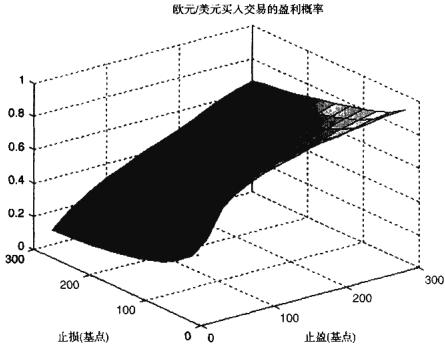  
图15-1在不同止盈和止损参数水平下，基于欧元/美元小时数据买人交易的盈利概率

# 计算边缘概率

下一步涉及将前述步骤1和步骤2中的结果相匹配，以确定交易信号中导致正收益的百分比，以及系统未能探测出的正收益的百分比。如果采用最基本的办法，可以通过如下步骤完成此任务：

1．计算“命中率”，即交易信号中产生正收益的百分比。为了计算命中率，需要计算步骤2中产生正收益的买人交易次数的总数，以及它与步骤1中产生的买入交易信号相对应的次数。然后用所匹配的具有正收益的买人交易次数除以步骤1中模型生成的总的买人交易次数。对卖出交易重复此过程。

2.计算“失误率”，即在步骤2中确定有正收益，但不能与步骤1中的交易相匹配的百分比。

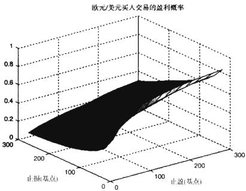  
图15-2在不同止盈和止损参数水平下，基于欧元/美元小时数据卖出交易的盈利概率

尽管命中率和失误率这两个统计量本身就可以说明交易模型利用市场状况的相对能力，但对交易策略精确度进行图示能让我们产生更好和更直观的认知。

# 精度曲线

精度曲线，也称洛仑兹，功效，或基尼曲线，提供了一个以图形方式来比较交易信号的概率性预测精度的办法。精度曲线绘制出不同预测模型相较于理想（百分之百准确的）预测的概率命中率。

交易策略精度（TSA）曲线画出了交易模型中“命中”信号相较于“失误”信号的累积分布。“命中”即交易信号产生的交易结果是盈利的。例如，如果对欧元/美元给出买入信号后，此货币对上涨，这就让我们捕捉到一次预定的盈利，那么这次预测就是一次“命中”。“失误”是指交易结果相反的情况，即信号导致亏损。在交易已经完成并且交易的盈利情况完全可见后，我们才能确定这次预测是命中还是失误。

图15-5给出了精度曲线的一个例子。从（0，0）延伸出来的粗黑线，先是垂直向上，接着水平向右至（100，100），这是理想预测曲线，即此预测事先就能将命中识别为命中，而将失误识别为失误。

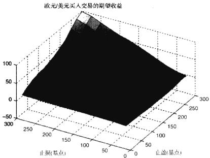  
图15-3在不同止盈和止损参数水平下，基于欧元/美元小时数据每笔买人交易的平均收益

将图等分的45度线对应于完全随机的预测，即等概率地给出命中或失误的预测。对于所有其他模型，我们根据其TSA曲线相对于理想预测和随机预测的位置来评估它们。例如模型A就比随机预测更糟。模型B好过随机预测，模型C比模型B甚至更好（更接近于理想情况）。

TSA曲线是正确预测亏损伴随正确预测盈利的累积分布图。理想模型对所有的预测都有百分之百的命中率，所有的盈利在事前就会预测为盈利，所有亏损在事前也会预测为亏损。TSA曲线离理想曲线最近的模型是最好的模型。生成TSA曲线的步骤如下：

1．收集所有交易结果及其事前预测的有关信息。盈利的交易记为“1”，亏损交易记为“0”。类似的，事先预测会盈利，结果也盈利的命中预测可以记为“1”；事前预测会亏损，结果也是亏损的命中预测同样记为“1”。事先预测为盈利结果为亏损或者事前预测为亏损结果为盈利的失误预测全部记为“0”。表15-3显示了对一些交易样本所得的数据结构。

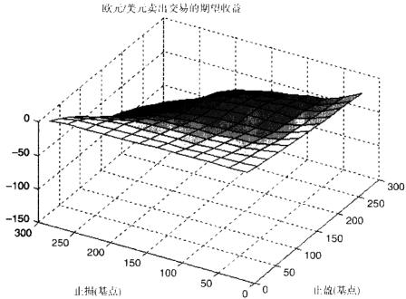  
图15-4在不同止盈和止损参数水平下，基于欧元/美元小时数据每笔卖出交易的平均收益

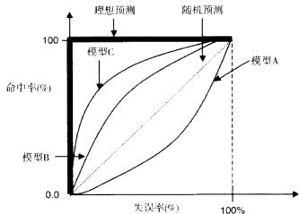  
图15-5用交易策略精度（TSA）曲线评估交易模型

2.计算交易结果中所有的命中次数 $\pmb { H }$ 和失误次数 $M$ 。在我们的例子中，有两次命中，三次失误。接着，定义 $N$ 为两者中的较大者： $N = \operatorname* { m a x } ( H , M )$ 。

这里 $N = 3$

表15-3对交易结果及预测命与失误进行评估  

<table><tr><td>交易 1D</td><td>日期</td><td>预测/交易开始时间</td><td>事前 预测</td><td>实际 交易</td><td>盈利 (亏损）</td><td>交易 结果</td><td>命中 或失误</td></tr><tr><td>1</td><td>3/9/2009</td><td>6:00A.M.美东时</td><td>盈利</td><td>盈利</td><td>59</td><td>1</td><td>1</td></tr><tr><td>2</td><td>3/9/2009</td><td>7:00A.M.美东时</td><td>亏损</td><td>盈利</td><td>70</td><td>1</td><td>0</td></tr><tr><td>3</td><td>3/9/2009</td><td>8:00A.M.美东时</td><td>盈利</td><td>亏损</td><td>(25）</td><td>0</td><td>0</td></tr><tr><td>4</td><td>3/9/2009</td><td>9:00A.M.美东时</td><td>亏损</td><td>亏损</td><td>(66）</td><td>0</td><td>1</td></tr><tr><td>5</td><td>3/9/2009</td><td>10:00A.M.美东时</td><td>亏损</td><td>盈利</td><td>30</td><td>1</td><td>0</td></tr></table>

3.对每次交易计算累积命中率和失误率。第 $_ i$ 次交易的累积命中率 ${ \pmb { H } } _ { i }$ 定义如下：

表15-4对我们的例子给出累积命中和失误率。为节省空间我们省略了交易的特征参数。

表15-4累积命中率和失误率  

<table><tr><td>交易ID</td><td>交易结果</td><td>命中或失误</td><td>累积命中率</td><td>累积失误率</td></tr><tr><td>1</td><td>1</td><td>1</td><td>33.3%</td><td>0</td></tr><tr><td>2</td><td>1</td><td>0</td><td>33.3%</td><td>33.3%</td></tr><tr><td>3</td><td>0</td><td>0</td><td>33.3%</td><td>66.7%</td></tr><tr><td>4</td><td>0</td><td>1</td><td>66.7%</td><td>66.7%</td></tr><tr><td>5</td><td>1</td><td>0</td><td>66.7%</td><td>100%</td></tr></table>

4.现在可以绘制我们给出例子的TSA曲线了。在图中，每笔交易的累积失误率为横坐标，累积命中率为纵坐标。从左下角（0，0）点开始，我们将例子中代表命中率和失误率的点用直线连接起来，然后继续将线延伸至右上角的点(100，100)。图15-6给出了最后结果。

预测的精度由TSA曲线下方的总面积确定。对于我们的例子，曲线之下的面积（阴影区）占整个方块面积的 $4 4 , 4 \%$ ，这表明我们的预测精度为44. $4 \%$ 。我们的样本预测模型表现要比随机预测模型差，即对角线。随机预测模型有 $50 \%$ 的准确性。需要注意的是，在如我们的例子里给出的小样本中，估计的精度与样本内命中和失误出现的顺序有关。随着命中和失误顺序的改变，精度将围绕其真实值而变动。

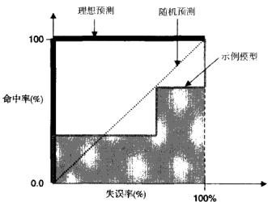  
图15-6前述样本交易的交易策略精度（TSA）曲线

此处描述的TSA曲线是最简单的一种，它只是显示了命中率，但对盈利交易相较于亏损交易的实际盈利状况没有任何考虑。更高级版本的TSA曲线对此情形做出了一些改进，将所有的获利分为两个或更多的盈利水平，将所有的亏损也分为相应的亏损水平。

除了对不同交易模型之间的精度进行比较之外，对交易系统的潜在结果进行分析还能改进和校准现有模型，以及评估交易信号彼此独立的不同交易模型组合起来的表现。Aldridge $2 0 0 9 \mathrm { a }$ ）开发了一种利用命中率和失误率来提高交易模型预测精度的方法。

# 结论

在交易策略用于实际资金之前，需要对交易策略在历史数据上的表现进行各种各样的测试，每种测试都揭示了策略表现的不同侧面。通过观察策略在回顾测试中的表现参数，高频交易经理能够将最优的策略应用到他的投资组合之中。同样是这些参数，还能让模型开发者对策略进行微调，以获得更为稳健的交易模型。在此过程中必须注意避免“过度拟合”的问题，即在测试模型时使用的是同样的数据样本。

# 实施高频交易系统

高频交易模型确定之后，我们就要对模型进行回顾测试以确保其可行性。回顾测试软件应当是实时交易系统的“纸”上原型。二者需要使用相同的代码，并且回顾测试引擎应当运行于分笔数据，以重演当时的历史状况。回顾测试模块中的主要功能代码要再度应用于实时系统之中。

为了保证推断结果是统计显著的，模型的“训练”时间 $_ { r }$ 需要足够大。根据中心极限定理（CIT），要想得到任何有统计显著性的推断，至少需要30个观测值，观测值数目达到200个才是比较合理的。日内数据具有很强的季节性（价格和波动率的变动在全天的特定时刻反复出现），我们需要将基准模型在多年的分笔数据上进行回顾测试。

实时交易模型和回归测试模型最大的区别是报价数据的来源不同。回顾测试系统会包含一个历史报价流模块，它从文档中读人历史分笔数据，并依次送到主要功能模块。在实时交易系统中，使用另外的报价模块来接收经纪自营商传来的实时分笔数据。

除了接收报价方面不一样之外，实时系统和回顾测试系统应当是完全相同的，它们可以同时开发，最理想的情况是，二者的核心功能模块使用相同的代码。本章总结系统实施过程时，将假定回顾测试系统和实时系统是并行开发和测试的。

# 模型开发的生命周期

高频交易系统从本质上而言要求毫不犹豫地快速决策并且马上执行。在这种“关键目标”交易任务之中，合理编写的计算机系统通常比人类交易员表现更好，尤其是在多变的市场情况下更是如此，相关例子可参见Aldridge(2009)。因此，在全球范围内，计算机交易系统正快速地取代传统的交易员。

开发一个全自动交易系统的过程与标准的软件开发流程类似。图16-1展示了一个典型开发过程的生命周期。

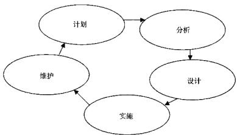  
图16-1典型的交易系统开发周期

一个良好的开发过程通常包括以下五个阶段：

1.计划  
2.分析  
3.设计  
4.实施  
5.维护

此过程周而复始，这也表明了系统开发过程中品质不断提升的特点。有时看起来一个版本的系统已经完成，此时新的问题又要求对系统做进一步的修改和加强，这就导致了一个新的开发周期。

计划阶段的目的是确定项目目标，并且对项目完成后会是什么样产生一个高屋建瓴的看法。计划通常会伴随着可行性研究，即从经济、操作模式，以及技术要求等多方面对项目进行考察。经济方面考量的是此项目是否有足够的损益（P&L）潜力。操作和技术方面则从适应性、人力资源和其他日常事务的角度进行论证。计划阶段的成果是给项目设定具体的目标，给出时间表，并为整个系统做出预算。

在此过程的分析阶段，团队将汇集各个方面对系统功能的要求，决定项目的规模范围（在当前版本中包含哪些功能以及不包含哪些功能），并向用户和管理层征求初期反馈意见。分析阶段可以说是开发过程中最重要的阶段，因为只有在这个阶段，项目的各个相关方才能在预算允许的条件下最大限度地塑造系统功能。

设计阶段将系统功能的详细规格具体化，包括流程图、业务规则、界面以及日常报表和其他文档的输出格式等。设计阶段的一个目的就是将整个工程分成各个模块，并分配给各个软件开发团队，各个模块都有设计良好的接口，不同软件开发团队开发的模块可以无缝拼接起来。这种对内部计算机模块软件包的早期规范能让将来不同软件开发团队之间沟通更为流畅，项目也能得以平稳运行。设计阶段还要列出测试用例，即功能路径，这在将来会用做验证代码正确性的蓝本。

最后的阶段是实施阶段，这就涉及实际编程了。软件开发团队或者是个人程序员按照设计阶段的要求开发软件模块。开发团队先按照之前定义的测试用例对每个模块自行测试，当项目管理对每个开发的单独模块都满意后，就可以开始项目的整合工作了。整合，顾名思义，就是将各个单独的模块组装到一起，形成一个新的功能系统。

尽管计划周密的项目在整合阶段不会遇到太大的问题，但是仍然会有剩余工作需要处理。为了保证系统不同模块之间正确沟通，可能需要编写一些脚本，另外还可能需要开发安装包，最重要的是需要对系统进行详尽测试以保证正常运行。测试工作一般由开发人员之外的专职人员来进行。测试人员要根据设计阶段定义的测试流程认真勤勉地监控系统每个功能的运行情况，然后记录所有的“漏洞”（bugs）—也就是测试用例中预想结果与实际结果的不同之处。这些程序漏洞将被回送给开发团队来解决，随后再返回到测试团队。

实施阶段成功完成后，就进人了系统的部署和维护阶段。在维护阶段中，将解决系统中所有与预期表现不相符的问题，例如新发现的漏洞等。

# 系统实施

# 实施高频系统的关键步骤

绝大多数系统交易平台的架构都如图16-2所示。一个或多个运行时处理器包含了交易机制的核心逻辑，并且履行如下职能：

●接收、处理和保存传人报价。  
●进行运行时计量分析。  
●实施运行时投资组合管理。  
●产生和传递买卖交易信号。  
●等候并接收执行确认。  
●计算运行时盈亏。  
●根据目前投资组合配置和市场状况动态管理风险，

一个成功的高频交易系统应当能够很容易地根据当时的市场状况对自身进行调整。因此，大部分的高频系统都接收、处理，并且保存大量以运行时频率传输的报价及其他市场数据。有些系统可能将运行时数据流转变成等时间间隔数据，比如秒级或者分钟级数据，以供内部计量分析之用；另外一些系统则直接使用原始的不规则时间间隔报价数据。至于是否对数据进行转化则取决于运行时计量分析的需求。

运行时计量分析是一个计算机程序，它执行以下三个功能：

1．接收报价和指令确认。  
2.将报价输人核心分析引擎。  
3.输出交易信号。

核心分析引擎一般基于历史数据分析，这些分析在模拟和回顾测试中能在相当长的一段时间内产生持续的正收益。开发核心引擎的过程通常按如下步骤进行。首先，量化分析师找出错误定价的证券，或者是市场无效，或者是对均衡状态的持续背离。这种模型的第一步开发常使用Matlab或R编程语言来完成，这些语言是专门用来进行数学建模的。

接着，量化分析师常常会与技术专家协力合作，用数年的数据对模型进行回顾测试。几年（最少两年）的回顾测试要能产生足够多的收益样本，这样才能使样本分布接近于收益表现在过去和将来的真实分布。如果模型在过去数年的回顾测试中持续产生正收益，就可以对此模型进行编程形成产品了。

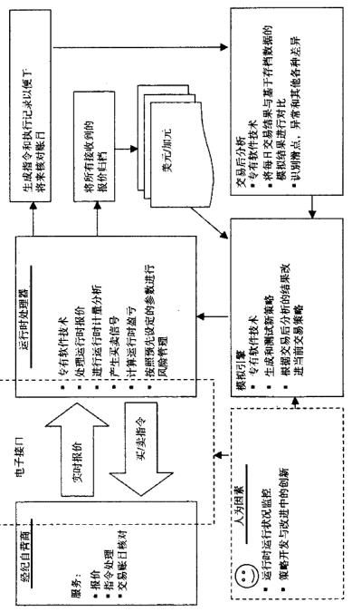  
-91

大多数高频产品系统都是用 $\mathbb { C } + +$ 语言编写的，尽管也有一些对冲基金和投资管理公司使用的是Java。人们通常认为 ${ \mathbb C } + +$ 比Java更“轻”更“快”，也就是说C $^ { + + }$ 占用的运算能力不像Java那么多，因此， $\mathbb { C } + +$ 系统一般比Java系统工作速度更快。然而， $\mathbb { C } + +$ 程序员必须注意管理好系统的运行时内存，而对于Java而言，它可以自动管理运行时的内存问题，而不需要程序员必须记得这么做。

运行时投资组合管理的设计和实施反映了核心计量经济学引擎的状态。除了原始报价数据之外，投资组合管理的系统之内还包含其他很多输入数据，比如计量经济学模型、当前头寸规模，以及其他有关最大化投资组合收益、最小化组合风险的信息等。

然后，核心引擎和投资组合管理系统发出指令，并将指令传送给经纪自营商。经纪自营商在收到并执行指令之后，将指令状态、指令成交价格和成交规模返回给客户。接着系统计算盈亏，评估风险管理参数并将其反馈给投资组合管理模块。

经纪自营商和客户或者和交易所之间彼此传递报价、指令以及其他信息主要是通过金融信息交换（Financial Information eXchange，FIX）协议来进行的，这是一种专门为实时金融信息传送而设计的协议。根据FIX行业网站提供的信息，FIX始于1992年，一开始是富达投资公司（FidelityInvestment）和所罗门兄弟公司（SalomonBrothers）为他们之间的股票交易建立的一个双边通信构架。目前，它已成为各个经纪自营商、交易所和交易客户之间的主流通信方式。实际上，fixprotocol.org做的一项调查显示，在2006年， $7 5 \%$ 的买方公司，$8 0 \%$ 的卖方公司，以及超过 $7 5 \%$ 的交易所都在使用FIX进行系统交易。

FIX最好是被看成一种编程语言，并且有一个全球指导委员会监督，委员会组成人员来自世界各地的银行、经纪自营商、交易所、行业协会、机构投资者，以及信息技术提供商。然而，像开发其他任何系统一样，使用FIX实施通信的过程中，需要对资源进行详细规划和分配，并且有可能花费不菲。

—条典型的FIX信息由头部、正文和尾部组成。头部通常包含以下三个域：标识信息起始的字符串（FIX域#8），紧接信息头部之后的信息正文的字符个数（FIX域#9），信息类型（FIX域#35）。其中许多信息类型都是报价和指令执行指示和确认，以及为确保系统正常和良好运行而设计的看家信息。

例如，MsgType ${ \bf \Lambda } = { \bf 0 }$ 是“心跳”（heartbeat）信息—这个信息发送给通信的另一方以确保通信仍然在进行之中，且不会因为任何不可预见的技术问题而中断。通常系统在不活跃时间超过预定秒数后，就会发送心跳信息。如果通信的任何一方没有收到另一方发送的心跳信息，它就会发送测试请求（TestRequest）信息（ $\begin{array} { r } { \mathbf { M s g T y p e } = 1 } \end{array}$ ）来“询问”通信的另一方。如果测试请求信息之后仍然没有收到心跳信息，就认为连接已经丢失，需要采取措施重启连接。

MsgType $= 6$ 称为“兴趣指标”（Indication of Interest）。交易所和经济自营商利用兴趣指标信息发布其以自营身份或者代理身份的买入或卖出兴趣。Msg-$\mathrm { T y p e } = \mathrm { R }$ 表示“报价请求”（QuoteRequest）信息，经纪自营商的客户利用这个信息来请求报价流。在正常情况下，经纪自营商会用连续的报价信息（Msg-$\mathrm { T y p e } = \mathrm { S } ^ { \prime }$ ，流来问应报价请求信息，报价信息流包含实际行情信息，如买价和卖价等。

其他信息类型包含的指令有单一名称指令（single-nameorders）、列表指令（list orders）、日限价指令（day limit orders）、多日指令（multiday orders）、各式取消请求以及确认等。头部中的所有域都有如下格式：

$$
\left[ \mathrm { \bf ~ F i e l d ~ } \# \right] ~ = ~ \left[ \mathrm { \bf ~ d a t a } \right]
$$

例如，要表达此信息中包含某一指令的状态，我们使用如下序列：

$$
3 5 = 8 1
$$

所有域序列都用一个特殊字符作为结尾，此字符的计算机值为 ${ \bf 0 } { \bf { x 0 1 } }$ 。该字符在屏幕上显示为“！”。

信息的正文部分包含信息的详细内容，即它是一个报价请求，还是报价本身，还是指令和交易信息。信息正文还指明了交易所，包含毫秒数的时间戳、证券代码，以及其他一些必要的交易数据。跟头部一样，正文中的所有域也有

如下格式：

$$
\left[ \mathrm { \bf ~ F i e l d } \# \right] ~ = ~ \left[ \mathrm { \bf ~ d a t a } \right]
$$

并且每个域序列都以特殊计算机字符0x01作为结尾。

最后，每条信息正文末尾都是“校检和”（checksum），及信息中所有字符的数字值之和，信息包含此校检和主要是为了验证信息是否全部到达。

例如，一条载有美元/加元在2007年7月31日格林尼治时间15：25：20报价的信息看起来会是这样的：

$8 = \mathrm { F I X } , 4 , 2 \ 1 \quad 9 = 3 0 9 \ | \quad 3 5 = { \mathrm { S } } \ | \quad 4 9 = \mathrm { M L } \mathrm { - F I X } \mathrm { - F X } \ |$   
$5 6 =$ $\mathrm { E C H O 2 - Q T S - T E S T } \ \mid \ 3 4 = 5 0 1 5 \ \mid \ 5 2 = 2 0 0 7 0 7 3 1 - 1 5 : 2 5 : 2 0 \mid$   
131 =11858953651 $1 1 7 =$ ECHO2-QTS-  
TEST. 00043690C8A8D6B9. 00043690D14044C6I $3 0 1 = 0$ 1  
$\mathsf { S 5 } = \mathrm { U S D } / \mathrm { C A D } \enspace \mid \enspace 1 6 7 = \mathrm { F O R } \enspace \mid \enspace 1 5 = \mathrm { U S D } \enspace \mid \enspace 1 3 2 = 1 . 0 6 5 4 5 0 \enspace \mid$   
$1 3 3 = 1 . \ 0 6 5 8 5 0 \ \mid \quad 1 3 4 = 5 0 0 0 0 0 0 . \ 0 \ \mid \quad 1 3 5 = 5 0 0 0 0 0 0 . \ 0 \ \mid$   
$6 4 7 = 2 0 0 0 0 0 1 . \ 0 1 6 4 8 = 2 0 0 0 0 0 1 . \ 0 1 1 8 8 = 1 . 0 6 5 4 5 1$   
190 = 1.06585 | 60=20070731-15:25:201 $4 0 = \mathbf { H }$ 164=20070801  
一 $1 0 = 1 7 8$

仔细分析此信息，我们对下列域做评注：${ \bf 8 } = { \bf F } { \bf { I X } } , { \bf 4 } , 2$ ：所使用的FIX协议版本。$9 = 3 0 9 \ \AA$ ：该信息正文为309个字符。$3 5 = \mathrm { S }$ ：该信息包含报价。

$4 9 =$ ML-FIX-FX：信息发送者的内部识别码；此处的发送者为美林（Mer-rill Lynch）外汇交易台。

56 $=$ ECHO2-QTS-TEST：信息收件人的内部识别码。

$3 4 = 5 0 1 5$ ：信息序列编号；用此序列号可以跟踪所有发送信息。信息排序可以让信息收件人分辨出他们是否收到了所有信息，以及顺序是否正确。信息排序可以帮助准确找出通信连接或者信息发送和接收方面的问题。

$5 2 \ = \ 2 0 0 7 0 7 3 1 . 1 5 : 2 5 : 2 0$ ：对应传输发起时间的时间戳。时间戳由日期（yyyymmdd）和时间 $\mathrm { \ h h { : } \ m m { : } \ s s }$ ）组成。时间通常采用格林尼治标准时间（GMT)。

$1 3 1 = 1 1 8 5 8 9 5 3 6 5$ ：对应于包含某给定证券原始报价请求信息的唯一标识符。

117 = ECHO2-QTS-TEST.00043690C8A8D6B9.00043690D14044C6:报价的唯一标志符。我们需注意的是此标识符包含收件人的身份认证，这使得经纪自营商给具有不同特征的客户输出不同的报价流成为可能。例如，经纪交易商可能会对持续成功的客户增大价差。

$3 0 1 = 0$ ：要求报价信息收件人回应的级别：有效回应分别为 $0 =$ 无确认（默认）， $1 =$ 仅在报价为负或错误时需要确认，以及 $2 =$ 对每条报价信息进行确认。在我们的例子中，美林不期望收到任何报价确认。

$5 5 = { \mathrm { U S D } } / { \mathrm { C A D } }$ ：所报价金融工具的代码。

$1 6 7 = \mathbf { F } 0 \mathbf { R }$ ：报价证券的类型。其有效值包括 ${ \bf A B S } =$ 资产担保证券（Asset-backed Securities) , $\mathbf { B N } =$ 银行票据（BankNotes），FUT $=$ 期货（Future)，以及$\mathrm { { { \bf ~ O P T } = } }$ 期权（Option），等等。

$1 5 \simeq { \mathrm { U S D } }$ ：报价所用的基准货币$1 3 2 = 1 . 0 6 5 4 5 0$ ：买价  
$1 3 3 = 1 . 0 6 5 8 5 0$ ：卖价  
$1 3 4 = 5 0 0 0 0 0 0 , 0$ ：买人量  
$1 3 5 = 5 0 0 0 0 0 0 , 0$ ：卖出量  
$6 4 7 = 2 0 0 0 0 0 1 . 0$ ：最低买入数量$6 4 8 = 2 0 0 0 0 0 1 , 0$ ：最低卖出数量$1 8 8 = 1 , 0 6 5 4 5$ ：外汇即期买入价$1 9 0 = 1 , 0 6 5 8 5$ ：外汇即期卖出价

$6 0 = 2 0 0 7 0 7 3 1 { \cdot } 1 5 { \cdot } 2 5 { \cdot } 2 0$ ：创建报价的时间戳

$4 0 = \mathrm { H }$ ：可用指令类型。指令类型可取下列值之-： $1 =$ 市价， $^ { 2 } =$ 限价，$^ { 3 = }$ 停止/止损， $4 =$ 止损限价， $5 =$ 收盘时市价委托（不再使用）， $\epsilon =$ 含或不含， $^ { 7 = }$ 限价或更好价， $\mathbf { 8 } \equiv$ 限价含或不含， $9 =$ 基于基价， $\mathbf { A } =$ 基于收盘价（不再使用）， $\mathbf { B } =$ 收盘时限价（不再使用）， ${ \bf C } =$ 外汇市价（不再使用）， $\mathbf { D } =$ 上次报价， ${ \bf E } =$ 上次显示指定的， $\mathbf { F } =$ 外汇限价（不再使用）， $G =$ 外汇互换，${ \bf H } =$ 外汇上次报价（不再使用）， $\mathbf { I } =$ Funari（当日有效限价，剩余未执行部分按收盘时市价委托处理，如日本）， ${ \bf J } =$ 触及即市价（MIT）， ${ \bf K } =$ 市价剩余转限价（市价指令未执行部分转为最后价格的限价指令），L=上次基金估值（历史价格；对于CIV）， ${ \bf M } =$ 下次基金估值（远期价格，对于CIV）， $\mathbf { P } =$ 挂钩，$Q =$ 反顺序选择。

$6 4 = 2 0 0 7 0 8 0 1$ ：交易结算日。如果指令于2007年7月31日执行，那么该交易将于2007年8月1日结算。

$1 0 = 1 7 8$ ：校验和，信息中所有的字符的计算机编码之和。我们用校验和来验证信息到达是否完整。

最好的高频交易系统并未就此止步。与真实交易同步，还有一个交易后分析引擎在同样的数据上运行同样的代码，把产生的模拟结果与实际交易结果进行对照，并更新收益分布、交易成本、风险管理参数等，之后再将更新后的数据反馈给主处理引擎，投资组合优化模块和风险管理模块。

模拟仿真引擎是一个独立的模块，它在历史运行时数据上测试新的交易理念，但不实际执行交易。在交易理念开发的早期阶段，常常使用Matlab或者Excel来编程，但模拟引擎与之不同，它在对交易理念进行测试时常使用与最终产品一样的语言 $\mathbf { \Delta C } + \mathbf { \epsilon } +$ 或是Java）。当产品代码编写完成之后，首先将模拟引擎在较长时间的历史数据上运行一遍，也就是进行回顾测试。此时，我们可以对模拟引擎进行完善，以改进系统并且修复漏洞。一旦回顾测试的表现令人满意，系统将切换到实时数据，也就是产品系统的输人数据。然而这时系统仍然处于测试状态，系统还不能实际发出交易指令。作为替代，我们将所有要发给经纪自营商的指令都记录到一个文本文件里。系统在实时数据上的测试阶段也称为“纸交易”（paper-trading)。

如果纸交易的表现令人满意，并且与回顾测试结果相吻合，纸交易就转为实际交易。系统还需要连续不断的人力监督，以确保系统免受恶意侵害，比如计算机病毒或者模型没有计人的市场事件等。然而正常情况下，交易员的作用应当仅限于确保系统的表现处于特定范围之内。一旦边界被突破，交易员应有权停止当天交易或者直至导致边界突破的问题得以解决。

# 系统实施中的常见错误

时间失真模拟系统按照自身的时间来处理其他进程运行时所收集和储存的报价。进程收集的数据现在已经成为历史数据，进程记录的报价频率可以差别很大，这主要是因为以下两个因素：

1．原始进程为之收集报价的金融工具的个数。

2.运行原始进程的计算机系统的速度。

这两个因素的影响源于报价过程的本质以及大多数交易系统的实现方式。大多数系统中都包含一个客户端（报价收集和/或交易应用程序），该客户端接收报价以及服务器（提供报价的经纪自营商应用程序）信息。客户端常常是在“本地”运行的“本地”程序：即其运行的电脑硬件完全处于交易员的掌控之下。经纪自营商的服务器端几乎都是远程应用程序，这意味着客户必须通过远程连接，比如互联网，才能与服务器进行通信。为了接收报价，客户端程序通常需要与服务器程序之间建立如下的通信：

1．客户端向服务器发送一条或一系列包含以下内容的消息：

a.客户身份认证（由掌管服务器的经纪自营商提供给客户的）

b.请求报价的金融证券名称

2.服务器将会做出回应，确认客户端的消息。服务器的回应还将说明是否因为某些原因不允许客户端接收某些请求的报价。

3.服务器开始把报价源源不断地输出给客户端。报价流的输出通常采取“不同步”的方式，也就是说，只要有新的可用报价，服务器就会将它们发送到客户端。有些证券的报价频率比其他证券高一些。例如，在经济信息公布前后的高波动阶段，欧元/美元汇率报价频率达到每秒30次也不算稀奇。然而与此同时，一些鲜为人知的股票可能在一个交易日只产生一次报价。因此在设计程序中接收报价的部分时，很重要的一点是记住报价的预期频率。

4.接下来经常会发生报价失真。所有报价一到达客户端计算机就进行收集和处理，这是客户端的责任。此处有可能发生若干问题。在客户端的机器里，所有到来的报价都会按它们的到达顺序放到一个队列里，最早的报价离处理器最近。我们可以将此队列看做是机场办理登机手续的队列。然而，与机场队列不同的是，此队列的长度或者容量往往是有限的；因而，任何报价到来时发现队列已满，此报价会被丢弃掉。这里就产生了第一个问题：当客户端系统队列长度不同，而其他所有系统特征完全一样时，不同客户端的报价时间序列可能会彼此不同。

一且报价已在队列中，系统会从队列中选取最早到达的报价进行处理；接着队列中所有的报价会被挪动，使之更靠近处理引擎。就像前面讲的一样，报价的到达速度可能要比客户端的处理速度更快，这样报价会填满队列，从而导致系统丢弃新到达的报价，直到旧的报价处理完毕。即使看似简单的操作，例如将报价复制到存储于计算机系统中的一个文件或是数据库中，也需要耗费计算机时间。虽然报价存储时间有可能只是一秒之中的极少一部分，按人类的时间标准几乎可以忽略不计，但是按计算机时间却有可能很可观，并会减缓到达报价的处理速度。

客户端系统可能会将报价从队列中取出的时间作为报价的到达时间。因而此时间截可能不同于服务器分配给报价的时间戳，而取决于我们要为其收集报价的证券个数以及当日给定时间的市场波动率。仅仅是报价处理延迟本身而导致的时间戳失真也可能大不相同。如果我们还要对报价做进一步的数学处理来产生交易信号，那么时间戳中的失真就更为严重了。

5.系统在处理能力较慢的计算机上自然会比较快机器上的时间戳失真更为严重。较快的机器处理报价序列速度更快，因而丢失的报价就少一些。即使系统能力仅有一点差别，也可能会产生不同的报价流，相应产生的交易信号也不同。

我们可以通过以下四个途径来提高报价传送的可靠性：

1．每条报价一到达，在未放人报价队列之前，就立即给报价标记时间戳。  
2.增加报价队列的容量。  
3.在成本/效益分析可行的情况下，将系统内存增至最大。  
4.在任一给定客户端上，减少要收集报价的证券个数。

如果客户端应用程序是从零开始设计和开发的，以上四个建立更好报价稳定性的步骤很容易实现，尤其报价传送采用FIX协议时更是如此。然而另一方面，许多现成的客户端，包括那些由执行经纪商提供的客户端，可能很难或者根本不可能修改。对于打算使用现成客户端的公司，比较谨慎的做法是向软件制造商询问如何解决上述问题。

执行速度执行时间可以成就也可以破坏高频交易模型。比如，大部分利用市场暂时性价格偏差进行套利的策略，其盈利能力都取决于能否以闪电般的速度发布指令。第一个发现价格偏差并且将指令发布到交易所的人，有可能得到最多的收益。

执行速度取决于交易平台的以下几个组成部分：

●应用程序生成交易信号的速度  
●生成交易信号的应用程序与执行经纪商之间的邻近程度  
●执行经纪商平台处理执行请求的速度  
●执行经纪商与交易所之间的邻近程度  
●交易所处理执行指令的速度

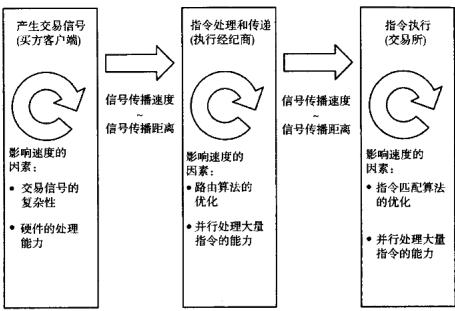  
图16-3展示了执行过程按时间顺序的流程图。  
图16-3执行过程

为了缩短客户与经纪商之间，以及经纪商同交易所之间物理传输带来的延迟，那些依赖执行速度的客户往往选择将他们的系统置于离经纪商和交易所尽可能近的地方。这种把客户端计算机系统放在经纪商和交易所附近的做法称为“主机托管”。主机托管不需要客户搬迁他们的办公场所；相反，主机托管可以通过经验丰富的第三方存放在安全机房内的一组产品机器来实现，客户可以完全远程，或者“虚拟”地操作这些机器。主机托管常常雇用能提供系统恢复服务的系统管理人员，以防系统或电源出现故障，并保证客户程序能在99. $9 \%$ 的时间内正常运行。

# 测试交易系统

如果系统还有错误或者漏洞就正式推出，其后果可能十分严重。因此，将模型广泛推出之前对系统进行完全而彻底的测试是必不可少的。测试有以下几个阶段：

●数据集测试●单元测试●整合测试·系统测试●用例测试

# 数据集测试

数据集测试指的是测试数据的有效性，这里的数据可以是回顾测试中使用的历史数据，也可以是从数据流供应商处获取的实时数据。数据测试的目的是要确认系统最大限度地减少了数据中的不良影响和扭曲，以确保运行时分析和交易信号的产生能够顺利进行。

数据集测试的基本假设是，对于某个证券，我们所接收到的数据服从的分布是不随时间变化的，并且以不同频率进行采样时，数据的分布性质也应该是一致的，例如，美元/加元的1分钟数据的分布应该与过去一年的1分钟历史数据的分布一致。当然，数据集测试允许分布随时间有些许变化，但是这个变化不能太剧烈，除非是当时发生了大规模市场崩溃的情形。

一个比较常用的数据集测试方法是检验自相关系数的一致性。其实现步骤如下：

1．以给定频率对数据集进行采样，比如说，以10秒为间隔。

2.以30\~1000个观察值为移动窗口估计自相关系数。

3.将得到的自相关系数映射到一个分布，找出异常值，并查明原因。我们还可以对分布的性质做进一步分析以回答如下问题：

●分布特性在过去一个月、一个季度或是一年里是否有改变?

这些改变是代码版本不同引起的吗？是不是在产品包中增加或移除了一些程序导致的？

以上的测试应当在不同的抽样频率之下重复进行，以确保不存在系统性的偏差。

# 单元测试

单元测试验证每个软件组成部分是否都能正常工作。单元就是应用程序中--个可测试的部分，它的定义范围很广，可以是一个底层函数或方法的代码，也可以是一个中级的功能模块，比如交易后分析引擎中的延迟测量模块等。对每个小的代码模块进行彻底测试可以确保我们在整合过程的早期就发现所有的错误，从而避免后期发生成本高昂的系统崩溃事件。

# 整合测试

单元测试之后就是整合测试。顾名思义，整合测试检查的是代码组件之间的互通性；随着代码不断地累积，这种测试将伴随系统从各个模块组件到最后完全成型的全过程。测试模块的互通性也是为了尽早发现和修改代码中的缺陷。

# 系统测试

系统测试是整合之后对交易系统整体进行测试。系统测试包含下面的几个测试流程。

图形用户界面（GUI）测试确保系统的人机交互界面可以让用户（如负责监控交易活动的工作人员）完成其工作。通常 $\mathbf { G u }$ 测试需要保证屏幕上出现的所有按钮都与适当的功能相连，一切都与开发过程的设计阶段所制定的说明相符。

易用性和性能测试与CUI测试在很大程度上是类似的，不过并不限于测试图形用户界面，它还包括测试某个功能的速度之类的内容。例如，系统处理“关闭系统”这个请求需要多长时间，从风险管理的角度来看这个时间是否可以接受，等等。

压力测试是高频交易系统测试的一个关键部分。压力测试要记录并且量化假设中的极端事件对系统表现造成的冲击。例如，如果某只证券在非常短的时间里下跌了 $10 \%$ ，系统将会作何反应？如果交易所因为不可抗力而关闭，系统无法平仓怎么办？还有其他哪些最坏的情形？它们又将如何影响系统的表现以及后来的盈亏?

安全性测试是测试过程中另外一个必不可少，但又经常被人们忽视的环节。安全性测试的目的是找出可能存在的安全漏洞，并且提供软件解决方案来修补漏洞，或者创建一个漏洞检测机制，建立漏洞出现时的应急处理措施。高频交易系统很容易受到来自互联网的安全威胁，一些恶意用户可能会为了窃取交易资金而试图劫持账号、密码等其他机密信息。然而，我们也不能低估机构内部的安全威胁，心怀不轨的员工或者满腹怨恨的工作人员可以通过不正当的方法进人交易系统，由此造成巨大的破坏。所有这些可能性都须进行测试并予以考虑。

可扩展性测试是指测试系统的容量。在不显著影响系统性能的情况下，系统能够同时处理多少只证券并能取得盈利？这个问题的答案看似无关紧要，但事实情况绝非如此。在系统中每添加一只证券，都要求分配计算机资源和网络带宽。在同一台机器上同时处理大量证券可能会显著降低计算机性能，从而打乱了报价和交易信号，并且影响到交易盈亏。具体最多能处理多少只证券取决于每个交易平台的性能，以及可用的计算能力。

可靠性测试确定的是系统出现故障的概率。可靠性测试旨在回答如下问题：系统会在何种情况下出现故障？我们预期这些情况多久发生一次？导致故障的情况可能包括系统意外崩溃、内存不足而致关机，以及其他各种使得系统停止运作的事件等。任何一个设计良好的高频交易系统的故障率都不应该超过万分之一（即系统要保证在 $9 9 , 9 9 \%$ 的时间内正常运行)。

恢复测试指的是在不利事件下，不论是不可抗力还是系统崩溃，恢复步骤文档，帮助我们完整地重建系统，并且在预定的时间之内重新运行的能力。恢复测试还要在系统意外中止的情况下保持数据的完整性。恢复测试应当包含如下场景：如果程序正在运行时计算机系统突然重启，重启之后程序应当保有有效数据。类似地，如果网线意外被拔出又重新插人，程序应当能继续正常运行。

# 用例测试

用例测试这个术语指的是按照系统开发的设计阶段所确定的系统性能表现准则进行的系统测试。在用例测试中，专门的测试人员会按照系统的使用步骤记录下系统实际行为和预期行为之间的差异。用例测试将确保系统的运行处于预定的参数范围之内。

#

实施高频交易系统是个很关键的过程，这个过程中犯下的错误将会代价不菲。将系统的非关键部分外包可能是个明智的策略，然而，执行独有计量经济学模型的那部分代码却应该在内部开发，只有这样才能最大限度发挥策略的功能。

# 风险管理

在交易之中，高效的风险管理与交易信号同样重要。一份合理设计并且严格执行的风险管理方案是机构获得稳定收益的关键。本章将重点介绍高频交易操作中最主要的风险管理方法，这些方法均遵循新巴塞尔协议风险管理标准。

正如所有的商业决策一样，建立-套完整的风险管理系统需要包括几个独立的步骤：

1．首先，明确定义整个机构层面的风险管理目标。2.其次，度量单个交易策略及整体投资组合的潜在风险敞口。3．基于以上两步所得到的目标和风险参数，制定并实施一套风险管理系统，以检测异常风险水平并且动态管理风险敞口。接下来的章节将依次具体阐述以上三个步骤。

# 确定风险管理目标

风险管理的首要目的是控制潜在损失。在高频交易中进行有效且彻底的风险管理尤为重要，因为在这些交易策略中，一点微小的差错就可能很快带来巨大的损失。这些损失可能由各种事件引致，例如没有预料到的交易模型缺陷、市场崩溃、不可抗力（如地震、火灾之类）、违反协议等类似的不利

情况。

确定组织层面的风险管理目标绝非易事。为了有效地管理风险，组织首先需要建立一个明确且有效的风险度量程序。因此，对于不同的交易策略和整个组织的风险承受能力，风险管理目标应当设定具体的风险度量方法和数量化的标准。将可承受的最大风险值进行量化非常困难，而想让整个组织就其达成共识则更为不易，但随着时间的流逝，这种努力将获得回报，它将带来快速有效的每日决策和随之而来的低风险水平。

在一个完整的目标制定过程之中，高层管理人员需要在以下几个问题 $\mathrm { ^ { k } }$ 达成一致：

●组织所面临的风险来源有哪些?  
●组织愿意承受多大程度的风险？组织的日标风险收益比率是多少？可以接受的最低风险收益比是多少?  
●一旦超过了可接受的风险临界值，应当启动何种应对机制?

风险的来源包括交易损失、信用和交易对手风险、流动性风险、操作风险以及法律风险。交易损失风险，也称为市场风险，是由所有的市场证券价格波动导致的；信用及交易对手风险是指交易对手履行其责任的能力和意愿；流动性风险衡量了交易过程中迅速解除头寸的能力；操作风险列举了日常交易操作中可能的经济损失；而法律风险则涵盖了所有的合同纠纷。一个成功的风险管理实践需要能够应对以上的每一类风险。

任何一本人门级的金融课本都会告诉你，通常高回报伴随着高风险。诚然，我们将所有的投资活动平均来看，高风险的投资回报率更高，这些高风险投资中固然有一些人收益颇丰，但另外一些却损失惨重。一个成功的风险管理程序必须为操作失败情况下组织愿意承担的损失做出一个预算。风险应当用每日、每周、每月及每年可能遇到的最坏情况下的损失来度量，且必须考虑操作成本，例如管理成本及劳务成本。比如，最坏情况下可容忍的损失可以是公司权益的 $10 \%$ ，或者是一个硬美元的数字，例如每财年150万美元。

一旦风险管理目标取得了高级管理层的同意，接下来就必须将这一目标转变为相应的风险管理程序及组织架构。风险管理程序包括开发一套监视单独交易策略以及整个资产组合的标准方法。组织架构则包括一个风险委员会，这一委员会需要定期开会，对交易表现进行回顾，并且讨论公司因为新产品或新市场而面临的潜在风险。

当事先设定的风险管理指标被打破时，其应对方案应当细化到各步骤。公司应当指派专人作为风险监管专员，负责跟进这一风险程序。重大风险情况发生情况下的处理步骤必须撰写成文。成文的细化到每个步骤的风险管理操作规则十分重要。学术研究业已发现，投资经理在遭受损失后会倾向于更加冒险（比如，Kahneman 和 Teversky（1979），Kouwenberg 和 Ziemba（2007），以及Carpenter（2000）等人的工作）。当危机来临时，事先达成一致的风险管理程序能够消除组织内部冲突，此时统一并迅速地采取行动才是重中之重。

接下来的章节将详细阐述如何对不同类型的风险类型进行量化，并且指出了应对长期无视风险敝口的最佳方法。

# 风险度量

所有的风险都是可度量的，而选择何种方法度量则取决于所考虑风险的类型。金融风险管理的权威机构巴塞尔银行监管委员会指出，以下几种类型的风险会对金融资产造成影响：

1．市场风险——由市场上证券价格变动所致。

2.信用及交易对手风险——标志交易对手履行其责任的能力和意愿。

3．流动性风险——交易过程中迅速了结头寸的能力。

4.操作风险—日常交易操作中的财务损失风险。

5.法律风险——诉讼费用支出的风险。

目前所有的风险度量方法可以分为四大类：

●统计模型●数量模型●情景分析●因果模型

统计模型根据历史数据对未来可能发生的最坏情况进行预测。其中风险价值（VaR）方法是最常用的统计学风险度量工具，这一方法我们将在介绍市场风险和流动性风险的小节中具体阐述。事实上，但凡统计模型适用的情况下，统计模型都是风险估计的首选方法。

数量模型是把可预见的最大损失表示成一些商业参数的百分比形式，例如收人、营业成本等。这些参数可以用某个商业变量几天的、几周的、几个月的，甚至是几年的平均值计算而得，具体取多长时间最合适要依参数的不同情况而定。数量模型通常用来估量操作风险。

情景分析用于确定关键风险指标一般、最好及最坏的情况。对每种情景下的关键风险指标的价值以硬美元计量，且这种指标可以用于量化所有类型的风险。情景分析常被称做“压力测试”。

因果模型涉及找出潜在损失的前因后果。根据专家的意见，我们可以构建一个整合各种驱动因素的动态模拟模型。这一模拟模型可用做度量和管理信用及交易对手风险，以及操作风险和法律风险。接下来的部分将具体讨论如何度量不同类型的风险。

# 度量市场风险

市场风险指因市场价格变动引起的资产市场价值减少的可能性以及期望值。市场风险存在于所有的交易系统之中，必须对它进行适当和全面的评估。

市场风险是指证券（股票、利率或外汇等）价格发生不利变动时所引起的资本损失。很多证券会受到其他看似不相关证券价格波动的影响。例如，投资于股票期货的资金不仅会受其标的股票价格变动的影响，还会受到利率变动的影响，这是因为利率可以用来计算期货价格中的时间价值部分。如果某一资金是用欧元发起和结算的，但是却投资于美国的股票期货市场，那么欧元兑美元汇率变动一样会影响这个投资组合的价值。

为了精确估计交易系统的风险，首先需要对该交易系统产生的收益率有一个合理完整的把握。收益率经常用收益率分布来描述。想要得到收益率分布最好当然是真金白银地用这个系统进行交易。使用两年以上的历史分笔数据对交易策略进行回顾测试，这样得到的数据也当做收益率的样本分布来使用。然而，回归测试所得的收益率分布本身也可能产生误导，因为它可能会遗漏真实交易时可能产生的极端收益和各种隐性成本。在获取了收益率分布后，通常使用统计模型和VaR模型进行来度量风险。

目前风险价值的概念已经成为了市场风险管理中的主流风险测度。在VaR的基本框架下涵盖了两个基础的度量值——VaR本身和预期亏损（ex-pectedshortfall，ES)。VaR是指某一概率下的不利情况发生时所产生的损失的值。利用策略或者资产组合的历史收益率分布，我们便可以根据这一不利情况在收益率分布中对应的分位数求出它可能发生的概率。例如，考虑某种交易策略的收益率，我们将收益率数据的历史数值按照从最糟糕到最好的顺序排列，那么 $9 5 \%$ 的VaR对应的即是最糟糕的 $5 \%$ 部分中的临界收益值。换言之，如果有100个样本观察值按照从低到高排列，则其 $\mathrm { \Delta V a R }$ 值即为第5个最低观察值。

预期亏损测度确定了某个事先决定的临界点和低于这个临界点的所有最坏情况的平均值。例如，例如， $9 5 \%$ 预期亏损即为所有收益分布中低于或等于最差的 $5 \%$ 的那部分收益的平均值。如果一百个样本值以从低到高方式排列，则该ES值为第一到第五个样本值的平均数。图17-1阐释了VaR和ES的概念。

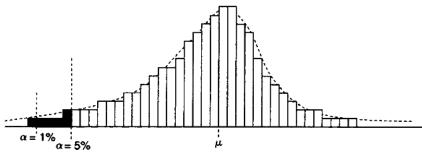  
图17-1用收益率样本计算的99%VaR（ $\alpha = 1 \%$ ）和95%VaR $( \alpha = 5 \%$ )

通过将样本分布赋予一定的参数，我们可以求出真实VaR的近似值。参数法VaR假设观测值服从正态分布， $5 \%$ 分位数出现在分布的 $\mu - 1 . 6 5 \sigma$ 处，其中 $\pmb { \mu }$ 和 $\sigma$ 分别表示分布的均值和标准差。 $9 5 \%$ 参数法VaR的计算值为 $\mathbf { \nabla } \mu \mathrm { ~ - ~ }$ $1 , 6 5 \sigma$ ，而 $9 5 \%$ 参数法预期亏损值可以用分布中位于 $- \infty$ 至 $\mu - 1 . 6 5 \sigma$ 处的所有值取平均来计算。平均值可以用分布函数的积分来计算。相类似的，$9 9 \%$ 参数法VaR的计算值为 $\mu - 2 , 3 3 \sigma$ ，而 $9 5 \%$ 参数法预期亏损值可以用分布中位于 $- \infty$ 至 $\mu - 2 . 3 3 \sigma$ 处的所有值取平均来计算。参数法VaR是真实VaR的近似值。参数法VaR是否适用取决于样本分布与正态分布的相似程度。图17-2阐述了这一理念。

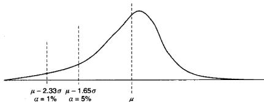  
图17-2 $9 5 \%$ 参数法 $\scriptstyle \mathtt { V a R }$ 对应于分布的 $\mu - 1 . 6 5 \sigma$ 位置，而 $9 9 \%$ 参数法VaR则对应于分布的 $\mu - 2 . 3 3 \sigma$ 位置

虽然VaR和ES这两个参量概括了最差情况所在的位置及其平均值，但它们都无法明确指出到底情况坏到什么程度才会毁掉整个交易、银行或者市场。大多数金融收益率分布存在厚尾现象，这就意味着在正态分布的界限之外存在很多极端事件，而这些极端情况的发生将会造成极大的灾难。

VaR方法的局限也是众所周知的。绿光对冲基金的创始人David Einhom在2009年1月2日的《纽约时报》发表文章称，VaR作为一个风险管理工具很难称得上是有用的，它甚至是一种潜在的灾难，因为它经常给高级管理人员以及监管者们造成一种错误的安全感。这就像是一个安全气囊在大部分时间内都是有用的，唯独在发生车祸时出现故障。该文章也引用了畅销书《黑天鹅》（The Black Swan)的作者Nassim Nicholas Taleb 对VaR的评价，他称其为“欺诈’。Jorion（2000）指出VaR方法提出了错误的风险度量方式，并且导致决策者更多地在极端事件上下注。尽管对VaR和ES方法有诸多批评，但因其能给出方便的报告数字，它们仍是这些年来诸多公司风险管理的首选。

为了部分克服VaR方法的缺陷，一些量化组织开始对收益率分布尾部的极端现象进行建模，以期能对极端情况下的损失进行更加全面的描述。一旦使用可获取的数据计算出尾部分布的参数，我们就可以从分布函数中解析出获得极限情况出现的概率，即使在样本数据中根本不曾出现相类似的极端情况。

尾部参数化可以用极值理论（extreme value theory，EVT）来实现。EVT是一个宽泛的概念，它包含一系列的尾部模型函数。Dacorogna等（2001）指出，所有的厚尾分布都属于帕累托分布（Pareto distributions）族。帕累托分布族可表示为：

$$
G ( x ) \ = \ \left\{ { \begin{array} { l l } { \ 0 \quad } & { x \leqslant 0 } \\ { { \mathrm { e x p } } \ ( { \textrm { - } } x ^ { - \alpha } ) \quad x > 0 , \alpha > 0 } \end{array} } \right.
$$

其中尾指数 $\pmb { \alpha }$ 是需要使用收益数据估计的参数。就原始的收益数据而言，其尾指数因有价证券本身不同而不同。即便对同种有价证券而言，不同机构报价的原始收益数据也有着不同的尾指数，这种情况在高频环境下尤为明显。

确定了尾指数 $\pmb { \alpha }$ 之后，我们就可以估算各种极端情况的严重程度以及其出现的概率。图17-3阐述了使用尾部参数法的过程：

1．将从回顾测试或者真实交易中获得的收益率样本数据从小到大排列。

2.利用样本收益率分布的最低 $5 \%$ 估算尾指数值。

3.利用由尾指数得到的分布函数估算极端事件的发生概率。根据尾指数分布函数，收益率低于 $\sim 7 \%$ 的概率为 $0 . 5 \%$ ，而收益率低于 $- 1 1 \%$ 的概率为 $0 , 0 0 1 \%$ 。

尾指数方法帮助我们从已观察的样本收益率分布推测出未观察的收益率分布。尽管尾指数方法非常有用，但它依然有局限之处。举例来说，尾指数方法会使用理论上的观察值数据来“填充”实际的观察值数据，当实际的样本尾部分布数据非常稀少时（通常如此），尾指数分布函数可能难以表现真实的极端收益。在这种情况下，一种称为参数自助法（parametricboot-strapping）的方法可能可以派上用场。

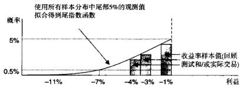  
图17-3利用尾指数法预测极端事件

参数自助法根据样本分布的性质来模拟产生观察值。这一技术根据已观察到的收益率样本数据来“填充”未能观察到的收益率。参数自助法工作流程如下：

1．资金管理人创造的收益率样本分布按照基本市场模型可以分解成三个部分：a.资金管理人的技能，或 $\pmb { \alpha }$ b.因其投资组合与市场基准相关而产生的收益c.资金管理人的特异性误差

我们用标准市场模型回归来表示这一分解：

$$
R _ { i , \iota } \ : = \ : \alpha _ { i } \ : + \ : \beta _ { i , \iota } R _ { \iota , \iota } \ : + \ : \varepsilon _ { i }
$$

式中， $R _ { i , \iota }$ 是该资金管理人在时间段 $\pmb { \tau }$ 的原始收益； $R _ { * , i }$ 是指所选择的基准在时间段 $\pmb { t }$ 的收益； $\alpha _ { i }$ 度量了资金管理人的管理技能； $\beta _ { i , x }$ 则度量了资金管理人的原始收益对基准收益的依赖程度。

2.用式（17-2）估算出 $\hat { \pmb { \alpha } } _ { i }$ 和 $\hat { \pmb { \beta } } _ { i }$ 之后，就可以形成三个数据池：分别是$\widehat { \pmb { \alpha } } _ { i }$ （对于给定的资金管理人、基准和收益样本，它是恒定的） $\hat { \boldsymbol { \beta } } _ { i , x } \pmb { R } _ { s , t }$ 和 $\pmb { \varepsilon } _ { i , t } \overset { \in }$ 。

例如，如果 $\hat { \pmb { \alpha } } _ { i }$ 和 $\hat { \boldsymbol { \beta } } _ { i }$ 和估计值分别是0.002和－0.05，那么对于原始收益和基准收益的一个样本，其成分数据池可能会是表17-1所示的样子。

表17-1自助法所产生的成分数据池的例子  

<table><tr><td>观测编号</td><td>R₁1</td><td>Rx.1</td><td>à$</td><td>$β1x^x,$</td><td>61.1</td></tr><tr><td>1</td><td>0.015</td><td>-0.001</td><td>0.002</td><td>0.00005</td><td>0.01295</td></tr><tr><td>2</td><td>0.0062</td><td>0.0034</td><td>0.002</td><td>-0.00017</td><td>0.00403</td></tr></table>

3．接下来，这些数据将按下面的方式进行重新抽样：

a.从特异性误差数据池 $\{ \pmb { \varepsilon } _ { i , t } \}$ 中随机抽取 $\boldsymbol { \varepsilon } _ { i , t } ^ { s }$ 。

b.同样，从数据池 $\{ \beta _ { i , x } R _ { s , t } \}$ 中随即抽取 $\hat { \boldsymbol { \beta } } _ { i , x } \boldsymbol { R } _ { s , t } ^ { s }$

c.按以下方式构建一个新的样本值：

$$
\hat { R } _ { i , \iota } ^ { s } \ = \ \hat { \alpha } _ { i } + \hat { \beta } _ { i , x } R _ { x , \iota } ^ { s } \ + \ \pmb \varepsilon _ { \iota } ^ { s }
$$

d.将抽取的变量 $\boldsymbol { \varepsilon } _ { t } ^ { s }$ 和 $\hat { \boldsymbol { \beta } } _ { i , \mathbf { x } } \boldsymbol { R } _ { { \boldsymbol { x } } , t } ^ { s }$ 放回数据池（不从样本数据中剔除）。

重复以上a\~d步骤列出的重新抽样过程多次，直至我们认为已经获得了足够的数据并可以更好的估计尾部分布为止。按照常规，重新抽样过程至少要重复到在抽样中观测到原始的样本数据为止。自助法过程重复上千次是很常见的。重新抽样后的值 $\hat { R } _ { i , \ell } ^ { s }$ 与观测到的样本分布有所不同，因此扩充了样本数据集，且这些附加数据符合原始样本的特征。

4.通过参数过程得到的新的分布值被当做和其他样本值一样，用于尾指数、VaR和其他风险管理指标的计算之中。

参数自助法的假设条件是：原始收益与基准收益的线性关系以及该资金管理人的 $\pmb { \alpha }$ 值在某一阶段恒定不变。但事实可能并非如此。对于掌握多种类型的资产且拥有动态策略的经理人来说，其收益与各种基准收益的关联性会因时间的不同而改变。尽管参数自助法有这些缺点，但它的确在给定的已观测到样本收益的基础上为风险管理者提供3个对真实分布更为全面的认知。

为了将投资组合管理者的基准整合进VaR框架中，Suleiman、Shapiro和Tepla（2005）提出分析资金管理人的收益超出其基准部分的“跟踪误差”(tracking error)。Suleiman、Shapiro和Tepla（2005）将跟踪误差定义为资金管理人收益与同时期基准指数收益间的差值：

$$
T E _ { \nu } = \ln \ ( \ R _ { i , \iota } ) \ - \ln \ ( \ R _ { \kappa , \iota } )
$$

式中， $R _ { i , \ell }$ 是资金管理人在时间 $\boldsymbol { t }$ 的收益； $R _ { x , t }$ 是时间 $t$ 该资金管理人基准的收益。然后我们可以根据跟踪误差的观察值佔计VaR参数。

除了 $\mathbf { V a R }$ ，统计模型还包括用蒙特卡罗模拟的方法来估计风险资本的未来市场价值。蒙特卡罗模拟通常用来计算衍生品的风险口。情景分析和因果模型也可用做估计市场风险。但是作为市场风险估量的辅助手段，它们由于过于依赖定性分析，因而在与以历史表现为基础的VaR值相比较时，容易出现误导的情况。

# 度量信用及交易对手风险

信用及交易对手风险反映了当交易的一方不履行合同义务时造成财务损失的可能性。比如，某基金的资产交由某经纪自营商托管，而这家经纪自营商却破产了，这就是一个因为交易对手破产而造成损失的例子。近年来最引人注目的交易对手破产事件莫过于2008年10月雷曼兄弟公司的倒闭。根据汤森路透的数据，雷曼兄弟倒闭后有接近3000亿美元的资金在破产程序中被冻结，这将许多卓越的对冲基金推到了破产的边缘。在组织决定提供信用额度或者接纳保证金时，就会遇到明显的信用风险。信用风险度量了借款方不按照要求追加保证金的可能性，而对于结构性金融产品而言，信用风险衡量了产品支付人（或称参考实体（referenceentity））违约的可能性及其影响。

直到最近，对信用及交易对手风险的衡量仍然是委托给专业的第三方机构来完成的，它们通常使用包括情景分析和因果模型在内的统计分析方法进行评级。在这些评级机构中最为著名的两家，标准普尔和穆迪，在2007\~2008年的信用危机中遭到猛烈抨击，它们的评级未能有效地反映真实的信用及交易对手风险，另一方面人们也揭露了在很多情况下这些评级机构与被评级的公司有着千丝万缕的关系。随着信用及交易对手风险的数据变得越来越容易获取，公司已有可能自己利用统计工具对交易对手进行评级。这个章节接下来的部分将主要阐述度量信用及对手风险的常用技术。

拥有公开交易债券的实体是最容易评级的交易对手。一个实体的信誉越差，它发行的优先债券的市场价格就越低，实体就需要支付越高的收益以吸引投资者。利差，即该公司债券的收益率和有着相同到期日的政府债券的收益率之前的差值，可以作为衡量一个交易对手商业信誉度的可靠指标。利差越高，该交易对手的商业信誉越差。由于收益率及利差与债券的价格呈负相关关系，因此交易对手的商业信誉也可用相对的债券价格来衡量：债券价格越低，收益率越高，其商业信誉度越低。公司债券的市场价格为债券发行者的商业信誉提供了较为客观的信息。这一价格是由市场上无数的参与者共同决定的，他们分析公司的策略和财务前景，从而得出各自的估值。

表17-2显示了2009年5月15日几家公司的优先债券价格和它们相应的信誉评级。信誉值为100说明该公司拥有可靠的偿债能力，而信誉值为0则意味着公司违约已经迫在眉睫。举个例子，假设一家基金需要在2009年5月15日决定是选择摩根士丹利还是富国银行作为他们的经纪商，那么从表17-2来看，摩根士丹利或许是更好的选择，因为它拥有更高的信誉值和更低的交易对手风险。我们在接下来关于风险管理框架执行的章节中也会提到，公司希望降低信用及交易对手风险，分散交易对手会是最好的方法。

表17-22009年5月15日，一些公司的优先债券价格和他们的相对信誉评级  

<table><tr><td>公司</td><td>债券交易代码</td><td>2009/5/15债券收盘份</td><td>相对信誉评级</td></tr><tr><td>可口可乐</td><td>191219AP9</td><td>131.07</td><td>80</td></tr><tr><td>摩根士丹利</td><td>617446HD4</td><td>103.25</td><td>55</td></tr><tr><td>富国银行</td><td>949746FS5</td><td>95.83</td><td>40</td></tr><tr><td>MarriottInt1, Inc.(New)</td><td>571903AF0</td><td>90.43</td><td>30</td></tr><tr><td>American General Fin. Corp. 。</td><td>02635PRT2</td><td>47.18</td><td>5</td></tr></table>

对于无法直接观察其债务市场价值的私人公司来说，我们可以寻找与其拥有相匹配因素的公众企业、近似地推导出该私人公司的信誉。匹配因素需要包括行业因素、地理位置因素、年收入因素以及公司规模和各类财务比率，例如用于评估短期偿付能力的速动比率等。一旦我们为需要评估的私人公司找到了与之相匹配的公开交易的债券，那么该公开交易的债券的利差就可用来作为替代以评估前述的私人公司。

除了相对信誉得分外，公司还需要一个类似VaR的指标来衡量其信用及交易对手风险。这个数值可以用每个交易对手的风险按其相对违约可能性进行加权平均而得。

$$
\mathrm { C C E x p o s u r e } \ = \ { \frac { 1 } { N } } \sum _ { i = 1 } ^ { N } \ { \mathrm { E x p o s u r e } } _ { i } \times \ { \mathrm { P D } } _ { i }
$$

式中，CCExposure指整个机构的信用及交易对手风险； $N$ 是指该机构的交易对手的总数；Exposure是指第 $_ i$ 个交易对手所暴露的风险的美元价值； $\mathrm { P D } _ { i }$ 是指第 $_ i$ 个交易对手违约的可能性：

$$
\mathbf { P D } _ { i } \ = \ { \frac { 1 0 0 \ - \ ( \mathbf { \ C r e d i t w o r t h i n e s s \ R a n k } ) _ { i } } { 1 0 0 } } \%
$$

这一整体的信用及交易对手风险用公司的资本总额进行规格化（normalize），然后便可以加到总体的VaR值之中。

# 度量流动性风险

流动性风险衡量了一家公司是否有可能无法及时按照现行市场价格解除或对冲其头寸。不能解除头寸通常是因为相对于头寸规模而言，市场的流动性不足。一种金融工具的市场流动性越低，它的流动性风险就越大。不同的金融工具流动性彼此各异，这取决于愿意买卖这种金融工具的市场参与者的数量。Bervas（2006）进一步提出了交易流动性风险和资产负债表流动性风险的区别，后者特指无论是用借款还是用清偿的方式都没有能力融资填补资产负债表中的短缺资金。

在较为温和的情况下，由于交易执行中的延迟，流动风险会导致较小的价格滑点；在极端的情况下，流动性风险可能造成市场系统的崩溃。例如1998年长期资本管理公司（LTCM）的倒闭就是因为该公司不能及时地解除头寸。2008年的信用危机是流动性风险另-个生动的例子。当次贷危机开始蔓延时，很多看似高质量的债务工具（例如高评级的CDO产品）因为其市场的消失而损失了绝大部分的价值。许多在这些证券上持有多头头寸的公司都遭遇了巨大的损失。有关流动性风险另外一个较为简单的例子是将要到期的虚值期权市场，虚值期权市场此时已成为行将消失的毫无价值的事物了。

交易方的数目通常与潜在的获利能力和对交易的监管程度有关。没有人愿意购买快要到期的没有价值的期权。就2008年秋季CDO的例子而言，市场消失很大程度上是因为2007年通过的第133号财务会计准则（FAS133）。FAS133规定所有的证券都必须按市值计价（marktomarket）。以CDO为例，持有CDO作为其投资组合一部分的公司在市场上最后一个交易价格即为该产品的市场价格。这一法规的颁布令那些持有这些CDO，且在其账面上持有的价格是票面价值的100%的公司不愿意以较低的价格卖掉一部分的CDO，因为这样做会使市价降低，从而让它们剩下的CDO贬值。而这将进一步引发整个基金的贬值，会造成更多的投资者要求赎回。同样，CDO的潜在购买者也面临着类似的问题：那些账面上仍然是CDO的 $100 \%$ 票面价值的投资者如果再以相对很低的价格购买新的CDO，则他们的基金整体价值会遭遇极大的贬值。而近期提案的税收方案中提到对交易费用征税可能会使目前一些金融工具良好的流动性遭到破坏。

为了恰当地评估投资组合的流动性风险散口，我们必须将投资组合各种可能的变现成本（liquidationcost）计算在内，这其中包括执行中的任何延误造成的机会成本。当市场波动率很小时，变现成本相对稳定并且容易估计，而在市场波动率很高的时期，变现成本变动很大。例如，根据Bangia等人（1999）的描述，1997年5月时美元/泰铢（USD/THB）的多头头寸的流动性风险占市场风险的 $1 7 \%$ ，而LeSaout（2002）则估计对于CAC40指数中的有些证券，其流动性风险占整体风险水平的比例高达 $50 \%$

Bervas（2006）提出了流动性调整后的VaR测度：

$$
V a R ^ { L } \ = \ V a R + L i q u i d i t y \ A d j u s t m e n t \ = \ V a R - ( \mu ^ { s } + z _ { \alpha } \sigma ^ { s } )
$$

式中，VaR即前文中提到的市场风险的风险价值； $\mu ^ { s }$ 是买卖价差的平均预期值； $\sigma ^ { s }$ 是买卖价差的标准差； $z _ { \alpha }$ 是对应于 $\alpha \%$ VaR估计值的置信系数。 $\mu ^ { s }$ 和$\pmb { \sigma } ^ { s }$ 这两个值可以通过直接对买卖价差的原始值进行估计而得，也可以通过Roll（1984）模型估计而得。

利用Kyle的 $\lambda$ 测度，经流动性调整的 ${ \mathrm { V a R } }$ 还可以用交易量的均值和方差的估计值来计算：

$$
\begin{array} { l } { { V a R ^ { L } \ = \ V a R + L i q u i d i t y \ A d j u s t m e n t } } \\ { { \ = \ V a R - \ ( \hat { \alpha } + \hat { \lambda } ( \mu ^ { N v o L } \ + z _ { \alpha } \sigma ^ { N v o L } ) ) } } \end{array}
$$

根据Kyle（1985）提出的方法，上式中的 $\hat { \pmb { \alpha } }$ 和 $\pmb { \lambda }$ 可以用普通最小二乘法回归进行估计：

$$
\Delta P _ { \iota } \ = \ \alpha + \lambda N V O L _ { \iota } + \varepsilon _ { \iota }
$$

式中， $\Delta P _ { e }$ 是由于指令影响而形成的市场价格变化； $N V O L _ { \ell }$ 是 ${ \pmb t }$ 时期买方与卖方市场深度的差值。

Hasbrouck（2005）发现，Amihud（2002）的流动性测度能够最好地衡量交易量对价格的影响。与Kyle的 $\lambda$ 对VaR的调整类似，Amihud的调整可表示如下：

$$
V a R ^ { L } \ = \ V a R + L i q u i d i t y \ A d j u s t m e n t \ = \ V a R - \left( \mu ^ { \gamma } + z _ { o } \sigma ^ { \gamma } \right)
$$

式中， $\mu ^ { \gamma }$ 和 $\sigma ^ { \gamma }$ 分别是Amihud（2002）流动性测度 $\gamma$ 的均值和标准差， $\gamma _ { \mathrm { { t } } } ~ =$ $\frac { 1 } { D _ { i } } \sum _ { d = 1 } ^ { D _ { i } } \frac { | r _ { d , i } | } { v _ { d , i } } \ : ; \ : D _ { i }$ ；D,是时期{之内成交的交易数量；是时期之内第d笔交易成交之后的相对价格变化； $\upsilon _ { d , t }$ 是第 $^ { d }$ 笔交易的成交量。

# 度量操作风险

操作风险是指在以下的一种或多种情况下产生财务损失的风险，这些情况包括：

●不适当的甚至是失败的内部控制、政策或程序  
●未能遵循政府规定  
·系统崩溃  
·欺诈  
●人为错误  
●外部灾祸

操作风险可以从很多方面影响公司。例如，欺诈风险会损坏公司名誉，因此成为了一种“名誉风险”。而系统崩溃可能会造成交易中断，从而造成资金无法重新分配的机会成本损失。

巴塞尔银行监管委员会列出了几种不同类型操作风险的例子：

·内部欺诈（internal fraud）：资产挪用、逃税、头寸做假，以及行贿受贿。

●外部欺诈（externalfraud）：信息盗窃、黑客攻击、第三方偷盗，以及伪造证件。  
●雇员行为及工作场所安全性（employment practices and workplacesafety）：歧视行为、员工索赔、员工健康及安全。  
●客户、产品及业务活动(clients，products and business practices)：市场操纵、反垄断、不当交易、产品缺陷、违反诚信、非法炒单。  
●对实有资产的破坏（damagetophysical assets）：自然灾害、恐怖主义、蓄意破坏。  
●业务终止及系统故障(business disruption and system failures)：设备故障、硬件故障、软件故障。  
●交易的执行、交付和过程管理(execution，delivery，andprocessmanagement）：输人数据错误、会计错误（accountingerror)、强制汇报未被执行、疏忽造成的客户财产损失。

几乎没有什么统计学模型可以用来衡量操作风险，这种风险通常用数量模型和情景分析共同衡量。为了数量化操作风险，通常而言第一步是建立一些假设情景并确定操作中哪些地方可能出错。每种情景在一般的、好的和坏的情形下分别会产生相应的影响都用美元来进行量化。为了整合情景分析的结果和其他类型风险的VaR估计值，可以将用美元量化的最坏程度影响用总的交易资本标准化，再加到市场风险的VaR估计值上。

# 度量法律风险

法律风险衡量所有可能会违反合同义务的风险。法律风险包括各种潜在的合同摩擦，比如合同的制定、合同条款的年限等诸如此类的问题。法律风险的一个例子就是两家银行进行外汇交易，其中一家发现其签订的合同在当地法律下是无效的。

通常来说，公司下属的法律专家会对公司的法律风险进行分析评估，评估过程主要使用的是因果分析的框架。利用因果分析可以确定公司现有的法律合同中内含的主要风险指标，并且对这些主要风险指标发生改变后可能造成的后果数量化。和其他类型的风险一样，法律风险分析的结果也是一个

VaR数字，一项发生概率为 $5 \%$ 的法律损失对应的就是95%VaR的估计值。

# 风险管理

在估量市场风险后，我们需要建立-个市场风险管理机制以使得市场风险对交易的负面冲击达到最小。大多数的风险管理系统采用如下两种方式：

1．止损：停止当下交易以防止亏损扩大。  
2．对冲：利用互补的金融工具对冲风险口。

止损

对于管理不可预期的损失风险而言，止损是最为原始也是最不可或缺的方法。就市场风险而言，止损点即对证券设定的临界价格，—-旦市场价格越过此临界价格，则触发解除现有头寸的操作。就信用及交易对手风险而言，止损点是指最低限度的交易对手信誉水平，当某交易对手的信誉水平低于这个值时，公司就会自觉停止与该交易对手进行交易。就流动性风险而言，止损点是一个最低的流动性水平，一旦低于该临界值，将解除给定有价证券的头寸。就操作风险而言，止损点是一系列的环境条件，当这些条件发生时，特定的操作项目需要重审甚至终止。例如，如果网络安全出了问题，可能要求所有交易全部停止，直到问题获得解决。最后，在法律风险中，止损指的是当法律费用即将超过事先设定的止损水平时，选择和解。

在市场风险管理中，简单止损定义了一个固定的门限价格。例如在东部时间下午12点，我们以1.2000买人美元/加元，并将简单止损设为50个基点，那么一旦美元/加元跌至1.1950下方，并且之前该头寸还没有因为其他原因平仓，那么简单止损将在此时解除头寸。图17-4a阐述了这一概念。简单止损并不考虑头寸建立到止损点触发之间所发生的价格变动，因而最终会形成50个基点的损失。

而另一方面，跟踪止损则将从建仓时刻起该证券的价格运动考虑在内。正如其名称所显示的那样，跟踪止损将“跟踪”证券的市场价格。和简单止损定义一个固定的止损触发价格不同，跟踪止损确定了与头寸获得的最大收益相关联的一个固定止损差。例如，再假设我们于东部时间下午12点以1.2000买入美元/加元，并且设定一个50个基点的跟踪止损。假设此后东部时间下午 $1 2 \colon 1 5$ ，美元/加元的市场价格涨至1.2067，但等到了下午$1 3 : 3 0$ ，该市场价格回落至1.1940。当市场价格低于收益最高点时的价格50个基点时，就会触发跟踪止损。在我们的例子里，局部最大收益出现在1.2067，这时收益为 $1 . 2 0 6 7 \ - \ 1 . 2 0 0 0 = \ 0 . 0 0 6 7$ 。当美元/加元回落至1.2067 -50 bps $= 1 . 2 0 1 7$ 下方时，相应的跟踪止损即被触发，此时实现收益17个基点，这一收益相对简单止损而言是个很大进步。图17-4b表现了这一过程。

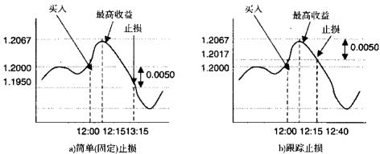  
图17-4简单（固定）止损与跟踪止损的区别

我们该如何确定一个恰当的止损区间呢？如果止损区间设置得过于狭窄，则短期的价格波动就有可能了结头寸，甚至是买卖价差的变动都可能触发止损。而若止损区间设置得过宽，则可能平仓过晚，造成大幅的损失。因此很多交易者根据所交易证券的内在波动率调整止损区间。例如，如果一个交易者在价格大幅变动的高波动时段开仓，他会设置一个较宽的跟踪止损。相反，如果开仓时波动率较小，则止损位可以设置得较为接近开仓价位。

为了将根据市场波动率确定合适止损区间的过程标准化，我们需要考虑以下两个因素：

1．当没有设置止损时，交易系统的平均收益 $E [ G ]$   
2.当没有设置止损时，交易系统的平均损失 $E [ L ]$

在决定最佳止损点位时，头寸最终收益为正的概率也是一个需要考虑的因素，不过这个因素的作用远不及上面提到的两个平均值的作用。之所以赚钱和亏损发生的概率相对而言不是那么重要，其原因在于赌徒破产理论，对于一个交易而言，赚钱的期望值必须大于亏钱的期望值，否则该系统必将面临破产。有关于这一理论，具体参见第10章。

一个交易系统平均每笔交易会形成多大的盈利和亏损往往是通过回顾测试来检验的。一般而言，回顾测试需要至少两年的历史数据，并依据这些数据获得收益率的样本分布。收益率观测值要足够对收益率分布的一些性质进行无偏推断，这些推断技术包括VaR、尾部参数法，或者是随后讨论的基准表现度量法。当我们对系统收益率的分布有了一个了解之后，我们就可以估计为了保持系统持续盈利而需要设置的最大（跟踪）止损。记最大跟踪止损为 $L _ { y }$ ，则 $L _ { w }$ 需要满足以下三个条件：

1.用绝对值表示的最大跟踪止损需要小于平均收益，即| $L _ { y } \mid <$ $E [ G ]$ ；如若不然，系统可能会产生负的累积收益。2.同样，用绝对值表示的最大跟踪止损需要小于平均损失，即1 $L _ { y } \Vdash <$ $E [ L ]$ ；不然的话，该系统的表现将与没有设置止损时的表现没有什么太大差别。3.设置了止损之后，在回顾测试之中系统每笔交易赚钱的期望值仍然需要大于亏损的期望值。

在获得最大追踪止损之后，我们可以进一步根据市场的不同波动状况设置动态止损值。根据市场波动状况设置动态止损值更多是一门艺术，而不是一门科学。比如，Dacorogna等（2001）介绍了一种基于移动平均线的模型，这个模型在低波动率和高波动率情况下设置了不同的止损值。Dacorogna等（2001）用收益或者亏损的绝对值来度量“波动率”，如果收益或者亏损的绝对值小于 $0 . 5 \%$ （50个基点），则认为“波动率”较低。随着波动率的改变，模型的止损宽度也随之改变。例如，在Dacorogna等（2001）的研究中，当前面所定义的“波动率”超过 $0 , 5 \%$ 时，止损宽度相对于低波动率时的值增加了10倍。至于什么样的情况才算是低波动率，则需要根据历史数

据的回顾测试结果而定。

其他各种风险状况之下止损宽度的设定方法与前面所讲的类似，所需要考虑的因素一样是前面所提到的期望收益以及最大损失等。

# 对冲投资组合风险散口

对冲操作与投资组合优化密切相关：进行任何对冲都是为了最大化投资组合的收益，同时最小化风险———尤其是下跌的风险。对冲还可以视为对收益进行配对：用一只证券的正收益“中和”另外一只证券的负收益。

对冲可以是被动的，也可以是动态的。被动的风险对冲与保险类似。资金管理人在某种金融证券上建立一个头寸，该证券的风险特征使其能够抵消掉整个操作的长期负收益。例如，一位资金管理人的主要策略是在美元/加元外汇上寻找做多的机会，那么他就有可能想要做空美元/加元期货合约以对冲在现货头寸上的风险敞口。当然，在做出决定之前，我们需要像往常一样，对两种证券的风险特征进行仔细的分析。

主动对冲大多数情况下涉及交易一系列短期的、有可能是彼此重叠的、与保险类似的合约。交易这些短期保险合约的目的是管理收益的短期特征。在市场风险对冲中，动态对冲可以用于应对一些特定的反复出现的市场状况，在这些市场状况下，交易系统会出现重复的反应。我们有可能找出一些金融证券或者交易策略，当这些特定的市场状况出现时，该证券或策略的收益能够抵消掉主策略的亏损。例如，当美联储宣布利率时，如果美元利率上升，美元/加元汇率也可能会随之上涨，而与此同时，这个消息却可能引起美元债券价格的下跌。因为美元/加元和美元债券收益率分布的这种特征，我们可以在美国公布利率的时段同时交易这两种证券，以抵消这两种证券中任一个可能会出现的尾部风险。在涉及主动对冲的操作细节时，采用本章前面所介绍的方法仔细考察收益率的分布特征是大有裨益的。

在按均值一方差方法构造投资组合时，一个成功的对冲策略需要求解下面的优化问题：

$$
\operatorname* { m a x } x E [ R ] - A x ^ { \prime } V x
$$

式中， $\pmb { x } _ { i }$ 是投资组合中证券 $i$ 的权重， $i \in [ 1 , \cdots , I ] : E [ R ]$ 是包含1个证券预期收益的向量；V是一个大小为 $I \times I$ 的收益方差一协方差矩阵；A是交易操作的风险厌恶系数。为了求解方便，通常假设A等于0.5。在动态状态依赖对冲策略中，我们需要反复地求解式（17-11），不过，求解中仅仅使用对应于这个状态的收益率数据。

与市场风险一样，其他类型的风险也可以通过风险管理进行分散。例如，通过与多个经纪自营商建立经纪关系可以分散交易对手风险。花旗的首要经纪业务甚至会在市场上充当二级经纪自营商，为那些已经被其他经纪商处理的基金提供经纪服务。

同样，流动性风险也可以通过多个流动性提供者来进行分散。美国精算师学会(AmericanAcademy of Actuaries）(2000）为想要分散流动性风险的公司提出了如下指导意见：“当一个公司财务状况良好的时候，它可能希望建立一个可持续的，长青的（例如，总是可以得到的）信用流动性底线。信用发行者应当有一个适当的较高的信用评级，以增加当企业真的需要这些资源时确实能获得这些资源的可能性。”根据Bhaduri、Meissner和Youn（2007）的总结，有五种金融衍生工具可以用来对冲流动性风险：

●赎回期权（withdrawal option)：一种针对流动性不足资产的看跌期权。●百慕大式收益看跌期权（Bermudan-style returm put option）：此期权赋予期权购买者在指定日期以敲定价格卖出标的资产的权利。●收益互换（return swap)：允许将标的资产的收益与LIBOR进行互换。●收益互换期权（return swaption）：一种可以获得收益互换权的期权。●流动性期权（liquidityoption）：一种敲人障碍期权，其障碍是一个流动性测度。

常规的流程检查可以保证目前的一切正在通往目标的轨道上顺利运行，最小化因疏忽而带来的失误，避免违反监管规则以及其他内部规定。例如，在现有的交易组合中加人新的交易策略需要经过严格的产品审查流程，对新提出的资产配置方案的收益和风险特性，以及其他的盈利和风险因子进行详细分析（参见第5章）。除了制定详细的操作规范之外，操作风险还可以通过其他方式对冲，比如与专门的保险公司签订保险协议，或者将非核心业务外包给第三方服务商等。

就法律风险而言，因果分析是最为有效的管理和度量方式。对于一些关键的风险指标需要进行持续的监测，这些指标变动所带来的影响也需要按照估计法律风险时所发展出来的因果模型进行评估。

#

本章介绍了高频交易运行过程中进行风险管理的最佳实践。虽然对风险进行鉴别、度量以及管理的工作可能会十分费时费力，但这些工作会带来相应的补偿，它将使整个事业坚如磐石，并且基业长青。

# 高频交易的执行和监控

高频交易系统设计完成，并且通过回顾测试之后，下一步就是用于实盘操作（比如，实际执行）。然而，实际执行过程可能会非常复杂，尤其是分配给这个策略的资金越来越多，策略执行时对市场的不利影响开始显现时更是如此。为了最大化交易表现，最小化交易成本，好的高频交易系统都会利用算法对交易的执行过程进行优化。另外，为了保证所有交易系统的算法都按照预想的方式进行工作，严格的监控过程也是必不可少的。

本章将讨论当前高频交易系统执行和监控方面的一些最佳实践：

执行优化算法用于处理以下几个问题：

●交易策略发出的交易指令是应该整体执行，还是拆分执行？●指令应当采用限价方式还是采用市价方式？●在现有的市场环境下，是否存在指令执行的择时策略使得指令获得的

成交价格好于预期？

最优化算法可以内部开发，也可以从外面购买。从外面买进算法常常会便宜一点，但是与内部开发的平台相比，缺点就是透明度较低。不论是外面买到的，还是内部开发的执行优化系统，也不论有多么先进，这些系统运行起来都可能会有一些意想不到的缺陷，一不注意就可能导致很大的损失。

为了发现交易成本和其他各个交易参数的非正常变动，对所有的执行过程都要进行严密监控。在执行过程之中，即使是最为细微的问题，也可能会对交易表现产生快速而又剧烈的影响。因此，在高频交易之中，必须及时发现各种潜在问题，这一点的重要性是无需讨论的。

# 执行高频交易系统

# 执行算法概述

在现代的高频环境之下，对执行过程进行优化已经成为了一个越来越重要的话题。在引入计算机交易算法优化之前，想交易大宗股票或者其他金融工具的投资者可能需要雇用一个经纪自营商来为他找到这笔委托单的交易对手。因此，经纪自营商开发出了一种“最优执行”（best execution）服务，这种服务将大单拆分进行逐步处理以降低其对市场价格的影响。算法交易的出现让机构交易者能自己对交易进行优化，从而淡化了经纪自营商在此过程中的主导地位，当然也增加了自己的利润。

计算机优化算法会考虑到当前市场的各种情况，也会考虑到所要处理指令的各种特征：包括指令类型、规模，以及频率等。Bertsimas和Lo（1998）开发出了一种利用当时价格变化的优化策略。Engle和Ferstenberg（2007）检验了执行过程中会遇到的风险。Almgren和Chriss(2000)，Alam和Tkatch（2007），还有其他一些人研究了将指令“切分”成规模较小的分组所带来的影响。Obizhaeva和Wang（2005）假设交易后的流动性无法立即补足，并在此条件下对执行进行了优化。Kisell和Malamut（2006）考虑了交易者对接下来市场价格走势的看法，并据此调整指令的处理速度。

除了对交易总的执行成本进行算法优化以外，算法还可应用于流动性供应、对冲仓位，甚至是监测市场中持仓变化的优化中。对于后面的一部分功能，读者可以在Foucault、Roell和Sandas（2003）的研究中找到一个例子。在本章，我们将介绍三种常见的执行优化算法。

1.交易激进程度选择算法(trading-aggressiveness selection algo-rithms），这种算法决定在执行优化过程中选择市价指令还是限价指令。

2.价格定标策略（price-scalingstrategies），这种策略根据事先指定的交易基准来选择最优执行价格。

3.规模优化算法（size-optimizationalgorithms），此算法找出将大的交易指令拆分成较小的指令时的最优拆分方式，以最小化指令的不利成本（例如，市场影响的成本）。

# 市场激进程度选择

激进执行（aggressive execution）意味着高的交易频率，以及短的交易间隔，这些都可能会导致很大的市场影响。激进执行在大多数情况下会频繁地使用市价指令。在另一方面，被动交易（passivetrading）的交易频率较低，更多地使用限价指令，但是当市场反方向运动时，被动交易也会承受指令无法成交的风险。为了平衡被动交易和激进交易，Almgren和Chriss（1999）提出了如下优化方程：

$$
\operatorname* { m i n } _ { \mathbf { o } } \mathrm { C o s t } ( \alpha ) + \lambda \mathrm { R i s k } ( \alpha )
$$

式中， $\pmb { \alpha }$ 是交易比率（trading rate），常计做交易量的百分比（percentageofvolume，POV）或者是在某个交易时段中策略吸收的流动性的量；λ是投资者的风险厌恶系数。对每种算法，我们都可以画出其成本/风险曲线，并确定各个算法的有效交易边界（efficienttrading frontier），这让我们可以对不同算法的效率进行比较，并且可以由此发现算法与投资者交易需求之间的契合程度。

根据Kissell和Malamut（2005）的研究，市场激进程度（POV或者 $\pmb { \alpha }$ ）可以通过综合使用市价指令和限价指令进行调整。市价指令会增加POV或$\pmb { \alpha }$ ，而限价指令则能降低市场激进程度。

式（18-1）中使用的成本和风险函数定义如下：

$$
\mathrm { C o s t } ( \alpha ) \ = \ E _ { 0 } [ P ( \alpha ) \ - \ : P _ { \ b } ]
$$

$$
\mathrm { R i s k } ( \alpha ) ~ = \sigma ( \varepsilon ( \alpha ) )
$$

$$
{ \mathrm { P } } ( \alpha ) \ = \ P + f ( X , \alpha ) \ + g ( X ) \ + \varepsilon ( \alpha )
$$

式中， $E _ { 0 }$ 表示交易期开始时的事先预期值； $\boldsymbol { P } _ { b }$ 是基准（benchmark）成交价格； $P ( \alpha )$ 是式（18-4）中定义的实际成交价格； $\varepsilon ( \alpha )$ 是实际交易结果中的随机误差， $E \big [ \epsilon ( \alpha ) \big ] \ = \ 0$ $\mathrm { V a r } \{ \varepsilon ( \alpha ) \} = \sigma ^ { 2 } ( \alpha )$ " $P$ 是指令单下达时的市场价格： $f ( X , \alpha )$ 是由于交易对流动性的消耗而产生的暂时性的影响； $\varrho ( X )$

是由于指令执行过程中的信息泄露而对价格产生的永久性影响。

# 价格定标策略

价格定标执行算法的目的是为交易策略获取最优价格。最优价格可通过参照某一基准而获得，例如参照证券的每日平均价格。最优价格还可以通过参照投资者的效用函数或者投资组合的目标夏普比率而获得。

最小化相对于基准的执行成本的算法称为冲击算法（strikealgorithm）。冲击的设计思想就是在价格适宜的时期抓住相应的利润；这种算法在价格有利的时期表现得比较激进（以市价成交），而在价格不利时表现得比较保守（下达限价指令）。冲击策略动态调整以市价指令处理的交易量比例 $\pmb { \alpha }$ ，并以此最小化交易策略执行成本的二次函数：

$$
\operatorname* { m i n } _ { \mathbf { e } } E _ { \iota } \big [ P _ { \iota + 1 } ( \alpha _ { \iota } ) \ : - \ : P _ { \iota , \iota } \big ] ^ { 2 }
$$

式中， $P _ { \{ + \} } ( \mathbf { \alpha } _ { \mathfrak { c } } )$ 是按照时刻 $\pmb { t }$ 所决定的交易激进程度 $\alpha _ { \ell }$ 进行交易所获得的实际成交价格； $P _ { \delta , \ell }$ 用于比较交易表现的时间 $^ { t }$ 的基准价格。

外加算法（plusalgorithm）最大化战胜某特定基准的概率，同时最小化风险。为了做到这一点，该算法最大化如下的类似于夏普比率的方程：

$$
\operatorname* { m i n } _ { a , \mathbf { \nu } } \frac { E _ { \nu } [ P _ { \nu + 1 } ( \alpha _ { \iota } ) \mathbf { \nu } - P _ { \nu , \iota } ] } { ( V ( P _ { \iota + 1 } ( \alpha _ { \iota } ) \mathbf { \nu } - P _ { \nu , \iota } ) ) }
$$

式中， $P _ { \delta , \ell }$ 用于比较交易表现的时间 ${ \pmb t }$ 的基准价格； $P _ { \{ * \} } \left( \alpha _ { \iota } \right)$ 是按照时刻所决定的交易激进程度 $\alpha _ { \varepsilon }$ 进行交易所获得的实际成交价格。

最后，财富算法（wealthalgorithm）在存在不确定性的条件下最大化投资者拥有的财富。财富算法在价格有利时表现得比较保守，在价格不利时表现得比较激进，目标是在不利情况下保存投资者的财富。财富策略优化如下表达式：

$$
\operatorname* { m i n } _ { \alpha _ { i } } \log E _ { \iota } [ U ( P _ { \iota + 1 } ( \alpha _ { \iota } ) ) ]
$$

式中，U（.）是权衡投资者风险一收益的效用函数。效用函数的形式可能如式（18-8）所示：

$$
U ( { \pmb x } ) \ = \ E [ { \pmb x } ] - \lambda V [ { \pmb x } ]
$$

式中， $_ { x }$ 是实际收益； $\pmb { \lambda }$ 是投资者的风险厌恶系数。风险厌恶系数 $\lambda$ 等于0表示投资者是风险中性的，或者说是对风险不敏感的。风险厌恶型投资者的λ值会大于0；λ大于或等于0.5则表明该投资者是高度风险厌恶的。

这些执行算法的盈利性取决于当前的市场状况。Kissell和Malamut（2005）仔细比较了这三种执行策略，他们发现，所有这三种策略的表现都要优于随机的、非系统性的执行方法。在这些算法之中，冲击算法能够获得较低的平均成本，但是忽略了价格有利情形下的参与方式。外加算法也能获得较低的平均成本，但增加了得到不利价格的风险。最后，财富算法能够抓住更多的比较有利的价格，但获得的平均价格却会有所提高。

# 拆分大指令单

Kyle（1985）还有Admati和Pleiderer（1988）首先提出，知情投资者为了保证从他们的信息中获益，需要在交易中避免其他市场参与者发现他们的指令单流。如果其他投资者发现了知情交易者的指令单流，他们就可以抢先进行交易，从而稀释了知情交易者的利润。Barclay和Warner（1993）认为，机构投资者要想在交易中避免其他人发现其持仓，他们需要把大的指令包拆分成中型的指令（既不是太大，也不是太小）这样能最小化其他市场参与者把这些指令从其他的“噪声”指令区分开来的可能性。Chakravarty（2001）研究了潜伏交易（stealthtrading）的影响，即在交易时把大的交易指令单拆分成小的指令单，以使其市场影响达到最小。Chakravarty（2001）的发现与Barclay和Warmer（1993）的假设相一致，相对于所有的价格变动和交易量的占比而言，中等规模指令的后面确实会产生不成比例的大幅价格变动。

Alam和Tkatch（2007）分析了特拉维夫证券交易所的数据，通过这些数据，他们研究了机构投资者将他们的指令拆分成多个同等规模的指令，以避免被其他交易者发现和利用的行为。Alam和Tkatch（2007）把一组组等规模、等价格、同方向，且彼此之间间隔在两分钟之内的指令看做是这样的指令。他们得出结论，这些拆分的指令的中值是四“片”（slice），或者是连续的指令单流。

在所有拆分成片的指令之中，大约 $7 9 \%$ 的指令能够执行，还有 $20 \%$ 的指令在执行之前被交易者取消了。相比所有指令的执行比例，拆分成片的指令的执行比例要高得多。所有指令（包括拆分的和没有拆分的指令）的执行比例仅为 $63 \%$ 。

另外一个度量指令拆分效率的指标是成交率（fllrate）。指令成交率度量的是指令中被“命中”或者执行的比例。完全执行的指令的成交率是$100 \%$ ，而没有执行的指令的成交率是 $0 \%$ 。通常，没有拆分的指令可能只能部分成交，具体成交率依指令规模而不同。Alam和Tkatch（2007）的结果表明，没有拆分的指令成交率为 $40 \%$ ，而拆分了的指令的成交率为 $4 8 \%$ 。拆分方法尤其可以提高限价指令的成交率：普通限价指令的成交量为 $42 \%$ ,而拆分了的限价指令成交率为 $7 7 \%$ 。

拆分成片的指令具有更快的执行速度。Alam和Tkatch（2007）的研究表明，拆分的指令单完全成交所需要的平均时间为3分29秒，而普通指令的平均成交时间为11分54秒。

指令执行的成本不仅包括指令交易的平均费用，还包括与指令执行有关的各种风险。指令执行过程中主要包含两种类型的风险：（1）市价指令执行过程中的价格不确定性；（2）限价指令执行过程中的时间不确定性以及由此而来的机会成本。例如，限价指令不能成交，或者执行市价指令时市场在一系列价位上深度不足等，都是有关这类成本比较极端的例子。

执行风险对投资组合的风险/收益优化问题提出了新的挑战，也需要纳入考虑范围之中。Engle和Ferstenberg（2006）指出，有必要对可能的执行风险进行研究，以解决投资组合管理中的以下问题：

●在存在执行风险的条件下，风险中性的投资组合管理是否依然是最优的？  
●在包含多个金融工具的投资组合中，执行风险是否能够得以分散？  
●执行风险能否对冲？

机构投资者往往会采用一些策略来最小化交易对市场的影响，而不是一次执行完所有的指令。例如，机构投资者会把大规模的指令拆分成不连续的指令在一段时间（常常是几天）之内分开执行。因此，找出接下来的哪些交易时段具有充足的流动性，对于执行的优化而言非常重要。最近的一些研究对流动性的特征进行了描述，有可能会对资金管理人预测未来的流动性有所帮助。流动性会随着时间而变化，但也表现出从一个时期到下一个时期的持续性。这些研究包括Chordia、Roll和 Subrahmanyam（2001，2002）；Has-brouck和 Seppi(2001)；Huberman和 Halka（2001）的研究。

Obizhaeva和Wang（2005）在给定了证券的交易执行水平，以及限价指令单簿“恢复速度”（speedof recovery）的情况下，推导出了最优的指令执行规模。恢复速度估量的是限价指令单簿能用多快的速度吸收此前一系列指令执行所造成的影响。Obizhaeva和Wang（2005）发现，如果证券的限价指令单簿的恢复速度还不错的话，那么最优的交易策略就是在交易时间段的开始和结束的时候处理大额的交易，而在中间时段插人执行小的交易指令。小指令单之间的时间间隔取决于所交易的证券在一天之内的恢复速度是否均匀。如果恢复速度不均匀，那么大一点的指令单应当在恢复速度比较快的时间段执行。

Nrvmyvaka、Kearns、Papandreou 和Sycara（2006)发明了一种动态地组合限价指令和市价指令来对交易执行进行优化的算法。这个优化过程着眼于解决一个特殊的问题：如何在 $\pmb { T }$ 秒内买人 $\pmb { V }$ 份某种金融证券。作者比较了如下三种综合利用限价指令和市价指令买入V份证券的方式：

1.在交易时段的初始时刻 $^ o$ ，提交买人 $V$ 份证券的市价指令。这种方法能够保证执行成功，但是这些指令成交所需的流动性成本却是高昂的。交易者可能需要考察指令单簿的深度，并可能获得次优的价格和较宽的买卖价差。

2.到交易时段末尾时刻 $\tau$ ，提交买入V份证券的市价指令。这种方法在所获得的价格上可能有所改进，但是仍然要承受市场波动的风险。另外，这种方法还需要支付完整的买卖价差。

3.在交易时段开始的时候（时刻 $o$ ）提交买人 $V$ 份证券的限价指令，在交易时段结束的时候（时刻 $_ { r }$ ）将未执行的部分（如果有的话）以市价指令成交。如果限价指令能够得以执行，这种策略就能避开支付买卖价差。这种策略最差的结果也就是情形2而已。

在以上三种情形之中，在交易时段结束的时候都是买人了同样的 $V$ 份证券。然而，在每种情形下获得这 $V$ 份证券的潜在成本却可能是不同的。

Nevmyvaka、Kearns、Papandreou和Sycara（2006）发现最好的交易策略是策略3，并且，在交易时段开始时提交限价指令的价格应当高于目前市场买价一个最小变动价位。例如，如果我们想在300秒内买人500份IBM的股票，目前市场的买人价和卖出价分别为893.63和 $\$ 93,67$ ，最小变动价位为80.01，那么最优策略就是提交限价为\$93.64的买人指令，比市场目前可获得的最优买人价格高出-个最小变动价位。指令没有成交的部分在300秒末尾的时候以市价指令执行。

# 高频交易执行的监控

对高频交易的监控包括两个过程：

●首先，在交易前的分析中，需要确定交易及其他实时参数的合理变动范围。●接下来，将交易中的实时表现与事先确定的估计值进行对比；如果实时参数打破了事先确定的标准，则做出决定关闭交易系统。

接下来的部分将对交易前分析和实时监控所需要注意的关键问题进行详细讨论。

# 交易前分析

交易前分析需要完成以下几个目标：

●在当前市场条件下，估算预期执行成本。●估算预期执行风险：  
●无法在所需价格执行的风险  
●流动性不足引起的不执行风险  
●系统崩溃导致的不执行风险

这些估计值将在设定实时运行过程中的止损和止盈参数时发挥重要作用。

在稳健的高频交易系统之中，需要确定并且监控如下微观层面上的偏离：

●所交易金融工具的实际成交价格与可容许成交价格的偏离●实际的市场交易量或者证券交易量与可容许交易量的偏离●实际完成交易所需时间与最大可容许时间之间的偏离

# 对交易表现进行实时监控

高频交易对实际交易行为与预期正常行为之间的偏差尤为敏感。例如，交易成本中的小幅偏离，都可能对那些旨在抓住一分钟之内价格跳动的高频交易策略产生致命影响。因此，在成功实施高频交易策略的过程中，对高频交易状况进行实时监控是非常重要的。

对交易表现进行监控的工作可以交给一个指定的交易员完成，该交易员需要配备张动态更新的交易表现度量表。Kissell和Malamut（2005）指出，以下的一些交易表现度量标准是对交易进行监控的合适工具。

1．确定所交易金融工具实际执行价格与目标执行价格的最大偏离，这将保证在市场冲击成本过高，导致策略无法盈利时，交易会暂时中止。例如，一个平均每次交易净利润为5个基点的交易策略所能容忍的最大冲击成本为4个基点。当市场冲击成本为5个基点或更多时，该策略就无利可图了。

2.在市场交易量大的时候处理市价指令能够降低策略的市场冲击，并提高利润。为了控制市场冲击成本，需要确定运行交易策略时所需要的最小交易量。

3．限价指令的等待时间越长，市场价格远离指令限定价格的可能性就越大，这就增加了指令不能执行的风险。指定最长等待时间可以减少指令不执行的风险：如果一个限价指令在事先设定的时间段之内没有执行，则要么取消该指令，要么以市价执行。

#

成功的执行是保证高频交易策略盈利性的关键。目前已经产生了多种不同的对交易执行进行优化的算法。另外，司职监控交易参数的交易员在处理异常现象时需要有明确的指引。对高频交易进行监控可以使得整个操作平稳运行，并且可以及时对破坏性事件或者潜在的高成本事件做出反应。

# 交易后的盈利分析

交易成本是高频交易策略盈利与否的关键。对于长期策略而言，这些成本可能微不足道，但是在高频环境下，交易成本会引人注目地成倍放大。

如果把市场运动比做大海中的波浪，长期投资策略可以看成是在波峰和波谷中穿梭的冲浪者，高频策略则像是海底的卵石。波浪形态的细微变化并不影响冲浪者驯服大浪的能力。然而，波浪结构的小小改变却决定着卵石的轨迹。卵石越小，波浪形态、规模和速度的影响就越大。交易成本可以看做是市场波浪的一个特性，对徜徉于大的市场波动的低频策略而言，这些特性很难被注意到。与此同时，对那些试图抓住市场中最小波纹的高频交易而言，交易成本对盈利能力的影响就至关重要了。本章关注那些对高频交易产生影响的显性和隐性成本。这里所讨论的内容包括存货和流动性对市场结构以及实际执行结果的影响，还有让交易者获得最优价格的指令拆分及其他交易优化技术等。除了有关发现及管理交易成本的内容之外，本章还对交易后盈利分析的常用方法进行了综述。

交易后的分析分为两个方面：

1．成本分析：所有运行中交易策略的实际执行成本。  
2.表现分析：执行表现与基准的比较。

交易后分析可以在每笔交易之后进行，也可以在交易日结束之后进行。这些分析常常写成程序自动启动和运行，并生成形式统一的每日报告。对于每种交易策略都有相关报告，如果资产组合管理人、策略开发者或者交易员与执行过程有关系，就需要研读这些报告。在接下来的部分我们将讨论成本分析和基准分析的有关内容。

# 交易后成本分析

对执行成本进行分析首先要识别和估计成本属于哪个类别，以及成本是由单笔交易、某交易策略、某投资组合经理，还是执行交易员导致的。执行成本指的是由买方或者卖方付出，但不归卖方或者买方所得的交易费用或者佣金。新手可能会认为交易成本只包含经纪商佣金和交易所费用，实际上，大多数交易都至少含有九种类型的成本，其中大部分都不能通过直接观察得到，要计算它们需要进行严密的估计。最常见的执行成本有如下几种：

●显性执行成本：  
●经纪商佣金（固定部分和可变部分）  
●交易所费用  
·税收  
●隐性执行成本：  
●买卖价差  
●投资延迟(investment delay)  
●价格上涨（price appreciation)  
·市场冲击  
●择时风险  
●机会成本

交易发生之前就知道的成本称为“透明”（transparent）或者“显性”（explicit）成本，需要估计的成本称为“潜在”（latent）或“隐性”（implic-it）成本。根据Kissell和Glantz（2003）的论述，透明成本在交易之前就能确定，而潜在成本只能根据从历史交易数据中推导出的分布进行估算。进行潜在成本估算的目的是在交易之前消除这些成本在交易中引起的不确定性。确定了合适的执行成本之后，成本信息就转达给交易团队以发现更好的、成本更低的执行方法。成本分析至少应当产生一张形式如表19-1所示的成本估计表。接下来的部分将描述识别和发现各种执行成本的相应机制。

表19-1成本报告表示例  

<table><tr><td rowspan="2">指标</td><td rowspan="2">金融证券</td><td rowspan="2">策略/资产</td><td rowspan="2">执行 经纪商</td><td colspan="4">特征</td></tr><tr><td></td><td>均值 标准差</td><td>偏度</td><td>峰度</td></tr><tr><td>经纪商费用及佣金</td><td></td><td>组合经理</td><td></td><td></td><td></td><td></td><td></td></tr><tr><td>交易所费用</td><td></td><td></td><td></td><td></td><td></td><td></td><td></td></tr><tr><td>税收</td><td></td><td></td><td></td><td></td><td></td><td></td><td></td></tr><tr><td>买卖价差</td><td></td><td></td><td></td><td></td><td></td><td></td><td></td></tr><tr><td>投资延迟</td><td></td><td></td><td></td><td></td><td></td><td></td><td></td></tr><tr><td>价格上涨</td><td></td><td></td><td></td><td></td><td></td><td></td><td></td></tr><tr><td>市场冲击</td><td></td><td></td><td></td><td></td><td></td><td></td><td></td></tr><tr><td>择时风险</td><td></td><td></td><td></td><td></td><td></td><td></td><td></td></tr><tr><td>机会成本</td><td></td><td></td><td></td><td></td><td></td><td></td><td></td></tr></table>

# 透明执行成本

经纪商佣金经纪商提供接人交易所和内部交易商网络的服务，他们收取费用和佣金以覆盖其经营成本。经纪商佣金可以既有固定部分，也有可变部分。固定部分可以是每月收取一定的佣金或每笔交易收取一定的费用，每笔交易费用通常有一个最低水平。可变部分一般与每次交易的规模成一定的比例，规模较大的交易成本较低。

经纪商设定客户价目表来对其业务进行区分。一个执行经纪商和另一个执行经纪商之间的收费差别可能非常大，因为一些经纪商会对某类证券交易报出较低的费用，而对另外一些交易工具收取额外的高费用。

经纪商佣金可能会取决于经纪商从某个公司所获得的总业务量，也取决于经纪商在直接执行服务之外提供的“软美元”（sof-dollar）业务。经纪商佣金一般包含如下服务的费用：

●交易佣金●利息和财务费用●市场数据和新闻费用●研究费用●其他各种费用

有些经纪自营商还会向客户提供实时市场数据流，以及其他增值信息，比如私有研究报告等，并向客户收取更多费用。其他的也可能会收取另外一系列增值费用。

经纪商佣金一般有两种形式——打包的和没打包的。打包的佣金指的是对每张合约收取固定的多合一费用，这些费用可能包括交易所执行股票、期货或商品交易时的手续费。比如，一个固定打包费用可以是每份股票收取0.1美元。未打包费用则分别收取交易所手续费和经纪商佣金。由于交易所的费率各不相同，未打包费用可以让投资者最小化其支付的佣金。我们将在下一部分提到，股票经纪商会在交易所费用之外对他们经纪的每份股票再收取0.0001至0.003美元的佣金。同样，在外汇交易中，有些交易商提供“零佣金”平台，他们通过提高买卖价差来覆盖所有成本。还有一些经纪商走到了另外一个极端，他们对所有交易都按每分钟交易的“未打包”费用表进行收费。

在付给客户现金账户利息以及为客户提供保证金等各种类型的杠杆服务时收取财务费用等方面，各个经纪自营商也彼此不同。现金账户指的是总资金中未被交易策略占用的部分。例如，一个公司委托给经纪自营商的账户总额为 $\$ 100000000$ ，这些资金中仅有 $\$ 2000000$ 是常用于交易的，剩下的$\$ 8000000$ 在账户中仍然处于“现金状态”。经纪商一般使用这些现金借贷给其他客户。经纪商因为现金逆差而付给现金账户所有者--定的利息，利率常常是基准利率减去0.1个百分点。基准利率一般是美元现金账户的联邦基金利率，或者是中央银行为其他货币存款提供的相当的利率。例如，一个利率报价可以是LIBOR减去 $0 , 1 \%$ 。在借出资金给客户提供杠杆时，经纪商常常收取基准利率加上一定的利差（0.05个百分点至1个百分点），经纪商借入和借出活动的利差会为其带来收入。理论上讲，利差的不同反映出借贷者信用状况的不同。

在实际交易之前，经纪商佣金就已经商定了。深入理解经纪商佣金成本有助于通过将数个交易策略的指令打包或者将大的指令拆分成小额订单来优化每个指令的成本结构。

交易所费用交易所匹配不同经纪自营商或者电子通信网络提交的指令并因其服务收取一定的费用。所有交易所的核心产品都是交易者想在交易所成交的买人指令存货和卖出指令存货。为了吸引流动性，交易所向消耗流动性的指令收取较高的费用，而向提供流动性的指令收取较低的费用。有些交易所在此方向走得更远，它们对提供流动的交易者进行补偿，而向消耗流动性的交易者收取费用。

流动性来自未成交的限价指令，不论是低于目前卖价的买入指令，还是高于目前买价的卖出指令都能提供流动性。另一方面，市价指令会立即与交易所可获得的最优限价指令匹配成交，从而消耗了流动性。限价指令也可能会消耗流动性，一个限价等于或高于市场卖价的买人限价指令会立即和最优可获得限价卖出指令匹配成交，因此减少了交易所中卖出限价指令的个数。同样，一个限价等于或低于市场买价的卖出限价指令会和市价指令一样，立即与可获得最优买入限价指令匹配成交。

与经纪商佣金类似，交易所费用也是在实际交易之前就商定了的。

税收本杰明·富兰克林说过：“世界上没有什么事是确定的，除了死亡和纳税。”高频交易所在地的有关当局会按照交易的净收益来收税。高频交易产生的短期收益常常要按全额税率来纳税，不像投资时间在一年或一年以上的交易在很多地方可以享受资本增值减税优惠。一个经过认证的或者有相关执照的当地会计师应该能提供很多有关税率的有用信息。适当的税率是在交易行为之前就确定了的。

# 潜在执行成本

买卖价差买卖价差是指市场买价（市场参与者愿意为买人某个证券支付的最高价）和市场卖价（市场参与者愿意卖出某个证券的最低价）之间的差异 $\bar { \circ }$ 大多数情况下，买卖价差是市场参与者作为交易对手所承担风险的补偿，也是不利市场运动的缓冲地带。在第6章、第9章和第10章，我们曾对买卖价差进行过全面的讨论。

买卖价差是事先不知道的，它们是概率性的随机变量，只有用它们历史数值的分布才能描述。因此，成本分析的目的就是要估计买卖价差的分布，并以此来增加未来模拟或者实际交易中对买卖价差预测的准确性。

为了理解买卖价差分布的参数，交易者应该浏览买卖价差的关键特征，比如均值和标准差等。在使用历史数据估计买卖价差的位置时，还需要将买卖价差按照一天中的不同时段、市场状况等其他相关因素进行分类，并计算每种类别买卖价差的统计特征。

投资延迟成本投资延迟成本指的是做出投资决策与交易实际执行之间的时段所交易资产价格发生不利变动所带来的成本，这也是一种潜在成本。下面的例子可以说明投资延迟成本的概念。假设交易策略决定以\$56.50的价位买人某只股票（例如IBM），但是当市价指令执行的时候，价格已经上涨到了\$58.00。在这种情况下，期望价格与实际执行价格之间的\$1.50就是投资延迟成本。

在系统交易环境下，投资延迟成本主要是由以下原因导致的：

1．网络通信中断可能会造成指令无法及时执行，或者指令传输延迟。

2.交易对手清算机构可能同时收到很多指令，从而造成指令积压并引起执行延迟。这种情况常在市场大幅波动时发生。如果没有发生大范围中断的话，由于交易量过高而引起的延迟可能会持续数秒。

投资延迟成本在市场波动不强的时候可能是几个基点，在流动性很高、波动性很强的市场（比如欧元/美元外汇）中可能是几十个基点。投资延迟成本是随机的，无法事先精确预知。虽然如此，根据历史交易数据可以得到投资延迟成本的分布，并算出成本的期望值，该期望值可以用于交易策略的开发过程之中。

虽然投资延迟成本不可能完全预估得到，但是在现有技术条件下，也可以尽量最小化这种成本。使用备用通信系统和对交易行为进行持续的人工监控，就可以及时发现网络问题，并通过其他备用渠道将指令传送至目的地，这就保证了交易信息的不间断传输。

价格上涨成本价格上涨成本指的是建立大额头寸过程中投资价值的损失。一个规模可观的头寸可能无法立即被市场消化，需要拆分成小块分开执行。这些小块会每隔一段时间成交一块。在执行的过程中，所交易资产的价格可能会因为市场的自然运动而升值或贬值，潜在地会造成价值的不断损失。这种价值损失称为价格上涨成本，可以通过历史交易信息进行估计。价格上涨成本不同于市场冲击成本，也即交易行为本身引起的不利价格变动，这将在接下来的部分进行讨论。

作为价格上涨成本的一个例子，考虑如下的欧元/美元交易。假设某交易策略认为欧元/美元在1.3560的价位上被低估了，它下达了一个必须在接下来3分钟之内执行完毕的1亿美元的买人指令。结果表明策略的预测是正确的，欧元/美元在接下来的2分钟升值到1.3660。因此，价格上涨成本即为每分钟50个基点。注意价格上涨成本是基础价格上升所导致的，而不是欧元/美元交易行为本身引起的。

市场冲击成本市场冲击成本度量的是由于执行市价指令而造成的不利价格变动。更确切地说，市场冲击成本就是由于市价指令交易消耗了流动性而导致的投资价值的损失。

所有的市价指令都会减少市场流动性，并导致所交易资产的价格发生变化。市价买人指令会减少证券的供给并引起证券价格的即时上涨。市价卖出指令会降低证券的需求并引起证券价格的即时下跌。

市场冲击成本可能来源于指令造成的存货不平衡，或者来源于指令对于供给和需求的压力，也可能来源于交易者的行为向其他市场参与者透露出证券价格被低估的信息。在执行大额指令时，冲击成本最为显著。将指令拆分成较小的、标准规模的“一码”的方法业已证明是能够降低市场冲击的。市场冲击的性质可以描述如下：

1．如果限价指令单簿无法观测到，在正常交易情形下，事先对于买卖指令市场冲击的预期应该是相同的。换句话说，在没有信息的情况下，市场中限价买人指令的数量等于限价卖出指令的数量这一假设是基本合理的。然而，如果可以观测到限价委托单簿，市场冲击可以通过“走过”指令单簿，并逐一与限价指令成交而精确地计算出来。

2.市场冲击成本与指令规模占指令提交时市场总交易量的比例成正比。

3.由于存货效应而导致的市场冲击是暂时的。也就是说，如果一个买人指令之后市场价格上涨是由于执行经纪商“消化”该指令所致，而非市场消息引起的，那么在执行经纪商“消化”了该指令之后，价格很可能会回到正常水平。市场冲击成本是暂时的还是永久的要取决于其他市场参与者的信念和行动。

4．只有市价指令才产生市场冲击，限价指令不产生市场冲击。

5.市场冲击所携带的信息会被相反的指令所抵消。

在理想市场情形下，市场冲击成本用两种市场状态下证券市价的差异来度量：

状态1：指令执行完毕（指令执行从时刻 $t _ { \mathrm { 0 } }$ 开始，到时刻 $t _ { \imath }$ 结束）。

状态2：指令没有执行（从时刻 $t _ { 0 }$ 到 $t _ { 1 }$ 市场没有受到指令的影响）。

在实际中，同时观察到未受干扰的市场和指令执行对市场造成的影响基本上是不可能的，因此市场冲击的实际数值无法直接得到。作为一种替代方法，Kissell和Clantz（2003）提出，市场冲击成本可以用时刻 $t _ { 0 }$ 的市价与 $t _ { 0 }$ 到 $t _ { 1 }$ 之间平均执行价格的差来衡量：

$$
M I = P _ { \circ } - \frac { 1 } { N } \sum _ { N } P _ { \tau , n }
$$

式中，MI代表“市场冲击”（market impact)； $P _ { 0 }$ 是指令开始执行前时刻点 $\pmb { t _ { 0 } }$ 的市场价格； $N$ 是从 $t _ { 0 }$ 到 $t _ { 1 }$ 处理所有头寸所需的总交易次数； $P _ { \tau , n }$ 是在时刻 $\tau$ 执行第 $_ n$ 笔交易的执行价格， $\tau \in \left[ t _ { 0 } , t _ { 1 } \right]$

不论是交易前还是交易后，市场冲击成本都很难度量，然而通过估计指令占该证券总市场流动性的比例，可以对市场冲击成本进行估计。策略消耗的流动性百分比越高，交易所造成的不利价格变动就越大，同方向接连交易引起的市场冲击成本也越大。

指令所消耗的流动性可以用指令执行时占市场交易量的百分比来估计。

由于市价指令是用最新市场价格来处理的，市价指令消耗现有的流动性并且导致市场冲击成本，这让接下来同方向交易的成本有可能提高。在另一方面，限价指令提供流动性，只有当它被市价指令“穿越”时才会执行，指令执行时基本上不产生市场冲击。然而，限价指令可能无法成交，当市场发生不利运动时会带来很大的风险。

组合使用市价指令和限价指令可以帮助我们在市场冲击成本和不执行风险之间取得平衡。市价指令和限价指令的比例可能取决于交易策略的风险厌恶系数：例如，Almgren和Chriss（1999）将市价指令与限价指令的优化问题表述如下：

$$
\operatorname* { m i n } _ { \alpha } M I \ : C o s t ( \alpha ) \ : + \ : \lambda R i s k ( \alpha )
$$

式中， $\pmb { \alpha }$ 是交易率，用策略下达的市价指令占市场总交易量的百分比来计算；$\lambda$ 是策略的风险厌恶系数； $M I C o s t ( \alpha )$ 表示市场冲击成本函数。与往常一样，风险厌恶系数等于0.5对应保守投资者所采用的策略，风险厌恶系数等于0则对应风险中性策略，这种策略只求最大化收益，不考虑风险。式（19-2)的优化问题可以通过画出不同策略的市场冲击成本/风险图来求解，所得的有效交易边界能够指出最优的执行策略。

根据Kissell和Malamut（2005）的研究，市场冲击成本还可以用动态基准的方法来优化，这种动态基准常称为“价格定标”。例如，“冲击”价格定标策略要求在市价好于基准时增加市价指令的比例，价格差于基准时降低市价指令的比例。另外一种可行的替代策略称为“财富”策略，它在价格有利时提交限价指令，市场情形不利时提交市价指令，这样做以尽量避免所交易证券的不利价格变动。还有一种“外加”策略在风险/收益框架下最大化战胜基准的概率。以上所有的价格定标策略在第18章都有详细讨论。

在黑池或者其他类似的交易情形下，指令单簿无法被直接观测到，Kissell和Glantz（2003）提出可用如下方程来估计市场冲击成本：

$$
k ( x ) ~ = ~ \frac { I } { X } \sum _ { j } { } ~ \frac { x _ { j } ^ { 2 } } { x _ { j } + 0 . 5 \nu _ { j } }
$$

式中， $I$ 是证券 $_ i$ 的即时市场冲击成本； $\boldsymbol { \mathcal { X } }$ 是证券 $_ i$ 的指令规模； $x _ { j }$ 是证券 $i$ 在时间 $j$ 交易的指令包的规模（假设总的指令被拆分成小的指令包）： ${ \bf \nabla } _ { \bf j }$ 是证券i在时间j的期望交易量。式（19-3）将交易规模相对证券存货总规模的比例进行加总，每个指令包的规模相对于证券总市场交易量的比例越小，指令造成的市场冲击也就越小。市场在 $j$ 时刻的交易量 $\pmb { v } _ { j }$ 前面有一个系数0.5，这反映了在无法得到指令单簿细节的情况下，我们简单地预期指令单簿中买卖指令是平衡的，既然猜测买卖指令数目相等，那么指令单簿中与交易包有关的指令自然只有一半。

为了估计数个证券同时执行时所带来的市场冲击风险，Kissell和Glantz将流动性风险记为潜在市场冲击的方差，其公式如下：

$$
\sigma ^ { 2 } ( k ( x ) ) = \sum _ { i } \Big ( \frac { I _ { i } } { X _ { i } } \Big ) ^ { 2 } \sum _ { j } \frac { x _ { i j } ^ { 4 } \sigma ^ { 2 } ( v _ { i j } ) } { 4 ( x _ { i j } + 0 . 5 v _ { i j } ) ^ { 4 } }
$$

式（19-4）中的 $\sigma ^ { 2 } ( v _ { i j } )$ 表示证券 $i$ 在时间i交易量的期望方差。

还有人提出一些方法能够在无法观测到市场深度和宽度的情况下估计可能的市场深度，以及相应的市场冲击，例如可参见Lee和Ready（1991）的研究。

择时风险成本择时风险成本来自于策略在等待“命中”最优执行价格的过程中，所交易证券价格发生了随机的、不可预测的变动。择时风险成本描述的是从做出交易决策开始到市价指令实际执行结束这中间1秒钟、10秒钟、1分钟等所交易证券价格随机上升或者下降的平均幅度。择时风险成本与积极的市场择时行为有关，此时常常使用市价指令进行交易。使用限价指令时就没有择时风险成本的说法。择时风险包含了几种执行的不确定性：

●所交易资产的价格波动  
●资产流动性的波动  
●指令市场潜在冲击引起的不确定性

如同其他取决于标的资产价格改变的成本一样，择时风险成本可以通过历史数据来估算。虽然择时成本平均而言趋近于0，但是这项成本却会因为其波动性而影响交易策略的整体风险。择时风险可以用概率分布来描述，最坏情形可在风险价值框架下进行估计。

机会成本机会成本是指令不能完全执行所产生的成本。在大多数情况下，机会成本与限价指令策略有关，但有时也会出现在市价指令策略之中。可能导致指令不能完全执行的原因有如下几个：

●市场价格从未穿越限定价格。  
●市场没有足够的流动性（需求或供给）让指令在期望价位上成交。  
●价格运动过快使得指令完全成交将无利可图，因此取消了交易。  
●机会成本用指令成交情况下所能获得的期望收益来度量。

# 成本方差分析

成本方差分析总结了实际成本与平均成本之间的差异。在成本分析中，需要拿最新实际成本与之前类似情况下交易成本记录的分布进行比较，这里类似情况是指相同的金融证券、相同的策略或者投资组合管理人员，以及相同的执行经纪商。随着时间的累积，成本方差分析能让投资组合管理人员深刻地理解成本产生的过程，并增强系统实时管理交易成本的能力。

设想有一笔美元/加元交易是由策略 $_ i$ 驱动，经纪商j执行的，该交易产生的成本为 $\pmb { \zeta } _ { i j }$ ，另外假设其他所有由策略i驱动，经纪商j执行的美元/加元交易的成本均值为 $\pmb { \zeta } _ { j }$ ，标准差为 $\sigma _ { \zeta , \ddot { y } }$ 。那么实际成本与群体均值的偏差为$\Delta \zeta _ { i j } = \zeta _ { i j } - \overline { { \xi } } _ { i j }$ 。当实际成本与群体均值的偏差落在一倍标准差之外时，

$$
\Delta \zeta _ { i j } \notin \big [ \overline { { \xi } } _ { i j } - \sigma _ { \zeta , i j } , \overline { { \xi } } _ { i j } + \sigma _ { \zeta , i j } \big ]
$$

就需要对偏差产生的原因进行调查，并引起注意。

通常偏差是由特殊市场情况导致的，比如未预期的降息事件导致市场波动率升高等。与特殊市场情况无关的高成本事件可能说明经纪自营商那里出了问题，这需要我们特别留心。

# 成本分析总结

虽然透明成本比较容易度量，并且也可以很方便地整合到交易模型中去，但是根据Chan和Lakonishok（1995），Keim和 Madhavan(1995，1996，和1998）还有其他人的研究，潜在的和不可直接观测的成本才是交易盈利能力的最重要影响因素。理解每个证券交易执行成本的方方面面有助于增强我们对交易机会进行成功建模的能力，从而提高了交易策略的盈利性。

# 交易后表现分析

# 有效交易边界

交易成本在不同交易策略、不同投资组合管理人、不同执行经纪商之间都各有不同。有些交易策略适用于市场比较平静，价格变动很小的情况。另外一些策略则适用于市场波动性高，潜在影响明显并且成为交易成本中很重要的一部分的情况。

我们还可以进步比较交易策略的表现以区分增值（valueadded）和非增值（non-value added）执行策略。Almgren和Chriss（2000）提出用“有效交易边界”（efficient trading frontier，ETF）的方法来评估不同的执行策略。这种评估方法常让人想起Markowitz（1952）在投资组合优化中使用的有效边界的概念，有效交易边界要做的是找出指令执行时单位风险水平下的最低执行成本。对于每种证券、每种策略、每个执行经纪商，以及每种成本类型，都可以算出相应的有效交易边界。图19-1展示了这一理念。

  
图19-1有效交易边界。交易A和B处于有效边界上。交易C是无效率的

对于一个证券的所有交易能画出一条有效边界，有效边界可以按照交易成本的类型、交易策略、执行经纪商等进行区分。做这些工作的目的是要找出最优交易边界以供执行中实际使用。交易成本可以用实施陷阱（imple-mentation shortfall，IS）（在本章接下来的部分将进一步讨论）来度量，也可用表19-1中列出的分项成本来度量，这取决于分析的范围。执行时的市场风险可以用像标普500之类的综合市场指数的波动率来衡量，或者，执行时的市场风险也可以是针对具体某个证券的。用来度量的方法包括：指定数量的秒钟或者分钟之内价格中值的历史波动率，指令执行时的买卖价差，等等。对于买卖价差而言，虽然很容易根据历史数据估算出来，但是它对于不同的执行经纪商却可能是存在系统性偏差的（有些经纪商的买卖价差在各种市场情况下都要比另外一些经纪商的买卖价差要大)。

在图19-1中，有效交易边界穿过交易A和交易B，交易C是无效率的，至于是什么原因导致交易C偏离有效交易边界则需要进行调查研究。如果交易A、B和C交易的是相同的证券，使用的是同样的策略，但是执行经纪商不同，那么交易C中的经纪商成本就值得引起注意了，或者应该把交易C的经纪商的一部分业务挪给交易A和B的经纪商。

# 基准分析

在基准分析（benchmarkedanalysis）中，实际执行头寸的美元价值要和在特定价格执行头寸的美元价值进行对比。基准常常分为以下三类：

·交易前·交易后·交易中

当交易开始时，交易前基准就是已知的了，交易前基准常常是交易时段起始时的市场价格，对于较低的交易频率而言就是每日开盘价。交易前基准还可以是交易决策价格，即交易策略决定执行交易时的价格。以交易决策价格为基准常常称为“实施陷阱”，本章将在稍后对这个概念进行详细讨论。

交易后基准可以是交易完成之后任意出现的价格。日内某交易时段结束之时的市场价格可以当做交易后基准，每日收盘价也可以担当此任。Perold（1988）指出，如果交易系统下达的指令是正确的（例如，买入证券之后，证券价格在交易时段的剩余时间内上涨）那么将执行价格与交易时段的收盘价对比会让执行效果显得非常的优异，但是这却是不合理的。

交易中基准包括很多种加权平均价格。最为常用的基准是交易量加权平均价格（volume-weighted average price，VWAP）和时间加权平均价格（time-weighted average price，VWAP)。其他的基准还包括给定交易时段开盘价、最高价、最低价和收盘价（OHLC）的平均值等，这些数值是用来代表某时段内价格运动幅度并度量算法利用价格波动的能力的。

不论是VWAP基准还是TWAP基准，二者都可以用每日、每小时，甚至是交易发生时段的高频数据进行计算。例如，证券i在日期 $T$ 的VWAP的计算方法如下：

$$
V W A P _ { i } \ = \frac { \displaystyle \sum _ { \prime } \ \upsilon _ { i t } p _ { i t } } { \displaystyle \sum _ { \prime } \ \upsilon _ { i t } } , \ | \ t | \ \in \ T
$$

式中， $v _ { \psi }$ 是证券 $_ { i }$ 在时刻 $t$ 的交易量； $p _ { i }$ 是证券 $i$ 在时刻：的市场价格。

VWAP常被认为是所考虑时段内（1分钟、1小时、1天，等等）市场价格很好的指示指标。能够战胜VWAP的交易执行策略一般都在最小化市场冲击方面表现不俗，以VWAP为基础的表现度量方法反映的也是策略在降低交易成本方面的成效。不过，以VWAP为基础的表现度量标准也只考虑了市场成本，对于风险等其他指标则没有涉及。

TWAP基准度量的是执行算法进行市场择时方面的能力。TWAP基准价格计算的是将指令拆成等规模的小片，并且在指定交易时段内以等时间间隔每次交易一片所获得的价格：

$$
T \mathbb { W } A P _ { i } \ = \ \frac { 1 } { T } \sum _ { i = 1 } ^ { r } \ p _ { i } , \{ t \} \ \ \in \ T
$$

式中， $p _ { i t }$ 是证券 $i$ 在时刻 $_ { t }$ 的市场价格。

最后，OHLC基准是所关注交易时段开盘价、最高价、最低价和收盘价的简单平均值：

$$
O H L C _ { i } = \frac { 1 } { 4 } ( p _ { i i } ^ { o } + p _ { i } ^ { \prime } + p _ { i } ^ { L } + p _ { i } ^ { c } ) , \{ t \} \in T
$$

式中， $p _ { i t } ^ { o }$ $p _ { \tilde { \ast } } ^ { \scriptscriptstyle H }$ $p _ { \tilde { \mu } } ^ { \iota }$ 和 $p _ { i i } ^ { c }$ 分别是时间段 ${ \pmb t }$ 之内的开盘价、最高价、最低价和收盘价。通过包含最高价和最低价，OHLC基准实际上考虑了时段内的价格波动。然而，OHLC基准并没有计人市场上的交易量或者流动性。

Kissell和Malamut（2005）指出，不同的投资者可能会天然地偏好不同的基准。价值投资者可能希望以决策价格或者更优的价格执行交易，共同基金经理可能会因为会计的原因选择以每日收盘价执行交易，还有一些投资者可能更喜欢VWAP，以期获得比选定交易时期内均价更低的价格。比较一个算法在所有基准下的表现能提供很多的信息。

总的来说，Kissell和Glantz（2003）提醒：对执行表现按照基准进行评价有可能并非完全有用，其原因如下：

●基准评估方法并没有比较不同资产类别的执行表现，而这种比较对评估不同执行经纪商的表现是有必要的。  
●基准评估方法的目标是最小化执行价格，而其他与执行表现有关的指标也应当纳入考虑范围。  
●另外，根据Kissell和Glantz（2003）的研究，基准评估策略可以被操纵，使得它在评估中表现良好，但实际执行中却不尽如人意，这会让投资组合管理人在交易中产生较高的成本。

# 相对表现评估法

为了弥补基准表现度量方法的缺陷，Kissell和Glantz（2003）提出了一种替代基准分析的方法，即“相对表现评估法”（relativeperformancemeas-urement，RPM）。相对表现评估法度量的是在交易时段之内（1分钟、1小时、1天，等等）有多大比例的交易量或者交易笔数的市场价格优于执行价格。换句话说，相对表现评估法估量的是特定时期内有百分之几的交易量或者交易笔数能够获得比实际执行更优的价格。具体来说，相对表现评估法的计算方法如下：

RPM(交易量)=总交易量1比执行价格更优的价格 总交易量 RPM(交易笔数)=总交易笔数I比执行价格更优的价格 总交易笔数

根据Kissell和Glantz（2003）的研究，相对表现评估法能够比较执行算法在不同金融工具之间，以及不同时间之间的表现。基准方法以美元或者美分计量评估结果，相对表现评估法与之不同，它产生的评估结果是一个百分比数字，因此很适合进行跨品种比较。例如，假设我们想比较执行算法在给定一小时内买人两种股票（IBM和AAPL）的表现。进一步假设基准方法告诉我们算法在IBM股票上胜出VWAP达0.04，在AAPL股票上胜出VWAP达0.01。这两个度量结果是无法比较的，因为它们都没有考虑所交易证券的相对价格。然而，相对表现评估法会给出如下数字：对IBM是 $5 0 \%$ ，对AAPL是 $5 \%$ ，这让我们可以客观地做出推断：AAPL执行算法在交易时间窗口内充分发挥了市场优势，而IBM执行算法则可以进一步改进。

# 实施陷阱

Perold（1988）提出的实施陷阱（implementation shortfall，IS）方法度量的是投资决策的执行效率。IS记为实际交易与纸交易之间的差异。纸交易通常与实际交易同时进行，并且假设所有交易在最优时间以期望价格成交。

Perold（1988）的纸交易系统中的所有交易都以买卖报价的中间价成交，并且不考虑所有的交易成本（价差、佣金等）。纸交易系统还假设市场在任意时刻都能够容纳无限的交易量，忽略市场深度或者流动性的限制，以及相关的滑点及市场冲击等。因此，IS方法能比较交易系统在实际市场中的运行成本与其在理想纸交易环境中运行成本的差异。

正如Perold（1988）指出的那样，实际观测到的IS是由以下几个原因导致的：

●流动性限制  
●市场信息引起的价格变动  
●随机价格波动  
●执行延迟  
●市场冲击  
·佣金  
·手续费  
·价差  
●税收

IS方法将成本的所有组成部分整合到了一起，并且很难再将其拆分成各种单独的成本，因此，Perlod（1988）的IS方法也受到了很多批评。为了更精确地度量执行成本，Wagner和Banks（1992），还有Wagner和Edwards（1993）用已知的交易成本对IS进行了调整。

另外，IS分析还可以用于计算市场冲击成本。一个与真实交易同时运行的纸交易系统可以同时记下两种指令：（1）做出交易决策时以市价执行的市价指令；（2）市价穿越限价时执行的限价指令。这种分析有助于我们评估策略发出的限价指令被命中的概率，如式（19-9）所示：

例如，如果提交了75份限价指令，只有25份成功执行，那么策略所提交限价指令的执行概率就是 $3 3 \%$ 。

这种分析还能帮助我们获得限价指令永远不被执行情况下所产生的机会成本，如式（19-10）所示：

每份限价指令机会成本 $=$ ∑收益有价指含一∑收益展价程令 提交的指令数

在设计和更新交易系统的过程中，限价指令执行概率和机会成本都是有用的工具。当决定选择使用限价指令还是市价指令时，应该考虑限价指令不被执行所带来的机会成本。与往常一样，这种决定应当取决于限价指令的预期收益，其计算方法如式（19-11）所示：

E[收益限价指今] $=$ （每份限价指令机会成本）

×Pr(限价指令执行) $^ +$ （1-Pr（限价指令执行））

如果限价指令的预期收益是正的，就应当选择使用限价指令而不是市价指令。

例如，假设某交易系统平均每提交三份限价指令会执行两份。在这种情况下， $\scriptstyle P r$ （限价指令执行） $= 6 6 . 7 \%$ 。另外，假设每份执行的限价指令平均盈利15个基点，而每份执行的市价指令盈利12个基点。那么提交100份指令的机会成本计算如下：

每份限价指令机会成本

$\approx - 2$ 基点 $E$ （收益限价指令） $=$ （-2基点）×66.7%+（1-66. $7 \%$ ）×15基点$= 3 . 6 7$ 基点

只要 $E$ （收益融价指令）保持为正，就应该继续提交限价指令（不是市价指令）。

# 表现分析总结

不论是在交易后进行的成本分析还是表现分析，都有助于我们深人理解交易模型的实际行为。并且对于改进已有的交易方法而言，这些分析结果对我们具有极大的参考价值。

# 结论

交易后分析是高频交易的重要组成部分。对于低频交易而言，交易者的目标是在较长的时间内获取较大收益，与目标收益相比，交易费用和执行差异显得微不足道。然而，高频交易却对成本增加和表现下降非常敏感。在高频条件下，较高的成本以及较差的表现会在一天之内快速累积，从而让交易无利可图。因此，在高频交易环境下，理解、度量和管理成本以及表现就变得至关重要。

随着高频交易的扩展，有关成本和执行的问题会越来越为人关注。当很多人都争抢着抓住同一波的短期价格波动时，只有那些有最高效率和最优表现的交易者才能获取最大利润。

# 参考文献

Abel, A.B., 1990. "Asset Prices under Habit Formation and Catching Up with the Joneses." American Economic Review 80, 38–42.   
Admati, A. and P. Pfleiderer, 1988. "A Theory of Intraday Patterns: Volume and Price Variability." Review of Financial Studies 1, 3–40.   
Agarwal, V. and N.Y. Naik, 2004. "Risk and Portfolio Decisions Involving Hedge Funds." Review of Financial Studies 17 (1), 63–98.   
Aggarwal, R. and D.C. Schirm, 1992. "Balance of Trade Announcements and Asset Prices: Infuence on Equity Prices, Exchange Rates, and Interest Rates." Jourmal of International Money and Finance 11, 80–95.   
Ahn, H, K. Bae and K. Chan, 2001. "Limit Orders, Depth and Volatility: Evidence from the Stock Exchange of Hong Kong." Journal of Finance 56, 767– 788.   
Aitken, M., N. Almeida, F. Harris and T. McInish, 2005. "Order Splitting and Order Aggressiveness in Electronic Trading." Workdng paper.   
Aayi, RA and S.M. Mehdian, 195. "Global Reactions of Security Prices to Major US-Induced Surprises: An Empirical Investigation." Applied Financial Economics 5, 203–218.   
Alam, Zinat Shalla and Isabel Tkatch, 2007."Sice Order in TASE—Strategy to Hide?" Working paper, Georgia State University.   
Aldridge, Irene, 2008. "Systematic Funds Outperforn Peers in Crisis." HedgeWorld (Thomson/Reuters), November 13, 2008.   
Aldridge, Irene, 2009a. "Measuring Accuracy of Trading Strategies." Journal of Trading 4, Summer 2009, 17–25.   
Aldridge, Irene, 2009b. "Systematic Funds Outperforn Discretionary Funds." Working paper.   
Aldridge, Irene, 2009c. "High-Frequency Porfolio Optimization." Working paper. Alexander, Carol andA Johnson, 1992."Are Foreign Exchange Markets Really Emcient?" Economics Letters 40, 449–453.   
Alexander, Carol， 1999."Optimal Hedging Using Cointegration." Philosophical Transactions of the Royal Society, Vol. 357, No. 1758, 2039–2058. Alexakis, Panayotis and Nicholas Apergis, 1996. "ARCH Efects and Cointegration: Is the Foreign Exchange Market Eicient?" Jourmal of Banking and Finance 20 (4),6876–697.   
Almeida, Alvaro, Charles Goodhart and Richard Payne, 1998. "The Effect of Macroeconomic 'News'on High Frequency Exchange Rate Behaviour."Journal of Financial and Qruantitative Analysis 83, 1–47.   
Almgren, R. and N. Chriss, 1999. "Value Under Liquidation." Risk Magazine 12, 61-63.   
Almgren, R. and N. Chriss, 2000. "Optimal Execution of Portfolio Transactions." Journal of Risk 12, 61–63.   
Almgren, R.C. Thum, E. Hauptnann and H. Li, 2005. "Equity Market Impact." Risk 18, 57–62.   
Anenc, M., S. Curtis and L. Martelini, 2003. "The Alpha and Omega of Hedge Fund Performance.\* Working paper, Edhec/USC.   
American Academy of Actuaries, 2000. "Report of the Life Liquidity Work Group of the American Academy of Actuaries to the NAIC's Life Liquidity Workdng Group." Boston, MA, December 2, 2000.   
Amihud, Y, 2002. "Iliquidity and Stock Retums: Cross-Section and Time Series Effects."Journal of Financial Markets 5, 31–56.   
Amihud, Y., B.J. Christensen and H Mendelson, 1993. "Further Evidence on the Risk-Return Relationship." Working Paper, New York University.   
Amihud, Y. and H. Mendelson, 1986. "Asset Pricing and the Bid-Ask Spread." Journal of Financial Economics 17, 223–249.   
Amihud, Y. and H. Mendelson, 1989. "The Effects of Beta, Bid-Ask Spread, Residual Risk and Size on Stock Returns." Journal of Finance 44, 479–486.   
Amihud, Y. and H. Mendelson, 1991. "Liquidity, Maturity and the Yields on U.S. Govermment Securities." Journal of Finance 46, 1411–1426.   
Anand, Amber, Sugato Chakravarty and Terrence Martel, 2005. "Empirical Evidence on the Evolution of Liquidity: Choice of Market versus Limit Orders by Informed and Uninformed Traders." Journal of Financial Markets 8, 289–309. Andersen, T.G., T. Bollerslev, F.X. Diebold and P. Labys, 2001. "The Distribution of Realized Exchange Rate Volatility." Journal of the American Statistical Association 96, 42–55.   
Andersen, T.G., T. Bollerslev, F.X. Diebold and P. Labys, 2001. "The Distribution of Realized Stock Retum Volatility." Journal of Financial Economics 61, 43–76.   
Andersen, T.G., T. Bollerslev, F.X. Diebold and C. Vega, 2003. "Micro Effects of Macro Announcements: Real-Time Price Discovery in Foreign Exchange."American Economic Revieip 98, 38–62.   
Andritzky, J.R., G.J. Bannister and N.T. Tamirisa, 2007. "The Impact of Macroeconomic Announcements on Emerging Market Bonds." Emerging Markets Review 8, 20-37. Ang, A. and J. Chen, 2002. "Asymmetric Correlations of Equity Portfolios." Journal of Financial Economics, 443–494.   
Angel, J., 1992. "Lirmnit versus Market Orders." Working paper, Georgetown University.   
Artzner, P, F. Delbaen, J. Eber and D. Heath, 1997. "Thinking Coherently." Risk 10(11), 68–71.   
Atiase, R. 1985. "Predisclosure Information, Firm Capitalization and Security Price Behavior around Earmings Announcements." Journal of Accounting Research 21-36.   
Avellaneda, Marco and Sasha Stoikov, 2008. "High-Frequency Trading in a Lirnit Order Book." Quantitative Finance, Vol. 8, No. 3., 217–224.   
Bae, Kee-Hong, Hasung Jang and Kyung Suh Park, 2003. "Traders' Choice between Limit and Market Orders: Evidence from NYSE Stocks." Journal of Financial Markets 6, 517–538.   
Bagehot, W., (pseud.) 1971. "The Only Game in Town." Financial Analysts Journal 27, 12–14, 22.   
Bailey, W., 1990. "US Money Supply Announcernents and Pacifc Rim Stock Markets: Evidence and Implications." Journal of International Money and Finance 9, 344–356.   
Balduzzi, P., E.J. Elton and T.C. Green, 2001. "Economic News and Bond Prices: Evidence From the U.S. Treasury Market." Journal of Financial and Quantitative Analysis 36, 523–543.   
Bangia, A, F.X. Diebold, T. Schuermann and JD. Stroughair, 1999. "Liquidity Risk, with Implications for Traditional Market Risk Measurement and Management." Wharton School, Working Paper 99–106.   
Banz, R.W., 1981. "The Relationship between Returm and Market Value of Common Stocks." Journal of Financial Economics 9, 3–18.   
Barclay, MJ. and J.B. Warner, 1993. "Stealth and Volatility: Which Trades Move Prices?" Journal of Financial Economics 34, 281–306.   
Basak, Suleiman, Alex Shapiro and Lucie Tepla, 2005. "Risk Management with Benchmarking." LBS Working Paper.   
Basu, S., 1983. "The Relationship Between Earnings Yield, Market Value and the Return for NYSE Common Stocks." Journal of Financial Economics 12, 126- 156.   
Bauwens, Luc, Walid Ben Omrane and Piere Giot, 2005. "News Announcements, Market Activity and Volatility in the Euro/Dollar Foreign Exchange Market.\* Journal of International Money and Finance 24, 1108–1125.   
Becker, Kent G., Joseph E. Finnerty and Kenneth J. Kopecky, 1996. "Macroeconomic News and the Emciency of Intemational Bond Futures Markets." Jourmal of Futures Markets 16, 131–145.   
Berber, A and C. Caglio, 2004. "Order Submission Strategies and Infornation: Empirical Evidence from the NYSE." Working paper, University of Lausanne. Bemanke, Ben S. and Kenneth N. Kuttner, 2005. "What Explains the Stock Market's Reaction to Federal Reserve Policy?" Journal of Finance 60, 1221–1257.   
Bertsimas, D. andA.W. Lo, 1998. "Optimal Control of Execution Costs." Jourmal of Financial Markets 1, 1–50.   
Bervas,Aaud, 2006."Market Liquidity and Its Incorporation into Risk Manage ment." Financial Stability Revieno 8, 63–79.   
Best, MJ. and R.R. Grauer, 1991. "On the Sensitivity of Mean-Variance-Efcient Portfolios to Changes in Asset Means: Some Analytical and Computational Results." Review of Financial Studies 4, 315–342.   
Bhaduri, R, G.Meissner andJYoun,200."HedgingLiquiditRisk"Jouaof Alternative Investments, 80–90.   
Biais, Bruno,Christophe Bisiere and Chester Spatt, 2003."Imperfect Competition in Financial Markets: ISLAND vs NASDAQ. GSIA Working Papers, Canegie Mellon University, Tepper School of Business, 2003-E41.   
Biais, B., P. Hilion and C. Spatt, 1995. "An Empirical Analysis of the Limit Order Book and the Order Flow in the Paris Bourse." Joumal of Finance 50, 1655– 1689.   
Black, Fisher, 1972."Capital Market Equilibriun with Restricted Borrowing."Jornal of Business 45, 444–455.   
Black, F. and R. Jones, 1987. "Simplifying Porfolio Insurance." Journal of Porfolio Management 14, 48–51.   
Black, Fischer and Myron Scholes (1973). "The Pricing of Options and Corporate Liabilities." Journal of Political Economy 81, 637–654.   
Bloomfeld, R., M. O"Hara and G. Saar, 2005. "TheMake or Take' Decision in an Electronic Market: Evidence on the Evolution of Liquidity." Journal of Financial Economics 75, 165–199.   
Board, J. and C. Sutcliffe, 995."The Effects of Transparency in the London Stock Exchange." Report commissioned by the London Stock Exchange, January 1995. Bollerslev, T, 1986."Generalized Autoregressive Conditional Heteroscedasticity." Journal of Econometrics 31, 307–327.   
Bond, G.E, 1984. "The Effects of Supply and Interest Rate Shocks in Commodity Futures Markets." American Journal of Agricultural Ecomomics 66, 294–301. Bos, T. and P. Newbold, 1984. "An Empirical Investigation of the Possibility of Stochastic Systematic Risk in the Market Model." Journal of Business 57, 35–41. Boscaljon, Brian L, 2005. "Regulatory Changes in the Pharmaceutical Industry." International Jourmal of Business 10(2), 151–164.   
Boyd, John H., Jian Hu and Ravi Jagannathan, 2005. "The Stock Market's Reaction to Unemployment News: Why Bad News Is Usually Good for Stocks." Journal of Finance 60, 649–672.   
Bredin, Don, Gerard O'Reilly and Simon Stevenson, 2007."Monetary Shocks and REIT Retums." The Jourmal of Real Estate Finance and Economics 85, 315–331. Brennan, M.J, T. Chordia and A. Subrahmanyam, 1998. "Alternative Factor Specifcations, Security Characteristics, and the Cross-Section of Expected Stock Returns." Journal of Financial Economics 49, 345–373.   
Brennan, M.J. and A. Subrahmanyam, 1996. "Market Microstructure and Asset Pricing: On the Compensation for Iliquidity in Stock Returns." Journal of Financial Economics 41, 441–464.   
Brock, W.A., J. Lakonishok and B. LeBaron, 1992. "Simple Technical Trading Rules and the Stochastic Properties of Stock Returns."Journal of Finance 47, 173i–1764. Brooks, C. and H.M. Kat, 2002. "The Statistical Properties of Hedge Fund Index Retums and Their Implications for Investors." Journal of Alternative Investments 5 (Fall), 26–44.   
Brown,S. Gznan andJ.Pa,204.ConditionsforSuivalChag ing Risk and the Performance of Hedge Fund Managers and CTAs." Yale School of Management Working Papers.   
Burke, G., 1994. "A Sharper Sharpe Ratio." Futures 23 (3), 56.   
Campbell, J.Y. and J.H. Cochrane, 1999. "By Force of Habit: A Consumption-Based Explanation of Aggregate Stock Market Behaviour." Joural of Political Economy 107, 205–251.   
Campbel, John Y, Andrew W. Lo andA. Craig MacKinlay, 1997. The Econometrics of Financial Markets. Princeton University Press.   
Cao, C., O. Hansch and X. Wang, 2004. "The Informational Content of an Open Limit Order Book." Working paper, Pennsylvania State University.   
Carpenter, J. "Does Option Compensation Increase Managerial Risk Appetite?" Journal of Finance 55, 2000, 2311–2331.   
Caudill, M., 1988. "Neural Networks Primer—Part I." AI Expert 31, 53–59.   
Chaboud, Alain P. and Jonathan H. Wright, 2005. "Uncovered Interest Parity It Works, but Not for Long." Journal of International Economics 66, 349–362. Chakravarty, Sugato, 2001. "Stealth Trading: Which Traders' Trades Move Stock Prices?" Journal of Financial Economics 61, 289–307.   
Chakravarty, Sugato and C. Holden, 1995. "An Integrated Model of Market and Limit Orders." Journal of Financial Intermediation 4, 213–241.   
Challe, Edouard, 2003. "Sunspots and Predictable Asset Returns." Journal of Economic Theory 115, 182–190.   
Chambers, R.G., 1985. "Credit Constraints, Interest Rates and Agricultural Prices." American Journal of Agricultural Economics 67, 390–395.   
Chan, K.S.and H. Tong, 1986."On estimating Thresholds in Autoregressive Models." Journal of Time Series Analysis 7, 179–190.   
Chan, L.K.C., Y. Hamao and J. Lakonishok, 1991. "Fundamentals and Stock Returns in Japan." Journal of Finance 46, 1739–1764.   
Chan, LKC., J. Karceski and J. Lakonishok, 1998. "The Risk and Retun from Factors." Journal of Financial and Quantitative Analysis 83, 159–188. Chan, L. and J. Lakonishok, 1995. "The Behavior of Stock Price around Institutional Trades." Journal of Finance 50, 1147–1174.   
Choi, B.S., 192. ARMA Model Identification. Springer Series in Statistics, New York.   
Chordia, T., R. Roll andA. Subrahmanyam, 2001. "Market Liquidity and Trading Activity." Journal of Finance 56, 501–530.   
Chordia, T., R. Rolland A. Subrahmanyam, 2002."Commonality in Liquidity." Journal of Financial Economics 56, 3–28.   
Chung, K, B. Van Ness and B. Van Ness, 1999. "Limit Orders and the Bid-Ask Spread." Journal of Financial Economics 53, 255–287.   
Clare, A.D., R..Priestley and S.H. Thomas, I98. "Reports of Beta's Death Are Premature: Evidence from the UK." Journal of Banking and Finance 22, 1207– 1229.   
Cochane, , 205.Aset Priin nedition).PrincetonN: PrincetonUniveri Press.   
Cohen, K, S. Maier, R. Schwartz and D. Whitcomb, 1981."Transaction Costs, Order Placement Strategy, and Existence of the Bid-Ask Spread." Journal of Political Economy 89, 287–305.   
Colacito, Riccardo and Robert Engle, 2004. "Multiperiod Asset Alocation with Dynaric Volatilities." Working paper.   
Coleman, M, 190."Cointegration-Based Tests of Daily Foreign Exchange Market Effciency." Economic Letters 32, 53–59.   
Connolly, Robert A. and Chris Stivers, 2005. "Macroeconomic News, Stock Tumover, and Volatity Chustering in Daily Stock Retums." Joural of Financial Research 28, 235–259.   
Constantinides, George, 1986."Capital Market Equilibrium with Transaction Costs." Journal of Political Economy 94, 842–862.   
Copeland, T. and D. Galai, 1983. "Information Effects on the Bid-Ask Spreads." Journal of Finance 88, 1457–1469.   
Corsi, Fulvio, Gilles Zumbach, Ulrich Muller and Michel Dacorogna, 2001. "Consistent High-Precision Volatility from High-Frequency Data." Economics Notes 30, No. 2, 183–204.   
Cutler, David M, James M Poterba and Lawrence H. Summers, 1989."What Moves Stock Prices?" Journal of Portfolio Management 15, 4–12.   
Dacorogna, M.M, R. Gencay, U.A. Müller, R. Olsen and O.V. Pictet, 2001. An Introduction to High-Frequency Finance. Academic Press: San Diego, CA.   
Dahl, C.M andS. Hyllenberg, 199."SpecifyingNonlinear Econometric Models by FlexibleRegressionModelsandRelativeForeastPerfomance"Working pper Departnent of Economics, University of Aarhus, Denmark.   
Datar, Vinay T, Narayan Y. Naik andRobert Radcliffe,199."Liquidity andAsset Returns: An Altermative Test."Journal of Financial Markets 1, 203–219. Demsetz, raroia, lyos. 1ne cost or irarsacug, quurwry vvurruu y ccv nomics, 33–53.   
Dennis, Patrick J. and James P. Weston, 2001. "Who's Informed? An Analysis of Stock Ownership and Informned Trading." Working paper.   
Diamond, D.W. and R.E. Verrecchia, 1987. "Constraints on Short-Selling and Asset Price Adjustment to Private Information." Jourmal of Financial Economics 18, 277–311.   
Dickenson, J.P., 1979. "The Reliability of Estimation Procedures in Portfolio Analysis." Journal of Financial and Quantitative Analysis 9, 447–462.   
Dickey, D.A and W.A. Fuller, 1979. "Distribution of the Estimators for Autoregressive Tirne Series with a Unit Root.\* Journal of the American Statistical Association 74, 427–431.   
Ding, B., H.A. Shawky and J. Tian, 2008. "Liquidity Shocks, Size and the Relative Performance of Hedge Fund Strategies." Working Paper, University of Albany. Dowd, K, 200. "Adjusting for Risk: An Improved Sharpe Ratio." Intermnational Review of Economics and Finance 9 (3), 209–222.   
Dufour, A. and R.F. Engle, 2000. "Time and the Price Irmpact of a Trade." Journal of Finance 55, 2467–2498.   
Easley, David, Nicholas M. Kiefer, Maureen O'Hara and Joseph B. Paperman, 1996. "Liquidity, Information, and Infrequently Traded Stocks." Journal of Finance 51, 1405–1436.   
Easley, David and Maureen O'Hara, 1987. "Price, Trade Size, and Informnation in Securities Markets." Journal of Financial Ecomomics 19, 69–90.   
Easley, David and Maureen O'Hara, 1992. "Time and the Process of Security Price Adjustment."Journal of Finance 47, 1992, 557–605.   
Ederington, Louis H. and Jae Ha Lee, 1993. "How Markets Process Information: News Releases and Volatility." Journal of Finance 48, 1161–1191.   
Edison, Hali J., 1996. "The Reaction of Exchange Rates and Interest Rates to News Releases." Board of Govermors of the Federal Reserve System, Intemational Finance Discussion Paper No. 570 (October).   
Edwards, F.R. and M. Caglayan, 2001. "Hedge Fund Performance and Manager Skill," Journal of Futures Markets 21(11), 1003–28.   
Edwards, Sebastian, 1982. "Exchange Rates, Market Efmciency and New Information." Economics Letters 9, 377–382.   
Eichenbaum, Martin and Charles Evans, 1993. "Some Empirical Evidence on the Effects of Monetary Policy Shocks on Exchange Rates." NBER Working Paper No. 4271.   
Eleswarapu, V.R., 1997. "Cost of Transacting and Expected Retuns in the Nasdaq Market."Journal of Finance 52, 2113–2127.   
Eling, M. and F. Schuhmacher, 2007. "Does the Choice of Performance Measure Inffuence the Evaluation of Hedge Funds?" Journal of Banking and Finance 81, 2632-2647. on the New York Stock Exchange." Working paper, Indiana University.   
Engel Charles, 196."The Forward DiscountAnomaly and the Risk PremiumA Survey of Recent Evidence." Journal of Empirical Finance 3, 123–192.   
Engel Charles."Auntigor U Real Exchange Rate Changes." Joaf Political Economy 107(3), 507.   
Engle, R.F, 1982."Autoregressive Conditional Heteroscedasticity with Estimates of the Variance of United Kingdom Infations." Econometrica 50, 87–1007. Engle, RF., 200."The Econometrics of Utra-HighFrequency Data."Econometrica 68, 1–22.   
Engle,R. and R. Ferstenberg, 2007."Execution Risk."Journal of Portfolio Management 33, 34–45.   
Engle, RandC.Granger 7.Co-InterationandEor-CorrectionRepreent ton, Estimation, and Testing." Econommetrica 35, 251–276.   
Engle,RFand J Lange, 2001.PredictingVNETA Model oftheDyamics of Market Depth." Journal of Financial Markets 4, 113–142.   
Engle, R.F andA. Lunde, 2003."Trades and Quotes: A BivariatePoint Process" Journal of Financial Econometrics 1, 159–188.   
Engle, R.F andAJ. Patton, 2001."hat God is aVolatility Model?" Quantitativ Finance 1, 237–245.   
Engle, R.F.andJR. usse 19."Forecasting theFrequeny of Changes inQuote Foreign Exchange Prices with the Autoregressive Conditional Duration Model." Journal of Empirical Finance 4, 187–212.   
Engle RF. andJ.R. Russell 18."Autoregressive Conditional Duration:ANew Model for Irregularly Spaced Transactions Data." Econometrica 66, 1127–1162. Erunza, V. and K. Hogan, 1998."Macroeconomic Determinants of European Stock Market Volatility." European Financial Management 4, 361–377.   
Evans, M.andR.K Lyons, 2002."Order Fow and Exchange Rate Dynamics." Journal of Political Economy 110, 170–180.   
Evans, MD.D. and R.K. Lyons, 2007. "Exchange Rate Fundamentals and Order Flow." NBER Working Paper No. 13161.   
Evans, MDD, 208.Foundations ofForeign Exchange.Princeton Series in International Economics, Princeton University Press.   
Fama, E., L. Fisher, M. Jensen andR.Rol, 1969."TheAdjustnent of Stock Prices to New Information." International Economic Review 10, 1–21.   
Fama, Eugene, 1970."Efcient CapitalMarkets:AReviewofTheory and Empirca Work" Journal of Finance 25, 383–417.   
Fama Eugene, 184."Forward and Spot ExchangeRates. Joumal of Monetary Economics 14, 319–338.   
Fama, Eugene, 1991. "Emcient Capital Markets: I." The Journal of Finance XLVI (5), 1575–1617. tums on Stocks and Bonds." Journal of Financial Economics 33, 3–56.   
Fama, E. and K. French, 1995. "Size and Book-to-Market Factors in Earings and Returns." Journal of Finance 50, 131–156.   
Fan-fah, C., S. Mohd and A. Nasir, 2008. "Earnings Announcements: The Impact of Firm Size on Share Prices." Jourmal of Money, Investment and Banking 36–46. Fan, J. and Q. Yao, 2003. Nonlinear Time Series: Nonparametric and Parametric Methods. Springer-Verlag, New York.   
Fatum, R. and M.M. Hutchison, 2003. "Is Sterlized Foreign Exchange Intervention Effective After All? An Event Study Approach." Economic Journal, Royal Economic Society, Vol. 113(487), 390–411, 04.   
Flannery, MJ. and A.A Protopapadaks, 2002. "Macroeconomic Factors Do Infuence Aggregate Stock Retums." Review of Financial Studies 15, 751–782.   
Fleming, Michael J. and Eli M. Remolona, 1997. "What Moves the Bond Market?" Federal Reserve Bank of New York Econonic Policy Review 3, 31–50.   
Fleming, Michael J. and Eli M. Remolona, 1999. "Price Fornation and Liquidity in the U.S. Treasury Market: The Response to Public Information." Journal of Finance 54, 1901-1915.   
Fleming, Michael J. and Eli M. Remolona, 1999. "The Tern Structure of Announcement Effects." BIS Working paper No. 71.   
Foster, F. and S. Viswanathan, 1996. "Strategic Trading When Agents Forecast the Forecasts of Others." Journal of Finance 51, 1437–1478.   
Foucault, T., 1999. "Order Flow Composition and Trading Costs in a Dynamic Lirmit Order Market." Journal of Financial Markets 2, 99–134.   
Foucault, T, O. Kadan and E. Kandel, 2005. "Limit Order Book As a Market for Liquidity." Review of Financial Studies 18, 1171–1217.   
Foucault, T. and A Menkveld, 2005. "Competition for Order Flow and Smart Order Routing Systems." Working paper, HEC.   
Foucault, T, A. Roell and P. Sandas, 2003. "Market Making with Costly Monitoring: An Analysis of the SOES Controversy." Review of Financial Studies 16, 345– 384.   
Foucault, T., S. Moinas and E. Theissen, 2007. "Does Anonymity Matter in Electronic Limit Order Markets?" Review of Financial Studies 20 (5), 1707–1747. Frankel, Jeffrey, 2006. "The Effect of Monetary Policy on Real Commodity Prices." Asset Prices and Monetary Policy. John Campbell, ed, University of Chicago Press, 291–327.   
Frankfurter, G.M., H.E. Philips and J.P. Seagle, 1971. "Portfolio Selection: The Effects of Uncertain Means, Variances and Covariances."Journal of Financial and Quantitative Analysis 6, 1251–1262.   
Fransolet, L, 2004. "Have 8000 hedge funds eroded market opportunities?" European Fixed Income Research, JP Morgan Securities Ltd., October 191–215. rreeman, K., 1y87. Ine Association Between Accounting Earnings and Security Retus for Large and Small Firms." Journal of Accounting and Economics. 195–228.   
Frenkel, Jacob, 1981. "Flexble Exchange Rates, Prices and the Role of'News Lessons from the 1970s." Jourmal of Political Economy 89, 665–705.   
Froot, K and R. Thaler, 10."Anomalies: Foreign Exchange." Jourmal of Eco nomic Perspectives 4 (3), 179–192.   
Fung, W.and D.A. Hsieh, 1997."Empirical Characteristics of Dynamic Trading Strategies: The Case of Hedge Funds." Review of Financial Studies 10, 275– 302.   
Garlappi L, R. Uppal and T. Wang, 2007."Porfolio Selection with Parameter and Model Uncertainy:AMulProrApproach"The Review of Financial Studies 20 41-81.   
Garman, ark, 1976."Market Microstructure" Joual of Financial Economics 3 257–275.   
Garman,M.B.andMJass, 180.On theEsmation of SecurityPiceVolatiite from Historical Data" Journal of Business 58, 67–78.   
Gatev, Evan, Wiliam N. Goetzmann andK. Geert Rouwenhorst, 2006."Pairs Trad. ingPerfanceofaReaiveValeAritgeRuleReveofFinanca Stdi 797-827.   
George, T., G. Kaul and M. Nimalendran, 1991."Estimation of the Bid-Ask Sprad and itsComponents:ANewApproach TheReview of Financial Studies4 (4), 623–656.   
Getmansky, M, A W. Lo andI. Makarov, 2004."An Econometric Model of Serial Corelation and Mliquidity in Hedge Fund Retums." Jourmal of Financial Economics 74 (3), 529–609.   
Ghysels, E. andJ. Jasiak, 198."GARCH for Iregularly Spaced Financial Data: The ACD-GARCH Model." Studies on Nonlinear Dymamics and Econometrics 2, 133–149.   
Ghysels, E., C. Gourieroux and J. Jasiak, 2004. "Stochastic Volatility Duration Mod els." Journal of Econometrics 119, 413–433.   
Glosten, Lawrence, 194."Is the Electronic Open Limit Order Book Inevitable?" Journal of Finance 49, 1127–1161.   
Glosten, Lawrence R. andLawrence E. Harris, 19."Estimating the Components of the Bid-Ask Spread." Jourmal of Financial Economics 21, 123–142.   
Glosten, Lawrence and P. Milgrom, 1985."Bid, Ask, and Transaction Prices in a Specialist Market with Heterogeneously Informed Traders." Joural of Financial Ecomomics 13, 71–100. -   
Goetler, R, C. Parlourand U. Rajan, 2005"Equiibrium in aDynamc Limit Order Market." Journal of Finance 60, 2149–2192.   
Goetler, R, C.Parlour andURajan 207."MicrostctureEfects andAssePrc ing."Workingpaper,University ofCalifomia—Berkeley. Goodhart, Charles A.E., 1988. "Ine Foreign Excnange Market: A Kanaom walk wiun a Dragging Anchor." Economica 55, 437–460.   
Goodhart, Charles A.E. and Maureen O'Hara, 1997. "High Frequency Data in Fnancial Markets: Issues and Applications." Journal of Empirical Finance 4, 73– 114.   
Gorton, G. and G. Rouwenhorst, 2006. "Facts aind Fantasies About Commodity Futures." Financial Analysts Journal, March/April, 47–68.   
Gouriéroux, C. and J. Jasiak, 2001. Financial Econometrics. Princeton, NJ: Princeton University Press.   
Gourieroux, C., J. Jasiak and G. Le Fol, 1999. "Intraday Trading Activity." Journal of Financial Markets 2, 193–226.   
Graham, Benjamin and David Dodd, 1934. Security Analysis. New York: The McGraw-Hill Companies.   
Granger, C., 1986. "Developments in the Study of Cointegrated Economic Variables." Oxford Bulletin of Economics and Statistics 48, 213–228.   
Granger, C. and A.P. Andersen, 1978. An Introduction to Bilinear Time Series Models. Vandenhoek and Ruprecht, Göttingen.   
Granger, C. and P. Newbold, 1974. "Spurious Regressions in Econometrics." Journal of Econometrics 2, 111–120.   
Gregoriou, G.N. and J.P. Gueyie, 2003. "Risk-Adjusted Performance of Funds of Hedge Funds Using a Modined Sharpe Ratio." Jourmal of Altermative Investments 6 (Winter), 77–83.   
Gregoriou, G.N. and F. Rouah, 2002. "Large versus Small Hedge Funds: Does Size Affect Performance?" Journal of Alternative Investments 5, 75–77.   
Grifnths, M., B. Smith, A. Turmbull and R. White, 2000. "The Costs and Determinants of Order Aggressiveness." Jourmal of Financial Economics 56, 65–88.   
Grll, vittorio andNouriel Roubini, 1993."Liquidity and Exchange Rates: Puzzling Evidence from the G-7 Countries." Mimeo, Birkbeck College.   
Groenewold, N. and P. Fraser, 1997. "Share Prices and Macroeconomic Factors." Journal of Business Finance and Accounting 24, 1367–1383.   
Hako, C.S.and M. Rush, 1989."Market Efmciency and Cointegration: An Application to the Sterling and Deutsche Mark Exchange Markets."Journal of International Money and Finance 8, 75–88.   
Handa, Puneet and Robert A. Schwartz, 1996. "Limit Order Trading." Journal of Finance 51, 1835–1861.   
Handa, P., R. Schwartz and A. Tiwari, 2003. "Quote Setting and Price Fornation in an Order Driven Market." Journal of Financial Markets 6, 461–489.   
Hansen LP. and R.J. Hodrick, 1980. "Forward Exchange Rates as Optimal Predictors of Future Spot Rates." Journal of Political Economy, October, 829–853. 'Hardouvelis, Gikas A, 1987. "Macroeconomic Information and Stock Prices."Journal of Economics and Business 39, 131–140. mars, u, ooo. Vuua vynauc viue ouunussrun ou augico ut uuue pyucu Trading Problems." Financial Markets, Institutions & Instruments 7, 1–76. Harris, L. and J. Hasbrouck, 1996. "Market vs. Limit Orders: The SuperDOT Evidence on Order Submission Strategy." Journal of Financial and Quantitative Analysis 31, 213–231.   
Harris, L. and V. Panchapagesan, 2005. "The Information Content of the Limit Order Book: Evidence from NYSE Specialist Trading Decisions," Journal of Financial Market 8, 25–68.   
Harrison, J. Michael and David M. Kreps, 1978. "Speculative Behavior in a Stock Market with Heterogeneous Expectations." The Quarterly Journal of Economics 92,323–336.   
Hasbrouck, J., 1991. "Measuring the Information Content of Stock Trades." Journal of Finance 46, 179–207.   
Hasbrouck, J., 2005. "Trading Costs and Returns for US Equities: The Evidence from Daily Data." Working paper.   
Hasbrouck, J, 2007. Empirical Market Microstructure: The Institutions, Economics, and Econometrics of Securities Trading. Oxford University Press. Hasbrouck, J. and G. Saar, 2002."Limit Orders and Volatility in a Hybrid Market: The Island ECN." Working paper, New York University.   
Hasbrouck, J. and D. Seppi, 2001. "Common Factors in Prices, Order Flows and Liquidity." Journal of Financial Economics 59, 383–411.   
Hedges, R.J, 2003. "Size vs. Performance in the Hedge Fund Industry." Journal of Financial Transformation 10, 14–17.   
Hedvall, K., J. Niemeyer and G. Rosenqvist, 1997. "Do Buyers and Sellers Behave Similarly in a Limit Order Book? A High-Frequency Data Exarnination of the Finnish Stock Exchange." Journal of Empirical Finance 4, 279–293.   
Ho, T. and H. Stoll, 1981. "Optimal Dealer Pricing Under Transactions and Return Uncertainty." Journal of Financial Ecomomics 9, 47–73.   
Hodrick, Robert J., 1987. The Empirical Evidence om the Eficiency of Forward and Futures Foreign Exchange Markets. Harwood Academic Publishers GmbH, Chur, Switzerland.   
Hoffman, D. and D. Schlagenhauf, 1985. "The Impact of News and Alternative Theories of Exchange Rate Deternination." Journal of Money, Credit and Banking 17, 328-346.   
Holden, C. and A. Subrahmanyam, 1992. "Long-Lived Private Informnation and Imperfect Competition." Journal of Finance 47, 247–270.   
Hollifeld, B., R. Miller and P. Sandas, 2004. "Empirical Analysis of Limit Order Markets." Review of Economic Studies 71, 1027–1063.   
Hormer, Melchior R., 1988. "The Value of the Corporate Voting Right: Evidence from Switzerland," Journal of Banking and Finance 12 (1), 69–84.   
Hou, K. and T.J. Moskowitz, 2005. "Market Frictions, Price Delay, and the CrossSection of Expected Returs." Review of Financial Studies 18, 981-1020. Howell, M.J., zuu1. "rund Age ana rerrormance, dourruu oy Auerruve nvesements 4. No. 2, 57–60.   
Huang, R. and H. Stoll, 1997. "The Components of the Bid-ask Spread: A General Approach." Review of Financial Studies 10, 995–1034.   
Huberman, G. and D. Halka, 2001. "Systematic Liquidity." Journal of Financial Research 24, 161–178.   
Hvidkjaer, Soeren, 2006. "A Trade-Based Analysis of Momentum." Review of Financial Studies 19, 457–491.   
Jarque, Carlos M. and Anil K. Bera (1980)."Emicient Tests for Normality, Homoscedasticity and Serial Independence of Regression Residuals." Economics Letters 6 (3), 255–259.   
Jegadeesh, N. and S. Titman, 1993. "Returns to Buying Winners and Selling Losers: Implications for Stock Market Emiciency." Journal of Finance 48, 65–91.   
Jagannathan, R. and Z. Wang, 1996. "The Conditional CAPM and the Cross-Section of Expected Returns." Journal of Finance 51, 3–53.   
Jensen, Michael, 1968. "The Performance of Mutual Funds in the Period 1945-1968." Journal of Finance 23 (2), 389–416.   
Jobson, J.D. and Korkie, B.M., "Performance Hypothesis Testing with the Sharpe and Treynor Measures."Journal of Finance 36, 889–908.   
Jones, C., G. Kaul and M. Lipson, 1994. "Transactions, Volume and Volatility." Review of Financial Studies 7, 631–651.   
Jones, C.M., O. Larmont and R.L. Lumsdaine, 1998. "Macroeconormic News and Bond Market Volatility." Journal of Financial Economics 47, 315–337.   
Jorion, Philippe, 1986. "Bayes-Stein Estimation for Portfolio Analysis." Joumal of Financial and Quantitative Analysis 21, 279–292.   
Jorion, Philippe, 2000. "Risk Managenment Lessons from Long-Term Capital Management." European Financial Management 6, Issue 3, 277–300.   
Kahneman, D. and A. Tversky, 1979. "Prospect Theory: An Analysis of Decision under Risk." Econometrica 47, 263–291.   
Kan, R. and C. Zhang, 1999. "Two-Pass Tests of Asset Pricing Models with Useless Factors." Journal of Finance 54, 203–235.   
Kandel, E. and I. Tkatch, 2006. "Demand for the Immediacy of Execution: Time Is Money." Working paper, Georgia State University.   
Kandir, Serkan Yilmaz, 2008. "Macroeconomic Variables, Firn Characteristics and Stock Returns: Evidence from Turkey." International Research Journal of Finance and Ecomomics 16, 35–45.   
Kaniel, R. and H. Liu, 2006. "What Orders Do Informed Traders Use?" Journal of Business 79, 1867–1913.   
Kaplan, P.D. and J.A. Knowles, 2004. "Kappa: A Generalized Downside RiskAdjusted Performance Measure." Journal of Performance Measurement 8, 42–54. Kavajecz, K. and E. Odders-White, 2004. "Technical Analysis and Liquidity Provision." Review of Financial Studies 17, 1043–1071. Kawaller, LG, P.D. Koch and T.W. Koch, 1993. "Intraday Market Behavior and the EfB nal of Financial Research 16, 107–121.   
Keim, D. and A. Madhavan, 1995. "Anatoy of the Trading Process: Empirical Evidence on the Behavior of Institutiona Traders." Jourmal of Financial Economics 37,371–398.   
Keim, D. and A. Madhavan, A, 1996. "The Upstairs Markets for Large-Block Transactions: Analyses and Measurement of Price Effects." Review of Financial Studies 9,1-39.   
Keim, D. and A. Madhavan, 1998."Execution Costs and InvestmentPerfomance: AnEmpicalAalsis ofInstitutional Equiy TradesWoringpaperUniversif Southern Califomia.   
Kestner, LN, 1996. "Getting a Handle on True Performance." Futures 25 (1), 44–46. Liang, B., 19."On the Performance of Hedge Funds." Financial Analysts Journal 55,72–85.   
Kim, D. 1995. "The Errors in the Variables Problem in the CrossSection of Expected Stock Returns." Journal of Finance 50, 1605–1634.   
Kissel, Robert20"Tranction CostAnalysisAPractica Framework toMea sure Costs and Evaluate Perfornance." Jourmal af Trading, Spring 2008.   
Kissell Robert and Morton Glantz, 2003. Optimal Trading Strategies.AMACOM, New York.   
Kissell, R. andR. Malamut, 2005."Understanding theProft and Loss Distribution of TradingAgorths."stitutional estor GuidetoAgorithmicTrading Sprig 2005.   
Kissel, R. and R. Malamut, 2006. "Algorithmic Decision Making Framework." Journal of Trading 1, 12–21.   
Kothari, S.P, J. Shanken andR.G Sloan, 1995."Another Look at the Cross-Section of Expected Stock Returms." Journal of Finance 50, 185–224.   
Kouwenberg,R. and W.T. Ziemba 2007."Incentives and Risk Takng in Hedge Funds." Journal of Banking and Finance 31, 3291–3310.   
Kreps, D.andE Porteus, 178.Temporal Resoluton ofUncertainty andDyamic Choice Theory." Econometrica 46, 185–200.   
Krueger, Anne B., 1996."Do Markets Respond More to ReliableLabor Market Data? A Test of Market Rationality." NBER working paper 5769.   
Kumar,P. andD. Seppi, 194."Limit andMarketOrders withOptimizing Traders." Worling paper, CaregieMellonUniversity.   
Kyle, A, 1985."Continuous Auctions and Insider Trading, Econometrica 53, 1315–1335.   
Le Saout, E, 2002."Integration du Risque de Liquidité dans les Modeles de Valeur en Risqué." Banque et Marchés, No. 61, November-December.   
Leach, J. ChrtsandAnanthN. Madhavan, 1992"Intertemporal PriceDiscoveryby Market Makers: Active versus Passive Leaming."Journal of Financial Intermediation 2, 207–235. rity Market Structure." Revienw of Financial Studies 6, 375–404.   
Lechner, S. and I. Nolte, 2007. "Customer Trading in the Foreign Exchange Market: Empirical Evidence from an Intermet Trading Platform.\* Working paper, University of Konstanz.   
Lee, C. and M Ready, 1991. "Infering Trade Direction from Intraday Data." Journal of Finance 46, 733–747.   
Leinweber, D., 2007. "Algo vs. Algo," Institutional Investor Alpha Magazine February 2007, 44–51.   
Leland, HE. and M. Rubinstein, 1976. "The Evolution of Portfolio Insurance." In: Luskin, D.L. (Ed.), Portfolio Insurance: A Guide to Dymamic Hedging. New York: John Wiley & Sons.   
LeRoy, S. 1989. "Emcient Capital Markets and Martingales." Journal of Economic Literature XxvII, 1583–1621.   
Lhabitant, F.S, 2004. Hedge Funds: Quantitative Insights: John Wiley &Sons,I., England.   
LA, Li and Zuliu F. Hu, 1998. "Responses of the Stock Market to Macroeconomic Announcements across Economic States." IMF Working Paper 98/79.   
Liang, B. and H. Park, 2007. "Risk Measures for Hedge Funds: a Cross-Sectional Approach." European Financial Management 13, No. 2, 317–354   
Lintner, John, 1965. "The Valuation of Risk Assets and the Selection of Risky Investments in Stock Portfolios and Capital Budgets." Revien of Economics and Statistics 47, 13–37.   
Llorente, Guillerno, Roni Michaely, Gideon Saar and Jiang Wang, 2002. "Dynamic Vohume-Return Relation of Individual Stocks." The Review of Financial Studies 15,1005–1047.   
Lo, Andrew W. and A. Craig MacKinlay, 1988. "Stock Market Prices Do Not Follow Random Walks: Evidence from a Simple Specifcation Test." Review of Financial Studies 1, 41–66.   
Lo, Andrew W. and A. Craig MacKinlay, 1990. "When Are Contrarian Profits Due to Stock Market Overreaction?" Review of Financial Studies 8, 175–208.   
Lo, A, A MacKinlay andJ. Zhang,2002."Econometric Models of Limit-Order Exe cutions." Jonurnal of Financial Economics 65, 31–71.   
Lo, I. and S. Sapp, 2005. "Price Aggressiveness and Quantity: How Are They Determined in a Limit Order Market?" Working paper.   
Löfund, A. and K. Nummelin, 1997. "On Stocks, Bonds and Business Conditions." Applied Financial Economics 7, 137–146.   
Love, R. and R. Payne, 2008. "The Adjustnent of Exchange Rates to Macroeconomic Infornation: The Role of Order Flow." Journal of Financial and Quantitative Analysis 43, 467–488.   
Lyons, Richard K, 1995. "Tests of Microstructural Hypotheses in the Foreign Exchange Market."Journal of Financial Economics 39, 321–351. Lyons, Kicnara K, iyo. Upuma iransparency n a veaer market wun an appu cation to Foreign Exchange." Journal of Financial Intermediation 5, 225–254. Lyons, Richard K, 2001. The Microstructure Approach to Exchange Rates. MIT Press.   
MacKinlay, AC., 1997. "Event Studies in Economics and Finance." Journal of Economic Literature XxxV, 13–39.   
Mahdavi, M., 2004. "Risk-Adjusted Retum When Returns Are Not Normally Dis tributed: Adjusted Sharpe Ratio." Jourmal of Alternative Investments 6 (Spring), 47–57.   
Maki, A. and T. Sonoda, 2002. "A Solution to the Equity Premium and Riskfree Rate Puzzles: An Empirical Investigation Using Japanese Data." Applied Financial Economics 12, 601–612.   
Markowitz, Harry M., 1952. "Porfolio Selection," Journal of Finance 7 (1), 77–91. Markowitz, Hary, 1959. Portfolio Selection: Eficient Diversification of Investments. New York John Wiley & Sons. Second Edition, 1991,Cambridge, MA: Basil Blackwell.   
Markowitz, H.M. and P. Todd, 2000. Mean-Variance Analysis in Portfolio Choice and Capital Markets. New Hope, PA: Frank J. Fabozzi Associates.   
McQueen, Grant and V. Vance Roley, 1993. "Stock Prices, News, and Business Conditions." Review of Financial Studies 6, 683–707.   
Mech, T., 1993. "Portfolio Retum Autocorrelation." Journal of Financial Economics 34, 307–344.   
Mende, Alexander, Lucas Menkhoff and Carol L. Osler, 2006. "Price Discovery in Currency Markets." Working paper.   
Merton, Robert C., 1973. "An Intertemporal Capital Asset Pricing Model." Econometrica 41, 867–887.   
Merton, Robert C., 1973b. "The Theory of Rational Option Pricing." Bell Journal of Economics and Management Science 4, 141–183.   
Muradoghu, G. F. Taskin and I. Bigan, 2000."Causality Between Stock Retus and Macroeconomic Variables in Emerging Markets." Russian and East European Finance and Trade 36(6), 33–53.   
Naik, Narayan Y., Anthony Neuberkert and S. Viswanathan, 1999. "Trade Disclosure Regulation in Markets with Negotiated Trades." Review of Financial Studies 12, 873–900.   
Navissi, F., R. Bowman and D. Emanuel, 199. "The Effect of Price Control Regulation on Fims' Equity Values." Journal of Economics and Business 51, 33–47. Nenova, Tatiana, 2003. "The Value of Corporate Voting Rights and Control: A CrossCountry Analysis." Journal of Financial Economics 68, 325–351.   
Nevmyvaka, Y., M. Kearns, M. Papandreou and K. Sycara, 2006. "Electronic Trading in Order-Driven Markets: Emfcient Execution." E-Commerce Technology: Seventh IEEE International Conference, 190–197. Line Algorithm." Working paper, University of Bern.   
Nikkinen, J., M. Omran, P. Sahlström and J. Aijö, 2006. "Global Stock Market Reactions to Scheduled US Macroeconomic News Announcements." Global Finance Journal 17, 92–104.   
Obizhaeva, A. and J. Wang, 2005. "Optimal Trading Strategy and Supply/Demand Dynamics." Workirig paper, MrT.   
Oders-White, HR.andKJ. Ready,206."Credit Ratings and Stock Liquidity."Re view of Financial Studies 19, 119–157.   
OHara, Maureen, 1995. Market Microstructure Theory. Blackwell Publishing, Malden, MA.   
Orphanides, Athanasios, 1992. "When Good News Is Bad News: Macroeconomic News and the Stock Market." Board of Governors of the Federal Reserve System. Parlour, C. 1998. "Price Dynamics in Limit Order Markets." Revien of Financial Studies 11, 789–816.   
Parlour, Christine A. and Duane J. Seppi, 2008. "Limit Order Markets: A Survey." Forthcoming in Handbook of Financial Intermediation and Banking, ed. AW.A. Boot and AV. Thakor.   
Pástor, Lubos and Robert F. Stambaugh, 2003. "Liquidity Risk and Expected Stock Returns." Journal of Political Economy 111, 642–685.   
Pearce, Douglas K. and V. Vance Roley, 1983. "The Reaction of Stock Prices to Unanticipated Changes in Money: ANote." Journal of Finance 38, 1323–1333. Pearce, D.K. and V. Vance Roley, 1985."Stock Prices and Economic News." Journal of Business 58, 49–67.   
Perold, AF, 1988. "The Inplenentation Shortfall Paper Versus Reality." Jourmal of Portfolio Management 14 (Spring), 4–9.   
Perold, A. and W. Sharpe, 1988."Dynamic Strategies for Asset Allocation.\*Finan cial Analysts Journal 51, 16–27.   
Perraudin, W. and P. Vitale, 1996. "Interdealer Trade and Information Flows in the Foreign Exchange Market." In J. Frankel, G. Galli, and A. Giovannini, eds., The Microstructure of Foreign Exchange Markets. University of Chicago Press. Phillips, P.C.B. and P. Perron, 1988. "Testing for a Unit Root in a Time Series Regression."Biometrica 75(2), 335–346.   
Priestley, M.B, 1988.Non-Linear and Non-Stationary Time Series Analysis. Academic Press, London.   
Ranaldo, A, 2004."Order Aggressiveness in Limit Order Book Markets."Joa of Financial Markets 7, 53–74.   
Ranaldo, A, 2007."Segmentation andTimeof-Day Patems in Foreign Exchange Markets." Working paper, Swiss National Bank.   
Rock, Kevin, 196."The Specialist's OrderBook and PriceAnomaliesorkg paper, Harvard. Potential Testability of the Theory." Journal of Financial Economics 4, 129–176. Roll, R., 1984. "A Simple Implicit Measure of the Effective Bid-Ask Spread in an Erfcient Market." Journal of Finance 39.   
Ross, S.A, 1976. "The Arbitrage Theory of Capital Asset Pricing." Journal of Economic Theory 13, 341–360.   
Ross, S.A., 1977. "Retum, Risk and Arbitage." In I Friend and J.I. Bicksler, eds., Risk and Return in Finance, Boston: Balinger, 189–218.   
Rosu, I, 2005."A Dynamic Model of the Limit Order Book" Working paper, University of Chicago.   
Saar, G. and J. Hasbrouck, 2002. "Limit Orders and Volatility in a Hybrid Market: The Island ECN." Working paper, New York University.   
Sadeghi, M., 1992. "Stock Market Response to Unexpected Macroeconomic News: The Australian Evidence." International Monetary Fund Working Paper. 92/61. Samuelson, Paul, 1965. "Proof that Properly Anticipated Prices Fluctuate Randomly." Industrial Management Review 6, 41–49.   
Sandas, P., 2001. "Adverse Selection and Competitive Market Making: Empirical Evidence from a Limit Order Market." Review of Financial Studies 14, 705–734. Savor, Pavel and Mungo Wilson, 2008. "Asset Returns and Scheduled Macroeconomic News Announcements." Working paper, The Wharton School, University of Pennsylvania.   
Schneeweis, T., H. Kazemi and G. Martin, 2001. "Understanding Hedge Fund Performance: Research Issues Revisited–Part I." Lehman Brothers LLC.   
Schwert, G. wiliam, 1981. "The Adjustment of Stock Prices to Informnation about Infation." Journal of Finance 36, 15–29.   
Schwert, G.W., 1990. "Stock Volatity and the Crash of '87." Review of Financial Studies 3(1), 77–102.   
Seppi, D., 1997. "Liquidity Provision with Limit Orders and a Strategic Specialist." Review of Financial Studies 10, 103–150.   
Shadwick, W.F. and C. Keating, 2002. "A Universal Performnance Measure."Journal of Performance Measurement 6 (3), 59–84.   
Shama, M, 2004. "A.LR.AP—Alterative RAPMs for Altemative Investments." Journal of Investment Management 2 (4), 106–129.   
Sharpe, William F., 1964. "Capital Asset Prices: A Theory of Market Equilibrium under Conditions of Risk." Jourmal of Finance 19, 425–442.   
Sharpe, wiliam F., 1966. "Mutual Fund Performance." Journal of Business 89 (1), 119–138.   
Sharpe, wiliam F., 1992. "Asset Allocation: Management Style and Performance Measurement." Journal of Portfolio Management, Winter 7–19.   
Sharpe, Wiliam F., 2007. "Expected Utlity Asset Allocation." Financial Analysts Journal 63 (September/October), 18–30. Simpson, Marc W. and Sanjay Ramchander, 2004."An Exanination of the Impact of Macroeconomic News on the Spot andFuures Treasury Markets.Joural of Futures Markets 24, 453–478.   
Simpson, Marc W. Sanjay Ramchander and JamesR. Webb, 2007."An Asymmetric ResonoEiREIn. JfREse Economics 34, 513–529.   
Smith, BrianFndBenAmoako-Ad, 195."RelativePrices ofDualClaShares." Journal of Financial and Quantitative Analysis 30, 223–239.   
Soroka,S, 2006.GoodNews and BadNews:Asynmetric Responses to Economic Infornation." The Journal of Politics 68, 372–385.   
SortinAanR.an derMr, "DwsideRis."JoafPofoliM agement 17 (Spring), 27–31.   
Sortino, FA, R.van der MeandA. Plantinga 1999."The DutchTiange." Jour of Portfolio Management 26(1), 50–59.   
Spiegel, Matthew, 2008."Pattems in Cross Market Liquidit."Finance Research Letters 5, 2–10.   
Spierdik, L, 2004."AnEmpirical Analysis of theRole of theTrading Intensity in Infomation Disemination on theNYSE." Journal of Empirical Finance 11, 163–184.   
SteuerRE.Qi ndM Hischerger2PofolOptizonNeCapa bilites and Future Methods."Zeitschrift fir BWL, 2.   
Stol, H., 1978. "The Supply of Dealer Services in Securities Markets." Journal of Finance 33, 1133–1151.   
Stoll, Hans R. and Robert E. Whaley, 1990. "The Dynamics of Stock Index and Stock de Fure Res." Joua ofFinnialaQuantitativeAnalyis 25,441–468.   
Tauchen GEandM. Pits, 1"ThePrceVariabiit-VoleRelationshpon Speculative Markets." Econometrica 51, 484–505.   
Taylor, B. 1."Disretion versus Poic Rules inPractice.Caege-Rochester Conference Series on Public Policy.   
TersviT1"Speciation EsiationandEvaluationofmoothTransitin Autoregressive Models."Jourmal of American Statistical Association 89, 208–218. Tong, H, 1990. Non-Linear Time Series: A Dymamical System Approach. Oxford University Press, Oxford, UK.   
Treynor, JL, 1965."How to Rate Management of Investnent Funds." Harvard Business Review 48 (1), 63–75.   
Tsay, Ruey S., 2002.Analysis of Financial Time Series. Hoboken, NJ: John Wiey & Sons.   
Tse,Y.andT. Zabotina, 2002."Smooth Transition in Aggregate Consumption."Ap plied Economics Letters 9, 415–418.   
Vega, C., 2007. "Informed and Strategic Order Flow in the Bond Markets," Review of Financial Studies 20, 1975–2019. Veronesi, P., 1999. "Stock Market Overreaction to Bad News in Good Tines: A Rational Expectations Equilibrium Model." Review of Financial Studies 12, 975–1007.   
Voev, V. and A. Lunde, 2007. "Integrated Covariance Estimation using Highfrequeny Data in thePresence ofNoise." Jounal of Financial Ecomometrics 5(1), 68–104.   
Wagner, .and M Banks, 1992."Increasing Portfolio Effectiveness via Transaction Cost Management." Journal of Portfolio Management 19, 6–11.   
Wagner, W. and M. Edwards, 1993. "Best Execution." Financial Analysts Journal 49,65–71.   
Wasserfallen, W., 1989. "Macroeconomic News and the Stock Market: Evidence from Europe." Journal of Banking and Finance 18, 613–626.   
Wongbangpo, P. and S.C. Sharna, 2002. "Stock Market and Macroeconomic Fundamental Dynamic Interactions: ASEAN-5 Countries." Jourmal of Asian Economics 13,27–51.   
Young, T.W, 1991. "Calmar Ratio: A Smoother Tool." Futures 20 (1), 40.

# 以光速旅行，决胜于分秒之间

一部深思熟虑、非常实的指南著作，涵盖了频交易和系统交易的。我高度推荐此书。

伊戈尔·图钦斯基世坤投资咨询有限责任公司CEO

对传统的基本面分析师和技术分析师而言，读艾琳·奥尔德里奇的书就像传统的牛顿物理学家第一次读到量子物理学一样：大开眼界，充满挑战，发人深省。

尼尔M.爱泼斯坦CFA，普罗克特投资咨询有限责任公司研究与产品管理部董事总经理